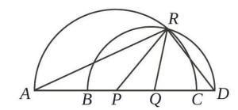

# REFERENCES

- Chris, Yichen Wei, Yi Peng, Xiaokun Wang, Weijie Qiu, Wei Shen, Tianyidan Xie, Jiangbo Pei, Jianhao Zhang, Yunzhuo Hao, Xuchen Song, Yang Liu, and Yahui Zhou. Skywork r1v2: Multimodal hybrid reinforcement learning for reasoning. *arXiv preprint arXiv:2504.16656*, 2025.
- Hanze Dong, Wei Xiong, Bo Pang, Haoxiang Wang, Han Zhao, Yingbo Zhou, Nan Jiang, Doyen Sahoo, Caiming Xiong, and Tong Zhang. Rlhf workflow: From reward modeling to online rlhf. *arXiv preprint arXiv:2405.07863*, 2024.
- Wenxuan Huang, Bohan Jia, Zijie Zhai, Shaosheng Cao, Zheyu Ye, Fei Zhao, Yao Hu, and Shaohui Lin. Vision-r1: Incentivizing reasoning capability in multimodal large language models. *arXiv preprint arXiv:2503.06749*, 2025a.
- Wenxuan Huang, Bohan Jia, Zijie Zhai, Shaosheng Cao, Zheyu Ye, Fei Zhao, Zhe Xu, Yao Hu, and Shaohui Lin. Vision-r1: Incentivizing reasoning capability in multimodal large language models. *arXiv preprint arXiv:2503.06749*, 2025b.
- Zongxia Li, Wenhao Yu, Chengsong Huang, Rui Liu, Zhenwen Liang, Fuxiao Liu, Jingxi Che, Dian Yu, Jordan Boyd-Graber, Haitao Mi, et al. Self-rewarding vision-language model via reasoning decomposition. *arXiv preprint arXiv:2508.19652*, 2025.
- Jiawei Liu et al. Improving multi-step reasoning abilities of large language models via direct advantage policy optimization. *arXiv preprint arXiv:2412.18279*, 2024.
- Xiangyan Liu, Jinjie Ni, Zijian Wu, Chao Du, Longxu Dou, Haonan Wang, Tianyu Pang, and Michael Qizhe Shieh. Noisyrollout: Reinforcing visual reasoning with data augmentation. *arXiv preprint arXiv:2504.13055*, 2025a.
- Zheng Liu et al. Understanding r1-zero-like training: A critical perspective. *arXiv preprint arXiv:2503.20783*, 2025b. Proposes Dr. GRPO.
- Pan Lu et al. Mathvista: Evaluating mathematical reasoning of foundation models in visual contexts. In *International Conference on Learning Representations (ICLR)*, 2024. arXiv:2310.02255.
- Fanqing Meng, Lingxiao Du, Zongkai Liu, Zhixiang Zhou, Quanfeng Lu, Daocheng Fu, Botian Shi, Wenhai Wang, Junjun He, Kaipeng Zhang, Ping Luo, Yu Qiao, Qiaosheng Zhang, and Wenqi Shao. Mm-eureka: Exploring visual aha moment with rule-based large-scale reinforcement learning. *arXiv preprint arXiv:2503.07365*, 2025a.
- Fanqing Meng, Lingxiao Du, Zongkai Liu, Zhixiang Zhou, Quanfeng Lu, Daocheng Fu, Botian Shi, Wenhai Wang, Junjun He, Kaipeng Zhang, et al. Mm-eureka: Exploring visual aha moment with rule-based large-scale reinforcement learning. *CoRR*, 2025b.
- Yifei Peng et al. Lmm-r1: Empowering 3b lmms with strong reasoning via rule-based reinforcement learning. *arXiv preprint arXiv:2503.07536*, 2025.
- John Schulman, Filip Wolski, Prafulla Dhariwal, Alec Radford, and Oleg Klimov. Proximal policy optimization algorithms. *arXiv preprint arXiv:1707.06347*, 2017.
- Zeyuan Shao et al. Deepseekmath: Pushing the limits of mathematical reasoning of open language models. *arXiv preprint arXiv:2402.03300*, 2024. Introduces Group Relative Policy Optimization (GRPO).
- Alex Su, Haozhe Wang, Weimin Ren, Fangzhen Lin, and Wenhu Chen. Pixel reasoner: Incentivizing pixel-space reasoning with curiosity-driven reinforcement learning. *arXiv preprint arXiv:2505.15966*, 2025.

- Huajie Tan, Yuheng Ji, Xiaoshuai Hao, Minglan Lin, Pengwei Wang, Zhongyuan Wang, and Shanghang Zhang. Reason-rft: Reinforcement fine-tuning for visual reasoning. *arXiv preprint arXiv:2503.20752*, 2025.
- Aglaia Tourimpampa, Athanasios Drigas, Alexandra Economou, and Petros Roussos. Perception and text comprehension. it'sa matter of perception! *International Journal of Emerging Technologies in Learning (Online)*, 13(7):228, 2018.
- Zhongwei Wan, Zhihao Dou, Che Liu, Yu Zhang, Dongfei Cui, Qinjian Zhao, Hui Shen, Jing Xiong, Yi Xin, Yifan Jiang, Yangfan He, Mi Zhang, and Shen Yan. Srpo: Enhancing multimodal llm reasoning via reflection-aware reinforcement learning. *arXiv preprint arXiv:2506.01713*, 2025.
- Haozhe Wang, Chao Qu, Zuming Huang, Wei Chu, Fangzhen Lin, and Wenhu Chen. Vlrethinker: Incentivizing self-reflection of vision-language models with reinforcement learning. *arXiv preprint arXiv:2504.08837*, 2025a.
- Zhenhailong Wang, Xuehang Guo, Sofia Stoica, Haiyang Xu, Hongru Wang, Hyeonjeong Ha, Xiusi Chen, Yangyi Chen, Ming Yan, Fei Huang, and Heng Ji. Perception-aware policy optimization for multimodal reasoning. *arXiv preprint arXiv:2507.06448*, 2025b.
- Yana Wei, Liang Zhao, Jianjian Sun, Kangheng Lin, Jisheng Yin, Jingcheng Hu, Yinmin Zhang, En Yu, Haoran Lv, Zejia Weng, et al. Open vision reasoner: Transferring linguistic cognitive behavior for visual reasoning. *arXiv preprint arXiv:2507.05255*, 2025.
- Jiaer Xia, Yuhang Zang, Peng Gao, Yixuan Li, and Kaiyang Zhou. Visionary-r1: Mitigating shortcuts in visual reasoning with reinforcement learning. *arXiv preprint arXiv:2505.14677*, 2025.
- Tong Xiao, Xin Xu, Zhenya Huang, Hongyu Gao, Quan Liu, Qi Liu, and Enhong Chen. Advancing multimodal reasoning capabilities of multimodal large language models via visual perception reward. *arXiv preprint arXiv:2506.07218*, 2025.
- Guowei Xu, Peng Jin, Ziang Wu, Hao Li, Yibing Song, Lichao Sun, and Li Yuan. Llava-cot: Let vision language models reason step-by-step. *arXiv preprint arXiv:2411.10440*, 2024.
- Hao Yao et al. R1-sharevl: Incentivizing reasoning capability of multimodal llms via share-grpo. *arXiv preprint arXiv:2505.16673*, 2025.
- Huanjin Yao, Jiaxing Huang, Wenhao Wu, Jingyi Zhang, Yibo Wang, Shunyu Liu, Yingjie Wang, Yuxin Song, Haocheng Feng, Li Shen, et al. Mulberry: Empowering mllm with o1-like reasoning and reflection via collective monte carlo tree search. *arXiv preprint arXiv:2412.18319*, 2024.
- Y. Yue, Yufeng Yuan, Qiying Yu, Xiaochen Zuo, Ruofei Zhu, Wenyuan Xu, Jiaze Chen, et al. Vapo: Efficient and reliable reinforcement learning for advanced reasoning tasks. *arXiv preprint arXiv:2504.05118*, 2025.
- Jingyi Zhang, Jiaxing Huang, Huanjin Yao, Shunyu Liu, Xikun Zhang, Shijian Lu, and Dacheng Tao. R1-vl: Learning to reason with multimodal large language models via step-wise group relative policy optimization. *arXiv preprint arXiv:2503.12937*, 2025.
- Renrui Zhang, Dongzhi Jiang, Yichi Zhang, Haokun Lin, Ziyu Guo, Pengshuo Qiu, Aojun Zhou, Pan Lu, Kai-Wei Chang, Peng Gao, and Hongsheng Li. Mathverse: Does your multi-modal llm truly see the diagrams in visual math problems? In *European Conference on Computer Vision (ECCV)*, 2024.
- Zhenyi Zheng et al. Deepeyes: Incentivizing "thinking with images" via reinforcement learning. *arXiv preprint arXiv:2505.14362*, 2025.
- Muzhi Zhu, Hao Zhong, Canyu Zhao, Zongze Du, Zheng Huang, Mingyu Liu, Hao Chen, Cheng Zou, Jingdong Chen, Ming Yang, and Chunhua Shen. Active-o3: Empowering multimodal large language models with active perception via grpo. *arXiv preprint arXiv:2505.21457*, 2025.

Figure 2: Verification experimental pipeline: datasets used, perception conditions (visual and textual), model input variants, and evaluation protocol.

Figure 3: Case study comparing Qwen2.5-VL-32B and Qwen2.5-VL-7B on a visual grounding task. The larger model correctly identifies △AOB as a right-angled triangle, while the smaller model mislabels it as isosceles, illustrating the role of model capacity in perception accuracy.

#### **QUESTION:**

In the diagram, points B, P, Q, and C lie on line segment A D. The semi-circle with diameter A C has centre P and the semi-circle with diameter B D has centre Q. The two semi-circles intersect at R. If angle P R Q=40degree, determine the measure of angleA R D.

### **IMAGE:**

#### **MODEL OUTPUTS:**

The diagram is based on a straight line, AD, which contains the points A,B,P,Q,C, and D.

Above this line, there are two semi-circles.

The first semi-circle has a diameter stretching from A to C, and its center is marked as P.The second semi-circle has a diameter from B to D, with its center at Q.

The two semi-circles meet at a single point, R.

Several important triangles are formed by these points: Triangle APR: This is an isosceles triangle because sides PA and PR are both radii of the same semi-circle. In an isosceles triangle, the angles adjacent to

the base are equal, which means ∠PAR=∠APR. Triangle DQR: This is also an isosceles triangle since QD and QR are radii. Therefore, the angles ∠QDR and ∠DQR are equal.

Triangle PRQ: This is the central triangle formed by the points P,R, and Q. The angle at vertex R, which is ∠PRQ, is given to be 40

Triangle ARD: This is the largest triangle in the figure. The angle we are interested in, ∠ARD, is the total angle at vertex R and is formed by adding up the angles ∠ARP, ∠PRQ, and ∠DRQ.

**Qwen2.5VL-7B**

The diagram is constructed on a horizontal line segment, which we can label as AD. Several points, specifically A,B,P,Q,C, and D, are situated collinearly on this line.Two semi-circles are drawn on the same side of the line AD.The first, larger semi-circle is defined by the diameter AC. Its center is the point P, which is the midpoint of AC.The second semi-circle is defined by the diameter BD. Its center is the point Q, which is the midpoint of BD.These two semi-circles intersect at a point R, which is located off the line AD.

This construction forms several key triangles:

Triangle APR: This is an isosceles triangle. The sides PA and PR are both radii of the semi-circle with center P.Consequently, the base angles opposite these sides, ∠PAR and ∠ARP, are equal in measure.Triangle DQR: This is also an isosceles triangle. The sides QD and QR are both radii of the semi-circle with center Q. As a result, the base angles opposite these sides, ∠QDR and ∠DRQ, are equal in measure.Triangle PRQ: This triangle connects the two centers, P and Q, to the intersection point R. The problem states that the angle at the vertex R within this triangle, ∠PRQ, is 40 。Triangle ARD: This is the overarching triangle of interest. The angle ∠ARD at vertex R is composed of three adjacent angles: ∠ARP, ∠PRQ, and ∠DRQ. Therefore, the measure of ∠ARD is the sum of the measures of these three angles.

**Qwen2.5VL-32B**

Figure 4: Caption

#### **QUESTION:**

In triangle ABC, AB = BC = 25 and AC = 30. The circle with diameter BC intersects AB at X and AC at Y. Determine the length of XY.

#### **IMAGE:**

#### **MODEL OUTPUTS:**

The figure depicts an isosceles triangle ABC with legs AB=BC=25 and base AC=30. There is a circle whose diameter is BC, which intersects sides AB and AC at points X and Y, respectively. Because BC is the diameter of the circle, angles formed by connecting the endpoints of the diameter to any point on the circle are right angles, meaning angle BXC = angle BYC = 90 degrees. This implies that the line segment XY is parallel to the base BC, and therefore, the smaller triangle AXY is similar to the larger triangle ABC. To find the length of XY, we need to determine the ratio of similarity. We can start by calculating the length of AX. First, draw the altitude BM from B to side AC. M is the midpoint of AC, so AM = 15, and using the Pythagorean theorem, we find BM = √(25² - 15²) = 20. The area of triangle ABC is 1/2 \* 30 \* 20 = 300. Since triangle ABC is an isosceles triangle, the altitudes to its equal sides are equal, so the length of altitude CX is also 20. In the right-angled triangle BXC, by the Pythagorean theorem, BX = √(BC² - CX²) = √(25² - 20²) = 15. So, AX = AB - BX = 25 - 15 = 10. Based on the similarity, XY / BC = AX / AB. Substituting the values gives XY / 25 = 10 / 25. Solving this gives the length of XY as 10.

> **Without Textual Percep9on**

AB and AC, at points X and Y, respectively. According to the properties of a circle, since BC is the diameter, any angle inscribed in the semicircle is a right angle. Therefore, angles BXC and BYC are both 90 degrees. This means that CX is the altitude from C to side AB, and BY is the altitude from B to side AC. Since the points B, C, Y, and X all lie on the circle, the quadrilateral BCYX is a cyclic quadrilateral. From this, it can be deduced that triangle AXY is similar to triangle ACB. To find the length of XY, we can first calculate the area of triangle ABC. Drop an altitude BM from vertex B to AC. M will be the midpoint of AC, so AM = 15. Using the Pythagorean theorem, the altitude BM = √(25² - 15²) = 20. The area of the triangle is 1/2 \* 30 \* 20 = 300. We can use the area to find the length of altitude CX: 300 = 1/2 \* AB \* CX = 1/2 \* 25 \* CX, which gives CX=24. In the rightangled triangle BXC, using the Pythagorean theorem again, BX = √(BC² - CX²) = √(25² - 24²) = 7. Therefore, AX = AB - BX = 25 - 7 = 18. From the similarity of the triangles, we have the proportion XY / CB = AX / AC, which is XY / 25 = 18 / 30.

Solving this, we find that the length of XY is 15.

This geometric figure shows an isosceles triangle ABC where the equal sides AB and BC are both 25 units long, and the base AC is 30 units long. A specific circle is constructed with side BC as its diameter. This circle intersects the other two sides,

> **With Textual Percep9on**

Figure 5: Caption

