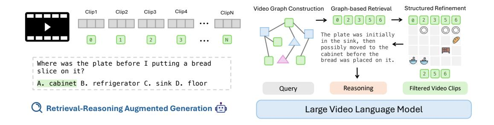

# 1 Introduction

Multi-Modal Large Language Models (MLLMs) [\[6,](#page-10-0) [22,](#page-11-0) [30,](#page-11-1) [39,](#page-11-2) [40,](#page-12-0) [58\]](#page-12-1) have demonstrated remarkable visual understanding and reasoning capabilities, paving the way for advancements in video tasks. Recently, numerous studies have showcased impressive progress in building Large Video Language Models (LVLMs) for video understanding [\[9,](#page-10-1) [7,](#page-10-2) [24,](#page-11-3) [35,](#page-11-4) [55\]](#page-12-2). Moreover, long-video understanding is particularly crucial for applications in web content, life-logging, and streaming media, where intricate narratives and evolving contexts span extended durations.

However, processing and reasoning over long-context videos remain a formidable challenge for existing LVLMs, as representing video frames requires an extensive number of tokens—for example, a 30-minute video can exceed 200K tokens [\[4,](#page-10-3) [22\]](#page-11-0), beyond most models' context limits. To handle longer videos, existing methods resort to sparse frame sampling [\[55,](#page-12-2) [22\]](#page-11-0) or token compression [\[43\]](#page-12-3), but these approaches inevitably lead to visual information loss, weakening fine-grained temporal understanding and coherent reasoning.

Recent studies [\[1,](#page-10-4) [2,](#page-10-5) [12,](#page-10-6) [34,](#page-11-5) [52,](#page-12-4) [53\]](#page-12-5) utilize Retrieval-Augmented Generation (RAG) [\[21\]](#page-11-6) to enhance long-form video understanding by retrieving relevant information. However, they encounter certain limitations. First, some works segment lengthy videos into shorter clips, treating each as an individual document for retrieval [\[2\]](#page-10-5), which disrupts the continuity of entities and temporal dependencies,

Figure 1: Overview of our graph-based retrieval-reasoning-augmented generation framework. Each video clip is represented as a node within a graph, interconnected through shared entities. This graph representation enables effective retrieval of relevant clips based on node connections, followed by an intermediate reasoning step to refine retrievals and aggregate over multimodal context for accurate generation.

leading to retrieval inaccuracies. Second, some methods [\[47,](#page-12-6) [34\]](#page-11-5) rely on proprietary LLMs like GPT-4 [\[37\]](#page-11-7) for multi-turn interactions, planning, and reasoning, making them costly and less flexible. Lastly, several approaches [\[47,](#page-12-6) [33\]](#page-11-8) extract information from sparse key frames, neglecting temporal coherence in long videos.

Graph representation for enhanced retrieval: To address the limitation of existing RAG methods, we propose a structured graph-based representation, where video clips are modeled as nodes interconnected by recurring subjects or scenes. This graph representation not only enables effectively retrieving nodes associated with specific entities, but also facilitates capturing temporal dependencies spanning over lengthy videos. Another advantage is that the graph construction is performed offline and is query-independent. Once the graph is built, it can be reused for multiple questions on the same video, allowing retrieval to operate directly on the graph without reprocessing the video. However, feeding all retrieved clips into LLMs can cause information overload, where key details are diluted by irrelevant content [\[14\]](#page-10-7). In videos, the issue is further amplified, as each frame consumes hundreds of tokens, with irrelevant information overshadowing the critical content.

Structured post-retrieval reasoning: To address the aforementioned issue and fully harness the benefits from our GraphRAG, we introduce the structured reasoning step in the post-retrieval stage. Instead of generating answers directly from the retrieved clips, it decomposes the question and systematically verifies the relevance of each clip. As shown in Figure [1,](#page-1-0) this process refines the retrieved set by identifying clips that mention critical elements—such as the plate, sink, cabinet, and bread—and then aggregates information across them for temporal reasoning (e.g., the plate moving from the sink to the cabinet). This process mitigates noise, facilitates information aggregation across refined clips, and thus creates a more reliable pathway for producing accurate responses.

We evaluate our framework upon seven different LVLMs with sizes ranging from 2B to 7B across three long-video benchmarks: MLVU [\[57\]](#page-12-7), VideoMME [\[13\]](#page-10-8) and LongVideoBench [\[50\]](#page-12-8). Experimental results demonstrate that our framework consistently improves the performance of existing LVLMs by 3.0%–5.4%. We further show that our framework surpasses existing RAG-based video understanding works by 8.6%.

Contribution. Our contribution is summarized as follows:

- We developed a novel *graph-based RAG* framework for long-video understanding, where video clips are represented as nodes within a graph, interconnected through shared entities, thereby preserving semantic relationships and temporal dependencies across clips, facilitating more effective retrieval.
- We propose *structured reasoning* to tackle the limited reasoning ability of LVLMs, which can be distracted by hard negative retrieved samples. Our approach introduces an intermediate reasoning step for retrieval verification and aggregates information across verified clips to enhance generation accuracy.

• Our graph-based retrieval-reasoning-augmented framework demonstrates 3.0%–5.4% improvements over various LVLMs ranging from 2B to 7B and surpasses existing RAG-based video understanding works by 8.6% in long-video understanding tasks.

