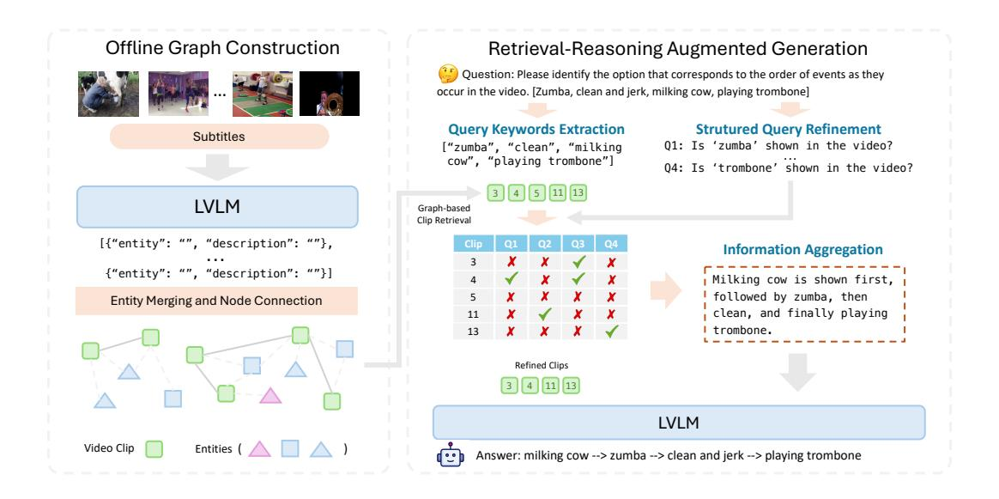

# 3 Method

We introduce a novel, training-free framework, Vgent, for long-context video understanding. Unlike conventional Retrieval-Augmented Generation (RAG), our pipeline proposes a graph-based retrieval-reasoning-augmented generation paradigm, specifically designed to address complex video scenarios with improved contextual comprehension and structured reasoning. As illustrated in Figure [2,](#page-3-0) our proposed pipeline contains four stages: (1) Offline video graph construction (Section [3.1\)](#page-3-1): Builds a video graph offline by extracting knowledge from long videos. (2) Graph-based

Figure 2: Pipeline of **Vgent**, a novel framework for long-context video understanding in the proposed graph-based retrieval-reasoning-augmented generation paradigm. It consists of four key stages: (1) Offline video graph construction (Section 3.1): Builds a video graph by extracting knowledge from long videos. (2) Graph-based retrieval (Section 3.2): Retrieves relevant clips based on keywords extracted from the user query. (3) Structured reasoning (Section 3.3): Refines clips using structured queries and aggregates information. (4) Multimodal augmented generation (Section 3.4): Combines refined clips and reasoning results to generate the final response.

retrieval (Section 3.2): Retrieves relevant video clips from graph based on the user query. (3) Structured Reasoning (Section 3.3): Refines the retrieved clips using structured queries and aggregates information across the filtered clips. (4) Multimodal Augmented Generation (Section 3.4): Combines refined clips and intermediate reasoning results to generate the final response.

#### 3.1 Video Graph Construction

To better capture the complex relationships and dependencies in long-context videos, we propose a graph-based representation to store video content and enhance semantic connections. Specifically, given a video V with F frames, we first partition it into a sequence of short video clips  $\{V_1, V_2, \ldots, V_{\lceil \frac{F}{K} \rceil}\}$ , where each video clip  $V_i$  consists of K frames. We then dynamically construct the graph by a series of structured steps, as detailed below.

**Visual Entity Extraction.** For each video clip, we leverage the LVLM to extract the key semantic entities (i.e., the primary subjects, actions, or scenes) from both the spoken content (subtitles)  $C_i$  and video clip  $V_i$ .

$$\{(e_1^i, t_1^i), (e_2^i, t_2^i), \ldots\} \leftarrow \texttt{LVLM}(C_i, V_i), \tag{1}$$

where the set of entity is denoted as  $E_i = \{e_i^1, e_i^2, \dots\}$  and its corresponding description set is denoted as  $T_i = \{t_i^1, t_i^2, \dots\}$ . In this step, the LVLM captures subjects, actions, and scene dynamics, seamlessly linking visual entities with spoken content to extract meaningful knowledge. Please refer to Appendix B.1 for illustrative examples.

**Graph Construction.** Based on extracted information, we construct a video knowledge graph  $\mathcal{G}=(\mathcal{V},\mathcal{E})$ , where  $\mathcal{V}$  denotes the nodes set representing video clips, and edges in  $\mathcal{E}$  represents the connectivity between nodes. Additionally, we define a global set of unique prototype entities  $\mathcal{U}=\{u\in E_i, i=1,\ldots, \lceil \frac{F}{K}\rceil\}$  that spans across all nodes. As more video clips are processed, we will dynamically add newly extracted unique entity u to the set or link it to an existing entity. We define  $t^u$  as the description of each entity  $u\in\mathcal{U}$ .

Entity Merging and Node Connection. Since LVLMs process video clips independently, it is essential to identify and unify semantically equivalent entities across clips. Given a newly extracted entity-description pair  $(e_i^j, t_i^j)$  from video clip  $V_i$ , we determine whether it belongs to an existing entity in the global entity set  $\mathcal{U}$ . Specifically, we compute the similarity score between the textual descriptions  $t_j^i$  and descriptions of entities in  $\mathcal{U}$  based on their respective text embeddings. If the similarity score  $> \tau$ , the entity  $e_j^i$  is considered semantically equivalent to an existing entity and these two are merged into a single entity representation. Otherwise,  $e_j^i$  is treated as a distinct entity and added to  $\mathcal{U}$ . This process is formulated as follows:

$$s^* = \max_{u \in \mathcal{U}} sim(t_j^i, t), \quad u^* = \arg\max_{u \in \mathcal{U}} sim(t_j^i, t^u), \quad e_j^i \to \begin{cases} u^*, & \text{if } s^* \ge \tau \\ \mathcal{U} \leftarrow \mathcal{U} \cup \{e_j^i\}, & \text{otherwise} \end{cases} \tag{2}$$

Once entity is merged, we then build edges from the node  $v_i$  associated with the video clip  $V_i$  to all the nodes that have the same entity  $u^*$ , denoted as  $\mathcal{V}^{(u^*)}$ .

$$\mathcal{E} \leftarrow \mathcal{E} \cup \{ (v_i, v) \mid v \in \mathcal{V}^{(u^*)} \}$$
 (3)

As new video clips are processed, the graph is dynamically updated such that nodes containing the same entity are connected, which preserves semantic relationships and contextual dependencies. This forms a structured representation that facilitates effective video retrieval in subsequent processing stages.

#### 3.2 Graph-based Retrieval

**Keywords Extraction.** Direct retrieval based on the original query may not provide sufficient context, especially when reasoning across multiple temporal clips is required. To address this, we extract keywords from the query for effective retrieval. Specifically, we prompt the LVLM to identify key semantic elements, denoted as  $\mathcal{K}$ , from the query Q. The detailed prompt is provided in Appendix B.2.

**Graph-based Clip Retrieval.** Next, we leverage these extracted keywords for graph-based retrieval. Specifically, for each keyword  $k \in \mathcal{K}$  and each entity  $u \in \mathcal{U}$ , we compute a similarity score  $sim(k,t^u)$  to determine whether the entity matches the keyword. If  $sim(k,t^u) > \theta$ , we include all nodes associated with entity u as the target retrieval node set  $\mathcal{R}$ :

$$\mathcal{R} = \bigcup_{u \in \mathcal{U}, k \in \mathcal{K}} \{ v \in \mathcal{V} \mid u \in \mathcal{U}(v), sim(k, t^u) > \theta \}$$
 (4)

After obtaining the retrieval node set  $\mathcal{R}$ , we refine the results by re-ranking the nodes based on the similarity between the query's keywords and the extracted information of each node, including entities, corresponding textual descriptions, and subtitles if available. Finally, we select the Top-N nodes with the highest average similarity scores across all associated information of each video clip.

#### 3.3 Structured Reasoning

Feeding all relevant clips directly into LLMs can lead to information overload, diluting the focus on key details with irrelevant content [14]. Our empirical analysis also reveals that in roughly 40% of failure cases, the correct clip is successfully retrieved, yet the model still generates incorrect responses—even though it can answer correctly when provided with that clip alone. We then introduce structured reasoning in the post-retrieval stage that refines the retrieved clips and aggregates useful information towards final generation.

**Structured Query Refinement.** We introduce the divide-and-conquer strategy to refine the retrieval through structured query verification. Specifically, we prompt the LVLM to generate structured subqueries, denoted as Q, based on the original query Q and extracted keywords K. These subqueries focus on verifying the presence of relevant entities or quantifying their occurrences, whose answers are expected to be binary (yes/no) or numerical value. Please refer to Appendix B.3 for the detailed prompt and Figure 3 for an example of generated subqueries.

After generating the subqueries, we process the Top-N retrieved video clips using the LVLM, producing either binary (yes/no) or numerical responses for each subquery. As shown in Figure [2,](#page-3-0) this structured verification systematically assesses the relevance of each clip to the original query, filtering out irrelevant clips that were wrongly retrieved based on semantic embedding similarity. Denoting 1 to yes and 0 to no in binary questions, this refined clip set R′ can be formulated as:

$$\mathcal{R}' = \{ v_i \in \mathcal{R} \mid \exists q_j \in \mathcal{Q}, f(v_i, q_j) > 0 \}$$
 (5)

where f(vi , qj ) denotes the response of retrieved clip vi to subquery qj . We keep at most r clips after refinement. This refinement step ensures that only video clips satisfying the structured queries are retained, effectively eliminating hard negatives from the initial retrieval.

Information Aggregation. As shown in Figure [2,](#page-3-0) we then let LVLM aggregate and summarize all useful information from structured queries and their corresponding results for each video clip, providing an enriched auxiliary context that enhances the final inference.

#### 3.4 Multimodal Augmented Generation.

We incorporate both the intermediate reasoning results and the filtered video clips as multimodal context inputs to the LVLM for the final response. This enriched input allows the model to leverage both structured reasoning and relevant visual information, enabling it to generate a more accurate and contextually grounded final response to the original question.

