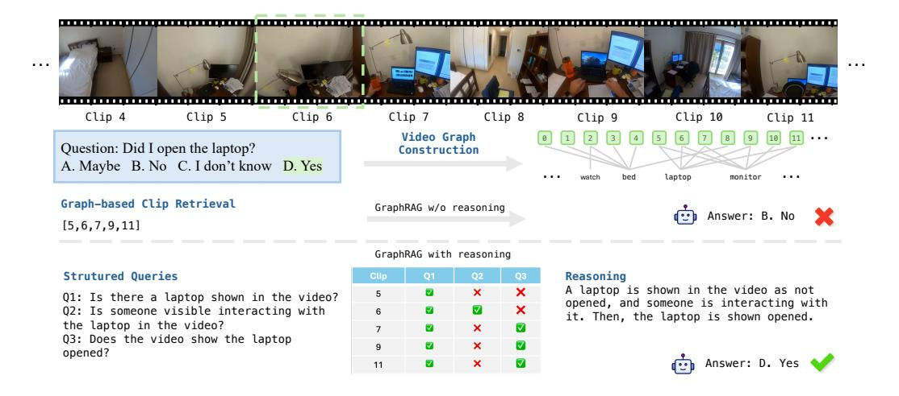

# 4 Experiments

#### 4.1 Experimental Setups

Baselines. We apply our framework Vgent on open-sourced LVLMs including InternVL2.5 [\[8\]](#page-10-15), Qwen2 [\[46\]](#page-12-14), Qwen2.5-VL [\[4\]](#page-10-3), LongVU [\[43\]](#page-12-3) and LLaVA-Video [\[56\]](#page-12-15) as base video understanding model. We further compare Vgent against state-of-the-art RAG baselines as follows: NaïveRAG [\[3\]](#page-10-14), Video-RAG [\[33\]](#page-11-8), and proprietary LLM-based methods including VideoAgent [\[47\]](#page-12-6), LLoVi [\[52\]](#page-12-4), DrVideo [\[34\]](#page-11-5) and VideoTree [\[49\]](#page-12-11). More details can be found in Appendix [A.3.](#page-21-0)

Benchmarks. We evaluate the performances of each model across three long-video benchmarks. Video-MME [\[13\]](#page-10-8) is a widely used benchmark designed to evaluate LVLMs' capability to process detailed, real-world videos. It comprises three subsets categorized by video length, ranging from 11 seconds to 1 hour. MLVU [\[57\]](#page-12-7) is a long-video understanding benchmark with videos ranging from 3 minutes to 2 hours, with an average length of about 12 minutes. LongVideoBench (LVB) [\[50\]](#page-12-8) focuses on referred reasoning tasks that require models to analyze long frame sequences. These questions depend on extensive temporal context and cannot be effectively addressed using a single frame or a small set of sparsely sampled frames.

Implementation Details. During the offline video graph construction, we sample videos at 1.0 FPS, segmenting the long video into clips, each containing K = 64 frames. We use the BAAI/bge-large-en-v1.5 [\[51\]](#page-12-16) embedding for similarity calculation. The entity merging threshold is set to τ = 0.7. In the online retrieval stage, we use BAAI/bge-large-en-v1.5 to retrieve the top N = 20 clips based on extracted keywords (maximum to 20 to discard low-relevance, with a similarity threshold θ = 0.5). After structured query refinement, we retain a maximum of r = 5 clips. Thresholds are set as the same for all three benchmarks, with hyper-parameter selection details provided in the supplementary. For MLVU [\[57\]](#page-12-7), we extract spoken content using openai/whisper-large, while for VideoMME [\[13\]](#page-10-8) and LongVideoBench [\[50\]](#page-12-8), we use the provided subtitles from benchmark. All experiments are conducted on A100 80G GPUs.

### 4.2 Main Results

Comparison with LVLMs. In Table [1](#page-6-0) and [6,](#page-20-0) we present the performance of our proposed Vgent framework on the MLVU [\[57\]](#page-12-7) benchmark, where we consistently observe substantial improvements across all models. Specifically, our framework enhances LongVU [\[43\]](#page-12-3) by 5.4% and boosts Qwen2.5VL [\[4\]](#page-10-3) (7B) by 3.3%. Notably, when applied to Qwen2.5VL (3B), Vgent achieves

Table 1: Performance comparison with LVLMs. Vgent consistently improves all models on MLVU [\[57\]](#page-12-7), enhancing LongVU by 5.4% and Qwen2.5VL (7B) by 3.3%. Notably, Vgent achieves 70.4% accuracy on Qwen2.5VL (3B), surpassing its 7B counterpart and improving the base model by 4.2%. Vgent outperforms base models across all video lengths on VideoMME [\[13\]](#page-10-8) achieving improvement of 3.2% overall.

|                            |                   |          | VideoMME |          |          |  |  |
|----------------------------|-------------------|----------|----------|----------|----------|--|--|
| Models                     | Size              | MLVU     | w/o sub. | w/ sub.  | LVB      |  |  |
|                            | Proprietary LVLMs |          |          |          |          |  |  |
| Gemini 1.5 Pro [16]        | -                 | -        | 75.0     | 81.3     | 64.0     |  |  |
| GPT-4o [38]                | -                 | 64.6     | 71.9     | 77.2     | 66.7     |  |  |
|                            | Open-Source LVLMs |          |          |          |          |  |  |
| InternVL2.5 [8]            | 2B                | 56.7     | 49.5     | 55.2     | 52.0     |  |  |
| InternVL2.5 + Vgent (Ours) | 2B                | 61.1+4.4 | 50.9+1.4 | 56.8+1.6 | 54.8+2.8 |  |  |
| Qwen2.5-VL [4]             | 3B                | 66.2     | 61.4     | 67.6     | 54.2     |  |  |
| Qwen2.5-VL + Vgent (Ours)  | 3B                | 70.4+4.2 | 63.0+1.6 | 69.6+2.0 | 57.8+3.6 |  |  |
| LongVU [54]                | 7B                | 65.4     | 55.2     | 60.9     | 50.2     |  |  |
| LongVU + Vgent (Ours)      | 7B                | 70.8+5.4 | 57.3+2.1 | 63.7+2.8 | 52.7+2.5 |  |  |
| Qwen2-VL [46]              | 7B                | 65.7     | 62.7     | 68.1     | 55.6     |  |  |
| Qwen2-VL + Vgent (Ours)    | 7B                | 70.3+4.6 | 63.5+0.8 | 70.1+2.0 | 58.4+2.8 |  |  |
| LLaVA-Video [56]           | 7B                | 69.5     | 64.3     | 69.2     | 59.5     |  |  |
| LLaVA-Video + Vgent (Ours) | 7B                | 72.5+3.0 | 66.7+2.4 | 71.1+1.9 | 62.4+2.9 |  |  |
| Qwen2.5-VL [4]             | 7B                | 68.8     | 65.1     | 71.1     | 56.0     |  |  |
| Qwen2.5-VL + Vgent (Ours)  | 7B                | 72.1+3.3 | 68.9+3.8 | 74.3+3.2 | 59.7+3.7 |  |  |

an accuracy of 70.4%, surpassing its larger 7B counterpart and improving the base model by 4.2%. This result underscores the effectiveness of our approach in bridging the performance gap between small models and their larger counterparts. At the category level (Table [6\)](#page-20-0), our framework notably improves Count and Order tasks, which demand event-level understanding and multi-clips reasoning.

In Table [1,](#page-6-0) we showcase the results of Vgent on the VideoMME [\[13\]](#page-10-8) benchmark, where it consistently outperforms base models across all video lengths, achieving an average performance gain of 4.2%. Notably, our framework excels in long-video scenarios, surpassing the best baseline by 5.4%. These findings highlight the strength of our structured graph-based retrieval and reasoning approach, demonstrating its ability to enhance long-video comprehension by effectively capturing cross-segment dependencies and refining information retrieval for improved reasoning and final response generation.

Comparison with SoTA RAG Methods. In Table [2,](#page-7-0) we provide a comprehensive comparison of Vgent against state-of-the-art RAG methods on MLVU [\[57\]](#page-12-7) and VideoMME [\[13\]](#page-10-8) benchmarks.

- (1) Our framework consistently outperforms the RAG baseline, Video-RAG [\[33\]](#page-11-8), across three different LVLM base models. Unlike Video-RAG [\[33\]](#page-11-8), which relies on CLIP [\[41\]](#page-12-18)-based keyframe selection and external tools such as object detection and OCR for frame-level information extraction, Vgent eliminates these dependencies by leveraging LVLMs themselves for graph construction, verification, and intermediate reasoning. This structured approach significantly enhances retrieval precision and reasoning accuracy, leading to more reliable final responses.
- (2) Our framework also surpasses proprietary RAG-based methods for long-video understanding. Compared to closed-source API-dependent methods which heavily rely on closed-source APIs, our framework is more flexible and effective solution for long-video understanding.

Table 2: RAG methods comparison. † denotes results are sourced from [\[34\]](#page-11-5). Proprietary LVLMs refer to methods that rely on closed-source APIs. We include them here for reference only, as our primary focus is on building a self-contained pipeline to improve open-source LVLMs.

|                              |      |      | VideoMME |         |  |  |  |  |  |
|------------------------------|------|------|----------|---------|--|--|--|--|--|
| Models                       | Size | MLVU | w/o sub. | w/ sub. |  |  |  |  |  |
| Proprietary LVLMs            |      |      |          |         |  |  |  |  |  |
| VideoAgent† [47]          | -    | -    | -        | 44.4    |  |  |  |  |  |
| LLoVi† [52]               | -    | -    | -        | 67.7    |  |  |  |  |  |
| DrVideo† [34]             | -    | -    | -        | 71.7    |  |  |  |  |  |
| Open-Source LVLMs            |      |      |          |         |  |  |  |  |  |
| Qwen2.5-VL + Video-RAG [33]  | 3B   | 62.2 | 60.3     | 65.1    |  |  |  |  |  |
| Qwen2.5-VL + Vgent (Ours)    | 3B   | 70.4 | 63.0     | 69.6    |  |  |  |  |  |
| LLaVA-Video + Video-RAG [33] | 7B   | 71.3 | 64.8     | 70.0    |  |  |  |  |  |
| LLaVA-Video + Vgent (Ours)   | 7B   | 72.5 | 66.7     | 71.1    |  |  |  |  |  |
| Qwen2.5-VL + Video-RAG [33]  | 7B   | 63.4 | 60.5     | 65.7    |  |  |  |  |  |
| Qwen2.5-VL + Vgent (Ours)    | 7B   | 72.1 | 68.9     | 74.3    |  |  |  |  |  |

Table 3: Ablation study results of the performance improvement contributed by each component of our proposed pipeline. SR denotes our proposed structured reasoning.

| Models                               | MLVU | VideoMME | LongVideoBench |
|--------------------------------------|------|----------|----------------|
| Qwen2.5-VL [4]                       | 68.8 | 71.1     | 56.0           |
| Qwen2.5-VL + NaïveRAG                | 65.4 | 68.3     | 56.2           |
| Qwen2.5-VL + GraphRAG                | 69.5 | 72.7     | 57.1           |
| Qwen2.5-VL + NaïveRAG + SR           | 68.6 | 69.8     | 57.3           |
| Qwen2.5-VL + GraphRAG + SR (default) | 72.1 | 74.3     | 59.7           |

### 4.3 Ablation Studies

NaïveRAG vs GraphRAG. As shown in Table [3,](#page-7-1) integrating GraphRAG yields an average improvement of 2.9% over NaïveRAG, with a particularly notable 4.1% gain on MLVU [\[57\]](#page-12-7). This is because NaïveRAG's difficulty in handling complex queries that requires temporal reasoning across multiple clips, as it treats each video clip as an independent document. In contrast, our GraphRAG effectively preserves semantic relationships between clips, enabling more accurate retrieval and reasoning. By structuring video content into a graph representation, our approach addresses retrieval inconsistencies inherent in traditional RAG methods.

However, the improvement remains marginal compared to the base models. Upon checking failure cases in MLVU, we observe that in 44% of the failures, the correct clip is actually present within the model's retrieved set, which indicates that while the retrieval was successful, irrelevant retrievals still distract the model, hindering accurate responses. Consequently, a post-retrieval stage is necessary to amplify the potential of our GraphRAG by refining the retrieved nodes and improving reasoning towards more precise answers.

Structured Reasoning (SR). By refining retrieved nodes through intermediate reasoning with structured queries, we achieve an additional 2.6% improvement on MLVU [\[57\]](#page-12-7) and 1.6% on VideoMME [\[13\]](#page-10-8), resulting in an overall 3.4% average gain over the base model. This intermediate reasoning step decomposes complex queries into targeted sub-questions and generates binary or numerical answers. These structured response are then used to systematically filter out irrelevant clips and aggregate relevant information across clips, guiding the model toward the correct final answer. Our findings also indicate that the final improvement is contingent upon Graph-based RAG. Specifically, if SR is applied to NaïveRAG, the inherent inaccuracy of NaïveRAG's retrievals restricts the potential for significant improvement through refinement alone.

Number of retrieval r We conduct an ablation study to examine the impact of the number of retrieved clips after structured query refinement. Table [4](#page-8-0) presents both the overall performance and results across several MLVU [\[57\]](#page-12-7) subcategories. Among these, Count and Order are two tasks that heavily require reasoning across multiple video clips. Count involves identifying the number of events or actions throughout an entire video, while Order requires the model to arrange multiple events in chronological sequence. r represents the maximum number of video clips retained after refinement. Our findings indicate that increasing the number of retrieved clips consistently improves performance, particularly for tasks demanding multi-clip reasoning, with the highest performance observed at r = 5.

Table 4: The number of retrieved clips impacts performance on MLVU [\[57\]](#page-12-7).

| #Retrieval    | Count | Ego  | Needle | Order | PlotQA | Anomaly | Topic | Overall |
|---------------|-------|------|--------|-------|--------|---------|-------|---------|
| r=1           | 25.7  | 54.2 | 75.7   | 51.7  | 67.4   | 71.0    | 84.3  | 63.2    |
| r=2           | 40.2  | 55.6 | 78.0   | 57.1  | 69.1   | 73.5    | 87.0  | 66.9    |
| r=3           | 47.5  | 57.1 | 78.0   | 61.0  | 70.0   | 71.5    | 87.2  | 68.4    |
| r=4           | 58.7  | 56.6 | 78.8   | 65.2  | 73.6   | 72.5    | 87.6  | 71.0    |
| r=5 (default) | 58.7  | 59.5 | 79.7   | 67.1  | 74.6   | 74.0    | 88.0  | 72.1    |
| r=6           | 58.7  | 58.4 | 78.8   | 67.2  | 73.9   | 73.5    | 87.4  | 71.9    |

Further details, including category-level performance on MLVU [\(A.1\)](#page-20-1), limitations [\(D\)](#page-25-0), ablation studies on the number of retrievals N [\(A.5\)](#page-21-1), confidence-based refinement [\(A.2\)](#page-20-2), retrieval threshold τ [\(A.6\)](#page-21-2) are provided in the Appendix.

Table 5: Inference time analysis. Since processing time depends on the video duration, we report the normalized time required to process each minute of video.

| Model / Time (sec)                                                          | Query Independent (offline) | Query Dependent (online) |
|-----------------------------------------------------------------------------|--------------------------------|-----------------------------|
| #Proprietary LVLMs VideoAgent [47]                                       | N/A                            | 67.25                       |
| #Open-Source LVLMs Qwen2.5VL-7B [4] +Video-RAG [33] + Vgent (Ours) | N/A N/A 20.13            | 2.95 20.81 3.93       |

#### 4.4 Inference Time Analysis

We analyze the computational trade-offs and report the processing times in Table [5](#page-8-1) for the APIbased method VideoAgent [\[47\]](#page-12-6), Video-RAG [\[33\]](#page-11-8) as well as our framework built on Qwen2.5VL [\[4\]](#page-10-3). VideoAgent [\[47\]](#page-12-6) leverages a proprietary LLM (GPT-4 [\[36\]](#page-11-20)) to iteratively perform self-reflection for frame selection and aggregating key information from the video. Video-RAG [\[33\]](#page-11-8) relies on querydependent key frame selection and per-frame object detection, introducing online computational overhead. In contrast, our framework can offline constructs a query-independent graph from the video, which takes 20.13 seconds. Once the graph is built, the online retrieval, reasoning and generation process requires only 3.93 seconds per minute-video.

Our offline graph construction further improves efficiency in multi-question scenarios (e.g., three questions per video in VideoMME [\[13\]](#page-10-8)). Unlike query-dependent methods that reprocess the entire

Figure 3: A qualitative example illustrates our graph-based retrieval-reasoning approach, which connects relevant video clips via shared entities. While the model initially fails to correctly identify the action of opening the laptop, misled by hallucinations from hard negatives. However, adding an intermediate reasoning step that validates each retrieved node through structured subqueries enables the model to generate the accurate response.

video for each question, our approach constructs the graph once, allowing the model to retrieve relevant clips based on entity descriptions—without the need to rewatch the entire video. As a result, our method achieves a 1.73× speedup over Video-RAG [33] when performing inference on VideoMME [13].

#### 4.5 Qualitative Examples

We show a qualitative example in Figure 3, 5 and 6. Our graph construction effectively connects relevant video clips through shared entities. In Figure 3 the graph-based retrieval system can identify relevant nodes that contains a laptop, with Clip 6 providing crucial evidence to answer the query. However, the model incorrectly responded "No" to the question "Did I open the laptop?", presumably due to hard negatives from multiple clips featuring a opened laptop, hallucinating the model to overlook the closed laptop and the action of opening it.

In contrast, with an intermediate reasoning step, we validate each retrieved node with structured subqueries (e.g., "Is there a laptop open?" "Is someone interacting with the laptop?"). This verified information is aggregated to form an enhanced reasoning chain, allowing the model to correctly infer that the laptop was opened, overcoming the distraction from hard negatives.

#### 5 Conclusion

In this work, we introduced a novel graph-based Retrieval-Augmented Generation (RAG) framework designed for long-video understanding. Our approach represents video clips as nodes in a graph and leverages entities to maintain semantic relationships, thereby enhancing retrieval effectiveness. To address retrieval noise, we proposed a structured query refinement strategy that systematically filters out irrelevant clips, ensuring a more precise selection of relevant video content. Additionally, we introduced an intermediate reasoning step that summarizes the response to the structured query, using the filtered retrieved clips as multimodal context to significantly improve the accuracy of the final answer generation. Our framework outperforms state-of-the-art video RAG methods by 8.6%, demonstrating its effectiveness in enhancing long-video understanding tasks. This work paves the way for more accurate and context-aware long-form video retrieval and reasoning systems.

