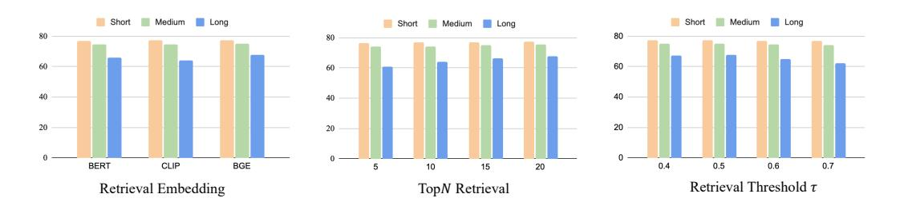
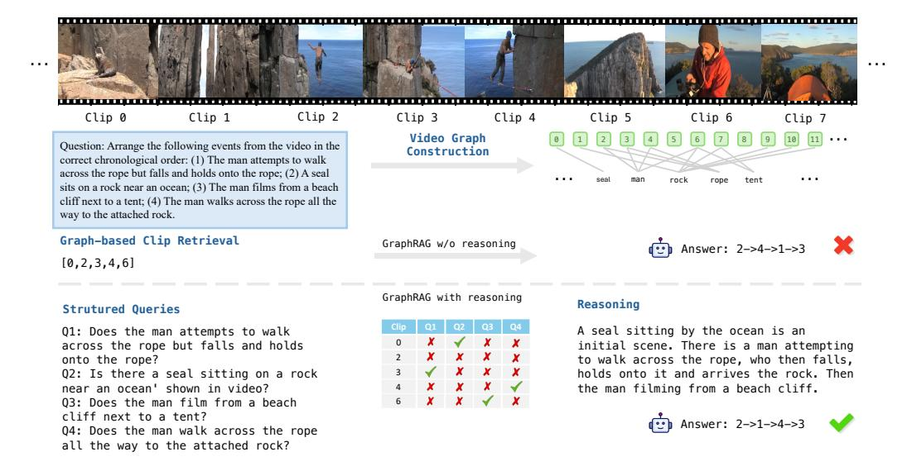
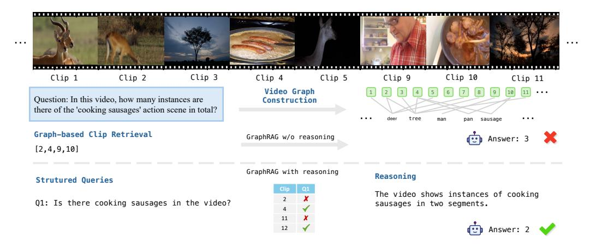

# A Experiments

### A.1 Category-level performance on MLVU

Table [6](#page-20-0) shows performance on the multiple-choice task of MLVU [\[57\]](#page-12-7). Our framework consistently improves all models, enhancing LongVU by 5.4% and Qwen2.5VL (7B) by 3.3%. Notably, Vgent achieves 70.4% accuracy on Qwen2.5VL (3B), surpassing its 7B counterpart and improving the base model by 4.2%. Significant gains are observed in Count and Order tasks, highlighting the effectiveness of our approach in cross-segment reasoning and long-video understanding.

Table 6: Category-level performance on MLVU [\[57\]](#page-12-7). Our framework consistently improves all models, enhancing LongVU by 5.4% and Qwen2.5VL (7B) by 3.3%. Notably, Vgent achieves 70.4% accuracy on Qwen2.5VL (3B), surpassing its 7B counterpart and improving the base model by 4.2%. Significant gains are observed in Count and Order tasks, highlighting the effectiveness of our approach in cross-segment reasoning and long-video understanding.

| Model                      | Size              | Count | Ego  | Needle | Order | PlotQA | Anomaly | Topic | Overall  |
|----------------------------|-------------------|-------|------|--------|-------|--------|---------|-------|----------|
| Proprietary LVLMs          |                   |       |      |        |       |        |         |       |          |
| GPT-4o                     | -                 | 46.3  | 57.1 | 64.8   | 56.7  | 65.1   | 74.5    | 87.4  | 64.6     |
|                            | Open-Source LVLMs |       |      |        |       |        |         |       |          |
| InternVL2.5 [8]            | 2B                | 34.9  | 50.4 | 61.6   | 34.7  | 62.8   | 61.5    | 81.5  | 56.7     |
| InternVL2.5 + Vgent (Ours) | 2B                | 59.2  | 53.1 | 66.7   | 38.2  | 63.9   | 62.0    | 81.1  | 61.1+4.4 |
| Qwen2-VL [46]              | 2B                | 30.1  | 56.0 | 72.3   | 32.8  | 65.3   | 55.5    | 80.4  | 58.6     |
| Qwen2-VL + Vgent (Ours)    | 2B                | 58.7  | 57.6 | 76.9   | 34.3  | 63.8   | 59.5    | 80.3  | 62.5+3.9 |
| Qwen2.5-VL [4]             | 3B                | 36.4  | 53.0 | 77.7   | 55.5  | 70.1   | 75.5    | 86.4  | 66.2     |
| Qwen2.5-VL + Vgent (Ours)  | 3B                | 60.1  | 58.1 | 78.5   | 61.7  | 70.5   | 74.5    | 87.3  | 70.4+4.2 |
| LongVU [54]                | 7B                | 28.9  | 59.3 | 76.3   | 58.3  | 71.6   | 76.0    | 87.5  | 65.4     |
| LongVU + Vgent (Ours)      | 7B                | 60.0  | 62.3 | 76.5   | 60.1  | 71.6   | 76.4    | 87.8  | 70.8+5.4 |
| Qwen2-VL [46]              | 7B                | 32.5  | 62.0 | 79.1   | 53.2  | 69.6   | 63.0    | 85.3  | 65.7     |
| Qwen2-VL + Vgent (Ours)    | 7B                | 60.2  | 65.8 | 80.2   | 60.2  | 70.6   | 63.5    | 86.1  | 70.3+4.6 |
| LLaVA-Video [56]           | 7B                | 42.2  | 61.5 | 76.3   | 61.0  | 75.8   | 72.0    | 85.3  | 69.5     |
| LLaVA-Video + Vgent (Ours) | 7B                | 58.7  | 63.0 | 76.9   | 67.1  | 76.4   | 72.5    | 86.9  | 72.5+3.0 |
| Qwen2.5-VL [4]             | 7B                | 41.7  | 58.1 | 78.0   | 61.0  | 73.6   | 72.5    | 87.4  | 68.8     |
| Qwen2.5-VL + Vgent (Ours)  | 7B                | 58.7  | 59.5 | 79.7   | 67.1  | 74.6   | 74.0    | 88.1  | 72.1+3.3 |

### A.2 Confidence-based Refinement

A straightforward solution is to filter out the hard negative retrievals by their relevance scores. Initially, we experimented with confidence-based refinement, as used in VideoAgent [\[47\]](#page-12-6), where the model self-reflect the relevance of retrieved nodes. However, this approach proved ineffective in our case, as the confidence score failed to reliably reflect video clip relevance, leading to an average improvement of only 0.2%, as shown in Table [7.](#page-20-3)

Table 7: Ablation study results of the performance improvement contributed by each component of our proposed pipeline. CR denotes confidence-based reasoning and SR is our proposed structured reasoning.

| Models                               | MLVU | VideoMME | LongVideoBench |
|--------------------------------------|------|----------|----------------|
| Qwen2.5-VL [4]                       | 68.8 | 71.1     | 56.0           |
| Qwen2.5-VL + GraphRAG + CR           | 69.5 | 72.9     | 57.5           |
| Qwen2.5-VL + GraphRAG + SR (default) | 72.1 | 74.3     | 59.7           |

#### A.3 Baseline Details

NaïveRAG: Following GoldFish [\[3\]](#page-10-14), we construct a NaïveRAG baseline for video understanding by representing each video clip as plain text and retrieving relevant clips based on similarity to the query.

Video-RAG: [\[33\]](#page-11-8): This method selects keyframes by evaluating CLIP similarity between each frame's features and the text embeddings of keywords extracted from the question. Additionally, an object detection model and an Optical Character Recognition (OCR) model are applied to each keyframe to extract detailed information.

Proprietary LLM-based: VideoAgent [\[47\]](#page-12-6), LLoVi [\[52\]](#page-12-4), DrVideo [\[34\]](#page-11-5) and VideoTree [\[49\]](#page-12-11) utilizes interactive reasoning and planning of proprietary LLM APIs to enhance long-video understanding.

#### A.4 Retrieval Embedding

We explore different types of retrieval embeddings, i.e., CLIP [\[41\]](#page-12-18), BERT [\[10\]](#page-10-17) and BGE [\[51\]](#page-12-16) on VideoMME [\[13\]](#page-10-8) benchmark with Qwen2.5-VL [\[4\]](#page-10-3) backbone, as shown in Figure [4](#page-21-3) (left).

#### A.5 Number of Retrieval N

We conduct ablation on the number of retrieval N before structured reasoning (SR) on VideoMME [\[13\]](#page-10-8) benchmark with Qwen2.5-VL [\[4\]](#page-10-3) backbone, as shown in Figure [4](#page-21-3) (middle). We set N = 20 by default.

#### A.6 Retrieval Threshold τ

We investigate retrieval threshold τ on VideoMME [\[13\]](#page-10-8) benchmark with Qwen2.5-VL [\[4\]](#page-10-3) backbone, as shown in Figure [4](#page-21-3) (right). As the value of τ increases, less video clips are retrieved based on similarity scores, potentially leading to the loss of relevant information. We set τ = 0.5 by default.

#### A.7 Qualitative Results

We show a qualitative example in Figure [3,](#page-9-0) [5](#page-22-3) and [6.](#page-22-4) Our graph construction effectively connects relevant video clips through shared entities. In Figure [3](#page-9-0) the graph-based retrieval system can identify relevant nodes that contains a laptop, with Clip 6 providing crucial evidence to answer the query. However, the model incorrectly responded "No" to the question "Did I open the laptop?", presumably due to hard negatives from multiple clips featuring a opened laptop, hallucinating the model to overlook the closed laptop and the action of opening it.

In contrast, with an intermediate reasoning step, we validate each retrieved node with structured subqueries (e.g., "Is there a laptop open?" "Is someone interacting with the laptop?"). This verified information is aggregated to form an enhanced reasoning chain, allowing the model to correctly infer that the laptop was opened, overcoming the distraction from hard negatives.

Figure 4: Ablation studies. Left: retrieval embedding. Middle: number of retrieval N before SR. Right: ablation on retrieval threshold τ .

Figure 5: A qualitative example illustrates our graph-based retrieval-reasoning approach.

Figure 6: A qualitative example illustrates our graph-based retrieval-reasoning approach.

### **B** Prompts

#### **B.1** Visual Entity Extraction

Figure 7 illustrates the prompts used to describe entities, actions, and scenes given a video segment for the LVLM.

#### **B.2** Keyword Extraction

Figure 8 presents the prompt designed for the LVLM to perform task identification and extract keywords from the original question to facilitate retrieval.

#### **B.3** Subqueries Generation

Figure 9 presents the prompt designed for the LVLM to generate structured subqueries for retrieved nodes refinement.

#### Prompt: Describe entities, actions, scenes.

Please analyze the given video and extract key information in a structured JSON format in English. Identify and describe:

Entities: List all distinct objects, people, animals, or other significant elements present in the video.

Actions: If the entities are interacting, describe their actions and relationships in a structured manner.

Scenes: Identify and describe the locations, environments, or contexts where the events occur. If the video is filmed from a first-person point of view, please also describe "subject" as "me" and actions or interactions from this person.

Ensure the output strictly follows the JSON format below:

{ "entities": ["entity name": "", "description": ""], "actions": ["entity name": "action description"], "scenes": ["location": ""] }

The "entity name" in actions should belong to "entity name" in entities.

Each section should be detailed but concise, capturing all relevant interactions and contextual elements from the video. Avoid unnecessary text outside the JSON output.

Figure 7: Prompt for video segment description.

### Prompt: Task Identification and Keyword Extraction.

Given a question of a long video and potential candidates:

Question: {query}

Candidates: {candidates}

You need to retrieve the relevant video segments to answer the question. Note that you do not need to see the video. But based on the question please think step by step what are the important things for retrieval.

[keywords] Please identify the information, like entities, scene, action from the question that is important to retrieve the segments for further answer the question. Do not include the candidates in the keywords.

[candidates\_necessary] Do you think the information in the candidates is necessary for retrieval? Answer yes or no.

[multiple] Do you think it needs to aggregate the information from multiple segments to answer the question? ONLY answer yes or no.

[time] Please identify if it can tell the question is asking which part of the video. Answer begin, end or none.

[tool] Do you think it needs additional step for answering the question, please select from [object counting, action counting, order, none].

[global] Can this question be answered based on the overall understanding of the whole video? (e.g., "What is the main topic of the video?" or "What is the main content of the video?")

Please output the final answer in json format, for example:

{"multiple": "no", "keywords": ["man in black"], "time": "begin", "tool": none, "candidates\_necessary": "yes", "global": "yes"}

Figure 8: Prompt for task identification and keywords extraction.

Prompt: Subqueries Generation.

Given a question of a long video and potential candidates:

Question: {query}

Candidates: {candidates}

Given a multiple-choice question about a video, break it down into several sub-questions that analyze the key elements required to answer it step by step.

First, identify the key subject or event in the question (e.g., an object, an animal, an action, or a location). Form yes/no or counting questions to verify the presence of the subject or event in the video (e.g., "Does the video show [subject/event]?"). Ensure the sub-questions cover all necessary aspects to reach the correct answer.

==important== Please give me the answer in JSON format. Do not include references to specific time positions in the video when generating questions (e.g., "at the beginning," "in the middle," or "at the end") Do not go through all the numbers in the candidates for counting quesitons.

Figure 9: Prompt for subqueries generation.

