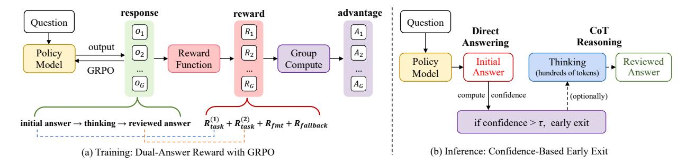

# 3 Preliminaries

In this section, we first briefly introduce our training framework and then analyze CoT inference versus direct inference in existing video reasoning models, revealing that indiscriminately enabling step-by-step reasoning is often redundant for video understanding.

### 3.1 Training Framework

GRPO Training. As a recent RL method, Group Relative Policy Optimization (GRPO) replaces a learned critic with group-normalized, rule-based verifiable rewards, offering a simplified and scalable RL training pipeline with strong empirical performance [\(Guo et al.,](#page-14-1) [2025\)](#page-14-1).

Formally, given a prompt q, the behavior policy πθold samples G candidate outputs {o1, . . . , oG}. For each output, a verifiable reward ri , such as answer accuracy, temporal IoU, or format correctness, is computed. GRPO then normalizes these rewards using the group-wise mean µ and standard deviation σ to obtain relative advantages Ai = ri−µ σ+ε . Then with the importance ratio ρi = πθ(oi|q) πθold (oi|q) , the training objective becomes:

$$\mathcal{L}_{GRPO}(\theta) = -\frac{1}{G} \sum_{i=1}^{G} \min \left( \rho_i A_i, \operatorname{clip}(\rho_i, 1 - \epsilon, 1 + \epsilon) A_i \right) + \beta D_{KL}(\pi_\theta \parallel \pi_{ref})$$
(1)

where DKL regularizes the policy against a reference policy πref via a KL penalty, and β ≥ 0 controls the strength of this regularization.

Reward Function. Standard GRPO employs verifiable, rule-based rewards consisting of a task-accuracy term Rtask and a format correctness term Rfmt. The final per-sample reward is defined as a weighted sum:

$$R_i = w R_{\text{task}}(o_i) + \lambda R_{\text{fmt}}(o_i), \quad w, \lambda \ge 0.$$

In this paper, we consider three video task types: QA, temporal grounding, and grounding QA. The detailed reward for each task can be found in Appendix [B.](#page-19-0)

Table 1 Comparison of Direct and CoT Inference for Video Reasoning Models. Direct inference means answering without explanations. CoT inference follows each model's default prompt to elicit step-by-step reasoning and then generate the final answer. All models are re-evaluated with the same inputs, i.e., maximum 256 frames and 16K total video tokens. We report the accuracy and the response length (in tokens). Surprisingly, CoT inference shows worse accuracy than direct inference while using more tokens on several benchmarks.

| Model        | Inference Strategy | Response Length | VideoMME   | LongVideoBench | MMVU       | VideoMMMU  | Charades-STA |
|--------------|-----------------------|--------------------|------------|----------------|------------|------------|--------------|
| Qwen2.5-VL   | Direct                | 10.2               | 66.0       | 60.9           | 65.7       | 52.7       | 52.9         |
| Video-R1     | Direct                | 17.6               | 64.6       | 59.5           | 65.6       | 51.4       | 42.0         |
|              | CoT                   | 386                | 64.3(−0.3) | 59.4(−0.1)     | 65.4(−0.2) | 52.4(+1.0) | 34.9(−7.1)   |
| Time-R1      | Direct                | 9.2                | 65.9       | 60.0           | 65.1       | 53.0       | 56.6         |
|              | CoT                   | 138                | 63.8(−2.1) | 58.3(−1.7)     | 64.7(−0.4) | 54.1(+1.1) | 58.8(+2.2)   |
| VideoChat-R1 | Direct                | 4.3                | 65.7       | 60.1           | 65.6       | 52.3       | 58.5         |
|              | CoT                   | 126                | 63.9(−1.8) | 58.2(−1.9)     | 65.4(−0.2) | 55.7(+3.4) | 59.9(+1.4)   |

Training Data. While traditional video reasoning models are trained primarily on videos, raw video data is inherently noisy and non-symbolic, often biasing models toward perception rather than reasoning. To enhance the model's long-chain reasoning capabilities, we augment the training corpus with high-quality text [\(Yu et al.,](#page-16-11) [2025\)](#page-16-11) and image sources [\(Wang et al.,](#page-15-3) [2025a,](#page-15-3)[c\)](#page-16-2) that cover math and scientific problems. We also include video QA data [\(Feng et al.,](#page-13-2) [2025;](#page-13-2) [Cores et al.,](#page-13-10) [2024;](#page-13-10) [Li et al.,](#page-14-16) [2025d;](#page-14-16) [Zhu et al.,](#page-17-4) [2025\)](#page-17-4) and temporal grounding data [\(Gao et al.,](#page-13-11) [2017;](#page-13-11) [Fabian et al.,](#page-13-12) [2015;](#page-13-12) [Wang et al.,](#page-16-3) [2025d;](#page-16-3) [Xiao et al.,](#page-16-12) [2024\)](#page-16-12). After filtering, we obtain 83K samples. The detailed training data can be found in Appendix [A.](#page-18-0)

Direct RL without Cold-Start. Notably, we conduct RL directly on the curated data without relying on a cold-start SFT stage. Collecting large-scale, high-quality multimodal CoT traces is expensive and often noisy. In early experiments, SFT on Video-R1-CoT data [\(Feng et al.,](#page-13-2) [2025\)](#page-13-2), which has both the intermediate reasoning traces and final answer, degraded the Qwen2.5-VL baseline [\(Bai et al.,](#page-13-13) [2025b\)](#page-13-13). We therefore focus on directly incentivizing the base model's reasoning via reinforcement learning. The detailed ablations can be found in Appendix [F.3.](#page-23-0)

### 3.2 Analysis of Existing Video Reasoning Models

Before building our own reasoning model, we pose the following question:

When is video chain-of-thought actually necessary, and how does it compare with direct answering?

To investigate, we re-evaluate existing video reasoning models, i.e., Video-R1 [\(Feng et al.,](#page-13-2) [2025\)](#page-13-2), Time-R1 [\(Wang et al.,](#page-16-3) [2025d\)](#page-16-3), and VideoChat-R1 [\(Li et al.,](#page-14-3) [2025c\)](#page-14-3), which are all based on Qwen2.5-VL. We compare two inference strategies: direct inference and CoT inference. Results are summarized in Table [1.](#page-4-0)

Surprisingly, direct inference often matches, or even outperforms, CoT inference on several benchmarks such as VideoMME [\(Fu et al.,](#page-13-14) [2025a\)](#page-13-14) and LongVideoBench [\(Wu et al.,](#page-16-13) [2024\)](#page-16-13), while generating significantly fewer tokens (see Figure [7\)](#page-26-0). Consistent CoT gains are primarily observed on Video-MMMU [\(Hu et al.,](#page-14-6) [2025\)](#page-14-6). We further examine the samples where CoT succeeds but direct inference fails (see Figure [8\)](#page-27-0). These cases are typically math- or physics-oriented (e.g., physics instructional videos with blackboard derivations): the questions or answer options contain symbolic inputs, the visual signal is relatively clean, and multi-step deduction is genuinely necessary. Under these conditions, CoT provides a tangible advantage.

By contrast, in perception-oriented queries (e.g., object or action recognition, simple attribute identification), CoT often redundantly describes the video or compares answer options step by step, yet ultimately arrives at the same conclusion as direct inference. Given the autoregressive nature of LLMs, such verbose traces substantially increase end-to-end latency and inference cost. Considering that most QA samples do not benefit from additional reasoning, we believe an effective and efficient policy is to reason only when necessary, that is, employ auto-thinking. Accordingly, in this paper, we focus on building an auto-thinking video model.

Figure 2 Overview of VideoAuto-R1. (a) Training: The response follows the  $answer \to think \to answer$  template, jointly optimizing both the initial and reviewed answers. Specifically, a fallback reward is introduced to avoid a spurious initial guess. (b) Inference: The model first produces an initial answer. If its length-normalized confidence exceeds a threshold  $\tau$ , decoding terminates as direct answering; otherwise, the model continues with CoT reasoning and outputs a reviewed answer, enabling adaptive, confidence-based early exit.

