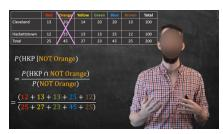

# 6 Conclusion

We presented VideoAuto-R1, an adaptive video reasoning framework that reasons only when necessary. Motivated by the observation that long CoT does not reliably improve video understanding and can even degrade accuracy through overthinking, we proposed a thinking once, answering twice scheme to enable video auto-thinking. Experiments on various video understanding benchmarks, such as perception, reasoning, and temporal grounding, consistently validate the advantages of our model. Our method is easy to formulate and implement, serving as an alternative to the standard reasoning framework. Our preliminary work suggests that VideoAuto-R1 has potential applications beyond video understanding.

The data that follow are the square footage (in 1,000 feet squared) of 28 homes. The sample mean = 2.50 and the sample standard deviation = 0.8302. The distribution can be written as  $X \sim U(1.5, 4.5)$ . What is  $P(x < 3.5 \mid x < 4)$ ?

Options:

A. 0.875 B. 0.55 C. 0.8 D.0.75 E.0.7 F. 0.625 G. 0.95 H. 0.9 I. 0.5 J. 0.85

Put your final answer in \\boxed{}.

GT: C

VideoAuto-R1 : \boxed{D} (confidence 0.92, continue CoT reasoning)
<think>

To find  $P(x < 3.5 \mid x < 4)$ , we need to use the concept of conditional probability. The formula for conditional probability is:  $P(A \mid B) = \frac{P(A \cap B)}{P(B)}$ .

In this context, let A be the event x < 3.5 and B be the event x < 4. Since A is a subset of B,  $P(A \cap B) = P(A)$ .

First, we need to find P(x < 3.5) and P(x < 4). The distribution is uniform from 1.5 to 4.5, so the probability density function f(x) is:

$$f(x) = \frac{1}{4.5 - 1.5} = \frac{1}{3}$$

The cumulative distribution function F(x) is:

$$F(x) = \int_{1.5}^{x} \frac{1}{3} dt = \frac{x - 1.5}{3}$$

Now, we calculate P(x < 3.5):

$$P(x < 3.5) = F(3.5) = \frac{3.5 - 1.5}{3} = \frac{2}{3}$$

Next, we calculate P(x < 4):

$$P(x < 4) = F(4) = \frac{4 - 1.5}{3} = \frac{2.5}{3}.$$

Now, we can find the conditional probability:

$$P(x < 3.5 \mid x < 4) = \frac{P(x < 3.5)}{P(x < 4)} = \frac{\frac{2}{3}}{\frac{2.5}{3}} = \frac{2}{2.5} = \frac{4}{5} = 0.8.$$

Therefore, the correct answer is: C. 0.8.

</think>

\\boxed{C}

Figure 4 VideoAuto-R1 Performing Complex Math Reasoning. The model applies probability and integration, revising an incorrect initial answer to the correct one through structured reasoning.

