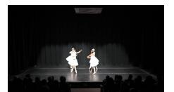
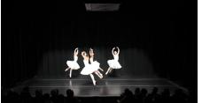
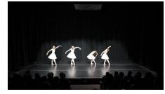
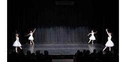

# H Qualitative Examples

In this section, we provide additional qualitative results to support our analysis.

In Figure [7,](#page-26-0) we first present a failure case of VideoChat-R1 [\(Li et al.,](#page-14-3) [2025c\)](#page-14-3), where the direct answer is correct but the CoT-reasoned result is incorrect. Although the model generates a seemingly reasonable step-by-step rationale, it suffers from hallucinations. For example, it mistakenly describes dancing details that are not present at the end of the video. These errors often stem from a single step of misperception or flawed reasoning, yet they ultimately lead to incorrect final answers. In contrast, the direct answer provides an accurate and concise response for such perception-oriented tasks.

In Figure [8,](#page-27-0) we also show a success case of VideoChat-R1 on VideoMMMU. Unlike perception-oriented examples, this question involves a science problem based on an instructional video. In this context, the chain-of-thought reasoning process demonstrates a clear advantage: the model performs step-by-step deduction, correctly computes equations, and arrives at the final numerical result, which would be challenging via direct answering alone.

Next, we present qualitative results from VideoAuto-R1 across different benchmark types. In Figure [9,](#page-28-0) we illustrate the model's outputs on temporal grounding tasks. For these examples, the reasoning trace is typically straightforward—often limited to identifying when the action begins and ends. In many cases, the initial and reviewed answers are identical. Based on this observation, we apply early-exit directly on temporal grounding tasks without invoking further reasoning, which leads to reduced computation without sacrificing accuracy.

In Figure [10,](#page-29-0) we show results on perception-oriented QA benchmarks. For these relatively simple visual questions, VideoAuto-R1 consistently provides accurate responses in the initial answer, often accompanied by a high confidence score (e.g., over 99%). These examples trigger early-exit behavior, allowing the model to maintain strong accuracy while improving inference efficiency.

In Figures [11,](#page-30-0) we showcase examples from reasoning-intensive QA benchmarks. Compared to perceptionoriented tasks, the reasoning traces here are significantly longer, with more detailed deduction steps. Notably, the model's confidence in the initial answer is relatively low in such cases, allowing our confidence-based inference mechanism to trigger reasoning effectively.

What are the moves in the last scene of this dance?

- A. Kneel down on one knee and lean back. B. Passe and then chasse.

- C. Releve and then pirouette. D. Passe and then Grand jete.

