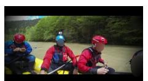
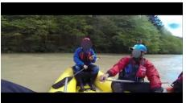
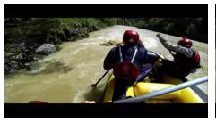
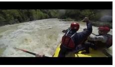
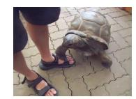
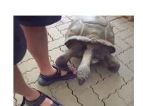
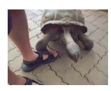

# **VideoAuto-R1 : \\boxed{[3.2, 10.8]}**

<think>At 3.2 seconds, the person is seen holding a bottle and tilting it towards their mouth, which suggests they are pouring something into their mouth. At 10.8 seconds, they finish pouring and put the bottle down. This action aligns with the described behavior of pouring a bottle of beer.</think> **\\boxed{[3.2, 10.8]} GT: [1.1, 9.4]**

Locate the start and end timestamps of the video segment corresponding to the description: *Another man is shown being pulled back onto the raft.* Please provide the start and end timestamps (in seconds, precise to one decimal place) in the format \\boxed{[start, end]}.

### **VideoAuto-R1 : \\boxed{[42.5, 58.3]}**

<think>At 42.5 seconds, we see another individual who has fallen into the river. The rafters work together to pull him back onto the raft, ensuring everyone's safety. This action demonstrates teamwork and coordination among the group.</think>

**\\boxed{[42.5, 58.3]}**

**GT: [70, 73]**

Question: *what did the person do after the turtle finished eating the leaf?*

Options: A. drink B. look to his left C. smiled D. look backwards E. walk away Please answer the question and then provide the video segment that best supports your answer. The start and end timestamps must be in seconds with exactly one decimal place.

Output format: \\boxed{answer <> [start, end]}. For example: \\boxed{A <> [20.3, 30.8]}

