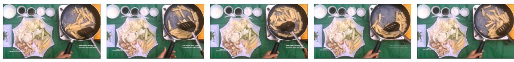
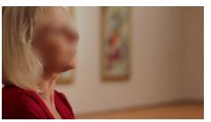

# **VideoAuto-R1 : \\boxed{E <> [31.5, 46.9]}**

<think>At 31.5 seconds, the person is seen walking away from the turtle, which indicates they have finished interacting with it. This action aligns with the option E, \"walk away.\" The other options do not fit the observed behavior in the video.</think>

**\\boxed{E <> [31.5, 46.9]}**

**GT: E <> [34.3, 45.8]**

Figure 9 VideoAuto-R1 on Temporal Grounding Tasks. The reasoning trace is simple and redundant with the initial answer, enabling effective early-exit without full CoT reasoning.

Question: What is the action performed by the person in the video?

Options:

(A) boiling (B) putting (C) stirring (D) cooking

Put your final answer in \\boxed{}.

**GT: C**

**VideoAuto-R1 : \\boxed{C}** (confidence 0.99, early-exit)

<think>

The person in the video is actively engaged in cooking, specifically stirring food in a pan with a spatula. This action aligns with the option C, stirring.

The other options do not fit the observed activity:

- Boiling (A) involves heating water to a boil, which is not what is happening here.
- Putting (B) implies placing something into the pan, but the person is not doing that; they are stirring.
- Cooking (D) is too broad and includes all cooking activities, including stirring, so it is not the specific action being performed here.

</think>

**\\boxed{C}**

A woman is sitting inside a gallery. She is wearing a red coat and black clothes. Her hair is blond, and she has a watch on her wrist. There are two paintings hanging on the wall behind her. When she mentions 'his work is incredibly worked out and um,' what change occurs to the woman onscreen? Options:

A. The woman walks to admire four artworks. B. The woman starts introducing the artworks.

C. The woman changed her clothes. D. The woman sits down to admire four artworks.

E. The woman's hair was tied up.

Put your final answer in \\boxed{}.

**GT: A**

**VideoAuto-R1 : \\boxed{A}** (confidence 0.99, early-exit)

<think>

The woman is initially seen sitting, but as she mentions \"his work is incredibly worked out and um,\" she stands up and walks towards the wall where four artworks are displayed. This action aligns with the option A, which states that she walks to admire four artworks.

The other options do not fit the sequence of events shown in the video. The woman does not change her clothes, nor does she sit down to admire the artworks after standing up. The mention of her hair being tied up is not relevant to the actions taken in the video.

</think>

**\\boxed{A}**

Figure 10 VideoAuto-R1 on Perception-Oriented QA Tasks. High-confidence initial answers trigger early exit, improving inference efficiency.

A team member consistently generates innovative ideas but struggles to follow through with implementation and often overlooks practical details. According to Belbin's model, which role most likely describes this individual, and what is a potential weakness they might exhibit?

### Options:

- A. Implementer; Inflexible and close-minded
- B. Plant; Might ignore incidentals and might be too pre-occupied to communicate properly
- C. Shaper; Easily provoked and may offend others
- D. Completer-Finisher; Excessively worried and reluctant to delegate work
- E. Coordinator; Seen as manipulative and work-shy
- F. Team Worker; Indecisive and tends to avoid confrontation
- G. Resource Investigator; Overly optimistic and can lose interest quickly
- H. Monitor Evaluator; Lacks drive and ability to inspire, overly critical
- I. Specialist; Contributes only on a narrow front and dwells on technicalities

Put your final answer in \\boxed{}.

**GT: B**

