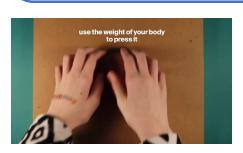
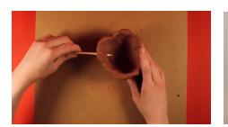
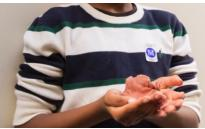
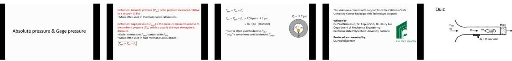
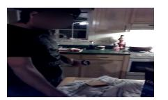
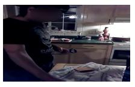

# **VideoChat-R1-Thinking (CoT Reasoning) :**

<think>

The video shows a ballet performance where the dancers are executing a series of movements. The last scene involves the dancers performing a sequence that includes a combination of steps and poses. The movements appear to be fluid and coordinated, typical of a ballet piece.

- At 0:10 to 1:50, the dancers perform a series of steps that involve passing their arms and legs in a synchronized manner.
- At 1:50 to 2:00, the dancers execute a grand jete, which is a leap where the dancer jumps into the air and extends their body horizontally before landing gracefully.

Given these observations, the correct answer should reflect the final movement performed by the dancers in the last scene.

</think>

**<answer>D</answer>**

There are two images here. One shows a girl in green clothing with braided hair, holding a clay container in front of a solid color background wall. The other shows a girl in black and white floral clothing with loose hair. According to the video, which character appears first?

- A. Boy with short hair and green stripes B. Boy with golden hair
- **GT: D**

- C. Girl in green clothing with loose hair D. Girl in green clothing with braided hair
- E. Girl in black and white floral clothing with loose hair

### **VideoChat-R1-Thinking (Direct-Answering) : D**

# **VideoChat-R1-Thinking (CoT Reasoning) :**

<think>

The video starts with a title card for \"metkids\" and then transitions to a scene where hands are shown kneading clay on a surface. After this, there is a cut to a girl in green clothing with braided hair holding a clay container. This sequence suggests that the girl in green clothing with braided hair appears after the initial clay preparation scenes.

The question asks which character appears first. Since the video begins with the clay preparation and then cuts to the girl in green clothing with braided hair, it's clear she is not the first character to appear. Therefore, the correct answer should be related to the girl in black and white floral clothing with loose hair, as she is the only one mentioned before the girl in green clothing with braided hair.

</think>

**<answer>E</answer>**

Figure 7 Failure case of VideoChat-R1. The model hallucinates visual content in its reasoning trace, leading to an incorrect answer. Direct answering performs better in this perception-oriented task.

A wind tunnel draws in sea-level standard air from the room and accelerates it into a 1-m by 1-m test section. A pressure transducer in the test section wall measures ∆=45 mm water between inside and outside. Estimate the absolute pressure at the nose of the model. Options:

A. 112000 Pa B. 101350 Pa C. 98000 Pa D. 99000 Pa E. 95280 Pa F. 110000 Pa G. 107000 Pa H. 94000 Pa I. 105000 Pa **GT: B**

## **VideoChat-R1-Thinking (Direct-Answering) : E**

### **VideoChat-R1-Thinking (CoT Reasoning) :**

<think>

To estimate the absolute pressure at the nose of the model, we need to understand the relationship between gauge pressure, absolute pressure, and atmospheric pressure.

From the video, we know that:

- Absolute pressure !"# is the pressure measured relative to a vacuum (0 Pa).
- Gauge pressure \$!\$% is the pressure measured relative to the ambient pressure !, which is usually the local atmospheric pressure.
- The formula for gauge pressure is: \$!\$% = !"# − !.

Given:

We can use the conversion factor between mm water and psi to find the gauge pressure in psi:

1 mm water = 
$$0.002316$$
 psi

45 mm water = 
$$45 \times 0.002316 \approx 0.10422$$
 psi

Now, using the formula \$!\$% = !"# − !:

$$P_{abs} = 0.10422 \text{ psi} + 14.7 \text{ psi} \approx 14.80422 \text{ psi} 0.10422 \text{ psi} = P_{abs} - 14.7 \text{ psi}$$

Since 1 psi is approximately equal to 6894.757293 Pa, we convert the absolute pressure to pascals:

$$P_{abs} \approx 14.80422 \times 6894.757293 \approx 102,000 \text{ Pa}$$

The closest option to this value is 101350 Pa.

</think>

**<answer>B</answer>**

Figure 8 Success Case of VideoChat-R1 on VideoMMMU. The question involves scientific analysis with equations. Chainof-thought reasoning leads to the correct answer, whereas direct answering would likely fail.

Locate the start and end timestamps of the video segment corresponding to the description: *the person was pouring a bottle of beer.* Please provide the start and end timestamps (in seconds, precise to one decimal place) in the format \\boxed{[start, end]}.

