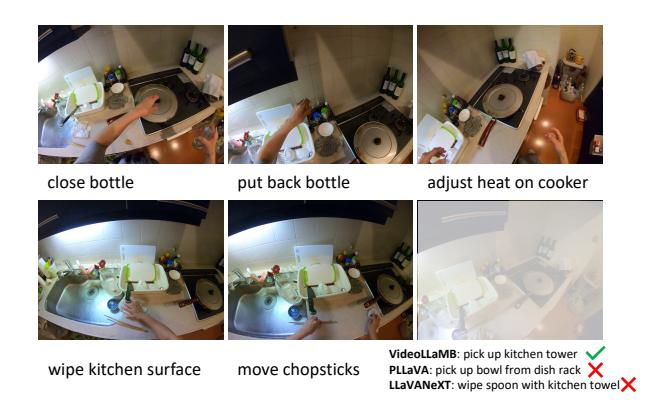
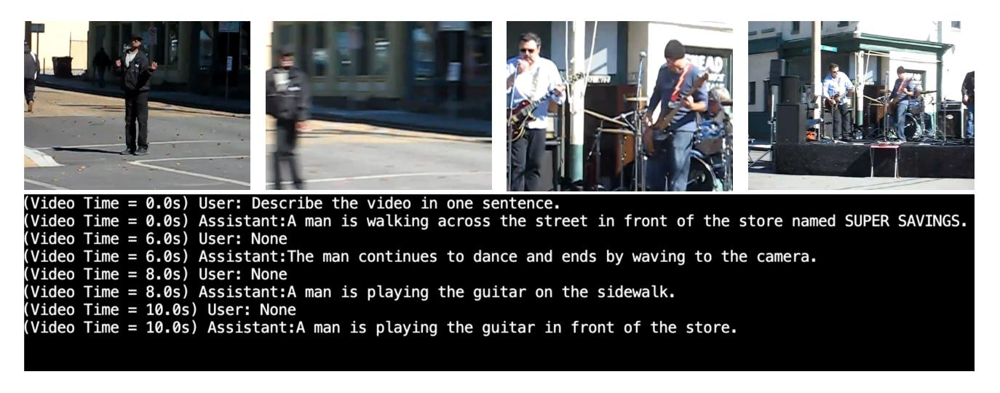
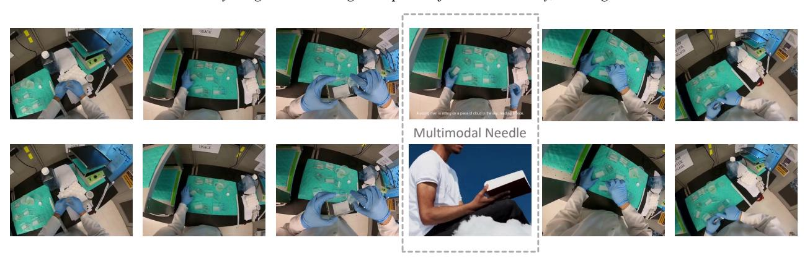

# VideoLLaMB: Long Streaming Video Understanding with Recurrent Memory Bridges

## Supplementary Material

## A. Parameter Analysis

| # of Memory Tokens | # of Bridge Layer | Accuracy |
|--------------------|-------------------|----------|
| 32                 | 1                 | 53.8     |
| 64                 | 1                 | 53       |
| 32                 | 3                 | 54       |
| 64                 | 3                 | 54.6     |

Table 9. Parameter Analysis we apply analysis of different parameters of our framework

We conducted a detailed parameter analysis of our model, focusing on two primary aspects: the number of memory tokens and the number of bridge layers. This analysis was performed using the EgoSchema dataset, under the experimental settings in Appendix [C.1.](#page-12-0) The outcomes of this analysis are presented in Tab. [9.](#page-12-1) From the results, we observed a clear trend: a simultaneous increase in the number of memory tokens and the number of bridge layers leads to a notable improvement in performance. This finding is significant as it provides valuable direction for future enhancements of our method. To optimize our model further, we propose expanding the capacity of the bridge layer by adding more parameters while concurrently exploring more efficient architectural designs.

## B. Compression Strategy Analysis

In this section, we further explore the memory compression ability of our metho. We compare our method with two types trending memory compression methods: adaptive pooling [\[70\]](#page-11-3) and token compression [\[54\]](#page-10-0). Different memory compression strategies are compared on the same LLM, training data, and compression rate for fair comparison. The results on Egoschema in Tab. [10](#page-12-2) demonstrate our method could keep the memory in a better way.

| Compression Strategy   | Accuracy |
|------------------------|----------|
| Adaptive Pooling [70]  | 45.6     |
| Token Compression [54] | 42.2     |
| VideoLLaMB             | 53.8     |

Table 10. Comparison of different memory compression strategies.

## C. Implementation Details

### C.1. Implementation Details

In our experiment, we configured the memory tokens to a capacity of 32 and employed a single transformer layer as the bridge layer. For the training process, we set the number of training frames to 16 and limited the number of segments to 4. In order to ensure the visual encoder's plug-and-play functionality, we froze its parameters, focusing the training solely on the bridge layer and the LLMs. We utilized the Image Encoder and Video Encoder from Video-LLaVA [\[34\]](#page-9-1). In alignment with the procedures of PLLaVA [\[70\]](#page-11-3), we initialized the LLM using the LLaVA-1.5 [\[36\]](#page-9-10) configuration. The training dataset was identical to that used in PLLaVA, leveraging the same video data. To maintain the model's proficiency in static visual learning, we retained the finetuning image data from LLaVA-1.5. Our experiments were conducted on four Nvidia A800 GPUs. Regarding other hyperparameters, we adhered to the original settings specified in the initialized models

#### C.2. Parameter Details

In this section, we will include more detailed implementation details. In Table [11,](#page-12-3) we demonstrate the implementation details of our method, including the details of the Bridge Layer, Retrieval Layer, and other hyperparameters of our initialized LLaVA.

Table 11. Hyperparameters for VideoLLaMB.

| Hyperparam                      | VideoLLaMB |
|---------------------------------|------------|
| Number of Bridge Layers         | 1          |
| Number of Retrieval Layers      | 1          |
| Bridge Layer Attention Heads    | 8          |
| Retrieval Layer Attention Heads | 8          |
| Bridge Layer Hidden Size        | 1024       |
| Retrieval Layer Hidden Size     | 1024       |
| Vision Feature Select Layer     | -2         |
| Model Max Length                | 2048       |
| Learning Rate                   | 2e-4       |
| Batch Size                      | 8          |
| Epoch                           | 1          |
| Warmup Ratio                    | 0.03       |
| Weight Decay                    | 0.0        |
| Patch Size                      | 14         |
| Image Size                      | 224        |

#### C.3. Baseline Clarification

This work miss two long-video understanding model in some benchmarks for the following reasons: (1) the MALMM is built on InstructBLIP, which limits the input query length and, therefore, can't be applied to the EgoSchma and the NExTQA benchmark. (2) MovieChat requires reloading the model at each test and requires heavy I/O pressure. Therefore, we only include the MALMM on our NIAVH benchmark for comparison. In addition, to make a fair comparison with different compression methods, we adopt these baselines in the same setting on Egoschema, and the results are illustrated on Tab. [10.](#page-12-2)

## D. Qualitative Results

Figure 5. Qualitative results on EgoPlan.

Planning We present the qualitative outcomes of various approaches on EgoPlan, as depicted in the Figure [5.](#page-13-0) The target goal is "clean and organize kitchen". Our method showcases effective reasoning based on previous steps and the current state, in contrast to other methods that tend to make predictions based solely on the initial or final visual inputs. Consequently, our approach enhances the model's capability in planning tasks.

Streaming Caption In Figure Figure [6,](#page-14-0) we present the qualitative results of the streaming caption task. At the commencement of the video, the model is provided with the query: "Describe the video in one sentence". Subsequently, at timestamps 0.0 seconds, 6.0 seconds, 8.0 seconds, and 10.0 seconds, the model autonomously generates captions in response to changes in the video scene, without requiring any user input.

### D.1. Example of NIAVH

In this section, we visualize our proposed needle in a video haystack, which supports different modalities of needle, include text, image, and video. As is shown in Figure [7,](#page-14-1) the needle is "A young man is sitting on a piece of cloud in the sky, reading a book.". For the text needle, we just append the text to the video directly; for the image and video needle, we insert the image and the video clips into the video haystack.

Figure 6. Qualitative results on streaming dense caption tasks. The video is randomly selected from the NExTQA validation set. Our method could accurately recognize the camera change and zoom out, and predict the corresponding captions.

Needle: *A young man is sitting on a piece of cloud in the sky, reading a book.*

Figure 7. Example of NIAVH. For the text needle, the description is appended directly to the video; for the image and video needles, the corresponding image and video clips are inserted into the video haystack.