# VIDEONSA: NATIVE SPARSE ATTENTION SCALES VIDEO UNDERSTANDING

Enxin Song1, Wenhao Chai2, Shusheng Yang3, Ethan Armand1, Xiaojun Shan1, Haiyang Xu1, Jianwen Xie4, and Zhuowen Tu1

 $^1$  University of California, San Diego $^{-2}$  Princeton University  $^{-3}$  New York University  $^4$  Lambda, Inc

#### **ABSTRACT**

Video understanding in multimodal language models remains limited by context length: models often miss key transition frames and struggle to maintain coherence across long time scales. To address this, we adapt Native Sparse Attention (NSA) to video-language models. Our method, VideoNSA, adapts Qwen2.5-VL through end-to-end training on a 216K video instruction dataset. We employ a hardware-aware hybrid approach to attention, preserving dense attention for text, while employing NSA for video. Compared to token-compression and training-free sparse baselines, VideoNSA achieves competitive performance on long-video understanding, temporal reasoning, and spatial benchmarks. Further ablation analysis reveals four key findings: (1) reliable scaling to 128K tokens; (2) an optimal global—local attention allocation at a fixed budget; (3) task-dependent branch usage patterns; and (4) the learnable combined sparse attention help induce dynamic attention sinks.

**Project page:** https://enxinsong.com/VideoNSA-web/ **Code:** https://github.com/Espere-1119-Song/VideoNSA **Model:** https://huggingface.co/Enxin/VideoNSA

## 1 Introduction

Key moments of a video can occur at any time, exemplified by soccer where game deciding moments typically span seconds of a 90 minute game. Within those game deciding moments split second actions define the outcome: an assist, a missed tackle, the movement of the keeper. Multimodal large language models (MLLMs)(Team, 2025; Team et al., 2025b;a; Qiu et al., 2025; Yuan et al., 2025a; Gui et al., 2025; Chung et al., 2025; Li et al., 2025b) have achieved substantial progress in vision-language perception and reasoning, but still cannot match humans ability to extract and reason about salient moments in videos. While humans naturally sample color visuals around 60hz, (Kalloniatis & Luu, 2007) across large contexts, existing VLMs often sample a single frame per second. Intuitively, increasing the context for these models by sampling more frames improves accuracy (Cai et al., 2024; Wu et al., 2024a), particularly for long videos and complex reasoning tasks. However, this approach pays for improvement with additional tokens, increasing computational complexity and pushing against fundamental limits of model context.

To address these challenges, many approaches (Wang et al., 2024; Li et al., 2024b; Jin et al., 2024; Wang et al., 2025a; Yang et al., 2024) adopt token compression to reduce redundancy and increase informative context. However, when applied to complex reasoning tasks, these compression-based models perform worse compared to full-token methods (Song et al., 2025a). Moreover, compression strategies often limit generalization through reduced perception and reasoning capacity (Wen et al., 2025). In contrast, sparse attention mechanisms preserve tokens, but focus the models capabilities on relevant dependencies between tokens. Numerous sparse attention methods have already been employed in large language models (LLMs), but most are inadequate for video complexity (detailed in Appendix A). Therefore, we present VideoNSA, which adopts Native Sparse Attention (Yuan et al., 2025c), a learnable hardware-aware sparse attention mechanism proven to be effective in long-

context modeling. VideoNSA is the first learnable and hardware-aware sparse attention framework tailored for video understanding, effectively scaling to ultra-long vision-text context. We apply the learnable sparse attention to video token sequences, while preserving grouped-query attention for text tokens. Following this pattern, our experiments show that using only 3.6% of the attention budget on 128K context length while improving performance on various tasks

We further conduct massive experiments and analyses of VideoNSA, revealing several important findings: (1) VideoNSA extrapolates effectively to contexts beyond its training length, and the optimal balance between temporal density and spatial resolution is highly task dependent. (2) VideoNSA is also sensitive by attention scaling, with results remaining strongest near the training configuration. (3) The gating distribution evolves dynamically across layers, and the selection and sliding-window branches gradually lose importance in deeper layers. (4) The compression branch emerges as the main computational bottleneck. (5)Moreover, the learned sparse attention weights remain beneficial even under dense attention settings. (6) Learnable sparse attention induces distinctive attention sink behaviors across branches, with very few sinks in the selection branch and periodic sink formation in the compression branch.

In particular, our paper makes the following contributions:

- We propose VideoNSA, a hardware-aware native sparse attention mechanism, and systematically\ninvestigate its effectiveness for video understanding, scaling up to a 128K vision context length.
- We introduce hybrid sparse attention in VideoNSA, enabling flexible allocation of information and attention budgets to achieve optimal performance across diverse task.
- We dynamically combine global and local attention through three complementary branches, which\neffectively reduce attention sinks in long vision contexts.

#### 2 VIDEONSA

#### 2.1 PRELIMINARIES

Native sparse attention. Existing training-free sparse attention methods are rarely hardware aligned, and typically don't increase training efficiency. Native Sparse Attention (Yuan et al., 2025c) (NSA) avoids computing attention between all key-value pairs  $(\mathbf{K}_t, \mathbf{V}_t)$ , instead, for each query  $\mathbf{q}_t$ , NSA dynamically constructs an information-dense KV cache subset. NSA combines three complementary cache branches with a learnable gate  $g_t^c$  adaptively weighting each branch yielding  $\mathbf{o}_t$ :

$$\mathbf{o}_{t} = \sum_{c \in \{\text{cmp, slc, win}\}} g_{t}^{c} \cdot \text{Attn}(q_{t}, \tilde{\mathbf{K}}_{t}^{c}, \tilde{\mathbf{V}}_{t}^{c}). \tag{1}$$

Token Compression (CMP) branch aggregates sequential blocks of keys into more coarse-grained, single block-level representations  $\tilde{\mathbf{K}}_t^{\mathrm{cmp}}$  via a learnable MLP  $\varphi$ :

$$\tilde{\mathbf{K}}_{t}^{\text{cmp}} = \{ \varphi(\mathbf{K}_{[id+1:id+m]}) \mid 0 \le i < \lfloor \frac{t-m}{d} \rfloor \},$$
 (2)

where m is the block length, d is the stride.

Token Selection (SLC) branch preserves the most salient key-value blocks by computing importance scores  $p_t^{\rm slc'}$  and selecting the indices of the top-n blocks:

$$I_t = \{i \mid \operatorname{rank}(p_t^{\operatorname{slc}^*}[i]) \le n\}. \tag{3}$$

The final set of selected keys is formed by concatenating these top-ranked blocks:

$$\tilde{\mathbf{K}}_{t}^{\text{slc}} = \text{Cat}(\{\mathbf{K}_{[im'+1:(i+1)m']} \mid i \in I_{t}\}), \tag{4}$$

where  $I_t$  is the set of selected indices, n is the number of blocks to retain.

Sliding Window (SWA) branch simply applies the standard sliding window attention, which retains the fixed w most recent key-value pairs:

$$\tilde{\mathbf{K}}_t^{\text{swa}} = \mathbf{K}_{t-w+1:t}, \quad \tilde{\mathbf{V}}_t^{\text{swa}} = \mathbf{V}_{t-w+1:t}. \tag{5}$$

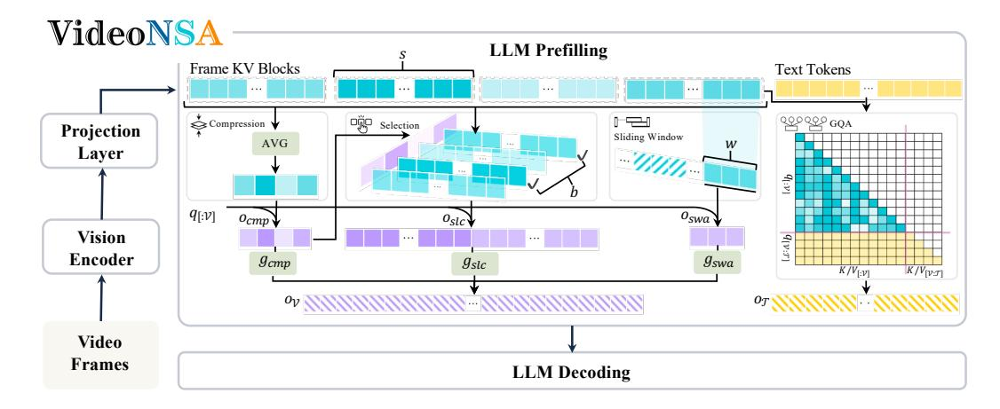

Figure 1: Overview of VideoNSA. Video frames are encoded into frame-level KV blocks. VideoNSA utilizes three sparse attention branches during prefilling stage: **compression branch** reduces redundancy via token averaging, **selection branch** identifies top-k important tokens, and **sliding window branch** enforces local temporal coverage. The outputs are combined through dynamic gating before integration with text tokens for LLM decoding.

**Grouped query attention.** In Multi-Head Attention (MHA), each query head has dedicated key-value (KV) projections, which makes the KV cache scale with the number of heads and increases inference cost. Grouped-Query Attention (GQA) (Ainslie et al., 2023) mitigates this by letting multiple query heads share fewer KV heads. For each input  $\{x_i\}_{i=1}^L$ , GQA partitions the h query heads into g groups  $(1 \le g \le h)$ . At a given timestep t, the output  $o_t^{(s)}$  for the s-th query head with group index  $m(s) = \lceil sg/h \rceil$  is computed by applying attention to the shared keys and values as:

$$o_t^{(s)} = \text{Attention}(q_t^{(s)}, K_{\leq t}^{(m(s))}, V_{\leq t}^{(m(s))}) = \text{softmax}\left(\frac{(q_t^{(s)})^\top K_{\leq t}^{(m(s))}}{\sqrt{d_k}}\right) V_{\leq t}^{(m(s))}, \tag{6}$$

where  $q_i^{(s)}=x_iW_q^{(s)}, k_i^{(m(s))}=x_iW_k^{(m(s))}, v_i^{(m(s))}=x_iW_v^{(m(s))}$ . The outputs  $o_t$  from all heads are concatenated by  $o_t=[o_t^{(1)},o_t^{(2)},\ldots,o_t^{(h)}]$ . VideoNSA utilizes Qwen2.5-VL-7B (Bai et al., 2025) as the backbone, with Qwen2.5-7B (Qwen et al., 2025) as the LLM decoder, which employs GQA for efficient KV cache utilization using 28 query heads and 4 shared key/value heads.

#### 2.2 ARCHITECTURE

Existing token compression methods (Yang et al., 2025d; Zhang et al., 2025c; Hyun et al., 2025; Zhang et al., 2025h) suffer from irreversible information loss on complex tasks and don't address computational and latency bottlenecks in LLM video understanding. From the perspective of attention as a message passing in a Graph Neural Network (Joshi, 2025; Pappone, 2025), it's clear this bottleneck is fundamental. Standard attention propagates information between nodes (tokens) through edges (attention weights), with each token being updated by aggregating features from its neighbors, weighted by attention scores. Training-free sparse attention often imposes a static adjacency matrix whose fixed subgraph connectivity restricts information flow. Conversely, NSA (Yuan et al., 2025c) provides data-dependent sparsity that preserves edges necessary for a particular task.

We build VideoNSA upon Qwen2.5-VL-7B (Qwen et al., 2025), which incorporates a vision encoder and adopts Qwen2.5-7B (Bai et al., 2025) as the LLM. As illustrated in Figure 1, VideoNSA introduces a hybrid attention mechanism in the LLM across different modalities. At each layer l, we split the input tokens  $\mathbf{X}_{\mathcal{V}}^{(l-1)}$  into vision tokens  $\mathbf{X}_{\mathcal{V}}^{(l-1)}$  and text tokens  $\mathbf{X}_{\mathcal{T}}^{(l-1)}$  according to their position IDs. For vision tokens, VideoNSA applies NSA (Yuan et al., 2025c) with a dedicated gate  $g_t^c$  on each head. We set the block size s equal to the token number per frame, and obtain the block-level representation by averaging all tokens within the block. The vision attention output  $o_{\mathcal{V}}$  is dynamically

weighted by the compression, selection, and sliding window branches as:

$$\mathbf{o}_{\mathcal{V}}^{(l)} = \sum_{c \in \{\text{cmp,slc,win}\}} g_t^c \operatorname{Attn}(q_t, \tilde{\mathbf{K}}_t^c, \tilde{\mathbf{V}}_t^c),$$

where g c t is implemented as a two-layer MLP with a sigmoid activation.

The text attention output o (l) T is computed using standard GQA [\(Ainslie et al., 2023\)](#page-9-1) to preserve instruction following capabilities. We obtain the final output o (l) of the layer l by concatenating:

$$\mathbf{o}^{(l)} = [\mathbf{o}_{\mathcal{V}}^{(l)}; \, \mathbf{o}_{\mathcal{T}}^{(l)}].$$

## 2.3 TRAINING RECIPE

We conduct end-to-end training to adapt vision features for data-dependent sparse connectivity in the language model. The training dataset of VideoNSA is constructed from LLaVA-Video-178K [\(Zhang](#page-16-3) [et al., 2024d\)](#page-16-3) by filtering for question answer pairs at 4 fps and retaining videos with 350–550 frames, for a subset of 216K pairs. To emphasize sparse attention for temporal redundancy, we constrain the maximum pixels per frame to 50,176, and the maximum context length per training instance to 36K tokens. In VideoNSA, block size s is set to 64, block b is set to 32, and sliding window size w is set to 256. We trained using SWIFT [\(Zhao et al., 2024\)](#page-17-0), adapting the NSA [\(Yuan](#page-16-0) [et al., 2025c\)](#page-16-0) implementation from FLA [\(Yang & Zhang, 2024\)](#page-15-3) and [\(Pai et al., 2025b\)](#page-12-2). The complete training process requires 4600 H100 GPU hours. More training details including hyper-parameters selection can be found in Appendix [B.](#page-19-0)

## 3 EXPERIMENTS

## 3.1 EFFECTIVENESS ON VIDEO UNDERSTANDING

Baselines Our primary baseline is Qwen2.5-VL-7B [\(Qwen et al., 2025\)](#page-13-3) with dense FlashAttention [\(Dao, 2023\)](#page-10-2). We compare VideoNSA against several strong baselines, including the quantization model AWQ [\(Team, 2024\)](#page-14-6), training-free token compression models [\(Yang et al., 2025c;](#page-15-4) [Zhang et al., 2025b;](#page-16-4) [Chen et al., 2024a\)](#page-10-3), and training-free sparse attention methods [\(Jiang et al.,](#page-11-5) [2024;](#page-11-5) [Xu et al., 2025a;](#page-15-5) [Lai et al., 2025;](#page-11-6) [Li et al., 2024c\)](#page-12-3). All methods employ their official configuration without additional training and using Qwen2.5-VL-7B [\(Qwen et al., 2025\)](#page-13-3) as a base. For token compression baselines, we use the token kept ratio and sampling fps from the original papers that yield the best accuracy, while for sparse attention baselines, we use the same configuration as VideoNSA. In addition, we fine-tune Qwen2.5-VL-7B [\(Qwen et al., 2025\)](#page-13-3) using the same training dataset as VideoNSA to serve as a competitive baseline. We also include models with different backbones for a broad comparison.

We evaluate VideoNSA across three domains including long video understanding, temporal reasoning, and spatial understanding using LMMs-Eval [\(Zhang et al., 2024a\)](#page-16-5) and VLMEvalKit [\(Duan et al., 2024\)](#page-10-4). Table [1](#page-4-0) indicates that sparse attention methods consistently outperform token compression approaches. We empirically evaluate the effectiveness of VideoNSA based on several popular long video understanding benchmarks, including LongVideoBench [\(Wu et al.,](#page-14-2) [2024a\)](#page-14-2), MLVU [\(Zhou et al., 2024\)](#page-17-1), TimeScope [\(Zohar et al., 2025\)](#page-17-2) and LongTimeScope [\(Zohar](#page-17-2) [et al., 2025\)](#page-17-2). VideoNSA achieves competitive results, narrowing the gap with state-of-the-art methods. We observe that VideoNSA shows clear advantages on tasks involving order-sensitive temporal reasoning and ultra-long video settings (10 hours in LongTimeScope [\(Zohar et al., 2025\)](#page-17-2)). To evaluate the visual temporal reasoning capbility of VideoNSA, we evaluate VideoNSA on Tomato [\(Shangguan et al., 2024\)](#page-13-4), a benchmark spanning six reasoning types and three video scenarios. VideoNSA attains the highest accuracy on Tomato [\(Shangguan et al., 2024\)](#page-13-4), substantially outperforming compression-based methods, underscoring their limitations in fine-grained temporal inference. VSIBench [\(Yang et al., 2025a\)](#page-15-6) focuses on spatial reasoning allowing us to test whether efficient models can preserve local fidelity while achieving efficiency. VideoNSA matches the strongest sparse attention baselines and significantly surpasses token compression methods in spatial understanding, confirming that it preserves spatial fidelity. All detailed evaluation settings and subset results can be found in Appendix [C,](#page-19-1) Appendix [D,](#page-20-0) Appendix [E,](#page-21-0) and Appendix [F.](#page-21-1)

Table 1: Results on long video understanding, temporal reasoning and spatial understanding tasks. LVB, LTS for LongVideobench (Wu et al., 2024a) and LongTimeScope (Zohar et al., 2025).

| Model                                 |             | Long-for          | m Video     |             | Temporal | Spatial     |
|---------------------------------------|-------------|-------------------|-------------|-------------|----------|-------------|
| Model                                 | LVB         | $MLVU_{\it test}$ | TimeScope   | LTS         | Tomato   | VSIBench    |
| LLaVA-OneVision-7B (Li et al., 2024a) | 56.3        | _                 | _           | _           | 25.5     | 32.4        |
| LLaVA-Video-7B (Zhang et al., 2024c)  | 58.2        | _                 | 74.1        | 34.0        | _        | 35.6        |
| VideoLLaMA3-8B (Zhang et al., 2025a)  | 59.8        | 47.7              | 69.5        | _           | _        | _           |
| InternVL2.5-8B (Chen et al., 2024c)   | 60.0        | _                 | 55.8        | _           | _        | _           |
| Video-XL-2 (Qin et al., 2025b)        | 61.0        | 52.2              | -           | -           | _        | -           |
| Qwen2.5-VL-7B (Qwen et al., 2025)     | 58.7        | 51.2              | 81.0        | 40.7        | 22.6     | 29.7        |
| Qwen2.5-VL-7B-AWQ (Team, 2024)        | 59.0        | 46.0              | _           | _           | _        | 35.0        |
| Qwen2.5-VL-7B-SFT                     | 57.8        | 51.2              | 76.8        | 40.2        | 21.7     | 30.5        |
| Token Compression Methods             |             |                   |             |             |          |             |
| + FastV (Chen et al., 2024a)          | 57.3        | 41.8              | 46.5        | 35.6        | 21.6     | 32.0        |
| + VScan (Zhang et al., 2025b)         | 58.7        | 48.1              | 80.3        | 31.1        | 19.1     | 34.4        |
| + VisionZip (Yang et al., 2025c)      | 52.4        | 33.1              | 43.5        | 40.4        | 23.6     | 32.1        |
| Sparse Attention Methods              |             |                   |             |             |          |             |
| + Tri-Shape (Li et al., 2024c)        | 59.5        | 49.2              | 82.7        | 28.4        | 22.1     | 34.9        |
| + MInference (Jiang et al., 2024)     | 59.2        | 49.2              | 82.7        | 44.4        | 23.0     | 36.5        |
| + FlexPrefill (Lai et al., 2025)      | 58.4        | 46.0              | 83.0        | 39.1        | 23.7     | 34.0        |
| + XAttention (Xu et al., 2025a)       | 59.1        | 50.2              | <u>83.1</u> | <u>41.1</u> | 21.4     | 36.6        |
| VideoNSA                              | <u>60.0</u> | <u>51.8</u>       | 83.7        | 44.4        | 26.5     | <u>36.1</u> |

Table 2: Ablation study on branch selection across different tasks. LVB, LTS for LongVideobench (Wu et al., 2024a) and LongTimeScope (Zohar et al., 2025).

|              | Brancl       | ı            | I           | Long Video U      | Jnderstandin a | g           | Temporal Reasoning | Spatial Understanding |
|--------------|--------------|--------------|-------------|-------------------|---------------------------|-------------|--------------------|-----------------------|
| CMP          | SLC          | SWD          | LVB         | $MLVU_{\it test}$ | TimeScope                 | LTS         | Tomato             | VSIBench              |
| ✓            |              |              | 48.1        | 43.9              | 41.5                      | 25.1        | 23.3               | 29.2                  |
|              | $\checkmark$ |              | 48.4        | <u>47.7</u>       | <u>63.7</u>               | <u>37.1</u> | 24.0               | 27.6                  |
|              |              | $\checkmark$ | 49.1        | 40.2              | 59.3                      | 29.8        | 24.0               | 29.8                  |
| ✓            | ✓            |              | <u>49.4</u> | 42.7              | 57.3                      | 32.4        | 23.5               | 29.4                  |
| $\checkmark$ |              | $\checkmark$ | 49.3        | 42.4              | 65.2                      | 34.4        | 23.0               | 29.1                  |
|              | ✓            | ✓            | 48.8        | 43.4              | 57.3                      | 31.6        | <u>24.5</u>        | <u>30.3</u>           |
| <b>√</b>     | ✓            | <b>√</b>     | 60.0        | 51.8              | 83.7                      | 44.4        | 26.5               | 36.1                  |

#### 3.2 Ablation Study

To further analyze the components of VideoNSA, we visualize attention pattern in each branch in Appendix H and assess the effectiveness of different branches. Table 2 shows that single-branch models suffer significant degradation, and even two-branch combinations remain inferior to the full VideoNSA, highlighting the necessity of integrating all three branches with dynamic gating. Detailed results of different branch combination can be found in Appendix I.

#### 4 SCALING ANALYSIS AND FINDINGS

Finding 1. Do learned sparse attention weights remain beneficial in dense attention settings?

Table 3: Ablation study on transferring sparse attention weights to dense attention across tasks.

| Model         |                | Long Video U  | Inderstanding |               | Temporal Reasoning | Spatial Understanding |  |  |
|---------------|----------------|---------------|---------------|---------------|--------------------|-----------------------|--|--|
| 1,10001       | LongVideoBench | $MLVU_{Test}$ | TimeScope     | LongTimeScope | Tomato             | VSIBench              |  |  |
| Qwen2.5-VL-7B | 58.7           | 51.2          | 81.0          | 40.7          | 22.6               | 29.7                  |  |  |
| Dense-SFT     | 57.8 (-1.5%)   | 51.2 (+0.0%)  | 76.8 (-5.2%)  | 40.2 (-1.2%)  | 21.7 (-4.0%)       | 30.6 (+2.1%)          |  |  |
| Dense-NSA     | 56.1 (-4.4%)   | 51.6 (+0.8%)  | 83.0 (+2.5%)  | 40.9 (+0.5%)  | 23.4 (+3.5%)       | 33.1 (+10.7%)         |  |  |
| VideoNSA      | 59.4 (+1.1%)   | 51.8 (+1.2%)  | 82.7 (+2.1%)  | 44.4 (+9.1%)  | 26.2 (+15.9%)      | 36.1 (+20.3%)         |  |  |

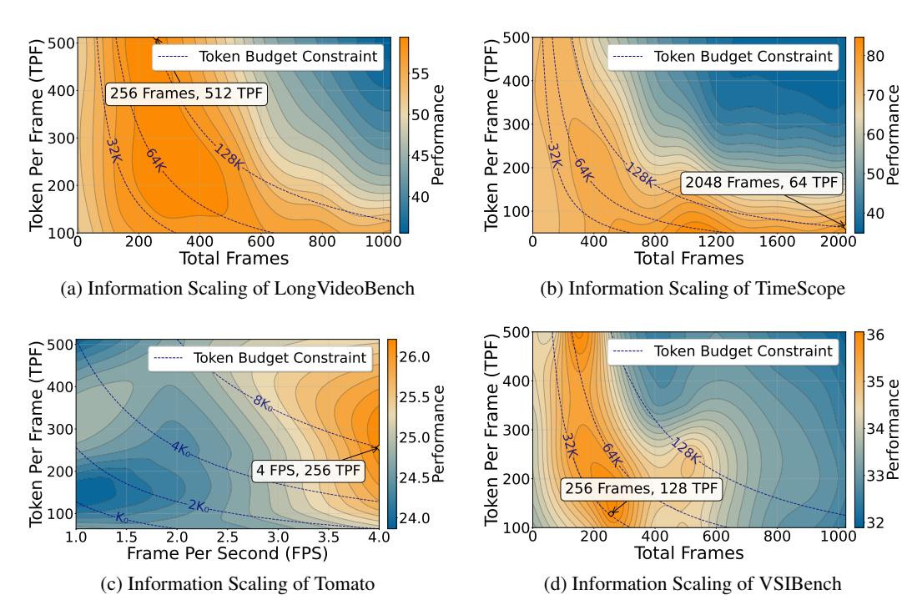

Figure 2: Scaling Performance of VideoNSA under Different Context Allocation Strategies. We highlight the Token Budget Constraint to indicate settings with equal context length, and annotate the best-performing configuration under each benchmark. Since videos in Tomato (Shangguan et al., 2024), we vary FPS instead of total frames, with FPS  $\times$  TPF = 128 denoted as  $K_0$ .

We further examine whether the learned QKV weights of VideoNSA can imrpove performance in dense attention inference. Table 3 reports the relative performance change over the Qwen2.5-VL-7B (Qwen et al., 2025). Due to the limited quality of the training data, our fine-tuned Qwen2.5-VL-7B (Dense-SFT) exhibits slight performance drops on most benchmarks. We observe that the transferred model (Dense-NSA) allows the dense variant to recover and surpass the baseline on several benchmarks suggesting that sparse-trained weights provides inductive bias towards more effective attention distributions. However, the effect remains limited on LongVideoBench (Wu et al., 2024a). VideoNSA significantly outperforms Dense-NSA on most tasks, highlighting the importance of runtime sparsity and dynamic gating.

#### Finding 2. How far can VideoNSA scale in context length?

The effective vision context length L is jointly determined by the number of vision tokens per frame T and the total number of input frames F. VideoNSA is trained with a maximum context length of L=36K tokens, corresponding to T=64 tokens per frame. We conduct an information budget study under a fixed context length, by varying tokens per frame and frame rate. We then scale up the context length beyond the training budget, evaluating up to the maximum 128K tokens supported by the language model. As observed in Figure 2, the model consistently achieves higher performance when scaled to longer contexts beyond its training length across benchmarks. However, the ideal allocation of same token budget is highly task-dependent. LongVideoBench (Wu et al., 2024a) favors allocating more tokens per frame, while Tomato (Shangguan et al., 2024) and TimeScope (Zohar et al., 2025) benefit more from increasing the number of frames, emphasizing temporal coverage. VSIBench (Yang et al., 2025a) shows mixed preferences depending on context length, reflecting a balance between spatial and temporal sampling. Additional results on information scaling are reported in Appendix J.

#### *Finding* **3.** How to allocate the attention budget?

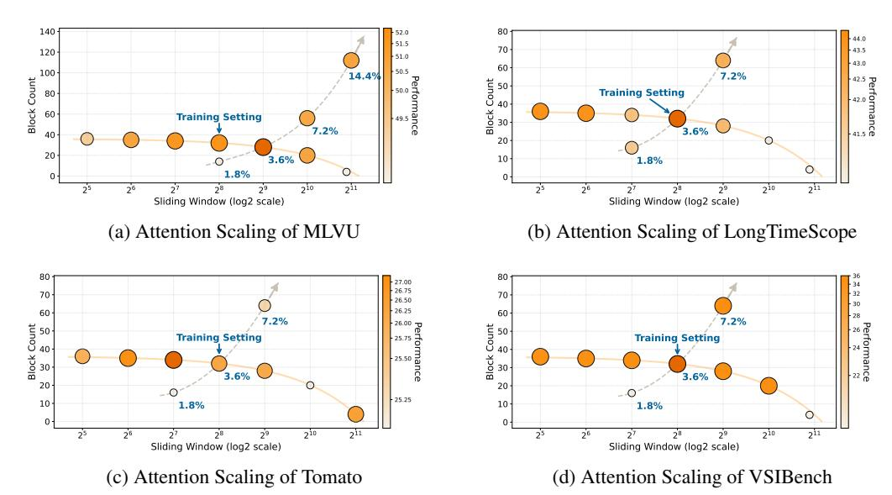

Figure 3: Scaling Performance of VideoNSA under Different Attention Allocation Strategies. Scatter points from small to large and from light to dark indicate increasing performance. We annotate the point corresponding to the same attention allocation strategy as used during training and connect configurations with equal attention budgets using solid orange lines. We further scale the best configuration using dashed lines. Percentages show attention relative to full attention.

We define the *Attention Budget* as the total number of key-value pairs visible to each query, denoted by  $K_{vis}$ . It is composed of a global sparse component and a local sliding-window component as:  $K_{attn} = b \times s + w$ , where b and s denote the number and size of global blocks, and w is the sliding-window width. With context length L, compared to causal dense attention with  $\frac{L(L-1)}{2}$  edges, the fraction of attention used  $\gamma$  is

$$\gamma = \frac{L(cS+w)}{\frac{L(L-1)}{2}} = \frac{2(cS+w)}{L-1},$$

To determine the optimal attention allocation, we first fix the total sequence length L, the attention budget  $K_{\rm vis}$ , and the block size S=64, while systematically varying the local attention ratio  $\alpha=\frac{w}{K_{\rm attn}}$ . We then employ the optimal allocation ratio  $\alpha^*$  for attention budget scaling. As shown in Figure 3, scatter points denote different allocation strategies, with their size and color reflecting performance. We highlight the point corresponding to the training configuration, connect equal-budget settings with solid orange lines, and extend the best-performing configuration with dashed lines, where the annotated values indicate the fraction of attention used  $\gamma$ . Results show that model performance is highly sensitive to attention allocation. Although the optimal ratio between global and local attention varies across tasks, configurations close to the training allocation generally yield better results. Under the same budget, fine-tuning around the training setting often improves performance, whereas simply enlarging the overall budget does not consistently bring further gains. Moreover, across most benchmarks, increasing global attention (enlarging the block count) tends to outperform increasing local attention (enlarging the sliding window). Remarkably, VideoNSA achieves leading performance using only 3.6% of the full attention budget. More results are in Appendix L.

#### Finding 4. What roles do compression, selection, and sliding-window gates play in VideoNSA?

We analyze the gating distribution of VideoNSA across Tomato (Shangguan et al., 2024), VSI-Bench (Yang et al., 2025a), and LongVideoBench (Wu et al., 2024a), and aggregate the average routing gate weights over 100 examples from each. As illustrated in Figure 4, where shaded bars denote the interquartile range and horizontal lines represent mean values, each head in VideoNSA exhibits distinct and diverse preferences across branches throughout its full depth. The diversity allows different layers to specialize in distinct modes of the context-dependent information flow. The

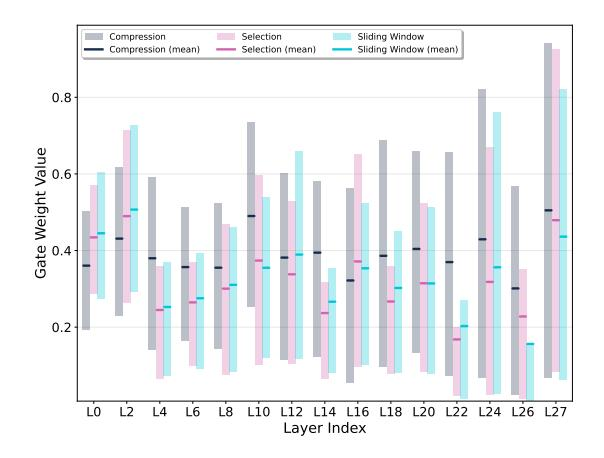

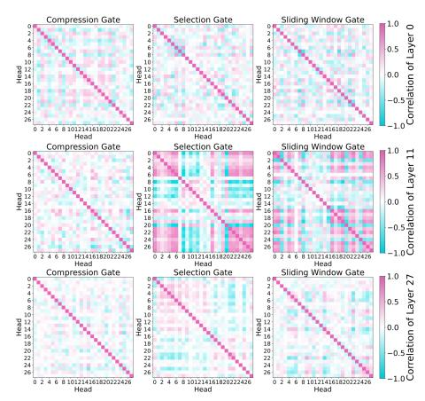

Figure 4: Gate weights across layers in VideoNSA. Compression remains dominant, while selection and sliding-window weaken in later layers.

Figure 5: Inter-head similarities of gates in VideoNSA. Selection and sliding-window gates show high similarity in middle layers.

compression branch maintains relatively high average weights across most layers, underscoring its primary role in reducing redundancy while preserving salient features. The selection and sliding window gates fluctuate more strongly, occasionally surpassing the compression branch in early and middle layers. However, their contributions diminish in the final layers (e.g., L22–L26), demonstrating that the focus shifts towards aggregating high-level features. We also note strange behavior in the last layer, where all three branches are fully active despite selection and sliding window being inactive in the layers before. Full gate values distribution in Appendix N.

We further dive into the inter-head gate similarity of each layer in Figure 5. In the middle layers, both selection and sliding window gates exhibit pronounced increases in inter-head similarity. This indicates that multiple mid-layer heads converge to highly consistent gating behaviors when the model performs block selection and local temporal integration. However, the compression gate shows consistently low inter-head similarity, indicating that it operates largely in a head-independent manner. At both the initial and final layers of VideoNSA, inter-head similarity remains weak across all gates, reflecting the need to maintain diversity in early representations and to support mixing information in higher-level abstractions. More inter-head gate similarites visualization in Appendix O.

#### *Finding* **5.** Where does the efficiency bottleneck come from?

We measure the inference latency of each branch in VideoNSA using wall-clock time across varying context lengths from 1K to 128K. The compression branch dominates runtime as the context grows, while the selection and sliding window branches contribute relatively little at longer contexts. Ideally, the compression branch grows approximately linearly with L, and the sliding window branch has a complexity of  $O(L \cdot w)$ , which results in linear scaling for a fixed window size w. The selection branch requires computing importance scores over all L/b blocks per query, leading to a computational complexity of  $O(L^2/b)$ . However, wall-clock latency deviates from these estimates due to hardware parallelism, memory access patterns, and kernel

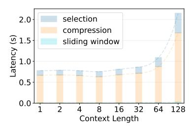

Figure 6: Inference latency of each branch in VideoNSA.

launch overheads. Overall, the compression branch emerges as the primary bottleneck, highlighting the need for further optimization of its kernel design and memory efficiency.

*Finding* **6.** Do learnable sparse mechanisms induce dynamic attention sinks?

In decoder-only transformers, a disproportionate amount of attention is often allocated to the first few tokens, which act as attention sinks and absorb excessive attention mass as a byproduct of softmax normalization. Prior studies (Gu et al., 2024; Xiao et al., 2023) show that attention sinks arise from massive activations and unusually small key and value norms, so attention directed to these tokens contributes little to the residual state. This raises an important question in learnable sparse attention: whether sparsity patterns amplify or mitigate such sinks.

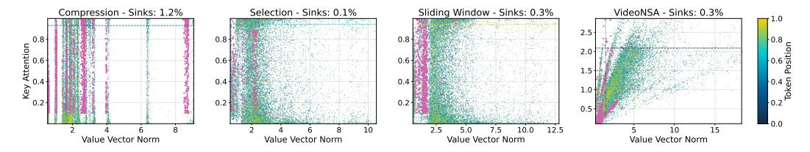

Figure 7: Attention sinks distribution of different branches. VideoNSA maintains a low overall sink ratio, with pink points indicating identified sinks.

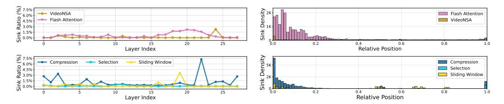

bution in different branches and Flash Attention. different branches and Flash Attention.

Figure 8: Layer-wise attention sink ratio distri- Figure 9: Relative positions of attention sinks in

We follow the attention sink defination in (Pai et al., 2025a):

$$\text{Attention Sink} = \mathbf{1} \Big\{ \alpha > 0.1 \ \land \ \|v\| < \text{median}(\|v\|) - 2 \cdot \text{IQR}(\|v\|) \Big\},$$

where  $\alpha$  is the average attention score received by the key, and ||v|| is the value norm of the token.

Figure 7 illustrates the average distribution of attention sinks across the three branches of VideoNSA. Each frame is encoded into 256 tokens, and we adopt the same sparse attention configuration as used during training. The three branches exhibit markedly different sink behaviors. The compression branch produces the most sinks, with distinct banded concentrations along the value norm axis caused by token merging that amplifies some token norms while suppressing others. Conversely, the selection branch yields almost no sinks, as its top-k block filtering mechanism enforces a smoother value norm distribution. Notably, the sliding window branch demonstrates a clearer separation between sink and non-sink tokens along the value norm axis. Critically, dynamic gating allows VideoNSA to counteract the negative effects of the compression branch, achieving a stable model with a low overall sink ratio of 0.3%.

Figure 8 indicates that VideoNSA maintains low sink ratios overall, with only minor fluctuations across layers. However, Flash Attention exhibits a gradual increase in sink ratios toward deeper layers. The compression branch maintains relatively high sink levels across most layers. The selection branch remains consistently close to zero, while the sliding window branch occasionally shows higher peaks in the middle-to-late layers, indicating that locality constraints may still introduce bias in long-sequence settings. From the perspective of positional distribution in Figure 9, Flash Attention produces sinks that are uniformly spread across the entire sequence due to its fully connected dense attention. Under dynamic gating, Video NSA achieves smoother temporal coverage, alleviating over-reliance on early positions while avoiding the global diffusion characteristic of dense attention. In contrast, the compression branch exhibits strong accumulation at the beginning with an even steeper decay, indicating that token merging exerts its strongest impact on early-stage representations. The selection branch yields very few sinks across the sequence, while the sliding window branch produces sparse peaks at periodic boundaries of local neighborhoods. More analysis about attention sinks on various sparse attention settings can be found in Appendix S.

## 5 CONCLUSION

In this work, we present VideoNSA, a hybrid hardware-aware sparse attention model that significantly advances video understanding across various tasks. By dynamically fusing block-wise compression, salient block selection, and a sliding window, VideoNSA effectively preserves critical information while achieving near-linear scalability in efficiency and memory. Our experiments demonstrate that VideoNSA consistently outperforms existing methods on key tasks including long video understanding, temporal reasoning, and spatial understanding. While the prefill stage remains the primary bottleneck, our findings confirm that this hybrid sparse approach provides a powerful and scalable framework, paving the way for more capable video foundation models.

## 6 ACKNOWLEDGEMENT

This work is supported by NSF award IIS-2127544 and NSF award IIS-2433768. We thank Lambda, Inc. for their compute resource help on this project.

## 7 ETHICS STATEMENT

This research on video understanding utilizes publicly available datasets, ensuring that all data complies with privacy regulations. We acknowledge the potential biases that can arise in automatic answer generation, particularly concerning gender, race, or other characteristics. We have taken measures to evaluate and minimize such biases, while remaining committed to further improvements. Additionally, we recognize the potential risks of misuse, such as generating misleading answers, and have checked the training dataset with safeguards against such applications.

## 8 REPRODUCIBILITY STATEMENT

We have made several efforts to ensure the reproducibility of our work. All the key implementation details, including the architecture of our model, the training procedures, and hyperparameter settings, are described in supplementary meterial Section [B.](#page-19-0) The settings of the used evaluation benchmarks are in Section [C](#page-19-1) to further support reproducibility.

## 9 THE USE OF LARGE LANGUAGE MODELS

Large language models (LLMs) were used only for light editorial purposes, such as minor grammar checking and language polishing. They were not used for generating scientific content, research ideation, experiment design, or analysis. The authors take full responsibility for the entirety of the paper, and LLMs are not considered contributors or eligible for authorship.

## REFERENCES

Joshua Ainslie, James Lee-Thorp, Michiel De Jong, Yury Zemlyanskiy, Federico Lebron, and Sumit ´ Sanghai. Gqa: Training generalized multi-query transformer models from multi-head checkpoints. *arXiv preprint arXiv:2305.13245*, 2023.

Shuai Bai, Keqin Chen, Xuejing Liu, Jialin Wang, Wenbin Ge, Sibo Song, Kai Dang, Peng Wang, Shijie Wang, Jun Tang, et al. Qwen2. 5-vl technical report. *arXiv preprint arXiv:2502.13923*, 2025.

Payman Behnam, Yaosheng Fu, Ritchie Zhao, Po-An Tsai, Zhiding Yu, and Alexey Tumanov. Rocketkv: Accelerating long-context llm inference via two-stage kv cache compression, 2025.

Iz Beltagy, Matthew E Peters, and Arman Cohan. Longformer: The long-document transformer. *arXiv preprint arXiv:2004.05150*, 2020.

Mu Cai, Reuben Tan, Jianrui Zhang, Bocheng Zou, Kai Zhang, Feng Yao, Fangrui Zhu, Jing Gu, Yiwu Zhong, Yuzhang Shang, et al. Temporalbench: Benchmarking fine-grained temporal understanding for multimodal video models. *arXiv preprint arXiv:2410.10818*, 2024.

- Jiawang Cao, Yongliang Wu, Weiheng Chi, Wenbo Zhu, Ziyue Su, and Jay Wu. Reframe anything: Llm agent for open world video reframing. *ArXiv*, abs/2403.06070, 2024. URL [https://api.](https://api.semanticscholar.org/CorpusID:268357047) [semanticscholar.org/CorpusID:268357047](https://api.semanticscholar.org/CorpusID:268357047).
- Wenhao Chai, Enxin Song, Yilun Du, Chenlin Meng, Vashisht Madhavan, Omer Bar-Tal, Jenq-Neng Hwang, Saining Xie, and Christopher D Manning. Auroracap: Efficient, performant video detailed captioning and a new benchmark. *arXiv preprint arXiv:2410.03051*, 2024.
- Liang Chen, Haozhe Zhao, Tianyu Liu, Shuai Bai, Junyang Lin, Chang Zhou, and Baobao Chang. An image is worth 1/2 tokens after layer 2: Plug-and-play inference acceleration for large visionlanguage models. In *European Conference on Computer Vision*, pp. 19–35. Springer, 2024a.
- Shouyuan Chen, Sherman Wong, Liangjian Chen, and Yuandong Tian. Extending context window of large language models via positional interpolation. *arXiv preprint arXiv:2306.15595*, 2023.
- Yukang Chen, Fuzhao Xue, Dacheng Li, Qinghao Hu, Ligeng Zhu, Xiuyu Li, Yunhao Fang, Haotian Tang, Shang Yang, Zhijian Liu, et al. Longvila: Scaling long-context visual language models for long videos. *arXiv preprint arXiv:2408.10188*, 2024b.
- Zhe Chen, Weiyun Wang, Yue Cao, Yangzhou Liu, Zhangwei Gao, Erfei Cui, Jinguo Zhu, Shenglong Ye, Hao Tian, Zhaoyang Liu, et al. Expanding performance boundaries of open-source multimodal models with model, data, and test-time scaling. *arXiv preprint arXiv:2412.05271*, 2024c.
- Hyungjin Chung, Hyelin Nam, Jiyeon Kim, Hyojun Go, Byeongjun Park, Junho Kim, Joonseok Lee, Seongsu Ha, and Byung-Hoon Kim. Video parallel scaling: Aggregating diverse frame subsets for videollms. *ArXiv*, abs/2509.08016, 2025. URL [https://api.semanticscholar.org/](https://api.semanticscholar.org/CorpusID:281244325) [CorpusID:281244325](https://api.semanticscholar.org/CorpusID:281244325).
- Tri Dao. Flashattention-2: Faster attention with better parallelism and work partitioning. *arXiv preprint arXiv:2307.08691*, 2023.
- Sixun Dong, Juhua Hu, Mian Zhang, Ming Yin, Yanjie Fu, and Qi Qian. Mmtok: Multimodal coverage maximization for efficient inference of vlms, 2025.
- Haodong Duan, Junming Yang, Yuxuan Qiao, Xinyu Fang, Lin Chen, Yuan Liu, Xiaoyi Dong, Yuhang Zang, Pan Zhang, Jiaqi Wang, et al. Vlmevalkit: An open-source toolkit for evaluating large multi-modality models. In *Proceedings of the 32nd ACM international conference on multimedia*, pp. 11198–11201, 2024.
- Yizhao Gao, Zhichen Zeng, Dayou Du, Shijie Cao, Peiyuan Zhou, Jiaxing Qi, Junjie Lai, Hayden Kwok-Hay So, Ting Cao, Fan Yang, et al. Seerattention: Learning intrinsic sparse attention in your llms. *arXiv preprint arXiv:2410.13276*, 2024.
- Yizhao Gao, Shuming Guo, Shijie Cao, Yuqing Xia, Yu Cheng, Lei Wang, Lingxiao Ma, Yutao Sun, Tianzhu Ye, Li Dong, Hayden Kwok-Hay So, Yu Hua, Ting Cao, Fan Yang, and Mao Yang. Seerattention-r: Sparse attention adaptation for long reasoning, 2025.
- Xiangming Gu, Tianyu Pang, Chao Du, Qian Liu, Fengzhuo Zhang, Cunxiao Du, Ye Wang, and Min Lin. When attention sink emerges in language models: An empirical view. *arXiv preprint arXiv:2410.10781*, 2024.
- Zhongrui Gui, Junyu Xie, Tengda Han, Weidi Xie, and Andrew Zisserman. Character-centric understanding of animated movies. *Proceedings of the 33rd ACM International Conference on Multimedia*, 2025. URL <https://api.semanticscholar.org/CorpusID:281316240>.
- Chi Han, Qifan Wang, Wenhan Xiong, Yu Chen, Heng Ji, and Sinong Wang. Lm-infinite: Simple on-the-fly length generalization for large language models. 2023.
- Zhiyuan He, Yike Zhang, Chengruidong Zhang, Huiqiang Jiang, Yuqing Yang, and Lili Qiu. Trianglemix: A lossless and efficient attention pattern for long context prefilling, 2025.
- Yu Huang, Zixin Wen, Aarti Singh, Yuejie Chi, and Yuxin Chen. Transformers provably learn chain-of-thought reasoning with length generalization. *arXiv preprint arXiv:2511.07378*, 2025.

- Jeongseok Hyun, Sukjun Hwang, Su Ho Han, Taeoh Kim, Inwoong Lee, Dongyoon Wee, Joon-Young Lee, Seon Joo Kim, and Minho Shim. Multi-granular spatio-temporal token merging for training-free acceleration of video llms. *arXiv preprint arXiv:2507.07990*, 2025.
- Huiqiang Jiang, Yucheng Li, Chengruidong Zhang, Qianhui Wu, Xufang Luo, Surin Ahn, Zhenhua Han, Amir H Abdi, Dongsheng Li, Chin-Yew Lin, et al. Minference 1.0: Accelerating pre-filling for long-context llms via dynamic sparse attention. *Advances in Neural Information Processing Systems*, 37:52481–52515, 2024.
- Jindong Jiang, Xiuyu Li, Zhijian Liu, Muyang Li, Guo Chen, Zhiqi Li, De-An Huang, Guilin Liu, Zhiding Yu, Kurt Keutzer, Sungjin Ahn, Jan Kautz, Hongxu Yin, Yao Lu, Song Han, and Wonmin Byeon. Storm: Token-efficient long video understanding for multimodal llms, 2025a.
- Pengfei Jiang, Hanjun Li, Linglan Zhao, Fei Chao, Ke Yan, Shouhong Ding, and Rongrong Ji. Visa: Group-wise visual token selection and aggregation via graph summarization for efficient mllms inference. 2025b. doi: 10.1145/3746027.3755792.
- Peng Jin, Ryuichi Takanobu, Wancai Zhang, Xiaochun Cao, and Li Yuan. Chat-univi: Unified visual representation empowers large language models with image and video understanding. In *Proceedings of the IEEE/CVF Conference on Computer Vision and Pattern Recognition*, pp. 13700– 13710, 2024.
- Chaitanya K Joshi. Transformers are graph neural networks. *arXiv preprint arXiv:2506.22084*, 2025.
- Michael Kalloniatis and Charles Luu. Temporal resolution. In Helga Kolb, Eduardo Fernandez, Ralph Nelson, and Bryan Jones (eds.), *Webvision: The Organization of the Retina and Visual System*. University of Utah Health Sciences Center, Salt Lake City (UT), 2007. URL [https:](https://www.ncbi.nlm.nih.gov/books/NBK11559/) [//www.ncbi.nlm.nih.gov/books/NBK11559/](https://www.ncbi.nlm.nih.gov/books/NBK11559/). Accessed September 24, 2025.
- Minsoo Kim, Kyuhong Shim, Jungwook Choi, and Simyung Chang. Infinipot-v: Memoryconstrained kv cache compression for streaming video understanding, 2025.
- Henry Ko. Optimizing nsa for tpus – kernel worklog. [https://henryhmko.github.io/](https://henryhmko.github.io/posts/nsa_tpu/nsa_tpu.html) [posts/nsa\\_tpu/nsa\\_tpu.html](https://henryhmko.github.io/posts/nsa_tpu/nsa_tpu.html), 2025. Blog post.
- Xunhao Lai, Jianqiao Lu, Yao Luo, Yiyuan Ma, and Xun Zhou. Flexprefill: A context-aware sparse attention mechanism for efficient long-sequence inference. *arXiv preprint arXiv:2502.20766*, 2025.
- Bo Li, Yuanhan Zhang, Dong Guo, Renrui Zhang, Feng Li, Hao Zhang, Kaichen Zhang, Peiyuan Zhang, Yanwei Li, Ziwei Liu, et al. Llava-onevision: Easy visual task transfer. *arXiv preprint arXiv:2408.03326*, 2024a.
- Bozheng Li, Yongliang Wu, Yi Lu, Jiashuo Yu, Licheng Tang, Jiawang Cao, Wenqing Zhu, Yuyang Sun, Jay Wu, and Wenbo Zhu. Veu-bench: Towards comprehensive understanding of video editing. *2025 IEEE/CVF Conference on Computer Vision and Pattern Recognition (CVPR)*, pp. 13671–13680, 2025a. URL [https://api.semanticscholar.org/CorpusID:](https://api.semanticscholar.org/CorpusID:278130017) [278130017](https://api.semanticscholar.org/CorpusID:278130017).
- Chenglin Li, Feng Han, Feng Tao, Ruilin Li, Qianglong Chen, Jingqi Tong, Yin Zhang, and Jiaqi Wang. Videopro: Adaptive program reasoning for long video understanding. 2025b. URL <https://api.semanticscholar.org/CorpusID:281421215>.
- Handong Li, Yiyuan Zhang, Longteng Guo, Xiangyu Yue, and Jing Liu. Breaking the encoder barrier for seamless video-language understanding, 2025c.
- Hongyu Li, Songhao Han, Yue Liao, Junfeng Luo, Jialin Gao, Shuicheng Yan, and Si Liu. Reinforcement learning tuning for videollms: Reward design and data efficiency. *arXiv preprint arXiv:2506.01908*, 2025d.

- Li Li, Yongliang Wu, Jingze Zhu, Jiawei Peng, Jianfei Cai, and Xu Yang. Unveiling effective in-context configurations for image captioning: An external & internal analysis. *ArXiv*, abs/2507.08021, 2025e. URL [https://api.semanticscholar.org/CorpusID:](https://api.semanticscholar.org/CorpusID:280282985) [280282985](https://api.semanticscholar.org/CorpusID:280282985).
- Xinhao Li, Yi Wang, Jiashuo Yu, Xiangyu Zeng, Yuhan Zhu, Haian Huang, Jianfei Gao, Kunchang Li, Yinan He, Chenting Wang, et al. Videochat-flash: Hierarchical compression for long-context video modeling. *arXiv preprint arXiv:2501.00574*, 2024b.
- Yixuan Li, Changli Tang, Jimin Zhuang, Yudong Yang, Guangzhi Sun, Wei Li, Zejun Ma, and Chao Zhang. Improving llm video understanding with 16 frames per second, 2025f.
- Yucheng Li, Huiqiang Jiang, Qianhui Wu, Xufang Luo, Surin Ahn, Chengruidong Zhang, Amir H Abdi, Dongsheng Li, Jianfeng Gao, Yuqing Yang, et al. Scbench: A kv cache-centric analysis of long-context methods. *arXiv preprint arXiv:2412.10319*, 2024c.
- Yucheng Li, Huiqiang Jiang, Chengruidong Zhang, Qianhui Wu, Xufang Luo, Surin Ahn, Amir H. Abdi, Dongsheng Li, Jianfeng Gao, Yuqing Yang, and Lili Qiu. Mminference: Accelerating pre-filling for long-context vlms via modality-aware permutation sparse attention, 2025g.
- Manlai Liang, Wanyi Huang, Mandi Liu, Huaijun Li, and Jinlong Li. Lag-relative sparse attention in long context training, 2025.
- Chenfei Liao, Wensong Wang, Zichen Wen, Xu Zheng, Yiyu Wang, Haocong He, Yuanhuiyi Lyu, Lutao Jiang, Xin Zou, Yuqian Fu, Bin Ren, Linfeng Zhang, and Xuming Hu. Are we using the right benchmark: An evaluation framework for visual token compression methods. *ArXiv*, abs/2510.07143, 2025. URL [https://api.semanticscholar.org/](https://api.semanticscholar.org/CorpusID:281891667) [CorpusID:281891667](https://api.semanticscholar.org/CorpusID:281891667).
- Xiangrui Liu, Minghao Qin, Yan Shu, Zhengyang Liang, Yang Tian, Chen Jason Zhang, Bo Zhao, and Zheng Liu. Timescope: Towards task-oriented temporal grounding in long videos. *ArXiv*, abs/2509.26360, 2025. URL [https://api.semanticscholar.org/](https://api.semanticscholar.org/CorpusID:281681418) [CorpusID:281681418](https://api.semanticscholar.org/CorpusID:281681418).
- Ilya Loshchilov and Frank Hutter. Decoupled weight decay regularization. *arXiv preprint arXiv:1711.05101*, 2017.
- Wentao Ma, Weiming Ren, Yiming Jia, Zhuofeng Li, Ping Nie, Ge Zhang, and Wenhu Chen. Videoeval-pro: Robust and realistic long video understanding evaluation. *arXiv preprint arXiv:2505.14640*, 2025.
- mdy666. Scalable-flash-native-sparse-attention. [https://github.com/mdy666/](https://github.com/mdy666/Scalable-Flash-Native-Sparse-Attention) [Scalable-Flash-Native-Sparse-Attention](https://github.com/mdy666/Scalable-Flash-Native-Sparse-Attention), 2025. GitHub repository.
- Zhenyu Ning, Guangda Liu, Qihao Jin, Wenchao Ding, Minyi Guo, and Jieru Zhao. Livevlm: Efficient online video understanding via streaming-oriented kv cache and retrieval, 2025.
- Dhruv Pai, Timor Averbuch, Mason Wang, and Ben Keigwin. Sparsity is cool. Blog post, Tilde Research, June 2025a. URL <https://www.tilderesearch.com/blog/sparse-attn>. Tilde; correspondence to dhruv@tilderesearch.com.
- Dhruv Pai, Timor Averbuch, Mason Wang, and Ben Keigwin. Sparsity is cool. [https://www.](https://www.tilderesearch.com/blog/sparse-attn) [tilderesearch.com/blog/sparse-attn](https://www.tilderesearch.com/blog/sparse-attn), June 25 2025b. Tilde Research Blog.
- Francesco Pappone. Attention sinks from the graph perspective. [https://publish.](https://publish.obsidian.md/the-tensor-throne/Transformers+as+GNNs/Attention+sinks+from+the+graph+perspective) [obsidian.md/the-tensor-throne/Transformers+as+GNNs/Attention+](https://publish.obsidian.md/the-tensor-throne/Transformers+as+GNNs/Attention+sinks+from+the+graph+perspective) [sinks+from+the+graph+perspective](https://publish.obsidian.md/the-tensor-throne/Transformers+as+GNNs/Attention+sinks+from+the+graph+perspective), August 2025. Blogpost.
- Ofir Press, Noah A Smith, and Mike Lewis. Train short, test long: Attention with linear biases enables input length extrapolation. *arXiv preprint arXiv:2108.12409*, 2021.
- Minghao Qin, Xiangrui Liu, Zhengyang Liang, Yan Shu, Huaying Yuan, Juenjie Zhou, Shitao Xiao, Bo Zhao, and Zheng Liu. Video-xl-2: Towards very long-video understanding through task-aware kv sparsification, 2025a.

- Minghao Qin, Xiangrui Liu, Zhengyang Liang, Yan Shu, Huaying Yuan, Juenjie Zhou, Shitao Xiao, Bo Zhao, and Zheng Liu. Video-xl-2: Towards very long-video understanding through task-aware kv sparsification. *arXiv preprint arXiv:2506.19225*, 2025b.
- Tianheng Qiu, Jingchun Gao, Jingyu Li, Huiyi Leong, Xuan Huang, Xi Wang, Xiaocheng Zhang, Kele Xu, and Lan Zhang. Intentvcnet: Bridging spatio-temporal gaps for intention-oriented controllable video captioning. In *Proceedings of the 33rd ACM International Conference on Multimedia*, pp. 13822–13829, 2025.
- Tianyuan Qu, Longxiang Tang, Bohao Peng, Senqiao Yang, Bei Yu, and Jiaya Jia. Does your visionlanguage model get lost in the long video sampling dilemma? *arXiv preprint arXiv:2503.12496*, 2025.
- Qwen, :, An Yang, Baosong Yang, Beichen Zhang, Binyuan Hui, Bo Zheng, Bowen Yu, Chengyuan Li, Dayiheng Liu, Fei Huang, Haoran Wei, Huan Lin, Jian Yang, Jianhong Tu, Jianwei Zhang, Jianxin Yang, Jiaxi Yang, Jingren Zhou, Junyang Lin, Kai Dang, Keming Lu, Keqin Bao, Kexin Yang, Le Yu, Mei Li, Mingfeng Xue, Pei Zhang, Qin Zhu, Rui Men, Runji Lin, Tianhao Li, Tianyi Tang, Tingyu Xia, Xingzhang Ren, Xuancheng Ren, Yang Fan, Yang Su, Yichang Zhang, Yu Wan, Yuqiong Liu, Zeyu Cui, Zhenru Zhang, and Zihan Qiu. Qwen2.5 technical report, 2025. URL <https://arxiv.org/abs/2412.15115>.
- Weiming Ren, Wentao Ma, Huan Yang, Cong Wei, Ge Zhang, and Wenhu Chen. Vamba: Understanding hour-long videos with hybrid mamba-transformers, 2025.
- Ziyao Shangguan, Chuhan Li, Yuxuan Ding, Yanan Zheng, Yilun Zhao, Tesca Fitzgerald, and Arman Cohan. Tomato: Assessing visual temporal reasoning capabilities in multimodal foundation models. *arXiv preprint arXiv:2410.23266*, 2024.
- Kele Shao, Keda Tao, Kejia Zhang, Sicheng Feng, Mu Cai, Yuzhang Shang, Haoxuan You, Can Qin, Yang Sui, and Huan Wang. When tokens talk too much: A survey of multimodal long-context token compression across images, videos, and audios, 2025.
- Yan Shu, Zheng Liu, Peitian Zhang, Minghao Qin, Junjie Zhou, Zhengyang Liang, Tiejun Huang, and Bo Zhao. Video-xl: Extra-long vision language model for hour-scale video understanding. In *Proceedings of the Computer Vision and Pattern Recognition Conference*, pp. 26160–26169, 2025.
- Enxin Song, Wenhao Chai, Guanhong Wang, Yucheng Zhang, Haoyang Zhou, Feiyang Wu, Haozhe Chi, Xun Guo, Tian Ye, Yanting Zhang, et al. Moviechat: From dense token to sparse memory for long video understanding. In *Proceedings of the IEEE/CVF Conference on Computer Vision and Pattern Recognition*, pp. 18221–18232, 2024.
- Enxin Song, Wenhao Chai, Weili Xu, Jianwen Xie, Yuxuan Liu, and Gaoang Wang. Video-mmlu: A massive multi-discipline lecture understanding benchmark. *arXiv preprint arXiv:2504.14693*, 2025a.
- Enxin Song, Wenhao Chai, Tian Ye, Jenq-Neng Hwang, Xi Li, and Gaoang Wang. Moviechat+: Question-aware sparse memory for long video question answering. *IEEE Transactions on Pattern Analysis and Machine Intelligence*, 2025b.
- Jianlin Su, Murtadha Ahmed, Yu Lu, Shengfeng Pan, Wen Bo, and Yunfeng Liu. Roformer: Enhanced transformer with rotary position embedding. *Neurocomputing*, 568:127063, 2024.
- Hongyuan Tao, Bencheng Liao, Shaoyu Chen, Haoran Yin, Qian Zhang, Wenyu Liu, and Xinggang Wang. Infinitevl: Synergizing linear and sparse attention for highly-efficient, unlimited-input vision-language models. *ArXiv*, abs/2512.08829, 2025. URL [https://api.](https://api.semanticscholar.org/CorpusID:283711609) [semanticscholar.org/CorpusID:283711609](https://api.semanticscholar.org/CorpusID:283711609).
- Core Team, Zihao Yue, Zhenru Lin, Yifan Song, Weikun Wang, Shuhuai Ren, Shuhao Gu, Shicheng Li, Peidian Li, Liang Zhao, Lei Li, Kainan Bao, Hao Tian, Hailin Zhang, Gang Wang, Dawei Zhu, Cici, Chenhong He, Bowen Ye, Bowen Shen, Zihan Zhang, Zihan Jiang, Zhixian Zheng, Zhichao Song, Zhenbo Luo, Yue Yu, Yudong Wang, Yuanyuan Tian, Yu Tu, Yihan Yan, Yi Huang, Xu Wang, Xinzhe Xu, Xingchen Song, Xing Zhang, Xing Yong, Xin Zhang, Xiangwei Deng,

- Wenyu Yang, Wenhan Ma, Weiwei Lv, Weiji Zhuang, Wei Liu, Sirui Deng, Shuo Liu, Shimao Chen, Shihua Yu, Shaohui Liu, Shande Wang, Rui Ma, Qiantong Wang, Peng Wang, Nuo Chen, Menghang Zhu, Kangyang Zhou, Kang Zhou, Kai Fang, Jun Shi, Jinhao Dong, Jiebao Xiao, Jiaming Xu, Huaqiu Liu, Hongshen Xu, Heng Qu, Haochen Zhao, Hanglong Lv, Guoan Wang, Duo Zhang, Dong Zhang, Di Zhang, Chong Ma, Chang Liu, Can Cai, and Bingquan Xia. Mimo-vl technical report, 2025a. URL <https://arxiv.org/abs/2506.03569>.
- Kimi Team, Angang Du, Bohong Yin, Bowei Xing, Bowen Qu, Bowen Wang, Cheng Chen, Chenlin Zhang, Chenzhuang Du, Chu Wei, et al. Kimi-vl technical report. *arXiv preprint arXiv:2504.07491*, 2025b.
- Kwai Keye Team. Kwai keye-vl technical report, 2025. URL [https://arxiv.org/abs/](https://arxiv.org/abs/2507.01949) [2507.01949](https://arxiv.org/abs/2507.01949).
- Qwen Team. Qwen2.5-vl-7b-instruct-awq. [https://huggingface.co/Qwen/Qwen2.](https://huggingface.co/Qwen/Qwen2.5-VL-7B-Instruct-AWQ) [5-VL-7B-Instruct-AWQ](https://huggingface.co/Qwen/Qwen2.5-VL-7B-Instruct-AWQ), 2024.
- Abhishek Tyagi, Arjun Iyer, William H Renninger, Christopher Kanan, and Yuhao Zhu. Dynamic sparse training of diagonally sparse networks, 2025.
- Pavlo Vasylenko, Marcos Treviso, and Andre F. T. Martins. Long-context generalization with sparse ´ attention, 2025.
- Xiao Wang, Qingyi Si, Jianlong Wu, Shiyu Zhu, Li Cao, and Liqiang Nie. Retake: Reducing temporal and knowledge redundancy for long video understanding. *arXiv preprint arXiv:2412.20504*, 2024.
- Yi Wang, Xinhao Li, Ziang Yan, Yinan He, Jiashuo Yu, Xiangyu Zeng, Chenting Wang, Changlian Ma, Haian Huang, Jianfei Gao, et al. Internvideo2. 5: Empowering video mllms with long and rich context modeling. *arXiv preprint arXiv:2501.12386*, 2025a.
- Yixuan Wang, Huang He, Siqi Bao, Hua Wu, Haifeng Wang, Qingfu Zhu, and Wanxiang Che. Proxyattn: Guided sparse attention via representative heads. *arXiv preprint arXiv:2509.24745*, 2025b.
- Ziyi Wang, Haoran Wu, Yiming Rong, Deyang Jiang, Yixin Zhang, Yunlong Zhao, Shuang Xu, and Bo XU. Lvc: A lightweight compression framework for enhancing vlms in long video understanding, 2025c.
- Zichen Wen, Yifeng Gao, Weijia Li, Conghui He, and Linfeng Zhang. Token pruning in multimodal large language models: Are we solving the right problem? *arXiv preprint arXiv:2502.11501*, 2025.
- Haoning Wu, Dongxu Li, Bei Chen, and Junnan Li. Longvideobench: A benchmark for long-context interleaved video-language understanding. *Advances in Neural Information Processing Systems*, 37:28828–28857, 2024a.
- Yongliang Wu, Bozheng Li, Jiawang Cao, Wenbo Zhu, Yi Lu, Weiheng Chi, Chuyun Xie, Haolin Zheng, Ziyue Su, Jay Wu, and Xu Yang. Zero-shot long-form video understanding through screenplay. *ArXiv*, abs/2406.17309, 2024b. URL [https://api.semanticscholar.org/](https://api.semanticscholar.org/CorpusID:270710917) [CorpusID:270710917](https://api.semanticscholar.org/CorpusID:270710917).
- Yongliang Wu, Wenbo Zhu, Jiawang Cao, Yi Lu, Bozheng Li, Weiheng Chi, Zihan Qiu, Lirian Su, Haolin Zheng, Jay Wu, and Xu Yang. Video repurposing from user generated content: A large-scale dataset and benchmark. *ArXiv*, abs/2412.08879, 2024c. URL [https://api.](https://api.semanticscholar.org/CorpusID:274656300) [semanticscholar.org/CorpusID:274656300](https://api.semanticscholar.org/CorpusID:274656300).
- Yongliang Wu, Xinting Hu, Yuyang Sun, Yizhou Zhou, Wenbo Zhu, Fengyun Rao, Bernt Schiele, and Xu Yang. Number it: Temporal grounding videos like flipping manga. In *Proceedings of the IEEE/CVF Conference on Computer Vision and Pattern Recognition (CVPR)*, pp. 13754–13765, June 2025a.

- Yongliang Wu, Yizhou Zhou, Ziheng Zhou, Yingzhe Peng, Xinyu Ye, Xinting Hu, Wenbo Zhu, Lu Qi, Mingzhuo Yang, and Xu Yang. On the generalization of sft: A reinforcement learning perspective with reward rectification. *ArXiv*, abs/2508.05629, 2025b. URL [https://api.](https://api.semanticscholar.org/CorpusID:280545885) [semanticscholar.org/CorpusID:280545885](https://api.semanticscholar.org/CorpusID:280545885).
- Guangxuan Xiao, Yuandong Tian, Beidi Chen, Song Han, and Mike Lewis. Efficient streaming language models with attention sinks. *arXiv preprint arXiv:2309.17453*, 2023.
- Guangxuan Xiao, Yuandong Tian, Beidi Chen, Song Han, and Mike Lewis. Efficient streaming language models with attention sinks. In *The Twelfth International Conference on Learning Representations*, 2024.
- Ruyi Xu, Guangxuan Xiao, Haofeng Huang, Junxian Guo, and Song Han. Xattention: Block sparse attention with antidiagonal scoring. *arXiv preprint arXiv:2503.16428*, 2025a.
- Weili Xu, Enxin Song, Wenhao Chai, Xuexiang Wen, Tian Ye, and Gaoang Wang. Auroralong: Bringing rnns back to efficient open-ended video understanding. *arXiv preprint arXiv:2507.02591*, 2025b.
- Ran Yan, Youhe Jiang, and Binhang Yuan. Flash sparse attention: An alternative efficient implementation of native sparse attention kernel, 2025.
- Chenyu Yang, Xuan Dong, Xizhou Zhu, Weijie Su, Jiahao Wang, Hao Tian, Zhe Chen, Wenhai Wang, Lewei Lu, , and Jifeng Dai. Pvc: Progressive visual token compression for unified image and video processing in large vision-language models. *arXiv preprint arXiv:2412.09613*, 2024.
- Jihan Yang, Shusheng Yang, Anjali W. Gupta, Rilyn Han, Li Fei-Fei, and Saining Xie. Thinking in space: How multimodal large language models see, remember, and recall spaces, 2025a. URL <https://arxiv.org/abs/2412.14171>.
- Lijie Yang, Zhihao Zhang, Arti Jain, Shijie Cao, Baihong Yuan, Yiwei Chen, Zhihao Jia, and Ravi Netravali. Less is more: Training-free sparse attention with global locality for efficient reasoning, 2025b.
- Senqiao Yang, Yukang Chen, Zhuotao Tian, Chengyao Wang, Jingyao Li, Bei Yu, and Jiaya Jia. Visionzip: Longer is better but not necessary in vision language models. In *Proceedings of the Computer Vision and Pattern Recognition Conference*, pp. 19792–19802, 2025c.
- Sihan Yang, Runsen Xu, Chenhang Cui, Tai Wang, Dahua Lin, and Jiangmiao Pang. Vflowopt: A token pruning framework for lmms with visual information flow-guided optimization. *arXiv preprint arXiv:2508.05211*, 2025d.
- Songlin Yang and Yu Zhang. Fla: A triton-based library for hardware-efficient implementations of linear attention mechanism, January 2024. URL [https://github.com/fla-org/](https://github.com/fla-org/flash-linear-attention) [flash-linear-attention](https://github.com/fla-org/flash-linear-attention).
- Xu Yang, Yongliang Wu, Ming-Hsuan Yang, Haokun Chen, and Xin Geng. Exploring diverse in-context configurations for image captioning. *ArXiv*, abs/2305.14800, 2023. URL [https:](https://api.semanticscholar.org/CorpusID:258865250) [//api.semanticscholar.org/CorpusID:258865250](https://api.semanticscholar.org/CorpusID:258865250).
- Yanlai Yang, Zhuokai Zhao, Satya Narayan Shukla, Aashu Singh, Shlok Kumar Mishra, Lizhu Zhang, and Mengye Ren. Streammem: Query-agnostic kv cache memory for streaming video understanding, 2025e.
- Linli Yao, Yicheng Li, Yuancheng Wei, Lei Li, Shuhuai Ren, Yuanxin Liu, Kun Ouyang, Lean Wang, Shicheng Li, Sida Li, Lingpeng Kong, Qi Liu, Yuanxing Zhang, and Xu Sun. Timechat-online: 80
- Chao Yuan, Yang Yang, Yehui Yang, and Zach Cheng. Date: Dynamic absolute time enhancement for long video understanding, 2025a. URL <https://arxiv.org/abs/2509.09263>.
- Jingyang Yuan, Huazuo Gao, Damai Dai, Junyu Luo, Liang Zhao, Zhengyan Zhang, Zhenda Xie, Y. X. Wei, Lean Wang, Zhiping Xiao, Yuqing Wang, Chong Ruan, Ming Zhang, Wenfeng Liang, and Wangding Zeng. Native sparse attention: Hardware-aligned and natively trainable sparse attention, 2025b.

- Jingyang Yuan, Huazuo Gao, Damai Dai, Junyu Luo, Liang Zhao, Zhengyan Zhang, Zhenda Xie, YX Wei, Lean Wang, Zhiping Xiao, et al. Native sparse attention: Hardware-aligned and natively trainable sparse attention. *arXiv preprint arXiv:2502.11089*, 2025c.
- Zhihao Zhan, Jianan Zhao, Zhaocheng Zhu, and Jian Tang. Overcoming long-context limitations of state-space models via context-dependent sparse attention, 2025.
- Boqiang Zhang, Kehan Li, Zesen Cheng, Zhiqiang Hu, Yuqian Yuan, Guanzheng Chen, Sicong Leng, Yuming Jiang, Hang Zhang, Xin Li, et al. Videollama 3: Frontier multimodal foundation models for image and video understanding. *arXiv preprint arXiv:2501.13106*, 2025a.
- Ce Zhang, Kaixin Ma, Tianqing Fang, Wenhao Yu, Hongming Zhang, Zhisong Zhang, Yaqi Xie, Katia Sycara, Haitao Mi, and Dong Yu. Vscan: Rethinking visual token reduction for efficient large vision-language models. *arXiv preprint arXiv:2505.22654*, 2025b.
- Dell Zhang, Xiangyu Chen, Jixiang Luo, Mengxi Jia, Changzhi Sun, Ruilong Ren, Jingren Liu, Hao Sun, and Xuelong Li. Infinite video understanding. *arXiv preprint arXiv:2507.09068*, 2025c.
- Haichao Zhang and Yun Fu. Neural discrete token representation learning for extreme token reduction in video large language models, 2025.
- Hanzhi Zhang, Heng Fan, Kewei Sha, Yan Huang, and Yunhe Feng. Dam: Dynamic attention mask for long-context large language model inference acceleration, 2025d.
- Jintao Zhang, Rundong Su, Chunyu Liu, Jia Wei, Ziteng Wang, Haoxu Wang, Pengle Zhang, Huiqiang Jiang, Haofeng Huang, Chendong Xiang, Haocheng Xi, Shuo Yang, Xingyang Li, Yuezhou Hu, Tianyu Fu, Tianchen Zhao, Yicheng Zhang, Boqun Cao, Youhe Jiang, Chang Chen, Kai Jiang, Huayu Chen, Min Zhao, Xiaoming Xu, Yi Wu, Fan Bao, Jun Zhu, and Jianfei Chen. A survey of efficient attention methods: Hardware-efficient, sparse, compact, and linear attention. 2025e.
- Jintao Zhang, Haoxu Wang, Kai Jiang, Shuo Yang, Kaiwen Zheng, Haocheng Xi, Ziteng Wang, Hongzhou Zhu, Min Zhao, Ion Stoica, et al. Sla: Beyond sparsity in diffusion transformers via fine-tunable sparse-linear attention. *arXiv preprint arXiv:2509.24006*, 2025f.
- Kaichen Zhang, Bo Li, Peiyuan Zhang, Fanyi Pu, Joshua Adrian Cahyono, Kairui Hu, Shuai Liu, Yuanhan Zhang, Jingkang Yang, Chunyuan Li, et al. Lmms-eval: Reality check on the evaluation of large multimodal models. *arXiv preprint arXiv:2407.12772*, 2024a.
- Peiyuan Zhang, Kaichen Zhang, Bo Li, Guangtao Zeng, Jingkang Yang, Yuanhan Zhang, Ziyue Wang, Haoran Tan, Chunyuan Li, and Ziwei Liu. Long context transfer from language to vision. *arXiv preprint arXiv:2406.16852*, 2024b.
- Peiyuan Zhang, Yongqi Chen, Haofeng Huang, Will Lin, Zhengzhong Liu, Ion Stoica, Eric Xing, and Hao Zhang. Vsa: Faster video diffusion with trainable sparse attention, 2025g.
- Yuanhan Zhang, Bo Li, haotian Liu, Yong jae Lee, Liangke Gui, Di Fu, Jiashi Feng, Ziwei Liu, and Chunyuan Li. Llava-next: A strong zero-shot video understanding model, April 2024c. URL <https://llava-vl.github.io/blog/2024-04-30-llava-next-video/>.
- Yuanhan Zhang, Jinming Wu, Wei Li, Bo Li, Zejun Ma, Ziwei Liu, and Chunyuan Li. Video instruction tuning with synthetic data. *arXiv preprint arXiv:2410.02713*, 2024d.
- Yuanhan Zhang, Jinming Wu, Wei Li, Bo Li, Zejun Ma, Ziwei Liu, and Chunyuan Li. Video instruction tuning with synthetic data, 2024e. URL <https://arxiv.org/abs/2410.02713>.
- Yunzhu Zhang, Yu Lu, Tianyi Wang, Fengyun Rao, Yi Yang, and Linchao Zhu. Flexselect: Flexible token selection for efficient long video understanding. *arXiv preprint arXiv:2506.00993*, 2025h.
- Weilin Zhao, Zihan Zhou, Zhou Su, Chaojun Xiao, Yuxuan Li, Yanghao Li, Yudi Zhang, Weilun Zhao, Zhen Li, Yuxiang Huang, et al. Infllm-v2: Dense-sparse switchable attention for seamless short-to-long adaptation. *arXiv preprint arXiv:2509.24663*, 2025.

- Yuze Zhao, Jintao Huang, Jinghan Hu, Xingjun Wang, Yunlin Mao, Daoze Zhang, Zeyinzi Jiang, Zhikai Wu, Baole Ai, Ang Wang, Wenmeng Zhou, and Yingda Chen. Swift:a scalable lightweight infrastructure for fine-tuning, 2024. URL <https://arxiv.org/abs/2408.05517>.
- Junjie Zhou, Yan Shu, Bo Zhao, Boya Wu, Shitao Xiao, Xi Yang, Yongping Xiong, Bo Zhang, Tiejun Huang, and Zheng Liu. Mlvu: A comprehensive benchmark for multi-task long video understanding. *arXiv e-prints*, pp. arXiv–2406, 2024.
- Orr Zohar, Xiaohan Wang, Rui Li, Andres Marafioti, Miquel Farr ´ e, Merve Noyan, Leandro von ´ Werra, Serena Yeung-Levy, and Thomas Wolf. Apollo2: Exploring the long-video frontier of large multimodal models, 2025.

## Appendix

The supplementary material is structured as follows:

- Iiterature review about the related works in Section [A.](#page-18-0)
- The training settings for VideoNSA in Section [B.](#page-19-0)
- The introduction of the used evaluation benchmarks and settings in Section [C.](#page-19-1)
- More results on long-form video benchmarks in Section [D.](#page-20-0)
- More results on temporal reasoning benchmarks in Section [E.](#page-21-0)
- More results on spatial understanding benchmarks in Section [F.](#page-21-1)
- Results on additional video understanding benchmarks in Section [G.](#page-21-2)
- Visualization of attention pattern in each branch in Section [H.](#page-22-0)
- More results on branch combination in Section [I.](#page-22-1)
- More results on information scaling study in Section [J.](#page-22-2)
- Additional context-length scaling results of Qwen2.5-VL in Section [K.](#page-23-0)
- More results on attention scaling study in Section [L.](#page-24-0)
- Theoretical analysis of context length and attention budget scaling in Section [M.](#page-26-0)
- Full gate values distribution in Section [N.](#page-31-0)
- More inter-head gate similarites visualization in Section [O.](#page-31-1)
- Benchmark-level gating analysis and PCA visualization in Section [P.](#page-32-0)
- Additional analysis of training and inference efficiency in Section [Q.](#page-33-0)
- Additional analysis on CMP latency bottleneck in Section [R.](#page-34-1)
- More analysis about attention sinks on various sparse attention settings can be found in Section [S.](#page-34-0)
- Comparison of sparsity patterns between text-only NSA and VideoNSA in Section [T.](#page-35-0)
- Visualization of attention sinks in dense attention in Section [U.](#page-38-0)

## A RELATED WORK

## A.1 EFFICIENT VIDEO UNDERSTANDING

Video understanding systems typically convert videos into long sequences of vision tokens, which can easily exceed GPU memory and slow down inference as the video length grows. To address this, existing work mainly address this by token compression, alternative sequence modeling, and KV-cache compression. One important line of work emphasizes token compression. Spatial or temporal token merging methods [\(Wang et al., 2025c;](#page-14-7) [Zhang & Fu, 2025;](#page-16-8) [Li et al., 2025f;](#page-12-5) [Jiang](#page-11-8) [et al., 2025a;](#page-11-8) [Li et al., 2025c;](#page-11-9) [Shao et al., 2025;](#page-13-6) [Song et al., 2024;](#page-13-7) [Chai et al., 2024;](#page-10-7) [Liao et al.,](#page-12-6) [2025;](#page-12-6) [Wu et al., 2025b;](#page-15-8) [2024b;](#page-14-8) [2025a;](#page-14-9) [2024c;](#page-14-10) [Cao et al., 2024;](#page-10-8) [Li et al., 2025a;](#page-11-10)[e;](#page-12-7) [Yang et al., 2023\)](#page-15-9) progressively discard redundant content, while question-/task-aware strategies [\(Jiang et al., 2025b;](#page-11-11) [Dong et al., 2025;](#page-10-9) [Yao et al., 2025;](#page-15-10) [Song et al., 2025b\)](#page-13-8) tailor retained tokens to the query. These approaches substantially lower FLOPs but still rely on dense attention once tokens are merged. Beyond pure self-attention, Mamba-based or hybrid architectures [\(Jiang et al., 2025a;](#page-11-8) [Ren et al.,](#page-13-9) [2025;](#page-13-9) [Xu et al., 2025b;](#page-15-11) [Tao et al., 2025\)](#page-13-10) inject state-space or recurrent modules to approach lineartime inference while preserving long-range dependencies. Also, there exists approach to design data efficient systems for further fine-tuning [\(Li et al., 2025d\)](#page-11-12). Another direction targets the key–value cache during decoding via task-aware sparsification and streaming-friendly memory [\(Qin et al.,](#page-12-8) [2025a;](#page-12-8) [Ning et al., 2025;](#page-12-9) [Kim et al., 2025;](#page-11-13) [Yang et al., 2025e;](#page-15-12) [Liu et al., 2025\)](#page-12-10) reduce memory and improve throughput, yet prefill still scales quadratically with sequence length. In contrast to methods that mostly decide *where* to drop or compress tokens, our approach systematically probe the effectiveness of *native sparse attention* [\(Yuan et al., 2025b\)](#page-15-13) that restructures attention itself to be learnable and sparse from the ground up. VideoNSA attains near-linear scalability up to 128K tokens and processes over 10,000 frames on a single GPU, outperforming compression-only pipelines on long-video understanding, temporal reasoning, and spatial understanding tasks.

## A.2 SPARSE ATTENTION MECHANISM

Sparse attention is a central strategy for efficient long-context modeling in language and multimodal systems. Surveys [\(Zhang et al., 2025e\)](#page-16-9) categorize approaches into *pattern-based* vs. *dynamic/learned*. Pattern-based sparsity. Methods such as Longformer [\(Beltagy et al., 2020\)](#page-9-3), StreamingLLM [\(Xiao et al., 2024\)](#page-15-14), and TriangleMix [\(He et al., 2025\)](#page-10-10) prescribe fixed local/strided patterns that can be applied training-free; recent multimodal works [\(Zhang et al., 2025d;](#page-16-10) [Yang et al.,](#page-15-15) [2025b\)](#page-15-15) follow similar principles, while hardware-efficient kernels like Flash Sparse Attention [\(Yan](#page-15-16) [et al., 2025\)](#page-15-16) further reduce prefill latency. InfLLM-V2 [\(Zhao et al., 2025\)](#page-16-11) uses switchable dense sparse attention to smoothly adapt models from short to long sequences while maintaining consistency and achieving efficient acceleration with high performance. ProxyAttn [\(Wang et al., 2025b\)](#page-14-11) uses representative heads for fine-grained block importance estimation, enabling faster sparse attention with minimal performance loss. Dynamic and trainable sparsity. Content- or gradientadaptive mechanisms select important connections (e.g., diagonal selection [\(Tyagi et al., 2025\)](#page-14-12) or lag-relative strategies [\(Liang et al., 2025\)](#page-12-11)); trainable sparse attention improves long-context reasoning [\(Gao et al., 2025;](#page-10-11) [Vasylenko et al., 2025;](#page-14-13) [Gao et al., 2024\)](#page-10-12), diffusion-based video generation [\(Zhang et al., 2025g\)](#page-16-12), and state-space models [\(Zhan et al., 2025\)](#page-16-13). SLA [\(Zhang et al., 2025f\)](#page-16-14) decomposes attention weights into critical, marginal, and negligible parts, combining sparse and low-rank acceleration to greatly reduce computation while preserving generation quality. Hybrid approaches such as RocketKV [\(Behnam et al., 2025\)](#page-9-4) combine token/cache compression with learned sparsity, and MMInference [\(Li et al., 2025g\)](#page-12-12) accelerates modality-aware sparse prefill for VLMs. Despite these advances, most techniques are optimized for text or short multimodal contexts and do not directly address the ultra-long, highly redundant spatio-temporal structure of videos. VideoNSA unifies *block-wise compression*, *salient block selection*, and a *sliding-window* branch under learnable gates that dynamically allocate computation across three native sparse branches [\(Yuan et al.,](#page-15-13) [2025b\)](#page-15-13). This end-to-end, data-driven design preserves critical global/local dependencies while scaling nearly linearly in both time and memory.

## B DETAILED TRAINING SETTINGS

Training hyperparameters for VideoNSA are shown in Table [4.](#page-19-2) We filter a subset of LLaVA-Video-178K [\(Zhang et al., 2024e\)](#page-16-15) as the training data. For each video, we uniformly sample at 4 frames per second and retain only those with 350–550 frames, resulting in 216K video question–answer pairs from the original 961K pairs in LLaVA-Video-178K [\(Zhang et al., 2024e\)](#page-16-15).

| Hyper-parameters            | Fine-tuning                       |
|-----------------------------|-----------------------------------|
| trainable parameters        | ViT + MLP + LLM                   |
| warmup schedule             | linear                            |
| warmup start factor         | 1e-5                              |
| warmup ratio                | 0.1                               |
| learning rate schedule      | cosine                            |
| optimizer                   | AdamW (Loshchilov & Hutter, 2017) |
| optimizer hyper-parameters  | β1, β2 = (0.9, 0.999)       |
| weight decay                | 0.01                              |
| max norm                    | 1                                 |
| epoch                       | 1                                 |
| peak learning rate          | 1e-6                              |
| total equivalent batch size | 32                                |

Table 4: Training hyper-parameters for VideoNSA.

## C EVALUATION BENCHMARKS AND SETTINGS

We list all the hyper-parameters and prompt used for evaluation as shown in Table [5.](#page-20-1)

Table 5: Evaluation settings summary for each benchmarks. For all benchmarks we set temperature, top p, number of beams to 0, 0, 1 respectively. # TPF stands for the vision tokens per frame, and # F stands for the number of sampling frames.

| Benchmark                          | # TPF | # F  | # Max New Tokens |
|------------------------------------|-------|------|------------------|
| LongVideoBench (Wu et al., 2024a)  | 512   | 256  | 32               |
| LongTimeScope (Zohar et al., 2025) | 128   | 512  | 16               |
| TimeScope (Zohar et al., 2025)     | 64    | 2048 | 16               |
| $MLVU_{test}$ (Zhou et al., 2024)  | 128   | 512  | 16               |
| Tomato (Shangguan et al., 2024)    | 4FPS  | 256  | 1024             |
| VSIBench (Yang et al., 2025a)      | 256   | 128  | 16               |

#### D More Results on Long-form Video Benchmarks

Table 6: LongTimeScope results across baselines. Metrics include overall accuracy and task-specific scores across different steps. Flash Attn stands for Qwen2.5-VL-7B (Qwen et al., 2025) accelerated by Flash Infer, and Flash Attn + SFT stands for our fine-tuning version.

| Method           | Overall |      | 180  | 00       |      | 288  | 00       |      | 36000 |          |  |  |
|------------------|---------|------|------|----------|------|------|----------|------|-------|----------|--|--|
| Wieliou          | Overun  | OCR  | QA   | Temporal | OCR  | QA   | Temporal | OCR  | QA    | Temporal |  |  |
| Flash Attn       | 40.7    | 54.0 | 42.0 | 22.0     | 48.0 | 60.0 | 24.0     | 48.0 | 58.0  | 10.0     |  |  |
| Flash Attn + SFT | 40.2    | 46.0 | 30.0 | 34.0     | 46.0 | 44.0 | 36.0     | 52.0 | 44.0  | 20.0     |  |  |
| AWQ              | _       | _    | _    | _        | _    | _    | _        | _    | _     | _        |  |  |
| XAttn            | 41.1    | 52.0 | 56.0 | 30.0     | 54.0 | 52.0 | 6.0      | 52.0 | 64.0  | 4.0      |  |  |
| MInference       | 44.4    | 64.0 | 56.0 | 26.0     | 58.0 | 60.0 | 8.0      | 56.0 | 66.0  | 6.0      |  |  |
| tri-shape        | 28.4    | 34.0 | 36.0 | 12.0     | 48.0 | 48.0 | 0.0      | 44.0 | 32.0  | 2.0      |  |  |
| FlexPrefill      | 39.1    | 52.0 | 46.0 | 24.0     | 46.0 | 56.0 | 14.0     | 46.0 | 66.0  | 2.0      |  |  |
| FastV            | 35.6    | 36.0 | 50.0 | 16.0     | 44.0 | 50.0 | 4.0      | 44.0 | 64.0  | 12.0     |  |  |
| VisionZip        | 31.1    | 38.0 | 32.0 | 14.0     | 56.0 | 46.0 | 0.0      | 44.0 | 46.0  | 4.0      |  |  |
| VScan            | 40.4    | 48.0 | 52.0 | 24.0     | 50.0 | 52.0 | 22.0     | 46.0 | 64.0  | 6.0      |  |  |
| VideoNSA         | 44.4    | 50.0 | 54.0 | 30.0     | 54.0 | 72.0 | 0.0      | 48.0 | 76.0  | 16.0     |  |  |

Table 7: LongVideoBench results across baselines. Metrics include overall accuracy and task-specific scores across different steps. Flash Attn stands for Qwen2.5-VL-7B (Qwen et al., 2025) accelerated by Flash Infer, and Flash Attn + SFT stands for our fine-tuning version.

| Method           | Overall | 600  | TOS  | S2E  | E3E  | S2A  | SAA  | 030  | ТЗО  | T3E  | O2E  | T2O  | S2O  | TAA  | T2E  | E2O  | SSS  | T2A  | 60   | SOS  | 15   | 3600 |
|------------------|---------|------|------|------|------|------|------|------|------|------|------|------|------|------|------|------|------|------|------|------|------|------|
| Flash Attn       | 58.7    | 58.5 | 38.4 | 69.9 | 66.0 | 70.5 | 56.9 | 57.6 | 58.1 | 53.4 | 63.2 | 63.2 | 55.6 | 52.4 | 63.1 | 63.1 | 39.2 | 64.6 | 72.7 | 61.7 | 65.6 | 52.3 |
| Flash Attn + SFT | 57.8    | 55.8 | 38.4 | 65.6 | 61.7 | 73.9 | 56.9 | 65.2 | 55.4 | 57.5 | 57.5 | 56.6 | 62.5 | 51.2 | 55.4 | 66.2 | 39.2 | 63.3 | 74.4 | 58.0 | 64.6 | 52.0 |
| AWQ              | 59.0    | 60.0 | 34.2 | 72.0 | 64.9 | 68.2 | 59.7 | 57.6 | 52.7 | 50.7 | 69.0 | 52.6 | 63.9 | 57.3 | 61.5 | 67.7 | 43.3 | 62.0 | 73.8 | 63.0 | 67.7 | 50.9 |
| XAttn            | 59.1    | 59.4 | 36.0 | 70.0 | 66.0 | 67.2 | 57.3 | 58.1 | 55.8 | 53.8 | 64.5 | 62.2 | 64.3 | 56.3 | 65.2 | 66.7 | 41.3 | 58.5 | 75.2 | 60.7 | 68.8 | 50.6 |
| MInference       | 59.2    | 60.6 | 34.6 | 74.3 | 66.0 | 68.3 | 58.7 | 56.6 | 53.1 | 52.4 | 68.0 | 56.9 | 60.1 | 58.8 | 60.5 | 65.2 | 39.2 | 63.6 | 74.6 | 66.9 | 67.3 | 50.8 |
| tri-shape        | 59.5    | 60.9 | 34.6 | 73.2 | 66.0 | 69.5 | 58.7 | 58.1 | 55.8 | 52.4 | 68.0 | 55.6 | 61.5 | 60.0 | 60.5 | 66.7 | 38.2 | 63.6 | 74.6 | 66.9 | 67.8 | 51.1 |
| FlexPrefill      | 58.4    | 61.7 | 31.5 | 65.6 | 62.8 | 71.6 | 59.7 | 59.1 | 58.1 | 52.1 | 65.5 | 51.3 | 62.5 | 48.8 | 61.5 | 72.3 | 42.3 | 63.3 | 71.5 | 65.4 | 58.2 | 52.1 |
| FastV            | 57.3    | 57.3 | 43.8 | 64.5 | 60.6 | 70.5 | 52.8 | 56.1 | 52.7 | 48.0 | 59.8 | 67.1 | 56.9 | 48.8 | 67.7 | 66.2 | 40.2 | 58.2 | 69.8 | 61.7 | 70.9 | 48.9 |
| VisionZip        | 52.4    | 53.2 | 32.9 | 63.4 | 66.0 | 58.0 | 54.2 | 50.0 | 51.4 | 42.5 | 57.5 | 47.4 | 58.3 | 45.1 | 56.9 | 61.5 | 30.9 | 51.9 | 62.2 | 61.7 | 58.2 | 46.8 |
| VScan            | 58.7    | 57.0 | 29.5 | 69.0 | 65.0 | 69.6 | 56.3 | 54.1 | 56.1 | 55.5 | 61.2 | 58.5 | 61.9 | 60.2 | 58.0 | 73.4 | 41.4 | 61.3 | 74.2 | 65.9 | 73.7 | 50.3 |
| VideoNSA         | 60.2    | 59.9 | 48.1 | 65.1 | 67.6 | 74.1 | 55.6 | 55.5 | 58.4 | 56.3 | 62.2 | 57.0 | 63.9 | 53.3 | 56.2 | 71.6 | 35.9 | 62.7 | 67.5 | 72.4 | 66.3 | 55.1 |

We take LongVideoBench (Wu et al., 2024a), LongTimeScope (Zohar et al., 2025), MLVU (Zhou et al., 2024), and TimeScope (Zohar et al., 2025) as representative long-video benchmarks and compare against existing token compression and sparse attention methods. As shown in Table 6, Table 7, Table 8, and Table 9, VideoNSA achieves comparable performance without specialized designs. Moreover, we observe that VideoNSA significantly outperforms the baselines on subtasks related to temporal reasoning and on videos of extended length.

Table 8: MLVU results across baselines. Metrics include overall accuracy and task-specific scores across different steps. Flash Attn stands for Qwen2.5-VL-7B (Qwen et al., 2025) accelerated by Flash Infer, and Flash Attn + SFT stands for our fine-tuning version.

| Method           | Overall | PlotQA | Needle | Ego  | Count | Order | Anomaly Reco | Topic Reason. | SportsQA | TutorialQA |
|------------------|---------|--------|--------|------|-------|-------|--------------|---------------|----------|------------|
| Flash Attn       | 51.2    | 58.0   | 68.3   | 52.8 | 31.7  | 25.7  | 46.2         | 79.1          | 38.9     | 48.8       |
| Flash Attn + SFT | 51.2    | 58.0   | 58.3   | 58.5 | 23.3  | 40.0  | 43.6         | 81.3          | 36.1     | 37.2       |
| AWQ              | 46.0    | 42.7   | 53.0   | 40.9 | 27.2  | 50.2  | 57.0         | 65.0          | 38.3     | 39.2       |
| XAttn            | 50.2    | 60.0   | 64.7   | 56.5 | 28.0  | 29.4  | 41.6         | 74.9          | 39.7     | 39.9       |
| MInference       | 49.2    | 56.0   | 64.7   | 48.9 | 29.7  | 26.6  | 41.6         | 77.1          | 39.7     | 39.9       |
| tri-shape        | 49.2    | 56.0   | 64.7   | 48.9 | 29.7  | 26.6  | 41.6         | 77.1          | 39.7     | 39.9       |
| FlexPrefill      | 46.0    | 54.0   | 54.7   | 42.7 | 24.7  | 40.9  | 36.6         | 72.6          | 29.7     | 32.2       |
| FastV            | 41.8    | 44.0   | 45.0   | 47.2 | 18.3  | 30.0  | 46.2         | 84.6          | 28.6     | 32.2       |
| VisionZip        | 33.1    | 30.0   | 26.7   | 30.2 | 6.7   | 22.9  | 41.0         | 68.1          | 19.7     | 26.4       |
| VScan            | 48.1    | 58.0   | 63.3   | 50.9 | 28.3  | 24.3  | 43.6         | 78.0          | 47.2     | 39.5       |
| VideoNSA         | 51.8    | 48.0   | 69.3   | 51.3 | 27.7  | 34.6  | 44.5         | 86.2          | 47.7     | 31.6       |

Table 9: TimeScope results across baselines. Metrics include overall accuracy and task-specific scores across different steps. Flash Attn stands for Qwen2.5-VL-7B (Qwen et al., 2025) accelerated by Flash Infer, and Flash Attn + SFT stands for our fine-tuning version.

| Method           | Overall | 60   | 120  | 180  | 300  | 600  | 1200 | 1800 | 3600 | 7200 | 10800 |
|------------------|---------|------|------|------|------|------|------|------|------|------|-------|
| Flash Attn       | 81.0    | 96.7 | 96.0 | 96.0 | 94.7 | 94.0 | 88.0 | 82.0 | 68.7 | 52.7 | 41.3  |
| Flash Attn + SFT | 76.8    | 96.7 | 96.7 | 96.0 | 95.3 | 90.7 | 78.0 | 78.0 | 54.7 | 41.3 | 40.7  |
| AWQ              | _       | _    | _    | _    | _    | _    | _    | _    | _    | _    | _     |
| XAttn            | 83.1    | 94.0 | 93.4 | 93.4 | 92.0 | 92.7 | 89.4 | 82.7 | 72.7 | 70.7 | 50.7  |
| MInference       | 82.7    | 93.4 | 94.0 | 93.4 | 92.0 | 92.7 | 87.4 | 80.0 | 74.0 | 70.0 | 50.0  |
| tri-shape        | 82.7    | 93.4 | 94.0 | 93.4 | 92.0 | 92.7 | 87.4 | 80.0 | 74.0 | 70.0 | 50.0  |
| FlexPrefill      | 83.0    | 96.7 | 96.0 | 96.7 | 95.3 | 96.0 | 95.3 | 86.0 | 77.3 | 55.3 | 35.3  |
| FastV            | 46.5    | 82.7 | 76.0 | 74.0 | 54.0 | 32.7 | 32.7 | 29.3 | 29.3 | 34.0 | 20.0  |
| VisionZip        | 43.5    | 92.0 | 66.7 | 60.0 | 43.3 | 35.3 | 26.0 | 30.7 | 29.3 | 28.0 | 23.3  |
| VScan            | 80.3    | 96.7 | 96.7 | 96.0 | 93.3 | 92.7 | 89.3 | 81.3 | 60.0 | 55.3 | 41.3  |
| VideoNSA         | 83.7    | 96.7 | 96.0 | 97.4 | 92.0 | 85.4 | 91.6 | 89.3 | 73.3 | 63.3 | 52.0  |

#### E MORE RESULTS ON TEMPORAL REASONING BENCHMARKS

We take Tomato (Shangguan et al., 2024) as the representative temporal reasoning benchmark and compare against existing token compression and sparse attention methods. As shown in Table 10, VideoNSAachieves comparable performance without specialized designs. Moreover, we observe that VideoNSA significantly outperforms the baselines on subtasks including object counting, shape description, and human actions.

#### F MORE RESULTS ON SPATIAL UNDERSTANDING BENCHMARKS

We take VSIBench (Yang et al., 2025a) as the representative spatial understanding benchmark and compare against existing token compression and sparse attention methods. As shown in Table 11, VideoNSA achieves comparable performance without specialized designs. Moreover, we observe that VideoNSA significantly outperforms the baselines on subtasks including object relative direction, route planning, and object size estimation.

#### G RESULTS ON ADDITIONAL VIDEO UNDERSTANDING BENCHMARKS

We conduct additional experiments on LSDBench (Qu et al., 2025) and VideoEvalPro (Ma et al., 2025) to compare VideoNSA and other training-free sparse attention baselines, demonstrating the consistent advantage of VideoNSA in multiple video understanding tasks.

Table 10: Tomato results across baselines. Metrics include overall accuracy and task-specific scores across different steps. Flash Attn stands for Qwen2.5-VL-7B (Qwen et al., 2025) accelerated by Flash Infer, and Flash Attn + SFT stands for our fine-tuning version.

| Method           | Overall | Direction | Count | Rotation | Shape & Trend | Vel. & Freq. | Visual Cues | Human | Simulated | Object |
|------------------|---------|-----------|-------|----------|---------------|--------------|-------------|-------|-----------|--------|
| Flash Attn       | 22.6    | 23.6      | 23.3  | 16.1     | 22.9          | 21.9         | 42.9        | 18.0  | 19.7      | 27.9   |
| Flash Attn + SFT | 21.7    | 19.6      | 23.3  | 18.2     | 26.0          | 18.1         | 38.6        | 18.8  | 18.0      | 25.6   |
| XAttn            | 21.4    | 22.1      | 22.9  | 19.6     | 17.9          | 17.1         | 42.9        | 15.5  | 21.5      | 26.8   |
| MInference       | 23.0    | 22.6      | 27.1  | 18.9     | 22.0          | 20.0         | 37.1        | 16.6  | 20.6      | 29.6   |
| FlexPrefill      | 23.7    | 23.3      | 25.0  | 22.7     | 22.0          | 21.4         | 35.7        | 17.1  | 22.7      | 29.9   |
| FastV            | 21.6    | 20.6      | 26.0  | 20.3     | 23.3          | 12.7         | _           | 17.1  | 24.2      | 25.6   |
| VisionZip        | 19.1    | 17.6      | 16.8  | 21.0     | 19.3          | 19.0         | 30.0        | 14.8  | 21.5      | 22.3   |
| VScan            | 23.6    | 25.3      | 21.9  | 19.9     | 24.2          | 20.5         | 42.9        | 18.7  | 21.9      | 28.7   |
| VideoNSA         | 26.5    | 21.6      | 31.5  | 22.0     | 25.6          | 23.3         | 40.0        | 21.7  | 23.6      | 29.3   |

Table 11: VSIBench results across baselines. Metrics include overall accuracy and task-specific scores across different steps. Flash Attn stands for Qwen2.5-VL-7B (Qwen et al., 2025) accelerated by Flash Infer, and Flash Attn + SFT stands for our fine-tuning version.

| Method           | Overall | Obj. Order | Abs. Dist. | Counting | Rel. Dist. | Size Est. | Room Est. | Route Plan. | Rel. Dir. |
|------------------|---------|------------|------------|----------|------------|-----------|-----------|-------------|-----------|
| Flash Attn       | 29.7    | 25.7       | 16.0       | 20.5     | 34.7       | 49.5      | 22.5      | 30.4        | 38.5      |
| Flash Attn + SFT | 30.6    | 31.9       | 14.2       | 12.3     | 40.4       | 46.6      | 30.4      | 30.9        | 37.8      |
| AWQ              | _       | _          | _          | _        | _          | -         | _         | _           | -         |
| XAttn            | 35.0    | 32.7       | 18.1       | 39.7     | 37.6       | 52.1      | 30.0      | 32.5        | 37.4      |
| MInference       | 36.6    | 36.5       | 18.2       | 43.9     | 39.4       | 48.5      | 38.8      | 30.0        | 37.7      |
| tri-shape        | 36.5    | 35.7       | 18.2       | 44.3     | 39.8       | 48.6      | 38.8      | 29.0        | 37.7      |
| FlexPrefill      | 34.9    | 34.1       | 21.6       | 35.1     | 39.3       | 51.8      | 29.7      | 30.4        | 36.8      |
| FastV            | 34.0    | 31.7       | 21.7       | 26.1     | 36.2       | 47.8      | 35.0      | 33.5        | 40.1      |
| VisionZip        | 32.1    | 28.8       | 17.9       | 28.8     | 36.5       | 48.9      | 26.9      | 29.4        | 39.3      |
| VScan            | 34.4    | 33.0       | 21.9       | 33.0     | 40.0       | 51.9      | 28.5      | 30.4        | 36.6      |
| VideoNSA         | 36.0    | 25.5       | 19.0       | 42.5     | 35.4       | 54.0      | 30.1      | 37.5        | 43.6      |

#### H VISUALIZATION OF ATTENTION PATTERN IN EACH BRANCH

We visualize the attention patterns of the last layer across the three branches in Figure 10, Figure 11, Figure 12, and Figure 13, together with the final attention output, as representative examples. The compression branch reduces redundancy to preserve salient information, the selection branch highlights task-relevant regions with sparse activations, and the sliding window branch enforces local temporal coverage by focusing on short-range dependencies. These complementary roles collectively shape the final attention output.

#### I MORE RESULTS ON BRANCH COMBINATION

In this section, we report detailed results of different branch combinations across three domains, including long video understanding (Table 14, Tavke 15, Table 16, and Table 17), temporal reasoning (Table 18), and spatial understanding (Table 19). The corresponding performances are summarized in the table, which highlights how the use of individual branches or their combinations affects downstream tasks.

#### J More results on information scaling study

Figure 16 shows the scaling performance of VideoNSA under different context allocation strategies on LongTimeScope and MLVU. Both benchmarks were trained with a maximum context length of 32K tokens, yet their performance consistently improves when scaled to 64K, beyond the training budget. On LongTimeScope (Zohar et al., 2025), the best results emerge around 512 frames with 128 TPF at 64K tokens, underscoring the dataset's reliance on extended temporal coverage for long-horizon reasoning. In contrast, MLVU (Zhou et al., 2024) also peaks at 64K with the same allocation, but its contours are smoother, and competitive performance extends across a broader range of frame—token trade-offs. This suggests that while LongTimeScope demands aggressive temporal scaling, MLVU benefits from a more balanced distribution of temporal and spatial information.

Table 12: Results on LSDBench (Qu et al., 2025).

| Model                             | Accuracy |
|-----------------------------------|----------|
| LongVA (Zhang et al., 2024b)      | 32.5     |
| LongVila (Chen et al., 2024b)     | 49.8     |
| InternVL2.5 (Chen et al., 2024c)  | 50.1     |
| Qwen2.5-VL-7B (Qwen et al., 2025) | 52.2     |
| Qwen2.5-VL-7B-SFT                 | 52.5     |
| Sparse Attention Methods          |          |
| + Tri-Shape (Li et al., 2024c)    | 49.5     |
| + MInference (Jiang et al., 2024) | 49.5     |
| + FlexPrefill (Lai et al., 2025)  | 52.3     |
| + XAttention (Xu et al., 2025a)   | 51.3     |
| VideoNSA                          | 55.2     |

Table 13: Results on VideoEvalPro (Ma et al., 2025). HP stands for Holistic Perception, HR stands for Holistic Reasoning, LR stands for Local Reasoning, LP stands for Local Perception.

| Model                             | HP   | HR          | LR   | LP   | Overall |
|-----------------------------------|------|-------------|------|------|---------|
| LongVA (Zhang et al., 2024b)      | 20.5 | 6.8         | 19.0 | 9.5  | 16.5    |
| Video-XL (Shu et al., 2025)       | 22.3 | 15.0        | 18.2 | 10.2 | 18.6    |
| InternVL2.5 (Chen et al., 2024c)  | 28.8 | 19.7        | 21.5 | 16.7 | 24.6    |
| Qwen2.5-VL-7B (Qwen et al., 2025) | 33.9 | 15.6        | 24.8 | 17.8 | 27.7    |
| Qwen2.5-VL-7B-SFT                 | 34.5 | 15.8        | 25.3 | 18.2 | 28.3    |
| Sparse Attention Methods          |      |             |      |      |         |
| + Tri-Shape (Li et al., 2024c)    | 34.1 | 16.3        | 25.1 | 20.0 | 28.4    |
| + MInference (Jiang et al., 2024) | 32.3 | <b>17.1</b> | 27.7 | 16.7 | 26.0    |
| + FlexPrefill (Lai et al., 2025)  | 33.0 | 15.9        | 26.3 | 19.8 | 28.3    |
| + XAttention (Xu et al., 2025a)   | 34.5 | 16.6        | 25.6 | 20.5 | 28.9    |
| VideoNSA                          | 35.4 | 16.9        | 26.3 | 19.1 | 29.4    |

Table 14: LongVideoBranch results across different branch selection strategy. Metrics include overall accuracy and task-specific scores across different steps.

| Method              | Overall | 600  | TOS  | S2E  | ЕЗЕ  | S2A  | SAA  | O3O  | ТЗО  | T3E  | O2E  | T2O  | S2O  | TAA  | T2E  | E2O  | SSS  | T2A  | 60   | SOS  | 15   | 3600 |
|---------------------|---------|------|------|------|------|------|------|------|------|------|------|------|------|------|------|------|------|------|------|------|------|------|
| VideoNSA + Test SFT | 56.1    | 57.0 | 46.6 | 59.1 | 61.7 | 69.3 | 56.9 | 63.6 | 52.7 | 50.7 | 56.3 | 59.2 | 59.7 | 43.9 | 55.4 | 64.6 | 38.1 | 58.2 | 70.4 | 60.5 | 65.1 | 48.1 |
| NSA-CMP             | 48.1    | 50.5 | 38.4 | 51.6 | 56.4 | 53.4 | 50.0 | 45.5 | 51.4 | 41.1 | 54.0 | 42.1 | 43.1 | 45.1 | 47.7 | 53.9 | 26.8 | 53.2 | 55.2 | 64.2 | 47.6 | 44.3 |
| NSA-SLC             | 48.4    | 49.0 | 32.9 | 61.3 | 59.6 | 58.0 | 52.8 | 48.5 | 46.0 | 43.8 | 52.9 | 36.8 | 47.2 | 42.7 | 44.6 | 55.4 | 33.0 | 48.1 | 53.5 | 55.6 | 50.3 | 45.7 |
| NSA-SWA             | 49.1    | 50.7 | 37.0 | 52.7 | 56.4 | 59.1 | 51.4 | 48.5 | 43.2 | 45.2 | 55.2 | 42.1 | 48.6 | 45.1 | 46.2 | 61.5 | 30.9 | 45.6 | 54.1 | 65.4 | 48.7 | 46.5 |
| NSA-CMPSLC          | 49.4    | 49.5 | 34.3 | 55.9 | 61.7 | 58.0 | 56.9 | 48.5 | 47.3 | 41.1 | 56.3 | 35.5 | 52.8 | 47.6 | 46.2 | 55.4 | 34.0 | 41.8 | 54.1 | 63.0 | 48.2 | 48.2 |
| NSA-SLCSWA          | 49.3    | 48.8 | 32.9 | 58.1 | 61.7 | 55.7 | 52.8 | 47.0 | 46.0 | 46.6 | 54.0 | 34.2 | 48.6 | 47.6 | 47.7 | 54.0 | 35.1 | 48.1 | 54.1 | 64.2 | 49.2 | 48.2 |
| NSA-CMPSWA          | 48.8    | 49.3 | 34.3 | 53.8 | 59.6 | 54.6 | 52.8 | 50.0 | 48.7 | 42.5 | 57.5 | 40.8 | 51.4 | 42.7 | 46.2 | 55.4 | 29.9 | 45.6 | 57.6 | 64.2 | 48.7 | 45.9 |

In addition to the overall scaling trends, we further report detailed subtask-level results under different allocation settings in Table 20, Table 21, Table 22, Table 23, Table 24, and Table 25.

## K ADDITIONAL CONTEXT-LENGTH SCALING RESULTS OF QWEN2.5-VL

We include Table 26 and Table 27 to further illustrate the long-context behavior of the base model. Since Qwen2.5-VL 7B (Qwen et al., 2025) has a maximum context window of 128k, its modeling ability tends to become less stable when approaching this upper bound. As shown in Figure K,

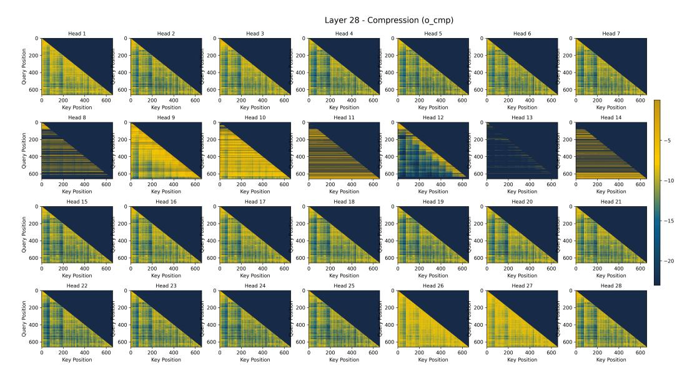

Figure 10: Attention pattern of the compression branch in the final layer of VideoNSA.

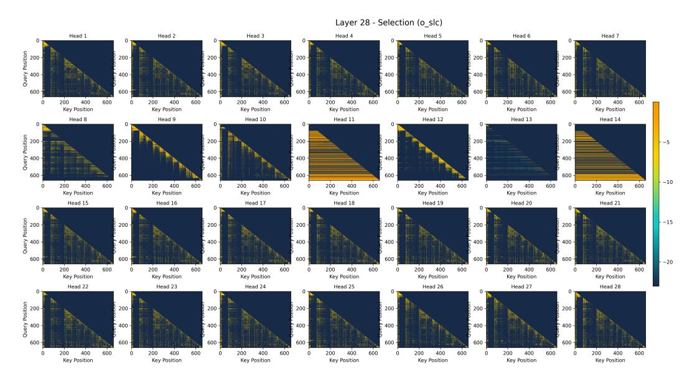

Figure 11: Attention pattern of the selection branch in the final layer of VideoNSA.

Qwen2.5-VL [\(Qwen et al., 2025\)](#page-13-3) often peaks at 64k and slightly declines at 128k across several benchmarks. In contrast, VideoNSA maintains stable or stronger performance at 128k, demonstrating that the observed 64k > 128k phenomenon arises from backbone limitations rather than the proposed sparse architecture.

## L MORE RESULTS ON ATTENTION SCALING STUDY

Figure [16](#page-29-0) evaluates the scaling behavior of VideoNSA under different attention allocation strategies, where the x-axis denotes the sliding window size (log scale), the y-axis shows the block count, and the size and color of each marker reflect performance, with the dashed blue curve indicating configurations of equal attention budget and arrows marking the training setting as well as reduced-budget configurations (3.6% and 1.8%); on LongVideoBench, performance peaks near the training configuration and degrades when allocating excessive budget to local attention through larger sliding

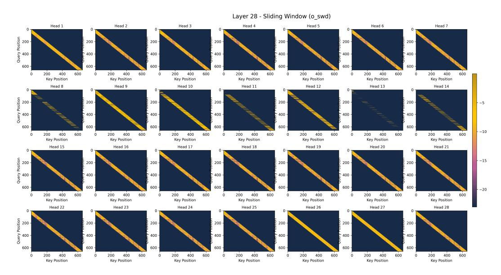

Figure 12: Attention pattern of the sliding window branch in the final layer of VideoNSA.

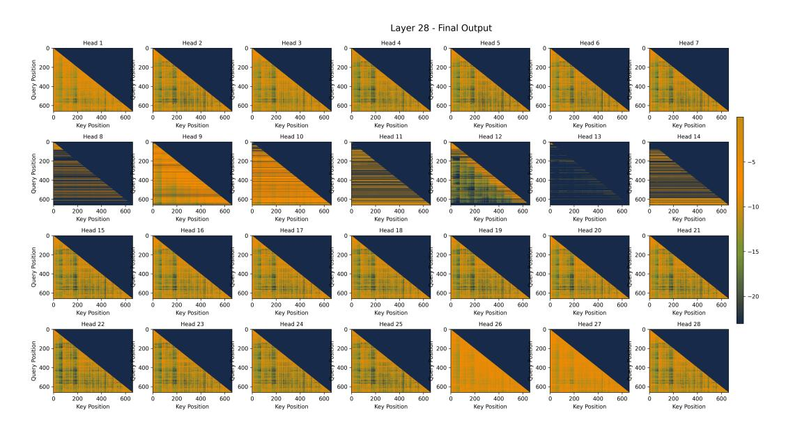

Figure 13: Attention pattern of the final vision attention output in the final layer of VideoNSA.

windows, while the best configuration achieves strong results with only 3.6% of the full budget, and on TimeScope, performance is even more sensitive, with larger sliding windows quickly reducing accuracy whereas maintaining more global blocks yields superior outcomes, and overall the results confirm that training allocations are well balanced, that prioritizing global attention is consistently more effective than enlarging local windows under equal budget, and that VideoNSA sustains leading performance with as little as 3.6% or less of the full attention cost, demonstrating both efficiency and hardware awareness.

In addition to the overall scaling trends, we further report detailed subtask-level results under different allocation settings in Table [20,](#page-28-1) Table [21,](#page-29-1) Table [22,](#page-29-2) Table [23,](#page-30-0) Table [24,](#page-30-1) and Table [25.](#page-31-2)

Table 15: LongTimeScope results across different branch selection strategy. Metrics include overall accuracy and task-specific scores across different steps.

| Method              | Overall |      | 18000 |              |      | 28800 |              |      | 36000 |          |
|---------------------|---------|------|-------|--------------|------|-------|--------------|------|-------|----------|
|                     |         | OCR  | QA    | Temporal OCR |      | QA    | Temporal OCR |      | QA    | Temporal |
| VideoNSA + Test SFT | 40.9    | 52.0 | 42.0  | 42.0         | 48.0 | 62.0  | 18.0         | 42.0 | 50.0  | 12.0     |
| NSA-CMP             | 25.1    | 20.0 | 22.0  | 24.0         | 38.0 | 40.0  | 0.0          | 34.0 | 34.0  | 14.0     |
| NSA-SLC             | 37.1    | 30.0 | 38.0  | 40.0         | 50.0 | 58.0  | 12.0         | 42.0 | 44.0  | 20.0     |
| NSA-SWA             | 29.8    | 34.0 | 34.0  | 22.0         | 36.0 | 46.0  | 4.0          | 34.0 | 46.0  | 12.0     |
| NSA-CMPSLC          | 32.4    | 36.0 | 34.0  | 24.0         | 46.0 | 54.0  | 8.0          | 42.0 | 36.0  | 12.0     |
| NSA-SLCSWA          | 34.4    | 38.0 | 36.0  | 36.0         | 46.0 | 56.0  | 8.0          | 38.0 | 36.0  | 16.0     |
| NSA-CMPSWA          | 31.6    | 30.0 | 38.0  | 20.0         | 40.0 | 52.0  | 16.0         | 36.0 | 36.0  | 16.0     |
| VideoNSA            | 44.4    | 50.0 | 54.0  | 30.0         | 54.0 | 72.0  | 0.0          | 48.0 | 76.0  | 16.0     |

Table 16: TimeScope results across different branch selection strategy. Metrics include overall accuracy and task-specific scores across different steps.

| Method           | Overall | 60   | 120  | 180  | 300  | 600  | 1200 | 1800 | 3600 | 7200 | 10800 |
|------------------|---------|------|------|------|------|------|------|------|------|------|-------|
| Full Attn        | 81.0    | 96.7 | 96.0 | 96.0 | 94.7 | 94.0 | 88.0 | 82.0 | 68.7 | 52.7 | 41.3  |
| Flash Attn       | 81.0    | 96.7 | 96.0 | 96.0 | 94.7 | 94.0 | 88.0 | 82.0 | 68.7 | 52.7 | 41.3  |
| Flash Attn + SFT | 76.8    | 96.7 | 96.7 | 96.0 | 95.3 | 90.7 | 78.0 | 78.0 | 54.7 | 41.3 | 40.7  |
| AWQ              | –       | –    | –    | –    | –    | –    | –    | –    | –    | –    | –     |
| XAttn            | 83.1    | 94.0 | 93.4 | 93.4 | 92.0 | 92.7 | 89.4 | 82.7 | 72.7 | 70.7 | 50.7  |
| MInference       | 82.7    | 93.4 | 94.0 | 93.4 | 92.0 | 92.7 | 87.4 | 80.0 | 74.0 | 70.0 | 50.0  |
| tri-shape        | 82.7    | 93.4 | 94.0 | 93.4 | 92.0 | 92.7 | 87.4 | 80.0 | 74.0 | 70.0 | 50.0  |
| FlexPrefill      | 83.0    | 96.7 | 96.0 | 96.7 | 95.3 | 96.0 | 95.3 | 86.0 | 77.3 | 55.3 | 35.3  |
| FastV            | 46.5    | 82.7 | 76.0 | 74.0 | 54.0 | 32.7 | 32.7 | 29.3 | 29.3 | 34.0 | 20.0  |
| VisionZip        | 43.5    | 92.0 | 66.7 | 60.0 | 43.3 | 35.3 | 26.0 | 30.7 | 29.3 | 28.0 | 23.3  |
| VScan            | 80.3    | 96.7 | 96.7 | 96.0 | 93.3 | 92.7 | 89.3 | 81.3 | 60.0 | 55.3 | 41.3  |
| Retake           | –       | –    | –    | –    | –    | –    | –    | –    | –    | –    | –     |
| AdaRetake        | –       | –    | –    | –    | –    | –    | –    | –    | –    | –    | –     |
| SFT + Test NSA   | 81.0    | 96.7 | 96.0 | 96.0 | 94.7 | 94.0 | 88.0 | 82.0 | 68.7 | 52.7 | 41.3  |
| NSA + Test SFT   | 83.0    | 96.7 | 95.3 | 94.0 | 93.3 | 94.0 | 90.7 | 87.3 | 76.7 | 54.7 | 47.3  |
| NSA-CMP          | 41.5    | 82.0 | 74.0 | 65.3 | 59.3 | 17.3 | 25.3 | 19.3 | 26.7 | 27.3 | 18.0  |
| NSA-SLC          | 63.7    | 92.0 | 86.0 | 86.7 | 78.0 | 66.7 | 57.3 | 51.3 | 40.7 | 38.0 | 40.0  |
| NSA-SWA          | 59.3    | –    | –    | –    | –    | –    | –    | –    | –    | –    | –     |
| NSA-CMPSLC       | 57.3    | 88.7 | 80.0 | 73.3 | 73.3 | 46.7 | 44.7 | 48.7 | 42.7 | 43.3 | 32.0  |
| NSA-SLCSWA       | 65.2    | 92.0 | 89.3 | 89.3 | 79.3 | 66.0 | 59.3 | 50.0 | 41.3 | 40.7 | 44.7  |
| NSA-CMPSWA       | 57.3    | 88.7 | 80.0 | 73.3 | 73.3 | 46.7 | 44.7 | 48.7 | 42.7 | 43.3 | 32.0  |
| VideoNSA         | 83.7    | 96.7 | 96.0 | 97.4 | 92.0 | 85.4 | 91.6 | 89.3 | 73.3 | 63.3 | 52.0  |

## M THEORETICAL FOUNDATIONS OF SCALING BEHAVIOR

In Section [4,](#page-4-3) we perform two scaling experiments along context length and attention budget. We observe that VideoNSA exhibits strong extrapolation ability on context length: although trained with only 36K tokens, it can generalize to 128K at test time, achieving the best performance at 64K. In contrast, when scaling the attention budget, even a small reduction to 3.6% of attention computation ˜ already delivers outstanding performance, and further increasing the visible-token count does not yield additional gains. To clarify these phenomena, we provide theoretical interpretations from routing-path stability and the geometric structure of RoPE [\(Su et al., 2024\)](#page-13-13).

Routing-path Stability. Recent work [\(Huang et al., 2025\)](#page-10-14) indicates that a model's ability to maintain performance on long sequences depends critically on the stability of its attention routing structure across positions. In the standard attention mechanism, the attention weight from the query

Table 17: MLVU results across different branch selection strategy. Metrics include overall accuracy and task-specific scores across different steps.

| Method         | Overall | PlotQA | Needle | Ego  | Count | Order | Anomaly Reco | Topic Reason. | SportsQA | TutorialQA |
|----------------|---------|--------|--------|------|-------|-------|--------------|---------------|----------|------------|
| NSA + Test SFT | 51.6    | 56.0   | 61.7   | 66.0 | 31.7  | 28.6  | 51.3         | 80.2          | 36.1     | 32.6       |
| NSA-CMP        | 43.9    | 36.0   | 35.0   | 42.9 | _     | 24.3  | 30.8         | 80.2          | 30.6     | _          |
| NSA-SLC        | 47.7    | 50.0   | 50.0   | 52.4 | _     | 22.9  | 33.3         | 74.7          | 33.3     | _          |
| NSA-SWA        | 40.2    | 40.0   | 40.0   | 41.5 | 15.0  | 24.3  | 30.8         | 76.9          | 36.1     | 34.9       |
| NSA-SLCSWA     | 42.4    | 42.0   | 48.3   | 45.3 | 16.7  | 25.7  | 38.5         | 75.8          | 33.3     | 34.9       |
| NSA-CMPSWA     | 43.4    | 46.0   | 40.0   | 43.4 | 18.3  | 35.7  | 33.3         | 82.4          | 27.8     | 32.6       |

Table 18: Tomato results across different branch selection strategy. Metrics include overall accuracy and task-specific scores across different steps.

| Method         | Overall | Direction | Count | Rotation | Shape & Trend | Vel. & Freq. | Visual Cues | Human | Simulated | Object |
|----------------|---------|-----------|-------|----------|---------------|--------------|-------------|-------|-----------|--------|
| NSA + Test SFT | 23.4    | 21.3      | 29.1  | 17.5     | 25.1          | 20.0         | 40.0        | 19.3  | 19.3      | 28.5   |
| NSA-CMP        | 23.3    | 22.1      | 29.5  | 17.1     | 24.7          | 20.5         | 34.3        | 19.2  | 22.7      | 27.3   |
| NSA-SLC        | 24.0    | 21.3      | 32.2  | 16.4     | 26.0          | 22.9         | 32.9        | 19.8  | 21.5      | 28.7   |
| NSA-SWA        | 24.0    | 21.3      | 32.2  | 16.4     | 26.0          | 22.9         | 32.9        | 19.8  | 21.5      | 28.7   |
| NSA-CMPSLC     | 23.5    | 20.8      | 29.8  | 18.5     | 22.9          | 23.8         | 34.3        | 19.0  | 26.8      | 25.8   |
| NSA-SLCSWA     | 23.0    | 20.6      | 27.4  | 18.5     | 22.4          | 24.8         | 32.9        | 19.5  | 21.0      | 26.8   |
| NSA-CMPSWA     | 24.5    | 23.1      | 30.8  | 18.9     | 25.1          | 22.9         | 32.9        | 21.0  | 23.6      | 28.0   |

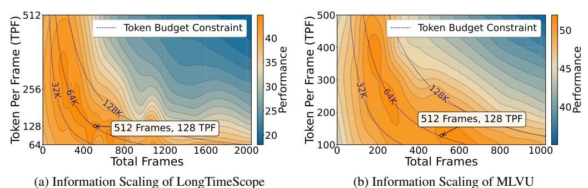

(a) Information Scaling of LongTimeScope (b) Information Scaling of MLVU
Figure 14: Scaling Performance of VideoNSA under Different Context Allocation Strategies. We

highlight the token budget constraint to indicate settings with equal context length, and annotate the best-performing configuration under each benchmark.

vector  $Q_n$  at position n to the key vector  $Z_j$  at position j is defined as

$$\operatorname{Attn}_{n \to j} = \frac{\exp(Z_j^\top Q_n)}{\sum_k \exp(Z_k^\top Q_n)}.$$

Here,  $Q_n$  and  $Z_j$  denote the query and key representations at positions n and j, respectively. If the model can consistently focus its attention on the task-relevant target token set  $\mathcal{T}$  during inference, then (i)  $\sum_{j\in\mathcal{T}} \operatorname{Attn}_{n\to j}$  should dominate across different positions; and (ii) the attention assigned to the same key token j should remain nearly unchanged under positional shifts, i.e.,

$$\Delta_i = \left| \operatorname{Attn}_{n \to j} - \operatorname{Attn}_{n+i \to j} \right| \approx 0$$

where  $\Delta_i$  measures the deviation of routing paths across positions in long sequences.

When we scale the context length using dense temporal and spatial sampling, the sparse-attention pattern and mask structure M remain unchanged, which means the model continues to use the routing structure learned during training while simply facing a larger pool of candidate evidence. Since denser sampling mainly introduces redundant or finer-grained details, the model treats these tokens as auxiliary evidence, leaving the core target tokens and their relative attention weights essentially unchanged. Consequently, the overall routing-path structure is preserved,  $\Delta_i$  remains small, and the model can maintain or even improve its performance at longer context lengths.

In contrast, attention-budget scaling explicitly modifies the set of visible tokens in the sparseattention mechanism by replacing the original mask M with a new mask M'. The effective query

Table 19: VSIBench results across different branch selection strategy. Metrics include overall accuracy and task-specific scores across different steps.

| Method         | Overall | Obj. Order | Abs. Dist. | Counting | Rel. Dist. | Size Est. | Room Est. | Route Plan. | Rel. Dir. |
|----------------|---------|------------|------------|----------|------------|-----------|-----------|-------------|-----------|
| NSA + Test SFT | 33.1    | 24.3       | 19.8       | 31.2     | 38.0       | 49.8      | 32.2      | 32.5        | 37.2      |
| NSA-CMP        | 29.2    | 19.9       | 16.3       | 12.6     | 29.3       | 48.7      | 26.7      | 38.1        | 41.7      |
| NSA-SLC        | 27.6    | 18.0       | 10.9       | 17.3     | 32.0       | 47.8      | 24.8      | 32.0        | 38.1      |
| NSA-SWA        | 29.8    | 22.8       | 15.6       | 17.4     | 32.3       | 49.8      | 27.2      | 33.5        | 39.4      |
| NSA-CMPSLC     | 29.4    | 19.9       | 16.3       | 15.1     | 31.0       | 51.1      | 25.5      | 33.5        | 42.6      |
| NSA-SLCSWA     | 29.1    | 19.9       | 12.2       | 18.5     | 31.4       | 49.6      | 26.5      | 34.0        | 40.4      |
| NSA-CMPSWA     | 30.3    | 22.5       | 15.6       | 15.3     | 31.1       | 52.5      | 26.7      | 35.1        | 43.3      |

Table 20: Ablation study results on information scaling of LongTimeScope (Zohar et al., 2025). Metrics include overall accuracy and task-specific scores across different steps. # TPF stands for token per frame, and # F stands for sampling frame number.

| # TPF | # F  | Overall    |      | 180  | 00       |      | 288  | 00       |      | 360  | 00       |
|-------|------|------------|------|------|----------|------|------|----------|------|------|----------|
|       |      | O , OI MII | OCR  | QA   | Temporal | OCR  | QA   | Temporal | OCR  | QA   | Temporal |
| 256   | 128  | 42.9       | 54.0 | 48.0 | 36.0     | 46.0 | 62.0 | 6.0      | 40.0 | 80.0 | 14.0     |
| 512   | 128  | 41.1       | 54.0 | 60.0 | 28.0     | 42.0 | 62.0 | 4.0      | 40.0 | 78.0 | 2.0      |
| 128   | 256  | 42.0       | 58.0 | 56.0 | 26.0     | 46.0 | 62.0 | 2.0      | 40.0 | 78.0 | 10.0     |
| 256   | 256  | 41.3       | 58.0 | 52.0 | 36.0     | 48.0 | 62.0 | 0.0      | 40.0 | 70.0 | 6.0      |
| 512   | 256  | 41.6       | 54.0 | 56.0 | 32.0     | 46.0 | 60.0 | 2.0      | 40.0 | 78.0 | 6.0      |
| 64    | 512  | 40.2       | 52.0 | 52.0 | 26.0     | 44.0 | 64.0 | 2.0      | 44.0 | 76.0 | 2.0      |
| 128   | 512  | 44.4       | 50.0 | 54.0 | 30.0     | 54.0 | 72.0 | 0.0      | 48.0 | 76.0 | 16.0     |
| 256   | 512  | 38.7       | 48.0 | 50.0 | 30.0     | 52.0 | 56.0 | 8.0      | 36.0 | 60.0 | 8.0      |
| 64    | 1024 | 41.6       | 54.0 | 56.0 | 22.0     | 46.0 | 66.0 | 4.0      | 36.0 | 72.0 | 18.0     |
| 128   | 1024 | 41.1       | 50.0 | 46.0 | 32.0     | 46.0 | 62.0 | 14.0     | 38.0 | 54.0 | 28.0     |
| 64    | 2048 | 38.4       | 50.0 | 62.0 | 26.0     | 40.0 | 60.0 | 2.0      | 38.0 | 42.0 | 26.0     |

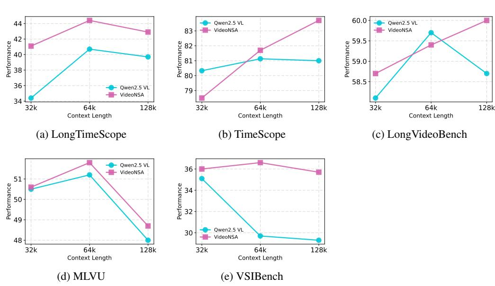

Figure 15: Performance comparison of Qwen2.5-VL and VideoNSA under different context lengths.

## becomes

$$Q_{\rm eff} = Q \odot M',$$

where  $\odot$  denotes elementwise multiplication, and the corresponding new attention weight is  $\operatorname{Attn}'_{n\to j} \propto \exp\bigl(Z_j^\top(Q\odot M')\bigr).$ 

Table 21: Ablation study results on information scaling of TimeScope (Zohar et al., 2025). Metrics include overall accuracy and task-specific scores across different steps. # TPF stands for token per frame, and # F stands for sampling frame number.

| # TPF | # F  | Overall | 60   | 120  | 180  | 300  | 600  | 1200 | 1800 | 3600 | 7200 | 10800 |
|-------|------|---------|------|------|------|------|------|------|------|------|------|-------|
| 256   | 128  | 73.1    | 96.7 | 94.7 | 93.4 | 85.4 | 72.0 | 62.6 | 57.3 | 56.6 | 54.0 | 58.6  |
| 512   | 128  | 72.5    | 95.4 | 94.0 | 92.7 | 82.0 | 72.7 | 64.6 | 57.3 | 56.3 | 53.3 | 56.6  |
| 128   | 256  | 76.5    | 98.0 | 97.4 | 96.0 | 86.7 | 78.7 | 78.0 | 63.3 | 58.6 | 54.0 | 54.0  |
| 256   | 256  | 76.1    | 96.7 | 96.7 | 91.4 | 86.7 | 76.0 | 74.6 | 64.0 | 62.0 | 56.0 | 56.6  |
| 512   | 256  | 75.8    | 95.4 | 94.7 | 90.7 | 86.7 | 76.0 | 75.3 | 66.0 | 62.6 | 53.3 | 57.3  |
| 64    | 512  | 78.5    | 96.7 | 95.4 | 94.7 | 88.0 | 80.7 | 82.6 | 71.3 | 62.0 | 58.0 | 55.3  |
| 128   | 512  | 76.5    | 98.0 | 97.4 | 96.0 | 86.7 | 78.7 | 78.0 | 63.3 | 58.6 | 54.0 | 54.0  |
| 256   | 512  | 77.3    | 96.7 | 96.7 | 90.7 | 83.4 | 76.7 | 78.0 | 72.0 | 66.6 | 59.3 | 52.6  |
| 64    | 1024 | 81.7    | 96.7 | 95.4 | 94.7 | 90.0 | 84.7 | 88.0 | 78.0 | 69.3 | 64.0 | 56.6  |
| 128   | 1024 | 81.8    | 98.0 | 97.4 | 94.0 | 85.4 | 80.7 | 92.0 | 78.0 | 72.6 | 66.0 | 54.0  |
| 64    | 2048 | 82.7    | 96.7 | 95.4 | 94.7 | 90.0 | 82.0 | 91.3 | 88.0 | 73.3 | 63.3 | 52.0  |

Table 22: Ablation study results on information scaling of LongVideoBench (Wu et al., 2024a). Metrics include overall accuracy and task-specific scores across different steps. # TPF stands for token per frame, and # F stands for sampling frame number.

| # TPF | # F  | Overall | 600.0 | TOS  | S2E  | E3E  | S2A  | SAA  | 030  | ТЗО  | T3E  | O2E  | T2O  | S2O  | TAA  | T2E  | E2O  | SSS  | T2A  | 60.0 | sos  | 15.0 | 3600.0 |
|-------|------|---------|-------|------|------|------|------|------|------|------|------|------|------|------|------|------|------|------|------|------|------|------|--------|
| 512   | 64   | 58.3    | 55.5  | 44.0 | 67.2 | 66.6 | 71.8 | 57.0 | 54.0 | 48.9 | 50.8 | 59.9 | 55.7 | 63.9 | 53.3 | 57.8 | 70.1 | 37.9 | 60.2 | 68.1 | 71.2 | 65.7 | 54.9   |
| 128   | 128  | 57.4    | 56.8  | 45.4 | 66.1 | 66.6 | 69.5 | 61.2 | 55.5 | 53.0 | 49.5 | 59.9 | 51.7 | 54.2 | 47.2 | 57.8 | 68.5 | 40.0 | 58.9 | 68.6 | 70.0 | 63.6 | 52.4   |
| 256   | 128  | 57.9    | 58.5  | 48.1 | 69.4 | 66.6 | 70.6 | 58.4 | 55.5 | 53.0 | 48.1 | 57.6 | 47.8 | 54.2 | 49.7 | 59.3 | 68.5 | 40.0 | 65.2 | 68.1 | 70.0 | 63.1 | 52.6   |
| 512   | 128  | 59.0    | 59.4  | 49.5 | 68.3 | 66.6 | 72.9 | 63.9 | 54.0 | 53.0 | 49.5 | 61.0 | 51.7 | 61.2 | 50.9 | 56.2 | 68.5 | 39.0 | 64.0 | 68.6 | 71.2 | 63.6 | 54.2   |
| 128   | 256  | 58.7    | 52.7  | 46.7 | 68.3 | 65.5 | 69.5 | 57.0 | 52.5 | 53.0 | 48.1 | 56.4 | 46.5 | 51.4 | 48.5 | 57.8 | 67.0 | 37.9 | 65.2 | 63.4 | 70.0 | 58.3 | 52.7   |
| 256   | 256  | 58.2    | 58.7  | 39.9 | 64.0 | 66.6 | 71.8 | 58.4 | 54.0 | 59.7 | 52.2 | 59.9 | 55.7 | 58.4 | 50.9 | 56.2 | 70.1 | 40.0 | 61.4 | 66.9 | 68.7 | 63.1 | 53.5   |
| 512   | 256  | 59.4    | 60.4  | 52.2 | 67.2 | 65.5 | 75.2 | 61.2 | 54.0 | 55.7 | 52.2 | 62.2 | 53.1 | 62.6 | 49.7 | 56.2 | 68.5 | 35.9 | 65.2 | 67.5 | 72.4 | 65.7 | 54.0   |
| 64    | 512  | 57.7    | 58.2  | 41.3 | 67.2 | 68.7 | 65.0 | 58.4 | 58.5 | 54.3 | 52.2 | 62.2 | 49.1 | 58.4 | 53.3 | 62.4 | 71.6 | 35.9 | 55.1 | 66.3 | 68.7 | 61.5 | 53.5   |
| 128   | 512  | 58.5    | 59.4  | 42.6 | 68.3 | 66.6 | 69.5 | 59.8 | 60.0 | 57.0 | 52.2 | 64.5 | 50.4 | 59.8 | 52.1 | 59.3 | 68.5 | 35.9 | 60.2 | 65.7 | 68.7 | 63.6 | 54.0   |
| 256   | 512  | 58.3    | 59.2  | 44.0 | 64.0 | 64.5 | 71.8 | 65.3 | 52.5 | 55.7 | 55.0 | 61.0 | 54.4 | 62.6 | 49.7 | 59.3 | 71.6 | 37.9 | 56.4 | 66.9 | 67.5 | 63.1 | 53.5   |
| 64    | 1024 | 58.4    | 59.4  | 42.6 | 65.1 | 68.7 | 66.1 | 62.6 | 55.5 | 58.4 | 49.5 | 64.5 | 54.4 | 58.4 | 50.9 | 59.3 | 74.7 | 36.9 | 57.6 | 66.3 | 68.7 | 61.5 | 54.2   |
| 128   | 1024 | 58.7    | 58.5  | 41.3 | 67.2 | 68.7 | 71.8 | 65.3 | 60.0 | 59.7 | 52.2 | 59.9 | 53.1 | 62.6 | 47.2 | 59.3 | 71.6 | 32.8 | 60.2 | 65.7 | 67.5 | 63.6 | 55.1   |

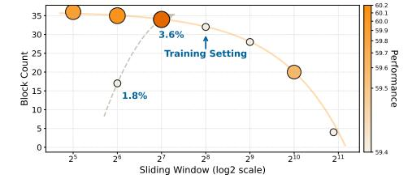

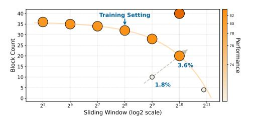

(a) Attention Scaling of LongVideoBench

(b) Attention Scaling of TimeScope

Figure 16: Scaling Performance of VideoNSA under Different Attention Allocation Strategies. We highlight the attention budget constraint to indicate settings with equal attention budget, and annotate the best-performing configuration under each benchmark.

Even if the modification from M to M' appears small in proportion, it substantially changes the set of candidate evidence accessible to each query and alters the relative logits. First, the newly visible tokens reduce the relative weight allocated to the original key tokens, producing a dilution effect. Second, in video tasks, the added visible tokens often lie in similar visual-semantic clusters as the original key tokens and thus have non-negligible similarity scores  $Z_{j'}^{\top}Q$ . These tokens directly compete with and divert attention away from the originally dominant key tokens. Under the combined influence of these effects, the stable routing-path structure learned during training is overwritten: formerly high-weight key tokens may be diluted or overshadowed by the new candidates, causing  $\Delta_i$  to increase significantly. As a result, the model is more likely to follow incorrect reasoning paths, leading to degraded performance.

Table 23: Ablation study results on information scaling of MLVU (Zhou et al., 2024). Metrics include overall accuracy and task-specific scores across different steps. # TPF stands for token per frame, and # F stands for sampling frame number.

| # TPF | # F  | Overall | PlotQA | Needle | Ego  | Count | Order | Anomaly Reco | Topic Reason. | SportsQA | TutorialQA |
|-------|------|---------|--------|--------|------|-------|-------|--------------|---------------|----------|------------|
| 256   | 128  | 49.6    | 46.0   | 52.7   | 53.2 | 24.3  | 36.0  | 47.0         | 87.3          | 36.6     | 36.2       |
| 512   | 128  | 49.2    | 52.0   | 51.0   | 47.5 | 24.3  | 37.4  | 39.3         | 87.3          | 42.1     | 33.9       |
| 128   | 256  | 50.6    | 50.0   | 57.7   | 60.7 | 24.3  | 33.1  | 39.3         | 86.2          | 42.1     | 36.2       |
| 256   | 256  | 51.2    | 50.0   | 56.0   | 56.9 | 27.7  | 38.9  | 41.9         | 85.1          | 42.1     | 36.2       |
| 512   | 256  | 48.0    | 54.0   | 49.3   | 49.4 | 22.7  | 37.4  | 39.3         | 86.2          | 33.8     | 29.3       |
| 64    | 512  | 51.2    | 50.0   | 62.7   | 55.1 | 24.3  | 34.6  | 47.0         | 84.0          | 42.1     | 38.6       |
| 128   | 512  | 51.8    | 48.0   | 69.3   | 51.3 | 27.7  | 34.6  | 44.5         | 86.2          | 47.7     | 31.6       |
| 256   | 512  | 48.6    | 50.0   | 51.0   | 47.5 | 24.3  | 33.1  | 52.2         | 84.0          | 47.7     | 26.9       |
| 64    | 1024 | 51.8    | 56.0   | 66.0   | 53.2 | 26.0  | 36.0  | 47.0         | 84.0          | 42.1     | 31.6       |
| 128   | 1024 | 48.0    | 52.0   | 51.0   | 49.4 | 29.3  | 33.1  | 44.5         | 80.7          | 44.9     | 24.6       |

Table 24: Ablation study results on information scaling of Tomato (Shangguan et al., 2024). Metrics include overall accuracy and task-specific scores across different steps. # TPF stands for token per frame, and # F stands for sampling frame number.

| FPS | TPF | Overall | Direction | Count | Rotation | Shape&Trend | Velocity&Freq. | Visual Cues | Human | Simulated | Object |
|-----|-----|---------|-----------|-------|----------|-------------|----------------|-------------|-------|-----------|--------|
| 1   | 64  | 24.7    | 22.8      | 26.7  | 20.6     | 25.1        | 27.1           | 34.3        | 21.2  | 23.2      | 28.4   |
| 1   | 128 | 23.9    | 20.6      | 29.8  | 19.9     | 24.7        | 23.8           | 32.9        | 19.8  | 24.0      | 27.6   |
| 1   | 256 | 24.7    | 22.3      | 29.5  | 19.6     | 25.1        | 25.2           | 35.7        | 20.8  | 23.3      | 28.7   |
| 1   | 512 | 23.9    | 20.6      | 29.8  | 19.9     | 24.7        | 22.9           | 34.3        | 20.3  | 21.5      | 27.9   |
| 2   | 64  | 24.5    | 21.1      | 31.8  | 19.6     | 22.4        | 25.7           | 35.7        | 20.7  | 21.9      | 28.8   |
| 2   | 128 | 24.3    | 20.6      | 30.5  | 20.3     | 24.7        | 23.3           | 38.6        | 20.7  | 22.3      | 28.4   |
| 2   | 256 | 24.4    | 21.3      | 29.5  | 18.5     | 26.5        | 24.8           | 37.1        | 20.3  | 24.0      | 28.2   |
| 2   | 512 | 24.7    | 19.4      | 32.2  | 21.3     | 25.6        | 23.8           | 37.1        | 20.0  | 24.0      | 29.1   |
| 4   | 64  | 25.1    | 22.1      | 31.5  | 19.6     | 26.5        | 23.3           | 38.6        | 21.2  | 25.0      | 29.0   |
| 4   | 128 | 25.8    | 21.8      | 33.2  | 21.3     | 25.6        | 25.7           | 37.1        | 21.5  | 25.3      | 29.9   |
| 4   | 256 | 26.2    | 23.1      | 32.5  | 20.6     | 26.9        | 26.7           | 37.1        | 21.8  | 25.3      | 30.5   |
| 4   | 512 | 26.5    | 21.6      | 31.5  | 22.0     | 25.6        | 23.3           | 40.0        | 21.7  | 23.6      | 29.3   |

**Geometric Rotational of RoPE.** RoPE (Su et al., 2024) maps the representation at position i into a rotation in a two-dimensional subspace:

$$q'(i) = R(i\omega)q,$$
  $k'(j) = R(j\omega)k,$ 

where  $R(i\omega)$  is a rotation matrix and  $\omega$  denotes the frequency parameters. This yields an inner product that depends only on the relative distance between the two positions:

$$\langle q'(i), k'(j) \rangle = \langle R((i-j)\omega)q, k \rangle.$$

RoPE (Su et al., 2024) therefore establishes a structured geometric correspondence between relative distance and rotation phase. Under this geometry, when the context length is moderately increased (e.g., from 36K to 64K), the model only needs to resolve a larger phase difference  $d\omega$ ; within this range, the growth of the phase still lies in the extrapolation regime covered by the empirical distribution seen during training. As a result, the model can naturally generalize.

LM-Infinite (Han et al., 2023) further proves that, in order to distinguish the growing clusters of relative distances  $\alpha(n)$ , the attention logit must increase monotonically with sequence length:

$$\sup_{q,k,d \leq n} |w(q,k,d)| \geq \left(\frac{\alpha(n)}{2}\right)^{1/(2r)} \frac{\varepsilon}{4e},$$

where w(q,k,d) denotes the logit at relative distance d, and  $\alpha(n)$  grows with n. This "logit growth" is controlled and beneficial at moderate lengths, expanding the dynamic range of attention and enabling the model to maintain token separability over larger distances and consistenting with the strong performance we observe around 64K.

However, when the effective phase difference  $d\omega$  becomes excessively large, the rotation angle may approach or exceed the periodic range of multiple frequency dimensions, giving rise to *phase aliasing*: tokens that should correspond to distinct relative distances collapse into similar or even indistinguishable phase regions. In such cases, although attention logits continue to grow with length,

Table 25: Ablation study results on information scaling of VSIBench (Yang et al., 2025a). Metrics include overall accuracy and task-specific scores across different steps. # TPF stands for token per frame, and # F stands for sampling frame number.

| TPF | # Max Frames | Overall | Obj. Order | Abs. Dist. | Counting | Rel. Dist. | Size Est. | Room Est. | Route Plan. | Rel. Dir. |
|-----|--------------|---------|------------|------------|----------|------------|-----------|-----------|-------------|-----------|
| 512 | 32           | 34.9    | 27.6       | 16.2       | 31.4     | 35.1       | 52.2      | 31.5      | 40.1        | 44.6      |
| 512 | 64           | 34.8    | 29.1       | 17.5       | 34.9     | 33.0       | 52.2      | 31.0      | 36.5        | 43.9      |
| 256 | 128          | 36.0    | 24.7       | 17.6       | 41.3     | 37.5       | 53.9      | 30.7      | 39.1        | 43.3      |
| 512 | 128          | 34.6    | 27.4       | 17.2       | 37.3     | 34.4       | 50.3      | 30.6      | 35.5        | 43.8      |
| 128 | 256          | 35.6    | 26.8       | 17.0       | 42.0     | 36.8       | 51.8      | 31.2      | 35.0        | 44.2      |
| 256 | 256          | 35.5    | 27.8       | 17.0       | 42.4     | 33.7       | 51.3      | 31.6      | 35.5        | 44.5      |
| 512 | 256          | 34.8    | 28.2       | 16.5       | 40.3     | 33.9       | 48.8      | 30.7      | 36.5        | 43.3      |
| 64  | 512          | 34.2    | 29.1       | 15.8       | 42.1     | 33.9       | 45.5      | 27.7      | 37.0        | 42.9      |
| 128 | 512          | 36.0    | 25.5       | 19.0       | 42.5     | 35.4       | 54.0      | 30.1      | 37.5        | 43.6      |
| 256 | 512          | 33.9    | 28.2       | 15.8       | 42.9     | 31.3       | 43.6      | 29.9      | 36.5        | 43.1      |
| 64  | 1024         | 35.8    | 24.4       | 18.5       | 46.4     | 34.4       | 52.4      | 29.7      | 37.5        | 43.0      |
| 128 | 1024         | 35.7    | 26.6       | 18.4       | 45.3     | 32.7       | 50.3      | 31.7      | 37.0        | 43.7      |

Table 26: Performance of Qwen2.5-VL 7B under different context lengths.

| Context | LVB  | MLVU | TimeScope | LTS  | VSIBench |
|---------|------|------|-----------|------|----------|
| 32k     | 58.1 | 50.5 | 80.33     | 34.4 | 35.1     |
| 64k     | 59.7 | 51.2 | 81.13     | 40.7 | 29.7     |
| 128k    | 58.7 | 48.0 | 81.00     | 39.7 | 29.3     |

the high-frequency components of RoPE lose their discriminative resolution, reducing geometric separability among tokens, which aligns with existing analyses (Press et al., 2021; Chen et al., 2023) showing the degradation of relative positional encoding at extreme distances.

## N FULL GATE VALUES DISTRIBUTION

## O MORE INTER-HEAD GATE SIMILARITES VISUALIZATION

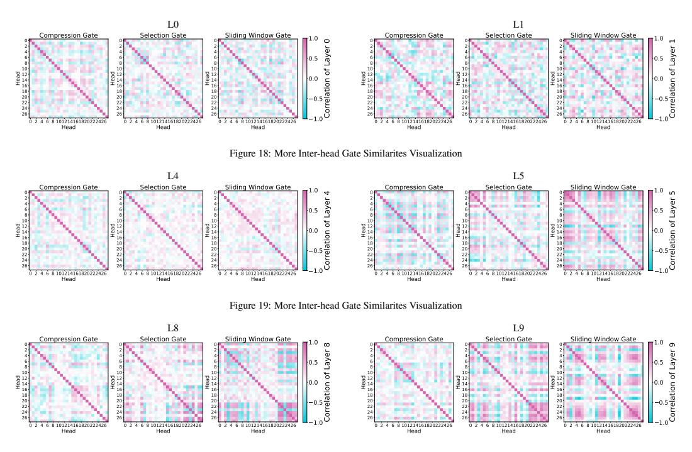

Figure 20: More Inter-head Gate Similarites Visualization

Table 27: Performance of VideoNSA under different context lengths.

| Context | LVB  | MLVU | TimeScope | LTS  | VSIBench |
|---------|------|------|-----------|------|----------|
| 32k     | 58.7 | 50.6 | 78.5      | 41.1 | 36.0     |
| 64k     | 59.4 | 51.8 | 81.7      | 44.4 | 36.6     |
| 128k    | 60.0 | 48.7 | 83.7      | 42.9 | 35.7     |

Table 28: LongTimeScope (Zohar et al., 2025) results across different attention budget strategy. Metrics include overall accuracy and task-specific scores across different steps.

| Block Count | Window Size  | Overall |      | 180  | 00       |      | 288  | 00       | 36000 |      |          |
|-------------|--------------|---------|------|------|----------|------|------|----------|-------|------|----------|
| Diock Count | William Bize | Overun  | OCR  | QA   | Temporal | OCR  | QA   | Temporal | OCR   | QA   | Temporal |
| 36          | 32           | 44.0    | 56.0 | 50.0 | 28.0     | 46.0 | 66.0 | 16.0     | 46.0  | 72.0 | 16.0     |
| 35          | 64           | 44.0    | 54.0 | 58.0 | 26.0     | 46.0 | 68.0 | 12.0     | 46.0  | 74.0 | 12.0     |
| 34          | 128          | 41.8    | 50.0 | 56.0 | 28.0     | 44.0 | 64.0 | 6.0      | 46.0  | 74.0 | 8.0      |
| 28          | 512          | 42.0    | 50.0 | 56.0 | 28.0     | 48.0 | 64.0 | 6.0      | 46.0  | 76.0 | 4.0      |
| 20          | 1024         | 40.9    | 52.0 | 56.0 | 28.0     | 48.0 | 64.0 | 0.0      | 44.0  | 76.0 | 0.0      |
| 4           | 1900         | 0.0     | 0.0  | 0.0  | 0.0      | 0.0  | 0.0  | 0.0      | 0.0   | 0.0  | 0.0      |
| 16          | 128          | 41.6    | 52.0 | 56.0 | 26.0     | 46.0 | 62.0 | 10.0     | 42.0  | 76.0 | 4.0      |
| 64          | 512          | 42.4    | 52.0 | 56.0 | 28.0     | 48.0 | 64.0 | 8.0      | 46.0  | 76.0 | 4.0      |

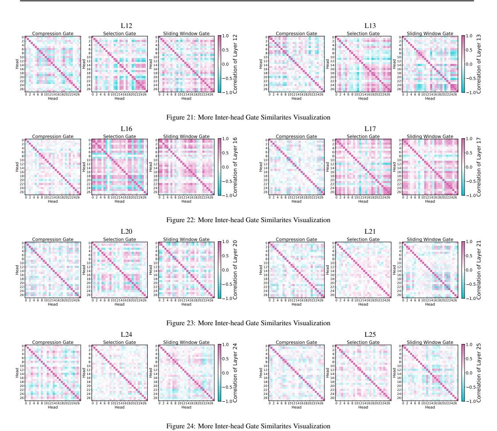

## P BENCHMARK-LEVEL GATING ANALYSIS AND PCA VISUALIZATION

In this section, we provide additional evidence that VideoNSA's routing strategy depends on input video content rather than layer depth alone. We collect the layer–head gate vectors for representative videos from three benchmarks with distinct visual properties (LongTimeScope (Zohar et al.,

Table 29: TimeScope (Zohar et al., 2025) results across different attention budget strategy. Metrics include overall accuracy and task-specific scores across different steps.

| Block Count | Window Size | Overall | 60   | 120  | 180  | 300  | 600  | 1200 | 1800 | 3600 | 7200 | 10800 |
|-------------|-------------|---------|------|------|------|------|------|------|------|------|------|-------|
| 36          | 32          | 81.6    | 97.4 | 97.4 | 96.7 | 85.4 | 82.7 | 86.3 | 85.3 | 71.3 | 60.6 | 52.7  |
| 35          | 64          | 82.4    | 92.7 | 91.3 | 92.7 | 91.4 | 83.4 | 91.6 | 91.3 | 74.6 | 63.3 | 52.0  |
| 34          | 128         | 82.2    | 96.7 | 96.7 | 94.7 | 89.4 | 82.0 | 88.3 | 85.3 | 76.6 | 60.0 | 52.7  |
| 28          | 512         | 82.8    | 94.7 | 97.4 | 94.7 | 90.7 | 82.7 | 91.6 | 88.6 | 74.0 | 63.3 | 50.0  |
| 20          | 1024        | 83.2    | 96.7 | 97.4 | 97.4 | 88.7 | 85.4 | 89.0 | 84.6 | 78.6 | 58.6 | 55.3  |
| 4           | 1900        | 8.6     | 4.7  | 4.7  | 4.7  | 4.7  | 4.7  | 12.3 | 13.3 | 13.3 | 13.3 | 10.0  |
| 10          | 512         | 59.9    | 4.7  | 4.7  | 94.7 | 88.7 | 79.4 | 85.6 | 80.0 | 68.0 | 58.0 | 35.3  |
| 40          | 1024        | 83.7    | 96.7 | 96.0 | 97.4 | 92.0 | 85.4 | 91.6 | 89.3 | 73.3 | 63.3 | 52.0  |

Table 30: LongVideoBench (Wu et al., 2024a) results across different attention budget strategy. Metrics include overall accuracy and task-specific scores across different steps.

| Block Count | Window Size | Overall | 600.0 | TOS  | S2E  | ЕЗЕ  | S2A  | SAA  | 030  | ТЗО  | ТЗЕ  | O2E  | T2O  | S2O  | TAA  | T2E  | E2O  | SSS  | T2A  | 60.0 | SOS  | 15.0 | 3600.0 |
|-------------|-------------|---------|-------|------|------|------|------|------|------|------|------|------|------|------|------|------|------|------|------|------|------|------|--------|
| 36          | 32          | 59.9    | 57.7  | 48.1 | 64.0 | 66.6 | 72.9 | 55.6 | 52.5 | 58.4 | 57.7 | 59.9 | 54.4 | 70.9 | 52.1 | 56.2 | 70.1 | 32.8 | 66.5 | 67.5 | 72.4 | 65.2 | 56.1   |
| 35          | 64          | 60.1    | 58.7  | 48.1 | 64.0 | 65.5 | 75.2 | 57.0 | 55.5 | 59.7 | 59.1 | 58.7 | 55.7 | 66.7 | 49.7 | 56.2 | 70.1 | 34.8 | 65.2 | 66.9 | 73.7 | 65.7 | 55.9   |
| 34          | 128         | 60.2    | 59.9  | 48.1 | 65.1 | 67.6 | 74.1 | 55.6 | 55.5 | 58.4 | 56.3 | 62.2 | 57.0 | 63.9 | 53.3 | 56.2 | 71.6 | 35.9 | 62.7 | 67.5 | 72.4 | 66.3 | 55.1   |
| 28          | 512         | 59.4    | 60.4  | 46.7 | 62.9 | 66.6 | 74.1 | 58.4 | 52.5 | 54.3 | 56.3 | 64.5 | 55.7 | 59.8 | 49.7 | 56.2 | 79.3 | 34.8 | 61.4 | 67.5 | 68.7 | 64.1 | 53.3   |
| 20          | 1024        | 59.6    | 60.6  | 45.4 | 66.1 | 66.6 | 72.9 | 59.8 | 54.0 | 54.3 | 55.0 | 64.5 | 57.0 | 58.4 | 50.9 | 56.2 | 80.9 | 32.8 | 62.7 | 69.2 | 67.5 | 63.6 | 53.1   |
| 4           | 1900        | 28.3    | 27.6  | 23.4 | 24.2 | 35.7 | 25.2 | 32.0 | 29.7 | 27.3 | 24.8 | 31.1 | 30.7 | 33.4 | 35.1 | 27.0 | 28.5 | 26.6 | 19.7 | 27.4 | 28.0 | 27.1 | 29.7   |
| 17          | 64          | 59.4    | 58.0  | 46.7 | 62.9 | 65.5 | 74.1 | 55.6 | 52.5 | 58.4 | 57.7 | 58.7 | 57.0 | 66.7 | 50.9 | 56.2 | 71.6 | 30.7 | 64.0 | 68.1 | 72.4 | 65.7 | 54.2   |

2025) for multi-shot transitions, Tomato (Shangguan et al., 2024) for high-frequency motion, and VSIBench (Yang et al., 2025a) for complex spatial layouts) and project the gate vectors into a 2D space using PCA.

As shown in Figure 25, the gate patterns form three clearly separated clusters, regardless of whether we use the compression branch, the selection branch, or the sliding-window branch, which indicates that VideoNSA learns benchmark-specific routing strategies conditioned on visual content, rather than following a fixed depth pattern.

To further isolate the role of input-driven routing, we replace each layer's gate with a static value averaged from a 1K training subset, forcing the model to depend only on layer depth. As shown in Table 34, the performance drops across all six benchmarks, especially on tasks requiring long-range temporal integration, confirming that dynamic gating is essential.

#### Q ADDITIONAL ANALYSIS OF TRAINING AND INFERENCE EFFICIENCY

To complement the efficiency discussion in the main paper, we provide additional analysis of both FLOPs and wall-clock latency across different attention mechanisms and context lengths.

**Training Efficiency.** Under identical optimization settings, training VideoNSA requires approximately 4600~H100~GPU hours, while the dense baseline requires 5280~H100~GPU hours. This corresponds to  $0.87\times$  of the dense baseline, indicating that VideoNSA achieves slightly improved training efficiency despite using a more complex attention mechanism.

Inference Efficiency. Table 35 presents the theoretical FLOPs of different attention mechanisms. In the ideal case, NSA requires only 2.05 PFLOPs, which is  $0.24\times$  that of Flash Attention, demonstrating the theoretical computational efficiency of the sparse routing structure. However, the actual FLOPs and wall-clock latency of VideoNSA are higher than this ideal value due to implementation constraints in the current NSA kernel. The Qwen2.5-VL 7B (Qwen et al., 2025) adopts an unusual head configuration of 4 KV heads and 28 query heads. To satisfy Triton kernel requirements, the query heads must be padded to 64, which introduces additional computation and memory access overhead. As a result, the practical efficiency of VideoNSA deviates from its theoretical FLOPs advantage. As shown in Figure 26, VideoNSA's latency grows much more slowly than dense attention, and compared with other sparse baselines, it delivers competitive inference speed while achieving stronger model performance.

Table 31: MLVU (Zhou et al., 2024) results across different attention budget strategy. Metrics include overall accuracy and task-specific scores across different steps.

| Block Count | Window Size | Overall | Direction | Count | Rotation | Shape&Trend | Velocity&Freq. | Visual Cues | Human | Simulated | Object |
|-------------|-------------|---------|-----------|-------|----------|-------------|----------------|-------------|-------|-----------|--------|
| 32          | 256         | 26.5    | 21.6      | 31.5  | 22.0     | 25.6        | 23.3           | 40.0        | 21.7  | 23.6      | 29.3   |
| 36          | 32          | 25.9    | 21.6      | 32.5  | 19.2     | 25.1        | 25.5           | 37.1        | 21.4  | 21.5      | 29.2   |
| 35          | 64          | 27.1    | 23.8      | 33.9  | 20.6     | 25.6        | 25.5           | 37.1        | 22.1  | 24.2      | 30.8   |
| 34          | 128         | 27.2    | 23.8      | 34.2  | 20.3     | 25.1        | 25.5           | 38.6        | 21.9  | 24.2      | 30.8   |
| 28          | 512         | 26.1    | 21.8      | 32.2  | 19.2     | 24.7        | 27.5           | 37.1        | 22.1  | 22.4      | 28.2   |
| 20          | 1024        | 25.1    | 20.6      | 30.8  | 17.5     | 23.3        | 29.4           | 34.3        | 21.4  | 23.3      | 25.6   |
| 64          | 512         | 25.3    | 21.3      | 30.5  | 19.6     | 24.2        | 27.5           | 32.9        | 21.4  | 22.9      | 27.4   |
| 4           | 2048        | 26.4    | 21.8      | 33.6  | 20.3     | 25.6        | 27.5           | 32.9        | 21.8  | 24.7      | 29.4   |
| 16          | 128         | 21.4    | 19.5      | 17.5  | 20.2     | 21.0        | 30.0           | 28.8        | 17.8  | 17.6      | 20.6   |

Table 32: Tomato (Shangguan et al., 2024) results across different attention budget strategy. Metrics include overall accuracy and task-specific scores across different steps.

| Block Count | Window Size | Overall | Direction | Count | Rotation | Shape&Trend | Velocity&Freq. | Visual Cues | Human | Simulated | Object |
|-------------|-------------|---------|-----------|-------|----------|-------------|----------------|-------------|-------|-----------|--------|
| 36          | 32          | 25.9    | 21.6      | 32.5  | 19.2     | 25.1        | 25.5           | 37.1        | 21.4  | 21.5      | 29.2   |
| 35          | 64          | 27.1    | 23.8      | 33.9  | 20.6     | 25.6        | 25.5           | 37.1        | 22.1  | 24.2      | 30.8   |
| 34          | 128         | 27.2    | 23.8      | 34.2  | 20.3     | 25.1        | 25.5           | 38.6        | 21.9  | 24.2      | 30.8   |
| 28          | 512         | 26.1    | 21.8      | 32.2  | 19.2     | 24.7        | 27.5           | 37.1        | 22.1  | 22.4      | 28.2   |
| 20          | 1024        | 25.1    | 20.6      | 30.8  | 17.5     | 23.3        | 29.4           | 34.3        | 21.4  | 23.3      | 25.6   |
| 64          | 512         | 25.3    | 21.3      | 30.5  | 19.6     | 24.2        | 27.5           | 32.9        | 21.4  | 22.9      | 27.4   |
| 4           | 2048        | 26.4    | 21.8      | 33.6  | 20.3     | 25.6        | 27.5           | 32.9        | 21.8  | 24.7      | 29.4   |
| 16          | 128         | 21.4    | 19.5      | 17.5  | 20.2     | 21.0        | 30.0           | 28.8        | 17.8  | 17.6      | 20.6   |

#### R ADDITIONAL ANALYSIS ON CMP LATENCY BOTTLENECK

In this section, we provide additional analysis supporting the observation in findings that the CMP branch becomes the dominant source of latency as the context length increases.

Since the block size determines how many CMP operations are executed, we vary the block size and measure the resulting latency across multiple context lengths. As summarized in Table 36, although increasing the block size reduces the number of CMP executions, the overall latency improvement remains small. Smaller blocks are dominated by memory-access overhead, while larger blocks incur higher computation per block. As a result, block-size scaling affects latency only moderately within a narrow range and does not change the overall scaling trend.

We also observe that the most significant acceleration comes from more efficient NSA implementations instead of architectural hyperparameters. As shown in Table 37, the flash-nsa (mdy666, 2025) implementation runs about twice as fast as our current nsa-impl (Pai et al., 2025a) in the forward pass and up to six times faster in the backward pass. Other teams are also developing improved kernels such as optimizing NSA for TPUs (Ko, 2025). These findings show that the dominant factor affecting CMP and overall NSA latency comes from kernel efficiency, including memory access patterns and kernel design.

## S MORE ANALYSIS ABOUT ATTENTION SINKS ON VARIOUS SPARSE ATTENTION SETTINGS

Figure 27a indicates that in the compression branch, smaller blocks produce sharper and higher sink peaks at the sequence start, while larger blocks used in training reduce the initial peak but introduce broader low-density diffusion with periodic boundary spikes. The selection sinks in 27b remain at consistently low densities under different configurations, suggesting that the top-k filtering mechanism robustly suppresses sink formation across different settings. Figure 27 shows the distribution of attention sinks under different sparse attention settings. When varying the window size, sinks are concentrated near the beginning and decay rapidly with position. Overall, larger windows yield lower sink density but broader coverage, while the training configuration (w = 256) strikes a middle ground and exhibits sparse periodic clusters in the mid-to-late sequence, reflecting sensitivity to local boundaries learned during training.

Table 33: VSIBench (Yang et al., 2025a) results across different attention budget strategy. Metrics include overall accuracy and task-specific scores across different steps.

| Block Count | Window Size | Overall | Appearance | Abs. Dist. | Counting | Rel. Dist. | Size Est. | Room Est. | Route Plan. | Rel. Dir. |
|-------------|-------------|---------|------------|------------|----------|------------|-----------|-----------|-------------|-----------|
| 28          | 512         | 36.0    | 23.9       | 18.2       | 45.5     | 36.9       | 54.1      | 29.8      | 36.0        | 43.4      |
| 20          | 1024        | 35.9    | 24.0       | 18.5       | 46.8     | 36.7       | 53.6      | 29.0      | 36.5        | 42.0      |
| 4           | 1900        | 0.0     | 0.0        | 0.0        | 0.0      | 0.0        | 0.0       | 0.0       | 0.0         | 0.0       |
| 34          | 128         | 35.5    | 24.7       | 18.7       | 37.8     | 36.2       | 53.9      | 31.7      | 36.0        | 45.2      |
| 35          | 64          | 35.4    | 25.5       | 20.4       | 33.2     | 35.4       | 53.6      | 31.5      | 38.1        | 46.0      |
| 36          | 32          | 34.9    | 25.3       | 20.6       | 28.4     | 36.0       | 54.4      | 30.9      | 38.1        | 45.9      |
| 36          | 62          | 35.3    | 25.2       | 20.5       | 28.3     | 35.8       | 54.7      | 31.0      | 41.1        | 46.1      |
| 16          | 128         | 0.0     | 0.0        | 0.0        | 0.0      | 0.0        | 0.0       | 0.0       | 0.0         | 0.0       |
| 64          | 512         | 35.8    | 23.6       | 18.3       | 45.9     | 36.8       | 54.2      | 29.3      | 36.5        | 42.3      |

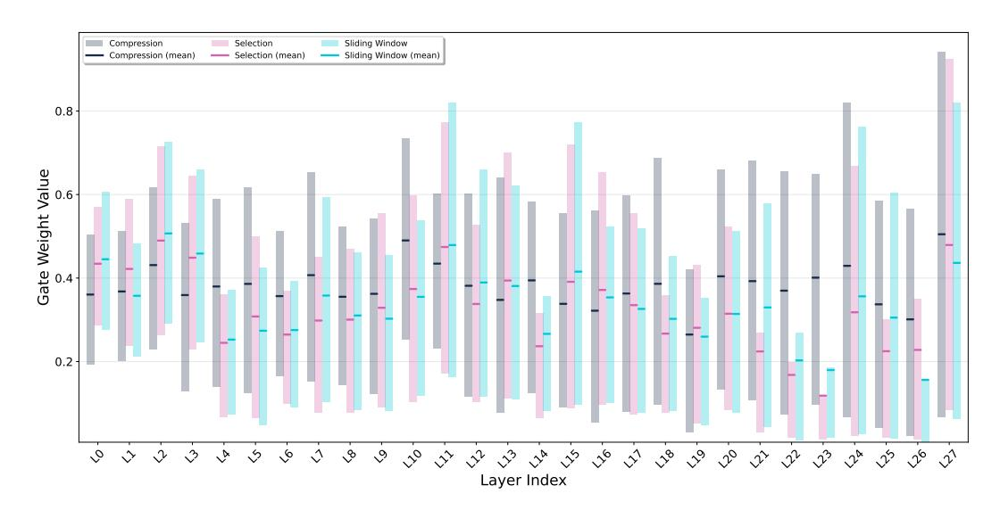

Figure 17: Gate weight distribution of each layer.

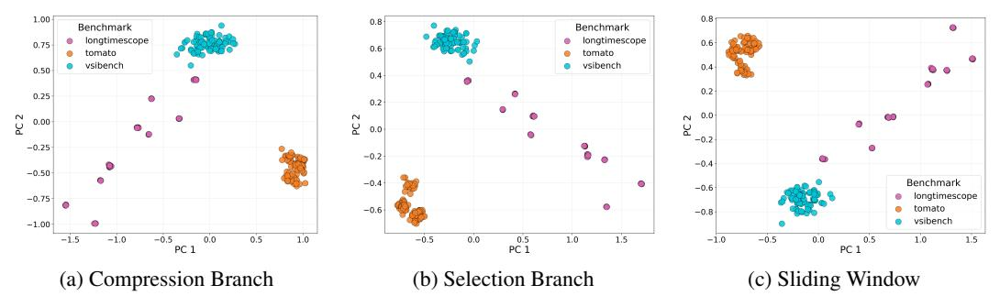

Figure 25: PCA visualization of benchmark-level gate patterns.

#### T DISCUSSION ON MODALITY-SPECIFIC SPARSITY

To further contextualize the modality-specific sparsity patterns exhibited by VideoNSA, we compare its behavior with the text-only NSA (Pai et al., 2025a) used in language models. As shown in Figure 28, the text-only NSA (Pai et al., 2025a) displays a distinct gating dynamic. The sliding-window branch gradually becomes dominant in deeper layers, while the compression and selection branches diminish rapidly and remain almost inactive throughout most of the network. This pattern reflects the one-dimensional and relatively uniform nature of textual sequences, where long-range interactions are sparse and stable, and the model tends to converge toward a single prevailing routing path. The text-only NSA (Pai et al., 2025a) also presents a noticeable anomaly in the final layer, where all three branches suddenly become active again despite having remained largely inactive in

Table 34: Ablation on static gates averaged over a 1K training subset.

| Model                                              |                | Long Video U     | nderstanding |                                      | Temporal Reasoning Spatial Understanding |                                                                       |  |  |
|----------------------------------------------------|----------------|------------------|--------------|--------------------------------------|------------------------------------------|-----------------------------------------------------------------------|--|--|
| nioder .                                           | LongVideoBencl | h MLVU $_{Test}$ | TimeScope    | LongTimeScope                        | Tomato                                   | VSIBench                                                              |  |  |
| Qwen2.5-VL-7B VideoNSA VideoNSA+ Static Gate |                |                  |              | 40.7 44.4 (+9.1%) 41.5 (+2.0%) | 22.6 26.2 (+15.9%) 23.7 (+4.8%)    | 29.7 <b>36.1</b> (+ <b>20.3</b> %) <b>31.8</b> (+ <b>7.1</b> %) |  |  |

Table 35: Theoretical FLOPs comparison among different attention mechanisms. "VideoNSA (ideal)" denotes the theoretical FLOPs of NSA without query-head padding.

| Method           | FLOPs   | Relative      |
|------------------|---------|---------------|
| Flash Attention  | 8.40 PF | 1.00×         |
| Tri-shape        | 7.07 PF | $0.84 \times$ |
| MInference       | 4.13 PF | $0.49 \times$ |
| Flexprefill      | 7.75 PF | $0.92 \times$ |
| XAttention       | 1.94 PF | $0.23 \times$ |
| VideoNSA (ideal) | 2.05 PF | $0.24 \times$ |
| VideoNSA         | 4.68 PF | $0.56 \times$ |

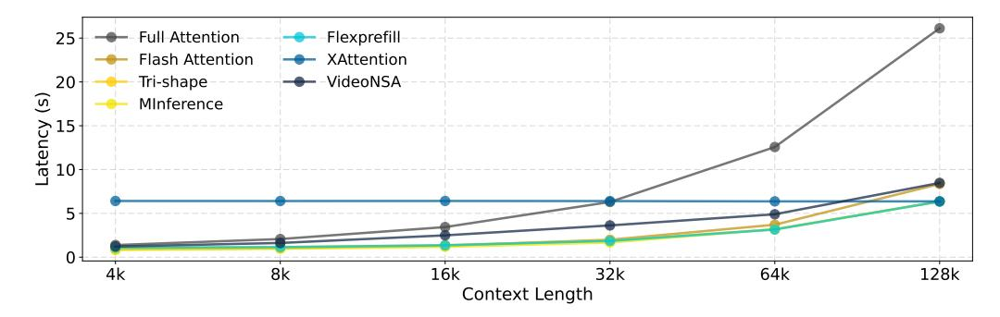

(a) Absolute prefill latency across attention mechanisms.

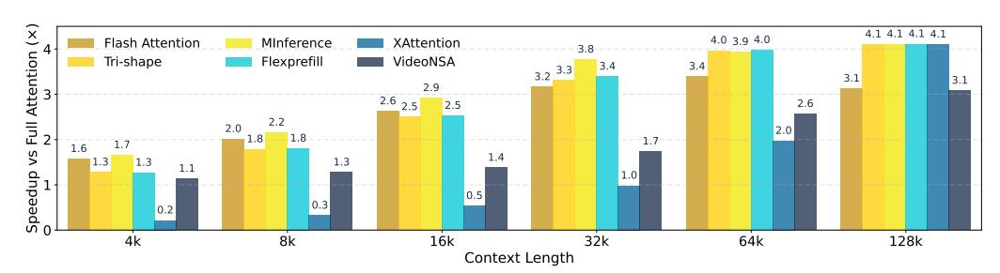

(b) Prefill-time speedup over full attention across context lengths.

Figure 26: Inference efficiency comparison across attention mechanisms.

previous layers. This behavior suggests a late-stage shift in inductive patterns that is characteristic of language modeling. In contrast, VideoNSA, as shown in Figure 17, maintains active and balanced usage of all three branches across nearly the entire depth of the network, with the compression branch playing a consistently prominent role.

The inter-head similarities further highlight the divergence between the two modalities. The text-only NSA (Pai et al., 2025a) in Figure 29 exhibits strong correlations across heads in the early layers, which indicates a set of conserved induction-like operations. Later in the model, selection and sliding window gate values become decorrelated across heads. VideoNSA, as shown in Section O, however, displays substantially weaker cross-head correlations overall, and only a few mid-layer clusters emerge in the selection and sliding-window branches. These findings imply that VideoNSA adjusts its sparse routing behavior to accommodate the rich spatiotemporal redundancy and multi-scale

Table 36: CMP latency under different block sizes and context lengths.

| Block Size | 1                       |       |       |       |       |       |
|------------|-------------------------|-------|-------|-------|-------|-------|
| 32         | 0.868 0.882 0.880 | 1.022 | 1.311 | 1.982 | 3.698 | 8.343 |
| 64         | 0.882                   | 1.036 | 1.322 | 1.997 | 3.687 | 8.323 |
| 128        | 0.880                   | 1.027 | 1.308 | 1.993 | 3.705 | 8.353 |

Table 37: Latency comparison between different NSA implementations at 8k context length.

| Implementation               | forward | backward |
|------------------------------|---------|----------|
| nsa-impl (Pai et al., 2025a) | 5.402   | 32.826   |
| flash-nsa (mdy666, 2025)     | 2.429   | 5.537    |

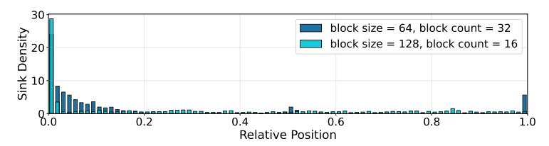

(a) Compression sinks across block size and counts.

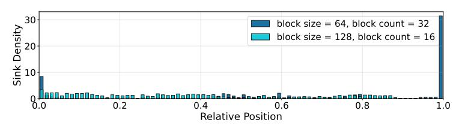

(b) Selection sinks across block size and counts.

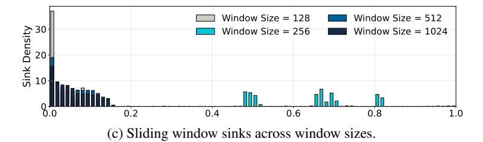

Figure 27: Attention sink distributions across the three branches under different sparse settings.

structure of video inputs, rather than collapsing into a single dominant pathway as observed in the

text-only model.

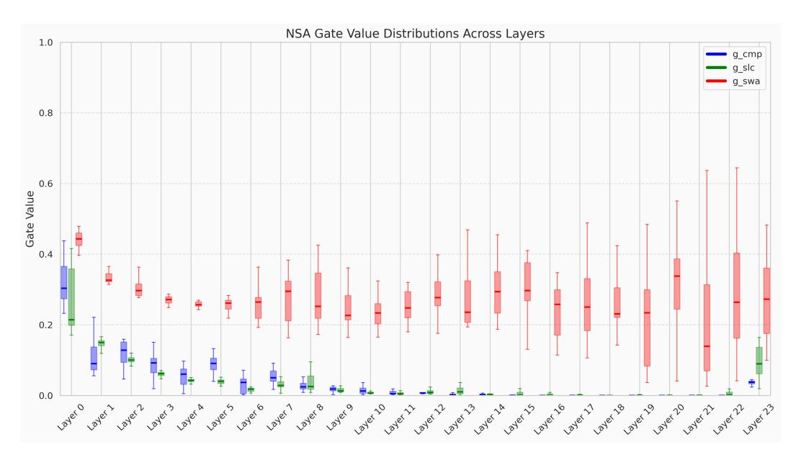

Figure 28: Layer-wise gate distributions of text-only NSA [\(Pai et al., 2025a\)](#page-12-4).

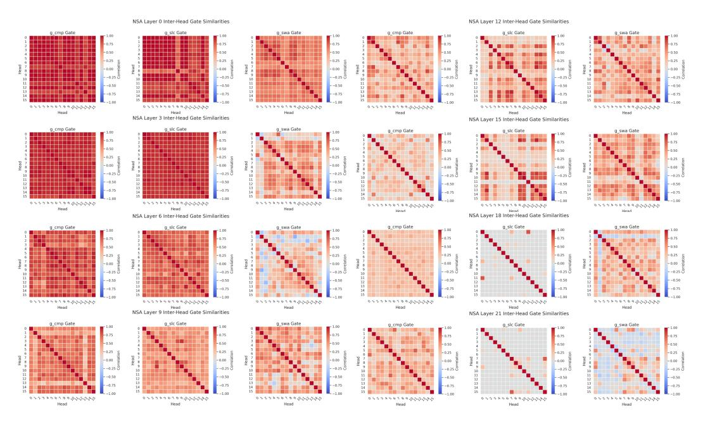

Figure 29: Inter-head gate similarities of text-only NSA [\(Pai et al., 2025a\)](#page-12-4).

## U DENSE ATTENTION SINK VISUALIZATION

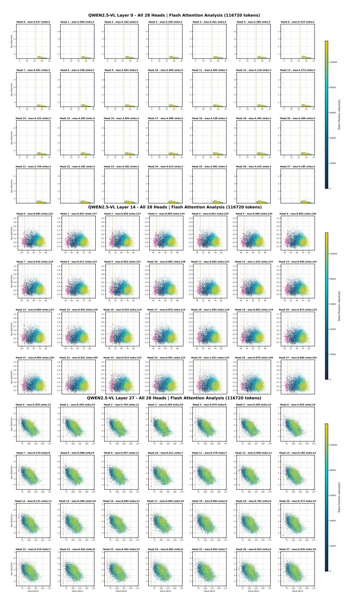