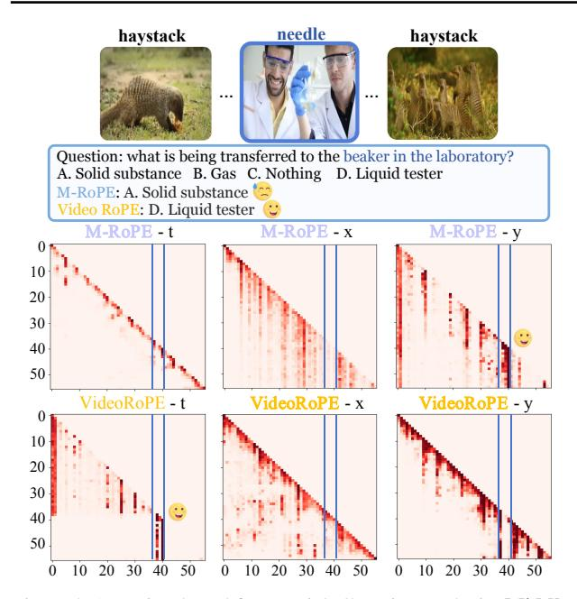
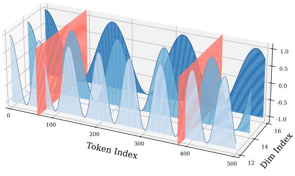
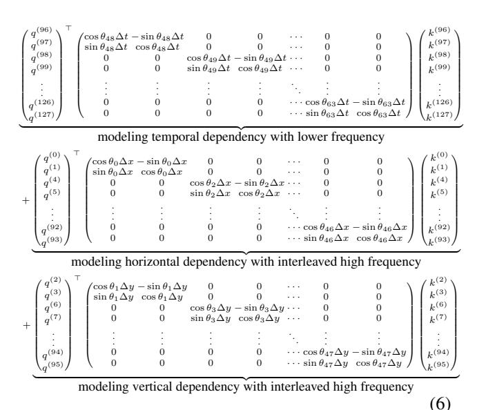
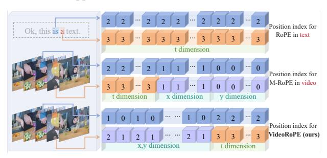

# (4) Temporal Index Scaling. Spatial and temporal dimen-

sions often exhibit different granularities (e.g., a unit change in x/y differs from a unit change in t) [\(Gao et al.,](#page-9-0) [2024\)](#page-9-0). Employing varying index intervals in positional encoding allows for dimension-specific encoding, capturing diverse scales and enhancing efficiency.

Driven by our analysis, we present a new video position embedding strategy, VideoRoPE, which can simultaneously satisfy the four properties in Tab. [1.](#page-0-0) Specifically, we use a 3D structure to model spatiotemporal information, allocating higher dimensions (lower frequencies), to the temporal axis (Low-frequency Temporal Allocation, LTA) to prioritize temporal modeling. The right panel of Fig. [2](#page-1-1) demonstrates that our LTA allocation mitigates oscillations and exhibits robustness to distractors in the V-NIAH-D task. We further employ a Diagonal Layout (DL) design to ensure spatial symmetry and preserve the relative positioning between visual and text tokens. Regarding temporal index scaling, we propose Adjustable Temporal Spacing (ATS), where a hyper-parameter controls the relative temporal spacing of adjacent visual tokens. In summary, our proposed position encoding scheme demonstrates favorable characteristics for modeling video data, yielding a robust and effective representation of positional information.

Overall, the contributions of this work are summarized as:

- (1) We present an analysis of four key properties essential for RoPE when applied to video. Motivated by this analysis, we propose VideoRoPE including Low-frequency Temporal Allocation (LTA), Diagonal Layout (DL), and Adjustable Temporal Spacing (ATS) to satisfy all four properties.
- (2) We introduce the challenging V-NIAH-D task to expose the drawbacks of current position embedding designs regarding frequency allocation. We reveal that existing Video

1 In RoPE, frequencies are determined by β −2n/d, where β is a constant, n is the dimension index, d is the total number of dimensions. Thus, choosing which dimensions represent t, x, and y directly determines the frequencies used for each.

LLMs are easily misled to frequency-based distractors.

(3) Extensive experiments demonstrate that VideoRoPE consistently achieves superior performance compared to other RoPE variants. For example, VideoRoPE outperforms previous M-RoPE on long video retrieval (+12.4 on V-NIAH, +12.4 on V-NIAH-D), video understanding (+2.9 on LongVideoBench, +4.5 on MLVU, +1.7 on Video-MME) and hallucination (+11.9 on VideoHallucer) benchmarks.

#### 2. Related Work

RoPE (Rotary Position Embedding). RoPE (Su et al., 2024) is a pivotal mechanism for encoding positional information in LLM long-context modeling. Using a rotation matrix, RoPE unifies the advantages of both absolute and relative positional embedding schemes. In RoPE design, different feature dimensions are embedded with position information based on Trigonometric functions sin and cos with different frequencies (Peng et al., 2023; Liu et al., 2023b). Lower dimensions correspond to higher frequency given larger values of base frequency. The simplicity and effectiveness of RoPE have led to its widespread adoption in leading LLMs (Touvron et al., 2023a; Yang et al., 2024a; Team et al., 2024; Cai et al., 2024; Sun et al., 2024).

Extending RoPE to Multi-Modal Data. Extending RoPE to multi-modal or Video LLMs typically follows two approaches. One approach directly applies standard RoPE, flattening visual tokens and treating text and visual tokens as a single 1D sequence. Although variants (e.g., TAD-RoPE (Gao et al., 2024)) introduce enhancements in indexing and attention mechanisms, these 1D RoPE variants overlook the spatiotemporal structure of video and inherent inter-modal differences (Su, 2024a;b; Wang et al., 2024a). In contrast, several studies have explored incorporating structural information to formulate the 2D/3D RoPE. For example, some previous works (Agrawal et al., 2024; Wang et al., 2024a) integrate RoPE-2D into visual encoders to improve spatial representation, particularly for resolution scaling. Based on the RoPE-Tie (Su, 2024a), M-RoPE (Wang et al., 2024a) used in QWen2-VL further generalizes RoPE to three dimensions to model both temporal and spatial dynamics. While effective, M-RoPE exhibits limitations, such as struggles with distractors in our V-NIAH-D task. This work presents a comprehensive analysis of the important characteristics essential for extending RoPE to video and proposes VideoRoPE according to our analysis.

#### 3. Analysis

**3D Structure.** The vanilla RoPE defines a matrix  $A_{t_1,t_2}$  that represents the relative positional encoding between two positions  $t_1$  and  $t_2$  in a 1D sequence:

$$A_{t_1,t_2} = (q_{t_1}R_{t_1})(k_{t_2}R_{t_2})^{\top} = q_{t_1}R_{\Delta t}k_{t_2}^{\top},$$
 (1)

where  $\Delta t = t_1 - t_2$ , the symbols  $q_{t_1}$  and  $k_{t_2}$  are the query and key vectors at positions  $t_1$  and  $t_2$ . The *relative rotation matrix*  $\mathbf{R}_{\Delta t}$  is defined as  $\mathbf{R}_{\Delta t} = \exp(\Delta t i \theta_n)$ , while i is the imaginary unit,  $\theta_n = \beta^{-2n/d}$  is the frequency of rotation applied to a specific n-th pair of d dimensions  $(n=0,\ldots,d/2-1)$ , and  $\beta$  is the frequency base parameter. The vanilla RoPE uses d=128, thus  $n=0,\ldots,63$ . Consequently, the  $\mathbf{A}_{t_1,t_2}$  in Eq. (1) can be extended as:

$$\begin{pmatrix} q^{(0)} \\ q^{(1)} \\ \vdots \\ q^{(126)} \\ q^{(127)} \end{pmatrix}^{\top} \begin{pmatrix} \cos\theta_0 \Delta t & -\sin\theta_0 \Delta t & \cdots & 0 & 0 \\ \sin\theta_0 \Delta t & \cos\theta_0 \Delta t & \cdots & 0 & 0 \\ \vdots & \vdots & \ddots & \vdots & \vdots \\ 0 & 0 & \cdots & \cos\theta_{63} \Delta t & \sin\theta_{63} \Delta t \\ 0 & 0 & \cdots & \sin\theta_{63} \Delta t & \cos\theta_{63} \Delta t \end{pmatrix} \begin{pmatrix} k^{(0)} \\ k^{(1)} \\ \vdots \\ k^{(126)} \\ k^{(127)} \end{pmatrix}$$

While the vanilla RoPE operates on 1D sequences, it can also be applied to higher-dimensional input by flattening the input into a 1-D sequence. However, the flattening process discards crucial neighborhood information, increases the sequence length, and hinders the capture of long-range dependencies. Therefore, preserving the inherent 3D structure is essential when adapting RoPE for video data. Some recent RoPE-variants (e.g., M-RoPE in Qwen2-VL (Wang et al., 2024a)) incorporate the 3D structure. The corresponding relative matrix  $A_{(t_1,x_1,y_1)}$  is computed as:

$$\boldsymbol{A}_{(t_1,x_1,y_1),(t_2,x_2,y_2)} = \boldsymbol{q}_{(t_1,x_1,y_1)} \boldsymbol{R}_{\Delta t,\Delta x,\Delta y} \boldsymbol{k}_{(t_2,x_2,y_2)}^{\top},$$
(3)

where  $\Delta t = t_1 - t_2$ ,  $\Delta x = x_1 - x_2$ , and  $\Delta y = y_1 - y_2$ . M-RoPE divides the d=128 feature dimensions into 3 groups: the first 32 for temporal positions (t), the middle 48 for horizontal positions (x), and the last 48 for vertical positions (y). As shown in Eq (4),  $A_{(t_1,x_1,y_1),(t_2,x_2,y_2)}$  in M-RoPE is extended as:

$$\begin{pmatrix} q^{(0)}_{(1)} \\ q^{(1)}_{(2)} \\ q^{(3)} \\ \vdots \\ q^{(30)}_{(31)} \end{pmatrix}^{\top} \begin{pmatrix} \cos\theta_0\Delta t - \sin\theta_0\Delta t & 0 & 0 & \cdots & 0 & 0 \\ \sin\theta_0\Delta t & \cos\theta_0\Delta t & 0 & 0 & \cdots & 0 & 0 \\ 0 & 0 & \cos\theta_1\Delta t - \sin\theta_1\Delta t & \cdots & 0 & 0 \\ 0 & 0 & \sin\theta_1\Delta t & \cos\theta_1\Delta t & \cdots & 0 & 0 \\ \vdots & \vdots & \vdots & \vdots & \ddots & \vdots & \vdots \\ 0 & 0 & 0 & 0 & 0 & \cos\theta_15\Delta t - \sin\theta_15\Delta t \\ 0 & 0 & 0 & 0 & 0 & \cdots & \cos\theta_15\Delta t - \sin\theta_15\Delta t \\ 0 & 0 & 0 & 0 & \cdots & \sin\theta_15\Delta t & \cos\theta_15\Delta t \end{pmatrix} \begin{pmatrix} k^{(0)}_{(1)} \\ k^{(2)}_{(2)} \\ k^{(3)}_{(3)} \\ \vdots \\ k^{(30)}_{(K)} \end{pmatrix}$$

modeling temporal dependency with higher frequency

$$\begin{pmatrix} q^{(32)} \\ q^{(33)} \\ q^{(34)} \\ + q^{(35)} \\ \vdots \\ q^{(78)} \\ q^{(79)} \end{pmatrix}^{\top} \begin{pmatrix} \cos\theta_{16}\Delta x - \sin\theta_{16}\Delta x & 0 & 0 & \cdots & 0 & 0 \\ \sin\theta_{16}\Delta x & \cos\theta_{16}\Delta x & 0 & 0 & \cdots & 0 & 0 \\ 0 & 0 & \cos\theta_{17}\Delta x - \sin\theta_{17}\Delta x & \cdots & 0 & 0 \\ 0 & 0 & \sin\theta_{17}\Delta x & \cos\theta_{17}\Delta x & \cdots & 0 & 0 \\ \vdots & \vdots & \vdots & \vdots & \vdots & \vdots & \vdots \\ 0 & 0 & 0 & 0 & 0 & \cdots & \cos\theta_{39}\Delta x - \sin\theta_{39}\Delta x \\ 0 & 0 & 0 & 0 & 0 & \cdots & \sin\theta_{39}\Delta x & \cos\theta_{39}\Delta x \end{pmatrix} \begin{pmatrix} k^{(32)} \\ k^{(33)} \\ k^{(34)} \\ k^{(35)} \\ k^{(32)} \\ k^{(32)} \\ k^{(32)} \\ k^{(32)} \\ k^{(32)} \\ k^{(32)} \\ k^{(32)} \\ k^{(32)} \\ k^{(32)} \\ k^{(32)} \\ k^{(32)} \\ k^{(32)} \\ k^{(32)} \\ k^{(32)} \\ k^{(32)} \\ k^{(32)} \\ k^{(32)} \\ k^{(32)} \\ k^{(32)} \\ k^{(32)} \\ k^{(32)} \\ k^{(32)} \\ k^{(32)} \\ k^{(32)} \\ k^{(32)} \\ k^{(32)} \\ k^{(32)} \\ k^{(32)} \\ k^{(32)} \\ k^{(32)} \\ k^{(32)} \\ k^{(32)} \\ k^{(32)} \\ k^{(32)} \\ k^{(32)} \\ k^{(32)} \\ k^{(32)} \\ k^{(32)} \\ k^{(32)} \\ k^{(32)} \\ k^{(32)} \\ k^{(32)} \\ k^{(32)} \\ k^{(32)} \\ k^{(32)} \\ k^{(32)} \\ k^{(32)} \\ k^{(32)} \\ k^{(32)} \\ k^{(32)} \\ k^{(32)} \\ k^{(32)} \\ k^{(32)} \\ k^{(32)} \\ k^{(32)} \\ k^{(32)} \\ k^{(32)} \\ k^{(32)} \\ k^{(32)} \\ k^{(32)} \\ k^{(32)} \\ k^{(32)} \\ k^{(32)} \\ k^{(32)} \\ k^{(32)} \\ k^{(32)} \\ k^{(32)} \\ k^{(32)} \\ k^{(32)} \\ k^{(32)} \\ k^{(32)} \\ k^{(32)} \\ k^{(32)} \\ k^{(32)} \\ k^{(32)} \\ k^{(32)} \\ k^{(32)} \\ k^{(32)} \\ k^{(32)} \\ k^{(32)} \\ k^{(32)} \\ k^{(32)} \\ k^{(32)} \\ k^{(32)} \\ k^{(32)} \\ k^{(32)} \\ k^{(32)} \\ k^{(32)} \\ k^{(32)} \\ k^{(32)} \\ k^{(32)} \\ k^{(32)} \\ k^{(32)} \\ k^{(32)} \\ k^{(32)} \\ k^{(32)} \\ k^{(32)} \\ k^{(32)} \\ k^{(32)} \\ k^{(32)} \\ k^{(32)} \\ k^{(32)} \\ k^{(32)} \\ k^{(32)} \\ k^{(32)} \\ k^{(32)} \\ k^{(32)} \\ k^{(32)} \\ k^{(32)} \\ k^{(32)} \\ k^{(32)} \\ k^{(32)} \\ k^{(32)} \\ k^{(32)} \\ k^{(32)} \\ k^{(32)} \\ k^{(32)} \\ k^{(32)} \\ k^{(32)} \\ k^{(32)} \\ k^{(32)} \\ k^{(32)} \\ k^{(32)} \\ k^{(32)} \\ k^{(32)} \\ k^{(32)} \\ k^{(32)} \\ k^{(32)} \\ k^{(32)} \\ k^{(32)} \\ k^{(32)} \\ k^{(32)} \\ k^{(32)} \\ k^{(32)} \\ k^{(32)} \\ k^{(32)} \\ k^{(32)} \\ k^{(32)} \\ k^{(32)} \\ k^{(32)} \\ k^{(32)} \\ k^{(32)} \\ k^{(32)} \\ k^{(32)} \\ k^{(32)} \\ k^{(32)} \\$$

modeling horizontal dependency with intermediate frequency

$$+ \begin{pmatrix} q^{(80)} \\ q^{(81)} \\ q^{(82)} \\ q^{(83)} \\ \vdots \\ q^{(127)} \end{pmatrix}^\top \begin{pmatrix} \cos\theta_{40}\Delta y - \sin\theta_{40}\Delta y & 0 & 0 & \cdots & 0 & 0 \\ \sin\theta_{40}\Delta y & \cos\theta_{40}\Delta y & 0 & 0 & \cdots & 0 & 0 \\ 0 & 0 & \cos\theta_{41}\Delta y - \sin\theta_{41}\Delta y & \cdots & 0 & 0 \\ 0 & 0 & \sin\theta_{41}\Delta y & \cos\theta_{41}\Delta y & \cdots & 0 & 0 \\ \vdots & \vdots & \vdots & \vdots & \vdots & \ddots & \vdots & \vdots \\ 0 & 0 & 0 & 0 & 0 & \cdots & \cos\theta_{63}\Delta y - \sin\theta_{63}\Delta y \\ 0 & 0 & 0 & 0 & 0 & \cdots & \sin\theta_{63}\Delta y & \cos\theta_{53}\Delta y \end{pmatrix} \begin{pmatrix} k^{(80)} \\ k^{(81)} \\ k^{(82)} \\ k^{(83)} \\ \vdots \\ k^{(126)} \\ k^{(127)} \end{pmatrix}$$

modeling vertical dependency with lower frequency

(4)

**Frequency Allocation.** Incorporating 3D structure raises the question of how to allocate the temporal (t), horizontal (x), and vertical (y) components within the d dimensions. Note that different allocation strategies are not equivalent

Figure 3. Attention-based frequential allocation analysis. **Middle**: M-RoPE's temporal dimension (t) is limited to local information, resulting in a diagonal layout. **Bottom**: VideoRoPE effectively retrieves the needle using the temporal dimension. The x and y coordinates represent the video frame number, e.g., 50 for 50 frames. For more details see Appendix E.

in the rotation frequency  $\theta_n = \beta^{-2n/d}$ . As shown in Eq. (4), M-RoPE assigns higher frequencies (corresponding to lower dimensions) to the temporal dimension (t).

To highlight the importance of frequency allocation, we introduce a challenging retrieval task Visual Needle-In-A-Hastack-Distractor (V-NIAH-D). V-NIAH-D builds upon V-NIAH (Zhang et al., 2024d), a benchmark designed to evaluate visual long-context understanding. However, the straightforward retrieval-based task has been shown to provide only a superficial form of long-context understanding (Hsieh et al., 2024; Yuan et al., 2024). Therefore, We enhance V-NIAH by incorporating semantically similar distractors, obtained using Google Image Search (Google, 2025) or Flux (Labs, 2023), to mitigate the possibility of correct answers through random chance. These distractors are designed to be unambiguous to the question in Fig. 2.

As shown in Fig. 2, M-RoPE exhibits a clear performance drop from V-NIAH to V-NIAH-D. To investigate this decline, we follow previous works (Xiao et al., 2023; Liu et al., 2023b; Barbero et al., 2024) to visualize the attention scores in Fig. 3. We decompose the attention scores into their corresponding temporal (t), horizontal (x), and vertical (y) components for visualization.

Fig. 3 reveals unusual M-RoPE's attention patterns, despite locating the needle image, it fails to answer the multi-choice question. According to M-RoPE's attention, the needle is

located primarily through vertical positional information, rather than temporal features. Thus, the temporal dimension fails to capture long-range semantic dependencies, focusing on local relationships. Conversely, the spatial dimensions capture long-range rather than local semantic information. Lastly, the horizontal and vertical dimensions display distinct characteristics, with the vertical dimension exhibiting phenomena reminiscent of attention sinks (Xiao et al., 2023). These suggest the performance decline primarily results from sub-optimal frequency allocation designs of M-RoPE.

**Spatial Symmetry.** Given the text tokens T and the visual tokens  $T_v$ , spatial symmetry (Su, 2024b) claims that the distance between the end of the preceding textual input  $(T_{\text{pre}})$  and the beginning of the visual input  $(T_v^{\text{start}})$  is equal to the distance between the end of the visual input  $(T_v^{\text{end}})$  and the beginning of the subsequent textual input  $(T_{\text{sub}})$ :

$$T_v^{\text{start}} - T_{\text{pre}} = T_{\text{sub}} - T_v^{\text{end}}.$$
 (5)

The spatial symmetrical structure can potentially simplify the learning process and reduce bias toward input order. However, existing 3D RoPE variants such as M-RoPE do not meet the spatial symmetry, we will elaborate related discussion in Fig. 6.

**Temporal Index Scaling.** The frame index in video and the token index in text are inherently different (Su, 2024b; Li et al., 2024a). Recognizing this difference, methods like TAD-RoPE, a 1D RoPE adaptation for Video LLMs, introduce distinct step offsets for image and text token indices:  $\gamma$  for image tokens and  $\gamma+1$  for text tokens. Consequently, an ideal RoPE design for video data should permit scaling of the temporal index to meet the inherent difference between the frame index and the text index.

#### 4. VideoRoPE

Based on some previous research and the above analysis, we claim that a good RoPE design for Video LLMs, especially for long videos, should satisfy four requirements. The first requirement has been solved by RoPE-Tie (Su, 2024a) and the subsequent M-RoPE (Wang et al., 2024a). To solve the last three requirements and mitigate the performance decline observed in V-NIAH-D, we propose our VideoRoPE, comprising the following three key components.

Low-frequency Temporal Allocation (LTA). As shown in Eq. (2), the vanilla RoPE (Su et al., 2024) uses all dimensions to model the 1D position information. And as indicated in Eq. (4), M-RoPE (Wang et al., 2024a) uses different dimensions to model temporal, horizontal, and vertical dimensions sequentially. However, previous frequency allocation strategies are suboptimal because different RoPE dimensions capture dependencies at varying ranges. As shown in Fig. 3, an interesting observation is that the local

(a) Temporal Frequency Allocation in M-RoPE

(b) Temporal Frequency Allocation in VideoRoPE (ours)

Figure 4. (a) M-RoPE (Wang et al., 2024a) models temporal dependencies using the *first* 16 rotary angles, which exhibit higher frequencies and more pronounced oscillations. (b) In contrast, VideoRoPE models temporal dependencies using the *last* 16 rotary angles, characterized by significantly wider, monotonic intervals. Our frequency allocation effectively mitigates the misleading influence of distractors in V-NIAH-D. For a more detailed analysis, please refer to Appendix F.

attention branch (as reported in (Han et al., 2024)) corresponds to lower dimensions, while the global branch (or attention sink, as in (Xiao et al., 2023)) corresponds to higher dimensions. To sum up, lower dimensions (higher frequency, shorter monotonic intervals, larger  $\theta_n$ ) tend to capture relative distances and local semantics (Men et al., 2024; Barbero et al., 2024), while higher dimensions (lower frequency, wider monotonic intervals, smaller  $\theta_n$ ) capture longer-range dependencies (Barbero et al., 2024).

Based on our analysis, VideoRoPE uses higher dimensions for temporal features in longer contexts and lower dimensions for spatial features, which are limited by resolution and have a fixed range. To avoid the gap between horizontal and vertical positions, we interleave the dimensions responsible for these spatial features. The dimension distribution for VideoRoPE is shown in Eq. (6):

The horizontal position x and vertical position y are inter-

Figure 5. The position embeddings of adjacent text tokens for Vanilla RoPE (**top** row), the corresponding visual tokens in adjacent frames for M-RoPE (**middle** row) and our VideoRoPE (**bottom** row) with interleaved spatial and temporal last design.

leaved to occupy the lower dimensions, followed by temporal t, which occupies the higher dimensions. We keep the same allocation number for x, y, and t as M-RoPE for a fair comparison, with values of 48, 48, and 32, respectively. The advantages of this distribution are evident in Fig. 4. For a RoPE-based LLM with a 128-dimensional head (64 rotary angles  $\theta_n$ ), we visualize the function of  $\cos\theta_n t$  for 3 dimensions using parallel blue planes.

As shown in Fig. 4 (a), M-RoPE's temporal position embeddings are significantly distorted by periodic oscillations (Men et al., 2024), leading to identical embeddings for distant positions. For instance, considering the last three rotary angles, the temporal embeddings are severely affected by these oscillations due to their short monotonic intervals (and even shorter intervals in lower dimensions). This periodicity creates "hash collisions" (red planes), where distant positions share near-identical embeddings, making the model susceptible to distractor influence. Fortunately, our VideoRoPE (Fig. 4 (b)) is free from oscillation and Hash collision in temporal modeling. The relationship between periodicity, monotonicity, and temporal modeling is visualized in Fig 4.

Figure 6. The 3D visualization for different position embedding. (a) The vanilla 1D RoPE (Su et al., 2024) does not incorporate spatial modeling. (b) M-RoPE (Wang et al., 2024a), while have the 3D structure, introduces a discrepancy in index growth for visual tokens across frames, with some indices remaining constant. (c) In contrast, our VideoRoPE achieves the desired balance, maintaining the consistent index growth pattern of vanilla RoPE while simultaneously incorporating spatial modeling.

**Diagonal Layout.** Fig. 6 provides a visual comparison of spatial symmetry in positional encodings. For vanilla RoPE (Fig. 6a), no spatial relation is considered and the index for every dimension increases directly. While M-RoPE (Fig. 6b), incorporates spatial information within each frame, it introduces two significant discontinuities between textual and visual tokens. This arises from M-RoPE's placement strategy, if the first visual token is at (0,0), the last token in each frame will always be placed at (W-1,H-1), creating a stack in the bottom-left corner. Furthermore, like vanilla RoPE, M-RoPE's indices increase with input length across all dimensions.

To address these limitations, VideoRoPE arranges the entire input along the diagonal, see Fig. 6c. The central patch's 3D position for each video frame is (t,t,t), with other patches offset in all directions. Our **Diagonal Layout** has two advantages: (1) our design preserves the relative positions of visual tokens and ensures approximate equidistance from the image corners to the center, preventing text tokens from being overly close to any corner. (2) It maintains the indexing pattern of vanilla RoPE (Fig. 5), as the position index increment between corresponding spatial locations in adjacent frames mirrors that of adjacent textual tokens.

**Adjustable Temporal Spacing.** To scale the temporal index, we introduce a scaling factor  $\delta$  to better align temporal information between visual and textual tokens.

Suppose the symbol  $\tau$  denotes the token index, for the starting text  $(0 \le \tau < T_s)$ , the temporal, horizontal, and vertical indices are simply set to the raw token index  $\tau$ . For the video input  $(T_s \le \tau < T_s + T_v)$ , The difference  $\tau - T_s$  represents the index of the current frame relative to the start of the video, which is then scaled by  $\delta$  to control the space in the temporal dimension. For the ending text  $(T_s + T_v \le \tau < T_s + T_v + T_e)$ , the temporal, horizontal, and vertical index are the same, creating a linear progression.

According to our adjustable temporal spacing design, for a multi-modal input that consists of a text with  $T_s$  tokens, a following video with  $T_v$  frame with  $W \times H$  patches in each frame, and an ending text with  $T_e$  tokens, the position indices (t,x,y) of VideoRoPE for  $\tau$ -th textual token or  $(\tau,w,h)$ -th visual token are defined as Eq. (7):

$$(t,x,y) = \begin{cases} (\tau,\tau,\tau) & \text{if } 0 \le \tau < T_s \\ \left( \begin{array}{l} T_s + \delta(\tau - T_s), \\ T_s + \delta(\tau - T_s) + w - \frac{W}{2}, \\ T_s + \delta(\tau - T_s) + h - \frac{H}{2} \end{array} \right) & \text{if } T_s \le \tau < T_s + T_v \\ \left( \begin{array}{l} \tau + (\delta - 1)T_v, \\ \tau + (\delta - 1)T_v, \\ \tau + (\delta - 1)T_v \end{array} \right) & \text{if } T_s + T_v \le \tau < T_s + T_v + T_e \end{cases}$$

where w and h represent the horizontal and vertical indices of the visual patch within the frame, respectively.

In summary, the parameter  $\delta$  in our adjustable temporal spacing allows for a flexible and consistent way to encode the relative positions of text and video tokens.

#### 5. Experiment

#### 5.1. Experimental Setup

Training Data. We use a subset of LLaVA-Video-178k dataset (Zhang et al., 2024e) to train VideoRoPE. The LLaVA-Video-178k dataset covers 178k videos and around 5 million question-answers (QA) pairs from diverse sources such as HD-VILA (Xue et al., 2022), Kinetics (Kay et al., 2017), and ActivityNet (Fabian Caba Heilbron & Niebles, 2015). To balance training efficiency and long-video comprehension, we randomly select 136k videos with durations under 2 minutes and 18k videos with durations between 2 and 3 minutes. This process yielded our training set of approximately 1.3 million pairs.

**Implementation Details.** Using the aforementioned video

Table 2. Comparison of different RoPE methods on LongVidionBench, MLVU, and Video-MME. The benchmarks evaluate performance across three context lengths: 8k, 16k, 32k, and 64k, where 8k represents context within the training range, and others represent context outside the training range. Our VideoRoPE outperforms other RoPE variants across all three benchmarks. The best results are marked in **bold**, and the second-best results are <u>underlined</u>. For more information on the evaluation, see Appendix B.

| Method                         | LongVideoBench |              |       | MLVU         |              |       | Video-MME |       |              |       |       |              |
|--------------------------------|----------------|--------------|-------|--------------|--------------|-------|-----------|-------|--------------|-------|-------|--------------|
|                                | 8k             | 16k          | 32k   | 64k          | 8k           | 16k   | 32k       | 64k   | 8k           | 16k   | 32k   | 64k          |
| Vanilla RoPE (Su et al., 2024) | 54.97          | 54.87        | 54.56 | 54.04        | 63.31        | 65.79 | 65.93     | 62.02 | 60.67        | 60.00 | 61.33 | 58.33        |
| TAD-RoPE (Gao et al., 2024)    | 54.14          | <u>55.08</u> | 53.94 | 53.42        | <u>63.67</u> | 65.28 | 65.28     | 60.73 | 60.33        | 61.33 | 62.00 | 58.67        |
| M-RoPE (Wang et al., 2024a)    | 53.42          | 52.80        | 53.11 | <u>54.35</u> | 60.41        | 60.68 | 61.56     | 61.10 | <u>60.67</u> | 59.67 | 61.00 | <u>59.67</u> |
| VideoRoPE (Ours)               | 54.46          | 55.29        | 57.15 | 57.26        | 65.19        | 66.29 | 66.02     | 65.56 | 61.33        | 61.00 | 61.67 | 61.33        |

Figure 7. Visualization of the retrieval results for V-NIAH and V-NIAH-D. The color gradient from green to red represents the progression of needle retrieval performance, from perfect to zero.

training data, we fine-tune different models that use different positional encoding strategies, such as the Vanilla RoPE (Su et al., 2024), Time-Aware Dual RoPE (TAD-RoPE) (Gao et al., 2024), M-RoPE (Wang et al., 2024a), and our VideoRoPE. All models are initialized with the Vision Transformer from Qwen2-VL-7B and LLM (Vanilla RoPE) from Qwen2-7B (Yang et al., 2024a). Our fine-tuning incorporates our VideoRoPE to process the spatiotemporal nature of the video data effectively. We adopt Qwen2-VL's fine-tuning settings, processing each video at 2 fps with a maximum of 128 frames and dynamically adjusting the image resolution to maintain a consistent token count. However, to prevent memory overflow, we use a context window of 8192 tokens.

Our fine-tuning process employs a batch size of 128, a cosine scheduler with a learning rate of 1e-5, a warm-up ratio of 1e-2, and 704 Nvidia-A100 GPU hours in total. The evaluation involves sampling videos at 2 fps with a minimum of 144 image tokens per frame. We use the vLLM framework (Kwon et al., 2023) to support inference on sequences longer than 32k tokens.

**Evaluation Benchmarks.** We evaluate our approach using six video benchmarks, including tasks related to *long video understanding*, *long video retrieval*, and *video hallucination*. For *long video understanding*, we use **LongVideoBench** 

(Wu et al., 2024a) (8 seconds to 1 hour), MLVU (Zhou et al., 2024) (3 minutes to 2 hours), and Video-MME (Fu et al., 2024) (11 seconds to 60 minutes). For long video retrieval, we use Vision Needle-in-a-Haystack (V-NIAH) (Zhang et al., 2024d) and our proposed extension, Vision Needle-in-a-Haystack with Distractors (V-NIAH-D), which introduces distractor frames to increase the task difficulty. For video hallucination, we use VideoHallucer (Wang et al., 2024d), which evaluates the model's ability to correctly answer both basic and hallucinated questions about video content. Details of these benchmarks can be found in Appendix B.

#### 5.2. Results on Long Video Understanding

As shown in Tab. 2, we compare our VideoRoPE with existing RoPE variants (vanilla RoPE (Su et al., 2024), TAD-RoPE (Gao et al., 2024), and M-RoPE (Wang et al., 2024a)) across three prominent video understanding benchmarks. Our VideoRoPE consistently outperforms all baseline methods across these benchmarks, demonstrating its robustness and adaptability. Specifically, VideoRoPE achieves improvements of up to 2.91, 4.46, and 1.66 points (64k context length) over the M-RoPE baseline on LongVideoBench, MLVU, and Video-MME, respectively. These results emphasize the superior ability of VideoRoPE to effectively

Table 3. Performance comparison of different RoPEs on V-NIAH and V-NIAH-D. "Acc." refers to the average accuracy across haystack length and frame depth.

| Method                         |       | V-NIAH Acc. V-NIAH-D Acc. |
|--------------------------------|-------|---------------------------|
| Vanilla RoPE (Su et al., 2024) | 31.78 | 30.22                     |
| TAD-RoPE (Gao et al., 2024)    | 29.33 | 29.56                     |
| M-RoPE (Wang et al., 2024a)    | 78.67 | 74.67                     |
| VideoRoPE                      | 91.11 | 87.11                     |

Table 4. Performance comparison of different RoPEs on Video-Hallucer, evaluated at context lengths of 8k, 16k, 32k, and 64k. The maximum result for each RoPE variant across these context lengths is displayed, with bold for the top result and underlined for the second-highest. 'OR' = Object-Relation, 'T' = Temporal, 'SD' = Semantic Detail, 'F' = Factual, 'NF' = Non-factual.

| Method                                                    | OR | T | SD                            | F   | NF Avg.   |
|-----------------------------------------------------------|----|---|-------------------------------|-----|-----------|
| Vanilla RoPE (Su et al., 2024) 51.5 30.0 48.0             |    |   |                               | 8.0 | 43.0 36.1 |
| TAD-RoPE (Gao et al., 2024) 51.0 37.0 48.0 11.5 47.5 39.0 |    |   |                               |     |           |
| M-RoPE (Wang et al., 2024a) 39.0 29.0 43.5 12.5 47.5 34.3 |    |   |                               |     |           |
| VideoRoPE                                                 |    |   | 57.0 58.5 50.5 15.0 50.0 46.2 |     |           |

capture long-range dependencies and maintain performance across various challenging video data tasks.

#### 5.3. Results on Long Video Retrieval

Fig. [7](#page-6-0) illustrates the performance of V-NIAH and V-NIAH-D with VideoRoPE and other RoPE variants. Specifically, Fig. [7](#page-6-0) (a) and (b) demonstrate that the proposed V-NIAH-D is more challenging than V-NIAH. Fig. [7](#page-6-0) (1) and (2) show that both Vanilla RoPE and TAD-RoPE exhibit some extrapolation ability beyond the visual training context. However, both methods fail once they exceed a certain extrapolation limit. In contrast, Fig. [7](#page-6-0) (3) and (4) highlight the superior performance of VideoRoPE and M-RoPE in extrapolating within the test context range. While both VideoRoPE and M-RoPE successfully handle extrapolation, VideoRoPE consistently outperforms M-RoPE, showcasing the robustness of the task. Tab. [3](#page-7-0) provides a quantitative analysis of the retrieval results, demonstrating a 12.44 % performance improvement of our method over M-RoPE on the Video Retrieval task in both settings, confirming the advantages of our proposed method in video retrieval scenarios.

#### 5.4. Results on Video Hallucination

As highlighted in Tab. [4,](#page-7-1) VideoRoPE significantly surpasses current RoPE methods on the VideoHallucer benchmark. In particular, for the Temporal Hallucination task, VideoRoPE demonstrates a substantial performance improvement of 29.5%, indicating its enhanced capability to accurately capture and process temporal dependencies. This improvement suggests that VideoRoPE is better equipped to handle dynamic video sequences, where the understanding of timebased relationships is critical. Similarly, for the Spatial

Table 5. Ablation study about different modules of VideoRoPE.

| Method                                                           | LongVideoBench |     |     |     | MLVU |     |                                                 |     |
|------------------------------------------------------------------|----------------|-----|-----|-----|------|-----|-------------------------------------------------|-----|
|                                                                  | 8k             | 16k | 32k | 64k | 8k   | 16k | 32k                                             | 64k |
| Baseline                                                         |                |     |     |     |      |     | 53.42 52.80 53.11 54.35 60.41 60.68 61.56 61.10 |     |
| + DL                                                             |                |     |     |     |      |     | 52.17 52.07 53.31 53.63 62.06 63.03 62.52 62.75 |     |
| + DL & LTA                                                       |                |     |     |     |      |     | 54.46 55.49 54.66 55.60 63.35 64.09 64.00 63.26 |     |
| + DL & LTA & ATS 54.46 55.29 57.15 57.26 65.19 66.29 66.02 65.56 |                |     |     |     |      |     |                                                 |     |

Hallucination task, specifically the Object-Relation Hallucination subtask, VideoRoPE achieves an impressive 18.0% improvement over existing methods, highlighting its ability to better discern complex spatial interactions. These results underscore VideoRoPE's robustness in solving video hallucination and potential for real-world video analysis.

#### 5.5. Ablation Studies

#### Ablation Studies on Module Design.

We conduct ablation experiments on the modules introduced in Section [4,](#page-3-1) quantitatively evaluating their impact on LongVideoBench and MLVU benchmarks. The experimental results are presented in Tab. [5.](#page-7-2) The baseline setting, M-RoPE [\(Wang et al.,](#page-11-0) [2024a\)](#page-11-0), achieves scores of 54.35 on LongVideoBench and 61.10 on MLVU (both using a 64k context length). By progressively integrating the DL (Diagonal Layout), LTA (Low-frequency Temporal Allocation), and ATS (Adjustable Temporal Spacing) modules, our method shows a continuous improvement in performance, achieving enhanced scores of 57.26 on LongVideoBench and 65.56 on MLVU (both using a 64k context length). These results demonstrate the effectiveness of our approach in leveraging spatial-temporal positional information. To refine the analysis of x and y allocation in LTA, we quantitatively evaluate interleaved vs. sequential layouts. We also compare strategies for allocating t, x, and y, including M-RoPE, a uniform interleaved layout, and our VideoRoPE design. Additionally, we explore the optimal ATS scaling factor by varying its value, and further ablate the diagonal layout module to validate the symmetry-based design. See Appendix [A.1](#page-13-0) for details.

