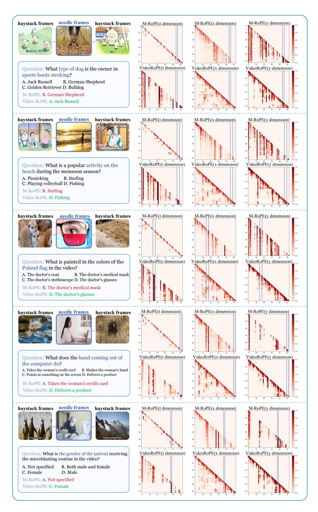

# E. Supplementary Attention Analysis

To further explain the attention pattern in Figure [3,](#page-3-0) we present additional visual analysis in Figure [9.](#page-18-0) An attention analysis comparing M-RoPE and VideoRoPE is conducted using 8k-context input, with video tokens from the same frame aggregated through average pooling. As a result, one tick on the axis represents a single frame during inference. The evaluation setup for Figure [3](#page-3-0) is the same as for Figure [9.](#page-18-0) M-RoPE relies on high-frequency temporal modeling, limiting it to local information and hindering effective needle identification for question answering. On the other hand, VideoRoPE employs low-frequency temporal modeling, allowing it to capture long-range dependencies and successfully identify the needle for accurate responses.

### F. Supplementary Explanation on Frequency Allocation

This section provides a detailed explanation of the supplementary information related to Figure [4,](#page-4-1) highlighting the advantages of our frequency allocation. Consider a RoPE-based LLM with a head dimension size of 128, corresponding to 64 rotary angles θn across different dimensions. In each illustration, we visually represent the function cos(θnt) for 3 dimensions using parallel blue planes.

- (a) For M-RoPE [\(Wang et al.,](#page-11-0) [2024a\)](#page-11-0), temporal dependency is modeled using the first 16 rotary angles, which exhibit higher frequency and greater oscillation. Taking the last 3 rotary angles as an example, the position embedding for temporal modeling undergoes significant distortion due to periodic oscillations [\(Men et al.,](#page-10-9) [2024\)](#page-10-9), as these dimensions have shorter monotonous intervals. Lower dimensions have even shorter intervals. Notably, because the oscillation is periodic, two distant positions can have nearly identical position embeddings, resembling a hash collision, as shown by the red planes. This phenomenon is why distractors can easily mislead the model.
- (b) In contrast, for VideoRoPE, temporal dependency is modeled using the last 16 rotary angles, which have much wider monotonous intervals. Taking the first 3 rotary angles as an example, the position embedding for temporal modeling is free ferom oscillation [\(Men et al.,](#page-10-9) [2024\)](#page-10-9). As a result, the misleading effects of distractors are significantly suppressed.

#### V-NIAH-D Needles and Distractors

Question: Find theframe with theword 'zoo'. What is the animal outside the zoo shop?

A. lion

B. tiger C. horse

D. dog

Answer with the option's letter from the given choices directly.

Answer: B

Question: Find theframe of a couple in a wedding...What is the color of that ballon?

A. Yellow

B. Red

C. Blue

D. White

Answer with the option's letter from the given choices directly.

Answer: A

Question: Find theframe with theimage of Selenium tablets. How many mg does each tablet contain? Answer the question using a single word or phrase.

Answer: 200

Question: Find theframe of a scientist. The scientist is a...

A. Bird

B. Elephant

C. Panda

D. Dog

Answer with the option's letter from the given choices directly.

Answer: C

Question: Find theframe of a teddy bear. Where is this teddy bear?

A. Times Square

B. Eiffel Tower

C. Taj Mahal

D. Sydney Opera House

Answer with the option's letter from the given choices directly.

Answer: A

Figure 8. Five visual question-answering problems along with their corresponding needle and distractor.

Figure 9. Additional visual analysis of attention.