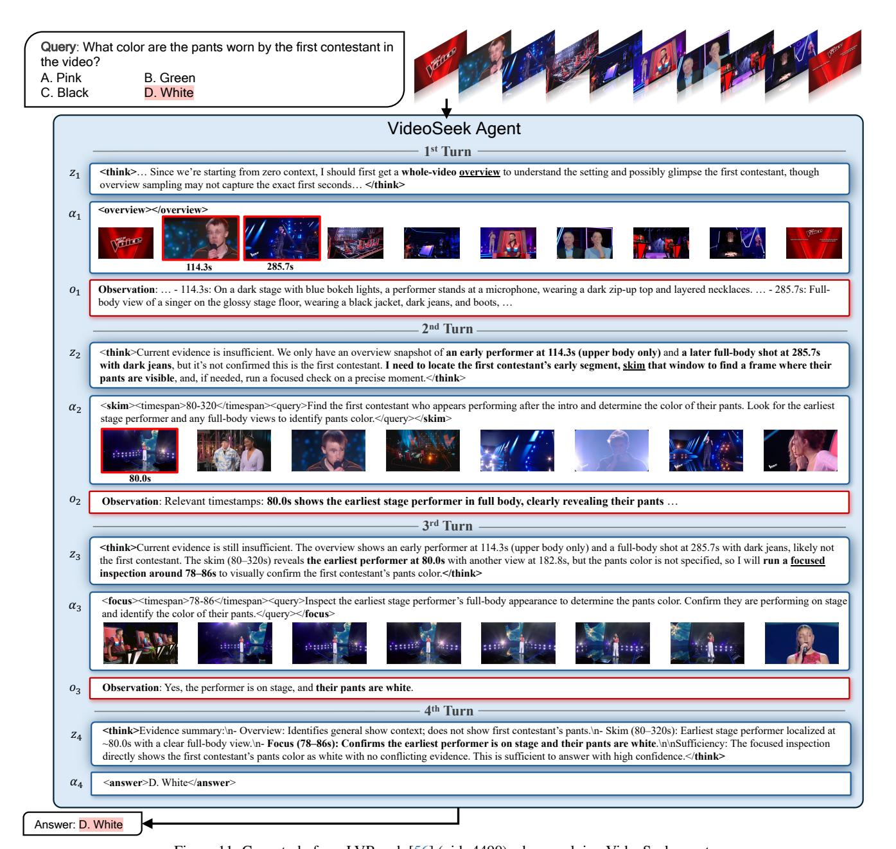

# **System Instruction (2/2)**

#### **## `focus`: dense inspection of a short clip (<=** {FOCUS\_NUM\_FRAMES}**s, 1 FPS)**

- When: To verify fine visual details to the given query.
- How:
- 1. Determine the start and end time of the interested video clip.
- 2. Provide a concise query to this video clip.
- Constraints:
- The selected video clip must be less than {FOCUS\_NUM\_FRAMES} seconds.

### **## `answer`: finish the trajectory and generate the final answer**

- When: The collected evidence is sufficient to answer the question.
- How: Generate the final answer.

#### **# Operational Rules**

#### **## Evidence & Sufficiency & Uncertainty**

- Before answering, list supporting evidence + timestamps for each sub-question/option.
- If evidence is insufficient, collect more; otherwise state "insufficient evidence".
- Never guess or treat uncertain observations as evidence.

### **## Thinking Policy**

- Step-by-step reasoning: summarize timestamped evidence → assess sufficiency → if insufficient, identify gaps and plan tool calls; do not invent observations.
- Prefer internal video logic (temporal order/causality) over visual-only cues; use it to target relevant segments when frames are uninformative.
- **\*\*Do not provide the answer during the thinking process.\*\***

#### **## Tool Calling Policy**

- Call \*\*ONLY ONE\*\* tool per turn. Please select the most appropriate tool based on the current state.
- `overview`: be careful to use it; only call it when starting from zero context / answering global questions.
- Example for calling `overview` tool: There is no prior information available or for global questions (theme/structure), so the `overview` tool is called to get the whole-video summary.
- `skim`: use to quickly narrow long time ranges (the gap between the start time and end time must be no less than {SKIM\_NUM\_FRAMES} seconds); treat results as tentative and follow up with `focus` for verification.
- Example for calling `skim` tool: I am going to call the `skim` tool to verify a query "Does the person in the video wear a hat?" from the video segment (2400s - 2468s) by sampling {SKIM\_NUM\_FRAMES} frames from the video segment.
- `focus`: use to confirm fine-grained visual details within a short, evidence-based time window (the selected video clip must be less than {FOCUS\_NUM\_FRAMES} seconds).
- Example for calling `focus` tool: I am going to call the `focus` tool to verify a query "What is the color of the person's shirt?" from the video clip (500s - 508s).
- `answer`: use to generate the final answer.
- Example for calling `answer` tool: The current collected evidence is sufficient to answer the question "What is the main topic of the video?", so I call the `answer` tool to finish the trajectory and generate the final answer.

#### **## Final Answer Policy**

- Never call the `answer` tool if you have already called any other tools to gather more evidence.
- If more than one option can be selected, never guess the answer and never select the **\*\*best\*\*** option. Please call more tools to exclude the incorrect options.
- You must provide the final answer when reaching the maximum number of steps.

Figure 8. Prompt for the system instruction I (*part 2*) used in Algorithm 1.

the tribe? A. Boat B. Bike C. Motorcycle D. Car VideoSeek Agent ! ! ! **<think>** To efficiently localize this event **without exhaustively parsing the entire 52-minute video**, the best approach is to **skim the final portion** where the departure is likely to occur … If the skim yields clear visual evidence, it will be sufficient to answer; if ambiguous, we would plan a follow-up <focus> on the exact moment. **Proceeding to skim the last ~6 minutes to capture the departure moment. </think>** Answer: D. Car **1st Turn 2nd Turn 3rd Turn** " " " <**think**>Current evidence: The prior <skim> (2800–3148s) shows **people riding on the back of a vehicle at 3048.6s as they leave the village**, but the vehicle type is unclear, so we cannot reliably choose among boat, bike, motorcycle, or car. **Missing info: precise vehicle identification around 3048.6s**. Plan: use **<focus> on 3044– 3056s to closely inspect the vehicle and determine its type** for a confident answer. </**think**> # # <**skim**><timespan>2800-3148</timespan><query>Find the moment when the reporter departs/leaves the tribe and identify the mode of transportation (boat, bike, motorcycle, or car).</query></**skim**> **Observation**: The frame at **3048.6s shows the reporter and companions traveling away from the settlement on a vehicle**, capturing the moment of leaving and revealing the transport type. The subsequent title card at 3098.3s supports that the departure has occurred and the segment is concluding. <**focus**><timespan>3044-3056</timespan><query>Identify the exact type of vehicle the reporter is on while leaving the tribe (car/pickup vs motorcycle vs bicycle vs boat). Look for body shape (truck bed, four wheels, cabin) and number of wheels.</query></**focus**> **Observation**: Pickup. **<think>**Evidence summary:\n- 3048.6s (skim): Group of people riding on the back of a vehicle leaving the village, indicating the departure moment.\n- 3044–3056s (focus): **Clear identification of the vehicle as a pickup truck**.\n\nSufficiency:\n- The focused inspection confirms the vehicle is a pickup, which falls under option D (Car). No conflicting evidence observed. Therefore, evidence is sufficient to answer with high confidence.**</think> <answer>**D. Car**</answer> 3048.6s 3098.3s .. .. .. .. .. .. .. .. .. .. .. ..**

Query: What kind of transportation does the reporter use to leave

Figure 9. Case study from LVBench [\[56\]](#page-9-0) (uid: 860) when applying VideoSeek agent.

C. "Welcome to Shenzhen and have a good time" in Chinese D. "Happy Chinese New Year to all the people in the city" in Chinese VideoSeek Agent ! ! ! **<think>…** the evidence is insufficient. I will first use the **whole-video overview to identify where the \"B1\" sign and the talking-to-camera scene occur** and to locate the subsequent turn toward the building with the text. From there, I can narrow the time window in subsequent steps. **</think> 1st Turn 2nd Turn 3rd Turn** " " " <**think**>We need to find the segment where they talk to the camera next to a B1 sign, and immediately after, the camera turns to a high-rise building with Chinese text. The overview suggests a likely talking-to-camera moment at **1480.2s near a station exit sign**, so I should **skim around 1465–1510s to verify the presence of a B1 sign** and the subsequent turn to the high-rise and read its text. The current evidence is insufficient without inspecting that segment.</**think**> # # # **<overview></overview> Observation**: … - **1480.2s:** Outdoors at night near a modern mall entrance, two people stand side by side under bright signage and warm architectural lighting. A tall column with geometric wood-like pattern rises behind them; **a sign at left includes Chinese characters and "Park Sta. C."** Shoppers pass in the background … <**skim**><timespan>1465-1510</timespan><query>Find the moment where two people are talking to the camera near a B1 sign, then the camera turns to a high-rise building; read the Chinese text on the building.</query></**skim**> **Observation**: Relevant timestamps: **-1465.0–1497.2s: Two people speak to the camera near the "B1" sign**. **-1503.6s: Camera turns to a red-lit high-rise with visible Chinese text**. -1510.0s: Continued exterior shot of the high-rise/mall area. Explanation: These frames first show the conversation near the B1 sign, then the camera shift to the tall building where the Chinese text appears. **<think>**The **overview** shows that **at 1480.2s two people are at a mall entrance with signage** ("Park Sta. C"), likely near the B1 sign. The **skim over 1465– 1510s confirms the two people talking beside the "B1" sign (1465–1497s)** and the camera turning at **1503.6s to a red-lit high-rise with Chinese text visible**, … Therefore, … we should **run a focused inspection around 1500–1506s to read the building's text** precisely.**</think>** <**focus**><timespan>1499-1507</timespan><query>Read the Chinese text displayed on the high-rise building after the camera turns from the B1 sign conversation. Determine if it says a New Year greeting or a welcome to Dongguan or Shenzhen.</query></**focus**> **Observation**: A New Year greeting. **4th Turn** \$ \$ **<think>From 1465–1497s, two people talk to the camera beside the "B1" sign**, matching the question setup; **at 1503.6s, the camera turns to a red-lit high-rise with Chinese text**; a **1499–1507s focus shows it is a New Year greeting**, but the exact phrasing (whether "to everyone" or "to all the people in the city") remains unclear. **Evidence is therefore insufficient to distinguish between options (A) and (D)**, so I will use a more **targeted focus on 1502–1510s** to read the precise wording.**</think>** <**focus**><timespan>1502-1510</timespan><query>Read the exact Chinese text displayed on the high-rise building after the camera turns from the B1 sign conversation, distinguishing between "Happy Chinese New Year to everyone" and "Happy Chinese New Year to all the people in the city".</query></**focus**> **1480.2s 1465.0s 1471.4s 1477.8s 1484.2s 1490.7s 1497.2s 1503.6s 1510.0s** \$ **Observation**: "祝全市⼈民新春快乐" (Happy Chinese New Year to all the people in the city). **5th Turn** % % **<think>**Evidence summary:\n- 1465.0–1497.2s: Two people are speaking to the camera beside **the "B1" sign** (skim).\n- 1503.6s: The camera **turns to a high-rise building** illuminated in red with Chinese text (skim).\n- **1502.0–1510.0s: The exact text on the building reads "祝全市⼈民新春快乐," which translates to "Happy Chinese New Year to all the people in the city" (focus)**.\n\nAssessment:\nThis precisely matches option (D). The evidence is sufficient and unambiguous.</**think>** <**answer**>D. "Happy Chinese New Year to all the people in the city" in Chinese</**answer**>

Query: After they finish talking to the camera next to the B1 sign, what is

Answer: D. "Happy Chinese New Year to all the people in the city" in Chinese

written on the high-rise building where the camera turns to? A. "Happy Chinese New Year to everyone" in Chinese B. "Welcome to Dongguan and have a good time" in Chinese

Figure 10. Case study from LVBench [\[56\]](#page-9-0) (uid: 3105) when applying VideoSeek agent.

Figure 11. Case study from LVBench [\[56\]](#page-9-0) (uid: 4490) when applying VideoSeek agent.