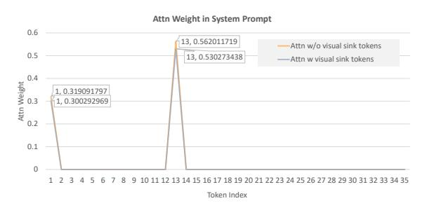
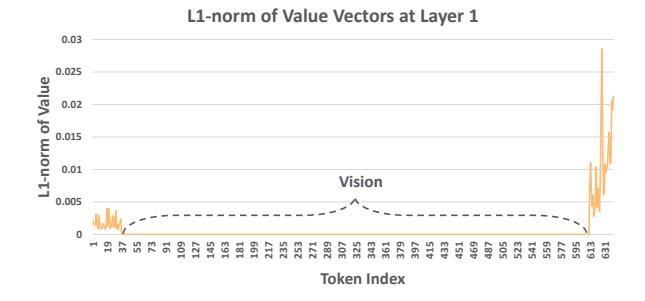
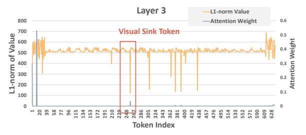

# C Comparison of Cross-Attention Masking Across Different Stages

We also compare the performance on different different benchmarks with cross attention masked in different stages as shown in [Tab. 8.](#page-12-4) The shallow and deep layers exhibit significantly cross-modal information fusion compared with middle layers.

| Model         | Layers | GQA  | MMEP   | VQAT |
|---------------|--------|------|--------|------|
|               | Dense  | 62.0 | 1507.6 | 58.2 |
|               | 1–7    | 61.5 | 1411.2 | 56.8 |
| LLaVA-v1.5 7B | 9–15   | 51.7 | 722.6  | 51.1 |
|               | 27–32  | 61.8 | 1488.5 | 58.1 |

Table 8: Performance on Various Benchmarks with Cross-Attention Masked in Specific Layers.

## D Visualization of visual attention sink phenomenon

In [Fig. 5,](#page-13-0) we visualize the attention distribution on the input image across shallow, middle and deep layers to highlight the visual attention sink phenomenon. Ideally, attention distribution should adapt dynamically based on the input, directing focus to different areas for different tasks. However, our visualizations reveal an intriguing pattern: tokens with high attention scores—highlighted in the image—tend to appear consistently in the same regions across various instructions in both shallow and deep layers. This finding suggests that certain vision tokens act as attention sinks, drawing focus but failing to provide meaningful contributions to the model's reasoning. As a result, these tokens may not be essential for generating accurate responses.

Moreover, in the middle layers, we observe that the model starts to concentrate its attention on the more instruction-relevant areas. This reinforces our conclusion that MLLMs undergo a three-stage information processing approach, where shallow layers focus on task recognition, middle layers se-

lectively fuse instruction-relevant visual information, and deep layers refine and align the response with the instruction.

Another interesting finding is that the first layer exhibits clear attention window, the lower half of vision tokens receive more attention from the last input token.

## E Detailed Analysis on Visual Attention Sink Tokens

#### E.1 Lower L1 Norm of Value Vectors for Sink Tokens

As shown in the lower subplot of [Fig. 7,](#page-14-3) visual sink tokens with high attention weights exhibit significantly lower magnitudes in their value vectors. This suggests that visual sink tokens function similarly to textual sink tokens, acting as bias terms in the softmax computation.

## E.2 Attention Redistribution After Removing Visual Sink Tokens

After identifying the visual sink tokens in an example, we remove these tokens before the first layer. We observe that the attention weight previously allocated to the visual sink tokens is redistributed to the textual sink tokens in the system prompt.

Figure 6: Textual sink tokens in the system prompt absorb the attention weight when visual sink tokens are removed in the third layer.

Sum of attention weight from visual sink tokens: 0.053352. Difference in attention weight of textual sink tokens with and without visual sink tokens: 0.050537109.

## F L1 Norm of Value Vectors

As illustrated in [Fig. 7,](#page-14-3) the value vectors for textual and visual tokens show distinct patterns in the first layer. This likely indicates that the model differentiates between modalities at this stage, highlighting the necessity of modality-specific sinks.

Figure 5: Visualization of attention map and distribution on image with different instruction across shallow, middle and deep layers using  $LLaVA-v1.5\ 7B$ 

Figure 7: Visualization of attention map and distribution on image with different instruction across shallow, middle and deep layers using LLaVA-v1.5 7B

## G Random Selection of Visual Attention Merging Token

To ensure the visual token selection for merging is not index-dependent, we randomly choose a visual token and merge all visual cross-attention into it.

| Visual Token Index | GQA   |
|--------------------|-------|
| vanilla            | 61.95 |
| -                  | 57.41 |
| 1                  | 61.98 |
| 576                | 61.55 |
| 128                | 61.83 |
| 288                | 61.76 |

Table 9: Performance of random visual token merging on GQA.

## H Complete Results on Semantic Projection of the Last Input Token

In this section, we present a more detailed analysis of the semantic projection of the last input token for different user instructions.

#### H.1 USER: How Many Cars Are in the Image?

As shown in [Tab. 11,](#page-15-2) when given the user instruction "*How many cars are there in the image?*", the model accurately identifies it as a number-related task.

#### H.2 USER: What Kind of Apple Is This?

As shown in [Tab. 12,](#page-15-3) when given the user instruction "*What kind of apple is this?*", the model correctly identifies it as a type-related task.

## I Task Recognition: Projection of Value-Output Matrix on Semantic Space

The value-output matrix plays a key role in incontext learning by summarizing task-related information. Building on the approach from [\(Dar et al.,](#page-9-22) [2023\)](#page-9-22), we project this matrix into the semantic space as follows:

$$D = W_u(V_{last} \cdot O) \tag{9}$$

where V is the value vector, O is the output matrix, and Wu is the word unembedding matrix.

#### I.1 USER: Where is the place of origin?

Given the instruction "*Where is the place of origin?*", the model recognizes this as a locationrelated task [Tab. 13.](#page-14-4)

| Layer | Head | Top words in vocabulary space       |
|-------|------|-------------------------------------|
| 14    | 31   | names,Names,NAME,ját,Names          |
| 13    | 31   | location,locations,map,Location,Map |
| 12    | 31   | thy,thee,thou,Gemeins,Tu            |

Table 13: Top 5 tokens from the semantic projection of the value-output matrix of the last input token at different layers.

## I.2 USER: How many apples are there in the image?

Given the instruction "*How many apples are there in the image?*", the model recognizes this as a counting-related task [Tab. 14.](#page-14-5)

| Layer | Head | Top words in vocabulary space       |
|-------|------|-------------------------------------|
| 13    | 31   | two,another,deux,atori,three        |
| 12    | 31   | counting,counts,numbers,count,count |
| 11    | 31   | 你,your,you,vous,yourself            |

Table 14: Top 5 tokens from the semantic projection of the value-output matrix of the last input token at different layers.

## I.3 USER: What is the make of the car on the left?

Given the instruction "*What is the make of the car on the left?*", the model recognizes this as a brandrelated task [Tab. 15.](#page-15-4)

|               |        | Vision      |      |                   | Text      |            | Math |         |
|---------------|--------|-------------|------|-------------------|-----------|------------|------|---------|
| Model         | Layers | Recognition | OCR  | Spatial awareness | Knowledge | Generation | Math | Overall |
|               | Dense  | 36.1        | 23.9 | 26.3              | 17.1      | 22.4       | 11.5 | 31.2    |
|               | 0–7    | 39.5        | 25.2 | 28.8              | 21.4      | 26.9       | 15.4 | 33.8    |
| LLaVA-v1.5 7B | 8–14   | 34.0        | 21.4 | 26.5              | 16.1      | 19.0       | 7.7  | 29.2    |
|               | 25–31  | 35.9        | 22.2 | 23.2              | 18.6      | 22.4       | 11.2 | 31.1    |
|               | 0–31   | 33.1        | 13.5 | 23.5              | 14.2      | 16.6       | 7.7  | 26.1    |

Table 10: Performance Breakdown of LLaVA-v1.5 7B on MM-Vet with Vision Removal from Specific Layers in the KV Cache. "*Layers*" column indicates the layers from which visual information was removed.

| Layers | Top words in vocabulary space                                          |  |
|--------|------------------------------------------------------------------------|--|
| 19     | four, three, five, several, six, many, seven                           |  |
|        | two, Several, dozen                                                    |  |
| 18     | four, three, several, two, five, dozen, lots, many number, multiple |  |
|        |                                                                        |  |
| 17     | four, three, several, two, dozen, five, number                         |  |
|        | mehrere, lots, multiple                                                |  |
| 16     | four, three, number                                                    |  |
|        | two, five, dozen, several                                              |  |
|        | many, mehrere, lots                                                    |  |
| 15     | four, number, three, Ges, dozen, several, lots                         |  |
|        | five, count, multiple                                                  |  |
| 14     | four, number, three, Ges, two, érique, count                           |  |
|        | lots, There, ieri                                                      |  |
| 13     | number, three, count, number, four, érique                             |  |
|        | none, ocker, multip, estaven                                           |  |
| 12     | number, arden, rita, Number, multip, three                             |  |
|        | NUM, licz, number, NUM                                                 |  |
| 11     | number, arden, rita, Number, none, licz                                |  |
|        | number, Sa, three, Ges                                                 |  |
|        |                                                                        |  |
| 10     | number, arden, rita, ubre, nim, konn, eben                             |  |
|        | multip, 兴, two                                                         |  |
| 9      | number, rita, multip, nim, arden, platz, iken                          |  |
|        | zero, un, VS                                                           |  |

Table 11: Top tokens from the projection of the last input token at each layer.

| Layers | Top words in vocabulary space                                                  |
|--------|--------------------------------------------------------------------------------|
| 9      | sterd, publique, typen, Hinweis, penas, ohl, bpe Hero, Sob, ermeister       |
| 8      | sterd, typen, publique, pa´zdzier, 庄, schrift 泉, intrag, penas, Hinweis     |
| 7      | sterd, penas, quelle, typen, 泉, teil, wohl pa´zdzier, 庄, intrag             |
| 6      | sterd, pa´zdzier, strij, sierp, kwiet, penas, sci ´ Wikispecies, wohl, konn |

Table 12: Top tokens from the projection of the last input token at each layer.

| Layer | Head | Top words in vocabulary space       |
|-------|------|-------------------------------------|
| 14    | 31   | different,Wat,isse,iesen,newer      |
| 13    | 31   | brand,companies,company,Brand,brand |
| 12    | 31   | loro,ihnen,your,their,nx            |

Table 15: Top 5 tokens from the semantic projection of the value-output matrix of the last input token at different layers.

## J Analysis of Vision Removal Impact on MM-Vet Performance in KV Cache

To further probe the role of shallow layers, we conducted a vision removal experiment using MM-Vet, a benchmark requiring extended responses where key visual information must be preserved in the KV Cache. Specifically, we examined whether the model relies on vision information from shallow layers during the decoding process. A detailed breakdown of MM-Vet with vision removal on specific layers to determine whether performance degradation or improvement is attributed to vision or text generation. After pruning visual information from the first eight layers, the model performed better than the original configuration, further consolidating that the model does not utilize visual information from shallow layers (see [Tab. 10\)](#page-15-5). Additionally, removing vision tokens in deep layers also have a minimal influence on the performance, indicating that the model focuses on processing textual information to align with instruction.

