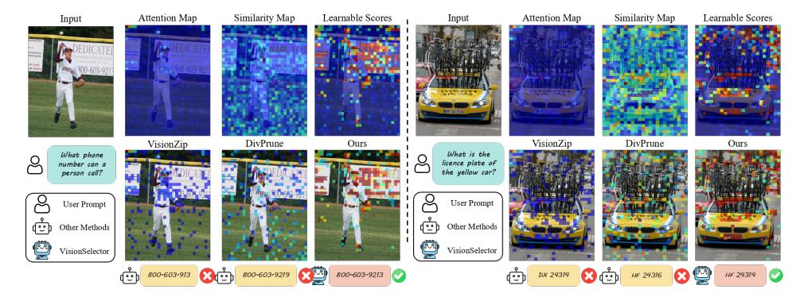

# 4.5 EFFICIENCY ANALYSIS

This section quantifies the computational efficiency advantages of our method. We analyze efficiency on video tasks across three key metrics: max memory usage, prefill time, and end-to-end (E2E) latency.

As detailed in Table [2,](#page-7-1) we analyze this using the MVBench dataset, which has a high average token count of 6,828. VisionSelector's prefill time is only 760.82 ms and its end-to-end latency is 924.57 ms, achieving 1.86× and 1.74× speedups over the baseline model, respectively, and is significantly faster than all comparison methods. Our method matches DivPrune in memory efficiency by lowering peak memory usage to 17.57 GB, a 32.3% reduction from the baseline model. This implies that under the same hardware constraints, our method can process longer visual contexts than competing methods, which is crucial for advancing the application of MLLMs in real-world scenarios like long-video understanding.

Table 1: Comparison results with different methods on Image-Language benchmarks. Note that our method, trained with a fixed 20% retention budget, exhibits adaptability to varying compression budgets during inference. Evaluation is conducted with LMMs-Eval (Zhang et al., 2024a).

| Method                   | DocVQA Anls | ChartQA Relaxed | TextVQA EM | OCRBench Acc     | ScienceQA EM | AI2D EM | MMMU Acc | MME Score | POPE F1 | Avg     |
|--------------------------|----------------|--------------------|---------------|---------------------|-----------------|------------|-------------|--------------|------------|---------|
| Dyn                      | amic Reso      | ution(MinF         | ix=256×2      | 8×28, <i>MaxPix</i> | =2048×28×       | 28),Upp    | er Bound (  | 100%)        |            |         |
| Avg. Visual Tokens       | 1951.61        | 596.06             | 976.58        | 652.82              | 323.05          | 510.19     | 601.15      | 867.67       | 359.55     |         |
| Qwen-2.5-VL-7B           | 94.33          | 83.40              | 82.84         | 838                 | 87.26           | 93.59      | 50.78       | 2342.15      | 86.19      | 100%    |
|                          |                | Reta               | in 30% Tok    | ens (70% Cor        | mpression Re    | atio)      |             |              |            |         |
| E AL EGGERAGO            | 84.01          | 67.64              | 80.22         | 687                 | 83.06           | 86.92      | 49.44       | 2263.58      | 80.47      | 01.616  |
| FastV (ECCV2024)         | 89.06%         | 81.10%             | 96.84%        | 81.98%              | 95.22%          | 92.87%     |             | 96.65%       |            | 91.61%  |
|                          | 73.95          | 62.24              | 73.71         | 648                 | 85.22           | 82.77      | 47.67       | 2239.64      | 83.69      |         |
| PruMerge+ (ICCV2025)     | 78.39%         | 74.63%             | 88.98%        | 77.33%              | 97.66%          | 88.44%     | 93.88%      | 95.62%       | 97.10%     | 88.00%  |
| Ar : 7: (CMPD2025)       | 86.11          | 72.28              | 77.30         | 711                 | 86.61           | 87.86      | 49.44       | 2276.04      | 84.73      | 02.576  |
| VisionZip (CVPR2025)     | 91.29%         | 86.67%             | 93.31%        | 84.84%              | 99.26%          | 93.88%     | 97.36%      | 97.18%       | 98.31%     | 93.57%  |
| DARE (EMBI PAGAS)        | 62.60          | 56.88              | 74.45         | 629                 | 84.33           | 75.94      | 47.89       | 2218.83      | 83.43      | 04.700  |
| DART (EMNLP2025)         | 66.36%         | 68.20%             | 89.87%        | 75.06%              | 96.64%          | 81.14%     | 94.31%      | 94.73%       | 96.80%     | 84.79%  |
| D:P (CV/DD2025)          | 82.51          | 67.52              | 78.52         | 720                 | 86.01           | 88.28      | 48.33       | 2224.06      | 84.68      | 02 270  |
| DivPrune (CVPR2025)      | 87.47%         | 80.96%             | 94.79%        | 85.92%              | 98.57%          | 94.33%     | 95.18%      | 94.96%       | 98.25%     | 92.27%  |
| ¥7:-:                    | 92.89          | 72.96              | 81.45         | 809                 | 85.77           | 92.00      | 50.11       | 2343.77      | 85.05      | 97.20%  |
| VisionSelector           | 98.47%         | 87.48%             | 98.32%        | 96.54%              | 98.29%          | 98.30%     | 98.68%      | 100.07%      | 98.68%     | 97.20%  |
|                          |                | Reta               | in 20% Tok    | ens (80% Cor        | npression Re    | itio)      |             |              |            |         |
| FastV (ECCV2024)         | 75.99          | 60.48              | 78.01         | 597                 | 82.75           | 82.35      | 49.00       | 2152.74      | 76.12      | 86.45%  |
|                          | 80.56%         | 72.52%             | 94.17%        | 71.24%              | 94.83%          | 87.99%     | 96.49%      | 91.91%       | 88.32%     | 86.45%  |
| PruMerge+ (ICCV2025)     | 61.09          | 52.56              | 68.72         | 562                 | 83.79           | 77.62      | 46.11       | 2219.3       | 81.74      | 81.91%  |
|                          | 64.76%         | 63.02%             | 82.96%        | 67.06%              | 96.02%          | 82.94%     | 90.80%      | 94.75%       | 94.84%     | 81.91%  |
| V:-:7:- (CVPD2025)       | 74.75          | 62.04              | 72.03         | 591                 | 84.68           | 82.32      | 47.00       | 2168.86      | 83.23      | 06 120  |
| VisionZip (CVPR2025)     | 79.24%         | 74.39%             | 86.95%        | 70.53%              | 97.04%          | 87.96%     | 92.56%      | 92.60%       | 96.57%     | 86.43%  |
| DART (EMNLP2025)         | 50.03          | 47.16              | 67.53         | 537                 | 83.34           | 71.04      | 47.00       | 2138.61      | 80.16      | 78.16%  |
| DARI (EMINLP2023)        | 53.04%         | 56.55%             | 81.52%        | 64.08%              | 95.51%          | 75.91%     | 92.56%      | 91.31%       | 93.00%     | /8.10%  |
| DivPrune (CVPR2025)      | 73.81          | 57.88              | 73.86         | 648                 | 84.33           | 82.29      | 46.33       | 2198.82      | 83.55      | 86.75%  |
| Divirule (CVFK2023)      | 78.25%         | 69.40%             | 89.16%        | 77.33%              | 96.64%          | 87.93%     |             | 93.88%       | 96.94%     | 80.75%  |
| VisionSelector           | 89.91          | 68.84              | 80.05         | 770                 | 85.67           | 90.15      | 49.22       | 2293.54      | 84.27      | 94.83%  |
| visionselector           | 95.31%         | 82.54%             | 96.63%        | 91.89%              | 98.18%          | 96.32%     | 96.93%      | 97.92%       | 97.77%     | 94.83%  |
|                          |                | Reta               | in 10% Tok    | ens (90% Cor        | npression Re    | itio)      |             |              |            |         |
| FastV (ECCV2024)         | 58.64          | 44.64              | 70.83         | 440                 | 81.95           | 75.74      | 45.78       | 1940.91      | 65.99      | 75.35%  |
| Fast v (ECC v 2024)      | 62.16%         | 53.53%             | 85.50%        | 52.51%              | 93.91%          | 80.93%     | 90.15%      | 82.87%       | 76.56%     | 13.33%  |
| PruMerge+ (ICCV2025)     | 42.08          | 41.56              | 56.87         | 417                 | 81.56           | 71.08      | 45.22       | 1948.58      | 76.52      | 71.48%  |
| Fluivierge+ (ICC v 2023) | 44.61%         | 49.83%             | 68.65%        | 49.76%              | 93.47%          | 75.95%     | 89.05%      | 83.20%       | 88.78%     | /1.46%  |
| V:-:7:- (CVPD2025)       | 48.29          | 42.84              | 55.94         | 404                 | 82.60           | 73.09      | 45.44       | 1944.04      | 78.46      | 72.73%  |
| VisionZip (CVPR2025)     | 51.19%         | 51.37%             | 67.53%        | 48.21%              | 94.66%          | 78.10%     | 89.48%      | 83.00%       | 91.03%     | 12.13%  |
| DART (EMNLP2025)         | 33.13          | 34.00              | 53.97         | 415                 | 81.85           | 67.10      | 46.44       | 1980.7       | 71.91      | 68.39%  |
| DAKI (EMINLE 2023)       | 35.12%         | 40.77%             | 65.15%        | 49.52%              | 93.80%          | 71.70%     | 91.45%      | 84.57%       | 83.43%     | 00.39%  |
| DivPrune (CVPR2025)      | 54.04          | 39.80              | 64.65         | 477                 | 82.15           | 72.80      | 46.00       | 2015.66      | 79.27      | 75.61%  |
| DIVITUIE (CVFK2023)      | 57.29%         | 47.72%             | 78.04%        | 56.92%              | 94.14%          | 77.79%     | 90.59%      | 86.06%       | 91.97%     | 15.01%  |
| VisionSelector           | 77.25          | 62.28              | 75.37         | 646                 | 83.54           | 84.72      | 47.44       | 2175.75      | 79.73      | 87.75%  |
| VISIONSCIECTOL           | 81.89%         | 74.68%             | 90.98%        | 77.09%              | 95.74%          | 90.52%     | 93.42%      | 92.90%       | 92.50%     | 01.15 % |

Table 2: Performance and efficiency comparisons. Task performance is evaluated across various video-language benchmarks, while efficiency metrics are benchmarked on MVBench.

| Method              | MVBench Acc | SEEDBench Acc | VideoMME Score | NextQA WUPS | Performance (%) | Max GPU mem (GB) | Prefill Time (ms) (ms) | E2E Latency (ms) |
|---------------------|----------------|------------------|-------------------|----------------|--------------------|---------------------|---------------------------|---------------------|
| Qwen2.5-VL-7B       | 68.10          | 60.48            | 60.67             | 27.58          | 100%               | 25.97               | 1413.34                   | 1605.31             |
| FastV (ECCV2024)    | 65.75          | oom              | 59.15             | 27.00          | 97.31%             | 24.63               | 851.76                    | 1021.83             |
| DART (EMNLP2025)    | 65.80          | 61.00            | 57.74             | 26.84          | 97.49%             | 18.93               | 832.58                    | 996.55              |
| Divprune (CVPR2025) | 65.85          | 59.79            | 57.78             | 27.00          | 97.17%             | 17.55               | 1184.00                   | 1345.24             |
| Ours                | 66.55          | 59.82            | 59.22             | 27.10          | 98.13%             | 17.57               | 760.82                    | 924.57              |

#### 4.6 ABLATION STUDY

We conduct a series of comprehensive ablation studies to validate the effectiveness of VisionSelector's key components and to determine the optimal hyperparameter settings. All experiments are performed on the Qwen2.5-VL-7B model, and we evaluate the results across several benchmarks spanning multiple dimensions: document understanding (DocVQA, OCRBench), scientific reasoning (ScienceQA, MMMU), and hallucination evaluation (MME, POPE). The detailed configurations and results are presented in Table 3.

Impact on training data composition. As detailed in configurations 1, 2, and 3, we progressively enrich the training data. The results reveal a clear trend: a more diverse training set leads to significant performance gains. Notably, with the inclusion of the general-purpose COCO dataset (Config 3 vs. Config 2), the model's performance on OCR-related tasks improves substantially: the ANLS score on DocVQA increases from 87.59 to 89.34, and the OCRBench score jumps from 701 to 763. This indicates that exposure to diverse natural images enhances the model's general visual representation capabilities, which in turn benefits its performance on domain-specific tasks. Furthermore,

Table 3: Ablation study on the impact of training data composition and curriculum annealing strategy  $(\lambda_t)$  on model performance.

|                |          | Dataset |         |              |           | LearningRate |      |       | OCRBench | MMMU  | MME     | POPE  |        |
|----------------|----------|---------|---------|--------------|-----------|--------------|------|-------|----------|-------|---------|-------|--------|
| Config         | OCRVQA   | ChartQA | 10%COCO | $\lambda_t$  | BatchSize |              | Dim  | Anls  | Acc      | Acc   | Score   | F1    | Avg    |
| 1              | <b> </b> |         |         | 0.1~3        | 8         | 1e-4         | 1024 | 86.85 | 700      | 48.78 | 2238.43 | 81.58 | 92.38% |
| 2              | ✓        | ✓       |         | $0.1 \sim 3$ | 8         | 1e-4         | 1024 | 87.59 | 701      | 48.78 | 2270.09 | 81.84 | 92.89% |
| 3              | ✓        | ✓       | ✓       | $0.1 \sim 3$ | 8         | 1e-4         | 1024 | 89.34 | 763      | 48.89 | 2282.37 | 83.93 | 95.37% |
| 4              | <b>√</b> | ✓       | ✓       | 3            | 8         | 1e-4         | 1024 | 83.69 | 613      | 47.22 | 2172.38 | 83.70 | 88.94% |
| 5              | ✓        | ✓       | ✓       | $0.1 \sim 2$ | 8         | 1e-4         | 1024 | 89.54 | 779      | 49.00 | 2272.71 | 83.90 | 95.75% |
| VisionSelector | ✓        | ✓       | ✓       | $0.1\sim2$   | 16        | 5e-5         | 1792 | 89.91 | 770      | 49.22 | 2293.54 | 84.27 | 95.96% |

the increase in the F1-score on the POPE dataset suggests that diverse training data also helps to suppress model hallucinations.

Impact of the Curriculum Annealing Strategy for  $\lambda_t$ . To validate CAS's importance, we compare it against a constant weighting strategy. The resulting performance difference is stark: the model's average score drops sharply from 95.37% (Config 3) to 88.94% (Config 4). This finding strongly confirms our hypothesis that an excessively high initial constraint loss forces the model to prematurely focus on polarizing token scores rather than on learning the downstream task itself. In contrast, the annealing strategy allows the model to first grasp task-relevant features and then gradually strengthen the binarization constraint on the selection mask, resulting in a more stable and effective optimization process. We also find that a slightly gentler annealing range (from 0.1 to 2, Config 5) yields a minor performance improvement, boosting the average score to 95.96%.

#### 4.7 VISUALIZATION OF TOKEN SELECTION RESULTS

As illustrated in Figure 3, heuristic-based pruning methods exhibit clear limitations. VisionZip is prone to issues like attention sink and dispersion, which obscure salient tokens. DivPrune tends to drop semantically rich tokens, such as the logo. Both methods incorrectly preserve low-information background tokens, highlighting their dependence on model-specific feature distributions. In contrast, VisionSelector pinpoints and retains the critical tokens containing the phone number to answer correctly, demonstrating the superiority of its learned selection mechanism.

Figure 3: Qualitative results of VisionSelector on TextVQA. The top row compares three methods for scoring token importance, where **warmer colors (red) correspond to higher importance scores**. The bottom row illustrates the tokens selected by each method and the corresponding model predictions at a 20% compression budget.

