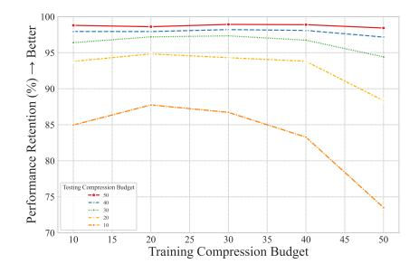

# A.1 COMPARISON WITH DYNAMIC-LLAVA ON QWEN2.5-VL-7B

To ensure a fair comparison and validate the effectiveness of our approach, we re-implemented the trainable image predictor module from Dynamic-LLaVA (Huang et al.) (referred to as Dynamic) on Qwen2.5-VL-7B. During training, only the parameters of the image predictor are updated, while all other components remain frozen. The training configuration strictly follows the settings described in the original paper: the temperature of the Gumbel Softmax is annealed from  $\tau_{start}=1.0$  to  $\tau_{end}=0.1$ , the learning rate of the image predictor is set to 2e-4, and the batch size is 8. The model is trained for 1 epoch on the same datasets used by our method, including OCRVQA, TextVQA, and 10% randomly sampled COCO images.

The results are summarized in Table 1 and Table 4. Compared with training-free methods, Dynamic demonstrates strong capability on text-oriented benchmarks (e.g., DocVQA, ChartQA, TextVQA, and OCRBench), though its generalization to broader visual reasoning datasets such as MMMU and POPE is somewhat reduced. In contrast, VisionSelector consistently surpasses Dynamic across all benchmarks and also outperforms training-free methods in most cases. Remarkably, it maintains strong robustness and generalization even under severe compression (retaining only 20% or 10% of tokens), demonstrating its superior capability in adaptive visual token selection.

Table 4: Comparison results of our method and Dynamic on image-language understanding datasets under Qwen2.5-VL-7B.

| Method                                    | DocVQA ChartQA Anls Relaxed                                            |        | TextVQA OCRBench S EM Acc |             | ScienceQA EM | -      |        | MME Score | POPE F1 | Avg     |  |  |  |
|-------------------------------------------|---------------------------------------------------------------------------|--------|------------------------------|-------------|-----------------|--------|--------|--------------|------------|---------|--|--|--|
| Dyi                                       | Dynamic Resolution(MinPix=256×28×28,MaxPix=2048×28×28),Upper Bound (100%) |        |                              |             |                 |        |        |              |            |         |  |  |  |
| Avg. Visual Tokens                        | 1951.61                                                                   | 596.06 | 976.58                       | 652.82      | 323.05          | 510.19 | 601.15 | 867.67       | 359.55     |         |  |  |  |
| Qwen2.5-VL-7B                             | 94.33                                                                     | 83.40  | 82.84                        | 838         | 87.26           | 93.59  | 50.78  | 2342.15      | 86.19      | 100%    |  |  |  |
| Retain 30% Tokens (70% Compression Ratio) |                                                                           |        |                              |             |                 |        |        |              |            |         |  |  |  |
| Dynamic (ICLR2025)                        | 86.32                                                                     | 68.88  | 73.56                        | 750         | 78.78           | 83.29  | 41.78  | 2180.42      | 80.87      | 88.99%  |  |  |  |
|                                           | 91.51%                                                                    | 82.59% | 88.80%                       | 89.50%      | 90.28%          | 88.99% | 82.28% | 93.09%       | 93.83%     | 88.99%  |  |  |  |
| VisionSelector                            | 92.89                                                                     | 72.96  | 81.45                        | 809         | 85.77           | 92.00  | 50.11  | 2343.77      | 85.05      | 97.20%  |  |  |  |
|                                           | 98.47%                                                                    | 87.48% | 98.32%                       | 96.54%      | 98.29%          | 98.30% | 98.68% | 100.07%      | 98.68%     | 91.20%  |  |  |  |
| Retain 20% Tokens (80% Compression Ratio) |                                                                           |        |                              |             |                 |        |        |              |            |         |  |  |  |
| Dynamic (ICLR2025)                        | 79.21                                                                     | 65.92  | 71.73                        | 674         | 77.00           | 81.87  | 42.56  | 2117.37      | 77.22      | 85.51%  |  |  |  |
| Dynamic (ICLK2023)                        | 83.97%                                                                    | 79.04% | 86.59%                       | 80.43%      | 88.24%          | 87.48% | 83.81% | 90.40%       | 89.59%     | 03.3170 |  |  |  |
| VisionSelector                            | 89.91                                                                     | 68.84  | 80.05                        | 770         | 85.67           | 90.15  | 49.22  | 2293.54      | 84.27      | 94.83%  |  |  |  |
| VISIONSEIECTOF                            | 95.31%                                                                    | 82.54% | 96.63%                       | 91.89%      | 98.18%          | 96.32% | 96.93% | 97.92%       | 97.77%     | 94.05%  |  |  |  |
|                                           |                                                                           | Ret    | ain 10% To                   | kens (90% C | ompression F    | (atio  |        |              |            |         |  |  |  |
| Dynamic (ICLR2025)                        | 61.17                                                                     | 59.96  | 68.25                        | 557         | 75.71           | 76.10  | 43.11  | 1977.58      | 70.80      | 78.35%  |  |  |  |
| Dynamic (ICLR2023)                        | 64.85%                                                                    | 71.89% | 82.39%                       | 66.47%      | 86.76%          | 81.31% | 84.90% | 84.43%       | 82.14%     | 18.33%  |  |  |  |
| VisionSelector                            | 77.25                                                                     | 62.28  | 75.37                        | 646         | 83.54           | 84.72  | 47.44  | 2175.75      | 79.73      | 87.75%  |  |  |  |
| visionSelector                            | 81.89%                                                                    | 74.68% | 90.98%                       | 77.09%      | 95.74%          | 90.52% | 93.42% | 92.90%       | 92.50%     | 01.15%  |  |  |  |

#### A.2 DETAILS ABOUT COMPARISON METHOD

We select five representative visual token compression methods for comparison, covering several mainstream technical approaches. FastV (Chen et al., 2024a) is an attention-based pruning method that operates after the second layer of the MLLM. It selects visual tokens based on the attention scores they receive from text tokens. PruMerge+ (Shang et al., 2024) also leverages attention mechanisms but at the visual encoder stage. It identifies key tokens via attention sparsity and then merges the remaining tokens using K-Nearest Neighbors (KNN) clustering. VisionZip (Yang et al., 2025b) is a text-agnostic compression method. It selects "dominant tokens" based on the attention map from the final visual encoder layer and merges the remaining "contextual tokens" according to semantic similarity. DART (Wen et al., 2025) identifies groups of near-duplicate tokens by computing the cosine similarity between all visual tokens. It then retains only one representative token from each group, achieving efficient compression while preserving key information. DivPrune (Alvar et al., 2025) models the token pruning task as a Max-Min Diversity Problem, aiming to maximize the informational diversity of the preserved subset of tokens.

#### A.3 ADDITIONAL EXPERIMENTS ON ABLATION STUDY

To investigate the impact of hyperparameters (batch size, learning rate) and the score projector dimension d, we provide a detailed ablation study in Table 5.

Impact of Hyperparameters. As we increase the batch size from 8 (Config 5) to 16 (Config 6), we observe a modest but consistent performance improvement. However, a further increase to 32 (Config 7) leads to a slight performance decline. This indicates that a batch size of 16 is optimal for our setup, likely due to more stable gradient estimation. Subsequently, we adjust the learning rate. Lowering the learning rate from 1e-4 to 5e-5 (Config 8 vs. Config 9) yields further performance gains, especially on complex reasoning benchmarks such as ScienceQA and MMMU. This suggests that a smaller learning rate facilitates better model convergence for our complex, joint optimization objective.

Impact of Scorer Projection Dimension d. We increase d from 1024 (Config 7) to 1792 (Config 8), which corresponds to half of the model's hidden dimension. This adjustment leads the model to achieve its best performance across all configurations, reaching a peak average score of 96.33%. The performance gain is particularly pronounced on the POPE benchmark, where the F1-score peaks at 84.27. This indicates that a larger-capacity scorer can more finely model complex inter-token relationships, leading to more accurate identification of critical visual information and more effective suppression of object-level hallucinations.

Table 5: Ablation study on the impact of training data composition, curriculum annealing strategy ( $\lambda_t$ ), and hyperparameters on model performance, implemented on the Qwen2.5-VL-7B model.

|                    | Dataset |         |         |              |           |              |      | DocVQA | OCRBench | ScienceQA | MMMU  | MME     | POPE  | l      |
|--------------------|---------|---------|---------|--------------|-----------|--------------|------|--------|----------|-----------|-------|---------|-------|--------|
| Config             | OCRVQA  | ChartQA | 10%COCO | $\lambda_t$  | BatchSize | LearningRate | Dim  | Anls   | Acc      | EM        | Acc   | Score   | F1    | Avg    |
| 1                  | ✓       |         |         | 0.1~3        | 8         | 1e-4         | 1024 | 86.85  | 700      | 85.47     | 48.78 | 2238.43 | 81.58 | 93.31% |
| 2                  | ✓       | ✓       |         | $0.1 \sim 3$ | 8         | 1e-4         | 1024 | 87.59  | 701      | 84.78     | 48.78 | 2270.09 | 81.84 | 93.60% |
| 3                  | ✓       | ✓       | ✓       | $0.1 \sim 3$ | 8         | 1e-4         | 1024 | 89.34  | 763      | 85.52     | 48.89 | 2282.37 | 83.93 | 95.81% |
| 4                  | ✓       | ✓       | ✓       | 3            | 8         | 1e-4         | 1024 | 83.69  | 613      | 84.48     | 47.22 | 2172.38 | 83.70 | 90.26% |
| 5                  | ✓       | ✓       | ✓       | $0.1 \sim 2$ | 8         | 1e-4         | 1024 | 89.54  | 779      | 84.68     | 49.00 | 2272.71 | 83.90 | 95.97% |
| 6                  | ✓       | ✓       | ✓       | $0.1 \sim 2$ | 16        | 1e-4         | 1024 | 89.98  | 772      | 84.88     | 49.22 | 2279.07 | 83.94 | 96.07% |
| 7                  | ✓       | ✓       | ✓       | $0.1 \sim 2$ | 32        | 1e-4         | 1024 | 88.51  | 730      | 85.13     | 48.56 | 2247.40 | 82.89 | 94.38% |
| 8                  | ✓       | ✓       | ✓       | $0.1 \sim 2$ | 16        | 5e-5         | 1024 | 89.95  | 756      | 85.57     | 49.67 | 2303.66 | 83.56 | 96.13% |
| 9 (VisionSelector) | ✓       | ✓       | ✓       | $0.1\sim2$   | 16        | 5e-5         | 1792 | 89.91  | 770      | 85.57     | 49.22 | 2293.54 | 84.27 | 96.33% |

#### A.4 ANALYSIS OF MODEL PERFORMANCE UNDER DIFFERENT COMPRESSION BUDGETS

We analyze model performance under different compression budgets. Figure 4 plots the average performance retention rate across the nine image understanding datasets detailed in Table 1, comparing models trained and evaluated under different compression budgets. The analysis reveals three key findings: First, a model performs robustly when the testing compression budget is equal to or higher than its training budget. This shows that our method has learned the most critical tokens under different training compression budgets. Second, performance degrades significantly when a model is tested at a compression rate stricter than its training condition. This implies that a loose training compression rate weakens the model's ability to discriminate among critical visual tokens. Third, training with a moderate compression rate (e.g., 20%) enhances overall robustness. The model trained at a 20% budget maintains high performance across most tested budgets. Its consistently strong performance across all budgets makes it more versatile for practical deployments where testing constraints may vary.

Although its performance fluctuates with the training budget, our method's overall effectiveness surpasses most heuristic-based approaches, highlighting the superiority of a learnable compression strategy over rule-based ones.

#### A.5 ADDITIONAL EXPERIMENTS ON QWEN2.5-VL-3B

Implementation Details We utilize the Qwen2.5-VL-3B (Bai et al., 2025) model as its foundation. We perform all training and inference on a platform consisting of 8 NVIDIA A800 (80G) GPUs. The consolidated training data includes the OCRVQA, ChartQA, and a randomly sampled 10% subset of the COCO dataset, creating a total of 144K training examples. Regarding hyperparameters, the hidden layer dimension of Qwen2.5-VL-3B is 2048, so we define our parameter d as 1024. The

Figure 4: The impact of training and testing compression budgets on performance retention. The plot illustrates the model's performance robustness when trained under one compression budget (x-axis) and evaluated under another (each colored line). A key observation is that models generalize well to less strict compression budgets but suffer a significant performance degradation when subjected to stricter compression than they were trained on.

learning rate is set to 5e-5 with a batchsize of 8. We also define  $\lambda_{start}=0.1, \lambda_{end}=2$ , and b=20%. The total number of trainable parameters in our experiment is 4.00M.

**Quantitative Results.** Table 6 presents the quantitative results of our experiments on Qwen2.5-VL-3B. Our proposed method demonstrates superior performance over state-of-the-art approaches across the majority of datasets and achieves a competitive result on the ScienceQA.

Table 6: Comparison results of our method and different baselines on image-language understanding datasets under Qwen2.5-VL-3B.

| Method                 | DocVQA Anls      | ChartQA Relaxed  | TextVQA EM          | OCRBench Acc      | ScienceQA EM     | AI2D EM          | MMMU Acc     | MME Score      | POPE F1          | Avg    |
|------------------------|---------------------|---------------------|------------------------|----------------------|---------------------|---------------------|-----------------|-------------------|---------------------|--------|
| Dyn                    | amic Reso           | lution(Min1         | Pix=256×2              | 8×28,MaxPix          | =2048×28×           | 28),Upp             | er Bound (      | (100%)            |                     |        |
| Avg. Visual Tokens     | 1951.61             | 596.06              | 976.58                 | 652.82               | 323.05              | 510.19              | 601.15          | 867.67            | 359.55              |        |
| Qwen2.5-VL-3B          | 92.76               | 83.40               | 77.87                  | 788                  | 80.37               | 90.84               | 46.78           | 2168.46           | 86.94               | 100%   |
|                        |                     | Reta                | in 30% Tok             | ens (70% Co          | mpression Re        | atio)               |                 |                   |                     |        |
| E AL (EGGLIANAL)       | 81.66               | 70.04               | 74.02                  | 629                  | 78.63               | 86.40               | 46.00           | 2048.53           | 82.94               | 02.020 |
| FastV (ECCV2024)       | 88.03%              | 83.98%              | 95.06%                 | 79.82%               | 97.96%              | 95.11%              | 98.33%          | 94.47%            | 95.40%              | 92.02% |
| n 14                   | 65.43               | 63.88               | 64.29                  | 553                  | 78.93               | 79.24               | 46.00           | 2051.01           | 84.78               |        |
| PruMerge+ (ICCV2025)   | 70.54%              | 76.59%              | 82.56%                 | 70.18%               | 98.33%              | 87.23%              |                 | 94.58%            | 97.52%              | 86.21% |
|                        | 81.38               | 75.40               | 67.71                  | 635                  | 79.47               | 84.88               | 45.44           | 2065.69           | 86.00               |        |
| VisionZip (CVPR2025)   | 87.73%              | 90.41%              | 86.95%                 | 80.58%               | 99.00%              | 93,44%              | 97.14%          | 95.26%            | 98.92%              | 92.16% |
|                        | 65.96               | 64.80               | 63.64                  | 541                  | 79.72               | 72.28               | 45.44           | 1996.75           | 84.85               |        |
| DART (EMNLP2025)       | 71.11%              | 77.70%              | 81.73%                 | 68.65%               | 99.31%              | 79.57%              |                 | 92.08%            | 97.60%              | 84.99% |
|                        | 73.99               | 66.48               | 70.34                  | 631                  | 78.18               | 83.42               | 45.44           | 2010.72           | 86.38               |        |
| DivPrune (CVPR2025)    | 79.76%              | 79.71%              | 90.33%                 | 80.08%               | 97.40%              | 91.83%              |                 | 92.73%            | 99.36%              | 89.81% |
|                        | 88.87               | 75.60               | 76.28                  | 752                  | 80.22               | 88.63               | 46.11           | 2095.06           | 85.95               |        |
| VisionSelector         | 95.81%              | 90.65%              | 97.96%                 | 95.43%               | 99.94%              |                     | 98.57%          | 96.62%            | 98.86%              | 96.28% |
|                        |                     | Rata                | in 20% Tol             | ens (80% Co          | mpraccion P         | atio)               |                 |                   |                     |        |
|                        | 72.90               | 62.00               | 71.41                  | 560                  | 78.88               | 83.29               | 45.11           | 1992.58           | 80.01               |        |
| FastV (ECCV2024)       | 78.59%              | 74.34%              | 91.70%                 | 71.07%               | 98.27%              | 91.69%              |                 | 91.89%            | 92.03%              | 87.33% |
|                        | 52.58               | 54.76               | 58.44                  | 484                  | 79.97               | 74.06               | 44.89           | 1977.90           | 83.23               |        |
| PruMerge+ (ICCV2025)   | 56.68%              | 65.66%              | 75.05%                 | 61.42%               | 99.63%              | 81.53%              |                 | 91.21%            | 95.73%              | 80.32% |
| -                      | 69.62               | 65.76               | 59.97                  | 506                  | 79.97               | 78.79               | 45.67           | 1892.24           | 84.17               |        |
| VisionZip (CVPR2025)   | 75.05%              | 78.85%              | 77.01%                 | 64.21%               | 99.63%              | 86.73%              |                 | 87.26%            | 96.81%              | 84.80% |
| * '                    |                     |                     |                        |                      |                     |                     |                 |                   |                     |        |
| DART (EMNLP2025)       | 51.01               | 54.24               | 56.44                  | 537                  | 80.96               | 69.07               | 45.33           | 1925.04           | 81.93               | 79.72% |
|                        | 54.99%              | 65.04%              | 72.48%                 | 68.15%               | 100.86%             | 76.03%              |                 | 88.77%            |                     |        |
| DivPrune (CVPR2025)    | 63.82               | 57.64               | 66.76                  | 535                  | 80.46               | 77.59               | 45.56           | 1955.53           | 85.47               | 84.79% |
| (                      | 68.80%              | 69.11%              | 85.73%                 | 67.89%               | 100.24%             | 85.41%              |                 | 90.18%            |                     |        |
| VisionSelector         | 84.32               | 73.48               | 74.97                  | 705                  | 79.82               | 86.59               | 46.56           | 2055.00           | 84.87               | 94.60% |
|                        | 90.90%              | 88.11%              | 96.28%                 | 89.47%               | 99.44%              | 95.32%              | 99.53%          | 94.77%            | 97.62%              |        |
|                        |                     |                     | in 10% Tok             | ens (90% Co          | mpression Re        | atio)               |                 |                   |                     |        |
| FastV (ECCV2024)       | 54.62               | 46.96               | 65.58                  | 411                  | 79.33               | 77.07               | 45.11           | 1815.70           | 70.28               | 77.36% |
| rast v (ECC v2024)     | 58.88%              | 56.31%              | 84.22%                 | 52.16%               | 98.83%              | 84.84%              | 96.43%          | 83.73%            | 80.84%              | 11.30% |
| PruMerge+ (ICCV2025)   | 37.51               | 46.68               | 46.43                  | 350                  | 78.93               | 68.43               | 44.56           | 1777.60           | 77.55               | 71.17% |
| PruMerge+ (ICC v 2025) | 40.44%              | 55.97%              | 59.63%                 | 44.42%               | 98.33%              | 75.33%              | 95.25%          | 81.98%            | 89.20%              | /1.1/% |
| AT : CT (CTUDD 2025)   | 41.67               | 46.84               | 43.83                  | 321                  | 79.47               | 69.43               | 45.22           | 1725.49           | 78.60               | 71 120 |
| VisionZip (CVPR2025)   | 44.92%              | 56.16%              | 56.29%                 | 40.74%               | 99.00%              | 76.43%              | 96.67%          | 79.57%            | 90.41%              | 71.13% |
| DADT (EMAIL DOOSE)     | 32.32               | 39.44               | 44.39                  | 315                  | 79.72               | 65.54               | 44.33           | 1733.77           | 75.41               | CO 00~ |
| DART (EMNLP2025)       | 34.84%              | 47.29%              | 57.01%                 | 39.97%               | 99.31%              | 72.15%              | 94.76%          | 79.95%            | 86.74%              | 68.00% |
| ni n                   | 47.13               | 44.36               | 57.80                  | 394                  | 78.19               | 70.14               | 44.67           | 1782.737          |                     |        |
| DivPrune (CVPR2025)    | 50.81%              | 53.19%              | 74.23%                 | 50.00%               | 97.41%              | 77.21%              |                 | 82.21%            | 92.59%              | 74.79% |
|                        |                     |                     |                        |                      |                     |                     |                 |                   |                     |        |
| VisionSelector         |                     |                     |                        |                      |                     |                     |                 |                   |                     | 87.05% |
| VisionSelector         | <b>68.36</b> 73.70% | <b>65.04</b> 77.99% | <b>69.92</b> 89.79% | <b>587</b> 74.49% | <b>80.12</b> 99.81% | <b>81.09</b> 89.27% | 44.67 95.49% | 1928.75 88.95% | <b>81.72</b> 94.00% | 87.059 |

#### A.6 ADDITIONAL EXPERIMENTS ON LLAVA-ONEVISION-1.5-8B

To evaluate the effectiveness of our method across different model architectures, we conduct additional experiments on LLaVA-OneVision-1.5-8B (An et al., 2025). We use a batch size of 16, a learning rate of 5e-5, and set the hyperparameters to  $\lambda_{start}=0.1$  and  $\lambda_{end}=3$ . The projection

dimension d for  $W_q$  and  $W_k$  is set to 2048. The retention budget for visual tokens is set to 20%. For the constraint loss weight,  $\lambda_t$ , we adopt a Curriculum Annealing Strategy, linearly increasing it from an initial value of 0.1 to a final value of 3.0 over the course of training. The training data consist of the OCRVQA and TextVQA datasets, containing approximately 101K samples. The model trains for 1 epoch on 8 NVIDIA A800 (80GB) GPUs, which takes about 2 hours. The number of trainable parameters is 16.87M, accounting for 0.20% of the total parameters.

We evaluate our method on 13 image-language understanding benchmarks, as summarized in Table 7, including the previously discussed datasets as well as MMBench (Liu et al., 2024a), Real-WorldQA (x.ai, 2024), MMStar (Chen et al., 2024b), and VizWiz-VQA (Gurari et al., 2018).

The results show that the performance of FastV on LLaVA-OneVision-1.5-8B is relatively lower compared with its results on Qwen2.5-VL, suggesting that training-free methods are influenced by the internal feature distribution of the underlying model and may exhibit varying behaviors across different architectures. VisionZip encounters CUDA out-of-memory (OOM) issues on high-resolution datasets such as DocVQA and multi-image datasets such as MMMU, which is likely related to the specific layers where its attention operations are applied. This observation indicates that further optimization may be needed to enhance its scalability in real-world deployment. DivPrune achieves competitive results in general scenarios, while its performance on fine-grained semantic understanding tasks (e.g., DocVQA, ChartQA, and OCRBench) is relatively reduced, likely because the diversity preservation process filters out some fine-grained semantic tokens.

Table 7: Comparison results of our method and different baselines on image-language understanding datasets under LLaVA-OneVision-1.5-8B.

| Method                                    | DocVQA Anls      | ChartQA Relaxed  | TextVQA EM          | OCRBench Acc      | ScienceQA EM        | AI2D EM          | MMMU Acc         | MME Score          | POPE Fl | MMB Score        | RealWord EM      | MMStar EM        | VizWiz EM        | Avg      |
|-------------------------------------------|---------------------|---------------------|------------------------|----------------------|------------------------|---------------------|---------------------|-----------------------|------------|---------------------|---------------------|---------------------|---------------------|----------|
|                                           |                     | Dynami              | c Resolutio            | n(MinPix=25          | 6×28×28.M              | laxPix=2            | 2048×28×            | 28),Uppe              | r Bound    | (100%)              |                     |                     |                     |          |
| Avg. Visual Tokens                        | 3795.45             | 595.92              | 978.56                 | 830.65               | 320.4                  | 523.27              | 670.11              | 1154.48               | 359.75     | 278.28              | 1734.37             | 376.6               | 2000.28             |          |
| LLaVA-OneVision-1.5-8B                    | 97.87               | 86.72               | 79.51                  | 830                  | 98.56                  | 94.01               | 56.44               | 2271.32               | 88.46      | 85.31               | 67.97               | 68.18               | 66.02               | 100%     |
| Retain 30% Tokens (70% Compression Ratio) |                     |                     |                        |                      |                        |                     |                     |                       |            |                     |                     |                     |                     |          |
| E AL (EGGLIOCO)                           | 86.51               | 68.64               | 72.27                  | 596                  | 91.22                  | 83.52               | 53.67               | 2019.84               | 70.41      | 79.64               | 54.25               | 53.16               | 64.11               | 06 126   |
| FastV (ECCV2024)                          | 88.39%              | 79.15%              | 90.89%                 | 71.81%               | 92.55%                 | 88.84%              | 95.09%              | 88.93%                | 79.60%     | 93.35%              | 79.81%              | 77.97%              | 97.11%              | 86.42%   |
|                                           | oom                 | 78.04               | 73.25                  | oom                  | 96.23                  | 85.33               | oom                 | oom                   | 87.09      | 83.33               | 66.54               | 60.88               | 64.74               | ,        |
| VisionZip (CVPR2025)                      | /                   | 89.99%              | 92.13%                 | /                    | 97.64%                 | 90.77%              | /                   | /                     | 98.45%     | 97.68%              | 97.90%              | 89.29%              | 98.06%              | /        |
| DivPrune (CVPR2025)                       | 85.23               | 70.64               | 76.03                  | 645                  | 94.65                  | 89.35               | 54.11               | 2104.77               | 88.23      | 82.90               | 64.97               | 61.13               | 64.33               | 92.39%   |
| Divertine (CVPR2023)                      | 87.08%              | 81.46%              | 95.62%                 | 77.71%               | 96.03%                 | 95.04%              | 95.87%              | 92.67%                | 99.74%     | 97.18%              | 95.59%              | 89.66%              | 97.44%              | 92.39%   |
| VisionSelector                            | 95.46               | 79.68               | 78.12                  | 755                  | 97.27                  | 91.77               | 55.00               | 2241.82               |            | 83.42               | 66.41               | 61.80               | 65.02               | 96.35%   |
| visionselector                            | 97.54%              | 91.88%              | 98.25%                 | 90.96%               | 98.69%                 | 97.62%              | 97.45%              | 98.70%                | 96.89%     | 97.78%              | 97.70%              | 90.64%              | 98.49%              | 90.33%   |
| Retain 20% Tokens (80% Compression Ratio) |                     |                     |                        |                      |                        |                     |                     |                       |            |                     |                     |                     |                     |          |
| E+V (ECCV2024)                            | 76.64               | 59.08               | 67.33                  | 489                  | 87.95                  | 78.89               | 51.33               | 1918.66               | 67.08      | 76.29               | 52.15               | 48.12               | 62.92               | 90 500   |
| FastV (ECCV2024)                          | 78.31%              | 68.13%              | 84.68%                 | 58.92%               | 89.23%                 | 83.92%              | 90.95%              | 84.47%                | 75.83%     | 89.43%              | 76.73%              | 70.58%              | 95.30%              | 80.50%   |
| VisionZip (CVPR2025)                      | oom                 | 67.56               | 66.28                  | oom                  | 91.87                  | 79.18               | oom                 | oom                   | 84.81      | 80.07               | 65.75               | 55.83               | 63.37               | ,        |
| VISIONZIP (CVPR2023)                      | /                   | 77.91%              | 83.36%                 | /                    | 93.21%                 | 84.23%              | /                   | /                     | 95.87%     | 93.86%              | 96.73%              | 81.89%              | 95.99%              | ,        |
| DivPrune (CVPR2025)                       | 75.90               | 58.64               | 72.73                  | 556                  | 92.46                  | 84.26               | 52.56               | 2057.83               | 87.17      | 80.67               | 62.75               | 56.61               | 63.49               | 87.34%   |
| Divirune (C VI R2023)                     | 77.55%              | 67.62%              | 91.47%                 | 66.99%               | 93.81%                 | 89.63%              | 93.13%              | 90.60%                |            |                     | 92.32%              | 83.03%              | 96.17%              | 07.5470  |
| VisionSelector                            | 90.51               | 74.72               | 76.02                  | 677                  | 95.79                  | 90.45               | 55.11               | 2182.84               |            | 81.27               | 66.41               | 58.25               | 64.25               | 93,37%   |
| Visionociector                            | 92.48%              | 86.16%              | 95.61%                 | 81.57%               | 97.19%                 | 96.21%              | 97.64%              | 96.10%                | 95.07%     | 95.26%              | 97.70%              | 85.44%              | 97.32%              | 75.51 /6 |
|                                           |                     |                     |                        | Retain 109           | 6 Tokens (90           | % Comp              | ression Re          | atio)                 |            |                     |                     |                     |                     |          |
| FastV (ECCV2024)                          | 54.43               | 38.08               | 56.47                  | 374                  | 81.51                  | 73.15               | 49.56               | 1800.00               | 62.89      | 71.05               | 49.28               | 42.65               | 60.94               | 71.15%   |
| rastv (ECC v 2024)                        | 55.61%              | 43.91%              | 71.02%                 | 45.06%               | 82.70%                 | 77.81%              | 87.81%              | 79.25%                | 71.09%     | 83.28%              | 72.50%              | 62.56%              | 92.31%              | /1.15%   |
| VisionZip (CVPR2025)                      | oom                 | 43.12               | 47.17                  | oom                  | 88.70                  | 71.83               | oom                 | oom                   | 79.25      | 73.28               | 61.04               | 48.11               | 59.84               | ,        |
| VISIOIIZIP (CVFK2023)                     | /                   | 49.72%              | 59.33%                 | /                    | 90.00%                 | 76.41%              | /                   | /                     | 89.59%     |                     | 89.80%              | 70.56%              | 90.64%              | ,        |
| DivPrune (CVPR2025)                       | 56.48               | 38.24               | 65.48                  | 419                  | 88.20                  | 76.85               | 51.33               | 1897.29               | 83.92      | 76.89               | 60.13               | 51.26               | 61.05               | 78.57%   |
| Divirune (CVFK2023)                       | 57.71%              | 44.10%              | 82.35%                 | 50.48%               | 89.49%                 | 81.75%              | 90.95%              | 83.53%                |            |                     | 88.47%              | 75.18%              | 92.47%              | 10.3170  |
| VisionSelector                            | <b>71.92</b> 73.49% | <b>62.12</b> 71.63% | <b>67.40</b> 84.77% | <b>456</b> 54.94% | <b>89.89</b> 91.20% | <b>84.29</b> 89.66% | <b>51.33</b> 90.95% | <b>2002.44</b> 88.16% |            | <b>77.58</b> 90.94% | <b>62.88</b> 92.51% | <b>51.71</b> 75.84% | <b>61.57</b> 93.26% | 83.72%   |

