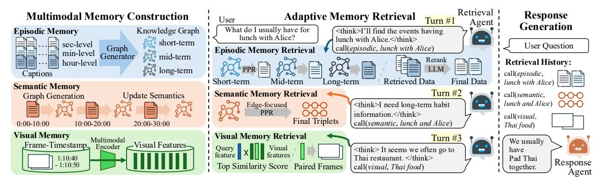

# 2.1. Long Video Understanding

Existing video LLMs demonstrate strong understanding capabilities for short videos, and recent research has shifted toward reasoning over longer videos. Current proprietary models, such as GPT-5 [\[23\]](#page-9-0) and Gemini 2.5 [\[4\]](#page-8-1), have advanced to minute- or hour-level video understanding [\[2,](#page-8-4) [7,](#page-8-2) [19,](#page-9-2) [32,](#page-9-1) [43\]](#page-10-2) by utilizing extended context lengths. However, these models still incur high computational costs and uniformly sampling every frame is often suboptimal for questions focused on localized events [\[25,](#page-9-5) [31\]](#page-9-6).

To address these challenges, several strategies have been explored. Visual token compression [\[5,](#page-8-5) [12,](#page-8-6) [13,](#page-8-7) [18,](#page-9-7) [27,](#page-9-8) [33,](#page-9-9) [45\]](#page-10-3) improves efficiency by reducing token counts but often loses fine-grained details, limiting the capture of subtle or sparse events. Key frame selection [\[29,](#page-9-10) [37\]](#page-10-4) retains only the most informative frames to reduce redundancy but fails to detect relevant frames when video streams are too long and may miss rare events. More recently, reasoningcentric training and inference [\[24,](#page-9-11) [35,](#page-9-12) [36,](#page-10-5) [38,](#page-10-6) [44\]](#page-10-7) have en-

Figure 2. **Overview of WorldMM.** (Left) Multimodal Memory Construction: WorldMM builds three complementary memories (episodic, semantic, and visual memory) that capture temporal events, long-term relations, and visual details from video streams. (Middle) Adaptive Memory Retrieval: A retrieval agent iteratively selects and integrates relevant information from diverse memories for a given query. (Right) Response Generation: The retrieved content and reasoning history are used by a response agent to produce a grounded response.

hanced long-range temporal grounding through reinforcement learning and adaptive test-time scaling, yet still face scalability limits on ultra-long videos over ten hours.

Beyond hour-level videos, emerging benchmarks push video understanding and reasoning toward day- or even week-long continuous recordings [3, 16, 30, 41]. The aforementioned strategies struggle in these settings due to the massive scale of frames and long-term temporal dependencies. This highlights the necessity for more efficient, context-aware, and scalable approaches to handle extremely long videos.

#### 2.2. Memory-based Video LLMs

In order to effectively reason over long videos, retrievalaugmented generation (RAG) based methods that retrieve relevant frames or clips instead of sampled frames have been introduced. They typically retrieve query-relevant information using textual and visual cues, and allow the model to focus on crucial clips [15, 21, 39]. Some recent methods extend this approach by constructing graph structures to encode multimodal interactions across frames [26, 28, 40]. However, these models rely on textual representation or a simple similarity score between visual and query features, limiting their ability to perform holistic understanding and complex reasoning over long video sequences.

Beyond naive retrieval-based design, memory-based methods have emerged to construct structured knowledge over video streams. EgoRAG [41] organizes hierarchical textual memories that store events from egocentric video streams in a hierarchical manner, allowing reasoning throughout day-long activities. Ego-R1 [30] extends this by leveraging vision-centric tools with iterative reasoning to perform long-horizon reasoning. HippoMM [19] proposes a dual-process memory using semantic summaries with multimodal cues. M3-Agent [20] constructs entity-centric long-term memory by processing multimodal contexts and adopts iterative reasoning to retrieve relevant knowledge

from the memory. Despite these advances, existing works still struggle to fully integrate multimodal information and to dynamically retrieve knowledge across varying temporal scales to handle complex, long video scenarios.

#### 3. WorldMM

We introduce WorldMM, a novel framework that leverages both textual and visual contexts of video streams to build a multimodal memory for comprehensive understanding and reasoning over long videos. As illustrated in Fig. 2, the model operates in three stages: multimodal memory construction, adaptive memory retrieval, and response generation. Given a long video stream, WorldMM first builds multiple memories, including two textual memories and one visual memory (Sec. 3.1). Next, a retrieval agent iteratively collects query-relevant information from different memories and timescales until sufficient knowledge is gathered to answer the question (Sec. 3.2). Finally, the query is fed into a response agent along with the retrieved contents and retrieval history to generate a response (Sec. 3.3).

#### 3.1. Multimodal Memory Construction

As we described in Sec. 1, an effective memory agent for long-form video understanding must address two key requirements: 1) adaptively leveraging visual information alongside text memory, and 2) retrieving knowledge across diverse temporal ranges. To achieve this, WorldMM constructs three types of memory, each encoding complementary video knowledge across diverse modalities. Episodic memory captures diverse events over multiple dynamic timescales, semantic memory incrementally updates highlevel relational knowledge, and visual memory preserves spatial and appearance details. Together, they form a comprehensive multimodal memory that supports episodic retrieval, semantic reasoning, and visually grounded understanding of long-form videos.

**Episodic Memory Construction** Episodic memory consists of multiple textual graphs, each of which encodes events at different temporal resolutions. Before constructing the graphs, we first perform fine-grained captioning on the unit temporal scale  $t_0$ . We divide the video into short segments of length  $t_0$ , each converted into a caption using a video LLM. Most existing approaches rely on a fixed temporal scale during memory construction [20, 41], overlooking the diverse spans of real-world events. In contrast, we introduce a multi-scale memory composed of multiple temporal resolutions that flexibly encodes information with different levels of density:

$$\mathcal{T} = \{t_0, t_1, \dots, t_N\}, \quad t_0 < t_1 < \dots < t_N.$$
 (1)

For each temporal scale  $t_i \in \mathcal{T}$ , the video is partitioned into non-overlapping segments of length  $t_i$ . The segments are captioned and transformed into factual triplets (entity-action-entity) to construct a knowledge graph (KG)  $G_{t_i}$ . Finally, episodic memory is represented as a set of KGs:

$$\mathcal{M}_e = \{G_{t_0}, G_{t_1}, \dots, G_{t_N}\}. \tag{2}$$

This multi-scale episodic memory enables temporally grounded reasoning that spans both fine-grained event details and long-range narrative understanding.

Semantic Memory Construction Semantic memory captures long-term, evolving knowledge about relationships and habits within a video. Since episodic graphs are constructed from independent events, they fail to preserve continuity across distant scenes and cannot capture high-level knowledge. Semantic memory, on the contrary, maintains an evolving graph that continuously integrates relational and habitual knowledge over time.

To build this continually updating memory, we first split the input video into coarse segments with a fixed timescale  $t_s$ . Textual captions are generated for each segment and converted into semantic triplets  $T_{t_s}^k$ , focusing on conceptual knowledge rather than event-specific details. These triplets are incrementally integrated into an evolving semantic graph through a consolidation process that merges new knowledge while preserving stable relationships. Specifically, embedding-based similarity is first used to identify overlapping or conflicting triplets between the current graph  $G_{t_s}^k$  and the newly extracted triplets  $T_{t_s}^{k+1}$ . The matched triplets are then provided to an LLM along with the new triplets, which determines outdated or conflicting triplets  $T_{\rm remove}$  and triplets that should be revised or added  $T_{\rm update}$ . Formally, the consolidation process can be represented as:

$$Consolidate(G_{t_s}^k, T_{t_s}^{k+1}) = (G_{t_s}^k \setminus T_{remove}) \cup T_{update}.$$
 (3)

The resulting semantic memory is a continuously evolving KG  $\mathcal{M}_s = G^M_{t_s}$ , where M denotes the final segment index, capturing the video's long-term knowledge.

Visual Memory Construction Visual memory captures rich visual details that text cannot fully convey, including detailed object appearances, scene dynamics, and precise spatial context. WorldMM explicitly constructs a visual memory to ground reasoning in visual evidence. We consider two scenarios in which visual memory is invoked, when the retrieval agent searches for scenes associated with a specific keyword, and when the agent has timestamps identified during preceding retrieval steps to inspect the corresponding frames. Therefore, we adopt two complementary strategies for building visual memory: feature-based retrieval via natural language query, and timestamp-based retrieval for precise temporal grounding.

Specifically, we partition each video into short, fixedlength segments of duration  $t_v$ , encoding each segment  $V_{t_v}^k$ into a visual feature  $f_v^k$  using a multimodal encoder, forming a feature-based visual memory as a set of embeddings:

$$\mathcal{M}_{v}^{f} = \{f_{v}^{1}, f_{v}^{2}, \dots, f_{v}^{L}\}. \tag{4}$$

In parallel, to support timestamp-based retrieval, each frame is paired with its corresponding timestamp:

$$\mathcal{M}_{v}^{I} = \{(t_{i}, I_{i}) \mid I_{i} = V(t_{i}), t_{i} \in [0, \text{len}(V)]\}.$$
 (5)

This allows direct access to visual evidence at specific moments in the video. Finally, the complete visual memory integrates both components  $\mathcal{M}_v = \mathcal{M}_v^f \cup \mathcal{M}_v^I$  by combining feature-level embeddings and frame-level indices.

#### 3.2. Adaptive Memory Retrieval

In this section, we present how WorldMM dynamically retrieves the most relevant multimodal memories from the appropriate temporal scope for a given query.

**Retrieval Agent** Reasoning over long-form videos requires integrating heterogeneous information from multiple memory sources. To handle this, the retrieval agent iteratively decides which memory to access and what query to issue, conditioned on the user question and retrieval history. Leveraging the distinct characteristics of each memory component, it adaptively selects the most relevant source and formulates modality-specific queries [14, 42]. Through successive iterations, the agent progressively refines its retrieval strategy and constructs better knowledge collection.

Formally, we define the retrieval agent  $\mathcal{R}$  as a multimodal reasoning module that iteratively selects a memory source and formulates a corresponding query. At each iteration i,  $\mathcal{R}$  takes as input the user query q and the set of previous retrieval histories  $r_{< i} = \{r_1, \dots, r_{i-1}\}$ , and outputs either a memory–query pair or a STOP signal:

$$\mathcal{R}(q, r_{< i}) = \begin{cases} (m_i, q_i) & \text{if } r_{< i} \text{ insufficient and } i \leq N, \\ \text{STOP} & \text{otherwise,} \end{cases}$$
 (6)

where mi ∈ {Me,Ms,Mv} and N denotes the maximum number of iterations. If the retriever outputs a memory–query pair (mi , qi), it retrieves the relevant information from the memory mi with search query qi and proceeds to the next iteration with the updated context r≤i . When the retriever outputs STOP, it indicates that sufficient information has been collected. The iterative process then terminates, and all retrieved results {r1, . . . , rn} are passed to the response agent for the final response generation.

Episodic Memory Retrieval Episodic memory retrieval is guided by a query q provided by the retriever, which specifies the desired information from episodic memory. The main challenge lies in determining the appropriate temporal scope, as episodic memory contains multiple graphs covering different temporal ranges. WorldMM adopts a coarseto-fine, multi-timescale retrieval strategy. Specifically, for each temporal graph Gti , the model first retrieves the top-k candidate captions using a graph-based retrieval framework guided by the Personalized PageRank (PPR) score and the query q, following Gutierrez et al. [ ´ [11\]](#page-8-12). Subsequently, an LLM serves as a cross-scale reranker, jointly analyzing the query and candidates across all timescales. It then selects the most relevant temporal range and refines the retrieved content, producing the final top-m captions as output. By retrieving from multi-scale memory, the model leverages both coarse temporal context and fine-grained details.

Semantic Memory Retrieval The semantic memory, also represented as a graph, is queried using a PPR-based retrieval algorithm. In contrast to episodic memory retrieval which operates over nodes and their temporal structures, semantic retrieval focuses on relational knowledge encoded as edges between entities. Since the standard PPR score measures node-level relevance, we adapt it for edge-based reasoning by assigning each edge a score equal to the sum of the PPR values of its two connected nodes. The top-k triplets corresponding to the highest-scoring edges are then selected as the final retrieved results.

Visual Memory Retrieval Following Sec. [3.1,](#page-2-1) visual memory retrieval operates in two complementary modes: feature-based search and timestamp-based access. In the feature-based mode, the retrieval agent formulates a query q, encodes it into a text feature ft using a multimodal encoder, and retrieves the top-k relevant video segments from Mf v based on the cosine similarity between ft and the visual features. In the timestamp-based mode, when specific temporal ranges are identified, typically following episodic retrieval, the corresponding frames are directly fetched from MI v . By combining these two modes, WorldMM enables flexible and effective access to visual information at both semantic and temporal levels.

