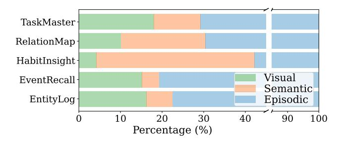
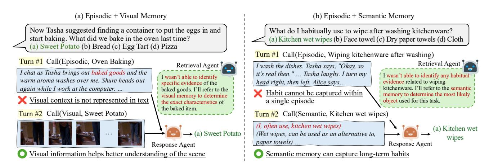

# 4.3. Efficacy of Multimodal Memory

To examine the contribution of each memory in our framework, we perform an ablation study that varies the composition of available memories. The evaluation results, summarized in Tab. 2, show a consistent improvement in performance as additional memories are incorporated. This

Figure 3. Memory type utilization of WorldMM on five distinctive categories in EgoLifeQA.

finding confirms that different memories capture complementary forms of knowledge. All following experiments in this section are conducted using WorldMM-GPT.

Effect of Episodic Memory To examine the performance differences arising from the retrieved data modality in WorldMM, we evaluate models using only episodic memory (E) and only visual memory (V), and report the results in Tab. 2. Using only episodic memory shows 20% higher performance than using only visual memory on average. This is mostly because textual information can be more readily organized into a graph, which enables effective retrieval, while indexing visual frames into a structured representation remains challenging.

Effect of Visual Memory Visual memory plays a particularly important role in categories that demand perceptual understanding, such as object recognition or action interpretation. In Tab. 2, visual memory significantly enhances accuracy in categories like EntityLog and EventRecall of EgoLifeQA and Ego-R1 Bench, as well as Visual and Audio+Visual of HippoVlog. The full configuration (E+S+V) surpasses the non-visual configuration (E+S) by an average margin of 4.2%. This improvement arises because visual information preserves spatial and perceptual details that are difficult to represent in text. As shown in Fig. 4(a), when relying solely on episodic memory, the model fails to capture object details such as the type of baked item, leading to an incorrect response. In contrast, visual memory provides access to corresponding frames that contain a complete scene, enabling accurate interpretation of objects and activities.

Effect of Semantic Memory Semantic memory proves the most beneficial for categories that require reasoning over long-term dependencies and abstract relationships. This effect is evident in the HabitInsight and Relation-Map categories of EgoLifeQA and Ego-R1 Bench. The model equipped with full memory achieves 76.9% accuracy in HabitInsight, representing a 23% improvement over the setting without semantic memory (E+V). This substantial gain indicates that semantic memory serves as a structured

Table 2. Performance of WorldMM across multiple benchmarks using different memory types. E, S, and V denote episodic, semantic, and visual memories, respectively. Combinations with "+" indicate multiple memory types are used.

| Model                                                                            |           | EgoLifeQA |                               | Ego-R1 Bench |  |  |  |                     | HippoVlog |                |  |                                                                                      | LVBench Video-MME | Avg. |      |      |
|----------------------------------------------------------------------------------|-----------|-----------|-------------------------------|--------------|--|--|--|---------------------|-----------|----------------|--|--------------------------------------------------------------------------------------|-------------------|------|------|------|
|                                                                                  |           |           |                               |              |  |  |  |                     |           |                |  | Ent. EvR. Hab. Rel. Task Avg. Ent. EvR. Hab. Rel. Task Avg. Aud. Vis. A+V Summ. Avg. |                   |      | (L)  |      |
| E                                                                                | 57.6 61.1 |           | 70.5 61.6 69.8 62.6 54.5 70.7 |              |  |  |  | 53.9 52.6 57.9 57.0 |           | 72.4 73.2 68.4 |  | 80.4                                                                                 | 73.6              | 60.6 | 72.7 | 64.9 |
| V                                                                                | 40.8 35.7 |           | 36.1 34.4 39.7 37.2 36.5 34.1 |              |  |  |  | 23.1 31.6 28.2 34.2 |           | 35.2 66.4 54.8 |  | 48.8                                                                                 | 51.3              | 47.4 | 64.2 | 44.9 |
| E+S                                                                              | 56.8 61.9 |           | 73.8 62.4 71.4 63.4 59.3 68.3 |              |  |  |  | 69.2 57.9 60.5 61.0 |           | 70.8 75.2 68.8 |  | 80.4                                                                                 | 73.8              | 58.8 | 74.1 | 66.8 |
| E+V                                                                              | 59.2 63.5 |           | 70.5 60.8 68.8 63.3 65.1 68.3 |              |  |  |  | 53.9 47.4 57.9 63.0 |           | 73.2 77.2 70.8 |  | 79.6                                                                                 | 75.2              | 59.8 | 76.0 | 66.9 |
| E+S+V 62.4 64.3 75.4 62.4 71.4 65.6 64.6 70.7 76.9 57.9 63.2 65.3 75.6 81.6 73.2 |           |           |                               |              |  |  |  |                     |           |                |  | 82.8                                                                                 | 78.3              | 61.9 | 76.6 | 69.5 |

Figure 4. Qualitative results. (a) Episodic memory alone cannot capture detailed visual context. The retrieval agent dynamically retrieves from visual memory, enabling access to fine-grained visual details. (b) To address the limitations of episodic memory in representing relationships or habitual behaviors, the retrieval agent proactively accesses semantic memory, allowing it to incorporate habitual knowledge.

knowledge base that captures relational or habitual knowledge accumulated over time. The qualitative example in Fig. [4\(](#page-6-1)b) illustrates this behavior, where episodic memory alone fails to infer habitual actions that extend beyond a single event. By contrast, semantic memory captures the repeated use of kitchen wet wipes, allowing the model to infer the correct answer through long-term reasoning.

Adaptive Retrieval on Multimodal Memory To further analyze how categories differ in their reliance on distinct memory modalities in WorldMM, we quantify the usage proportion of each memory across all retrieval iterations per category. As shown in Fig. [3,](#page-5-1) while episodic memory plays a foundational role across all tasks, certain categories tend to select it more frequently than other memory types: HabitInsight and RelationMap depend primarily on semantic memory, reflecting their reliance on reasoning over longterm patterns. In contrast, EntityLog and EventRecall benefit more from visual memory, which provides fine-grained perceptual details not fully captured by text. This selective utilization suggests that the model dynamically emphasizes the most relevant memory type for each category, leveraging the strength of each type in a context-dependent manner. These results confirm that different types of memory contribute distinct yet complementary strengths.

