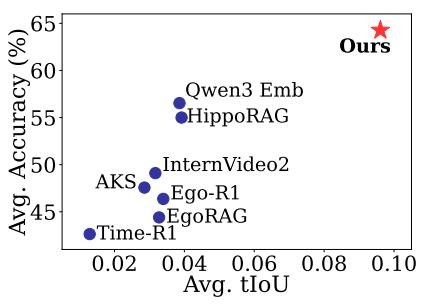
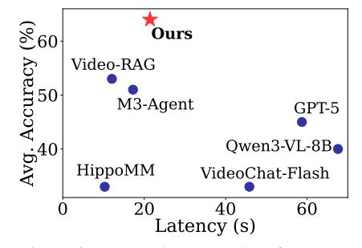
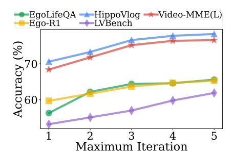

# 4.5. Efficacy of Multi-turn Retrieval

We validate the effectiveness of our model's multi-turn approach by limiting the maximum number of retrieval steps. The results in Fig. [7](#page-7-1) show that performance consistently improves as the number of iterations increases across all benchmarks. Notably, on the EgoLifeQA benchmark, al-

Table 3. Average tIoU (%) across three benchmarks.

| Model             | EgoLifeQA | Ego-R1 Bench | LVBench |
|-------------------|-----------|--------------|---------|
| Time-R1 [35]      | 0.58      | 0.59         | 2.70    |
| Qwen3 Emb. [46]   | 4.35      | 2.87         | 4.54    |
| HippoRAG [11]     | 4.00      | 3.28         | 4.30    |
| InternVideo2 [34] | 3.36      | 2.60         | 3.55    |
| EgoRAG [41]       | 3.60      | 2.73         | 3.50    |
| Ego-R1 [30]       | 3.70      | 2.89         | 3.60    |
| AKS [29]          | 2.75      | 2.30         | 3.52    |
| WorldMM (Ours)    | 10.09     | 9.17         | 9.57    |

Table 4. Comparison of model variants by changing each module.

| Model               |      | J    | EgoLi | ifeQ <i>A</i> | <b>\</b> |      | LVBench |  |  |
|---------------------|------|------|-------|---------------|----------|------|---------|--|--|
|                     | Ent. | EvR. | Hab.  | Rel.          | Task     | Avg. | Acc.    |  |  |
| Episodic Memory     |      |      |       |               |          |      |         |  |  |
| Fixed Timescale     | 44.8 | 51.6 | 60.7  | 51.2          | 58.7     | 51.8 | 47.9    |  |  |
| Embedding Retrieval | 45.6 | 52.4 | 59.0  | 54.4          | 52.4     | 52.0 | 50.9    |  |  |
| Semantic Memory     |      |      |       |               |          |      |         |  |  |
| w/o Consolidation   | 48.8 | 53.2 | 57.4  | 51.2          | 60.7     | 53.0 | 54.2    |  |  |
| Visual Memory       |      |      |       |               |          |      |         |  |  |
| Feature Retrieval   | 45.6 | 51.6 | 62.3  | 58.4          | 55.6     | 53.6 | 52.4    |  |  |
| Timestamp Retrieval | 41.6 | 50.0 | 63.9  | 56.8          | 54.0     | 51.8 | 52.9    |  |  |
| WorldMM (Ours)      | 49.6 | 56.4 | 63.9  | 58.4          | 58.7     | 56.4 | 55.4    |  |  |

Figure 5. Average tIoU and performance of WorldMM and baselines.

Figure 6. Average latency and performance of WorldMM and baselines.

Figure 7. Accuracy of WorldMM with different maximum retrieval steps.

lowing a maximum of five steps yields a 9.3% improvement over single-step retrieval. This gain arises because multiple iterations enable the retrieval agent to gather additional relevant information and refine its retrieval strategy when earlier attempts are suboptimal. An example of this refinement is shown in Sec. F.2, where the model corrects an initially irrelevant retrieval to produce a more accurate and contextually grounded response.

### 4.6. Analysis on Efficiency

To assess the efficiency of our framework, we measure the end-to-end latency of WorldMM on 100 randomly sampled queries from EgoLifeQA. As shown in Fig. 6, our method achieves a superior latency–accuracy trade-off compared with baselines. Long-video LLMs incur significantly higher inference latency, while still exhibiting relatively low performance. Although RAG- or memory-based approaches offer better latency, they often require substantial preprocessing and show a significant performance gap. In contrast, by allowing the retrieval agent to adaptively finish iterations and by retrieving only the relevant segments, WorldMM achieves low latency and substantially higher accuracy.

## 4.7. Efficacy of Memory Modules

To enable effective long video reasoning, WorldMM applies different strategies for each memory. Tab. 4 reports the results of WorldMM-8B under various module configurations with details about each method in Sec. C.2. For

episodic memory, using a fixed single timescale or embeddings instead of graphs results in a 6.1% and 4.4% drop in average accuracy, respectively, highlighting the importance of multi-scale structured knowledge. For semantic memory, removing the consolidation process results in approximately a 7% drop for the category that requires long-term reasoning, demonstrating the need for continuous integration of knowledge to support long-term reasoning. Finally, for visual memory, disabling its dual-mode retrieval leads to an accuracy drop of about 3%, indicating that each mode contributes complementary benefits for retrieving particular scenes or accessing broader temporal ranges.

## 5. Conclusion

We propose WorldMM, a novel memory agent designed to perceive and remember the world as represented in long video streams. To address the challenges of long video reasoning, we introduce a multimodal, multi-scale memory that integrates textual and visual information through adaptive retrieval. By constructing separate memories across different modalities and timescales, together with a retrieval agent that iteratively identifies relevant information, our approach enables effective and flexible reasoning over long videos. We validate our model on multiple benchmarks ranging from hour- to week-long videos, demonstrating that WorldMM provides a promising solution capable of robust performance across various long video reasoning tasks.

