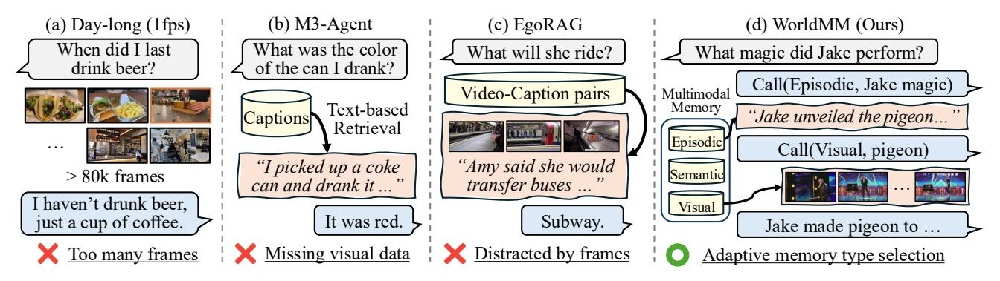

# 1. Introduction

With the increasing deployment of video large language models (video LLMs) [\[1,](#page-8-0) [4,](#page-8-1) [23,](#page-9-0) [47\]](#page-10-0) in real-world applications, such as AI glasses and household robots, these models are now required to process and reason over extremely long videos from several hours to even days [\[7,](#page-8-2) [32,](#page-9-1) [41\]](#page-10-1). Recent works [\[6,](#page-8-3) [19,](#page-9-2) [20\]](#page-9-3) have introduced memory-based approaches that build external memories from abstracted video representations. Such methods allow the model to focus on essential information by retrieving a small number of relevant memories, thereby reducing the number of input tokens. This is a more efficient and effective strategy compared to processing all frames in the video, requiring high computational cost as illustrated in Fig. [1\(](#page-1-0)a).

Despite their promise, most existing approaches remain highly dependent on textual representations. Typically, each detected event or clip is converted into captions, summaries, or structured text descriptions for downstream retrieval and reasoning [\[19,](#page-9-2) [30,](#page-9-4) [41\]](#page-10-1). Although Long et al. [\[20\]](#page-9-3) incorporates visual inputs when building memory, its use of multimodal features is limited to entity recognition and is not fully exploited during inference (Fig. [1\(](#page-1-0)b)). Moreover, existing models [\[20,](#page-9-3) [41\]](#page-10-1) typically retrieve a fixed number of clips with predetermined durations, such as retrieving three 30-second clips. These rigid architecture designs in video memory agents face the following two major limitations.

First, they fail to adaptively leverage visual information from videos in conjunction with textual memory during retrieval and generation. Visual details are essential for many real-world tasks requiring attribute recognition, spatial reasoning, or precise scene understanding, while this knowledge cannot be fully represented in text. Meanwhile, as shown in Fig. [1\(](#page-1-0)c), a fixed strategy that always includes both captions and frames during response generation yields suboptimal results since excessive visual context can even distract the model. Therefore, an adaptive mechanism for selecting multimodal memories is essential for retrieving the most informative references for a given query, which remains unexplored in previous works.

Second, retrieving a fixed number of clips limits the model's ability to handle queries that require varying temporal scopes. For instance, a question like *"Where did I leave my glasses?"* may require only a few seconds of video, whereas *"What happened in the second half of the soccer match?"* demands a much longer temporal context. Existing approaches retrieve a predetermined length of segments for simplicity [\[19,](#page-9-2) [20,](#page-9-3) [41\]](#page-10-1), which inherently over-

\*Equal contribution; †Equal advising

Figure 1. Concept Figure. (a) A day-long video sampled at 1 fps has frames that exceed the context limits of video LLMs. (b) M3- Agent [\[20\]](#page-9-3) relies on textual representation of video, which can underrepresent visual information. (c) EgoRAG [\[41\]](#page-10-1) retrieves both captions and the corresponding visual frames, but irrelevant frames may distract model. (d) WorldMM (Ours) constructs multiple memories, incorporating both textual and visual representations, and uses adaptive memory retrieval to effectively leverage multimodal information.

looks the diverse temporal scales of real-world events, limiting flexibility. Instead, the retriever should dynamically gather information at multiple temporal scales, combining hour-level summaries with minute-level details as needed.

To fill this gap, we present WorldMM, a novel memorybased agent that constructs separate textual and visual memories and employs an adaptive retrieval agent to select the optimal memory modality and temporal granularity for each query. The textual memory comprises two components: episodic memory, which stores multiple events across different time scales, and semantic memory, which captures high-level, long-term knowledge such as relationships and habits, organized within knowledge graphs. The visual memory divides a long video into short-term segments indexed within a retrieval corpus, enabling the model to access visual information when required. The retrieval agent iteratively selects the most relevant memory across modalities and timescales, ensuring that the agent retrieves only the information necessary for each query. The proposed multimodal memory selection design therefore prevents the model from being forced to condition on paired yet unnecessary modality memories when retrieving data for a given query, minimizing potential distraction during reasoning.

In addition, WorldMM is able to retrieve information at varying levels of granularity over the appropriate time range by leveraging multiple graphs operating at different temporal scales, such as seconds, minutes, and hours. When episodic memory is selected for retrieval, the retrieval agent searches each memory to gather potentially relevant information from all temporal levels. The collected candidates are then jointly examined to determine which pieces of information should be used to answer the query. In the end, we dynamically access both short- and long-term video contexts to assemble only the necessary information for reasoning. Furthermore, the model performs retrieval in multiple turns by iteratively selecting memories and queries, thereby expanding the range of possible combinations and allowing adaptive selection of the information for each query.

We evaluate WorldMM with five long video questionanswering benchmarks from hour- to week-long durations. The proposed approach consistently outperforms strong baselines, including long video LLMs and memoryaugmented models. Comprehensive ablation studies further demonstrate the effectiveness of our multi-memory, multiscale design. Specifically, episodic memory enables reasoning over events at multiple timescales, visual memory improves performance on object- and action-centered queries, while semantic memory enhances reasoning over long-term contexts. When all the memories are adaptively integrated, the model achieves the best overall results. These results highlight that our multimodal memory system represents a promising direction toward robust long video reasoning.

