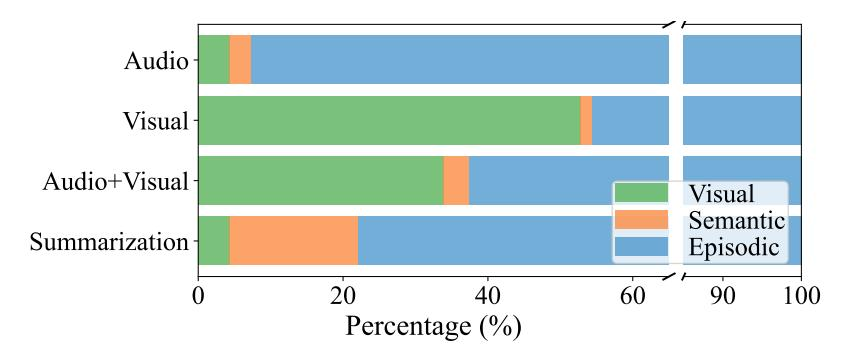

# **D. Detailed Experimental Results**

In this section, we provide extended results and analyses of the experimental results.

Main results Tabs. 7 and 8 present the category-wise performance breakdown of WorldMM and baseline methods. Beyond overall benchmark averages, WorldMM consistently outperforms existing approaches across most categories. Notably, the gains are particularly pronounced in categories that rely on visual information. For instance, in the EntityRecall category of EgoLifeQA, where visual cues can help answering, WorldMM exceeds the previous best method, Ego-R1, by a substantial 11.2%. Similarly, on HippoVlog, our model achieves a 4% improvement in the Aud. and A+V categories, both of which require visual reasoning. These margins are greater than those observed in categories that do not explicitly depend on visual content, highlighting the strong advantage of our multimodal multi-memory architecture.

Table 8. Category-wise performance breakdown of WorldMM and baselines on Video-MME (L).

| Model                   |      | ARES AREC ATTR CNT ISYN OCR ORES OREC SPER SRES TPER TRES Avg. |      |      |      |      |      |      |      |      |      |      |      |
|-------------------------|------|----------------------------------------------------------------|------|------|------|------|------|------|------|------|------|------|------|
| Base Models             |      |                                                                |      |      |      |      |      |      |      |      |      |      |      |
| Qwen3-VL-8B [1]         | 62.2 | 54.0                                                           | 51.9 | 43.8 | 68.1 | 42.9 | 62.9 | 57.4 | 33.3 | 45.5 | 33.3 | 67.0 | 61.0 |
| Gemini 2.5 Pro [4]      | 56.9 | 47.6                                                           | 66.7 | 41.7 | 71.8 | 57.1 | 53.3 | 40.7 | 0.0  | 72.7 | 66.7 | 48.4 | 55.7 |
| GPT-5 [23]              | 71.1 | 69.8                                                           | 70.4 | 47.9 | 88.3 | 57.1 | 75.8 | 74.1 | 33.3 | 72.7 | 50.0 | 75.8 | 74.3 |
| Long Video LLMs         |      |                                                                |      |      |      |      |      |      |      |      |      |      |      |
| VideoChat-Flash [18]    | 35.0 | 42.9                                                           | 37.0 | 31.3 | 34.4 | 42.9 | 60.0 | 46.3 | 33.3 | 54.5 | 33.3 | 46.2 | 44.1 |
| Time-R1 [35]            | 20.6 | 28.6                                                           | 25.9 | 35.4 | 31.9 | 35.7 | 53.3 | 48.2 | 33.3 | 36.4 | 50.0 | 44.0 | 37.6 |
| Video-RTS [36]          | 43.3 | 52.4                                                           | 40.7 | 39.6 | 33.7 | 42.9 | 60.8 | 53.7 | 33.3 | 45.5 | 50.0 | 49.5 | 47.9 |
| RAG-based Video LLMs    |      |                                                                |      |      |      |      |      |      |      |      |      |      |      |
| LightRAG [10]           | 41.7 | 30.2                                                           | 40.7 | 35.4 | 54.0 | 50.0 | 46.7 | 61.1 | 33.3 | 45.5 | 50.0 | 52.8 | 46.6 |
| HippoRAG [11]           | 45.6 | 47.6                                                           | 40.7 | 37.5 | 52.2 | 42.9 | 52.9 | 64.8 | 66.7 | 54.5 | 50.0 | 70.3 | 52.1 |
| Video-RAG [21]          | 51.7 | 47.6                                                           | 37.0 | 39.6 | 49.7 | 57.1 | 62.1 | 68.5 | 66.7 | 45.5 | 50.0 | 68.1 | 55.4 |
| Memory-based Video LLMs |      |                                                                |      |      |      |      |      |      |      |      |      |      |      |
| EgoRAG [41]             | 31.1 | 55.6                                                           | 33.3 | 22.9 | 41.1 | 28.6 | 44.6 | 48.2 | 33.3 | 54.5 | 66.7 | 48.4 | 41.1 |
| Ego-R1 [30]             | 37.2 | 52.4                                                           | 40.7 | 35.4 | 38.0 | 35.7 | 42.1 | 51.9 | 66.7 | 63.6 | 50.0 | 52.8 | 42.7 |
| HippoMM [19]            | 41.1 | 42.9                                                           | 55.6 | 35.4 | 38.7 | 35.7 | 37.9 | 53.7 | 33.3 | 54.5 | 50.0 | 47.3 | 41.6 |
| M3-Agent [20]           | 52.2 | 57.1                                                           | 59.3 | 45.8 | 51.5 | 42.9 | 54.6 | 64.8 | 33.3 | 45.5 | 50.0 | 71.4 | 55.3 |
| WorldMM (Ours)          |      |                                                                |      |      |      |      |      |      |      |      |      |      |      |
| WorldMM-8B              | 65.0 | 66.7                                                           | 59.3 | 41.7 | 72.4 | 42.9 | 67.5 | 72.2 | 33.3 | 54.5 | 66.7 | 69.2 | 66.0 |
| WorldMM-GPT             | 81.1 | 73.0                                                           | 70.4 | 54.2 | 85.3 | 42.9 | 75.0 | 77.8 | 33.3 | 72.7 | 66.7 | 79.1 | 76.6 |

Figure 8. Memory type utilization of WorldMM on four distinctive categories in HippoVlog.

Efficacy of multimodal memory Fig. [8](#page-14-2) shows memory type utilization of our model on HippoVlog benchmark, where categories are grouped by their modality requirements. The Audio category requires reasoning over spoken content and therefore is expected to depend primarily on textual memory derived from caption transcripts, while the Visual category focuses on visual understanding and correspondingly is designed to rely more on visual memory. Our results clearly support these expectations, showing that the Audio category predominantly activates textual memory while the Visual category relies heavily on visual memory, indicating that each category effectively leverages the required memory. Moreover, the Summarization category, which requires long-term reasoning, utilizes semantic memory more than any other category, demonstrating the complementary roles and effectiveness of each memory module in handling different reasoning demands. Together with this distribution of memory usage and the demonstrated performance gains in Tab. [2,](#page-6-0) these underscore the effectiveness of our multimodal multi-memory framework.

Dynamic temporal scope retrieval Tabs. [9](#page-15-1) and [10](#page-15-2) detail the per-category tIoU and accuracy results for WorldMM and baseline methods. While WorldMM significantly outperforms existing baselines on average, the results on LVBench particularly highlight the effectiveness of our dynamic episodic memory. In LVBench's Long category, where answering requires reasoning over more than five minutes of video, WorldMM outperforms the baselines by a notably larger margin than in categories that require shorter timescale, underscoring its ability to flexibly retrieve and integrate information over diverse temporal spans.

Table 9. Category-wise average tIoU (%) breakdown of WorldMM and dynamic temporal scope retrieval baselines.

| Model                                                      |      |      |      | EgoLifeQA |      |      | Ego-R1 Bench |      |  |  |                     |  | LVBench                                  |      |                  |      |
|------------------------------------------------------------|------|------|------|-----------|------|------|--------------|------|--|--|---------------------|--|------------------------------------------|------|------------------|------|
|                                                            | Ent. | EvR. | Hab. | Rel.      | Task | Avg. |              |      |  |  |                     |  | Ent. EvR. Hab. Rel. Task Avg. Short Med. |      | Long Avg.        |      |
| Time-R1 [35]                                               | 0.34 | 0.72 | 1.07 | 0.52      | 0.41 | 0.58 | 0.27         | 0.84 |  |  | 0.71 1.15 1.58 0.59 |  | 3.10                                     | 2.60 | 1.00             | 2.70 |
| Qwen3 Emb. [46]                                            | 2.87 | 4.31 | 5.58 | 2.98      | 8.91 | 4.35 | 2.68         | 2.74 |  |  | 3.85 2.74 3.70 2.87 |  | 4.48                                     | 6.20 | 1.75             | 4.54 |
| HippoRAG [11]                                              | 3.02 | 4.19 | 4.99 | 2.12      | 8.36 | 4.00 | 3.32         | 2.85 |  |  | 3.28 2.23 4.07 3.28 |  | 4.23                                     | 5.76 | 1.88             | 4.30 |
| InternVideo2 [34]                                          | 2.09 | 4.42 | 6.04 | 2.00      | 3.88 | 3.36 | 2.71         | 2.55 |  |  | 3.09 1.85 2.32 2.60 |  | 3.66                                     | 4.71 | 0.87             | 3.55 |
| EgoRAG [41]                                                | 3.20 | 3.38 | 4.62 | 3.10      | 4.82 | 3.60 | 2.40         | 3.07 |  |  | 4.08 2.19 3.78 2.73 |  | 4.10                                     | 3.38 | 0.91             | 3.50 |
| Ego-R1 [30]                                                | 3.31 | 3.52 | 5.03 | 2.87      | 5.18 | 3.70 | 2.57         | 2.83 |  |  | 4.13 2.83 4.12 2.89 |  | 4.08                                     | 3.72 | 1.14             | 3.60 |
| AKS [29]                                                   | 2.42 | 2.77 | 3.08 | 2.93      | 2.67 | 2.75 | 2.03         | 2.48 |  |  | 2.99 2.58 3.04 2.30 |  | 3.81                                     | 4.11 | 1.10             | 3.52 |
| WorldMM (Ours) 9.79 10.43 11.85 7.73 12.97 10.09 8.91 9.85 |      |      |      |           |      |      |              |      |  |  | 8.86 9.63 9.58 9.17 |  | 7.53                                     |      | 14.41 10.02 9.57 |      |

Table 10. Category-wise performance breakdown of WorldMM and dynamic temporal scope retrieval baselines.

| Model               |      |      | EgoLifeQA      |      |           |      | Ego-R1 Bench |                |  | LVBench |                                                                                  |      |      |      |
|---------------------|------|------|----------------|------|-----------|------|--------------|----------------|--|---------|----------------------------------------------------------------------------------|------|------|------|
|                     |      |      |                |      |           |      |              |                |  |         | Ent. EvR. Hab. Rel. Task Avg. Ent. EvR. Hab. Rel. Task Avg. Short Med. Long Avg. |      |      |      |
| Time-R1 [35]        | 39.2 | 50.8 | 65.6 48.8 47.6 | 48.8 | 49.2      | 48.8 |              | 46.2 42.1 44.7 |  | 48.0    | 32.1                                                                             | 23.6 | 40.2 | 31.1 |
| Qwen3 Emb. [46]     | 44.0 | 59.5 | 70.5 58.4 68.3 | 57.8 | 51.9      | 65.9 |              | 61.5 57.9 47.4 |  | 54.0    | 52.9                                                                             | 49.1 | 62.3 | 53.2 |
| HippoRAG [11]       | 48.8 | 60.3 | 70.5 60.8 66.7 | 59.6 | 54.5      | 65.9 |              | 69.2 52.6 50.0 |  | 56.0    | 54.9                                                                             | 47.5 | 62.3 | 54.0 |
| InternVideo2 [34]   | 40.8 | 54.0 | 60.7 51.2 52.4 | 50.6 | 50.3      | 56.1 |              | 46.2 47.4 52.6 |  | 51.0    | 47.4                                                                             | 37.3 | 53.4 | 45.7 |
| EgoRAG [41]         | 40.0 | 56.3 | 62.3 54.4 52.4 | 52.0 | 46.6      | 56.1 |              | 46.2 47.4 55.3 |  | 49.0    | 32.4                                                                             | 32.0 | 31.9 | 32.2 |
| Ego-R1 [30]         | 51.2 | 53.2 | 63.9 50.4 50.8 | 53.0 | 50.8      | 63.4 |              | 38.5 36.8 57.9 |  | 52.0    | 32.5                                                                             | 36.5 | 37.3 | 34.1 |
| AKS [29]            | 41.6 | 51.6 | 63.9 51.2 52.4 | 50.6 | 51.3      | 63.4 |              | 46.2 36.8 50.0 |  | 51.7    | 43.3                                                                             | 33.9 | 39.2 | 40.4 |
| WorldMM (Ours) 62.4 |      | 64.3 | 75.4 62.4 71.4 |      | 65.6 64.6 | 70.7 |              | 76.9 57.9 63.2 |  | 65.3    | 58.3                                                                             | 65.4 | 72.1 | 61.9 |

