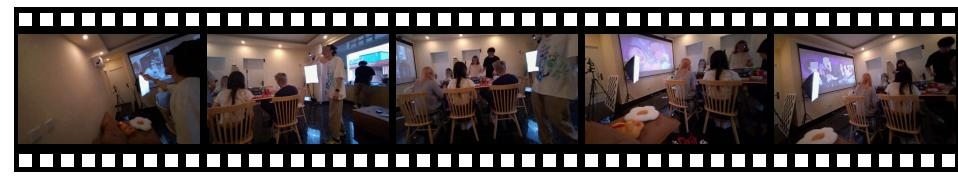

# <span id="page-16-9"></span>F.1. Memory Construction

Tab. 13 presents an example of episodic triplet extraction. Given a caption generated from sampled frames of a segment along with its corresponding transcript, an LLM is prompted (using the prompt in Fig. 11) to extract episodic triplets. Semantic triplets are extracted using a different prompt (Fig. 14), designed to focus on long-term dependencies and capture more abstract relationships across the segments, as shown in Tab. 14. To better capture persistent knowledge across segments, we introduce semantic consolidation, which incrementally updates the semantic graph by integrating new triplets and resolving conflicts. Using embedding-based matching and an LLM, duplicated or conflicting triplets are removed, and new or revised ones are added, generating an evolving semantic memory, as shown in Tab. 15. For instance, the new triplet "[I, uses WeChat for, money transfers]" is merged with the existing triplet to consolidate redundant information, and conflicting triplets, such as "[Lucia, dislikes, overly sweet food]" versus "[Lucia, likes, sweet desserts]", are removed to ensure consistency in the semantic memory.

### <span id="page-16-0"></span>F.2. Multi-turn Refinement

WorldMM demonstrates the effectiveness of multi-turn reasoning by progressively refining its retrieval strategy to answer questions, as shown in Tab. 16. In this example, the first round retrieves episodic memory using a narrow keyword focused on the "discussion" of the air conditioning, but it provides insufficient detail about the activity. In the second round, the model expands to a more general keyword, "air conditioning", which enables retrieval of every scene where the air conditioning is involved to obtain sufficient textual evidence. Moreover, in the third round, since the textual evidence fails to capture specific visual details of the scene, WorldMM refines its strategy to retrieve video frames corresponding to the relevant timestamp. Through this stepwise process, WorldMM effectively refines its search strategy with different keyword strategies and memory types to respond to the question.

#### <span id="page-16-4"></span>G. Limitation and Broader Impact

While WorldMM serves as an effective multimodal memory agent for long video reasoning, it still requires careful preprocessing, including video captioning, triplet extraction, and semantic consolidation. Yet, this limitation is not unique to our approach but a broader constraint shared by existing memory-based video LLMs. For example, M3-

<span id="page-17-0"></span>Agent [\[20\]](#page-9-3) incurs even heavier preprocessing due to its reliance on entity recognition, and many other approaches operate with offline preprocessing. In contrast, WorldMM is designed for online operation. Memories are updated at fixed intervals (e.g., every 10 seconds), and the required preprocessing for each segment can be performed within these windows. Moreover, new information can be seamlessly integrated into the knowledge graph, and our consolidation mechanism efficiently refines the knowledge base without requiring the reconstruction of memory from scratch.

With strong long-term reasoning capabilities and support for real-time updates, WorldMM serves as a practical solution for streaming scenarios such as egocentric assistants and embodied agents. This foundation enables richer and more persistent assistance for everyday tasks and accessibility. However, the continuous accumulation of structured knowledge over periods of time raises serious privacy and security concerns. Real-world deployments must therefore enforce safeguard policies, including strict access controls, secure data handling, and privacy protections.

Table 13. Example of episodic triplet extraction.

<span id="page-18-0"></span>Caption I stand and walk to the other side of the dining table. Katrina asks, "Is this for tomorrow's game?" "Yes—let's think about what to do tomorrow," I say. I raise my right hand as Katrina walks toward me. Lucia asks, "Using ancient poems? Or what else?" Katrina says, "I'm not good with ancient poems." Tasha asks, "Then what else to use?" Katrina says, "I'll be out in the first round. My room is already cleaned up." "Okay," I say. I turn toward the stairs, put down my phone, look back at the living room door, and walk into the second-floor living room. Lucia adds, "For example, not coming out." Katrina says, "Let me check that place we're going to." Tasha asks, "I just want to ask which fields it has expanded into." Lucia says, "Okay."

Extracted Triplets [I, stand at, dining table]

[I, walk to, other side of the dining table]

[Katrina, asks about, tomorrow]

[I, confirm, tomorrow]

[I, raise, right hand]

[Katrina, walks toward, I]

[Lucia, asks about, using ancient poems]

[Katrina, says, not good with ancient poems]

[Tasha, asks, what else to use]

[Katrina, says, I will be out in the first round]

[Katrina, has, room already cleaned up]

[I, turn toward, stairs]

[I, put down, phone]

[I, look back at, living room door]

[I, walk into, second-floor living room]

[Lucia, adds, not coming out as an example]

[Katrina, says, let me check that place we're going to]

[Lucia, says, Okay]

Table 14. Example of semantic triplet extraction.

<span id="page-19-0"></span>Caption I got up, moved my phone, and checked it before turning it off. Alice expressed her feelings towards me, and I responded by checking my phone's chat interface. Alice then questioned her appearance, and I turned off the phone, looking around at the snacks and utensils on the table. I stood up, grabbed a pack of snacks, and proceeded to my room to enjoy them. Alice asked about something being fancy, and I fetched my glasses, placing them on the table. ... I managed my phone, swiping through pages, and interacted with others as I went about my tasks. I observed Alice and Tasha, discussing what to feed a cat, and continued interacting with my phone. As the environment darkened, I engaged with the surroundings, noting the layout and structures. Finally, I moved towards a house with blue-green walls, managing my power bank and surveying the area.

Extracted Triplets [I, assigns tasks to, Katrina]

[I, handles reimbursements for, Alice]

[I, uses WeChat for, money transfers]

[I, often eats, snacks]

[I, wears, glasses]

[Lucia, dislikes, overly sweet food]

[Alice, expresses romantic feelings toward, I]

[Katrina, helps with, expense tracking]

[I, requires PDFs for, reimbursement] [Tasha, participates in, house demolition tasks]

[Lucia, participates in, house demolition tasks]

Table 15. Example of semantic consolidation.

<span id="page-19-1"></span>

| Original Triplets     | [I, uses WeChat to send money]<br>[I, wears, glasses]<br>[I, often eats, fruits]<br>[Lucia, likes, sweet desserts]<br>[Tasha, participates in, household projects]                                                                                                                                                                                                                                                                                        |                                                                                                                                                                                              |
|-----------------------|-----------------------------------------------------------------------------------------------------------------------------------------------------------------------------------------------------------------------------------------------------------------------------------------------------------------------------------------------------------------------------------------------------------------------------------------------------------|----------------------------------------------------------------------------------------------------------------------------------------------------------------------------------------------|
| New Triplets          | [I, assigns tasks to, Katrina]<br>[I, handles reimbursements for, Alice]<br>[I, uses WeChat for, money transfers]<br>[I, often eats, snacks]<br>[I, wears, glasses]<br>[Lucia, dislikes, overly sweet food]<br>[Alice, expresses romantic feelings toward, I]<br>[Katrina, helps with, expense tracking]<br>[I, requires PDFs for, reimbursement]<br>[Tasha, participates in, house demolition tasks]<br>[Lucia, participates in, house demolition tasks] | % conflicts with existing "likes sweet desserts"                                                                                                                                             |
| Consolidated Triplets | [I, assigns tasks to, Katrina]<br>[I, handles reimbursements for, Alice]<br>[I, uses, WeChat to send money]<br>[I, often eats, fruits and snacks]<br>[I, wears, glasses]<br>[Alice, expresses romantic feelings toward, I]<br>[Katrina, helps with, expense tracking]<br>[I, requires PDFs for, reimbursement]<br>[Tasha, participates in, house demolition tasks]<br>[Lucia, participates in, house demolition tasks]                                    | % merged with "uses WeChat for money transfers"<br>% merged and generalized "fruits" and "snacks"<br>% merged with duplicate in new triples<br>% refined general triple "household projects" |

Table 16. Example of the multi-turn refinement of WorldMM.

<span id="page-20-0"></span>Question What were we doing last time we discussed the air conditioning temperature? (A) Eating hot pot (B) Shopping (C) Playing piano (D) Picking up a package

Answer A

Round 1 Decision: Search // Memory: Episodic

Search Query: discussing the air conditioning temperature

*Retrieved:*

*[DAY2 13:36:00-13:39:00]*

*I joined my colleagues at the dining table and engaged in a discussion about the food while preparing to eat. ... During the meal, we discussed the air conditioner situation in the rooms. Tasha and Katrina talked about where the remotes were and who had access, with Shure mentioning that his room's AC had been on continuously due to a borrowed remote from me. I listened to their conversation, ...*

*[DAY2 17:48:00-17:51:00]*

*I coordinated with Shure and Lucia to find a suitable spot for my power bank, initially placing it on a flower pot as Shure suggested, but realizing it was unstable. ... We discussed the room environment, including turning off the air conditioner that was blowing cold air. Shure clarified that the remote we had was for the TV, not the air conditioner, prompting me to inquire about the correct remote. ...*

Round 2 Decision: Search // Memory: Episodic

Search Query: air conditioning

*Retrieved:*

*[DAY2 17:48:30-17:49:00]*

*"Flip it and put it underneath," I say. ... "Wow, this, this. . . " Lucia murmurs. "How do you turn off this air conditioner? It's blowing so cold up here." I adjust the power bank for a better position. Shure says, "Just tell it to turn off, it'll turn off." "Really? It's voice-controlled?" Lucia asks. I secure the power bank and turn to Shure and Lucia. Shure adds, "No, this is the TV remote." "Where is it?" I ask, and I chat with them.*

*[DAY2 18:34:01-18:34:29]*

*I watch Shure set the air conditioner to 26 degrees. "Save the Earth," I say. "Everyone's responsibility," I laugh. I kneel, then sit on the sofa. Shure asks, "Seriously, you think it's good to record this?" I look at my friends chatting and watch the movie. Shure says, "We're still using the AC." Shure says, "He really can't hear a thing." I watch Shure take a few steps. I laugh. Shure says, "Hahaha, it's like we're watching a silent movie." I smile and keep watching the movie. "Whoa, this is classic," I say. I stand up. "Come on, let's have a drink," I say.*

*[DAY2 18:33:00-18:33:30]*

*I walk in front of the fill light, pass behind Choiszt, and move toward the curtain. ... "The popularity is always high," I say. Shure: "Ha." Choiszt: "Turn it on." "Turn on the air conditioner?" I ask. Lucia: "I'll just, I suggest I drink water directly from a bowl." Lucia: "So later I'll eat with this bowl."*

Round 3 Decision: Search // Memory: Visual

Search Query: DAY2 18:34:01-18:34:29

*Retrieved:*



*(Author Note: They are gathered around a table cooking and sharing a hot pot meal while watching a projection on the wall.)*

Round 4 Decision: Answer

Response A

<span id="page-21-0"></span>You are an expert video captioner.

You will receive a short video segment represented by ordered frames and optional transcript lines with timestamps. Write a caption describing both the visual content and the audible content of the segment.

#### Guidelines:

- Describe visible actions, people, objects, and environment.
- Include relevant speech, sounds, or audio events.
- Keep the caption factual and neutral.
- Do not mention frames, timestamps, or that the input came from frames.
- Avoid speculation about emotions or intentions unless clearly visible or stated in speech.

Output only the final caption text.

Figure 9. Prompt for video caption generation.

<span id="page-21-1"></span>Your task is to extract named entities from the given paragraph. Respond with a JSON list of entities.

## Example:

Radio City is India's first private FM radio station and was started on 3 July 2001. It plays Hindi, English and regional songs. Radio City recently forayed into New Media in May 2008 with the launch of a music portal - PlanetRadiocity.com that offers music related news, videos, songs, and other music-related features.

```
{ "named entities":
    ["Radio City", "India", "3 July 2001", "Hindi", "English", "May 2008", "PlanetRadiocity.com"]
}
```

Figure 10. Prompt for named entity recognition (NER). Recognized named entities are used to extract episodic triplets as shown in Fig. [11.](#page-22-0)

<span id="page-22-0"></span>Your task is to construct an RDF (Resource Description Framework) graph from the given passages and named entity lists. Respond with a JSON list of triples, with each triple representing a relationship in the RDF graph.

Pay attention to the following requirements:

- Each triple should contain at least one, but preferably two, of the named entities in the list for each passage.
- When resolving pronouns, if the pronoun refers to the first-person (e.g., I, me, my), keep it as "I" instead of replacing with terms like "speaker" or "narrator". For other pronouns, clearly resolve them to their specific names to maintain clarity.

Convert the paragraph into a JSON dict, it has a named entity list and a triple list.

