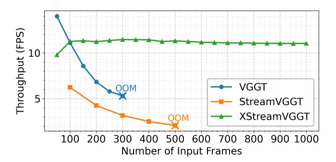

# 1 Introduction

Recovering 3D geometric structures from image sequences has long been a fundamental challenge in 3D computer vision [21]. This task is crucial for numerous real-world applications, such as robotics, augmented reality, and autonomous driving [20, 10, 6]. For years, 3D vision has been dominated by classical methods, primarily structure-from-motion (SfM) [1, 11, 32] and multi-view stereo (MVS) [14, 12]. While these methods demonstrate strong performance in high-fidelity geometric optimization, they rely on fragmented multi-stage pipelines that incur substantial processing delays. Such pipelines are also susceptible to cascading errors, potentially compromising the accuracy and integrity of the final reconstruction. In recent years, learning-based feed-forward models have revolutionized this field.

\*Equal Contribution.

Models such as DUSt3R, CUT3R, and VGGT [\[29,](#page-12-2) [31,](#page-12-3) [30\]](#page-12-4) have shifted the paradigm from conventional approaches to end-to-end deep learning frameworks, showcasing not only remarkable performance but also impressive generalization across diverse datasets. As a significant milestone in this evolution, the Visual Geometry-Grounded Transformer (VGGT) consolidates multiple 3D vision tasks within a unified framework, consistently surpassing task-specific methods across a broad spectrum of applications, including dense depth estimation, point map regression, and camera pose prediction [\[29\]](#page-12-2). To support robust streaming applications,

Figure 1: Efficiency analysis on a single 80GB A100 GPU. As the number of input frames increases, StreamVGGT and VGGT exhibit significant FPS degradation and rapidly encounter out-of-memory (OOM) errors. In contrast, XStreamVGGT consistently delivers significantly higher frames per second (FPS) without encountering OOM issues.

StreamVGGT [\[40\]](#page-13-1) replaces the global attention mechanism in Alternative-Attention of VGGT with frame-wise causal attention, following a design philosophy similar to autoregressive large language models (LLMs) [\[5,](#page-11-6) [4,](#page-11-7) [28\]](#page-12-5). This change shifts the model from an offline to an online streaming paradigm, substantially improving practical usability.

At the core of StreamVGGT is its reliance on the Key-Value (KV) cache of previous input frames, which functions as an explicit and persistent memory mechanism. However, as streaming inference progresses, the model is exposed to a significant influx of vision tokens from multi-image and long-video inputs. This influx drives the KV cache to expand linearly with the number of input frames, eventually resulting in unbounded growth [\[17,](#page-12-6) [15\]](#page-11-8). As illustrated in Figure [1,](#page-1-0) memory consumption and inference latency escalate rapidly as input frames accumulate in StreamVGGT. This issue significantly restricts the system's scalability for long-horizon applications, creating a critical bottleneck for real-world deployment.

To address this challenge, we propose XStreamVGGT, a tuning-free approach that seamlessly integrates pruning and quantization to systematically compress the KV cache, enabling highly memoryefficient streaming inference. Specifically, XStreamVGGT first eliminates redundant KV cache from multi-frame inputs through an efficient token importance identification mechanism, pruning the cache to a bounded budget while preserving the first-frame KVs as geometric references [\[29\]](#page-12-2). Furthermore, our analysis reveals pronounced channel-wise outliers in the Key tensors, while the Value tensors exhibit much weaker outlier behavior in StreamVGGT. Leveraging the inherent distribution patterns of KV tensors, we develop a dimension-adaptive KV quantization scheme that incorporates per-channel Key and per-token Value quantization. This quantization scheme is seamlessly integrated into the pruning pipeline, further minimizing memory overhead while maintaining numerical accuracy. Our key contributions can be summarized as follows:

- We introduce XStreamVGGT, the first method to seamlessly integrate pruning and quantization for systematically compressing the KV cache in StreamVGGT. XStreamVGGT effectively addresses the issue of unbounded growth in KV memory, enabling extremely memory-efficient streaming inference.
- We conducted a comprehensive analysis of the KV distribution in StreamVGGT, unveiling, for the first time, the distinctive distribution patterns of Key and Value tensors in 3D reconstruction transformer models. By leveraging dimension-adaptive quantization, we effectively mitigate its impact on quantization accuracy.
- Extensive evaluations on 3D reconstruction, camera pose estimation and depth estimation demonstrate that XStreamVGGT achieves mostly negligible performance degradation, while reducing memory usage by 4.42× and accelerating inference by 5.48×, offering a powerful and scalable solution for efficient streaming 3D applications.

