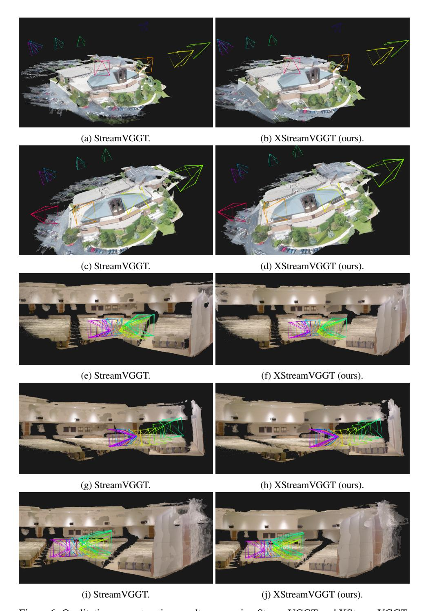
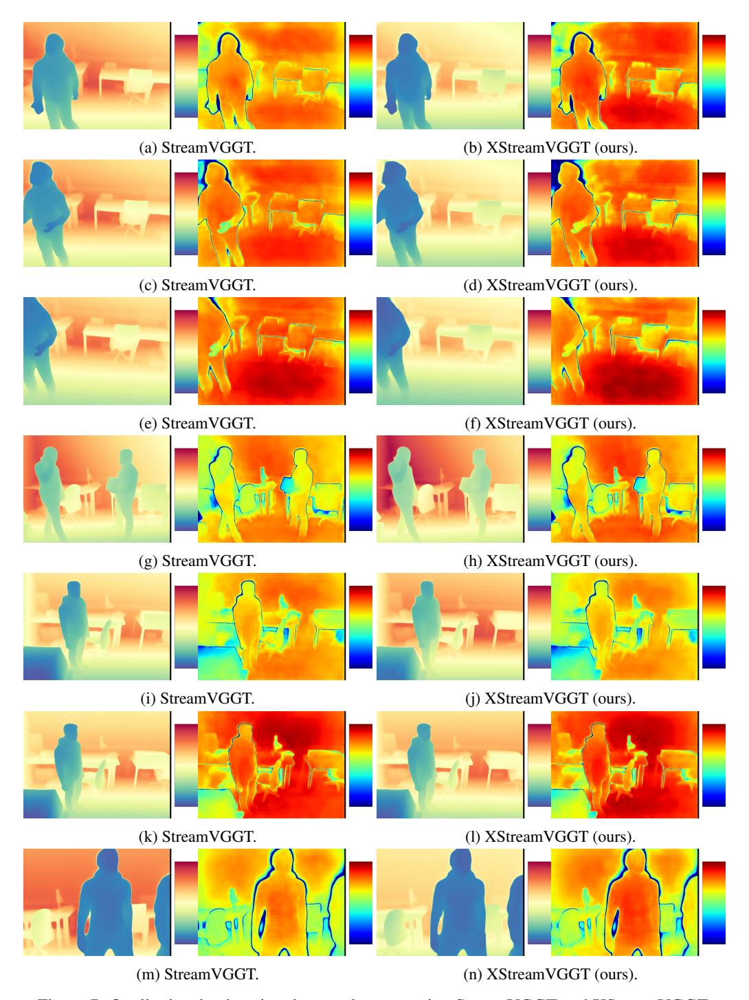

# 5 Conclusion

We present XStreamVGGT, a tuning-free method for memory-efficient streaming inference of StreamVGGT. By combining KV cache pruning with quantization, it bounds memory growth while preserving model fidelity. Extensive experiments demonstrate minimal performance loss alongside substantial reductions in memory footprint and inference latency, enabling scalable 3D streaming applications. Future work will explore adaptive cache budgets that dynamically adjust based on scene complexity and motion characteristics.

Figure 6: Qualitative reconstruction results comparing StreamVGGT and XStreamVGGT.

Figure 7: Qualitative depth estimation results comparing StreamVGGT and XStreamVGGT.

