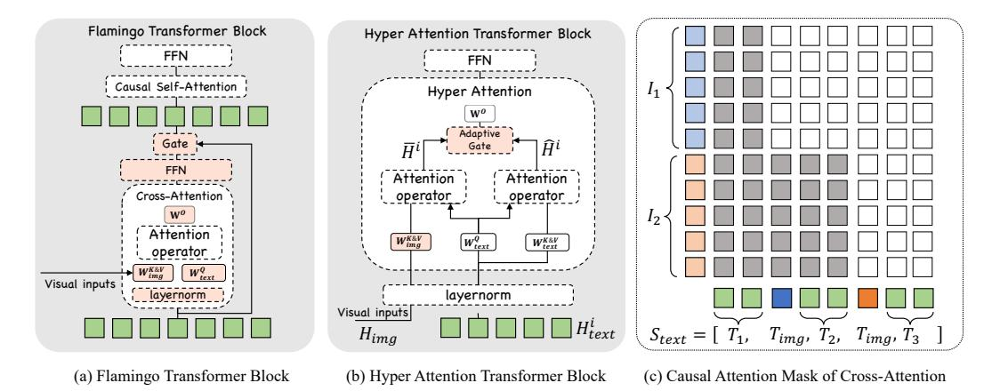

# 1 Introduction

Recently, Multimodal Large Languages Models (MLLMs) [\(Liu et al.,](#page-20-0) [2023a;](#page-20-0) [Ye et al.,](#page-22-0) [2023b;](#page-22-0) [Liu](#page-20-1) [et al.,](#page-20-1) [2024a;](#page-20-1) [Ye et al.,](#page-22-1) [2024;](#page-22-1) [Chen et al.,](#page-18-0) [2024d\)](#page-18-0) have achieved rapid advancements, demonstrating strong single-image understanding capabilities. The current approaches primarily rely on vast amounts of image and text data to align Large Language Models (LLMs) [\(Zheng et al.,](#page-23-0) [2023;](#page-23-0) [Touvron et al.,](#page-21-0) [2023a;](#page-21-0)[b\)](#page-21-1) with visual encoders, thereby extending multimodal capabilities.

More advanced image-sequence understanding capabilities are required in practical applications, such as Multi-Image Reasoning [\(Suhr et al.,](#page-21-2) [2018;](#page-21-2) [Lu et al.,](#page-20-2) [2021;](#page-20-2) [Jiang et al.,](#page-19-0) [2024\)](#page-19-0), Multimodal RAG [\(Chen et al.,](#page-18-1) [2022;](#page-18-1) [Lin et al.,](#page-20-3) [2024\)](#page-20-3), Video Understanding [\(Xiao et al.,](#page-21-3) [2021;](#page-21-3) [Li et al.,](#page-19-1) [2023c;](#page-19-1) [Fu et al.,](#page-18-2) [2024a;](#page-18-2) [Wu et al.,](#page-21-4) [2024\)](#page-21-4), Multi-modal Agents [\(Wang et al.,](#page-21-5) [2024a;](#page-21-5) [Zhang et al.,](#page-22-2) [2024a\)](#page-22-2), and Multi-Doc QA [\(Tito et al.,](#page-21-6) [2023;](#page-21-6) [Van Landeghem et al.,](#page-21-7) [2023\)](#page-21-7). The existing methods are primarily based on interleaved image-text web data for pre-training [\(Laurençon et al.,](#page-19-2) [2023;](#page-19-2) [Laurençon et al.,](#page-19-3) [2024\)](#page-19-3) to extend multi-image capabilities or focused on the in-context abilities [\(Alayrac et al.,](#page-17-0) [2022;](#page-17-0) [Awadalla et al.,](#page-17-1) [2023;](#page-17-1) [Zhao et al.,](#page-23-1) [2023\)](#page-23-1) within multi-image scenarios. However, these methods have not explored the in-depth comprehension or the efficiency of multi-images sufficiently, which makes it hard to support long image sequences.

For example, LLAVA-Next-Interleave [\(Li et al.,](#page-19-4) [2024a\)](#page-19-4) and Mantis [\(Jiang et al.,](#page-19-0) [2024\)](#page-19-0) directly insert visual features into textual sequences. As shown in Figure [1,](#page-0-2) the inference latency and memory usage is dramatically increase. Flamingo [\(Alayrac et al.,](#page-17-0) [2022\)](#page-17-0) simply uses a Perceiver and cross-attention layers to reduce computational overhead. This results in the loss of visual fine-grained information and leads to poor performance in both single and multi-image scenarios.

To address this challenge, we introduce mPLUG-Owl3, a new general-purpose multi-modal foundation model. mPLUG-Owl3 is designed to handle long image sequences both effectively and efficiently. mPLUG-Owl3 integrates innovative hyper attention blocks in the language model to achieve efficient interleaved vision-language semantic alignment. Specifically, Hyper Attention introduces cross-attention parallel to the self-attention in the transformer block. The language query is reused to select and extract visual features from a lengthy visual sequence, allowing for adaptively obtaining complementary visual information that the language model lacks, based on textual semantics.

We evaluate mPLUG-Owl3 with a total of twenty benchmarks, which include single-image, multiimage, and video. Specifically, experiments encompass five visual question answering tasks, five multimodal large language model tasks, four video tasks, and six multi-image tasks. Among models of the same size, mPLUG-Owl3 achieves state-of-the-art results in 14 out of 20 benchmarks. Besides existing benchmarks, we also propose a challenging long visual sequence evaluation named Distractor Resistance. It is designed to assess the ability of models to maintain focus amidst distractions. We can observe that mPLUG-Owl3 demonstrates outstanding performance in handling ultra-long visual sequence inputs while also maintaining extremely high execution efficiency. The superior performance of the new architecture in mPLUG-Owl3 implies a trend for future multimodal large language models.

## 2 мPLUG-Owl3

As illustrated in Figure 2, mPLUG-Owl3 comprises a visual encoder, a linear projection layer, and a decoder-only language model. This architecture is commonly employed in recently proposed Multi-modal Large Language Models. Unless specified otherwise, we use Siglip-400m (Zhai et al., 2023) as the visual encoder and Qwen2 (Yang et al., 2024) as the language model. First, we provide detailed information about our efficient architecture and its handling of various lengths of visual inputs in Section 2.1. Additionally, we introduce the Hyper Attention module in Section 2.2. It is a lightweight extension designed to enhance the transformer blocks of the language model by enabling cross-attention capabilities for adaptive visual sequence utilization.

#### 2.1 Cross-Attention based Architecture

Popular MLLMs (e.g., LLAVA-Interleave (Li et al., 2024a), InternVL (Chen et al., 2024d)) insert visual features into the sequence of embeddings, which can easily exhaust the language model's context window, resulting in significant memory and computational overhead. This kind of disadvantage hinders these MLLMs to modeling the long vision input such as multiple images, videos and multiple pieces high-resolution images. Moreover, visual details can be lost, when going through the language model.

Therefore, mPLUG-Owl3 consider use cross-attention for feeding the visual information into the language model. Specifically, given a interleaved multimodal input  $S = [T_1, I_1, T_2, I_2, T_3]$  (the format can be adapted to various text-image organizational structures), mPLUG-Owl3 first extract visual features of the input images and use a linear projection to align the dimensions of visual features to be the same of the language model. The projected visual features are denoted by  $\mathbf{H_{img}} = [I_1^t, I_2^t] \in \mathbb{R}^{L \times D_t}$ . The text sequence are  $S_{text} = [T_1, T_{img}, T_2, T_{img}, T_3] \in \mathbb{R}^{L \times D_t}$ , where  $T_{img}$  is a plain text <|image|> to indicate the original place of the image. We feed the sequence into the word embedding to obtain text feature  $\mathbf{H_{text}}$ .

In the language model, we fuse the visual features  $\mathbf{H_{img}}$  into the text features  $\mathbf{H_{text}}^i \in \mathbb{R}^{L \times D_t}$  of the  $i^{th}$  layer through cross-attention operator. Different from Flamingo (Alayrac et al., 2022) and EVLM (Chen et al., 2024b) that insert an additional layer into each layer of transformer layer, we sparsely extend a small number of transformer blocks in the network to perform cross attention parallel with self-attention. We name the Hyper Attention Transformer Block (HATB). We discuss the design of HATB in detail in Section 2.2. HABT can significantly reduces the number of additional training parameters and facilitates model convergence. Besides, we observe that having fewer HATBs does not degrade the model's performance; instead, it offers the advantages of low memory consumption and high inference efficiency during inference. For a language model consisting of N layers, we start from layer 0 and uniformly extend K layers to HATB. Specifically, for Qwen2, we select layers [0, 9, 17, 25].

#### 2.2 Hyper Attention Transformer Block

In this section, we specifically introduce the Hyper Attention Transformer Block used in mPLUG-Owl3. The cross-attention structure employed in Flamingo, as shown in Figure 3 (a), has been widely utilized in constructing MLLMs (e.g., IDEFICS (Laurençon et al., 2023), EVLM (Chen et al., 2024b)). However, this structure presents three main drawbacks: it introduces a large number of additional parameters, which results in significant memory and computational overhead; the knowledge learned by the language model cannot benefit the understanding of visual inputs; the cross attention does not fully take into account the original positions of images in the interleaved sequence, which limits the performance of these models in multi-image scenarios. In response to these issues, we propose a lightweight Hyper Attention Transformer Block, illustrated in Figure 3 (b). This block introduces a small number of parameters and extends self-attention capabilities to perform both intra-text self-attention and inter-modal cross-attention between text and images

Figure 2: An overview of mPLUG-Owl3.

in parallel. It also introduces a Multimodal-Interleaved Rotary Position Embedding (MI-Rope) to maintain the position information of images. The extended modifications are detailed below:

**Shared Input Layernorm.** The visual feature  $\mathbf{H_{img}}$  and the  $i^{th}$  layer's text features  $\mathbf{H_{text}^i}$ , although sharing the same dimensionality, originate from different distributions. Hence, both sets of features are initially normalized using a LayerNorm module. Our findings indicate that employing the LayerNorm module already integrated within the transformer block results in better convergence compared to training a separate layer normalization module specifically for the visual features. This improvement is attributed to the compatibility of the mean and variance of the outputs from the integrated LayerNorm module with the distribution characteristics of the pre-trained language model.

**Modality-Specific Key-Value Projection.** In cross-attention, the **Query** is derived from textual data, while the **Key** and **Value** are extracted from visual features. Inspired by Ye et al. (2024), we construct a weight matrix  $\mathbf{W}_{img}^{K\&V} \in \mathbb{R}^{2D \times D}$  to generate the **Key** and **Value** for the visual features. This matrix is initialized using the weights from the language model's KV (Key-Value) projection. Furthermore, the query vector from the self-attention mechanism is repurposed as the **Query** in the

Figure 3: Comparison between Flamingo Transformer Block (a) and Hyper Attention Transformer Block (b). Pink indicates that the module is additionally introduced. (c) presents the causal attention mask strategy of cross attention in Hyper Attention in a image-text interleaved scenario. The gray block denotes the attention score is ignored.  $T_{img}$  denotes the token of plain text < | image|>.

cross-attention. The computation procedure for self-attention remains unchanged. This design is beneficial as it preserves more specific visual information and allows for the adaptive supplementation of visual information that the language model lacks, based on textual semantics.

**Visual Position Modeling in Attention.** For models that process multiple images, positional encoding is essential to correctly understanding interleaved image-text input. Existing cross-attention models, such as Flamingo (Alayrac et al., 2022) and IDEFICS (Laurençon et al., 2023), do not assign position embeddings to visual inputs, leading to suboptimal performance in scenarios involving multiple images. To accurately represent the original positions of images in interleaved sequences, we develope a Multimodal-Interleaved Rotary Position Embedding, which we name MI-Rope. Specifically, for each visual feature  $I_n$  of image n, we pre-record the position index of its placeholder  $T_{img}$  in the interleaved sequence  $S_{text}$ . All patches of  $I_n$  share  $T_n$ 's positional encoding to obtain the rotary embedding. This ensures that the positional encoding of the image not only reflects the order among images but also reveals its position in the textual context. We also use a causal attention mask in cross attention. As shown in Figure 3 (c), for a text sequence  $S = [T_1, T_{img}, T_2, T_{img}, T_3]$ , each text token can only attend the visual features that precede it. Then, HATB simultaneously performs cross-attention and self-attention, denoting the resulting hidden states as  $\bar{\mathbf{H}}^i$  and  $\hat{\mathbf{H}}^i$ .

**Adaptive Gating** Existing implementations of cross-attention utilize a learnable scale to regulate the extent of information transfer from the image to the language model. However, the semantics of language are ignored. Consequently, we introduce an adaptive gate that obtains the gate value based on the textual features:

$$\mathbf{g} = \operatorname{Sigmoid}(\mathbf{W}_{gate}^T \hat{\mathbf{H}}^{\mathbf{i}}) \tag{1}$$

$$\mathbf{H}_{\mathbf{fused}}^{\mathbf{i}} = \mathbf{\bar{H}}_{\mathbf{text}}^{\mathbf{i}} * \mathbf{g} + \mathbf{\hat{H}}_{\mathbf{text}}^{\mathbf{i}} * (1 - \mathbf{g})$$
 (2)

The  $\mathbf{H}_{\mathrm{fused}}^{i}$  is passed to the FFN and fed to the next layer of transformer.

#### 3 IMPLEMENT DETAILS

#### 3.1 Training Paradigm

We adopt a three-stage training approach for mPLUG-Owl3. Initially, we pre-train mPLUG-Owl3 using image-text pairs to achieve robust multimodal alignment. In the second stage, we leverage diverse datasets that include image and video captions to enhance the model's ability to understand

multiple images. Finally, we fine-tune mPLUG-Owl3 using a mixture of supervised data, encompassing tasks involving both single and multiple images, to ensure comprehensive performance. The statistics of the datasets we used are presented in Table 1, and the training settings are detailed in Table 2.

| Stage 1: Pretraining |            | Stage 2: Multi-Ima  | ge Training | Stage 3: Self-Supervised Fintuning |            |  |
|----------------------|------------|---------------------|-------------|------------------------------------|------------|--|
| Dataset Name         | Percentage | Dataset Name        | Percentage  | Dataset Name                       | Percentage |  |
| DataComp-1B          | 35.22%     | ShareGPTVideo       | 34.63%      | LLAVA-SFT                          | 57.95%     |  |
| LAION-en             | 26.07%     | Selective Caption   | 19.29%      | The Cauldron                       | 12.50%     |  |
| COYO-700M            | 14.47%     | LLAVA-Interleave    | 16.69%      | Mantis                             | 10.41%     |  |
| COYO-700M-OCR        | 9.60%      | VATEX               | 15.77%      | LLAVA-Interleave                   | 9.26%      |  |
| LAION-zh             | 7.73%      | Text Reading        | 7.36%       | ALLAVA                             | 6.95%      |  |
| Wukong               | 5.64%      | Interleaved Caption | 5.25%       | ShareGPTVideo-QA 240K              | 2.02%      |  |
| CC12M                | 0.81%      | MMDU                | 1.01%       | Video Instruct 100K                | 0.84%      |  |
| Others               | 0.46%      | -                   | -           | MSRTT/MSVD Caption                 | 0.06%      |  |

Table 1: Dataset percentages used in Pretraining, Multi-Image Training, and Self-Supervised Fintuning. Others include CC3M, OCR-CC, COCO and SBU.

| Setting      |                          | Stage 1: Pretraining                                 | Stage 2: Multi-Image Training            | Stage 3: Self-Supervised Fintuning       |
|--------------|--------------------------|------------------------------------------------------|------------------------------------------|------------------------------------------|
|              | Learning Rate (Max, Min) | (1e-3, 1e-5)                                         | (2e-5, 1e-7)                             | (2e-5, 1e-7)                             |
| Training     | Global Batch Size        | 2048                                                 | 1024                                     | 1024                                     |
| Training     | Training Steps           | 20K                                                  | 3K                                       | 11K                                      |
|              | Warmup ratio             |                                                      | 0.03                                     |                                          |
|              | Trainable Modules        | Linear Projection Visual KV Projection Adaptive Gate | Linear Projection Full Language Model | Linear Projection Full Language Model |
| Model        | Resolution               | 3842                                                 | up to $384^2 \times 6$                   | up to $384^2 \times 6$                   |
| Model        | Sequence Length          | 768                                                  | 4096                                     | 4096                                     |
|              | Precision                |                                                      | Mixed-precision FP16/B                   | F16                                      |
| Accelerating | ZeRO Optimization        |                                                      | Zero-1                                   |                                          |
|              | Gradient Checkpointing   | No.                                                  | Yes.                                     | Yes.                                     |
|              | Model Parallel           | TP=1                                                 | TP=4                                     | TP=4                                     |

Table 2: The training settings across three stages: Pretraining, Multi-Image Training, and Self-Supervised Finetuning.

#### 3.1.1 Pre-training

We collect image-text pairs from public datasets, including Conceptual Captions (CC3M/CC12M) (Changpinyo et al., 2021), COCO (Lin et al., 2014), Laion (Schuhmann et al., 2022), COYO (Byeon et al., 2022), DataComp (Gadre et al., 2023), Wukong (Gu et al., 2022), ImageNet (Deng et al., 2009), OCR-CC (Yang et al., 2021) and SBU (Ordonez et al., 2011). We randomly sample a subset consists of 41 million image-text pairs for pre-training. During pre-training, only the newly introduced modules are trainable, which include the linear layer following the vision encoder, the visual KV projection, and the Adaptive Gate in the Hyper Attention Transformer Block.

## 3.1.2 Multi-image Pre-training

In the multi-image pre-training stage, we collected three types of data to enhance the model's multi-image understanding capabilities:

- Interleaved data: We utilize sources such as MMDU (Liu et al., 2024d) and LLaVA-Interleave (Li et al., 2024a) for multi-image data. Additionally, from LLaVA-Recap 558K, we randomly sample 3 to 6 images and combine their image-caption pairs into an interleaved format to create Interleaved Captions. We also consider sampling 4 images and requiring a description of one among them to form Selective Captions.
- Text-rich data: We use text reading and key point generation data proposed by UReader (Ye et al., 2023a), enabling the model to reconstruct the text contained within text-rich images

and TO extract key points. These data help the model learn the original text structure from the pieces of high-resolution images.

• Video data: We adopt annotated data from ShareGPTVideo [\(Zhang et al.,](#page-22-7) [2024c\)](#page-22-7), which includes 900K caption entries and 240K question-answering instances. We also incorporate Chinese and English video caption data from VATEX [\(Wang et al.,](#page-21-8) [2019\)](#page-21-8). For training with video data, we consistently sample 8 frames per video.

Both linear projection and the full language model are trainable. With the help of tensor parallelism, the model is spilted into four parts, effectively reducing the memory usage on a single GPU to between 32 and 40 GB.

## 3.1.3 Supervised-Finetuning

In Supervised-Finetuning stage, mPLUG-Owl3 is trained with an extensive and diverse assembly of instruction tuning datasets aimed at enhancing its instruction-following capability. The datasets include LLaVA-SFT-665K [\(Liu et al.,](#page-20-1) [2024a\)](#page-20-1), The Cauldron [\(Laurençon et al.,](#page-19-3) [2024\)](#page-19-3), Mantis [\(Jiang](#page-19-0) [et al.,](#page-19-0) [2024\)](#page-19-0), LLaVA-Interleave [\(Li et al.,](#page-19-4) [2024a\)](#page-19-4), ALLaVA [\(Chen et al.,](#page-18-8) [2024a\)](#page-18-8), ShareGPTVideo-QA 240K [\(Zhang et al.,](#page-22-7) [2024c\)](#page-22-7), Video Instruct 100K [\(Maaz et al.,](#page-20-8) [2023\)](#page-20-8), MSR-VTT [\(Xu et al.,](#page-22-8) [2016\)](#page-22-8) and MSVD Caption [\(Chen & Dolan,](#page-18-9) [2011\)](#page-18-9). We keep the same training setting as the Multi-image Pre-training stage.

## 3.2 High-resolution Image Processing

Inspired by UReader [\(Ye et al.,](#page-22-6) [2023a\)](#page-22-6), we introduce a similar adaptive method for image cropping. For a given image, we select from the cropping grids (2,2), (1,3), (1,4), (3,1), (4,1), (2,3), and (3,2) that most closely matches the shape of the input image. Additionally, we retain a global version of the original image. During the Supervised-Finetuning stage, for datasets rich in text, we perform cropping with a probability of 100%. For datasets containing a single image without text, we apply cropping with a probability of 20%. For datasets containing multiple images or videos, we do not perform cropping. During evaluation, cropping is enabled only for single-image tasks.

## 3.3 Video Processing

For videos, we sample 8 frames per video by default. Meanwhile, we replace the video markers in the text with multiple *<|image|>* placeholders corresponding to the number of sampled frames.

