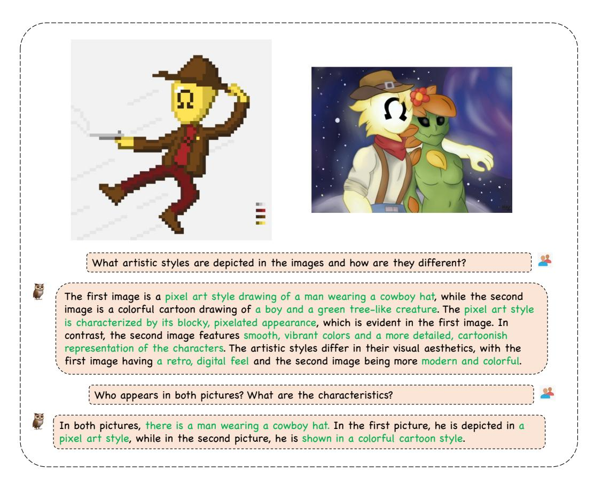

# 4.6.2 Video Understanding

We showcase the video understanding capabilities of mPLUG-Owl3. First, we compare it with LLaVA-Next-Interleave in Short Video Question Answering, Long Video Fine-grained Question Answering, and Long Video Comprehensive Understanding. For LLaVA-Next-Interleave, we input 8 frames, while for mPLUG-Owl3, we input 128 frames, which are the maximum numbers of images that can be accommodated by the two models on a V100-32G. The samples are shown in Figure [7.](#page-15-0)

In the short video tests, both LLaVA and mPLUG-Owl3 can provide correct answers. mPLUG-Owl3 tends to describe the attributes of objects based on the actual content seen. In long video lasting more than 40 minutes, when we ask about a specific detail, LLaVA fails to handle the long sequence and loses fine-grained information, rendering it unable to provide accurate information. On the other hand, mPLUG-Owl3 accurately captures key segment information within a long video. Additional, we have both models summarize the content of a longer video. mPLUG-Owl3's response is very detailed, not only providing an overall summary but also introducing the process in order. LLaVA-Next-Interleave's response, however, is more general and lacks detail. The comparative results indicate that mPLUG-Owl3 not only efficiently encodes long visual sequences but also captures and effectively utilizes both global and local information.

We also test mPLUG-Owl3 in multiple rounds using a long video that featuring many scenes. For clarity, we place the relevant segments beside the dialogue in the figure. During the test, we input only the complete video to the model. The dialogue is shown in Figure [8.](#page-16-0)

First, we ask a question with a temporal constraint, and mPLUG-Owl3 accurately understands the concept of "at first" and correctly describes the detail of "sitting in a room and discussing something on their laptops." However, the response incorrectly counts the number of people. The segment has only two people. We find that the model is confused by a later scene involving more people. We also notice that the visual content of this segment does not involve Australia as a destination, but the model can infer this from some diagrams later in the video, which makes the response more detailed. Then, we ask about the camera brand in a frame that briefly appears, and mPLUG-Owl3 accurately

Figure 5: Examples for Multi-Image Understanding. We highlight the correct answers in green.

notices the "Canon" logo in the image and provides the correct answer. Finally, we ask the model to describe the travel in order of time. We use the same color to identify the content described by the model and the corresponding video segments. Since the video involves many scenes and events, this poses a great challenge to the model. It can be observed that mPLUG-Owl3 accurately details the travel according to the timeline of the video. However, we also notice that mPLUG-Owl3 exhibits some hallucinations, incorrectly interpreting the reefs captured in the video as a beach. Additionally, while the activities on the boat happen during the day, mPLUG-Owl3, influenced by other nighttime scenes, makes an incorrect statement.

Figure 6: Examples for Multi-turn Multi-Image Dialogue. We highlight the correct answers in green.

