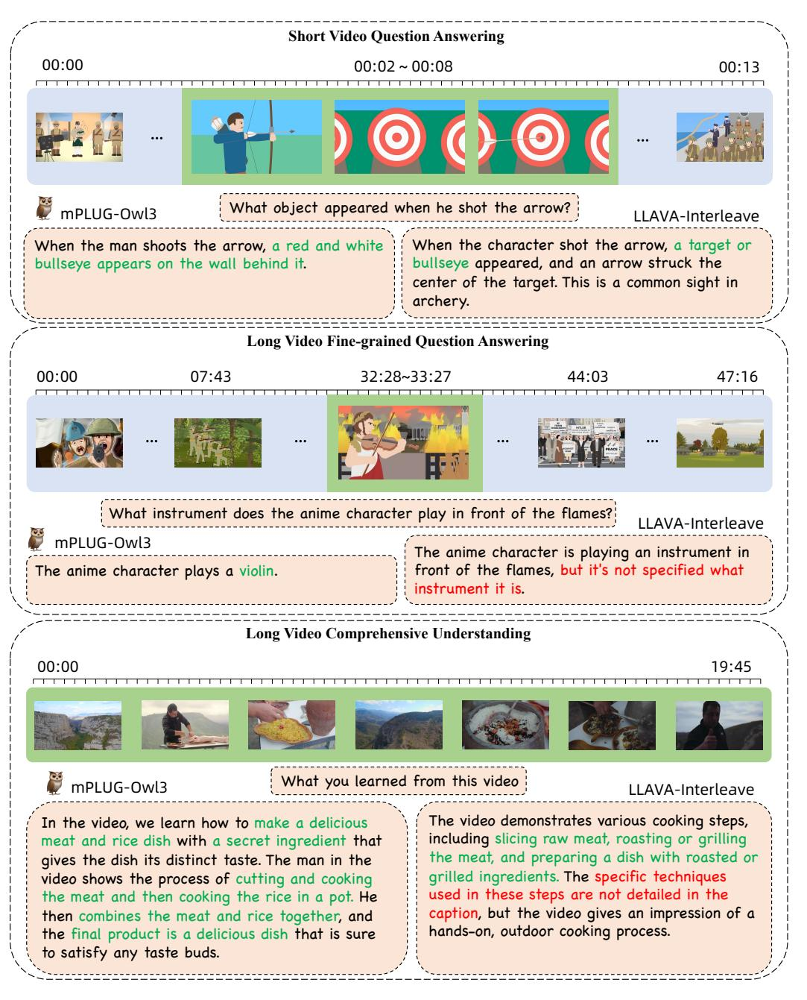
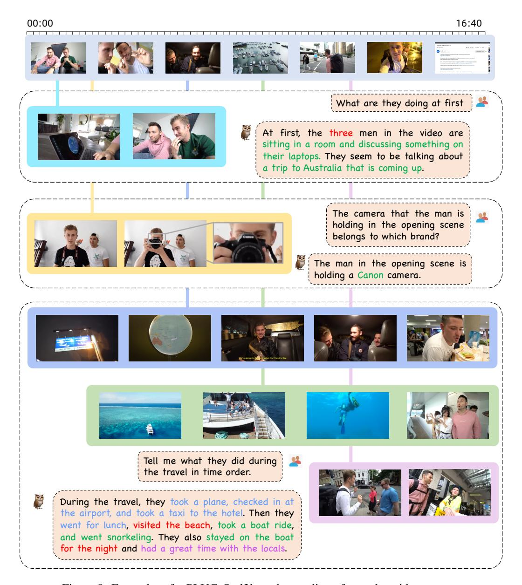

# 5 Related Work

## 5.1 Multimodal Large Language Models

With the development of large language models (LLMs), researchers are exploring the integration of vision and other modalities into LLMs. These multimodal large language models (MLLMs) can perceive visual contents, conduct visual reasoning, and engage in multimodal dialogue with humans.

Based on the way visual features are integrated into language models, MLLMs can be divided into three categories:

- Models like LLaVA [\(Liu et al.,](#page-20-0) [2023a\)](#page-20-0) and CogVLM [\(Wang et al.,](#page-21-9) [2023\)](#page-21-9) use an MLP to map visual features into the representation space of the language model, and directly concatenate them with the text sequence. DeepSeek-VL [\(Lu et al.,](#page-20-15) [2024\)](#page-20-15) employs multiple visual encoders to obtain richer visual representations. While these methods can preserve fine-grained visual information, they consume a large number of tokens which slows down both training and inference.
- To reduce the number of tokens, Mini-GPT4 [\(Zhu et al.,](#page-23-3) [2023\)](#page-23-3), mPLUG-Owl [\(Ye et al.,](#page-22-0) [2023b\)](#page-22-0), and Qwen-VL [\(Bai et al.,](#page-17-3) [2023\)](#page-17-3) adopt a structure similar to Q-Former [\(Li](#page-19-12) [et al.,](#page-19-12) [2023a\)](#page-19-12), compressing the token count to a fixed size through learnable queries and cross-attention with visual features. InternLM-XComposer [\(Zhang et al.,](#page-22-12) [2023\)](#page-22-12) and IDEFICS2 [\(Laurençon et al.,](#page-19-3) [2024\)](#page-19-3) also use the similar method. Models like InternVL [\(Chen et al.,](#page-18-0) [2024d\)](#page-18-0) and InternLM-XComposer-2.5 [\(Zhang et al.,](#page-22-13) [2024b\)](#page-22-13) use patch merge to compress visual tokens by several times. MiniGemini [\(Li et al.,](#page-19-13) [2024b\)](#page-19-13) uses a low-resolution visual representation as a query to compress and aggregate high-resolution

Figure 7: Comparison between mPLUG-Owl3 and LLaVA-Interleave across Short Video Question Answering, Long Video Fine-grained Question Answering, and Long Video Comprehensive Understanding. We highlight the correct and relevant parts of the answers in green, while the parts that fail to answer the question correctly are marked in red. Additionally, the segments of the video that are relevant to the questions are highlighted with a green background.

visual features through cross-attention. These methods can reduce the number of tokens but all suffer from information loss.

• Flamingo [\(Alayrac et al.,](#page-17-0) [2022\)](#page-17-0) first proposed embedding cross-attention layers into the language model, integrating visual features into the intermediate representations of the language model. IDEFICS [\(Laurençon et al.,](#page-19-2) [2023\)](#page-19-2) and EVLM [\(Chen et al.,](#page-18-3) [2024b\)](#page-18-3) have also trained MLLMs based on this structure. This method avoids occupying the

Figure 8: Examples of mPLUG-Owl3's understanding of complex video content

context window of the LLM, saving computational overhead. However, it introduces more parameters and may interfere with the intermediate representations of the pre-trained language models, making the performance of such models often sub-optimal compared to mainstream models.

mPLUG-Owl3 maintains the raw visual features during the multimodal fusion to prevent the information losing. Besides, we propose a light weight module named Hyper Attention to perform cross-attention and self-attention in parallel inside the language models. By sparsely replacing several of the transformer blocks in the Large Language Model with Hyper attention blocks, mPLUG-Owl3 can balance model performance and inference efficiency, achieving state-of-the-art performance in single-image, multi-image, and video understanding, and its inference efficiency far exceeds that of existing models.

## 5.2 Multimodal Models with Interleaved Support

Early-stage models, trained exclusively on single-image inputs, exhibit limitations in image-text interleaved scenario. Recent research are expanding the capabilities of multimodal models to process multiple images inputs.

- Video is a special form of multi-image existence, and MLLMs related to video understanding treat frames as multiple images with temporal correlation as input. VideoChat2 [\(Li et al.,](#page-19-14) [2023b\)](#page-19-14) propose a Global Multi-Head Relation Aggregator to perform temporal message passing and use a Q-former to adapt the feature of video frames into language model. VideoLLaMA2 [\(Cheng et al.,](#page-18-11) [2024\)](#page-18-11) not only reads images but also expands the model's audio comprehension capabilities, ensuring that the information in the video is fully utilized. ShareGPT4Video [\(Chen et al.,](#page-18-12) [2024c\)](#page-18-12) propose to improve the video understanding by introducing GPT-4 annotated video caption as pretrain data.
- In general multimodal dialogue, the model needs to have a more general multi-image understanding capability, including in-context learning, cross image reference, comparison, and reasoning. Flamingo [\(Alayrac et al.,](#page-17-0) [2022\)](#page-17-0) demonstrates limited in-context learning capabilities, while Idefics2 [\(Laurençon et al.,](#page-19-3) [2024\)](#page-19-3) has acquired a broader multi-image understanding ability through multi-image training data. Mantis [\(Jiang et al.,](#page-19-0) [2024\)](#page-19-0) and LLAVA-Interleave [\(Li et al.,](#page-19-4) [2024a\)](#page-19-4) further enhance the model's multi-image understanding capabilities by constructing more refined multi-image understanding datasets.

mPLUG-Owl3 abandons the approach of concatenate visual features to text sequences and instead employs efficient Hyper Attention for multimodal interaction. This not only enhances its capability for understanding multiple images and videos, but also enables it to handle very long visual sequence inputs with low resource overhead.

