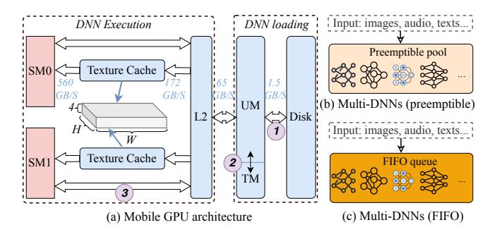
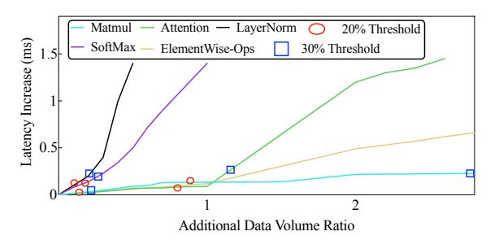
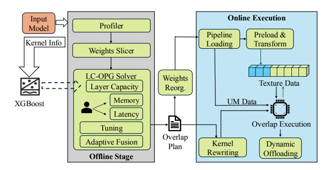
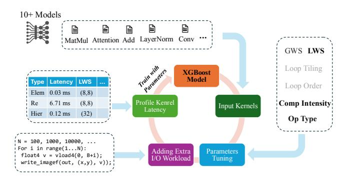
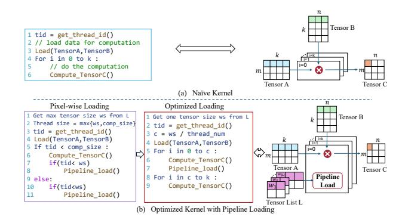
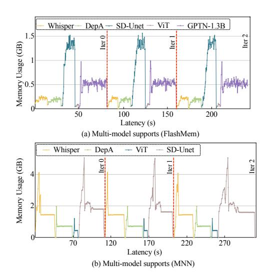
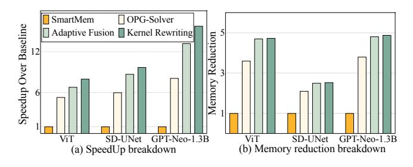
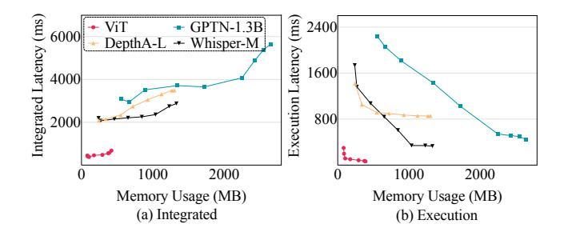
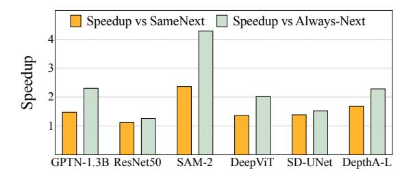
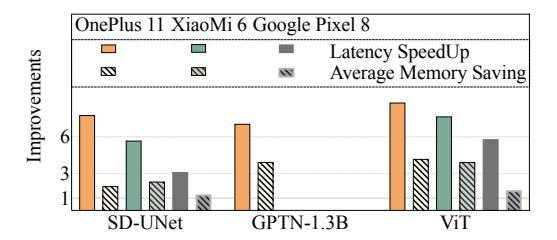

# FlashMem: Supporting Modern DNN Workloads on Mobile with GPU Memory Hierarchy Optimizations

Zhihao Shu Zhihao.Shu@uga.edu University of Georgia Athens, GA, USA

Kunxiong Zhu Kunxiong.Zhu@uga.edu University of Georgia Athens, GA, USA

Md Musfiqur Rahman Sanim musfiqur.sanim@uga.edu University of Georgia Athens, GA, USA

Miao Yin miao.yin@uta.edu University of Texas at Arlington Arlington, TX, USA

> Wei Niu wniu@uga.edu University of Georgia Athens, GA, USA

Hangyu Zheng hyzheng@uga.edu University of Georgia Athens, GA, USA

Gagan Agrawal gagrawal@uga.edu University of Georgia Athens, GA, USA

# Abstract

The increasing size and complexity of modern deep neural networks (DNNs) pose significant challenges for on-device inference on mobile GPUs, with limited memory and computational resources. Existing DNN acceleration frameworks primarily deploy a weight preloading strategy, where all model parameters are loaded into memory before execution on mobile GPUs. We posit that this approach is not adequate for modern DNN workloads that comprise very large model(s) and possibly execution of several distinct models in succession. In this work, we introduce FlashMem, a memory streaming framework designed to efficiently execute large-scale modern DNNs and multi-DNN workloads while minimizing memory consumption and reducing inference latency. Instead of fully preloading weights, FlashMem statically determines model loading schedules and dynamically streams them on demand, leveraging 2.5D texture memory to minimize data transformations and improve execution efficiency. Experimental results on 11 models demonstrate that FlashMem achieves 2.0× to 8.4× memory reduction and 1.7× to 75.0× speedup compared to existing frameworks, enabling efficient execution of large-scale models and multi-DNN support on resource-constrained mobile GPUs.

CCS Concepts: • Computing methodologies → Concurrent computing methodologies; • Computer systems organization → Embedded systems;

[This work is licensed under a Creative Commons Attribution 4.0 Interna](https://creativecommons.org/licenses/by/4.0)[tional License.](https://creativecommons.org/licenses/by/4.0)

ASPLOS '26, Pittsburgh, PA, USA © 2026 Copyright held by the owner/author(s). ACM ISBN 979-8-4007-2359-9/2026/03 <https://doi.org/10.1145/3779212.3790164>

Keywords: Multi-Model Co-running, Machine Learning, Mobile, Memory Management

#### ACM Reference Format:

Zhihao Shu, Md Musfiqur Rahman Sanim, Hangyu Zheng, Kunxiong Zhu, Miao Yin, Gagan Agrawal, and Wei Niu. 2026. Flash-Mem: Supporting Modern DNN Workloads on Mobile with GPU Memory Hierarchy Optimizations. In Proceedings of the 31st ACM International Conference on Architectural Support for Programming Languages and Operating Systems, Volume 2 (ASPLOS '26), March 22– 26, 2026, Pittsburgh, PA, USA. ACM, New York, NY, USA, [15](#page-0-0) pages. <https://doi.org/10.1145/3779212.3790164>

# 1 Introduction

Deep Neural Networks (DNNs) have become an integral part and core enabler of modern AI applications, spanning from virtual assistants [\[12,](#page-12-0) [49,](#page-14-0) [52\]](#page-14-1) to real-time healthcare diagnostics [\[29,](#page-13-0) [45\]](#page-13-1). The demand for on-device DNN execution directly on mobile devices has surged due to the growing concerns over privacy, the need for real-time responsiveness, and the limitations of cloud-dependent processing [\[13,](#page-12-1) [26\]](#page-13-2).

AI-powered mobile applications often rely on multiple models executing in a short span [\[20,](#page-13-3) [54\]](#page-14-2) – for example, a real-time image processing pipeline that involves encoder, detection, and segmentation. This is necessitating support for multi-DNN execution. In parallel, individual model has continued to scale in size and complexity [\[32,](#page-13-4) [44,](#page-13-5) [51\]](#page-14-3). In summary, with emerging application needs, mobile DNN frameworks need to be able to efficiently manage the execution of multiple models, each with substantial (and growing) memory and computation requirements.

Contrary to these requirements, current state-of-the-art mobile DNN frameworks [\[1,](#page-12-2) [4–](#page-12-3)[6,](#page-12-4) [28,](#page-13-6) [31,](#page-13-7) [33,](#page-13-8) [35,](#page-13-9) [37,](#page-13-10) [41\]](#page-13-11) use a preloading strategy that loads the entire model – its weights and computational graph – into memory before starting inference. While this approach improves inference speed

by reducing storage access latency, it also significantly increases peak memory consumption, straining the limited memory resources of mobile hardware [\[13\]](#page-12-1). Table [1](#page-1-0) presents the memory footprint of different DNNs when executed on a OnePlus 12 mobile device using the MNN [\[1\]](#page-12-2) framework. Even for individual models, the memory consumption is substantial, making it almost impossible to support multi-model execution without exceeding system limitations.

Beyond memory constraints, mobile GPUs present additional performance bottlenecks due to their unified memory architecture, where the CPU and GPU share memory but operate in distinct execution spaces. Unlike desktop-class GPUs with dedicated VRAM, mobile GPUs rely on specialized texture memory (and cache) to optimize data access [\[27\]](#page-13-12). Current frameworks perform weight transformations at the computational graph level, leading to redundant data transformations [\[36\]](#page-13-13), excessive GPU kernel launches, and inefficient memory management. These inefficiencies are significantly compounded in multi-DNN workloads, where models frequently swap in and out of memory to accommodate different tasks. As also shown in Table [1,](#page-1-0) GPU initialization overhead (including the data transformation time) can easily dominate the inference latency.

To address these challenges, we propose FlashMem, a memory streaming framework that leverages hierarchical GPU memory optimizations to efficiently support modern DNN workloads and multi-DNN workloads on mobile devices. FlashMem both minimizes memory consumption and reduces inference latency. Unlike existing frameworks that preload entire models into memory, FlashMem streams weights dynamically during inference to keep memory usage within device constraints. Furthermore, it improves data transformations efficiency by leveraging the GPU's texture memory to process weights efficiently, while also overlapping weight loading with computation for better I/O efficiency.

The detailed contributions of FlashMem are as follows:

- Optimized Overlap Plan Generation (OPG): we formalize the OPG problem, which defines when and where each weight should be loaded, and develop LC-OPG, a loadaware solver that minimizes peak memory usage while ensuring efficient execution.
- Load Capacity Profiling and Adaptive Fusion: we classify operators by memory and compute intensity, to determine the load capacity and an adaptive fusion mechanism to balance memory and performance.
- Hierarchical GPU Memory Optimization: we optimize 2.5D texture memory by restructuring weight layouts for efficient caching, reducing transformation overhead, and improving memory efficiency.
- Pipeline-Aware Kernel Execution: we introduce a branchfree, pipelined execution strategy that interleaves computation with weight loading, maximizing GPU efficiency for large-scale DNN inference.

Table 1. Memory usage and latency of various models on the OnePlus 12. "Avg." indicates average memory consumption; "Trans." represents data transformation latency.

|              | # Parameters |       | Memory (MB) | Latency (ms) |        |       |  |
|--------------|--------------|-------|-------------|--------------|--------|-------|--|
| Model        | (M)          | Peak  | Avg.        | Load         | Trans. | Infer |  |
| Whisper [42] | 356          | 4,077 | 1,650       | 2,702        | 3,441  | 1,343 |  |
| GPTNeo [2]   | 164          | 1,026 | 610         | 631          | 2,898  | 337   |  |
| SD-UNet [44] | 860          | 4,858 | 1,800       | 4,159        | 17,588 | 1,647 |  |

Compared to other frameworks such as ExecuTorch [\[41\]](#page-13-11), MNN [\[1\]](#page-12-2), NCNN [\[31\]](#page-13-7), LiteRT (formerly TensorFlow-Lite) [\[6\]](#page-12-4), TVM [\[4,](#page-12-3) [30\]](#page-13-15), and SmartMem [\[36\]](#page-13-13), FlashMem supports overlapping model loading and model execution, optimizing both memory and computation, which enables modern large-scale DNN and multi-model execution. The results demonstrate that FlashMem reduces average memory usage by 2.0 × to 8.4× memory reduction on all evaluated models, and up to 10.1× on certain models like DeepViT. Compared to Smart-Mem, FlashMem achieves an average speedup of 8.6×, with up to 15.8× acceleration for GPT-Neo 1.3B and 9.3× for SD-UNet, while maintaining a better trade-off between memory efficiency and inference latency. FlashMem also achieves 1.7× to 75.0× speedups compared to all state-of-the-art methods.

# 2 Background and Motivation

## 2.1 GPU Memory Hierarchy on Mobile Platforms

Mobile GPUs typically use a hierarchical memory organization that includes unified memory (UM) and texture memory (TM). Given the significant resource requirements of executing DNNs, optimizing for this memory hierarchy is important. As a background, the size of a deep neural network is largely determined by its weight tensors, which consume most of the model's storage footprint. Figure [1](#page-2-0) (a) illustrates the multi-step path to transfer these weights from disk to UM ( 1 ), moving through UM to TM ( 2 ), and executing on SM (streaming multiprocessor 3 ). Modern mobile GPUs (e.g., ARM Mali and Qualcomm Adreno) overlap compute with memory transfers by using independent command queues.

The texture memory subsystem is specifically designed for a two-dimensional layout with a dedicated cache to exploit 2D spatial locality. This specialized memory organization is known as 2.5D texture memory. Unlike conventional one-dimensional memory, which flattens tensor dimensions into a linear sequence, the 2.5D approach reorganizes multidimensional tensors into small two-dimensional tiles with limited depth – typically four channels or scalar elements (see Figure [1](#page-2-0) (a)). Romou [\[27\]](#page-13-12) has demonstrated that texture memory can accelerate DNN execution by up to 3.5× speedup over unified-memory-based approaches. SmartMem [\[36\]](#page-13-13) optimizes 2.5D memory layouts by systematically eliminating costly layout transformations (e.g., Reshape, Transpose).

**Figure 1.** Left (a) shows the hierarchical memory structure and bandwidth on mobile GPUs, highlighting the multi-step weight transfer path from disk to streaming multiprocessors. Right (b and c) depicts two multi-DNN support strategies.

This approach has proven particularly effective for Transformer architectures on mobile GPUs, yielding significant speedups in inference. Despite these gains, loading the weights from disk into the GPU texture still involves inefficiency of intermediate copies, each step incurring overhead and memory demands [21, 27].

## 2.2 Demands for Multi-model Support on Mobile

Mobile workloads often execute multiple models [20, 55], rather than relying on a single DNN that is persistently stored and executed. As shown in Figure 1 (b) and (c), two representative approaches for multi-DNN usage on mobile devices are *FIFO* [54, 55] and *preemptive* [14, 20] scheduling. FIFO scheduling employs a sequential design where multiple models are queued and executed sequentially until all requests are fulfilled. Preemptive solutions permit a high-priority model to interrupt or replace a lower-priority model during execution, which can be valuable for time-sensitive applications, but are not the focus of our study.

Some of the concrete motivating scenarios for FIFO-style execution are as follows. In camera-based augmented reality, an object detection DNN (e.g., ResNet [16]) might run briefly to identify key objects in the scene, then a separate model checks for user actions [2] or performs depth analysis [59], each triggered only occasionally. Another scenario appears in user-facing translators that chain small, specialized models – such as a speech recognition [42] model followed by other actions with the recognized text, e.g., image generation [44].

In each of the above scenarios, we face the following challenges. Storing all models fully in GPU memory simultaneously would be infeasible for large sets (or large-scale) of DNNs. Executing them one-by-one via a simple FIFO strategy, on the other hand, avoids memory contention but has large overhead, since each model needs to load from disk and convert its weights into texture-based layouts before execution. This paper addresses such FIFO multi-DNN pipelines by mitigating repeated load and layout transition overhead, providing faster

**Figure 2.** Latency increase (ms) across different operators on mobile GPUs due to additional data transformations. The X-axis shows the ratio of additional data loaded compared to the original kernel input (e.g., 1.0 indicates an equal amount of extra data is streamed alongside computation). Threshold markers show where latency overhead reaches 20% and 30% of the original kernel.

inference across a series of distinct models, none of which is invoked for inference a large number of times in succession.

## 2.3 An Experiment Motivating Our Design

Overlapping data movement with kernel execution not only hides transfer latency but can also help limit the overall memory footprint. Staging weights or intermediate tensors in small increments and streaming them into GPU texture memory as needed helps reduce peak memory usage in multimodel pipelines. However, effectively interleaving data transformations with kernel arithmetic requires an understanding of how different kernels respond to an overlapping operation. Figure 2 shows a preliminary study that measures the increase in latency of each kernel when forced to perform additional data transfers in parallel. Softmax and LayerNorm, for instance, exhibit substantial slowdowns even at modest transfer volumes, indicating limited opportunities for effective overlap. Element-wise operators (e.g., Activation, Add) allow larger data streams before latencies approach the overhead of a dedicated copy call, while Matmul tolerates more significant data inflow with relatively small latency increases. This experiment shows that a careful formulation and solution is needed to effectively overlap data movement with computations.

# 3 Generating a Data Movement Schedule

#### 3.1 Problem Formalization of OPG

We first formalize the Overlap Plan Generation (OPG) problem and reduce it to the Constraint Programming Satisfiability (CP-SAT) [39] problem. Later, we integrate Google OR-Tools [39] – an open-source software suite for combinatorial optimization, to solve our overlap planning problem.

A Deep Neural Network (DNN) is represented by a directed acyclic graph (DAG) G = (V, E), where each node (operator or layer, used interchangeably)  $v \in V$  consumes

**Table 2.** Summary of the key notations and symbols.

| Symbol                       | Description                                                                                                                                  |
|------------------------------|----------------------------------------------------------------------------------------------------------------------------------------------|
| $W$ $z_w$ $x_{w,\ell}$ $i_w$ | Weights to preload  Earliest layer loading $w$ to unified memory  Chunks of $w$ transformed at layer $\ell$ Layer index consuming weight $w$ |
| $C_{\ell}$ $M_{peak}$ $T(w)$ | Load Capacity (max load at layer $\ell$ ) Peak memory limit for transformations Total chunks for weight $w$                                  |
| $\lambda, \mu$ $\alpha$      | Penalty terms (preload/distance) Threshold for splitting fused operators                                                                  |

and produces tensors or *weights*. An edge  $(u,v) \in E$  indicates that the output weight of layer u is used by the layer v. The actual order of execution of the operators (determined in some fashion outside the scope of our work) imposes a linear order of execution of  $\{1,2,\ldots,N\}$ . For simplicity of presentation, it is assumed that each node produces exactly one weight or tensor, which can also be numbered  $\{1,2,\ldots,N\}$ . Let  $i_w$  denote the earlier layer that consumes the weight w. We actually consider two separate problems, driven by the need to reduce the use of unified memory, and for addressing a hard limit on the amount of texture memory. The key notations and symbols we used in this section are summarized in Table 2.

# **3.1.1 Unified Memory Usage** . Focusing on unified memory usage, the OPG *decision variables* are as follows:

• *W*: The set of weights that will be loaded from disk to unified memory and transformed by specialized dataloading kernels before the actual DNN execution.

**Interpretation:** Usually the first few operators do not have preceding layers to load and transform their weights, so their weight tensors must be in the set W. Thus, to meet all constraints, we can selectively put additional weights into the set W. However, additional weights in the set W increase the data loading time for the model and potentially the memory usage as well during the execution of initial layers.

 zw ∈ {1,2,...,N}: Index of the earliest layer that loads the weight w from disk to unified memory.

**Interpretation:** This set of decision variables is associated with *loading distance*, which is the difference  $i_w - z_w$  that captures how many layers in advance the weight w is loaded into unified memory. Note that once a layer initiates loading weights, these weights must be fully loaded from disk and remain in unified memory until their last use. *If*  $i_w - z_w$  *is small*, weight w is loaded closer to its first consumption, reducing memory footprint but potentially risking concurrency with compute-intensive steps. *If*  $i_w - z_w$  *is large*, weight w is loaded earlier, which might mitigate concurrency for consumption but raises

the overall memory footprint due to prolonged residency. Including the loading distance in our objective function and constraints allows us to explicitly balance timely data availability with the total memory footprint.

Our solver chooses the above values subject to our objective function.

**Objective Function.** We minimize:

$$\lambda \times W + (1-\lambda) \sum_{w} (i_w - z_w)$$

where:

- The total memory usage of the preloaded weights before inference is reflected in *W*.
- $(i_w z_w)$  is the loading distance for weight w the corresponding term penalizes extended residency.
- λ is a term that establishes the weight of preload overhead and loading distance.

**3.1.2 Texture Memory Constraints.** For a fine-grained control of the weights transforming process (from unified memory to texture memory), we split each weight w into chunks with a uniform chunk size of S. Let T(w) denote the number of chunks of size S that the weight w is partitioned into. Now, the decision variable we have here is  $x_{w,\ell} \in \{0,1,\ldots,T(w)\}$ : the number of chunks in weight w that will be transformed (from unified memory to texture memory) by the layer  $\ell$ . Larger values for the variable  $x_{w,\ell}$  for initial layers imply that more data is transformed early, potentially increasing memory usage, but also ensuring timely data availability. Conversely, smaller values preserve memory but risk idle time with later computations.

**Constraints.** Let L(w) represent the set of layer indices that load at least one chunk of weight w. Each layer  $\ell \in L(w)$  has the constraint:

$$L(w) = \{ n, n+1, ..., m \mid m \ge n > 0, i_w > m \ge 1 \},$$

Note that the indices from n to m are not required to be continuous; layers within this range can be selectively chosen based on scheduling constraints. Each selected layer index falls within the range  $\{1, 2, ..., i_w - 1\}$ .

**(C0)** *Completeness of Allocation:* 

$$\sum_{\ell \in L(w)} x_{w,\ell} = T(w), \quad \forall w.$$

**(C1)** Loading Distance Implication:

$$(x_{w,\ell} \ge 1) \Rightarrow (z_w \le \ell), \quad \forall w, \forall \ell \in L(w).$$

If the weight w is partially assigned to the layer  $\ell$ , the earliest load index cannot exceed  $\ell$ .

**(C2)** Layer Transformation Memory Limit:  $M_{\text{peak}}$  is an integer variable that limits the total in-flight memory (spanning weights in both unified and texture memory) allowed during execution; and as stated earlier, S is the size of one chunk.

$$\sum_{w:\,I(w)>\ell} x_{w,\ell}\times S \qquad \qquad \leq M_{\rm peak}, \quad \forall \, \ell.$$

Total chunks memory transformed by layer l

*CP-SAT Reduction.* By mapping the chunk allocations  $(x_{w,\ell})$  and earliest load indices  $(z_w)$  to integer variables, along with logical constraints (e.g.,  $(x_{w,\ell} \ge 1) \Rightarrow (z_w \le \ell)$ ), the OPG problem can be reduced to the well-known existing optimization problem: CP-SAT.

## 3.2 Load Capacity Aware OPG-Solver

We introduce a Load Capacity ( $C_{\ell}$ ) Aware Overlap Plan Generation (LC-OPG) Solver, with tailored constraints for weight loading and transformation scheduling.  $C_{\ell}$  represents the maximum number of byte chunks that layer  $\ell$ can concurrently transform from unified memory to texture memory without incurring significant overhead. For a general DNN DAG, we can define the CP-SAT model in Google OR-Tools [39] as follows. First, we create integer variables for each  $x_{w,\ell}$  and  $z_w$ , put the weights of the first layer in W and enforce constraints (0)–(2). If any layer violates the constraint (C2) by chunk allocations, a fallback mechanism puts the weight, which takes the most memory that will be loaded by this layer, to W, then re-runs until generating the full plan. Upon convergence, the resulting allocations specify the layer-weight preload assignments, including a mapping that specifies which weight segments will be preloaded from unified memory to GPU texture memory, along with their corresponding start and end offsets. The solver targets the memory lifetime directly and runs offline for each model prior to deployment, generating a reusable overlap plan that incurs no runtime overhead during inference. This overlap plan serves as a guide for runtime scheduling, enabling the effective overlap of data transformations with computation, which in turn minimizes the memory footprint while maintaining performance.

However, the CP-SAT solver [39] operates in an explosive combinatorial search space, making naive scheduling infeasible within practical runtime limits. To reduce search complexity, we introduce a set of structured constraints: (C3) Layer Load Capacity Constraint

$$\sum_{w \in W_{\ell}} x_{w,\ell} \le C_{\ell}, \quad \forall \ell \in \{1, \dots, N\}$$
 (1)

Prevents exceeding the predicted  $C_{\ell}$  for each layer.

**(C4)** *Dynamic Load Thresholding* If layer  $\ell$  exceeds its capacity  $C_{\ell}$ , we apply a **fallback strategy**:

- **Soft Thresholding:** Dynamically adjusts  $C_{\ell}$  based on available memory.
- Weight Prioritization: Prefers to load weights closer to execution while delaying others.

Elaborating on C4, if the CP-SAT solver fails to find a feasible schedule due to strict constraints or memory overuse,

**Table 3.** Comparison of Google CP-SAT and Our LC-OPG Solver: "A.P.M.C." for Adaptive Peak Memory Control, "P.L.D.S." for Per-Layer Dynamic Scheduling, and "M.O.C." for Memory, Overlap, and Compute Load.

| Feature                 | Google CP-SAT | Our LC-OPG Solver  |
|-------------------------|---------------|--------------------|
| Memory Constraints      | Static limits | A.P.M.C.           |
| Load Capacity Awareness | Not included  | P.L.D.S.           |
| Solver Convergence      | May fail      | Fallback mechanism |
| Objective Function      | Generic       | Balances M.O.C.    |

we incorporate a structured fallback strategy to ensure convergence of the solution . First, a *soft threshold adjustment* dynamically relaxes the load capacity constraint  $C_\ell$ , allowing minor deviations to accommodate weight transformations that are critical for execution. If a feasible schedule remains unreachable, the solver applies *incremental preloading*, where selected weight tensors are preloaded ahead of time to reduce scheduling complexity. Finally, if the problem persists, the solver switches to a *greedy heuristic backup*, which prioritizes memory-efficient weight allocations while maintaining overlap as much as possible. This tiered fallback mechanism prevents excessive computational overhead and guarantees a solution within practical runtime limits.

Table 3 compares our updated solver aided by our fallback strategy and per-layer scheduling with the original Google CP-SAT solver. The determination of the load capacity will be discussed in the next subsection.

Implementation Considerations. Our solver is implemented using Google OR-Tools [39] with multiple optimizations tailored to minimize search complexity and execution overhead. To prevent excessive memory footprints, we employ an *incremental scheduling* approach, which processes weight transformations in a rolling window. This mechanism gradually builds the overlap plan by updating scheduling decisions as new layers in the computational graph activate and earlier ones complete. It maintains a manageable number of active constraints, ensuring predictable solver runtime.

Additionally, the solver incorporates profile-guided adjustments, dynamically updating  $C_\ell$  based on real-time profiling of execution behavior and available memory. This adaptive approach enables more informed decision making and mitigates the risk of scheduling conflicts. Lastly, we introduce a hybrid execution mode that seamlessly switches between CP-SAT and heuristic scheduling based on workload conditions. If the solver returns an infeasible solution or only finds a feasible (but not optimal) solution after exceeding the time limit, the system falls back to heuristic strategies to ensure timely execution. These fallback mechanisms enhance the robustness and scalability of the LC-OPG solver for real-world DNN deployment.

To validate convergence, we evaluate the solver for different models on a workstation with 512 GB of DRAM and an

**Table 4.** Execution time breakdown for the evaluated models (constrained by a 150-second solver limit).

| Model      | Process nodes (s) | Build CP-SAT model (s) | Solve model (s) | Solver Status |
|------------|----------------------|---------------------------|--------------------|------------------|
| GPTN-S     | 0.010                | 0.260                     | 45.00              | OPTIMAL          |
| GPTN-1.3B  | 0.020                | 1.170                     | 121.00             | <b>FEASIBLE</b>  |
| GPTN-2.7B  | 0.050                | 1.980                     | 121.00             | FEASIBLE         |
| ViT-8B     | 0.001                | 4.110                     | 121.40             | FEASIBLE         |
| Llama2-13B | 0.007                | 3.566                     | 124.80             | FEASIBLE         |
| Llama2-70B | 0.023                | 14.456                    | 136.38             | FEASIBLE         |

AMD 5995WX CPU (128 threads). Table 4 presents a runtime comparison. We empirically set a 150-second time limit to balance solution quality and analysis cost, as LC-OPG consistently converges to feasible or near-optimal plans within this timeframe. A potential corner case we observed is for dynamic neural networks, where runtime-dependent execution paths can increase solver time due to the need to explore multiple possible execution branches. We leave this as a future work since it is out of the scope in this paper. It is important to note that the runtime cost increases non-linearly with model size. This is due to the solver's constraints, which prune infeasible regions using load-capacity thresholds and incremental scheduling.

Hyperparameters Considerations And Adaptivity. In order to achieve the optimal performance under defined memory limits, the solver must carefully balance runtime memory during inference and memory usage at initialization.  $M_{peak}$ , introduced earlier, sets an upper bound of how much memory we can use at any DNN layer during inference, but does not include the memory used by the persistent weights that have already loaded and transformed at initialization. Therefore, the combined memory usage of the persistent weights W and  $M_{peak}$  defines our peak and stable memory footprint.

Our hyperparameters also allow for prioritizing memory usage over execution time or vice-versa. To reduce memory requirements, we should preload as few weights as possible, since overlapping gives us a fine-grained control of weights instead of loading them all at once. On the other hand, if the goal is to reduce the latency for execution (after start of execution), we should preload as many as possible, since it reduces workload for each kernel. A higher preload ratio can be achieved by increasing  $M_{peak}$  – this also reduces the problem complexity so that the solver can easily converge. On the other hand, to lower the preload ratio, we should set smaller  $M_{peak}$ . Empirically, for memory priority, we set  $M_{peak}$  as 500 MB, where  $\lambda$  is set close to 0.9.

Figure 3. Overview of FlashMem.

## 4 Design of FlashMem

### 4.1 System Overview of FlashMem

FlashMem builds on an existing end-to-end DNN execution framework SmartMem [36], leveraging its operator-level layout transformations while adding specialized modules for overlap planning, kernel rewriting, and adaptive fusion. Figure 3 illustrates the overall workflow. We begin by parsing the DNN model to identify each layer's structure and then use capacity-based predictions (Section 4.2) to estimate how much additional data each layer can load without causing significant slowdown. The CP-SAT solver described in previous section then produces an overlap plan that schedules weight-loading tasks. When global constraints (i.e., C0-C4) fail, certain large fused operators may be selectively unfused to ensure sufficient load capacity (Section 4.3). Next, with the overlap plan in place, we rewrite each GPU kernel (Section 4.4) to embed data loading operations within its computation - the goal is to interleave arithmetic operations with continuous, vectorized data reads, maximizing GPU utilization and avoiding branch divergence.

# 4.2 Determining Load Capacity

To assess the load capacity of various operators, we first classify them based on their memory bandwidth usage, tolerance for load capacity, and computational intensity. We identify three types of operations as summarized in Table 5

- Elemental operators (e.g., Elementwise, Activation) typically rely on linear memory accesses and minimal internal dependencies. They are often memory-bound but allow for moderate concurrency in terms of data-loading tasks, given their simpler arithmetic footprint.
- Reusable operators (e.g., Conv, MatMul) exhibit structured data reuse and multi-dimensional computational patterns (e.g., loop tiling). They can accommodate high overlaps in data loading, while their higher arithmetic complexity necessitates careful resource allocation.
- Hierarchical operators (e.g., Softmax, LayerNorm) involve intricate, stepwise computations and synchronizations, leaving limited bandwidth for concurrent data movement.

In our work we adopt a lightweight profiling-based method that strategically samples execution scenarios to estimate load capacity with minimal overhead. We train an XGBoost regression model [3] to predict execution latency under varying additional loads (as shown in Figure 4). The model guides our CP-SAT solver (Section 3.1) by determining per-layer load capacity thresholds that ensure minimal performance degradation. Specifically, we set distinct thresholds based on operator sensitivity and baseline latency characteristics: 0% for hierarchical operators, 20% for reusable operators, and 300% for elemental operators. Hierarchical operators are particularly sensitive to additional data loading and have relatively high baseline kernel latencies; thus we do not use this type of OPs to perform overlapping. Elemental operators, however, exhibit minimal latency growth under additional loading, and due to their inherently low baseline latency, they accommodate a significantly higher threshold without substantial performance impact. Reusable operators have the highest original kernel latency, but also the slowest relative latency growth with increased data loading, thus justifying an intermediate threshold.

#### 4.3 Adaptive Fusion Strategy for OPG

**Fusion-Compute-Memory Trade-off.** In various frameworks that execute DNN, operator fusion is often a key optimization [34]. While operator fusion reduces kernel launch overhead and intermediate memory (aligning with our  $M_{\text{peak}}$  minimization objective in Section 3.1), overly aggressive fusion contradicts the layer-wise load capacity constraints ( $C_{\ell}$  in Constraint C3). Fusing multiple layers into a single kernel reduces the number of synchronization boundary where data loading could otherwise interleave with computation. Specifically, fusing k operators into a single kernel reduces the number of distinct execution stages available for scheduling data movement from k down to 1, shrinking the combined load capacity to  $C_{\text{fused}} \approx \min(C_1, \ldots, C_k)$  instead of  $\sum C_i$ . This directly impacts our CP-SAT solver's ability to distribute weight chunks across layers, as formalized by:

$$\sum_{\ell \in L(w)} x_{w,\ell} \le \sum_{\ell} C_{\ell} \quad \text{(Total chunk capacity)}$$

Over-fusing shrinks the right-hand side, forcing more weights into preloading factor (W) in our objective function. We quantify this factor n through *fusion penalty scores* derived from the solver's residual capacity:

Penalty(
$$v_{\text{fused}}$$
) =  $\lambda |W_{\text{new}}|$  +  $\mu \Delta z_w$ 
Preload cost Distance penalty

where  $v_{\text{fused}}$  is a fused kernel node in DAG G,  $W_{\text{new}}$  are the weights forced into preload due to fusion and  $\Delta z_w$  is the increased loading distance for the affected weights.

**Table 5.** Operator classification and load capacity characteristics for representative operators: "M.B." indicates memory bandwidth, "L.C." denotes load capacity, and "C.I." represents computational intensity.

| Operator Type                                       | M.B.           | L.C. Tolerance | C.I.           |
|-----------------------------------------------------|----------------|----------------|----------------|
| Elemental (ReLU, Add)                               | Low            | Medium         | Low            |
| Reusable (Conv, MatMul) Hierarchical (LayerNorm) | Medium High | High Low    | High Medium |

**Figure 4.** Profiling operators from more than ten models. We systematically adjust key parameters in our framework to measure kernel latency changes. The collected data is then used to train our XGBoost-based regression model for accurate latency prediction. Global Work Size (GWS) and Local Work Size (LWS) determine workload distribution and thread partition, respectively.

**Adaptive Fusion Triggering.** When the solver detects residual capacity violations, it triggers our fusion-aware adjustment protocol: ① *Identify Critical Fusions:* Rank fused kernels by Penalty( $v_{\text{fused}}$ ) and select top candidates. ② *Split Feasibility Check:* Verify if splitting  $v_{\text{fused}}$  into subkernels  $\{v_1, v_2\}$  preserves DAG dependencies while satisfying:

 $C_{v_1} + C_{v_2} \ge (1 + \alpha)C_{v_{\text{fused}}}$  ( $\alpha > 0$  is capacity gain threshold) ③ *Iterative Refinement:* Update G by replacing  $v_{\text{fused}}$  with  $\{v_1, v_2\}$ , then re-invoke the CP-SAT solver with adjusted L(w) and  $C_\ell$ .

**Operator-Specific Splitting.** Guided by our operator classification (Table 5), we apply targeted splitting rules to restore scheduling flexibility. Here are two representative examples of the rules : ① Reusable + Elemental Fusions: Split into elemental (medium  $C_\ell$ ) and reusable (high  $C_\ell$ ) subkernels, e.g., Decompose "MatMul+Add+GeLU" into "MatMul+Add" (reusable) and "GeLU" (elemental), gaining  $C_{\text{total}} = C_{\text{reusable}} + C_{\text{elemental}}$ . ② Hierarchical Fusions: Retain intact due to their low tolerance  $C_\ell$  and synchronization requirements.

This strategy directly feeds into the layer capacity model (Section 3.2)–splitting a fused layer v into  $\{v_1, v_2\}$  increases schedulable load capacity by  $C_{v_1} + C_{v_2} - C_v$ , allowing more  $x_{w,\ell}$  allocations and reducing preloads.

## 4.4 Kernel Rewriting For Texture-optimized Layouts

To further optimize GPU 2.5D texture memory performance, we design a kernel rewriting scheme that customizes data layout and removes control-flow divergence.

Pipelined Computation and Branch Divergence Elimination. We introduce a kernel template that interleaves arithmetic operation with texture-based weight loading and removes conditional branches in the process. A naive approach to interleaving compute and load often introduces conditional checks (for instance, to decide whether a thread should load data or perform computation), but such checks cause warp-level branch divergence and reduce SIMT efficiency. We avoid this by restructuring the loop to enforce a uniform load–compute schedule. Each iteration starts by prefetching the next tile's weights, then proceeds to compute the current tile without branch divergence. When the pipeline is fully engaged, each iteration hides memory stalls from the newly issued loads behind the arithmetic of the prior iteration. The kernel concludes with a final loop pass that resolves any leftover arithmatic operations.

Figure [5\(](#page-7-1)a) depicts a baseline matrix multiplication kernel where threads individually load TensorA and TensorB, then compute MAC (multiply-accumulate) outputs. In contrast, Figure [5\(](#page-7-1)b) incorporates a fine-grained pipeline that alternates between partial compute and weight prefetches for the next block of Tensor L. As soon as one block's MAC updates begin, the kernel schedules load instructions for the following block so that memory fetch latency overlaps with arithmetic on the current data.

This loop restructuring eliminates conditional logic and ensures that all threads follow the same execution path. Meanwhile, the pipeline mechanism matches the memory load phases with the MAC phases, preventing idle cycles. By aligning offline 2.5D tiling with a branch-free pipelined kernel, we achieve continuous data movement, effective latency hiding, and higher arithmetic utilization, thereby improving overall inference throughput on GPU texture architectures.

To reduce the engineering effort required to rewrite GPU kernels for each model, FlashMem utilizes a template-based kernel rewriting approach [\[22\]](#page-13-20). Each DNN is represented as a computational graph made up of standard operators (e.g., MatMul, Softmax, Activation). We create reusable kernel templates using the Jinja library [\[22\]](#page-13-20), which integrate the previously mentioned branch-free, pipelined weight loading directly into the computation. During deployment, the overlap plan specifies the loading timing for each operator, allowing the appropriate kernel template to be automatically instantiated from the computational graph without the need for model-specific code.

# 5 Evaluation

FlashMem is built on top of an existing end-to-end DNN execution framework on mobile GPUs named SmartMem [\[36\]](#page-13-13).

Figure 5. Comparison of a naive Matrix Multiplication kernel with the rewritten kernel integrated with weight loading.

This section evaluates FlashMem against other state-of-theart frameworks across multiple dimensions, including latency, memory usage, and energy consumption. Specifically, the evaluation has the following 5 key objectives: 1) demonstrating FlashMem's effectiveness in terms of latency and memory consumption compared to existing frameworks; 2) emphasizing the advantages of FlashMem in supporting large-scale models and enabling efficient multi-model execution, 3) understanding the benefits of proposed optimizations through detailed breakdown studies; 4) evaluating the power and energy consumption with different models; and 5) validating portability of FlashMem across devices.

## 5.1 Experimental Setup

Models, Datasets, and Accuracy. To evaluate FlashMem, we conduct experiments on 11 models that cover six representative mobile application tasks: NLP, image classification, image segmentation, image generation, speech recognition, and video segmentation. A detailed comparison of the characteristics of the model is provided in Table [6,](#page-8-0) including the target task, the number of parameters, the total number of layers, and the number of multiply-accumulate operations (MACs). The abbreviation column is used to refer to each model in the following sections. Depending on the target task, the models are trained on the ImageNet [\[7\]](#page-12-8) dataset (for image classification and segmentation), the LibriSpeech [\[38\]](#page-13-21) dataset (for speech recognition), the datasets mentioned in the original DepthAnything paper [\[59\]](#page-14-5) (for image segmentation), the Pile [\[11\]](#page-12-9) dataset from EleutherAI (for NLP task) and the LAION-5B [\[46\]](#page-13-22) dataset (for image generation). Since all frameworks use the same pre-trained model and repeated trials confirm the same accuracy, we only report inference performance on mobile devices.

Baselines. We compare FlashMem with the state-of-the-art mobile DNN frameworks – LiteRT [\[6\]](#page-12-4) (TFLite a32930a7), ExecuTorch [\[41\]](#page-13-11) (ETorch 967e3b99), MNN [\[1\]](#page-12-2) (daa62c77), NCNN [\[31\]](#page-13-7) (d395000e), and TVM [\[4\]](#page-12-3) (89f9573d). We do not include frameworks like FlexNN [\[26\]](#page-13-2) and llama.cpp [\[5\]](#page-12-10) in this comparison because they do not currently support the

Table 6. Model characterization for evaluated models across different input types and tasks. "Abbr." is used to refer to each model in Evaluation sections. "# MACs" represents the number of multiply-accumulate operations. "# Layers" refers to the number of low-level operator nodes (e.g., MatMul, Activation) after graph lowering, instead of the high-level model blocks.

| Model                       | Abbr.     | Input Type | Model Task         | # Params (M) | # MACs (G) | # Layers |
|-----------------------------|-----------|------------|--------------------|--------------|------------|----------|
| GPTNeo-Small [2]            | GPTN-S    | Text       | NLP                | 164          | 16         | 606      |
| GPTNeo-1.3B [2]             | GPTN-1.3B | Text       | NLP                | 1,419        | 170        | 1,110    |
| GPTNeo-2.7B [2]             | GPTN-2.7B | Text       | NLP                | 2,781        | 342        | 1,446    |
| ResNet50 [17]               | ResNet    | Image      | Classification     | 25.6         | 4.1        | 141      |
| SegmentationAnything-2 [43] | SAM-2     | Image      | Segmentation       | 215          | 218        | 1,668    |
| ViT [8]                     | ViT       | Image      | Classification     | 103          | 21         | 819      |
| DeepViT [8]                 | DeepViT   | Image      | Classification     | 204          | 42         | 1,395    |
| StableDiffusion-UNet [44]   | SD-UNet   | Image      | Generation         | 860          | 78         | 1,271    |
| Whisper-Medium [42]         | Whisp-M   | Audio      | Speech Recognition | 356          | 55         | 2,026    |
| DepthAnything-Small [59]    | DepA-S    | Video      | Segmentation       | 24.3         | 14         | 1,108    |
| DepthAnything-Large [59]    | DepA-L    | Video      | Segmentation       | 333          | 180        | 2,007    |

Table 7. Overall latency consumption comparison. "–" means the model is not supported. Speedup refers to the latency (Init + Exec) of other frameworks over FlashMem (Integrated). Since FlashMem considers the initialization and execution as a whole, we only report integrated latency. Solver is running offline, which is not included here.

| Model     | MNN (ms) Init | Exec  | Init  | NCNN (ms) Exec | Init  | TVM (ms) Exec | Init  | LiteRT (ms) Exec | Init  | ETorch (ms) Exec | SMem (ms) Init | Exec | Ours (ms) Integrated | Speedup† | Speedup‡ |
|-----------|------------------|-------|-------|-------------------|-------|------------------|-------|---------------------|-------|---------------------|-------------------|------|-------------------------|----------|----------|
|           |                  |       |       |                   |       |                  |       |                     |       |                     |                   |      |                         |          |          |
| GPTN-S    | 3,529            | 337   | –     | –                 | 5,832 | 621              | –     | –                   | 277   | 5,869               | 4,757             | 59   | 577                     | 8.4×     | 9.3×     |
| GPTN-1.3B | –                | –     | –     | –                 | –     | –                | –     | –                   | 5,178 | 515,291             | 48,109            | 501  | 3,086                   | 15.8×    | 169×     |
| GPTN-2.7B | –                | –     | –     | –                 | –     | –                | –     | –                   | –     | –                   | –                 | –    | 7,567                   | –        | –        |
| ResNet50  | 1,751            | 22    | 1,341 | 28                | 524   | 56               | 573   | 34                  | 65    | 10,302              | 1,470             | 33   | 473                     | 3.2×     | 3.3×     |
| SAM-2     | –                | –     | –     | –                 | –     | –                | –     | –                   | 1,178 | 857,752             | 9,983             | 826  | 1,267                   | 8.5×     | 678×     |
| ViT       | 2,550            | 476   | –     | –                 | 3,527 | 841              | 711   | 91                  | 90    | 6,671               | 3,675             | 73   | 347                     | 10.8×    | 8.4×     |
| DeepViT   | 4,345            | 883   | –     | –                 |       | 6,243 1,665      | 1,013 | 254                 | 298   | 60,656              | 7,699             | 190  | 785                     | 10.0×    | 9.6×     |
| SD-UNet   | 21,747 1,647     |       | –     | –                 | –     | –                | –     | –                   |       | 7,692 1,056,869     | 29,588            | 312  | 3,212                   | 9.3×     | 49.1×    |
| Whisper-M | 6,143            | 1,343 | –     | –                 |       | 7,256 2,157      | –     | –                   | –     | –                   | 15,066            | 336  | 1,565                   | 9.8×     | 5.4×     |
| DepthA-S  | 2,492            | 588   | –     | –                 | 2,012 | 487              | –     | –                   | –     | –                   | 2,200             | 71   | 496                     | 4.6×     | 5.6×     |
| DepthA-L  | 6,267            | 1,784 | –     | –                 |       | 6,988 1,917      | –     | –                   | –     | –                   | 18,567            | 807  | 1,382                   | 14.0×    | 6.1×     |
| Geo-Mean  | 6.1×             |       |       | 2.9×              |       | 6.2×             |       | 1.7×                |       | 75×                 | 8.6×              |      | 1.0×                    | N/A      | N/A      |

† : geo-mean speedup over SmartMem (a precursor research prototype).

models tested on mobile GPUs. Our comparison also included the precursor research prototype, SmartMem [\[36\]](#page-13-13).

Target Mobile Devices. Our evaluation considers four smartphones that span a broad range of computational resources: the OnePlus 12, OnePlus 11, Xiaomi Mi 6, and Google Pixel 8. The OnePlus 12 integrates an Adreno 750 GPU and 16 GB of RAM; the Google Pixel 8 incorporates a Mali-G715 MP7 GPU and 8 GB of RAM; the OnePlus 11 employs an Adreno 740 GPU and 16 GB of RAM; and the Xiaomi Mi 6 combines an Adreno 540 GPU and 6 GB of RAM; Unless otherwise specified, all reported results correspond to the OnePlus 12, while Section [5.6](#page-11-0) presents a detailed portability analysis of FlashMem on Google Pixel 8, OnePlus 11, and Xiaomi Mi 6.

Experimental Configurations. We utilize the 16-bit and 32 bit[1](#page-8-1) floating-point data types for GPU execution, as they are supported by all frameworks. Models using lower precision, such as quantized models, are excluded from our evaluation due to the lack of support for them in other frameworks (at least for the models used in our study and on mobile GPUs). All experiments use a batch size of 1. To optimize performance, we utilize the auto-tuning features of MNN, NCNN, TVM, LiteRT, ExecuTorch, and SmartMem. Each experiment is run 50 times; only the average results are reported since variance is negligible.

‡ : geo-mean speedup over other frameworks (all commercial/product-level systems).

1 32-bit results, showing similar trends to 16-bit, are in the appendix.

Table 8. Overall memory consumption comparison. "–" means the model is not supported. "Mem-ReDT" refers to the memory reduction over SmartMem.

| Model           |       | Average Memory (MB) |       |             |                                           |       |       |      |  |  |  |
|-----------------|-------|---------------------|-------|-------------|-------------------------------------------|-------|-------|------|--|--|--|
|                 |       |                     |       |             | MNN NCNN TVM LiteRT ETorch SMem Ours ReDT |       |       |      |  |  |  |
| GPTN-S          | 610   | –                   | 2,300 | –           | 702                                       | 541   | 260   | 2.1× |  |  |  |
| GPTN-1.3B       | –     | –                   | –     | –           | 2,600                                     | 2,667 | 554   | 4.8× |  |  |  |
| GPTN-2.7B       | –     | –                   | –     | –           | –                                         | –     | 1,132 | –    |  |  |  |
| ResNet50        | 149   | 165                 | 789   | 331         | 129                                       | 140   | 83    | 1.7× |  |  |  |
| SAM-2           | –     | –                   | –     | –           | –                                         | 896   | 150   | 6.0× |  |  |  |
| ViT             | 369   | –                   | 801   | 711         | 375                                       | 390   | 83    | 4.7× |  |  |  |
| DeepViT         | 824   | –                   |       | 3,072 2,355 | 1,228                                     | 826   | 165   | 5.0× |  |  |  |
| SD-UNet         | 1,800 | –                   | –     | –           | 1,792                                     | 2,100 | 838   | 2.5× |  |  |  |
| Whisper-M 1,650 |       | –                   | 1,638 | –           | –                                         | 1,433 | 240   | 6.0× |  |  |  |
| DepthA-S        | 148   | –                   | 461   | –           | –                                         | 150   | 86    | 1.7× |  |  |  |
| DepthA-L        | 1,230 | –                   | 1,260 | –           | –                                         | 1,200 | 246   | 4.9× |  |  |  |
| Geo-Mean        | 3.2×  | 2.0×                | 8.4×  | 7.9×        | 3.4×                                      | 3.5×  | 1.0×  | N/A  |  |  |  |

## 5.2 Overall Performance Evaluation

End-to-end latency comparison. Table [7](#page-8-2) presents an endto-end comparison of the overall execution latency across multiple frameworks on our target mobile GPU, For all other frameworks that preload the data, we report model initialization time (i.e., cold-start scenario, weight preload and transformation from unified memory to texture memory) and execution time separately. For FlashMem, as these two phases are integrated, only a single time is reported. The results of transformer-based models for NCNN are omitted due to the lack of operator supports (e.g., LayerNorm) for these models on mobile GPUs. SmartMem supports most of the models among the baseline frameworks, so we list the speedup of FlashMem over SmartMem and other frameworks separately (as indicated in the last two columns). Overall, when comparing integrated times for all frameworks, FlashMem outperforms all other frameworks, achieving an average speedup of 6.1×, 2.9×, 6.2×, 1.7×, 75.0×, and 8.6× over MNN, NCNN, TVM, LiteRT, ExecuTorch, and SmartMem, respectively. Compared to ExecuTorch, FlashMem achieves a significant speedup because ExecuTorch lacks effective GPUspecific optimizations, which prevents it from fully utilizing hierarchical GPU memory and leads to inefficient resource utilization. None of the other frameworks supports GPTN-2.7B, as it is a large-scale model with 2.7 billion parameters, exceeding the capacity of these frameworks. It is worth pointing out that FlashMem is particularly effective for large-scale models like GPT-Neo-1.3B , DeepViT, and SD-UNet, where it achieves speedups of 15.8×, 10.0×, and 9.3×, respectively, over SmartMem. For these three models, speedup numbers over other frameworks are 168.7×, 9.6×, and 49.1×, respectively. The reason for particularly stronger performance is that FlashMem's overlapping and fusion strategy reduces the overhead of preload and data transformation. FlashMem

Figure 6. Multi-model supports on FlashMem (a) and MNN (b), each model runs for 10 iterations interleaved.

does have a higher integrated (Init and Execution) time as compared to SmartMem's inference-only time. Thus, for models that SmartMem supports, it can be relatively faster in a warm-start setting after 3–12 consecutive inference tasks using the same model.

End-to-end memory comparison. To evaluate the memory efficiency of FlashMem, we compare its average memory consumption with existing frameworks, i.e. each of MNN, NCNN, TVM, LiteRT, ExecuTorch, and SmartMem used in previous experiment. Table [8](#page-9-0) reports the memory usage for various models, along with the memory reduction factor (Mem-ReDT) relative to SmartMem. Models that are not supported by a given framework are marked with "–". Overall, FlashMem achieves an average memory reduction of 3.2×, 2.0×, 8.4×, 7.9×, 3.4×, and 3.5× over MNN, NCNN, TVM, LiteRT, ExecuTorch, and SmartMem, respectively. Convolutionbased models like SD-UNet (2.5× savings) and DepthAnything-Small (1.7× savings) show lower memory reductions because they require convolution weight transformations (e.g., Winograd transforms) that temporarily increase memory usage during execution. Even with this additional overhead, FlashMem's overlap plan generation avoids loading and retaining all weights at once, thus offering significant memory benefits on devices with limited RAM.

# 5.3 Multi-model Support Evaluation

We further evaluate the effectiveness of FlashMem in managing memory consumption under multi-model workloads on mobile GPUs. Figures [6](#page-9-1) illustrate the memory usage patterns of four representative models running sequentially in a random order. FlashMem uses a manually selected 1.5 GB constraint to prioritize the latency. MNN exhibits significant peak memory usage during the initialization of

**Figure 7.** Performance breakdown analysis: speedup (a) and memory reduction (b) over baseline (SmartMem).

each model, reflecting redundant data transformations and multiple copies of weights in memory. On the other hand, FlashMem drastically reduces peak memory by generating an efficient overlap plan for fine-grained weight loading and kernel computations. This reduction becomes more substantial for larger models (e.g., SD-UNet), due to their higher initial memory overhead.

#### 5.4 Detailed Analysis

Latency and Memory Breakdown Analysis. We analyze the impact of the key optimizations of FlashMem on inference latency. Figure 7 (a) presents the breakdown of end-to-end inference latency improvements for three representative models: ViT, SD-UNet, and GPT-Neo-1.3B. Due to space limitations, we omit results for other models, which exhibit similar trends. We evaluated the incremental contributions of OPG-Solver, Adaptive Fusion, and Kernel Rewriting in the baseline framework (SmartMem). OPG-Solver achieves speedups ranging from 5.3× to 8.1×, while Adaptive Fusion and Kernel Rewriting provide additional improvements of 1.5× to 5.1× and 1.0× to 2.55×, respectively. Larger models, such as GPT-Neo-1.3B and SD-UNet, benefit more compared to smaller models like ViT, as they are more constrained by bandwidth-bound data loading and preparation.

In addition to latency improvements, we evaluate the impact of FlashMem's key optimizations on average memory consumption. As shown in Figure 7 (b), OPG-Solver achieves memory reductions ranging from 2.1× to 3.8×, while Adaptive Fusion and Kernel Rewriting further contribute reductions of 1.1× to 1.4× and 1× to 1.1×, respectively. Kernel rewriting primarily contributes to latency reduction, with fewer gains in memory efficiency. The overall improvements in latency and memory usage resulting from these optimizations can be attributed to three key factors: deferring weight loading until necessary, reducing redundant data copies, and overlapping memory transfers with computation, collectively minimizing inference latency and memory footprints. Additionally, our insight is that for convolution-based models (i.e., SD-UNet, DepthAnything), memory and latency reductions are generally less significant because convolutional weight transformations required for efficient computation cannot

**Figure 8.** Trade-off between memory usage and inference latency across different models, showing integrated latency (a) and execution latency (b). As more weights are preloaded before inference, we will have a lower execution latency. However, initialization latency becomes the dominant factor of the integrated latency, which introduces higher total latency.

be overlapped. In contrast, for transformer-based models (i.e., others except for SD-UNet and DepthAnything), larger model sizes yield more substantial benefits in both latency and memory usage reductions.

**Latency and Memory Tradeoff.** Figure 8 provides a configurable trade-off between memory usage and inference latency, controlled by parameters including the memory peak constraint ( $M_{peak}$ ), the memory usage penalty ( $\mu$ ), and the preload relaxation factor ( $\lambda$ ). Larger models are more sensitive to the preload ratio due to higher memory pressure and I/O overhead. For example, GPT-Neo-1.3B sees a sharp latency reduction as preloading increases, since loading only a small portion of its weight leads to frequent transfers, resulting in significant I/O overhead and high inference delays.

A key observation from the figure is that the overlap of an average of 49.3% of the weights results in negligible additional latency overhead compared to full loading, while significantly reducing memory usage. This indicates that an optimal trade-off is achievable by partially preloading weights, preventing excessive memory consumption without incurring high runtime loading costs. A higher preload ratio can be achieved by increasing  $\lambda$  and setting relatively lower values for  $M_{peak}$  and  $\mu$ . For additional flexibility, weights can also be explicitly specified by directly adding their names to the preload list |W|.

Comparison with Naive Overlap Strategies. To evaluate the effectiveness of our overlap policy, we conduct additional experiments comparing FlashMem to two baselines, as shown in Figure 9. The first, Always-Next Loading, prefetches the weight for the next layer, which can cause GPU transformation step to lag behind the disk loading. We can see from Figure 9 that this results in up to 4.3× slower performance than FlashMem. The second method, Same-Op-Type Prefetching, preloads weights only from layers of the same type. Thus, compared to the first schemes, this method partially considers loading capacity. However, the computation

Figure 9. Latency comparison among Ours (FlashMem), Same-Op-Type Prefetching (SameNext), and Always-Next Loading.

Table 9. Comparison of average power and energy consumption: energy is calculated by multiplying the average power by the latency of each iteration. Power was measured by reading the system power usage over time.

| Model    | DeepViT | Power Consumption SD-UNet | Energy Consumption DeepViT SD-UNet |        |  |  |
|----------|---------|------------------------------|------------------------------------------|--------|--|--|
| MNN      | 6.3W    | 4.8W                         | 33.1J                                    | 95.2J  |  |  |
| LiteRT   | 6.4W    | –                            | 51.3J                                    | –      |  |  |
| ETorch   | 3.6W    | –                            | 130.5J                                   | –      |  |  |
| SmartMem | 5.2W    | 4.5W                         | 41.0J                                    | 134.5J |  |  |
| Ours     | 5.7W    | 5.6W                         | 4.5J                                     | 17.9J  |  |  |

and data movement continues to be imbalanced across the model, resulting in execution up to 2.4× slower. This highlights the importance of adopting a balanced strategy for prefetching and loading in FlashMem.

## 5.5 Power and Energy Consumption

Table [9](#page-11-2) presents power consumption against other frameworks in two representative models: DeepViT, and SD-UNet. For DeepViT, FlashMem achieves a power consumption comparable to or slightly higher than Executorch and SmartMem, while less than MNN and LiteRT. Our power consumption higher than SmartMem due to the extra data movement between disk and GPU memory, and it is higher than Execu-Torch since we have a better GPU utilization. As for energy consumption, FlashMem saves 83%, 91%, 96% and 87% compared to MNN, LiteRT, ExecuTorch, and SmartMem, respectively. The benefits result from lower execution latency for model initialization and inference. A quantitative analysis of the trade-off between memory savings and power/energy consumption is beyond the scope of this paper and could be a promising future research direction.

## 5.6 Portability Evaluation

This section presents the results on different mobile GPUs with varied computational and memory capacities, specifically the Oneplus 11, Xiaomi Mi6, and Google Pixel 8 as

Figure 10. Comparison of memory usage and latency across three devices using SmartMem versus FlashMem. Empty bars indicate the device ran out of memory during initialization.

illustrated in Figure [10.](#page-11-3) FlashMem achieves consistent performance improvements over SmartMem despite limited resources. GPTN-1.3B is not supported in Xiaomi Mi 6 and Google Pixel 8, due to its limited 6GB memory capacity and high memory usage during initialization. Note that all three models can be run on these devices by using FlashMem. Figure [10](#page-11-3) shows that FlashMem exhibits good portability across various devices, and it is even more resilient to limited hardware resources due to the reduced memory requirements.

# 6 Related Work

# Efficient Memory Management for DNN Acceleration.

Memory efficiency is a key challenge in accelerating deep neural networks (DNNs) on resource-constrained devices [\[9,](#page-12-12) [18,](#page-13-25) [20,](#page-13-3) [25,](#page-13-26) [48,](#page-13-27) [50,](#page-14-6) [53,](#page-14-7) [60](#page-14-8)[–62\]](#page-14-9). Asteroid [\[61\]](#page-14-10) employs hybrid pipeline parallelism to enable collaborative training across heterogeneous devices. Chimera [\[25\]](#page-13-26) leverages bidirectional pipelining to improve training efficiency and resource utilization for large-scale networks. Checkmate [\[19\]](#page-13-28) presents an approach to minimize memory footprint by optimally rematerializing tensors, thus reducing redundant data storage. In the inference domain, SwapNet [\[53\]](#page-14-7) partitions the models into blocks and swaps them dynamically between disk and memory, allowing execution beyond the limits of hardware memory. Cocco [\[48\]](#page-13-27) further optimizes hardware mapping by reducing communication overhead and memory access using a graph-partitioning approach. vLLM [\[23\]](#page-13-29) introduces a paging strategy to dynamically manage attention weights during inference, reducing memory usage in LLM serving.

FlexNN [\[26\]](#page-13-2) introduces adaptive memory management with slicing-loading-computing planning to optimize resource allocation on mobile CPUs majorly benefiting for convolutional models. Fu et al. [\[10\]](#page-12-13) propose heterogeneous memory integration for NLP tasks on customized accelerators. Pantheon [\[14\]](#page-12-6) designs a preemptive scheduling system that enables real-time tasks to preempt each other. Their focus is not on texture memory hierarchy issues, and the work does not support very large models on mobile GPUs.

End-to-end DNN Executions on Mobile Platforms. With the growing demand for AI applications on mobile devices, optimizing the execution of DNN for resource-constrained

platforms has become a critical research area. Early works [\[15,](#page-12-14) [18,](#page-13-25) [24,](#page-13-30) [34,](#page-13-19) [57,](#page-14-11) [60\]](#page-14-8) primarily focused on optimizing the execution of DNNs that were smaller in size and less memoryintensive. Modern product-level frameworks such as LiteRT (formerly TensorFlow Lite), PyTorch Mobile, TVM, and MNN enable efficient mobile inference across various model architectures. Recent works, such as PowerInfer [\[47,](#page-13-31) [58\]](#page-14-12) and vAttention [\[40\]](#page-13-32), introduces memory management techniques for running large language models while reducing physical memory fragmentation. However, they require loading entire models into memory, resulting in high memory consumption. This limitation prevents the efficient execution of large models and multi-DNN execution scenarios, which FlashMem targets.

Recent studies, including llama.cpp [\[5\]](#page-12-10), llamafile [\[28\]](#page-13-6), ollama [\[37\]](#page-13-10), Xu et al. [\[56\]](#page-14-13), and MLC-LLM [\[30\]](#page-13-15), have focused on optimizing large-scale LLMs execution on mobile devices, primarily enhancing inference efficiency for CPU and/or specialized accelerators. These approaches do not support memory offloading techniques necessary for handling large models under strict memory constraints. Moreover, they lack optimizations for accelerating DNNs on mobile GPUs with emphasis on texture memory related issues.

# 7 Conclusion

This paper has presented FlashMem, an efficient framework for overlapping data movement and computation to optimize on-device DNN execution under memory constraints, with the goal of supporting large models and/or workloads involving multiple models. By statically scheduling weight loading and balancing computation with data movement at a fine granularity, FlashMem reduces peak memory usage while improving execution efficiency. It optimizes for GPU texture memory (hierarchy), resulting in low transformation overheads and maximizes GPU resource utilization through rewriting of kernels and other optimizations. Experimental evaluation across diverse mobile platforms has demonstrated that 1) FlashMem can enable execution of models like GPTN-2.7B that currently no other Mobile DNN framework can support, 2) across different modern DNN models, reduces execution latency and memory requirements over state-ofthe-art frameworks, and 3) can support workloads involving multiple DNN models effectively. In the future, we plan to extend this methodology to datacenter settings, and explore the potential benefits and challenges in large scale deployments.

# Acknowledgments

The authors want to extend their appreciation to the anonymous reviewers and shepherd, Martin Maas, for their valuable and thorough feedback. All of these constructive suggestions have greatly contributed to enhancing this paper. This work was supported in part by the National Science

Foundation (NSF) under the awards of CCF-2428108, CCF-2333895, OAC-2403090 and CSR-2341378. Any errors and opinions are not those of the NSF and are attributable solely to the author(s).

# References

- [1] Alibaba. 2020. MNN: A Universal and Efficient Inference Engine. <https://github.com/alibaba/MNN>, 13 pages.
- [2] Sid Black, Leo Gao, Phil Wang, Connor Leahy, and Stella Biderman. 2021. GPT-Neo: Large Scale Autoregressive Language Modeling with Mesh-Tensorflow. doi:[10.5281/zenodo.5297715](https://doi.org/10.5281/zenodo.5297715) If you use this software, please cite it using these metadata..
- [3] Tianqi Chen and Carlos Guestrin. 2016. Xgboost: A scalable tree boosting system. In Proceedings of the 22nd acm sigkdd international conference on knowledge discovery and data mining. 785–794.
- [4] Tianqi Chen, Thierry Moreau, Ziheng Jiang, Lianmin Zheng, Eddie Yan, Haichen Shen, Meghan Cowan, Leyuan Wang, Yuwei Hu, and Luis Ceze. 2018. TVM: An automated end-to-end optimizing compiler for deep learning. In OSDI. 578–594.
- [5] LLaMA.CPP contributors. 2023. LLaMA.CPP. [https://github.com/](https://github.com/ggerganov/llama.cpp) [ggerganov/llama.cpp](https://github.com/ggerganov/llama.cpp)
- [6] TensorFlow contributors. 2017. LiteRT. [https://ai.google.dev/edge/](https://ai.google.dev/edge/litert) [litert](https://ai.google.dev/edge/litert)
- [7] Jia Deng, Wei Dong, Richard Socher, Li-Jia Li, Kai Li, and Li Fei-Fei. 2009. Imagenet: A large-scale hierarchical image database. In CVPR 2009. IEEE, IEEE Computer Society, 248–255. doi:[10.1109/CVPR.2009.](https://doi.org/10.1109/CVPR.2009.5206848) [5206848](https://doi.org/10.1109/CVPR.2009.5206848)
- [8] Alexey Dosovitskiy, Lucas Beyer, Alexander Kolesnikov, Dirk Weissenborn, Xiaohua Zhai, Thomas Unterthiner, Mostafa Dehghani, Matthias Minderer, Georg Heigold, Sylvain Gelly, Jakob Uszkoreit, and Neil Houlsby. 2021. An Image is Worth 16x16 Words: Transformers for Image Recognition at Scale. ICLR (2021).
- [9] Henk Dreuning, Anna Badia Liokouras, Xiaowei Ouyang, Henri E Bal, and Rob V Van Nieuwpoort. 2024. CAPSlog: Scalable Memory-Centric Partitioning for Pipeline Parallelism. In 2024 32nd Euromicro International Conference on Parallel, Distributed and Network-Based Processing (PDP). IEEE, 17–25.
- [10] Zirui Fu, Aleksandre Avaliani, and Marco Donato. 2024. Heterogeneous Memory Integration and Optimization for Energy-Efficient Multi-Task NLP Edge Inference. In Proceedings of the 29th ACM/IEEE International Symposium on Low Power Electronics and Design. 1–6.
- [11] Leo Gao, Stella Biderman, Sid Black, Laurence Golding, Travis Hoppe, Charles Foster, Jason Phang, Horace He, Anish Thite, Noa Nabeshima, et al. 2020. The Pile: An 800GB Dataset of Diverse Text for Language Modeling. arXiv preprint arXiv:2101.00027 (2020).
- [12] Yanchu Guan, Dong Wang, Zhixuan Chu, Shiyu Wang, Feiyue Ni, Ruihua Song, Longfei Li, Jinjie Gu, and Chenyi Zhuang. 2023. Intelligent virtual assistants with llm-based process automation. arXiv preprint arXiv:2312.06677 (2023).
- [13] Liwei Guo, Wonkyo Choe, and Felix Xiaozhu Lin. 2023. Sti: Turbocharge nlp inference at the edge via elastic pipelining. In Proceedings of the 28th ACM International Conference on Architectural Support for Programming Languages and Operating Systems, Volume 2. 791–803.
- [14] Lixiang Han, Zimu Zhou, and Zhenjiang Li. 2024. Pantheon: Preemptible multi-dnn inference on mobile edge gpus. In Proceedings of the 22nd Annual International Conference on Mobile Systems, Applications and Services. 465–478.
- [15] Seungyeop Han, Haichen Shen, Matthai Philipose, Sharad Agarwal, Alec Wolman, and Arvind Krishnamurthy. 2016. Mcdnn: An approximation-based execution framework for deep stream processing under resource constraints. In Proceedings of the 14th Annual International Conference on Mobile Systems, Applications, and Services (MobiSys). ACM, 123–136.

- [16] Kaiming He, Xiangyu Zhang, Shaoqing Ren, and Jian Sun. 2015. Deep Residual Learning for Image Recognition. CoRR (June 2015), 770–778. arXiv[:1512.03385](https://arxiv.org/abs/1512.03385) <http://arxiv.org/abs/1512.03385>
- [17] Kaiming He, Xiangyu Zhang, Shaoqing Ren, and Jian Sun. 2016. Deep residual learning for image recognition. In Proceedings of the IEEE conference on computer vision and pattern recognition. IEEE Computer Society, 770–778. doi:[10.1109/CVPR.2016.90](https://doi.org/10.1109/CVPR.2016.90)
- [18] Loc N Huynh, Youngki Lee, and Rajesh Krishna Balan. 2017. Deepmon: Mobile gpu-based deep learning framework for continuous vision applications. In Proceedings of the 15th Annual International Conference on Mobile Systems, Applications, and Services (MobiSys). ACM, 82–95. doi:[10.1145/3081333.3081360](https://doi.org/10.1145/3081333.3081360)
- [19] Paras Jain, Ajay Jain, Aniruddha Nrusimha, Amir Gholami, Pieter Abbeel, Kurt Keutzer, Ion Stoica, and Joseph Gonzalez. 2020. Checkmate: Breaking the Memory Wall with Optimal Tensor Rematerialization. In Proceedings of Machine Learning and Systems 2020, ML-Sys 2020, Austin, TX, USA, March 2-4, 2020, Inderjit S. Dhillon, Dimitris S. Papailiopoulos, and Vivienne Sze (Eds.). mlsys.org. [https:](https://proceedings.mlsys.org/book/320.pdf) [//proceedings.mlsys.org/book/320.pdf](https://proceedings.mlsys.org/book/320.pdf)
- [20] Joo Seong Jeong, Jingyu Lee, Donghyun Kim, Changmin Jeon, Changjin Jeong, Youngki Lee, and Byung-Gon Chun. 2022. Band: coordinated multi-dnn inference on heterogeneous mobile processors. In Proceedings of the 20th Annual International Conference on Mobile Systems, Applications and Services. 235–247.
- [21] Fucheng Jia, Deyu Zhang, Ting Cao, Shiqi Jiang, Yunxin Liu, Ju Ren, and Yaoxue Zhang. 2022. Codl: efficient cpu-gpu co-execution for deep learning inference on mobile devices. In Proceedings of the 20th Annual International Conference on Mobile Systems, Applications and Services. Association for Computing Machinery New York, NY, USA, 209–221.
- [22] Jinja Contributor. 2025. Jinja. <https://jinja.palletsprojects.com/>
- [23] Woosuk Kwon, Zhuohan Li, Siyuan Zhuang, Ying Sheng, Lianmin Zheng, Cody Hao Yu, Joseph Gonzalez, Hao Zhang, and Ion Stoica. 2023. Efficient memory management for large language model serving with pagedattention. In Proceedings of the 29th Symposium on Operating Systems Principles. 611–626.
- [24] N. D. Lane, S. Bhattacharya, P. Georgiev, C. Forlivesi, L. Jiao, L. Qendro, and F. Kawsar. 2016. DeepX: A Software Accelerator for Low-Power Deep Learning Inference on Mobile Devices. In 2016 15th ACM/IEEE International Conference on Information Processing in Sensor Networks (IPSN). IEEE Press, 1–12.
- [25] Shigang Li and Torsten Hoefler. 2021. Chimera: efficiently training large-scale neural networks with bidirectional pipelines. In Proceedings of the International Conference for High Performance Computing, Networking, Storage and Analysis. 1–14.
- [26] Xiangyu Li, Yuanchun Li, Yuanzhe Li, Ting Cao, and Yunxin Liu. 2024. FlexNN: Efficient and Adaptive DNN Inference on Memory-Constrained Edge Devices. In Proceedings of the 30th Annual International Conference on Mobile Computing and Networking. 709–723.
- [27] Rendong Liang, Ting Cao, Jicheng Wen, Manni Wang, Yang Wang, Jianhua Zou, and Yunxin Liu. 2022. Romou: Rapidly generate highperformance tensor kernels for mobile gpus. In Proceedings of the 28th Annual International Conference on Mobile Computing And Networking. 487–500.
- [28] llamafile contributors. 2023. llamafile. [https://github.com/Mozilla-](https://github.com/Mozilla-Ocho/llamafile)[Ocho/llamafile](https://github.com/Mozilla-Ocho/llamafile)
- [29] Guanhong Miao, A Adam Ding, and Samuel S Wu. 2022. Real-time privacy preserving disease diagnosis using ECG signal. arXiv preprint arXiv:2202.03652 (2022).
- [30] MLC team. 2023-2025. MLC-LLM. <https://github.com/mlc-ai/mlc-llm>
- [31] Hui Ni and The ncnn contributors. 2017. ncnn. [https://github.com/](https://github.com/Tencent/ncnn) [Tencent/ncnn](https://github.com/Tencent/ncnn)
- [32] Wei Niu, Gagan Agrawal, and Bin Ren. 2024. SoD2: Statically Optimizing Dynamic Neural Network Execution. (2024).

- [33] Wei Niu, Jiexiong Guan, Xipeng Shen, Yanzhi Wang, Gagan Agrawal, and Bin Ren. 2022. GCD 2: A Globally Optimizing Compiler for Mapping DNNs to Mobile DSPs. In 2022 55th IEEE/ACM International Symposium on Microarchitecture (MICRO). IEEE, 512–529.
- [34] Wei Niu, Jiexiong Guan, Yanzhi Wang, Gagan Agrawal, and Bin Ren. 2021. DNNFusion: accelerating deep neural networks execution with advanced operator fusion. In Proceedings of the 42nd ACM SIGPLAN International Conference on Programming Language Design and Implementation. 883–898.
- [35] Wei Niu, Xiaolong Ma, Sheng Lin, Shihao Wang, Xuehai Qian, Xue Lin, Yanzhi Wang, and Bin Ren. 2020. PatDNN: Achieving Real-Time DNN Execution on Mobile Devices with Pattern-based Weight Pruning. In Proceedings of the Twenty-Fifth International Conference on Architectural Support for Programming Languages and Operating Systems (ASPLOS). 907–922.
- [36] Wei Niu, Md Musfiqur Rahman Sanim, Zhihao Shu, Jiexiong Guan, Xipeng Shen, Miao Yin, Gagan Agrawal, and Bin Ren. 2024. SmartMem: Layout Transformation Elimination and Adaptation for Efficient DNN Execution on Mobile. In 29th ACM International Conference on Architectural Support for Programming Languages and Operating Systems, Vol. 3. La Jolla, CA, USA. doi:[10.1145/3620666.3651384](https://doi.org/10.1145/3620666.3651384)
- [37] ollama contributors. 2023. ollama. <https://ollama.com/>
- [38] Vassil Panayotov, Guoguo Chen, Daniel Povey, and Sanjeev Khudanpur. 2015. Librispeech: an ASR corpus based on public domain audio books. In Acoustics, Speech and Signal Processing (ICASSP), 2015 IEEE International Conference on. IEEE, 5206–5210.
- [39] Laurent Perron and Frédéric Didier. 2025. CP-SAT. Google. [https:](https://developers.google.com/optimization/cp/cp_solver/) [//developers.google.com/optimization/cp/cp\\_solver/](https://developers.google.com/optimization/cp/cp_solver/)
- [40] Ramya Prabhu, Ajay Nayak, Jayashree Mohan, Ramachandran Ramjee, and Ashish Panwar. 2025. vattention: Dynamic memory management for serving llms without pagedattention. In Proceedings of the 30th ACM International Conference on Architectural Support for Programming Languages and Operating Systems, Volume 1. 1133–1150.
- [41] Pytorch. 2023. On-device AI across mobile, embedded and edge for PyTorch. <pytorch.org/executorch>
- [42] Alec Radford, Jong Wook Kim, Tao Xu, Greg Brockman, Christine McLeavey, and Ilya Sutskever. 2023. Robust speech recognition via large-scale weak supervision. In International conference on machine learning. PMLR, 28492–28518.
- [43] Nikhila Ravi, Valentin Gabeur, Yuan-Ting Hu, Ronghang Hu, Chaitanya Ryali, Tengyu Ma, Haitham Khedr, Roman Rädle, Chloe Rolland, Laura Gustafson, Eric Mintun, Junting Pan, Kalyan Vasudev Alwala, Nicolas Carion, Chao-Yuan Wu, Ross Girshick, Piotr Dollár, and Christoph Feichtenhofer. 2024. SAM 2: Segment Anything in Images and Videos. arXiv preprint arXiv:2408.00714 (2024). [https:](https://arxiv.org/abs/2408.00714) [//arxiv.org/abs/2408.00714](https://arxiv.org/abs/2408.00714)
- [44] Robin Rombach, Andreas Blattmann, Dominik Lorenz, Patrick Esser, and Björn Ommer. 2021. High-Resolution Image Synthesis with Latent Diffusion Models. arXiv[:2112.10752](https://arxiv.org/abs/2112.10752) [cs.CV]
- [45] Muhammad Kashif Saeed, Alanoud Al Mazroa, Bandar M Alghamdi, Fouad Shoie Alallah, Abdulrhman Alshareef, and Ahmed Mahmud. 2024. Predictive analytics of complex healthcare systems using deep learning based disease diagnosis model. Scientific Reports (2024), 27497.
- [46] Christoph Schuhmann, Romain Beaumont, Richard Vencu, Cade Gordon, Ross Wightman, Mehdi Cherti, Theo Coombes, Aarush Katta, Clayton Mullis, Mitchell Wortsman, et al. 2022. Laion-5b: An open large-scale dataset for training next generation image-text models. Advances in neural information processing systems (2022), 25278–25294.
- [47] Yixin Song, Zeyu Mi, Haotong Xie, and Haibo Chen. 2024. Powerinfer: Fast large language model serving with a consumer-grade gpu. In Proceedings of the ACM SIGOPS 30th Symposium on Operating Systems Principles. 590–606.
- [48] Zhanhong Tan, Zijian Zhu, and Kaisheng Ma. 2024. Cocco: Hardwaremapping co-exploration towards memory capacity-communication optimization. In Proceedings of the 29th ACM International Conference on Architectural Support for Programming Languages and Operating

- Systems, Volume 1. 69–84.
- [49] Karan Taneja, Pratyusha Maiti, Sandeep Kakar, Pranav Guruprasad, Sanjeev Rao, and Ashok K Goel. 2024. Jill Watson: A Virtual Teaching Assistant powered by ChatGPT. In International Conference on Artificial Intelligence in Education. Springer, 324–337.
- [50] Yu Tang, Qiao Li, Lujia Yin, Dongsheng Li, Yiming Zhang, Chenyu Wang, Xingcheng Zhang, Linbo Qiao, Zhaoning Zhang, and Kai Lu. 2024. DELTA: Memory-Efficient Training via Dynamic Fine-Grained Recomputation and Swapping. ACM Transactions on Architecture and Code Optimization (2024), 1–25.
- [51] Hugo Touvron, Louis Martin, Kevin Stone, Peter Albert, Amjad Almahairi, Yasmine Babaei, Nikolay Bashlykov, Soumya Batra, Prajjwal Bhargava, Shruti Bhosale, et al. 2023. Llama 2: Open foundation and fine-tuned chat models. arXiv preprint arXiv:2307.09288 (2023).
- [52] Minh Duc Vu, Han Wang, Zhuang Li, Jieshan Chen, Shengdong Zhao, Zhenchang Xing, and Chunyang Chen. 2024. GPTVoiceTasker: LLM-powered virtual assistant for smartphone. arXiv preprint arXiv:2401.14268 (2024).
- [53] Kun Wang, Jiani Cao, Zimu Zhou, and Zhenjiang Li. 2024. Swapnet: Efficient swapping for dnn inference on edge ai devices beyond the memory budget. IEEE Transactions on Mobile Computing (2024), 8935– 8950.
- [54] Zeyu Wang, Xiaoxi He, Zimu Zhou, Xu Wang, Qiang Ma, Xin Miao, Zhuo Liu, Lothar Thiele, and Zheng Yang. 2022. Stitching weightshared deep neural networks for efficient multitask inference on gpu. In 2022 19th Annual IEEE International Conference on Sensing, Communication, and Networking (SECON). IEEE, 145–153.
- [55] Yecheng Xiang and Hyoseung Kim. 2019. Pipelined Data-Parallel CPU/GPU Scheduling for Multi-DNN Real-Time Inference. In 2019 IEEE Real-Time Systems Symposium (RTSS). 392–405. doi:[10.1109/](https://doi.org/10.1109/RTSS46320.2019.00042) [RTSS46320.2019.00042](https://doi.org/10.1109/RTSS46320.2019.00042)
- [56] Daliang Xu, Hao Zhang, Liming Yang, Ruiqi Liu, Gang Huang, Mengwei Xu, and Xuanzhe Liu. 2025. Fast On-device LLM Inference with

- NPUs. In Proceedings of the 30th ACM International Conference on Architectural Support for Programming Languages and Operating Systems, Volume 1. 445–462.
- [57] Mengwei Xu, Mengze Zhu, Yunxin Liu, Felix Xiaozhu Lin, and Xuanzhe Liu. 2018. DeepCache: Principled Cache for Mobile Deep Vision. In Proceedings of the 24th Annual International Conference on Mobile Computing and Networking (New Delhi, India) (MobiCom '18). ACM, Association for Computing Machinery, New York, NY, USA, 129–144.
- [58] Zhenliang Xue, Yixin Song, Zeyu Mi, Xinrui Zheng, Yubin Xia, and Haibo Chen. 2024. Powerinfer-2: Fast large language model inference on a smartphone. arXiv preprint arXiv:2406.06282 (2024).
- [59] Lihe Yang, Bingyi Kang, Zilong Huang, Zhen Zhao, Xiaogang Xu, Jiashi Feng, and Hengshuang Zhao. 2024. Depth Anything V2. arXiv:2406.09414 (2024).
- [60] Shuochao Yao, Shaohan Hu, Yiran Zhao, Aston Zhang, and Tarek Abdelzaher. 2017. DeepSense: A Unified Deep Learning Framework for Time-Series Mobile Sensing Data Processing. In Proceedings of the 26th International Conference on World Wide Web (Perth, Australia) (WWW '17), Rick Barrett, Rick Cummings, Eugene Agichtein, and Evgeniy Gabrilovich (Eds.). International World Wide Web Conferences Steering Committee, Republic and Canton of Geneva, CHE, 351–360. doi:[10.1145/3038912.3052577](https://doi.org/10.1145/3038912.3052577)
- [61] Shengyuan Ye, Liekang Zeng, Xiaowen Chu, Guoliang Xing, and Xu Chen. 2024. Asteroid: Resource-efficient hybrid pipeline parallelism for collaborative DNN training on heterogeneous edge devices. In Proceedings of the 30th Annual International Conference on Mobile Computing and Networking. 312–326.
- [62] Haoran Zhou, Wei Rang, Hongyang Chen, Xiaobo Zhou, and Dazhao Cheng. 2024. DeepTM: Efficient Tensor Management in Heterogeneous Memory for DNN Training. IEEE Transactions on Parallel and Distributed Systems (2024).