### **Efficient, VRAM-Constrained xLM Inference on Clients**

Lossless inference at any user-specified VRAM budget

Aditya Ukarande, Deep Shekhar, Marc Blackstein, Ram Rangan NVIDIA

Contact: {aukarande, rrangan} at nvidia dot com

# **MLSys 2026, Industry Track**

### **Motivation**

#### **Two demands shaping client AI**

Co-run powerful xLMs (LLMs, VLMs) with VRAM-hungry games Ship the same high-accuracy model across SKUs

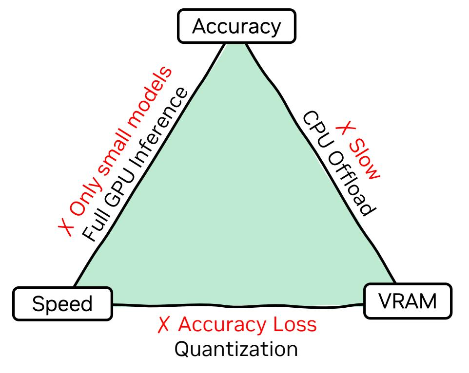

**State of the Art: pick any two**

#### **Our work enables new possibilities**

#### **What?**

Fast, lossless inference for xLMs on client systems

Up to 39x VRAM drop and up to 30x speedup @ a given VRAM budget Pareto-optimality in co-run scenarios

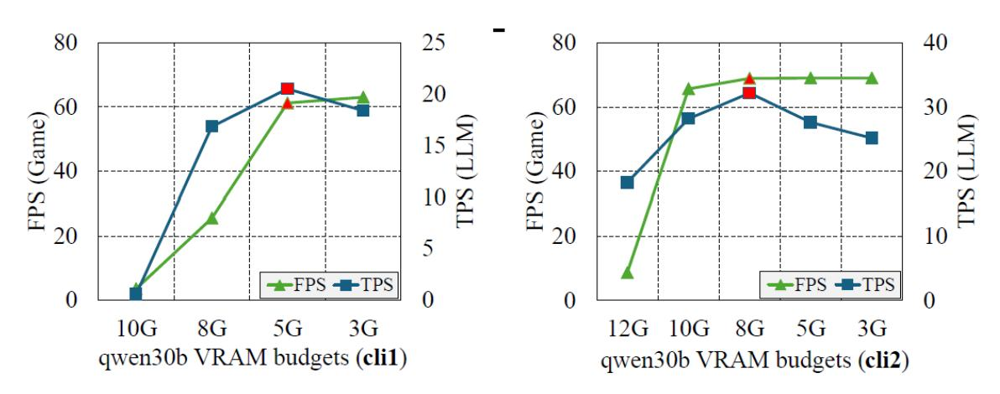

**Qwen3-30b-q4 running alongside Cyberpunk77**

left: 1080p - RTX 3500 Laptop, right: 4k - 5070 TI Desktop

**How?** Pipelined sharding (language) and VLMOpt (vision)

### **Why client xLM inference is hard?**

Slow PCIe, scarce VRAM, shared GPU

#### **Heterogeneous memory:**

PCIe is 5-15× slower than the memory it bridges

PCIe Gen5 peak: 64 GB/s per direction

Every CPU GPU transfer is on the critical path

#### **Batch-1, interactive:**

Single user: prompt, then decode

5+ Tokens-per-second (TPS) to keep up with reading rate

Time to first token (TTFT) matters as much as steady-state TPS

#### **GPU is shared:**

Games, creative apps, RTX Broadcast run on the same GPU

xLM contends for VRAM

Preemption stalls hurt both FPS and TPS

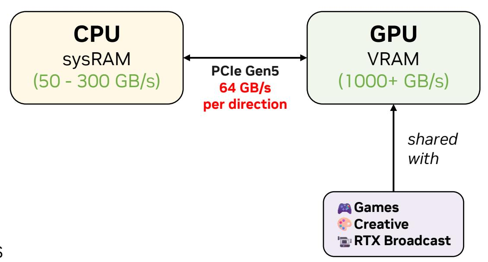

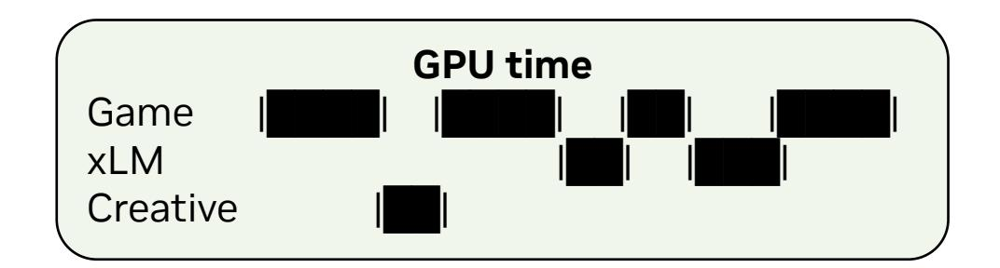

### **Pipelined Sharding: Profile → Plan → Infer**

Profile-guided schedule selection across token tiers. No manual offload knobs.

#### **Profile (install time):**

Benchmark CPU and GPU kernels across quants, op shapes, thread counts

Profile CPU kernels under PCIe contention for realistic timings

Build a kernel profile database

#### **Plan (once per model invocation):**

For each token tier = {*1, 4, 16, ..., 16K*}, generate 3 plans (*GPU-only, Static, Dynamic*)

Pick lowest-cost plan per tier via roofline + profile

Save to a schedule lookup table

#### **Infer (every iteration):**

Look up best schedule by current batch's new-token count

Execute. Table lookup only, no scheduling on the critical path**.**

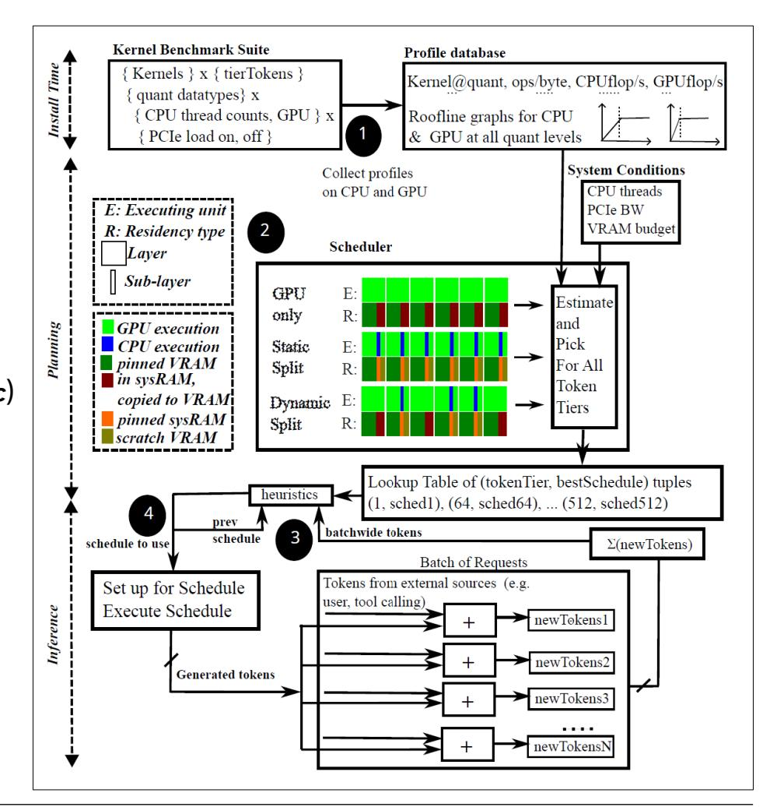

### **Three plans: GPU-only, Static, Dynamic**

No single plan always wins. The planner picks the lowest-cost plan per token tier.

#### **GPU-only:**

All unpinned sub-layers stream weights into a double-buffer in VRAM scratch Execution backend is always GPU (even if tensor residency is sysRAM)

**Wins when:** High new-token counts where compute hides PCIe latency

#### **Static:**

Prioritized VRAM assignment: attention > KV cache > FFN > outputs Only intermediate outputs cross PCIe

**Wins when:** Ample CPU threads, weight transfers would otherwise dominate

### **Dynamic:**

Static + extra GPU work via dynamic streaming to VRAM scratch Overlaps CPU compute with GPU weight streaming **Wins when:** moderate CPU threads, balanced compute and bandwidth

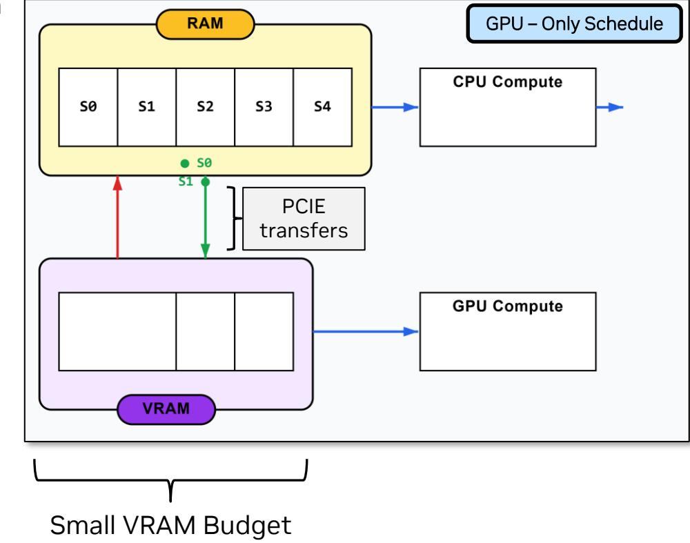

### **VLMOpt: Making high-resolution VLMs fit**

Vision optimizations bringing high-resolution VLM VRAM from 20+ GB to 2 GB.

#### **Vision tensor offload:**

Pin CLIP / vision-encoder weights on sysRAM

Stream to GPU at execution time

Frees VRAM from static vision weights

#### **Tiled FlashAttention in vision encoder:**

Vision encoder forms O(N²) KQ tensors, exceed several GBs (1440p)

Tile Q to bound peak memory (small perf cost)

1440p VLM attention drops under 2 GB

### **Serialize vision teardown before language init:**

Free vision GPU buffers before language context starts

Peak VRAM becomes max(vision, language), not vision + language

Eliminates the double-allocation spike

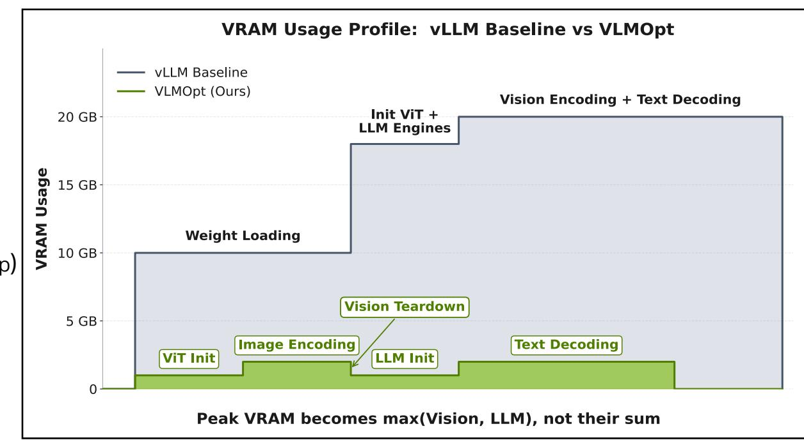

### **Models & client systems**

#### **Models**

| Short name | Model name                                 | Size on disk |
|------------|--------------------------------------------|--------------|
|            | IGI SDK: dense LLMs + VLM                  |              |
| nemo4b     | mistral-nemo-minitron-4b-128k-instruct-f16 | 7.7 GB       |
| nemo8b     | mistral-nemo-minitron-8b-128k-instruct-f16 | 15.7 GB      |
| vnemo4b    | nemotron-vision-4b-instruct-f16            | 8.4 GB       |
|            | MoE LLMs                                   |              |
| qwen30b    | Qwen3-30B-A3B-Instruct-2507-q4             | 16.4 GB      |
| qwen235b   | Qwen3-235B-A22B-Instruct-2507-q2_k         | 77.0 GB      |
|            | Cosmos-Reason1 reasoning VLM               |              |
| cr1        | Cosmos-Reason1                             | 15.4 GB      |

#### **Client systems**

| Name | GPU         | VRAM (GB) | Cores (CPU)  | RAM (GB) | Mem BW (GBps) | PCIe BW (GBps) |
|------|-------------|-----------|--------------|----------|---------------|----------------|
| cli1 | RTX 3500    | 12        | 16 (Ultra 7) | 64       | 119.5         | 13 (16 peak)   |
| cli2 | RTX 5070 Ti | 16        | 8 (Ryzen 7)  | 128      | 57.6          | 50 (64 peak)   |
| cli3 | RTX 5090    | 32        | 16 (EPYC)    | 256      | 153.6         | 50 (64 peak)   |

### **Single-user LLM speedups across SKUs and contexts**

qwen235b-q2 (77 GB) runs at 7.7 TPS in a 2 GB VRAM budget; **39× smaller footprint, but still interactive**!

#### **Time to first token (TTFT) speedup:**

2× average, 6.7× max Strongest at small VRAM budgets

#### **Tokens-per-second (TPS) speedup (batch=1):**

3.7× average, up to 30× (qwen235b at 64K context) Adapts to growing KV cache as context scales

#### **End-to-end-latency (E2EL) speedup:**

2× average, up to 4.3×

Combines TTFT improvement and steady-state TPS

#### **vs. VRAM-aware baseline**:

llama.cpp b6097, -ngl (num-gpu-layers) manually tuned. All comparisons at identical outputs - no quantization, no pruning

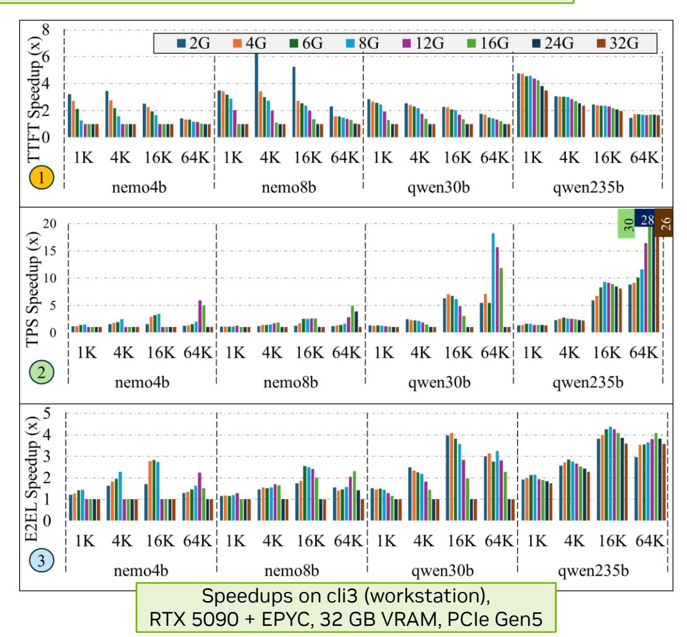

### **Multi-user (batched mode) LLM performance**

Qwen30b hits 289 TPS with 64 users. Up to 8.2x speedup!

#### **Pipelined sharding shows good scaling performance**

Batchwide token count used to choose token tier Elegantly adapts to request concurrency Scaling speedup: average 2.3x, peak 8.2x

|                    |      |      | Raw TPS with Pipelined Sharding |       |
|--------------------|------|------|---------------------------------|-------|
| Model (Context) | VRAM | bs=4 | bs=16                           | bs=64 |
|                    | 4G   | 32   | 53                              | 109   |
| nemo8b (1K)     | 8G   | 45   | 75                              | 128   |
|                    | 16G  | 212  | 230                             | 213   |
|                    | 4G   | 27   | 31                              | 35    |
| nemo8b (4K)     | 8G   | 37   | 38                              | 38    |
|                    | 16G  | 107  | 75                              | 43    |
|                    | 4G   | 76   | 134                             | 114   |
| qwen30b (1K)    | 8G   | 82   | 162                             | 176   |
|                    | 16G  | 94   | 259                             | 289   |
|                    | 4G   | 73   | 30                              | 43    |
| qwen30b (4K)    | 8G   | 79   | 123                             | 43    |
|                    | 16G  | 93   | 175                             | 51    |

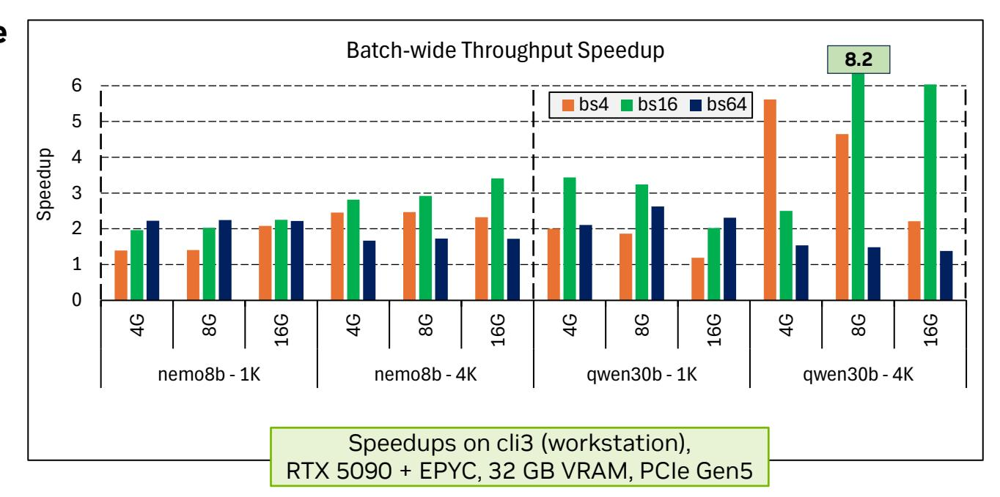

#### **vs. VRAM-aware baseline**:

llama.cpp b6097, -ngl (num-gpu-layers) manually tuned.

## **VLM results: high-res inference unlocked on client SKUs**

10× VRAM drop for CR1 (Cosmos-Reason1), 1080p and 1440p inference now runnable where vLLM OOMs.

#### **CR1: native res image encoding**

20 GB **→** 2 GB (10×) via vision tensor offload + tiled FA + serialized teardown

vLLM baseline only works at 20 GB, OOMs at smaller budgets

Up to 9.0× speedup on cli2 (desktop) w.r.t llama.cpp baseline

Powerful physical AI on high-res images unlocked on clients!

### **Cosmos-Reason1 E2EL Speedups**

OOM: baseline ran out of memory Pipelined sharding + VLMOpt runs everywhere

|                            |      | cli2 (desktop) |       | cli3 (workstation) |      |       |  |
|----------------------------|------|----------------|-------|--------------------|------|-------|--|
| Image Res./ VRAM budget | 4G   | 8G             | 14.5G | 4G                 | 8G   | 14.5G |  |
| 480p                       | 1.3x | 1.3x           | 3.5x  | 1.2x               | 1.3x | 2.5x  |  |
| 720p                       | OOM  | 1.6x           | 4.6x  | OOM                | 1.5x | 3.2x  |  |
| 1080p                      | OOM  | OOM            | 9x    | OOM                | OOM  | 6.7x  |  |
| 1440p                      | OOM  | OOM            | OOM   | OOM                | OOM  | OOM   |  |

#### **vnemo4b: fixed res image encoding**

1.5×–1.8× E2EL speedup at small budgets

#### **Baselines**:

vLLM at peak VRAM (where it runs) for CR1; llama.cpp with -ngl manually tuned at smaller budgets for CR1 & vnemo4b

### **Takeaways**

Efficient, VRAM-Constrained Inference on Clients

**Interactive high-accuracy xLM inference is now possible on client systems**

Thanks to pipelined sharding and VLMOpt!

Targets NVIDIA products. Open-sourced for the broader community.

#### **Adaptive, simple, extensible CPU-GPU hybrid scheduling**

Benchmark profiles guide scheduling during planning

Token tier design provides flexibility during inference

Extensible: new kernels, schedules, and models plug in easily

#### **Pipelined sharding works well for interactive and batched modes**

**Interactive:** Up to 39x VRAM drop and up to 30x speedup @ a given VRAM budget!

**Batched:** Up to 289 TPS for qwen30b with 64 users, up to 8.2x speedup!

### **Open-source status – earned all three Artifact Evaluation badges**

Code [upstream](https://github.com/ggml-org/llama.cpp/pull/22692) in progress

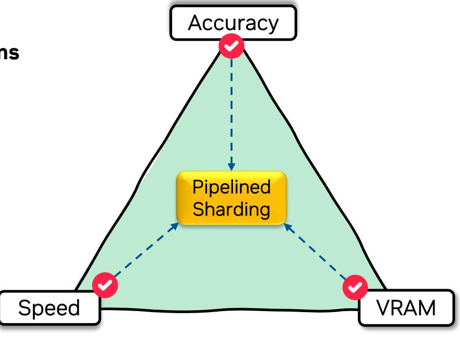

### **Backup**

### **No single prior technique covers all dimensions**

| Technique                        | Optimizes | Works Well | Optimizes | Optimizes | Different Prior- | KV Cache    | Optimizes | Evaluated |
|----------------------------------|-----------|------------|-----------|-----------|------------------|-------------|-----------|-----------|
|                                  | TTFT      | for Batch  | dense     | MoE       | ities for Atten- | Sharding    | VLMs      | on Client |
|                                  |           | Size=1     | LLMs      | LLMs      | tion and FFN     |             |           | Systems   |
| TwinPilots (Yu et al., 2024)     | ×         | ×          | V         | ×         | ×                | ×           | ×         | ×         |
| HeteGen (Zhao et al., 2024)      | ×         | <b>✓</b>   | ~         | ×         | X                | ×           | ×         | ×         |
| MoE-Lightning (Cao et al., 2025) | ×         | X          | ×         | ~         | V                | ×           | ×         | ×         |
| EdgeMoE (Yi et al., 2025)        | ×         | <b>V</b>   | ×         | ~         | V                | ×           | ×         | ×         |
| APEX (Fan et al., 2025)          | ×         | X          | ~         | ×         | V                | <b>V</b>    | ×         | ×         |
| HeadInfer (Luo et al., 2025)     | ×         | _          | ~         | ×         | ×                | <b>&gt;</b> | ×         | ×         |
| Pipelined sharding (our work)    | <b>/</b>  | V          | <b>/</b>  | <b>'</b>  | V                | V           | <b>V</b>  | V         |

### **TPS & TTFT on cli3 across VRAM budgets and contexts**

|       | Ctx  |      | TPS across VRAM budgets |      |      |       |       |       |       | TTFT in seconds across VRAM budgets |       |       |       |       |             |       |       |
|-------|------|------|-------------------------|------|------|-------|-------|-------|-------|-------------------------------------|-------|-------|-------|-------|-------------|-------|-------|
| Model | Size | 2G   | 4G                      | 6G   | 8G   | 12G   | 16G   | 24G   | 32G   | 2G                                  | 4G    | 6G    | 8G    | 12G   | 16 <b>G</b> | 24G   | 32G   |
| nemo- | 1K   | 14.8 | 20.1                    | 33.1 | 66.1 | 116.9 | 116.9 | 116.9 | 116.9 | 0.2                                 | 0.2   | 0.2   | 0.1   | 0.1   | 0.1         | 0.1   | 0.1   |
| 4b    | 4K   | 12.3 | 18.4                    | 28.8 | 63.1 | 108.7 | 108.7 | 108.4 | 108.4 | 0.5                                 | 0.4   | 0.4   | 0.4   | 0.4   | 0.4         | 0.4   | 0.4   |
|       | 16K  | 5.3  | 12.2                    | 18.7 | 29.5 | 87.9  | 87.9  | 87.9  | 87.9  | 2.7                                 | 2.5   | 2.4   | 2.2   | 2.0   | 2.0         | 2.0   | 2.0   |
|       | 64K  | 1.3  | 1.6                     | 2.0  | 3.2  | 15.0  | 35.8  | 50.3  | 50.3  | 28.8                                | 27.7  | 26.0  | 24.7  | 22.1  | 19.1        | 17.2  | 17.2  |
| nemo- | 1K   | 7.6  | 8.6                     | 10.0 | 12.4 | 21.6  | 70.0  | 70.0  | 70.1  | 0.4                                 | 0.3   | 0.3   | 0.3   | 0.2   | 0.2         | 0.2   | 0.2   |
| 8b    | 4K   | 6.4  | 8.2                     | 9.5  | 11.6 | 20.3  | 64.4  | 66.7  | 66.6  | 0.8                                 | 0.8   | 0.7   | 0.7   | 0.7   | 0.6         | 0.6   | 0.6   |
|       | 16K  | 3.3  | 4.8                     | 8.1  | 9.5  | 14.5  | 28.5  | 56.9  | 56.7  | 4.1                                 | 3.9   | 3.8   | 3.7   | 3.4   | 3.1         | 3.0   | 2.9   |
|       | 64K  | 1.0  | 1.1                     | 1.4  | 1.7  | 3.8   | 8.8   | 25.2  | 36.5  | 53.8                                | 35.6  | 34.6  | 33.3  | 31.2  | 28.9        | 24.6  | 22.6  |
| qwen- | 1K   | 25.7 | 26.2                    | 29.6 | 32.1 | 36.5  | 47.8  | 158.1 | 158.6 | 0.6                                 | 0.6   | 0.5   | 0.5   | 0.4   | 0.3         | 0.3   | 0.3   |
| 30b   | 4K   | 25.6 | 26.7                    | 28.3 | 31.7 | 37.0  | 43.4  | 141.3 | 141.3 | 1.5                                 | 1.5   | 1.4   | 1.3   | 1.2   | 1.0         | 1.0   | 1.0   |
|       | 16K  | 20.4 | 25.1                    | 27.4 | 28.7 | 33.3  | 39.1  | 101.5 | 100.9 | 6.8                                 | 6.5   | 6.2   | 5.8   | 5.3   | 4.6         | 4.1   | 4.1   |
|       | 64K  | 4.7  | 6.7                     | 11.8 | 21.1 | 24.2  | 27.2  | 60.6  | 60.6  | 42.1                                | 41.3  | 39.7  | 38.5  | 35.9  | 33.1        | 26.7  | 26.6  |
| qwen- | 1K   | 7.7  | 8.7                     | 9.0  | 9.1  | 9.4   | 9.7   | 10.6  | 11.5  | 2.5                                 | 2.4   | 2.4   | 2.4   | 2.3   | 2.3         | 2.1   | 2.0   |
| 235b  | 4K   | 7.5  | 8.3                     | 9.0  | 9.0  | 9.3   | 9.7   | 10.4  | 11.1  | 6.7                                 | 6.7   | 6.7   | 6.6   | 6.5   | 6.4         | 6.1   | 5.9   |
|       | 16K  | 5.2  | 6.7                     | 7.6  | 8.6  | 8.9   | 9.3   | 9.9   | 10.9  | 28.8                                | 28.8  | 28.6  | 28.4  | 27.9  | 27.5        | 26.5  | 25.7  |
|       | 64K  | 2.0  | 2.1                     | 2.4  | 2.8  | 4.1   | 7.5   | 8.2   | 8.7   | 148.1                               | 148.0 | 147.2 | 146.7 | 145.2 | 143.8       | 140.7 | 138.2 |

### **TPS and TTFT at full VRAM budget on cli2 and cli1**

| Model    | Ctx Size | cli2 b | est metrics | cli1 b        | est metrics |
|----------|----------|--------|-------------|---------------|-------------|
|          |          | TPS    | TTFT (s)    | TPS           | TTFT (s)    |
| nemo4b   | 1K       | 83.1   | 0.12        | 34.9          | 0.29        |
|          | 4K       | 76.8   | 0.45        | 32.3          | 1.19        |
|          | 16K      | 58.8   | 2.44        | 24.7          | 6.63        |
|          | 64K      | 14.4   | 30.22       | 6.0           | 85.49       |
| nemo8b   | 1K       | 22.9   | 0.23        | 10.7          | 0.76        |
|          | 4K       | 22.3   | 0.78        | 9.7           | 2.37        |
|          | 16K      | 11.5   | 4.13        | 7.2           | 12.62       |
|          | 64K      | 3.9    | 42.07       | 1.7           | 120.71      |
| qwen30b  | 1K       | 54.9   | 0.41        | 26.1          | 1.55        |
|          | 4K       | 51.8   | 1.63        | 25.4          | 4.27        |
|          | 16K      | 44.0   | 7.37        | 20.8          | 20.3        |
|          | 64K      | 24.1   | 50.64       | 10.1          | 145.83      |
| qwen235b | 1K       | 7.7    | 37          |               |             |
|          | 4K       | 7.2    | 60.4        | OUT OF        |             |
|          | 16K      | 7.04   | 163         | <b>MEMORY</b> |             |
|          | 64K      | 4.54   | 103         |               |             |

# **Pipelined Sharding vs manual offloading (qwen30b on cli3)**

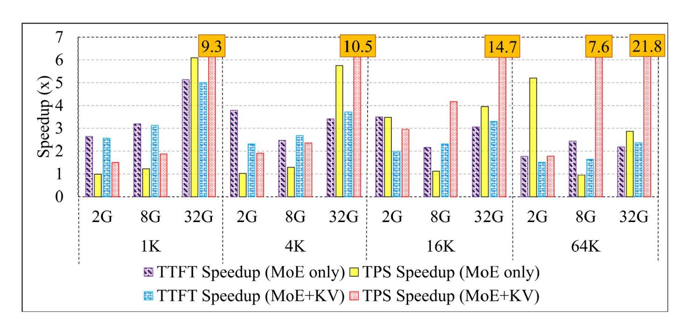

### **Sensitivity to CPU threads and PCIe Gen**

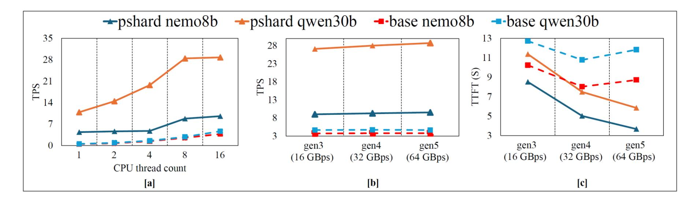

# **Scheduler picks vary across configurations**

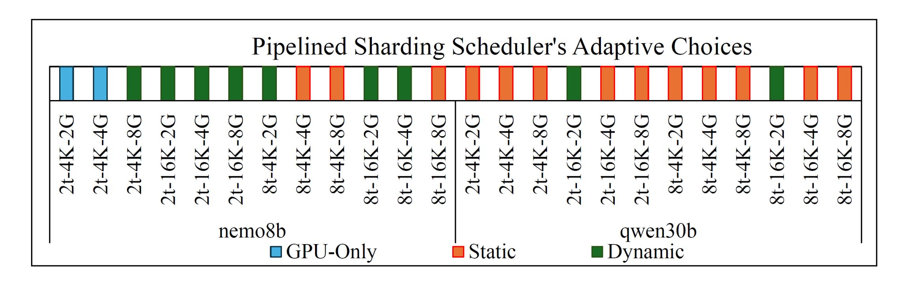

### **Batched Inference**

| Model     | VRAM   | bs=1            | bs=4            | bs=16           | bs=64           |
|-----------|--------|-----------------|-----------------|-----------------|-----------------|
| (Context) | Budget | nukv / $\Delta$ | nukv / $\Delta$ | nukv / $\Delta$ | nukv / $\Delta$ |
| nemo8b    | 4G     | 9/0             | 32 / 0          | 52 / 1          | 104 / 5         |
| (1K)      | 8G     | 12 / 1          | 44 / 1          | 73 / 2          | 122 / 6         |
|           | 16G    | 71 / -1         | 198 / 14        | 205 / 25        | 202 / 11        |
| nemo8b    | 4G     | 8/0             | 27 / 0          | 31/0            | 39 / -4         |
| (4K)      | 8G     | 12/0            | 37 / 0          | 38 / 0          | 42 / -4         |
|           | 16G    | 64 / 0          | 105 / 2         | 73 / 2          | 50 / -7         |
| qwen30b   | 4G     | 27 / 0          | 71/5            | 122 / 12        | 101 / 13        |
| (1K)      | 8G     | 31/0            | 76 / 6          | 144 / 18        | 169 / 7         |
|           | 16G    | 47 / -5         | 96 / -2         | 229 / 30        | 270 / 19        |
| qwen30b   | 4G     | 27 / 0          | 70 / 3          | 30 / 0          | 56 /-13         |
| (4K)      | 8G     | 30 / 0          | 75 / 4          | 119 / 4         | 50 / -7         |
|           | 16G    | 41 / -1         | 88 / 5          | 163 / 12        | 62 /-11         |

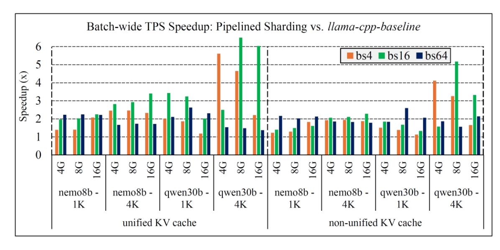

### **VLM Results**

| VRAM   |       | cli2     |         |      | cli3     |         |
|--------|-------|----------|---------|------|----------|---------|
| Budget | base  | psh+vopt | speedup | base | psh+vopt | speedup |
|        | (s)   | (s)      | (x)     | (s)  | (s)      | (x)     |
| 2G     | OOM   | 15.91    | _       | OOM  | 7.32     | _       |
| 4G     | 16.47 | 11.30    | 1.46    | 7.61 | 5.78     | 1.32    |
| 6G     | 11.36 | 6.37     | 1.78    | 5.64 | 3.24     | 1.74    |
| 8G     | 7.56  | 4.47     | 1.69    | 3.74 | 2.10     | 1.78    |
| 10G    | 1.22  | 1.11     | 1.10    | 1.21 | 0.87     | 1.39    |

|       |      | mach     | ine cli2 |      | machine cli3 |          |       |     |
|-------|------|----------|----------|------|--------------|----------|-------|-----|
| image | ps   | hard+vln | nopt     | vLLM | ps           | hard+vlr | vLLM  |     |
| res   | 2G   | 8G       | 14.5G    | max  | 2G           | 8G       | 14.5G | 20G |
| 480p  | 33.7 | 17.6     | 2.3      | OOM  | 13.6         | 8.2      | 1.8   | 8.7 |
| 720p  | 35.2 | 18.2     | 2.9      | OOM  | 13.8         | 8.5      | 2.0   | 8.7 |
| 1080p | 34.9 | 19.2     | 3.7      | OOM  | 14.7         | 9.1      | 2.6   | 9.0 |
| 1440p | 40.4 | 21.6     | 5.9      | OOM  | 18.7         | 10.6     | 4.1   | 9.5 |