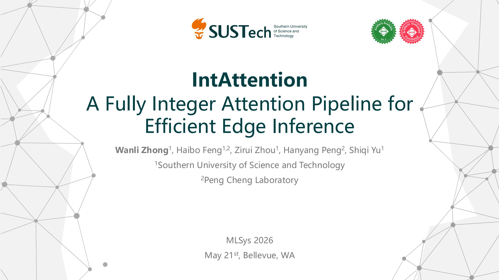

# Background

### **Quantized attention accelerates GEMM, but not the probability path**

- Int-FlashAttention, SageAttention show quantized attention pipeline
- FlashAttention-3: softmax take 50% of the cycle compared to matmul in FP16, and it will be more in FP8

| FP32 Q K | V                  |  |  |  |  |  |
|----------------|--------------------|--|--|--|--|--|
|                |                    |  |  |  |  |  |
| FP32 A=QKT  |                    |  |  |  |  |  |
|                |                    |  |  |  |  |  |
| FP32           | P=softmax(A/ d) |  |  |  |  |  |
|                |                    |  |  |  |  |  |
| FP32 O=PV   |                    |  |  |  |  |  |

Standard Attention

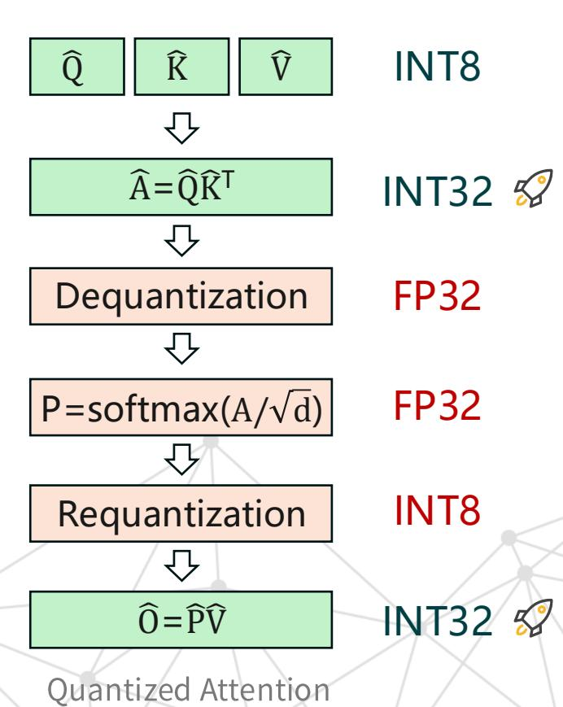

### Bottleneck

**Up to 65%!**

#### **After INT8 GEMM acceleration, softmax becomes dominant**

- Measured attention breakdown on CPU
- FP32: softmax path is secondary
- FP16: softmax + cast becomes more visible
- INT8: dequantize → softmax → requantize remains expensive
- It takes up to **65%** of attention latency

Time cost ratio of softmax on each data type

• The next optimization target is the probability normalization path

# Design Goal

### **What should an integer attention path satisfy?**

- Consume INT32 logits from QKᵀ directly
- Produce INT8 probabilities for integer PV
- Keep row-wise softmax normalization
- Avoid FP32 exp / division / conversion
- Require no retraining or QAT
- Use compact, edge friendly integer operators

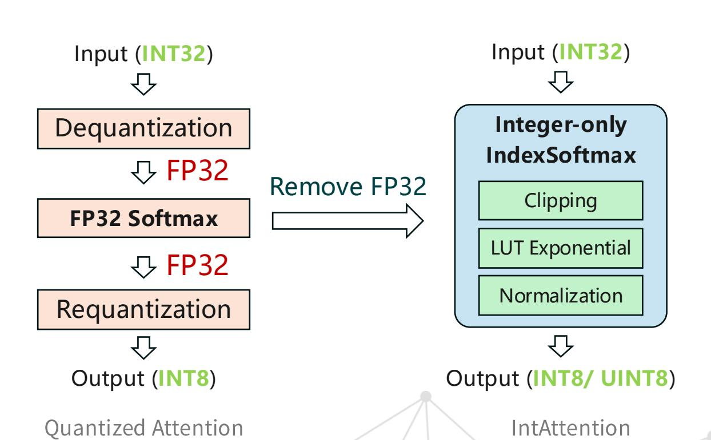

### **Method**

# Clipping

### **Softmax is dominated by logits near the maximum**

- Many logits have near-zero softmax contribution
- Clipping removes redundant exponential work
- Input range are limited
- No floating-point conversion is needed
- Skip the negligible calculation

$$Softmax(x_i) = \frac{e^{x_i - x_{max}}}{\sum_{j=1}^{K} e^{x_i - x_{max}}}$$

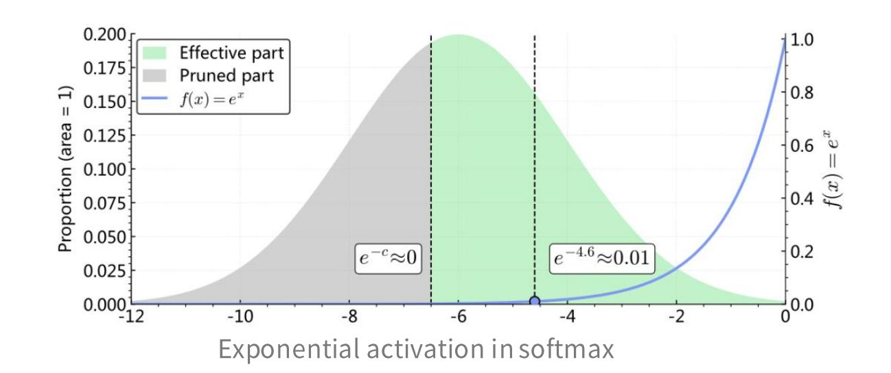

### LUT Exponential

#### **Bounded exp domain makes fixed lookup practical**

- Exp only needs to cover x ∈ [0, c]
- Monotonic LUT preserves coarse logit ordering
- O(L²) elements, cheaper per-element work
- Avoids FP32 exp

- EXAQ uses dynamic clipping from global statistics
- Our sweep shows a broad stable region
- Fixed **c = 6.6, b = 5** works well

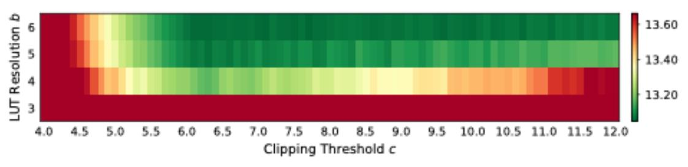

LLaMA -3.2 -1B on WikiText (PPL↓)

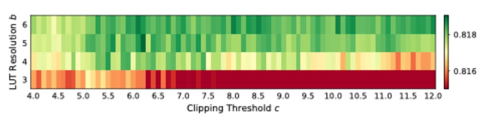

DeiT -B on ImageNet -1K (Top -1↑)

### Integer Rebuild & Normalization

#### **Cost effective UINT8 data type**

• INT8 wastes half of the range, use **UINT8**

- Quantize LUT values into UINT8
- **4x** more entries than FP32 under 32B table budget
- Easy to be put into registers
- Calculate **4x** data at the same time

- Output P matrix into UINT8
- Preserves higher accuracy the INT8 Accuracy comparison of two quantization formats for P

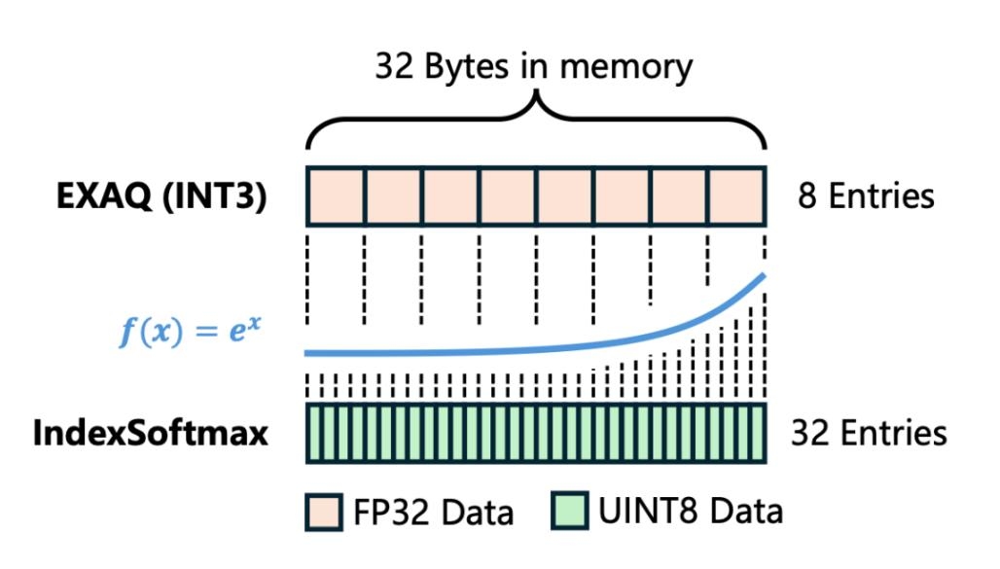

Achieves 4x higher resolution under the same memory budget

| Format | CosSim ↑ | Relative L1↓ | $\mathbf{RMSE}\downarrow$ |  |  |
|--------|----------|--------------|---------------------------|--|--|
| INT8   | 0.996612 | 0.07739742   | 0.0023912                 |  |  |
| UINT8  | 0.999081 | 0.04097954   | 0.0012436                 |  |  |

# Pipeline Overview

#### Full integer attention dataflow with high efficient and simple operators

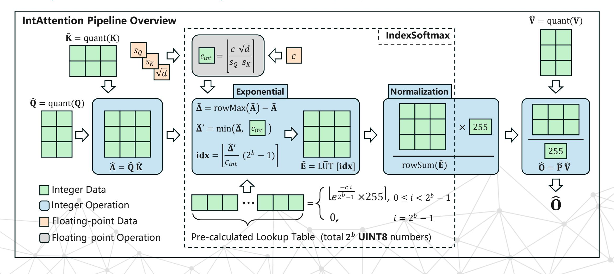

### **Experiments**

### Speed & Energy

- RK3588S2 embedded board
- Apple M2 laptop
- Arm Compute Library (ACL)

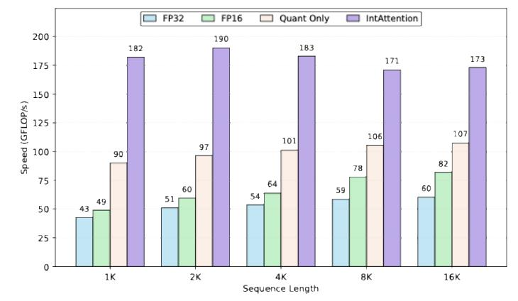

**Speed** comparison on RK3588S2 **Speed** comparison on Apple M2

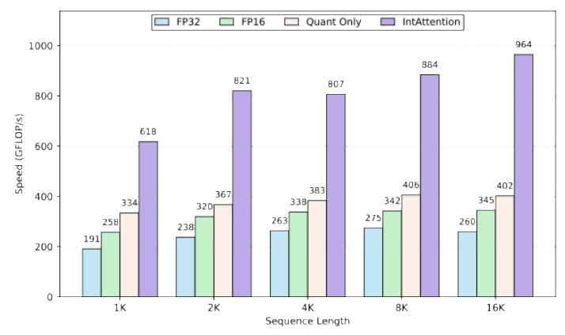

- RK3588S2: **3.7×** faster than FP16, **2.0×** faster than Quant-Only
- Apple M2: **2.8×** faster than FP16, **2.4×** faster than Quant-Only

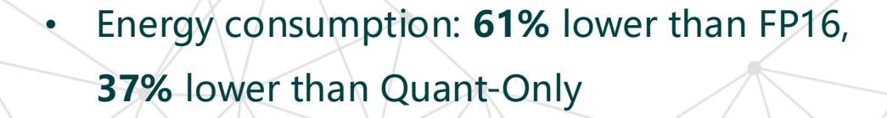

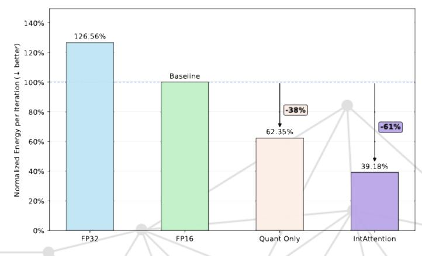

**Energy** comparison on RK3588S2

## Accuracy

#### **IntAttention preserves competitive accuracy across language and vision tasks**

| Model            | Method       | WikiText ↓ | HellaSwag | LAMBADA | PIQA   | WinoGrande | ARC-C  | ARC-E  | Avg. ↑ |
|------------------|--------------|------------|-----------|---------|--------|------------|--------|--------|--------|
| Llama -3.2-1B | FP16         | 12.663     | 63.65%    | 62.95%  | 74.59% | 60.69%     | 36.18% | 60.48% | 59.76% |
|                  | EXAQ (INT2)  | 17.753     | 57.56%    | 50.48%  | 70.73% | 56.99%     | 33.28% | 56.19% | 54.21% |
|                  | EXAQ (INT3)  | 13.757     | 62.72%    | 60.72%  | 72.96% | 58.01%     | 36.01% | 59.55% | 58.33% |
|                  | IndexSoftmax | 12.784     | 63.44%    | 63.38%  | 74.16% | 60.46%     | 36.43% | 60.65% | 59.75% |
|                  | Quant-Only   | 13.701     | 63.39%    | 62.62%  | 74.32% | 60.62%     | 35.84% | 60.56% | 59.56% |
|                  | IntAttention | 13.070     | 63.50%    | 63.61%  | 74.92% | 61.01%     | 36.43% | 60.48% | 59.92% |

| Method       |             | Llama-3.2            | -1B                            | Llama-3.2-1B-Instruct |       |       |        |        |
|--------------|-------------|----------------------|--------------------------------|-----------------------|-------|-------|--------|--------|
|              | <b>C4</b> ↓ | OWT-10k $\downarrow$ | $\mathbf{RedPajama}\downarrow$ | HumanEval             | MBPP  | GSM8K | IFEval | Avg. ↑ |
| FP16         | 29.935      | 11.5023              | 26.756                         | 32.93                 | 33.00 | 33.81 | 43.44  | 35.80  |
| EXAQ (INT2)  | 39.578      | 16.0992              | 44.245                         | 18.29                 | 9.20  | 5.99  | 36.41  | 17.47  |
| EXAQ (INT3)  | 32.413      | 12.7847              | 30.353                         | 27.44                 | 27.40 | 24.26 | 39.56  | 29.67  |
| IndexSoftmax | 30.015      | 12.0913              | 27.043                         | 31.10                 | 34.20 | 35.02 | 39.74  | 35.02  |
| Quant-Only   | 32.430      | 12.7931              | 32.189                         | 32.32                 | 31.40 | 34.49 | 41.40  | 34.90  |
| IntAttention | 31.190      | 12.3178              | 28.496                         | 31.10                 | 34.20 | 35.03 | 39.74  | 35.02  |

| Method       | DeiT-B-224 |        | ViT-L-P16-384 |        | CaiT-L-M48-448 |        | Avg.↑  |        |
|--------------|------------|--------|---------------|--------|----------------|--------|--------|--------|
| Method       | Top-1      | Top-5  | Top-1         | Top-5  | Top-1          | Top-5  | Top-1  | Top-5  |
| FP16         | 81.802     | 95.598 | 85.628        | 97.782 | 86.090         | 97.588 | 84.507 | 96.989 |
| EXAQ (INT2)  | 81.554     | 95.482 | 85.222        | 97.668 | 85.866         | 97.554 | 84.214 | 96.901 |
| EXAQ (INT3)  | 81.768     | 95.584 | 85.428        | 97.722 | 85.998         | 97.596 | 84.398 | 96.962 |
| IndexSoftmax | 81.804     | 95.590 | 85.616        | 97.774 | 86.114         | 97.582 | 84.511 | 96.982 |
| Quant-Only   | 81.896     | 95.708 | 83.844        | 97.150 | 85.742         | 97.530 | 83.707 | 96.796 |
| IntAttention | 81.826     | 95.620 | 85.224        | 97.668 | 86.100         | 97.640 | 84.383 | 96.976 |

**Accuracy on vision tasks**

**Accuracy on language tasks**

### Summary

- 1. INT8 GEMMs expose softmax / QDQ as the next attention bottleneck
- 2. IndexSoftmax replaces the FP32 softmax island with integer clipping, LUT exponential, and integer normalization
- 3. IntAttention connects QKᵀ and PV through a fully integer probability path, achieving **up to 3.7×** speedup and **61%** energy reduction.

Code at <https://github.com/WanliZhong/IntAttention>

Email me by [12332469@mail.sustech.edu.cn](mailto:12332469@mail.sustech.edu.cn)

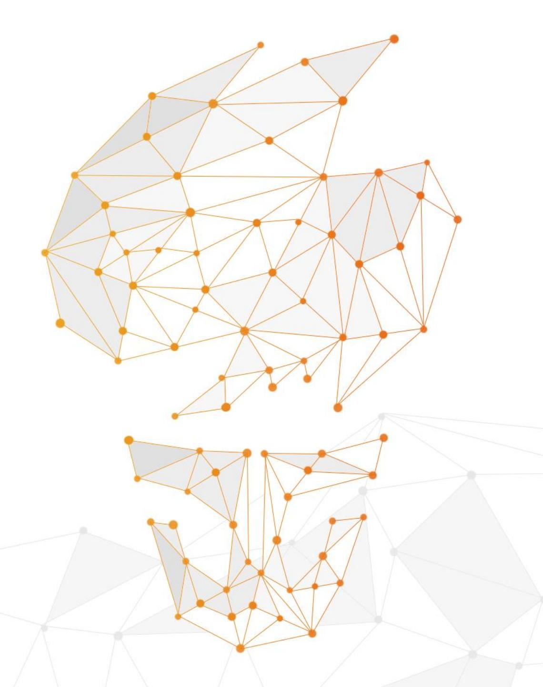

# **Thanks! Q&A**