# Rethinking DVFS for Mobile LLMs: Unified Energy-Aware Scheduling with CORE

Zongpu Zhang\*^, Pranab Dash\*, **Qiang Xu**, Y. Charlie Hu, Jian Li, Haibing Guan

Purdue University | Shanghai Jiao Tong University

*\* equal contribution ^ work done while visiting Purdue*

### Background

#### **DVFS on mobile**

DVFS governors dynamically adjust hardware **clock frequencies** based on workload demands

**Higher frequency:**

→ Faster, more power, hotter

**Lower frequency:**

→ Slower, less power, cooler

#### **Governors are independent**

- Each operates based on local metric (e.g., util)
- No cross-resource coordination

CPU governor *(e.g., EAS)*

Memory governor *(e.g., interactive)*

GPU governor *(e.g., quickstep)*

### LLM inference on mobile

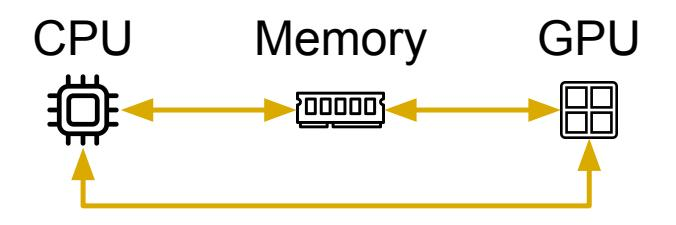

**GPU-based inference needs all 3 components**

- GPU handles most kernels
- CPU keeps work queues fed
- Memory bandwidth shapes both prefill / decode stages

**Key question:** Can independent DVFS governors provide optimal **latency-energy** efficiency?

### Research questions

How far from optimal are default mobile governors for LLMs? **Q1:**

> Why (lack of) governor interaction causes energy inefficiency? **Q2:**

> > How can a unified governor coordinate CPU, GPU, memory efficiently? **Q3:**

### Benchmarking setup

Compare **default governors** against **pinned frequency combinations** to reveal the latency-energy tradeoff.

#### **Platform setup**

Pixel 7 / 7 Pro, Tensor G2

Batteries bypassed Screen disabled

#### **Framework and models**

Llama.cpp + OpenCL

TinyLlama 1.1B StableLM 3B Llama-2 7B

#### **Metrics**

TTFT, TPOT, E2E latency, Energy per token

### Finding 1: Default governors are far from optimal

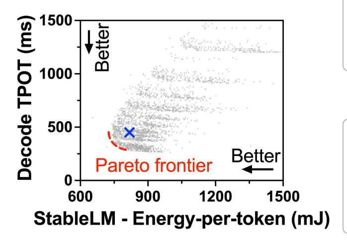

**23.0–40.4%**

**Longer latency** than optimal combinations under the same energy usage

**5.0–16.6%**

**Higher energy** than optimal combinations under the same latency

#### Finding 2: Individual governors select too low frequencies

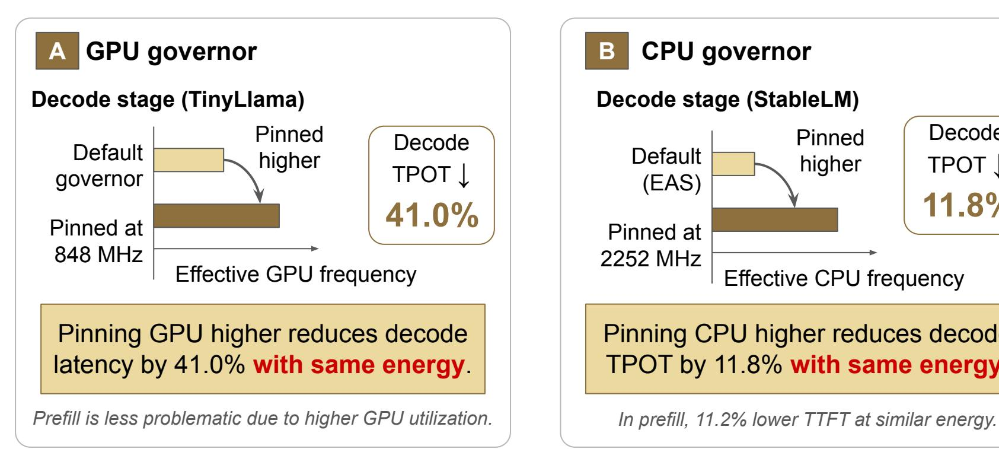

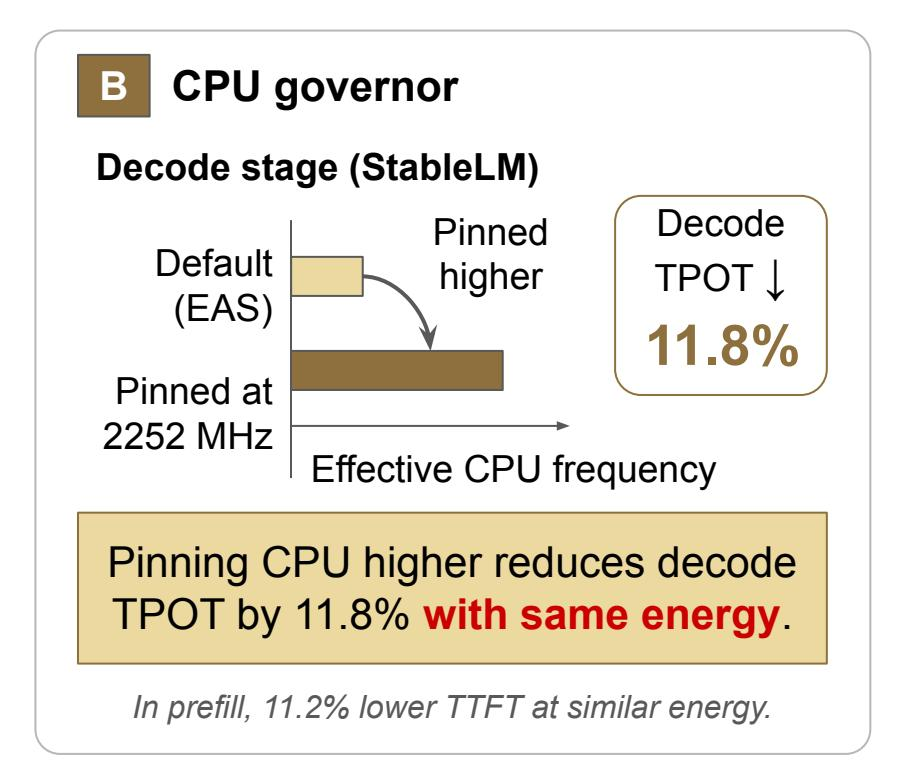

### Insight: Decode stage exhibits low utilization

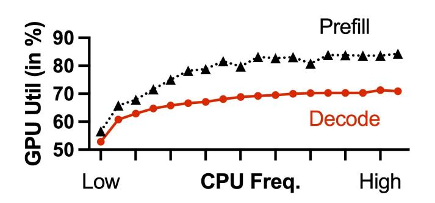

**GPU utilization at various pinned CPU frequencies**

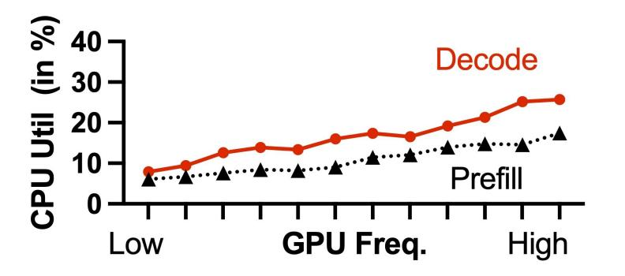

**CPU utilization at various pinned GPU frequencies**

Low utilization prompts default governors to reduce frequency in trying to bring utilization up

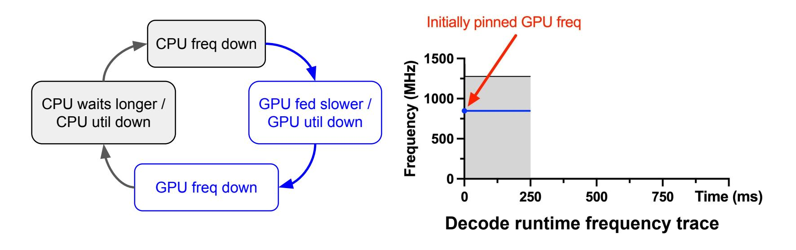

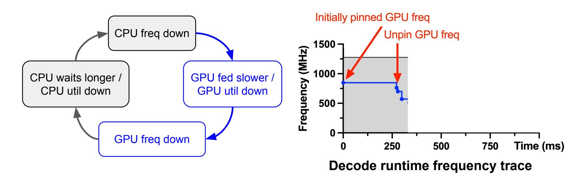

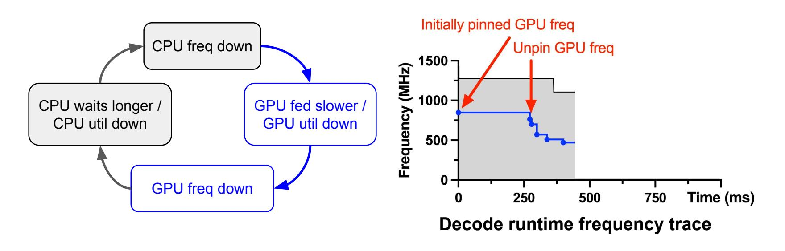

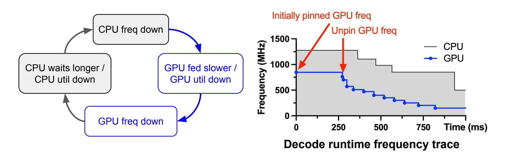

**Design implication: avoiding this downward spiral requires a unified CPU/GPU governor**

### CORE: A unified DVFS governor for LLMs

**Goal**

Optimal frequencies under latency/energy target

**High-level idea**

Offline profile of different frequency combinations (once per model)

#### **Challenges**

- Different prefill lengths -> different frequency
- Too many frequency combinations

#### **Approach**

**● Searching ranges**

5 prefill length settings + 1 decode length setting

**● Two-step heuristic** "GPU first, CPU next"

### Evaluation on ShareGPT traces

Faster inference at same or lower energy.

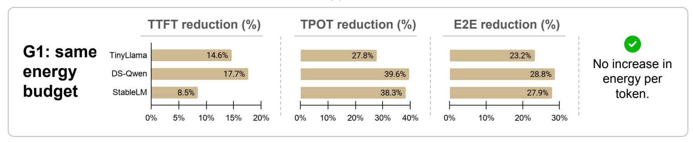

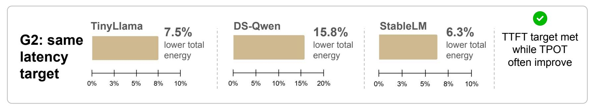

#### Rethinking DVFS for Mobile LLMs: Unified Energy-Aware Scheduling with CORE

#### **Takeaway**

- 1. Current DVFS governors are designed to work independently
- 2. LLM inference on mobile GPU requires using all three components
- 3. As a result, default governors are far from globally optimal for mobile LLMs
- 4. Antagonistic effect drives CPU/GPU frequencies to be overly low
- 5. CORE: Simple unified coordination works

