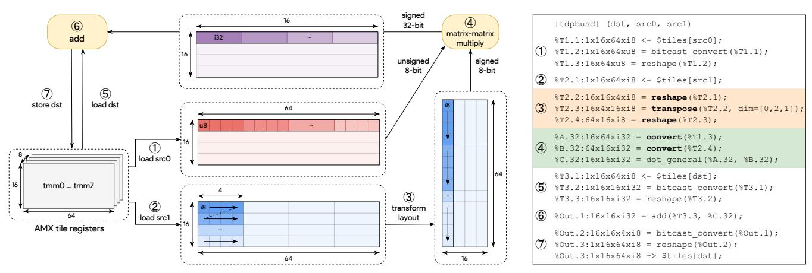
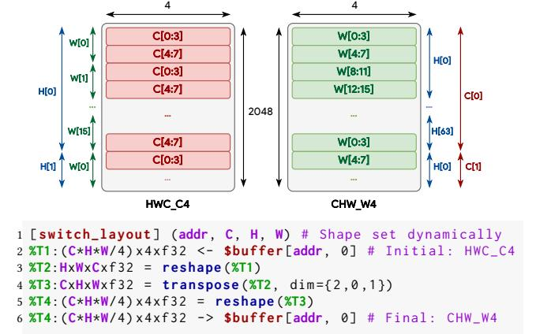
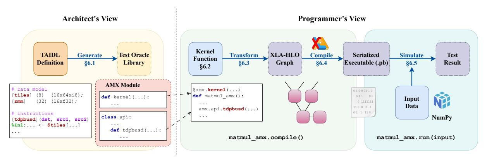

# <span id="page-0-0"></span>TAIDL: Tensor Accelerator ISA Definition Language with Auto-generation of Scalable Test Oracles

Devansh Jain University of Illinois Urbana-Champaign, USA devansh9@illinois.edu

Akash Pardeshi University of Illinois Urbana-Champaign, USA pardesh2@illinois.edu Marco Frigo University of Illinois Urbana-Champaign, USA mfrigo3@illinois.edu

Zhihao Wang University of Illinois Urbana-Champaign, USA zhihaow6@illinois.edu

Charith Mendis University of Illinois Urbana-Champaign, USA charithm@illinois.edu Jai Arora University of Illinois Urbana-Champaign, USA jaia3@illinois.edu

Krut Patel University of Illinois Urbana-Champaign, USA ksp8@illinois.edu

#### Abstract

With the increasing importance of deep learning workloads, many hardware accelerators have been proposed in both academia and industry. However, software tooling for the vast majority of them does not exist compared to the software ecosystem and innovations proposed for established platforms such as CPUs and GPUs. We observed that the lack of well-defined hardware-software interfaces and correctness testing tools like fast and scalable *test oracles* (also known as functional simulators) act as significant barriers to adopting these emerging accelerators in the software community. These interfaces and tools are essential in building software such as retargetable compilers and optimized kernels.

To bridge these gaps, we first present TAIDL, an instruction specification language that provides novel constructs to describe the instruction set architectures (ISAs) of tensor accelerators. Next, given ISA definitions in TAIDL, we introduce techniques to automatically generate fast and scalable test oracles for diverse sets of accelerators, which are needed for testing software correctness of code that targets pre-silicon hardware designs. Automated generation of such tools reduces the burden on hardware architects and the repeated development efforts required across different accelerator platforms. Further, our techniques allow us to execute these simulators on GPUs, leading to highly scalable simulations. To demonstrate the expressivity of TAIDL, we instantiated several tensor accelerator ISAs with different compute capabilities and memory hierarchies. Further, we show that test oracles generated using TAIDL definitions are orders of magnitude faster and more scalable than existing instruction-level functional simulators, making them suitable for integration into software development cycles. TAIDL is available at https://github.com/act-compiler/taidl.


This work is licensed under a Creative Commons Attribution 4.0 International License. MICRO '25, Seoul, Republic of Korea © 2025 Copyright held by the owner/author(s). ACM ISBN 979-8-4007-1573-0/25/10 https://doi.org/10.1145/3725843.3756075

# **CCS Concepts**

Hardware → Emerging architectures;
 Software and its engineering → Architecture description languages;
 Semantics;
 Simulator / interpreter;
 Correctness;
 Software reliability.

#### ACM Reference Format:

Devansh Jain, Marco Frigo, Jai Arora, Akash Pardeshi, Zhihao Wang, Krut Patel, and Charith Mendis. 2025. TAIDL: Tensor Accelerator ISA Definition Language with Auto-generation of Scalable Test Oracles. In 58th IEEE/ACM International Symposium on Microarchitecture (MICRO '25), October 18–22, 2025, Seoul, Republic of Korea. ACM, New York, NY, USA, 18 pages. https://doi.org/10.1145/3725843.3756075

#### 1 Introduction

The increasing demand for machine learning (ML) workloads has brought innovations across the system stack, from applications to hardware designs. On one front, there have been multiple tensor accelerator designs (NPUs) proposed at top-tier computer architecture venues [20, 47, 51, 80, 101, 114]. On another front, there have been multiple systems and compiler optimization work proposed at top-tier systems and compiler venues [21, 31, 42, 44, 106, 116].

#### 1.1 Problem

Although plenty of work has been done on both fronts, we note a subtle disconnect between the software and hardware research. Systems and compiler optimizations are mainly targeted and tested on *existing* CPU and GPU designs. Software works that evaluate on tensor accelerators [72, 84, 119] have been mainly limited to a handful of proprietary and mature designs, such as Google TPU [69] with proprietary mature compiler support. A vast majority of accelerator designs have not been used for software evaluations.

To understand this disconnect, we analyze the tooling available for popular accelerator platforms (summarized in Table 1). These tools allow developers to build (*Programmability*), validate (*Correctness Testing*), and optimize (*Performance Testing*) software support for hardware. We observe two major disparities between hardware with mature software support (CPUs, GPUs, and commercial accelerators) and those without (academic accelerators).

<span id="page-1-0"></span>

|                            |                    | Programmability   | Correctness Testing    | Pei                 | Performance Testing |  |
|----------------------------|--------------------|-------------------|------------------------|---------------------|---------------------|--|
|                            |                    | Well-Documented   | Test Oracle            | Publicly-Accessible | Performance Model   |  |
| Hardware Category          | Target             | ISA Specification | (Functional Simulator) | Hardware            | (Timing Simulator)  |  |
| CPUs                       | Intel Xeon Gold    | √<br>[og]         | <b>√</b>               | ✓                   | <b>√</b>            |  |
|                            |                    | [37]              | [39]                   |                     | [4]                 |  |
| GPUs                       | NVIDIA A100        | [41]              | [48]                   | ✓                   | [11, 73]            |  |
| Commercial<br>Accelerators | AMD AI Engine [36] | <b>√</b><br>[59]  | <b>√</b><br>[61]       | ✓                   | <b>√</b> [60]       |  |
|                            | Google TPU [69-71] | <b>✓</b><br>[27]  | ✓<br>[26]              | ✓                   | <b>√</b> [100]      |  |
|                            | AWS Trainium [64]  | <b>√</b><br>[65]  | <b>√</b><br>[66]       | ✓                   | ×                   |  |
| Academic<br>Accelerators   | Eyeriss [23]       | X                 | X                      | X                   | Х                   |  |
|                            | MAERI [80]         | Х                 | X                      | X                   | ✓                   |  |
|                            | FEATHER [114]      | X                 | X                      | X                   | ✓                   |  |
|                            | Gemmini [51]       | <b>√</b> [102]    | [103]                  | ×                   | <b>√</b><br>[5, 99] |  |

Table 1: Summarizing the status of ISA semantics and simulation tools relevant for software development. We observe that CPUs, GPUs, and commercial accelerators have well-defined ISA semantics and simulation tools. Most academic accelerators have neither a well-documented ISA nor a complete set of simulation tools (lack correctness testing tools).

Observation 1: Limited programmability due to lack of well-defined software-hardware interfaces. The first difference we observe for many accelerator designs is the lack of instruction set architectures (ISAs) or assembly-like kernel programming languages, commonly called virtual ISAs, which serve as well-defined hardware-software interfaces. CPUs and GPUs have mature ISAs (like x86 [37]) or virtual ISAs (like NVPTX [41]) that have played a pivotal role in enabling software tools such as compilers [42, 83] and high-performance libraries [40, 50]. Commercial tensor accelerators like Google TPU [69-71], AWS Inferentia [62] & Trainium [64] have proprietary ISAs with open-source kernel programming languages (like Pallas TPU [27] and AWS NKI [65]) that have enabled successful software tools such as Google XLA-TPU compiler [31] and AWS Neuron SDK [63]. A vast majority of tensor accelerators proposed in academia [20, 23, 47, 74, 80, 114] remain under-explored by the software community due to the lack of well-documented ISAs and, as a result, limited programmability.

ISA semantics provide a clear and precise specification of how hardware instructions behave. These semantics lead to multiple downstream use cases in software development and research. For CPU architectures, they have been used in traditional compiler passes [16, 82], automated compiler construction techniques [12, 18, 22, 87, 95], emulation [52], finding miscompilation bugs [88, 89], software verification [107], ISA-level security analysis [14], and to discover inconsistencies between vendor manuals and actual hardware behavior [46, 54]. These applications show that ISA semantics aid programmability of hardware, making it easier for developers and researchers to build mature software support and, thus, are critical for the wider adoption of new accelerator designs.

Observation 2: Lack of *fast* tooling to test software *correctness*. The second difference we observe for many accelerator designs is the lack of *fast* correctness testing infrastructures that are fundamental to maintaining correct functionality of the software stack, especially for compilers and hand-optimized assembly

kernels. To ensure correctness, hardware platforms provide either physical chip implementations or software test oracles that can validate the behavior of programs against expected results. The term "test oracle", used in Sail [52] and software testing literature [6, 13], also appears as "functional simulator" in some prior works. Intel provides a test oracle, Intel SDE [39], which has enabled developers to test x86 ISA extensions like AMX [38] before the chips were available. Test oracles [26, 61, 66] provided by commercial accelerators [36, 62, 64, 69–71] have enabled rapid iteration and debugging workflows [25]. Such workflows are not feasible for pre-silicon designs proposed in academia due to the lack of *fast* test oracles.

<span id="page-1-1"></span>

Figure 1: Summarized view of a typical testing infrastructure used in compiler development to merge a new change (opt) into the production branch (main). Performance tests ② are triggered only if opt passes correctness tests ①.

Typical testing infrastructures (as shown in Figure 1) of compilers [7, 21, 31, 63] often rely on both correctness and performance tests, where performance tests ② are only triggered if all correctness tests pass ①. Compiler fuzzing techniques based on output comparison using physical chips and test oracles have uncovered several bugs in mainstream compilers [91, 118, 122] and ML compilers [43, 68, 85, 86, 110] for CPUs and GPUs. Test oracles [26] have also been used to discover bugs in accelerator compilers like

<span id="page-2-0"></span>

(a) Visualization of Intel AMX instruction topbusd on 1KB tile registers

(b) Corresponding TAIDL definition

Figure 2: Visualization of Intel AMX instruction tdpbusd where only steps ① and ⑥ perform the actual computation. Step ③ shows the data layout transformation applied to tile register src1, where groups of 4 columns are flattened in a "zig-zag" pattern, resulting in a 64x16xi8 matrix. Note that the implementation of the instruction does not generate this intermediate matrix; rather, it relies on the data paths within the systolic-array-based architecture of the Intel AMX TMUL compute unit to manage the data layout. The input matrices to step ④ are of two different types, with the accumulation type as signed 32-bit integer.

JAX Pallas TPU [28]. This shows that *fast and accurate test oracles ensure software correctness* and, thus, are critical for building robust software stacks for pre-silicon designs of tensor accelerators.

Tensor accelerator platforms provide various performance models ranging from cycle-accurate timing simulators [5, 60] to fast approximate analytical [99, 114] and learned [100] cost models. Such tools are extensively studied and established within the architecture community. Therefore, our focus is on improving programmability and correctness testing tools, not on performance modeling.

In summary, we observe that limited programmability and correctness testing infrastructure for a majority of tensor accelerators has resulted in a gap between software and hardware research. Hardware architects need to provide well-defined ISA semantics and fast test oracles for wider adoption of their accelerator designs.

#### 1.2 Challenges

Designing well-defined ISA semantics and fast test oracles for tensor accelerators poses two key challenges - *expressivity* and *scalability*.

Challenge 1: Precisely expressing complex tensor operations. While tensor accelerator designs are often designed to optimize matrix multiplication and convolution operations, these are often accompanied by complex data layout transformations such as reshaping, padding, transposing, and tiling. Additionally, tensor accelerators often support multiple data types with varying precision, like mixed precision training [93] in FP32/FP16 and INT32/INT8. The semantics of such operations are often complex and are not easily expressible in existing scalar ISA description languages such as Sail [52]. For example, consider the Intel AMX instruction tdpbusd visualized in Figure 2 (a) – only steps ④ and ⑥ perform the actual computation of matrix multiplication and addition. Step ③ performs data layout transformation on the second tile register (src1) by collapsing four contiguous columns into a single column. Step ④ computes over inputs of unsigned (red) and signed (blue) 8-bit integers and accumulates over signed 32-bit integer (purple).

Challenge 2: Developing *fast and scalable* test oracles. Building test oracles for tensor accelerator ISAs that scale well with the size of the input tensors is shellowing. Simulating the properties

the size of the input tensors is challenging. Simulating the execution of instructions on these large tensors can be computationally expensive. Many existing test oracles are designed with hand-crafted data structures written in programming languages like C++ and compiled using general-purpose compilers like GCC. Often, these test oracles, like Gemmini Spike [103], are single-threaded and thus do not scale as input tensors become large (more details in §7). This makes them unsuitable for simulating large tensor operations that are common in ML workloads. Additionally, these test oracles are designed for a specific accelerator, and transferring such tooling to a new accelerator design requires considerable engineering effort.

#### 1.3 Our Solution

In this paper, we introduce the first instruction specification language targeting tensor accelerators, **TAIDL** (**Tensor Accelerator ISA Definition Language**), that standardizes the way ISAs and their semantics are developed for tensor accelerators. We leverage this standardization to introduce techniques that *automatically* generate fast and scalable test oracles for any given accelerator ISA specified in TAIDL. Since these techniques are parameterized based on TAIDL, they significantly reduce the engineering effort needed to build such tools targeting multiple accelerator platforms.

TAIDL is designed to express the *intent* of the instructions – i.e., their semantics – without delving into hardware implementation details. This follows from the fact that an ISA acts as a contract between the hardware and software, abstracting away low-level microarchitectural details from the exposed programming model.

Addressing Challenge 1. TAIDL allows us to express complex tensor operations like data layout transformations using a rich set of tensor operators. In this paper, we use the XLA-HLO operators defined in the tensor compiler XLA [31]. Figure 2 (b) shows the TAIDL definition of AMX instruction tdpbusd. The complex data

layout transformation in step ③ is compactly represented by a series of reshape and transpose operators (orange box). The compute in step ④ is precisely represented with convert operators (green box). This allows us to *precisely express* complex tensor operations in a high-level language that is easy to understand and expressive enough to capture the complexities of tensor accelerators.

Addressing Challenge 2. Since TAIDL models ISA semantics using high-level tensor operators like XLA-HLO, it allows us to develop novel techniques to *automatically* generate test oracles that can be compiled using production-grade tensor compilers such as XLA. Unlike existing test oracles, these auto-generated test oracles are multi-threaded and deployable on GPUs. As a result, they are orders of magnitude faster and also scalable to large tensors. Since the auto-generation is *parameterized* by TAIDL constructs, we can generate *fast and scalable* test oracles for any ISA defined in TAIDL.

In summary, this paper makes the following contributions.

- We propose the first instruction specification language for tensor accelerators, TAIDL, that can be used to develop ISAs and their semantics. (§3)
- We demonstrate the expressivity of TAIDL by instantiating existing ISAs of both academic and industrial accelerators with diverse memory and compute capabilities. (§4)
- We discuss key language properties that enable architects to define new tensor accelerator ISAs in TAIDL. (§5)
- We present techniques to automatically generate fast and scalable test oracles from TAIDL definitions. (§6)
- We evaluate the scalability of the auto-generated test oracles against existing instruction-level test oracles Gemmini Spike and Intel SDE. Our results show that the autogenerated test oracles are significantly faster. (§7)
- We present case studies on practical usage of the generated test oracles by simulating an end-to-end I-BERT model [75] and integrating it with Exo's testing infrastructure [57]. (§8)

TAIDL has been released at https://github.com/act-compiler/taidl.

#### 2 Background

We first provide the necessary background on ISA & its semantics, tensor accelerators, simulation tools, and the XLA compiler.

#### 2.1 ISA and ISA Semantics

An Instruction Set Architecture (ISA) is a specification that defines the interface between the hardware and software. It defines the set of instructions that a processor can execute and the format of these instructions. The ISA acts as a contract between the hardware and software. ISA semantics describe the intent or behavior of these instructions. The software stack, especially compilers, is designed to target a specific ISA. The semantics are defined in terms of the state of the processor, the inputs, and the outputs of the instructions. Semantics for CPU ISAs like x86 [37] and GPU ISAs like NVPTX [41] are documented using C-style pseudocode formats.

The ISA is a key abstraction that enables software portability across different hardware implementations. The microarchitecture can vary across different implementations of the same ISA. For example, the x86 ISA is implemented by various generations of modern Intel and AMD processors, but the microarchitectures of these processors are different (like pipeline depth, cache hierarchy).

These processors have different performance characteristics, power consumption, and area, but the result of executing the same program should be the same across all implementations. In other words, an ISA defines the computational capabilities of a hardware, while the microarchitecture defines how these capabilities are realized.

#### 2.2 Tensor Accelerators and ISAs

Tensor accelerators (a.k.a. NPUs, Neural Processing Units) are a class of hardware accelerators optimized for tensor computations, leveraging various microarchitectural innovations such as systolic-array-based executions. Several tensor accelerators (e.g., TPUs [69–71], Eyeriss [23], Gemmini [51], MAERI [80], FEATHER [114]) have been proposed, with varying instruction granularities, memory hierarchies, dataflow configurations, and computational capabilities.

A typical tensor accelerator ISA would need to support a wide range of tensor operations, data layout transformations, and memory access patterns. Figure 2 (a) visualizes the ISA semantics of Intel AMX instruction tdpbusd, showing the complex steps around a simple matrix multiplication (step ④) of 16×64 and 64×16 matrices. To illustrate the expressivity and evaluate TAIDL, we select three accelerators with already existing ISAs that have diverse memory hierarchies and compute capabilities: Google TPUv1 [71], Intel AMX [38], and Gemmini [51] to instantiate their ISA semantics.

Tensor Processing Unit (TPU) is an accelerator designed by Google for ML workloads. TPUv1 is designed for inference workloads, and its design consists of a 256×256 systolic array to perform weight-stationary matrix multiplication, as well as dedicated hardware to perform non-linear activations and pooling operations. We model TPUv1 ISA as per the details presented in [71].

Intel Advanced Matrix Extensions (Intel AMX) [38] is a new built-in accelerator that improves the performance of deep-learning training and inference on the latest Intel cores. Its architecture consists of two main components - two-dimensional registers (tiles) and an accelerator engine (TMUL) that operates on the tiles. The Intel AMX ISA extension provides instructions, with semantic definition [37], to interact with the accelerator.

Gemmini [51] is an open-source full-stack generator of reconfigurable dataflow systolic-array-based accelerators. The accelerator primarily consists of a systolic array that performs matrix multiplications, which supports both output-stationary and weight-stationary dataflows. It is one of the few open-source accelerators with a well-documented ISA [102] and a test oracle [103].

#### 2.3 Simulation Tools

In the absence of physical chips, simulators play a key role in evaluating an accelerator. These simulators are broadly used for two tasks – measuring performance and testing correctness.

(1) Measuring Performance. The simulation methodology closest to hardware execution is simulating the RTL design using tools like Synopsys VCS [67] and Verilator [111]. These RTL simulators are cycle-accurate but are very slow. Event-driven simulators, like gem5 [15], model hardware microarchitecture at a higher level of abstraction, enabling faster simulations by sacrificing a bit of accuracy. Alternatively, software tools like compilers [7, 31] use significantly faster approximate performance cost models [3, 72, 92, 123] in lieu of these simulators to decide on optimizations.

(2) Testing Correctness. Software test oracles are used to test the correctness of the generated machine code and to debug the software stack. They perform instruction-level simulations and are significantly faster than cycle-level simulators. These simulations mask the microarchitectural details and focus on the correctness of the results rather than performance modeling. For example, Gemmini has a hand-designed test oracle Spike [103], and Intel provides the Intel Software Development Emulator (Intel SDE) [39] as a tool for emulating ISA extensions such as Intel AMX [38].

Importance of correctness testing in software development pipelines. Developers writing optimized kernels and software, such as compilers, have two main objectives – correctness and performance. Most software that runs on any hardware undergoes processing by compilers, and thus, its correctness is paramount. Without the correctness constraint, an optimization pass can simply replace the code with no-ops ("Engineering a Compiler" [115], Page 5). Therefore, it is important to test for both the correctness and the performance of software, including those that target hardware accelerators such as accelerator compilers and optimized kernels.

Fast and scalable Test Oracles. For pre-silicon hardware, like indesign accelerators and accelerators proposed in academia, software development pipelines entirely rely on available test oracles (if any) for correctness testing. Therefore, these test oracles are expected to be fast (produce results within a few milliseconds) and scalable. However, existing test oracles, like Gemmini Spike [103], are often single-threaded and not easily scalable to large workloads.

Building test oracles that are fast and scale for large workloads requires considerable engineering effort and needs to be repeated for every accelerator. In §6, we *automatically generate* fast and scalable test oracles directly from TAIDL definitions.

#### <span id="page-4-3"></span>2.4 XLA compiler and XLA-HLO IR

The XLA (Accelerated Linear Algebra) compiler [31] is an opensource optimizing tensor compiler developed by Google for compiling machine learning code to CPUs, GPUs, and TPUs. We use the XLA's tensor operators (XLA-HLO) as part of TAIDL definitions.

XLA-HLO supports 120+ operations with proper semantic description [9, 33, 34]. Following are some XLA-HLO operators used in TAIDL definitions of different accelerator ISAs.

*Generalized tensor computations.* XLA-HLO contains several multidimensional tensor operations such as dot\_general (generalized matrix multiplication), reduce, reshape, transpose, broadcast.

*Element-wise scalar functions.* XLA-HLO contains rank-agnostic element-wise tensor operators<sup>1</sup>, which can be used to represent scalar functions like scalar multiplication, ReLU activation function.

*Branching.* XLA-HLO has conditional and select operators, which can be used to represent branching dependent on tensor data.

Bit-precise type conversion. XLA-HLO supports a variety of type conversion operators, including bitcast, convert, bitcast-convert, used for defining multi-byte memory accesses (such as f32, i32). Proprietary floating point types can be precisely represented using the XLA-HLO operator reduce-precision<sup>2</sup> (discussed in §5.5).

# <span id="page-4-0"></span>3 Tensor Accelerator ISA Definition Language

Tensor Accelerator ISA Definition Language (TAIDL) is a domainspecific language (DSL) designed to describe the Instruction Set Architecture (ISA) of a tensor accelerator. An ISA provides information about the user-programmable storage units (collectively termed as *data model*) like scratchpads, and the instructions that perform computations like data movement and compute on the storage units. TAIDL provides a high-level understanding of the computational capabilities of the accelerator without going into its implementation details (microarchitecture design).

A TAIDL definition has two main components – the data model definition and the instruction semantics. Next, we discuss the syntax and terminology of TAIDL with the help of a simple example of TPUv1 [71] and its instruction read\_weights. In §4, we provide more case studies showing the expressive power of TAIDL.

#### 3.1 Data Model Definition

The data model in TAIDL is designed to be flexible enough to cover a variety of storage units present in different tensor accelerators. It consists of two types of storage units - tensor buffers and control registers. Figure 3 shows the core syntax of the data model definition in TAIDL. Figure 4 shows the data model for TPUv1.

```
data_model ::= tbuffers cregs
tbuffers ::= { [ ld ] ( tshape ) ( element_type ) }
tshape ::=
```

Figure 3: Core Syntax of Data Model in EBNF [109]. The terminals are colored in brown.

```
1 # Data Model: Tensor Buffers
2 [unified_buffer] (96K) (256xi8);
3 [accumulator]
                    (4K)
                          (256xi32)
4 [weights]
                    ()
                          (256x256xi8):
5 [fifo]
                    (4)
                          (256x256xi8);
6 # Data Model: Control Registers
           = 0;
7 occupancy
8 push
9 pop
```

Figure 4: TAIDL definition of TPUv1 [71] data model.

*Tensor Buffers*. The tensor buffers represent storage units that store the input, output, and intermediate tensor data of an accelerator. They are defined as multi-dimensional arrays of base elements. A base element itself can be defined as a multi-dimensional data type.

Lines 2 to 5 of Figure 4 define the storage buffers of TPUv1. The Unified Buffer in TPUv1 has 96K rows of 256-length vectors of i8. Since the granularity of data access to the Unified Buffer is a row, we model it as the base element. Thus, it is represented as a one-dimensional buffer of size (96K) with base elements of (256xi8) (line 2). The systolic array in TPUv1 performs weight-stationary computation with a pre-loaded weight matrix (line 4). The FIFO buffer is used to store weights before the systolic array loads them. It holds a maximum of four 256×256 matrices of i8 (line 5).

Multi-dimensionality of tensor buffers and base elements plays an important role in supporting various shapes and sizes of storage units often observed in tensor accelerators (examples in §4.1-§4.2).

 $<sup>^{1}</sup> https://openxla.org/xla/operation\_semantics\#element-wise\_unary\_functions$ 

 $<sup>^2</sup> https://openxla.org/xla/operation\_semantics\#reduce precision$ 

Control registers. The control registers represent values in control units that are exposed to programmer control. These values represent the state of the accelerator and control the execution of the instructions. Semaphore registers (set/unset at asynchronous calls), configuration flags (if user-controlled, like dataflow reconfigurable), and counters are some use cases of control registers.

Lines 7 to 9 of Figure 4 show the registers that control the state of the FIFO buffer in TPUv1. occupancy stores the number of layers occupied in the FIFO buffer. push and pop store the indices of the layers that are being pushed and popped from the FIFO buffer.

We discuss the reasoning behind separating the definition of control registers and tensor buffers in §4.3.

Global Memory (HBM). Most accelerators have access to global memory that can be accessed by the instructions. We refer to this global memory as HBM (High Bandwidth Memory) hereafter. HBM need not be explicitly defined in TAIDL. HBM is represented as a one-dimensional buffer with base elements of (i8).

#### 3.2 Instruction Semantics

The instruction semantics in TAIDL specifies the behavior of each instruction in the accelerator ISA, without going into the implementation details of the accelerator. Figure 5 shows the core syntax of instruction semantics in TAIDL. Figure 6 shows the semantics of a TPUv1 instruction to load weights into the FIFO buffer.

```
isa ::= { instruction }\ninstruction ::= [Id] ( attributes ) compute
attributes ::= Id { , Id } | \( \epsilon \)
compute ::= block compute | stmt compute | \( \epsilon \)
block ::= repeat_block | if_block
repeat_block ::= REPEAT ( lvar , aexp ) { compute }\nif_block ::= IF ( bexp ) { compute } ELSE { compute }
stmt ::= tb_read | tb_write | hlo_op | assign | assert
```

Figure 5: Core Syntax of Instruction Semantics in EBNF [109]. The terminals are colored in brown. aexp and bexp refer to an arithmetic expression and a boolean expression, respectively. lvar refers to a local variable name.

```
1 [read_weights] (addr)
2 assert(occupancy < 4);
3 %In:65536xi8
```

Figure 6: TAIDL definition of a TPUv1 [71] instruction.

Calling Attributes. Each instruction in the accelerator ISA can take inputs as operands, similar to the register numbers in a RISC-V instruction. We refer to these inputs as calling attributes, and any stream of instructions written in the ISA contains these attributes. For example, the calling attribute to read\_weights is the HBM address (addr) from which the weights are to be read (line 1).

Tensor Computation. The compute of an instruction is defined as a tensor computation on data stored in the tensor buffers and HBM. They can refer to the calling attributes, tensor buffers, and control registers. In addition to operational semantics, an instruction also needs to satisfy certain constraints to avoid undefined behavior.

In TAIDL, we model these as five types of statements:

- Tensor Read: tb\_read statement reads a slice from a tensor buffer and writes to a tensor intermediate (line 3). TAIDL supports Python-like array slicing syntax.
- Tensor Write: tb\_write statement updates a slice of a tensor buffer with values from a tensor intermediate (line 5).
- Tensor Operation: hlo\_op statement performs a tensor operation on a tensor intermediate and writes to another tensor intermediate (line 4). TAIDL supports tensor operations present in XLA-HLO IR. We discuss this choice with examples in §4.4.
- Control Register Assignment: *assign* statement updates the value of a control register. The assignment value is an expression over calling attributes and control registers (lines 6 and 7).
- Assertion: assert statement specifies the constraints that must be satisfied for an instruction to be valid. It is a Boolean expression over calling attributes and control registers (line 2).

The *compute* is further augmented with IF and REPEAT blocks to support instructions with dynamic shapes and control flow. We discuss the role of this augmentation in §4.5.

#### <span id="page-5-0"></span>4 Expressivity of TAIDL

We demonstrate the expressive power of TAIDL by showing how each design choice covers various nuances observed in existing tensor accelerator designs. We present interesting snippets of TAIDL definitions with the complete definitions available in the artifact.

# <span id="page-5-1"></span>4.1 Supporting Multi-dimensional Base-types

We observe that tensor accelerators perform computations on multidimensional data present in tensor buffers. Without support for multi-dimensional base-types, the semantics of every instruction have to reshape the data before performing any computation over it. Thus, we design TAIDL to support multi-dimensional base-types, making the instruction semantics compact and easy to understand by avoiding complex address computations.

```
1 # Data Model: AMX Tile and AVX-512 Register file
2 [tiles] (8) (16x64xi8); # 8 AMX Tile registers
3 [zmm] (32) (16xf32); # 32 AVX-512 registers
```

Figure 7: TAIDL definition of Intel AMX & AVX-512 registers.

Figure 7 models Intel AMX tiles and AVX-512 registers in TAIDL. Each tile can hold up to 16 rows with up to 64 bytes per row. Instead of representing a tile as a buffer of 1024 bytes, TAIDL allows it to be represented as a 2-dimensional base type of 16x64xi8 (line 2).

#### <span id="page-5-2"></span>4.2 Supporting Multi-dimensional Addressing

Several data buffers found in tensor accelerators are partitioned into parallelly-accessed banks and also support strided accesses. Keeping this in mind, we design TAIDL to support multi-dimensional addressing as an extension to commonly observed 1-dimensional addresses. This simplifies address computation for data accesses.

```
1 # Data Model: MXU FIFO Buffers for TPUv2
2 [MXU_in_fifo] (1,256) (128xf32);
3 # Data Model: MXU FIFO Buffers for TPUv3
4 [MXU_in_fifo] (2,256) (128xf32);
5 # Instruction Semantics using MXU
6 %In:1x256x128xf32 <- MXU_in_fifo[mxu_id, 0];</pre>
```

Figure 8: TAIDL definition of TPU MXU FIFO buffers.

Figure [8](#page-5-6) shows a snippet of the TAIDL definition of the MXU buffers for TPUv2 (line 2) and TPUv3 (line 4). The TAIDL definition takes advantage of the multi-dimensional addressing construct by adding another dimension to the MXU FIFO buffers, representing the MXU id (analogous to the batch dimension in batch processing).

# <span id="page-6-0"></span>4.3 Tensor Buffers vs. Control Registers

Tensor buffers and control registers represent two different types of data stored on an accelerator. Control register values are independent of the input tensor data for a computation graph. Therefore, they can be statically analyzed at the time of simulation. However, the computation performed by an instruction is determined by the control registers, like configuration flags. Therefore, the data stored in tensor buffers depends on both the control registers and input tensor data. This characteristic means that an accelerator contains two types of data – one that can be statically analyzed at simulation-time and one that is dependent on the input tensor data.

Revisiting the TPUv1 data model in Figure [4,](#page-4-2) the data present in the unified buffer, accumulator buffer, systolic array weight matrix, and FIFO weights buffer (lines 2 to 5) varies based on the program data. Whereas the values of occupancy, push, and pop registers (lines 7 to 9) are constant for a particular code segment.

# <span id="page-6-1"></span>4.4 Modeling compute using XLA-HLO

One of the key design goals of TAIDL is to express the intent of the instructions without delving into the microarchitectural details. We observe that the computations done by an instruction of a tensor accelerator are primarily multi-dimensional tensor computations over the tensor buffers. Thus, the requirements for the compute syntax are that it should provide a high-level description, abstract the implementation details of the accelerator, and be flexible enough to define any fixed-shape multi-dimensional tensor computation. These requirements are satisfied by the rich operator set present in XLA-HLO IR used in the XLA compiler.

Revisiting Figure [2,](#page-2-0) the TAIDL definition for an AMX instruction uses operators bitcast-convert[3](#page-0-0) & reshape to load and store tile registers, operatorsreshape & transpose for layout transformation, and operators dot-general & convert for precise matrix multiplication.

<span id="page-6-3"></span>

Figure 9: TAIDL definition for switching data layouts from HWC\_C4 to CHW\_W4 (visualized for C = 8, H = 64, W = 16).

Figure [9](#page-6-3) shows the TAIDL definition of an instruction that switches data layout from channel-last (HWC\_C4) to row-major (CHW\_W4). It extensively uses XLA-HLO operators to convert the data layout into the original matrix and back to the target data layout. This instruction can be implemented using the Memory Layout Unit (MLU) in MTIA chips [\[24,](#page-14-24) [49\]](#page-15-29) or the BIRRD network in FEATHER [\[114\]](#page-17-1). This is a prime example where we have described the meaning of the instruction without diving into its implementation details.

# <span id="page-6-2"></span>4.5 Augmenting IF and REPEAT blocks

Recall from [§3](#page-4-0) that TAIDL models programmer-exposed accelerator state like configuration flags as control registers and instruction side-effects as assignments to these control registers (assign).

While XLA-HLO can represent control flow over tensor data stored in tensor buffers, it is not sufficient to represent control flow parameterized by the calling attributes and the control registers. We solve this by augmenting compute with IF and REPEAT blocks.

```
1 [ config_execute_dataflow ] (new_dataflow_value)
2 dataflow_flag = new_dataflow_value
3
4 [ matmul_compute_preloaded ] (rs1, rs2)
5 IF (dataflow_flag == 0) {
6 ... # tensor computation for output - stationary
7 } ELSE {
8 ... # tensor computation for weight - stationary
9 }
```

Figure 10: TAIDL definition of Gemmini [\[51\]](#page-15-1) instructions that model switching of dataflow via a control register.

IF block. An IF block represents conditional branching, allowing for different tensor operations to be executed based on the accelerator state. The argument to an IF block is a boolean expression over calling attributes and control registers (Figure [5\)](#page-5-3). This is useful for several instructions in Gemmini ISA [\[102\]](#page-17-5) where the instruction definition is overloaded for multiple dataflow configurations. Figure [10](#page-6-4) shows a snippet of the TAIDL definition of a Gemmini instruction that performs a different operation based on the dataflow configuration, which is modeled as a control register dataflow\_flag.

```
1 [ tdpbusd ] (dst, src0, src1)
2 REPEAT (m , 16) {
3 REPEAT (k , 16) {
4 REPEAT (n , 16) {
5 ... # perform vector dot - product on 4 bytes ○1
6 }
7 }
8 }
```

Figure 11: Alternate TAIDL definition of AMX instruction tdpbusd (Figure [2\)](#page-2-0) using nested REPEAT blocks. The inner loop body ○1 is a vector-vector dot-product on 4 bytes of input tiles. We skip the inner loop body definition for brevity.

REPEAT block. A REPEAT block is used to repeat a tensor operation. Syntactically, the argument to the REPEAT block is an arithmetic expression over calling attributes and control registers (Figure [5\)](#page-5-3). Figure [11](#page-6-5) shows an example of a TAIDL definition with nested RE-PEAT blocks. Given XLA-HLO's rich operator set, most instances of REPEAT blocks have equivalent semantics without REPEAT blocks. For example, TAIDL definition of AMX instruction tdpbusd in Figure [11](#page-6-5) is semantically equivalent to the compact definition without REPEAT blocks in Figure [2](#page-2-0) (b). We have not observed a case where an instruction semantics necessitates the usage of REPEAT blocks.

<sup>3</sup>[https://openxla.org/xla/operation\\_semantics#bitcastconverttype](https://openxla.org/xla/operation_semantics#bitcastconverttype)

# <span id="page-7-0"></span>5 Modeling semantics of new ISAs using TAIDL

We discuss key language properties that enable and assist architects to define the semantics of new tensor accelerator ISAs in TAIDL.

#### <span id="page-7-4"></span>5.1 Theoretically complete

Theoretically, the XLA-HLO operator set is Turing-complete. XLA-HLO supports an unbounded number of dimensions and an unbounded dimension sizes. It also includes select<sup>4</sup> and while<sup>5</sup> operators, allowing for conditional branching and unbounded loops. This makes XLA-HLO a superset of FLooP [55], a theoretical programming language that is proven to be a Turing-complete language. Therefore, TAIDL can express all computable functions.

# 5.2 Semantically precise

Precise operational semantics. XLA-HLO and its MLIR dialect StableHLO support 30+ integer and floating-point datatypes, including variations of 4-bit and 8-bit formats with detailed operational semantics [33, 34] following standards defined in [1, 94, 98, 112]. These rich documentations detail bit-precise behavior for these tensor operators, including standards for overflow, underflow, rounding. For example, element-wise tensor operator ceil follows the IEEE-754 standard [1] and rounds to the integral towards positive. TAIDL inherits these bit-precise semantics, enabling architects to exactly define the *intent* of an instruction, up to bit-level precision.

Mixed precision using type casting. XLA-HLO includes bit-precise type conversion operators like convert<sup>6</sup> (analogous to static\_cast in C++), allowing precise modeling of mixed precision compute using higher precision types. For example, Intel AMX instruction tdpbusd performs computation on unsigned and signed int8 values and accumulates them in signed int32 values. Due to overflow, accumulating them in int8 and int32 will have different results, with the latter being the intended computation. The TAIDL definition in Figure 2 (b) precisely captures this using convert operators, which promote int8 and uint8 to int32 before matrix multiplication.

Custom mixed precision. Reduction operators in XLA-HLO like dot\_general also support user-defined accumulation algorithms, allowing precise modeling of overflow/underflow behavior.

# 5.3 Integrated with ML ecosystem

OpenXLA [32], supported by several industry partners including Google and NVIDIA, is widely adopted by popular ML frameworks like JAX, TensorFlow, PyTorch. TAIDL supports tensor operators in OpenXLA's XLA-HLO (and its MLIR dialect StableHLO) to leverage this broad community support and rich documentation [33, 34] with examples, which assists in writing new TAIDL definitions.

TAIDL inherits several benefits from XLA-HLO, which is at the core of the fast-evolving ML ecosystem. XLA-HLO quickly adopts novel precision controls and datatypes proposed in literature. For example, num\_primitive\_operations attribute was added to XLA-HLO operator dot\_general<sup>7</sup> to precisely model novel higher precision accumulation algorithms like bf16\_6x proposed in [53].

#### <span id="page-7-5"></span>5.4 Backward compatible: scalar & bit-vector

Existing instruction specification languages like Sail [52] and vendor pseudocode formats like Intel Intrinsics Guide [37] represent instruction semantics as C-style scalar code with FOR & IF statements. Prior formal models [22, 46] use fixed-length bit-vectors to precisely model instruction semantics. TAIDL is backward compatible with both scalar and bit-vector representations, allowing architects to incorporate their preferred semantic model.

Scalar. Recall from §2.4 that element-wise XLA-HLO operators are rank-agnostic and also support scalars since scalars are essentially 0-D tensors. Hence, TAIDL can represent vendor pseudocode formats using these rank-agnostic element-wise tensor operators (see §2.4) with select & while operators in XLA-HLO for tensor buffers and IF & REPEAT blocks in TAIDL for control registers.

Bit-vector. TAIDL can represent tensors as bit-vectors (i.e., 1-D tensors of i1), using bitcast\_convert operator as shown in Figure 12. XLA-HLO supports all primitive bit-vector operations present in bit-vector libraries like std::bitset, Grisette.\*.BitVector [90].

```
1 # %In:16xf32 is a zmm register
2 %T0:16x32xi1 = bitcast_convert(%In)
3 %In.bv:512xi1 = reshape(%T0)
4 # %In.bv is the bit-vector representation of %In
5 ... # Bit-vector semantics over %In.bv
```

Figure 12: Usage of bitcast\_convert to represent bit-vectors.

# <span id="page-7-1"></span>5.5 Forward compatible: custom datatypes

We note that future designs may use different precision levels and non-standard formats for storage and/or intermediaries. TAIDL provides three mechanisms for handling custom datatypes.

(1) Manual precision and rounding control. XLA-HLO operators like reduce\_precision<sup>8</sup>, round\_nearest\_afz, clamp can be used before and after other operators to control numeric precision and rounding modes of tensor computations. Figure 13 shows an example of precisely representing floating-point conversion with an arbitrary number of exponent ( $E \ge 1$ ) and mantissa ( $M \ge 0$ ) bits, where an FP16 value of 0.395264 is converted to a less precise FP8 (E4M3) value of 0.40625. The FP8 (E4M3) is stored on FP16 registers with zero padding for precise functional simulation on CPU and GPU.

```
1 # %T0: FP16 [exponent='01101', mantissa='1001010011']
2 # %T1: FP8 E4M3 [exponent='0101', mantissa='101']
3 %T1:f16 = reduce_precision(%T0, E=4, M=3)
4 # Stored as [exponent='00101', mantissa='0000000101']
```

Figure 13: Usage of reduce\_precision to control numeric precision of floating-point data (LHS bits = E + M + 1 (for sign)).

- (2) Custom quantized formats. Architects can define their custom quantized formats using StableHLO type definition !quant.uniform with quantization parameters like storage type, zero-point, scale.
- (3) Custom bit-precise implementation. Since XLA-HLO is Turing-complete (§5.1) and also supports bit-vector semantics (§5.4), architects can define custom XLA-HLO functions and access them via XLA-HLO operator call. Alternatively, architects can define external C functions that perform bit-precise computation and access them via XLA-HLO operator custom\_call within a TAIDL definition.

<sup>4</sup>https://openxla.org/xla/operation\_semantics#select

<sup>&</sup>lt;sup>5</sup>https://openxla.org/xla/operation\_semantics#while

<sup>&</sup>lt;sup>6</sup>https://openxla.org/xla/operation\_semantics#convertelementtype

 $<sup>^7</sup> https://openxla.org/stablehlo/spec\#dot\_general$ 

<sup>8</sup>https://openxla.org/xla/operation\_semantics#reduceprecision

<span id="page-8-1"></span>

Figure 14: An ISA-specific test oracle library TAIDL-TO is generated from architect-provided ISA defined in TAIDL. A kernel programmer uses this library to write low-level kernels, which are then compiled and simulated using the generated test oracle.

# <span id="page-8-0"></span>6 ISA-specific Test Oracles (TAIDL-TOs)

Figure [14](#page-8-1) shows the architect's and programmer's views of TAIDL and the generated test oracle TAIDL-TO. A computer architect only needs to define the ISA using TAIDL. This will automatically generate an ISA-specific test oracle TAIDL-TO which can be provided to kernel programmers. A kernel programmer can test the correctness of their low-level kernels using this generated test oracle.

# 6.1 Architect's View: Generating Oracle library

TAIDL is designed as a Python library to define ISA semantics and to generate test oracles. We select Python as the host language since it is popular in the ML community and has a rich set of libraries like NumPy. A computer architect defines ISA semantics using the provided TAIDL library and triggers the generation of an ISAspecific Test Oracle library for the software. The generated library can be used by kernel programmers to test their assembly code.

# 6.2 Programmer's View: Kernel Function

```
1 @amx . kernel (
2 size=3072 , # Valid HBM addresses are [0 ,3072)
3 arg=[ # HBM addresses of input tensor (s) and shape
4 { " start " : 0 , " shape " : (16 , 64 , np. int8 ) } ,
5 { " start " : 1024 , " shape " : (16 , 64 , np. int8 ) } ,
6 ] ,
7 res=[ # HBM addresses of output tensor (s) and shape
8 { " start " : 2048 , " shape " : (16 , 16 , np. int32 ) } ,
9 ]
10 )
11 def matmul_amx() :
12 amx . api . tilezero (dst=0)
13 amx . api . tileloadd (dst=4 , base=0 , stride=64)
14 amx . api . tileloadd (dst=6 , base=1024 , stride=64)
15 amx . api . tdpbusd (dst=0 , src0=4 , src1=6)
16 amx . debug (prefix= " tmm0 : " , data= amx . tiles [0])
17 amx . api . tilestored (src=0 , base=2048 , stride=64)
```

Figure 15: Matrix multiplication kernel using the test oracle library generated from TAIDL definition of Intel AMX.

An ISA-specific assembly code is written as a kernel function using the generated ISA-specific Test Oracle library. A kernel function is a Python function with the decorator @kernel. Figure [15](#page-8-2) shows a simple kernel function matmul\_amx using the test oracle library auto-generated for Intel AMX. The function stack of the kernel is 3kB (line 3) with two input INT8 tensors of shape 16×64 (lines 5 and 6) and one output INT32 tensor of shape 16×16 (line 9).

The choice of writing kernel functions in Python enables easy integration with ML frameworks like TensorFlow and PyTorch. Kernel programming languages like JAX Pallas [\[27\]](#page-14-5), AWS NKI [\[65\]](#page-15-15), and Triton [\[113\]](#page-17-16) also provide a Python interface to write low-level kernels. These kernel programming languages are hardware-specific (Google TPUs, AWS Trainium, GPUs, respectively), whereas TAIDL-TOs are auto-generated for every accelerator ISA written in TAIDL.

# <span id="page-8-4"></span>6.3 Novel Transformation Algorithm

```
1 def transform( instrs ) :
2 state = init_cregs () ○A
3 hlo_txt = prologue () ○B
4 for instr in instrs :
5 attr = instr . attr # calling attributes
6 compute = instr . compute # Tensor compute
7 compute = compute . resolve ( attr , state ) ○C
8 stmts = expand_blocks ( compute ) ○D
9 for stmt in stmts :
10 if stmt . op == TENSOR_BUFFER_READ : ○E (_)
11 hlo_txt += gen_slice ( stmt )
12 elif stmt . op == TENSOR_BUFFER_WRITE : ○F (_)
13 hlo_txt += gen_dy_up_slice ( stmt )
14 elif stmt . op == XLA_HLO_TENSOR_OP : ○G (ℎ_)
15 hlo_txt += stmt
16 elif stmt . op == ASSIGN_STMT : ○H ()
17 state = state . update ( stmt )
18 elif stmt . op == ASSERT_STMT : ○I ()
19 assert ( stmt )
20 hlo_txt += epilogue ()
21 return hlo_txt
22
23 def expand_blocks( compute ) :
24 stmts = []
25 for block in compute :
26 if block . op == REPEAT_BLOCK : ○J
27 for i in range ( block . iter ) :
28 stmts += expand_blocks ( block . body ( i ) )
29 elif block . op == IF_BLOCK : ○K
30 sel = select ( block , block . condition )
31 stmts += expand_blocks ( sel )
32 else :
33 stmts += block
34 return stmts
```

Figure 16: Transforming an ISA-specific kernel function into a tensor computation graph in XLA-HLO IR.

Figure [16](#page-8-3) shows the pseudocode for transforming a kernel function into an XLA-HLO IR representing a semantically equivalent tensor computation. The algorithm (transform) transforms a stream of instructions (instrs) into a tensor computation graph (hlo\_txt).

It first initializes the control registers (state) (A) and generates the prologue of the tensor computation graph (B). The prologue consists of the initialization of the tensor buffers and the HBM. It then processes the stream of instructions in sequential order.

Since the expressions in *compute* are only the functions of calling attributes and control registers, they can be resolved by constant propagation ( $\mathbb{C}$ ). This is followed by recursively expanding the blocks in the *compute* into a list of statements ( $\mathbb{D}$ ). The REPEAT blocks are unrolled ( $\mathbb{D}$ ) while the IF blocks select the appropriate branch ( $\mathbb{C}$ ). It then translates the list of statements (stmts) into XLA-HLO syntax. The tensor buffer reads and writes are converted into XLA-HLO slice<sup>9</sup> and dynamic\_update\_slice<sup>10</sup> operators ( $\mathbb{E}$  and  $\mathbb{E}$ ). The XLA-HLO tensor operations are appended to the tensor computation graph as is ( $\mathbb{C}$ ). The assignment statements update the control registers (state) ( $\mathbb{E}$ ). The assertion statements are evaluated ( $\mathbb{D}$ ). It finally returns the tensor computation as a XLA-HLO graph, which then can be compiled by the XLA compiler.

In summary, *assign* and *assert* statements on control registers and calling attributes are statically analyzed via constant folding, while *tb\_read* and *tb\_write* on tensor buffers are replaced by slice and dynamic\_update\_slice operators with no changes to *hlo\_op*.

```
1 # TAIDL: %In:65536xi8
```

Figure 17: Snippet of XLA-HLO IR emitted by the transformation algorithm (Figure 16) for TPUv1 instruction call read\_weights(addr=0) when control register set push is 2.

Figure 17 shows a snippet of the XLA-HLO graph emitted by TAIDL-TO for TPUv1 instruction read\_weights. Instruction semantics in Figure 6 are transformed into XLA-HLO operators one-byone. Control registers (push) and attributes (addr) are statically analyzed and known when emitting XLA-HLO IR for an instruction.

#### 6.4 Programmer's View: Compiling the Oracle

matmul\_amx.compile() is called to compile the kernel function matmul\_amx into an executable. First, the kernel function is transformed into a XLA-HLO graph using the transformation algorithm discussed in §6.3. The XLA-HLO graph is then compiled into an executable using the XLA compiler present in jaxlib library. XLA generates a serialized executable in protobuf format (.pb). XLA supports GPU as a backend platform, allowing for GPU-accelerated simulations using the generated test oracle library.

#### 6.5 Programmer's View: Running the Oracle

A compiled kernel function can be directly invoked as a callable Python function, allowing for easy integration within an ML model. For example, C = matmul\_amx.run(A, B) loads the compiled executable with the input tensors A and B and stores the result in C.

The input tensors are NumPy arrays that are passed as arguments to the kernel function invocation. The simulation is executed on CPU or GPU, based on the backend platform used for compilation.

```
1 def forward(A: np.ndarray, B: np.ndarray):
2    C = matmul_amx.run(A,B)  # Simulate AMX on TAIDL-TO
3    D = np.maximum(0,C)  # Execute host code natively
4    X = nn_gemmini.run(A,B)  # Simulate Gemmini on TAIDL-TO
5    assert((D == X).all())  # Execute host code natively
```

Figure 18: Python function simulating multiple kernel functions (treated as a callable function) integrated with host code, which is executed using the native Python interpreter.

TAIDL-TO supports simulation of multiple kernel functions integrated with host code as shown in Figure 18. Similar to Intel SDE, TAIDL-TO only simulates accelerator instructions and executes the host code natively using the default Python interpreter.

TAIDL-TO also provides debugging capabilities. A programmer can add debug locations within a kernel function (Figure 15 line 17) to log the values stored in scratchpads and control registers. This is similar to nki.language.device\_print [66] provided by AWS NKI.

#### 6.6 Discussion

Scalability. TAIDL's design choice of using XLA-HLO for instruction semantics plays a key role in making TAIDL-TO scalable for large kernels. This allows us to automatically generate TAIDL-TO that uses XLA-HLO IR, a domain-specific IR for tensor computations, and compiles using tensor compilers like XLA. Additionally, XLA automatically generates highly parallelized executables that take advantage of multi-threading as well as GPU acceleration. We evaluate the scalability of TAIDL-TOs generated from TAIDL against existing instruction-level test oracles in §7.

Retargetability. The novel transformation algorithm in Figure 16 is parameterized by TAIDL constructs like the instruction semantics (instr.compute) and data model (prologue), making it retargetable to any accelerator ISA written in TAIDL. This minimizes the effort needed to develop scalable test oracles for new tensor accelerators.

Software Readiness. TAIDL-TO enables early development of accelerator software libraries and compiler backends by providing a functional kernel library that mimics the target ISA. During the presilicon phase, these software components are written and tested using TAIDL-TO. The resulting software is forward-compatible and can be reused on post-silicon chips. For instance, x86 assembly code can be generated from Figure 15 by removing "amx.api.". Thus, TAIDL-TO promotes software readiness by bridging the gap between architecture prototyping and production deployment.

#### <span id="page-9-0"></span>7 Scalability of Auto-generated TAIDL-TOs

We evaluated the scalability of the auto-generated TAIDL-TOs by comparing the simulation time of the generated TAIDL-TOs against the existing instruction-level test oracles – Gemmini Spike and Intel SDE. Gemmini Spike [103] is a RISC-V ISA simulator that models the Gemmini ISA [102]. Intel SDE [39] is a binary translation-based simulator that models the x86 ISA [37]. We selected these two simulators based on the availability of well-documented ISA semantics, open-source correctness testing infrastructure, and the granularity of simulation (instruction-level) and precision (bit-precise).

<sup>9</sup>https://openxla.org/xla/operation\_semantics#slice

 $<sup>^{10}</sup> https://openxla.org/xla/operation\_semantics\#dynamic update slice$ 

#### <span id="page-10-2"></span>(a) DIM = 16(b) DIM = 64(c) DIM = 256Gemmini Spike Simulation time (in ms) TAIDL-TO (GPU) 10 TAIDL-TO (CPU) 5600x 10 620x [1200x] 10 88x 10 10 KB Kernel size Kernel size Kernel size

#### TAIDL-TO for Gemmini ISA vs. Gemmini Spike

Figure 19: The simulation time (lower is better) for the tiled matrix multiplication kernel on TAIDL-TO and Gemmini Spike. The X-axis represents the kernel size, i.e., the total size of input and output tensors. Both axes are log-scaled. TAIDL-TO (GPU) is slower than TAIDL-TO (CPU) for DIM = 16 due to limited parallelization opportunities, but scales better as kernel size grows.

#### 7.1 Experimental Setup

*TAIDL-TO Generation.* We defined TAIDL for Gemmini ISA and Intel AMX/AVX-512 instructions based on the respective ISA manuals [37, 102] and auto-generated TAIDL-TOs as discussed in §6.

Machine Setup. We used a GPU server machine with a 64-core Intel Xeon Platinum 8358 CPU and NVIDIA A100 GPU for all evaluations. In §7.2, we evaluated the performance of TAIDL-TO and Gemmini Spike on the tiled matrix multiplication benchmark. In §7.3, we evaluated the performance of TAIDL-TO and Intel SDE on benchmarks from the Intel oneAPI Deep Neural Network Library (oneDNN) [50]. We compiled two versions of TAIDL-TO, one each with XLA GPU backend (labeled as "TAIDL-TO (GPU)") and XLA CPU backend (labeled as "TAIDL-TO (CPU)"). We observed that simulations using Intel SDE and Gemmini Spike do not utilize GPU.

Metrics. We measured the average simulation time (in milliseconds) across multiple runs. Simulation time of only accelerator instructions is measured. We evaluated scalability by varying the benchmark kernel size, i.e., the total size of input and output tensors.

Simulation correctness. In addition to the scalability analysis of TAIDL-TOs, we also tested whether the output generated is functionally correct. For Gemmini benchmarks, we tested the TAIDL-TO outputs against Gemmini's RTL simulation (or Gemmini Spike if RTL simulation takes more than an hour). For Intel oneDNN benchmarks, we tested the output of TAIDL-TOs against native execution on a Sapphire Rapids machine (Intel Xeon Gold 5415+ CPU). The outputs matched exactly to that of baselines, i.e., are bit-accurate.

# <span id="page-10-0"></span>7.2 Gemmini Spike

Gemmini Spike [103] is a RISC-V ISA simulator [104] extension that models the Gemmini ISA [102], parameterized by the systolic array size DIM. We configured DIM as 16 (default), 64, 256, 1024. This only requires a single-line TAIDL change. Effectively, we evaluated four TAIDL-TOs against corresponding four Spike instances.

Benchmark Selection. The default Gemmini kernel library primarily supports tiled matrix multiplications and convolutions. Therefore, we chose the benchmark kernel as tiled matrix multiplication of the form  $C = A \times B + D$ , where A, C, D are of shape  $(I \cdot DIM) \times DIM$ , for some I, and B is of shape DIM $\times$ DIM. We varied I in powers of 2 from  $I_{min} = 1$  until the scratchpad ran out of space, i.e.,  $I_{max} \cdot DIM = 4096$ .

We observed similar simulation times for weight-stationary and output-stationary dataflow, with the latter used for reporting results. In §8.1, we discuss more complex kernels compiled using Exo [57].

Results & Observations. Figure 19 compares the performance of TAIDL-TO and Gemmini Spike simulator as kernel size increases for different configurations of DIM. We observed that the simulations using TAIDL-TO are orders of magnitude faster than Gemmini Spike for all configurations. The performance speedup increases as the kernel size increases, indicating the scalability of TAIDL-TO. For DIM = 1024, Gemmini Spike took over a minute for a simple matrix multiplication of size 1024×1024, whereas TAIDL-TO took only 9ms and 4ms on CPU and GPU (4 orders of magnitude faster). We discuss the reasons for these large speedups in §7.4.

#### <span id="page-10-1"></span>7.3 Intel SDE

Intel SDE is an emulator for Intel ISA extensions built on the Pin [10] dynamic binary instrumentation framework. Pin examines each static instruction in a program and asks Intel SDE if the instruction should be emulated or run natively. If an instruction is to be emulated, the Pin replaces it with a branch to an appropriate emulation function. We set Intel SDE to emulate only Intel AMX and AVX-512 instructions using sde64 -spr -force\_emulate skx. Rest of the x86 instructions, including AVX2 and non-SIMD, are executed natively.

Benchmark Selection. The Intel oneAPI Deep Neural Network Library (oneDNN) [50] is a deep learning library optimized for Intel processors, generating specialized implementations of certain kernels. In compiled oneDNN programs, we observed five recurring patterns of AMX and/or AVX-512 instructions – each pattern consists of repeated blocks differing only in memory addresses accessed. We used these five patterns as the benchmark kernels – two AMX-only, two AVX-512-only, and one mixed (AMX & AVX-512).

<span id="page-10-3"></span>

| Benchmark      | #BLOCKS = 4 |          | #BLOCKS = 256 |          |
|----------------|-------------|----------|---------------|----------|
| Dencimark      | #AMX        | #AVX-512 | #AMX          | #AVX-512 |
| cnn_inf_amx    | 40          | 0        | 2056          | 0        |
| rnn_inf_amx    | 24          | 0        | 1284          | 0        |
| sgemm_avx      | 0           | 238      | 0             | 9058     |
| mem_format_avx | 0           | 232      | 0             | 11320    |
| cnn_inf_mix    | 40          | 116      | 2056          | 7172     |

Table 2: Statistics of the selected oneDNN kernel benchmarks

10 KB

Kernel size

#### <span id="page-11-1"></span>(a) cnn inf amx (b) rnn inf amx (c) cnn inf mix Simulation time (in ms) 10 10 10 20 KB 20 KB 100 KB 600 KB 100 KB 600 KE 20 KB 100 KB 600 KE Kernel size Kernel size Kernel size (d) sgemm avx (e) mem format avx Simulation time (in ms) 10 10 Intel SDE TAIDL-TO (GPU) 10 TAIDL-TO (CPU)

#### TAIDL-TO for Intel AMX & AVX-512 vs. Intel SDE

Figure 20: The simulation time (lower is better) for the five selected oneDNN kernel benchmarks on Intel SDE and TAIDL-TO. The X-axis represents the kernel size, i.e., the total size of input and output tensors. Both axes are log-scaled. Similar to Figure 19, TAIDL-TO (GPU) is slower than TAIDL-TO (CPU) due to limited parallelization opportunities and kernel launch overhead.

10 KB

Table 2 provides the statistics of the instruction sequences in each benchmark. Each benchmark repeats its instruction sequence across multiple blocks, with the number of blocks (#BLOCKS) varying from 4 to 256 in powers of 2. The memory footprint scales linearly with #BLOCKS, as each block accesses a distinct memory region.

Results & Observations. Figure 20 compares the performance of TAIDL-TO and Intel SDE for selected benchmarks. We observed that the simulations using TAIDL-TO are significantly faster than Intel SDE for all benchmarks on CPU and three out of five benchmarks on GPU (except sgemm\_avx and mem\_format\_avx).

#### <span id="page-11-0"></span>7.4 Discussion: Performance Gains

We observed that the simulations using TAIDL-TO are orders of magnitude faster than the existing test oracles – Gemmini Spike and Intel SDE. The performance gains can be attributed to two main reasons – tensor optimizations and automatic parallelization of TAIDL-TO with the help of the XLA compiler.

Tensor optimizations. TAIDL defines the ISA semantics using XLA-HLO operators, which allows us to generate TAIDL-TO in a high-level XLA-HLO IR that can be optimized by domain-specific tensor compilers like XLA [31]. The generated TAIDL-TO leverages the optimizations present in the tensor compiler, such as operator fusion, algebraic simplification [35], and memory tiling & layout optimizations. Hand-crafted test oracles, like Gemmini Spike, are written in C++ with nested loops and conditionals. General-purpose compilers used to compile these simulators, like GCC or Clang, only offer limited optimizations across loops. Therefore, the generated TAIDL-TOs are more optimized than the existing counterparts.

Automatic parallelization. Hand-crafted test oracles are typically single-threaded and do not leverage the parallelism offered by modern multi-core CPUs or GPUs to speed up the simulations. While multi-threading can be added to these simulators using libraries like OpenMP [45], it requires manual effort to identify parallelizable

regions and add synchronization primitives. On the other hand, TAIDL-TO, due to its high-level IR representation, can be easily parallelized using tensor compilers like XLA that can automatically generate multi-threaded code and GPU kernels. These optimizations include loop parallelization, vectorization, and memory coalescing.

Breakdown analysis of simulation. We performed a breakdown analysis of the generated simulations for oneDNN kernels (Table 2). We observed that matrix multiply only constituted a small portion (~7%) of the simulation code. The simulation was dominated by memory read/write (33-60%) and layout transformations (16-60%). As a result, XLA optimizations are highly effective in making generated TAIDL-TOs orders of magnitude faster and more scalable.

Note that the performance gains are not specific to the simulators we evaluated but are a general trend observed across different ISAs and benchmarks. The key factor is the design of TAIDL, which enables ISA semantics to be defined in a high-level tensor IR like XLA-HLO, combined with the novel technique for generating tensor computation graphs to enable fast and scalable simulations.

# 7.5 Discussion: TAIDL-TO (CPU) vs (GPU)

In Figure 19, we observed a crossover in simulation times between TAIDL-TO (CPU) and TAIDL-TO (GPU) as DIM increases from 16 to 256. This is due to small tensor shapes ( $16 \times 16$ ) in instruction semantics at DIM=16, which are not ideal for extracting maximum performance from the GPU due to limited parallelization opportunities. This results in the GPU overheads of launching kernels and transferring data between DRAM and GPU memory being nonnegligible. Likewise, instruction semantics of Intel AMX use small tensor shapes ( $16 \times 64$ ), resulting in TAIDL-TO (CPU) to perform better than TAIDL-TO (GPU) for oneDNN kernels (Figure 20).

In general, TAIDL-TO (CPU) is more suited for TAIDL definitions with smaller tensor shapes (usually co-processor accelerators like Intel AMX), while TAIDL-TO (GPU) is better for larger tensor shapes (usually dedicated accelerators like Google TPU).

#### <span id="page-12-0"></span>8 TAIDL-TO in Practice

We present two case studies showing practical usage of TAIDL-TO.

# <span id="page-12-1"></span>8.1 Case Study: Integrating TAIDL-TO into Existing Compiler Testing Infrastructure

As discussed in Figure 1, typical testing infrastructures for compilers rely on correctness tests that use physical chips or test oracles. This is also evident in the Exo compiler [57] that targets the development of high-performance libraries for specialized hardware accelerators like Intel AMX and Gemmini. Exo uses Intel SDE for testing the correctness of its Intel AMX kernels, but lacks a similar level of correctness testing infrastructure for Gemmini kernels.

<span id="page-12-2"></span>

Figure 21: The simulation time (lower is better) for six Gemmini kernels compiled by Exo [57]. X-axis labels are the size of matrices in  $N \times M \times K$ , where K is the reducing dimension.

We bridged this gap by integrating TAIDL-TO auto-generated for Gemmini ISA (default DIM = 16) into the testing infrastructure of Exo. This increased the coverage of Exo correctness tests to include compiled Gemmini kernels. Unlike the Gemmini kernel library (used in §7.2), Exo-compiled kernels are more complex, with multiple nested and interleaved loops. Additionally, these kernels are up to 20x larger than those of §7.2. Figure 21 shows the average simulation time for these compiled kernels. The simulation times per kernel were still small (less than 0.25 sec), showing the feasibility of integrating TAIDL-TOs into compiler testing infrastructures.

Detected Bug. While we observed no correctness bugs in Exo's default tests, we detected a numerical precision (overflow) bug resulting from missing datatype checks in Exo's replace() scheduling directive. We have reported this bug to Exo developers<sup>11</sup>.

# <span id="page-12-3"></span>8.2 Case Study: Simulating End-to-End Model

In  $\S$ 7, we evaluated the scalability of TAIDL-TO against existing instruction-level functional simulators over small-to-medium kernels. Next, we simulate an end-to-end I-BERT [75] transformer model on TAIDL-TOs generated for Gemmini ISA (DIM = 256). We select I-BERT since Gemmini, by default, supports only integer operations with additional support for I-BERT's quantized activations.

We measured the functional simulation time of I-BERT (12 encoder layers, 768 embedding size) with sequence length of 512 using the same machine setup as §7. TAIDL-TO completed the simulation in just 2.4 sec (GPU disabled) and 0.8 sec (GPU enabled), in contrast to over 50 mins required by Gemmini Spike. This shows that TAIDL-TO enables fast and practical end-to-end model simulation.

#### 9 Related Works

Instruction Specification Languages. Sail [8, 52] provides a language to describe the instruction semantics of IBM Power, ARMv8, RISC-V, and MIPS. Compared to TAIDL, which targets tensor accelerators, Sail supports only scalar instructions. Hydride [77] and VeGen [22] support vector instruction semantics derived from vendor-provided pseudocode using bitvector representations. Instruction-Level Abstraction (ILA) [56] defines a formal model of hardware execution of instructions and is designed for verification of hardware behavior.

DSL Specification Languages. ODS [30] and TableGen [29] are used in MLIR to define the syntactic components like operand types and constraints of new operations, but not their meaning. For example, the AIEVecOps.td [58] doesn't model semantics but only the syntax of AIE vector instructions along with natural language descriptions.

Performance Models. Prior works on performance modeling, like Timeloop [99] and MAESTRO [79] model memory hierarchies and dataflow mappings, but not ISA semantics. These are suited for architectural exploration, whereas TAIDL models functional behavior of instructions, enabling correctness testing of the software stack.

Hardware Simulators. Hardware architects measure performance metrics using simulator platforms, including discrete-event simulators like gem5 [15] and Structural Simulation Toolkit (SST) [105], event-driven cycle-level timing simulators like ZSim [108], and RTL simulators like Synopsys VCS [67] and Verilator [111]. These tools simulate details of microarchitectural elements, while our work focuses on instruction-level functional simulation of ISA.

Accelerator Design Languages. Existing accelerator design languages (ADLs) [19, 76, 78, 81, 96, 97, 117, 120, 121] are used to design microarchitectures and generate the HLS or RTL code for the accelerators. These languages do not define the ISA but design optimized computational units for a particular application/kernel. Unlike ADLs, TAIDL's primary use case is to aid hardware architects in defining an ISA and its semantics for their tensor accelerators.

Accelerator Programming Languages. TensorFlow [2] and JAX [17] allow users to write high-level programs and target TPUs using the XLA-TPU compiler, but do not expose interfaces for adding new instruction definitions. Exo [57] supports the definition of custom hardware instructions, but lacks memory addressing in these definitions and requires special allocation/deallocation instructions, making it inadequate for defining tensor accelerator ISAs.

#### 10 Conclusion

We present TAIDL, an ISA specification language for tensor accelerators that captures the diverse memory hierarchies and compute capabilities of modern accelerator designs. TAIDL allows accelerator designers to express the intent of the instructions without delving into hardware implementation details, providing a *standardized*, concise, human-readable specification of ISA semantics. This standardization enables us to automatically generate fast and scalable test oracle platforms for software development.

TAIDL enables the systems and compilers community to develop and test software more efficiently, fostering adoption of emerging tensor accelerators in ML ecosystems and broader collaboration between hardware and software research communities.

 $<sup>^{11}</sup> https://github.com/exo-lang/exo/issues/803$ 

We have open-sourced the TAIDL library to the community to facilitate the development of tensor accelerator ISAs. The repository [\(https://github.com/act-compiler/taidl\)](https://github.com/act-compiler/taidl) includes detailed language documentation, example ISA definitions, and tooling to generate test oracle platforms; we welcome contributions and feedback.

# Acknowledgments

We thank the anonymous reviewers for their constructive feedback. We would also like to thank Wanyu Zhao, Kaustubh Khulbe, Saatvik Lochan and Advait Tahilyani for their valuable suggestions. This work was supported in part by ACE, one of the seven centers in JUMP 2.0, which is a Semiconductor Research Corporation (SRC) program sponsored by DARPA; by NSF under grant CCF-2338739.

# A Artifact Appendix

# A.1 Abstract

This artifact consists of TAIDL source code and the necessary scripts to reproduce the evaluation results. To facilitate artifact evaluation, we have automated the entire environment setup and experimental processes as part of Docker images. Our evaluation results were collected using a machine equipped with a 64-core Intel Xeon Platinum 8358 CPU and an NVIDIA A100 GPU. We recommend using a machine with an Intel CPU and an NVIDIA GPU to benchmark TAIDL-TO and its baselines. Reproducing all simulation statistics takes approximately 30-45 minutes.

# A.2 Artifact check-list (meta-information)

- Data set: All relevant datasets are available within this artifact.
- Run-time environment: Docker, NVIDIA Container Toolkit
- Hardware: Intel CPU, NVIDIA GPU
- Metrics: Runtime of simulation, Functional correctness
- Output: Console log (.log), csv files (.csv), and plots (.pdf)
- How much disk space is required?: 20 GB
- How much time is needed to prepare workflow?: 5 mins
- How much time is needed to complete experiments?: 30-45 mins
- Publicly available?: Yes
- Code licenses (if publicly available)?: Apache License 2.0
- Archived (provide DOI)?: [10.5281/zenodo.16734309](https://doi.org/10.5281/zenodo.16734309)

# A.3 Description

A.3.1 How to access.

Zenodo:<https://doi.org/10.5281/zenodo.16734309>

GitHub:<https://github.com/act-compiler/taidl-artifact-micro25>

A.3.2 Hardware dependencies.

Minimum (only TAIDL-TO (CPU)):

Any CPU (8GB+ RAM), No GPU required

Preferred (only TAIDL-TO (CPU) and TAIDL-TO (GPU)): Any CPU (8GB+ RAM), NVIDIA GPU (4GB+ VRAM)

Recommended (TAIDL-TO (CPU), TAIDL-TO (GPU), Baselines): Intel CPU (6th gen+, 8GB+ RAM), NVIDIA GPU (4GB+ VRAM)

Our artifact is built as Docker images that contain benchmarking environments for TAIDL-TO and the baselines. TAIDL-TOs can be benchmarked on personal laptops with TAIDL-TO (GPU) requiring an NVIDIA GPU. The baselines (Gemmini Spike and Intel SDE) only support amd64/x86\_64 CPU processor architecture. Therefore, Intel CPU + NVIDIA GPU is recommended for full evaluation.

- A.3.3 Software dependencies.
- (i) [Docker Engine](https://docs.docker.com/engine/install/) and (ii) [NVIDIA Container Toolkit](https://docs.nvidia.com/datacenter/cloud-native/container-toolkit/latest/install-guide.html)

# A.4 Installation

- (1) Download the artifact from [Zenodo](https://doi.org/10.5281/zenodo.16734309) or by clicking [here.](https://zenodo.org/api/records/16971223/files-archive)
- (2) Extract the files and follow the instructions in the README.md.

# A.5 Experiment workflow

The experimental workflow has been encapsulated within bash scripts. These scripts set up appropriate Docker containers, run the simulation experiments, and generate the final plots.

To kick-the-tires, run ./scripts/kick-tires.sh from the base directory. This will generate plots from pre-saved data without running any experiments.

To perform a subset of the evaluation, run ./scripts/lite.sh from the base directory. This will generate plots by benchmarking TAIDL-TOs for Gemmini and oneDNN kernels. This will also perform correctness testing of TAIDL-TO using pre-generated inputs and golden outputs. This takes only 4-5 minutes.

To perform the complete evaluation, run ./scripts/full.sh from the base directory. This will generate plots by benchmarking TAIDL-TOs and the baselines – Gemmini Spike and Intel SDE. This will also generate inputs and golden outputs using Gemmini Spike and Intel SDE for correctness testing of TAIDL-TO. This may take around 30-45 minutes and will not run on ARM machines.

For more details, refer to the README.md in the artifact.

# A.6 Evaluation and expected results

The key results of the paper include benchmarking simulation times of TAIDL-TOs and baselines (Gemmini Spike and Intel SDE), i.e., statistics reported in Figure [19,](#page-10-2) Figure [20,](#page-11-1) Figure [21,](#page-12-2) and [§8.2.](#page-12-3)

Note that most of the simulation times are in milliseconds, so machine characteristics (processor performance) and runtime characteristics (background activity) may result in numerical variations of final results. Nevertheless, the following trends will be consistent:

- (1) Figure [19:](#page-10-2) Gemmini Spike is expected to be significantly slower than TAIDL-TO with and without GPU acceleration.
- (2) Figure [20:](#page-11-1) Intel SDE is expected to be slower than TAIDL-TO with and without GPU acceleration, with a minor exception for AVX-only kernels on GPU acceleration.
- (3) Figure [21:](#page-12-2) TAIDL-TO is expected to simulate Exo-generated Gemmini kernels within a second per kernel.
- (4) [§8.2:](#page-12-3) TAIDL-TO is expected to be orders of magnitude faster than Gemmini Spike (milliseconds/seconds vs minutes)

# A.7 Experiment customization

To try the artifact interactively, launch our provided Docker environment using ./scripts/launch.sh and follow the step-by-step guide in README.md to define a custom ISA in TAIDL and write custom kernels to simulate using the generated TAIDL-TO library.

# A.8 Methodology

Submission, reviewing, and badging methodology:

- [https://www.acm.org/publications/policies/artifact-review](https://www.acm.org/publications/policies/artifact-review-and-badging-current)[and-badging-current](https://www.acm.org/publications/policies/artifact-review-and-badging-current)
- <https://cTuning.org/ae>

#### References

- <span id="page-14-25"></span>[1] 2019. IEEE Standard for Floating-Point Arithmetic. IEEE Std 754-2019 (Revision of IEEE 754-2008) (July 2019), 1-84. https://doi.org/10.1109/IEEESTD.2019.8766229
- <span id="page-14-33"></span>[2] Martín Abadi, Paul Barham, Jianmin Chen, Zhifeng Chen, Andy Davis, Jeffrey Dean, Matthieu Devin, Sanjay Ghemawat, Geoffrey Irving, Michael Isard, Manjunath Kudlur, Josh Levenberg, Rajat Monga, Sherry Moore, Derek G. Murray, Benoit Steiner, Paul Tucker, Vijay Vasudevan, Pete Warden, Martin Wicke, Yuan Yu, and Xiaoqiang Zheng. 2016. TensorFlow: a system for large-scale machine learning. In Proceedings of the 12th USENIX Conference on Operating Systems Design and Implementation (Savannah, GA, USA) (OSDI'16). USENIX Association, USA. 265–283.
- <span id="page-14-20"></span>[3] Andreas Abel and Jan Reineke. 2022. uiCA: accurate throughput prediction of basic blocks on recent intel microarchitectures. In Proceedings of the 36th ACM International Conference on Supercomputing (Virtual Event) (ICS '22). Association for Computing Machinery, New York, NY, USA, Article 33, 14 pages. https: //doi.org/10.1145/3524059.3532396
- <span id="page-14-3"></span> [4] Ayaz Akram and Lina Sawalha. 2019. A Survey of Computer Architecture Simulation Techniques and Tools. IEEE Access 7 (2019), 78120–78145. https://doi.org/10.1109/ACCESS.2019.2917698
- <span id="page-14-8"></span>[5] Alon Amid, David Biancolin, Abraham Gonzalez, Daniel Grubb, Sagar Karandikar, Harrison Liew, Albert Magyar, Howard Mao, Albert Ou, Nathan Pemberton, Paul Rigge, Colin Schmidt, John Wright, Jerry Zhao, Yakun Sophia Shao, Krste Asanović, and Borivoje Nikolić. 2020. Chipyard: Integrated Design, Simulation, and Implementation Framework for Custom SoCs. IEEE Micro 40, 4 (July 2020), 10–21. https://doi.org/10.1109/MM.2020.2996616
- <span id="page-14-14"></span>[6] Paul Ammann and Jeff Offutt. 2008. Introduction to Software Testing (1 ed.). Cambridge University Press. USA.
- <span id="page-14-17"></span>[7] Jason Ansel, Edward Yang, Horace He, Natalia Gimelshein, Animesh Jain, Michael Voznesensky, Bin Bao, Peter Bell, David Berard, Evgeni Burovski, Geeta Chauhan, Anjali Chourdia, Will Constable, Alban Desmaison, Zachary DeVito, Elias Ellison, Will Feng, Jiong Gong, Michael Gschwind, Brian Hirsh, Sherlock Huang, Kshiteej Kalambarkar, Laurent Kirsch, Michael Lazos, Mario Lezcano, Yanbo Liang, Jason Liang, Yinghai Lu, C. K. Luk, Bert Maher, Yunjie Pan, Christian Puhrsch, Matthias Reso, Mark Saroufim, Marcos Yukio Siraichi, Helen Suk, Shunting Zhang, Michael Suo, Phil Tillet, Xu Zhao, Eikan Wang, Keren Zhou, Richard Zou, Xiaodong Wang, Ajit Mathews, William Wen, Gregory Chanan, Peng Wu, and Soumith Chintala. 2024. PyTorch 2: Faster Machine Learning Through Dynamic Python Bytecode Transformation and Graph Compilation. In Proceedings of the 29th ACM International Conference on Architectural Support for Programming Languages and Operating Systems, Volume 2 (La Jolla, CA, USA) (ASPLOS '24). Association for Computing Machinery, New York, NY, USA, 929–947. https://doi.org/10.1145/3620665.3640366
- <span id="page-14-29"></span>[8] Alasdair Armstrong, Thomas Bauereiss, Brian Campbell, Alastair Reid, Kathryn E. Gray, Robert M. Norton, Prashanth Mundkur, Mark Wassell, Jon French, Christopher Pulte, Shaked Flur, Ian Stark, Neel Krishnaswami, and Peter Sewell. 2019. ISA semantics for ARMv8-a, RISC-v, and CHERI-MIPS. Proc. ACM Program. Lang. 3, POPL, Article 71 (jan 2019), 31 pages. https: //doi.org/10.1145/3290384
- <span id="page-14-21"></span>[9] Jai Arora, Sirui Lu, Devansh Jain, Tianfan Xu, Farzin Houshmand, Phitchaya Mangpo Phothilimthana, Mohsen Lesani, Praveen Narayanan, Karthik Srinivasa Murthy, Rastislav Bodik, Amit Sabne, and Charith Mendis. 2025. TensorRight: Automated Verification of Tensor Graph Rewrites. Proc. ACM Program. Lang. 9, POPL, Article 29 (Jan. 2025), 32 pages. https://doi.org/ 10.1145/3704865
- <span id="page-14-27"></span>[10] Moshe Bach, Mark Charney, Robert Cohn, Elena Demikhovsky, Tevi Devor, Kim Hazelwood, Aamer Jaleel, Chi-Keung Luk, Gail Lyons, Harish Patil, and Ady Tal. 2010. Analyzing Parallel Programs with PIN. Computer 43, 3 (2010), 34–41. https://doi.org/10.1109/MC.2010.60
- <span id="page-14-4"></span>[11] Ali Bakhoda, George L. Yuan, Wilson W. L. Fung, Henry Wong, and Tor M. Aamodt. 2009. Analyzing CUDA workloads using a detailed GPU simulator. In 2009 IEEE International Symposium on Performance Analysis of Systems and Software. 163–174. https://doi.org/10.1109/ISPASS.2009.4919648
- <span id="page-14-10"></span>[12] Sorav Bansal and Alex Aiken. 2006. Automatic generation of peephole super-optimizers. In Proceedings of the 12th International Conference on Architectural Support for Programming Languages and Operating Systems (San Jose, California, USA) (ASPLOS XII). Association for Computing Machinery, New York, NY, USA, 394–403. https://doi.org/10.1145/1168857.1168906
- <span id="page-14-15"></span>[13] Earl T. Barr, Mark Harman, Phil McMinn, Muzammil Shahbaz, and Shin Yoo. 2015. The Oracle Problem in Software Testing: A Survey. *IEEE Transactions on Software Engineering* 41, 5 (2015), 507–525. https://doi.org/10.1109/TSE.2014. 2372785
- <span id="page-14-13"></span>[14] Thomas Bauereiss, Brian Campbell, Thomas Sewell, Alasdair Armstrong, Lawrence Esswood, Ian Stark, Graeme Barnes, Robert N. M. Watson, and Peter Sewell. 2022. Verified Security for the Morello Capability-enhanced Prototype Arm Architecture. In Programming Languages and Systems, Ilya Sergey (Ed.). Springer International Publishing, Cham, 174–203.

- <span id="page-14-19"></span>[15] Nathan Binkert, Bradford Beckmann, Gabriel Black, Steven K Reinhardt, Ali Saidi, Arkaprava Basu, Joel Hestness, Derek R Hower, Tushar Krishna, Somayeh Sardashti, et al. 2011. The gem5 simulator. ACM SIGARCH computer architecture news 39, 2 (2011), 1–7.
- <span id="page-14-9"></span>[16] Gabriel S. Hjort Blindell. 2013. Survey on Instruction Selection: An Extensive and Modern Literature Review. arXiv:1306.4898 [cs.PL] https://arxiv.org/abs/ 1306.4898
- <span id="page-14-34"></span>[17] James Bradbury, Roy Frostig, Peter Hawkins, Matthew James Johnson, Chris Leary, Dougal Maclaurin, George Necula, Adam Paszke, Jake VanderPlas, Skye Wanderman-Milne, and Qiao Zhang. 2018. JAX: composable transformations of Python+NumPy programs. http://github.com/google/jax
- <span id="page-14-11"></span>[18] Sebastian Buchwald, Andreas Fried, and Sebastian Hack. 2018. Synthesizing an instruction selection rule library from semantic specifications. In Proceedings of the 2018 International Symposium on Code Generation and Optimization (Vienna, Austria) (CGO '18). Association for Computing Machinery, New York, NY, USA, 300–313. https://doi.org/10.1145/3168821
- <span id="page-14-32"></span>[19] Hongzheng Chen, Niansong Zhang, Shaojie Xiang, Zhichen Zeng, Mengjia Dai, and Zhiru Zhang. 2024. Allo: A Programming Model for Composable Accelerator Design. Proc. ACM Program. Lang. 8, PLDI, Article 171 (jun 2024), 28 pages. https://doi.org/10.1145/3656401
- <span id="page-14-0"></span>[20] Tianshi Chen, Zidong Du, Ninghui Sun, Jia Wang, Chengyong Wu, Yunji Chen, and Olivier Temam. 2014. DianNao: A Small-Footprint High-Throughput Accelerator for Ubiquitous Machine-Learning. In Proceedings of the 19th International Conference on Architectural Support for Programming Languages and Operating Systems (Salt Lake City, Utah, USA) (ASPLOS '14). Association for Computing Machinery, New York, NY, USA, 269–284. https://doi.org/10.1145/2541940.2541967
- <span id="page-14-1"></span>[21] Tianqi Chen, Thierry Moreau, Ziheng Jiang, Lianmin Zheng, Eddie Yan, Haichen Shen, Meghan Cowan, Leyuan Wang, Yuwei Hu, Luis Ceze, et al. 2018. TVM: An automated End-to-End optimizing compiler for deep learning. In 13th USENIX Symposium on Operating Systems Design and Implementation (OSDI 18). 578–594.
- <span id="page-14-12"></span>[22] Yishen Chen, Charith Mendis, Michael Carbin, and Saman Amarasinghe. 2021. VeGen: a vectorizer generator for SIMD and beyond. In Proceedings of the 26th ACM International Conference on Architectural Support for Programming Languages and Operating Systems (Virtual, USA) (ASPLOS '21). Association for Computing Machinery, New York, NY, USA, 902–914. https://doi.org/10.1145/ 3445814.3446692
- <span id="page-14-7"></span>[23] Yu-Hsin Chen, Tushar Krishna, Joel S. Emer, and Vivienne Sze. 2017. Eyeriss: An Energy-Efficient Reconfigurable Accelerator for Deep Convolutional Neural Networks. *IEEE Journal of Solid-State Circuits* 52, 1 (Jan 2017), 127–138. https://doi.org/10.1109/ISSC.2016.2616357
- <span id="page-14-24"></span>[24] Joel Coburn, Chunqiang Tang, Sameer Abu Asal, Neeraj Agrawal, Raviteja Chinta, Harish Dixit, Brian Dodds, Saritha Dwarakapuram, Amin Firoozshahian, Cao Gao, Kaustubh Gondkar, Tyler Graf, Junhan Hu, Jian Huang, Sterling Hughes, Adam Hutchin, Bhasker Jakka, Guoqiang Jerry Chen, Indu Kalyanaraman, Ashwin Kamath, Pankaj Kansal, Erum Kazi, Roman Levenstein, Mahesh Maddury, Alex Mastro, Siji Medaiyese, Pritesh Modi, Jack Montgomery, Satish Nadathur, Amit Nagpal, Ashwin Narasimha, Maxim Naumov, Eleanor Ozer, Jongsoo Park, Poorvaja Ramani, Harikrishna Reddy, David Reiss, Deboleena Roy, Sathish Sekar, Arushi Sharma, Pavan Shetty, Aravind Sukumaran-Rajam, Eran Tal, Mike Tsai, Shreya Varshini, Richard Wareing, Olivia Wu, Xiaolong Xie, Jinghan Yang, Hangchen Yu, Tanmay Zargar, Zitong Zeng, Feixiong Zhang, Ajit Matthews, Xun Jiao, Jiyuan Zhang, Emmanuel Menage, Truls Edvard Stokke, and Mohammed Sourouri. 2025. Meta's Second Generation AI Chip: Model-Chip Co-Design and Productionization Experiences. In Proceedings of the 52nd Annual International Symposium on Computer Architecture (ISCA 25). Association for Computing Machinery, New York, NY, USA, 1689-1702. https://doi.org/10.1145/3695053.3731409
- <span id="page-14-16"></span>[25] AWS Neuron SDK Contributors. 2024. Different values when using nki.simulate\_kernel. https://github.com/aws-neuron/aws-neuron-sdk/issues/ 1051.
- <span id="page-14-6"></span>[26] JAX Contributors. 2024. jax.experimental.pallas.pallas\_call. https://docs.jax.dev/en/latest/\_autosummary/jax.experimental.pallas.pallas\_call.html.
- <span id="page-14-5"></span>[27] JAX Contributors. 2024. Pallas TPU. https://docs.jax.dev/en/latest/pallas/tpu/index.html.
- <span id="page-14-18"></span>[28] JAX Contributors. 2024. [Pallas TPU] Wrong value when using 'in-put\_output\_aliases' with multiple arrays. https://github.com/jax-ml/jax/issues/24023.
- <span id="page-14-31"></span>[29] LLVM Contributors. 2025. TableGen. https://llvm.org/docs/TableGen/.
- <span id="page-14-30"></span>[30] MLIR Contributors. 2025. Operation Definition Specification (ODS). https://mlir.llvm.org/docs/DefiningDialects/Operations/.
- <span id="page-14-2"></span>[31] OpenXLA Contributors. 2024. XLA Compiler. https://openxla.org/xla.
- <span id="page-14-26"></span>[32] OpenXLA Contributors. 2025. OpenXLA Project. https://openxla.org/
- <span id="page-14-22"></span>[33] OpenXLA Contributors. 2025. Operation semantics | OpenXLA Project. https://openxla.org/xla/operation\_semantics.
- <span id="page-14-23"></span>[34] OpenXLA Contributors. 2025. StableHLO Specification. https://github.com/ openxla/stablehlo/blob/main/docs/spec.md/.
- <span id="page-14-28"></span>[35] OpenXLA Contributors. 2025. XLA Algebraic Simplifier. https://github.com/openxla/xla/blob/main/xla/hlo/transforms/simplifiers/algebraic\_simplifier.cc.

- <span id="page-15-9"></span>[36] AI Core and Alok Kumar Gupta. 2020. Architecture Apocalypse Dream Architecture for Deep Learning Inference and Compute -VERSAL AI Core. https://api.semanticscholar.org/CorpusID:227170027
- <span id="page-15-5"></span>[37] Intel Corporation. 2023. Intel® Intrinsics Guide. https://www.intel.com/content/ www/us/en/docs/intrinsics-guide/index.html.
- <span id="page-15-24"></span>[38] Intel Corporation. 2024. What Is Intel® Advanced Matrix Extensions (Intel® AMX)? https://www.intel.com/content/www/us/en/products/docs/accelerator-engines/what-is-intel-amx.html.
- <span id="page-15-6"></span>[39] Intel Corporation. 2025. Intel® Software Development Emulator (Intel® SDE). https://www.intel.com/content/www/us/en/developer/articles/tool/software-development-emulator.html.
- <span id="page-15-17"></span>[40] NVIDIA Corporation. 2025. CUDA Deep Neural Network (cuDNN). https://developer.nvidia.com/cudnn.
- <span id="page-15-7"></span>[41] NVIDIA Corporation. 2025. PTX ISA 8.7. https://docs.nvidia.com/cuda/pdf/ptx\_isa\_8.7.pdf.
- <span id="page-15-2"></span>[42] NVIDIA Corporation. 2025. TensorRT SDK. https://developer.nvidia.com/ tensorrt.
- <span id="page-15-25"></span>[43] Chris Cummins, Pavlos Petoumenos, Alastair Murray, and Hugh Leather. 2018. Compiler fuzzing through deep learning. In Proceedings of the 27th ACM SIG-SOFT International Symposium on Software Testing and Analysis (Amsterdam, Netherlands) (ISSTA 2018). Association for Computing Machinery, New York, NY, USA, 95–105. https://doi.org/10.1145/3213846.3213848
- <span id="page-15-3"></span>[44] Scott Cyphers, Arjun K. Bansal, Anahita Bhiwandiwalla, Jayaram Bobba, Matthew Brookhart, Avijit Chakraborty, Will Constable, Christian Convey, Leona Cook, Omar Kanawi, Robert Kimball, Jason Knight, Nikolay Korovaiko, Varun Kumar, Yixing Lao, Christopher R. Lishka, Jaikrishnan Menon, Jennifer Myers, Sandeep Aswath Narayana, Adam Procter, and Tristan J. Webb. 2018. Intel nGraph: An Intermediate Representation, Compiler, and Executor for Deep Learning. arXiv:1801.08058 [cs.DC] https://arxiv.org/abs/1801.08058
- <span id="page-15-32"></span>[45] L. Dagum and R. Menon. 1998. OpenMP: an industry standard API for shared-memory programming. IEEE Computational Science and Engineering 5, 1 (1998), 46–55. https://doi.org/10.1109/99.660313
- <span id="page-15-22"></span>[46] Sandeep Dasgupta, Daejun Park, Theodoros Kasampalis, Vikram S. Adve, and Grigore Roşu. 2019. A complete formal semantics of x86-64 user-level instruction set architecture. In Proceedings of the 40th ACM SIGPLAN Conference on Programming Language Design and Implementation (Phoenix, AZ, USA) (PLDI 2019). Association for Computing Machinery, New York, NY, USA, 1133-1148. https://doi.org/10.1145/3314221.3314601
- <span id="page-15-0"></span>[47] Zidong Du, Robert Fasthuber, Tianshi Chen, Paolo Ienne, Ling Li, Tao Luo, Xiaobing Feng, Yunji Chen, and Olivier Temam. 2015. ShiDianNao: Shifting vision processing closer to the sensor. In 2015 ACM/IEEE 42nd Annual International Symposium on Computer Architecture (ISCA). 92–104. https: //doi.org/10.1145/2749469.2750389
- <span id="page-15-8"></span>[48] Amr S. Elhelw and Sreepathi Pai. 2020. Horus: A Modular GPU Emulator Framework. In 2020 IEEE International Symposium on Performance Analysis of Systems and Software (ISPASS). 104–106. https://doi.org/10.1109/ISPASS48437. 2020.00020
- <span id="page-15-29"></span>Amin Firoozshahian, Ioel Coburn, Roman Levenstein, Rakesh Nattoii, Ashwin Kamath, Olivia Wu, Gurdeepak Grewal, Harish Aepala, Bhasker Jakka, Bob Dreyer, Adam Hutchin, Utku Diril, Krishnakumar Nair, Ehsan K. Aredestani, Martin Schatz, Yuchen Hao, Rakesh Komuravelli, Kunming Ho, Sameer Abu Asal, Joe Shajrawi, Kevin Quinn, Nagesh Sreedhara, Pankaj Kansal, Willie Wei, Dheepak Jayaraman, Linda Cheng, Pritam Chopda, Eric Wang, Ajay Bikumandla, Arun Karthik Sengottuvel, Krishna Thottempudi, Ashwin Narasimha, Brian Dodds, Cao Gao, Jiyuan Zhang, Mohammed Al-Sanabani, Ana Zehtabioskuie, Jordan Fix, Hangchen Yu, Richard Li, Kaustubh Gondkar, Jack Montgomery, Mike Tsai, Saritha Dwarakapuram, Sanjay Desai, Nili Avidan, Poorvaja Ramani, Karthik Narayanan, Ajit Mathews, Sethu Gopal, Maxim Naumov, Vijay Rao, Krishna Noru, Harikrishna Reddy, Prahlad Venkatapuram, and Alexis Bjorlin. 2023. MTIA: First Generation Silicon Targeting Meta's Recommendation Systems. In Proceedings of the 50th Annual International Symposium on Computer Architecture (Orlando, FL, USA) (ISCA '23). Association for Computing Machinery, New York, NY, USA, Article 80, 13 pages. https://doi.org/10.1145/3579371.3589348
- <span id="page-15-18"></span>[50] Unified Acceleration (UXL) Foundation. 2025. oneAPI Deep Neural Network Library (oneDNN). https://github.com/uxlfoundation/oneDNN.
- <span id="page-15-1"></span>[51] Hasan Genc, Seah Kim, Alon Amid, Ameer Haj-Ali, Vighnesh Iyer, Pranav Prakash, Jerry Zhao, Daniel Grubb, Harrison Liew, Howard Mao, Albert Ou, Colin Schmidt, Samuel Steffl, John Wright, Ion Stoica, Jonathan Ragan-Kelley, Krste Asanovic, Borivoje Nikolic, and Yakun Sophia Shao. 2022. Gemmini: Enabling Systematic Deep-Learning Architecture Evaluation via Full-Stack Integration. IEEE Press, 769–774. https://doi.org/10.1109/DAC18074.2021.9586216
- <span id="page-15-21"></span>[52] Kathryn E. Gray, Gabriel Kerneis, Dominic Mulligan, Christopher Pulte, Susmit Sarkar, and Peter Sewell. 2015. An integrated concurrency and core-ISA architectural envelope definition, and test oracle, for IBM POWER multiprocessors. In Proceedings of the 48th International Symposium on Microarchitecture (Waikiki, Hawaii) (MICRO-48). Association for Computing Machinery, New York, NY, USA, 635-646. https://doi.org/10.1145/2830772.2830775

- <span id="page-15-31"></span>[53] Greg Henry, Ping Tak Peter Tang, and Alexander Heinecke. 2019. Leveraging the bfloat16 Artificial Intelligence Datatype For Higher-Precision Computations. arXiv:1904.06376 [cs.MS] https://arxiv.org/abs/1904.06376
- <span id="page-15-23"></span>[54] Stefan Heule, Eric Schkufza, Rahul Sharma, and Alex Aiken. 2016. Stratified synthesis: automatically learning the x86-64 instruction set. In Proceedings of the 37th ACM SIGPLAN Conference on Programming Language Design and Implementation (Santa Barbara, CA, USA) (PLDI '16). Association for Computing Machinery, New York, NY, USA, 237–250. https://doi.org/10.1145/2908080. 2908121
- <span id="page-15-30"></span>[55] Douglas R. Hofstadter. 1979. Gödel, Escher, Bach: An Eternal Golden Braid. Basic Books, New York.
- <span id="page-15-33"></span>[56] Bo-Yuan Huang, Hongce Zhang, Pramod Subramanyan, Yakir Vizel, Aarti Gupta, and Sharad Malik. 2018. Instruction-Level Abstraction (ILA): A Uniform Specification for System-on-Chip (SoC) Verification. ACM Trans. Des. Autom. Electron. Syst. 24, 1, Article 10 (dec 2018), 24 pages. https://doi.org/10.1145/3282444
- <span id="page-15-27"></span>[57] Yuka Ikarashi, Gilbert Louis Bernstein, Alex Reinking, Hasan Genc, and Jonathan Ragan-Kelley. 2022. Exocompilation for productive programming of hardware accelerators. In Proceedings of the 43rd ACM SIGPLAN International Conference on Programming Language Design and Implementation (San Diego, CA, USA) (PLDI 2022). Association for Computing Machinery, New York, NY, USA, 703–718. https://doi.org/10.1145/3519939.3523446
- <span id="page-15-34"></span>[58] Advanced Micro Devices Inc. 2024. AIE vector op definitions. https://github.com/ Xilinx/mlir-aie/blob/main/include/aie/Dialect/AIEVec/IR/AIEVecOps.td#L46.
- <span id="page-15-10"></span>[59] Advanced Micro Devices Inc. 2024. MLIR-based AIEngine toolchain. https://xilinx.github.io/mlir-aie/.
- <span id="page-15-12"></span>[60] Advanced Micro Devices Inc. 2025. AMD Technical Information Portal • AI Engine Tools and Flows User Guide (UG1076) • AI Engine Simulator. https://docs.amd.com/r/en-US/ug1076-ai-engine-environment/AI-Engine-Simulator.
- <span id="page-15-11"></span>[61] Advanced Micro Devices Inc. 2025. AMD Technical Information Portal • AI Engine Tools and Flows User Guide (UG1076) • x86 Functional Simulator. https://docs.amd.com/r/en-US/ug1076-ai-engine-environment/x86-Functional-Simulator.
- <span id="page-15-19"></span>[62] Amazon Web Services Inc. 2025. AWS Inferentia. https://aws.amazon.com/machine-learning/inferentia/.
- <span id="page-15-20"></span>[63] Amazon Web Services Inc. 2025. AWS Neuron SDK Documentation. https://awsdocs-neuron.readthedocs-hosted.com/en/latest/.
- <span id="page-15-14"></span>[64] Amazon Web Services Inc. 2025. AWS Trainium. https://aws.amazon.com/machine-learning/trainium/.
- <span id="page-15-15"></span>[65] Amazon Web Services Inc. 2025. Neuron Kernel Interface (NKI) - Beta. https://awsdocs-neuron.readthedocs-hosted.com/en/latest/general/nki/index.html.
- <span id="page-15-16"></span>[66] Amazon Web Services Inc. 2025. nki.simulate\_kernel. https://awsdocs-neuron.readthedocs-hosted.com/en/latest/general/nki/api/generated/nki.simulate\_kernel.html.
- <span id="page-15-28"></span>[67] Synopsys Inc. 2025. Synopsys VCS. https://www.synopsys.com/verification/simulation/vcs.html.
- <span id="page-15-26"></span>[68] Bo Jiang, Xiaoyan Wang, W. K. Chan, T. H. Tse, Na Li, Yongfeng Yin, and Zhenyu Zhang. 2020. CUDAsmith: A Fuzzer for CUDA Compilers. In 2020 IEEE 44th Annual Computers, Software, and Applications Conference (COMPSAC). 861–871. https://doi.org/10.1109/COMPSAC48688.2020.0-156
- <span id="page-15-4"></span>[69] Norm Jouppi, George Kurian, Sheng Li, Peter Ma, Rahul Nagarajan, Lifeng Nai, Nishant Patil, Suvinay Subramanian, Andy Swing, Brian Towles, Clifford Young, Xiang Zhou, Zongwei Zhou, and David A Patterson. 2023. TPU v4: An Optically Reconfigurable Supercomputer for Machine Learning with Hardware Support for Embeddings. In Proceedings of the 50th Annual International Symposium on Computer Architecture (Orlando, FL, USA) (ISCA '23). Association for Computing Machinery, New York, NY, USA, Article 82, 14 pages. https://doi.org/10.1145/3579371.3589350
- [70] Norman P. Jouppi, Doe Hyun Yoon, George Kurian, Sheng Li, Nishant Patil, James Laudon, Cliff Young, and David Patterson. 2020. A domain-specific supercomputer for training deep neural networks. *Commun. ACM* 63, 7 (June 2020), 67–78. https://doi.org/10.1145/3360307
- <span id="page-15-13"></span>[71] Norman P. Jouppi, Cliff Young, Nishant Patil, David Patterson, Gaurav Agrawal, Raminder Bajwa, Sarah Bates, Suresh Bhatia, Nan Boden, Al Borchers, Rick Boyle, Pierre-luc Cantin, Clifford Chao, Chris Clark, Jeremy Coriell, Mike Daley, Matt Dau, Jeffrey Dean, Ben Gelb, Tara Vazir Ghaemmaghami, Rajendra Gottipati, William Gulland, Robert Hagmann, C. Richard Ho, Doug Hogberg, John Hu, Robert Hundt, Dan Hurt, Julian Ibarz, Aaron Jaffey, Alek Jaworski, Alexander Kaplan, Harshit Khaitan, Daniel Killebrew, Andy Koch, Naveen Kumar, Steve Lacy, James Laudon, James Law, Diemthu Le, Chris Leary, Zhuyuan Liu, Kyle Lucke, Alan Lundin, Gordon MacKean, Adriana Maggiore, Maire Mahony, Kieran Miller, Rahul Nagarajan, Ravi Narayanaswami, Ray Ni, Kathy Nix, Thomas Norrie, Mark Omernick, Narayana Penukonda, Andy Phelps, Jonathan Ross, Matt Ross, Amir Salek, Emad Samadiani, Chris Severn, Gregory Sizikov, Matthew Snelham, Jed Souter, Dan Steinberg, Andy Swing, Mercedes Tan, Gregory Thorson, Bo Tian, Horia Toma, Erick Tuttle, Vijay Vasudevan, Richard Walter, Walter Wang, Eric Wilcox, and Doe Hyun Yoon. 2017. In-Datacenter Performance Analysis of a Tensor Processing Unit. In Proceedings of the 44th Annual International Symposium on Computer Architecture (Toronto, ON, Canada)

- (ISCA~'17). Association for Computing Machinery, New York, NY, USA, 1–12. <code>https://doi.org/10.1145/3079856.3080246</code>
- <span id="page-16-2"></span>[72] Sam Kaufman, Phitchaya Phothilimthana, Yanqi Zhou, Charith Mendis, Sudip Roy, Amit Sabne, and Mike Burrows. 2021. A Learned Performance Model for Tensor Processing Units. In Proceedings of Machine Learning and Systems, A. Smola, A. Dimakis, and I. Stoica (Eds.), Vol. 3. 387–400. https://proceedings.mlsys.org/paper\_files/paper/2021/file/ 6bcfac823d40046dca25ef6d6d59cc3f-Paper.pdf
- <span id="page-16-4"></span>[73] Mahmoud Khairy, Zhesheng Shen, Tor M. Aamodt, and Timothy G. Rogers. 2020. Accel-Sim: An Extensible Simulation Framework for Validated GPU Modeling. In 2020 ACM/IEEE 47th Annual International Symposium on Computer Architecture (ISCA). 473–486. https://doi.org/10.1109/ISCA45697.2020.00047
- <span id="page-16-8"></span>[74] Sung Kim, Morteza Fayazi, Alhad Daftardar, Kuan-Yu Chen, Jielun Tan, Subhankar Pal, Tutu Ajayi, Yan Xiong, Trevor Mudge, Chaitali Chakrabarti, David Blaauw, Ronald Dreslinski, and Hun-Seok Kim. 2021. Versa: A Dataflow-Centric Multiprocessor with 36 Systolic ARM Cortex-M4F Cores and a Reconfigurable Crossbar-Memory Hierarchy in 28nm. In 2021 Symposium on VLSI Circuits. 1–2. https://doi.org/10.23919/VLSICircuits52068.2021.9492391
- <span id="page-16-18"></span>[75] Sehoon Kim, Amir Gholami, Zhewei Yao, Michael W. Mahoney, and Kurt Keutzer. 2021. 1-BERT: Integer-only BERT Quantization. In Proceedings of the 38th International Conference on Machine Learning (Proceedings of Machine Learning Research, Vol. 139), Marina Meila and Tong Zhang (Eds.). PMLR, 5506-5518. https://proceedings.mlr.press/v139/kim21d.html
- <span id="page-16-25"></span>[76] David Koeplinger, Matthew Feldman, Raghu Prabhakar, Yaqi Zhang, Stefan Hadjis, Ruben Fiszel, Tian Zhao, Luigi Nardi, Ardavan Pedram, Christos Kozyrakis, and Kunle Olukotun. 2018. Spatial: a language and compiler for application accelerators. SIGPLAN Not. 53, 4 (jun 2018), 296–311. https://doi.org/10.1145/ 3296979.3192379
- <span id="page-16-23"></span>[77] Akash Kothari, Abdul Rafae Noor, Muchen Xu, Hassam Uddin, Dhruv Baronia, Stefanos Baziotis, Vikram Adve, Charith Mendis, and Sudipta Sengupta. 2024. Hydride: A Retargetable and Extensible Synthesis-based Compiler for Modern Hardware Architectures. In Proceedings of the 29th ACM International Conference on Architectural Support for Programming Languages and Operating Systems, Volume 2 (La Jolla, CA, USA) (ASPLOS '24). Association for Computing Machinery, New York, NY, USA, 514–529. https://doi.org/10.1145/3620665.3640385
- <span id="page-16-26"></span>[78] Kalhan Koul, Jackson Melchert, Kavya Sreedhar, Leonard Truong, Gedeon Nyengele, Keyi Zhang, Qiaoyi Liu, Jeff Setter, Po-Han Chen, Yuchen Mei, Maxwell Strange, Ross Daly, Caleb Donovick, Alex Carsello, Taeyoung Kong, Kathleen Feng, Dillon Huff, Ankita Nayak, Rajsekhar Setaluri, James Thomas, Nikhil Bhagdikar, David Durst, Zachary Myers, Nestan Tsiskaridze, Stephen Richardson, Rick Bahr, Kayvon Fatahalian, Pat Hanrahan, Clark Barrett, Mark Horowitz, Christopher Torng, Fredrik Kjolstad, and Priyanka Raina. 2023. AHA: An Agile Approach to the Design of Coarse-Grained Reconfigurable Accelerators and Compilers. ACM Trans. Embed. Comput. Syst. 22, 2, Article 35 (jan 2023), 34 pages. https://doi.org/10.1145/354933
- <span id="page-16-24"></span>[79] Hyoukjun Kwon, Prasanth Chatarasi, Vivek Sarkar, Tushar Krishna, Michael Pellauer, and Angshuman Parashar. 2020. MAESTRO: A Data-Centric Approach to Understand Reuse, Performance, and Hardware Cost of DNN Mappings. *IEEE Micro* 40, 3 (May 2020), 20–29. https://doi.org/10.1109/MM.2020.2985963
- <span id="page-16-0"></span>[80] Hyoukjun Kwon, Ananda Samajdar, and Tushar Krishna. 2018. MAERI: Enabling Flexible Dataflow Mapping over DNN Accelerators via Reconfigurable Interconnects. In Proceedings of the Twenty-Third International Conference on Architectural Support for Programming Languages and Operating Systems (Williamsburg, VA, USA) (ASPLOS '18). Association for Computing Machinery, New York, NY, USA, 461–475. https://doi.org/10.1145/3173162.3173176
- <span id="page-16-27"></span>[81] Yi-Hsiang Lai, Yuze Chi, Yuwei Hu, Jie Wang, Cody Hao Yu, Yuan Zhou, Jason Cong, and Zhiru Zhang. 2019. HeteroCL: A Multi-Paradigm Programming Infrastructure for Software-Defined Reconfigurable Computing. In Proceedings of the 2019 ACM/SIGDA International Symposium on Field-Programmable Gate Arrays (Seaside, CA, USA) (FPGA '19). Association for Computing Machinery, New York, NY, USA, 242–251. https://doi.org/10.1145/3289602.3293910
- <span id="page-16-9"></span>[82] Samuel Larsen and Saman Amarasinghe. 2000. Exploiting superword level parallelism with multimedia instruction sets. In Proceedings of the ACM SIGPLAN 2000 Conference on Programming Language Design and Implementation (Vancouver, British Columbia, Canada) (PLDI '00). Association for Computing Machinery, New York, NY, USA, 145–156. https://doi.org/10.1145/34929.349320
- <span id="page-16-7"></span>[83] C. Lattner and V. Adve. 2004. LLVM: a compilation framework for lifelong program analysis & transformation. In International Symposium on Code Generation and Optimization, 2004. CGO 2004. 75–86. https://doi.org/10.1109/CGO.2004. 1281665
- <span id="page-16-3"></span>[84] Hao Liu, Matei Zaharia, and Pieter Abbeel. 2023. Ring Attention with Blockwise Transformers for Near-Infinite Context. arXiv:2310.01889 [cs.CL] https://arxiv. org/abs/2310.01889
- <span id="page-16-15"></span>[85] Jiawei Liu, Jinkun Lin, Fabian Ruffy, Cheng Tan, Jinyang Li, Aurojit Panda, and Lingming Zhang. 2023. NNSmith: Generating Diverse and Valid Test Cases for Deep Learning Compilers. In Proceedings of the 28th ACM International Conference on Architectural Support for Programming Languages and Operating Systems, Volume 2 (Vancouver, BC, Canada) (ASPLOS 2023). Association for

- Computing Machinery, New York, NY, USA, 530–543. https://doi.org/10.1145/3575693.3575707
- <span id="page-16-16"></span>[86] Jiawei Liu, Jinjun Peng, Yuyao Wang, and Lingming Zhang. 2023. NeuRI: Diversifying DNN Generation via Inductive Rule Inference. In Proceedings of the 31st ACM Joint European Software Engineering Conference and Symposium on the Foundations of Software Engineering (San Francisco, CA, USA) (ESEC/FSE 2023). Association for Computing Machinery, New York, NY, USA, 657–669. https://doi.org/10.1145/3611643.3616337
- <span id="page-16-10"></span>[87] Zhengyang Liu, Stefan Mada, and John Regehr. 2024. Minotaur: A SIMD-Oriented Synthesizing Superoptimizer. Proc. ACM Program. Lang. 8, OOPSLA2, Article 326 (Oct. 2024), 25 pages. https://doi.org/10.1145/3689766
- <span id="page-16-12"></span>[88] Nuno P. Lopes, Juneyoung Lee, Chung-Kil Hur, Zhengyang Liu, and John Regehr. 2021. Alive2: bounded translation validation for LLVM. In Proceedings of the 42nd ACM SIGPLAN International Conference on Programming Language Design and Implementation (Virtual, Canada) (PLDI 2021). Association for Computing Machinery, New York, NY, USA, 65–79. https://doi.org/10.1145/3453483.3454030
- <span id="page-16-13"></span>[89] Nuno P. Lopes, David Menendez, Santosh Nagarakatte, and John Regehr. 2015. Provably correct peephole optimizations with alive. In Proceedings of the 36th ACM SIGPLAN Conference on Programming Language Design and Implementation (Portland, OR, USA) (PLDI '15). Association for Computing Machinery, New York, NY, USA, 22–32. https://doi.org/10.1145/2737924.2737965
- <span id="page-16-22"></span>[90] Sirui Lu and Rastislav Bodik. 2023. Grisette: Symbolic Compilation as a Functional Programming Library. Proc. ACM Program. Lang. 7, POPL, Article 16 (jan 2023), 33 pages. https://doi.org/10.1145/3571209
- <span id="page-16-14"></span>[91] Haoyang Ma. 2023. A Survey of Modern Compiler Fuzzing. arXiv:2306.06884 [cs.SE] https://arxiv.org/abs/2306.06884
- <span id="page-16-19"></span>[92] Charith Mendis, Alex Renda, Dr.Saman Amarasinghe, and Michael Carbin. 2019. Ithemal: Accurate, Portable and Fast Basic Block Throughput Estimation using Deep Neural Networks. In Proceedings of the 36th International Conference on Machine Learning (Proceedings of Machine Learning Research, Vol. 97), Kamalika Chaudhuri and Ruslan Salakhutdinov (Eds.). PMLR, 4505– 4515. https://proceedings.mlr.press/v97/mendis19a.html
- <span id="page-16-17"></span>[93] Paulius Micikevicius, Sharan Narang, Jonah Alben, Gregory Diamos, Erich Elsen, David Garcia, Boris Ginsburg, Michael Houston, Oleksii Kuchaiev, Ganesh Venkatesh, and Hao Wu. 2018. Mixed Precision Training. In International Conference on Learning Representations. https://openreview.net/forum?id= rlgs9JgRZ
- <span id="page-16-20"></span>[94] Paulius Micikevicius, Dusan Stosic, Neil Burgess, Marius Cornea, Pradeep Dubey, Richard Grisenthwaite, Sangwon Ha, Alexander Heinecke, Patrick Judd, John Kamalu, Naveen Mellempudi, Stuart Oberman, Mohammad Shoeybi, Michael Siu, and Hao Wu. 2022. FP8 Formats for Deep Learning. arXiv:2209.05433 [cs.LG] https://arxiv.org/abs/2209.05433
- <span id="page-16-11"></span>[95] Manasij Mukherjee and John Regehr. 2024. Hydra: Generalizing Peephole Optimizations with Program Synthesis. Proc. ACM Program. Lang. 8, OOPSLA1, Article 120 (April 2024), 29 pages. https://doi.org/10.1145/3649837
- <span id="page-16-28"></span>[96] Rachit Nigam, Sachille Atapattu, Samuel Thomas, Zhijing Li, Theodore Bauer, Yuwei Ye, Apurva Koti, Adrian Sampson, and Zhiru Zhang. 2020. Predictable accelerator design with time-sensitive affine types. In Proceedings of the 41st ACM SIGPLAN Conference on Programming Language Design and Implementation (London, UK) (PLDI 2020). Association for Computing Machinery, New York, NY, USA, 393–407. https://doi.org/10.1145/3385412.3385974
- <span id="page-16-29"></span>[97] Rachit Nigam, Samuel Thomas, Zhijing Li, and Adrian Sampson. 2021. A compiler infrastructure for accelerator generators. In Proceedings of the 26th ACM International Conference on Architectural Support for Programming Languages and Operating Systems (Virtual, USA) (ASPLOS '21). Association for Computing Machinery, New York, NY, USA, 804–817. https://doi.org/10.1145/3445814.3446712
- <span id="page-16-21"></span>[98] Badreddine Noune, Philip Jones, Daniel Justus, Dominic Masters, and Carlo Luschi. 2022. 8-bit Numerical Formats for Deep Neural Networks. arXiv:2206.02915 [cs.LG] https://arxiv.org/abs/2206.02915
- <span id="page-16-6"></span>[99] Angshuman Parashar, Priyanka Raina, Yakun Sophia Shao, Yu-Hsin Chen, Victor A. Ying, Anurag Mukkara, Rangharajan Venkatesan, Brucek Khailany, Stephen W. Keckler, and Joel Emer. 2019. Timeloop: A Systematic Approach to DNN Accelerator Evaluation. In 2019 IEEE International Symposium on Performance Analysis of Systems and Software (ISPASS). 304–315. https://doi.org/10. 1109/ISPASS.2019.00042
- <span id="page-16-5"></span>[100] Mangpo Phothilimthana, Sami Abu-El-Haija, Kaidi Cao, Bahare Fatemi, Michael Burrows, Charith Mendis, and Bryan Perozzi. 2023. TpuGraphs: A Performance Prediction Dataset on Large Tensor Computational Graphs. In Advances in Neural Information Processing Systems, A. Oh, T. Naumann, A. Globerson, K. Saenko, M. Hardt, and S. Levine (Eds.), Vol. 36. Curran Associates, Inc., 70355–70375. https://proceedings.neurips.cc/paper\_files/paper/2023/file/ded1a89e2b3b925444ada973af66336e-Paper-Datasets\_and\_Benchmarks.pdf
- <span id="page-16-1"></span>[101] Eric Qin, Ananda Samajdar, Hyoukjun Kwon, Vineet Nadella, Sudarshan Srinivasan, Dipankar Das, Bharat Kaul, and Tushar Krishna. 2020. SIGMA: A Sparse and Irregular GEMM Accelerator with Flexible Interconnects for DNN Training. In 2020 IEEE International Symposium on High Performance Computer Architecture (HPCA). 58–70. https://doi.org/10.1109/HPCA47549.2020.00015

- <span id="page-17-5"></span><span id="page-17-0"></span>[102] UC Berkeley Architecture Research. 2023. Berkeley's Spatial Array Generator. https://github.com/ucb-bar/gemmini.
- <span id="page-17-6"></span>[103] UC Berkeley Architecture Research. 2023. Gemmini extensions for Spike. https://github.com/ucb-bar/libgemmini.
- <span id="page-17-17"></span>[104] UC Berkeley Architecture Research. 2024. The RISC-V ISA Simulator (Spike). https://chipyard.readthedocs.io/en/stable/Software/Spike.html.
- <span id="page-17-18"></span>[105] A. F. Rodrigues, K. S. Hemmert, B. W. Barrett, C. Kersey, R. Oldfield, M. Weston, R. Risen, J. Cook, P. Rosenfeld, E. Cooper-Balis, and B. Jacob. 2011. The structural simulation toolkit. SIGMETRICS Perform. Eval. Rev. 38, 4 (March 2011), 37–42. https://doi.org/10.1145/1964218.1964225
- <span id="page-17-2"></span>[106] Nadav Rotem, Jordan Fix, Saleem Abdulrasool, Garret Catron, Summer Deng, Roman Dzhabarov, Nick Gibson, James Hegeman, Meghan Lele, Roman Levenstein, Jack Montgomery, Bert Maher, Satish Nadathur, Jakob Olesen, Jongsoo Park, Artem Rakhov, Misha Smelyanskiy, and Man Wang. 2019. Glow: Graph Lowering Compiler Techniques for Neural Networks. arXiv:1805.00907 [cs.PL] https://arxiv.org/abs/1805.00907
- <span id="page-17-7"></span>[107] Michael Sammler, Angus Hammond, Rodolphe Lepigre, Brian Campbell, Jean Pichon-Pharabod, Derek Dreyer, Deepak Garg, and Peter Sewell. 2022. Islaris: verification of machine code against authoritative ISA semantics. In Proceedings of the 43rd ACM SIGPLAN International Conference on Programming Language Design and Implementation (San Diego, CA, USA) (PLDI 2022). Association for Computing Machinery, New York, NY, USA, 825–840. https://doi.org/10.1145/ 3519939.3523434
- <span id="page-17-19"></span>[108] Daniel Sanchez and Christos Kozyrakis. 2013. ZSim: Fast and accurate microarchitectural simulation of thousand-core systems. ACM SIGARCH Computer architecture news 41, 3 (2013), 475–486.
- <span id="page-17-14"></span>[109] Roger S. Scowen. 1998. Extended BNF — A generic base standard. https://api.semanticscholar.org/CorpusID:18205990
- <span id="page-17-10"></span>[110] Qingchao Shen, Haoyang Ma, Junjie Chen, Yongqiang Tian, Shing-Chi Cheung, and Xiang Chen. 2021. A comprehensive study of deep learning compiler bugs. In Proceedings of the 29th ACM Joint Meeting on European Software Engineering Conference and Symposium on the Foundations of Software Engineering (Athens, Greece) (ESEC/FSE 2021). Association for Computing Machinery, New York, NY, USA, 968–980. https://doi.org/10.1145/3468264.3468591
- <span id="page-17-11"></span>[111] Wilson Snyder. 2025. Verilator, the fast free Verilog/SystemVerilog simulator. https://www.veripool.org/verilator/.
- <span id="page-17-15"></span>[112] Xiao Sun, Jungwook Choi, Chia-Yu Chen, Naigang Wang, Swagath Venkataramani, Vijayalakshmi Srinivasan, Xiaodong Cui, Wei Zhang, and Kailash Gopalakrishnan. 2019. Hybrid 8-bit floating point (HFP8) training and inference for deep neural networks. Curran Associates Inc., Red Hook, NY, USA.
- <span id="page-17-16"></span>[113] Philippe Tillet, H. T. Kung, and David Cox. 2019. Triton: an intermediate language and compiler for tiled neural network computations. In Proceedings of the 3rd ACM SIGPLAN International Workshop on Machine Learning and Programming Languages (Phoenix, AZ, USA) (MAPL 2019). Association for Computing Machinery, New York, NY, USA, 10–19. https://doi.org/10.1145/ 3315508.3329973
- <span id="page-17-1"></span>[114] Jianming Tong, Anirudh Itagi, Prasanth Chatarasi, and Tushar Krishna. 2025. FEATHER: A Reconfigurable Accelerator with Data Reordering Support for Low-Cost On-Chip Dataflow Switching. In Proceedings of the 51st Annual International Symposium on Computer Architecture (Buenos Aires, Argentina) (ISCA '24). IEEE Press, 198–214. https://doi.org/10.1109/ISCA59077.2024.00024
- <span id="page-17-13"></span>[115] Linda Torczon and Keith Cooper. 2007. Engineering A Compiler (2nd ed.). Morgan Kaufmann Publishers Inc., San Francisco, CA, USA.
- <span id="page-17-3"></span>[116] Nicolas Vasilache, Oleksandr Zinenko, Theodoros Theodoridis, Priya Goyal, Zachary DeVito, William S. Moses, Sven Verdoolaege, Andrew Adams, and Albert Cohen. 2018. Tensor Comprehensions: Framework-Agnostic High-Performance Machine Learning Abstractions. arXiv:1802.04730 [cs.PL] https: //arxiv.org/abs/1802.04730
- <span id="page-17-20"></span>[117] Jie Wang, Licheng Guo, and Jason Cong. 2021. AutoSA: A Polyhedral Compiler for High-Performance Systolic Arrays on FPGA. In The 2021 ACM/SIGDA International Symposium on Field-Programmable Gate Arrays (Virtual Event, USA) (FPGA '21). Association for Computing Machinery, New York, NY, USA, 93–104. https://doi.org/10.1145/3431920.3439292
- <span id="page-17-8"></span>[118] Junjie Wang, Zhiyi Zhang, Shuang Liu, Xiaoning Du, and Junjie Chen. 2023. FuzzJIT: Oracle-enhanced fuzzing for JavaScript engine JIT compiler. In Proceedings of the 32nd USENIX Conference on Security Symposium (Anaheim, CA, USA) (SEC '23). USENIX Association, USA, Article 105, 18 pages.
- <span id="page-17-4"></span>[119] Shibo Wang, Jinliang Wei, Amit Sabne, Andy Davis, Berkin Ilbeyi, Blake Hechtman, Dehao Chen, Karthik Srinivasa Murthy, Marcello Maggioni, Qiao Zhang, Sameer Kumar, Tongfei Guo, Yuanzhong Xu, and Zongwei Zhou. 2022. Overlap Communication with Dependent Computation via Decomposition in Large Deep Learning Models. In Proceedings of the 28th ACM International Conference on Architectural Support for Programming Languages and Operating Systems, Volume 1 (Vancouver, BC, Canada) (ASPLOS 2023). Association for Computing Machinery, New York, NY, USA, 93–106. https://doi.org/10.1145/3567955.3567959
- <span id="page-17-21"></span>[120] Jian Weng, Sihao Liu, Vidushi Dadu, Zhengrong Wang, Preyas Shah, and Tony Nowatzki. 2020. DSAGEN: Synthesizing Programmable Spatial Accelerators. In 2020 ACM/IEEE 47th Annual International Symposium on Computer Architecture

- (ISCA). 268–281. https://doi.org/10.1109/ISCA45697.2020.00032
- <span id="page-17-22"></span>[121] Shaojie Xiang, Yi-Hsiang Lai, Yuan Zhou, Hongzheng Chen, Niansong Zhang, Debjit Pal, and Zhiru Zhang. 2022. HeteroFlow: An Accelerator Programming Model with Decoupled Data Placement for Software-Defined FPGAs. In Proceedings of the 2022 ACM/SIGDA International Symposium on Field-Programmable Gate Arrays (Virtual Event, USA) (FPGA '22). Association for Computing Machinery, New York, NY, USA, 78–88. https://doi.org/10.1145/3490422.3502369
- <span id="page-17-9"></span>[122] Xuejun Yang, Yang Chen, Eric Eide, and John Regehr. 2011. Finding and understanding bugs in C compilers. In Proceedings of the 32nd ACM SIGPLAN Conference on Programming Language Design and Implementation (San Jose, California, USA) (PLDI '11). Association for Computing Machinery, New York, NY, USA, 283–294. https://doi.org/10.1145/1993498.1993532
- <span id="page-17-12"></span>[123] Lianmin Zheng, Chengfan Jia, Minmin Sun, Zhao Wu, Cody Hao Yu, Ameer Haj-Ali, Yida Wang, Jun Yang, Danyang Zhuo, Koushik Sen, Joseph E. Gonzalez, and Ion Stoica. 2020. Ansor: generating high-performance tensor programs for deep learning. In Proceedings of the 14th USENIX Conference on Operating Systems Design and Implementation (OSDI'20). USENIX Association, USA, Article 49, 17 pages.