# NUPEA: Optimizing Critical Loads on Spatial Dataflow Architectures via Non-Uniform Processing-Element Access

[Souradip Ghosh](https://orcid.org/0000-0002-0656-4726) Efficient Computer Pittsburgh, PA, USA souradip@efficient.computer

[Brandon Lucia](https://orcid.org/0000-0003-4130-1099) Efficient Computer Pittsburgh, PA, USA blucia@efficient.computer

Graham [Gobieski](https://orcid.org/0009-0005-5408-120X) Efficient Computer Pittsburgh, PA, USA graham@efficient.computer

Nathan [Beckmann](https://orcid.org/0000-0001-6301-714X) Efficient Computer Pittsburgh, PA, USA beckmann@efficient.computer

[Keyi Zhang](https://orcid.org/0000-0002-8902-2518) Efficient Computer San Jose, CA, USA keyi@efficient.computer

[Tony Nowatzki](https://orcid.org/0000-0001-8483-3824) Efficient Computer Los Angeles, CA, USA tony@efficient.computer

# Abstract

Data movement is the dominant energy, performance, and scalability bottleneck in modern architectures. Systems have tackled data movement by distributing data, e.g., via non-uniform memory access (NUMA) architectures. However, to reduce data movement, these architectures must identify critical data and place it closer to compute. Clever data placement is complex and often ineffective.

Spatial dataflow architectures (SDAs) present a new opportunity to tackle data movement. SDAs distribute program instructions across a spatial fabric of processing elements (PEs). On large SDAs, some PEs are necessarily closer to memory than others, giving rise to non-uniform processing-element access (NUPEA). Clever instruction placement can thus reduce data movement by, e.g., placing critical loads close to memory.

This paper introduces NUPEA and contrasts it with prior datacentric approaches to scaling data movement. We find that it is often easier for the compiler to identify critical loads than the data they access, making NUPEA applicable where NUMA is not. We present simple architecture and compiler optimizations for NUPEA and implement them on the Monaco SDA architecture and effcc compiler, both industry products by Efficient Computer. On Monaco, across a range of important kernels, NUPEA yields an avg 28% speedup over a uniform-PE-access (UPEA) SDA and an avg 20% speed over a UPEA SDA with NUMA.

# CCS Concepts

• Computer systems organization → Parallel architectures; • Software and its engineering → Dataflow architectures.

# Keywords

spatial dataflow architecture, data movement

Permission to make digital or hard copies of all or part of this work for personal or classroom use is granted without fee provided that copies are not made or distributed for profit or commercial advantage and that copies bear this notice and the full citation on the first page. Copyrights for components of this work owned by others than the author(s) must be honored. Abstracting with credit is permitted. To copy otherwise, or republish, to post on servers or to redistribute to lists, requires prior specific permission and/or a fee. Request permissions from permissions@acm.org.

ISCA '25, Tokyo, Japan

© 2025 Copyright held by the owner/author(s). Publication rights licensed to ACM. ACM ISBN 979-8-4007-1261-6/25/06

<https://doi.org/10.1145/3695053.3731061>

#### ACM Reference Format:

Souradip Ghosh, Graham Gobieski, Keyi Zhang, Brandon Lucia, Nathan Beckmann, and Tony Nowatzki. 2025. NUPEA: Optimizing Critical Loads on Spatial Dataflow Architectures via Non-Uniform Processing-Element Access. In Proceedings of the 52nd Annual International Symposium on Computer Architecture (ISCA '25), June 21–25, 2025, Tokyo, Japan. ACM, New York, NY, USA, [14](#page-13-0) pages.<https://doi.org/10.1145/3695053.3731061>

<span id="page-0-0"></span>

Figure 1: effcc and Monaco: a NUPEA-aware dataflow compiler and NUPEA SDA. Monaco implements domains of PEs with non-uniform memory-access latency that enable high performance and scalability. effcc identifies critical loads and prioritizes them onto fast NUPEA domains during PnR. Monaco's fabric-memory network (FMNoC) routes data from PEs to memory.

# 1 Introduction

D ata movement is the dominant bottleneck in parallel systems. As global communication gets increasingly expensive, architectures must keep most communication local to scale. This imperative motivates non-uniform memory access (NUMA) architectures, where data is distributed throughout the design so that at least some data is local to every processor.

Unfortunately, NUMA requires clever data placement to yield benefits, and good data placement is difficult or even impossible. NUMA architectures must identify data that are frequently accessed by particular threads and then move that data near those threads. Placing data in software is challenging, often requiring language support [\[19\]](#page-11-0). Placing data in hardware (e.g., via private caches [\[35\]](#page-12-0) or non-uniform cache access [\[40\]](#page-12-1) architectures) adds significant complexity. Moreover, NUMA does not benefit widely shared data, for which no single placement suffices, or large data sets, which do not fit in a single NUMA domain. Thus, although NUMA is the dominant approach to scale communication in modern systems, it is often ineffective at keeping communication local.

This paper explores scaling in the context of spatial dataflow architectures (SDAs), exploiting a new opportunity introduced by these architectures to scale memory access while avoiding the limitations of NUMA [\(Fig. 1\)](#page-0-0). SDAs are an emerging class of "generalpurpose accelerator" that comprise a fabric of simple processing elements (PEs) interconnected by a network on-chip (NoC). An SDA represents a program as a dataflow graph of instructions with edges for data dependencies. The compiler performs place-androute (PnR), placing instructions onto PEs and routing communication over the NoC.

SDAs are highly sensitive to the latency and energy of communication between PEs. As SDAs scale, the cost of communication across the fabric becomes highly heterogeneous: communication between adjacent PEs is easily 10× faster than across the full fabric. The compiler keeps communication local by placing frequently communicating instructions on nearby PEs.

Insight. Our key observation is that, for the same fundamental reasons that motivate NUMA and heterogeneous PE-to-PE latency, some processing elements are necessarily closer to memory than others. Although it is impossible to build an architecture where memory is close to every PE, it is possible to build one where memory is close to some PEs [\(Fig. 1\)](#page-0-0).

And unlike conventional multicores, it is natural in an SDA to place particular instructions at an advantageous location. In a multicore, each processor is time-multiplexed by many instructions, dynamically scheduled by the microarchitecture. There is thus little opportunity in a multicore to identify critical instructions and place them advantageously.

By contrast, SDA compilers already place instructions to optimize communication. It is a short leap to place critical loads — that is, loads on a program's critical path where any additional delay will slow down execution (e.g., on the recurrence of a loop) — closer to memory. Moreover, in contrast to the difficulty of identifying and partitioning data in NUMA systems, it is often easy for compilers to identify critical loads.

Our solution: Non-uniform processing-element access (NU-PEA). SDAs should architecturally expose the non-uniform latency to memory from different PEs. Doing so allows the compiler to place critical loads closer to memory, optimizing latency where it matters, while maintaining high memory bandwidth for latency-insensitive loads on other PEs.

We evaluate NUPEA on Monaco, a general-purpose SDA that features a 12×12 heterogeneous fabric of PEs [\(Fig. 1\)](#page-0-0). PEs are interconnected by statically routed, bufferless data NoC, and a subset of "load-store" (LS) PEs are connected to memory over a hierarchical, dynamically routed fabric-memory NoC. Memory is banked 32×, with a shared cache in front. The fabric-memory NoC exposes nonuniform latency, depending on which LS PE is accessing memory.

The Efficient C Compiler, or effcc, maps programs written in C onto Monaco. effcc splits programs into regions that fit on Monaco's fabric and automatically parallelizes loop nests to maximize performance. This paper focuses on effcc's optimization passes to

(i) identify critical loads, specifically those along loop recurrences, and (ii) preferentially place critical loads in fast NUPEA domains during place-and-route.

Monaco and effcc are both industry products. Monaco is implemented in a 22nm planar process and is based on a design taped out in Q1'25. effcc is implemented in MLIR [\[44\]](#page-12-2) and is general-purpose, supporting the full C language.

Contributions. This paper contributes the following:

- We introduce NUPEA, a new opportunity to scale communication in spatial dataflow architectures (SDAs) by placing instructions, not data.
- We present the design and implementation of NUPEA in the Monaco SDA.
- We present the design and implementation of NUPEA-aware optimization passes in the effcc compiler that identify critical loads and move them closer to memory during place-androute (PnR).
- We perform a design space exploration of NUPEA in SDAs to optimize the placement of load-store PEs within Monaco's dataflow fabric.

Results. This paper evaluates NUPEA in simulation on Monaco using effcc and our internal microarchitectural simulator. NUPEA outperforms practical alternatives. Monaco performs 28% better than an SDA with uniform, two-cycle access; 20% better than an SDA with distributed NUMA memory access; and within 21% of an idealized SDA with uniform, single-cycle access.

Road map. [Sec. 2](#page-1-0) discusses existing approaches to scale data movement and motivates NUPEA. [Sec. 3](#page-4-0) introduces NUPEA and illustrates it on sparse matrix-vector product. [Sec. 4](#page-5-0) describes Monaco, a representative NUPEA microarchitecture, and [Sec. 5](#page-6-0) describes the effcc NUPEA-aware compiler. [Sec. 6](#page-7-0) presents our evaluation methodology, and [Sec. 7](#page-8-0) evaluates NUPEA. [Sec. 8](#page-11-1) concludes.

# <span id="page-1-0"></span>2 Background and Motivation

NUPEA is motivated by the poor scalability of data movement. Most existing systems try to scale by partitioning and placing data closer to the computation that needs it. SDAs enable a complementary approach that partitions and places instructions near data they use.

# <span id="page-1-2"></span>2.1 Data-centric scaling of data movement

<span id="page-1-1"></span>Non-uniform memory access (NUMA). NUMA architectures segment cores and main memory into domains (blue groups in [Fig. 2\)](#page-1-1).

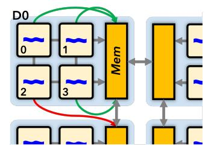

Figure 2: A classic NUMA system.

An access to a local domain (green arrow) is faster than to a remote domain (red arrow). The goal in a NUMA system is to place data in domains such that most accesses are local.

[Fig. 3](#page-2-0) shows sparse matrix-vector multiplication (spmspv, our running example in this paper). spmspv is application that parallelizes well onto a NUMA architecture: each thread performs an independent sparse inner product. spmspv's bottleneck is an intersection operation (∩, L.6) that finds matching locations of non-zero values in Ar and V, which are then multiplied and accumulated in a dot product (L.8-9).

```
1 parfor r = 0..A.numRows:
2 # Get non-zero (nz) indices of Ar
3 beg = A.rows[r], end = A.rows[r+1]
4 nzIdxA[] = A.nzIdx[beg..end]
5 # Ar ∩ V -> common nz indices
6 nzInBoth[] = nzIdxA ∩ V.nzIdx
7 # Dot-product, write to vector
8 D[r] = sum([A.val[i] * V.val[i] 
9 for i in nzInBoth])
```

Figure 3: Inner-product spmspv. A is in compressed sparse row format (CSR) and V is sparse. D is dense. ∩ (L.6) is its critical path.

For NUMA to be effective, threads 0–3 on domain D0 in [Fig. 2](#page-1-1) should have local access to A's CSR data structure, especially the data for nzIdxA (L.4-6). However, thread 2 incurs a remote access that slows down the intersection operation, hurting performance.

A NUMA system speeds up these remote accesses using information from a dynamic analysis and operating system (OS) support. An OS can migrate pages between NUMA domains [\[15\]](#page-11-2) or schedule a data-intensive thread close to a memory controller to reduce network traffic [\[24\]](#page-12-3). However, many systems simply interleave data across domains [\[27\]](#page-12-4). Interleaving utilizes all available memory capacity, but places most data remote, sacrificing most of the scaling potential of NUMA.

Non-uniform cache access (NUCA). NUCA [\[40\]](#page-12-1) systems distribute cache banks across the on-chip network, so that each core is closer to some cache banks than others. Like NUMA, the goal in NUCA is to place data so that most accesses are to local cache banks. Compared to NUMA, data migration is more practical in NUCA due to smaller data sizes and higher natural churn in caches.

Static NUCA [\[40\]](#page-12-1) simply interleaves addresses across cache accesses; like interleaved NUMA, Static NUCA incurs global communication for nearly all accesses and scales poorly. By contrast, Dynamic NUCA techniques respond to cache misses by migrating data towards the requesting core at the granularity of cache lines or pages [\[10,](#page-11-3) [12,](#page-11-4) [13,](#page-11-5) [18,](#page-11-6) [20,](#page-11-7) [83\]](#page-13-1). Dynamic NUCA techniques can be effective, but add significant complexity [\[83\]](#page-13-1) and/or rely on fragile heuristics [\[33,](#page-12-5) [55\]](#page-12-6). Due to these drawbacks, commercial multicores use Static NUCA despite its poor scalability.

Processing in-memory (PIM). Processing in- or near-memory architectures offload instructions to execute at or in the memory [\[1,](#page-11-8) [2,](#page-11-9) [5,](#page-11-10) [8,](#page-11-11) [26,](#page-12-7) [32,](#page-12-8) [34,](#page-12-9) [37,](#page-12-10) [41,](#page-12-11) [47,](#page-12-12) [62,](#page-13-2) [65,](#page-13-3) [69,](#page-13-4) [72,](#page-13-5) [73,](#page-13-6) [81,](#page-13-7) [87,](#page-13-8) [90,](#page-13-9) [91\]](#page-13-10). PIM systems generally target applications with poor data reuse, where caches are ineffective [\[47\]](#page-12-12). On these applications, PIM reduces the cost for instructions to fetch data, but increases the cost of communication between instructions. Thus, for PIM to be effective, most data accessed by a thread (or other unit of offloading) must be co-located at the same memory bank or vault, just like NUMA [\[88\]](#page-13-11).

NUPEA is similar to PIM in that both architectures reduce data movement by placing instructions closer to memory, however NU-PEA does this without increasing the communication cost between instructions. This opportunity is unique to SDAs.

Scratchpad memories. Some systems provide distributed scratchpads that enable extremely fast and cheap access to local data. Scratchpads are essentially an extreme version of NUMA: they shift the burden of data placement from the memory system to the user [\[43\]](#page-12-13) or compiler [\[54\]](#page-12-14), where statically reasoning about data access semantics is difficult. Moreover, since the scratchpad is not in the shared address space, data must be statically guaranteed to only be used by a single thread. For example, spmspv's accesses are difficult for a compiler to reason about because of pointer indirection through A and V. These drawbacks limit scratchpads to programs with regular accesses or language-level support [\[46,](#page-12-15) [66\]](#page-13-12), and have been largely unsuccessful on general-purpose processors.

Smart data placement is hard. The above techniques all rely, on some level, on smart data placement in the compiler to improve scalability. Data placement is extremely challenging for compilers on arbitrary code due to the difficulty of statically reasoning about memory aliasing. Moreover, data placement is generally ineffective when data are widely shared or too large to fit locally. Most generalpurpose systems instead prefer hardware-managed caches [\[55\]](#page-12-6).

Private caches offer the ability to place data near relevant compute based on the dynamic access pattern; this adaptability makes them extremely effective, and thus they are ubiquitous on multicores. However, private caches lower available capacity, risking a much higher miss rate than a shared cache. Moreover, private caches require a coherence protocol to arbitrate access to shared data, adding significant latency, network traffic, and design and verification complexity.

Private caches also require an abstraction for assigning work to each cache to effectively use the smaller capacity; this is typically exposed through a threading model and would be the responsibility of the programmer or an advanced compiler. On spmspv, private caches can achieve a low miss rate by splitting the rows of A across caches, provided that V is small enough to fit within each private cache. If work from the same row of A is spread to different caches, the same cache line may be loaded multiple times, increasing the miss rate. Worse, if D[r] is simultaneously written by multiple threads, coherence requires more global communication than a simple shared memory system.

Summary. Existing solutions to scale data movement are datacentric: all attempt to cleverly place data near threads that access it. To succeed, the data-centric approach requires data to be partitioned across threads, which systems have struggled to do automatically. Data-centric approaches are ineffective where data is widely shared or an individual thread's working set is large. NUPEA is a complementary way to scale data movement that exploits unique properties of SDAs by taking an instruction-centric approach.

# 2.2 New opportunities to scale data movement in SDAs

Spatial dataflow architectures [\[7,](#page-11-12) [23,](#page-12-16) [28–](#page-12-17)[31,](#page-12-18) [38,](#page-12-19) [53,](#page-12-20) [56,](#page-12-21) [58](#page-13-13)[–61,](#page-13-14) [64,](#page-13-15) [66,](#page-13-12) [68,](#page-13-16) [70,](#page-13-17) [71,](#page-13-18) [74,](#page-13-19) [76,](#page-13-20) [82,](#page-13-21) [84,](#page-13-22) [85,](#page-13-23) [93\]](#page-13-24) distribute compute onto an

array, or fabric, of PEs. PEs are small; each is designed to hold one or at most a few instructions at a time. A network-on-chip (NoC) mediates communication between PEs and to/from memory. Dataflow compilers produce a dataflow graph (DFG) of dependent instructions that fire asynchronously and communicate directly with each other [\[25\]](#page-12-22). The compiler then place-and-routes (PnR) instructions onto PEs and dataflow communication into the NoC.

<span id="page-3-0"></span>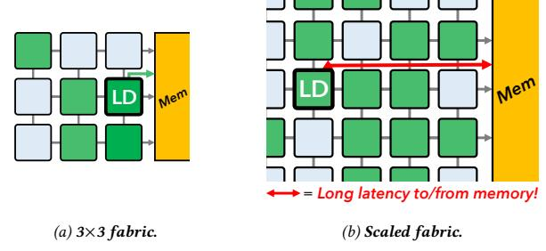

Figure 4: Data movement hampers fabric scalability. As fabrics grow larger, the distance to memory increases, making it impossible for all PEs to access memory in a single cycle.

Data movement hampers fabric scalability. [Fig. 4](#page-3-0) demonstrates the problem. These fabrics have a uniform PE access latency (UPEA) to memory. In [Fig. 4a,](#page-3-0) the 3 × 3 fabric is small enough that all PEs are close to memory.

However, as we scale the fabric in [Fig. 4b,](#page-3-0) most PEs get further and further away from memory. Maintaining uniform PE access means slowing down all memory accesses. Wire delay and arbitration complexity make it impossible for all PEs to reach memory without reducing fabric frequency or taking multiple cycles [\[53\]](#page-12-20).

In other words, UPEA fabrics suffer from the same fundamental scalability challenge as multicores [\(Sec. 2.1\)](#page-1-2), but flipped on its head. In SDAs, the instructions are distributed, and the challenge is how to scale their communication with memory.

```
while iAnz < Aend and iVnz < Vend:
                               Ai = nzIdxA[iAnz] # critical
                               Vi = V.nzIdx[iVnz] 
                               if Ai == Vi: sum +=
                              A.val[Ai] * V.val[Vi] 
                               iAnz += 1 if Ai <= Vi
                               iVnz += 1 if Vi <= Ai
6 nzInBoth[] = nzIdxA ∩ V.nzIdx
8 D[r] = sum(...) # Dot-product
```

Figure 5: An implementation of spmspv's ∩ operation using a streamjoin [\[23,](#page-12-16) [36\]](#page-12-23). nzIdxA[iAnz] is a critical load along the recurrence for iAnz (red highlights). This load's latency controls how quickly the next iteration of the loop can launch.

Spatial dataflow architectures place instructions to reduce data movement. Unlike conventional cores, which are heavily time-multiplexed by all instructions in a thread and dynamically scheduled by hardware, SDA compilers control individual instruction placement. Communication between distant PEs is expensive because it requires either multiple cycles (on buffered networks) or a slower frequency (on bufferless networks). To localize PE communication, SDA compilers optimize instruction placement during PnR to place frequently communicating instructions near each other.

It is a small jump for the compiler to also localize fabric-memory communication for critical memory operations. Take spmspv's ∩ operation for example, which [Fig. 5](#page-3-1) implements with an irregular stream-join loop [\[23,](#page-12-16) [36,](#page-12-23) [42\]](#page-12-24). The compiler can trivially identify that variable iAnz controls loop iteration and depends on a load from nzIdxA through the def-use chain (i.e., operations in red). By using simple heuristics and leveraging common inductionvariable or loop-recurrence analyses, the compiler can prioritize data-dependent control flow and place the critical load along iAnz's recurrence close to memory. Importantly, the compiler need not reason about the underlying data to accelerate this critical load and ensure the next loop iteration launches as quickly as possible. NU-PEA thus avoids the intractable alias analysis, complex hardware, and/or software changes required by data-centric approaches.

Prior SDAs do not exploit NUPEA. Most prior SDAs take the conventional, data-centric approach to scaling data movement. For example, WaveScalar [\[76\]](#page-13-20) relies on a traditional multi-level cache hierarchy for data, and dynamically schedules instructions to PEs independent of how they access data [\[77\]](#page-13-25). Fifer [\[56\]](#page-12-21) implements a multi-"core" SDA, where each fabric communicates with a traditional cache hierarchy. Fifer manages long-latency loads by rapidly switching between tasks to hide the latency. Similar to Fifer, SGMF [\[85\]](#page-13-23) replaces GPU cores with dataflow fabrics, while using a traditional GPU's memory hierarchy. SGMF features load-store PEs on the perimeter of each dataflow fabric but does not exploit non-uniform fabric-memory communication.

The SDA-adjacent Raw architecture [\[86\]](#page-13-26) introduces a distributed register file with non-uniform register access (NURA). Raw's compiler manages both instruction and data placement; it maps explicit pipeline stages of streaming programs [\[45,](#page-12-25) [79\]](#page-13-27) onto its cores and data onto adjacent register files. Raw relies on compile-time analysis of memory references and runs into the same limitations as scratchpads: without language-level support, Raw's compiler cannot optimize instruction placement [\[80\]](#page-13-28).

Tartan [\[53\]](#page-12-20) breaks programs into hyperblocks and then greedily places hyperblocks to minimize communication; dependent hyperblocks are placed near each other. Tartan collects memory profiles of hyperblocks and places those that access memory frequently closer to the memory ports. This is similar to NUPEA, but only at the hyperblock level. Similar to placing threads on cores, Tartan must consider an entire block of instructions at a time and cannot identify and place individual critical loads. The result is more data movement than necessary and misallocation of some scarce PEs with fast access to memory. A NUPEA architecture unlocks optimized instruction placement within a hyperblock; the compiler can collect critical loads in the block and place them in fast domains.

The Versal FPGA [\[78\]](#page-13-29) includes a hardened NoC, which is used to provide high-bandwidth access to DRAM or HBM. The Versal NoC compiler takes as input a dataflow graph of communication endpoints, along with required bandwidth point-to-point, and performs PnR using optimization-based techniques. The NoC compiler can thus optimize for placing endpoints with high memory bandwidth closer to memory controllers. NoH [\[39\]](#page-12-26) is an HLS flow for this NoC that incorporates NoC bandwidth consumption into its global placement algorithm. However, the critical path cannot be optimized for in these flows.

Many other SDAs are designed with specialized memory access hardware and are orthogonal to NUPEA architectures. For instance,

<span id="page-4-1"></span>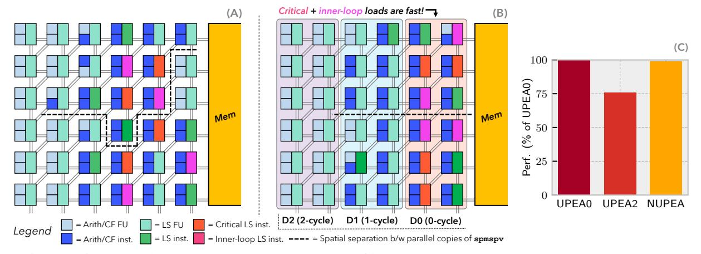

Figure 6: (a) spmspv (unrolled  $2\times$ ) and mapped onto a  $6\times6$  UPEA fabric. (b) Same spmspv mapped onto a  $6\times6$  NUPEA fabric. A NUPEA-aware PnR places critical and other inner-loop loads in fast NUPEA domains for low fabric-memory latency (D0). (c) Simulated performance of spmspv on a  $2^{12}\times2^{12}$  random uniform matrix and vector, both with 90% sparsity. NUPEA performs nearly as well as an idealized design with uniform, 0-cycle memory latency (UPEA0), and 32% better than a practical design with uniform, 2-cycle latency (UPEA2).

stream-dataflow SDAs [60] implement regular, data-parallel programs with streaming memory units [22, 23, 71, 89]. Plasticine [66] similarly supports vectorized and pipelined memory accesses via distributed scratchpads; users must write code and map program data using parallel patterns that facilitate data placement [43]. Finally, statically scheduled SDAs and systolic arrays often target small, regular code. They feature homogeneous memories, statically known load latencies, and small fabric sizes [38, 51, 52, 75] (similar to Fig. 4a), which obviates the need for non-uniform access. Some lean on a co-processor to access memory altogether [31].

## <span id="page-4-0"></span>3 Non-Uniform Processing-Element Access

NUPEA is a technique to optimize data movement in a spatial dataflow architecture by exploiting the heterogeneous distance from PEs to memory. A spatial NUPEA architecture abstracts fabric-to-memory communication as a *NUPEA domain*, or a group of PEs that share the same latency and bandwidth to access memory. Spatial NUPEA architectures expose domains to a compiler in two ways: (i) as a *property of the fabric topology*, where PEs with memory access are assigned a domain, and (ii) as an *ordered set* of NUPEA domains in the architecture, sorted by memory latency/bandwidth.

Fig. 6 illustrates spmspv running on a conventional SDA and an SDA with NUPEA. Fig. 6a shows a fabric with uniform PE access (UPEA) latency, and Fig. 6b shows the same fabric with NUPEA. The NUPEA SDA has three domains,  $D2 \le D1 \le D0$ , sorted by their proximity to memory. D2 is designed with a best-case fabric-memory latency of 2 cycles, D1 with 1 cycle, and D0 with 0 cycles.

*Uniform PE access hurts performance.* The UPEA design in Fig. 6a has a global network for PE-to-memory communication. This makes the compilers job easier, because it need not reason about load criticality or memory latency, but it causes performance to suffer as the fabric scales. The performance impact of uniform memory latency can be significant. On spmspv, going from a best-case latency of 0 cycles to 2 cycles — a practical design, given the levels of arbitration required — degrades performance by 24%.

**NUPEA enables optimized placement of critical loads.** Exposing NUPEA domains in the architecture equips the compiler to prioritize critical memory instructions for placement in faster NUPEA domains. In Fig. 6b, the compiler has placed the four critical loads (part of the ∩ operation in L.6 in Fig. 3) and inner-loop loads of the dot product (L.8-9) in D0 to achieve best-case memory performance. With UPEA (Fig. 6a), there is no option to prioritize critical memory options, subjecting them to worst-case delays.

NUPEA recovers most of the performance of UPEA on spmspv. By promoting critical loads to the fast domain (D0), NUPEA achieves 99% of the performance of an idealized UPEA baseline with 0-cycle memory latency for all PEs. Loads in the inner loop of spmspv are placed in D0. Meanwhile, spmspv tolerates higher latency on the load from A. rows (L.3 in Fig. 3), which can be placed in slower D1 (green) with little impact on performance. Fast memory access is only required for critical loads, which can be satisfied by a subset of PEs in the SDA located "near memory" over the NoC.

NUPEA: A new dimension on which to scale data movement. NUPEA is an instruction-centric approach to mitigate the rising cost of data movement in parallel architectures. Unlike prior, datacentric approaches, NUPEA does not require compilers to identify critical data or reason about how it will be accessed. Instead, NUPEA asks compilers to estimate the criticality of loads and exploits the distributed processing of SDAs to scale communication.

NUPEA unlocks a new dimension to scale data movement. NU-PEA is applicable where NUMA is ineffective or difficult to implement. We focus particularly on irregular or "general-purpose" code where it is difficult to statically analyze memory references, but NUPEA is also advantageous on data sizes that do not fit in a private cache or single NUMA domain.

This paper focuses on the NUPEA technique and its implementation in Monaco, which features a single, centralized main memory; see Sec. 4. Note, however, that NUPEA is complementary to prior data-centric approaches to scale data movement. One could design SDAs with non-uniformity in both memory and PE access to further scale data movement.

#### <span id="page-5-0"></span>4 The Monaco NUPEA Microarchitecture

Monaco is a spatial dataflow architecture that implements NUPEA domains. Monaco has a 12×12 fabric of heterogeneous PEs. PEs can have a variety of functional units (FUs) for arithmetic, control-flow, and/or memory instructions. Only the subset of PEs with a memory FU can execute loads and stores. Monaco memory is banked 32× with a shared, memory-side cache. PEs communicate with each other over a statically routed, bufferless data NoC. PEs talk to memory over a dynamic, multi-stage NoC that arbitrates requests to memory ports. This section details the Monaco microarchitecture with a focus on its NUPEA domains and implementation of the fabric-memory NoC.

#### 4.1 Monaco's dataflow model

**Instruction set.** Monaco supports a general-purpose dataflow instruction set covering common arithmetic instructions, loads, and stores (similar to [11, 17, 25, 29]). Unlike branching in traditional von Neumann architectures, Monaco implements steering control ( $\phi^{-1}$ ) [16, 21, 25, 29, 76] that converts control dependencies into data dependencies. Steer instructions explicitly route data values to dependent instructions when they need them.

Execution model. Monaco employs the dataflow execution model, where an instruction fires once all of its input data (tokens) arrive [25]; there is no program counter. Independent instructions can fire in parallel. Specifically, Monaco implements *ordered* dataflow, where tokens are kept in FIFO buffers and execute in-order [29, 53, 66, 74, 93]. Ordered dataflow saves energy and reduces hardware complexity over out-of-order, tagged dataflow [58, 63]. Monaco's fabric executes one *bitstream* at a time. A bitstream describes which PEs are active, which instruction runs on each PE, and which routes are active in the data NoC.

<span id="page-5-1"></span>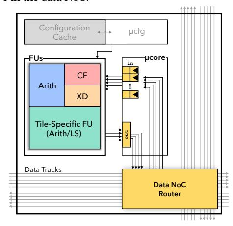

Figure 7: Monaco PE microarchitecture. Each PE has an arithmetic FU, control-flow FU (CF), and an FU to hold program arguments (xdata or XD). Half of Monaco's PEs have an additional arithmetic FU, the other half has an additional LS FU.

**PE** microarchitecture. Fig. 7 shows the microarchitecture of a PE. PEs load instructions from its bitstream configuration cache, controlled by the  $\mu$ cfg on the tile. A PE communicates with the data NoC through its  $\mu$ core. PEs buffer tokens at its inputs for each instruction operand for better instruction pipelining [74]. Control FUs are an

exception: they omit input buffers and run combinationally [11]. Monaco's PEs do not time-multiplex instructions; rather, each PE runs one instruction for the duration of a bitstream's execution.

**Data NoC.** PEs communicate tokens through a bufferless, statically routed mesh network. The data NoC connects each tile to 3 separate tracks (each 32-bit wide) to ensure enough routing capacity between PEs. Monaco has one cardinal track, one diagonal track, and one skip track — diagonal and skip tracks only go through a router every other hop, requiring 5 tracks at each edge of the tile for the 3 tracks at each router. Routers adopt a Wilton topology [49].

#### 4.2 Monaco's NUPEA fabric

Monaco has a large, 12×12 fabric of heterogeneous PEs. Fig. 8 shows the Monaco fabric, data NoC, and fabric-memory NoC. Monaco's fabric lays out compute such that each row alternates between arithmetic-only PEs and load-store (LS) PEs. Half of Monaco's PEs (72) are LS PEs (i.e., they contain a memory FU), which helps to support large programs. The LS PEs also contain simple arithmetic FUs, allowing them to execute basic integer instructions as needed.

<span id="page-5-2"></span>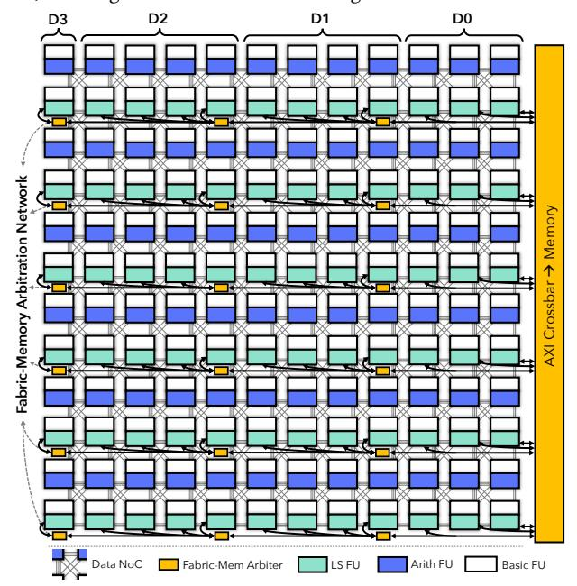

Figure 8: Monaco's spatial dataflow fabric.

Clock divider. Monaco has two clocks: system and fabric. PEs execute on the fabric clock, which is divided down from the system clock. Monaco provides a configurable clock divider for the fabric clock, which is set dynamically when a bitstream is loaded. The clock divider ensures that the fabric can meet timing constraints: the data NoC is bufferless, so the fabric clock must cover the longest path between PEs in each bitstream. The compiler performs static timing analysis and optimization during PnR to minimize the clock divider (i.e., maximize frequency).

While the fabric may run at a lower frequency, the rest of the system, including memory and the fabric-memory NoC, run at a fixed frequency. Thus, there is a ratiosynchronous clock-domain crossing in LS tiles between the fabric and memory.

<span id="page-6-1"></span>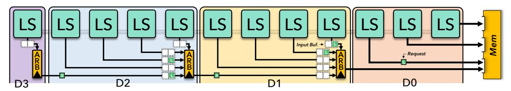

Figure 9: Fabric-memory network with arbitration. LS PEs route memory requests to memory through this network.

**NUPEA domains.** Monaco features four NUPEA domains to segment its LS PEs by levels of non-uniform access. The domains are organized by their proximity to memory (on the right side of Fig. 8) in the order D3  $\leq$  D2  $\leq$  D1  $\leq$  D0. Each domain (except the last) covers multiple columns of LS PEs.

Fabric-memory NoC. LS PEs connect to the fabric-memory NoC that routes requests and responses to and from memory. The network is disaggregated across the rows of LS PEs, with each slice of the network managing only its row (e.g., see the second row of LS PEs in Fig. 8 and the arbitration beneath it). Fig. 9 zooms in on one row of LS PEs connected to its slice of the fabric-memory NoC. Monaco splits the network into two (with identical topologies), one for fabric-to-memory requests and one for data responses back; Fig. 9 shows the request network.

Arbiters are also organized by row and domain: there is one for each domain per row apart from D0, which has no arbiters (a special case we discuss below). Arbiters are placed in the column closest to memory in each domain.

To enable NUPEA, arbiters are arranged hierarchically as an imbalanced tree with a fanout of 4; each arbiter is connected downstream to the arbiter in the next-closest NUPEA domain (towards memory). Arbiters are flopped to break up the critical path across arbitration stages, so that each domain adds a cycle of latency. Arbitration in the fabric-memory NoC runs on the system clock, which is faster than the fabric clock, hiding some of this delay.

Upon a load or store, an LS PE sends a request to its local arbiter. An arbiter chooses a request to forward upstream (to the next arbiter or to memory) in round-robin fashion, and so on, until the request reaches a memory port.

High bandwidth in fast NUPEA domains. The fabric-memory NoC is disconnected from LS PEs in the first NUPEA domain, D0. Instead, each of D0's LS PEs connect directly to a memory port (as shown in Fig. 9). This design enables high bandwidth in the low-latency D0 domain, freeing critical instructions up from any delays due to arbitration. The rest of a row's slice of the fabric-memory NoC is connected to every third port. This third port is combinationally arbitrated between an LS PE from D0 and the arbiter of domain D1 (see Fig. 9). Monaco has a total of 18 memory ports from the fabric to memory; this was the most that would close timing in a single system-clock cycle.

**Non-uniform PE access is key to scaling Monaco.** By localizing communication to a specific row and NUPEA domain before routing data, Monaco creates a *hierarchy* of arbitration. Explicit non-uniformity opens up the network to pipeline data to and from memory without degrading communication delay for all memory instructions.

NUPEA also promotes scalability *throughout* Monaco's fabric. Monaco can afford to distribute LS PEs across the fabric without degrading critical load performance. This is essential to make good use of the entire fabric. By contrast, an SDA that naively clusters all LS PEs as close to memory as possible [11] partitions the fabric into areas of mostly-arithmetic and mostly-LS PEs, creating significant routing challenges between the partitions.

NUPEA allows the fabric to scale much further than an UPEA design. However, NUPEA does not scale indefinitely, since the far domains will eventually become unusable as their memory latency increases unbounded. Scalability can be increased by optimizing the fabric-memory NoC topology, but we expect that complementary, data-centric scaling techniques will be required to scale to truly huge fabrics (Sec. 2.1). We study the impact of fabric topology and PE mix in Sec. 7.

## <span id="page-6-0"></span>5 NUPEA In The Efficient C Compiler (effcc)

Our compiler, effcc, generates optimized DFGs from programs written in C and performs PnR to map DFGs to Monaco's fabric. effcc's PnR is NUPEA-aware; it adds simple heuristics to (i) identify critical loads through static analysis, and (ii) promotes those loads to fast NUPEA domains during placement.

**Dataflow lowering.** Users mark C code to offload to Monaco by decorating functions with \_\_effcc\_rip. effcc builds a DFG using MLIR [44]; it lowers code to standard dialects (e.g., scf). effcc runs common SDA-specific lowering passes including steer insertion [29] and memory ordering [29, 53, 76] before generating the DFG in a custom dialect for Monaco's dataflow instructions.

Automatic parallelization. effcc uses spatial parallelization to achieve high performance. Specifically, effcc lifts loops to the scf dialect's parallel loop primitive whenever possible, and such loops are replicated by a chosen parallelism degree. The compiler iteratively increases the parallelism degree until PnR fails [92], which enables it to achieve high performance while while not exceeding PE and routing resources.

effcc also allows programmers to explicitly control the parallelism factor via compiler directives. Parallelization is critical to make good use of a large SDA fabric; however, further details of effcc's automatic parallelization are outside the scope of this paper.

*Identifying critical loads.* effcc analyzes DFGs for loads that are likely to reduce throughput of the program, categorizes them by criticality, and marks them in the IR. For this work, we use simple heuristics that focus on loops. Our heuristics identify *(a) critical* loads that contribute to long initiation intervals (II), i.e., loads on a loop-governing recurrence, and *(b) inner-loop* memory instructions, as they are likely to execute frequently. effcc considers *(a)* more

critical than (b) because long loads along recurrences can block work for *all* dependent instructions.

<span id="page-7-1"></span>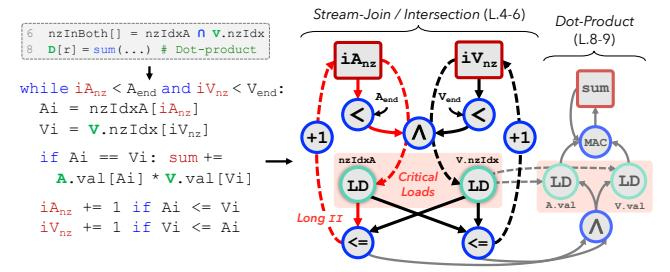

Figure 10: spmspv's  $\cap$  and inner dot-product are implemented as a stream-join in an irregular loop (as in Fig. 5, left). Its DFG features complex control flow (abstracted as dashed arcs) with critical loads along a loop-governing recurrence (red arcs) with long II.

Fig. 10 shows an example of (a) and (b) using spmspv's  $\cap$  and dot-product. On the left, the high-level operations (L.6,8 of Fig. 3) are implemented as a stream-join or co-iteration [3, 23]. Iterators (e.g.,  $iA_{nz}$ ) walk through vectors of non-zero locations (e.g., nzIdx) in an irregular while loop and update the dot product upon an index match. The corresponding DFG (right) is complex with heavy control flow (dashed arcs). Importantly, the DFG shows one of the recurrences (chain of red arcs starting at  $iA_{nz}$ ) with a long II, where several conditional instructions need to run to initiate another iteration of the loop. The loads along the recurrences (highlighted in red) are critical; the SDA cannot pipeline any work until the data-dependent loop condition is resolved. effcc marks those loads as (a) (most critical) and the loads of the inner dot-product as (b).

Prior work on static or profile-guided analysis also categorizes loads similarly (loads with long forward dependence chains, loads in branch conditions, and pointer-chasing [48, 54, 57, 67]) to reduce stalls on conventional CPUs. More sophisticated analyses are possible, but we found these simple heuristics quite effective across a range of computations.

**NUPEA-aware PnR.** effect lowers the IR to a netlist representation used by PnR. effect then performs PnR, primarily using simulated annealing (SA), similar to Pathfinder [50] and VPR [14]. To support NUPEA, we add NUPEA-aware heuristics that prioritize LS for domains following the partial ordering of Monaco's NUPEA domains encoded in the fabric topology. Since domains on Monaco span multiple columns of PEs, we encode an additional preference to place instructions in columns closer to memory. Placing instructions across columns of LS PEs avoids overloading arbiters in any single row. The heuristic amounts to an ordering of placement preferences: ...  $D1.c0 \le D0.c2 \le D0.c1 \le D0.c0$ , where cN denotes a column and a lower numbered column is closer to memory. effect gives domain-preference in the order of (i) critical loads, (ii) inner-loop memory instructions, (iii) other memory instructions. By design, critical loads get preference for fast NUPEA domains.

These heuristics are adopted in the cost functions of the annealing phases of PnR. Specifically the heuristic acts like a throughput reduction factor, which we multiply by the critical path delay to get an overall throughput estimate in the objective function. The initial placement phase is also customized for NUPEA; LS are placed first, favoring domains according to the order suggested above. Then

all other instructions are placed greedily in breadth-first order, traversing through both defs and uses.

## <span id="page-7-0"></span>6 Experimental Methodology

We implement NUPEA-aware compilation and PnR in effcc and evaluate Monaco using an in-house microarchitectural simulator.

**Compiler.** We integrate critical-load analysis and NUPEA-aware PnR heuristics into effcc's MLIR compilation stack. effcc's PnR optimizes fabric frequency using delays from sign-off timing closure of the Monaco implementation in the worst-case corner.

Microarchitectural simulator. We simulate Monaco using a microarchitectural dataflow simulator used internally for design-space exploration of the fabric topology and FU mix. We model Monaco's PEs, instruction execution, fabric-memory NoC, and arbitration as described in Sec. 4. Arithmetic instructions take 1 cycle to execute, while control flow executes combinationally [11, 29]. Loads and stores have variable latency depending on arbitration in the fabric-memory NoC, cache misses, and bank conflicts. Request and data transfer through the fabric-memory network takes 1 cycle (system clock) per arbitration hop; loads and stores in NUPEA domain D0 see no delay in the fabric-memory NoC. We evaluate Monaco with a total memory size of 8MB, including a 256KB data cache. Main memory and the data cache are banked 32×. Main memory latency is 4 cycles and a cache hit takes 2 cycles (both on the system clock).

To simulate Monaco correctly considering the different fabric and memory clocks, we process events in the memory system and fabric-memory NoC faster by a factor of the clock divider. For instance, if the clock divider is 2, then main memory latency is 2 cycles instead of 4, and arbiters have twice the throughput.

*Benchmarks.* We evaluate 13 workloads from dense and sparse linear algebra, graph processing, DSP, and ML that are parallelizable by effcc. Many of these workloads feature complex iteration patterns and indirect memory accesses. We outline them in Table 1.

<span id="page-7-2"></span>Table 1: Applications. jacobi2d and heat3d are from Polybench [94]. spmv, spmspv, spmspm, and spadd are generated by TACO [42]. tc is derived from GAPBS [9]. fft runs arm\_rfft\_q31 from CMSIS-DSP [4]. ad, ic, and vww are neural networks from MLPerfTiny [6].

| Application                          | Inputs                                    |
|--------------------------------------|-------------------------------------------|
| Dense matrix-vector (dmv)            | Size: 1,024×1,024                         |
| 2D Jacobi stencil (jacobi2d)         | Size: 200×200, 100 steps                  |
| Heat equation, 3D stencil (heat3d)   | Size: 40×40, 80 steps                     |
| Sparse matrix-dense vector (smv)     | Size: 4,096×4,096, Sparsity: 90%          |
| Sparse matrix-sparse matrix (spmspm) | Size: 512×512, Sparsity: 90%              |
| Sparse matrix-sparse vector (spmspv) | Size: 4,096×4,096, Sparsity: 90%          |
| Sparse matrix addition (spadd)       | Size: 1,024×1,024, Sparsity: 50%          |
| Triangle counting (tc)               | Nodes: 4096, Sparsity: 5%                 |
| Mergesort (mergsort)                 | List size: 2 <sup>20</sup>                |
| Fast Fourier transform (fft)         | Points: 4096, Input size: 2 <sup>20</sup> |
| Anomaly Detection (ad)               | Size: 5×128                               |
| Image Classification (ic)            | Size: 32×32                               |
| Visual Wake Words (vww)              | Size: 96×96                               |

Inputs are random and chosen such that they fit in memory and Monaco runs at least 15M instructions. We hand-optimized parallelism factors for effec and chose the one that achieved optimal

<span id="page-8-2"></span>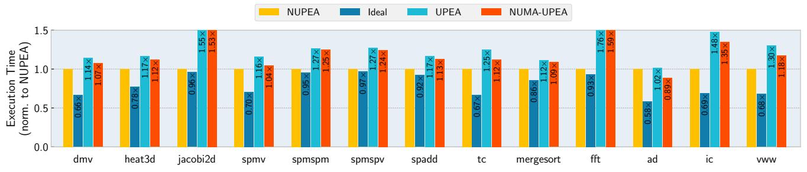

Figure 11: The Monaco NUPEA SDA compared against an ideal baseline with 0-cycle UPEA delay and realistic UPEA and NUMA baselines. A shorter bar indicates faster execution. Monaco improves performance over realistic UPEA by avg 28% and NUMA-UPEA by avg 20%. Monaco is within 21% of ideal.

<span id="page-8-3"></span>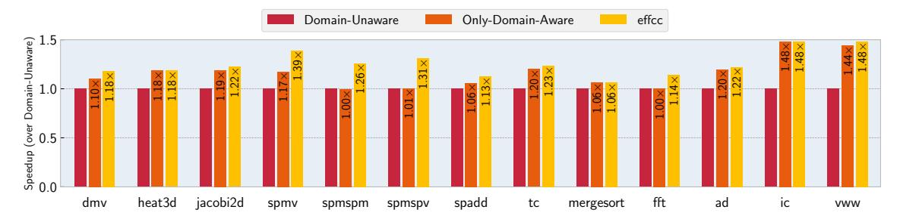

Figure 12: Application speedup attained from NUPEA-aware heuristics in PnR. Only-Domain-Aware achieves an avg 16% speedup over no awareness. effect fuses both NUPEA-domain-awareness and criticality information to achieve an avg 25% speedup over Domain-Unaware and an additional 9% speedup over Only-Domain-Aware.

performance for all workloads except tc, ad, ic, and vww; these were automatically parallelized by effcc.

**Performance baselines.** We compare performance against two baselines: a UPEA SDA with uniform memory access and a UPEA baseline that implements NUMA. Both baselines have the same fabric topology, PE mix, and memory ports as Monaco. To simulate uniform PE access, we add a delay of N fabric cycles to all memory requests, where N is the UPEA latency. To reach all 72 LS PEs with fanout-4 arbitration, an additional N=2 fabric cycles are required. To simulate NUMA, we assign LS PEs randomly to four NUMA domains and interleave the address space across the NUMA domains. If a LS PE accesses its local domain, it incurs no fabric-memory delay; only remote accesses are subject to UPEA latency. Both SDA baselines model only the delay from UPEA and do not explicitly arbitrate memory requests to memory ports. Thus, the baselines have a higher available memory bandwidth than Monaco in our evaluation.

When comparing against these baselines, we set Monaco's fabric clock divider to 2. We empirically confirmed that PnR can achieve a clock divider of 2 in practice, making Monaco safe to run at that frequency.

Fabric topology baselines. We compare Monaco's fabric topology to alternative NUPEA SDA topologies that cluster LS PEs onto the side of the fabric closest to memory. Fig. 13 shows the two clustered topologies that we evaluate (shown on a 12×12 fabric). Clustered-Single (CS) arranges every row with LS PEs on the right, close to memory. Clustered-Double (CD) does the same but doubles the number of memory ports and LS PEs in its fastest NUPEA domain. To compare, a 12×12 Monaco fabric has 18 memory ports, CS has

12, and CD has 24. In Sec. 7.2, we compare the scalability of these fabric topologies.

<span id="page-8-1"></span>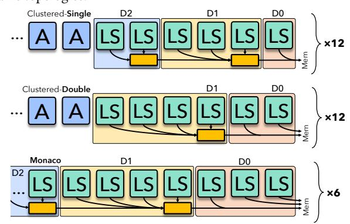

Figure 13: Alternate topologies for NUPEA: Clustered-Single (CS) and Clustered-Double (CD), showing an abbreviated row of PEs for each topology (LS and A for arithmetic). These topologies cluster all LS PEs near memory, with all 12 rows featuring LS PEs like the ones shown. Fig. 9 is simplified here to also show Monaco for comparison. Unlike CS and CD, Monaco has alternating rows of fully LS or fully arithmetic PEs; only one of its 6 fully LS rows are shown here.

#### <span id="page-8-0"></span>7 Evaluation

We evaluate Monaco and show that it achieves higher performance than alternative SDA designs and achieves better fabric scalability than alternative NUPEA topologies. We demonstrate that NUPEA-aware PnR also boosts performance.

<span id="page-9-0"></span>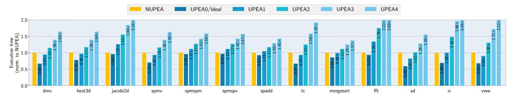

Figure 14: NUPEA v. a sweep of UPEA SDAs with PE access latencies from 0 (ideal) to 4 cycles. A shorter bar indicates faster execution.

<span id="page-9-2"></span>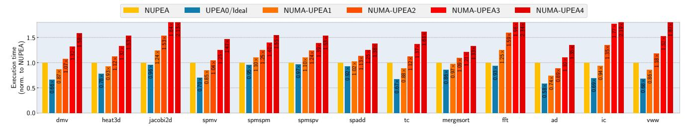

Figure 15: NUPEA v. a sweep of UPEA SDAs with NUMA memory, with a uniform PE access latency on remote access from 0 (ideal) to 4 cycles. A shorter bar indicates faster execution.

## <span id="page-9-1"></span>7.1 Primary results

**NUPEA achieves better performance over realistic UPEA designs.** Fig. 11 plots execution time of Monaco against three UPEA baselines: (i) **Ideal**, a UPEA SDA with 0-delay uniform PE access, (ii) **UPEA**, a realistic UPEA SDA with 2-cycle PE access, and (iii) **NUMA-UPEA**, a UPEA SDA with 2-cycle PE access and NUMA memory domains. Execution time is normalized to Monaco.

Monaco achieves higher performance than UPEA and NUMA-UPEA by 28% and 20% percent, on average. Monaco is also within 21% of Ideal. Monaco generally performs better against UPEA than NUMA-UPEA because NUMA can sometimes reduce latency for local accesses while UPEA cannot.

Monaco demonstrates strong performance on sparse applications, including sparse tensor multiplication and graph processing. spmspm and spmspv, in particular, feature critical loads along long recurrence paths. effec successfully maps these loads to NUPEA domain D0, allowing them fast access to memory. Monaco achieves a 27% performance improvement over UPEA on those sparse tensor programs. Notably, spmspm and spmspv are also nearly Ideal — only 5% and 3% slower — indicating that Monaco successfully accelerated the key bottleneck in those applications.

Monaco performs very well on the stencil program jacobi2d, CMSIS-DSP's fft, and MLPerfTiny's ic convolutional neural network. These programs have a high number of memory instructions, and neither UPEA nor NUMA-UPEA can maintain low access time to memory. jacobi2d and fft are also particularly latency sensitive because their DFGs feature memory ordering: for correctness, some memory instructions must finish before succeeding code regions (e.g., the next stage in an unrolled loop) can begin. effcc and Monaco accelerate the performance-critical memory instructions in these workloads — critical and inner-loop loads — by mapping the majority of them to domain D0 for fast fabric-memory communication.

Monaco brings jacobi2d and fft within 4% and 7% of Ideal, respectively, by improving the performance of those memory instructions that order code regions.

Monaco also performs well on other dense workloads compared to UPEA and NUMA-UPEA, but is generally farther from Ideal (>30% slower). Dense matrix algebra and CNNs have regular access patterns and parallelize easily, which generally enables a higher number of memory instructions-per-cycle (IPC). These workloads also rely on lower load latency for most memory instructions in the program to achieve good performance. We observe higher arbitration congestion in the fabric-memory network with higher memory IPC from these dense workloads, which increases average fabric-memory access latency even in near-memory domains (e.g., D0 and D1). By contrast, sparse workloads feature control-dependent memory operations that execute less frequently, and their performance is dependent on the latency of a few critical loads in the program. Monaco accelerates those critical loads well, enabling performance closer to Ideal.

NUPEA-aware PnR boosts performance. Fig. 12 demonstrates the performance attained by effcc's PnR heuristics. It compares (i) Domain-Unaware, a simple domain-unaware heuristic that has no incentive to place memory instructions on LS PEs close to memory, (ii) Only-Domain-Aware, a NUPEA-domain aware heuristic that prioritizes fast-domain placement but does not prioritize critical or inner-loop instructions, and (iii) effcc, which incorporates both criticality information and NUPEA-domain awareness to improve performance for all dense and sparse apps that we evaluated. Only-Domain-Aware achieves a 16% speedup on average over the Domain-Unaware heuristic. By fusing both criticality information and NUPEA-awareness into PnR, effcc improves performance over the Only-Domain-Aware heuristic by an additional 9% on average, amounting to a total improvement of avg 25% over Domain-Unaware.

Sparse applications with intersection computation like spmspm and spmspv benefit the most from criticality-aware PnR. While Only-Domain-Aware prioritizes placement in fast NUPEA domains, it does not distinguish between the few critical ones in the  $\cap$  operation and the many loads and stores that traverse the sparse matrix outside of the intersection. The results show that identifying critical loads is essential for spmspm and spmspv. Other sparse applications (e.g., tc and spadd) or programs with heavy memory ordering (e.g., fft) also benefit from effcc's heuristic. These applications feature data-dependent control-flow inside inner loops, which effcc can exploit and map to fast NUPEA domains.

Notably, the dense stencil applications and dense neural network workloads receive the most benefit from Only-Domain-Aware and do not improve with criticality information. These programs generally have inner-loop loads and stores without any on a critical recurrence, so simple domain-awareness is sufficient to improve speedups. jacobi2d is an exception; a few of its memory instructions are placed on a recurrence added by effect for memory ordering. Only-Domain-Aware maps most of those critical instructions into D0 by chance, but effect targets and maps all of them to the fast domain, which accounts for a small speedup over Only-Domain-Aware. dmv also strays from this trend; criticality information further improves its performance over Only-Domain-Aware by saturating fast domains with inner-loop loads from the dense matrix.

## <span id="page-10-0"></span>7.2 Sensitivity and scalability studies

Monaco achieves scalable performance while UPEA SDAs are highly sensitive to uniform PE access latency. We study the sensitivity of applications to uniform PE access latency by expanding the plot in Fig. 11. Fig. 14 shows execution time normalized to Monaco on all our applications. For each workload, we sweep the uniform access latency from 0-4 cycles. Performance almost linearly degrades for all applications as UPEA delay increases because programs cannot tolerate long uniform latency communication. This confirms the risk of designing an SDA without NUPEA domains. In comparison, Monaco is on-par with a UPEA system with 1-cycle uniform delay (UPEA1, 3% faster), improves on UPEA2 by 28% (same as Sec. 7.1), improves on UPEA3 by 55%, and beats UPEA4 by 82%. Monaco can tolerate long loads from its far domain (i.e., at least 4-cycle PE access) but still achieves reasonable performance by prioritizing critical instructions for fast-access domains.

Fig. 15 demonstrates that adding non-uniform memory access (NUMA) does not solve the unscalability of UPEA seen in Fig. 14. The plot shows a similar linear degradation in performance, but NUMA does recover some performance compared to UPEA. Monaco comes within 2% of an SDA with UPEA latency of 1 cycle for remote accesses (NUMA-UPEA1), improves on NUMA-UPEA2 by 20%, improves on NUMA-UPEA3 by 44%, and achieves a 68% performance improvement over NUMA-UPEA4. In principle, a NUMA-aware compiler could do better than effec here by cleverly partitioning data across NUMA domains, but this has proven difficult and has some fundamental limitations, as discussed in Sec. 2.1.

Overall, introducing non-uniformity into the SDA fabric offers a complementary approach to scaling data movement to conventional, data-centric approaches. NUPEA is more effective than NUMA at the scale of Monaco's SDA: critical memory operations

are accelerated without imposing a high PE access latency on all instructions.

Monaco's fabric topology is advantageous to scale fabric resources. We show that Monaco's fabric layout offers better performance and reduces long communication paths on the data NoC compared to a NUPEA SDA design that clusters LS as close to memory as possible. We demonstrate by evaluating spmspv on smaller inputs; effect automatically parallelizes the workload and compiles it for Monaco, Clustered-Single (CS) and Clustered-Double (CD). Recall that CS and CD are NUPEA fabrics that add LS PEs to each row in the columns closest to memory (see Fig. 13 in Sec. 7). They have the same number of LS PEs as Monaco, but clustered near memory. We can scale Monaco, CS, and CD to different fabric sizes by increasing or decreasing the number of LS PEs and NUPEA domains; rows of PEs still alternate between arithmetic and LS in Monaco. In this experiment, we scale fabric size while constraining data NoC resources.

<span id="page-10-1"></span>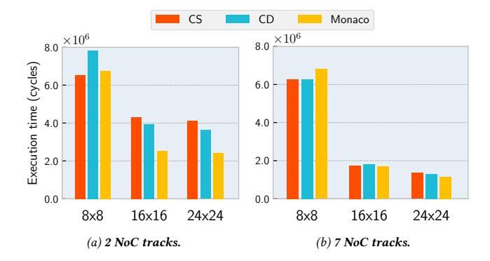

Figure 16: Execution time of spmspv on Monaco, Clustered-Single (CS), and Clustered-Double (CD) across increasing fabric sizes on two extremes of NoC resources (2 vs. 7 tracks). Monaco's topology unlocks performance, even with tight resource constraints (2 tracks).

Fig. 16 plots execution time of spmspv on Monaco, CS, and CD on  $8\times8$ ,  $16\times16$ , and  $24\times24$  fabrics (lower is better). Fig. 16b and Fig. 16a show two extremes: plenty of NoC tracks and very few. As fabric size scales with 7 NoC tracks in Fig. 16b, performance is competitive between all topologies. However, at the extreme in Fig. 16a, 2 tracks are not enough for CS and CD to achieve good performance, especially on  $16\times16$  and  $24\times24$  fabrics. CS and CD face extra routing pressure in PnR, congestion, and long paths from LS PEs to arithmetic PEs across the fabric because of its topology, degrading parallelization and performance.

This effect is clear in PnR results. Fig. 17 plots maximum path delay from PnR for the same fabrics and NoC track settings. At 7 NoC tracks (Fig. 17b), CS and CD remain competitive in maximum path delay, although Monaco achieves a slightly better delay at larger fabric sizes. At 2 NoC tracks (Fig. 17a), Monaco's topology is valuable: Monaco can parallelize more while maintaining or reducing the maximum path delay. We observe this effect on the 16×16 fabric: Monaco's delay is competitive with CS and CD but parallelizes more, leading to nearly double the performance (shown in Fig. 16a). The effect is amplified on the 24×24 fabric size, where CS and CD requires a significantly longer maximum path delay

<span id="page-11-21"></span>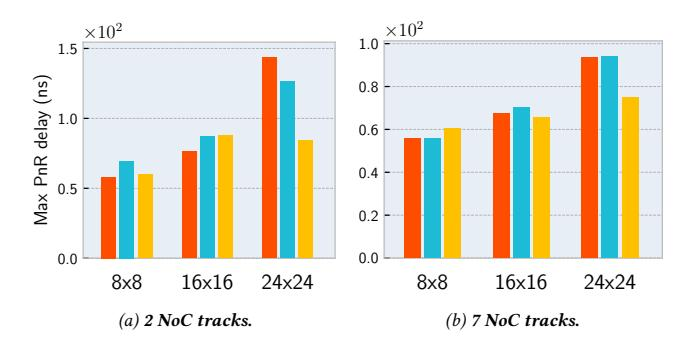

Figure 17: Maximum/critical path delay of spmspv on Monaco, Clustered-Single (CS), and Clustered-Double (CD) across increasing fabric sizes on two extremes of NoC resources (2 vs. 7 tracks). Monaco's topology is better for PnR even with tight resource constraints (2 tracks).

than Monaco. The result is a better PnR-chosen clock divider, more spatial parallelization, and better performance for Monaco.

NUPEA domains are key to Monaco's topology; Monaco can afford to spread LS PEs across an entire row (unlike CS and CD) because critical memory operations that need fast access to memory are prioritized for near-memory domains. The topology keeps LS PEs close to arithmetic PEs (i.e., in adjacent rows), reducing resource pressure in PnR and enabling more effective parallelization and fabric utilization.

## <span id="page-11-1"></span>8 Conclusion

This paper has introduced non-uniform processing-element access, or NUPEA, a new opportunity presented by spatial dataflow architectures to scale data movement. Unlike conventional approaches that try to move data closer to instructions, NUPEA exploits the spatial distribution of instructions in spatial dataflow architecture to place *instructions* closer to data. The Monaco SDA architecture demonstrates the benefits of NUPEA, and the effec compiler exploits NUPEA by identifying critical loads and placing them near memory. We have shown that NUPEA closes most of the gap between a conventional SDA with uniform memory latency and an idealized memory with fast, global communication.

### Acknowledgments

We thank the anonymous reviewers, Tom Jackson, and Samvid Dharanikota for their feedback on this work.


#### References

- <span id="page-11-8"></span>[1] Junwhan Ahn, Sungpack Hong, Sungjoo Yoo, Onur Mutlu, and Kiyoung Choi. 2015. A scalable processing-in-memory accelerator for parallel graph processing. In 2015 ACM/IEEE 42nd Annual International Symposium on Computer Architecture (ISCA). 105–117. doi:10.1145/2749469.2750386
- <span id="page-11-9"></span>[2] Junwhan Ahn, Sungjoo Yoo, Onur Mutlu, and Kiyoung Choi. 2015. PIM-Enabled Instructions: A Low-Overhead, Locality-Aware Processing-in-Memory Architecture. In Proceedings of the 42nd Annual International Symposium on Computer Architecture (Portland, Oregon) (ISCA '15). Association for Computing Machinery, New York, NY, USA, 336–348. doi:10.1145/2749469.2750385
- <span id="page-11-16"></span>[3] Willow Ahrens, Daniel Donenfeld, Fredrik Kjolstad, and Saman Amarasinghe. 2023. Looplets: A Language for Structured Coiteration. In Proceedings of the 21st ACM/IEEE International Symposium on Code Generation and Optimization (CGO 2023). Association for Computing Machinery, New York, NY, USA, 41–54. doi:10.1145/3579990.3580020
- <span id="page-11-19"></span>[4] Arm. 2025. CMSIS DSP Software Library. https://arm-software.github.io/CMSIS-DSP/latest/index.html/.
- <span id="page-11-10"></span>[5] Hadi Asghari-Moghaddam, Amin Farmahini-Farahani, Katherine Morrow, Jung Ho Ahn, and Nam Sung Kim. 2016. Near-DRAM acceleration with single-ISA heterogeneous processing in standard memory modules. *IEEE Micro* 36, 1 (2016), 24–34.
- <span id="page-11-20"></span>[6] Colby Banbury, Vijay Janapa Reddi, Peter Torelli, Jeremy Holleman, Nat Jeffries, Csaba Kiraly, Pietro Montino, David Kanter, Sebastian Ahmed, Danilo Pau, Urmish Thakker, Antonio Torrini, Peter Warden, Jay Cordaro, Giuseppe Di Guglielmo, Javier Duarte, Stephen Gibellini, Videet Parekh, Honson Tran, Nhan Tran, Niu Wenxu, and Xu Xuesong. 2021. MLPerf Tiny Benchmark. arXiv:2106.07597 [cs.LG] https://arxiv.org/abs/2106.07597
- <span id="page-11-12"></span>[7] Thilini Kaushalya Bandara, Dhananjaya Wijerathne, Tulika Mitra, and Li-Shiuan Peh. 2022. REVAMP: A Systematic Framework for Heterogeneous CGRA Realization. In Proceedings of the 27th ACM International Conference on Architectural Support for Programming Languages and Operating Systems (Lausanne, Switzerland) (ASPLOS 2022). Association for Computing Machinery, New York, NY, USA, 918–932. doi:10.1145/3503222.3507772
- <span id="page-11-11"></span>[8] Saambhavi Baskaran, Mahmut Taylan Kandemir, and Jack Sampson. 2022. An architecture interface and offload model for low-overhead, near-data, distributed accelerators. In 2022 55th IEEE/ACM International Symposium on Microarchitecture (MICRO). 1160–1177. doi:10.1109/MICRO56248.2022.00083
- <span id="page-11-18"></span>[9] Scott Beamer, Krste Asanović, and David Patterson. 2017. The GAP Benchmark Suite. arXiv:1508.03619 [cs.DC] https://arxiv.org/abs/1508.03619
- <span id="page-11-3"></span>[10] Bradford M. Beckmann, Michael R. Marty, and David A. Wood. 2006. ASR: Adaptive Selective Replication for CMP Caches. In 2006 39th Annual IEEE/ACM International Symposium on Microarchitecture (MICRO'06). 443–454. doi:10.1109/ MICRO.2006.10
- <span id="page-11-13"></span>[11] Nathan Beckmann, Brandon Lucia, Graham Gobieski, Tony Nowatzki, Thomas Jackson, Guénolé Lallement, Keyi Zhang, Amolak Nagi, Atharv Sathe, and Harsh Desai. 2024. Monza: An Energy-Minimal, General-Purpose Dataflow SoC for the Internet of Things. IEEE Micro (2024), 1–9. doi:10.1109/MM.2024.3426611
- <span id="page-11-4"></span>[12] Nathan Beckmann and Daniel Sanchez. 2013. Jigsaw: Scalable Software-Defined Caches. In Proc. of the 22nd intl. conf. on Parallel Architectures and Compilation Techniques.
- <span id="page-11-5"></span>[13] Nathan Beckmann, Po-An Tsai, and Daniel Sanchez. 2015. Scaling distributed cache hierarchies through computation and data co-scheduling. In Proc. of the 21st IEEE intl. symp. on High Performance Computer Architecture (Proc. HPCA-21).
- <span id="page-11-17"></span>[14] Vaughn Betz and Jonathan Rose. 1997. VPR: A new packing, placement and routing tool for FPGA research. In *International Workshop on Field Programmable Logic and Applications*. Springer, 213–222.
- <span id="page-11-2"></span>[15] Sergey Blagodurov, Sergey Zhuravlev, Alexandra Fedorova, and Ali Kamali. 2010. A case for NUMA-aware contention management on multicore systems. In Proceedings of the 19th International Conference on Parallel Architectures and Compilation Techniques (Vienna, Austria) (PACT '10). Association for Computing Machinery, New York, NY, USA, 557–558. doi:10.1145/1854273.1854350
- <span id="page-11-15"></span>[16] Mihai Budiu. 2003. Spatial Computation. Ph. D. Dissertation. Carnegie Mellon University. https://apps.dtic.mil/sti/tr/pdf/ADA461132.pdf
- <span id="page-11-14"></span>[17] Mihai Budiu and Seth Copen Goldstein. 2002. Pegasus: An Efficient Intermediate Representation. Technical Report CMU-CS-02-107. Carnegie Mellon University. 20 pages. http://www.cs.cmu.edu/~seth/papers/budiu-tr02.pdf
- <span id="page-11-6"></span>[18] Jichuan Chang and Gurindar S. Sohi. 2006. Cooperative Caching for Chip Multiprocessors. In Proceedings of the 33rd Annual International Symposium on Computer Architecture (ISCA '06). IEEE Computer Society, USA, 264–276. doi:10.1109/ISCA.2006.17
- <span id="page-11-0"></span>[19] P. Charles, C. Donawa, K. Ebcioglu, C. Grothoff, A. Kielstra, C. von Praun, V. Saraswat, and V. Sarkar. 2005. X10: An Object-Oriented Approach to Non-Uniform Cluster Computing. In International Conference on Object-Oriented Programming, Systems, Languages, and Applications.
- <span id="page-11-7"></span>[20] Sangyeun Cho and Lei Jin. 2006. Managing Distributed, Shared L2 Caches through OS-Level Page Allocation. In Proceedings of the 39th Annual IEEE/ACM International Symposium on Microarchitecture (MICRO 39). IEEE Computer Society,

- USA, 455–468. [doi:10.1109/MICRO.2006.31](https://doi.org/10.1109/MICRO.2006.31)
- <span id="page-12-31"></span>[21] Ron Cytron, Jeanne Ferrante, Barry K. Rosen, Mark N. Wegman, and F. Kenneth Zadeck. 1991. Efficiently Computing Static Single Assignment Form and the Control Dependence Graph. ACM Trans. Program. Lang. Syst. 13, 4 (oct 1991), 451–490. [doi:10.1145/115372.115320](https://doi.org/10.1145/115372.115320)
- <span id="page-12-27"></span>[22] Vidushi Dadu and Tony Nowatzki. 2022. TaskStream: Accelerating Task-Parallel Workloads by Recovering Program Structure. In Proceedings of the 27th ACM International Conference on Architectural Support for Programming Languages and Operating Systems. New York, NY, USA, 1–13. [https://doi.org/10.1145/3503222.](https://doi.org/10.1145/3503222.3507706) [3507706](https://doi.org/10.1145/3503222.3507706)
- <span id="page-12-16"></span>[23] Vidushi Dadu, Jian Weng, Sihao Liu, and Tony Nowatzki. 2019. Towards general purpose acceleration by exploiting common data-dependence forms. In Proceedings of the 52nd Annual IEEE/ACM International Symposium on Microarchitecture. 924–939.
- <span id="page-12-3"></span>[24] Reetuparna Das, Rachata Ausavarungnirun, Onur Mutlu, Akhilesh Kumar, and Mani Azimi. 2012. Application-to-core mapping policies to reduce memory interference in multi-core systems. In Proceedings of the 21st International Conference on Parallel Architectures and Compilation Techniques (Minneapolis, Minnesota, USA) (PACT '12). Association for Computing Machinery, New York, NY, USA, 455–456. [doi:10.1145/2370816.2370893](https://doi.org/10.1145/2370816.2370893)
- <span id="page-12-22"></span>[25] Jack B Dennis and David P Misunas. 1975. A preliminary architecture for a basic data-flow processor. In ISCA.
- <span id="page-12-7"></span>[26] Daichi Fujiki, Scott Mahlke, and Reetuparna Das. 2019. Duality Cache for Data Parallel Acceleration. In Proceedings of the 46th International Symposium on Computer Architecture (Phoenix, Arizona) (ISCA '19). Association for Computing Machinery, New York, NY, USA, 397–410. [doi:10.1145/3307650.3322257](https://doi.org/10.1145/3307650.3322257)
- <span id="page-12-4"></span>[27] Fabien Gaud, Baptiste Lepers, Justin Funston, Mohammad Dashti, Alexandra Fedorova, Vivien Quéma, Renaud Lachaize, and Mark Roth. 2015. Challenges of memory management on modern NUMA systems. Commun. ACM 58, 12 (Nov. 2015), 59–66. [doi:10.1145/2814328](https://doi.org/10.1145/2814328)
- <span id="page-12-17"></span>[28] Graham Gobieski, Ahmet Oguz Atli, Kenneth Mai, Brandon Lucia, and Nathan Beckmann. 2021. Snafu: an ultra-low-power, energy-minimal CGRA-generation framework and architecture. In ISCA.
- <span id="page-12-30"></span>[29] Graham Gobieski, Souradip Ghosh, Marijn Heule, Todd Mowry, Tony Nowatzki, Nathan Beckmann, and Brandon Lucia. 2023. RipTide: A Programmable, Energy-Minimal Dataflow Compiler and Architecture. In Proceedings of the 55th Annual IEEE/ACM International Symposium on Microarchitecture (MICRO '22). 546–564. [doi:10.1109/MICRO56248.2022.00046](https://doi.org/10.1109/MICRO56248.2022.00046)
- [30] Seth Copen Goldstein, Herman Schmit, Mihai Budiu, Srihari Cadambi, Matthew Moe, and R Reed Taylor. 2000. PipeRench: A reconfigurable architecture and compiler. Computer 33, 4 (2000).
- <span id="page-12-18"></span>[31] Venkatraman Govindaraju, Chen-Han Ho, Tony Nowatzki, Jatin Chhugani, Nadathur Satish, Karthikeyan Sankaralingam, and Changkyu Kim. 2012. DySER: Unifying functionality and parallelism specialization for energy-efficient computing. IEEE Micro 32, 5 (2012).
- <span id="page-12-8"></span>[32] Nastaran Hajinazar, Geraldo F. Oliveira, Sven Gregorio, João Dinis Ferreira, Nika Mansouri Ghiasi, Minesh Patel, Mohammed Alser, Saugata Ghose, Juan Gómez-Luna, and Onur Mutlu. 2021. SIMDRAM: A Framework for Bit-Serial SIMD Processing Using DRAM. In Proceedings of the 26th ACM International Conference on Architectural Support for Programming Languages and Operating Systems (ASPLOS '21). [doi:10.1145/3445814.3446749](https://doi.org/10.1145/3445814.3446749)
- <span id="page-12-5"></span>[33] Nikos Hardavellas, Michael Ferdman, Babak Falsafi, and Anastasia Ailamaki. 2009. Reactive NUCA: near-optimal block placement and replication in distributed caches. In Proceedings of the 36th Annual International Symposium on Computer Architecture (ISCA '09). [doi:10.1145/1555754.1555779](https://doi.org/10.1145/1555754.1555779)
- <span id="page-12-9"></span>[34] Milad Hashemi, Eiman Ebrahimi, Onur Mutlu, Yale N Patt, et al. 2016. Accelerating dependent cache misses with an enhanced memory controller. In 2016 ACM/IEEE 43rd Annual International Symposium on Computer Architecture (ISCA). IEEE, 444–455.
- <span id="page-12-0"></span>[35] John L Hennessy and David A Patterson. 2011. Computer architecture: a quantitative approach. Elsevier.
- <span id="page-12-23"></span>[36] Olivia Hsu, Maxwell Strange, Ritvik Sharma, Jaeyeon Won, Kunle Olukotun, Joel S. Emer, Mark A. Horowitz, and Fredrik Kjølstad. 2023. The Sparse Abstract Machine. In Proceedings of the 28th ACM International Conference on Architectural Support for Programming Languages and Operating Systems, Volume 3 (Vancouver, BC, Canada) (ASPLOS 2023). Association for Computing Machinery, New York, NY, USA, 710–726. [doi:10.1145/3582016.3582051](https://doi.org/10.1145/3582016.3582051)
- <span id="page-12-10"></span>[37] Jiayi Huang, Ramprakash Reddy Puli, Pritam Majumder, Sungkeun Kim, Rahul Boyapati, Ki Hwan Yum, and Eun Jung Kim. 2019. Active-Routing: Compute on the Way for Near-Data Processing. In 2019 IEEE International Symposium on High Performance Computer Architecture (HPCA). IEEE, 674–686.
- <span id="page-12-19"></span>[38] Manupa Karunaratne, Aditi Kulkarni Mohite, Tulika Mitra, and Li-Shiuan Peh. 2017. HyCUBE: A CGRA with reconfigurable single-cycle multi-hop interconnect. In DAC.
- <span id="page-12-26"></span>[39] Huifeng Ke, Sihao Liu, Licheng Guo, Zifan He, Linghao Song, Suhail Basalama, Yuze Chi, Tony Nowatzki, and Jason Cong. 2025. NoH: NoC Compilation in High Level Synthesis. In The 33rd IEEE International Symposium on Field-Programmable Custom Computing Machines.

- <span id="page-12-1"></span>[40] Changkyu Kim, Doug Burger, and Stephen W. Keckler. 2002. An adaptive, nonuniform cache structure for wire-delay dominated on-chip caches. In Proceedings of the 10th International Conference on Architectural Support for Programming Languages and Operating Systems (ASPLOS X). [doi:10.1145/605397.605420](https://doi.org/10.1145/605397.605420)
- <span id="page-12-11"></span>[41] Gwangsun Kim, Niladrish Chatterjee, Mike O'Connor, and Kevin Hsieh. 2017. Toward Standardized Near-Data Processing with Unrestricted Data Placement for GPUs. In Proceedings of the International Conference for High Performance Computing, Networking, Storage and Analysis (Denver, Colorado) (SC '17). Association for Computing Machinery, New York, NY, USA, Article 24, 12 pages. [doi:10.1145/3126908.3126965](https://doi.org/10.1145/3126908.3126965)
- <span id="page-12-24"></span>[42] Fredrik Kjolstad, Shoaib Kamil, Stephen Chou, David Lugato, and Saman Amarasinghe. 2017. The tensor algebra compiler. Proc. ACM Program. Lang. 1, OOPSLA, Article 77 (oct 2017), 29 pages. [doi:10.1145/3133901](https://doi.org/10.1145/3133901)
- <span id="page-12-13"></span>[43] David Koeplinger, Matthew Feldman, Raghu Prabhakar, Yaqi Zhang, Stefan Hadjis, Ruben Fiszel, Tian Zhao, Luigi Nardi, Ardavan Pedram, Christos Kozyrakis, and Kunle Olukotun. 2018. Spatial: a language and compiler for application accelerators. In Proceedings of the 39th ACM SIGPLAN Conference on Programming Language Design and Implementation (Philadelphia, PA, USA) (PLDI 2018). Association for Computing Machinery, New York, NY, USA, 296–311. [doi:10.1145/3192366.3192379](https://doi.org/10.1145/3192366.3192379)
- <span id="page-12-2"></span>[44] Chris Lattner, Mehdi Amini, Uday Bondhugula, Albert Cohen, Andy Davis, Jacques Pienaar, River Riddle, Tatiana Shpeisman, Nicolas Vasilache, and Oleksandr Zinenko. 2021. MLIR: scaling compiler infrastructure for domain specific computation. In Proceedings of the 2021 IEEE/ACM International Symposium on Code Generation and Optimization (Virtual Event, Republic of Korea) (CGO '21). IEEE Press, 2–14. [doi:10.1109/CGO51591.2021.9370308](https://doi.org/10.1109/CGO51591.2021.9370308)
- <span id="page-12-25"></span>[45] Walter Lee, Rajeev Barua, Matthew Frank, Devabhaktuni Srikrishna, Jonathan Babb, Vivek Sarkar, and Saman Amarasinghe. 1998. Space-time scheduling of instruction-level parallelism on a raw machine. In Proceedings of the Eighth International Conference on Architectural Support for Programming Languages and Operating Systems (San Jose, California, USA) (ASPLOS VIII). Association for Computing Machinery, New York, NY, USA, 46–57. [doi:10.1145/291069.291018](https://doi.org/10.1145/291069.291018)
- <span id="page-12-15"></span>[46] Jacob Leverich, Hideho Arakida, Alex Solomatnikov, Amin Firoozshahian, Mark Horowitz, and Christos Kozyrakis. 2007. Comparing memory systems for chip multiprocessors. In Proceedings of the 34th Annual International Symposium on Computer Architecture (San Diego, California, USA) (ISCA '07). Association for Computing Machinery, New York, NY, USA, 358–368. [doi:10.1145/1250662.](https://doi.org/10.1145/1250662.1250707) [1250707](https://doi.org/10.1145/1250662.1250707)
- <span id="page-12-12"></span>[47] Elliot Lockerman, Axel Feldmann, Mohammad Bakhshalipour, Alexandru Stanescu, Shashwat Gupta, Daniel Sanchez, and Nathan Beckmann. 2020. Livia: Data-centric computing throughout the memory hierarchy. In Proceedings of the Twenty-Fifth International Conference on Architectural Support for Programming Languages and Operating Systems. 417–433.
- <span id="page-12-33"></span>[48] Chi-Keung Luk and Todd C. Mowry. 1996. Compiler-based prefetching for recursive data structures. In Proceedings of the Seventh International Conference on Architectural Support for Programming Languages and Operating Systems (Cambridge, Massachusetts, USA) (ASPLOS VII). Association for Computing Machinery, New York, NY, USA, 222–233. [doi:10.1145/237090.237190](https://doi.org/10.1145/237090.237190)
- <span id="page-12-32"></span>[49] M. Imran Masud and Steven J. E. Wilton. 1999. A New Switch Block for Segmented FPGAs. In Proceedings of the 9th International Workshop on Field-Programmable Logic and Applications (FPL '99). Springer-Verlag, Berlin, Heidelberg, 274–281.
- <span id="page-12-35"></span>[50] L. McMurchie and C. Ebeling. 1995. PathFinder: A Negotiation-Based Performance-Driven Router for FPGAs. In Third International ACM Symposium on Field-Programmable Gate Arrays. 111–117. [doi:10.1109/FPGA.1995.242049](https://doi.org/10.1109/FPGA.1995.242049)
- <span id="page-12-28"></span>[51] Bingfeng Mei, Serge Vernalde, Diederik Verkest, Hugo De Man, and Rudy Lauwereins. 2003. ADRES: An architecture with tightly coupled VLIW processor and coarse-grained reconfigurable matrix. In International Conference on Field Programmable Logic and Applications. Springer, 61–70.
- <span id="page-12-29"></span>[52] Ethan Mirsky, Andre DeHon, et al. 1996. MATRIX: a reconfigurable computing architecture with configurable instruction distribution and deployable resources.. In FCCM, Vol. 96. 17–19.
- <span id="page-12-20"></span>[53] Mahim Mishra, Timothy J. Callahan, Tiberiu Chelcea, Girish Venkataramani, Seth C. Goldstein, and Mihai Budiu. 2006. Tartan: evaluating spatial computation for whole program execution. In Proceedings of the 12th International Conference on Architectural Support for Programming Languages and Operating Systems (ASPLOS XII). [doi:10.1145/1168857.1168878](https://doi.org/10.1145/1168857.1168878)
- <span id="page-12-14"></span>[54] Todd C. Mowry, Monica S. Lam, and Anoop Gupta. 1992. Design and evaluation of a compiler algorithm for prefetching. In Proceedings of the Fifth International Conference on Architectural Support for Programming Languages and Operating Systems (ASPLOS V). 62–73. [doi:10.1145/143365.143488](https://doi.org/10.1145/143365.143488)
- <span id="page-12-6"></span>[55] Anurag Mukkara, Nathan Beckmann, and Daniel Sanchez. 2016. Whirlpool: Improving dynamic cache management with static data classification. In Proc. of the 21st intl. conf. on Architectural Support for Programming Languages and Operating Systems (Proc. ASPLOS-XXI).
- <span id="page-12-21"></span>[56] Quan M Nguyen and Daniel Sanchez. 2021. Fifer: Practical Acceleration of Irregular Applications on Reconfigurable Architectures. In MICRO.
- <span id="page-12-34"></span>[57] Quan M. Nguyen and Daniel Sanchez. 2023. Phloem: Automatic Acceleration of Irregular Applications with Fine-Grain Pipeline Parallelism. In 2023 IEEE

- <span id="page-13-0"></span>International Symposium on High-Performance Computer Architecture (HPCA). 1262–1274. [doi:10.1109/HPCA56546.2023.10071026](https://doi.org/10.1109/HPCA56546.2023.10071026)
- <span id="page-13-13"></span>[58] Rishiyur S Nikhil et al. 1990. Executing a program on the MIT tagged-token dataflow architecture. IEEE Transactions on computers (1990).
- [59] Tony Nowatzki, Newsha Ardalani, Karthikeyan Sankaralingam, and Jian Weng. 2018. Hybrid optimization/heuristic instruction scheduling for programmable accelerator codesign. In PACT 27.
- <span id="page-13-30"></span>[60] Tony Nowatzki, Vinay Gangadhar, Newsha Ardalani, and Karthikeyan Sankaralingam. 2017. Stream-dataflow acceleration. In ISCA 44.
- <span id="page-13-14"></span>[61] Tony Nowatzki, Vinay Gangadhar, and Karthikeyan Sankaralingam. 2015. Exploring the potential of heterogeneous von neumann/dataflow execution models. In Proceedings of the 42nd Annual International Symposium on Computer Architecture. 298–310.
- <span id="page-13-2"></span>[62] Geraldo F Oliveira, Ataberk Olgun, Abdullah Giray Yağlıkçı, F Nisa Bostancı, Juan Gómez-Luna, Saugata Ghose, and Onur Mutlu. 2024. MIMDRAM: An endto-end processing-using-DRAM system for high-throughput, energy-efficient and programmer-transparent multiple-instruction multiple-data computing. In 2024 IEEE International Symposium on High-Performance Computer Architecture (HPCA). IEEE, 186–203.
- <span id="page-13-33"></span>[63] Gregory M. Papadopoulos and David E. Culler. 1990. Monsoon: An Explicit Token-Store Architecture. In Proceedings of the 17th Annual International Symposium on Computer Architecture (Seattle, Washington, USA) (ISCA '90). Association for Computing Machinery, New York, NY, USA, 82–91. [doi:10.1145/325164.325117](https://doi.org/10.1145/325164.325117)
- <span id="page-13-15"></span>[64] Angshuman Parashar, Michael Pellauer, Michael Adler, Bushra Ahsan, Neal Crago, Daniel Lustig, Vladimir Pavlov, Antonia Zhai, Mohit Gambhir, Aamer Jaleel, Randy Allmon, Rachid Rayess, Stephen Maresh, and Joel Emer. 2013. Triggered Instructions: a control paradigm for spatially-programmed architectures. In Proceedings of the 40th Annual International Symposium on Computer Architecture (ISCA '13). [doi:10.1145/2485922.2485935](https://doi.org/10.1145/2485922.2485935)
- <span id="page-13-3"></span>[65] Ashutosh Pattnaik, Xulong Tang, Onur Kayiran, Adwait Jog, Asit Mishra, Mahmut T Kandemir, Anand Sivasubramaniam, and Chita R Das. 2019. Opportunistic computing in gpu architectures. In Proceedings of the 46th International Symposium on Computer Architecture. 210–223.
- <span id="page-13-12"></span>[66] Raghu Prabhakar, Yaqi Zhang, David Koeplinger, Matt Feldman, Tian Zhao, Stefan Hadjis, Ardavan Pedram, Christos Kozyrakis, and Kunle Olukotun. 2017. Plasticine: A reconfigurable architecture for parallel patterns. In ISCA 44.
- <span id="page-13-35"></span>[67] Ram Rangan, Neil Vachharajani, Manish Vachharajani, and David I. August. 2004. Decoupled Software Pipelining with the Synchronization Array. In Proceedings of the 13th International Conference on Parallel Architectures and Compilation Techniques (PACT '04). IEEE Computer Society, USA, 177–188.
- <span id="page-13-16"></span>[68] Alexander Rucker, Matthew Vilim, Tian Zhao, Yaqi Zhang, Raghu Prabhakar, and Kunle Olukotun. 2021. Capstan: A Vector RDA for Sparsity. arXiv[:2104.12760](https://arxiv.org/abs/2104.12760) [cs.AR]
- <span id="page-13-4"></span>[69] Karthik Sangaiah, Michael Lui, Ragh Kuttappa, Baris Taskin, and Mark Hempstead. 2020. SnackNoC: Processing in the Communication Layer. In 2020 IEEE International Symposium on High Performance Computer Architecture (HPCA). 461–473. [doi:10.1109/HPCA47549.2020.00045](https://doi.org/10.1109/HPCA47549.2020.00045)
- <span id="page-13-17"></span>[70] Karthikeyan Sankaralingam, Ramadass Nagarajan, Haiming Liu, Changkyu Kim, Jaehyuk Huh, Doug Burger, Stephen W Keckler, and Charles R Moore. 2003. Exploiting ILP, TLP, and DLP with the polymorphous TRIPS architecture. In ISCA 30.
- <span id="page-13-18"></span>[71] Karu Sankaralingam, Tony Nowatzki, Greg Wright, Poly Palamuttam, Jitu Khare, Vinay Gangadhar, and Preyas Shah. 2021. Mozart: Designing for Software Maturity and the Next Paradigm for Chip Architectures. In IEEE Hot Chips 33 Symposium, HCS 2021, Palo Alto, CA, USA, August 22-24, 2021. IEEE, 1–20. [doi:10.1109/HCS52781.2021.9567306](https://doi.org/10.1109/HCS52781.2021.9567306)
- <span id="page-13-5"></span>[72] Brian C. Schwedock and Nathan Beckmann. 2024. Leviathan: A Unified System for General-Purpose Near-Data Computing. In 2024 57th IEEE/ACM International Symposium on Microarchitecture (MICRO). [doi:10.1109/MICRO61859.2024.00095](https://doi.org/10.1109/MICRO61859.2024.00095)
- <span id="page-13-6"></span>[73] B. C. Schwedock, P. Yoovidhya, J. Seibert, and N. Beckmann. 2022. täko: A Poly- ¯ morphic Cache Hierarchy for General-Purpose Optimization of Data Movement. In Proc. of the 49th annual Intl. Symp. on Computer Architecture (Proc. ISCA-49).
- <span id="page-13-19"></span>[74] Nathan Serafin, Souradip Ghosh, Harsh Desai, Nathan Beckmann, and Brandon Lucia. 2023. Pipestitch: An energy-minimal dataflow architecture with lightweight threads. In Proceedings of the 56th Annual IEEE/ACM International Symposium on Microarchitecture (MICRO '23). Association for Computing Machinery, New York, NY, USA, 1409–1422. [doi:10.1145/3613424.3614283](https://doi.org/10.1145/3613424.3614283)
- <span id="page-13-32"></span>[75] H. Singh, Ming-Hau Lee, Guangming Lu, F.J. Kurdahi, N. Bagherzadeh, and E.M. Chaves Filho. 2000. MorphoSys: an integrated reconfigurable system for dataparallel and computation-intensive applications. IEEE Trans. Comput. 49, 5 (2000), 465–481. [doi:10.1109/12.859540](https://doi.org/10.1109/12.859540)
- <span id="page-13-20"></span>[76] Steven Swanson, Ken Michelson, Andrew Schwerin, and Mark Oskin. 2003. WaveScalar. In MICRO 36.
- <span id="page-13-25"></span>[77] Steven Swanson, Andrew Schwerin, Martha Mercaldi, Andrew Petersen, Andrew Putnam, Ken Michelson, Mark Oskin, and Susan J. Eggers. 2007. The WaveScalar architecture. ACM Trans. Comput. Syst. (2007). [doi:10.1145/1233307.1233308](https://doi.org/10.1145/1233307.1233308)
- <span id="page-13-29"></span>[78] Ian Swarbrick, Dinesh Gaitonde, Sagheer Ahmad, Bala Jayadev, Jeff Cuppett, Abbas Morshed, Brian Gaide, and Ygal Arbel. 2019. Versal Network-on-Chip

- (NoC). In 2019 IEEE Symposium on High-Performance Interconnects (HOTI). 13–17. [doi:10.1109/HOTI.2019.00016](https://doi.org/10.1109/HOTI.2019.00016)
- <span id="page-13-27"></span>[79] W. Thies, M. Karczmarek, and S. Amarasinghe. 2002. StreamIt: A Language for Streaming Applications. In CC.
- <span id="page-13-28"></span>[80] William F Thies, Michael Karczmarek, Michael Gordon, David Maze, Jeremy Wong, Henry Hoffmann, Matthew Brown, and Saman Amarasinghe. 2001. StreamIT: A Complier for Streaming Applications. Technical Report. MIT.
- <span id="page-13-7"></span>[81] Boyu Tian, Qihang Chen, and Mingyu Gao. 2023. ABNDP: Co-Optimizing Data Access and Load Balance in Near-Data Processing. In Proceedings of the 28th ACM International Conference on Architectural Support for Programming Languages and Operating Systems, Volume 3 (ASPLOS 2023). [doi:10.1145/3582016.3582026](https://doi.org/10.1145/3582016.3582026)
- <span id="page-13-21"></span>[82] Christopher Torng, Peitian Pan, Yanghui Ou, Cheng Tan, and Christopher Batten. 2021. Ultra-elastic CGRAs for irregular loop specialization. In 2021 IEEE International Symposium on High-Performance Computer Architecture (HPCA). IEEE, 412–425.
- <span id="page-13-1"></span>[83] Po-An Tsai, Nathan Beckmann, and Daniel Sanchez. 2017. Jenga: Software-Defined Cache Hierarchies. In Proc. of the 44th annual Intl. Symp. on Computer Architecture (Proc. ISCA-44).
- <span id="page-13-22"></span>[84] Matthew Vilim, Alexander Rucker, and Kunle Olukotun. 2021. Aurochs: An architecture for dataflow threads. In 2021 ACM/IEEE 48th Annual International Symposium on Computer Architecture (ISCA). IEEE, 402–415.
- <span id="page-13-23"></span>[85] Dani Voitsechov and Yoav Etsion. 2014. Single-graph multiple flows: energy efficient design alternative for GPGPUs. In Proceeding of the 41st Annual International Symposium on Computer Architecuture (ISCA '14).
- <span id="page-13-26"></span>[86] E. Waingold et al. 1997. Baring It All to Software: Raw Machines. In IEEE Computer.
- <span id="page-13-8"></span>[87] Zhengrong Wang, Christopher Liu, Aman Arora, Lizy John, and Tony Nowatzki. 2023. Infinity Stream: Portable and Programmer-Friendly In-/Near-Memory Fusion. In Proceedings of the 28th ACM International Conference on Architectural Support for Programming Languages and Operating Systems, Volume 3 (ASPLOS 2023). [doi:10.1145/3582016.3582032](https://doi.org/10.1145/3582016.3582032)
- <span id="page-13-11"></span>[88] Zhengrong Wang, Christopher Liu, Nathan Beckmann, and Tony Nowatzki. 2023. Affinity Alloc: Taming Not-So Near-Data Computing. In Proceedings of the 56th Annual IEEE/ACM International Symposium on Microarchitecture (Toronto, ON, Canada) (MICRO '23). 784–799. [doi:10.1145/3613424.3623778](https://doi.org/10.1145/3613424.3623778)
- <span id="page-13-31"></span>[89] Zhengrong Wang and Tony Nowatzki. 2019. Stream-based memory access specialization for general purpose processors. In Proceedings of the 46th International Symposium on Computer Architecture (ISCA '19). Association for Computing Machinery, New York, NY, USA, 736–749. [doi:10.1145/3307650.3322229](https://doi.org/10.1145/3307650.3322229)
- <span id="page-13-9"></span>[90] Zhengrong Wang, Jian Weng, Sihao Liu, and Tony Nowatzki. 2022. Near-Stream Computing: General and Transparent Near-Cache Acceleration. In 2022 IEEE International Symposium on High-Performance Computer Architecture (HPCA). 331–345. [doi:10.1109/HPCA53966.2022.00032](https://doi.org/10.1109/HPCA53966.2022.00032)
- <span id="page-13-10"></span>[91] Zhengrong Wang, Jian Weng, Jason Lowe-Power, Jayesh Gaur, and Tony Nowatzki. 2021. Stream Floating: Enabling Proactive and Decentralized Cache Optimizations. In 2021 IEEE International Symposium on High-Performance Computer Architecture (HPCA). 640–653. [doi:10.1109/HPCA51647.2021.00060](https://doi.org/10.1109/HPCA51647.2021.00060)
- <span id="page-13-34"></span>[92] Jian Weng, Sihao Liu, Dylan Kupsh, and Tony Nowatzki. 2022. Unifying Spatial Accelerator Compilation With Idiomatic and Modular Transformations. IEEE Micro 42, 5 (2022), 59–69. [doi:10.1109/MM.2022.3189976](https://doi.org/10.1109/MM.2022.3189976)
- <span id="page-13-24"></span>[93] Jian Weng, Sihao Liu, Zhengrong Wang, Vidushi Dadu, and Tony Nowatzki. 2020. A Hybrid Systolic-Dataflow Architecture for Inductive Matrix Algorithms. In HPCA.
- <span id="page-13-36"></span>[94] Tomofumi Yuki and Louis-Noel Pouchet. 2016. PolyBench 4.2.1: The polyhedral benchmark suite.