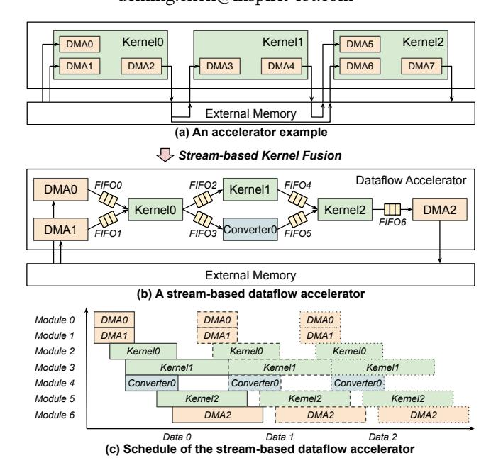
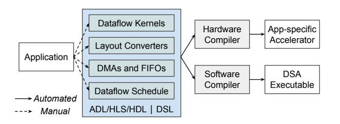
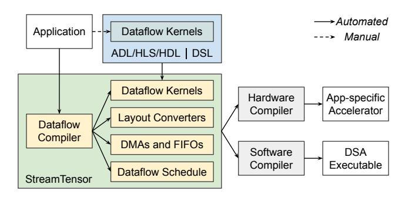
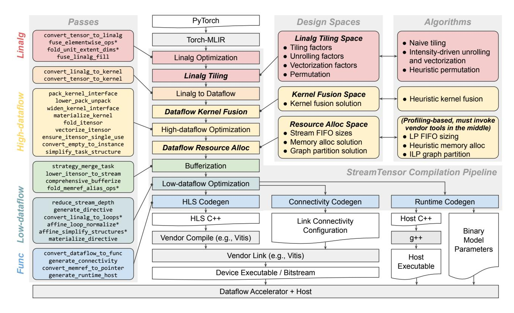
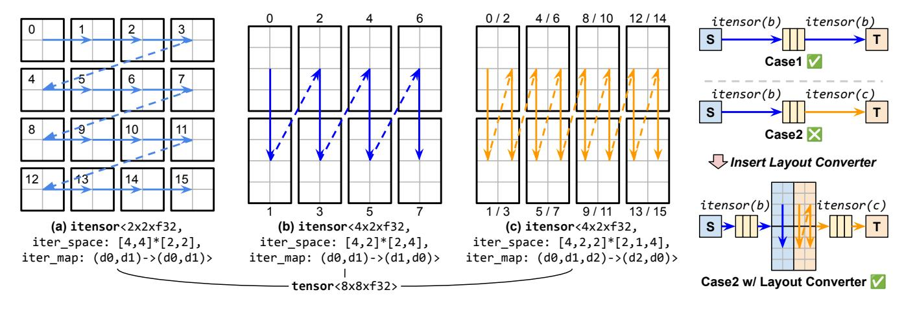
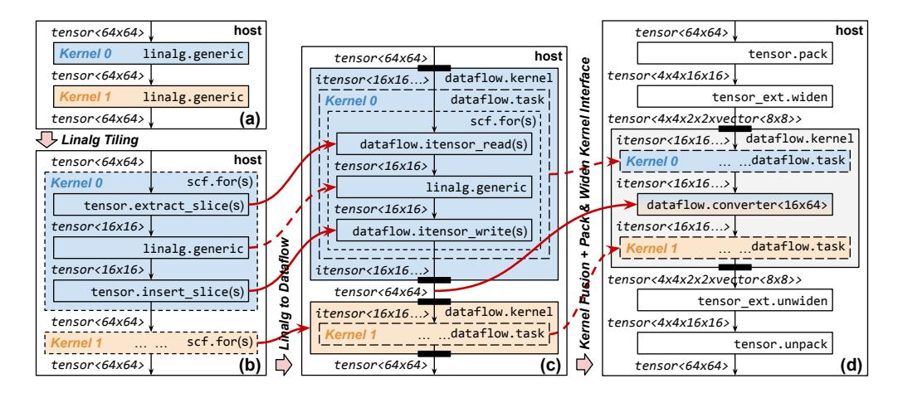
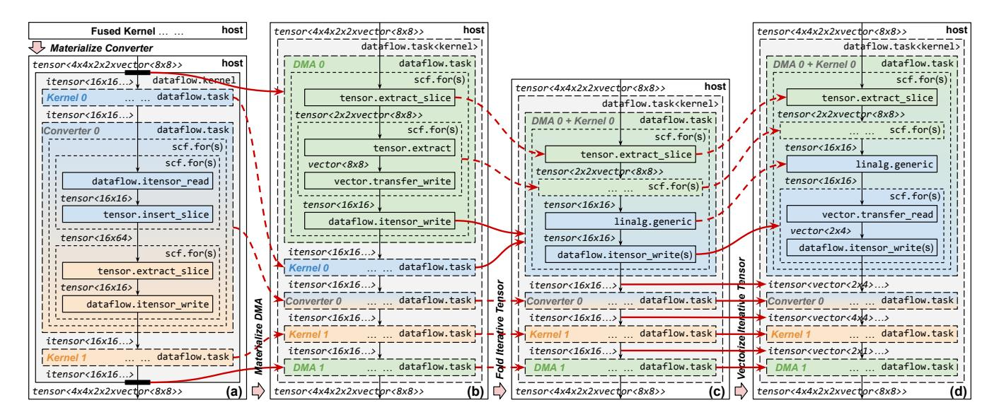
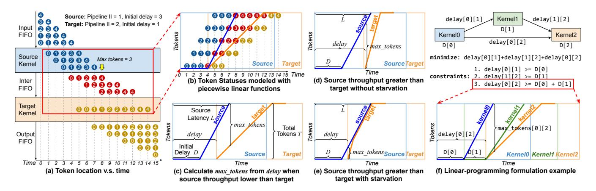
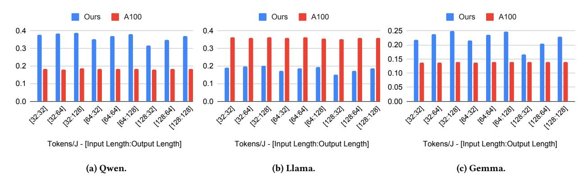
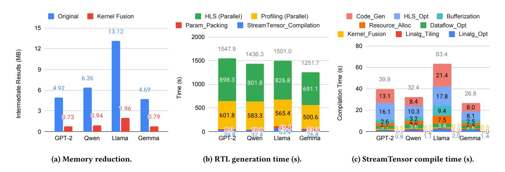

# StreamTensor: Make Tensors Stream in Dataflow Accelerators for LLMs

[Hanchen Ye](https://orcid.org/0000-0002-6646-8146)<sup>∗</sup> University of Illinois Urbana-Champaign Urbana, Illinois, USA hanchen8@illinois.edu

## Abstract

Efficient execution of deep learning workloads on dataflow architectures is crucial for overcoming memory bottlenecks and maximizing performance. While streaming intermediate results between computation kernels can significantly improve efficiency, existing approaches struggle with inter-kernel correlations, external memory access management, and buffer optimization. In this work, we propose StreamTensor, a compiler framework that automatically constructs and optimizes stream-based dataflow accelerators. StreamTensor introduces a novel iterative tensor type system to explicitly encode stream layouts, enabling seamless kernel fusion, buffer allocation, and memory optimization. By systematically exploring three hierarchical design spaces, including tensor tiling, kernel fusion, and resource allocation, StreamTensor balances computational intensity, memory efficiency, and data streaming to maximize performance. Based on FPGA evaluations on Large Language Models (LLM), StreamTensor achieves up to 0.76x and 0.64x lower latency compared to the state-of-the-art FPGA LLM accelerators and GPUs, and up to 1.99x higher energy efficiency compared to GPUs, making it a promising approach for scalable dataflow-based deep learning acceleration.

### ACM Reference Format:

Hanchen Ye and Deming Chen. 2025. StreamTensor: Make Tensors Stream in Dataflow Accelerators for LLMs. In 58th IEEE/ACM International Symposium on Microarchitecture (MICRO '25), October 18–22, 2025, Seoul, Republic of Korea. ACM, New York, NY, USA, [16](#page-15-0) pages. [https://doi.org/10.1145/3725843.](https://doi.org/10.1145/3725843.3762817) [3762817](https://doi.org/10.1145/3725843.3762817)

# 1 Introduction

# 1.1 Dataflow Architecture

Dataflow architecture, as an alternative to Von Neumann-style architectures such as the NVIDIA H100 [\[20\]](#page-14-0) and Google TPUv4 [\[33\]](#page-14-1), is increasingly adopted and studied to overcome the memory wall in emerging AI applications, such as Large Language Models (LLM). Because of LLMs' autoregressive nature, the decoding stage is highly memory-bound, demanding more memory-efficient architectures. AMD Versal [\[24\]](#page-14-2), Sambanova SN40L [\[43\]](#page-15-1), and IBM AIU [\[12\]](#page-14-3)

<sup>∗</sup>Work was done during an internship at Inspirit IoT, Inc.


[This work is licensed under a Creative Commons Attribution 4.0 International License.](https://creativecommons.org/licenses/by/4.0) MICRO '25, Seoul, Republic of Korea

© 2025 Copyright held by the owner/author(s). ACM ISBN 979-8-4007-1573-0/25/10 <https://doi.org/10.1145/3725843.3762817>

[Deming Chen](https://orcid.org/0000-0002-3016-0270) Inspirit IoT, Inc. Champaign, Illinois, USA University of Illinois Urbana-Champaign Urbana, Illinois, USA deming.chen@inspirit-iot.com

<span id="page-0-0"></span>

Figure 1: Computation pattern of dataflow accelerators.

are commercial AI accelerators with reconfigurable dataflow architectures; many studies [\[14,](#page-14-4) [40,](#page-14-5) [44\]](#page-15-2) have also demonstrated the latency and energy efficiency advantages of dataflow architecture.

Figure [1](#page-0-0) shows the typical computation pattern of dataflow accelerators. As shown in Figure [1\(](#page-0-0)b), a dataflow accelerator contains the following on-chip components:

- (1) Kernel: Computes an operator or coarse-grained task (e.g., matrix multiply) using a parallel processor (e.g., a systolic array), and provides stream interfaces for input and output.
- (2) Token: Atomic element communicated between kernels.
- (3) First-in First-out (FIFO): Holds accumulated stream tokens to balance different token rates of the producer and consumer, and avoids deadlock or unnecessary kernel stalls.
- (4) Stream Layout Converter: Converts stream layout on-the-fly to accommodate different computation patterns of producer and consumer kernels through a local ping-pong buffer.
- (5) Direct Memory Access (DMA): Communicates with external memory, and converts memory-mapped interfaces to stream interfaces or vice versa.

Kernels may be designed using dataflow circuits through dynamic scheduling [\[31\]](#page-14-6), or may adopt different dataflow strategies

<span id="page-1-0"></span>

Figure 2: Current paradigm of dataflow accelerator design.

(e.g., input stationary) for efficient on-chip data reuse [\[17\]](#page-14-7). Although using the same terminology, these dataflow concepts are conceptually orthogonal to the dataflow architecture and accelerators discussed in this paper.

The key idea of dataflow architecture is to stream intermediate results between kernels through on-chip FIFOs instead of triggering frequent external memory accesses. For example, in Figure [1\(](#page-0-0)b), the intermediate results produced by Kernel0 are streamed directly to Kernel1 and Converter0 without going through external memory, as in Figure [1\(](#page-0-0)a). Following the convention proposed in [\[43\]](#page-15-1), we refer to enabling streaming between dataflow kernels as stream-based kernel fusion. Additionally, as illustrated in Figure [1\(](#page-0-0)c), the schedule of the dataflow accelerator allows Kernel1 and Converter0 to start execution before Kernel0 completes. This overlapped execution can significantly improve both the overall throughput and latency.

## 1.2 Dataflow Accelerator Programming

Figure [2](#page-1-0) shows the current paradigm of dataflow accelerator programming. As dataflow accelerators generally fall into two categories, application-specific accelerators and domain-specific accelerators (DSAs), we discuss each separately.

1.2.1 Application-specific Accelerator. In this category, the dataflow components and schedule are tailored for a single application. Thus, programming typically refers to the design or generation of architecture and microarchitecture. Traditionally, Hardware Description Languages (HDLs), High-level Synthesis (HLS), and meta-HDLs like Chisel [\[6\]](#page-14-8) are used for this purpose [\[13,](#page-14-9) [19,](#page-14-10) [49,](#page-15-3) [63\]](#page-15-4). More recently, Accelerator Design Languages (ADLs) have emerged to improve productivity [\[15,](#page-14-11) [23,](#page-14-12) [53\]](#page-15-5), introducing typing systems and primitives to describe computation, memory layout, and dataflow schedules. As shown in Figure [2,](#page-1-0) existing solutions require manual effort to convert applications into dataflow schedules and components, which are then passed to HLS, meta-HDL transpilers, or vendor EDA tools for hardware generation. While ADLs and HLS frameworks incorporate Design Space Exploration (DSE) [\[2,](#page-14-13) [9,](#page-14-14) [34,](#page-14-15) [35,](#page-14-16) [60,](#page-15-6) [62\]](#page-15-7), these efforts focus mainly on optimizing individual kernels.

1.2.2 Dataflow DSA. DSAs are designed to efficiently perform computations for a particular class of applications or a specific domain, rather than being a general-purpose processor. DSAs are often realized using Coarse-grained Reconfigurable Architecture (CGRA)-like architectures [\[24,](#page-14-2) [40,](#page-14-5) [43,](#page-15-1) [44\]](#page-15-2), where on-chip resources are reconfigured to implement different dataflow designs. Modern DSAs are programmed using C/C++ primitives [\[24,](#page-14-2) [67,](#page-15-8) [68\]](#page-15-9) or Domainspecific Languages (DSLs), such as Spatial [\[35\]](#page-14-16), Halide [\[46\]](#page-15-10), and

TVM [\[16\]](#page-14-17), to generate domain-optimized code. As illustrated in Figure [2,](#page-1-0) developers must manually transform applications into logical components using these DSLs or APIs. Software compilers then map them to physical resources and generate the final binaries for on-chip execution. While these DSLs often provide auto-tuning capabilities for dataflow kernels, their primary focus is on optimizing individual kernels instead of the entire dataflow application, leaving substantial performance gains unrealized.

## <span id="page-1-1"></span>1.3 Pitfalls

- 1.3.1 Pitfall 1: Inter-kernel Correlation. Prior works [\[60,](#page-15-6) [61\]](#page-15-11) show that inter-kernel correlation can affect accelerator performance. Since kernels execute in a pipelined manner, their latencies must be balanced for optimal throughput. Moreover, buffer-connected kernels need aligned parallelization strategies to avoid inefficient memory use. However, previous work only considered ping-pong buffers, which support memory-mapped access. FIFOs are more restrictive, as data must be pushed/pulled in order. This introduces the following challenges for each kernel:
- (1) Tiling: Choosing tile sizes that enable streaming, minimize local buffering, and preserve memory efficiency.
- (2) Permutation: Reordering loops to reduce memory utilization during data streaming.
- (3) Vectorization: Selecting unrolling strategies to balance latency and improve streaming efficiency.

These decisions are interdependent across kernels, making global optimization challenging for analytical models or manual design.

- 1.3.2 Pitfall 2: External Memory Access. Most existing compilers [\[2,](#page-14-13) [8,](#page-14-18) [60–](#page-15-6)[62,](#page-15-7) [65\]](#page-15-12) assume that all data fits on-chip, which is unrealistic for large applications. When off-chip memory is involved, each DMA must address the following issues:
- (1) How to overlap memory access with kernel execution?
- (2) What data layout best matches the streaming pattern?
- (3) How to pack/vectorize data to maximize bandwidth?

These require nontrivial pattern analysis and are error-prone when handled manually. DMA design is also tightly coupled with kernel tiling and scheduling, compounding the complexity.

- 1.3.3 Pitfall 3: Stream-based Kernel Fusion. The goal of streambased kernel fusion is to stream all intermediate results on-chip, limiting external memory use to inputs and outputs. However, producer and consumer kernels often have incompatible stream layouts due to different computation patterns. This requires:
- (1) Checking layout compatibility between kernels.
- (2) Generating minimal on-the-fly stream layout converters.
- (3) Ensuring the converter fits within available on-chip memory.

These steps involve complex pattern analysis and require a global view of the system, making manual solutions impractical.

1.3.4 Pitfall 4: FIFO Sizing. As shown in Figure [1,](#page-0-0) if Kernel1 is slower than Converter0, FIFOs may overflow or underflow, leading to a stall cascade and eventual deadlock. Though dynamic scheduling solutions exist [\[32\]](#page-14-19), coarse-grained accelerators still rely on manual sizing [\[14,](#page-14-4) [15\]](#page-14-11), which does not scale to a large number of FIFOs. A recent automated approach [\[30\]](#page-14-20) uses simulation to determine FIFO sizes, but it is time-consuming and lacks scalability.

<span id="page-2-0"></span>

Figure 3: Proposed paradigm of dataflow accelerator design.

## 1.4 Our Proposal

Due to the pitfalls described in Section [1.3,](#page-1-1) the current paradigm shown in Figure [2](#page-1-0) is difficult to scale up to large dataflow accelerators. Therefore, we propose a shift in the design paradigm shown in Figure [3.](#page-2-0) We do not advocate for full automation, as ADL/HLS/HDL or DSLs remain essential for designing individual dataflow kernels, such as local buffers and vectorization. However, once individual kernels are designed or generated, we argue that compilers should automatically generate the dataflow schedule, assemble the kernels into an application-level dataflow accelerator, and resolve the pitfalls identified in Section [1.3](#page-1-1) algorithmically. This is analogous to the GPU software ecosystem, where DSLs like CUDA and Triton [\[54\]](#page-15-13) are used to design or auto-tune individual GPU kernels, while kernel assembly and scheduling are handled automatically by compilers, resulting in a programming paradigm that is both efficient and scalable.

In this spirit, we propose StreamTensor, a compiler that enables automatic tensor streaming in dataflow architectures. This paper describes how each pitfall is addressed in a systematic and hierarchical manner. As a pioneering work, StreamTensor proposes algorithmic solutions for each challenge and demonstrates their effectiveness through large benchmarks. While these solutions may not be optimal, they clearly expose well-defined optimization subproblems and enable co-optimization opportunities across different design spaces. Overall, this paper makes the following contributions:

- (1) We propose StreamTensor, the first PyTorch-to-device dataflow compiler that automatically generates stream-based dataflow accelerators and their corresponding runtime systems.
- (2) We propose an iterative tensor (itensor) type that systematically encodes the stream information for the first time. This typing system forms the foundation for stream-based kernel fusion and dataflow component generation, improving the scalability and productivity of dataflow accelerator design.
- (3) We propose three design spaces, including tensor tiling space, kernel fusion space, and resource allocation space, that cover the sophisticated design space of dataflow architecture in an algorithmic and hierarchical manner. We further propose an exploration algorithm for each design space to reduce resource utilization and improve latency and throughput.
- (4) We propose a piecewise function-based token behavior model that transforms the dataflow FIFO sizing problem of dataflow accelerators into a scheduling problem. We further propose

- a linear programming (LP) algorithm to solve this problem, reducing resource utilization while avoiding deadlock.
- (5) We evaluate StreamTensor on FPGA platforms with LLMs and observe up to 0.76x and 0.64x lower latency compared to the state-of-the-art FPGA LLM accelerators and GPUs, and up to 1.99x higher energy efficiency compared to GPUs.

## 2 StreamTensor Framework

StreamTensor is a compilation framework designed to transform PyTorch models into optimized dataflow implementations. It is built upon the MLIR [\[36\]](#page-14-21) compilation framework. The overall architecture of StreamTensor is depicted in Figure [4.](#page-3-0) The compilation process begins with a PyTorch model from Torch-MLIR [\[55\]](#page-15-14) and proceeds through several stages. Initially, tensor operations are converted into a structured Intermediate Representation (IR) using MLIR's built-in Linear Algebra (Linalg) operations. This IR is then optimized by MLIR's Linalg passes like element-wise operation fusion. StreamTensor subsequently applies Design Space Exploration (DSE) algorithms to determine optimal tiling strategies, considering factors such as tile sizes, unrolling factors, and permutations based on computational patterns. The Linalg IR is then transformed into a dataflow IR, where computations are organized as hierarchical tasks. All dataflow components, including DMAs, stream layout converters, and FIFOs, are generated during this stage. Critical optimizations are also performed here, such as stream-based kernel fusion to minimize external memory access and FIFO sizing to balance producer-consumer executions. In the final stages, StreamTensor generates hardware-specific code and a host runtime. StreamTensor handles memory allocation, stream connectivity, and directive materialization, which allows vendor compilers like HLS to generate the target dataflow architectures. Concurrently, it produces host runtime code that manages data transfer, kernel execution, and synchronization between the host CPU and the dataflow accelerator.

## 3 Intermediate Representation

## <span id="page-2-1"></span>3.1 Typing System

StreamTensor introduces a typing system to enable efficient verification and optimization of the IR. Through StreamTensor's dedicated type and operation verifiers, the typing system helps ensure the IR's validity after any transformation pass is applied.

3.1.1 Motivation. Traditionally, tensor type encodes a data type and a list of integers representing its shape [\[16,](#page-14-17) [28,](#page-14-22) [36,](#page-14-21) [46\]](#page-15-10). Tensors can be accessed in a memory-mapped manner, e.g., a slice can be extracted or inserted based on offsets and its shape. However, dataflow kernels communicate via FIFOs, which enforce a strict access order and follow a streamed access pattern rather than a memory-mapped one. Consequently, traditional tensor types may fail to ensure correctness in dataflow communication. Even when a producer and a consumer share the same tensor type, the stream access order may remain ambiguous, causing unintended behaviors. For example, in Graphene [\[28\]](#page-14-22), the tensor type only encodes memory-mapped layout. As a result, a mismatch between a producer's row-major stream generation and a consumer's column-major expectation, when both operate on the same tensor type, leads to incorrect data

<span id="page-3-0"></span>

Figure 4: Proposed StreamTensor framework.

<span id="page-3-1"></span>

Figure 5: Iterative tensor (**itensor**) typing system.

interpretation and logical corruption. Therefore, although existing solutions are sufficient for Linalg-level optimizations like tiling, they are error-prone and unscalable for generating dataflow components and applying dataflow optimizations.

<span id="page-3-2"></span>3.1.2 Iterative Tensor Type. To address this, we propose a new itensor type that explicitly encodes stream layout information, making type-based verification and optimization both possible and efficient. Figure [5](#page-3-1) shows three examples of itensors converted

from the same tensor with type tensor<8x8xf32>. To convert a tensor to an itensor, we first partition it into identical tensor slices or vectors. For example, in Figure [5\(](#page-3-1)b), the tensor is partitioned into eight tensor slices of shape 4x2. These slices are then accessed iteratively within a defined iteration space, typically nested loops. The iteration space is defined by two lists: tripcounts and step sizes. In Figure [5\(](#page-3-1)b), the iteration space is [4,2]\*[2,4], which produces iteration indices [0,0], [0,4], [2,0], [2,4], etc. The mapping from iteration space to data space is specified by an affine

<span id="page-4-0"></span>

| Operation        | Operands            | Results             | Description                                                                 |  |
|------------------|---------------------|---------------------|-----------------------------------------------------------------------------|--|
| itensor_empty    | -                   | result (itensor)    | A placeholder representing an empty itensor.                                |  |
| itensor_instance | -                   | result (itensor)    | An instance of itensor that will be lowered to a FIFO.                      |  |
|                  | source (itensor)    |                     | Read (pull) value from itensor source. Operand init is the destination to   |  |
| itensor_read     | init (tensor)       | value (any)         | store value when value is tensor type.                                      |  |
|                  | value (any)         |                     | Write (push) value into itensor dest (destination). itensor result is the   |  |
| itensor_write    | dest (itensor)      | result (itensor)    | written/pushed itensor dest.                                                |  |
| itensor_cast     | source (itensor)    | result (itensor)    | Cast from source to result without changing stream layout.                  |  |
| itensor_         |                     |                     | Reassociate the element shape and/or iteration space of source into result. |  |
| reassociate      | source (itensor)    | result (itensor)    | Typically lowered from tensor expand_shape or collapse_shape.               |  |
| itensor_         |                     |                     | Convert stream layout from source to result with a local ping-pong buffer.  |  |
| converter        | source (itensor)    | result (itensor)    | Typically generated during dataflow kernel fusion.                          |  |
| itensor_chunk    | source (itensor)    | results ([itensor]) | Chunk source into variadic results. Lowered from tensor chunk.              |  |
| itensor_concat   | sources ([itensor]) | result (itensor)    | Concat variadic sources into result. Lowered from tensor concat.            |  |
| itensor_fork     | source (itensor)    | results ([itensor]) | Fork source into variadic number of duplicated results.                     |  |
| itensor_join     | sources ([itensor]) | result (itensor)    | Join variadic number of sources into result through round-robin.            |  |

Table 1: Iterative tensor (**itensor**) operations.

map—for example, (d0,d1)->(d1,d0) in Figure [5\(](#page-3-1)b), which transposes the iteration indices. Thus, the data access indices become [0,0], [4,0], [0,2], [4,2], etc., reflecting this transposition as shown in Figure [5\(](#page-3-1)b). In itensor, tensor slices can be accessed multiple times, with the pattern explicitly encoded in the iteration map. For instance, in Figure [5\(](#page-3-1)c), the iteration space is [4,2,2]\*[2,1,4] and the iteration map is (d0,d1,d2)->(d2,d0), where dimension d1 does not correspond to any data dimension. As d1 iterates from 0 to 1, all less significant dimensions (like d2) are reiterated. Consequently, the corresponding data dimensions (e.g., row dimension) are also re-accessed, producing indices like [0,0], [4,0], [0,0], [4,0], [0,2], etc., for tensor slices of shape 4x2. By encoding the element shape, iteration space, and iteration map in the itensor type, the stream pattern of a dataflow kernel can be uniquely determined. When the itensor types of a producer and consumer match, streaming communication can be safely established between them (Case1 of Figure [5\)](#page-3-1). Otherwise, a stream layout converter must be inserted in between (Case2 of Figure [5\)](#page-3-1), and the minimal ping-pong buffer size for layout conversion can be analytically inferred from the itensor types. The details of layout converter generation will be discussed in Section [5.2.1.](#page-8-0) Due to the lack of stream information, existing tensor-based typing systems are not sufficient for stream-based kernel fusion, limiting their usability in stream-based dataflow optimizations.

<span id="page-4-1"></span>3.1.3 Stream Type. In traditional tensor compilers, high-level tensor IR must be bufferized into a low-level memory/buffer IR to enable low-level optimizations and code generation. Following this convention, we propose a stream type, which is lowered from itensor type during bufferization. Unlike immutable itensor objects, stream objects represent hardware FIFOs and support mutation through operations such as stream reads and writes. The stream type encodes only the data type and FIFO depth, while the stream layout information is stripped during bufferization. As a result, dataflow component generation and optimization must be completed at the itensor level IR. After bufferization, the stream IR is reserved for lower-level hardware/runtime optimizations and code generation.

## 3.2 Operations

Built upon the typing system in Section [3.1,](#page-2-1) StreamTensor introduces itensor and stream operations to represent different dataflow behaviors. Additionally, structure operations are introduced to represent the multi-level hierarchy of a dataflow accelerator, and are shared by both itensor and stream-level IRs.

3.2.1 Iterative Tensor Operations. Table [1](#page-4-0) lists the complete set of operations at the itensor level. Overall, these operations are self-explanatory; we highlight those whose semantics are less obvious. itensor\_write can be conceptually understood as writing or pushing an element into a FIFO. It is a destination-carried operation, where the destination is an itensor passed through a dest operand. For example, iteratively writing the itensor in Figure [5\(](#page-3-1)b) (referred to as itensor(b)) can be expressed as:

```
%empty = itensor_empty() : itensor(b)
%res0 = scf.for 0 to 8 step 2 iter_args={%arg0 = %empty} {
  %res1 = scf.for 0 to 8 step 4 iter_args={%arg1 = %arg0} {
    %value = ... : tensor<4x2xf32> // %value is defined
    %output = itensor_write %value into %arg1 : ...
    scf.yield %output : itensor(b)
  } : itensor(b)
  scf.yield %res1 : itensor(b)
} : itensor(b)
```

Here, scf is an MLIR built-in dialect for structured control flow, including for loops. scf.for is also destination-carried, where %empty is passed as an argument and iteratively pushed through an itensor\_write. Eventually, %res0 is returned as the final result. In contrast, itensor\_read represents pulling an element from a FIFO. For example, reading itensor(b) can be expressed as:

```
%source = ... : itensor(b) // %source is defined
scf.for 0 to 8 step 2 {
  scf.for 0 to 8 step 4 {
    %empty = tensor.empty() : tensor<4x2xf32>
    %value = itensor_read %source init %empty : ...
    ... = ... %value ... // %value is used
} }
```

<span id="page-5-0"></span>

| Operation         | Operands         | Results          | Description                                                                |
|-------------------|------------------|------------------|----------------------------------------------------------------------------|
| itensor_to_stream | source (itensor) | result (stream)  | Convert itensor source to result. Must be eliminated during bufferization. |
| stream_to_itensor | source (stream)  | result (itensor) | Convert source to itensor result. Must be eliminated during bufferization. |
| stream            | -                | result (stream)  | A FIFO with a specified depth. Typically lowered from itensor_instance.    |
| stream_read       | source (stream)  | value (any)      | Read (pull) value from source FIFO. Typically lowered from itensor_read.   |
| stream_write      | value (any)      | _                | Write (push) value into dest FIFO. Typically lowered from itensor_write    |
| stream_write      | dest (stream)    | -                | write (push) varue into dest Firo. Typicany lowered from Teensor_write.    |
| stream_cast       | source (stream)  | result (stream)  | Cast from source to result without changing the stream layout.             |
| buffer            | -                | result (memref)  | A ping-pong (double) buffer. Typically lowered from tensor_instance.       |

Table 2: Stream (stream) and buffer operations.

Table 3: Structure operations.

<span id="page-5-1"></span>

| Operation          | Operands                   | Results            | Region      | Description                                                                                                                                              |
|--------------------|----------------------------|--------------------|-------------|----------------------------------------------------------------------------------------------------------------------------------------------------------|
| kernel             | sources ([tensor])         | results ([tensor]) | Isolated    | Contains a graph of tasks. tensor sources and results are implicitly converted to/from itensor at the boundary, which will be materialized as DMA tasks. |
| task               | inits                      | results            | Transparent | Contains a graph of operations. Can be nested to form a multi-level dataflow.                                                                            |
| ([itensor/tensor]) |                            | ([itensor/tensor]) |             | Outputs are written/pushed into inits. results are the updated inits.                                                                                    |
| vield              | outputs                    |                    |             | Terminator of kernel or task. Yields outputs to the outside of the enclosing                                                                             |
| yleiu              | $([{\tt itensor/tensor}])$ | -                  | -           | kernel or task region.                                                                                                                                   |

itensor\_converter contains a local ping-pong buffer that performs on-the-fly stream layout conversion. For example, in Case1 of Figure 5, the source and target share the same itensor type and can connect via a FIFO. In Case2, they differ, so a converter must be inserted. A minimum 8x2 ping-pong buffer is required to accommodate the stream layouts. While the source writes to the ping buffer, the target reads the pong buffer twice, then they swap.

3.2.2 Stream Operations. Table 2 lists the operations at the stream level. These are mostly self-explanatory; we highlight the key difference from itensor operations. As discussed in Section 3.1.3, stream objects are mutable, and destination-carried semantics are no longer used. A FIFO push and pull can be written as:

```
%stream = stream() : stream<f32. depth: 32>
scf.for 0 to 8 step 2 {
 scf.for 0 to 8 step 4 {
   %value = ... : f32 // %value is defined
   stream write %value into %stream :
} }
scf.for 0 to 8 step 2 {
 scf.for 0 to 8 step 4 {
   %value = stream read %stream : ...
    ... = ... %value ... // %value is used
} }
```

Note that the same %stream is used throughout without creating new duplicates, unlike the destination-carried style of itensor. stream IR is more efficient for code generation, but complicates define-use analysis. Hence, itensor is preferred for high-level dataflow optimization. The correctness of stream operations is guaranteed by construction as they are lowered from itensor operations, which are strictly verified by the itensor typing system.

3.2.3 Structure Operations. While itensor and stream operations model behavior, structure operations model hierarchy. Table 3 lists all the structure operations in StreamTensor. The kernel operation represents a dataflow kernel (as in Figure 1), containing a graph of task operations. It takes tensors as inputs/outputs, which are converted to/from itensors at the boundary. These implicit conversions act as DMAs. Intra-kernel uses on-chip streaming, while inter-kernel uses external memory. For example:

```
%source = ... : tensor<8x8xf32> // %source is defined
%result = kernel(%arg : itensor<b> =
                %source : tensor<8x8xf32>) {
  ... = ... %arg ... // %arg is used
  %output = ... : itensor<c> // %output is defined
 yield %output : itensor<c>
} : tensor<8x8xf32>
```

By converting at the kernel boundary, we avoid explicit DMA handling during kernel fusion, improving transformation efficiency and analyzability. In contrast, the task operation is transparent and does not convert types at its boundary. It represents a dataflow task within a kernel and may be nested for hierarchical dataflow designs. At the itensor level, task is destination-carried where outputs are written into destinations via inits, improving the efficiency of define-use analysis. For example:

```
%empty = ... : itensor(b)
%result = task @example inits={%arg = %empty} {
 value = ... : tensor < 4x2xf32 > // value is defined
 %output = itensor_write %value into %arg : ...
 yield %output : itensor(b)
} : itensor(b)
```

After lowering and bufferization, the same code becomes:

```
%stream = stream() : stream<f32, depth: 32>
task @example {
  %value = ... : f32 // %value is defined
  stream_write %value into %stream : ...
```

We can observe that task combines both itensor and stream operations, making it a unifying structure abstraction across both

<span id="page-6-0"></span>

Figure 6: Linalg tiling, Linalg to dataflow conversion, and dataflow kernel fusion. A solid arrow indicates an operation on the left is transformed into the operation on the right, whereas a dashed arrow indicates an operation that remains unchanged.

IRs that serve different levels of dataflow optimizations. Eventually, all dataflow tasks are lowered to MLIR built-in call and func operations for code generation.

## 4 Compilation Pipeline

Building on the type system and operations, we introduce a compilation pipeline that compiles Linalg IR into hardware implementations and a corresponding runtime. All compilation passes are shown in Figure [4.](#page-3-0) In this section, we focus on the Linalg-todataflow conversion, dataflow kernel fusion, and dataflow optimizations that are unique and essential to understanding the compiler.

## 4.1 Linalg to Dataflow

Figures [6\(](#page-6-0)a)-(c) illustrate the Linalg-to-dataflow conversion process. The original Linalg operations (Figure [6\(](#page-6-0)a)) are first tiled into Figure [6\(](#page-6-0)b), where scf.fors represent the loop nests for tiling. In each iteration, extract\_slices extract input tensor tiles to feed into the tiled Linalg operation. After the operation produces output tiles, insert\_slices insert them back into the full tensor. Then, each tiled loop nest is converted into a kernel operation in place as shown in Figure [6\(](#page-6-0)c). The input and output tensors are converted into/from itensors at the boundary of kernels. The itensor types are inferred from:

- (1) The nested scf.for loops iteration tripcounts and step sizes define the itensor iteration space.
- (2) The extract\_slice and insert\_slice operations' offsets and sizes — offsets define the iteration mapping, while sizes define the element shape. For example, offsets [%iv2, %iv0] result in the iteration map (d0,d1,d2)->(d2,d0).

After conversion, extract\_slice and insert\_slice operations are replaced with itensor\_read and itensor\_write operations, respectively. The resulting scf.for loop nest is wrapped in a task to form a single-level dataflow hierarchy: a dataflow kernel containing a dataflow task. By converting the Linalg semantics to dataflow, we open opportunities for subsequent dataflow-oriented transforms and optimizations.

## <span id="page-6-1"></span>4.2 Dataflow Kernel Fusion

After all tiled Linalg operations are converted to dataflow kernels, all these kernels initially communicate via traditional tensors, which are eventually stored in external memory. To reduce this communication overhead, StreamTensor applies stream-based kernel fusion. Figures [6\(](#page-6-0)c)-(d) show this process. To fuse Kernel0 and Kernel1, we first compare the output itensor type of Kernel0 with the input itensor type of Kernel1. As described in Section [3.1.2,](#page-3-2) if the types match, we can directly fuse the kernels. If not, we insert a stream layout converter as shown in Figure [6\(](#page-6-0)d). The fused kernel comprises two tasks and a converter, all communicating via itensors that will be lowered to on-chip stream FIFOs. The itensor typing system enables any dataflow kernels to be fused by design at the cost of potential on-chip memory utilization for converters. In Section [5.2,](#page-8-1) we will discuss the exploration of kernel fusion space given memory constraints.

After fusion, StreamTensor applies additional optimization passes to improve the efficiency of external memory access. In particular, tensor pack and unpack operations are inserted before and after the kernel to convert between default and tiled memory layouts for burst memory access. For example, with a tiling size of [16,16] on a 64x64 tensor, the packed tensor has shape 4x4x16x16. To maximize the usage of external memory bandwidth, StreamTensor widens the tensor with vectors. For instance, with 512-bit DDR or HBM and uint8 elements, grouping 64 elements into vector<64> fully utilizes the bandwidth. In Figure [6,](#page-6-0) the packed tensor is widened to shape 4x4x2x2xvector<8x8>. Note that pack and widen operations are eventually lowered to runtime operations on the host CPU, which prepares data for the accelerator and causes some latency and memory overhead. However, for static tensors (e.g., pre-trained parameters), pack and widen can fuse directly into these tensors, eliminating any runtime costs. For dynamic tensors (e.g., activations), pack and widen operations can be folded with their unpack and unwiden counterparts from the preceding layer via effective Linalg tiling space exploration. As a result, the pack and widen operations, being necessary only for the model's inputs and outputs, contribute negligible memory and latency overhead at runtime.

<span id="page-7-0"></span>

Figure 7: Materialize converter & DMA, fold itensor, and vectorize itensor. A solid arrow indicates an operation on the left is transformed into the operation on the right, whereas a dashed arrow indicates an operation that remains unchanged.

## 4.3 Dataflow Optimization

Materialization. Figures 7(a) and (b) illustrate the materialization process for converters and DMAs. Materialization involves transforming a high-level dataflow component into its low-level implementation, typically scf. for loop nests containing tensor and itensor operations. Initially, converters are represented by itensor\_converter, while DMAs are implicitly handled via tensor to or from itensor conversions at kernel boundaries. This abstraction facilitates kernel fusion and converter optimization. For instance, redundant converters generated for multiple consumers of a producer can be removed using MLIR's Common Sub-expression Elimination (CSE), which becomes harder after materialization. In contrast, after materialization, all dataflow components are expressed as nested tasks, making further dataflow optimizations efficient and accessible. For converters, as shown in Figure 7(a), Converter0 contains two scf. for loop nests connected with a 16x64 ping-pong buffer. These two loop nests are wrapped by a shared parent scf. for loop to iterate through the original full 64x64 tensor. Therefore, the 16x64 ping-pong buffer is reused four times, effectively reducing on-chip memory resource utilization by a factor of four. In Section 5.2, we will discuss how the ping-pong buffer shape and shared loops are inferred from itensor types.

For DMAs, as shown in Figure 7(a), the input type conversion from tensor<4x4x2x2vector<8x8>> to itensor<16x16...> indicates a DMA that will: 1) load 4x4x2x2 times vector<8x8> data from external memory; 2) store this data in a 16x16 ping-pong buffer to hide external memory access latency; and 3) push the data to a FIFO with a layout encoded in the itensor type. In Figure 7(b), we observe that *DMA0* is automatically generated to implement these three behaviors using scf.for loop nests. Note that our itensor-based typing system encodes all the converter and DMA information. This is a capability that traditional tensor types lack, limiting their utility in dataflow component generation.

4.3.2 Iterative Tensor Folding. Figures 7(b)-(c) show the itensor folding. Suppose we have an itensor\_write in *DMA0* and an itensor\_read in *Kernel0*, connected via a FIFO. These represent two separate local buffers connected by streaming. By folding, we eliminate the FIFO and merge the two buffers. This optimization can reduce on-chip memory utilization while improving the overall latency by increasing the overlap between kernels. As shown in Figure 7(c), the fetched tile is directly passed to the linalg.generic op in *Kernel0*, eliminating redundant buffering and communication. itensor folding requires an exact match in memory access patterns between producer and consumer. This makes it more restrictive than stream-based kernel fusion, which can be applied between any dataflow kernels. Consequently, we implement itensor folding as an additional optimization upon already fused kernels.

4.3.3 Iterative Tensor Vectorization. As dataflow kernels often run in parallel, we must vectorize dataflow FIFOs to provide sufficient bandwidth. Figures 7(c)-(d) show the vectorization of an itensor into vector<2x4>. On the DMA0+Kernel0 side, the itensor\_write becomes a loop with transfer\_read (from the buffer) followed by itensor\_write (to the FIFO). On the Converter0 side, similar transformations are applied for reading. This process aligns FIFO bandwidth with the parallelism of the dataflow kernel.

#### 5 Design Spaces

To generate realizable and optimized accelerators, we must configure the compilation pass parameters properly. As shown in Figure 4, we divide the overall design space into three sub-spaces: Linalg tiling space, kernel fusion space, and resource allocation space.

#### 5.1 Linalg Tiling Space

The Linalg tiling space determines tiling factors, unrolling factors, permutation strategies, and input/output vectorization for each dataflow kernel. In StreamTensor, this space is represented by a

<span id="page-8-2"></span>Algorithm 1 Pseudo code of stream layout converter generation

```
Require: , Source itensor type; , Result itensor type
Ensure:   ℎ: Shape of the ping-pong buffer
Ensure:   : Loop index where the ping-pong buffer is inserted
1:   ℎ ← [ ],    ← 0
2: ℎ ← [ ] ⊲ Indices of loops shared by  and 
3: for  ← 0 to . ( ) − 1 do
4: if . () ≠ . () then break
5:  ← . []
6:  ← . []
7: if both s are dimensions with same position then
8:   ℎ. (. () )
9: ℎ. ( . )
10:    ←    + 1
11: else break
12: while any  ∈ ℎ where  ≥    do
13:   ℎ. ( ),  ← ℎ. ( )
14: if  ≠ −1 then    ←    − 1
15:   ℎ. (.ℎ [  ℎ. ( ) :] )
16: return {  ℎ,   }
```

graph of Linalg operations, with properties such as loop trip counts, step sizes, and loop types (reduction or parallel) annotated on each node. The results of the exploration are also written back to this graph to configure transformation passes.

For tiling, a hyperparameter default\_tile\_size is exposed to users and applied across all dimensions of all kernels. For unrolling, we develop an intensity-aware algorithm, which iteratively selects the kernel with the longest latency through a max-heap and increases its unroll factor until a user-defined hyperparameter overall\_unroll\_size is reached. This approach balances kernel latencies to improve throughput. Once unroll sizes are determined, vectorization factors are inferred by analyzing the loop iteration space and tensor shapes. Permutation is handled by a heuristic that moves reduction loops outward while keeping parallel loops innermost, reducing initiation intervals (II) of pipeline loops. In StreamTensor, the hyperparameters of the Linalg tiling space are automatically explored through a blackbox optimizer, Optuna [\[4\]](#page-14-23), with the feedback from dataflow kernel fusion results.

## <span id="page-8-1"></span>5.2 Kernel Fusion Space

As described in Section [4.2,](#page-6-1) kernel fusion enables streaming between kernels. If the producer and consumer have different itensor types, a converter must be inserted. The exploration of the Linalg tiling space determines all data layouts and shapes, thereby fixing the itensor types at the interfaces of all dataflow kernels. Consequently, the memory overhead of fusing any pair of kernels is also established. Due to limited on-chip memory, fusing all kernels is generally not feasible. To effectively select which kernel pairs to fuse while adhering to memory resource constraints, we propose two algorithms: Algorithm [1](#page-8-2) that infers the minimal ping-pong buffer shape required by the stream layout converter; and Algorithm [2](#page-8-3) that determines a global fusion plan under on-chip memory constraints.

<span id="page-8-0"></span>5.2.1 Stream Layout Converter Generation. Algorithm [1](#page-8-2) compares the source and target itensors across each data dimension (lines

#### <span id="page-8-3"></span>Algorithm 2 Pseudo code of kernel fusion exploration

```
Require: , kernel fusion design space;  , max fusion cost
Ensure:  , sets of nodes to be fused; , costs of fused nodes
1:  ← [ ∅ ],  ← [0],  ← { } ⊲ Map from node to index of fusion
2: for  in _ () do
3:  ← { } ⊲ Map from index of fusion candidate to cost
4: for  in . () do
5:  ← compute_memory_cost(. [, , 0])
6:  [ [ ] ] ← . ( [ ], 0) + 
7:  _ ← ( ),  _ ← 0
8: if () > 0 then ⊲ Fuse with the nearest candidate
9:  _ ← max(. ( ) ),  _ ←  [ _ ]
10: if  _ = ( ) or  _ +[ _ ] >  then
11:  . ( {} ), . (0),  [] ← ( ) − 1
12: else
13:  [ _ ]. (), [ _ ] ← [ _ ] +  _
14:  [] ←  _
15: . [] [" _"] ←  []
16: return  ,
```

3–16). The ping-pong buffer size can be reduced along a data dimension only if: 1) their element sizes are equal (lines 4-5); and 2) their corresponding iteration dimensions are equal, referring to the same loop nesting level (lines 8-16). For instance, in Figure [5,](#page-3-1) the second data dimensions of itensor(b) and itensor(c) both correspond to iteration dimension d0, allowing this dimension to be reduced; we only need to buffer a single column of tiles. In materialization, shared loops will be generated to reuse the buffer along this reduced dimension. Conversely, their first data dimensions correspond to iteration dimensions d1 and d2, respectively, making them nonreducible. Thus, we must buffer all rows of tiles. Consequently, as Figure [5](#page-3-1) illustrates, two tiles (four tiles after ping-pong buffering) are required in the layout converter.

After identifying reducible data dimensions and corresponding shared loops, the algorithm filters out those that have parent loops that are not shareable, ensuring buffer realizability (lines 17–19). For example, if loop-{0,1,2,4} are shareable but loop-3 is not, loop-4 must be excluded. Finally, the buffer shape and shared loops are returned. This process's worst case occurs when no dimension is reducible, demanding that the entire data be held on-chip for fusion. This may result in significant memory overhead.

5.2.2 Kernel Fusion Exploration. The input (max fusion cost) for Algorithm [2](#page-8-3) represents the maximum on-chip memory a single fused kernel can utilize. For FPGAs, this is typically set to the total on-chip memory size. Consequently, the kernel fusion process can also be viewed as a graph partitioning problem. After fusion, each resulting fused kernel will occupy a single FPGA. If a computation graph comprises multiple such kernels, they can be executed across multiple FPGAs, on a single FPGA sequentially, or with a hybrid approach. StreamTensor supports all these approaches as a compiler. However, mapping kernels to FPGAs and managing inter-FPGA communication are beyond the scope of this paper. Algorithm [2](#page-8-3) traverses all kernels in a topological order (line 3). For each kernel, it first gathers fusion candidates from predecessors and computes the fusion cost (lines 4–11). The kernel is fused with the nearest valid candidate (lines 13–14) if it does not exceed the

<span id="page-9-0"></span>

Figure 8: Token behavior modeling with piecewise linear function and linear-programming-based FIFO sizing formulation.

resource limit (lines 15–20). Fusion results are written back to the graph (line 22) and used to configure the optimizations discussed in Section 4.2. Dataflow kernel fusion always has a feasible solution unless a single kernel occupies more resources than a single FPGA. In such a case, the result is fed back to the tiling space for refinement, for example, reducing tiling and/or unrolling factors.

## <span id="page-9-3"></span>5.3 Resource Allocation Space

On hardware like FPGAs, due to limited on-chip memory and compute resources, effective resource allocation greatly affects routing congestion and clock frequency. In this space, we need to solve:

- (1) **FIFO sizing**: Determine FIFO depths to avoid deadlocks and improve execution overlap. This section will cover more details.
- (2) **Graph partitioning**: On multi-die hardware, we need to assign tasks to dies. This assignment problem is formulated and solved using Integer Linear Programming (ILP). In our ILP model, a binary list represents each task's assignment. A constraint ensures that only one element in this list can be "1", with its position indicating the assigned die. The ILP objective is to minimize both inter-die communication and resource imbalance across the dies. Since similar formulations have been studied [22, 27], we omit further details.
- (3) Memory allocation: Place each buffer in LUTRAM, BRAM, or URAM on FPGAs, prioritized by size. Since this algorithm is straightforward, we omit further details.
- 5.3.1 Token Behavior Model. To address the FIFO sizing problem discussed in Section 1.3, we first propose a token production and consumption model based on piecewise linear functions. Figure 8(a) illustrates the token communication between Source and Target kernels fused through InterFIFO. Pipeline II is the cycle count between two consecutive output tokens, while initial delay is the cycle count required to produce the first output token. A token is defined as the atomic data element communicated between kernels. At time0, all five input tokens are in InputFIFO, and tokens begin to stream into Source at time1. At time5, Source pushes token1 into InterFIFO, while Target consumes token0, leaving one token in InterFIFO. At time6, Target cannot consume token1 because it requires two cycles to process token0. Meanwhile, token2 is pushed into InterFIFO, increasing

its token count to two. At *time8*, *Source* finishes processing tokens, when *InterFIFO* holds its maximum capacity of three tokens. *Target* then continues to consume and process the remaining tokens until *time15*, when all tokens are fully processed.

To model these complex behaviors with an analyzable function, we reorganize the token statuses from Figure 8(a) into Figure 8(b), aligning the statuses of the same token in the same row. We observe that the boundary between the Source (blue) and InterFIFO (red) sections can be perfectly modeled with a piecewise linear function (blue curve). This function represents the token count produced by Source. Similarly, we can model the token count consumed by Target with the orange curve. The difference between these two curves represents the token count in InterFIFO. These curves can be represented by the kernel's latency, initial delay, and pipeline II. StreamTensor automatically invokes vendor tools like HLS to profile these metrics for each kernel in the middle of the flow. Since these metrics are specific to vendor platform's architecture, technology node, and mapping strategy, they must be obtained through this profiling process. As resource allocation is the last design space, the kernel designs remain unchanged in the subsequent StreamTensor flow. As long as the vendor tools use a deterministic scheduling algorithm, the final accelerator's metrics will match those profiled earlier. This consistency guarantees the validity of our algorithm.

<span id="page-9-2"></span>5.3.2 Maximum Token Calculation. As shown in Figure 8(c), we define L as the total latency of Source execution; D as the initial delay from the start of Source execution to the production of its first output token; delay as the time from the start of Source execution to the start of Target execution. Naturally, delay is always greater than or equal to D since Target cannot start its execution before the first token is produced by Source. We define T as the exact number of tokens passed from Source to Target for a single accelerator execution. T is a static value that can be analytically inferred from tensor shapes in StreamTensor. We will address how to handle dynamic tensor shapes in Section 5.3.5. With a static T value, the maximum token count in InterFIFO, max\_tokens, can be analytically calculated from delay:

<span id="page-9-1"></span>
$$max\_tokens = \min\left(T, \ T - \lfloor \frac{L - delay}{II_{Target}} \rfloor\right) \tag{1}$$

The pipeline *II* determines the slope of the curve, i.e., the kernel throughput. Figure 8(c) illustrates the case where Source's throughput is greater than Target's. Conversely, when Source's throughput is lower, data starvation may limit Target's throughput. Figure 8(d) shows that Target is unaffected with a sufficiently large delay, whereas Figure 8(e) shows that Target is eventually starved and its throughput is equalized to Source's throughput. In both cases, *max\_tokens* can be calculated from *delay*:

<span id="page-10-1"></span>
$$max\_tokens = min\left(T, \lceil \frac{delay - D}{II_{Source}} \rceil\right)$$
 (2)

Equations 1 and 2 both reveal a positive correlation between max\_tokens and delay. As shown in Figure 8(c)-(e), setting the InterFIFO depth to max\_tokens prevents back-pressure from Target onto Source. This ensures steady, periodic behavior between any pair of Source and Target across multiple accelerator executions. By preventing stalls from back-pressure, the analytical relationship between max\_tokens and delay is preserved.

<span id="page-10-2"></span>5.3.3 Equalization. The approach described in Section 5.3.2 is named as the Normal equalization strategy, which assumes that kernels always produce tokens at their original throughput. However, the throughput of a dataflow accelerator is ultimately determined by its slowest kernel. Based on this, we propose a Conservative equalization strategy, which scales the pipeline II of all kernels to match the throughput of the slowest kernel. The resulting max\_tokens values are smaller than or equal to those from the Normal strategy because the gap between any pair of Source and Target curves is minimized. The drawback is that faster kernels are frequently stalled by back-pressure, potentially increasing the latency. Therefore, the Normal and Conservative strategies present a trade-off between area and performance, where the Conservative strategy minimizes FIFO buffer sizes at the cost of increased overall latency. The key difference between the Conservative and Normal strategies lies in how their IIs are initially scaled. Because this scaling preserves the piecewise-linear nature of the kernel curves, the equations for calculating max\_tokens from delay remain identical for both strategies.

5.3.4 LP-based FIFO Sizing. By introducing the token behavior model, we transform the FIFO sizing problem into a problem of determining the delay values between kernels. Figure 8(f) shows an example of dataflow graph. Kernel0 has two outputs; Kernel1 depends on Kernel0; Kernel2 has two operands and must wait for both Kernel0's and Kernel1's first tokens. Given that Kernel1 produces its first token after D[0]+D[1], delay[0][2] must be greater than or equal to this value. Their relationship is depicted in Figure 8(f), with the green curve representing Kernel1. The maximum token count for the FIFO between Kernel0 and Kernel2, max\_token[0][2], can then be calculated using delay[0][2]. If the FIFO size is smaller than this maximum, Kernel0 will stall due to back-pressure, which harms overall performance. This stall can propagate to Kernel1 and Kernel2, preventing the back-pressure from resolving and potentially causing a deadlock. A FIFO size equal to max\_token[0][2] is sufficient to prevent back-pressure and avoid a deadlock; it is also required to prevent performance degradation from unintended kernel stalls. We propose an LP formulation to optimally solve for the *delay* values. Given G = (V, E), where V is the set of kernels

and E is the set of edges between the kernels, the objective and constraints of LP are:

$$minimize \sum_{e_{i,j} \in E} delay(i,j)$$
 (3)

$$\begin{aligned} & & minimize \sum_{e_{i,j} \in E} delay(i,j) & & & & & & & \\ \forall u,v \in V, \forall path \in P_{u,v}, & & & & & \\ & & & & & & \\ e_{i,j} \in path & & & & & \\ \end{aligned}$$

 $e_{i,j} \in E$  covers all edges in the graph;  $path \in P_{u,v}$  covers all full paths connecting any pair of kernels, named u and v;  $e_{i,j} \in path$ covers all edges along a path connecting the two kernels u and v. We minimize the summation of delays on all edges, which serves as a proxy for optimizing FIFO sizes due to the positive correlation between  $max\_tokens$  and delay. threshold(u, v) is the maximum accumulated D over all paths connecting the two kernels u and v:

$$threshold(u, v) = \max_{path \in P_{u, v}} \sum_{e_{i, i} \in path} D(i)$$
 (5)

The LP formulation for the example above is shown in Figure 8(f). Note that in this example, the two paths diverging from Kernel0 re-converge to Kernel2 as two distinct input operands, rather than joining into a single input. We will discuss the handling of dynamic behaviors like path joining in Section 5.3.5. Resource constraints are not needed for the LP problem for two reasons: First, as discussed in Section 5.2, dataflow kernel fusion guarantees that all fused kernels will fit within available on-chip resources by restricting the fusion cost. Second, the memory utilization of stream FIFOs is negligible compared to that of dataflow kernels and converters. Consequently, the LP problem can be optimally solved in polynomial time. Notably, we do not need to enforce vendor tools to implement the *delays*. Instead, the delays are automatically fulfilled through the FIFO dependencies between dataflow kernels. In the example above, Kernel2 automatically waits for Kernel1 because it depends on Kernel1's output token.

- <span id="page-10-0"></span>5.3.5 Dynamic Behaviors. StreamTensor uses different approaches to manage dynamic behaviors within dataflow accelerators:
- (1) Control flow: StreamTensor leverages Torch-MLIR [55] as its front-end. Torch-MLIR can infer the static tensor shapes as much as possible from inputs, eliminating ifs and unrolling fors associated with static tensor shapes. If the control flow relies on runtime values, the corresponding subgraph will fall back to naive PyTorch execution [5] on the host.
- (2) **Path joining**: This often arises in the presence of control flow, particularly when a dataflow kernel is reused with inputs from different sources. By eliminating control flows, Torch-MLIR resolves the corresponding path joining problems.
- (3) Dynamic tensor shape: Tensors with dynamic shapes, like input tokens and KV-caches, require shape hints to define their maximum possible dimension sizes (e.g., maximum sequence length). These hints determine the total number of tokens, *T*, that can be processed between any two dataflow kernels. From these maximum T values, StreamTensor infers max tokens based on the method discussed in Section 5.3.
- (4) FIFO stall: StreamTensor does not generate a static schedule for the dataflow accelerator. Instead, all dataflow kernels automatically honor their dependencies via FIFO interconnections. As a result, unexpected FIFO stalls caused by runtime events, e.g.,

<span id="page-11-1"></span>Table 4: Comparison with previous works on GPT-2 model. *TTFT* measures the time to first token in ms, the lower the better. *Speed* measures the decoding speed in token/s, the higher the better. All results of previous works are directly from their papers.

| [Immut I am                | Ours            |        |                 | Allo [15] (Ratio of $\frac{Ours}{Allo}$ ) |                    |                 | DFX [29] (Ratio of $\frac{Ours}{DFX}$ ) |                    |                |
|----------------------------|-----------------|--------|-----------------|-------------------------------------------|--------------------|-----------------|-----------------------------------------|--------------------|----------------|
| [Input Len:<br>Output Len] | T . ODODDOD O 1 |        | Latency<br>(ms) | TTFT<br>(ms)                              | Speed<br>(token/s) | Latency<br>(ms) | TTFT<br>(ms)                            | Speed<br>(token/s) |                |
| [32:32]                    | 194.99          | 34.59  | 199.51          | 238.32 (0.82x)                            | 81.50 (0.42x)      | 204.05 (0.98x)  | 350.00 (0.56x)                          | 177.20 (0.20x)     | 185.19 (1.08x) |
| [64:64]                    | 358.24          | 61.27  | 215.51          | 476.64 (0.75x)                            | 162.99 (0.38x)     | 204.05 (1.06x)  | 694.70 (0.52x)                          | 349.10 (0.18x)     | 185.19 (1.16x) |
| [128:128]                  | 696.65          | 125.35 | 224.05          | 953.28 (0.73x)                            | 325.98 (0.38x)     | 204.05 (1.10x)  | 1384.00 (0.50x)                         | 692.80 (0.18x)     | 185.19 (1.21x) |
| [256:256]                  | 1387.76         | 272.85 | 229.61          | 1906.56 (0.73x)                           | 651.96 (0.42x)     | 204.05 (1.13x)  | 2800.00 (0.50x)                         | 1417.60 (0.19x)    | 185.19 (1.24x) |
| Geo. Mean                  | -               | -      | -               | 0.76x                                     | 0.40x              | 1.06x           | 0.52x                                   | 0.19x              | 1.17x          |

<span id="page-11-2"></span>Table 5: Comparison with NVIDIA GPUs on GPT-2 model. TTFT measures the time to first token in ms, the lower the better. Speed measures the decoding speed in token/s, the higher the better.

| []mmut I am.               | Ours         |           |                    | A100 (Ratio of $\frac{Ours}{A100}$ ) |               |                    | 2080Ti (Ratio of $\frac{Ours}{2080Ti}$ ) |                |                    |
|----------------------------|--------------|-----------|--------------------|--------------------------------------|---------------|--------------------|------------------------------------------|----------------|--------------------|
| [Input Len:<br>Output Len] | Latency (ms) | TTFT (ms) | Speed<br>(token/s) | Latency<br>(ms)                      | TTFT (ms)     | Speed<br>(token/s) | Latency<br>(ms)                          | TTFT (ms)      | Speed<br>(token/s) |
| [32:32]                    | 194.99       | 34.59     | 199.51             | 291.16 (0.67x)                       | 8.72 (3.97x)  | 113.30 (1.76x)     | 518.46 (0.38x)                           | 24.98 (1.38x)  | 64.85 (3.08x)      |
| [64:64]                    | 358.24       | 61.27     | 215.51             | 567.41 (0.63x)                       | 8.76 (6.99x)  | 114.56 (1.88x)     | 1010.81 (0.35x)                          | 25.23 (2.43x)  | 64.94 (3.32x)      |
| [128:128]                  | 696.65       | 125.35    | 224.05             | 1118.28 (0.62x)                      | 8.65 (14.49x) | 115.35 (1.94x)     | 3969.76 (0.18x)                          | 25.26 (4.96x)  | 32.45 (6.90x)      |
| [256:256]                  | 1387.76      | 272.85    | 229.61             | 2227.79 (0.62x)                      | 8.53 (31.99x) | 115.35 (1.99x)     | 7914.23 (0.18x)                          | 25.23 (10.81x) | 32.45 (7.08x)      |
| Geo. Mean                  | -            | -         | -                  | 0.64x                                | 10.65x        | 1.89x              | 0.25x                                    | 3.67x          | 4.73x              |

external memory traffic, do not require specific handling. Once the event causing the stall resolves, the dataflow accelerator seamlessly resumes operation from the stall point.

## 6 Experiments

To evaluate the performance of dataflow accelerators generated by StreamTensor, we deploy multiple LLMs on AMD U55C FPGA with Vitis 2024.1. As shown in Figure 4, HLS C++ code is generated by StreamTensor and compiled into bitstreams using Vitis to program the FPGA. Table 6 shows the experimental setup of the platforms evaluated in this section. All experimental results of StreamTensor reported are obtained via *on-board measurement*. All LLM models evaluated on StreamTensor are modified from Huggingface models to accommodate the requirements of Torch-MLIR front-end.

#### 6.1 GPT-2

Most prior works [14, 15, 29] on FPGAs evaluate their frameworks using GPT-2 [45]. Table 4 shows a comparison between StreamTensor and previous works under different input/output sequence length configurations. For GPT-2, we successfully fuse an entire transformer block onto a single FPGA by inserting layout converters and stream FIFOs, ensuring all intermediate results are communicated on-chip. Subsequently, this single FPGA accelerator is triggered multiple times with different weight parameters to execute all transformer blocks in a sequential manner. StreamTensor achieves 0.76x shorter total latency and 0.40x shorter TTFT than Allo [14, 15]. Compared to DFX [29], StreamTensor delivers even greater improvements, e.g., 0.19x TTFT. These gains come from StreamTensor's automated dataflow architecture exploration. In contrast, both Allo and DFX require manual design of all dataflow

<span id="page-11-0"></span>Table 6: Experiment setup of evaluated platforms.

| Ours    | Allo [15]                                                                    | DFX [29] | A100                                                                                                                                                     | 2080Ti                                                                                                                                                                                                 |  |
|---------|------------------------------------------------------------------------------|----------|----------------------------------------------------------------------------------------------------------------------------------------------------------|--------------------------------------------------------------------------------------------------------------------------------------------------------------------------------------------------------|--|
| AMD     | AMD                                                                          | AMD      | NVIDIA                                                                                                                                                   | NVIDIA                                                                                                                                                                                                 |  |
| U55C    | U280                                                                         | U280     | A100                                                                                                                                                     | 2080Ti                                                                                                                                                                                                 |  |
| 16nm    | 16nm                                                                         | 16nm     | 7nm                                                                                                                                                      | 12nm                                                                                                                                                                                                   |  |
| 250     | 250                                                                          | 200      | 1065                                                                                                                                                     | 1350                                                                                                                                                                                                   |  |
| W4A8    | W4A8                                                                         | FP16     | W8A8                                                                                                                                                     | W8A8                                                                                                                                                                                                   |  |
| 15013/  | 22511/                                                                       | 225W/    | 30077/                                                                                                                                                   | 250W                                                                                                                                                                                                   |  |
| 130 W   | 223 VV                                                                       | 223 W    | 300 W                                                                                                                                                    | 230 W                                                                                                                                                                                                  |  |
| 24.5    | 24.5                                                                         | 24.5     | 624                                                                                                                                                      | 215.2                                                                                                                                                                                                  |  |
| 16GB    | 8GB                                                                          | 8GB      | 80GB                                                                                                                                                     | 11GB                                                                                                                                                                                                   |  |
| HBM     | HBM                                                                          | HBM      | HBM                                                                                                                                                      | DDR                                                                                                                                                                                                    |  |
| 460GB/s | 460GB/s                                                                      | 460GB/s  | 1935GB/s                                                                                                                                                 | 616GB/s                                                                                                                                                                                                |  |
| 41MB    | 41MB                                                                         | 41MB     | 40MB                                                                                                                                                     | 5.5MB                                                                                                                                                                                                  |  |
|         | AMD<br>U55C<br>16nm<br>250<br>W4A8<br>150W<br>24.5<br>16GB<br>HBM<br>460GB/s | AMD      | AMD AMD AMD U55C U280 U280  16nm 16nm 16nm 250 250 200  W4A8 W4A8 FP16  150W 225W 225W  24.5 24.5 24.5  16GB 8GB 8GB HBM HBM HBM 460GB/s 460GB/s 460GB/s | AMD AMD AMD NVIDIA U55C U280 U280 A100  16nm 16nm 16nm 7nm 250 250 200 1065  W4A8 W4A8 FP16 W8A8  150W 225W 225W 300W  24.5 24.5 24.5 624  16GB 8GB 8GB 80GB  HBM HBM HBM HBM 460GB/s 460GB/s 1935GB/s |  |

kernels and components. For example, all the layout converters, DMAs, and FIFOs are manually written and configured, a process that is error-prone and may lead to suboptimal design choices. Note that GPT-2 is the only LLM reported in Allo and DFX due to their limited flexibility and productivity on other emerging LLMs. As shown in Table 4, TTFT scales roughly linearly with input length, demonstrating the design's scalability. We also compare StreamTensor with NVIDIA GPUs in Table 5, where StreamTensor achieves 0.64x and 0.25x shorter total latency compared to A100 and 2080Ti, respectively. We can observe that GPUs outperform StreamTensor by a large margin for the TTFT metric due to their abundant computation resources. However, because the decoding stage of

<span id="page-12-1"></span>

Figure 9: Energy efficiency (tokens/J) comparison with NVIDIA GPUs on emerging LLMs.

<span id="page-12-2"></span>

Figure 10: Ablation studies on GPT-2 model and emerging LLMs.

<span id="page-12-0"></span>Table 7: Configurations of LLMs, collected from their Huggingface model cards [3, 25, 42, 51].

|                    | GPT-2 [45] | Qwen [7] | Llama [56] | Gemma [50] |
|--------------------|------------|----------|------------|------------|
| Layers             | 24         | 24       | 22         | 26         |
| Hidden Size        | 1024       | 896      | 2048       | 1152       |
| FFN<br>Hidden Size | 4096       | 4864     | 5632       | 6912       |
| Attention<br>Heads | 16         | 14       | 32         | 4          |
| KV Heads           | -          | 2        | 4          | 1          |
| Activation         | GELU       | SiLU     | SiLU       | GELU       |

LLM inference is highly memory-bound, the dataflow accelerators generated by StreamTensor can outperform GPUs due to their reduced external memory access, leading to better decoding speed and overall latency.

### 6.2 Emerging LLMs

To evaluate the flexibility of StreamTensor, we test it on several emerging LLMs, including Qwen [7], Llama [56], and Gemma [50]. Model configurations are shown in Table 7. For all three of these

models, we also successfully fuse an entire transformer block onto a single FPGA and execute it in the same manner as GPT-2. From Figure 9, we observe that StreamTensor can outperform A100 on energy efficiency on Qwen and Gemma models by 1.99x and 1.59x due to the lower power of FPGAs. Figure 10a shows that the Llama model generates more intermediate results than other models. This leads StreamTensor to adopt a more conservative dataflow FIFO sizing strategy, which, in turn, reduces the execution overlap between dataflow kernels and results in lower performance compared to Qwen and Gemma.

6.2.1 On-chip Memory Reduction Study. Figure 10a shows on-chip memory usage before and after kernel fusion across all evaluated LLMs. This study focuses on the *intermediate results* within a single LLM layer. Model parameters are excluded in this study, as they are too large to fit on-chip. Kernel fusion reduces memory usage to just 14.8%–16.8% of the original design. Without fusion, LLMs cannot be deployed in a fully dataflow fashion due to excessive intermediate buffer sizes.

6.2.2 Compilation Time Study. Figure 10b shows the breakdown of execution time for generating RTL from PyTorch. The HLS process (generating RTL from C++) consumes the majority of the total time.

The downstream tool profiling also accounts for a large portion, since resource allocation decisions depend on accurate profiling results. In comparison, StreamTensor compilation and parameter packing take only a small fraction of the total time. As discussed in Section [4.2,](#page-6-1) StreamTensor automatically packs and widens interfaces to optimize external memory efficiency. As a result, model parameters must be packed accordingly to match the desired memory layout. After packing, binary files are generated and loaded at runtime. In Figure [10c,](#page-12-2) we further break down StreamTensor's compilation time based on the stages shown in Figure [4.](#page-3-0) Total compilation time ranges from 26.8s to 63.4s in our experiments. High-level stages (from Linalg optimization to resource allocation) are relatively fast. In contrast, low-level stages (bufferization, HLS optimization, and code generation) take more time. This validates the efficiency of our high-level itensor optimizations.

## 7 Related Works

Pioneering works [\[10,](#page-14-31) [11,](#page-14-32) [37,](#page-14-33) [39,](#page-14-34) [52\]](#page-15-20) established the foundation of stream-based dataflow modeling and compilation. Later works [\[26,](#page-14-35) [38,](#page-14-36) [57\]](#page-15-21) explored buffer minimizing and slack matching problems in dataflow networks. [\[18,](#page-14-37) [21\]](#page-14-38) explored the deadlock analysis and buffer sizing for sequential programs. Note that these papers focused on steady-state scenarios (i.e., the Conservative equalization strategy in Section [5.3.3\)](#page-10-2), overlooking the trade-off between area and performance. [\[22,](#page-14-24) [27\]](#page-14-25) improved the floorplanning and clock frequency for streaming applications on FPGAs. [\[32,](#page-14-19) [59\]](#page-15-22) tackled the buffer insertion and placement problem in dynamically scheduled dataflow circuits [\[31\]](#page-14-6).

Compilers are essential for mapping applications onto spatial architectures like DSAs and FPGAs. SARA [\[64\]](#page-15-23) provided a compiler stack for large-scale DSAs like Plasticine [\[44\]](#page-15-2), translating an imperative DSL with nested control flow, virtualizing resources, and managing memory consistency. The compiler for Revet [\[47\]](#page-15-24) mapped its "dataflow threads" abstraction, which supports data-dependent control flow, onto vectorized DSAs [\[48\]](#page-15-25) using streaming tensor operations. Works like DSAGEN [\[58\]](#page-15-26) synthesized programmable spatial accelerators directly from dataflow graph descriptions. Constraintbased scheduling techniques [\[41\]](#page-15-27) often use ILP for optimal or nearoptimal instruction scheduling on spatial platforms. Higher-level programming abstractions are also crucial, such as Sigma [\[66\]](#page-15-28), which compiled Einstein summations to dataflow hardware. Targeting FPGAs, Stream-HLS [\[8\]](#page-14-18) automatically generated optimized HLS-based dataflow architectures from C/C++ or PyTorch. These diverse compilers and frameworks automated critical optimizations. However, they often only enable partial design space exploration, and lack a systematic typing system to enable flexible stream-based kernel fusion and other optimizations. Here, we use Stream-HLS [\[8\]](#page-14-18) as an example to analyze its differences with StreamTensor:

- Due to the lack of a systematic typing system, Stream-HLS cannot automatically generate DMAs for external memory, limiting its practical usage and scalability on real-world applications.
- Stream-HLS overlooked the FIFO sizing problem, which is essential to avoid deadlocks in dataflow accelerators and scale out to real-world applications.
- Stream-HLS demanded two conditions to enable streaming between dataflow kernels: 1) the number of writes and reads to/from

- the shared buffer must be equal; and 2) the write order of the producer must match the read order of the consumer. Although both conditions are often difficult to meet, Stream-HLS cannot perform kernel fusion without meeting either of them. In contrast, StreamTensor resolves these two conditions through the itensor-based typing system, making any dataflow kernels fuseable by design.
- Due to the reasons above, Stream-HLS did not support the kernel fusion space exploration like StreamTensor, limiting its application on large-scale workloads that cannot be fully deployed on-chip without kernel fusion. For example, Stream-HLS only reports the performance of the multi-head attention layer and feed-forward layer separately, rather than for the entire transformer block.

## 8 Conclusion and Future Works

This paper introduces StreamTensor, a compiler framework that automates the generation and optimization of stream-based dataflow accelerators. StreamTensor's main contributions include an itensorbased typing system that forms the foundation of the entire framework, a PyTorch-to-device compilation pipeline, and a set of design spaces for exploring key architectural parameters. By addressing common pitfalls in existing frameworks, StreamTensor effectively improves the efficiency of dataflow accelerators. As the demand for efficient AI continues to grow, StreamTensor paves the way for future work in scalable and extensible dataflow compilation.

Looking ahead, StreamTensor's modular design and itensor typing system open promising avenues for future work, particularly in extending its compatibility with diverse dataflow architectures and specialized kernel languages. StreamTensor can be adapted to programmable architectures like AMD Versal [\[24\]](#page-14-2), Sambanova RDU [\[43\]](#page-15-1), and Groq LPU [\[1\]](#page-14-39) by retargeting its low-level compilation and code generation stages. This process would map the dataflow kernels, FIFOs, and layout converters in StreamTensor IR into platform-specific components, such as the AI engines and routing networks in AMD Versal. Similarly, StreamTensor can integrate with kernel languages like Allo [\[15\]](#page-14-11), allowing developers to incorporate manually-optimized kernels as black-box components. In both scenarios, the itensor system serves as a crucial abstraction layer, enabling StreamTensor to perform high-level dataflow optimizations, including kernel fusion and dataflow component generation, while interfacing with target-specific back-ends and black-box components. This promises to broaden StreamTensor's applicability by leveraging the unique strengths of various hardware platforms and programming languages.

## Acknowledgments

We thank all anonymous reviewers, especially our anonymous shepherd, for their valuable feedback and suggestions. We thank Vikram Adve, Jian Huang, and Stephen Neuendorffer for their insightful feedback on this work. We thank Kaiwen Cao for collecting the FPGA experimental results during his internship at Inspirit IoT, Inc. We thank Jinghua Wang for collecting the GPU experimental results. We thank AMD for supporting the FPGA boards to Inspirit IoT, Inc., which are used in this work.

## References

- <span id="page-14-39"></span>[1] Dennis Abts, John Kim, Garrin Kimmell, Matthew Boyd, Kris Kang, Sahil Parmar, Andrew Ling, Andrew Bitar, Ibrahim Ahmed, and Jonathan Ross. 2022. The Groq software-defined scale-out tensor streaming multiprocessor: From chipsto-systems architectural overview. In 2022 IEEE Hot Chips 34 Symposium (HCS). IEEE Computer Society, 1–69.
- <span id="page-14-13"></span>[2] Nicolas Bohm Agostini, Serena Curzel, Vinay Amatya, Cheng Tan, Marco Minutoli, Vito Giovanni Castellana, Joseph Manzano, David Kaeli, and Antonino Tumeo. 2022. An MLIR-based compiler flow for system-level design and hardware acceleration. In Proceedings of the 41st IEEE/ACM International Conference on Computer-Aided Design. 1–9.
- <span id="page-14-28"></span>[3] Meta AI. 2024. Llama 3.2 1B Model Card. [https://huggingface.co/meta-llama/](https://huggingface.co/meta-llama/Llama-3.2-1B) [Llama-3.2-1B](https://huggingface.co/meta-llama/Llama-3.2-1B)
- <span id="page-14-23"></span>[4] Takuya Akiba, Shotaro Sano, Toshihiko Yanase, Takeru Ohta, and Masanori Koyama. 2019. Optuna: A next-generation hyperparameter optimization framework. In Proceedings of the 25th ACM SIGKDD international conference on knowledge discovery & data mining. 2623–2631.
- <span id="page-14-26"></span>[5] Jason Ansel, Edward Yang, Horace He, Natalia Gimelshein, Animesh Jain, Michael Voznesensky, Bin Bao, Peter Bell, David Berard, Evgeni Burovski, et al. 2024. Pytorch 2: Faster machine learning through dynamic python bytecode transformation and graph compilation. In Proceedings of the 29th ACM International Conference on Architectural Support for Programming Languages and Operating Systems, Volume 2. 929–947.
- <span id="page-14-8"></span>[6] Jonathan Bachrach, Huy Vo, Brian Richards, Yunsup Lee, Andrew Waterman, Rimas Avižienis, John Wawrzynek, and Krste Asanović. 2012. Chisel: constructing hardware in a scala embedded language. In Proceedings of the 49th Annual Design Automation Conference. 1216–1225.
- <span id="page-14-30"></span>[7] Jinze Bai, Shuai Bai, Yunfei Chu, Zeyu Cui, Kai Dang, Xiaodong Deng, Yang Fan, Wenbin Ge, Yu Han, Fei Huang, et al. 2023. Qwen technical report. arXiv preprint arXiv:2309.16609 (2023).
- <span id="page-14-18"></span>[8] Suhail Basalama and Jason Cong. 2025. Stream-HLS: Towards Automatic Dataflow Acceleration. In Proceedings of the 2025 ACM/SIGDA International Symposium on Field Programmable Gate Arrays. 103–114.
- <span id="page-14-14"></span>[9] Tal Ben-Nun, Johannes de Fine Licht, Alexandros N Ziogas, Timo Schneider, and Torsten Hoefler. 2019. Stateful dataflow multigraphs: A data-centric model for performance portability on heterogeneous architectures. In Proceedings of the International Conference for High Performance Computing, Networking, Storage and Analysis. 1–14.
- <span id="page-14-31"></span>[10] Bishnupriya Bhattacharya and Shuvra S Bhattacharyya. 2001. Parameterized dataflow modeling for DSP systems. IEEE Transactions on Signal Processing 49, 10 (2001), 2408–2421.
- <span id="page-14-32"></span>[11] Greet Bilsen, Marc Engels, Rudy Lauwereins, and Jean Peperstraete. 1996. Cyclestatic dataflow. IEEE Transactions on signal processing 44, 2 (1996), 397–408.
- <span id="page-14-3"></span>[12] Jeffrey Burns, Leland Chang, AI Hardware, AI Scaling, Kim Martineau, and AI Generative. 2022. Meet the ibm artificial intelligence unit. IBM Research.[Online]. Available: https://research. ibm. com/blog/ibm-artificialintelligence-unit-aiu (2022).
- <span id="page-14-9"></span>[13] Deming Chen, Jason Cong, Yiping Fan, Guoling Han, Wei Jiang, and Zhiru Zhang. 2005. xpilot: A platform-based behavioral synthesis system. SRC TechCon 5 (2005), 54.
- <span id="page-14-4"></span>[14] Hongzheng Chen, Jiahao Zhang, Yixiao Du, Shaojie Xiang, Zichao Yue, Niansong Zhang, Yaohui Cai, and Zhiru Zhang. 2024. Understanding the potential of fpgabased spatial acceleration for large language model inference. ACM Transactions on Reconfigurable Technology and Systems 18, 1 (2024), 1–29.
- <span id="page-14-11"></span>[15] Hongzheng Chen, Niansong Zhang, Shaojie Xiang, Zhichen Zeng, Mengjia Dai, and Zhiru Zhang. 2024. Allo: A Programming Model for Composable Accelerator Design. Proceedings of the ACM on Programming Languages 8, PLDI (2024), 593–620.
- <span id="page-14-17"></span>[16] Tianqi Chen, Thierry Moreau, Ziheng Jiang, Lianmin Zheng, Eddie Yan, Haichen Shen, Meghan Cowan, Leyuan Wang, Yuwei Hu, Luis Ceze, et al. 2018. {TVM}: An automated {End-to-End} optimizing compiler for deep learning. In 13th USENIX Symposium on Operating Systems Design and Implementation (OSDI 18). 578–594.
- <span id="page-14-7"></span>[17] Yu-Hsin Chen, Tushar Krishna, Joel S Emer, and Vivienne Sze. 2016. Eyeriss: An energy-efficient reconfigurable accelerator for deep convolutional neural networks. IEEE journal of solid-state circuits 52, 1 (2016), 127–138.
- <span id="page-14-37"></span>[18] Shaoyi Cheng and John Wawrzynek. 2016. Synthesis of statically analyzable accelerator networks from sequential programs. In Proceedings of the 35th International Conference on Computer-Aided Design. 1–8.
- <span id="page-14-10"></span>[19] Yuze Chi, Jason Cong, Peng Wei, and Peipei Zhou. 2018. SODA: Stencil with optimized dataflow architecture. In 2018 IEEE/ACM International Conference on Computer-Aided Design (ICCAD). IEEE, 1–8.
- <span id="page-14-0"></span>[20] Jack Choquette. 2023. Nvidia hopper h100 gpu: Scaling performance. IEEE Micro 43, 3 (2023), 9–17.

- <span id="page-14-38"></span>[21] Jason Cong, Muhuan Huang, and Peng Zhang. 2014. Combining computation and communication optimizations in system synthesis for streaming applications. In Proceedings of the 2014 ACM/SIGDA international symposium on Fieldprogrammable gate arrays. 213–222.
- <span id="page-14-24"></span>[22] Linfeng Du, Tingyuan Liang, Sharad Sinha, Zhiyao Xie, and Wei Zhang. 2023. FADO: F loorplan-A ware D irective O ptimization for High-Level Synthesis Designs on Multi-Die FPGAs. In Proceedings of the 2023 ACM/SIGDA International Symposium on Field Programmable Gate Arrays. 15–25.
- <span id="page-14-12"></span>[23] David Durst, Matthew Feldman, Dillon Huff, David Akeley, Ross Daly, Gilbert Louis Bernstein, Marco Patrignani, Kayvon Fatahalian, and Pat Hanrahan. 2020. Type-directed scheduling of streaming accelerators. In Proceedings of the 41st ACM SIGPLAN Conference on Programming Language Design and Implementation. 408–422.
- <span id="page-14-2"></span>[24] Brian Gaide, Dinesh Gaitonde, Chirag Ravishankar, and Trevor Bauer. 2019. Xilinx adaptive compute acceleration platform: Versaltm architecture. In Proceedings of the 2019 ACM/SIGDA International Symposium on Field-Programmable Gate Arrays. 84–93.
- <span id="page-14-29"></span>[25] Google. 2025. Gemma 3 1B IT Model Card. [https://huggingface.co/google/](https://huggingface.co/google/gemma-3-1b-it) [gemma-3-1b-it](https://huggingface.co/google/gemma-3-1b-it)
- <span id="page-14-35"></span>[26] Ramaswamy Govindarajan, Guang R Gao, and Palash Desai. 2002. Minimizing buffer requirements under rate-optimal schedule in regular dataflow networks. Journal of VLSI signal processing systems for signal, image and video technology 31, 3 (2002), 207–229.
- <span id="page-14-25"></span>[27] Licheng Guo, Yuze Chi, Jie Wang, Jason Lau, Weikang Qiao, Ecenur Ustun, Zhiru Zhang, and Jason Cong. 2021. AutoBridge: Coupling coarse-grained floorplanning and pipelining for high-frequency HLS design on multi-die FPGAs. In The 2021 ACM/SIGDA International Symposium on Field-Programmable Gate Arrays. 81–92.
- <span id="page-14-22"></span>[28] Bastian Hagedorn, Bin Fan, Hanfeng Chen, Cris Cecka, Michael Garland, and Vinod Grover. 2023. Graphene: An ir for optimized tensor computations on gpus. In Proceedings of the 28th ACM International Conference on Architectural Support for Programming Languages and Operating Systems, Volume 3. 302–313.
- <span id="page-14-27"></span>[29] Seongmin Hong, Seungjae Moon, Junsoo Kim, Sungjae Lee, Minsub Kim, Dongsoo Lee, and Joo-Young Kim. 2022. Dfx: A low-latency multi-fpga appliance for accelerating transformer-based text generation. In 2022 55th IEEE/ACM International Symposium on Microarchitecture (MICRO). IEEE, 616–630.
- <span id="page-14-20"></span>[30] Alexandre Honorat, Mickaël Dardaillon, Hugo Miomandre, and Jean-François Nezan. 2024. Automated Buffer Sizing of Dataflow Applications in a High-Level Synthesis Workflow. ACM Transactions on Reconfigurable Technology and Systems 17, 1 (2024), 1–26.
- <span id="page-14-6"></span>[31] Lana Josipović, Radhika Ghosal, and Paolo Ienne. 2018. Dynamically scheduled high-level synthesis. In Proceedings of the 2018 ACM/SIGDA International Symposium on Field-Programmable Gate Arrays. 127–136.
- <span id="page-14-19"></span>[32] Lana Josipović, Shabnam Sheikhha, Andrea Guerrieri, Paolo Ienne, and Jordi Cortadella. 2021. Buffer placement and sizing for high-performance dataflow circuits. ACM Transactions on Reconfigurable Technology and Systems (TRETS) 15, 1 (2021), 1–32.
- <span id="page-14-1"></span>[33] Norm Jouppi, George Kurian, Sheng Li, Peter Ma, Rahul Nagarajan, Lifeng Nai, Nishant Patil, Suvinay Subramanian, Andy Swing, Brian Towles, et al. 2023. Tpu v4: An optically reconfigurable supercomputer for machine learning with hardware support for embeddings. In Proceedings of the 50th Annual International Symposium on Computer Architecture. 1–14.
- <span id="page-14-15"></span>[34] David Koeplinger, Christina Delimitrou, Raghu Prabhakar, Christos Kozyrakis, Yaqi Zhang, and Kunle Olukotun. 2016. Automatic generation of efficient accelerators for reconfigurable hardware. ACM SIGARCH Computer Architecture News 44, 3 (2016), 115–127.
- <span id="page-14-16"></span>[35] David Koeplinger, Matthew Feldman, Raghu Prabhakar, Yaqi Zhang, Stefan Hadjis, Ruben Fiszel, Tian Zhao, Luigi Nardi, Ardavan Pedram, Christos Kozyrakis, et al. 2018. Spatial: A language and compiler for application accelerators. In Proceedings of the 39th ACM SIGPLAN Conference on Programming Language Design and Implementation. 296–311.
- <span id="page-14-21"></span>[36] Chris Lattner, Mehdi Amini, Uday Bondhugula, Albert Cohen, Andy Davis, Jacques Pienaar, River Riddle, Tatiana Shpeisman, Nicolas Vasilache, and Oleksandr Zinenko. 2021. MLIR: Scaling compiler infrastructure for domain specific computation. In 2021 IEEE/ACM International Symposium on Code Generation and Optimization (CGO). IEEE, 2–14.
- <span id="page-14-33"></span>[37] Edward A Lee and David G Messerschmitt. 1987. Synchronous data flow. Proc. IEEE 75, 9 (1987), 1235–1245.
- <span id="page-14-36"></span>[38] Mehrdad Najibi and Peter A Beerel. 2013. Slack matching mode-based asynchronous circuits for average-case performance. In 2013 IEEE/ACM International Conference on Computer-Aided Design (ICCAD). IEEE, 219–225.
- <span id="page-14-34"></span>[39] Stephen Neuendorffer and Edward Lee. 2004. Hierarchical reconfiguration of dataflow models. In Proceedings. Second ACM and IEEE International Conference on Formal Methods and Models for Co-Design, 2004. MEMOCODE'04. IEEE, 179–188.
- <span id="page-14-5"></span>[40] Tony Nowatzki, Vinay Gangadhar, Newsha Ardalani, and Karthikeyan Sankaralingam. 2017. Stream-dataflow acceleration. In Proceedings of the 44th Annual International Symposium on Computer Architecture. 416–429.

- <span id="page-15-27"></span><span id="page-15-0"></span>[41] Tony Nowatzki, Michael Sartin-Tarm, Lorenzo De Carli, Karthikeyan Sankaralingam, Cristian Estan, and Behnam Robatmili. 2013. A general constraintcentric scheduling framework for spatial architectures. ACM SIGPLAN Notices 48, 6 (2013), 495–506.
- <span id="page-15-16"></span>[42] OpenAI. 2019. GPT-2 Model Card.<https://doi.org/10.57967/hf/0039>
- <span id="page-15-1"></span>[43] Raghu Prabhakar, Ram Sivaramakrishnan, Darshan Gandhi, Yun Du, Mingran Wang, Xiangyu Song, Kejie Zhang, Tianren Gao, Angela Wang, Karen Li, et al. 2024. SambaNova SN40L: Scaling the AI Memory Wall with Dataflow and Composition of Experts. arXiv preprint arXiv:2405.07518 (2024).
- <span id="page-15-2"></span>[44] Raghu Prabhakar, Yaqi Zhang, David Koeplinger, Matt Feldman, Tian Zhao, Stefan Hadjis, Ardavan Pedram, Christos Kozyrakis, and Kunle Olukotun. 2017. Plasticine: A reconfigurable architecture for parallel paterns. ACM SIGARCH Computer Architecture News 45, 2 (2017), 389–402.
- <span id="page-15-15"></span>[45] Alec Radford, Jeffrey Wu, Rewon Child, David Luan, Dario Amodei, Ilya Sutskever, et al. 2019. Language models are unsupervised multitask learners. OpenAI blog 1, 8 (2019), 9.
- <span id="page-15-10"></span>[46] Jonathan Ragan-Kelley, Connelly Barnes, Andrew Adams, Sylvain Paris, Frédo Durand, and Saman Amarasinghe. 2013. Halide: a language and compiler for optimizing parallelism, locality, and recomputation in image processing pipelines. Acm Sigplan Notices 48, 6 (2013), 519–530.
- <span id="page-15-24"></span>[47] Alexander Rucker, Shiv Sundram, Coleman Smith, Matthew Vilim, Raghu Prabhakar, Fredrik Kjolstad, and Kunle Olukotun. 2023. Revet: A Language and Compiler for Dataflow Threads. arXiv preprint arXiv:2302.06124 (2023).
- <span id="page-15-25"></span>[48] Alexander Rucker, Matthew Vilim, Tian Zhao, Yaqi Zhang, Raghu Prabhakar, and Kunle Olukotun. 2021. Capstan: A vector RDA for sparsity. In MICRO-54: 54th Annual IEEE/ACM International Symposium on Microarchitecture. 1022–1035.
- <span id="page-15-3"></span>[49] Rishov Sarkar, Stefan Abi-Karam, Yuqi He, Lakshmi Sathidevi, and Cong Hao. 2023. FlowGNN: A dataflow architecture for real-time workload-agnostic graph neural network inference. In 2023 IEEE International Symposium on High-Performance Computer Architecture (HPCA). IEEE, 1099–1112.
- <span id="page-15-19"></span>[50] Gemma Team, Thomas Mesnard, Cassidy Hardin, Robert Dadashi, Surya Bhupatiraju, Shreya Pathak, Laurent Sifre, Morgane Rivière, Mihir Sanjay Kale, Juliette Love, et al. 2024. Gemma: Open models based on gemini research and technology. arXiv preprint arXiv:2403.08295 (2024).
- <span id="page-15-17"></span>[51] Qwen Team. 2024. Qwen2.5-0.5B Model Card. [https://huggingface.co/Qwen/](https://huggingface.co/Qwen/Qwen2.5-0.5B) [Qwen2.5-0.5B](https://huggingface.co/Qwen/Qwen2.5-0.5B)
- <span id="page-15-20"></span>[52] William Thies, Michal Karczmarek, and Saman Amarasinghe. 2002. StreamIt: A language for streaming applications. In Compiler Construction: 11th International Conference, CC 2002 Held as Part of the Joint European Conferences on Theory and Practice of Software, ETAPS 2002 Grenoble, France, April 8–12, 2002 Proceedings 11. Springer, 179–196.
- <span id="page-15-5"></span>[53] James Thomas, Pat Hanrahan, and Matei Zaharia. 2020. Fleet: A framework for massively parallel streaming on FPGAs. In Proceedings of the Twenty-Fifth International Conference on Architectural Support for Programming Languages and Operating Systems. 639–651.
- <span id="page-15-13"></span>[54] Philippe Tillet, Hsiang-Tsung Kung, and David Cox. 2019. Triton: an intermediate language and compiler for tiled neural network computations. In Proceedings of the 3rd ACM SIGPLAN International Workshop on Machine Learning and Programming Languages. 10–19.
- <span id="page-15-14"></span>[55] Torch-MLIR Contributors. 2021. Torch-MLIR: A compiler for the PyTorch ecosystem. [https://github.com/llvm/torch-mlir.](https://github.com/llvm/torch-mlir) Accessed: 2025-06-20.
- <span id="page-15-18"></span>[56] Hugo Touvron, Thibaut Lavril, Gautier Izacard, Xavier Martinet, Marie-Anne Lachaux, Timothée Lacroix, Baptiste Rozière, Naman Goyal, Eric Hambro, Faisal Azhar, et al. 2023. Llama: Open and efficient foundation language models. arXiv preprint arXiv:2302.13971 (2023).
- <span id="page-15-21"></span>[57] Girish Venkataramani and Seth C Goldstein. 2006. Leveraging protocol knowledge in slack matching. In Proceedings of the 2006 IEEE/ACM international conference on Computer-aided design. 724–729.
- <span id="page-15-26"></span>[58] Jian Weng, Sihao Liu, Vidushi Dadu, Zhengrong Wang, Preyas Shah, and Tony Nowatzki. 2020. DSAGEN: Synthesizing programmable spatial accelerators. In 2020 ACM/IEEE 47th Annual International Symposium on Computer Architecture (ISCA). IEEE, 268–281.
- <span id="page-15-22"></span>[59] Jiahui Xu and Lana Josipović. 2024. Suppressing Spurious Dynamism of Dataflow Circuits via Latency and Occupancy Balancing. In Proceedings of the 2024 ACM/SIGDA International Symposium on Field Programmable Gate Arrays. 188– 198.
- <span id="page-15-6"></span>[60] Hanchen Ye, Cong Hao, Jianyi Cheng, Hyunmin Jeong, Jack Huang, Stephen Neuendorffer, and Deming Chen. 2022. Scalehls: A new scalable high-level synthesis framework on multi-level intermediate representation. In 2022 IEEE international symposium on high-performance computer architecture (HPCA). IEEE, 741–755.
- <span id="page-15-11"></span>[61] Hanchen Ye, Hyegang Jun, and Deming Chen. 2024. HIDA: A Hierarchical Dataflow Compiler for High-Level Synthesis. In Proceedings of the 29th ACM International Conference on Architectural Support for Programming Languages and Operating Systems, Volume 1. 215–230.
- <span id="page-15-7"></span>[62] Weichuang Zhang, Jieru Zhao, Guan Shen, Quan Chen, Chen Chen, and Minyi Guo. 2024. An Optimizing Framework on MLIR for Efficient FPGA-based Accelerator Generation. In 2024 IEEE International Symposium on High-Performance

- Computer Architecture (HPCA). IEEE, 75–90.
- <span id="page-15-4"></span>[63] Xiaofan Zhang, Junsong Wang, Chao Zhu, Yonghua Lin, Jinjun Xiong, Wen-mei Hwu, and Deming Chen. 2018. DNNBuilder: An automated tool for building high-performance DNN hardware accelerators for FPGAs. In 2018 IEEE/ACM International Conference on Computer-Aided Design (ICCAD). IEEE, 1–8.
- <span id="page-15-23"></span>[64] Yaqi Zhang, Nathan Zhang, Tian Zhao, Matt Vilim, Muhammad Shahbaz, and Kunle Olukotun. 2021. SARA: Scaling a reconfigurable dataflow accelerator. In 2021 ACM/IEEE 48th Annual International Symposium on Computer Architecture (ISCA). IEEE, 1041–1054.
- <span id="page-15-12"></span>[65] Ruizhe Zhao, Jianyi Cheng, Wayne Luk, and George A Constantinides. 2022. Polsca: Polyhedral high-level synthesis with compiler transformations. In 2022 32nd International Conference on Field-Programmable Logic and Applications (FPL). IEEE, 235–242.
- <span id="page-15-28"></span>[66] Tian Zhao, Alexander Rucker, and Kunle Olukotun. 2023. Sigma: Compiling Einstein Summations to Locality-Aware Dataflow. In Proceedings of the 28th ACM International Conference on Architectural Support for Programming Languages and Operating Systems, Volume 2. 718–732.
- <span id="page-15-8"></span>[67] Jinming Zhuang, Jason Lau, Hanchen Ye, Zhuoping Yang, Yubo Du, Jack Lo, Kristof Denolf, Stephen Neuendorffer, Alex Jones, Jingtong Hu, et al. 2023. CHARM: C omposing H eterogeneous A ccele R ators for M atrix Multiply on Versal ACAP Architecture. In Proceedings of the 2023 ACM/SIGDA International Symposium on Field Programmable Gate Arrays. 153–164.
- <span id="page-15-9"></span>[68] Jinming Zhuang, Jason Lau, Hanchen Ye, Zhuoping Yang, Shixin Ji, Jack Lo, Kristof Denolf, Stephen Neuendorffer, Alex Jones, Jingtong Hu, et al. 2024. CHARM 2.0: Composing Heterogeneous Accelerators for Deep Learning on Versal ACAP Architecture. ACM Transactions on Reconfigurable Technology and Systems 17, 3 (2024), 1–31.