# Elk: Exploring the Efficiency of Inter-core Connected Al Chips with Deep Learning Compiler Techniques

Yiqi Liu University of Illinois Urbana Champaign Urbana, Illinois, USA yiqiliu2@illinois.edu Yuqi Xue University of Illinois Urbana Champaign Urbana, Illinois, USA yuqixue2@illinois.edu Noelle Crawford University of Illinois at Urbana-Champaign Urbana, Illinois, USA noellec3@illinois.edu

Jilong Xue Microsoft Research Beijing, China jxue@microsoft.com

Jian Huang
University of Illinois at
Urbana-Champaign
Urbana, Illinois, USA\niianh@illinois.edu

#### Abstract

To meet the increasing demand of deep learning (DL) models, AI chips are employing both off-chip memory (e.g., HBM) and high-bandwidth low-latency interconnect for direct inter-core data exchange. However, it is not easy to explore the efficiency of these inter-core connected AI (ICCA) chips, due to a fundamental tussle among compute (per-core execution), communication (inter-core data exchange), and I/O (off-chip data access).

In this paper, we develop Elk, a DL compiler framework to maximize the efficiency of ICCA chips by jointly trading off all the three performance factors discussed above. ELK structures these performance factors into configurable parameters and forms a global trade-off space in the DL compiler. To systematically explore this space and maximize overall efficiency, ELK employs a new inductive operator scheduling policy and a cost-aware on-chip memory allocation algorithm. It generates globally optimized execution plans that best overlap off-chip data loading and on-chip execution. To examine the efficiency of ELK, we build a full-fledged emulator based on a real ICCA chip IPU-POD4, and an ICCA chip simulator for sensitivity analysis with different interconnect network topologies. ELK achieves 94% of the ideal roofline performance of ICCA chips on average, showing the benefits of supporting large DL models on ICCA chips. We also show Elk's capability of enabling architecture design space exploration for new ICCA chip development.

#### **CCS Concepts**

 Software and its engineering → Compilers; • Hardware → Emerging architectures; • Computer systems organization → Parallel architectures.

#### Keywords

Deep Learning Compiler, Inter-Core Connected AI Chip, ML Accelerator, Distributed On-chip Memory


This work is licensed under a Creative Commons Attribution-NonCommercial-ShareAlike 4.0 International License.

MICRO '25, Seoul, Republic of Korea

© 2025 Copyright held by the owner/author(s). ACM ISBN 979-8-4007-1573-0/25/10 https://doi.org/10.1145/3725843.3756064

#### **ACM Reference Format:**

Yiqi Liu, Yuqi Xue, Noelle Crawford, Jilong Xue, and Jian Huang. 2025. Elk: Exploring the Efficiency of Inter-core Connected AI Chips with Deep Learning Compiler Techniques. In 58th IEEE/ACM International Symposium on Microarchitecture (MICRO '25), October 18–22, 2025, Seoul, Republic of Korea. ACM, New York, NY, USA, 16 pages. https://doi.org/10.1145/3725843. 3756064

#### 1 Introduction

To meet the ever-increasing compute demand of deep learning (DL) like large language models (LLMs) [30, 40], various AI chips have been developed [29, 37, 42, 46, 52]. A typical AI chip employs many parallel cores to scale computing throughput. Each core has its local SRAM as a scratchpad memory. To exploit this parallelism, the DL compiler partitions a tensor operator (e.g., BatchMatMul in attention and MatMul in FFN [57]) into tiles and maps each tile to a core. Since the on-chip SRAM size is limited, AI chips can employ off-chip memories (e.g., HBM) to provide larger capacity and accommodate the model parameters of larger DL models.

However, the off-chip memory bandwidth scales much slower than compute performance, and cannot meet the growing demand of large models. To alleviate the bandwidth bottleneck, inter-core connected AI (ICCA) chips were proposed. They enable inter-core links that allow one core to directly access data from other cores' SRAM, as shown in Figure 1. A typical ICCA chip example is Graphcore IPU [29]. It has 1472 cores, each core has 624KB local SRAM and can access another core's SRAM at 5.5GB/s. This aggregates to an 896MB on-chip memory with 8TB/s all-to-all data exchange bandwidth. The large on-chip space and high memory bandwidth present a promising way to break the memory wall for DL workloads (e.g., compared to an A100 GPU with 60MB total cache size and 2TB/s HBM bandwidth). With these advantages, inter-core interconnect has been employed by many AI chips today, such as Graphcore IPU [29], SambaNova SN40 [46], Cerebras WSE [33], Meta MTIA [37], and NVIDIA's H100 GPU [42].

The inter-core interconnect connects all cores' local SRAM into a distributed memory space that can be managed by software (i.e., compiler), leading to new parallel execution models for DL workloads (§2.2). In conventional accelerators without inter-core connections, all cores execute independently with their local SRAM,

<span id="page-1-0"></span>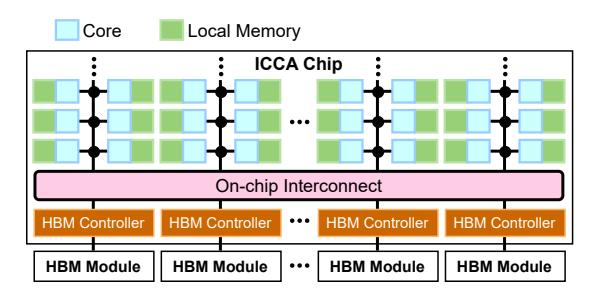

Figure 1: Architecture of inter-core connected AI (ICCA) chip.

and a separate global SRAM shared by all cores simultaneously handles all off-chip data loading. On ICCA chips, the software can manually manage data sharing among cores without needing a global SRAM. Also, the distributed nature of ICCA chip's on-chip SRAM allows its size to further scale, so it can store multiple tensor operators. Thus, when executing a current operator, the chip can simultaneously preload future operators' data from off-chip memory to SRAM. However, this requires each core's local SRAM to enable double buffering between execution and preload, resulting in significant memory footprint overhead.

The end-to-end performance of running a DL model on an ICCA chip is determined by three major factors: (1) compute (per-core execution), (2) communication (inter-core data exchange), and (3) I/O (data loading from off-chip memory). To maximize the efficiency of the inter-core connected AI chip, it is challenging for software (i.e., DL compiler) to optimize all three performance factors, since they usually have conflicting resource demands, as shown in Figure 2.

First, to overlap computing and off-chip loading, the DL compiler needs to decide how much on-chip memory space to allocate for per-core execution and for buffering preloaded data from off-chip memory. A larger space for execution (i.e., execution space) allows larger per-core tile size, reduces inter-core communication traffic, and improves compute efficiency. A larger space for preload (i.e., preload space) improves off-chip memory bandwidth utilization. This leads to on-chip memory capacity contention (① in Figure 2). Second, the on-chip interconnect links all cores and HBM controllers, and its bandwidth is shared between inter-core data exchange and HBM-to-core data loading. This leads to interconnect bandwidth contention (②). Third, the per-core SRAM must feed data to the local computation pipeline and serve data to other cores via the interconnect. The concurrent SRAM accesses will lead to memory access contention (③).

Given the performance trade-offs, we must jointly optimize all three performance factors. However, to the best of our knowledge, few existing studies optimized the end-to-end performance by holistically considering all three performance factors (i.e., per-core execution, inter-core data exchange, and off-chip data loading). Many DL compilers tune the tile size to optimize compute efficiency and off-chip memory access volume [8, 74], but do not consider the inter-core communication. Some ICCA chip compilers like T10 [34] leverage new parallel execution paradigms to streamline the on-chip dataflow [34, 46, 52], which optimizes both per-core execution and inter-core communication. However, they did not consider the off-chip memory access.

<span id="page-1-1"></span>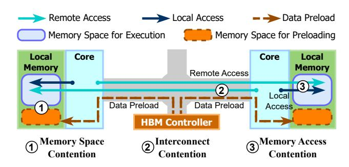

Figure 2: Resource contentions on ICCA chip with HBM.

In this paper, we present Elk, a DL compiler framework to maximize the efficiency of ICCA chips by jointly optimizing all three performance factors. Elk formalizes these factors into a global tradeoff space, based on the insight that these factors can be transferred into configurable compiler parameters (§3), and the correlation between these parameters can reflect their performance trade-offs.

Specifically, (1) the per-core execution performance is correlated to the SRAM capacity allocated to the execution space. (2) The off-chip data loading performance (i.e., the HBM bandwidth utilization) can be improved by increasing the number of preloaded operators, which allows more overlap between computation and HBM access. (3) An operator's inter-core data exchange overhead can be reduced by increasing the operator preload space, which allows us to duplicate shared data in multiple cores in advance to avoid on-demand access to other cores, at the expense of higher SRAM footprint.

To search an optimized model execution plan, Elk schedules the preload and execution of each operator with a two-level search algorithm to best overlap off-chip data access and on-chip execution. For each operator, Elk first selects the optimal number of preloaded operators via an exhaustive search. The search space is small as the on-chip memory stores a limited number of preloaded operators. Second, Elk's cost-aware memory allocation algorithm determines the execution space size for the current operator and the preload space for each preloaded operator. Elk uses an iterative greedy algorithm to minimize the execution time of the current operator and the inter-core data exchange overhead of preloaded operators.

As Elk preloads multiple operators, the earlier an operator is preloaded, the longer it occupies the on-chip SRAM, which limits the execution space of the current operator. Thus, Elk reorders the operator preloads to delay the preloads of operators that involve large tensors, reducing the lifespans of large operators' SRAM footprints. Also, as some operators require higher interconnect bandwidth to be preloaded to destination cores, Elk reorders the preload traffic to avoid "rush hours" on the interconnect, reducing the interconnect contention. To yield an efficient search space of preload orders, Elk smartly limits the edit distance of preload orders based on the available SRAM capacity on the chip.

To evaluate ELK, we build an emulation framework using a real IPU-POD4 hardware [20] to emulate full-fledged ICCA chips with HBM, and a simulator framework with popular inter-core network topologies for sensitivity analysis and design space exploration of ICCA chips. We evaluate ELK with state-of-the-art LLMs and stable diffusion models. We not only show ELK achieves 94% of the ideal

roofline performance, but also present Elk's capability of exploring design tradeoffs in ICCA chips. We list our contributions as follows:

- For the inter-core connected AI chip with off-chip HBM, we are the first to identify the performance challenges for best utilizing its hardware properties.
- We develop a DL compiler framework ELK that structures the performance factors into configurable parameters in the compiler, such that we can optimize hardware performance by exploring the space using compiler techniques.
- We develop a new inductive operator scheduling policy in ELK for optimizing the overlapping of HBM data loading and onchip execution, as well as design a new cost-aware algorithm for on-chip memory allocation.
- To generalize our design in the DL compiler, we build a generic interface that can map the optimized end-to-end execution plan to popular ICCA chip architectures.
- To evaluate our design, we construct an emulation framework with real IPU-POD4 [20] hardware, and demonstrate the efficiency of Elk for various DL models.
- We build the first hardware simulator for ICCA chips, which supports popular network topologies for inter-core communications and various bandwidth behaviors.
- With ELK and the ICCA chip simulator, we enable design space exploration of ICCA chips and present our insights in §6.4. We will open source our codebase to the community.

#### 2 Background and Motivation

We now introduce the features of the inter-core connected AI chip and discuss the motivation of Elk.

#### <span id="page-2-3"></span>2.1 Architecture of the ICCA Chip

To facilitate the introduction of the ICCA chip as shown in Figure 1, we use Graphcore IPU MK2 [29] as an example. An IPU chip has 1472 cores that execute independently in parallel. Each core has 624KB local scratchpad memory, adding up to 896MB of total on-chip memory. All cores are interconnected with highbandwidth low-latency links. Each core can access any other core's local memory at 5.5GB/s, delivering an aggregated inter-core all-toall bandwidth of  $1472 \times 5.5$ GB/s  $\approx 8$ TB/s [27]. The large on-chip memory improves on-chip data reuse by storing more operators or even an entire model. The all-to-all interconnect allows each core to independently access on-chip data at high bandwidth. If multiple cores receive/send different data from/to the same core, the interconnect sequentially serves each data transfer at full bandwidth. In addition to IPU, other ICCA chips, such as SambaNova SN40L [46] and Tenstorrent [52], feature a mesh-based on-chip interconnect. In general, the ICCA chip architecture enables scalable performance and alleviates the memory bandwidth bottleneck for serving memory-intensive DL workloads like LLMs.

Scale the ICCA chip with HBM. To serve large models whose sizes exceed the on-chip capacity, we can scale the memory capacity with off-chip memory modules like high bandwidth memory (HBM) [39]. Many ICCA chips already integrate off-chip memory [37, 46]. As shown in Figure 1, they attach HBM controllers to the on-chip interconnect, so each controller can directly send data to each core similar to how the cores send data to each other. To access HBM, cores communicate with HBM controllers via the

<span id="page-2-1"></span>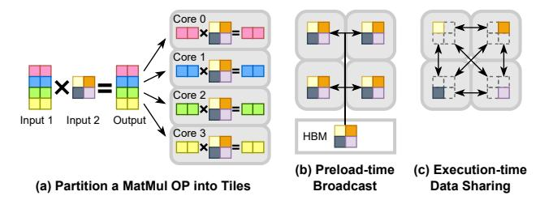

Figure 3: Operator partitioning and inter-core data sharing.

interconnect. The HBM controller coalesces the memory requests from cores, loads data from HBM, and sends data to cores.

## <span id="page-2-0"></span>2.2 Execution Model of ICCA Chip with HBM

Before executing a DL model, all required data (e.g., model weight) is loaded into HBM. The ICCA chip will sequentially execute each operator in the model by first preloading its required data from HBM to on-chip memory and then performing the on-chip computation. To maximize computing throughput, the compiler manages the on-chip SRAM as a double buffer to overlap the on-chip execution and off-chip HBM access. The compiler partitions the SRAM in each core into an *execution space* to store the currently executing operator and a *preload space* to store the operators preloaded from HBM. While an operator is executing, the ICCA chip can preload other operators from the HBM into the on-chip memory. On preload, HBM controllers use the interconnect to deliver preloaded data to cores. Each core needs to reserve enough local memory space for this. When the preload space is full, the preload will stop and the HBM bandwidth will be underutilized.

On-chip execution. Several parallel execution models can execute tensor operators on ICCA chips [34, 40, 74], all of them require significant computation, on-chip memory, and communication resources. In these execution models, a compiler will partition the computation of a tensor operator into small tiles [34, 74] and map each tile to a core. To execute a tile, each core must fetch the required data from HBM or another core to its local memory, via the interconnect. For example, a MatMul operator is partitioned into four tiles in Figure 3 (a), and all cores require "Input 2" for percore execution. In some execution models [40], this shared tensor will be directly broadcast to each core by the HBM controller via the interconnect, as shown in Figure 3 (b). This needs more local memory space but fewer inter-core accesses. Some other execution models [34, 74] allows a core to access shared tensors from other cores during execution, as shown in Figure 3 (c). This needs less per-core local space but more inter-core accesses. After the per-core execution, an operator may need to reduce the partial results across multiple cores into the final result, where these cores will exchange the partial results via the interconnect.

#### <span id="page-2-2"></span>2.3 Challenges of Using ICCA Chip with HBM

To maximize the ICCA chip performance, we must (1) allow faster per-core execution, (2) utilize more HBM bandwidth to preload required data on time, and (3) reduce the inter-core data sharing overhead. However, it is difficult to maximize all three performance metrics simultaneously, as they have conflicting resource demands. **On-chip memory space contention.** We cannot *maximize per-core execution performance* and *HBM bandwidth utilization* at the

<span id="page-3-5"></span>

Figure 4: Mapping performance factors to compiler decisions on per-core SRAM allocation among preload and execution.

<span id="page-3-2"></span>

Figure 5: The execution times of representative operators given different per-core execution spaces. Each data point is a plan. In each model, plans of the same operator use the same legend (e.g., *MatMul:Attn\_QKV* is the MatMul operator that calculates the Q,K,V matrices in attention [57]).

same time, due to on-chip memory space contention. As shown by 1 in Figure 2, each core reserves an execution space for the currently executing operator and a preload space for the preloaded operators. To speed up per-core execution, a larger execution space is required (see §3.1 and Figure 5). To prevent HBM underutilization, a larger preload space is required (see §3.2 and Figure 6). With limited on-chip memory, we cannot expand both spaces.

**Interconnect bandwidth contention.** We cannot *maximize HBM bandwidth utilization* and *minimize inter-core data sharing overhead* at the same time, due to the interconnect bandwidth contention. As shown by ② in Figure 2, the on-chip interconnect carries both core-to-core traffic for inter-core data sharing and HBM controller-to-core traffic for preloading. When both traffic flows are heavy, the interconnect will be congested (see §3.3 and Figure 8).

Memory access contention. We cannot maximize per-core execution performance and minimize inter-core data sharing overhead at the same time, due to the memory access contention. As shown by ③ in Figure 2, each core's local memory is simultaneously accessed by the core itself for computing a tile, and by other cores for inter-core data sharing. For example on IPU, each core reads its local memory at full speed (128 bits/cycle [19]) when executing DL operators like MatMul, any other accesses will pause the execution. Upon contention, tile execution on this core reads data from local memory at slower speed, or even pauses entirely. The remote cores may also suffer from degraded SRAM bandwidth.

# <span id="page-3-0"></span>3 Performance Tradeoffs in ELK

As discussed in §2.3, to efficiently use ICCA chips with HBM, we must trade-off multiple performance factors. We summarize how each performance factor is mapped to a compiler decision in Figure 4. First, increasing per-core *execution space* enables faster percore execution with a larger tile size (§3.1). Second, increasing *number of preloaded operators* can better overlap on-chip execution and off-chip HBM load, improving HBM bandwidth utilization (§3.2). Third, increasing *preload space* for each preloaded operator

<span id="page-3-4"></span>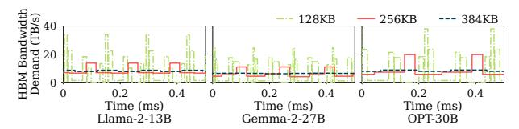

Figure 6: HBM bandwidth demands of models across time, given different preload spaces. The legend shows per-core preload space size in KB (same for all cores).

reduces the inter-core data exchange overhead and the memory access contention, since the shared data can be duplicated on cores in advance to reduce the overhead of on-demand accesses to other cores (§3.3). We validate the insights with experiments on our ICCA chip emulator (see implementation in §5) as follows.

# <span id="page-3-1"></span>3.1 Larger Execution Space Enables Faster Per-core Execution

There are many possible ways to partition an operator [70, 71, 74], resulting in partition plans with different per-core tile sizes, execution times, and inter-core data exchange traffic. Generally, a larger execution space per core enables a larger tile size and improves the per-core execution performance, as a larger tile implies higher per-core data reuse and larger compute granularity, with fewer inter-core data accesses. We show the correlation between execution time and execution space in Figure 5. We choose representative operators from popular LLMs of various sizes: Llama-2-13B [53], Gemma-2-27B [51], and OPT-30B [66]. For each operator, we plot the execution times of partitioning plans generated by a state-of-the-art compiler [34] for ICCA chips given different SRAM size constraints. The results show that faster execution plans require more per-core execution space. We observe similar results in DL compilers using other parallel execution models [70, 74].

Existing compilers focus on achieving higher on-chip execution performance using a given execution space size. However, they cannot find a proper execution space size by arbitrating the memory space contention in §2.3. Moreover, operators from the same model have diverse memory vs. time correlations. Thus, we also need to adjust the execution space size based on each operator's performance characteristic, rather than allocating a fixed-sized execution space throughout the model execution.

# <span id="page-3-3"></span>3.2 Preloading More Operators Improves HBM Bandwidth Utilization

Operators in a DL model have different *compute intensities* (i.e., number of floating-point operations, or FLOPs, performed per byte). While some are compute-intensive due to more on-chip data reuse (e.g., operators that use model parameters, which are reused by all input requests in a batch), others are memory-intensive (e.g., the KV cache [45], which has no data reuse among requests in a batch).

The diverse HBM access and execution time across operators cause sub-optimal computation and HBM bandwidth utilization. If the currently executing operator has a short execution time while the next operator has a long HBM time, the current operator finishes before the next operator completes preloading, and the computation stalls. Similarly, if the next operator finishes preloading before the current operator completes, the HBM bandwidth is underutilized.

<span id="page-4-2"></span>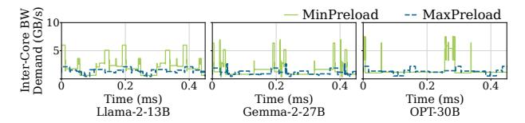

Figure 7: The inter-core bandwidth demand of each core across time, with different preload settings. The demand does not count HBM controller-to-core traffic.

<span id="page-4-1"></span>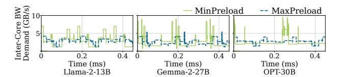

Figure 8: The total per-core interconnect bandwidth demand.

To improve HBM bandwidth utilization, we can preload more operators. This also improves compute utilization, as more data will be ready on-chip, so future execution is less likely to stall. However, preloading more operators requires a larger preload space. Figure 6 shows how the HBM bandwidth demand varies over time for LLM inference with different per-core preload space sizes. The bandwidth demand is quantified as the minimum HBM bandwidth to prevent on-chip execution from stalling. With small preload space, the bandwidth demand fluctuates drastically due to insufficient preload opportunities. With larger preload space, more operators can be preloaded. This smooths out the bandwidth demand, reduces the compute/memory idleness, and enhances the overall performance.

# <span id="page-4-0"></span>3.3 Larger Per-Operator Preload Space Reduces Inter-core Data Access Volume

As discussed in §2.2, data shared between cores can be either broadcasted by HBM controllers during preload or accessed from peer cores during execution. A larger preload space allows for more broadcasts at preload time and fewer on-demand accesses at execution time. Also, with fewer inter-core accesses, less memory access contention will occur on each core.

Figure 7 shows that expanding preload space reduces the intercore bandwidth demand. For each operator, we pick the fastest execution plan that fits in a given execution space  $\operatorname{size}^1$ . MinPreload lets each core access all shared data from other cores at execution time, which requires the minimum preload space. MaxPreload lets HBM controllers broadcast as much shared data as possible at preload time, which requires the largest preload space. We profile the inter-core bandwidth demand ( $\frac{\operatorname{inter-core transfer volume}}{\operatorname{per-core execution time}}$ ) of each core. MaxPreload significantly reduces the inter-core traffic.

Although more broadcasts on preload increase the HBM controller-to-core traffic, the preload traffic can be opportunistically interleaved with ongoing inter-core traffic to reduce contention. Figure 8 shows how each core's total interconnect bandwidth demand (defined as  $\frac{\text{inter-core transfer volume}}{\text{per-core execution time}} + \frac{\text{HBM-to-core transfer volume}}{\text{HBM load time}}) \text{ varies over time. Purely relying on inter-core transfer fluctuates the traffic pressure drastically, causing interconnect underutilization or}$ 

<span id="page-4-6"></span>Table 1: A summary of performance tradeoffs (§3) investigated in our design (§4).

| <b>Compiler Decision</b>                | Relevant Performance Factors                                                                                                            | Relevant Design                        |  |  |
|-----------------------------------------|-----------------------------------------------------------------------------------------------------------------------------------------|----------------------------------------|--|--|
| Number of operators<br>to preload ahead | (1) Improve HBM bandwidth utilization                                                                                                   | Two-level inductive scheduling (§4.2)  |  |  |
| Execution space size                    | (1) Accelerate per-core execution     (2) Reduce inter-core data accesses     (i.e., reduce interconnect and memory access contentions) | Cost-aware memory<br>allocation (§4.3) |  |  |
| Preload space size of each operator     | (1) Reduce inter-core data accesses<br>(i.e., reduce interconnect and<br>memory access contentions)                                     | Cost-aware memory<br>allocation (§4.3) |  |  |
| Preload order                           | (1) Reduce interconnect contention     (2) Reduce the lifespans of large     operators' preload spaces                                  | Preload order<br>permutation (§4.4)    |  |  |

<span id="page-4-5"></span>

Figure 9: Overview of our Elk framework.

congestion. More broadcasts at preload time reduce fluctuation by spreading the traffic across preload and execution times.

#### <span id="page-4-4"></span>4 Design and Implementation

We design ELK, a compiler framework for exploring the efficiency of ICCA chips. ELK automatically trades-off performance factors by configuring the number of preloaded operators, the per-core execution space size, the per-operator preload space size, and the preload order of operators. We show the design overview of ELK in Figure 9. We use Table 1 to show which design component of ELK handles each performance tradeoff in §3.

#### 4.1 Design Overview

For a DL model, Elk schedules the preload and execution of operators by exploring a two-level search space. First, for each operator, Elk explores all possible numbers of future operators to preload before or during this operator's execution (§4.2). Second, for each number of preload operators, Elk optimizes on-chip memory allocation by trading off between execution and preload spaces (§4.3).

To reduce the inter-core data exchange overhead and enable larger execution space, Elk allows operators to be preloaded in a different order. Elk finds the optimal preload order by searching through all promising orders. For each order, Elk applies operator scheduling policies and conducts a performance estimation. To reduce the search overhead, Elk prunes orders that will overflow the on-chip memory (§4.4). Finally, Elk generates an optimized end-to-end plan for the entire model. The plan specifies the preload and execution plan of each operator. A code generator then translates this plan into an executable program for the hardware (§4.5).

<span id="page-4-3"></span> $<sup>^1\</sup>mathrm{For}$  each run, we use the optimal execution space size that gives the smallest total inference latency. See the description of the  $\mathit{Static}$  setup in §6.1.

<span id="page-5-2"></span>

(a) The state before scheduling Op5. The preload and execution of operators after Op5 are already scheduled.

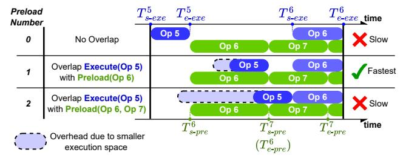

(b) Schedule the execution of Op5 by finding the optimal preload number with the shortest current-to-end time.

Figure 10: Select the preload number that minimizes the "current-to-end" time.

# <span id="page-5-0"></span>4.2 Two-Level Inductive Operator Scheduling

The scheduling algorithm minimizes the end-to-end execution time of a DL model by deciding the number of future operators to preload before or during each operator's on-chip execution (i.e., *preload number*). Each preload number represents a trade-off point between on-chip execution speed and HBM bandwidth utilization (Figure 4).

The optimization space is exponential to the number of operators. Suppose there are N operators in a DL model, and the on-chip memory can fit at most K operators. Each operator's execution can overlap with 1 to K operators' preload. Thus, there are  $O(K^N)$  combinations of preload numbers for all operators. For example, for IPU-POD4 (3.5GB on-chip memory) and OPT-30B, each identical layer has 84 operators and  $K \geq 28$ , forming up to  $28^{84}$  combinations.

We develop an O(KN)-time algorithm for this problem. The insight is, as operators in a DL model typically execute in a sequential order due to data dependency, instead of exploring all combinations of preload numbers, we can exploit the execution order and inductively derive the optimal preload number for each operator.

We can either start from the first operator and find the optimal preload number for each succeeding operator, or start from the last operator and schedule each preceding operator. For each operator, we explore all possible preload numbers based on the already scheduled operators, and we pick the preload number that minimizes the "start-to-current" or "current-to-end" execution time. As both induction directions are equivalent, we focus on the second one.

The base case of induction is trivial, as the last operator has no succeeding operators to preload (i.e., preload number is always 0). For the inductive step, we show an example in Figure 10. In Figure 10 (a), Elk has finished scheduling all operators after Op5. Then, Elk schedules the execution of Op5 in Figure 10 (b). Elk enumerates all possible preload numbers for Op5. For each preload number, Elk invokes the cost-aware on-chip memory allocation algorithm (§4.3) to determine the execution/preload space sizes for the involved operators and the estimated execution time of Op5.

For example, preload number 0 means we do not overlap Op5's execution with any preload. The execution time of Op5 is minimized, but the overall execution time from Op5 to the end of the model is sub-optimal. For preload numbers 1 and 2, Elk overlaps the

execution of 0p5 with the preload of 0p6, or the preloads of both 0p6 and 0p7. Though 0p5's execution time is longer, the overall execution times are better than preload number 0. As preload number 1 yields the lowest current-to-end time, Elk selects it for 0p5.

After scheduling Op5's execution, ELK schedules its preload to occur just before its execution or before Op6's preload, whichever is earlier, to preserve data dependency. Scheduling the preceding operator (Op4) will depend on Op5's preload time, which is estimated as the maximum of (1) the HBM access time from a roofline model [60] and (2) the interconnect transfer time from the cost model in §4.3.

Our algorithm has O(KN) complexity as we iterate through N operators with up to K preload numbers per operator. The algorithm provably finds the end-to-end plan with the shortest total time, assuming it can obtain the optimal execution time for each preload number. Lemma 4.1 and Theorem 4.2 formalize the algorithm.

<span id="page-5-3"></span>Lemma 4.1 (Base case). Given a model with N operators, for each operator i, let  $T^i_{s-pre}$  and  $T^i_{e-pre}$  be the start and end time of operator i's preload. Let  $T^i_{s-exe}$  and  $T^i_{e-exe}$  be the start and end time of operator i's execution. Let  $T_{start} = T^1_{s-pre}$  and  $T_{end} = T^N_{e-exe}$  be the start and end time of the model execution. Then, for operator N, preload number 0 minimizes  $T_{end} - T^N_{s-exe}$ .

PROOF. Since operator N is the last operator, the only possible preload number is 0.

<span id="page-5-4"></span>Theorem 4.2 (Inductive step). Let  $1 \le i < N$ . Suppose we have minimized  $T_{end} - T_{s-exe}^{i+1}$ . Then, there exists a preload number p whose  $T_{s-exe}^i$  minimizes  $T_{end} - T_{s-exe}^i$ , or maximizes  $T_{s-exe}^i$ . Specifically, we have  $T_{e-exe}^i = \min(T_{s-exe}^{i+1}, T_{s-pre}^{i+p+1})$ , and  $T_{s-exe}^i = T_{e-exe}^i - L_{exe}^i$  where  $L_{exe}^i$  is the execution time of operator i derived by the cost-aware memory allocation algorithm in §4.3.

PROOF. First, to prove  $T_{e-exe}^i = \min(T_{s-exe}^{i+1}, T_{s-pre}^{i+p+1})$  for any preload number p, we have (1) Opi must finish execution before  $\operatorname{Op}(i+1)$  starts execution, e.g.,  $T_{e-exe}^i \leq T_{s-exe}^{i+1}$ ; and (2) Opi's execution can be overlapped with the preload of the next p operators, which implies  $\operatorname{Opi}$ 's execution must finish before the preload of  $\operatorname{Op}(i+p+1)$ , e.g.,  $T_{e-exe}^i \leq T_{s-pre}^{i+p+1}$ . Next, we prove the existence of  $T_{s-exe}^i$  that minimizes  $T_{end} - T_{s-exe}^i$ . Suppose by contradiction that  $T_{end} - T_{s-exe}^{i+1}$  is minimized but there is no  $T_{s-exe}^i$  that minimizes  $T_{end} - T_{s-exe}^i$ . Since our inductive step explored all  $T_{s-exe}^i$  values by enumerating all possible preload numbers, the only possible case is that we must explore more preload numbers to find the global  $\max(T_{s-exe}^i)$ , or the global  $\max(T_{s-exe}^i)$  is greater than  $T_{s-exe}^{i+1}$ , which means  $T_{s-exe}^{i+1}$  can be larger. This is a contradiction since  $T_{end} - T_{s-exe}^{i+1}$  is already minimized, e.g.,  $T_{s-exe}^{i+1}$  is already maximized.

### <span id="page-5-1"></span>4.3 Cost-Aware On-chip Memory Allocation

In §4.2, when scheduling an operator, ELK needs to optimize the performance for each preload number. Given the currently executing operator and a set of operators to be preloaded, ELK defines a two-level tradeoff space between the execution/communication time and the memory consumption.

First, there are two types of *intra-operator tradeoffs*: (1) For the currently executing operator, ELK trades memory space for execution time (§3.1). (2) For each preloaded operator, ELK trades

<span id="page-6-0"></span>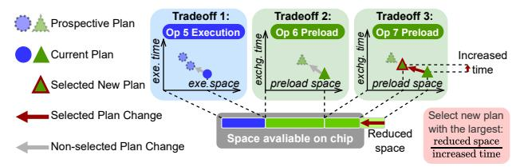

Figure 11: Tradeoff between time overhead & memory usage.

<span id="page-6-1"></span>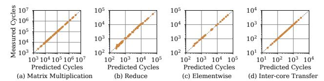

Figure 12: Cost model accuracy of different operators and inter-core transfer, for different tile shapes. Each point is the measured vs. predicted per-core execution or transfer time.

memory space for this operator's inter-core data exchange overhead (§3.3). Second, there is an inter-operator tradeoff: as operators have different memory-time tradeoffs, we allocate more memory to operators that benefit more from a larger execution/preload space.

Elk explores the two-level space in two stages. First, for each operator, Elk finds all Pareto-optimal tradeoff plans between time and memory. Second, Elk jointly determines the execution/preload space sizes of all operators based on the Pareto-optimal plans and the total on-chip memory capacity.

**Intra-operator tradeoff for on-chip execution** (Tradeoff 1 in

Figure 11). For the currently executing operator, there are many

partition plans to partition its computation into tiles, each runs on

one core (Figure 3). Elk integrates existing compiler techniques to enumerate all partition plans of an operator given its operator type and tensor shapes [7, 16, 34, 46, 70, 74]. These techniques represent each plan as a list of integers (see examples in §5) and check if a plan is compatible with the target hardware (e.g., not using more cores than available, not overflowing the SRAM). For each plan, Elk estimates its execution time using a cost model and its execution space using the tile size. ELK examines all plans to find the ones on the Pareto-optimal curve, where each plan either runs faster than any other plans that use the same or less memory, or uses less memory than any others with the same or less execution time. Cost model for execution time. As DL workloads have predictable execution patterns [4, 16, 34, 38, 61, 74], ELK uses an accurate cost model to quickly estimate the performance of per-core execution and inter-core transfer. For each operator type (e.g., MatMul), we randomly generate tiles with varied shapes, and run each tile using one core on the target device. Then, we fit a linear tree model [10] using the tile shapes as inputs and the profiled execution times as outputs. For inter-core transfer, we fit a model for each network link using transfer volumes as inputs and transfer times as outputs. For each partition plan, ELK determines the tile-to-core mapping and orchestrates the inter-core transfer (e.g., the source/destination cores and intermediate hops of each transfer, see §5). Elk uses the per-link cost model and the communication pattern to estimate the total transfer time. Figure 12 shows that ELK can accurately predict

the execution and transfer times of an IPU chip. Elk can use different cost models [4, 34, 38, 74] for different hardware platforms.

MICRO '25, October 18-22, 2025, Seoul, Republic of Korea

**Intra-operator tradeoff for preloading** (Tradeoff 2 and 3 in Figure 11). For each preloaded operator, its partition plan is already decided in a previous step of the inductive operator scheduling (§4.2). This execute-state plan is chosen for execution speed, which may use more memory space. As the operator is not currently executing, ELK assigns a memory-efficient preload-state plan. To start execution, a data distribution phase transforms the operator from preload- to execute-state by distributing the required data via the interconnect (e.g., Figure 3 (c)). It saves this operator's preload space at the cost of extra inter-core data exchange overhead, compared to broadcasting the required data at preload time following the execute-state plan (e.g., Figure 3 (b)).

Each execute-state plan may have many preload-state plans, by configuring how much data is broadcasted on preload. On preload, if 4 cores share a data piece, we can evenly split it into 1, 2, or 4 chunks, and broadcast each chunk to 4, 2, or 1 cores. Each core receives 1,  $\frac{1}{2}$ , or  $\frac{1}{4}$  of the data on preload (this decides preload space size), and fetches the rest 0,  $\frac{1}{2}$ , or  $\frac{3}{4}$  on data distribution. ELK finds the Pareto-optimal preload-state plans of each preloaded operator, by estimating their preload space sizes and data distribution times. Inter-operator tradeoff. With limited on-chip memory, Elk jointly trades off memory allocation among the executing and preloaded operators. It minimizes the total time, which is determined by (1) execution times, (2) data-distribution times, (3) interconnect contention overhead due to overlapped preload and execution, and (4) memory access contention overhead between local SRAM accesses and inter-core accesses<sup>2</sup>. To estimate the contention overhead on each interconnect link, Elk divides total traffic by link bandwidth.

As enumerating all possible plan combinations is impractical (e.g.,  $O(P^K)$  combinations for K operators each with P plans), ELK uses a heuristic based on each operator's memory-cost efficiency. ELK starts with each operator's fastest plan as the currently selected plan. This combination of plans requires the most execution/preload space, so the total space requirement may exceed the memory capacity. Elk then iteratively searches for the best combination of plans whose total memory requirement can fit into the on-chip memory, at the cost of slightly increasing the total execution time.

For each search step, ELK examines the next plan with a smaller memory footprint along the Pareto-optimal curve for each operator. ELK selects the most "cost-effective" operator whose next plan has the largest ratio  $\Delta = \frac{\text{reduced space size}}{\text{increased time}}$  compared to the currently seincreased time lected plan. For example, in Figure 11, 0p5 is the executing operator. Op6 and Op7 are preloaded operators. ELK updates the current plan for Op7 and proceed to the next search step. Elk stops when the total memory requirement does not exceed the available capacity.

In the worst case, Elk needs to examine all Pareto-optimal plans for all operators. Hence, it has O(PK)-time complexity for K operators to fit on-chip and P plans per operator. Combined with §4.2, the complexity is  $O(PK^2N)$  for N operators (K is also the number of possible preload numbers of each operator).

<span id="page-6-2"></span> $<sup>^2\</sup>mathrm{For}$  some ICCA chips where local SRAM accesses are blocked by inter-core accesses (e.g., IPU), we estimate access contention overhead using the inter-core access time.

<span id="page-7-2"></span>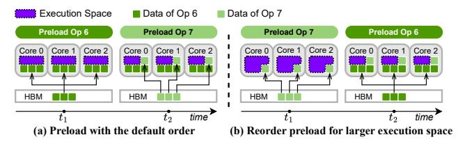

Figure 13: Reorder preloads to allow larger execution space.

<span id="page-7-3"></span>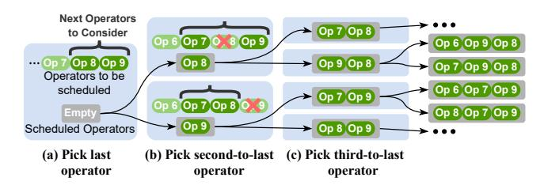

Figure 14: The generation of candidate preload orders.

#### <span id="page-7-0"></span>4.4 Preload Order Permutation

ELK allows operators to be preloaded in a different order than the execution order. This has two benefits.

First, reordering helps mitigate interconnect contention. As the interconnect traffic pressure fluctuates (see §3.3), the reordering opportunistically reschedules heavy preload traffic to avoid "rush hours" on the interconnect.

Second, by reordering the preload of some large operators to a later time, we can save more space for execution by reducing the lifespans of their large memory footprints in the on-chip SRAM. For instance, in Figure 13, 0p6 requires more preload space than 0p7. If we preload in order, the execution space is 1/2 of the total on-chip memory at time  $t_1$ . If we reorder their preloads, the execution space is 5/6 of the total memory at  $t_1$ .

As large models consist of thousands of operators, it is unrealistic to test all preload orders (there are N! orders given N operators). However, most of the orders are invalid, as they overflow the onchip memory. If we delay an operator's preload to a late time, its execution will also be delayed. As operators are executed in order, future operators also cannot execute until this delayed operator completes execution, even if they have already been preloaded into the on-chip memory. Since there is no free space to preload more operators, and the preloaded operators cannot free their space until executed, the on-chip memory will overflow. In practice, Elk only needs to explore a reasonable amount of valid preload orders.

Generate valid preload orders. ELK enumerates all valid preload orders by scanning through all operators following the inductive operator scheduling order (§4.2) and incrementally picking the next operator to preload in each step.

Figure 14 shows an example of a DL model with 9 operators. In the first step (Figure 14 (a)), ELK picks the last operator to preload. We can only fit two operators into the on-chip memory, so either Op8 or Op9 can be the last operator to preload. This generates two branches for the next step.

In the second step (Figure 14 (b)), ELK iterates through both branches and picks the second-to-last operator to preload for each branch. In the upper branch, Op8 is already preloaded. If we choose Op6 as the second-to-last operator to preload, both Op7 and Op9 need

<span id="page-7-4"></span>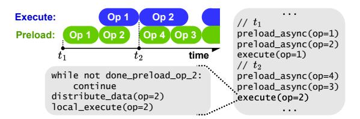

Figure 15: The abstracted device programming model of Elk.

to be preloaded before Op6. This implies all three operators, Op6, Op7, and Op9, must stay on-chip together because their memory cannot be freed up until Op6 is executed. In our example, as the memory cannot fit all three operators, we can only choose Op7 or Op9. Similarly, in the lower branch, we can only choose Op7 or Op8, and we do not consider the space requirement of Op9 because it can be preloaded after we free up Op7 and Op8's memory.

ELK repeats the above process and generates a suffix tree of all valid preload orders. Given N operators in a model, if we can fit at most K operators on-chip, our search tree has  $O(K^N)$  leaves, compared to the original O(N!) search space.

**Prune the valid order search space.** Given the unique characteristics of LLMs, Elk can further prune the candidate orders while still being able to find a near-optimal order.

First, many operators, such as softmax, preload little or no data from HBM, as they perform in-place computations on the intermediate output. For example, OPT-30B [66] has 2,269 operators, but 289 of them contribute 99.8% HBM load volume. Since the remaining 1,980 operators preload little or no data from HBM, reordering their preloads will have negligible performance benefits. *Thus, ELK focuses on reordering only the preloads of operators with high HBM load volume.* In practice, we only reorder the preload of operators whose tensor sizes are above average (e.g., for LLM decoding, the average size is model size divided by operator count). For smaller operators that often preload little or no data from HBM, we preload them in order (i.e., 0p i will be the i'th preloaded operator).

Second, an LLM consists of identical transformer layers. *ELK only reorders the preloads within one layer*, and applies the same order to identical layers. With these rules, ELK prunes the search space from  $O(K^N)$  to  $O(C^H)$ . H is the number of HBM-heavy operators per layer, so H << N ( $H \le 6$  in most transformer models). C is the maximum number of HBM-heavy operators per layer that can fit on-chip, so C << K and  $C \le H$ .

For each generated preload order, Elk invokes the operator scheduling pass in §4.2, forming a  $O(C^HPK^2N)$  search space. Elk picks the best end-to-end plan among all preload orders.

#### <span id="page-7-1"></span>4.5 Mapping to Hardware

The execution plan generated by ELK specifies all operator's preload order and each operator's partition plans. ELK maps the plan to an abstracted programming model, which can be applied to generic ICCA chips with off-chip memory. As shown in Figure 15, ELK abstracts two key device functions that are generated during compilation. (1) preload\_async(op=i) commands all cores to request Opi's data from HBM based on the preload-state partition plan. (2) execute(op=i) runs Opi on all cores based on the execute-state plan.

For the example in Figure 15, preload\_async(op=2) requests HBM controllers to deliver Op2's data to each core's SRAM, following the *preload-state plan* (see §4.3). When the data delivery completes, the controllers will append a done\_preload\_op\_2 tag to the end of the delivered data in each core's SRAM.

Then, execute(op=2) will run in 3 steps when it is called. First, it waits until preload\_async(op=2) completes, by verifying the value of done\_preload\_op\_2 tag in each core's SRAM. Second, each core calls distribute\_data to copy shared data from peers, transforming from preload-state to execute-state plan. Third, each core calls local\_execute to compute a tile following the execute-state plan.

To summarize, the hardware enforces three rules for preload\_async and execute calls, using one-way synchronization. (1) An invocation of execute blocks all future preload\_asyncs and executes, until the invoked execute finishes. This enforces the operator execution order and specifies which preload\_asyncs can overlap with an execute. (2) To enforce the preload order, all preload\_asyncs execute sequentially. (3) preload\_async(op=i) does not block any execute except execute(op=i), as an operator must preload before execution.

#### <span id="page-8-0"></span>5 Implementation details

ELK compiler framework. We implement ELK as a generic compiler framework that can support different ICCA chip implementations. Most ELK components are hardware-agnostic.

(1) ELK frontend takes a DNN model from ML frameworks like Py-Torch [48] as input. The model is first converted into an ONNX graph [1], which represents all operators in the model as a directed acyclic graph. ELK obtains layer information, operator definitions [56], and tensor shapes from the ONNX graph. ELK can support most DL models representable as an ONNX graph.

(2) The execution plan generation (§4.2–§4.4) takes operator partition plans as inputs. ELK supports single-operator partition plans generated by compilers that use different parallel execution models [34, 40, 74]. In our experiments, we use the plans generated with the recent compute-shift execution model proposed in [34], as it represents the state of the art for operator execution on ICCA chips.

For each operator, we enumerate all possible partition plans by representing each plan as a list of integers. For instance, <90,9> evenly slices each dimension of a 2-dimension operator into 90 and 9 parts, forming 90×9=810 tiles. For each plan, Elk decides the mapping of each tile to each core. It uses different mapping strategies for different network topologies. Elk currently targets ICCA chips with two popular network topologies: all-to-all network and mesh network. For chip with all-to-all network, Elk sequentially maps all tiles, as core locations do not impact the inter-core data transfer cost. For chip with *N*-dimensional mesh network, Elk chooses from plans that partition an operator along at most *N* dimensions, so it can map each partitioned dimension to a mesh dimension. Then, Elk uses dimension-order routing [22, 28] to maximize the all-reduce bandwidth. Besides the two topologies that are used by most ICCA chips today, Elk is scalable to support other topologies.

Based on the partition, mapping, and routing information, Elk's cost model estimates each plan's compute, memory, and interconnect costs. Using the costs of all plans for all operators, Elk runs the scheduling, allocation, and reordering procedures in 4.2-4.4 to trade-off among performance factors and compose an optimized

<span id="page-8-1"></span>Table 2: DL models used in our evaluation.  $\underline{C}$ : max number of HBM-heavy operators per layer that fit on-chip.  $\underline{H}$ : number of HBM-heavy operators per layer.  $\underline{P}$ : max number of plans per operator.  $\underline{K}$ : max number of operators that fit on-chip.  $\underline{N}$ : total number of operators. We calculate C and K using the on-chip memory capacity of real IPU-POD4 as an example.

| Name            | Description                                   | C | H | P   | K   | N    |
|-----------------|-----------------------------------------------|---|---|-----|-----|------|
| Llama2-13B [53] | Large language model (LLM)                    | 6 | 6 | 66  | 88  | 1928 |
| Gemma2-27B [51] | LLM with Grouped-Query<br>Attention (GQA) [5] | 6 | 6 | 206 | 128 | 2216 |
| OPT-30B [66]    | LLM                                           | 5 | 6 | 58  | 46  | 2269 |
| Llama2-70B [53] | LLM with GQA [5]                              | 6 | 6 | 168 | 86  | 3808 |
| DiT-XL [44]     | Diffusion transformer                         | 4 | 4 | 123 | 136 | 1521 |

<span id="page-8-2"></span>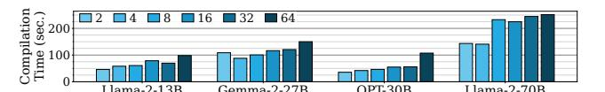

Figure 16: ELK compile time for varied model/batch sizes.

end-to-end execution plan. The execution plan generation in Elk is implemented in 2.5K lines of code (LoC) of Python.

(3) The code generation in ELK generates the kernel code for computing each tile and the inter-core data transfer operations, based on the target hardware and selected partition plans. For compute, ELK uses code templates from vendor-provided libraries [21]. For inter-core transfer, ELK reserves an 8KB buffer in each core's 624KB SRAM to buffer incoming data, which improves the transfer granularity and performance. The code generation in ELK is developed in 4K LoC of Python and C++.

Scalability of ELK. ELK prunes the search space of a large model to  $O(C^H PK^2 N)$  complexity. We list the complexity factors for different models in Table 2, all using batch size 32 and sequence length 2048. As model size grows, N scales sub-linearly, while C, H, P, and K change independently. Thus, ELK's search space size scales sub-linearly with the DL model size.

ELK can generate an end-to-end plan for an LLM on ICCA chip like IPU-POD4 in 5 minutes using a 32-core AMD EPYC 7543 CPU (see Figure 16). On each CPU thread, ELK can test a candidate preload order in seconds. As ELK prunes the number of preload orders (e.g., 720 for Llama2-70B), the compilation finishes in minutes. **Emulation framework.** As the ICCA chip we can access (IPU-POD4) does not have HBM, we build an emulation framework using a real IPU-POD4. The pod has 4 IPU MK2 chips with a total of 5,888 cores, 3.5GB on-chip memory, and 640GB/s inter-chip bandwidth. By default, we use model parallelism [40] across the four chips, since it incurs little inter-chip communication overhead, because the activation tensor to be reduced across chips is usually small. To obtain HBM access latencies, our framework uses an acknowledged memory simulator [32]. We evenly slice each tensor across all HBM modules to balance traffic, and sequentially place tensors in HBM. The HBM can easily saturate its bandwidth when ELK sequentially reads data at tensor granularity (tensor sizes range from 43 to 219 MB). Based on the tensor placement, we generate memory traces of all tensors to obtain HBM latencies from the memory simulator.

The framework then executes the end-to-end plan generated by ELK on IPU-POD4, where it computes each tile on each core

<span id="page-9-2"></span>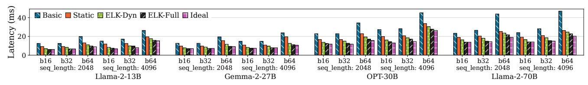

Figure 17: The per-token serving latency of various models and batch sizes on 4 ICCA chips with 16TB/s HBM.

and moves shared data between cores based on the partition plans selected by Elk. To emulate HBM accesses, one core acts as an HBM controller to broadcast "HBM data" to other cores and apply HBM latencies by delaying each broadcast. To synchronize execution with preload, the "controller" core also appends done\_preload\_op\_i tags (i.e., arbitrary constants, see §4.5) to the end of broadcasted data, allowing receiver cores to check whether a preload has finished.

As Elk homogeneously partitions each tensor to cores following common operator tiling strategies [12, 18, 74], all cores receive tensor tiles of the same size during each preload. Thus, we emulate the interconnect traffic caused by preload by using one "controller" core to broadcast data to all cores. The broadcast saturates the interconnect and the inbound links on receiver cores, emulating the contention between inter-core data sharing and operator preload. Simulation framework. To conduct sensitivity analysis and design space exploration, we build an event-driven simulator for ICCA chips, which simulates all cores, network links, and off-chip HBM accesses. For each core, we simulate a local SRAM, a compute pipeline, and a network agent that sends/receives data to/from other cores. For each network link, we model its latency and bandwidth [3, 6]. Based on the execution plan generated by ELK, we derive the simulation events at tile granularity, including computing a tile on a core, transferring a tile over a specific network link, and fetching a tile from the off-chip HBM. Each core/link maintains its event queue to execute its events sequentially. For an all-to-all network, we model HBM controllers as dedicated nodes in the network (see §2.1). For a mesh network, we attach HBM controllers to the edges of the mesh grid. To simulate a multi-chip system, we track the in-flight inter-chip transfer events and cap their total bandwidth. We also use our real IPU-based emulator to validate our simulator.

#### 6 Evaluation

With our emulation framework, we show that on average, ELK achieves (1) **94.84**% of the performance of an ideal roofline design (§6.2), (2) **89.52**% inter-core interconnect bandwidth utilization, and almost ideal HBM and FLOPS utilization relative to the roofline (§6.3). With our simulator, (3) we demonstrate ELK enables design space exploration for scaling compute, communication, and off-chip memory accesses for ICCA chips. We report our insights in §6.4.

#### <span id="page-9-0"></span>6.1 Experimental Setup

**Workloads.** We examine the inference decoding phase of differently sized LLMs (see Table 2), using varied batch sizes and sequence lengths. We also test a stable diffusion model (see Figure 23) and LLM training (see Figure 24).

**Emulator setup.** We emulate 4 HBM3E modules [39] per ICCA chip, following a state-of-the-art (SOTA) GPU [41]. With 4 ICCA chips, we have 16TB/s total HBM bandwidth.

Simulator setup. We simulate 4 chips and 16TB/s HBM bandwidth by default. The configuration (compute and local SRAM) of each core and the latency/bandwidth of each network link are the same as the emulator setup by default, and packets that share one NoC link are scheduled sequentially. We simulate both all-to-all and 2D mesh networks. For all-to-all network, we follow the IPU-POD4 architecture [29]. For mesh network, each core can simultaneously communicate with all its neighbors (up to 4 in a 2D mesh) [7].

**Baselines.** As there is no open-sourced compiler for ICCA chip with HBM, we conduct an ablation study by creating two baselines that extend SOTA compilers for ICCA chips [34] to support HBM, and an ELK variant that disables preload reordering (§4.4). We also compare ELK to an ideal roofline. In brief, we compare these designs:

- Basic: The design follows existing DL compilers to optimize on-chip execution. It maximizes the execution space and uses the remaining space to preload the next operator.
- Static: Following the SOTA compiler T10 [34] developed for ICCA chips, we extend it to jointly optimize on-chip execution and off-chip loading. First, it follows SambaNova [46] to preload multiple operators in advance, by reserving a preload space. Then, it find the fastest execution plan for each operator given the remaining execution space size. We further improve the design by finding the best static preload and execution space sizes for the entire DL model (the sizes will not change throughout the model execution). When preloading a set of operators, all operators use either the preload-state plan with the largest memory footprint or the plan with the smallest footprint, whichever is faster.
- ELK-Dynamic (ELK-Dyn): A partial design of ELK, which optimizes the preload-execution overlap (§4.2) and on-chip memory allocation (§4.3). This design represents ELK's performance without preload order permutation (§4.4).
- ELK-Full: The full ELK design, which enables all optimizations, including the preload order permutation (§4.4).
- Ideal: The theoretical roofline performance, where each of preload
  and execution has its own interconnect (i.e., no interconnect contention) and full-sized on-chip memory (i.e., no memory space
  contention). Each operator uses the minimum preload space to\nemulate the benefits of maximum preload number, and the data
  distribution phase has zero latency to emulate the benefits of
  maximum preload space per operator.

# <span id="page-9-1"></span>6.2 End-to-end Performance

Figure 17 shows the per-token generation latency of LLM decoding on our emulator. On average, *Elk-Full* outperforms *Basic* by **1.87**× (up to **1.93**×), *Static* by **1.37**× (up to **1.49**×), and achieves **94.84**% of the ideal performance. The performance of Elk also scales well with increasing batch size and sequence length. Notably, Gemma2-27B

<span id="page-10-2"></span>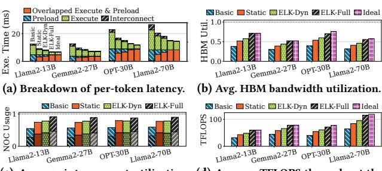

Top column parts are inter-core data execution of each model. sharing; bottom are operator preload.

(c) Average interconnect utilization. (d) Average TFLOPS throughout the

Figure 18: Execution breakdown and resource utilization. In (a), we categorize total time into preload (HBM is busy), execute (cores are busy), overlapped execute/preload, and interconnect (execute/preload stopped by busy interconnect).

<span id="page-10-3"></span>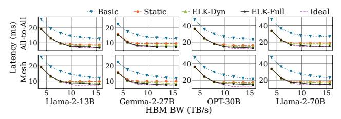

Figure 19: Per-token latency at varied HBM bandwidths.

and Llama2-70B can achieve latencies similar to those of smaller LLMs, since they use Grouped-Query Attention [5].

Inference latency breakdown. In Figure 18 (a), we break total time into four categories: (1) preload (HBM is loading), (2) execute (cores are computing/sending data), (3) overlapped preload & execute, and (4) interconnect (HBM/cores are stalled by interconnect contention). We only show batch size 32 and sequence length 2048 due to space limits. Basic always poorly overlaps preload and percore execution. By preloading more operators, Static increases the overlap time by 11.26×, but is limited by fixed preload and execution space sizes. *ELK-Dyn* overlaps better by adjusting the on-chip memory allocation based on operators' demands, but suffers from interconnect congestion and misses preload opportunities (when the available preload space is too small for the next operator, but can fit a future operator). By reordering preloads with an average edit distance of 2.9 steps, ELK-Full eliminates 87.65% of interconnect congestion overhead over ELK-Dyn. ELK-Full also reduces the non-overlapped preload time to 0.037% of the total, because of reduced on-chip memory contention.

#### <span id="page-10-1"></span>Hardware Resource Utilization

HBM bandwidth. Figure 18 (b) shows the average HBM bandwidth utilization for each design. Basic uses 34.7% of the bandwidth. It only preloads the next operator, causing HBM idleness. Static utilizes 46.42% by preloading multiple operators in advance, but the fixed-size preload space limits the preload opportunity and fails to keep HBM busy. ELK-Dyn achieves 51.97% utilization by allowing larger preload spaces. ELK-Full further achieves 62.40% utilization with preload reordering, which is close to the 64.38% utilization of Ideal. Note that Ideal does not fully utilize HBM bandwidth, as

<span id="page-10-4"></span>

Figure 20: Breakdown of LLama2-13B per-token latency with varied HBM bandwidths on all-to-all network. We categorize total time into preload (HBM is loading), execute (cores are computing or sending data), overlapped preload/execute, and interconnect contention (preload/execute stopped by busy interconnect). We only show one case due to space limits.

there is more bandwidth available than necessary to load the entire model during execution.

Interconnect bandwidth. Figure 18 (c) shows the interconnect bandwidth utilization for each design. Basic only utilizes 57.25% of the bandwidth. Static and ELK-Dyn can better overlap execute and preload, but their utilizations are still only 76.33% and 78.28%. ELK-Full achieves 89.52% utilization, since preloads with low interconnect traffic can be reordered to match operator execution periods with high traffic. This alleviates interconnect contention. We cannot make a fair comparison with Ideal, because Ideal is modeled using two separate interconnects for preload and execute. FLOPS. In Figure 18 (d), ELK-Full achieves 81.06 TFLOPS. Though our emulator theoretically offers 1000 TFLOPS for MatMuls or 31.2 TFLOPS for other operations, LLM inference is bandwidth-bound, and actual TFLOPS is limited by on-chip data transfer (the interconnect utilization is already as high as 90%). ELK-Full's TFLOPS is already close to that of Ideal.

#### <span id="page-10-0"></span>6.4 Design Space Exploration for ICCA Chips

To understand how to scale future ICCA chips, we use our ICCA chip simulator (§5) to explore the performance impacts of different network topologies, interconnect bandwidths, HBM bandwidths, and compute capabilities (FLOPS).

(1) Higher HBM bandwidth improves the per-token latency, but the benefit will diminish due to higher interconnect contention. In Figure 19, we examine ELK with various HBM bandwidths and interconnect topologies. When HBM bandwidth is low, all designs are bounded by HBM. With more HBM bandwidth (e.g.,  $\approx$ 8TB/s for Llama2-70B), the performance becomes bounded by the interconnect and per-core execution. Also, since mesh-based network takes multiple hops to deliver HBM data to cores, it suffers higher interconnect contention than all-to-all network. Thus, it is harder for ELK-Full to match with Ideal on mesh, especially for non-GQA models like Llama2-13B and OPT-30B, as they fetch more KV cache data from HBM.

In Figure 20, we show the latency breakdown of the interconnect contention. For Basic/Static/ELK-Dyn, contention increases with higher HBM bandwidth, as faster HBM needs more interconnect bandwidth to deliver data to cores. ELK-Full's reordering allows more preload opportunities which better utilize the faster HBM to eliminate the contention.

In Figure 21, we compare the interconnect utilization between the all-to-all and mesh topologies. While achieving similar serving

<span id="page-11-2"></span>

Figure 21: Interconnect utilization at varied HBM bandwidths.

<span id="page-11-3"></span>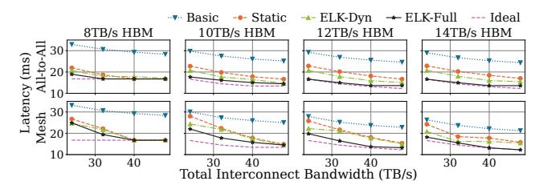

Figure 22: Llama2-70B latency of at varied NoC bandwidths.

<span id="page-11-0"></span>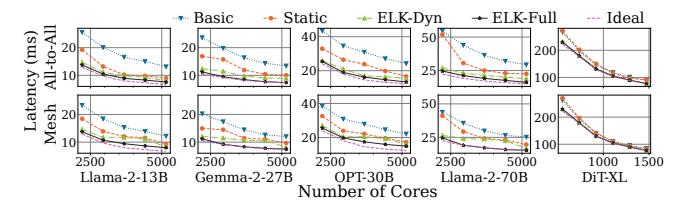

Figure 23: Per-token latency at varied core counts.

latencies, mesh chips always experience higher interconnect utilization than all-to-all, since mesh takes multiple hops to deliver HBM data to cores. For both topologies, *ELK-Full* is the only design that can almost fully utilize the interconnect. In other designs, HBM data delivery often occupies the interconnect and stalls the execution.

- (2) The interconnect and HBM bandwidths should scale together to avoid performance bottlenecks. In Figure 22, we examine how the interconnect bandwidth impacts the performance under different HBM bandwidths. When the HBM bandwidth is low (e.g., 8TB/s per 4 chips), increasing the interconnect bandwidth beyond a certain point (e.g., 40TB/s) has no benefit, since HBM is the bottleneck. With higher HBM bandwidth, performance scales with the interconnect bandwidth, and *ELK-Full* can best utilize both bandwidths to achieve near-*Ideal* performance. Compared with all-to-all, the performance of mesh is more sensitive to the interconnect bandwidth. This matches the finding that mesh-based ICCA chips utilize the interconnect more heavily (Figure 21).
- (3) ELK enables scalable performance for ML inference workloads as we scale the ICCA chip. In Figure 23, we change the number of cores while setting the HBM bandwidth to 2.7GBps/core to match prior setups. *ELK-Full* significantly outperforms other designs regardless of core counts. *ELK-Full* reduces the average latency by 1.71× over *Basic* and 1.36× over *Static*. We also examine DiT-XL, a state-of-the-art stable diffusion model, on one ICCA chip (up to 1472 cores). *ELK-Full*'s benefit on DiT-XL is less obvious than on LLMs, since DiT-XL is compute-intensive and less affected by preload efficiency. However, *ELK-Full* still outperforms other designs on DiT-XL and achieves near-ideal performance.

<span id="page-11-1"></span>

Figure 24: Average TFLOPS during the training of Llama2-13B, given varied amount of computation resources.

(4) ICCA chips can also benefit ML training by properly tuning the compute, communication, and off-chip memory access. In Figure 24, we examine the forward pass of training Llama2-13B with varied available FLOPS and interconnect/HBM bandwidths (the backward pass has similar trends). Unlike decoding, training is compute-intensive, scaling only interconnect/HBM bandwidth has little impact. With 400GB/s HBM bandwidth, it is sufficient to fulfill more than 600 TFLOPS. Thus, for compute-intensive workloads, the ICCA chips should focus on scaling the FLOPS, and can therefore be paired with cheaper memory (e.g., GDDR/LPDDR/DDR) to reduce manufacturing costs. Note that the achieved FLOPS is often lower than the peak FLOPS of the hardware, because only MatMul operators with perfect shapes can fully utilize the FLOPS of specialized tensor cores.

#### 7 Discussion and Future Work

Apply ELK to GPUs. The latest NVIDIA GPU also uses inter-core links to connect its stream multiprocessors (SMs) [2]. It groups SMs into clusters. SMs in the same cluster are connected via direct inter-SM links, while different clusters can only exchange data via the global L2 cache. On current GPUs like H100 [42], the aggregated inter-SM bandwidth is close to the HBM bandwidth, so it will suffer from significant interconnect contention (② in Figure 2). As future work, we wish to extend ELK to GPU and investigate the design space for optimizing GPU's interconnect architecture.

Apply Elk to MoE. Elk can support dynamic mixture-of-experts (MoE) models. In MoE, an operator may choose different parameter tensors (i.e., experts) based on the input token. At compile time, as all experts have the same shape, Elk will optimize the execution plan based on a generic expert. Elk will schedule the preload of an expert to a time after the model selects which expert to use (e.g., after the expert routing operator or the expert prediction [13]). On execution, the chip preloads expert tensors using the partition plans given by Elk and the expert indices selected at runtime.

**Apply ELK to other optimization objectives.** While ELK currently optimizes the performance, it can be adapted to support optimizing for a wide variety of objectives, by replacing the performance-based cost model in §4.3 with others (e.g., optimize power by adapting a cost model that estimates power usage).

**Apply ELK to other execution models.** For different ICCA chip implementations, they may have different execution models [7, 34, 47]. For example, SambaNova chips [46] support a spatial pipeline execution model that runs different operators on different sets of cores [47]. The pipelined execution keeps model weights stationary on each core and lets activation tensors flow through

cores. This enables significantly higher serving throughput, though the latency of each serving request may increase if there are too many pipeline stages. This execution model also experiences the resource constraints in [§2.3.](#page-2-2) Specifically, it still needs to use HBM to swap the model weights inside each core's SRAM, unless it uses the SRAM of hundreds of chips to store an entire LLM. Thus, the pipelined execution has to (1) reserve SRAM for both currently executing data and newly preloaded data and (2) use the interconnect for both inter-core data transfer and HBM data loading, requiring the compiler to consider the resource constraints in [§2.3.](#page-2-2) To optimize for this spatial pipeline execution model, we can modify Elk's search algorithm to explore the new scheduling space of this model (e.g., decide the number of pipeline stages per chip and the number of cores per stage). We wish to explore the optimization space of various execution models as future work.

# 8 Related Work

Deep learning compilers. Many DL compilers [\[8,](#page-13-7) [12,](#page-13-26) [25,](#page-13-33) [65,](#page-14-13) [69,](#page-14-14) [74\]](#page-14-2) were designed for architectures without inter-core links (e.g., GPU and TPU). A few compilers serve models purely on-chip, they did not consider off-chip memory [\[33,](#page-13-6) [34,](#page-13-8) [43\]](#page-13-34). As prior compilers [\[12,](#page-13-26) [16,](#page-13-15) [34,](#page-13-8) [70,](#page-14-3) [74\]](#page-14-2) focused on the optimization of tile partitioning of a single operator, Elk can utilize them to generate each operator's partition plans. Elk is also compatible with other optimization techniques like quantization [\[58\]](#page-14-15) and alignment with memory bank [\[74\]](#page-14-2), as they do not change the execution pattern.

ML optimizations with operator fusion. DL frameworks [\[8,](#page-13-7) [14,](#page-13-35) [18,](#page-13-27) [36,](#page-13-36) [50,](#page-14-16) [73\]](#page-14-17) improve on-chip data reuse by fusing multiple operators. For example, SoMa [\[8\]](#page-13-7) explores fusion opportunities to reuse intermediate tensors between operators in a global on-chip buffer with limited size. As ICCA chips have large distributed SRAM (e.g., up to 900MB per chip) that can buffer an entire intermediate tensor, they can reuse it between operators without fusion. However, ICCA chips face unique challenges in distributed SRAM allocation, intercore interconnect contention, and their impacts on HBM preload. Thus, Elk focuses on the interplay of these performance challenges. For ICCA chips with less SRAM, Elk can still support fusion by treating each fused operator as one operator. For example, we can fuse two consecutive MatMul operators into one operator [\[14\]](#page-13-35), which is treated as one operator with three input tensors in Elk.

Compilers for ICCA chips. Dataflow compilers optimize DL execution on interconnected cores by mapping operators to a pipeline [\[9,](#page-13-37) [22,](#page-13-20) [35,](#page-13-38) [47,](#page-14-12) [67,](#page-14-18) [68,](#page-14-19) [72\]](#page-14-20). While they optimize on-chip execution and communication, they use off-chip HBM differently. SambaNova SN40L [\[46\]](#page-13-5) swaps parameters between HBM and DDR to serve different expert models. Tenstorrent [\[7\]](#page-13-14) optimizes intra-operator tile size to reduce the total off-chip memory access volume. T10 [\[34\]](#page-13-8) optimizes on-chip execution without considering off-chip memory, so it cannot support LLMs that exceed on-chip capacity (e.g., <1GB per chip). Specifically, T10 can only optimize the placement of a fixed set of operators in a fixed amount of SRAM. However, as an ICCA chip loads new operators from the HBM and frees old ones from the SRAM, the set of operators in the SRAM changes dynamically. In addition, the HBM accesses will interfere with the on-chip execution due to the SRAM and NoC contentions. As T10 cannot consider all performance tradeoffs together, even after we

extend T10 to support HBM, the extended design (i.e., Static in [§6.1\)](#page-9-0) still performs poorly on ICCA chips with HBM. To maximize performance for generic ICCA chips, Elk considers the interplay among off-chip HBM, on-chip SRAM, inter-core interconnect, and per-core execution on top of the on-chip execution optimizations enabled by existing compilers for ICCA chips.

Distributed model execution. To run DL models on distributed nodes, prior works overlap computation with inter-device communication. They optimize inter-chip collective communication [\[11,](#page-13-39) [26,](#page-13-40) [49,](#page-14-21) [59\]](#page-14-22), device grouping on various network topologies [\[31,](#page-13-41) [38,](#page-13-17) [54,](#page-14-23) [71\]](#page-14-4), and workload collocation in device clusters [\[15,](#page-13-42) [62–](#page-14-24)[64\]](#page-14-25). Elk targets intra-chip optimization and faces other challenges. Besides compute and communication, Elk also considers HBM data accesses and their impacts on the usages of per-core SRAM and inter-core links. Elk is compatible with various distributed execution frameworks and different parallelism types when using multiple ICCA chips, where Elk optimizes the execution of each ICCA chip.

ML- and SAT-based compiler optimizations. Existing studies like Autocomp [\[24\]](#page-13-43) use LLMs to optimize kernel code for tensor accelerators, demonstrating significant performance advantages over vendor libraries. The code generation in Elk ([§5\)](#page-8-0) can leverage these works to further optimize the per-core tile computation, by replacing the code templates from vendor libraries with the kernels optimized by LLMs. Elk'sscheduling algorithm ([§4.2–](#page-5-0)[§4.4\)](#page-7-0) does not rely on LLMs, since it can already find execution plans with near-Ideal performance (see [§6.2\)](#page-9-1) in short compile time (see Figure [16\)](#page-8-2) using the host CPU. Both Elk's comprehensive optimization space and its pruning techniques based on hardware information (e.g., SRAM size, core count) contribute to its success. Other prior works [\[23,](#page-13-44) [55\]](#page-14-26) use SAT solvers to solve scheduling problems. However, it is inefficient to use SAT solvers in Elk, because their runtime grows exponentially with the number of boolean variables to solve [\[17\]](#page-13-45). For example, to solve Elk's allocation problem in [§4.3](#page-5-1) using SAT, we need to assign one boolean variable to each possible execution plan of each operator to indicate whether this plan is selected. Thus, the solver's runtime grows exponentially with the total number of possible plans of all operators. In comparison, the complexity of our allocation algorithm in [§4.3](#page-5-1) grows linearly with the total number of plans (i.e., () for operators that each has possible plans).

# 9 Conclusion

We study the performance trade-offs of generic ICCA chips that support off-chip memory, and develop a DL compiler framework Elk to explore the efficiency of ICCA chips. Elk also enables design space exploration of ICCA chip architecture. We demonstrate the capability of Elk using both an ICCA emulator and a simulator.

# Acknowledgments

We thank the anonymous reviewers at MICRO'25 for their insightful feedback. We thank Michael Wang and Benjamin Reidys from the Systems Platform Research Group (Illinois PlatformX) at UIUC for proofreading our paper. This work was partially supported by the Hybrid Cloud and AI program at the IBM-Illinois Discovery Accelerator Institute (IIDAI), and NSF under the grants CAREER CNS-2144796, CCF-2107470, and CCF-1919044.

#### References

- <span id="page-13-19"></span>[1] 2017. Open Neural Network Exchange format. https://onnx.ai/.
- <span id="page-13-31"></span>[2] 2022. NVIDIA Hopper Architecture In-Depth. https://developer.nvidia.com/blog/nvidia-hopper-architecture-in-depth/.
- <span id="page-13-28"></span>[3] Hazem A. Abdelhafez, Christopher Zimmer, Sudharshan S. Vazhkudai, and Matei Ripeanu. 2019. AHEAD: A Tool for Projecting Next-Generation Hardware Enhancements on GPU-Accelerated Systems. In 2019 IEEE International Parallel and Distributed Processing Symposium Workshops (IPDPSW'19).
- <span id="page-13-16"></span>[4] Amey Agrawal, Nitin Kedia, Jayashree Mohan, Ashish Panwar, Nipun Kwatra, Bhargav Gulavani, Ramachandran Ramjee, and Alexey Tumanov. 2024. Vidur: A Large-Scale Simulation Framework For LLM Inference. In Proceedings of Machine Learning and Systems (MLSys'24).
- <span id="page-13-22"></span>[5] Joshua Ainslie, James Lee-Thorp, Michiel de Jong, Yury Zemlyanskiy, Federico Lebrón, and Sumit Sanghai. 2023. GQA: Training Generalized Multi-Query Transformer Models from Multi-Head Checkpoints. arXiv preprint arXiv:2305.13245 (2023).
- <span id="page-13-29"></span>[6] Albert Alexandrov, Mihai F. Ionescu, Klaus E. Schauser, and Chris Scheiman. 1995. LogGP: incorporating long messages into the LogP model—one step closer towards a realistic model for parallel computation. In Proceedings of the Seventh Annual ACM Symposium on Parallel Algorithms and Architectures (SPAA'95).
- <span id="page-13-14"></span>[7] Mohamed Bahnas. 2024. Tenstorrent Overview: Products and Software. https://icl.utk.edu/newsletter/presentations/2024/mohamed-bahnas-2024-03-22.pdf.
- <span id="page-13-7"></span>[8] Jingwei Cai, Xuan Wang, Mingyu Gao, Sen Peng, Zijian Zhu, Yuchen Wei, Zuotong Wu, and Kaisheng Ma. 2025. SoMa: Identifying, Exploring, and Understanding the DRAM Communication Scheduling Space for DNN Accelerators. arXiv preprint arXiv:2501.12634 (2025).
- <span id="page-13-37"></span>[9] Jingwei Cai, Yuchen Wei, Zuotong Wu, Sen Peng, and Kaisheng Ma. 2023. Interlayer Scheduling Space Definition and Exploration for Tiled Accelerators. In Proceedings of the 50th Annual International Symposium on Computer Architecture (ISCA'23).
- <span id="page-13-18"></span>[10] Marco Cerliani. 2022. Linear-Tree. https://github.com/cerlymarco/linear-tree.
- <span id="page-13-39"></span>[11] Chang Chen, Xiuhong Li, Qianchao Zhu, Jiangfei Duan, Peng Sun, Xingcheng Zhang, and Chao Yang. 2024. Centauri: Enabling Efficient Scheduling for Communication-Computation Overlap in Large Model Training via Communication Partitioning. In Proceedings of the 29th ACM International Conference on Architectural Support for Programming Languages and Operating Systems (ASP-LOS'24).
- <span id="page-13-26"></span>[12] Tianqi Chen, Thierry Moreau, Ziheng Jiang, Lianmin Zheng, Eddie Yan, Haichen Shen, Meghan Cowan, Leyuan Wang, Yuwei Hu, Luis Ceze, Carlos Guestrin, and Arvind Krishnamurthy. 2018. TVM: An Automated End-to-End Optimizing Compiler for Deep Learning. In 13th USENIX Symposium on Operating Systems Design and Implementation (OSDI'18).
- <span id="page-13-32"></span>[13] Peizhuang Cong, Aomufei Yuan, Shimao Chen, Yuxuan Tian, Bowen Ye, and Tong Yang. 2024. Prediction Is All MoE Needs: Expert Load Distribution Goes from Fluctuating to Stabilizing. arXiv preprint arXiv:2404.16914 (2024).
- <span id="page-13-35"></span>[14] Tri Dao, Daniel Y. Fu, Stefano Ermon, Atri Rudra, and Christopher Ré. 2022. FlashAttention: Fast and Memory-Efficient Exact Attention with IO-Awareness. arXiv preprint arXiv:2205.14135 (2022).
- <span id="page-13-42"></span>[15] Dahu Feng, Erhu Feng, Dong Du, Pinjie Xu, Yubin Xia, Haibo Chen, and Rong Zhao. 2025. Topology-Aware Virtualization over Inter-Core Connected Neural Processing Units. In Proceedings of the 52nd Annual International Symposium on Computer Architecture (ISCA'25).
- <span id="page-13-15"></span>[16] Siyuan Feng, Bohan Hou, Hongyi Jin, Wuwei Lin, Junru Shao, Ruihang Lai, Zihao Ye, Lianmin Zheng, Cody Hao Yu, Yong Yu, and Tianqi Chen. 2023. TensorIR: An Abstraction for Automatic Tensorized Program Optimization. In Proceedings of the 28th ACM International Conference on Architectural Support for Programming Languages and Operating Systems (ASPLOS'23).
- <span id="page-13-45"></span>[17] Weiwei Gong and Xu Zhou. 2017. A survey of SAT solver. In AIP Conference Proceedings. https://doi.org/10.1063/1.4981999
- <span id="page-13-27"></span>[18] Google. 2023. XLA. https://www.tensorflow.org/xla
- <span id="page-13-12"></span>[19] Graphcore. 2022. Tile Vertex ISA. https://docs.graphcore.ai/projects/isa/en/latest/\_static/Tile-Vertex-ISA\_1.2.3.pdf.
- <span id="page-13-9"></span>[20] Graphore. 2024. Next Generation IPU Systems: IPU-M2000 + IPU-POD4. https://www.graphcore.ai/products/mk2/ipu-m2000-ipu-pod4.
- <span id="page-13-24"></span>[21] Graphcore. 2024. PopLibs API reference. https://docs.graphcore.ai/projects/poplar-api/en/latest/poplibs\_api.html.
- <span id="page-13-20"></span>[22] Congjie He, Yeqi Huang, Pei Mu, Ziming Miao, Jilong Xue, Lingxiao Ma, Fan Yang, and Luo Mai. 2025. WaferLLM: A Wafer-Scale LLM Inference System. arXiv preprint arXiv:2502.04563 (2025).
- <span id="page-13-44"></span>[23] Emmanuel Hebrard. 2012. Scheduling and SAT. Nantes (2012). https://homepages. laas.fr/ehebrard/papers/prescpaior2012.pdf
- <span id="page-13-43"></span>[24] Charles Hong, Sahil Bhatia, Altan Haan, Shengjun Kris Dong, Dima Nikiforov, Alvin Cheung, and Yakun Sophia Shao. 2024. LLM-Aided Compilation for Tensor Accelerators. arXiv preprint arXiv:2408.03408 (2024).
- <span id="page-13-33"></span>[25] Muyan Hu, Ashwin Venkatram, Shreyashri Biswas, Balamurugan Marimuthu, Bohan Hou, Gabriele Oliaro, Haojie Wang, Liyan Zheng, Xupeng Miao, Jidong Zhai, and Zhihao Jia. 2024. Optimal Kernel Orchestration for Tensor Programs with

- Korch. In Proceedings of the 29th ACM International Conference on Architectural Support for Programming Languages and Operating Systems (ASPLOS'24).
- <span id="page-13-40"></span>[26] Abhinav Jangda, Jun Huang, Guodong Liu, Amir Hossein Nodehi Sabet, Saeed Maleki, Youshan Miao, Madanlal Musuvathi, Todd Mytkowicz, and Olli Saarikivi. 2022. Breaking the computation and communication abstraction barrier in distributed machine learning workloads. In Proceedings of the 27th ACM International Conference on Architectural Support for Programming Languages and Operating Systems (ASPLOS'22).
- <span id="page-13-10"></span>[27] Zhe Jia, Blake Tillman, Marco Maggioni, and Daniele Paolo Scarpazza. 2020. Dissecting the Graphcore IPU Architecture via Microbenchmarking. arXiv preprint arXiv:1912.03413 (2020).
- <span id="page-13-21"></span>[28] Norm Jouppi, George Kurian, Sheng Li, Peter Ma, Rahul Nagarajan, Lifeng Nai, Nishant Patil, Suvinay Subramanian, Andy Swing, Brian Towles, Clifford Young, Xiang Zhou, Zongwei Zhou, and David A Patterson. 2023. TPU v4: An Optically Reconfigurable Supercomputer for Machine Learning with Hardware Support for Embeddings. In Proceedings of the 50th Annual International Symposium on Computer Architecture (ISCA'23).
- <span id="page-13-2"></span>[29] Simon Knowles. 2021. Graphcore Colossus Mk2 IPU. In 2021 IEEE Hot Chips 33 Symposium (HCS'21).
- <span id="page-13-0"></span>[30] Woosuk Kwon, Zhuohan Li, Siyuan Zhuang, Ying Sheng, Lianmin Zheng, Cody Hao Yu, Joseph E. Gonzalez, Hao Zhang, and Ion Stoica. 2023. Efficient Memory Management for Large Language Model Serving with PagedAttention. In Proceedings of the ACM SIGOPS 29th Symposium on Operating Systems Principles.
- <span id="page-13-41"></span>[31] Dacheng Li, Hongyi Wang, Eric Xing, and Hao Zhang. 2022. AMP: Automatically Finding Model Parallel Strategies with Heterogeneity Awareness. In Advances in Neural Information Processing Systems (NeurIPS'22).
   [32] Shang Li, Zhiyuan Yang, Dhiraj Reddy, Ankur Srivastava, and Bruce Jacob. 2020.
- <span id="page-13-25"></span>[32] Shang Li, Zhiyuan Yang, Dhiraj Reddy, Ankur Srivastava, and Bruce Jacob. 2020. DRAMsim3: A Cycle-Accurate, Thermal-Capable DRAM Simulator. IEEE Computer Architecture Letters (2020).
- <span id="page-13-6"></span>[33] Sean Lie. 2021. Multi-Million Core, Multi-Wafer AI Cluster. In 2021 IEEE Hot Chips 33 Symposium (HCS'21).
- <span id="page-13-8"></span>[34] Yiqi Liu, Yuqi Xue, Yu Cheng, Lingxiao Ma, Ziming Miao, Jilong Xue, and Jian Huang. 2024. Scaling Deep Learning Computation over the Inter-Core Connected Intelligence Processor with T10. In Proceedings of the ACM SIGOPS 30th Symposium on Operating Systems Principles (SOSP'24).
- <span id="page-13-38"></span>[35] Wenyan Lu, Guihai Yan, Jiajun Li, Shijun Gong, Yinhe Han, and Xiaowei Li. 2017. FlexFlow: A Flexible Dataflow Accelerator Architecture for Convolutional Neural Networks. In Proceedings of the 23rd IEEE Symposium on High Performance Computer Architecture (HPCA'17).
- <span id="page-13-36"></span>[36] Xinhao Luo, Zihan Liu, Yangjie Zhou, Shihan Fang, Ziyu Huang, Yu Feng, Chen Zhang, Shixuan Sun, Zhenzhe Zheng, Jingwen Leng, and Minyi Guo. 2025. ClusterFusion: Expanding Operator Fusion Scope for LLM Inference via Cluster-Level Collective Primitive. arXiv preprint arXiv:2508.18850 (2025).
- <span id="page-13-3"></span>[37] Meta. 2024. Our next-generation Meta Training and Inference Accelerator. https://ai.meta.com/blog/next-generation-meta-training-inferenceaccelerator-AI-MTIA/.
- <span id="page-13-17"></span>[38] Xupeng Miao, Yujie Wang, Youhe Jiang, Chunan Shi, Xiaonan Nie, Hailin Zhang, and Bin Cui. 2022. Galvatron: Efficient Transformer Training over Multiple GPUs Using Automatic Parallelism. Proceedings of the VLDB Endowment (2022).
- <span id="page-13-11"></span>[39] Micron. 2024. HBM3E. https://www.micron.com/products/memory/hbm/hbm3e.
- <span id="page-13-1"></span>[40] Deepak Narayanan, Mohammad Shoeybi, Jared Casper, Patrick LeGresley, Mostofa Patwary, Vijay Korthikanti, Dmitri Vainbrand, Prethvi Kashinkunti, Julie Bernauer, Bryan Catanzaro, Amar Phanishayee, and Matei Zaharia. 2021. Efficient Large-Scale Language Model Training on GPU Clusters Using Megatron-LM. In Proceedings of the International Conference for High Performance Computing, Networking, Storage and Analysis (SC'21).
- <span id="page-13-30"></span>[41] NVIDIA. 2024. Blackwell Architecture for Generative AI. https://www.nvidia.com/en-us/data-center/technologies/blackwell-architecture/.
- <span id="page-13-4"></span>[42] NVIDIA H100 Tensor Core GPÜ. 2024. https://www.nvidia.com/en-us/data-center/h100/.
- <span id="page-13-34"></span>[43] Dylan Patel and Daniel Nishball. 2023. Groq Inference Tokenomics: Speed, But At What Cost. https://www.semianalysis.com/p/groq-inference-tokenomics-speed-but.
- <span id="page-13-23"></span>[44] William Peebles and Saining Xie. 2023. Scalable Diffusion Models with Transformers. arXiv preprint arXiv:2212.09748 (2023).
- <span id="page-13-13"></span>[45] Reiner Pope, Sholto Douglas, Aakanksha Chowdhery, Jacob Devlin, James Bradbury, Anselm Levskaya, Jonathan Heek, Kefan Xiao, Shivani Agrawal, and Jeff Dean. 2022. Efficiently Scaling Transformer Inference. arXiv preprint arXiv:2211.05102 (2022).
- <span id="page-13-5"></span>[46] Raghu Prabhakar, Ram Sivaramakrishnan, Darshan Gandhi, Yun Du, Mingran Wang, Xiangyu Song, Kejie Zhang, Tianren Gao, Angela Wang, Karen Li, Yongning Sheng, Joshua Brot, Denis Sokolov, Apurv Vivek, Calvin Leung, Arjun Sabnis, Jiayu Bai, Tuowen Zhao, Mark Gottscho, David Jackson, Mark Lutrell, Manish K. Shah, Edison Chen, Kaizhao Liang, Swayambhoo Jain, Urmish Thakker, Dawei Huang, Sumti Jairath, Kevin J. Brown, and Kunle Olukotun. 2024. SambaNova SN40L: Scaling the AI Memory Wall with Dataflow and Composition of Experts. arXiv preprint arXiv:2405.07518 (2024).

- <span id="page-14-12"></span>[47] Raghu Prabhakar, Yaqi Zhang, David Koeplinger, Matt Feldman, Tian Zhao, Stefan Hadjis, Ardavan Pedram, Christos Kozyrakis, and Kunle Olukotun. 2017. Plasticine: A reconfigurable architecture for parallel patterns. In Proceedings of the 2017 ACM/IEEE 44th Annual International Symposium on Computer Architecture (ISCA'17).
- <span id="page-14-10"></span>[48] PyTorch. 2024. Building Models with PyTorch. https://pytorch.org/tutorials/beginner/introyt/modelsyt\_tutorial.html.
- <span id="page-14-21"></span>[49] Saeed Rashidi, William Won, Sudarshan Srinivasan, Srinivas Sridharan, and Tushar Krishna. 2022. Themis: a network bandwidth-aware collective scheduling policy for distributed training of DL models. In Proceedings of the 49th Annual International Symposium on Computer Architecture (ISCA'22).
- <span id="page-14-16"></span>[50] Yining Shi, Zhi Yang, Jilong Xue, Lingxiao Ma, Yuqing Xia, Ziming Miao, Yuxiao Guo, Fan Yang, and Lidong Zhou. 2023. Welder: Scheduling Deep Learning Memory Access via Tile-graph. In 17th USENIX Symposium on Operating Systems Design and Implementation (OSDI'23).
- <span id="page-14-6"></span>[51] Gemma Team, Thomas Mesnard, Cassidy Hardin, Robert Dadashi, Surya Bhupatiraju, Shreya Pathak, Laurent Sifre, Morgane Rivière, Mihir Sanjay Kale, Juliette Love, Pouya Tafti, Léonard Hussenot, Pier Giuseppe Sessa, Aakanksha Chowdhery, Adam Roberts, Aditya Barua, Alex Botev, Alex Castro-Ros, Ambrose Slone, Amélie Héliou, Andrea Tacchetti, Anna Bulanova, Antonia Paterson, Beth Tsai, Bobak Shahriari, Charline Le Lan, Christopher A. Choquette-Choo, Clément Crepy, Daniel Cer, Daphne Ippolito, David Reid, Elena Buchatskaya, Eric Ni, Eric Noland, Geng Yan, George Tucker, George-Christian Muraru, Grigory Rozhdestvenskiy, Henryk Michalewski, Ian Tenney, Ivan Grishchenko, Jacob Austin, James Keeling, Jane Labanowski, Jean-Baptiste Lespiau, Jeff Stanway, Jenny Brennan, Jeremy Chen, Johan Ferret, Justin Chiu, Justin Mao-Jones, Katherine Lee, Kathy Yu, Katie Millican, Lars Lowe Sjoesund, Lisa Lee, Lucas Dixon, Machel Reid, Maciei Mikuła, Mateo Wirth, Michael Sharman, Nikolai Chinaev, Nithum Thain, Olivier Bachem, Oscar Chang, Oscar Wahltinez, Paige Bailey, Paul Michel, Petko Yotov, Rahma Chaabouni, Ramona Comanescu, Reena Jana, Rohan Anil, Ross McIlroy, Ruibo Liu, Ryan Mullins, Samuel L Smith, Sebastian Borgeaud, Sertan Girgin, Sholto Douglas, Shree Pandya, Siamak Shakeri, Soham De, Ted Klimenko, Tom Hennigan, Vlad Feinberg, Wojciech Stokowiec, Yu hui Chen, Zafarali Ahmed, Zhitao Gong, Tris Warkentin, Ludovic Peran, Minh Giang, Clément Farabet, Oriol Vinyals, Jeff Dean, Koray Kavukcuoglu, Demis Hassabis, Zoubin Ghahramani, Douglas Eck, Joelle Barral, Fernando Pereira, Eli Collins, Armand Joulin, Noah Fiedel, Evan Senter, Alek Andreey, and Kathleen Kenealy. 2024. Gemma: Open Models Based on Gemini Research and Technology. arXiv preprint arXiv:2403.08295 (2024).
- <span id="page-14-0"></span>[52] Tenstorrent. 2023. Meet Grayskull. https://tenstorrent.com/grayskull/.
- <span id="page-14-5"></span>[53] Hugo Touvron, Louis Martin, Kevin Stone, Peter Albert, Amjad Almahairi, Yasmine Babaei, Nikolay Bashlykov, Soumya Batra, Prajjwal Bhargava, Shruti Bhosale, Dan Bikel, Lukas Blecher, Cristian Canton Ferrer, Moya Chen, Guillem Cucurull, David Esiobu, Jude Fernandes, Jeremy Fu, Wenyin Fu, Brian Fuller, Cynthia Gao, Vedanuj Goswami, Naman Goyal, Anthony Hartshorn, Saghar Hosseini, Rui Hou, Hakan Inan, Marcin Kardas, Viktor Kerkez, Madian Khabsa, Isabel Kloumann, Artem Korenev, Punit Singh Koura, Marie-Anne Lachaux, Thibaut Lavril, Jenya Lee, Diana Liskovich, Yinghai Lu, Yuning Mao, Xavier Martinet, Todor Mihaylov, Pushkar Mishra, Igor Molybog, Yixin Nie, Andrew Poulton, Jeremy Reizenstein, Rashi Rungta, Kalyan Saladi, Alan Schelten, Ruan Silva, Eric Michael Smith, Ranjan Subramanian, Xiaoqing Ellen Tan, Binh Tang, Ross Taylor, Adina Williams, Jian Xiang Kuan, Puxin Xu, Zheng Yan, Iliyan Zarov, Yuchen Zhang, Angela Fan, Melanie Kambadur, Sharan Narang, Aurelien Rodriguez, Robert Stojnic, Sergey Edunov, and Thomas Scialom. 2023. Llama 2: Open Foundation and Fine-Tuned Chat Models. arXiv preprint arXiv:2307.09288 (2023).
- <span id="page-14-23"></span>[54] Taegeon Um, Byungsoo Oh, Minyoung Kang, Woo-Yeon Lee, Goeun Kim, Dongseob Kim, Youngtaek Kim, Mohd Muzzammil, and Myeongjae Jeon. 2024. Metis: Fast Automatic Distributed Training on Heterogeneous GPUs. In 2024 USENIX Annual Technical Conference (USENIX ATC'24).
- <span id="page-14-26"></span>[55] Mario Vanhoucke and José Coelho. 2016. An approach using SAT solvers for the RCPSP with logical constraints. European Journal of Operational Research (2016).
- <span id="page-14-11"></span>[56] Nicolas Vasilache, Oleksandr Zinenko, Theodoros Theodoridis, Priya Goyal, Zachary DeVito, William S. Moses, Sven Verdoolaege, Andrew Adams, and Albert Cohen. 2018. Tensor Comprehensions: Framework-Agnostic High-Performance Machine Learning Abstractions. arXiv preprint arXiv:1802.04730 (2018).
- <span id="page-14-1"></span>[57] Ashish Vaswani, Noam Shazeer, Niki Parmar, Jakob Uszkoreit, Llion Jones, Aidan N. Gomez, Lukasz Kaiser, and Illia Polosukhin. 2023. Attention Is All You Need. arXiv preprint arXiv:1706.03762 (2023).
- <span id="page-14-15"></span>[58] Lei Wang, Lingxiao Ma, Shijie Cao, Quanlu Zhang, Jilong Xue, Yining Shi, Ningxin Zheng, Ziming Miao, Fan Yang, Ting Cao, Yuqing Yang, and Mao Yang. 2024. Ladder: Enabling Efficient Low-Precision Deep Learning Computing through Hardware-aware Tensor Transformation. In 18th USENIX Symposium on Operating Systems Design and Implementation (OSDI'24).
- <span id="page-14-22"></span>[59] Shibo Wang, Jinliang Wei, Amit Sabne, Andy Davis, Berkin Ilbeyi, Blake Hechtman, Dehao Chen, Karthik Srinivasa Murthy, Marcello Maggioni, Qiao Zhang, Sameer Kumar, Tongfei Guo, Yuanzhong Xu, and Zongwei Zhou. 2022. Overlap Communication with Dependent Computation via Decomposition in Large

- Deep Learning Models. In Proceedings of the 28th ACM International Conference on Architectural Support for Programming Languages and Operating Systems (ASPLOS'23).
- <span id="page-14-8"></span>[60] Samuel Williams, Andrew Waterman, and David Patterson. 2009. Roofline: An Insightful Visual Performance Model for Multicore Architectures. Communications of the ACM (2009).
- <span id="page-14-9"></span>[61] Yuqi Xue and Jian Huang. 2025. ReGate: Enabling Power Gating in Neural Processing Units. arXiv preprint arXiv:2508.02536 (2025).
- <span id="page-14-24"></span>[62] Yuqi Xue, Yiqi Liu, and Jian Huang. 2023. System Virtualization for Neural Processing Units. In Proceedings of the 19th Workshop on Hot Topics in Operating Systems (HotOS'23).
- [63] Yuqi Xue, Yiqi Liu, Lifeng Nai, and Jian Huang. 2023. V10: Hardware-Assisted NPU Multi-tenancy for Improved Resource Utilization and Fairness. In Proceedings of the 50th Annual International Symposium on Computer Architecture (ISCA'23).
- <span id="page-14-25"></span>[64] Yuqi Xue, Yiqi Liu, Lifeng Nai, and Jian Huang. 2024. Hardware-Assisted Virtualization of Neural Processing Units for Cloud Platforms. In 2024 57th IEEE/ACM International Symposium on Microarchitecture (MICRO'24).
- <span id="page-14-13"></span>[65] Haoyang Zhang, Yirui Zhou, Yuqi Xue, Yiqi Liu, and Jian Huang. 2023. G10: Enabling An Efficient Unified GPU Memory and Storage Architecture with Smart Tensor Migrations. In Proceedings of the 56th Annual IEEE/ACM International Symposium on Microarchitecture (MICRO'23).
- <span id="page-14-7"></span>[66] Susan Zhang, Stephen Roller, Naman Goyal, Mikel Artetxe, Moya Chen, Shuohui Chen, Christopher Dewan, Mona Diab, Xian Li, Xi Victoria Lin, Todor Mihaylov, Myle Ott, Sam Shleifer, Kurt Shuster, Daniel Simig, Punit Singh Koura, Anjali Sridhar, Tianlu Wang, and Luke Zettlemoyer. 2022. OPT: Open Pre-trained Transformer Language Models. arXiv preprint arXiv:2205.01068 (2022).
- <span id="page-14-18"></span>[67] Yaqi Zhang, Alexander Rucker, Matthew Vilim, Raghu Prabhakar, William Hwang, and Kunle Olukotun. 2019. Scalable interconnects for reconfigurable spatial architectures. In Proceedings of the 46th International Symposium on Computer Architecture (ISCA'19).
- <span id="page-14-19"></span>[68] Yaqi Zhang, Nathan Zhang, Tian Zhao, Matt Vilim, Muhammad Shahbaz, and Kunle Olukotun. 2021. SARA: Scaling a Reconfigurable Dataflow Accelerator. In 2021 ACM/IEEE 48th Annual International Symposium on Computer Architecture (ISCA'21).
- <span id="page-14-14"></span>[69] Jie Zhao, Siyuan Feng, Xiaoqiang Dan, Fei Liu, Chengke Wang, Sheng Yuan, Wenyuan Lv, and Qikai Xie. 2023. Effectively Scheduling Computational Graphs of Deep Neural Networks toward Their Domain-Specific Accelerators. In 17th USENIX Symposium on Operating Systems Design and Implementation (OSDI'23).
- <span id="page-14-3"></span>[70] Lianmin Zheng, Chengfan Jia, Minmin Sun, Zhao Wu, Cody Hao Yu, Ameer Haj-Ali, Yida Wang, Jun Yang, Danyang Zhuo, Koushik Sen, Joseph E. Gonzalez, and Ion Stoica. 2020. Ansor: generating high-performance tensor programs for deep learning. In Proceedings of the 14th USENIX Conference on Operating Systems Design and Implementation (OSDI'20).
- <span id="page-14-4"></span>[71] Lianmin Zheng, Zhuohan Li, Hao Zhang, Yonghao Zhuang, Zhifeng Chen, Yanping Huang, Yida Wang, Yuanzhong Xu, Danyang Zhuo, Eric P Xing, et al. 2022. Alpa: Automating Inter-and Intra-Operator Parallelism for Distributed Deep Learning. In 16th USENIX Symposium on Operating Systems Design and Implementation (OSDI'22).
- <span id="page-14-20"></span>[72] Size Zheng, Renze Chen, Anjiang Wei, Yicheng Jin, Qin Han, Liqiang Lu, Bingyang Wu, Xiuhong Li, Shengen Yan, and Yun Liang. 2022. AMOS: Enabling automatic mapping for Tensor Computations on spatial Accelerators with Hardware Abstraction. In Proceedings of the 49th Annual International Symposium on Computer Architecture (ISCA'22).
- <span id="page-14-17"></span>[73] Zhen Zheng, Xuanda Yang, Pengzhan Zhao, Guoping Long, Kai Zhu, Feiwen Zhu, Wenyi Zhao, Xiaoyong Liu, Jun Yang, Jidong Zhai, Shuaiwen Leon Song, and Wei Lin. 2022. AStitch: Enabling a New Multi-Dimensional Optimization Space for Memory-Intensive ML Training and Inference on Modern SIMT Architectures. In Proceedings of the 27th ACM International Conference on Architectural Support for Programming Languages and Operating Systems (ASPLOS'22).
- <span id="page-14-2"></span>[74] Hongyu Zhu, Ruofan Wu, Yijia Diao, Shanbin Ke, Haoyu Li, Chen Zhang, Jilong Xue, Lingxiao Ma, Yuqing Xia, Wei Cui, Fan Yang, Mao Yang, Lidong Zhou, Asaf Cidon, and Gennady Pekhimenko. 2022. ROLLER: Fast and Efficient Tensor Compilation for Deep Learning. In 16th USENIX Symposium on Operating Systems Design and Implementation (OSDI'22).

# <span id="page-15-0"></span>A Artifact Appendix

# A.1 Abstract

In this artifact, we provide the source code of Elk's compilation, simulation, and evaluation framework. Then, we guide readers to explore how Elk improves the model serving performance on a variety of ICCA chips (i.e., Figure 17-24 in this paper). To run this artifact, please use a Linux machine with at least 200 GB of main memory and at least 20 GB of disk space.

# A.2 Artifact Checklist (Meta-Information)

- Algorithm: Inductive tensor operator scheduling, cost-aware on-chip memory allocation, and ICCA chip design space exploration.
- Neural Network Models: Llama2-13B, Gemma2-27B, OPT-30B, Llama2- 70B, and DiT-XL. Their execution graphs are included in the repo.
- Run-time environment: Ubuntu 20.04 or newer, Python 3.10.
- Metrics: Execution time, hardware utilization.
- Output: Trace files and result figures.
- Experiments: Generate experiments using supplied scripts.
- How much main memory required (approximately): 200 GB
- How much disk space required (approximately): 20 GB
- How much time to prepare workflow (approximately): 10 minutes
- How much time to complete experiments (approximately): 30 hours on a machine with 64 CPU threads and 200 GB main memory.
- Publicly available: Yes
- Archived (provide DOI): 10.5281/zenodo.16541972

# A.3 Description

A.3.1 How to Access. The source code can be downloaded from Zenodo at [https://doi.org/10.5281/zenodo.16541972.](https://doi.org/10.5281/zenodo.16541972) For the latest version, you can access our GitHub repository: [https://github.com/](https://github.com/platformxlab/elk.git) [platformxlab/elk.git.](https://github.com/platformxlab/elk.git)

A.3.2 Hardware Dependencies. The Elk simulation and evaluation framework can run on any x86 machine with at least 200 GB of main memory and at least 20 GB of disk space.

A.3.3 Software Dependencies. The framework needs a Linux environment (preferably Ubuntu) with Python 3.10 installed.

# A.4 Installation

(1) Start by downloading the Elk artifact from GitHub:

```
git clone https://github.com/platformxlab/elk.git
cd elk
```

(2) Please make sure all prerequisites are successfully installed:

```
sudo add-apt-repository ppa:deadsnakes/ppa
sudo apt update
sudo apt install python3.10 tmux -y
curl -sS https://bootstrap.pypa.io/get-pip.py | python3.10
python3.10 -m pip install -r requirements.txt
```

# A.5 Experiment Workflow

To compile DL models into programs and obtain program execution traces from the Elk simulator, we provide a one-click script "benchmark\_scripts/generate\_data\_from\_sim.py" for you to launch all test cases in one place. However, the script may take more than 30 hours to finish, so we recommend using tmux:

tmux

Then, run the one-click script within the new tmux terminal:

```
python3.10 benchmark_scripts/generate_data_from_sim.py
```

To return from the tmux terminal without pausing the script, press "Ctrl+B" and then press "D" on your keyboard. To attach back to the original tmux terminal where the script is running, use:

```
tmux attach -t 0
```

For more tips on using tmux, refer to [https://tmuxcheatsheet.com.](https://tmuxcheatsheet.com)

A.5.1 Handle Errors. If the script encounters an error, the most common cause is that the artifact runs on too many CPU cores and overflows the main memory. In such events, (1) go to "launch.py", (2) change the "CORE\_REDUCE" macro in line 22 to a larger value (e.g., CORE\_REDUCE=8), and (3) rerun the script:

```
python3.10 benchmark_scripts/generate_data_from_sim.py
```

The script should automatically skip any completed test cases and resume from the failed one.

# A.6 Evaluation and Expected Results

After the completion of all experiments, please run the following script to evaluate the results:

```
./run_artifact_eval_graph_gen.sh
```

This script gathers all data from the execution trace and draws all figures. To verify the results, one can compare the generated figures with those in the paper.

# A.7 Methodology

Submission, reviewing and badging methodology:

- [https://www.acm.org/publications/policies/artifact-review-an](https://www.acm.org/publications/policies/artifact-review-and-badging-current)d[badging-current](https://www.acm.org/publications/policies/artifact-review-and-badging-current)
- <https://cTuning.org/ae>