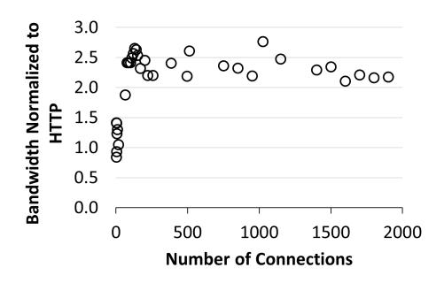
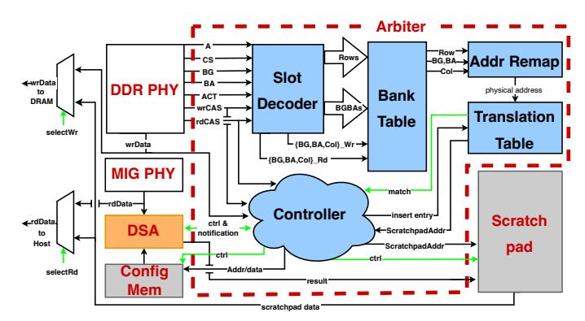
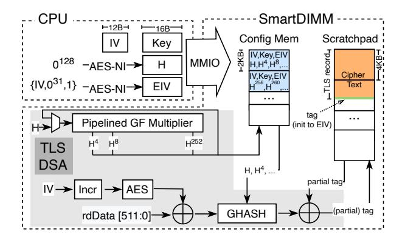
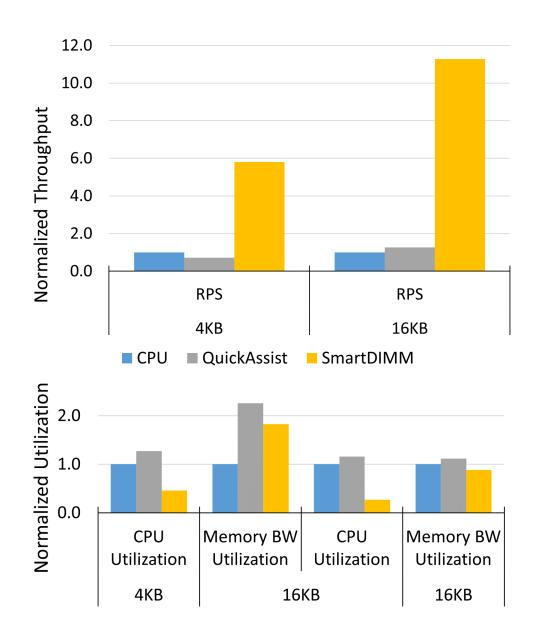

# <span id="page-0-1"></span>SmartDIMM: In-Memory Acceleration of Upper Layer Protocols

Neel Patel Amin Mamandipoor Mohammad Nouri Mohammad Alian University of Kansas

{nmpatel,amin.mamandi, mohammadnouri,alian}@ku.edu

Abstract—There has been significant focus on offloading upperlayer network protocols (ULPs) to accelerators located on CPUs and SmartNICs. However, restricting accelerator placement to these locations limits both the variety of ULPs that can be accelerated and the overall performance. In particular, it overlooks the opportunity to accelerate ULPs running atop a stateful transport protocol in the face of high cache contention. That is, at high network rates, the frequent DRAM accesses and SmartNIC-CPU synchronizations outweigh the benefits of hardware acceleration. This work introduces SmartDIMM, which unlocks the opportunity for accelerating ULPs running atop stateful transport protocols that primarily operate on data stored in DRAM. We prototyped SmartDIMM using Samsung's AxDIMM and implemented endto-end offloading of (de/en)cryption and (de)compression- two ULPs widely employed in datacenters. We then compared the performance of SmartDIMM with accelerator placements on the CPU, SmartNIC, and PCIe cards. Our results demonstrate that ULP offloading on SmartDIMM outperforms CPU, SmartNIC and PCIe-based offload configurations. In comparison to a server executing (de/en)cryption and (de)compression on the CPU, SmartDIMM achieves 21.0% to  $10.28\times$  higher requests per second and 36.3% to 88.9% lower memory bandwidth utilization.

#### I. Introduction

Upper Layer Network Protocols (ULPs) are widely deployed at scale for data protection via encryption [1–3], facilitating communication in heterogeneous software deployments via serialization [4-7], and reducing data transfer times via compression [8, 9]. Such operations, often referred to as datacenter taxes, consume a significant number of datacenter cycles [10, 11], with (de)compression and (de/en)cryption consuming up to 14% and 23% of datacenter cycles for top Google and Meta services [12–14].

With the effective end of Dennard's scaling and the exponential increase in network bandwidth requirements in datacenters [15], supplying the compute demand of ULPs is only possible through hardware acceleration. Current platforms for accelerating (de/en)cryption and (de)compression include SmartNICs [16-19], PCIe cards [20-22], and CPU chips [23, 24]. However, these accelerator placements are sub-optimal for accelerating ULPs operating atop the layered network software stack, which can exhibit several hundred milliseconds of latency between software layers. That is, the excessive data movement over PCIe and DDR channels [25] and frequent SmartNIC-CPU synchronizations [26] diminishes the benefits of hardware acceleration.

Figure 1a shows a sub-optimal configuration in which the CPU is responsible for ULP processing. In this example, a

<span id="page-0-0"></span>

Fig. 1. System-level data movement in a web server that encrypts web pages stored on a storage device before packetizing them and sending them over TCP connections to clients. At high request rates, (a) on-chip encryption acceleration is hindered by frequent DRAM accesses, and (b) autonomous NIC offloading [26] of encryption is limited by both CPU side memory copies as well as costly synchronizations between the NIC and CPU during packet reorderings and losses. (c) SmartDIMM unleashes the full potential of ULP acceleration by minimizing system-level data movement, without disrupting the layered storage and network software stack.

web-server application encrypts websites before sending them through TCP connections to clients. Owing to the streaming nature of data serving, the large working set of the web server, and the asynchronicity between the storage stack, encryptionlayer protocol, and TCP/IP packet processing, data read from storage frequently exhibits a ping-pong access pattern between on-chip caches and DRAM before being sent over the network. Fig.1b demonstrates the offloading of encryption to a SmartNIC, where the encryption of TCP payloads is postponed until the payload reaches the SmartNIC accelerator, while the TCP header is constructed using the TCP/IP stack on the CPU. Although SmartNIC offloading can free CPU cycles, it may still be subject to the ping-pong data movement between caches and DRAM, as well as synchronization overheads between the CPU and SmartNIC following packet reordering or losses [26].

In this work, we introduce SmartDIMM that enables finegrain, adaptive offloading of ULP processing to memory. SmartDIMM implements a domain-specific accelerator on the buffer device of a Dual In-line Memory Module (DIMM) and synchronously transforms data as it traverses the DDR channel. Additionally, SmartDIMM's software stack dynamically probes the LLC contention and adaptively enables or disables

offloading of ULP processing to memory. Fig[.1c](#page-0-0) illustrates how SmartDIMM eliminates cache thrashing by rerouting outbound network data to directly pass through DRAM, while the unmodified TCP/IP stack operates on the CPU.

Adaptively offloading computation to memory Requires (R1) sharing the address space between the CPU and SmartDIMM, (R2) operating SmartDIMM as a regular DIMM when ULPs are processed on the CPU, and (R3) implementing a lightweight synchronization mechanism between the CPU and near-memory processors. Meeting requirements R1 and R2 is challenging with JEDEC-compliant DDR-attached DIMMs, as only one memory controller can be used to maintain the status of each DRAM bank [\[27](#page-13-8)[–29\]](#page-13-9). Fulfilling R3 through conventional polling or interrupt mechanisms introduces significant overhead. Although prior work [\[30\]](#page-13-10) eliminates the notification overhead by performing computation synchronously with memory accesses, it does not share the address space and tends to use memory modules more as accelerators than as memory devices.

To meet the aforementioned requirements, we introduce the concept of Compute Copy (CompCpy). CompCpy is an API that transforms data within SmartDIMM while concurrently copying it from a source buffer to a destination buffer. This approach enables ULP offloading without requiring extensive code changes in existing software stacks and ULP frameworks. As offloads are performed synchronously, the software does not need to depend on polling or interrupts to synchronize with the near-memory processor, thus satisfying requirement R3.

We developed a SmartDIMM prototype capable of offloading Transport Layer Security (TLS) processing using Samsung's AxDIMM [\[31\]](#page-13-11). To facilitate application-layer access to SmartDIMM, we implemented an OpenSSL engine [\[32\]](#page-13-12) which utilizes the CompCpy API to skip the library's on-CPU (de/en)cryption routines and instead pass (un)encrypted TLS messages to the (de/en)cryption engine on SmartDIMM.

Offloading (de/en)cryption and (de)compression as representative ULPs to SmartDIMM results in 21.0%-10.28× and 11.9%-50.3% higher requests per second, respectively, compared to a server executing them on the CPU and Smart-NIC. Additionally, SmartDIMM achieves 36.3%-88.9% and 7.6%-59.9% lower memory bandwidth utilization, respectively, compared with CPU and SmartNIC implementations.

In this work we make the following contributions:

- Identify that DRAM is on the processing path of ULPs running atop the layered software stack in the era of high-throughput network devices.
- Introduce SmartDIMM, a bump-in-the-DDR near-memory processing architecture for in-line acceleration of ULPs.
- Utilize the on-chip caches to implement a novel selfrecycling mechanism, autonomously recycling a nearmemory scratchpad.
- Introduce CompCpy API that transforms data within memory while concurrently copying it from a source buffer to a destination buffer.
- Prototype SmartDIMM on Samsung's AxDIMM to accelerate two widely used ULPs, (de/en)cryption and (de)compression, without modifying the cost-sensitive

DRAM devices, the CPU memory controller, or the synchronous JEDEC-compliant DDR interface.

# II. BACKGROUND

Upper-layer protocols (ULPs) – also known as layer-5 network protocols – are widespread, seeing use across the Internet and in production environments. They often reside on top of the TCP/IP layer, providing additional services to applications. (de/en)cryption and (de)compression are two important ULPs that consume a significant number of cycles in datacenters [\[14\]](#page-12-9). In this section we provide background on these two ULPs.

(De/en)cryption. The Transport Layer Security (TLS) [\[33\]](#page-13-13) protocol provides privacy over a reliable, yet insecure, network connection between two clients. TLS is often added on top of TCP/IP, with messages being encrypted or decrypted before they are sent to or received from the TCP layer.

AES-GCM [\[34\]](#page-13-14) is an authenticated encryption algorithm, widely adopted as the block cipher in TLS 1.2 and TLS 1.3. It encrypts plaintext messages by performing bitwise XOR operations with an encrypted stream. This stream is generated by incrementing and encrypting a counter value, which is initially combined with an initialization vector (IV). To provide authentication, a GHASH function is applied, and its result is appended to the TLS record as an authentication tag. AES-GCM is widely used due to its performance, as it can be effectively pipelined in hardware and parallelized.

(De)compression. Dictionary-based compression algorithms, such as Deflate [\[35\]](#page-14-0), are employed to compress HTTP responses from clients [\[36\]](#page-14-1). Deflate operates in two stages: compression and encoding. Initially, the data stream is processed using the dictionary-based LZ77 algorithm [\[37\]](#page-14-2). In this phase, input data is compared with entries in a dynamically updated dictionary, based on the contents of a sliding history window. When a match is found in the dictionary, the matching data is replaced with an LZ symbol that indicates the length of the duplicate string and the distance from its previous occurrence. Following the LZ77 match-finding phase, the data undergoes Huffman encoding [\[38\]](#page-14-3), where input symbols are replaced with shorterlength codes.

System-level Data Movement with ULPs. As illustrated in Fig[.1,](#page-0-0) before a network message is processed by a ULP, it is cloned into another buffer designated to hold the ULP's result (e.g., encrypted text). In addition to ULP processing, there are at least two more data copies in an optimized software stack related to the DMA transactions from NIC and storage devices. Modern CPUs implement Direct Cache Access technology (e.g., Intel DDIO [\[39\]](#page-14-4) and ARM Cache Stashing [\[40\]](#page-14-5)), routing DMA data through the Last-Level Cache (LLC) to minimize memory bandwidth usage. However, if the usage distance of the DMA data is long – which is often the case for ULP processing as the software stack and DMA accesses are asynchronous – the DMA data may leak to DRAM before the CPU utilizes it [\[41,](#page-14-6) [42\]](#page-14-7).

<span id="page-2-0"></span>

**Fig. 2. Achievable bandwidth over an encrypted connection for SmartNIC and CPU under packet drops.**

#### III. MOTIVATION

In this section, we discuss several observations that informed SmartDIMM's design. The observations are either generallyaccepted design decisions discussed in previous studies or made by experimental data we collected.

Observation 1: ULP offload on SmartNIC can be suboptimal. Ethernet is the backbone of datacenter networks, where packet loss and reordering are expected. It is the job of the TCP protocol to recover from these events and provide reliability to the upper layers. ULP processing takes place before/after TCP processing on the TX/RX path, while the SmartNIC sees TX/RX data after/before it is processed by the TCP stack. Offloading a ULP to a SmartNIC without also offloading TCP/IP processing limits the types of data transformations that can be performed. In particular, SmartNICs require that the ULP preserves the payload size as shrinking or expanding the payload interferes with the TCP state machine. This makes it challenging to offload non-size preserving ULPs such as (de)compression to a SmartNIC [\[26\]](#page-13-7).

NVIDIA SmartNICs implement autonomous TLS offloading, which speculatively offloads symmetric cipher computations to the NIC while running the TCP/IP stack on the CPU [\[16,](#page-13-0) [26\]](#page-13-7). As shown in Fig[.1b,](#page-0-0) autonomous SmartNIC ULP offloading requires the ULP library to skip performing the offloaded operation in software, passing the plaintext payload down the network stack before the NIC performs the accelerated computation. The SmartNIC driver performs hardware resynchronization and falls back to CPU computation in the presence of packet reordering or loss. Using an NVIDIA ConnectX-6 SmartNIC, we offload TLS computation of an HTTPS stream to the NIC and inject packet drops using a programmable switch. For detailed information on our experimental methodology, refer to Sec[.VI.](#page-8-0) Surprisingly, as shown in Fig[.2,](#page-2-0) we see the same, or even lower, throughput when offloading TLS to the SmartNIC. We suspect that this is due to the performance improvement of AES-NI in Xeon CPUs [\[43\]](#page-14-8) [1](#page-0-1) . More importantly, the benefits of SmartNIC offloading fade away as soon as there are packet drops.

<span id="page-2-1"></span>

**Fig. 3. HTTPS memory bandwidth utilization normalized to HTTP for different numbers of concurrent connections.**

Observation 2: PCIe-based offload is suitable for latencyinsensitive, coarse-grain offloads. PCIe accelerators, such as Intel QuickAssist[\[44\]](#page-14-9), can offload costly key derivations using RSA [\[45\]](#page-14-10) and ECDH [\[46\]](#page-14-11), as well as symmetric encryption and decryption operations, from the host CPU. However, the need for frequent PCIe transactions to transfer data and notifications between the accelerator and the CPU renders PCIe accelerators less appealing for latency-sensitive data transformations, especially when the offload size is small. Additionally, the notification mechanism between the CPU and accelerator, whether interrupt or polling, significantly bottlenecks PCIe-attached acceleration [\[47,](#page-14-12) [48\]](#page-14-13). Due to these overheads, various techniques and system configurations have been proposed to minimize PCIe traversals [\[11,](#page-12-7) [49–](#page-14-14)[53\]](#page-14-15).

Observation 3: DIMM is on the path of ULP processing at high LLC contention. Direct Cache Access technology does not always eliminate DRAM access, and during LLC contention, DRAM accesses become inevitable [\[41,](#page-14-6) [42,](#page-14-7) [54,](#page-14-16) [55\]](#page-14-17). This issue is further compounded by the presence of ULPs. Since buffers are DMAed to/from the LLC without being immediately consumed, they are at risk of being evicted back to DRAM [\[25\]](#page-13-6).

Fig[.3](#page-2-1) compares the memory bandwidth utilization of HTTP and HTTPS web servers with varying numbers of concurrent connections. As the number of connections increases, the memory bandwidth utilization of the HTTPS web server significantly rises, showing up to a 2.5× increase compared to a server performing equivalent encrypted file transfers. The cache thrashing caused by ULP processing not only reduces the packet processing rate but also causes interference with co-running applications and generates unnecessary DRAM bandwidth.

# Observation 4: ULPs are often incrementally computable. Many ULP data transformations can be computed over arbitrary byte ranges of a message as it is sequentially received or transmitted from or to the network. For example, the

AES-GCM cipher can encrypt or decrypt messages without performing cipher block-chaining operations. Any range of bytes can be XORed with a pre-generated stream to produce the (de/en)crypted message data. In the case of (de)compression, the LZ77-based deflate algorithm consumes or emits an input or output stream byte by byte, allowing streaming (de)compression

<sup>1</sup>Bluefield 2 SmartNIC and Intel Xeon Gold CPU we tested on were launched the same year (2020)

operations over any sequentially received or transmitted portion of a ULP message.

This property enables ULP processing to commence even before the complete ULP message has transitioned from or to the application layer of the network stack, as is often the case when a single message is encapsulated across multiple TCP segments.

The Case for In-Memory Acceleration of ULPs. Leveraging the commercial availability of DIMM-based near-memory processing products [\[31\]](#page-13-11), we introduce SmartDIMM. This innovation enables the use of DIMMs as an alternative location for ULP computation. SmartDIMM embodies a bump-inthe-DDR architecture that can be dynamically configured to perform ULP computations within the buffer device of DIMMs as data traverses through the DDR channels.

<span id="page-3-2"></span>The following section details how we implement Smart-DIMM through a co-design of hardware and software.

## IV. SMARTDIMM ARCHITECTURE

We design SmartDIMM for accelerating ULPs with the following goals in mind:

- *Adaptive, per message offload*: SmartDIMM enables the software stack to adaptively switch between offloading ULPs to the near-memory accelerator or on-loading ULP processing to the CPU based on the current LLC miss rate at the granularity of 4KB OS pages.
- *Inline offload*: SmartDIMM removes the need for a synchronization mechanism between the CPU and nearmemory accelerator in the common case.
- *Minimized data movement*: SmartDIMM does not introduce extra memory copies when processing ULPs and piggybacks on the existing memory copies in the software stack to perform the offload.
- *Application readiness*: SmartDIMM does not require new programming interfaces and leverages the existing programming style and Linux APIs.
- *Preserved processing order*: SmartDIMM preserves the processing order within the network stack and nonspeculatively offloads ULPs to the near-memory accelerator.
- *Minimal changes to the processor and DRAM architecture*: SmartDIMM works with current CPU architectures without requiring hardware support. Additionally, SmartDIMM leaves the DRAM devices unmodified, isolating changes to the DIMM's buffer device.
- *Preservation of host accesses to DRAM*: SmartDIMM minimizes changes to the datapath for reads and writes from the host, preserving performance for regular accesses.

<span id="page-3-1"></span>We design SmartDIMM to satisfy the above goals by implementing the Compute Copy (CompCpy) API. In this section, we first explain the offload model of CompCpy and then explain the hardware and software architecture of SmartDIMM that realizes CompCpy.

<span id="page-3-0"></span>

**Fig. 4. CompCpy inline offload model.**

#### *A. Offload Model*

At a high level, as a source buffer (sbuff) is copied to a destination buffer (dbuff), sbuff is fed to a Domain-Specific Accelerator (DSA), and the result is stored on SmartDIMM's buffer device. We introduce CompCpy, a modified memory copy API that performs the above sequence of actions and hides the hardware implementation details from the user.

Before starting an offload, the user must register both sbuff and dbuff to SmartDIMM as acceleration ranges and flush sbuff to DRAM. SmartDIMM registers a range at 4KB OS page granularity. SmartDIMM only performs computation on the data accessed within the acceleration range; otherwise, SmartDIMM will operate in non-acceleration mode like a regular DIMM. Note that the software stack periodically measures the LLC contention and enables SmartDIMM offload on-demand. Therefore, when SmartDIMM offload is enabled, sbuff is likely to be in DRAM and the overhead of the cache flush is minimal. Our experimental results show that flushing 4KB data is 50% faster when the data is already in DRAM. While registering the addresses, the application also writes any configuration and context (e.g., the key and initialization vector for TLS offload) required for computation to SmartDIMM.

Next, the CompCpy API will copy sbuff to dbuff (Fig[.4a\)](#page-3-0). As sbuff is read from DRAM, SmartDIMM intercepts the data that passes through the DIMM buffer device and sends it to the DSA. Since the CPU memory controller synchronously controls SmartDIMM's local DRAM devices, we cannot write the output of the DSA directly to DRAM. Thus, the DSA stores the results in a temporary on-chip memory called the Scratchpad. This staging buffer is essential to avoid an

Algorithm 1: Force-Recycle method reads the list of pending pages from SmartDIMM's MMIO config space and explicitly flushes those addresses to DRAM. This method is rarely called.

```
1 Force-Recycle(requiredToBeFree)
2 pendingList = readPendingList(SmartDIMMConfig)
3 for page in pendingList do
4
```

<span id="page-4-0"></span>additional DIMM-side memory controller.

Letting the CPU memory controller manage SmartDIMM's address space provides four **B**enefits: (B1) the OS can manage SmartDIMM's address space like any regular DIMM, (B2) SmartDIMM's capacity counts towards the total system memory, (B3) memory access latency to the non-acceleration range is not increased, and (B4) the hardware complexity of the buffer device is reduced by precluding an additional DIMM-side memory controller and CPU-DIMM synchronization mechanisms.

#### <span id="page-4-2"></span>B. Scratchpad Recycling: Self- vs. Force-Recycling

The offload model, as explained in Sec.IV-A, introduces a challenge: the Scratchpad space is limited and requires frequent recycling. To recycle a page in the Scratchpad, its contents must be written back to the corresponding addresses in DRAM. The offload model of SmartDIMM capitalizes on an opportunity to automatically recycle buffers by utilizing the inevitable writeback of dbuff cachelines to DRAM, as shown in Fig.4a. Specifically, when a write Column Address Strobe (wrCAS) to a cacheline stored in Scratchpad is received at the buffer device (triggered by an LLC writeback), SmartDIMM replaces the wrCAS data with the data stored in the Scratchpad and invalidates the corresponding cacheline in the Scratchpad. Once all the cachelines of a page are written back to DRAM (i.e., invalidated), the Scratchpad page is freed and becomes available for another offload. This automatic recycling of the Scratchpad is referred to as Self-Recycle.

While LLC writebacks can opportunistically recycle Scratchpad buffers, there is no guarantee that the buffers will be recycled in time. In the rare instance that the Scratchpad is full during a new offload attempt, a Force-Recycle function is invoked by CompCpy. As detailed in Algorithm 1, the Force-Recycle method reads the addresses of pending pages from SmartDIMM and explicitly issues write-requests to the physical address ranges of those pending pages. Sec.VII-A presents experimental evidence showing that calls to Force-Recycle are infrequent. This low frequency is due to SmartDIMM being utilized primarily when LLC contention is high.

<span id="page-4-1"></span>

Fig. 5. SmartDIMM's buffer device architecture.

#### C. Hardware Architecture

SmartDIMM is solely controlled by read (i.e., read Column Address Strobe (rdCAS)) and write (i.e., write Column Address Strobe (wrCAS)) commands received at the DIMM's buffer device. SmartDIMM integrates the following logic within the buffer device: an Arbiter, Scratchpad, DSA, Config Memory, DDR PHY, and MIG PHY. These components are highlighted in red in Fig.5. The Arbiter decodes rdCAS and wrCAS commands from DDR PHY, determines whether the commands target SmartDIMM's MMIO config space or acceleration range, and coordinates near-memory computation and recycling of Scratchpad. Fig.6 summarizes the decision-making process of the arbiter logic upon receiving a CAS command. The flowchart in Fig.6 is referenced while discussing the hardware and software architecture of SmartDIMM in this section and in Sec.IV-D.

DDR PHY and MIG PHY provide high-speed physical interfaces to the host memory controller and SDRAM, respectively. The DDR PHY buffers 512-bit data bursts received from the host memory controller and forwards them to the Arbiter. The MIG PHY then relays the DDR4 signals from the DDR PHY to the DRAM chips to perform memory accesses. Similar to Samsung's AxDIMM [56], SmartDIMM's buffer device operates at one-fourth the DRAM clock frequency. Consequently, the DDR PHY encodes four DRAM commands within a single SmartDIMM clock cycle, while the MIG PHY serially issues them on consecutive DDR4 clock cycles to the DRAM chips. Therefore, each clock cycle contains four slots, each decoding a different DDR command [57]. The command in slot 0 is issued to the DRAM chips first, followed sequentially up to the command in slot 3.

As illustrated in Fig.5, DDR PHY sends Address (A), Chip Select (CS), Bank Group (BG), and Bank Address (BA) signals to the Slot Decoder. The Slot Decoder then decodes the commands within each slot, generates Row, BA, and BG for each respective slot, and forwards them to the Bank Table.

The Bank Table is a memory array consisting of N entries, where N represents the total number of banks in each SmartDIMM rank. Each entry in the Bank Table records the ID of the active row within its corresponding bank. The contents of the Bank Table are updated upon receiving a

<span id="page-5-0"></span>

Fig. 6. Arbiter logic operation. The gray symbols show the unlikely states. A read or write command to a cacheline with pending computation is ignored (S7 and S13). S13 utilizes the ALERT\_N signal to inform the memory controller to retry the rdCAS.

RAS command (to activate a row) or a Precharge command (to close a row). For example, if a RAS command targeting BGBA 8 with Row ID 10 is received, the value 10 will be recorded in the eighth row of the Bank Table.

When a rdCAS or wrCAS command is received from DDR PHY, the SmartDIMM must determine whether the CAS command targets an acceleration range (S1 in Fig.6). To achieve this, the Row ID from the CAS is retrieved from the Bank Table and provided to an Addr Remap module, along with BG, BA, and Co1 information, to regenerate the physical address of the CAS command. Knowing the physical address is essential because it is impossible to determine the range of addresses within an OS page solely with knowledge of BG, BA, Row, and Co1. The physical address is then input into a Translation Table. If a match is found in the Translation Table, it returns a mapping to an offset within a Config Memory (S3 $\rightarrow$ Yes in Fig.6) or Scratchpad (S3 $\rightarrow$ No in Fig.6).

The size of the Translation Table is contingent on the number of pages and entries in the Scratchpad and Config Memory. We have configured the Scratchpad and Config Memory sizes to minimize the occurrence of Force-Recycle method calls. Our experimental results indicate that sizing the Scratchpad and Config Memory to 2048 pages effectively leads to nearly zero Force-Recycle method calls (§VII-A). The Translation Table operates at page granularity for mapping memory addresses, thus requiring 4096 translation entries to cover both the Config Memory and Scratchpad. It is important to note that a single Translation Table is utilized to maintain mappings for both the Scratchpad and Config Memory, differentiated by a single-bit flag.

A naive implementation for the Translation Table involves using a Content Addressable Memory (CAM) to

match physical page numbers in a single cycle. However, CAMs are expensive and power-hungry [58], and given that the Translation Table is accessed every clock cycle, a CAM implementation could exceed the power and thermal limits of the buffer device in the DIMM. Instead, we implement the Translation Table as a 3-ary cuckoo hash table [59], utilizing three distinct hash functions for indexing. It has been experimentally demonstrated that at low occupancy (less than 50%), a 3-ary cuckoo hash table typically inserts a translation either on the first attempt or with a single displacement. Furthermore, at an occupancy of less than 50%, the probability of insertion failure is effectively zero [60]. To ensure low occupancy, we size the Translation Table to be three times larger than the total required entries (i.e., 12K entries), maintaining the occupancy of the cuckoo hash table below 33% and thereby reducing the probability of displacement. Additionally, we incorporate an 8-entry CAM array for immediate mapping insertions and execute cuckoo hash table insertions outside the critical path.

A new entry is inserted into the Translation Table when the user registers new source and destination pages for acceleration (S17 in Fig.6). SmartDIMM features an MMIO register designed to capture the source page number, destination page number, and any additional context required for the offload, all within a 64-byte MMIO write. Upon receiving a write to the MMIO register, the SmartDIMM registers both the source and destination pages by creating translation entries in the Translation Table for each. The translation entry for the source page includes the address of the destination page (or multiple pages if the computation does not preserve size) and an offset in Config Memory where the context for processing the source page is stored. Software can further write additional context into Config Memory using the same mechanism. The translation entry for the destination page specifies a Scratchpad offset where the DSA's output (results) will be stored.

The Scratchpad is a local SRAM implemented in Smart-DIMM to temporarily store DSA's output on the buffer device without writing it back to the DRAM chips. This design allows the CPU to manage the entire SmartDIMM address space, akin to a regular DIMM. The Scratchpad is organized as a 64-byte addressable memory array and allocated at 4KB page granularity. Config Memory is also a 64-byte addressable block memory that holds a fixed context space for each source page (sbuff) upon which the DSA operates. The size of the context is dependent on the application; for instance, the context size for TLS offloading is 1KB per source page (Sec.V-A).

## <span id="page-5-1"></span>D. Software Architecture

Algorithm 2 outlines the high-level implementation of CompCpy. CompCpy extends the standard memory copy API. Beyond merely copying a source buffer (sbuff) to a destination buffer (dbuff), CompCpy also configures SmartDIMM to process the data from the source buffer before saving it to the dbuff's physical DRAM addresses. Prior to initiating inline acceleration, CompCpy must verify whether the limited space of

#### Algorithm 2: CompCpy inline acceleration.

```
1 global variable: freePages = -1
2 CompCpy(uint8_t * dbuff, uint8_t * sbuff, uint16_t size, uint8_t
    *context, bool ordered)
3 // Check to ensure data and dbuff are 4KB page aligned
4 if !PageAligned(dbuff) OR !PageAligned(sbuff) then
5 return "Not Aligned"
6 end
7 lock.lock()
8 if freePages <= (size / 4KB) then
9 freePages = SmartDIMMConfig[0]
10 // Unlikely condition
11 if unlikely(freePages <= (size / 4KB)) then
12 Force-Recycle(size)
13 end
14 end
15 // reserve the required pages
16 freePages -= (1 + size / 4KB)
17 lock.release()
18 // flush sbuff to DRAM
19 flush(sbuff, size)
20 // register both sbuff and dbuff address ranges in acceleration range
21 for pages in sbuff and dbuff do
22 register(sbuff, dbuff, context)
23 end
24 if ordered then
25 for i in (0, (size / 64)) do
26 memcpy(dbuff, sbuff, 64)
27 membar()
28 end
29 else
30 memcpy(dbuff, sbuff, size)
31
32 USE(uint8_t* dbuff)
33 flush(dbuff)
34 return dbuff
```

<span id="page-6-0"></span>the Scratchpad would preclude SmartDIMM from accepting a new offload.

CompCpy monitors the available Scratchpad space using a global variable (freePages in Algorithm [2\)](#page-6-0), which is protected by a lock. CompCpy lazily updates the freePages variable only when the number of pages needed for an offload exceeds the current value of freePages (lines 8–9). Due to the Self-Recycling facilitated by LLC writebacks (see Sec[.IV-B\)](#page-4-2), our experiments indicate that the Scratchpad rarely runs out of space. On the rare occasion that there is not enough space in the Scratchpad, CompCpy invokes the Force-Recycle method to free up some pages in the Scratchpad (see Algorithm [1\)](#page-4-0). After securing the necessary number of pages in the Scratchpad, CompCpy registers the pages spanned by sbuff and dbuff as acceleration ranges by writing their page numbers and the required context for offloading into the MMIO config register (lines 21–22).

SmartDIMM receives memory read and write requests at a 64-byte granularity from the CPU. Typically, the CPU memory controller reorders these requests before dispatching them to DRAM. If DSA needs to process data in the order it was generated by the application, then CompCpy must insert a memory fence between each 64-byte segment during the memory copy to SmartDIMM. The if condition on line 24 of Algorithm [2](#page-6-0) checks for the ordering requirement specified as an argument to CompCpy and, if necessary, breaks the memory copy into 64-byte segments, inserting a memory barrier between each (lines 25–28).

DSA processes 64-byte data chunks as they are read from DRAM (S6 in Fig[.6\)](#page-5-0) and stores the results in the Scratchpad. Before an application can read the result, it must ensure that DSA has completed the computation. A straightforward, yet naive, approach would require applications to poll the dbuff to confirm completion. However, we observed that the time lag between the first read command from sbuff and the first write command to dbuff usually provides enough buffer to allow for the completion of a ULP operation on a 64-byte cacheline. This slack arises from the batching of write requests in the memory controller, the intricacies of the cache coherency protocol, and the overhead of toggling DDR channels between read and write modes. Our measurements using Samsung's AxDIMM on an Intel Broadwell server indicate this time budget exceeds 1µs. Consequently, rather than resorting to polling, we optimistically assume that SmartDIMM completes the computation on a cacheline before its consumption (i.e., before being read by the CPU). In the rare instance that the computation is not finished, SmartDIMM employs the ALERT\_N signal from the DDR standard [\[61\]](#page-15-5) to prompt the memory controller to retry the read request (S13 in Fig[.6\)](#page-5-0).

The gray-shaded states in Fig[.6](#page-5-0) represent scenarios that are unlikely to occur. One such unlikely event is if a cacheline in dbuff is written back before DSA completes its computation. In this situation, the wrCAS command is disregarded, and the cacheline in the Scratchpad is not recycled (S7 in Fig[.6\)](#page-5-0). Consequently, the computed cacheline must be read from the Scratchpad when the dbuff is subsequently accessed (S10 in Fig[.6\)](#page-5-0).

# *E. Discussion*

The offload model described and implemented in this section is meticulously designed to be compatible with off-the-shelf CPU and DRAM components. Given the opportunity to modify the memory controller and introduce new DDR commands, it would be possible to devise a more optimized offload model that could eliminate cache pollution entirely. Referring to Fig[.4a,](#page-3-0) a DDR command that directs DRAM data solely to DSA– without bringing data to the CPU memory controller – could conserve DDR data bandwidth and avoid populating the on-chip caches. In such a setup, the memory controller would maintain the addresses of the currently offloaded memory in a hardware table (akin to extended directories [\[62\]](#page-15-6)), assigning a timer value for eventual eviction back to DRAM. This eviction would entail issuing a special DDR command to SmartDIMM, prompting the writeback of the Scratchpad's data to DRAM.

The current CompCpy API supports offloading ULPs that do not utilize a zero-copy software stack. While zero-copy software stacks can enhance performance, they often complicate buffer recycling within the kernel, disrupt the separate development of ULPs and applications, and pose security risks for communication [\[63](#page-15-7)[–65\]](#page-15-8). Nonetheless, CompCpy could be expanded to incorporate near-memory acceleration on DMA

<span id="page-7-2"></span>

Fig. 7. Encryption offload of an example TLS record smaller than 8KB and larger than 4KB to SmartDIMM. We use the same notations as explained in [66].

accesses. For instance, a CompCpy augmented with *Compute DMA* support could transform data while an I/O device is DMAing data to or from SmartDIMM.

Overall, SmartDIMM is well-suited for accelerating operations involving memory-resident data and exhibiting poor cache behavior, such as streaming operations. The current incarnation of SmartDIMM provides an end-to-end nearmemory acceleration framework compatible with unmodified, commodity hardware and software stacks. Introducing new DDR commands to allow SmartDIMM direct access to DRAM and expanding interfaces beyond the CompCpy API detailed in this work would broaden the potential application domains for SmartDIMM.

#### <span id="page-7-3"></span>V. TLS & COMPRESSION OFFLOAD ON SMARTDIMM

The CompCpy offload model imposes the following requirements on the design of the DSA and its corresponding offload software: Firstly, the latency of DSA should align with the time constraints of consecutive rdCAS and wrCAS commands to the same cacheline, to minimize notification overhead (§IV-D). Secondly, each CompCpy call must be stateless, with any necessary context or state transmitted to the DSA by the CPU via MMIO writes prior to the commencement of an offload. Thirdly, the required state for each offload should be contained within a single Config Memory page. This section explains the process of offloading TLS (de/en)cryption and (de)compression to SmartDIMM, adhering to the aforementioned stipulations. It is important to note that our prototype of SmartDIMM is based on Samsung's AxDIMM, which operates in a single channel mode. Consequently, in Sec.V-A and Sec.V-B, we presume that 4KB of physical addresses are sequentially allocated to a single SmartDIMM. Sec.V-D discusses the effects of finegrain memory channel interleaving on SmartDIMM's offload scheme.

## <span id="page-7-0"></span>A. Transport Layer Security (TLS) Protocol

The physical proximity of the the CPU to SmartDIMM enables a fine-grain division of operations between CPU and SmartDIMM. Fig.7 illustrates the DSA architecture and the interactions between the CPU and SmartDIMM when

offloading TLS. As illustrated in the figure, the hash subkey (H) and encrypted initialization vector (EIV) are computed on the CPU and provided to the TLS DSA via an MMIO write to the Config Memory page associated with the sbuff pages. This is a crucial design decision since offloading the computation of H and EIV to SmartDIMM complicates the DSA design and provides no benefit. This is because the CPU can compute H and EIV by executing a single AES-NI instruction operating on an immediate value without any data dependencies. Since rdCAS commands of a sbuff range can be received out of order at SmartDIMM, the DSA pre-computes the i<sup>th</sup> powers of H in strides of 4 to remove the dependency chain between GHASH calculations of different 64-byte cachelines within the sbuff range.

The pre-calculation of powers of H for the binary Galois Field of 2<sup>128</sup> elements (GF Multiplier) starts as soon as the sbuff is registered as an acceleration range. The powers of H are stored in the Config Memory and are later read by the GHASH module to calculate the partial authentication tag. The final tag should be stored in the trailer of the TLS record. On each rdCAS from the sbuff range, the TLS DSA reads the partial tag from the Scratchpad and XORs it with the output of the GHASH module before storing the result back to the Scratchpad. The final value of tag will be stored in the trailer after the entire sbuff is encrypted.

#### <span id="page-7-1"></span>B. Layer-5 (De)Compression Protocol

The implementation of the Deflate compression algorithm in SmartDIMM is a specialized adaptation of the fully pipelined hardware implementation as explained in [67]. SmartDIMM utilizes Config Memory to store candidates for matching substrings. This Config Memory is designed as an 8-bank memory array, each equipped with eight read and write ports. As described in prior work [67], deflate compression can be parallelized by executing the algorithm on consecutive bytes within a contiguous parallelization window. We have configured this window to 8 bytes. Although increasing the size of the parallelization window marginally improves the compression ratio and bandwidth, it also exponentially raises the memory requirements and the logic complexity of the Deflate DSA [68].

In each clock cycle, SmartDIMM compresses 64 bytes of data in a best-effort manner. This means that if bank conflicts occur in the Config Memory, the candidate substrings from the affected bank will be discarded. Additionally, as CompCpy primarily focuses on small-sized ULP message offloads, we have designed the Config Memory to accommodate a hash table covering a 4KB window. When a new substring candidate is inserted and the hash table is full, the oldest substring gets replaced. Such design choices may slightly reduce the compression ratio but are intended to simplify the design and guarantee deterministic latency for the Deflate DSA. Even with a moderate compression ratio, the Deflate DSA in Smart-DIMM can significantly mitigate data movement overhead in transmission-intensive network applications, thereby saving on DRAM, PCIe, and Ethernet bandwidth.

#### C. Software Stack

Figure 8 illustrates the software stack that facilitates adaptive TLS offloading on SmartDIMM. SmartDIMM includes a driver that initializes a character device and maps the physical memory space of SmartDIMM to kernel virtual addresses. These virtual addresses can then be allocated to userspace applications as needed. In our implementation, the userspace library manually allocates and deallocates ranges of addresses on SmartDIMM from the driver. Ideally, SmartDIMM's address space would be managed by the OS memory manager, and the allocated addresses would be utilized by the application to perform CompCpy.

As depicted in Figure 8, we have modified the OpenSSL AES-GCM Cipher engine to selectively offload TLS to Smart-DIMM or process it on the CPU based on the level of LLC contention. LLC contention is assessed by frequently sampling the miss rate of the LLC, with the contention threshold set as a configurable parameter. Cache partitioning could affect this threshold, and service providers are advised to adjust it according to their specific system configurations.

Compression is made more complex by the fact that the compressed size is not predetermined. Consequently, we register the same number of pages for the destination buffer as for the source buffer. To further streamline the software stack and reduce the complexity of the Deflate DSA, we compress exclusively at 4KB page granularity. This approach necessitates multiple CompCpy calls for messages larger than 4KB, with each compressed page being individually written to the TCP socket. Given that the maximum transmission unit size of TCP is smaller than 4KB, this design choice does not adversely affect the TCP layer's performance.

Although we have discussed TLS offloading within the context of the userspace OpenSSL framework, the addition of in-kernel TLS (e.g., Linux kTLS [69]), allows SmartDIMM to perform offloading in kernel space as well.

The existing TCP ULP infrastructure [70] in the Linux kernel facilitates the verification of TLS offloading prior to copying received packets into userspace, offering an entry for offloading to accelerators in addition to SmartNIC. Furthermore, TCP ULP is invoked before and after the TCP layer during transmission and reception, respectively. This makes it suitable for SmartDIMM acceleration to be initiated before or after the packet is transferred to the remaining network stack or userspace.

#### <span id="page-8-1"></span>D. Memory Channel Interleaving

Multi-channel memory systems in modern servers typically utilize fine-grain interleaving, with only 1-4 consecutive cachelines mapped to the same DIMM [71]. Such memory channel interleaving results in internally fragmented ULP messages for non-size preserving ULPs, potentially impairing the performance of data transformations that depend on the state generated from previously processed data (e.g., LZ77 dictionary-based (de)compression used in the Deflate algorithm). To mitigate this, 4KB OS pages corresponding to source and destination buffers for such ULPs can be

<span id="page-8-2"></span>

Fig. 8. Software stack for adaptive TLS offloading to SmartDIMM. Modifications and additions to the default software stack are highlighted in blue.

mapped to a single memory channel. This can be achieved by operating SmartDIMM in single channel mode, flex channel mode [72], or by utilizing a memory channel interleaving-aware memory mapping in the software stack [73, 74]. Hardware schemes that enable information sharing between DIMMs across channels [75, 76] may also be employed in these scenarios.

SmartDIMM remains resilient to fine-grain memory channel interleaving for size-preserving ULPs. The only additional requirement is for each SmartDIMM to have its own copy of the configuration data, such as keys and IVs for TLS. We address this requirement by writing the configuration data to each SmartDIMM during the source buffer registration step.

#### VI. METHODOLOGY

<span id="page-8-0"></span>To evaluate SmartDIMM, we take two approaches: an actual FPGA implementation and emulation. For the actual FPGA implementation, we use AxDIMM [31], a DIMM-based nearmemory processing product from Samsung. We implement SmartDIMM as explained in Sec.IV on the AxDIMM FPGA and integrate the DSA discussed in Sec.V to support TLS and compression offloads. We hypothesize that the performance of TLS offload on SmartDIMM is equal to performing a CompCpy (without actual implementation of SmartDIMM in hardware) and commenting out the software functionalities to be offloaded. We validate this assumption using our AxDIMM prototype by showing that the TLS offload hardware can sustain the DDR line rate. Pismenny et al. [26] used a similar methodology for evaluating the performance of ULP offload on a SmartNIC. We implement the complete software stack in our emulation methodology, including the SmartDIMM kernel driver to support userspace offloads, page registration in CompCpy, lock acquisition, and cache flushes. In our experimental setup, we use two servers equipped with Intel Xeon Scalable Gold 6242 CPUs, 6× DIMMs of 16 GB memory at 3200 MHz (96 GB) connected using NVIDIA/Mellanox BlueField-2 ConnectX-6 100Gbe DPUs.

We compare the performance of SmartDIMM against three configurations when running an Nginx [77] web server with

<span id="page-9-1"></span>

Fig. 9. Memory traces collected from SmartDIMM when having 4 cores concurrently offloading computation to memory. The read commands belong to the source addresses in the current CompCpy and write commands belong to self-recycle of destination buffer addresses accessed earlier.

ten threads: a *CPU* configuration that executes ULPs on the CPU<sup>2</sup>, a *QuickAssist* configuration that offloads the ULP to an Intel QuickAssist 8970 PCIe Adapter [44], and a *SmartNIC* configuration that offloads TLS to an NVIDIA ConnectX-6 SmartNIC [79]. Note that the *SmartNIC* configuration cannot offload (de)compression because these operations are non-size preserving. We experimentally find 10 threads to be the minimum number required to saturate the link with unencrypted HTTP responses. We therefore attribute any performance degradation to TLS encryption operations performed by the design under test. The workload generator runs the wrk [80] traffic generator, maintaining 1024 persistent connections to make HTTP requests.

Unless stated otherwise, we use the following configuration parameters for SmartDIMM: 8MB Scratchpad size, 8MB Config Memory, 4KB page size, and 12288 number of entries in the Translation Table (3-ary cuckoo hash table with 3× more entries). In the experiments, we consider scenarios with high LLC contention (i.e., a large number of connections and high network rates); otherwise, it is optimal to run ULPs to the CPU.

#### VII. EVALUATION

#### <span id="page-9-0"></span>A. Effectiveness of the Offload Model

Figure 9 presents the rdCAS and wrCAS traces collected from the SmartDIMM prototype when four cores concurrently execute CompCpy calls. Each red and green dot represents a 64-byte read or write request from/to DRAM, respectively. Due to the sparsity of the addresses in each CompCpy call (spaced 32MB apart), it is not immediately apparent that the addresses are incrementally increasing. A magnified section of the trace shows the monotonic address increase throughout a CompCpy call.

<span id="page-9-2"></span>

Fig. 10. Scratchpad utilization for different LLC provisionings. In each configuration shown, Scratchpad utilization reaches an equilibrium state in which writebacks from the LLC recycle pages in the Scratchpad, freeing space for new offloads. The equilibrium state is reach at a lower occupancy when LLC is more contended.

Figure 10 illustrates the Scratchpad occupancy in MB during the trace collection as shown in Fig.9. We employ Cache Allocation Technology (CAT) [81] to reduce the size of the LLC by limiting the number of ways utilized by CompCpy. As illustrated, Scratchpad utilization quickly stabilizes at an equilibrium after the start of the offload, where writebacks from the LLC recycle pages in the Scratchpad, thereby freeing space for new offloads. As outlined in Sec.IV-B, Force-Recycles become rare once this equilibrium is achieved, with writebacks efficiently managing the self-recycle operations.

As anticipated, reducing the size of the LLC results in a proportional decrease in Scratchpad occupancy due to increased LLC contention. For instance, with a contended 50MB and 10MB LLC, the occupancy of the Scratchpad remains below 2MB, and 500KB, respectively.

#### <span id="page-9-3"></span>B. Performance Comparison

Figure 11 shows the requests per second (RPS), CPU utilization, and memory bandwidth utilization of an Nginx HTTP server providing web pages to clients over a secure connection (i.e., uses TLS), where TLS is executed on *SmartNIC*, *QuickAssist*, and SmartDIMM. All the data points are normalized to the *CPU* configuration.

As shown in the figure, SmartDIMM delivers 21.0% and 35.8% higher RPS than the *CPU* configuration for TLS offload of 4KB and 16KB message sizes, respectively. At the same time, SmartDIMM reduces the CPU and memory bandwidth utilization of the server by 21.8% and 49.1% for 4KB TLS message offloading. Such reduction in the memory bandwidth utilization is due to moving the computation to memory and preventing the cache thrashing caused by processing TLS on the CPU. *SmartNIC* and *QuickAssist* configurations both fail to provide any RPS improvement for 4KB messages due to high overhead for initializing the offload. For example, *QuickAssist* fails to deliver comparable RPS to other configurations because the overhead of setting up a PCIe offload overshadows all the benefits of hardware acceleration for fine-grain kernel launches.

<sup>&</sup>lt;sup>2</sup>CPU configuration uses Intel Advanced Encryption Standard New Instructions (AES-NI) [78] to accelerate encryption

<span id="page-10-0"></span>

**Fig. 11. Performance of Nginx when executing TLS on different configurations with 4KB and 16KB message sizes. Higher is better for RPS and lower is better for CPU and memory utilization. All the results are normalized to that of the** *CPU* **configuration.**

The *SmartNIC* configuration does outperform the CPU baseline for 16KB message sizes as opposed to shorter 4KB messages. We also note that even for a 64KB message size, SmartDIMM is capable of maintaining 11.9% higher RPS at 10.8% lower CPU utilization and 7.6% lower memory bandwidth utilization than that of a *SmartNIC*.

Figure [12](#page-10-1) compares SmartDIMM performance with *CPU* and *QuickAssist* for offloading compression. Since compression is non-size preserving and cannot be autonomously offloaded to SmartNIC, we do not compare against a *SmartNIC* configuration. The RPS benefits of offloading compression to hardware are higher than TLS offload, as the AES-NI instructions significantly improve CPU performance for symmetric encryption. Offloading compression of 4KB and 16KB Nginx HTTP responses to SmartDIMM yields 6.09× and 11.28× higher RPS compared to *CPU* baseline while reducing the CPU and memory bandwidth utilization by 88.9% and 23.6%, respectively. As expected, *QuickAssist* is unsuitable for finegrain offloading of small messages and does not provide RPS improvements. It also increases memory and CPU utilization due to high notification and memory copy overheads.

# *C. Performance Isolation*

In this subsection, we compare the performance of Smart-DIMM with other configurations when co-running secure Nginx and a cache-intensive application. Table [I](#page-10-2) compares the average

<span id="page-10-2"></span>**Table I. Slow down of co-running scenario. The Nginx slowdown in each column is normalized to the solo run of the same configuration.**

| Application | CPU   | SmartNIC | QuickAssist | SmartDIMM |
|-------------|-------|----------|-------------|-----------|
| Ngnix       | 15.8% | 7.3%     | 28.7%       | 9.5%      |
| 505.mcf     | 15.5% | 8.7%     | 37.9%       | 10.3%     |

<span id="page-10-1"></span>

**Fig. 12. Performance of Nginx when executing compression on different configurations with 4KB and 16KB message sizes. Higher is better for RPS and lower is better for CPU and memory utilization. All the results are normalized to that of the** *CPU* **configuration.**

slowdown of Nginx's RPS and the mcf workload from the SPEC2017 benchmark suite [\[82\]](#page-16-6) when co-running them on two separate cores (as a baseline we run Nginx and mcf on the server individually). We co-run 10 mcf instances with an Nginx server utilizing 10 threads pinned to 10 separate physical cores. As shown, offloading TLS to SmartDIMM reduces the interference for both Nginx and mcf by 9.5% and 10.3%.

Note that although SmartDIMM experiences 2.2 percentage points higher slowdown for Nginx compared with *SmartNIC*, the absolute requests per second when co-running Nginx is still higher for SmartDIMM: 569609 vs. 377879. The higher absolute requests per second for SmartDIMM results in slightly higher interference for mcf compared with the *SmartNIC* configuration.

# *D. Area and Power*

We use Xilinx Vivado 2019.2 Power analyzer [\[83\]](#page-16-7) for estimating the power of SmartDIMM. Our FPGA prototype consumes 4.78 Watts of dynamic power when SmartDIMM is fully utilized, meaning that the DDR channel reaches its full capacity. Our experimental results show less than 30% of memory channel utilization when offloading TLS for different applications. On average, across all three benchmarks operating at maximum sustainable load, SmartDIMM increases the power consumption of AxDIMM by ∼0.92 Watts. Implementing the TLS offload on SmartDIMM takes ∼21.8% of the FPGA resources.

#### VIII. DISCUSSION

In the current landscape of ULP acceleration, SmartDIMM demonstrates robust performance amidst contended LLC, maintains efficiency despite network packet losses, and adapts to

<span id="page-11-0"></span>

**Fig. 13. Comparison of the current ULP processing design space. The relative performance of each processing option is compared with respect to the following metrics: performance in the face of low or high LLC contention, compatibility with underlying transport protocols (TCP and UDP), ability to target diverse (non-size preserving and non-incrementally computable) ULPs, resistance to performance degradation when packets are lost or reordered, and the flexibility of the layer-4 transport protocol.**

various underlying transport layer protocols. This performance is depicted in Fig[.13,](#page-11-0) where different ULP processing options are compared across various criteria.

We note that a SmartNIC offering autonomous ULP offload with an optimized (zero copy) software stack shares many benefits, particularly when the underlying transport layer, such as UDP, does not guarantee reliable delivery of ULP messages and experiences minimal packet drops. However, previous SmartNICs that accelerate processing via TCP Offload Engines (TOEs) bypass out-of-order network stack processing by offloading both TCP/IP and ULP tasks to the SmartNIC. As illustrated in Fig[.13,](#page-11-0) this approach can limit optimizations at the transport layer software and efforts to address emerging vulnerabilities [\[84,](#page-16-8) [85\]](#page-16-9).

While the CPU provides the flexibility to offload any ULP in conjunction with any software or network stack, it comes at the cost of increased LLC contention and limited on-chip resources. This, in turn, adversely affects applications that depend on ULP processing.

ULP acceleration represents a dynamic and evolving design space. Employing an accelerator requires system designers to carefully consider its placement, ensuring alignment with the application needs and network transport protocol characteristics. SmartDIMM represents an alternative option in the future of compute-everywhere data centers.

#### IX. RELATED WORK

Accelerating data transformations. Accelerating I/O-related datacenter taxes is becoming a priority for datacenter service providers. This has sparked the development of hardware accelerators for ULPs and microservices accessible via RPCs. Previous works have evaluated different solutions for accelerating data transformations.

Pourhabibi et al. [\[52,](#page-14-18) [53\]](#page-14-15) designed hardware accelerators for serialization frameworks like Google's protobuf, proposing solutions for accelerating data transformations on-chip and on SmartNIC. Karandikar et al. [\[51\]](#page-14-19) also designed an on-chip accelerator for accelerating (de)serialization related to Google's protobuf. Hu et al. [\[86\]](#page-16-10) construct an asynchronous framework for event-driven web services (e.g., Nginx) by creating an OpenSSL engine that utilizes asynchronous communication with Intel's QuickAssist PCIe accelerators. Pismenny et al. [\[26\]](#page-13-7) implement inline TLS encryption/decryption and NVMe-TCP acceleration on Mellanox ConnectX6 NICs without offloading layers 4 and below. Lazarev et al. [\[50\]](#page-14-20) introduce a reconfigurable FPGA accelerator to offload the entire RPC stack using fast memory interconnects. SmartDIMM complements these works by providing an alternative location to process ULPs inside the memory, preventing cache thrashing at high loads, and enabling hardware offload for a larger range of ULPs.

Near-memory processing. There are a myriad of prior works on various near-memory processing architectures [\[73,](#page-15-16) [75,](#page-15-18) [76,](#page-16-0) [87–](#page-16-11)[97\]](#page-16-12). SmartDIMM is unique because it removes the need for a synchronization mechanism between the CPU and nearmemory accelerator, does not require a separate memory controller for the near-memory accelerator, and implements an API to reuse the existing software stack and programming models.

#### X. CONCLUSION

Restricting accelerator placement for ULPs to CPUs and SmartNICs limits both the variety of ULPs that can be accelerated and the overall performance. Specifically, such placements do not take into account the opportunity to accelerate ULPs operating on top of a stateful transport protocol, especially in scenarios with high cache contention. At high network rates, the frequent DRAM accesses and SmartNIC-CPU synchronization outweigh the benefits of hardware acceleration. In this work, we introduce SmartDIMM, an architecture and programming model designed for accelerating ULPs near the memory. SmartDIMM enables accelerator placement on the buffer device of commodity DIMMs, thereby unleashing the potential to accelerate ULPs that operate on stateful transport protocols and suffer from poor cache performance. We have prototyped SmartDIMM using Samsung's AxDIMM and evaluated its effectiveness with two important ULPs.

#### ACKNOWLEDGMENTS

This work was supported in part by grants from National Science Foundation (CCF-2239020 and DGE-1565570), Samsung's Open Innovation Contest, and ACE, one of the seven centers in JUMP 2.0, a Semiconductor Research Corporation (SRC) program sponsored by DARPA. We thank NVIDIA Academic Hardware Grant Program and Ampere Computing for their hardware donations. We also thank Ramesh Ganapam for his circuit models used in our evaluations.

#### APPENDIX

#### *A. Abstract*

This artifact appendix describes how to use the publicly available scripts to reproduce the sensitivity analysis and evaluations in Section 7 of this paper. We use a publicly available HTTP web server (Nginx), compression corpora, and software compression algorithms available online. Results reproduced will include web server and system performance for different accelerator and CPU configurations offloading ULPs including compression and encryption.

#### *B. Artifact check-list (meta-information)*

- Algorithm: SmartDIMM
- Program: Nginx, SmartDIMM-compatible nginx compression module (source provided)
- Compilation: gcc 8.4.0 (Ubuntu 8.4.0-3ubuntu2)
- Run-time environment: Tested on Ubuntu 20.04
- Hardware: Intel c6250 Server
- Experiments: As described in Sec. [VII-B.](#page-9-3)
- Publicly available?: [https://github.com/architecture-research](https://github.com/architecture-research-group/SmartDIMM_ArtifactEvaluation.git)[group/SmartDIMM\\_ArtifactEvaluation.git](https://github.com/architecture-research-group/SmartDIMM_ArtifactEvaluation.git)
- Code licenses (if publicly available)?: MIT
- Archived (provide DOI)?: [https://doi.org/10.5281/zenodo.](https://doi.org/10.5281/zenodo.10278844) [10278844](https://doi.org/10.5281/zenodo.10278844)

#### *C. Description*

*1) How to access*

See github link above.

*2) Hardware dependencies*

Some experiments depend on access to two servers. They can be multi-core servers allocated as r650 nodes available through cloudlab. This hardware is sufficient to reproduce CPU and SmartNIC results.

*3) Software dependencies* See github link above.

#### *D. Installation*

Obtain the code and sub-modules from github and run corresponding fetch and run scripts. Instructions for each experiment are provided in each subdirectory of the repository. Scripts for running each experiment are provided as bash shell scripts.

#### *E. Experiment workflow and expected results*

Use build scripts (e.g., build.sh) to compile various nginx versions, and acquire any required dependencies. Use shell scripts (e.g., compressed\_http\_run.sh and tls\_http\_run.sh) to generate needed server's files files and reproduce results. Normalize and plot them using gnuplot scripts. (Experimentspecific instructions provided in the Github repository provided above).

#### REFERENCES

- <span id="page-12-0"></span>[1] Alex Guzman, Kyle Nekritz, and Subodh Iyengar. Deploying tls 1.3 at scale with fizz, a performant open source tls library. *Facebook Engineering*, August 2018. URL [https://engineering.fb.com/2018/08/06/security/fizz/.](https://engineering.fb.com/2018/08/06/security/fizz/)
- [2] Tim Anderson, Ken Beer, Min Hyun, and Mark Ryland. Encrypting data-at-rest and -in-transit. *Amazon Web Services*, 2007. URL [https://doi.org/10.6028/NIST.SP.800-](https://doi.org/10.6028/NIST.SP.800-38D) [38D.](https://doi.org/10.6028/NIST.SP.800-38D) NIST Special Publication 800-38D.
- <span id="page-12-1"></span>[3] Matt Silverlock and Gabriel Redner. Bringing modern transport security to google cloud with tls 1.3. Technical report, *Google*, June 2020.

- URL [https://cloud.google.com/blog/products/networking/](https://cloud.google.com/blog/products/networking/tls-1-3-is-now-on-by-default-for-google-cloud-services) [tls-1-3-is-now-on-by-default-for-google-cloud-services.](https://cloud.google.com/blog/products/networking/tls-1-3-is-now-on-by-default-for-google-cloud-services)
- <span id="page-12-2"></span>[4] Mark Slee, Aditya Agarwal, and Marc Kwiatkowski. Thrift: Scalable cross-language services implementation. *Facebook white paper*, 5(8):127, 2007. URL [https:](https://thrift.apache.org/static/files/thrift-20070401.pdf) [//thrift.apache.org/static/files/thrift-20070401.pdf.](https://thrift.apache.org/static/files/thrift-20070401.pdf)
- [5] Protocol buffers | google developers. [https://developers.](https://developers.google.com/protocol-buffers) [google.com/protocol-buffers.](https://developers.google.com/protocol-buffers)
- [6] Cap'n proto. [https://capnproto.org/.](https://capnproto.org/)
- <span id="page-12-3"></span>[7] finagle-rpc. [https://twitter.github.io/finagle/.](https://twitter.github.io/finagle/)
- <span id="page-12-4"></span>[8] zstd. [https://github.com/facebook/zstd,](https://github.com/facebook/zstd) 2022.
- <span id="page-12-5"></span>[9] brotli. [https://github.com/google/brotli,](https://github.com/google/brotli) 2022.
- <span id="page-12-6"></span>[10] Svilen Kanev, Juan Pablo Darago, Kim Hazelwood, Parthasarathy Ranganathan, Tipp Moseley, Gu-Yeon Wei, and David Brooks. Profiling a warehouse-scale computer. In *2015 ACM/IEEE 42nd Annual International Symposium on Computer Architecture (ISCA)*, pages 158–169, 2015. doi: 10.1145/2749469.2750392.
- <span id="page-12-7"></span>[11] Akshitha Sriraman and Abhishek Dhanotia. Accelerometer: Understanding Acceleration Opportunities for Data Center Overheads at Hyperscale. In *Proceedings of the Twenty-Fifth International Conference on Architectural Support for Programming Languages and Operating Systems*, ASPLOS '20, pages 733–750, New York, NY, USA, March 2020. Association for Computing Machinery. ISBN 978-1-4503-7102-5. doi: 10.1145/3373376.3378450. URL [https://doi.org/10.1145/3373376.3378450.](https://doi.org/10.1145/3373376.3378450)
- <span id="page-12-8"></span>[12] Geonhwa Jeong, Bikash Sharma, Nick Terrell, Abhishek Dhanotia, Zhiwei Zhao, Niket Agarwal, Arun Kejariwal, and Tushar Krishna. Characterization of data compression in datacenters. In *2023 IEEE International Symposium on Performance Analysis of Systems and Software (ISPASS)*, pages 1–12, 2023. doi: 10.1109/ISPASS57527.2023. 00010.
- [13] Sagar Karandikar, Aniruddha N. Udipi, Junsun Choi, Joonho Whangbo, Jerry Zhao, Svilen Kanev, Edwin Lim, Jyrki Alakuijala, Vrishab Madduri, Yakun Sophia Shao, Borivoje Nikolic, Krste Asanovic, and Parthasarathy Ranganathan. CDPU: Co-designing compression and decompression processing units for hyperscale systems. In *Proceedings of the 50th Annual International Symposium on Computer Architecture*, ISCA '23, New York, NY, USA, 2023. Association for Computing Machinery. ISBN 9798400700958. doi: 10.1145/3579371.3589074. URL [https://doi.org/10.1145/3579371.3589074.](https://doi.org/10.1145/3579371.3589074)
- <span id="page-12-9"></span>[14] Abraham Gonzalez, Aasheesh Kolli, Samira Khan, Sihang Liu, Vidushi Dadu, Sagar Karandikar, Jichuan Chang, Krste Asanovic, and Parthasarathy Ranganathan. Profiling hyperscale big data processing. In *Proceedings of the 50th Annual International Symposium on Computer Architecture*, ISCA '23, New York, NY, USA, 2023. Association for Computing Machinery. ISBN 9798400700958. doi: 10.1145/3579371.3589082. URL [https://doi.org/10.1145/3579371.3589082.](https://doi.org/10.1145/3579371.3589082)
- <span id="page-12-10"></span>[15] Keynote by Bill Dally (NVIDIA): Accelerator Clusters. [https://www.youtube.com/watch?v=napEsaJ5hMU.](https://www.youtube.com/watch?v=napEsaJ5hMU)

- <span id="page-13-0"></span>[16] NVIDIA. Nvidia bluefield-3 dpu datasheet. [https://resources.nvidia.com/en-us-accelerated](https://resources.nvidia.com/en-us-accelerated-networking-resource-library/datasheet-nvidia-bluefield?lx=LbHvpR&topic=networking-cloud)[networking-resource-library/datasheet-nvidia](https://resources.nvidia.com/en-us-accelerated-networking-resource-library/datasheet-nvidia-bluefield?lx=LbHvpR&topic=networking-cloud)[bluefield?lx=LbHvpR&topic=networking-cloud,](https://resources.nvidia.com/en-us-accelerated-networking-resource-library/datasheet-nvidia-bluefield?lx=LbHvpR&topic=networking-cloud) 2023.
- [17] J. Dastidar, D. Riddoch, J. Moore, S. Pope, and J. Wesselkamper. The amd 400-g adaptive smartnic system on chip: A technology preview. *IEEE Micro*, 43(03):40–49, may 2023. ISSN 1937-4143. doi: 10.1109/MM.2023. 3260186.
- [18] Data Processing Units (DPU) | Empowering 5G Carrier, Enterprise and Cloud Data Services - Marvell — marvell.com. [https://www.marvell.com/products/data](https://www.marvell.com/products/data-processing-units.html)[processing-units.html.](https://www.marvell.com/products/data-processing-units.html)
- <span id="page-13-1"></span>[19] Broadcom Inc. | Connecting Everything — broadcom.com. [https://www.broadcom.com/company/news/](https://www.broadcom.com/company/news/product-releases/53106) [product-releases/53106.](https://www.broadcom.com/company/news/product-releases/53106)
- <span id="page-13-2"></span>[20] Brian Will, Andrea Grandi, and Nicolas Salhuana. Intel® QuickAssist Technology OpenSSL-1.1.0: Performance. Technical report, Intel, 01 2017.
- [21] AMD GZIP Compression & Decompression xilinx.com. [https://www.xilinx.com/products/acceleration](https://www.xilinx.com/products/acceleration-solutions/xilinx-gzip-compression-decompression.html)[solutions/xilinx-gzip-compression-decompression.html.](https://www.xilinx.com/products/acceleration-solutions/xilinx-gzip-compression-decompression.html)
- <span id="page-13-3"></span>[22] Ben Casey. DirectCompress Accelerator Packs More into FlashArray//XL, March 2023. URL [https:](https://blog.purestorage.com/purely-technical/directcompress-accelerator-packs-more-data-into-flasharray-xl/) [//blog.purestorage.com/purely-technical/directcompress](https://blog.purestorage.com/purely-technical/directcompress-accelerator-packs-more-data-into-flasharray-xl/)[accelerator-packs-more-data-into-flasharray-xl/.](https://blog.purestorage.com/purely-technical/directcompress-accelerator-packs-more-data-into-flasharray-xl/)
- <span id="page-13-4"></span>[23] Bulent Abali, Bart Blaner, John Reilly, Matthias Klein, Ashutosh Mishra, Craig B. Agricola, Bedri Sendir, Alper Buyuktosunoglu, Christian Jacobi, William J. Starke, Haren Myneni, and Charlie Wang. Data compression accelerator on ibm power9 and z15 processors. In *Proceedings of the ACM/IEEE 47th Annual International Symposium on Computer Architecture*, ISCA '20, page 1–14. IEEE Press, 2020. ISBN 9781728146614. doi: 10.1109/ISCA45697.2020.00012. URL [https://doi.org/10.](https://doi.org/10.1109/ISCA45697.2020.00012) [1109/ISCA45697.2020.00012.](https://doi.org/10.1109/ISCA45697.2020.00012)
- <span id="page-13-5"></span>[24] Nevine Nassif, Ashley O. Munch, Carleton L. Molnar, Gerald Pasdast, Sitaraman V. Lyer, Zibing Yang, Oscar Mendoza, Mark Huddart, Srikrishnan Venkataraman, Sireesha Kandula, Rafi Marom, Alexandra M. Kern, Bill Bowhill, David R. Mulvihill, Srikanth Nimmagadda, Varma Kalidindi, Jonathan Krause, Mohammad M. Haq, Roopali Sharma, and Kevin Duda. Sapphire rapids: The next-generation intel xeon scalable processor. In *2022 IEEE International Solid- State Circuits Conference (ISSCC)*, volume 65, pages 44–46, 2022. doi: 10.1109/ISSCC42614.2022.9731107.
- <span id="page-13-6"></span>[25] Ilias Marinos, Robert N.M. Watson, Mark Handley, and Randall R. Stewart. Disk|crypt|net: Rethinking the stack for high-performance video streaming. In *Proceedings of the Conference of the ACM Special Interest Group on Data Communication*, SIGCOMM '17, page 211–224, New York, NY, USA, 2017. Association for Computing Machinery. ISBN 9781450346535. doi: 10.1145/3098822. 3098844. URL [https://doi.org/10.1145/3098822.3098844.](https://doi.org/10.1145/3098822.3098844)
- <span id="page-13-7"></span>[26] Boris Pismenny, Haggai Eran, Aviad Yehezkel, Liran

- Liss, Adam Morrison, and Dan Tsafrir. Autonomous nic offloads. In *Proceedings of the 26th ACM International Conference on Architectural Support for Programming Languages and Operating Systems*, ASPLOS 2021, page 18–35, New York, NY, USA, 2021. Association for Computing Machinery. ISBN 9781450383172. doi: 10.1145/3445814.3446732. URL [https://doi.org/10.1145/](https://doi.org/10.1145/3445814.3446732) [3445814.3446732.](https://doi.org/10.1145/3445814.3446732)
- <span id="page-13-8"></span>[27] Jung-Sik Kim, Kyungwoo Nam, Chi Sung Oh, Han Gu Sohn, Donghyuk Lee, Sooyoung Kim, Jong-Wook Park, Yongjun Kim, Mi-Jo Kim, Jin-Guk Kim, Hocheol Lee, Jinhyoung Kwon, Dong Il Seo, Young-Hyun Jun, and Kinam Kim. A 512 mb two-channel mobile dram (onedram) with shared memory array. *IEEE Journal of Solid-State Circuits*, 43(11):2381–2389, 2008. doi: 10.1109/JSSC.2008.2004523.
- [28] Donghyuk Lee, Lavanya Subramanian, Rachata Ausavarungnirun, Jongmoo Choi, and Onur Mutlu. Decoupled direct memory access: Isolating cpu and io traffic by leveraging a dual-data-port dram. In *2015 International Conference on Parallel Architecture and Compilation (PACT)*, pages 174–187, 2015. doi: 10.1109/PACT.2015.51.
- <span id="page-13-9"></span>[29] Benjamin Y. Cho, Yongkee Kwon, Sangkug Lym, and Mattan Erez. Near data acceleration with concurrent host access. In *Proceedings of the ACM/IEEE 47th Annual International Symposium on Computer Architecture*, ISCA '20, page 818–831. IEEE Press, 2020. ISBN 9781728146614. doi: 10.1109/ISCA45697.2020.00072. URL [https://doi.org/10.1109/ISCA45697.2020.00072.](https://doi.org/10.1109/ISCA45697.2020.00072)
- <span id="page-13-10"></span>[30] Sukhan Lee, Shin-haeng Kang, Jaehoon Lee, Hyeonsu Kim, Eojin Lee, Seungwoo Seo, Hosang Yoon, Seungwon Lee, Kyounghwan Lim, Hyunsung Shin, Jinhyun Kim, O Seongil, Anand Iyer, David Wang, Kyomin Sohn, and Nam Sung Kim. Hardware architecture and software stack for pim based on commercial dram technology : Industrial product. In *2021 ACM/IEEE 48th Annual International Symposium on Computer Architecture (ISCA)*, pages 43– 56, 2021. doi: 10.1109/ISCA52012.2021.00013.
- <span id="page-13-11"></span>[31] Jin Hyun Kim, Shin-Haeng Kang, Sukhan Lee, Hyeonsu Kim, Yuhwan Ro, Seungwon Lee, David Wang, Jihyun Choi, Jinin So, YeonGon Cho, JoonHo Song, Jeonghyeon Cho, Kyomin Sohn, and Nam Sung Kim. Aquabolt-xl hbm2-pim, lpddr5-pim with in-memory processing, and axdimm with acceleration buffer. *IEEE Micro*, 42(3): 20–30, 2022. doi: 10.1109/MM.2022.3164651.
- <span id="page-13-12"></span>[32] Inc. OpenSSL Foundation. /docs/man1.1.1/man1/opensslengine.html — openssl.org. [https://www.openssl.org/docs/](https://www.openssl.org/docs/man1.1.1/man1/openssl-engine.html) [man1.1.1/man1/openssl-engine.html.](https://www.openssl.org/docs/man1.1.1/man1/openssl-engine.html)
- <span id="page-13-13"></span>[33] Eric Rescorla. The Transport Layer Security (TLS) Protocol Version 1.3. RFC 8446, August 2018. URL [https://www.rfc-editor.org/info/rfc8446.](https://www.rfc-editor.org/info/rfc8446)
- <span id="page-13-14"></span>[34] Morris Dworkin (NIST). Recommendation for block cipher modes of operation: Galois/Counter Mode (GCM) and Galois Message Authentication Code (GMAC). Technical Report NIST Special Publication 800-38D, U.S.

- Department of Commerce, Washington, D.C., 2007.
- <span id="page-14-0"></span>[35] P. Deutsch. Deflate compressed data format specification version 1.3. [https://www.rfc-editor.org/rfc/rfc1951.](https://www.rfc-editor.org/rfc/rfc1951)
- <span id="page-14-1"></span>[36] Content-Encoding - HTTP | MDN — developer.mozilla.org. [https://developer.mozilla.org/en-](https://developer.mozilla.org/en-US/docs/Web/HTTP/Headers/Content-Encoding)[US/docs/Web/HTTP/Headers/Content-Encoding.](https://developer.mozilla.org/en-US/docs/Web/HTTP/Headers/Content-Encoding) [Accessed 23-12-2023].
- <span id="page-14-2"></span>[37] J. Ziv and A. Lempel. A universal algorithm for sequential data compression. *IEEE Transactions on Information Theory*, 23(3):337–343, 1977. doi: 10.1109/TIT.1977. 1055714.
- <span id="page-14-3"></span>[38] David A. Huffman. A method for the construction of minimum-redundancy codes. *Proceedings of the IRE*, 40(9):1098–1101, 1952. doi: 10.1109/JRPROC.1952. 273898.
- <span id="page-14-4"></span>[39] Intel data direct i/o technology (intel ddio): A primer. [https://www.intel.com/content/www/us/en/io/data](https://www.intel.com/content/www/us/en/io/data-direct-i-o-technology-brief.html)[direct-i-o-technology-brief.html.](https://www.intel.com/content/www/us/en/io/data-direct-i-o-technology-brief.html)
- <span id="page-14-5"></span>[40] ARM. Arm DynamIQ Shared Unit Technical Reference Manual r3p0. [https://developer.arm.com/documentation/](https://developer.arm.com/documentation/100453/0300/) [100453/0300/.](https://developer.arm.com/documentation/100453/0300/)
- <span id="page-14-6"></span>[41] Amin Tootoonchian, Aurojit Panda, Chang Lan, Melvin Walls, Katerina Argyraki, Sylvia Ratnasamy, and Scott Shenker. ResQ: Enabling SLOs in network function virtualization. In *15th USENIX Symposium on Networked Systems Design and Implementation (NSDI 18)*, pages 283–297, Renton, WA, April 2018. USENIX Association. ISBN 978-1-939133-01-4. URL [https://www.usenix.org/](https://www.usenix.org/conference/nsdi18/presentation/tootoonchian) [conference/nsdi18/presentation/tootoonchian.](https://www.usenix.org/conference/nsdi18/presentation/tootoonchian)
- <span id="page-14-7"></span>[42] Mohammad Alian, Siddharth Agarwal, Jongmin Shin, Neel Patel, Yifan Yuan, Daehoon Kim, Ren Wang, and Nam Sung Kim. Idio: Network-driven, inbound network data orchestration on server processors. In *2022 55th IEEE/ACM International Symposium on Microarchitecture (MICRO)*, pages 480–493, 2022. doi: 10.1109/MICRO56248.2022.00042.
- <span id="page-14-8"></span>[43] Shay Gueron. Intel advanced encryption standard (aes) new instructions set, 2010.
- <span id="page-14-9"></span>[44] Intel. Intel quickassist adapter 8970. URL [https://www.](https://www.intel.com/content/www/us/en/products/sku/125200/intel-quickassist-adapter-8970/specifications.html) [intel.com/content/www/us/en/products/sku/125200/intel](https://www.intel.com/content/www/us/en/products/sku/125200/intel-quickassist-adapter-8970/specifications.html)[quickassist-adapter-8970/specifications.html.](https://www.intel.com/content/www/us/en/products/sku/125200/intel-quickassist-adapter-8970/specifications.html)
- <span id="page-14-10"></span>[45] B. Kaliski J. Jonsson A. Rusch K. Moriarty, Ed. PKCS 1: RSA Cryptography Specifications Version 2.2. RFC 8017, November 2016. URL [https://datatracker.ietf.org/](https://datatracker.ietf.org/doc/html/rfc8017) [doc/html/rfc8017.](https://datatracker.ietf.org/doc/html/rfc8017)
- <span id="page-14-11"></span>[46] M. Salter D. McGrew, K. Igoe. Fundamental Elliptic Curve Cryptography Algorithms. RFC 6090, February 2011. URL [https://datatracker.ietf.org/doc/html/rfc6090.](https://datatracker.ietf.org/doc/html/rfc6090)
- <span id="page-14-12"></span>[47] Amirhossein Mirhosseini, Hossein Golestani, and Thomas F. Wenisch. Hyperplane: A scalable low-latency notification accelerator for software data planes. In *2020 53rd Annual IEEE/ACM International Symposium on Microarchitecture (MICRO)*, pages 852–867, 2020. doi: 10.1109/MICRO50266.2020.00074.
- <span id="page-14-13"></span>[48] Yifan Yuan, Jinghan Huang, Yan Sun, Tianchen Wang, Jacob Nelson, Dan R. K. Ports, Yipeng Wang, Ren Wang,

- Charlie Tai, and Nam Sung Kim. Rambda: Rdma-driven acceleration framework for memory-intensive µs-scale datacenter applications. In *2023 IEEE International Symposium on High-Performance Computer Architecture (HPCA)*, pages 499–515, 2023. doi: 10.1109/HPCA56546. 2023.10071127.
- <span id="page-14-14"></span>[49] Mohammad Alian and Nam Sung Kim. NetDIMM: Lowlatency near-memory network interface architecture. In *Proceedings of the 52nd Annual IEEE/ACM International Symposium on Microarchitecture*, pages 699–711. ACM, 2019.
- <span id="page-14-20"></span>[50] Nikita Lazarev, Shaojie Xiang, Neil Adit, Zhiru Zhang, and Christina Delimitrou. Dagger: Efficient and fast rpcs in cloud microservices with near-memory reconfigurable nics. In *Proceedings of the 26th ACM International Conference on Architectural Support for Programming Languages and Operating Systems*, ASPLOS 2021, page 36–51, New York, NY, USA, 2021. Association for Computing Machinery. ISBN 9781450383172. doi: 10.1145/3445814.3446696. URL [https://doi.org/10.1145/](https://doi.org/10.1145/3445814.3446696) [3445814.3446696.](https://doi.org/10.1145/3445814.3446696)
- <span id="page-14-19"></span>[51] Sagar Karandikar, Chris Leary, Chris Kennelly, Jerry Zhao, Dinesh Parimi, Borivoje Nikolic, Krste Asanovic, and Parthasarathy Ranganathan. A hardware accelerator for protocol buffers. In *MICRO-54: 54th Annual IEEE/ACM International Symposium on Microarchitecture*, MICRO '21, page 462–478, New York, NY, USA, 2021. Association for Computing Machinery. ISBN 9781450385572. doi: 10.1145/3466752.3480051. URL [https://doi.org/10.1145/3466752.3480051.](https://doi.org/10.1145/3466752.3480051)
- <span id="page-14-18"></span>[52] Arash Pourhabibi, Mark Sutherland, Alexandros Daglis, and Babak Falsafi. Cerebros: Evading the rpc tax in datacenters. In *MICRO-54: 54th Annual IEEE/ACM International Symposium on Microarchitecture*, MICRO '21, page 407–420, New York, NY, USA, 2021. Association for Computing Machinery. ISBN 9781450385572. doi: 10.1145/3466752.3480055. URL [https://doi.org/10.1145/](https://doi.org/10.1145/3466752.3480055) [3466752.3480055.](https://doi.org/10.1145/3466752.3480055)
- <span id="page-14-15"></span>[53] Arash Pourhabibi, Siddharth Gupta, Hussein Kassir, Mark Sutherland, Zilu Tian, Mario Paulo Drumond, Babak Falsafi, and Christoph Koch. Optimus prime: Accelerating data transformation in servers. In *Proceedings of the Twenty-Fifth International Conference on Architectural Support for Programming Languages and Operating Systems*, ASPLOS '20, page 1203–1216, New York, NY, USA, 2020. Association for Computing Machinery. ISBN 9781450371025. doi: 10.1145/3373376.3378501. URL [https://doi.org/10.1145/3373376.3378501.](https://doi.org/10.1145/3373376.3378501)
- <span id="page-14-16"></span>[54] Yifan Yuan, Mohammad Alian, Yipeng Wang, Ren Wang, Ilia Kurakin, Charlie Tai, and Nam Sung Kim. Don't forget the i/o when allocating your llc. In *2021 ACM/IEEE 48th Annual International Symposium on Computer Architecture (ISCA)*, pages 112–125. IEEE, 2021.
- <span id="page-14-17"></span>[55] Minhu Wang, Mingwei Xu, and Jianping Wu. Understanding I/O Direct Cache Access Performance for

- End Host Networking. *Proceedings of the ACM on Measurement and Analysis of Computing Systems*, 6(1): 22:1–22:37, February 2022. doi: 10.1145/3508042. URL [https://dl.acm.org/doi/10.1145/3508042.](https://dl.acm.org/doi/10.1145/3508042)
- <span id="page-15-0"></span>[56] Donghun Lee, Jinin So, MINSEON AHN, Jong-Geon Lee, Jungmin Kim, Jeonghyeon Cho, Rebholz Oliver, Vishnu Charan Thummala, Ravi shankar JV, Sachin Suresh Upadhya, Mohammed Ibrahim Khan, and Jin Hyun Kim. Improving in-memory database operations with acceleration dimm (axdimm). In *Data Management on New Hardware*, DaMoN'22, New York, NY, USA, 2022. Association for Computing Machinery. ISBN 9781450393782. doi: 10.1145/3533737.3535093. URL [https://doi.org/10.1145/3533737.3535093.](https://doi.org/10.1145/3533737.3535093)
- <span id="page-15-1"></span>[57] Xilinx. Ultrascale architecture-based fpgas memory ip v1.4, 2022. URL [https://www.xilinx.com/content/dam/](https://www.xilinx.com/content/dam/xilinx/support/documents/ip_documentation/ultrascale_memory_ip/v1_4/pg150-ultrascale-memory-ip.pdf) [xilinx/support/documents/ip\\_documentation/ultrascale\\_](https://www.xilinx.com/content/dam/xilinx/support/documents/ip_documentation/ultrascale_memory_ip/v1_4/pg150-ultrascale-memory-ip.pdf) [memory\\_ip/v1\\_4/pg150-ultrascale-memory-ip.pdf.](https://www.xilinx.com/content/dam/xilinx/support/documents/ip_documentation/ultrascale_memory_ip/v1_4/pg150-ultrascale-memory-ip.pdf)
- <span id="page-15-2"></span>[58] R. N. Mahapatra and R. V.C. TCAM architecture for ip lookup using prefix properties. *IEEE Micro*, 24(02): 60–69, March 2004. ISSN 1937-4143. doi: 10.1109/MM. 2004.1289292.
- <span id="page-15-3"></span>[59] Dimitris Fotakis, Rasmus Pagh, Peter Sanders, and Paul G. Spirakis. Space efficient hash tables with worst case constant access time. In *Proceedings of the 20th Annual Symposium on Theoretical Aspects of Computer Science*, STACS '03, page 271–282, Berlin, Heidelberg, 2003. Springer-Verlag. ISBN 3540006230.
- <span id="page-15-4"></span>[60] Dimitrios Skarlatos, Apostolos Kokolis, Tianyin Xu, and Josep Torrellas. *Elastic Cuckoo Page Tables: Rethinking Virtual Memory Translation for Parallelism*, page 1093–1108. Association for Computing Machinery, New York, NY, USA, 2020. ISBN 9781450371025. URL [https://doi.org/10.1145/3373376.3378493.](https://doi.org/10.1145/3373376.3378493)
- <span id="page-15-5"></span>[61] JEDEC Standard: DDR4 SDRAM, 2012.
- <span id="page-15-6"></span>[62] Mengjia Yan, Read Sprabery, Bhargava Gopireddy, Christopher Fletcher, Roy Campbell, and Josep Torrellas. Attack directories, not caches: Side channel attacks in a non-inclusive world. In *2019 IEEE Symposium on Security and Privacy (SP)*, pages 888–904, 2019. doi: 10.1109/SP.2019.00004.
- <span id="page-15-7"></span>[63] Alex Markuze, Adam Morrison, and Dan Tsafrir. True iommu protection from dma attacks: When copy is faster than zero copy. In *Proceedings of the Twenty-First International Conference on Architectural Support for Programming Languages and Operating Systems*, ASPLOS '16, page 249–262, New York, NY, USA, 2016. Association for Computing Machinery. ISBN 9781450340915. doi: 10.1145/2872362.2872379. URL [https://doi.org/10.1145/2872362.2872379.](https://doi.org/10.1145/2872362.2872379)
- [64] Jonathan Corbet. Zero-copy tcp receive. [https://lwn.net/](https://lwn.net/Articles/752188/) [Articles/752188/.](https://lwn.net/Articles/752188/)
- <span id="page-15-8"></span>[65] Alex Markuze, Igor Golikov, and Chen Dar. Rethinking Zero-Copy Networking with MAIO. URL [https://netdevconf.info/0x15/session.html?Rethinking-](https://netdevconf.info/0x15/session.html?Rethinking-Zero-Copy-Networking-with-MAIO)[Zero-Copy-Networking-with-MAIO.](https://netdevconf.info/0x15/session.html?Rethinking-Zero-Copy-Networking-with-MAIO)

- <span id="page-15-9"></span>[66] Morris J Dworkin. Sp 800-38d. recommendation for block cipher modes of operation: Galois/counter mode (gcm) and gmac. Technical report, 2007. URL [https:](https://csrc.nist.gov/pubs/sp/800/38/d/final) [//csrc.nist.gov/pubs/sp/800/38/d/final.](https://csrc.nist.gov/pubs/sp/800/38/d/final)
- <span id="page-15-10"></span>[67] Jeremy Fowers, Joo-Young Kim, Doug Burger, and Scott Hauck. A scalable high-bandwidth architecture for lossless compression on fpgas. In *2015 IEEE 23rd Annual International Symposium on Field-Programmable Custom Computing Machines*, pages 52–59, 2015. doi: 10.1109/FCCM.2015.46.
- <span id="page-15-11"></span>[68] Weikang Qiao, Jieqiong Du, Zhenman Fang, Libo Wang, Michael Lo, Mau-Chung Frank Chang, and Jason Cong. High-throughput lossless compression on tightly coupled cpu-fpga platforms: (abstract only). In *Proceedings of the 2018 ACM/SIGDA International Symposium on Field-Programmable Gate Arrays*, FPGA '18, page 291, New York, NY, USA, 2018. Association for Computing Machinery. ISBN 9781450356145. doi: 10.1145/3174243. 3174987. URL [https://doi.org/10.1145/3174243.3174987.](https://doi.org/10.1145/3174243.3174987)
- <span id="page-15-12"></span>[69] Dave Watson. Ktls: Linux kernel transport layer security. *Proposal by Facebook Engineer*, 2016.
- <span id="page-15-13"></span>[70] ULP Framing for TCP. [https://datatracker.ietf.org/doc/](https://datatracker.ietf.org/doc/draft-ietf-tsvwg-tcp-ulp-frame/) [draft-ietf-tsvwg-tcp-ulp-frame/,](https://datatracker.ietf.org/doc/draft-ietf-tsvwg-tcp-ulp-frame/) 2023.
- <span id="page-15-14"></span>[71] Peter Pessl, Daniel Gruss, Clémentine Maurice, Michael Schwarz, and Stefan Mangard. DRAMA: Exploiting DRAM addressing for cross-cpu attacks. In *25th USENIX Security Symposium (USENIX Security 16)*, pages 565–581, Austin, TX, August 2016. USENIX Association. ISBN 978-1-931971-32-4. URL [https://www.usenix.org/conference/usenixsecurity16/](https://www.usenix.org/conference/usenixsecurity16/technical-sessions/presentation/pessl) [technical-sessions/presentation/pessl.](https://www.usenix.org/conference/usenixsecurity16/technical-sessions/presentation/pessl)
- <span id="page-15-15"></span>[72] Jim Reece published. DDR DRAM FAQs And Troubleshooting Guide, June 2015. URL [https://www.](https://www.tomshardware.com/reviews/ddr-dram-faq,4154.html) [tomshardware.com/reviews/ddr-dram-faq,4154.html.](https://www.tomshardware.com/reviews/ddr-dram-faq,4154.html)
- <span id="page-15-16"></span>[73] Mohammad Alian, Seung Won Min, Hadi Asgharimoghaddam, Ashutosh Dhar, Dong Kai Wang, Thomas Roewer, Adam McPadden, Oliver O'Halloran, Deming Chen, Jinjun Xiong, et al. Application-transparent near-memory processing architecture with memory channel network. In *2018 51st Annual IEEE/ACM International Symposium on Microarchitecture (MICRO)*, pages 802–814. IEEE, 2018.
- <span id="page-15-17"></span>[74] Alexandar Devic, Siddhartha Balakrishna Rai, Anand Sivasubramaniam, Ameen Akel, Sean Eilert, and Justin Eno. To pim or not for emerging general purpose processing in ddr memory systems. In *Proceedings of the 49th Annual International Symposium on Computer Architecture*, ISCA '22, page 231–244, New York, NY, USA, 2022. Association for Computing Machinery. ISBN 9781450386104. doi: 10.1145/3470496.3527431. URL [https://doi.org/10.1145/3470496.3527431.](https://doi.org/10.1145/3470496.3527431)
- <span id="page-15-18"></span>[75] Weiyi Sun, Zhaoshi Li, Shouyi Yin, Shaojun Wei, and Leibo Liu. Abc-dimm: alleviating the bottleneck of communication in dimm-based near-memory processing with inter-dimm broadcast. In *2021 ACM/IEEE 48th Annual International Symposium on Computer Architecture*

- *(ISCA)*, pages 237–250. IEEE, 2021.
- <span id="page-16-0"></span>[76] Zhe Zhou, Cong Li, Fan Yang, and Guangyu Sun. Dimmlink: Enabling efficient inter-dimm communication for near-memory processing. In *2023 IEEE International Symposium on High-Performance Computer Architecture (HPCA)*, pages 302–316, 2023. doi: 10.1109/HPCA56546. 2023.10071005.
- <span id="page-16-1"></span>[77] Will Reese. Nginx: The high-performance web server and reverse proxy. *Linux J.*, 2008(173), sep 2008. ISSN 1075- 3583. URL [https://www.linuxjournal.com/article/10108.](https://www.linuxjournal.com/article/10108)
- <span id="page-16-4"></span>[78] Shay Gueron. Intel advanced encryption standard instructions (aes-ni), 2010. URL [https:](https://www.intel.com/content/dam/doc/white-paper/advanced-encryption-standard-new-instructions-set-paper.pdf) [//www.intel.com/content/dam/doc/white-paper/advanced](https://www.intel.com/content/dam/doc/white-paper/advanced-encryption-standard-new-instructions-set-paper.pdf)[encryption-standard-new-instructions-set-paper.pdf.](https://www.intel.com/content/dam/doc/white-paper/advanced-encryption-standard-new-instructions-set-paper.pdf)
- <span id="page-16-2"></span>[79] Mellanox. Kernel transport layer security (ktls) offloads, 2020.
- <span id="page-16-3"></span>[80] wrk - a HTTP benchmarking tool. [https://github.com/wg/](https://github.com/wg/wrk) [wrk,](https://github.com/wg/wrk) 2023. [].
- <span id="page-16-5"></span>[81] Khang T Nguyen. Cache Allocation Technology in Intel® Xeon® Processor. [https://www.intel.com/content/](https://www.intel.com/content/www/us/en/developer/articles/technical/introduction-to-cache-allocation-technology.html) [www/us/en/developer/articles/technical/introduction-to](https://www.intel.com/content/www/us/en/developer/articles/technical/introduction-to-cache-allocation-technology.html)[cache-allocation-technology.html.](https://www.intel.com/content/www/us/en/developer/articles/technical/introduction-to-cache-allocation-technology.html)
- <span id="page-16-6"></span>[82] Spec cpu® 2017. [https://www.spec.org/cpu2017/.](https://www.spec.org/cpu2017/)
- <span id="page-16-7"></span>[83] Vivado Design Suite User Guide: Getting Started (UG910). 2021.
- <span id="page-16-8"></span>[84] Jake Edge. The tcp sack panic, 2005. URL [https://lwn.](https://lwn.net/Articles/791409/) [net/Articles/791409/.](https://lwn.net/Articles/791409/)
- <span id="page-16-9"></span>[85] CVE-2019-11478. Available from NIST, CVE-ID CVE-2019-11478., 3 2019. URL [https://nvd.nist.gov/vuln/](https://nvd.nist.gov/vuln/detail/CVE-2019-11478) [detail/CVE-2019-11478.](https://nvd.nist.gov/vuln/detail/CVE-2019-11478)
- <span id="page-16-10"></span>[86] Xiaokang Hu, Changzheng Wei, Jian Li, Brian Will, Ping Yu, Lu Gong, and Haibing Guan. Qtls: Highperformance tls asynchronous offload framework with intel® quickassist technology. In *Proceedings of the 24th Symposium on Principles and Practice of Parallel Programming*, PPoPP '19, page 158–172, New York, NY, USA, 2019. Association for Computing Machinery. ISBN 9781450362252. doi: 10.1145/3293883.3295705. URL [https://doi.org/10.1145/3293883.3295705.](https://doi.org/10.1145/3293883.3295705)
- <span id="page-16-11"></span>[87] Amin Farmahini-Farahani, Jung Ho Ahn, Katherine Morrow, and Nam Sung Kim. Nda: Near-dram acceleration architecture leveraging commodity dram devices and standard memory modules. In *2015 IEEE 21st International Symposium on High Performance Computer Architecture (HPCA)*, pages 283–295, 2015. doi: 10.1109/HPCA.2015.7056040.
- [88] Jaeyoung Jang, Jun Heo, Yejin Lee, Jaeyeon Won, Seonghak Kim, Sung Jun Jung, Hakbeom Jang, Tae Jun Ham, and Jae W. Lee. Charon: Specialized nearmemory processing architecture for clearing dead objects in memory. In *Proceedings of the 52nd Annual IEEE/ACM International Symposium on Microarchitecture*, MICRO '52, page 726–739, New York, NY, USA, 2019. Association for Computing Machinery. ISBN 9781450369381. doi: 10.1145/3352460.3358297. URL [https://doi.org/10.1145/3352460.3358297.](https://doi.org/10.1145/3352460.3358297)

- [89] Youngeun Kwon, Yunjae Lee, and Minsoo Rhu. Tensordimm: A practical near-memory processing architecture for embeddings and tensor operations in deep learning. In *Proceedings of the 52nd Annual IEEE/ACM International Symposium on Microarchitecture*, MICRO '52, page 740–753, New York, NY, USA, 2019. Association for Computing Machinery. ISBN 9781450369381. doi: 10.1145/3352460.3358284. URL [https://doi.org/10.1145/](https://doi.org/10.1145/3352460.3358284) [3352460.3358284.](https://doi.org/10.1145/3352460.3358284)
- [90] Gagandeep Singh, Juan Gómez-Luna, Giovanni Mariani, Geraldo F. Oliveira, Stefano Corda, Sander Stuijk, Onur Mutlu, and Henk Corporaal. Napel: Near-memory computing application performance prediction via ensemble learning. In *2019 56th ACM/IEEE Design Automation Conference (DAC)*, pages 1–6, 2019.
- [91] Amirali Boroumand, Saugata Ghose, Youngsok Kim, Rachata Ausavarungnirun, Eric Shiu, Rahul Thakur, Daehyun Kim, Aki Kuusela, Allan Knies, Parthasarathy Ranganathan, and Onur Mutlu. *Google Workloads for Consumer Devices: Mitigating Data Movement Bottlenecks*, page 316–331. Association for Computing Machinery, New York, NY, USA, 2018. ISBN 9781450349116. URL [https://doi.org/10.1145/3173162.3173177.](https://doi.org/10.1145/3173162.3173177)
- [92] Liu Ke, Udit Gupta, Benjamin Youngjae Cho, David Brooks, Vikas Chandra, Utku Diril, Amin Firoozshahian, Kim Hazelwood, Bill Jia, Hsien-Hsin S Lee, et al. Recnmp: Accelerating personalized recommendation with near-memory processing. In *2020 ACM/IEEE 47th Annual International Symposium on Computer Architecture (ISCA)*, pages 790–803. IEEE, 2020.
- [93] Christina Giannoula, Nandita Vijaykumar, Nikela Papadopoulou, Vasileios Karakostas, Ivan Fernandez, Juan Gómez-Luna, Lois Orosa, Nectarios Koziris, Georgios Goumas, and Onur Mutlu. Syncron: Efficient synchronization support for near-data-processing architectures. In *2021 IEEE International Symposium on High-Performance Computer Architecture (HPCA)*, pages 263– 276. IEEE, 2021.
- [94] Xinfeng Xie, Zheng Liang, Peng Gu, Abanti Basak, Lei Deng, Ling Liang, Xing Hu, and Yuan Xie. Spacea: Sparse matrix vector multiplication on processing-in-memory accelerator. In *2021 IEEE International Symposium on High-Performance Computer Architecture (HPCA)*, pages 570–583. IEEE, 2021.
- [95] Gagandeep Singh, Mohammed Alser, Damla Senol Cali, Dionysios Diamantopoulos, Juan Gómez-Luna, Henk Corporaal, and Onur Mutlu. Fpga-based near-memory acceleration of modern data-intensive applications. *IEEE Micro*, 41(4):39–48, 2021.
- [96] Bahar Asgari, Ramyad Hadidi, Jiashen Cao, Sung-Kyu Lim, Hyesoon Kim, et al. Fafnir: Accelerating sparse gathering by using efficient near-memory intelligent reduction. In *2021 IEEE International Symposium on High-Performance Computer Architecture (HPCA)*, pages 908–920. IEEE, 2021.
- <span id="page-16-12"></span>[97] Siying Feng, Xin He, Kuan-Yu Chen, Liu Ke, Xuan Zhang,

David Blaauw, Trevor Mudge, and Ronald Dreslinski. Menda: A near-memory multi-way merge solution for sparse transposition and dataflows. In *Proceedings of the 49th Annual International Symposium on Computer*

*Architecture*, ISCA '22, page 245–258, New York, NY, USA, 2022. Association for Computing Machinery. ISBN 9781450386104. doi: 10.1145/3470496.3527432. URL [https://doi.org/10.1145/3470496.3527432.](https://doi.org/10.1145/3470496.3527432)