## **Oaken: Fast and Efficient LLM Serving with Online-Offline Hybrid KV Cache Quantization**

#### **Minsu Kim\***

Seongmin Hong\*†

RyeoWook Ko

Soongyu Choi

Hunjong Lee†

Junsoo Kim†

Joo-Young Kim†

Jongse Park

KAIST

† HyperAccel

\* Co-first authors who contributed equally to this work

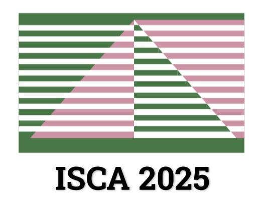

## **LLM Serving at Scale**

▪ LLM serving system should simultaneously handle **a large number of, long-context requests**

#### **Large Batch Size**

LLM serving system batches multiple requests (+10,000) from users

#### **Long Context Length**

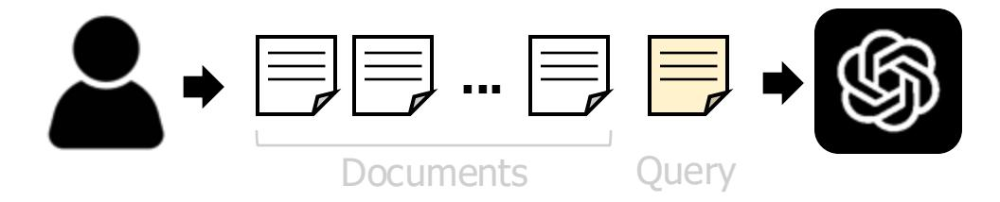

Recent LLM tasks (e.g., RAG, reasoning) involve over tens of thousands of tokens

## Larger Batch & Longer Context put pressure on Memory Capacity & Bandwidth

## KV Cache Matters for "Bandwidth"

- \* NVIDIA A100, Llama2-13B, context length: 1K
- Increasing batch size improves utilization except for attention operation
- Attention operation is bandwidth-bound due to un-sharable KV cache

## **KV Cache Matters for "Bandwidth"**

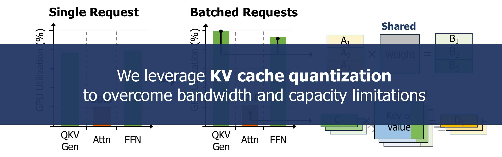

- \* NVIDIA A100, Llama2-13B, context length: 1K
- Increasing batch size improves utilization except for attention operation
- Attention operation is bandwidth-bound due to un-sharable KV cache

# Oaken achieves both high performance & accuracy through co-designing quantization algorithm & hardware modules

## **Overview of Oaken**

① Address memory bottleneck in LLM serving

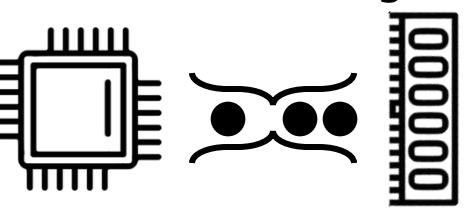

### **Design Objectives**

② Find sweet spot between accuracy & performance

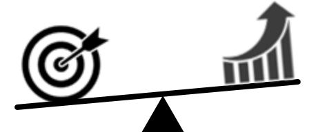

③ Maximize hardware utilization & performance

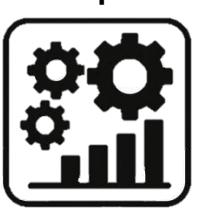

## **Algorithm Design Hardware Design**

Threshold-based hybrid grouping

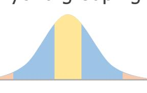

Group shift quantization

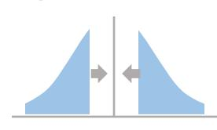

Dense-and-sparse encoding

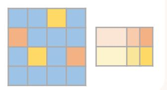

Streamlined module architecture

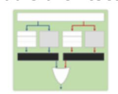

Page-based memory management

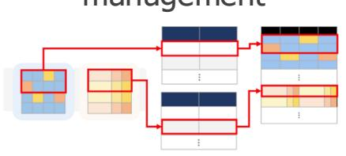

## **Key Observations on KV Distribution**

#### **Observation 1**

KV distribution **varies** across models and decoder layers

## **Insight 1**

Oaken should determine quantization scale for each model and decoder layer

#### **Observation 2**

KV distribution is **consistent** across input datasets

## **Insight 2**

Oaken can use shared quantization scale regardless of model inputs

## **Observation 3**

KV distribution has **exceptions** to channel-wise pattern

## **Insight 3**

Oaken should use **multiple quantization groups** segmented by magnitude

## **Threshold-based Online-Offline Quantization**

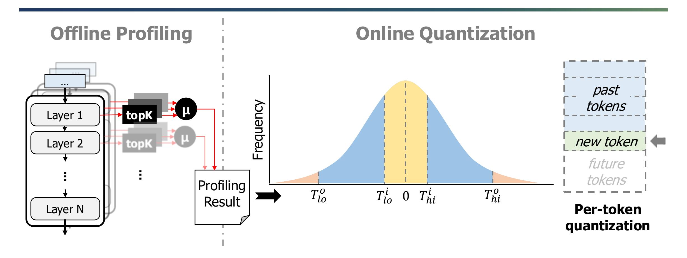

■ Offline profiling requires **one-time cost** for each model (~100 inferences, ~10 min)

## **Threshold-based Online-Offline Quantization**

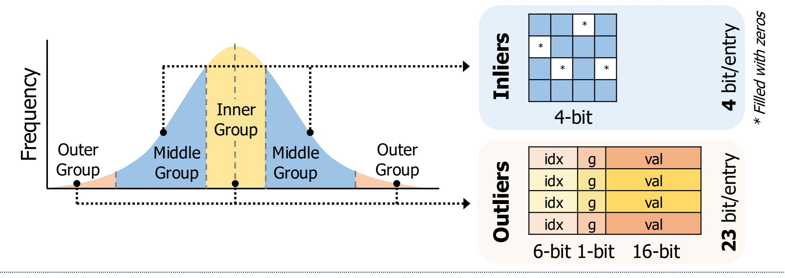

#### **Challenges:**

- Outliers add storage and hardware costs
- Outliers are hard to quantize due to large magnitude

## **Group Shift Quantization**

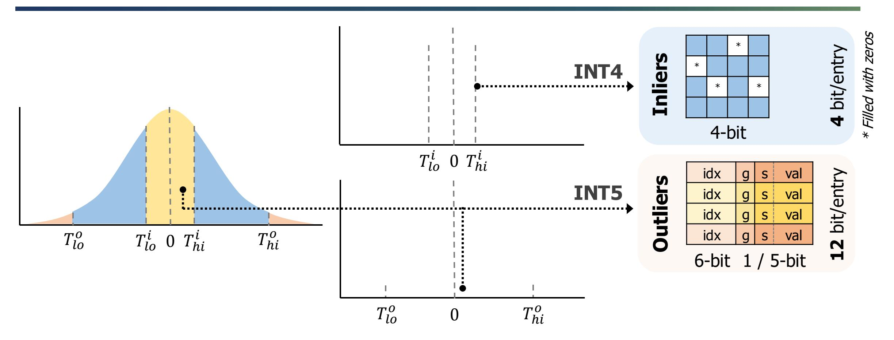

■ Group shift algorithm reduces average bitwidth from 5.9 to 4.8 \* 10% Sparsity

## **Fused Dense-and-Sparse Encoding**

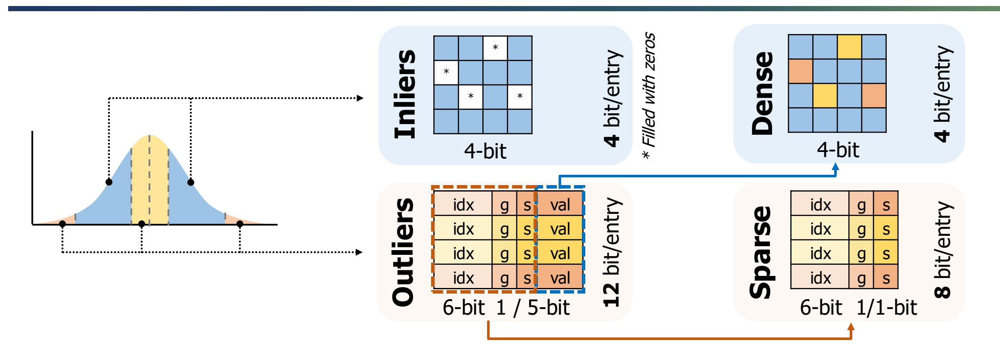

- 8-bit sparse matrices are **hardware-efficient** and **memory-aligned**
- **Fused encoding** reduces average bitwidth **from 4.8 to 4.4** \* 10% Sparsity

## **Oaken Accelerator Integration**

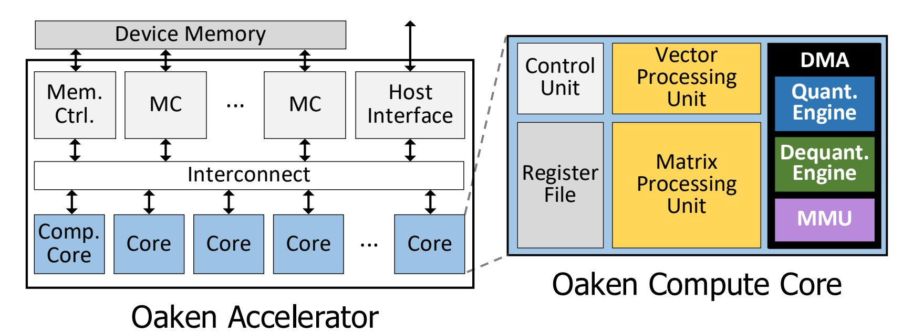

| Module          | Area   |  |  |
|-----------------|--------|--|--|
| VPU             | 22.86% |  |  |
| MPU             | 6.03%  |  |  |
| Quant Engine    | 1.86%  |  |  |
| Dequant. Engine | 6.35%  |  |  |
| Total           | 100%   |  |  |

\* Synthesized on TSMC 28nm

- Oaken modules do not modify the existing compute logic in the accelerator
- Oaken modules are integrated into existing accelerator with low overhead

## **Oaken Hardware Modules**

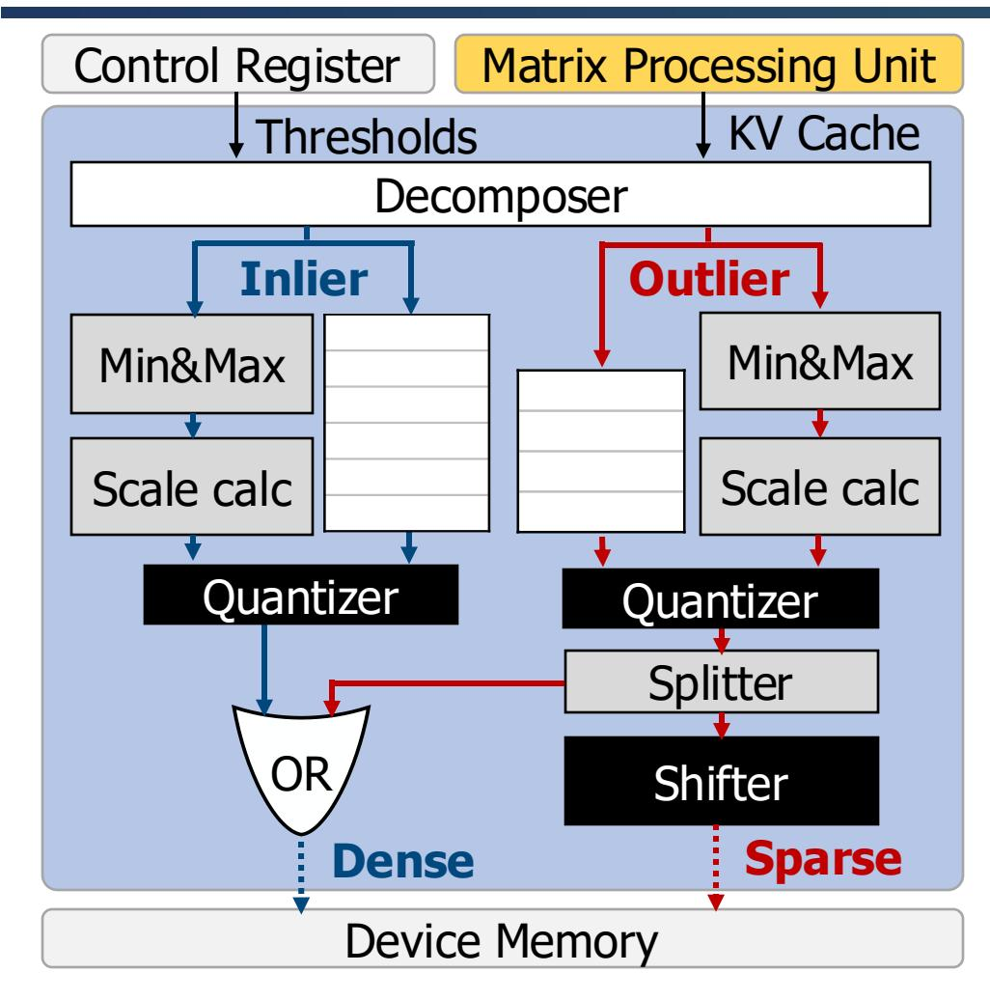

**Quantization Engine**

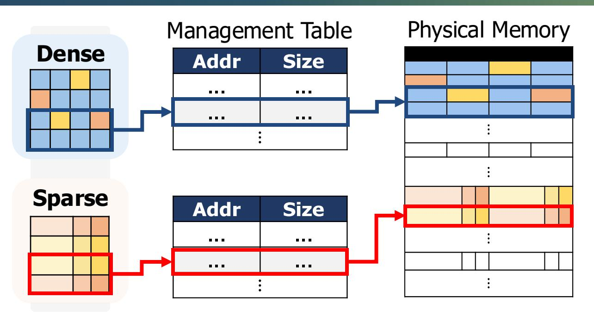

**Memory Management Unit**

▪ Oaken modules are designed to maximize **hardware** and **memory utilization**

## **Evaluation Methodology**

#### ▪ **Models**

◦Llama2 – 7B, 13B, 70B\*

◦OPT – 6.7B, 13B, 30B\*

◦Mistral – 7B

◦Mixtral – 8x7B\*

#### ▪ **Baselines**

◦Tender (ASIC) ◦Atom (GPU) ◦QServe (GPU) ◦KIVI (GPU) ◦KVQuant (GPU)

#### ▪ **Datasets**

◦WikiText2, PIQA, WinoGrande, and HellaSwag

#### ▪ **Group Configuration**

◦**4%, 90%, 6%** for outer, middle and inner group

#### ▪ **Hardware Specification**

|                  | NVIDIA A100     | Oaken-HBM | Oaken-LPDDR |
|------------------|-----------------|-----------|-------------|
| FP16 TFLOPS      | 312             | 270       | 270         |
| Memory type      | HBM             | HBM       | LPDDR       |
| Memory capacity  | 80 / 160* GB | 80 GB     | 256 GB      |
| Memory bandwidth | 2.0 TB/s        | 2.0 TB/s  | 1.1 TB/s    |

\* Used **2 GPUs** with pipeline parallelism

\* Used **2 GPUs** with pipeline parallelism

## **Evaluation Results**

## **Throughput**

Oaken-HBM achieves performance improvement of **1.79**⨉ over vLLM (FP16)

Oaken-LPDDR is also a competitive option for **larger models** and **larger batches**

16 32 64 128 256 Batch Size 16 32 64 128 256 Batch Size GPU (vLLM) GPU (KIVI) Oaken-LPDDR Oaken-HBM **(1) Llama2-7B** Throughput (token/sec) 6K 4K 2K 0 **(2) Llama2-13B** 2K 1K 0 16 32 64 128 256 Batch Size 1000 500 0 250 750 GPU (QServe) 3K **(3) Llama2-70B** \* Context length : 2K

16 / 19

## **Evaluation Results**

#### **Accuracy**

|          | Llama2         |      |              |       |              |       |              |       |
|----------|----------------|------|--------------|-------|--------------|-------|--------------|-------|
| Model    | 13B            | 70B  | 13B          | 70B   | 13B          | 70B   | 13B          | 70B   |
| Dataset  | WikiText2      |      | PIQA         |       | WinoGrande   |       | HellaSwag    |       |
| Metric   | Perplexity (↓) |      | Accuracy (%) |       | Accuracy (%) |       | Accuracy (%) |       |
| Original | 4.88           | 3.32 | 80.52        | 82.70 | 72.80        | 80.20 | 79.38        | 83.82 |
| KIVI     | 4.90           | 3.33 | 79.05        | 78.07 | 70.96        | 76.81 | 78.97        | 83.47 |
| QServe*  | 5.12           | 3.36 | 77.48        | 81.77 | 66.80        | 76.09 | 76.69        | 83.24 |
| Oaken    | 4.93           | 3.34 | 79.71        | 82.59 | 70.56        | 76.64 | 78.24        | 83.50 |

\* Activated KV quantization feature only

Oaken incurs **0.87%** and **0.32% accuracy loss** compared to FP16 and KIVI Oaken achieves **1.38% higher** accuracy compared to QServe

## **Additional Results in Our Paper**

- Performance evaluation using other LLMs and baselines
- Accuracy and effective bits with varying group configurations
- End-to-end latency breakdown
- Sensitivity study to total sequence length
- Performance evaluation using real-world benchmark
- Synthesized area and power

## **Conclusion**

#### • **Oaken**

◦ Acceleration solution for LLM inference serving including algorithm-hardware co-designed KV cache quantization technique

#### • **Contributions**

- Addresses memory bandwidth and capacity bottlenecks in modern LLM serving
- Finds sweet spot in accuracy-performance trade-off of KV cache quantization

#### • **Future works**

- Extending Oaken to handle recent attention architectures (e.g., latent attention, linear attention)
- HyperAccel's high efficiency LLM accelerator with broad quantization support