# Tandem Processor: Grappling with Emerging Operators in Neural Networks

Soroush Ghodrati Sean Kinzer Hanyang Xu Rohan Mahapatra Yoonsung Kim§ Byung Hoon Ahn Dong Kai Wang‡ Lavanya Karthikeyan Amir Yazdanbakhshb Jongse Park§ Nam Sung Kim‡ Hadi Esmaeilzadeh

Alternative Computing Technologies (ACT) Lab

### **Abstract**

With the ever increasing prevalence of neural networks and the upheaval from the language models, it is time to rethink neural acceleration. Up to this point, the broader research community, including ourselves, has disproportionately focused on GEneral Matrix Multiplication (GEMM) operations. The supporting argument was that the large majority of the neural operations are GEMM. This argument guided the research in Neural Processing Units (NPUs) for the last decade. However, scant attention was paid to non-GEMM operations and they are rather overlooked. As deep learning evolved and progressed, these operations have grown in diversity and also large variety of structural patterns have emerged that interweave them with the GEMM operations. However, conventional NPU designs have taken rather simplistic approaches by supporting these operations through either a number of dedicated blocks or fall back to general-purpose processors.

This work sets out to challenge the conventional wisdom in neural accelerator design and explore the architecture of an on-chip companion, dubbed Tandem Processor, that complements the rather optimized GEMM unit in neural accelerators. This processor needs to be specialized to keep up with the GEMM unit; and yet needs to be programmable to address the (1) structural and (2) operational variations. To strike a balance between specialization and programmability, on the one hand, we specialize its memory access logic with a novel ISA/microarchitecture that alleviates the register file and its associated load/store operations. On the other hand,

Permission to make digital or hard copies of part or all of this work for personal or classroom use is granted without fee provided that copies are not made or distributed for profit or commercial advantage and that copies bear this notice and the full citation on the first page. Copyrights for third-party components of this work must be honored. For all other uses, contact the owner/author(s).

ASPLOS '24, April 27-May 1, 2024, La Jolla, CA, USA © 2024 Copyright held by the owner/author(s). ACM ISBN 979-8-4007-0385-0/24/04 https://doi.org/10.1145/3620665.3640365

the calculations of the non-GEMM layers are only supported through primitive arithmetic/logic vector operations. Therefore, programmability is offered at the mathematical level. The enhancements due to the specialization of the memory access logic in the Tandem Processor and its tight integration with the GEMM unit sustain the throughput and the utilization of the neural accelerator. Comprehensive evaluations of the proposed design based on the end-to-end execution of seven diverse DNNs including emerging language models show significant performance improvements and energy reduction enabled by leveraging the Tandem Processor. We provide the RTL code that is synthesizable both for FPGA and ASIC implementations in addition to the associated compiler as part of the open-source GeneSys project (https://actlab-genesys.github.io/). We also present the chip floorplan and post-layout analysis. This work is the result of 10 years of effort in building real NPUs that support end-to-end neural network execution.

CCS Concepts: • Hardware  $\rightarrow$  Hardware accelerators; Application specific processors; • Computer systems organization  $\rightarrow$  Single instruction, multiple data; • Computing methodologies  $\rightarrow$  Neural networks.

Keywords: Neural Processing Unit (NPU), Domain Specific Architecture (DSA), Accelerator, Deep Neural Networks (DNN), End-to-End Acceleration, Non-GEMM Layers, Large Language Models (LLM), Single Instruction Multiple Data (SIMD), Instruction Set Architecture (ISA), Tandem Processor

#### **ACM Reference Format:**

Soroush Ghodrati, Sean Kinzer, Hanyang Xu, Rohan Mahapatra, Yoonsung Kim, Byung Hoon Ahn, Dong Kai Wang, Lavanya Karthikeyan, Amir Yazdanbakhsh, Jongse Park, Nam Sung Kim, and Hadi Esmaeilzadeh. 2024. Tandem Processor: Grappling with Emerging Operators in Neural Networks. In 29th ACM International Conference on Architectural Support for Programming Languages and Operating Systems, Volume 2 (ASPLOS '24), April 27-May 1, 2024, La Jolla, CA, USA. ACM, New York, NY, USA, 18 pages. https://doi.org/10.1145/3620665.3640365

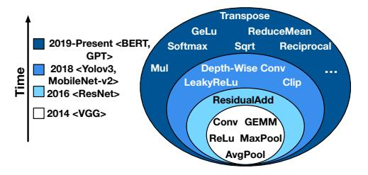

Figure 1. Neural operators in representative DNNs over the years.

# 1 Introduction

Deep Neural Networks (DNNs) have taken the IT industry and almost every computing research community by storm. Their compute intensity has heralded an era of neural accelerators or neural processing units [\[8](#page-14-0)[–11,](#page-14-1) [13,](#page-14-2) [16](#page-14-3)[–19,](#page-14-4) [22,](#page-14-5) [27,](#page-14-6) [28,](#page-14-7) [31,](#page-14-8) [33,](#page-14-9) [35,](#page-14-10) [36,](#page-14-11) [38,](#page-14-12) [39,](#page-14-13) [42,](#page-15-0) [43,](#page-15-1) [45–](#page-15-2)[47,](#page-15-3) [50,](#page-15-4) [51,](#page-15-5) [53,](#page-15-6) [56,](#page-15-7) [57,](#page-15-8) [61–](#page-15-9)[63,](#page-15-10) [65,](#page-15-11) [72,](#page-15-12) [78,](#page-15-13) [79,](#page-15-14) [82,](#page-16-0) [86,](#page-16-1) [90–](#page-16-2) [95,](#page-16-3) [99,](#page-16-4) [101,](#page-16-5) [108,](#page-16-6) [117](#page-16-7)[–120\]](#page-17-1). These designs that include some of our own prior work [\[38,](#page-14-12) [39,](#page-14-13) [60,](#page-15-15) [95\]](#page-16-3) have disproportionately focused on convolutions, then later on more broadly on GEneral Matrix Multiplication (GEMM) operations. The rationale was that more than 99% of operations of neural networks are of this type [\[16,](#page-14-3) [35,](#page-14-10) [95\]](#page-16-3). Researchers have focused on optimizing the design for these GEMM operations from various aspects including but not limited to sparsification [\[8,](#page-14-0) [10,](#page-14-14) [17,](#page-14-15) [42,](#page-15-0) [43,](#page-15-1) [57,](#page-15-8) [60,](#page-15-15) [78,](#page-15-13) [82,](#page-16-0) [108,](#page-16-6) [120\]](#page-17-1), bit-level flexibility [\[9,](#page-14-16) [22,](#page-14-5) [40,](#page-14-17) [51,](#page-15-5) [86,](#page-16-1) [92,](#page-16-8) [93,](#page-16-9) [95\]](#page-16-3), use of resistive technologies [\[11,](#page-14-1) [19,](#page-14-4) [90,](#page-16-2) [98,](#page-16-10) [117\]](#page-16-7), analog computations [\[39,](#page-14-13) [61,](#page-15-9) [101\]](#page-16-5), in/near memory computation [\[28,](#page-14-7) [35,](#page-14-10) [47,](#page-15-3) [53\]](#page-15-6), data flow optimizations [\[16,](#page-14-3) [18,](#page-14-18) [33,](#page-14-9) [35,](#page-14-10) [36,](#page-14-11) [45,](#page-15-2) [46,](#page-15-16) [50,](#page-15-4) [56,](#page-15-7) [62,](#page-15-17) [91,](#page-16-11) [94\]](#page-16-12), to name a few. These inspiring innovations have been effective in optimizing the runtime and energy efficiency of GEMM-based operations. However, neural networks are not and were not just a series of matrix multiplications. Yet, scant attention has been paid to the non-GEMM layers and neural networks have been treated as simply a sequence of GEMM operations even in commonly used neural accelerator simulators [\[38,](#page-14-12) [88,](#page-16-13) [95\]](#page-16-3).

The scale has already shifted as new neural models have emerged. Given the rising prevalence of neural networks and the transformative impact of language models in generative AI applications [\[7,](#page-14-19) [24,](#page-14-20) [41,](#page-15-18) [67–](#page-15-19)[69,](#page-15-20) [77\]](#page-15-21), it is timely to rethink neural accelerator design. As illustrated in Figure [1,](#page-1-0) non-GEMM operations have increased significantly in number, variety, and the structure of connectivity. For instance, VGG-16 [\[97\]](#page-16-14), as the first generation of DNNs, includes non-GEMM operations from only three types. Whereas the types of non-GEMM operations have increased to ten for language models (e.g., BERT [\[26\]](#page-14-21), GPT-2 [\[83\]](#page-16-15)), as the current generation of DNNs.

The non-GEMM operations are traditionally delegated to a few dedicated blocks (e.g., the ReLu/MaxPool units) [\[3,](#page-14-22) [8,](#page-14-0) [11,](#page-14-1) [13,](#page-14-2) [18,](#page-14-18) [19,](#page-14-4) [27,](#page-14-6) [28,](#page-14-7) [33,](#page-14-9) [39,](#page-14-13) [43,](#page-15-1) [46,](#page-15-16) [51,](#page-15-5) [56,](#page-15-7) [57,](#page-15-8) [61,](#page-15-9) [62,](#page-15-17) [72,](#page-15-12) [78,](#page-15-13) [90,](#page-16-2) [91,](#page-16-11) [94,](#page-16-12) [95,](#page-16-3) [99\]](#page-16-4). However, this approach is not sustainable as the variety of the non-GEMM operations and their structural connectivity to other layers increase. Clearly, there is a need for a rather significant degree of programmability. As such, alternative to or in addition to these blocks, an off-chip general-purpose processor [\[9,](#page-14-16) [10,](#page-14-14) [16,](#page-14-3) [17,](#page-14-15) [22,](#page-14-5) [35,](#page-14-10) [36,](#page-14-11) [45,](#page-15-2) [65,](#page-15-11) [79,](#page-15-14) [82,](#page-16-0) [92,](#page-16-8) [100,](#page-16-16) [113,](#page-16-17) [118,](#page-17-2) [119\]](#page-17-3) or an on-chip one [\[37,](#page-14-23) [49,](#page-15-22) [50,](#page-15-4) [76,](#page-15-23) [102,](#page-16-18) [105,](#page-16-19) [107\]](#page-16-20) is designated to handle non-GEMM operations. Through our evaluations, we observe that runtime effects

of the non-GEMM operations grow in dominance and they are not a rather small and limited minority. Their runtime effects are amplified as the GEMM unit has been polished and optimized over the past decade. Due to these optimizations, Amdahl's bottleneck is shifting towards these non-GEMM operations. Moreover, the non-GEMM counterpart needs to keep up with this optimized GEMM unit to sustain both of their utilization levels.

To address these challenges, this paper proposes a third alternative: a specialized, yet programmable processor, which acts as a companion to the GEMM unit. This specialized processor, named the Tandem Processor, not only handles the execution of the non-GEMM layers, but also orchestrates the end-to-end DNN execution and operand delivery between units. To strike a balance between specialization and programmability, on one hand, we specialize its ISA and memory semantics and alleviate the register file and its associated load/store operations. These specializations are derived from the common patterns of accesses in non-GEMM layers that rearrange and process data elements in a nested-loop fashion. On the other hand, the calculations of the non-GEMM layers are only supported through primitive arithmetic/logic vector operations to offer programmability at the mathematical level.

The design of the Tandem Processor and the following contributions are the results of a decade-long endeavor to develop real NPUs capable of executing neural networks end-to-end.

#### Contributions:

- (1) The paper explores the uncharted and rather ignored non-GEMM layers and their challenging structural and computational effects on the end-to-end DNN acceleration through a comprehensive analysis and characterization.
- (2) We leverage the unique characteristics of non-GEMM layers and propose a new instruction execution semantic and architecture that does not adhere to the conventional Register-File-centric designs. This design enables a unique specialized data access semantic for the Tandem Processor.
- (3) We exploit the common data manipulation patterns in non-GEMM DNN layers and offer a pipeline front-end that leverages microarchitectural mechanisms to keep track of strided iterators. This innovation minimizes the overhead of loop execution, address calculations, and memory accesses.
- (4) We provide the RTL that is synthesizable on FPGA and ASIC implementation and the associated compiler as part of the open-source GeneSys project (<https://actlab-genesys.github.io/>) and present the floorplan and post-layout analysis.

We evaluate the Tandem Processor with respect to end-to-end execution of seven diverse models, ranging from rather classical DNNs to the emerging language models, when the Tandem Processor or the alternative design points augment the same GEMM unit. The results show that a balanced design offers significant advantages (2.7× speedup and 20.6× energy reduction) over the common practices of using dedicated blocks that may also require help from the off-chip host processor. In an iso-resource setting, we compare the Tandem Processor to Gemmini [\[37\]](#page-14-23), a recent inspiring academic project [\[37\]](#page-14-23), which uses an on-chip RISC-V processor in addition to the dedicated blocks. Utilizing the Tandem Processor outperforms the use of on-chip multi-core RISC-V processors by 5.9×. Compared to a TPU-like [\[49,](#page-15-22) [50\]](#page-15-4) design that augments the GEMM unit with an on-chip general-purpose vector unit, leveraging the Tandem Processor offers 2.6× end-to-end speedup and 1.4× energy reduction.

| Non-GEMM Operator Classes           | Operator Examples                                                               | Representative DNNs                                                                                |
|-------------------------------------|---------------------------------------------------------------------------------|----------------------------------------------------------------------------------------------------|
| Element-wise mathematical operators | Add, Sub, Mul, Exp, Sqrt, Floor, Ceil, Greater, Equal, Less, Pow, Reciprocal | ResNet [44], Yolov3 [85], MobileNetv2 [89], EfficientNet [104], BERT [26], GPT-2 [83]              |
| Element-wise activation function    | Relu, LeakyRelu, Clip, Tanh, Sigmoid, GeLU                                      | VGG-16 [97], ResNet [44], Yolov3 [85], MobileNetv2 [89], EfficientNet [104], BERT [26], GPT-2 [83] |
| Reduction-based operators           | Depth-wise Conv, MaxPool, GlobalAveragePool, ReduceMean, Softmax                | VGG-16 [97], ResNet [44], MobileNetv2 [89], EfficientNet [104], BERT [26], GPT-2 [83]              |
| Data layout transformation          | Transpose, Reshape, Concat                                                      | Yolov3 [85], BERT [26], GPT-2 [83]                                                                 |
| Type conversion                     | Cast, BitShift                                                                  | Any Inference                                                                                      |

**Table 1.** Non-GEMM operators and their representative DNNs.

Comparison with NVIDIA's Jetson Xavier NX GPU that leverages NVDLA accelerator [3] shows 4.8× improvements in performance-per-Watt with  $\sim\!12\times$  less resources. Finally, in an iso-TOPs setting, comparison to NVIDIA A100 GPU with TensorRT execution shows that the proposed design matches A100 performance, while the Tandem Processor provides 3.4× acceleration only for non-GEMM operations.

# 2 A Deep Dive into Non-GEMM Operations

#### 2.1 Characteristics of Non-GEMM Operations

Non-GEMM operations are significantly diverse. Table 1 summarizes the non-GEMM operators used for inference across a set of diverse DNN models. We extract these operations from their corresponding ONNX implementations [70]. These layers can be categorized into five classes: (1) element-wise mathematical operations, (2) element-wise activation functions, (3) reduction-based operations, (4) data layout transformation operations, and (5) data type conversion operations. Non-GEMM operators fundamentally differ from GEMM ones. They exhibit a wide diversity in terms of compute operations ranging from simple mathematical operations (e.g. Add, Mul, etc.) to complex ones (e.g. GeLU, Exp, etc.) as opposed to the commonly used multiply-accumulate in GEMM layers. Moreover, they require various patterns of mapping between input and output tensors, from one-to-one in element-wise operations to many-to-one in reduction-based ones.

Usage frequency of non-GEMM operations is continuously growing. Figure 2 shows the usage frequency of the GEMM and non-GEMM operators across the studied benchmarks. We extract this data from the ONNX graph representation of each model and categorize them with respect to the classification in Table 1. The y-axis shows the cumulative usage of these operators as additional models are taken into account. The last group of bars show the total cumulative usage of operators across all benchmarks. As shown in Figure 2, as additional models are covered, the cumulative number of non-GEMM operations noticeably surges. Additionally, taking the entire benchmarks into account (last bar), merely 15% of total DNN operator nodes are GEMMs.

Non-GEMM operations impose non-trivial runtime overheads in newer DNNs. Figure 3 shows the runtime breakdown of benchmark DNNs for three design choices: (1) a GEMM unit with an off-chip CPU (Baseline (1) in Figure 3), (2) a GEMM unit coupled with a set of dedicated units and the same off-chip CPU (Baseline (2) in Figure 3), and NVIDIA A100 GPU that leverages tensor cores and INT8 execution mode. Section 7 describes the experimental methodology to obtain these results. Figure 3 reports the runtime breakdown across the time spent on GEMM layers, non-GEMM layers, and PCIe communications (for the case of Baselines (1) and (2)). As the non-GEMM layers become more diverse and complex

**Figure 2.** Cumulative number of GEMM and non-GEMM operations across benchmarks. Last bar covers the frequency of usage across all the models.

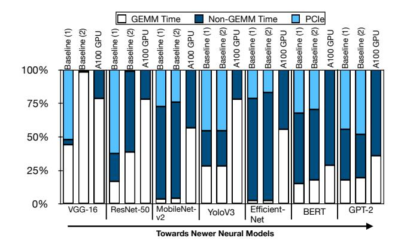

**Figure 3.** Runtime breakdown of benchmark DNNs across various platforms.

in newer models such as EfficientNet, BERT, and GPT-2 they also become the main source of the execution bottleneck. For instance, the execution of non-GEMM layers take up 73% of the runtime for EfficientNet for the GPU.

Non-GEMM operations are interspersed amongst GEMM operations. Figure 4 depicts the core and frequently used subgraphs of three representative DNNs. As shown, the non-GEMM operators are interspersed amongst the GEMM ones (e.g. Conv) with various forms of connectivity. This structure demands back-and-forth data exchange between GEMM and non-GEMM units through off-chip or on-chip memory. On top of this data exchange, tensor reformatting such as datatype casting and tensor layout transformations may be required. For instance the GEMM unit may operate with INT-8/16 mode, while the non-GEMM unit operates in FP32 mode.

The majority of non-GEMM operations are memory-bound. The majority of non-GEMM layers are element-wise operations (>80%). Moreover, the ones that are not element-wise exhibit low

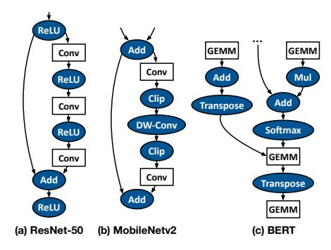

**Figure 4.** Repeated subgraphs of (a) ResNet-50 [44], (b) MobileNetv2 [89], and BERT [26]. The gray ovels illustrate the non-GEMM operations and white rectangles show the GEMM-based operations.

Figure 5. Roofline model for a number of prevalent non-GEMM operators.

compute intensity and data reuse. Figure 5 shows a roofline [111] analysis for a set of prevalent non-GEMM operators. As shown, most of the analyzed operators (other than Softmax and GeLU) fall within the memory-bound region of the roofline. This is in contrast to Conv/GEMM operations that are generally compute-bound [112]. This distinction necessitates architecture design considerations.

#### 2.2 Requirements for Executing Non-GEMM Operations

Inspired by the above characteristics, below we list three key requirements to efficiently execute non-GEMM operations.

R1: In-tandem execution of GEMM and non-GEMM operations. To reduce the data exchange among consecutive layers (GEMM and/or non-GEMMs) through off-chip memory, prior work suggests layer fusion [6, 15, 75, 80]. Layer fusion preserves the intermediate activation values stationary on the chip for subsequent DNN operations. To leverage this technique, the intermediate activations ought to be communicated between GEMM and non-GEMM units via on-chip memory subsystem for a sequence of fused layers. However, this data communication at the granularity of entire layer outputs is neither trivial nor efficient, due to the limited on-chip memory of the accelerators and reduced utilization of GEMM and non-GEMM units (Figure 8 shows the impact on utilization). In essence, the data transfer ought to be performed at a finer granularity of a chunk of output tensor, a.k.a tile. This fine granularity of coordination requires the non-GEMM unit to seamlessly work in tandem with the GEMM unit, while retaining minimal data transfer and reformatting overhead.

R2: Balanced efficiency and programmability for the non-GEMM unit. The diversity of the non-GEMM operators calls for

**Table 2.** Comparison of prior approaches for supporting non-GEMM operators with this work.  $^\dagger$  indicates that these aspects are supported partially.

| Design classes                            | Working in tandem with GEMM Unit | Specialization | Programmability | Execution Control |
|-------------------------------------------|----------------------------------|----------------|-----------------|----------------------|
| Offchip CPU fallback                      | X                                | ×              | V               | V                    |
| Dedicated on-chip hardware units       | ~                                | V              | ×               | X                    |
| Onchip RISC-V core (+ dedicated units) | <b>X</b> ↑                       | <b>X</b> ↑     | ✓               | 1                    |
| General purpose vector unit            | <b>✓</b>                         | <b>X</b> ↑     | ✓               | X                    |
| This work (Tandem Processor)              | V                                | V              | V               | V                    |

a degree of programmability in the hardware. Nonetheless, this should not emerge at the cost of noticeable efficiency reductions. This is important because the inefficiency of the non-GEMM unit can potentially make it the performance bottleneck and result in stalling the GEMM unit. Therefore, striking a balance between programmability and specialization is crucial.

R3: Orchestrating the execution across non-GEMM and GEMM units. Having both GEMM and non-GEMM acceleration units in one coherent system requires adequate support for execution orchestration. In particular, (1) DNN nodes need to be effectively dispatched to their pertinent processing units, (2) GEMM and non-GEMM units need to diligently synchronize and handshake together at the right time to realize in tandem execution and back-and-forth interactions.

#### 2.3 Existing Approaches for Executing Non-GEMM Layers

Table 2 compares prior methods with respect to the aforementioned requirements. Below, we discuss them in details.

Class (1): Off-chip CPU fallback. This approach presumed by a large number of prior work [9, 10, 16, 17, 22, 35, 36, 45, 65, 79, 82, 92, 100, 113, 118, 119] provides ultimate programmability and handles the end-to-end execution orchestration. However, it impedes the performance due to the lack of specialized execution and in tandem execution with the GEMM unit, which the latter is caused by the nontrivial back-and-forth data transfer between the GEMM unit and CPU over PCIe and required data conversions (e.g. integer to float and vice versa).

Class (2): Dedicated on-chip hardware units. An alternative strategy [3, 8, 11, 13, 18, 19, 27, 28, 33, 39, 43, 46, 51, 56, 57, 61, 62, 72, 78, 90, 91, 94, 95, 99] is to equip the GEMM unit with a set of dedicated units customized for specific non-GEMM operations. These dedicated units can often be tightly integrated with the GEMM unit (work in tandem), but do not offer execution orchestration. Another drawback is, it is not scalable to augment neural accelerators with dedicated units for each single type of non-GEMM operation. This also prohibits the accelerator to support emerging non-GEMM operations as a result of evolving DNNs. In the case of unsupported operations these accelerators must still fall back to an off-chip CPU. Class (3): On-chip RISC-V core. The on-chip core in these designs [37, 102] executes the non-GEMM operators and controls on-chip resources. Gemmini [37] extends the RISC-V ISA with a set of dedicated units/instructions for a limited set of non-GEMM layers. Although this approach obviates off-chip CPU communication, but still the overheads of datatype casting and layout conversion remain, blocking in tandem execution. More importantly, the onchip core that has a single ALU lacks in terms of compute power

and efficiency to process the non-GEMM layers and can become the execution bottleneck.

Class (4): On-chip general-purpose vector unit. Nvidia Streaming Multiprocessor (SM) units [\[76\]](#page-15-23) that consist of tensor cores (GEMM units) and CUDA cores (general-purpose vector units) belong to this design class. Another notable example is the Vector Processing Unit (VPU) in Google's TPU [\[49,](#page-15-22) [50,](#page-15-4) [58\]](#page-15-28) and other industrial designs [\[33,](#page-14-9) [105,](#page-16-19) [107\]](#page-16-20). Vectorized execution leverages the inherent parallelism in non-GEMM layers for increased performance improvement. Additionally, these vector units often work in tandem with the GEMM units. However, these units do not handle the execution control [\[50,](#page-15-4) [76\]](#page-15-23) and fall short in terms of specialization. Other related industry designs include SiFive x280 [\[96\]](#page-16-26) and Meta MTIA v1 [\[32\]](#page-14-26). SiFive x260 is a multi-core vector processor with RISC-V vector extensions for deep learning workloads. The design does not include a GEMM unit but provides a set of communication protocols that can be leveraged to integrate this multi-core vector processor with a GEMM unit. Another design point is Meta's MTIA v1. This design comprises a grid of Processing Elements (PEs). Each PE comprises a GEMM unit and three other units to support non-GMEM operations: (1) a SIMD array of dedicated units to support activation functions and typecast operations, (2) a general-purpose core with RISC-V vector extensions to provide further programmability for more complex non-GEMM operations, and (3) a memory layout unit that support transpose/reshape types of operations. In a sense, this design follows both Class (2) and Class (4) of accelerators and includes both dedicated units and general-purpose vector cores.

### 2.4 Our Approach

In this paper we offer the Tandem Processor as a specialized companion SIMD processor that operates in tandem with the GEMM unit, while striking a balance between customization and programmability. In addition, it orchestrates the end-to-end execution, eliminating the need for an additional CPU.

# 3 Design Considerations for the Tandem Processor

### 3.1 Memory Subsystem Design

The low computational intensity and the sizable tensor operands for non-GEMM operators prompt the memory subsystem to repeatedly stream data from off-chip memory. Thus, a locality-oriented hierarchical memory sub-system (i.e., vector register file and cache(s)) and conventional load/store data communication, necessitate an excessive number of memory instructions to deliver off-chip data to/from vector register files, funneling through the memory hierarchy. To address this, we use the following insight: Non-GEMM layers most often operate on statically-structured tensor operands with a-priori known dimensions in a streaming fashion. The Tandem Processor replaces the entire vector register file and cache hierarchy with a collection of single-level software-managed on-chip scratchpads. This design innovation is in contrast to all prior SIMD designs that rely on register file execution and memory semantics (e.g. Google's VPU [\[58\]](#page-15-28)). As shown in Figure [6a,](#page-5-1) these load/store operations to vector register files on average impose 41% and 27% runtime overhead for non-GEMM operations and end-to-end execution, respectively. To manage data movements between off-chip/on-chip memories, we design a Data Access Engine. This unit can be configured and invoked by few explicit load/store instructions per tile to fetch entire tensors. Such data movement merely appears at the boundary of a tile, blocking any further intervention from the off-chip memory.

#### 3.2 Specialized On-Chip Data Access Mechanism

Using large on-chip scratchpads submits a new challenge as fitting the scratchpad addresses in an Instruction Word as opposed to IDs of registers would require significant increase in instruction length. In addition, on-chip address calculations require excessive number of arithmetic instructions. For instance, per two-operand arithmetic/logic instruction, three extra instructions would be required solely for address calculation. As Figure [6b](#page-5-2) shows, this address calculation would impose runtime overheads: On average, 59% of the runtime for non-GEMM layers and 40% of end-to-end DNN runtime. To tackle this challenge, we devise a dedicated pipeline stage for address calculation at the front-end, relieving the burden of address calculation from compute units.

We regulate walking over each dimension of tensor operands by a tuple of ⟨Offset, Stride⟩. Hence, if these tuples can be embedded in a single instruction along with compute operations, upon being inferred at the decode stage, the scratchpad addresses can be calculated in parallel with compute operations. Yet, providing three such tuples for a non-GEMM layer would still require significant increase in instruction length. Instead, we forge scratchpad accesses through indirect strided address calculations. Figure [7](#page-5-3) illustrates this feature. We formulate these strided accesses using ⟨Scratchpad ID, Iterator Index⟩ format. The Scratchpad ID is used to select the corresponding scratchpad iterator table and the Iterator Index points to an entry in the Iterator Table. Each entry in the Iterator Table stores a tuple of ⟨Offset, Stride⟩ for each operand. This design optimization realizes the embedding of strided addresses and compute operations into a single 32-bit instruction word (See Section [5\)](#page-7-0). With this mechanism the Tandem Processor supports address calculation as well as compute operation on the same pipeline path with shared control and no extra runtime overhead. This is in contrast to prior work [\[81,](#page-16-27) [103,](#page-16-28) [115\]](#page-16-29) which leverage decoupled access/execute engines with register files/FIFOs for data access and address generation.

### 3.3 Specialized Loop Execution

Non-GEMM layers are formed of nested loops of primitive operations with pre-determined iteration counts. As Figure [6c](#page-5-4) shows, using conventional loop logic (i.e. conditional branch) incurs on average 70% and 47% runtime overhead for non-GEMM layers and end-to-end DNN execution, respectively. To alleviate this, we devise specialized loop execution semantics, while removing the branch prediction logic.

To that end, the Tandem Processor uses software-managed tables in the fetch pipeline stage to orchestrate the execution of nested loop constructs in hardware. Prior to execution, these tables are configured once with the iteration counts and corresponding number of nested loop levels. Once configured, these specialized tables are used repeatedly in conjunction with the iterator tables to execute the loop body. This is crucial, since appropriate ⟨Offset, Stride⟩ tuples need to be employed at each level of loop nest to correctly calculate the scratchpad addresses. This specialized loop execution is unique to the Tandem Processor, as prior work [\[20,](#page-14-27) [103\]](#page-16-28)

**Figure 6.** Analyzing the overheads of non-GEMM execution eliminated by design considerations in the Tandem Processor, individually. "N-G" and "E2E" denote the runtime for Non-GEMM and End-to-End execution. These experiments are performed on the Tandem Processor + GEMM unit with Table 3 configurations with all hardware specializations and compiler optimizations, except the ones under evaluations.

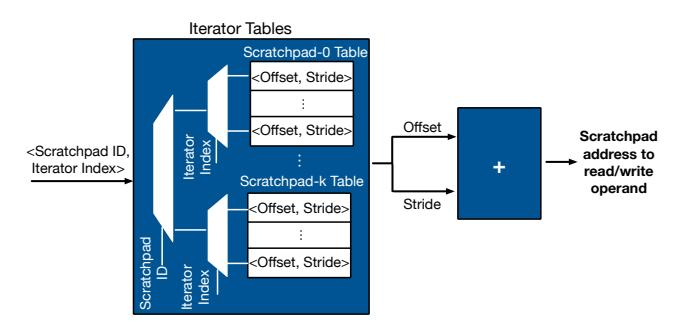

Figure 7. Indirect strided address calculation for scratchpad accesses.

leveraged hardware-managed loop logic with register-file based designs and did not offer mechanisms to combine it with address calculation.

#### 3.4 Arithmetic Logic Units Design

ALU operations. To support a diverse set of non-GEMM layers, one approach would be to use dedicated specialized instruction for each layer. However, this would lead to a design similar to the second class in Section 2.3. We instead leverage the feasibility of implementing complex non-GEMM layers with a set of simple primitive operations [5, 54]. For instance, GeLU operator can be implemented using five multiplications, three additions, a sign, an absolute, and a minimum operations. We consider a union set of these primitives that is comprehensive enough to support non-GEMM layers shown in Table 1. Hence, the Tandem Processor offers better hardware resource utilization and reuse across a larger set of operations.

ALU precision and datatype. Prior works show that integer-only arithmetic can be used for inference execution of CNNs [48, 114] and transformers [54] with virtually no repercussions on accuracy. Also, while GEMM and few non-GEMM layers (e.g., Relu) are amenable for low-precision INT8 implementation [48], some non-GEMM layers such as ResAdd and Softmax require INT32 [54, 114]. To provide sufficient precision for all non-GEMM operators, we use INT32 for the Tandem Processor ALUs. As a complementary benefit, additional data casting from GEMM to non-GEMM unit is not needed, since GEMM units typically accumulate the partial results in INT32 precision [16, 35, 49, 50, 54, 95]. To support lower

Figure 8. Resource utilization analysis.

precision for GEMM, a datatype casting instruction is required when activations move from non-GEMM to GEMM unit.

#### 3.5 Integration with the GEMM Unit

Coordination granularity. We use tile (sub-tensor) granularity for software pipelining to facilitate execution overlap between GEMM and non-GEMM units, improve resource utilization, and better conform with limited on-chip memory capacity. As Figure 8 shows, the in tandem coordination of the GEMM unit and the Tandem Processor at tile granularity increases the compute resource utilization by 20% and 13% for the GEMM unit and the Tandem Processor, respectively. Note that an operand-level granularity is less efficient. This is because some non-GEMM operators, such as depthwise convolution, require arbitrary accesses to GEMM outputs for consecutive operations. This access pattern results in frequent stalls, curtailing the overall performance.

Communication mechanism. To enable tile-based coordination, one probable approach is to directly move/copy tiled data from the GEMM unit's Output BUF to the Tandem Processor's private scratchpads. However, this design decision incurs communication overhead at the boundary of each accelerator units, requiring complex coordination mechanism. Alternatively, we enable a fluid ownership of the GEMM unit's Output BUF for the Tandem Processor, obviating redundant data communications. After the GEMM unit completes storing the intermediate data in the Output BUF, the Tandem Processor takes the ownership of the buffer and directly executes its computations on the stored data.

Figure 9. The Tandem Processor pipeline microarchitecture. The ALU and scratchpad reads/write stages are interleaved to improve frequency.

Synchronization mechanism. To enable this fluid ownership while simplifying hardware, we leverage the compiler to weave a set of synchronization instructions (See Section [5\)](#page-7-0) between GEMM and non-GEMM instructions those realize the following: (1) They identify the code regions for GEMM unit and the Tandem Processor, facilitating the instruction dispatch. (2) They define the flow of execution between GEMM and non-GEMM units. (3) They govern the handshaking mechanism between the acceleration units. For instance, enforcing the release of ownership of the Output BUF after the Tandem Processor completes the execution.

# 4 Microarchitecture Design for the Tandem Processor

### 4.1 Pipeline Design

In this section, we discuss the major aspects of the Tandem Processor's pipeline microarchitecture, illustrated in Figure [9.](#page-6-0)

On-chip memory organization. We refer to the Tandem Processor scratchpads as Namespaces, which are shown with gray colour in Figure [9.](#page-6-0) Interim BUF 1&2 namespaces represent the central Tandem Processor's on-chip scratchpads that operate as a storage medium for tensor operands as well as their intermediate results. These scratchpads, which bridge the off-chip memory and the Tandem Processor, are populated/drained by a Data Access Engine at a tile granularity. The Tandem Processor compiler configures the Data Access Engine by setting the base address of the off-chip source along with a series of stride values. Note that, the tiled data may be even dispersed across non-contiguous regions of memory lines, yet statically arranged in strided patterns. IMM BUF namespace serves as a small 32-slot scratchpad for immediate values in non-GEMM operations. This buffer is programmed with a series of customized instructions at the onset of non-GEMM layer execution. The last namespace is Output BUF, which serves as the GEMM Unit's buffer for output values.

Specialized on-chip data access. We place the Iterator Tables that are used to store the offset and stride information for scratchpad accesses at the decode stage of the Tandem Processor pipeline (see Figure [9\)](#page-6-0). There is a dedicated Iterator Table for each namespaces of the Tandem Processor. Upon decoding one arithmetic/logic instruction, the ⟨Namespace ID, Iterator Index⟩ retrieves the address

calculation information from the corresponding Iterator Table. The resulting outputs of accessing the Iterator Tables is a triplet address, two for source operands and one for destination operand. Each element of the triplet is a tuple of ⟨offset, stride⟩, indicating that target data resides in Scratchpad[offset + stride]. The triplet address is passed down to the subsequent pipeline stage (Strided Address Calculation) that repetitively assembles a series of scratchpad addresses, each as the result of offset + stride computation. The scratchpad indices propagate down the multi-staged execution pipeline to fetch the tiled operands, perform the non-GEMM operations, and write back the resulting data to the pipeline back-end. Nested loop support. The Code Repeater module (see Figure [9\)](#page-6-0) uses three tables: A table stores the compiler-defined iteration counts. Each entry of this table maintains the configuration of one of the loop nesting levels, ordered from outermost loop to the innermost one. At the Decode pipeline stage, Code Repeater stores the number of iterations in each table entry, which is indexed using a pointer that keeps track of the number of nested loops. Once the Code Repeater is configured, it uses the second table with similar structure of entries to keep track of the current iteration of the loops. Whenever, the Code Repeater exhausts the iterations of a loop level, it decrements the pointer to update the iterations of the ensuing outer loop. Finally, the Code Repeater uses a collection of identical tables that store the information about what Iterator IDs need to be exercised for each operand at a certain loop level.

# 4.2 Overall Execution Flow and the GEMM-Unit-Tandem-Processor Synchronization Logic

Figure [10](#page-7-1) illustrates the overall execution for a DNN subgraph on the NPU-Tandem. As shown, at a high level, the NPU-Tandem encompasses (1) a GEMM unit (including weight/input buffers), (2) Output Buf, which serves as a medium for communicating data from GEMM unit to the Tandem Processor, (3) an execution controller that orchestrates the overall execution and faciliates the synchronization between units, and (4) an instruction buffer that holds the instructions of the block. To execute DNNs, the compiler breaks the DNN graph into a set of execution blocks or subgraphs (step 0 in Figure [10\)](#page-7-1). A block can be one of the followings: (1) a single GEMM layer, (2) a group of bundled non-GEMM layers, (3) a GEMM layer followed by a group of bundled non-GEMM layers (shown in this example). To realize the in tandem execution, a uniform tiling scheme is required across the inputs/outputs of fused layers in one block. Figure [10](#page-7-1) shows four tiles of execution for fused GEMM (shown with square) and non-GEMM layers (shown with circles). As Section [5](#page-7-0) discusses, the synchronization instructions mark the boundaries of GEMM and non-GEMM instructions (see the instruction block format in Step 0 of Figure [10\)](#page-7-1). Figure [11](#page-7-2) illustrates the high level view of the execution controller logic for the Tandem Processor. Below, we discuss the overall execution on the NPU-Tandem.

Instruction load and dispatch (Step 1 in Figure [10\)](#page-7-1). First, the Tandem Processor loads the instructions of a block from off-chip memory into itsInst. BUF. Then, the FSM of the execution controller switches from Block Start to Inst. Dispatch state (see Figure [11\)](#page-7-2). At this state, the Tandem Processor's Inst. Dispatch unit drives the Program Counter to walk over all the instructions of a block. Note that this is a lightweight decode state and does not invoke any execution on the GEMM unit or Tandem Processor. The Inst.

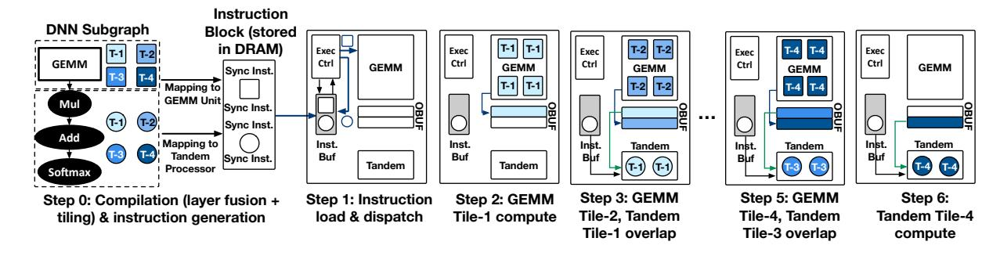

Figure 10. An example of end-to-end execution on NPU-Tandem.

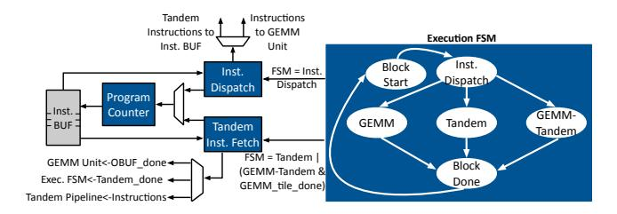

Figure 11. The execution controller.

Dispatch unit decodes the synchronization instructions to identify the topology of the block (GEMM only, non-GEMM only, or GEMM followed by non-GEMM). It then decodes the GEMM instructions and configures the GEMM unit, while writes back the non-GEMM instructions to the Inst. BUF. Note that GEMM units typically operate at macro operations level (e.g. Conv/Matmul instructions), when first a set of instructions are decoded to configure the GEMM unit. Based on the configuration, this unit then operates in a repetitive mode to fully execute the GEMM layers [37, 50, 95]. In contrast, the Tandem Processor is similar to von Neumann machines, where each instruction is decoded and executed through the processor pipeline. As such, at the end of this state, only non-GEMM instructions exist on Inst. Buf to be decoded and executed by the Tandem Processor. After the dispatch is done, based on the structure of the program block, the execution FSM switches to either of these three states: the GEMM state, the Tandem Processor state, and the GEMM-Tandem Processor state (see Figure 11). Below, we first discuss GEMM-Tandem Processor case as shown in the example of Figure 10 and then discuss the Tandem Processor only case.

GEMM-non-GEMM execution (Step 2 to Step 6 in Figure 10). If a GEMM layer is followed by a series of non-GEMM layers, the FSM transitions to the GEMM-Tandem Processor state after the instruction dispatch. GEMM unit first starts with executing the first tile (Step 2 in Figure 10). Whenever the GEMM unit finishes the tile, it sends a handshaking signal to the execution controller. If the Tandem Processor is idle, the execution controller invokes Tandem Inst. Fetch unit to start the execution of non-GEMM tile (see (FSM = Tandem | FSM = GEMM-Tandem) & GEMM\_tile\_done signal in Figure 11.). Utilizing a double-buffering scheme, the GEMM unit proceeds to the next tile, while the Tandem Processor takes the outputs of the GEMM-completed tile and performs the non-GEMM operations (Step 3 in Figure 10). To avoid stalls in the GEMM unit caused by the Output BUF being occupied by the Tandem Processor,

|                 | 4 bits | 4 bits | 3 bits  | 5 bits       |         | 16            | bits    |               |
|-----------------|--------|--------|---------|--------------|---------|---------------|---------|---------------|
| Synchronization | opcode | func   | Х       | group ID     |         |               | X       |               |
|                 | 4 bits | 4 bits | 3 bits  | 5 bits       |         | 16            | bits    |               |
| Configuration   | opcode | func   | ns id   | iter idx     |         | Imm           | ediate  |               |
|                 | 4 bits | 4 bits | 3 bits  | 5 bits       | 3 bits  | 5 bits        | 3 bits  | 5 bits        |
| Compute         | opcode | func   | dst ns  | dst iter idx | src1 ns | src1 iter idx | src2 ns | src2 iter idx |
|                 | 4 bits | 4 bits | 3 bits  | 5 bits       |         | 16            | bits    |               |
| Loop            | opcode | func   | loop id | Χ            |         | Imm           | ediate  |               |
| Data            | 4 bits | 4 bits | 3 bits  | 5 bits       |         | 16            | bits    |               |
| Transformation  | opcode | func   | src/dst | dim idx      |         | Imm           | ediate  |               |
| Off-chip Data   | 4 bits | 4 bits | 3 bits  | 5 bits       |         | 16            | bits    |               |
| Movement        | opcode | func1  | func2   | loop idx     |         | Imm           | ediate  |               |

Figure 12. The Tandem Processor instruction formats.

the compiler inserts a synchronization instruction (see Section 5) right after the instructions consuming the data on the Output BUF. At this time, the Tandem Inst. Fetch sends a handshaking signal to the GEMM unit and Tandem Processor releases the Output BUF (OBUF\_done -> GEMM Unit in Figure 11). the Tandem Processor may continue the computation using its private Interim BUFs. Once the Tandem Processor finishes a tile, it uses the synchronization instruction that marks the end of the non-GEMM program to alert the execution FSM (Tandem\_done -> Exec. FSM in Figure 11). The execution FSM puts the Tandem Processor in the idle state until it receives the next tile from GEMM unit. After finishing the all tiles (Step 2 to 6 in Figure 10), the execution FSM transitions to the Block Done state (see Figure 11).

Non-GEMM only execution. The execution FSM transitions from Inst. Dispatch to Tandem state and triggers the Tandem Inst. Fetch to fetch the non-GEMM instructions and forward them to Tandem Processor pipeline. Once Tandem Processor completes executing all the instructions, the Tandem Inst. Fetch unit sends a handshaking signal to the execution FSM logic. The execution FSM loops back to this state if there are remaining tiles. To ensure the off-chip memory access instructions are updated for different tiles, the first tile is used to initialize configurations for the Data Access Engine. For rest of the tiles, the Data Access Engine reuses the initialized configurations and incrementally updates them.

# 5 ISA Design for the Tandem Processor

Figure 12 summarizes the instruction formats for the Tandem Processor. Below we discuss its instruction classes.

**Synchronization instructions.** In this class, the func bits are defined as 〈GEMM/SIMD, START/END, EXEC/BUF, X〉. The START

and the END bits along with EXEC bit mark the regions of instructions that belong to the Tandem Processor and GEMM Unit (identified with GEMM/SIMD bit accordingly), which helps dispatch instructions to the appropriate unit. Also, this instruction can be used with EXEC bit to notify the GEMM Unit that the execution of non-GEMM operations of the running tile is completed, or with BUF bit to notify the GEMM Unit that the OUTPUT BUF is released and ready for the subsequent tile.

Configuration instructions. This class includes two opcodes. The ITERATOR\_CONFIG opcode is used with three functions (func bits): (1) BASE\_ADDR to fill the Iterator Tables with the base addresses for the scratchpads and (2) STRIDE to fill the Iterator Tables with strides for the scratchpad address calculation, and (3) IMM BUF to fill the immediate buffer with the immediate values needed for non-GEMM operations. The ns id and iter idx fields identify the target namespace and the index to its corresponding Iterator Table. Also, this instruction is used to set the immediate values in IMM BUF. Another opcode is DATATYPE\_CONFIG, which is used for datatype casting.

Compute instructions. Opcode ALU is defined with various func bits to support Add, Sub, Mul, MACC, Div, Max, Min, Shift, Not, AND, OR operations on src1 and/or src2 operands. Additionally, this opcode supports MOVE/COND\_MOVE instructions for scatter/gather operations. In case of COND\_MOVE , the first source operand (src1) is moved predicated upon true/false flags identified by the second operand (src2). Opcode CALCULUS consists of mathematical operations such as absolute value and sign. Opcode COMPARISON supports logical comparisons. The operands (src1/src2/dst) for each instruction are specified by using a 3-bit ns id to locate the buffer, and a 5-bit iter idx corresponding to the stride and offset.

Loop instructions. This class is used with the LOOP opcode to configure the Code Repeater. This opcode is used with SET\_ITER function bits to specify the iterations for each loop identified by loop id. The SET\_NUM\_INST function is used to identify the number of instructions in the loop body. To cope with the customized onchip memory accesses for each loop dimension, the SET\_INDEX function is used, while the rest of the instruction bits are used to set the associated ⟨ns ID, iter idx⟩ for the three operands (similar to compute instructions). The loop instructions are designed to support arbitrary levels of nesting (up to eight, each of which is identified by loop id field) needed by non-GEMM operators.

Data transformation instructions. This class is used with two opcodes: (1) PERMUTE for permuting multi-dimensional tensors using the Permute Engine shown in Figure [9](#page-6-0) and (2) DATATYPE\_CAST for datatype casting. For PERMUTE opcode, SET\_BASE\_ADDR, SET\_LOOP\_ITER, and SET\_LOOP\_STRIDE functions configure the base addresses, shapes, and strides, respectively, for both the source and destination's tensor dimensions (identified by dim idx). Then, with the START function, the iterators start generating the address for the source and destination according to the desired permutation. Additionally, the LSB bit of the Immediate field while using the START function identifies if this permutation operation requires shuffling the data across the SIMD lanes/scratchpad banks or not. DATATYPE\_CAST opcode is used to cast tensor elements to various fixed-point representations such as FXP32, FXP16, FXP8, and FXP4 needed by the GEMM unit.

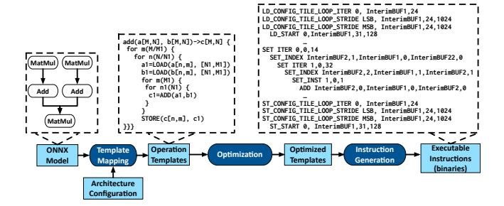

Figure 13. Compilation workflow.

Off-chip data movement instructions. TILE\_LD\_ST opcode describes the data tile transfer between off-chip memory and onchip memory of the Tandem Processor, Interim BUFs. The func1 field includes various functions: The LD/ST\_CONFIG\_BASE\_ADDR function is used to generate the base addresses of each tile. To configure the corresponding shapes and strides for each tile, the LD/ST\_CONFIG\_BASE\_LOOP\_ITER/STRIDE function is used. Also, LD/ST\_CONFIG\_TILE\_LOOP\_ITER/STRIDE functions are used to configure the Data Access Engine to generate the addresses required for each tile. Finally, LD/ST\_START function triggers the Data Access Engine to start populating/draining the intermediate buffers. The func2 field is used to identify the target buffer between Interim BUF 1&2.

# 6 Compilation for the Tandem Processor

Tiling optimization. Compiler realizes software-pipelining by choosing the optimized tiling strategy. To improve the Tandem Processor's utilization, the compiler does not tile the reduction dimensions in GEMM operations. otherwise, the GEMM Unit produces partial results that would be insufficient for the Tandem Processor to perform its operations, causing it to stall. Additionally, the compiler finds the optimal sizes for tiles that are big enough to encompass all the adjacent elements of an input tensor for the non-GEMM operation, while small enough to fit on the limited on-chip scratchpads. For instance, to perform Depth-wise Conv operation with a kernel size 5×5, it would require the Tandem Processor to have access to all the elements in the 5×5 patch or it is inevitable to stall.

Dependency relaxation. The Tandem Processor leverages the regularity in the non-GEMM operations and eliminates the dependency check in the hardware, while shifting the burden to the compiler. The Tandem Processor compiler leveragesloop fission [\[12\]](#page-14-29) to remove dependencies among series of instructions. Additionally, some non-GEMM operations such as MaxPool has a long sequence of dependencies among instructions. For such cases, the compiler leverages loop interchange [\[12\]](#page-14-29) to relax the dependencies.

Compilation workflow. Figure [13](#page-8-0) describes the compilation workflow for the Tandem Processor. The compiler uses the ONNX format of DNNs and the architecture configuration of the Tandem Processor (e.g. number of lanes, Interim BUF) as its inputs. The compiler maps the ONNX node to pre-defined operation templates. However, as discussed in Section [3.4,](#page-5-5) not all non-GEMM operators are directly supported by the Tandem Processor. Therefore, for such complex operations (e.g., Softmax, Sqrt, Gelu) the compiler translates them to an integer-based counterpart [\[5,](#page-14-28) [54\]](#page-15-29). After mapping

to the templates, the parameters of the operation templates are replaced with real values according to the ONNX layers. The compiler then performs the aforementioned optimizations. Finally, the compiler iterates the statements in the template and lowers them into instructions based on the Tandem Processor ISA.

LOAD and STORE statements are lowered to TILE\_LD\_ST with BASE\_LOOP\_ITER/STRIDE functions for each LOOP variables, to set the number of iterations and strides in DRAM (a summarized version is shown in Figure [13\)](#page-8-0). Then, the tile transfer instructions (LD/ST\_CONFIG\_TILE\_LOOP\_ITER/STRIDE) are generated using the tile shape in the LOAD and STORE statements. Compute operations are lowered to a set of inner LOOP instructions along with the pertinent compute instruction. For compute operations reading from Output BUF, the compiler generates additional synchronization instructions.

# 7 Evaluation Methodology

Benchmarks. To evaluate the efficacy of the Tandem Processor, we form our benchmark suite from domains of image classification (VGG-16 [\[97\]](#page-16-14), ResNet-50 [\[44\]](#page-15-24), MobileNetv2 [\[89\]](#page-16-22), Efficient-Net [\[104\]](#page-16-23)), object detection (Yolov3 [\[85\]](#page-16-21)), and emerging language models (BERT [\[26\]](#page-14-21), GPT-2 [\[83\]](#page-16-15)) with batch size 1 that is used for real-time AI [\[33\]](#page-14-9), single-stream, and offline scenarios [\[84\]](#page-16-31). These DNN benchmarks constitute a diverse set of layers with various dimensions and types of operations (e.g. Relu/LeakyRelu/Clip, Maxpool/GlobalAveragePool, Depth-wise convolution, Residual Add, ReduceMean, Exp, Transpose, etc.)

Hardware implementation and synthesis. We implement the Tandem Processor in Verilog and synthesize it using Synopsys Design Compiler R-2020.09-SP4 with Global Foundries 65 nm library. We also perform place and route using Synopsys IC Compiler L-2016.03-SP1. Additionally, we synthesize the Tandem Processor with FreePDK 15nm open cell library and meet the 1 Ghz target frequency. To obtain power of the design, we use the synthesis results in FreePDK 15 nm for logic cells and model the on-chip memory energy using CACTI-P [\[59\]](#page-15-31).

Simulation infrastructure. We develop a cycle-accurate simulator for the Tandem Processor that uses compiler generated instructions and provides cycle counts and energy statistics. We validate the functionality of the simulator and RTL implementation by comparing the simulator/RTL-generated outputs with ground truth software implementation. These validations also show the closeness of the number of cycles by error margin of ≤ 5%. For end-to-end results, following the methodologies of [\[37,](#page-14-23) [87,](#page-16-32) [88,](#page-16-13) [95\]](#page-16-3), we develop a cycle accurate simulator for a systolic array based GEMM Unit and integrate it with the Tandem Processor simulation infrastructure following the insights in Section [3.5.](#page-5-6)

Comparison to off-chip CPU fallback and dedicated units (Class (1) and (2) in Section [2.3\)](#page-3-3) We compare the NPU-Tandem with the configurations listed in Table [3](#page-9-1) to (1) a PCIe-attached (third generation with eight lanes) GEMM unit and an off-chip Intel Core i9-9980XE Extreme Edition CPU to support non-GEMM layers, (2) a GEMM unit augmented with a number of dedicated hardware blocks that support Relu, Clip, Residual Add, MaxPool, and scale & shift, similar to the design in [\[37\]](#page-14-23). This baseline still falls back to the CPU for unsupported layers. We measured the GEMM unit and dedicated units runtime using our aforementioned simulator and the CPU time using ONNX Runtime [\[25\]](#page-14-30). Finally, we measure the

Table 3. Microarchitectural configurations for the NPU-Tandem.

| Configs/Units | Systolic Array              | Tandem Processor         |
|---------------|-----------------------------|--------------------------|
| Dimensions    | 32×32                       | 32 Lane                  |
| Scratchpads   | 384 KB                      | 128 KB (Interim BUF 1&2) |
| Accumulators  | 128 KB                      | N/A                      |
| Datatypes     | INT8 (Mult) and INT32 (Acc) | INT32                    |
| Frequency     | 1 GHz                       | 1 GHz                    |

PCIe communication for all required data transfers in benchmarks using a Xilinx Alveo u280 FPGA connected to host CPU via PCIe. All baselines use the same frequency, number of PEs, and on-chip memories as in Table [3.](#page-9-1) For energy comparisons, we estimate the power of the GEMM unit using energy reports provided by prior works [\[30,](#page-14-31) [49\]](#page-15-22), and model the energy of PCIe transactions according to [\[14\]](#page-14-32).

Comparison to Gemmini [\[37\]](#page-14-23) (Class (3) in Section [2.3\)](#page-3-3). We compare the NPU-Tandem with Gemmini [\[37\]](#page-14-23) that integrates a systolic array, a set of peripheral dedicated units (similar to those mentioned above), and a single RISC-V CPU core. We use ONNX Runtime [\[25\]](#page-14-30) and cycle-accurate Firesim [\[52\]](#page-15-32) simulator to obtain performance numbers for Gemmini. For a fair comparison, we exclude all the runtime/OS-related overheads. Additionally, for an iso-resource comparison, we use a scaled up Gemmini that integrates the same number of cores as the number of ALU lanes in the Tandem Processor. To obtain the performance, we optimistically scale down the CPU runtime for Gemmini with the number of cores.

Comparison to Google's VPU (Class (4) in Section [2.3\)](#page-3-3). To eliminate the bias in comparisons due to the differences in the accelerators size, technology nodes, and the GEMM unit design and its optimizations, we model the behavior of Google's VPU within our simulation infrastructure according to Google's patent on VPU [\[58\]](#page-15-28). Concretely, we model the overheads of data communication (load/ store instructions) between the scratchpads and vector register files in addition to nested loop execution due to the lack of specialized support for them on VPU. We modeled the benefits of using special functions in VPU for computing operations such as square root and exponential. TPU overlaps the execution of GEMM unit and VPU by forwarding the GEMM outputs through FIFOs to the VPU's scratchpads. We modeled this overhead.

Comparisons to GPUs (Class (4) in Section [2.3\)](#page-3-3). We use NVIDIA's Jetson Xavier NX as a mobile GPU baseline and NVIDIA's RTX 2080 TI as a high-performance GPU baseline. We run all DNNs on GPU baselines using TensorRT v7.2.3. We also compare the performance of the NPU-Tandem to NVIDIA A100 GPU in an iso-TOPs (iso-resource) setting. We scale up both the GEMM (MAC units of GEMM unit) and non-GEMM (ALUs in the Tandem Processor) resources of the NPU-Tandem by 216× to match the TOPs of A100 for both GEMM and non-GEMM operations. As such, in this setting, both designs use the same amount of resources for GEMM and non-GEMM operations. We measure the runtime for A100 in two ways: (1) We use the TensorRT to obtain optimized end-to-end numbers for A100. However, TensorRT environment does not allow layerwise DNN execution profiling to get the statistics on the breakdown of runtime across GEMM and non-GEMM operations. As such, (2) we also use ONNX Runtime with CUDA Execution Provider for runtime measurement and layer-wise profiling. We compare the NPU-Tandem end-to-end runtime to both measurements and use

the CUDA-based results to further analyze the runtime based on its breakdown across GEMM and non-GEMM operations.

# 8 Experimental Results

### Comparisons to offchip CPU fallback and dedicated units.

Figure [14](#page-11-0) compares performance of the NPU-Tandem with baselines (1) using offchip CPU fallback and (2) using dedicated units. The results are normalized to the baseline (1). On average, the NPU-Tandem provides 3.5× and 2.7× speedup compared to baseline (1) and baseline (2), respectively. The Tandem Processor not only eliminates the overheads of communication with offchip over PCIe and improving resource utilization, it also minimizes the overheads of instruction orchestration and data access compared to the general purpose CPU. The improvements provided by the Tandem Processor are more pronounced for MobileNet-v2 (5.9× over baseline (1) and 5.4× over baseline (2)) and BERT (5.4× over baseline (1) and 4.5× over baseline (2)) due to the use of more complex non-GEMM operations in their structure (depth-wise convolution in MobileNetv2 and large number of mathematical and transpose operations in BERT) that significantly affect the total runtime. Figure [15](#page-11-0) compares the energy reduction benefits of Tandem Processor. On average, the NPU-Tandem reduces the total energy consumption by 39.2× and 20.6× compared to baseline (1) and baseline (2), respectively. These large improvements are due to the significant time that baselines (1) and (2) spend on the power-hungry off-chip CPU (as shown in Figure [3\)](#page-2-2) with a TDP of 165 Watts as opposed to 2.7 Watts in the Tandem Processor. The results show that generally as DNNs evolve and use more complex structures and non-GEMM operations, the benefits of the Tandem Processor grow.

Comparison to Gemmini. As Figure [16](#page-11-0) shows, on average, the NPU-Tandem provides 47.8× performance improvements. Figure [16](#page-11-0) also evaluates the improvements over an extended version of Gemmini that integrates the same number of RISC-V cores as the number of SIMD lanes in the Tandem Processor. On average, using multiple cores improves the performance of Gemmini by 8.0×. Compared to this design point, the NPU-Tandem provides 5.9× speedup, on average (with maximum of 35.3× for MobileNet-v2 and minimum of 0.9× for VGG-16).

To understand the sources of improvements, Figure [17](#page-11-1) shows the runtime breakdown of Gemmini (default setting of one RISC-V core) across its three main components of GEMM unit, dedicated units, and RISC-V core. For MobileNet-v2 and EfficientNet, Gemmini spends a large amount of time ( 90% of runtime) on its im2col dedicated unit to convert the depth-wise convolutions to a series of GEMM operations. This not only requires a time-consuming im2col operation, but also results in additional GEMM operations with low resource utilization. On the other hand, the Tandem Processor executes these operations natively and more efficiently without any need for im2col and overlaps them with other convolutions, as well. For YoloV3, BERT, and GPT-2 RISC-V core is the bottleneck. These DNNs require a significant number of complex mathematical operations such as Leaky ReLU in YoloV3 and GeLu, ReduceMean, Sqrt, Softmax, etc, in BERT and GPT-2, not supported by dedicated units. Note that, Gemmini uses one single RISC-V core (with 40% more area than the 32-lane Tandem Processor), which has one ALU to process all these operations on large tensors. For ResNet-50, still RISC-V core is the bottleneck, because of the last AveragePool layer (this layer takes the average of 7×7 feature maps for 2048

channels). In contrast, the Tandem Processor minimizes the cost of these operations and seeks to overlap them with GEMM ones. These results show that for DNNs with more complex non-GEMM layers, paying the cost of PCIe and using a high-performance offchip CPU (and dedicated units) provides better performance than an on-chip CPU in Gemmini.

Performance comparison to Google's TPU. Figure [18](#page-11-2) compares the end-to-end performance of the NPU-Tandem to a TPU-like design that leverages the general-purpose VPU for non-GEMM layers. According to the Google's patent on VPU [\[58\]](#page-15-28), we considered the following specializations for TPU: 1) strided address generation for LD/ST between DRAM and scratchpad, 2) strided address generation for LD/ST between scratchpad and vector register file, 3) software-pipelining of GEMM and non-GEMM through FIFOs, and 4) supporting specialized instructions for mathematical functions such as exp, sqrt, clip, etc.. As such, the benefits of Tandem Processor over VPU stem from 1) removing the vector register file and its LD/ST overheads, 2) supporting specialized nested loop execution, and 3) software-pipelining through reading from OBUF directly as opposed to FIFOs. On the other hand, supporting special functions in VPU can boost its performance over the NPU-Tandem. Figur[e18](#page-11-2) analyzes the impacts of these four design decisions individually. For each benchmark four bars are reported. The first bar shows the speedup achieved only by removing RegFile and its LD/ST overheads, the second shows the impact of specialized loop execution on top of the RegFile LD/ST, the third shows speedup when the benefits of OBUF data movement is also considered on top of two previous decisions, and finally the last bar includes the slowdown impact of not supporting specialized functions as well. In another word, the last bar includes the impacts of the four design decisions and is the final end-to-end speedup. On average, the NPU-Tandem offers 2.6× speedup. Among the four design decisions, supporting specialized loop execution in the Tandem Processor provides the maximum speedup, 2.1× on average. The benefits due to this design decision are more pronounced for MobileNet-v2 and EfficientNet with depth-wise convolution layers, an operation with five nested loops. The second most effective technique is eliminating the register file and its associated LD/ST operations from/to scratchpad, providing 1.4× speedup on average. GPT-2 enjoys the maximum benefits from this specialization with 2.9× speedup. Direct data access through OBUF in the Tandem Processor as opposed to moving data through FIFOs across GEMM unit and VPU, provides 1.1× speedup on average, while not having hardware support for special functions causes 0.8× slowdown on average. Having the hardware support and dedicated instructions for special functions provides maximum benefits for VPU for BERT and GPT-2, since complex mathematical operations such as sqrt and exp (for softmax) are heavily used in their structure. Note that this speedup comes at the cost of extra area and design complexity for VPU which its quantification would require access to the exact hardware implementation that is not publicly available. Overall considering the impact of four design decisions, MobileNet-v2, EfficientNet, and GPT-2 show the most benefits for NPU-Tandem, while VGG-16 showing the least. Energy comparison to Google's TPU. Figure [19](#page-11-3) shows the end-toend energy reduction achieved by the NPU-Tandem over TPU+VPU while analyzing the impact of the aforementioned design decisions individually. On average, the NPU-Tandem provides 1.4× energy re-

duction. Among the benchmarks the benefits are more pronounced

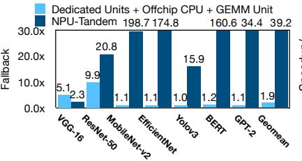

**Figure 14.** Performance comparison to offchip CPU fallback and dedicated units.

Figure 15. Energy reduction comparison.

Figure 16. Comparison with Gemmini [37].

RTX 2080 TI NPU-Tandem

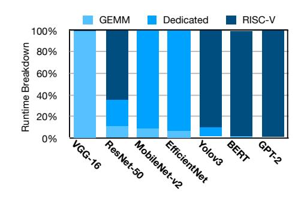

Figure 17. Gemmini time breakdown.

Figure 20. Comparisons to Jetson Xavier and RTX 2080-TI GPUs.

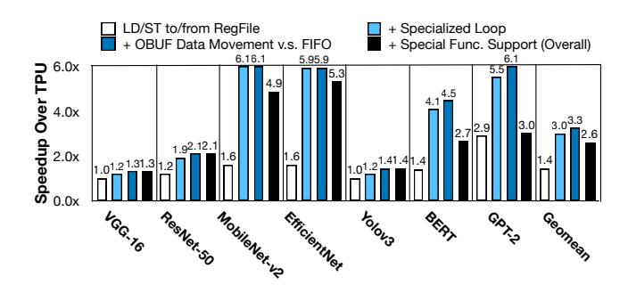

**Figure 18.** Performance comparison to TPU+VPU and analyzing the contribution of each Tandem Processor's specialization.

**Figure 19.** Energy reduction over TPU+VPU and analyzing the contribution of each Tandem Processor's specialization.

for MobileNet-v2, EfficientNet, and GPT-2 (2.0×, 1.8×, and 1.7×, respectively), while VGG-16 and Yolov3 observes the minimum benefits (1.1×). Eliminating the RegFile and its LD/ST overheads provides the maximum energy reduction with the average of 1.2×. Specialized support for nested loop is the second most effective

technique. Although specialized loop management provides significant speedups, its energy benefits are less pronounced due to their amortization across the SIMD lanes of the VPU. Support for specialized functions in VPU realizes 7% lower energy for TPU, on average, by replacing several primitive operations with a single yet more complex instruction.

Comparison to Jetson Xavier and RTX 2080 TI GPUs. Figure 20 compares the performance-per-Watt benefits with Jetson Xavier NX and RTX 2080 TI GPUs, where the results are normalized to Jetson Xavier. RTX 2080 TI is less energy-efficient compared to mobile Jetson Xavier (20% lower on average). However, the NPU-Tandem provides 4.8× improvements, compared to Jetson Xavier. The trends in the results remain almost similar to the previous analyses with MobileNet-v2 exhibiting the maximum benefits. RTX 2080 TI is more efficient than Jetson Xavier for MobileNet-v2 and EfficientNet, because it can better parallelize the depth-wise convolutions across its abundant threads, compared to Jetson Xavier that employs relatively less number of threads.

Comparison to the A100 GPU. Figure 21 compares the end-to-end speedup of the NPU-Tandem to the A100 GPU with TensorRT and CUDA execution in an iso-TOPs setting. On average, the NPU-Tandem offers similar performance to A100 GPU with TensorRT execution (2.5% improvements) and 4.0× speedup compared to the A100 with CUDA execution. The NPU-Tandem outperforms A100 with TensorRT for ResNet-50, MobileNet, EfficientNet, BERT, and GPT-2, while A100 providing better performance for VGG-16 and Yolov3 that are mainly composed of heavy GEMM operations. Compared to A100 with CUDA execution, the NPU-Tandem provides maximum benefits for MobileNet-v2 and BERT.

Figure 22 shows the runtime breakdown across GEMM and non-GEMM operations for the NPU-Tandem and A100 GPU with CUDA

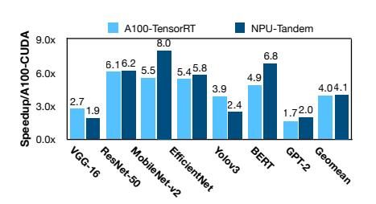

**Figure 21.** Performance comparison to A100 with CUDA and TensorRT execution, in iso-TOPs setting. Results are normalized to CUDA execution.

**Figure 22.** Runtime breakdown analysis for the scaled-up Tandem Processor and A100 GPU with CUDA execution in iso-TOPs setting.

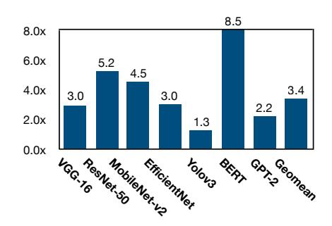

**Figure 23.** NPU-Tandem speedup for non-GEMM operations over A100 in iso-TOPs setting.

execution. The NPU-Tandem accelerates both GEMM and non-GEMM operations compared to A100 with CUDA execution. However, for DNNs that have larger portion of non-GEMM runtime on A100 (e.g., MobileNet, EfficientNet, BERT, and GPT-2), NPU-Tandem provides larger end-to-end speedups, demystifying the impact of accelerating the non-GEMM operations using the Tandem Processor. This trend in speedups still holds while comparing to TensorRT as well, since the benchmarks mentioned above are those with the largest speedups by the NPU-Tandem with respect to this mode of execution (see Figure 21).

Figure 23 compares the performance of the Tandem Processor to A100 CUDA Cores for performing only non-GEMM operations in an iso-TOPs/resources setting. The Tandem Processor accelerates the non-GEMM operations for all benchmarks and on average provides 3.4× speedup compared to A100 CUDA Cores. The benefits are more pronounced for BERT (8.0×), ResNet-50 (5.2×), and MobileNet-v2 (4.5×). Although GPT-2 comprise a large portion of non-GEMMs similar to BERT, the performance of scaled-up Tandem Processor is mainly bounded by the memory bandwidth for this DNN and hence showing relatively lower speedup compared to BERT.

Runtime breakdown analysis for the Tandem Processor. Figure 24 shows the runtime breakdown of the NPU-Tandem across GEMM and various non-GEMM layers. As the result show, non-GEMM layers are very diverse in terms of execution runtime. The proposed specializations in the Tandem Processor significantly reduce the overhead of non-GEMM layers in DNNs such as VGG-16, ResNet-50, and Yolov3. On the other hand, some DNN layers such as depthwise convolution in MobileNet-v2 and EfficientNet, GELU and transpose in BERT, and ReduceMean in GPT-2 still take a significant portion of runtime. Compared to the baselines, GEMM layers only become a more significant runtime component, when the highly specialized Tandem Processor is used to reduce the overheads of non-GEMM layers.

Energy breakdown analysis for the Tandem Processor. Figure 25 shows the energy breakdown of the Tandem Processor across off-chip memory accesses, on-chip memory (Interim BUF) accesses, ALU logic, loop + address calculation logic, and the rest of the Tandem Processor logic (decode, muxing logic, etc.) Although non-GEMM layers are memory bound operations, but off-chip memory accesses take about only 31% of the total energy on average, due to the seamless integration of Tandem Processor and the GEMM unit which minimizes the number of off-chip data transfer. The

on-chip memory accesses take 13% of the total energy, on average, due to removing overheads of register files and associated memory hierarchy from the design. ALU logic takes 12% of the total energy because of leveraging integer primitive implementation philosophy in its design. Overall, the nested loop execution control and scratchpad address calculation logic takes the majority of the energy consumption in the Tandem Processor (40%), since they handle the heavy lifting portion of the overall execution.

**The Tandem Processor layout.** Fig. 26(a) shows the layout of the Tandem Processor. Fig. 26(b) shows the post-layout area breakdown. ALU logic occupies the largest area (56.6%), Interim BUF 1 & 2 is the second (29.2%) and the permute logic is the third (12.0%). The rest of the area is mainly for muxing logic, pipeline registers, Code Repeater and decode logic.

## 9 Related Work

Section 2.3 covers the related work on supporting non-GEMM layers. Below, we discuss the prior work on SIMD/vector units.

Designing general-purpose SIMD units, vector ISA extensions, and compilation for them have been largely explored in academia [21, 29, 34, 55, 64, 71, 73, 109, 110] and industry products such as Intel AVX-512 [2], ARM SVE [1], RISC-V vector extensions [4], and etc.. Digital Signal Processors (DSPs) [20, 23, 66, 74, 103, 106, 116] are more specialized SIMD units that often come with VLIW architectures. Qualcomm Hexagon DSP [20] and MediaBreeze DSP [103] provide hardware-managed loop executions that work with their register file/FIFOs. MediaBreeze [103] also leverages a decoupled access-execute architecture to handle address generation for streams of data, which are fed into SIMD ALUs through FIFOs. ARM Helium [116] incorporates a set of DSP extensions such as low-overhead branch and scatter-store/gather-load instructions. In contrast, our design completely departures from register-file-memory semantics. This fundamental design choice enables Tandem Processor to eliminate explicit address calculations that are conventionally carried over registers and replace them with a customized loop logic. Additionally, the front-end of the pipeline in Tandem Processor handles memory access while in conventional designs this is normally in the back-end stages. This is also different from the prior SIMD units with Access-Execute architectures (e.g. MediaBreeze) that pass data to the execute units through FIFOs. In Tandem Processor, Access and Execute are part of the same pipeline and there are no FIFOs.

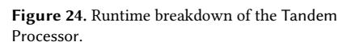

**Figure 25.** Energy breakdown of the Tandem Processor

**Figure 26.** (a) Tandem Processor layout and (b) area breakdown in 65nm node.

Finally, the combination of not using register files/FIFOs with the loop logic is a new design feature in Tandem Processor.

### 10 Conclusion

The increasing prevalence of neural networks and advancements in language models prompt a reevaluation of neural accelerator design. In the last ten years, the research community has primarily concentrated on GEMM operations while overlooking non-GEMM operations. This has created a misconception that neural networks are solely composed of matrix multiplications. Furthermore, as deep learning has evolved and entered new domains, the non-GEMM operations have diversified and been interwoven in various structural patterns within neural networks. As such, to run neural networks end-to-end, there has been a need to consider non-GEMM layers as a first class citizen. To address this timely need, this paper proposes the Tandem Processor that brings forth a novel architecture along with a compiler and an innovative programmable ISA. Moreover, this architecture, which is the result of 10 years of research in building NPUs also enables adapting to the volatile landscape of deep learning algorithms. The Tandem Processor has become the heart of our open-source GeneSys project, a parametrizable NPU generator with a full-stack, multi-target compilation stack that goes from

Python to accelerated execution of LLMs and other DNNs. GeneSys provides comprehensive NPU solutions for applications ranging from high-end datacenters to ultra-low-power brain-implantable devices and is publicly available at https://actlab-genesys.github.io/.

# Acknowledgments

We thank Hyoukjun Kwon for shepherding our paper. This work was in part supported by generous gifts from Google, Samsung, Qualcomm, Microsoft, AMD Xilinx as well as the National Science Foundation (NSF) awards CCF#2107598, CNS#1822273, Defense Advanced Research Project Agency (DARPA) under agreement number #HR0011-18-C-0020, National Institute of Health (NIH) award #R01EB028350, and Semiconductor Research Corporation (SRC) award #2021-AH-3039. The U.S. Government is authorized to reproduce and distribute reprints for Governmental purposes not withstanding any copyright notation thereon. The views and conclusions contained herein are those of the authors and should not be interpreted as necessarily representing the official policies or endorsements, either expressed or implied of Google, Qualcomm, Microsoft, Xilinx, Samsung, NSF, SRC, NIH, DARPA or the U.S. Government. Soroush Ghodrati was partly supported by a Google PhD Fellowship.

# References

- [1] Arm scalable vector extension (sve). [https://developer.arm.com/](https://developer.arm.com/documentation/102476/0100) [documentation/102476/0100](https://developer.arm.com/documentation/102476/0100).
- [2] Intel advanced vector extensions (avx). [https://www.intel.](https://www.intel.com/content/www/us/en/architecture-and-technology/avx-512-overview.html) [com/content/www/us/en/architecture-and-technology/avx-512](https://www.intel.com/content/www/us/en/architecture-and-technology/avx-512-overview.html) [overview.html](https://www.intel.com/content/www/us/en/architecture-and-technology/avx-512-overview.html).
- [3] Nvdla. <http://nvdla.org/index.html>.
- [4] Risc-v vector extensions. [https://github.com/riscv/riscv-v-spec/blob/](https://github.com/riscv/riscv-v-spec/blob/master/v-spec.adoc) [master/v-spec.adoc](https://github.com/riscv/riscv-v-spec/blob/master/v-spec.adoc).
- [5] gemmlowp: a small self-contained low-precision gemm library, 2022. <https://github.com/google/gemmlowp>.
- [6] M. Abadi et al. TensorFlow: A system for large-scale machine learning. OSDI, 2016.
- [7] Adobe. Your imagination's new best friend. [https://www.adobe.com/](https://www.adobe.com/products/firefly.html) [products/firefly.html](https://www.adobe.com/products/firefly.html), 2023.
- [8] Vahide Aklaghi, Amir Yazdanbakhsh, Kambiz Samadi, Hadi Esmaeilzadeh, and Rajesh K. Gupta. Snapea: Predictive early activation for reducing computation in deep convolutional neural networks. In ISCA, 2018.
- [9] Jorge Albericio, Alberto Delmás, Patrick Judd, Sayeh Sharify, Gerard O'Leary, Roman Genov, and Andreas Moshovos. Bit-pragmatic deep neural network computing. In MICRO, 2017.
- [10] Jorge Albericio, Patrick Judd, Tayler Hetherington, Tor Aamodt, Natalie Enright Jerger, and Andreas Moshovos. Cnvlutin: ineffectualneuron-free deep neural network computing. In ISCA, 2016.
- [11] Aayush Ankit, Izzat El Hajj, Sai Rahul Chalamalasetti, Geoffrey Ndu, Martin Foltin, R Stanley Williams, Paolo Faraboschi, Wen-mei W Hwu, John Paul Strachan, Kaushik Roy, et al. Puma: A programmable ultra-efficient memristor-based accelerator for machine learning inference. In ASPLOS, 2019.
- [12] Andrew W. Appel. Modern Compiler Implementation in ML: Basic Techniques. Cambridge University Press, 1997.
- [13] Daniel Bankman, Lita Yang, Bert Moons, Marian Verhelst, and Boris Murmann. An always-on 3.8 j/86% cifar-10 mixed-signal binary cnn processor with all memory on chip in 28nm cmos. In ISSCC, 2018.
- [14] Noah Beck, Sean White, Milam Paraschou, and Samuel Naffziger. 'zeppelin': An soc for multichip architectures. In ISSCC, 2018.
- [15] Tianqi Chen, Thierry Moreau, Ziheng Jiang, Lianmin Zheng, Eddie Yan, Haichen Shen, Meghan Cowan, Leyuan Wang, Yuwei Hu, Luis Ceze, et al. TVM: An Automated End-to-End Optimizing Compiler for Deep Learning. In OSDI, 2018.
- [16] Yu-Hsin Chen, Joel Emer, and Vivienne Sze. Eyeriss: A spatial architecture for energy-efficient dataflow for convolutional neural networks. In ISCA, 2016.
- [17] Yu-Hsin Chen, Tien-Ju Yang, Joel Emer, and Vivienne Sze. Eyeriss v2: A flexible accelerator for emerging deep neural networks on mobile devices. JETCAS, 2019.
- [18] Yunji Chen, Tao Luo, Shaoli Liu, Shijin Zhang, Liqiang He, Jia Wang, Ling Li, Tianshi Chen, Zhiwei Xu, Ninghui Sun, et al. Dadiannao: A machine-learning supercomputer. In MICRO, 2014.
- [19] Ping Chi, Shuangchen Li, Cong Xu, Tao Zhang, Jishen Zhao, Yongpan Liu, Yu Wang, and Yuan Xie. Prime: A novel processing-in-memory architecture for neural network computation in reram-based main memory. In ISCA, 2016.
- [20] Lucian Codrescu, Willie Anderson, Suresh Venkumanhanti, Mao Zeng, Erich Plondke, Chris Koob, Ajay Ingle, Charles Tabony, and Rick Maule. Hexagon dsp: An architecture optimized for mobile multimedia and communications. IEEE Micro, 34(2):34–43, 2014.
- [21] A. Danysh and D. Tan. Architecture and implementation of a vector/simd multiply-accumulate unit. IEEE Transactions on Computers, 54(3):284–293, 2005.
- [22] Alberto Delmas Lascorz, Patrick Judd, Dylan Malone Stuart, Zissis Poulos, Mostafa Mahmoud, Sayeh Sharify, Milos Nikolic, Kevin Siu, and Andreas Moshovos. Bit-tactical: A software/hardware approach

- to exploiting value and bit sparsity in neural networks. In ASPLOS, 2019.
- [23] Jeff H Derby and Jaime H Moreno. A high-performance embedded dsp core with novel simd features. In 2003 IEEE International Conference on Acoustics, Speech, and Signal Processing, 2003. Proceedings.(ICASSP'03)., volume 2, pages II–301. IEEE, 2003.
- [24] Designs.ai. Ai-powered text-to-video - turn text into stunning videos. <https://designs.ai/>, 2023.
- [25] ONNX Runtime developers. ONNX Runtime, 11 2018.
- [26] Jacob Devlin, Ming-Wei Chang, Kenton Lee, and Kristina Toutanova. Bert: Pre-training of deep bidirectional transformers for language understanding. arXiv, 2018.
- [27] Caiwen Ding, Siyu Liao, Yanzhi Wang, Zhe Li, Ning Liu, Youwei Zhuo, Chao Wang, Xuehai Qian, Yu Bai, Geng Yuan, et al. Circnn: accelerating and compressing deep neural networks using blockcirculant weight matrices. In MICRO, 2017.
- [28] Charles Eckert, Xiaowei Wang, Jingcheng Wang, Arun Subramaniyan, Ravi Iyer, Dennis Sylvester, David Blaaauw, and Reetuparna Das. Neural cache: Bit-serial in-cache acceleration of deep neural networks. In ISCA, 2018.
- [29] Alexandre E Eichenberger, Peng Wu, and Kevin O'brien. Vectorization for simd architectures with alignment constraints. Acm sigplan notices, 39(6):82–93, 2004.
- [30] Hadi Esmaeilzadeh, Emily Blem, Renee St. Amant, Karthikeyan Sankaralingam, and Doug Burger. Dark silicon and the end of multicore scaling. In ISCA, 2011.
- [31] Hadi Esmaeilzadeh, Adrian Sampson, Luis Ceze, and Doug Burger. Neural acceleration for general-purpose approximate programs. In MICRO, 2012.
- [32] Amin Firoozshahian, Joel Coburn, Roman Levenstein, Rakesh Nattoji, Ashwin Kamath, Olivia Wu, Gurdeepak Grewal, Harish Aepala, Bhasker Jakka, Bob Dreyer, et al. Mtia: First generation silicon targeting meta's recommendation systems. In Proceedings of the 50th Annual International Symposium on Computer Architecture, pages 1–13, 2023.
- [33] Jeremy Fowers, Kalin Ovtcharov, Michael Papamichael, Todd Massengill, Ming Liu, Daniel Lo, Shlomi Alkalay, Michael Haselman, Logan Adams, Mahdi Ghandi, et al. A configurable cloud-scale dnn processor for real-time ai. In ISCA, 2018.
- [34] Franz Franchetti, Stefan Kral, Juergen Lorenz, and Christoph W Ueberhuber. Efficient utilization of simd extensions. Proceedings of the IEEE, 93(2):409–425, 2005.
- [35] Mingyu Gao, Jing Pu, Xuan Yang, Mark Horowitz, and Christos Kozyrakis. Tetris: Scalable and efficient neural network acceleration with 3d memory. In ASPLOS, 2017.
- [36] Mingyu Gao, Xuan Yang, Jing Pu, Mark Horowitz, and Christos Kozyrakis. Tangram: Optimized coarse-grained dataflow for scalable nn accelerators. In ASPLOS, 2019.
- [37] Hasan Genc, Seah Kim, Alon Amid, Ameer Haj-Ali, Vighnesh Iyer, Pranav Prakash, Jerry Zhao, Daniel Grubb, Harrison Liew, Howard Mao, et al. Gemmini: Enabling systematic deep-learning architecture evaluation via full-stack integration. In DAC, 2021.
- [38] Soroush Ghodrati, Byung Hoon Ahn, Joon Kyung Kim, Sean Kinzer, Brahmendra Reddy Yatham, Navateja Alla, Hardik Sharma, Mohammad Alian, Eiman Ebrahimi, Nam Sung Kim, Cliff Young, and Hadi Esmaeilzadeh. Planaria: Dynamic Architecture Fission for Spatial Multi-Tenant Acceleration of Deep Neural Networks. In MICRO, 2020.
- [39] Soroush Ghodrati, Hardik Sharma, Sean Kinzer, Amir Yazdanbakhsh, Jongse Park, Nam Sung Kim, Doug Burger, and Hadi Esmaeilzadeh. Mixed-signal charge-domain acceleration of deep neural networks through interleaved bit-partitioned arithmetic. In PACT, 2020.
- [40] Soroush Ghodrati, Hardik Sharma, Cliff Young, Nam Sung Kim, and Hadi Esmaeilzadeh. Bit-parallel vector composability for neural acceleration. In DAC, 2020.

- [41] Google. Bard: A conversational ai tool by google. [https://bard.google.](https://bard.google.com) [com](https://bard.google.com), 2023.
- [42] Tae Jun Ham, Sung Jun Jung, Seonghak Kim, Young H Oh, Yeonhong Park, Yoonho Song, Jung-Hun Park, Sanghee Lee, Kyoung Park, Jae W Lee, et al. Aˆ 3: Accelerating attention mechanisms in neural networks with approximation. In HPCA, 2020.
- [43] Song Han, Xingyu Liu, Huizi Mao, Jing Pu, Ardavan Pedram, Mark A Horowitz, and William J Dally. Eie: efficient inference engine on compressed deep neural network. In ISCA, 2016.
- [44] Kaiming He, Xiangyu Zhang, Shaoqing Ren, and Jian Sun. Deep residual learning for image recognition. In CVPR, 2016.
- [45] Kartik Hegde, Rohit Agrawal, Yulun Yao, and Christopher W Fletcher. Morph: Flexible acceleration for 3d cnn-based video understanding. In MICRO, 2018.
- [46] Kartik Hegde, Jiyong Yu, Rohit Agrawal, Mengjia Yan, Michael Pellauer, and Christopher W Fletcher. Ucnn: Exploiting computational reuse in deep neural networks via weight repetition. arXiv, 2018.
- [47] Mohsen Imani, Saransh Gupta, Yeseong Kim, and Tajana Rosing. Floatpim: In-memory acceleration of deep neural network training with high precision. In ISCA, 2019.
- [48] Benoit Jacob, Skirmantas Kligys, Bo Chen, Menglong Zhu, Matthew Tang, Andrew Howard, Hartwig Adam, and Dmitry Kalenichenko. Quantization and training of neural networks for efficient integerarithmetic-only inference. In Proceedings of the IEEE conference on computer vision and pattern recognition, pages 2704–2713, 2018.
- [49] Norman P Jouppi, Doe Hyun Yoon, Matthew Ashcraft, Mark Gottscho, Thomas B Jablin, George Kurian, James Laudon, Sheng Li, Peter Ma, Xiaoyu Ma, et al. Ten lessons from three generations shaped google's tpuv4i: Industrial product. In ISCA, 2021.
- [50] Norman P Jouppi, Cliff Young, Nishant Patil, David Patterson, Gaurav Agrawal, Raminder Bajwa, Sarah Bates, Suresh Bhatia, Nan Boden, Al Borchers, et al. In-datacenter performance analysis of a tensor processing unit. In ISCA, 2017.
- [51] Patrick Judd, Jorge Albericio, Tayler Hetherington, Tor M Aamodt, and Andreas Moshovos. Stripes: Bit-serial deep neural network computing. In MICRO, 2016.
- [52] Sagar Karandikar, Howard Mao, Donggyu Kim, David Biancolin, Alon Amid, Dayeol Lee, Nathan Pemberton, Emmanuel Amaro, Colin Schmidt, Aditya Chopra, et al. Firesim: Fpga-accelerated cycle-exact scale-out system simulation in the public cloud. In ISCA, 2018.
- [53] Duckhwan Kim, Jaeha Kung, Sek Chai, Sudhakar Yalamanchili, and Saibal Mukhopadhyay. Neurocube: A programmable digital neuromorphic architecture with high-density 3d memory. In ISCA, 2016.
- [54] Sehoon Kim, Amir Gholami, Zhewei Yao, Michael W Mahoney, and Kurt Keutzer. I-bert: Integer-only bert quantization. In ICML, 2021.
- [55] Moritz Kreutzer, Georg Hager, Gerhard Wellein, Holger Fehske, and Alan R Bishop. A unified sparse matrix data format for efficient general sparse matrix-vector multiplication on modern processors with wide simd units. SIAM Journal on Scientific Computing, 36(5):C401– C423, 2014.
- [56] HT Kung, Bradley McDanel, and Sai Qian Zhang. Packing sparse convolutional neural networks for efficient systolic array implementations: Column combining under joint optimization. In ASPLOS, 2019.
- [57] Hyoukjun Kwon, Ananda Samajdar, and Tushar Krishna. Maeri: Enabling flexible dataflow mapping over dnn accelerators via reconfigurable interconnects. ASPLOS, 2018.
- [58] William Lacy, Gregory Michael Thorson, Christopher Aaron Clark, Norman Paul Jouppi, Thomas Norrie, and Andrew Everett Phelps. Vector Processing Unit. U.S Patent 11520581, 2022.
- [59] S. Li, K. Chen, J. H. Ahn, J. B. Brockman, and N. P. Jouppi. CACTI-P: Architecture-level Modeling for SRAM-based Structures with Advanced Leakage Reduction Techniques. In ICCAD, 2011.
- [60] Zheng Li, Soroush Ghodrati, Amir Yazdanbakhsh, Hadi Esmaeilzadeh, and Mingu Kang. Accelerating Attention through Gradient-Based Learned Runtime Pruning. In ISCA, 2022.

- [61] Robert LiKamWa, Yunhui Hou, Julian Gao, Mia Polansky, and Lin Zhong. Redeye: analog convnet image sensor architecture for continuous mobile vision. In ISCA, 2016.
- [62] Wenyan Lu, Guihai Yan, Jiajun Li, Shijun Gong, Yinhe Han, and Xiaowei Li. Flexflow: A flexible dataflow accelerator architecture for convolutional neural networks. In HPCA, 2017.
- [63] Rohan Mahapatra, Soroush Ghodrati, Byung Hoon Ahn, Sean Kinzer, Shu ting Wang, Hanyang Xu, Lavanya Karthikeyan, Hardik Sharma, Amir Yazdanbakhsh, Mohammad Alian, and Hadi Esmaeilzadeh. Instorage domain-specific acceleration for serverless computing. ASP-LOS, 2024.
- [64] Basil Sh. Mahmood and Mamoon A. Al Jbaar. Design and implementation of simd vector processor on fpga. In International Symposium on Innovations in Information and Communications Technology, pages 124–130, 2011.
- [65] Mostafa Mahmoud, Kevin Siu, and Andreas Moshovos. Diffy: A déjà vu-free differential deep neural network accelerator. In MICRO, 2018.
- [66] E Matus, Hendrik Seidel, Torsten Limberg, Pablo Robelly, and G Fettweis. A gflops vector-dsp for broadband wireless applications. In IEEE Custom Integrated Circuits Conference 2006, pages 543–546. IEEE, 2006.
- [67] Meta. Introducing audiocraft: A generative ai tool for audio and music. [https://about.fb.com/news/2023/08/audiocraft-generative-ai](https://about.fb.com/news/2023/08/audiocraft-generative-ai-for-music-and-audio/)[for-music-and-audio/](https://about.fb.com/news/2023/08/audiocraft-generative-ai-for-music-and-audio/), 2023.
- [68] Microsoft. Github copilot: Your ai pair programmer. [https://github.](https://github.com/features/copilot) [com/features/copilot](https://github.com/features/copilot), 2023.
- [69] Microsoft. Reinventing search with a new ai-powered microsoft bing and edge, your copilot for the web. [https://blogs.microsoft.com/blog/](https://blogs.microsoft.com/blog/2023/02/07/reinventing-search-with-a-new-ai-powered-microsoft-bing-and-edge-your-copilot-for-the-web/) [2023/02/07/reinventing-search-with-a-new-ai-powered-microsoft](https://blogs.microsoft.com/blog/2023/02/07/reinventing-search-with-a-new-ai-powered-microsoft-bing-and-edge-your-copilot-for-the-web/)[bing-and-edge-your-copilot-for-the-web/](https://blogs.microsoft.com/blog/2023/02/07/reinventing-search-with-a-new-ai-powered-microsoft-bing-and-edge-your-copilot-for-the-web/), 2023.
- [70] Facebook Research Microsoft. Onnx: an open format to represent deep learning models. <http://onnx.ai/>, 2017.
- [71] Gaurav Mitra, Beau Johnston, Alistair P Rendell, Eric McCreath, and Jun Zhou. Use of simd vector operations to accelerate application code performance on low-powered arm and intel platforms. In 2013 IEEE International Symposium on Parallel & Distributed Processing, Workshops and Phd Forum, pages 1107–1116. IEEE, 2013.
- [72] Bert Moons, Roel Uytterhoeven, Wim Dehaene, and Marian Verhelst. DVAFS: Trading Computational Accuracy for Energy Through Dynamic-Voltage-Accuracy-Frequency-Scaling. In DATE, 2017.
- [73] Amir Morad, Leonid Yavits, and Ran Ginosar. Gp-simd processingin-memory. ACM Transactions on Architecture and Code Optimization (TACO), 11(4):1–26, 2015.
- [74] Huy Nguyen and Lizy Kurian John. Exploiting simd parallelism in dsp and multimedia algorithms using the altivec technology. In Proceedings of the 13th international conference on Supercomputing, pages 11–20, 1999.
- [75] Wei Niu, Jiexiong Guan, Yanzhi Wang, Gagan Agrawal, and Bin Ren. Dnnfusion: accelerating deep neural networks execution with advanced operator fusion. In PLDI, 2021.
- [76] NVIDIA. Nvidia turing architecture in-depth. [https://developer.nvidia.](https://developer.nvidia.com/blog/nvidia-turing-architecture-in-depth/) [com/blog/nvidia-turing-architecture-in-depth/](https://developer.nvidia.com/blog/nvidia-turing-architecture-in-depth/), 2022.
- [77] OpenAI. Chatgpt. <https://chat.openai.com>, 2023.
- [78] Angshuman Parashar, Minsoo Rhu, Anurag Mukkara, Antonio Puglielli, Rangharajan Venkatesan, Brucek Khailany, Joel Emer, Stephen W Keckler, and William J Dally. SCNN: An Accelerator for Compressed-sparse Convolutional Neural Networks. In ISCA, 2017.
- [79] Eunhyeok Park, Dongyoung Kim, and Sungjoo Yoo. Energy-Efficient Neural Network Accelerator Based on Outlier-Aware Low-Precision Computation. In ISCA, 2018.
- [80] A. Paszke et al. PyTorch: An imperative style, high-performance deep learning library. NeurIPS, 2019.

- [81] Michael Pellauer, Yakun Sophia Shao, Jason Clemons, Neal Crago, Kartik Hegde, Rangharajan Venkatesan, Stephen W Keckler, Christopher W Fletcher, and Joel Emer. Buffets: An efficient and composable storage idiom for explicit decoupled data orchestration. In Proceedings of the Twenty-Fourth International Conference on Architectural Support for Programming Languages and Operating Systems, pages 137–151, 2019.
- [82] Eric Qin, Ananda Samajdar, Hyoukjun Kwon, Vineet Nadella, Sudarshan Srinivasan, Dipankar Das, Bharat Kaul, and Tushar Krishna. Sigma: A sparse and irregular gemm accelerator with flexible interconnects for dnn training. HPCA, 2020.
- [83] Alec Radford, Jeffrey Wu, Rewon Child, David Luan, Dario Amodei, Ilya Sutskever, et al. Language Models are Unsupervised Multitask Learners. OpenAI blog, 2019.
- [84] Vijay Janapa Reddi, Christine Cheng, David Kanter, Peter Mattson, Guenther Schmuelling, Carole-Jean Wu, Brian Anderson, Maximilien Breughe, Mark Charlebois, William Chou, et al. Mlperf inference benchmark. arxiv, 2019.
- [85] Joseph Redmon and Ali Farhadi. Yolov3: An incremental improvement. arXiv, 2018.
- [86] Sungju Ryu, Hyungjun Kim, Wooseok Yi, and Jae-Joon Kim. Bitblade: Area and energy-efficient precision-scalable neural network accelerator with bitwise summation. In DAC, 2019.
- [87] Ananda Samajdar, Jan Moritz Joseph, Yuhao Zhu, Paul Whatmough, Matthew Mattina, and Tushar Krishna. A systematic methodology for characterizing scalability of dnn accelerators using scale-sim. In ISPASS, 2020.
- [88] Ananda Samajdar, Yuhao Zhu, Paul Whatmough, Matthew Mattina, and Tushar Krishna. Scale-sim: Systolic cnn accelerator simulator. arXiv, 2018.
- [89] Mark Sandler, Andrew Howard, Menglong Zhu, Andrey Zhmoginov, and Liang-Chieh Chen. Mobilenetv2: Inverted residuals and linear bottlenecks. In CVPR, 2018.
- [90] Ali Shafiee, Anirban Nag, Naveen Muralimanohar, Rajeev Balasubramonian, John Paul Strachan, Miao Hu, R Stanley Williams, and Vivek Srikumar. Isaac: A convolutional neural network accelerator with in-situ analog arithmetic in crossbars. In ISCA, 2016.
- [91] Yakun Sophia Shao, Jason Clemons, Rangharajan Venkatesan, Brian Zimmer, Matthew Fojtik, Nan Jiang, Ben Keller, Alicia Klinefelter, Nathaniel Pinckney, Priyanka Raina, et al. Simba: Scaling deeplearning inference with multi-chip-module-based architecture. In MICRO, 2019.
- [92] Sayeh Sharify, Alberto Delmas Lascorz, Mostafa Mahmoud, Milos Nikolic, Kevin Siu, Dylan Malone Stuart, Zissis Poulos, and Andreas Moshovos. Laconic deep learning inference acceleration. In ISCA, 2019.
- [93] Sayeh Sharify, Alberto Delmas Lascorz, Kevin Siu, Patrick Judd, and Andreas Moshovos. Loom: Exploiting weight and activation precisions to accelerate convolutional neural networks. In DAC, 2018.
- [94] Hardik Sharma, Jongse Park, Divya Mahajan, Emmanuel Amaro, Joon Kim, Chenkai Shao, Asit Misra, and Hadi Esmaeilzadeh. From high-level deep neural models to fpgas. In MICRO, 2016.
- [95] Hardik Sharma, Jongse Park, Naveen Suda, Liangzhen Lai, Benson Chau, Vikas Chandra, and Hadi Esmaeilzadeh. Bit fusion: Bit-level dynamically composable architecture for accelerating deep neural networks. ISCA, 2018.
- [96] SiFIve. Introduction to the sifive intelligence x280. [https://www.sifive.](https://www.sifive.com/blog/introduction-to-the-sifive-intelligence-x280) [com/blog/introduction-to-the-sifive-intelligence-x280](https://www.sifive.com/blog/introduction-to-the-sifive-intelligence-x280), 2022.
- [97] Karen Simonyan and Andrew Zisserman. Very deep convolutional networks for large-scale image recognition. arXiv, 2014.
- [98] Linghao Song, Xuehai Qian, Hai Li, and Yiran Chen. Pipelayer: A pipelined reram-based accelerator for deep learning. In HPCA, 2017.
- [99] Mingcong Song, Jiechen Zhao, Yang Hu, Jiaqi Zhang, and Tao Li. Prediction based execution on deep neural networks. In ISCA, 2018.

- [100] Nitish Srivastava, Hanchen Jin, Jie Liu, David Albonesi, and Zhiru Zhang. Matraptor: A sparse-sparse matrix multiplication accelerator based on row-wise product. In MICRO, 2020.
- [101] Prakalp Srivastava, Mingu Kang, Sujan K Gonugondla, Sungmin Lim, Jungwook Choi, Vikram Adve, Nam Sung Kim, and Naresh Shanbhag. Promise: An end-to-end design of a programmable mixed-signal accelerator for machine-learning algorithms. In ISCA, 2018.
- [102] H Ekin Sumbul, Tony F Wu, Yuecheng Li, Syed Shakib Sarwar, William Koven, Eli Murphy-Trotzky, Xingxing Cai, Elnaz Ansari, Daniel H Morris, Huichu Liu, et al. System-Level Design and Integration of a Prototype AR/VR Hardware Featuring a Custom Low-Power DNN Accelerator Chip in 7nm Technology for Codec Avatars. In CICC, 2022.
- [103] Deependra Talla, Lizy Kurian John, and Doug Burger. Bottlenecks in multimedia processing with simd style extensions and architectural enhancements. IEEE Transactions on Computers, 52(8):1015–1031, 2003.
- [104] Mingxing Tan and Quoc V Le. Efficientnet: Rethinking model scaling for convolutional neural networks. ICML, 2019.
- [105] Tesla. Dojo chip. <https://www.tesla.com/AI>, 2022.
- [106] Masaki Toyokura, Hisahi Kodama, Eiji Miyagoshi, Koyoshi Okamoto, Masahiro Gion, Takayuki Minemaru, A Ohtani, T Araki, H Takeno, T Akiyama, et al. A video dsp with a macroblock-level-pipeline and a simd type vector-pipeline architecture for mpeg2 codec. IEEE journal of solid-state circuits, 29(12):1474–1481, 1994.
- [107] Swagath Venkataramani, Vijayalakshmi Srinivasan, Wei Wang, Sanchari Sen, Jintao Zhang, Ankur Agrawal, Monodeep Kar, Shubham Jain, Alberto Mannari, Hoang Tran, et al. RaPiD: AI Accelerator for Ultra-low Precision Training and Inference. In ISCA, 2021.
- [108] Hanrui Wang, Zhekai Zhang, and Song Han. Spatten: Efficient sparse attention architecture with cascade token and head pruning. In HPCA, 2021.
- [109] J. Wawrzynek, K. Asanovic, B. Kingsbury, D. Johnson, J. Beck, and N. Morgan. Spert-ii: a vector microprocessor system. Computer, 29(3):79–86, 1996.
- [110] Thomas Willhalm, Nicolae Popovici, Yazan Boshmaf, Hasso Plattner, Alexander Zeier, and Jan Schaffner. Simd-scan: ultra fast in-memory table scan using on-chip vector processing units. Proceedings of the VLDB Endowment, 2(1):385–394, 2009.
- [111] Samuel Williams, Andrew Waterman, and David Patterson. Roofline: an insightful visual performance model for multicore architectures. Communications of the ACM, 52(4):65–76, 2009.
- [112] Rui Xu, Sheng Ma, Yaohua Wang, Yang Guo, Dongsheng Li, and Yuran Qiao. Heterogeneous Systolic Array Architecture for Compact CNNs Hardware Accelerators. IEEE Transactions on Parallel and Distributed Systems, 2021.
- [113] Dingqing Yang, Amin Ghasemazar, Xiaowei Ren, Maximilian Golub, Guy Lemieux, and Mieszko Lis. Procrustes: a Dataflow and Accelerator for Sparse Deep Neural Network Training. In MICRO, 2020.
- [114] Zhewei Yao, Zhen Dong, Zhangcheng Zheng, Amir Gholami, Jiali Yu, Eric Tan, Leyuan Wang, Qijing Huang, Yida Wang, Michael Mahoney, et al. Hawq-v3: Dyadic neural network quantization. In International Conference on Machine Learning, pages 11875–11886. PMLR, 2021.
- [115] Amir Yazdanbakhsh, Hajar Falahati, Philip J. Wolfe, Kambiz Samadi, Hadi Esmaeilzadeh, and Nam Sung Kim. GANAX: A Unified SIMD-MIMD Acceleration for Generative Adversarial Network. In ISCA, 2018.
- [116] Joseph Yiu. Blending dsp and ml features into a low-power generalpurpose processor – how far can we go? White Paper, 2020.
- [117] Geng Yuan, Payman Behnam, Zhengang Li, Ali Shafiee, Sheng Lin, Xiaolong Ma, Hang Liu, Xuehai Qian, Mahdi Nazm Bojnordi, Yanzhi Wang, et al. Forms: fine-grained polarized reram-based in-situ computation for mixed-signal dnn accelerator. In ISCA, 2021.

- [118] Chen Zhang, Peng Li, Guangyu Sun, Yijin Guan, Bingjun Xiao, and Jason Cong. Optimizing FPGA-based Accelerator Design for Deep Convolutional Neural Networks. In FPGA, 2015.
- [119] Jiaqi Zhang, Xiangru Chen, Mingcong Song, and Tao Li. Eager Pruning: Algorithm and Architecture Support for Fast Training of Deep
- Neural Networks. In ISCA, 2019.
- [120] Shijin Zhang, Zidong Du, Lei Zhang, Huiying Lan, Shaoli Liu, Ling Li, Qi Guo, Tianshi Chen, and Yunji Chen. Cambricon-x: An accelerator for sparse neural networks. In MICRO, 2016.