# Mind the Gap: Attainable Data Movement and Operational Intensity Bounds for Tensor Algorithms

Qijing Huang *NVIDIA* jennyhuang@nvidia.com

Po-An Tsai *NVIDIA* poant@nvidia.com

Joel S. Emer *MIT CSAIL / NVIDIA* emer@csail.mit.edu

Angshuman Parashar *NVIDIA* aparashar@nvidia.com

*Abstract*—The architectural design-space exploration (or *DSE*) process—whether manual or automated—benefits greatly from knowing the limits of the metrics of interest in advance. Data movement is rapidly emerging as a critical metric for DSE due to its increasing impact on both performance and energy efficiency. Unfortunately, the commonly used algorithmic minimum (or "compulsory misses") limit for data movement is extremely loose, limiting its utility in design-space search.

In this paper, we present *Orojenesis*, an approach to compute data movement limits (or bounds) for tensor algorithms. Unlike algorithmic-minimum bounds, *Orojenesis* comprehends reuse and the ability of a buffer (such as a cache or scratchpad) to exploit reuse to reduce data movement. *Orojenesis* provides a bound that no dataflow or mapping can possibly exceed under varying onchip buffer capacity constraints, including mappings that *fuse* a sequence of tensor operations to exploit producer-consumer reuse. *Orojenesis* produces a plot that shows the relationship between a buffer's size and the lower data movement limit to/from the next level in a memory hierarchy. This plot, dubbed a *ski-slope diagram*, allows designers to gain critical insights into the behavior of a workload as a function of storage capacity. This analysis can inform early high-level design decisions before embarking on thorough design space searches.

We use *Orojenesis* to analyze a set of valuable tensor algorithms including batched and grouped matrix multiplications, convolutions, and sequences of operations in Large Language Models (LLMs). Our analysis reveals a range of architectural insights, including the fact that attainable data movement can be orders-of-magnitude higher than algorithmic minimum, that there exists a sweet spot between SRAM and compute resource provisioning for optimal throughput, and that up to 5.6× data movement reduction can be achieved with fusion with a buffer capacity of 320MB for the GPT-3-6.7b LLM.

#### I. INTRODUCTION

<span id="page-0-1"></span>Data movement is becoming an increasingly significant component of the energy consumption of many applications. This is primarily because process technology scales compute far more efficiently than wires. The phenomenon is exacerbated for tensor algebra algorithms because hardware/algorithm co-designed optimizations such as quantization and sparsity can disproportionately favor computation reduction relative to data movement reduction. In addition to energy costs, data movement also impacts performance if it saturates any data movement channel in a system, such as memory bandwidth. Therefore, optimizing data movement is becoming increasingly critical in the pursuit of more performant and efficient architectural designs. Unfortunately, this is nontrivial. It isn't sufficient to merely reduce memory bandwidth

<span id="page-0-0"></span>

Fig. 1: Differences between the attainable data movement and the algorithmic minimum (Gap 0), and between the maximal effectual buffer (cache or scratchpad) size and the total operand size (Gap 1). The green curve, which resembles a ski slope, represents the desirable data movement bound in relation to the buffer size requirement for a tensor operation.

demand—data movement is costly even within the on-chip memory hierarchy [\[57\]](#page-15-0).

Furthermore, newer architectures such as tensor accelerators expose immense, multi-dimensional design spaces, and each design exposes a large space of tiling, parallelization and scheduling knobs (often referred to as the mapping space or *mapspace*) for a single algorithm. This results in a complex cooptimization problem that has been attacked by recent research on mapspace exploration [\[17\]](#page-14-0), [\[27\]](#page-14-1), [\[31\]](#page-14-2), [\[43\]](#page-15-1), [\[57\]](#page-15-0), [\[62\]](#page-15-2), [\[82\]](#page-16-0), [\[85\]](#page-16-1), design-space exploration (DSE) [\[18\]](#page-14-3), [\[30\]](#page-14-4), [\[35\]](#page-14-5), [\[41\]](#page-15-3), [\[64\]](#page-15-4), [\[68\]](#page-15-5), [\[75\]](#page-15-6), [\[81\]](#page-16-2)–[\[84\]](#page-16-3), and co-optimization of these spaces [\[28\]](#page-14-6), [\[38\]](#page-14-7).

In the real world, architects rarely utilize na¨ıve searches of massive design spaces. Instead, they start with limit (i.e., *"speeds and feeds"*) studies to develop intuition, craft a set of baseline designs based on this intuition, and then launch more constrained design-space exploration studies around these baselines. Unfortunately, these studies are typically carried out using a primitive data movement limit called *algorithmicminimum accesses*. This limit (or *bound*) is equivalent to compulsory misses for caches and is simply the sum of all input and output operand sizes. This bound is extremely loose (Gap 0 in Fig. [1\)](#page-0-0) because the achievable access counts with any realistic design may be orders of magnitude higher, especially for memory levels closer to arithmetic units. One might think that it would be sufficient to determine optimal traffic using Bellady's [\[7\]](#page-14-8) algorithm, which *is* sensitive to cache capacity, but it only models a single mapping (i.e., tiling, parallelization and schedule) of the algorithm. Other works (see Sec. [X\)](#page-12-0) do not provide tight bounds for a comprehensive set of scenarios. Thus, these data movement analyses have limited utility in informing an architect's intuition for designing new architectures, especially radical new designs for which optimizing compilers do not yet exist.

In this work, we present a methodology to compute data movement bounds for tensor algorithms, creating diagrams such as Fig. [1.](#page-0-0) Because Fig. [1](#page-0-0) looks like a ski slope on the side of a mountain, we call the process of creating these "mountains" *Orojenesis*[1](#page-1-0) . *Orojenesis* provides tighter bounds than algorithmic-minimum accesses because it comprehends data reuse that a buffer (such as a cache, scratchpad or buffet [\[61\]](#page-15-7)) can exploit to reduce data movement. This is especially true for the inner levels of a design's memory hierarchy, where data movement deviates significantly from the algorithmic-minimum accesses. *Orojenesis*' bound is also *mapping-independent* because it provides a limit on what any mapping of an algorithm can possibly extract from an architecture's hierarchy *without running an expensive mapspace search on a complex hardware design.* Given an *unmapped* algorithm consisting of a sequence of tensor computations, *Orojenesis* emits (Fig. [1\)](#page-0-0) a Pareto-curve showing the minimal attainable accesses for that algorithm subject to varying buffer capacity constraints. Our main contribution is the *Orojenesis* approach itself. Using a dramatically simplified proxy architecture called the *Snowcat*[2](#page-1-1) to model data movement between a variable-size buffer and an infinite backing store, *Orojenesis* derives the "ski slope" curve for a given tensor computation using a mapspace search on this architecture. For sequences of tensor computations, we identify the least-restrictive constraints that allow producer and consumer computations to exchange data using tiles, enabling a space of *fused* mappings. These constraints enable *Orojenesis* to derive the ski-slope curve for the entire fused sequence. Armed with this model, we derive a diverse range of architectural insights.

First— we show how the ski-slope curve can be used to address critical questions on the behavior of an algorithm on an architecture, such as:

- Given a buffer capacity, what is the minimal attainable backing store access count, or equivalently, the maximal attainable operational intensity? [Gap 0]
- How much additional buffer capacity is required to achieve the algorithmic-minimum backing store access count? [Gap 1]
- How does the algorithm benefit from an incremental increase in buffer capacity? [rate of change of Gap 0]

Second—we highlight trade-offs between fused and unfused mapping strategies under varying buffer capacity constraints,

<span id="page-1-2"></span>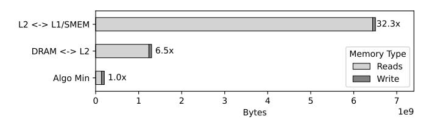

Fig. 2: Memory and cache accesses compared to algorithmic minimum for a 4k 4k 4k GEMM on an NVIDIA A100 GPU.

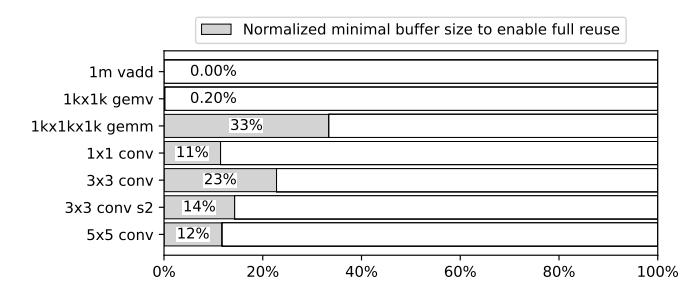

Fig. 3: Maximal effectual buffer size to enable full tensor reuse normalized to total tensor size.

and show that fusion, while often beneficial, isn't always optimal due to the constraints it imposes on intra-layer mappings.

Third—we analyze fusion opportunities in the GPT-3-6.7b Large Language Model (LLM), revealing that up to a 5.6× reduction in data movement can be achieved with a buffer size of 320 MB.

Fourth—we develop a performance model that takes the buffer-to-compute area ratio as input and yields throughput performance, utilizing *Orojenesis* bounds. This model, which is a concave function, facilitates rapid, one-shot design decisions for various tensor algorithms.

We believe that *Orojenesis* is a radical new approach for early-stage architectural DSE, providing significantly improved accuracy over crude algorithmic-minimum or operational-intensity based analyses, while avoiding the implementation-specific pitfalls of traditional cache-based studies and the intractable mapspace searches of contemporary tensor accelerator frameworks.

# II. MOTIVATION

During early hardware design space exploration, one of the first analyses an architect conducts is a "speeds and feeds" study on data movement and computation required by the algorithms of interest. Often, operational intensities (OI) [\[25\]](#page-14-10)—i.e., the ratio of compute to data movement—of various algorithms are used as input in a roofline performance model [\[76\]](#page-15-8) to quickly estimate whether a target workload is expected to be computation-limited or memory bandwidth-limited.

The data movement metric used for this analysis is called the *algorithmic minimum* (equivalent to compulsory misses with a cache-based design) and is simply the sum of all operand sizes. Unfortunately, this metric can be too optimistic. For example, Fig. [2](#page-1-2) compares the algorithmic-minimum tensor accesses for a 4k 4k 4k GEMM workload with the data

<span id="page-1-0"></span><sup>1</sup>Adapted from the word "orogenesis" which means mountain creation.

<span id="page-1-1"></span>Inspired by the snowcat vehicle used for crafting ski slopes [\[1\]](#page-14-9).

movement across various levels on an NVIDIA A100 GPU memory hierarchy. The data shows that actual DRAM traffic is  $6.5 \times$  larger than the algorithmic minimum. This **gap** arises from both mapping inefficiencies and fundamental hardware design choices, particularly buffer capacity constraints for enabling data reuse. Worse yet, algorithmic-minimum's gap vs. L2-to-L1 traffic is even more dramatic— $32.3 \times !$  While DRAM access bandwidth and energy efficiency are critical first-order design considerations, on-chip data movement has been shown to be just as important [57], particularly for energy efficiency. A deeply flawed data-movement metric can potentially mislead an architect toward poor initial design decisions.

One might ask why architects cannot use a more precise data movement estimation method during early design-space exploration. The reason is twofold. First, data movement is sensitive to the reuse that can be exploited by an architecture's memory hierarchy. Modeling this accurately requires the use of a more detailed architectural model, which has dramatically higher implementation and runtime costs than the simple equations for algorithmic-minimum accesses.

Second, data movement is sensitive to the specific implementation of an algorithm. Thus, we cannot determine optimal traffic using Bellady's [7] algorithm, which is sensitive to cache capacity, but it only models a single implementation of the algorithm. For tensor algorithms, alternative implementations are called *mappings* [57] and reflect the tiling, parallelization, scheduling and fusion choices that either an expert programmer or optimizing compiler would make to optimally exploit the available hardware resources and the algorithm's inherent reuse patterns. There has been an enormous amount of research on fast models [46], [57], [79], and automated mapspace searches [8], [22], [57], [86] for tensor accelerators. However, an exhaustive mapspace search even for a single design may consume an unacceptable amount of time, rendering this approach useless for early DSE across a large space of designs. Furthermore, a vast design-space search is rarely employed in the real world. Instead, an architect is looking for basic intuition about the behavior of target algorithms that they use to create initial baseline designs, followed by DSE within limited regions around the baselines.

In summary, architects find themselves trapped in a gap between the sheer imprecision of algorithmic-minimum access counts, and the modeling cost and implementation-dependence of more precise models.

We believe we can bridge this gap for the domain of tensor algorithms. Our approach:

- addresses the mapping-specificity of precise datamovement counts by providing a *bound* on data movement that no mapping can improve,
- addresses the reuse-obliviousness of algorithmic minimum accesses by providing a backing-store access bound for any given buffer capacity, allowing projection of data movement bounds at all levels within any design's memory hierarchy.
- addresses the runtime cost of detailed modeling and mapspace search by employing a simple proxy architec-

<span id="page-2-0"></span>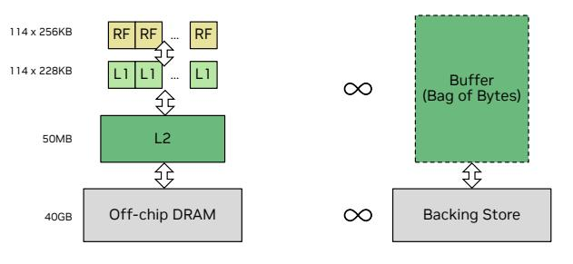

(a) Example real design.

(b) Snowcat architecture.

Fig. 4: Snowcat architecture compared to a real design.

ture we call a *Snowcat* architecture that exposes an extremely small mapspace and can be analyzed or modeled extremely efficiently.

This tool is available at <a href="https://timeloop.csail.mit.edu/orojenesis">https://timeloop.csail.mit.edu/orojenesis</a>. In the next section, we describe *Orojenesis* in detail. We describe its objectives, our methodology, and how to use the results to extract key insights.

#### III. Orojenesis

#### A. Terminology

We first define a set of terms that we will use frequently in the remainder of this paper. Our terminology is derived from the TeAAL [47] work.

A **tensor** is a multi-dimensional array with a fixed number of **ranks**. Each rank has a **shape**. For example, the tensor A[5][4] has 2 ranks with shapes 5 and 4 respectively.

Operations on tensors such as matrix multiplications, convolutions or contractions can be concisely expressed in Einstein summation (or **Einsum**) notation [20], which has recently been used and/or extended in a variety of works [24], [26], [40], [47], [53], [57], [71]. For example, matrix multiplication is expressed as the Einsum  $B_{m,n}^{M,N} = A_{m,k}^{M,K} W_{k,n}^{K,N}$ , where the superscripts represent the shape of each rank.

A **tensor algorithm** is a computation on a set of tensors that can be expressed either as a single Einsum or as a **sequence** of Einsums in a producer-consumer cascade. A tensor algorithm is always *un-mapped*, i.e., it has *not* been tiled, parallelized, scheduled or fused for optimal execution on a target architecture.

A **mapping** represents a specific way to tile, parallelize, schedule and/or fuse a tensor algorithm on a target architecture. The set of legal mappings of an algorithm on an architecture is known as the **mapspace**. A **mapper** is an algorithm or heuristic that finds an optimal mapping within the mapspace given one or more target optimization metrics and a set of hyperparameters.

#### B. Orojenesis Methodology

*Orojenesis* is a methodology that derives the relationship between the capacity of a *buffer* (i.e., an on-chip scratchpad, cache or buffet [61]) and a lower bound on the accesses to the next-outer level in a memory hierarchy (i.e., a *backing store*)

<span id="page-3-0"></span>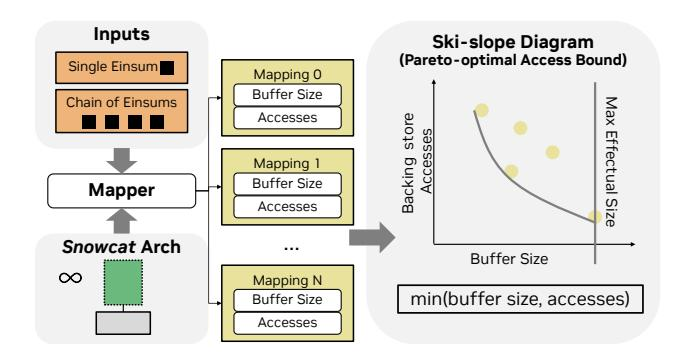

Fig. 5: The Orojenesis flow.

that no *mapping* of a given tensor algorithm can improve. An example of this relationship is depicted by the green curve in Fig. 1.

The key insight this work leverages is that the data movement behavior across any two consecutive memory levels is *fractal* at the limit. For any given level within the memory hierarchy, we can treat the total storage capacity at that level as a collective "pool of bytes". The maximum data reuse achievable and the resulting traffic volume to the next level in the hierarchy are bounded by the number of bytes that exist in the pool, regardless of the specific memory level it represents.

**Snowcat** architecture. As a result, we can use a simple architecture to study data movement behaviors that can be generalizable to complex architectures. We refer to this architecture as the *Snowcat*. Unlike a real design (Fig. 4a), *Snowcat* is a single processing-element architecture with two levels in its storage hierarchy—an unconstrained buffer and a backing store (Fig. 4b). Because the *Snowcat* architecture has just two storage levels and does not need to consider parallelization, its mapping space is considerably smaller and its modeling complexity is lower. For instance, *Snowcat*'s mapspace for a  $4k_4k_4k_5$  GEMM is  $7350\times$  smaller than that of an Eyerisslike architecture [12], [52], highlighting its effectiveness in significantly reducing mapspace traversal complexity.

**Bound Derivation.** While static compile-time analysis and optimization-based approaches [31], [54], [55] can be applied to find data movement bounds, prior publications do not analyze fused mapspaces and leave gaps in the bounds. Heuristic or data-driven mapspace search approaches [27], [36], [77] offer an alternative, but they do not guarantee to converge to the global optimum. Exhaustive search is the most straightforward method to find all Pareto-optimal points that optimize the combination of buffer size and data access count across all mappings for a comprehensive set of workloads. As noted earlier, the manageable modeling cost and compact search space of the *Snowcat* architecture make exhaustive search feasible for realistic workloads.

**Tool Flow.** Fig. 5 presents the overall *Orojenesis* flow. *Orojenesis* accepts a workload specified as a single tensor algebra Einsum or a chain of such Einsums as input. For a given workload, the *Orojenesis* flow traverses the complete unconstrained mapspace of that workload on the *Snowcat* ar-

<span id="page-3-1"></span>

Fig. 6: Buffer size requirements and data accesses to the next memory level derived from a matrix multiplication mapping.

chitecture. For each mapping encountered during this traversal, we compute the backing-store access count and the tile sizes (i.e., the live data footprint) for each tensor. Given this information, the buffer's size is expanded or contracted to exactly fit the tile sizes that the mapping needs. We call this the buffer size requirement for the mapping. Throughout this mapspace traversal, Orojenesis collects the buffer size requirements and the backing store access counts for all mappings, continuously updating the best-achieved backing store accesses for different buffer size requirements. Note that this process avoids exploring the cross-product of buffer capacities and mappings, a key difference from tensor accelerator mapspace searches. At the end of the process, connecting the Pareto-optimal points in this space gives us the ski-slope diagram.

We implement the *Orojenesis* flow using Timeloop's [57] mapper configured for exhaustive search, and its performance model configured to report buffer size requirements and memory accesses for the Snowcat architecture. For multi-Einsum evaluation, we adapt Timeloop to accommodate fusion optimization (details are elaborated in Sec.V). Timeloop uses a robust polyhedral approach to compute tile sizes and access counts, which works on a range of affine problems. However, for pedagogical purposes, because GEMM is a straightforward rectilinear affine problem, we illustrate in Fig. 6 how the tile sizes can be derived using simple algebraic expressions. The tile size for each tensor is the product of its inner-loop bounds for relevant ranks (i.e., the dimensions that affect the tensor's size), and the total buffer size requirement is their sum. Backing store accesses for each tensor can be calculated by multiplying inner-loop tile sizes with outer-loop iterations. These iterations are the product of loop tiles outside a relevant loop tile in the backing store memory. For example, in Fig. 6, tensor A's iteration count is  $K1 \times N1 \times M1$ , while for tensor B, the iteration count is  $N1 \times M1$  as K is an irrelevant rank.

**Extrapolating** *Orojenesis* **bounds.** The *Snowcat*-based *Orojenesis* analysis is applicable to a variety of architectural analyses. For example:

1) Multi-level Memory Hierarchy: As demonstrated in the ski-slope diagram in Fig. 7, the *Orojenesis* bound for an algorithm can be probed at different points to find data movement bounds between any two levels (e.g., L1 and L2, L2 and DRAM) in a memory hierarchy. Note that the Pareto-

<span id="page-4-0"></span>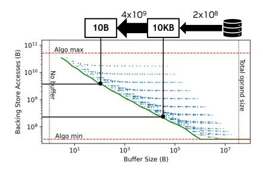

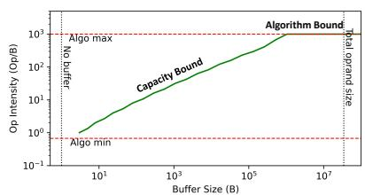

Inputs: **Buffer Size** Hardware TOPs and BW OI Mesa 335TOps 10KB 100 OI Outputs: Perf Mesa: Performance (TOps 10 335TOp: 10 10 10KB 10 10<sup>6</sup>

Fig. 7: Multi-level memory access bounds for  $16k_{-}1k_{-}1k$  GEMM, with points indicating explored mappings.

Fig. 8: OI mesa for maximum attainable operational intensity.

Fig. 9: Performance mesa with buffer size as input.

optimal mappings achieved may not always compose across multiple levels. Hence, a multi-level backing store lookup yields a lower bound, but it is not guaranteed to be tight.

- 2) Parallel Architecture: Parallelization of a mapping can introduce data duplication since some tensor tiles may need to be made available at multiple parallel instances. This leads to either an effective reduction in the total buffer capacity at a storage level, or more data movement traffic, which leads to a sub-optimal data point relative to *Orojenesis' Snowcat*-derived Pareto bound. In Fig. 6's example, parallelizing the buffered M0 loop leads to the same next-level access count, but the new mapping requires either duplicating M0 weights across different parallel processing elements (PEs) or broadcasting these weights to all PEs during execution, thus increasing network traffic. Therefore, when parallelism is present, *Orojenesis* returns a looser (but still correct) lower bound.
- 3) Constrained Mapspaces: Some architectures may constrain [57] the space of legal mappings to simplify their design, particularly interconnection network design. Such constraints shrink the mapspace, but the *Orojenesis* bounds are still guaranteed to bound the resultant space.

These three scenarios describe the complete set of architectural attributes that can be fractally composed to create a realistic tensor accelerator design. Because *Orojenesis* bounds continue to be valid across these attributes, its bounds are *portable* across all tensor accelerator architectures that can be described in a framework such as [57]. This means that there is no need to re-run *Orojenesis* for different architectures, so long as the underlying algorithm remains unchanged.

#### C. Derivative Models

The *Orojenesis* bounds can be used as a foundation to build more sophisticated models that combine computation with data movement analysis. We show two examples in this paper.

Attainable Operational Intensity (OI) Model. Unlike algorithmic OI derived from inherent algorithmic properties, the attainable OI of a workload depends on the space of mappings and is constrained by the hardware buffer capacity. This attainable OI can be significantly lower than the algorithmic OI. To offer more insight into how the optimal OI of a tensor workload varies with the buffer capacity in a design,

the *Orojenesis* data can be used to derive a maximal *attainable* OI curve as shown in Fig. 8. Instead of the algorithmic OI or an OI point calculated from a specific implementation, our bound represents the best-possible OI subject to given buffer size constraints. The shape of the diagram in Fig. 8 resembles a mesa, a flat-topped ridge. Therefore, we name it an *OI mesa*. In this diagram, OI can be either bounded by the buffer capacity or the inherent algorithmic compute-to-tensor-size ratio. The slope of the OI mesa serves as an indicator of how efficiently the algorithm can leverage data reuse from the buffer.

Attainable Performance Model. The attainable OI model can be combined with a traditional roofline model [76] to form a performance model that takes buffer capacity along with the memory bandwidth and compute capabilities of a hardware architecture as input. The result is a new mapping-agnostic performance model for guiding DSE. The output of this model is called a *performance mesa*, as shown in Fig. 9. This model's usage is later showcased in Sec. VII-D.

#### IV. SINGLE-EINSUM BOUNDS ANALYSIS

In this section, we analyze the *Orojenesis* bounds for commonly encountered tensor Einsums and demonstrate their utility in guiding algorithm and hardware design choices.

1) Matrix Multiplication: A GEMM can be expressed with the Einsum  $B_{m,n}^{M,N} = A_{m,k}^{M,K} W_{k,n}^{K,N}$ . Fig. 10 shows the skislope and OI mesa diagrams for various GEMM shapes. For each GEMM shape, the ridge point of the OI mesa represents the maximal effectual buffer size. Fig. 11 shows the ratios of these maximal effectual buffer sizes normalized to the total operand size for each GEMM shape. These ratios represent Gap 1 described in Sec. I. We observe that the maximal effectual buffer size of a GEMM is approximately equal to the size of its smallest operand. For instance, with M = K = N, the chart shows that the maximal effectual buffer size is about one-third of the total operand size, which roughly matches the size of its smallest operand.

To validate this observation, we symbolically formulated the maximal effectual buffer size calculation for GEMMs from first principles and found that it is the size of its smallest operand, plus the size of its smallest rank, plus 1. A rigorous proof is omitted for space constraints, but the expression

<span id="page-5-0"></span>

Fig. 10: Impact of GEMM sizes. Larger GEMMs see a more significant reduction in total data movement with increased buffer capacity. Note that the Y-axis uses a linear scale.

<span id="page-5-1"></span>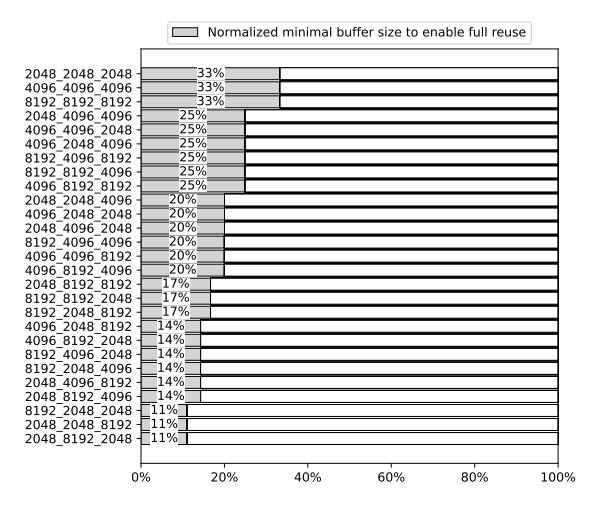

Fig. 11: Maximal effectual buffer ratio over total operand size.

produces values that align with our empirical observations. This study illustrates that *Orojenesis* can be used to uncover valuable design insights.

Fig. 10a reveals more insights. For all GEMMs, the backing store access bound exhibits a power-law decrease with increasing buffer capacity. Notably, larger GEMMs experience more data movement under the same buffer capacity and their data access bounds exhibit steeper decreases. This highlights that increasing the buffer capacity is more beneficial for larger GEMMs, resulting in more substantial access savings, both in absolute terms and relative to the original accesses.

Fig. 10b shows that the attainable OI also experiences a commensurate power law increase as the buffer capacity increases, before reaching the top of the mesa (peak OI). The peak OIs of different GEMM shapes reveal that **the optimal OI of a GEMM is limited by its smallest dimension**. This observation can be further supported by the peak-OI equation derived with perfect data reuse:  $OI_{peak} = \frac{MKN}{MK+KN+MN} = \frac{M}{\frac{M}{N}+\frac{K}{K}+1}$ . Assuming M is the smallest dimension such that  $M \ll N$  and  $M \ll K$ , we have  $\frac{M}{K} \to 0$  and  $\frac{M}{N} \to 0$ , in which case  $OI_{peak}$  converges to M.

<span id="page-5-2"></span>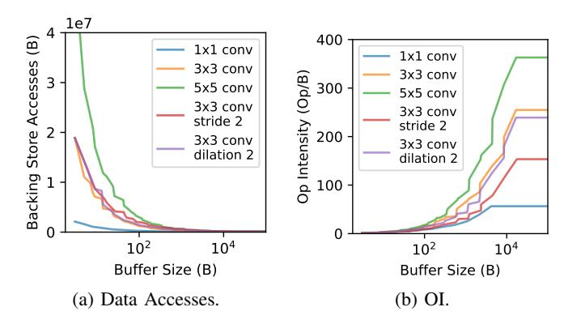

Fig. 12: Impact of various convolution configurations.

- 2) Convolution: Α multi-channel 2D convolution  $B_{p,q,n}^{P,Q,N}$ be expressed with the Einsum  $A_{t_wp+d_wr,t_hq+d_hs,c}^{TP+DR,TQ+DS,C}W_{c,n,r,s}^{C,N,R,S}$ . In this analysis, we set C and K to 64, P and Q to 16, and vary the shapes of R, S, and the convolution's stride T and dilation D. The ski-slope diagrams (Fig. 12) show that a larger filter size leads to more backing store accesses and higher peak OI. It also leads to a steeper decreasing slope in Fig. 12a, indicating that convolution with larger kernel size benefits more from increased buffer capacity. Meanwhile, stride and dilation introduce slightly higher backing store accesses. The stride of 2 lowers the peak OI as it accesses more input activations to produce the output of the same size.
- 3) Batched Matrix Multiplication: Batched matrix multiplication (BMM) is an important tensor algorithm as it is widely used in the multi-head attention (MHA) [74] design of modern Transformer models. As its name suggests, it allows GEMMs to be processed in batches by introducing an additional batch dimension. Its Einsum is represented as  $B_{h,m,n}^{H,M,N} = A_{h,m,k}^{H,M,K} W_{h,k,n}^{H,K,N}$ , where M, K, and N are the standard GEMM dimensions and H denotes the batch dimension. In Transformers, H is also known as the number of heads, with token features split into multiple heads to enhance the modeling capability of the attention mechanisms.

Fig. 13 shows the ski-slope and OI mesa diagrams for various BMM shapes with identical computation operations (OPs) but varying reduction dimension size K and number of heads H. As the number of heads increases, it leads to higher overall backing store access. The slopes of the curves become less steep with more heads, suggesting that increasing the buffer capacity provides diminishing benefits for BMMs with more heads. For instance, in a typical BMM with 32 heads and a head feature dimension of size K=128, there is very little utility in further increasing the buffer size beyond 100KB. Fig. 13 also shows that the maximal effectual buffer size (ridge points in the OI mesa) decreases with more heads. This suggests that simply increasing the buffer size cannot improve the throughput performance of memory-bound BMMs with small maximal effectual buffer sizes.

Fig. 13b shows that the peak OI decreases with the increase in the number of heads. As a result, adding more computation

<span id="page-6-1"></span>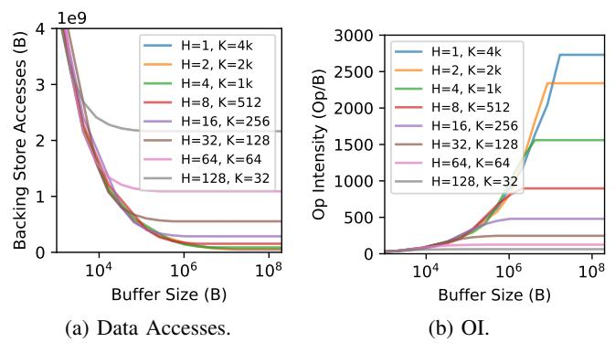

Fig. 13: Impact of number of heads in BMM with dimensions H=# of heads, M=4k,  $K=\frac{4k}{\# \text{ of heads}},\ N=4k$  with total computation fixed at 128 GOPs.

is also not beneficial for BMMs with a small reduction dimension K. On Google TPUv5e [23] with an int8 Flops-to-Bytes ratio of 480 and NVIDIA H100 SXM GPU [51] with an int8 Flop-to-Bytes ratio of 1182, BMMs with head dimensions smaller than 128 will be memory bound regardless of the allocated on-chip buffer or last-level cache size as its peak OI is lower than 256. The only feasible ways to improve the performance of BMMs are to increase the memory bandwidth or to enlarge the head feature dimension.

4) Grouped BMM: To alleviate MHA's high memory access costs, multi-query attention (MQA) [67] and grouped-query attention (GQA) [4] have been introduced. They employ an algorithm called grouped BMM, which can be expressed with the Einsum  $B_{h,m,n}^{H,M,N} = A_{h,m,k}^{H,M,K} W_{g,k,n}^{G,K,N}$ , where G represents the number of groups. In grouped BMM, instead of computing multiple heads of both input operands, one operand's head is shared by  $\frac{H}{G}$  heads of the other operand. G=1 corresponds to MQA and G=H reverts to the original MHA. MQA allows for a variable G between 1 and H.

Fig. 14 shows the *Orojenesis* outputs for a grouped BMM. Observe that reducing the number of groups lowers data movement and consequently increases the OI. The result reaffirms the effectiveness of the MQA and GQA design in reducing memory traffic. However, when the buffer capacity is larger than 10 MB, the data access saving from MQA and GQA diminishes, as shown by the converging bounds in Fig. 14.

# V. Orojenesis FUSION

<span id="page-6-0"></span>When the input to the *Orojenesis* flow is a chain of Einsums, the backing store access bound cannot be simply derived from the sum of bounds from all individual Einsums due to the presence of fusion opportunities. By buffering intermediate outputs of consecutive layers in an efficient storage like an on-chip cache or scratchpad, fusion has the potential to further lower the total minimum backing store accesses.

#### A. Fusion Methodology

For the remainder of this paper, *Einsum* and *layer* are used interchangeably to refer to tensor operations in deep learning.

<span id="page-6-2"></span>

Fig. 14: Impact of number of groups in grouped BMM with dimensions H=32, M=4k, K=128, N=4k with different number of groups in second input operand.

<span id="page-6-3"></span>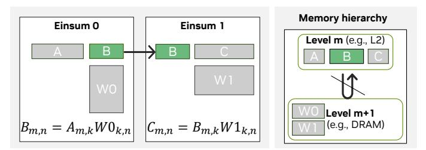

Fig. 15: Layer Fusion Definition. The output of Einsum e is an input of e+1. At level m of the memory hierarchy, the output of e is completely consumed by e+1.

**Definition of fusion**. We define layer fusion based on two key criteria, as illustrated in Fig. 15: First, for each Einsum in a sequence of E layers indexed by  $e \in [0, E-1)$ , the Einsum's output must serve as an input for the subsequent Einsum e+1. Second, within a given level m of the memory hierarchy, the output of Einsum e, i.e., the *intermediate output tensor*, should be completely consumed by Einsum e+1 without spilling over to any outer memory level n, where n>m.

**Untiled Fusion**. Consider the execution of two Einsums in a sequence on the *Snowcat* architecture, if the buffer can accommodate the full intermediate tensor, fusion does not impose any constraints on the mappings of the individual Einsums (i.e., the intra-layer mappings) in the chain, eliminating the need to tile the intermediate tensor. This mapping approach is termed "untiled fusion". However, untiled fusion often leads to a high buffer size requirement due to a large intermediate tensor size. In Section VI, we show that fused mappings using untiled intermediates tend to be suboptimal.

**Tiled Fusion**. For more effective use of the buffer, tiling intermediate outputs is important. This requires each Einsum's execution order and granularity to be aligned throughout the chain. We accomplish this by forcing all mappings in a chain to conform to a set of constraints collectively known as the Fusion Friendly Mapping Template (FFMT). Fig. 16 shows the FFMT for a GEMM chain, which we use for all fusion analyses in this paper. Other tensor algorithms will need their own FFMTs to model Einsum fusion in the *Orojenesis* flow.

As shown in Fig. 16, the GEMM FFMT works on a block

<span id="page-7-0"></span>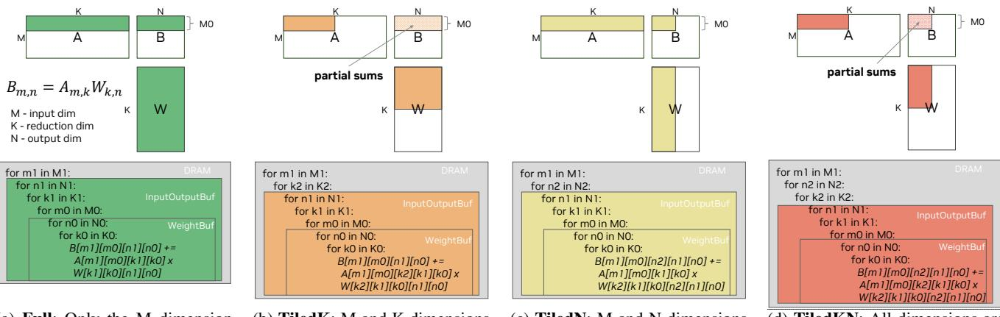

(a) **Full**: Only the M dimension is tiled to fully consume an input row and produce complete output rows of final sums.

(b) **TiledK**: M and K dimensions are tiled. A sub-partition of the input row is consumed and partial sums are produced.

(c) **TiledN**: M and N dimensions are tiled. The input row is fully consumed and it produces a subpartition of final-sum outputs.

(d) **TiledKN**: All dimensions are tiled, leading to sub-partition input row consumption and sub-partition of partial-sum outputs.

Fig. 16: The GEMM Fusion Friendly Mapping Template (FFMT). The GEMM FFMT is the union of four different constraint sets. The outermost loops in the gray boxes are permutable in two-Einsum chains.

<span id="page-7-1"></span>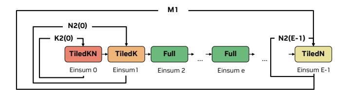

Fig. 17: Imposed GEMM FFMT constraints for different Einsums in the fusion chain. Each loopback arrow indicates the number of times each inner buffer tile is executed. 'K2(0)' and 'N2(0)' denote the K2 and N2 loop bounds for Einsum 0. 'N2(E-1)' represents the N2 loop bound for Einsum E-1.

of M0 input rows at a time and requires M1 iterations through the chain to complete the entire computation. The reason M1 is in the outermost loop is that it is the only shared rank across all GEMMs in the chain. Having any contracted ranks in the outermost fused loop can introduce recomputation and more memory traffic. To model a fused Einsum flow, we use a variant of the Snowcat architecture with a unified InputOutputBuf for storing inputs and outputs, and a separate WeightBuf for buffering weights.

Fig. 16a to Fig. 16d show four mapping patterns in loop nest notation [57], each describing a constraint set that an intra-layer mapping can obey to support fusion. The colored loop tiles correspond to the innermost sub-problem whose operands are always serviced by the buffer, and which will not be further sub-divided for fusion purposes. For single Einsums, new buffer data is loaded before each colored block starts and the output is stored back to the backing store after each colored block finishes. For a chain of Einsums, backing store accesses can be elided when consecutive Einsums are fused. In the figures above the loop nests, the colored tensor partitions represent the region that is accessed during the execution of the colored loop tiles. The colored partitions of the input and

output tensors A and B are also equal to their buffer capacity requirements. For the weight tensor W, its colored partition does not directly reflect its buffer capacity requirement. Instead, the inner-WeightBuf loop bounds determine the buffer size requirement for the weights.

FFMT-Full (Fig. 16a) imposes the most restrictive intralayer constraints as it requires storing tiles with the complete K and N ranks, which results in buffering M0 full rows of input and output tensors. FFMT-TiledK (Fig. 16b) relaxes the constraints by permitting the K dimension to be tiled. It only requires sub-columns of the input tensor to be stored in the buffer. However, leaving the K2 tile outside of the fused execution will result in partially reduced output sums. FFMT-TiledN (Fig. 16c) allows tiling along the N dimension. It only requires the full row of the input tensor to be stored in the buffer and produces a sub-partition of the output row. FFMT-TiledKN (Fig. 16d) allows tiling along all ranks. This relaxed mapping constraint helps to further reduce the input/output buffer size requirements to enable fusion optimizations.

FFMT mapping constraints in the fusion chain vary by the Einsum's position, as depicted in Fig. 17. The variables on the loopback arrows denote the number of iterations the tiled execution in each Einsum needs to be repeated before moving on to the next Einsum to ensure that no partial sum is propagated. For example, Einsum 0 requires three outer loop iterations, and its final data movement count is the product of the inner buffer tiles (colored tiles in Fig. 16) and K2(0), N2(0) and M1. K2(0) and N2(0) refer to the K2 and N2 loop bounds in Einsum 0.

The least restrictive *FFMT-TileKN* template can be applied to the first Einsum (Einsum 0) as its input tensor is directly loaded from the backing store. However, due to the partial input tile consumed in Einsum 1, only a partial sum can be produced. Therefore, it becomes necessary to reiterate back to Einsum 0 N2(0) or K2(1) times (they are equivalent) to obtain the entire output row in Einsum 1 with the final sums.

We avoid using a tiled output row in Einsum 1 because it later becomes the input for Einsum 2, causing partial sums in Einsum 2's result. In order to produce the final sums in Einsum 2, reloading Einsum 1's input row becomes necessary, but it has been evicted from the InputOutputBuf once we start processing Einsum 2. Consequently, we must either recompute the Einsum 1's input row or spill and reload it to and from the backing store, which defeats the purpose of fusion.

Since we disallow tiled output rows after Einsum 0, the subsequent Einsums in the chain need to consume and produce the full M0 input and output rows following the FFMT-Full constraint until the last Einsum. The last Einsum permits a FFMT-TiledN template because the output will be written back to the backing store and there is no subsequent Einsum to consume it.

A two-Einsum chain represents a special scenario where propagating the partial output sums of the last Einsum to the backing store is feasible. We can apply FFMT-TileKN to both Einsum 0 and Einsum 1, with N2(1) and K2(1) loops swapped in Einsum 1's mapping template to avoid reloading the intermediate outputs. Moreover, our flow explores alternative dataflows in the two-Einsum setup by enabling the reordering of the M1(0) and N2(0) loops in Einsum 0's mapping template and the subsequent corresponding M1(1) and K2(1) loops in the Einsum 1's template.

#### <span id="page-8-0"></span>B. Buffer Size Requirements

The total buffer size requirement  $BufReq_{t,e}$  of tensor t in a GEMM Einsum e is determined by multiplying loop bounds of the relevant ranks of the tensor:  $BufReq_{t,e} = \prod_{d \in \{M,K,N\}} LoopTile_{d,e} \times Relevance(d,t)$ . In the FFMT shown in Fig. 16, we have the following buffer size requirements:  $BufReq_{W,e} = K0(e)N0(e)$ ,  $BufReq_{I,e} = M0(e)K1(e)K0(e)$ ,  $BufReq_{O,e} = M0(e)N1(e)N0(e)$ . Here, Mi(e) denotes the loop tile bound of rank M at memory level i in Einsum e. The same notation applies to ranks K and K0. The total buffer capacity requirement for each Einsum is the sum of the buffer size requirement for all tensors:  $BufReq_e = \sum_{t \in \{A,W,B\}} BufReq_{t,e}$ .

Fusion can be implemented in a sequential or pipelined manner, each with its own buffer size requirement. In **sequential fusion**, where one Einsum is processed at a time, the buffer size requirement for the entire chain is determined by the maximum buffer size requirement across all Einsums:  $BufReq = \max_e(BufReq_e)$ , assuming the weight tensors are tiled and reloaded for each Einsum during the re-traversal.

Alternatively, in scenarios where weight tensors are not reloaded for chain re-traversal, buffers must hold the complete weight tensors for all Einsums, with K0(e)=K and N0(e)=N for all e. In this case, the buffer size requirement becomes the sum of the full weight tensor sizes of all Einsums, plus the InputOutputBuffer size requirement to stream through a row (M0=1) of tensor:  $BufReq=(\sum_e K(e)N(e))+\max_e(K1(e)K0(e)+N1(e)N0(e))$ .

For a fused sequence of Einsums executed in a **pipelined** manner, the buffer capacity requirement can be computed as

the sum of all weight tensor sizes and the maximum input and output tile size sum among all Einsum e:  $BufReq = (\sum_e BufReq_{W,e}) + max_e(BufReq_{I,e} + BufReq_{O,e})$ . This is because the weights involved in the pipelined sequence must be present at all times to be multiplied by the pipelined data. Pipeline fusion increases buffer capacity requirements for achieving equivalent next-level data accesses due to concurrent layer execution, rendering it less optimal. Therefore, in this paper we focus on presenting the *Orojenesis* bounds for sequential fusion.

#### <span id="page-8-1"></span>C. Backing Store Access Count

The backing store access count consists of the sum of the input access counts of Einsum 0 and the output access counts of Einsum E-1, in addition to the total weight accesses for all Einsums. In the FFMTs in Fig. 16, the weight access for Einsum e is calculated as  $Access_{W,e} = M1(e)K(e)N(e)$  when the weights are not fully buffered, and is K(e)N(e) otherwise. Here, M1 represents the outer buffer M tile, while K and N are the complete sizes of the reduction and output dimensions of Einsum e. The total weight accesses is the sum of all Einsums' weight accesses:  $Access_W = \sum_i Access_{W,e}$ . The input access count for Einsum 0 is computed as  $Access_{I,0} = N2(0)M(0)K(0)$ , while the output access count for Einsum N-1 is calculated as  $Access_{O,E-1} = M(E-1)N(E-1)$ . The total backing store access count for a fusion chain is:  $Access = Access_W + Access_{I,0} + Access_{O,E-1}$ .

#### D. Mapping Tradeoffs

Increasing M0 raises the demand for buffer capacity but simultaneously reduces M1 (the number of times the entire chain needs to be re-traversed, which equals  $\frac{M}{M0}$ ), thereby decreasing the total number of weight reloads. However, if we can keep the entire weight tensors of a subsequence of layers stationary for re-traversal, M1 does not affect weight reloading for these layers. We can then set M0=1 to exclusively minimize the buffer size requirement. These parameters, i.e., M0 and the layers chosen to fully buffer their weights, are choices in the space of fused mappings. We traverse this space, along with each layer's intra-layer mapspace, to produce the Orojenesis bounds for fused mappings.

#### E. Tool Flow

To explore the multi-Einsum mapspace, we exhaustively search each Einsum's mapspace under FFMT constraints, constructing valid fused mappings by combining compatible single-Einsum mappings. As each Einsum can have multiple valid mappings for fusion, the total fusion space is a Cartesian product of these mappings. For each valid fused mapping, buffer size requirements and accesses are derived using equations from Sections V-B and V-C. Finally, the *Orojenesis* curve is derived by identifying the Pareto-optimal fused mappings.

### F. Avoiding Partial Sum Propagation

In our current analysis, we focus solely on transferring the final sums from the producer to the consumer Einsum. This

<span id="page-9-1"></span>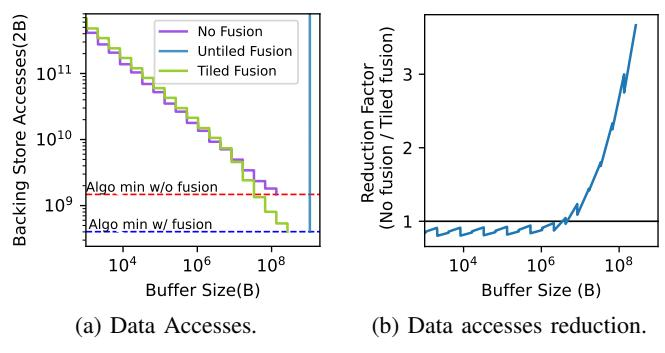

Fig. 18: Fusing  $32k_4k_16k$  and  $32k_16k_4k$  GEMMs.

deliberate choice is made to avoid the transfer of partial sums, which would necessitate either recomputation or additional memory accesses to the backing store memory. As fusion with recomputation changes the compute and data movement simultaneously and complicates the performance analysis, we leave it for future study.

#### VI. MULTI-EINSUM BOUNDS ANALYSIS

<span id="page-9-0"></span>This section demonstrates how to analyze a sequence of Einsums using *Orojenesis* and FFMT. Fig. 18 shows the *Orojenesis* bounds for two fused GEMMs with shapes  $32k\_4k\_16k$  and  $32k\_16k\_4k$ . In Fig. 18a, horizontal dashed lines show minimum next-level accesses with (blue) and without (red) fusion. It is important to note that *Orojenesis* bounds with fusion do not always outperform the unfused bounds due to the additional intra-layer constraints imposed by FFMT.

The purple curve shows the baseline backing store accesses achieved without fusion, where we search for optimal intralayer mappings without constraints. To establish each point on this curve, we sum the best data accesses for each Einsum considering a specific buffer size limit. The step-like pattern in the figures results from buffer under-utilization due to our use of perfect factors as loop bounds. It's important to note that our single Einsum curve is constructed using discrete mapping points. When integrating them for fusion, we adopt a conservative approach and assume that data accesses remain constant until we identify another Pareto-optimal mapping with a larger buffer size on the X-axis. Using imperfect factorization [29] can potentially smooth out the curve, which would be a straightforward extension to this work.

The blue curve shows the untiled-fusion backing store access bound with fully buffered intermediates, allowing flexible intra-layer mappings. However, these large intermediates dominate buffer size demand, resulting in a nearly vertical line indicating similar capacities for varying accesses. This suggests full buffering of intermediates isn't essential for optimal reuse.

The green curve represents the optimal access bound enabled with tiled fusion. Compared to untiled fusion, tiled fusion is more effective in reducing backing store access with a much smaller buffer capacity. Fig. 18b compares the data movement reduction factor of tiled fusion to untiled execution. It shows that tiled fusion can further reduce the backing store

<span id="page-9-2"></span>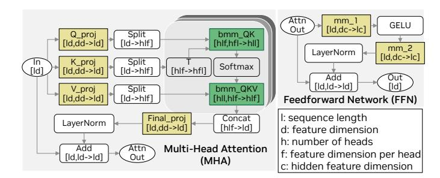

Fig. 19: LLM building block architecture.

accesses of the optimal unfused mappings. However, when the buffer size is smaller than 10 MB, we see a reduction factor lower than 1, indicating that tiled fusion does not always outperform unfused mappings. With a buffer size larger than 10 MB, tiled fusion becomes profitable. When provisioned with a buffer larger than 256 MB, fusion can lead to up to  $3.7 \times$  access count reduction. Another key insight drawn from the slopes of the bounds is that a larger buffer benefits fused mappings more than the optimal unfused ones.

#### VII. CASE STUDY: LARGE LANGUAGE MODEL

This case study leverages both intra-layer and inter-layer data reuse in fused-layer large language models (LLMs) to establish data movement bounds and guide accelerator DSE.

LLM architecture (Fig. 19) consists of repeated building blocks with sequences of Einsums present in its Multi-Head Attention (MHA) and Feedforward Network (FFN) modules. The colored boxes in the figure show different Einsums: yellow for GEMM and green for grouped BMM. The notation beneath each layer name is the Einsum expressed in Numpy format where the subscripts for input tensors are listed in a commaseparated format, and the subscripts for the output tensor are specified after the right-arrow symbol.

Our target workload is GPT-3-6.7b, characterized by a feature dimension (d) of 4096, 32 attention heads (h), a head dimension (f) of 128, and a hidden feature dimension (c) of 16384. We study the workload with an input sequence length (l) of 32768, which is the product of the actual sequence length of 2048 and a batch size of 16. For simplicity, we assume that element-wise and reduction operations are already integrated with the GEMMs and BMMs, and therefore, their access counts are excluded from our analyses.

#### A. Comparison of MHA Fusion Strategies

Fusing the BMMs is critical for improving the throughput performance of the memory-bound MHA in LLMs. FLAT [39] and FlashAttention [15], [16] have optimized fused-layer MHA with tiling strategies that can be modeled by FFMTs. Here, we provide a comparison of them together with the unfused baseline in Fig. 20.

In FLAT, the entire output row (shaped  $M0 \times N$  as in Fig. 16) of the producer Einsum  $bmm\_QK$  must be generated for the row-wise reductions performed by Softmax. To avoid tiling its output row dimension N, we apply the TiledK template in Fig. 16b with  $M1 \rightarrow K2$  (outer-to-inner)

<span id="page-10-1"></span>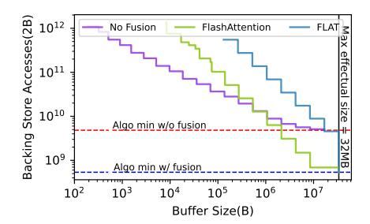

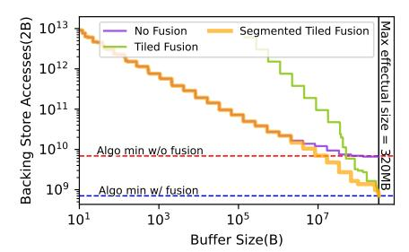


Fig. 20: MHA fusion strategies resemble FlashAttention [16] and FLAT [39].

Fig. 21: Impact of segmentation on a six-Einsums chain in GPT-3-6.7b.

Fig. 22: *Orojenesis* bounds for the entire GPT-3-6.7b building block.

ordering for the producer Einsum. For the consumer Einsum  $bmm\_QKV$ , the TiledN (Fig. 16c with  $M1 \to N2$ ) template is used to minimize the buffer size requirement. In contrast, FlashAttention permits the tiling of the producer's output row by exploiting an algebraic manipulation to incrementally perform Softmax reduction. Their fusion strategy resembles using TiledN (Fig. 16c with  $N2 \to M1$ ) for  $bmm\_QK$  and TiledK (Fig. 16b with  $K2 \to M1$ ) for  $bmm\_QKV$ .

As indicated by Fig. 20, the fusion strategy has a substantial impact on data movement bounds. Notably, at a buffer size of 16 MB, FlashAttention (green curve) achieves over 6× lower backing store accesses compared to FLAT (blue curve). However, once the buffer capacity reaches the maximal effectual size at 32MB, both strategies become equally effective.

#### B. Impact of Chain Segmentation

To illustrate the impact of fusing more Einsums, we present Fig. 21 that plots the data movement bounds for a sequence of six Einsums in the GPT-3-6.7b block (*Q\_proj, bmm\_QK*, *bmm\_QKV*, *Final\_proj, mm\_0 and mm\_1*). Normalization operation between fused GEMMs automatically imposes a mapping constraint in FFMT: the producer Einsum's output column cannot be tiled.

In Fig. 21, the purple curve indicates the optimal unfused bound, while the green curve represents the optimal tiled fusion bound for the six-Einsum chain. Our observation reveals that fusing a longer Einsum chain is not always beneficial. One reason is that the additional Einsums increase the overall buffer size demand, which is determined by the Einsum requiring the most buffer. In addition, the FFMT constraints are more restrictive to the middle-Einsum in a longer chain, further increasing the buffer size requirement.

To mitigate this, we exhaustively explore all 2<sup>(# of Einsums-1)</sup> possible ways to segment the chain and construct the yellow curve using the optimal segmentation strategies at varying buffer size constraints. Different points on the orange curve can entail different segmentation strategies. The results show that partitioning the fusion chain into shorter segments can significantly reduce its data accesses, particularly with smaller buffer sizes. This improvement is evident in the yellow curve, which lies much closer to the purple baseline at lower buffer capacities, compared to unsegmented fusion shown in the green curve.

#### C. Optimal Full LLM Fusion Strategy

Fig. 22 displays the total backing store access requirements for the sequential execution of all Einsums in a GPT-3-6.7b building block (Fig. 19). The bounds follow a trend similar to those in Fig. 21, but include additional accesses from two unfused GEMMs, *K\_proj* and *V\_proj*. Analysis of the bounds shows that, with a last-level cache of 50 MB, the optimal fused execution of LLMs can reduce the overall backing store traffic by 2.5× (a 4.7 GB absolute reduction) compared to optimal unfused mappings. The full potential of fusion can be realized with an on-chip buffer of size larger than 320 MB (the maximal effectual buffer size), resulting in up to 5.6× reduction in DRAM accesses (a 6 GB absolute reduction). This shows fusion is an effective strategy to reduce backing store accesses of LLMs.

#### <span id="page-10-0"></span>D. Bounds for Provisioning Buffer to Compute Area Ratios

A common challenge in DSE is determining the optimal ratio of buffer to MAC area, given a fixed total chip area. The DRAM bandwidth is typically predetermined by the memory vendor and thus remains constant.

Our approach begins with a baseline chip specification akin to the GF100 chip [48], which is implemented using 40 nm technology and encompasses a total die area of 529 mm<sup>2</sup>, operating at 700 MHz. The system's DRAM bandwidth is set at 149 GB/s. Using Accelergy [78], we calculate that the area required per MAC is 332.25 um<sup>2</sup>, and the area per byte of SRAM buffer is 2.59 um<sup>2</sup> for large SRAMs in 40 nm technology. The focus of our experiment is to adjust the on-chip buffer size and the total number of MACs, within the die area constraint, to optimize the hardware for supporting the GPT-3-6.7b workload, as discussed in the preceding section. We assume 20% of the die area is occupied with IOs, leaving 432.2 mm<sup>2</sup> area for SRAMs and MACs. Note that larger buffers can lead to longer access times. However, since tensor accelerator buffers are typically managed with explicit orchestration (e.g., double buffering) [60], [61], we assume that the extra latency is hidden and offset by fewer data accesses with larger buffers.

In Fig. 23, we illustrate the chip's throughput performance in relation to varying buffer area ratios, assuming the remaining area is allocated to MACs. As we increase the buffer area and size, we can look up the attainable DRAM accesses from the *Orojenesis* bound presented in Fig. 21 such that:  $accesses = Orojenesis(\frac{buf\_area\_ratio \times total\_area}{area\_per\_B})$ . The

<span id="page-11-0"></span>

Fig. 23: Mountain-like performance model. The vertical dashed line indicates the optimal buffer area to total chip area ratio that achieves the peak throughput performance in a chip with a die area of 529 um<sup>2</sup> in 40 nm technology.

memory-limited throughput performance, illustrated by the orange line, is computed as  $\frac{accesses}{bandwidth}$ . The compute-limited performance is directly derived from the MAC area using the following equation  $\frac{(1-buf\_area\_ratio)\times total\_area}{area\_per\_MAC}\times frequency.$  As depicted by the blue line, the compute-limited performance decreases linearly with reduced area for MACs.

The actual achievable performance, highlighted by the opaque green curve, is bounded by the minimum of memorylimited performance and compute-limited performance. The curve reveals that the throughput performance is a concave function of the buffer area ratio. The X-axis value where compute-bound and memory-bound performance intersect indicates the optimal buffer area ratio for the peak performance. Comparing the optimal hardware designs for unfused and fused LLMs, the fused-LLM design demands a 60% lower buffer area while achieving an overall 2.4× higher throughput performance. This is because fusion more effectively utilizes the buffer area for data reuse and consequently leads to higher memory-bound performance per unit area. This study shows that different workload properties and mapspace choices can significantly impact the optimal hardware design choices. Meanwhile, our methodology can quickly reveal the important design tradeoffs and offer analytical-model-based suggestions.

#### VIII. VALIDATION

We validate the *Orojenesis* bound for a  $4k\_4k\_4k$  GEMM on four NVIDIA GPUs and a model of the Simba [66] accelerator. Fig. 24a shows the measured DRAM accesses from running CUTLASS [72] on NVIDIA GPUs [50], [51] across a range of last-level cache sizes (A2-2MB, A30-24MB, A100-40MB, H100-50MB) and targeting different compute units (SIMT and tensor core). It shows that *Orojenesis* provides a valid bound for off-the-shelf GPUs, and that optimized schedules targeting A100 and H100 achieve close to optimal DRAM accesses. Fig. 24b shows the DRAM accesses gathered from the analytical Timeloop model of Simba [66] with five different buffer configurations. The plot uses different colors to denote different Global Buffer sizes ranging from 128B to 512KB, where each point corresponds to a unique mapping. It verifies that our ski-slope curve serves as a valid bound for

<span id="page-11-1"></span>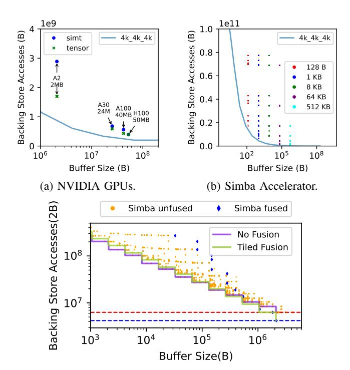

(c) Fusing  $1k_1k_1k$  GEMMs on Simba.

Fig. 24: Measured DRAM accesses vs. Orojenesis.

<span id="page-11-2"></span>TABLE I: Orojenesis comparison to Simba 100-design DSE.

|                          | Total Mapping<br>Evaluated | Per-mapping<br>Runtime (ms) | Total<br>Runtime (s) |
|--------------------------|----------------------------|-----------------------------|----------------------|
| Simba (100 designs) [66] | 2.6E+6                     | 3.9                         | 10009                |
| Orojenesis               | 9.0E+4                     | 0.2                         | 18                   |
| Ratio                    | $28.5 \times$              | $19.5 \times$               | 556×                 |

spatial accelerators. Additionally, it shows that less performant mappings can result in substantial deviation from the Pareto curve. Fig. 24c further validates our bounds for a chain of Einsums. The purple curve represents the *Orojenesis* bound for executing two unfused  $1k\_1k\_1k$  GEMMs. The green curve shows the bound when tiled fusion is applied. Blue and orange data points depict the measured data accesses with their corresponding minimal buffer size requirements on Simba with and without fusion, respectively. This plot shows that our multi-Einsum bounds are also valid as the measured accesses consistently stay above the *Orojenesis* bounds.

#### IX. RUNTIME COMPARISON TO MAPPING-AWARE DSE

To demonstrate the *Orojenesis* runtime benefits compared to a full mapping-aware DSE, we conduct a DSE experiment on the Simba architecture in which we evaluate 100 samples, each representing a different Global Buffer capacity. Table I compares the runtime of *Orojenesis* vs. DSE for the Simba accelerator targeting the  $4k\_4k\_4k$  GEMM (as in Fig. 24b).

Each mapping evaluation on Simba takes approximately 3.90 ms on a 4-core Intel® Core<sup>TM</sup> i7-1185G7 processor @ 3.00 GHz. In contrast, a single *Orojenesis* sample for the *Snowcat* architecture on the same hardware takes only 0.20 ms, making it  $19.5 \times$  faster. In the Simba DSE, evaluating

a single hardware configuration involves 26k evaluations to identify the optimal mapping, resulting in 2.6m evaluations for 100 configurations. In *Orojenesis*, 90k valid mappings are evaluated in the exhaustive search on the *Snowcat* architecture. Note that more valid mappings are found on the *Snowcat* architecture than on a single Simba configuration. It is because the mapspace in *Orojenesis* is less constrained. Overall, the run time of *Orojenesis* is 556× faster than DSE with 100 Simba configurations.

However, the numbers from this study do not tell the complete story. Data from a single *Orojenesis* run is *portable* to a huge (and possibly unbounded) space of tensor architectures while the Simba run only yields data for the limited DSE on this specific architecture. Even for this specific architecture, a broader DSE may involve searching for different registerfile sizes, PE counts, and other parameters, dramatically compounding the design space beyond the 100 samples shown in our illustrative example. Compared to such a broader mappingaware DSE, the runtime speedup offered by *Orojenesis* would be significantly higher because *Orojenesis* only needs to be executed *once*, while the runtime of mapping-aware DSE grows proportionally to the number of design points explored. Furthermore, Simba is a relatively simple architecture with a highly constrained dataflow. A more complex architecture with more storage levels (such as a GPU with a tensor core) increases the per-evaluation cost relative to the already 19.5× faster *Snowcat*, and a more flexible architecture increases the mapspace size, all of which extends *Orojenesis*' advantage.

# X. RELATED WORK

<span id="page-12-0"></span>Tensor algebra algorithms operating on multidimensional tensors play a pivotal role in modern ML and HPC applications. A multitude of ML programming and compiler frameworks have been developed to optimize tensor workloads on existing computer hardware [\[2\]](#page-14-24), [\[10\]](#page-14-25), [\[11\]](#page-14-26), [\[40\]](#page-15-12), [\[49\]](#page-15-28), [\[58\]](#page-15-29), [\[63\]](#page-15-30). In parallel, accelerator-specific mappers have been designed to optimize tensor workloads on dedicated hardware [\[27\]](#page-14-1), [\[29\]](#page-14-20), [\[31\]](#page-14-2), [\[36\]](#page-14-17), [\[37\]](#page-14-27), [\[43\]](#page-15-1), [\[46\]](#page-15-9), [\[57\]](#page-15-0), [\[82\]](#page-16-0).

There also has been a growing body of research on layer fusion optimization aimed at reducing data movement and enhancing hardware utilization [\[5\]](#page-14-28), [\[6\]](#page-14-29), [\[8\]](#page-14-11), [\[14\]](#page-14-30)–[\[16\]](#page-14-23), [\[21\]](#page-14-31), [\[22\]](#page-14-12), [\[34\]](#page-14-32), [\[39\]](#page-14-21), [\[44\]](#page-15-31), [\[59\]](#page-15-32), [\[65\]](#page-15-33), [\[73\]](#page-15-34), [\[84\]](#page-16-3), [\[86\]](#page-16-4).

On the hardware side, many performance model [\[32\]](#page-14-33), [\[42\]](#page-15-35), [\[46\]](#page-15-9), [\[57\]](#page-15-0), [\[79\]](#page-15-10), [\[80\]](#page-16-5) and DSE works [\[13\]](#page-14-34), [\[28\]](#page-14-6), [\[30\]](#page-14-4), [\[35\]](#page-14-5), [\[38\]](#page-14-7), [\[41\]](#page-15-3), [\[64\]](#page-15-4), [\[68\]](#page-15-5), [\[70\]](#page-15-36), [\[75\]](#page-15-6), [\[81\]](#page-16-2)–[\[84\]](#page-16-3) have been proposed to further enhance the tensor accelerator performance. Instead of producing a single optimized mapping or accelerator design points, our work presents precise data movement bounds under various buffer budgets for tensor workloads, offering portable design insights for diverse hardware.

Our bounds and their utility share similarities with the missrate curves and working set studies [\[19\]](#page-14-35), [\[45\]](#page-15-37), [\[56\]](#page-15-38). However, the key difference is that prior studies only involved fixed mapping and implementation invariant to the cache capacity constraints. *Orojenesis* curves, instead, provide bounds derived with different optimal mappings subject to the varying cache capacity constraints.

There have been some efforts [\[3\]](#page-14-36), [\[9\]](#page-14-37), [\[33\]](#page-14-38), [\[54\]](#page-15-16), [\[55\]](#page-15-17), [\[69\]](#page-15-39) aimed at deriving data movement lower bounds between a buffer and secondary storage. Asymptotic studies like [\[3\]](#page-14-36), [\[9\]](#page-14-37), [\[33\]](#page-14-38) focus on the behaviors of the tensor workload when the input size gets large or reaches a limit. Closer to our domain, [\[54\]](#page-15-16), [\[55\]](#page-15-17) use the polyhedral model to derive data movement bounds for affine programs. While the promise of a strictly symbolic bounds derivation is enticing, in reality they end up using a blend of empirical and symbolic approaches. While the symbolic bounds capture the overall data movement trend, they leave room for underestimating either the data movement or buffer size requirements for oblong-shaped tensor problems (such as tall-and-skinny GEMMs), thus resulting in looser bounds. Specifically, the maximal effectual buffer size reported by IOOpt can be orders of magnitude lower than what *Orojenesis* observes. This looseness is exacerbated by the absence of fused mapping analysis for tensor computation sequences, which as we show can further dramatically reduce the amount of data movement. In addition to providing tighter bounds, our paper also shows how to use this methodology to derive a range of valuable architectural insights.

## XI. CONCLUSION

This paper presents *Orojenesis*, a methodology to compute data movement bounds for tensor algorithms. *Orojenesis* provides tighter bounds than traditional algorithmic-minimum accesses bound because it comprehends data reuse that a buffer can exploit to reduce data movement. It also avoids the mapping-specificity of traditional cache-based studies and the intractable mapspace searches of contemporary tensor accelerator frameworks. *Orojenesis*'s bound is mapping-independent because it provides a limit on what any mapping of an algorithm can possibly extract from an architecture's hierarchy, including mappings that exploit producer-consumer fusion. This paper further demonstrates how to use *Orojenesis*'s outputs to derive a diverse range of architectural insights, culminating in a comprehensive case study of a contemporary Large Language Model.

With the tight bounds it provides, *Orojenesis* can empower architects to design well-balanced systems by steering clear of the pitfall of designing with insufficient guard bands around algorithmic-minimum traffic—a pitfall that could lead to under-utilization of compute resources.

Looking ahead, future work includes further tightening the *Orojenesis* bounds to account for parallelism, latency hiding, pipelining, partial sum propagation, and tensor traversal patterns beyond tiled raster traversals.

# ACKNOWLEDGEMENTS

We thank Yaosheng Fu, Aamer Jaleel, Ben Keller, Brucek Khailany, Donghyuk Lee, Mike O'Connor, Michael Pellauer, Rangharajan Venkatesan, Stephen W. Keckler, and Brian Zimmer for their valuable insight and feedback.

# APPENDIX A ARTIFACT APPENDIX

## *A. Abstract*

This section describes how to access the artifacts for *Orojenesis* and reproduce the key figures in the paper. This artifact can be run on any machine with an x86-64 CPU. The *Orojenesis* flow has been integrated into Timeloop [\[57\]](#page-15-0), [\[79\]](#page-15-10).

#### *B. Artifact check-list (meta-information)*

- Algorithm: Analytical analysis of tensor algorithms.
- Program: C++, python.
- Run-time environment: x86-64 machines. Root or docker access is required.
- Output: Key plots in the paper.
- Experiments: Bounds for various tensor.
- How much disk space required?: 20 GB.
- How much time is needed to prepare workflow?: 30 minutes.
- How much time is needed to complete experiments?: 12 hours.
- Publicly available?: Yes.
- Code licenses: BSD-3-Clause license.
- Archived: <https://zenodo.org/doi/10.5281/zenodo.10850531>

#### *C. Description*

*1) How to access:* We recommend accessing the artifact through the archival repository [\(https://zenodo.org/doi/10.](https://zenodo.org/doi/10.5281/zenodo.10850531) [5281/zenodo.10850531\)](https://zenodo.org/doi/10.5281/zenodo.10850531), which contains the latest updates and bug fixes. The DOI for the version that passed the artifact evaluation is 10.5281/zenodo.10957760.

# *D. Installation*

*1) Download* Orojenesis *artifacts:* On a user machine, download the archived orojenesis code by running:

```
curl -Ls -w %{url_effective} -o a https://doi.org
    /10.5281/zenodo.10850531 > DL_url
wget $(cat DL_url)/files/orojenesis.zip
unzip orojenesis.zip
```

*2) Install* Orojenesis*:* We provide an installation script install.sh under the orojenesis repository to install Timeloop and other software dependencies.

Before proceeding with the installation, we offer two methods for setting up the system environment:

- Native Host: If you have sudo access on a Debian-based system with Python 3.10 or later installed, we recommend directly executing the installation script.
- Docker: Alternatively, if sudo access is not available, consider using a Docker container. You can find the Dockerfile at orojenesis/docker/Dockerfile. Please refer to orojenesis/README.md for detailed instructions on building and running the Docker container.

Once the system is properly set up, proceed with the following command to install *Orojenesis*:

```
cd orojenesis && ./install.sh
```

This command builds the Timeloop's *Orojenesis* code and adds its path to your TIMELOOP\_BASE\_PATH.

#### *E. Experiment workflow*

We provide Jupyter notebooks, orojenesis /orojenesis\_single.ipynb and orojenesis/ orojenesis\_multi.ipynb, to guide you through generating the key figures in the paper. Please launch the Jupyter GUI under orojenesis by running:

```
cd orojenesis && jupyter notebook
```

Follow the instructions displayed in the terminal output to navigate to the Jupyter interface in your web browser. The notebooks provide instructions and code to generate the *Orojenesis* bounds.

If a GUI is not accessible, you can run the following command to convert the notebooks to Python scripts.

```
jupyter nbconvert --to script <my-notebook.ipynb>
```

Running through the scripts will generate figures in the paper under orojenesis/figs.

#### *F. Evaluation and expected results*

Single-Einsum: Executing the cells in orojenesis/ orojenesis\_single.ipynb produces the following plots in the paper:

- Fig. [1:](#page-0-0) Bound for 16k 1k 1k GEMM.
- Fig. [10:](#page-5-0) Bounds for various GEMM shapes.
- Fig. [11:](#page-5-1) Maximal effectual buffer ratio over total operand size for various GEMMs.
- Fig. [12:](#page-5-2) Bounds for various convolution configurations.
- Fig. [13:](#page-6-1) Bounds for BMMs with different numbers of heads but identical OPs.
- Fig. [14:](#page-6-2) Bounds for Grouped BMMs with different numbers of groups but identical OPs.
- Fig. [24b:](#page-11-1) Validation of *Orojenesis* bounds on Simba accelerator.

Multi-Einsum: Running the cells in orojenesis/ orojenesis\_multi.ipynb generates the following plots:

- Fig. [18:](#page-9-1) Bounds for fusing 32k 4k 16k and 32k 16k 4k GEMMs.
- Fig. [20:](#page-10-1) Bounds for fused MHA.
- Fig. [21:](#page-10-1) Bounds for sliced fusion.
- Fig. [22:](#page-10-1) Bounds for a single fused LLM block.
- Fig. [23:](#page-11-0) Optimal hardware buffer area ratio for LLMs.

#### *G. Experiment customization*

To customize input workload shapes and constraints, please refer to instructions and examples in the Jupyter notebook orojenesis/orojenesis\_example.ipynb.

#### *H. Methodology*

Submission, reviewing and badging methodology:

- [https://www.acm.org/publications/policies/artifact](https://www.acm.org/publications/policies/artifact-review-and-badging-current)[review-and-badging-current](https://www.acm.org/publications/policies/artifact-review-and-badging-current)
- <http://cTuning.org/ae/submission-20201122.html>
- <http://cTuning.org/ae/reviewing-20201122.html>

#### REFERENCES

- <span id="page-14-9"></span>[1] (2022) Snowcat. Accessed on November 14, 2023. [Online]. Available: <https://en.wikipedia.org/wiki/Snowcat>
- <span id="page-14-24"></span>[2] M. Abadi, P. Barham, J. Chen, Z. Chen, A. Davis, J. Dean, M. Devin, S. Ghemawat, G. Irving, M. Isard *et al.*, "TensorFlow: a system for Large-Scale machine learning," in *USENIX Symposium on Operating Systems Design and Implementation (OSDI)*, 2016.
- <span id="page-14-36"></span>[3] A. Aggarwal and S. Vitter, Jeffrey, "The input/output complexity of sorting and related problems," *Communications of the ACM*, vol. 31, no. 9, pp. 1116–1127, 1988.
- <span id="page-14-19"></span>[4] J. Ainslie, J. Lee-Thorp, M. de Jong, Y. Zemlyanskiy, F. Lebron, and ´ S. Sanghai, "Gqa: Training generalized multi-query transformer models from multi-head checkpoints," *arXiv preprint arXiv:2305.13245*, 2023.
- <span id="page-14-28"></span>[5] M. Alwani, H. Chen, M. Ferdman, and P. Milder, "Fused-layer cnn accelerators," in *Proceedings of the International Symposium on Microarchitecture (MICRO)*, 2016, pp. 1–12.
- <span id="page-14-29"></span>[6] A. Azizimazreah and L. Chen, "Shortcut mining: Exploiting cross-layer shortcut reuse in dcnn accelerators," in *Proceedings of the International Symposium on High-Performance Computer Architecture (HPCA)*, 2019, pp. 94–105.
- <span id="page-14-8"></span>[7] L. A. Belady, "A study of replacement algorithms for a virtual-storage computer," *IBM Systems journal*, vol. 5, no. 2, pp. 78–101, 1966.
- <span id="page-14-11"></span>[8] J. Cai, Y. Wei, Z. Wu, S. Peng, and K. Ma, "Inter-layer scheduling space definition and exploration for tiled accelerators," in *Proceedings of the International Symposium on Computer Architecture (ISCA)*, 2023, pp. 1–17.
- <span id="page-14-37"></span>[9] A. Chen, J. Demmel, G. Dinh, M. Haberle, and O. Holtz, "Communication bounds for convolutional neural networks," in *Proceedings of the Platform for Advanced Scientific Computing Conference*, 2022, pp. 1–10.
- <span id="page-14-25"></span>[10] T. Chen, M. Li, Y. Li, M. Lin, N. Wang, M. Wang, T. Xiao, B. Xu, C. Zhang, and Z. Zhang, "Mxnet: A flexible and efficient machine learning library for heterogeneous distributed systems," *arXiv preprint arXiv:1512.01274*, 2015.
- <span id="page-14-26"></span>[11] T. Chen, T. Moreau, Z. Jiang, L. Zheng, E. Yan, H. Shen, M. Cowan, L. Wang, Y. Hu, L. Ceze *et al.*, "TVM: An automated end-to-end optimizing compiler for deep learning," in *USENIX Symposium on Operating Systems Design and Implementation (OSDI)*, 2018, pp. 578– 594.
- <span id="page-14-16"></span>[12] Y.-H. Chen, T. Krishna, J. S. Emer, and V. Sze, "Eyeriss: An energyefficient reconfigurable accelerator for deep convolutional neural networks," *IEEE journal of solid-state circuits*, vol. 52, no. 1, pp. 127–138, 2016.
- <span id="page-14-34"></span>[13] Y.-H. Chen, T.-J. Yang, J. Emer, and V. Sze, "Eyeriss v2: A flexible accelerator for emerging deep neural networks on mobile devices," *IEEE Journal on Emerging and Selected Topics in Circuits and Systems*, vol. 9, no. 2, pp. 292–308, 2019.
- <span id="page-14-30"></span>[14] J. Choi, H. Li, B. Kim, S. Hwang, and J. H. Ahn, "Accelerating transformer networks through recomposing softmax layers," in *International Symposium on Workload Characterization (IISWC)*, 2021.
- <span id="page-14-22"></span>[15] T. Dao, "FlashAttention-2: Faster attention with better parallelism and work partitioning," *arXiv preprint arXiv:2307.08691*, 2023.
- <span id="page-14-23"></span>[16] T. Dao, D. Y. Fu, S. Ermon, A. Rudra, and C. Re, "FlashAttention: Fast ´ and memory-efficient exact attention with IO-awareness," in *Proceedings of the Conference on Neural Information Processing Systems (NeurIPS)*, 2022.
- <span id="page-14-0"></span>[17] S. Dave, Y. Kim, S. Avancha, K. Lee, and A. Shrivastava, "Dmazerunner: Executing perfectly nested loops on dataflow accelerators," *ACM Transactions on Embedded Computing Systems (TECS)*, vol. 18, no. 5s, pp. 1–27, 2019.
- <span id="page-14-3"></span>[18] S. Dave, T. Nowatzki, and A. Shrivastava, "Explainable-dse: An agile and explainable exploration of efficient hw/sw codesigns of deep learning accelerators using bottleneck analysis," in *Proceedings of the International Conference on Architectural Support for Programming Languages and Operation Systems (ASPLOS)*, 2023, pp. 87–107.
- <span id="page-14-35"></span>[19] P. J. Denning, "The working set model for program behavior," *Communications of the ACM*, vol. 11, no. 5, pp. 323–333, 1968.
- <span id="page-14-13"></span>[20] A. Einstein *et al.*, "The foundation of the general theory of relativity," *Annalen Phys*, vol. 49, no. 7, pp. 769–822, 1916.
- <span id="page-14-31"></span>[21] M. Gao, X. Yang, J. Pu, M. Horowitz, and C. Kozyrakis, "Tangram: Optimized coarse-grained dataflow for scalable nn accelerators," in *Proceedings of the International Conference on Architectural Support*

- *for Programming Languages and Operation Systems (ASPLOS)*, 2019, pp. 807–820.
- <span id="page-14-12"></span>[22] M. Gilbert, Y. N. Wu, A. Parashar, V. Sze, and J. S. Emer, "Looptree: Enabling exploration of fused-layer dataflow accelerators," in *Proceedings of the International Symposium on Performance Analysis of Systems and Software (ISPASS)*, 2023, pp. 316–318.
- <span id="page-14-18"></span>[23] Google. (2022) Tpu v5e. Accessed on November 14, 2023. [Online]. Available: [https://cloud.google.com/tpu/docs/system-architecture-tpu](https://cloud.google.com/tpu/docs/system-architecture-tpu-vm)[vm](https://cloud.google.com/tpu/docs/system-architecture-tpu-vm)
- <span id="page-14-14"></span>[24] C. R. Harris, K. J. Millman, S. J. Van Der Walt, R. Gommers, P. Virtanen, D. Cournapeau, E. Wieser, J. Taylor, S. Berg, N. J. Smith *et al.*, "Array programming with numpy," *Nature*, vol. 585, no. 7825, pp. 357–362, 2020.
- <span id="page-14-10"></span>[25] M. Harris, "Mapping computational concepts to gpus," in *ACM SIG-GRAPH 2005 Courses*, 2005, pp. 50–es.
- <span id="page-14-15"></span>[26] K. Hegde, H. Asghari-Moghaddam, M. Pellauer, N. Crago, A. Jaleel, E. Solomonik, J. Emer, and C. W. Fletcher, "ExTensor: An accelerator for sparse tensor algebra," in *International Symposium on Microarchitecture (MICRO)*, Oct. 2019, pp. 319–333. [Online]. Available: <https://doi.org/10.1145/3352460.3358275>
- <span id="page-14-1"></span>[27] K. Hegde, P.-A. Tsai, S. Huang, V. Chandra, A. Parashar, and C. W. Fletcher, "Mind mappings: enabling efficient algorithm-accelerator mapping space search," in *Proceedings of the International Conference on Architectural Support for Programming Languages and Operation Systems (ASPLOS)*, 2021.
- <span id="page-14-6"></span>[28] C. Hong, Q. Huang, G. Dinh, M. Subedar, and Y. S. Shao, "Dosa: Differentiable model-based one-loop search for dnn accelerators," in *Proceedings of the International Symposium on Microarchitecture (MI-CRO)*, 2023.
- <span id="page-14-20"></span>[29] M. Horeni, P. Taheri, P.-A. Tsai, A. Parashar, J. Emer, and S. Joshi, "Ruby: Improving hardware efficiency for tensor algebra accelerators through imperfect factorization," in *Proceedings of the International Symposium on Performance Analysis of Systems and Software (ISPASS)*, 2022.
- <span id="page-14-4"></span>[30] Q. Huang, C. Hong, J. Wawrzynek, M. Subedar, and Y. S. Shao, "Learning a continuous and reconstructible latent space for hardware accelerator design," in *Proceedings of the International Symposium on Performance Analysis of Systems and Software (ISPASS)*, 2022.
- <span id="page-14-2"></span>[31] Q. Huang, M. Kang, G. Dinh, T. Norell, A. Kalaiah, J. Demmel, J. Wawrzynek, and Y. S. Shao, "Cosa: Scheduling by constrained optimization for spatial accelerators," in *Proceedings of the International Symposium on Computer Architecture (ISCA)*, 2021, pp. 554–566.
- <span id="page-14-33"></span>[32] G. Jeong, G. Kestor, P. Chatarasi, A. Parashar, P.-A. Tsai, S. Rajamanickam, R. Gioiosa, and T. Krishna, "Union: A unified hw-sw codesign ecosystem in mlir for evaluating tensor operations on spatial accelerators," in *Proceedings of the International Conference on Parallel Architectures and Compilation Techniques (PACT)*, 2021.
- <span id="page-14-38"></span>[33] H. Jia-Wei and H.-T. Kung, "I/o complexity: The red-blue pebble game," in *Proceedings of the thirteenth annual ACM symposium on Theory of computing*, 1981, pp. 326–333.
- <span id="page-14-32"></span>[34] S.-C. Kao, X. Huang, and T. Krishna, "Dnnfuser: Generative pre-trained transformer as a generalized mapper for layer fusion in dnn accelerators," *arXiv preprint arXiv:2201.11218*, 2022.
- <span id="page-14-5"></span>[35] S.-C. Kao, G. Jeong, and T. Krishna, "Confuciux: Autonomous hardware resource assignment for dnn accelerators using reinforcement learning," in *Proceedings of the International Symposium on Microarchitecture (MICRO)*, 2020, pp. 622–636.
- <span id="page-14-17"></span>[36] S.-C. Kao and T. Krishna, "GAMMA: Automating the HW Mapping of DNN Models on Accelerators via Genetic Algorithm," in *Proceedings of the International Conference on Computer-Aided Design (ICCAD)*, 2020.
- <span id="page-14-27"></span>[37] S.-C. Kao, A. Parashar, P.-A. Tsai, and T. Krishna, "Demystifying map space exploration for npus," in *International Symposium on Workload Characterization (IISWC)*, 2022.
- <span id="page-14-7"></span>[38] S.-C. Kao, M. Pellauer, A. Parashar, and T. Krishna, "Digamma: domainaware genetic algorithm for hw-mapping co-optimization for dnn accelerators," in *2022 Design, Automation & Test in Europe Conference & Exhibition (DATE)*. IEEE, 2022, pp. 232–237.
- <span id="page-14-21"></span>[39] S.-C. Kao, S. Subramanian, G. Agrawal, A. Yazdanbakhsh, and T. Krishna, "Flat: An optimized dataflow for mitigating attention bottlenecks," in *Proceedings of the International Conference on Architectural Support for Programming Languages and Operation Systems (ASPLOS)*, 2023, pp. 295–310.

- <span id="page-15-12"></span>[40] F. Kjolstad, S. Kamil, S. Chou, D. Lugato, and S. Amarasinghe, "The tensor algebra compiler," in *Proceedings of the International Conference on Object Oriented Programming Systems Languages and Applications (OOPSLA)*. ACM New York, NY, USA, 2017.
- <span id="page-15-3"></span>[41] A. Kumar, A. Yazdanbakhsh, M. Hashemi, K. Swersky, and S. Levine, "Data-driven offline optimization for architecting hardware accelerators," in *Proceedings of the Conference on Neural Information Processing Systems (NeurIPS)*, 2021.
- <span id="page-15-35"></span>[42] H. Kwon, P. Chatarasi, M. Pellauer, A. Parashar, V. Sarkar, and T. Krishna, "Understanding reuse, performance, and hardware cost of dnn dataflow: A data-centric approach," in *Proceedings of the International Symposium on Microarchitecture (MICRO)*, 2019, pp. 754–768.
- <span id="page-15-1"></span>[43] R. Li, Y. Xu, A. Sukumaran-Rajam, A. Rountev, and P. Sadayappan, "Analytical characterization and design space exploration for optimization of cnns," in *Proceedings of the International Conference on Architectural Support for Programming Languages and Operation Systems (ASPLOS)*, 2021.
- <span id="page-15-31"></span>[44] Z. Li and M. Gao, "Kapla: Pragmatic representation and fast solving of scalable nn accelerator dataflow," *arXiv preprint arXiv:2306.15676*, 2023.
- <span id="page-15-37"></span>[45] R. L. Mattson, J. Gecsei, D. R. Slutz, and I. L. Traiger, "Evaluation techniques for storage hierarchies," *IBM Systems journal*, vol. 9, no. 2, pp. 78–117, 1970.
- <span id="page-15-9"></span>[46] L. Mei, P. Houshmand, V. Jain, S. Giraldo, and M. Verhelst, "Zigzag: Enlarging joint architecture-mapping design space exploration for dnn accelerators," *IEEE Transactions on Computers*, vol. 70, no. 8, 2021.
- <span id="page-15-11"></span>[47] N. Nayak, T. O. Odemuyiwa, S. Ugare, C. Fletcher, M. Pellauer, and J. Emer, "Teaal: A declarative framework for modeling sparse tensor accelerators," in *Proceedings of the International Symposium on Microarchitecture (MICRO)*, 2023.
- <span id="page-15-22"></span>[48] NVIDIA. (2010) Nvidia gf100 graphics processing unit (gpu). Accessed on November 14, 2023. [Online]. Available: [https://videocardz.net/gpu/](https://videocardz.net/gpu/nvidia-gf100) [nvidia-gf100](https://videocardz.net/gpu/nvidia-gf100)
- <span id="page-15-28"></span>[49] NVIDIA. (2018) TensorRT: https://developer.nvidia.com/tensorrt.
- <span id="page-15-27"></span>[50] NVIDIA. (2022) Nvidia ampere architecture. Accessed on November 14, 2023. [Online]. Available: [https://www.nvidia.com/en-us/data](https://www.nvidia.com/en-us/data-center/ampere-architecture/)[center/ampere-architecture/](https://www.nvidia.com/en-us/data-center/ampere-architecture/)
- <span id="page-15-20"></span>[51] NVIDIA. (2022) Nvidia h100 tensor core gpu. Accessed on November 14, 2023. [Online]. Available: [https://www.nvidia.com/en-us/data](https://www.nvidia.com/en-us/data-center/h100/)[center/h100/](https://www.nvidia.com/en-us/data-center/h100/)
- <span id="page-15-15"></span>[52] NVIDIA. (2022) Timeloop website. Accessed on November 14, 2023. [Online]. Available: [https://timeloop.csail.mit.edu/examples/full-design](https://timeloop.csail.mit.edu/examples/full-design-examples/eyeriss)[examples/eyeriss](https://timeloop.csail.mit.edu/examples/full-design-examples/eyeriss)
- <span id="page-15-13"></span>[53] T. O. Odemuyiwa, J. S. Emer, and J. D. Owens, "The edge language: Extended general einsums for graph algorithms," *arXiv preprint arXiv:2404.11591*, 2024.
- <span id="page-15-16"></span>[54] A. Olivry, G. Iooss, N. Tollenaere, A. Rountev, P. Sadayappan, and F. Rastello, "Ioopt: Automatic derivation of i/o complexity bounds for affine programs," in *Proceedings of the Conference on Programming Language Design and Implementation (PLDI)*, 2021, pp. 1187–1202.
- <span id="page-15-17"></span>[55] A. Olivry, J. Langou, L.-N. Pouchet, P. Sadayappan, and F. Rastello, "Automated derivation of parametric data movement lower bounds for affine programs," in *Proceedings of the Conference on Programming Language Design and Implementation (PLDI)*, 2020, pp. 808–822.
- <span id="page-15-38"></span>[56] F. Olken, "Efficient methods for calculating the success function of fixed-space replacement policies," Lawrence Berkeley National Lab.(LBNL), Berkeley, CA (United States), Tech. Rep., 1981.
- <span id="page-15-0"></span>[57] A. Parashar, P. Raina, Y. S. Shao, Y.-H. Chen, V. A. Ying, A. Mukkara, R. Venkatesan, B. Khailany, S. W. Keckler, and J. Emer, "Timeloop: A systematic approach to dnn accelerator evaluation," in *Proceedings of the International Symposium on Performance Analysis of Systems and Software (ISPASS)*, 2019, pp. 304–315.
- <span id="page-15-29"></span>[58] A. Paszke, S. Gross, F. Massa, A. Lerer, J. Bradbury, G. Chanan, T. Killeen, Z. Lin, N. Gimelshein, L. Antiga *et al.*, "Pytorch: An imperative style, high-performance deep learning library," *Proceedings of the Conference on Neural Information Processing Systems (NeurIPS)*, vol. 32, 2019.
- <span id="page-15-32"></span>[59] S. Pati, S. Aga, N. Jayasena, and M. D. Sinclair, "Demystifying bert: Implications for accelerator design," in *International Symposium on Workload Characterization (IISWC)*, 2021.
- <span id="page-15-24"></span>[60] M. Pellauer, J. Clemons, V. Balaji, N. Crago, A. Jaleel, D. Lee, M. O'Connor, A. Parashar, S. Treichler, P.-A. Tsai *et al.*, "Symphony: Orchestrating sparse and dense tensors with hierarchical heterogeneous

- processing," *ACM Transactions on Computer Systems*, vol. 41, no. 1-4, pp. 1–30, 2023.
- <span id="page-15-7"></span>[61] M. Pellauer, Y. S. Shao, J. Clemons, N. Crago, K. Hegde, R. Venkatesan, S. W. Keckler, C. W. Fletcher, and J. Emer, "Buffets: An efficient and composable storage idiom for explicit decoupled data orchestration," in *Proceedings of the International Conference on Architectural Support for Programming Languages and Operation Systems (ASPLOS)*, 2019, pp. 137–151.
- <span id="page-15-2"></span>[62] E. Russo, M. Palesi, S. Monteleone, D. Patti, G. Ascia, and V. Catania, "Medea: A multi-objective evolutionary approach to dnn hardware mapping," in *Design, Automation & Test in Europe Conference & Exhibition (DATE)*, 2022.
- <span id="page-15-30"></span>[63] A. Sabne, "Xla: Compiling machine learning for peak performance," 2020.
- <span id="page-15-4"></span>[64] C. Sakhuja, Z. Shi, and C. Lin, "Leveraging domain information for the efficient automated design of deep learning accelerators," in *Proceedings of the International Symposium on High-Performance Computer Architecture (HPCA)*, 2023.
- <span id="page-15-33"></span>[65] K. Sankaralingam, T. Nowatzki, V. Gangadhar, P. Shah, M. Davies, W. Galliher, Z. Guo, J. Khare, D. Vijay, P. Palamuttam *et al.*, "The mozart reuse exposed dataflow processor for ai and beyond," in *Proc. Int. Symp. Computer Architecture*, 2022.
- <span id="page-15-25"></span>[66] Y. S. Shao, J. Clemons, R. Venkatesan, B. Zimmer, M. Fojtik, N. Jiang, B. Keller, A. Klinefelter, N. Pinckney, P. Raina *et al.*, "Simba: Scaling deep-learning inference with multi-chip-module-based architecture," in *Proceedings of the International Symposium on Microarchitecture (MI-CRO)*, 2019, pp. 14–27.
- <span id="page-15-21"></span>[67] N. Shazeer, "Fast transformer decoding: One write-head is all you need," *arXiv preprint arXiv:1911.02150*, 2019.
- <span id="page-15-5"></span>[68] Z. Shi, C. Sakhuja, M. Hashemi, K. Swersky, and C. Lin, "Using bayesian optimization for hardware/software co-design of neural accelerators," in *Workshop on ML for Systems at the Conference on Neural Information Processing Systems (NeurIPS)*, 2020.
- <span id="page-15-39"></span>[69] T. M. Smith, B. Lowery, J. Langou, and R. A. van de Geijn, "A tight i/o lower bound for matrix multiplication," *arXiv preprint arXiv:1702.02017*, 2017.
- <span id="page-15-36"></span>[70] V. Sze, Y.-H. Chen, T.-J. Yang, and J. S. Emer, "Efficient processing of deep neural networks: A tutorial and survey," *Proceedings of the IEEE*, vol. 105, no. 12, pp. 2295–2329, 2017.
- <span id="page-15-14"></span>[71] V. Sze, Y.-H. Chen, T.-J. Yang, and J. S. Emer, *Efficient processing of deep neural networks*. Springer, 2020.
- <span id="page-15-26"></span>[72] V. Thakkar, P. Ramani, C. Cecka, A. Shivam, H. Lu, E. Yan, J. Kosaian, M. Hoemmen, H. Wu, A. Kerr, M. Nicely, D. Merrill, D. Blasig, F. Qiao, P. Majcher, P. Springer, M. Hohnerbach, J. Wang, and M. Gupta. (2023, Jan.) CUTLASS. [Online]. Available: <https://github.com/NVIDIA/cutlass>
- <span id="page-15-34"></span>[73] E. Valpreda, P. Mor`ı, N. Fasfous, M. R. Vemparala, A. Frickenstein, L. Frickenstein, W. Stechele, C. Passerone, G. Masera, and M. Martina, "Hw-flow-fusion: Inter-layer scheduling for convolutional neural network accelerators with dataflow architectures," *Electronics*, vol. 11, no. 18, p. 2933, 2022.
- <span id="page-15-19"></span>[74] A. Vaswani, N. Shazeer, N. Parmar, J. Uszkoreit, L. Jones, A. N. Gomez, Ł. Kaiser, and I. Polosukhin, "Attention is all you need," *Advances in neural information processing systems*, vol. 30, 2017.
- <span id="page-15-6"></span>[75] R. Venkatesan, Y. S. Shao, M. Wang, J. Clemons, S. Dai, M. Fojtik, B. Keller, A. Klinefelter, N. Pinckney, P. Raina, Y. Zhang, B. Zimmer, W. J. Dally, J. Emer, S. W. Keckler, and B. Khailany, "Magnet: A modular accelerator generator for neural networks," in *Proceedings of the International Conference on Computer-Aided Design (ICCAD)*, 2019.
- <span id="page-15-8"></span>[76] S. Williams, A. Waterman, and D. Patterson, "Roofline: an insightful visual performance model for multicore architectures," *Communications of the ACM*, vol. 52, no. 4, pp. 65–76, 2009.
- <span id="page-15-18"></span>[77] J. Won, C. Mendis, J. S. Emer, and S. Amarasinghe, "Waco: learning workload-aware co-optimization of the format and schedule of a sparse tensor program," in *Proceedings of the 28th ACM International Conference on Architectural Support for Programming Languages and Operating Systems, Volume 2*, 2023, pp. 920–934.
- <span id="page-15-23"></span>[78] Y. N. Wu, J. S. Emer, and V. Sze, "Accelergy: An architecture-level energy estimation methodology for accelerator designs," in *Proceedings of the International Conference on Computer-Aided Design (ICCAD)*, 2019.
- <span id="page-15-10"></span>[79] Y. N. Wu, P.-A. Tsai, A. Parashar, V. Sze, and J. S. Emer, "Sparseloop: An analytical, energy-focused design space exploration methodology

- for sparse tensor accelerators," in *Proceedings of the International Symposium on Performance Analysis of Systems and Software (ISPASS)*, 2021, pp. 232–234.
- <span id="page-16-5"></span>[80] Y. N. Wu, P.-A. Tsai, A. Parashar, V. Sze, and J. S. Emer, "Sparseloop: An analytical approach to sparse tensor accelerator modeling," in *Proceedings of the International Symposium on Microarchitecture (MICRO)*, 2022, pp. 1377–1395.
- <span id="page-16-2"></span>[81] Q. Xiao, S. Zheng, B. Wu, P. Xu, X. Qian, and Y. Liang, "Hasco: Towards agile hardware and software co-design for tensor computation," in *Proceedings of the International Symposium on Computer Architecture (ISCA)*, 2021.
- <span id="page-16-0"></span>[82] X. Yang, M. Gao, Q. Liu, J. Setter, J. Pu, A. Nayak, S. Bell, K. Cao, H. Ha, P. Raina *et al.*, "Interstellar: Using halide's scheduling language to analyze dnn accelerators," in *Proceedings of the International Conference on Architectural Support for Programming Languages and Operation Systems (ASPLOS)*, 2020, pp. 369–383.
- [83] A. Yazdanbakhsh, C. Angermueller, B. Akin, Y. Zhou, A. Jones, M. Hashemi, K. Swersky, S. Chatterjee, R. Narayanaswami, and J. Laudon, "Apollo: Transferable architecture exploration," *arXiv preprint arXiv:2102.01723*, 2021.
- <span id="page-16-3"></span>[84] D. Zhang, S. Huda, E. Songhori, K. Prabhu, Q. Le, A. Goldie, and A. Mirhoseini, "A full-stack search technique for domain optimized deep learning accelerators," in *Proceedings of the International Conference on Architectural Support for Programming Languages and Operation Systems (ASPLOS)*, 2022.
- <span id="page-16-1"></span>[85] S. Zheng, R. Chen, A. Wei, Y. Jin, Q. Han, L. Lu, B. Wu, X. Li, S. Yan, and Y. Liang, "Amos: enabling automatic mapping for tensor computations on spatial accelerators with hardware abstraction." in *Proceedings of the International Symposium on Computer Architecture (ISCA)*, 2022.
- <span id="page-16-4"></span>[86] S. Zheng, S. Chen, S. Gao, L. Jia, G. Sun, R. Wang, and Y. Liang, "Tileflow: A framework for modeling fusion dataflow via tree-based analysis," in *Proceedings of the International Symposium on Microarchitecture (MICRO)*, 2023.