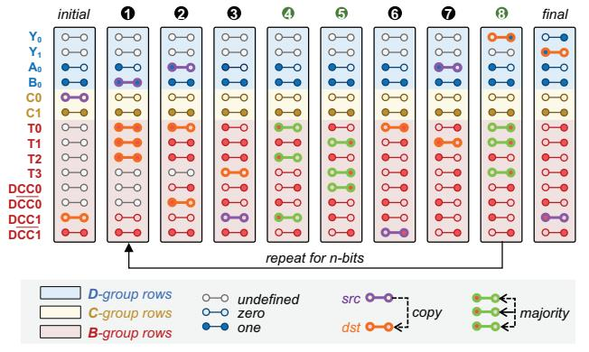
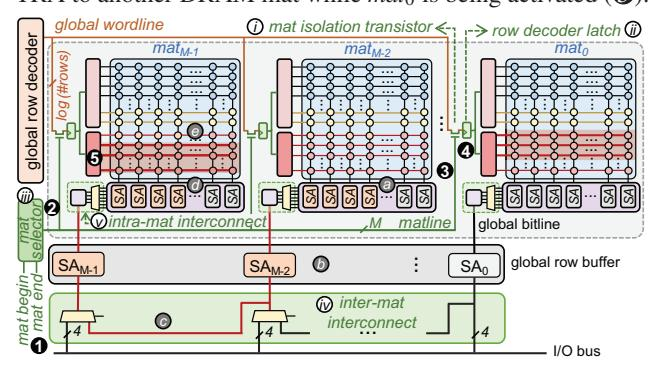
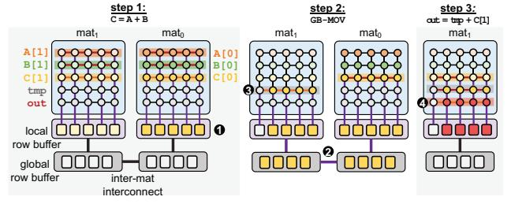
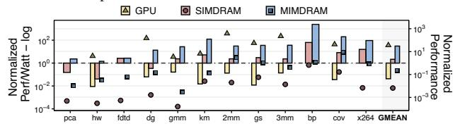
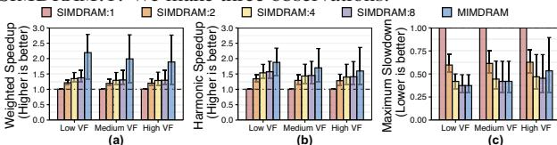
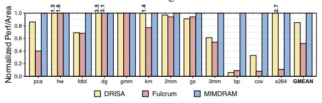
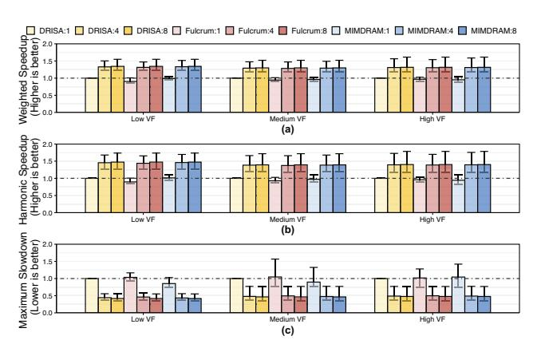
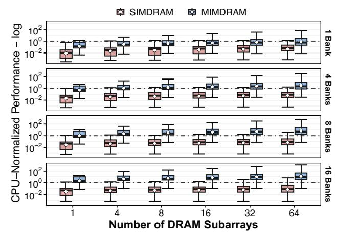

# MIMDRAM: An End-to-End Processing-Using-DRAM System for High-Throughput, Energy-Efficient and Programmer-Transparent Multiple-Instruction Multiple-Data Computing

Geraldo F. Oliveira† Ataberk Olgun† Abdullah Giray Yağlıkçı† F. Nisa Bostancı† Juan Gómez-Luna† Saugata Ghose‡ Onur Mutlu†

† ETH Zürich ‡ Univ. of Illinois Urbana-Champaign

Processing-using-DRAM (PUD) is a processing-in-memory (PIM) approach that uses a DRAM array's massive internal parallelism to execute very-wide (e.g., 16,384–262,144-bit-wide) data-parallel operations, in a single-instruction multiple-data (SIMD) fashion. However, DRAM rows' large and rigid granularity limit the effectiveness and applicability of PUD in three ways. First, since applications have varying degrees of SIMD parallelism (which is often smaller than the DRAM row granularity), PUD execution often leads to underutilization, throughput loss, and energy waste. Second, due to the high area cost of implementing interconnects that connect columns in a wide DRAM row, most PUD architectures are limited to the execution of parallel map operations, where a single operation is performed over equally-sized input and output arrays. Third, the need to feed the wide DRAM row with tens of thousands of data elements combined with the lack of adequate compiler support for PUD systems create a programmability barrier, since programmers need to manually extract SIMD parallelism from an application and map computation to the PUD hardware.

Our goal is to design a flexible PUD system that overcomes the limitations caused by the large and rigid granularity of PUD. To this end, we propose MIMDRAM, a hardware/software co-designed PUD system that introduces new mechanisms to allocate and control only the necessary resources for a given PUD operation. The key idea of MIMDRAM is to leverage finegrained DRAM (i.e., the ability to independently access smaller segments of a large DRAM row) for PUD computation. MIMDRAM exploits this key idea to enable a multiple-instruction multiple-data (MIMD) execution model in each DRAM subarray (and SIMD execution within each DRAM row segment).

We evaluate MIMDRAM using twelve real-world applications and 495 multi-programmed application mixes. Our evaluation shows that MIMDRAM provides 34× the performance, 14.3× the energy efficiency, 1.7× the throughput, and 1.3× the fairness of a state-of-the-art PUD framework, along with 30.6× and 6.8× the energy efficiency of a high-end CPU and GPU, respectively. MIMDRAM adds small area cost to a DRAM chip (1.11%) and CPU die (0.6%). We hope and believe that MIMDRAM's ideas and results will help to enable more efficient and easy-to-program PUD systems. To this end, we open source MIMDRAM at https://github.com/CMU-SAFARI/MIMDRAM.

#### 1. Introduction

Data movement between computation units (e.g., CPUs, GPUs) and main memory (e.g., DRAM) is a major performance

and energy bottleneck in current computing systems [1-20], and is expected to worsen due to the increasing data intensiveness of modern applications [21, 22]. To mitigate the overheads caused by data movement, several works propose processingin-memory (PIM) architectures [10, 17, 18, 23–117]. There are two main approaches to PIM [8, 9]: (i) processing-nearmemory (PNM) [10, 17, 18, 23–58, 104], where computation logic is added near the memory arrays (e.g., in a DRAM chip or at the logic layer of a 3D-stacked memory [118-120]); and (ii) processing-using-memory (PUM) [52, 59–103, 105, 121– 146], where computation is performed by exploiting the analog operational properties of the memory circuitry. There are two main advantages of PUM over PNM. First, PUM fundamentally eliminates data movement by performing computation in situ, while data movement still occurs between computation units and memory arrays in PNM. Second, PUM architectures exploit the large internal bandwidth and parallelism available inside the memory arrays, while PNM solutions are fundamentally bottlenecked by the memory's internal data buses.

PUM architectures can be implemented using different memory technologies, including SRAM [70,71,96–99], DRAM [52,61–67,69,73–76,78,79,83,85,86,88,125], emerging nonvolatile [59,60,68,77,81,82,90] or NAND flash [80,91–95]. Processing-using-DRAM (PUD) [52,61–67,69,73–76,78,79,83,85,86,88], in particular, enables the execution of different *bulk* operations in DRAM (i.e., PUD operations), such as (*i*) data copy and initialization [64,74,75,100], (*ii*) bitwise Boolean operations [52,61,63,67,69], (*iii*) arithmetic operations [63,66,69,88,101,125], and (*iv*) lookup table based operations [78,79,102,103,145].

PUD architectures commonly employ bit-serial computation [52,61,62,64,65,67,69,73–76,101,125], where they map each data element of a PUD operation to a DRAM column.1 A PUD architecture that leverages bit-serial computation effectively enables a very-wide single-instruction multiple-data (SIMD) execution model in DRAM, with a *large* and *rigid* computation granularity. The *large* computation granularity stems from the fact that bit-serial computation turns each one of the *many* DRAM columns in a DRAM subarray into a computing engine. For example, there are 16,384–262,144 DRAM columns in a DDR4 DRAM [147] subarray, and each can execute a *single* PUD operation over *multiple* data elements stored on the DRAM columns. The *rigid* computation granularity stems from the fact that the granularity at which DRAM rows

1We provide a detailed background on DRAM organization in §2.1.

are accessed dictates the computation granularity of a PUD operation. In commodity DRAM chips, all DRAM row accesses happen at a *fixed* granularity: the DRAM access circuitry addresses *all* DRAM columns in a DRAM row *simultaneously*. As such, *every* PUD operation operates simultaneously on *all* the 16,384 to 262,144 data elements (one per DRAM column) a DDR4 DRAM subarray stores, for example.

We highlight three limitations of state-of-the-art PUD architectures that stem from the *large* and *rigid* granularity of PUD's very-wide SIMD execution model. First, to sustain high *SIMD utilization* (i.e., the fraction of SIMD lanes executing a useful operation), each PUD operation needs to operate on a *large* amount of data. Unfortunately, not all applications have the required large amount of data parallelism to sustain high SIMD utilization in PUD architectures. Our analysis of twelve generalpurpose applications (compiled for a high-end CPU system) shows that the degree of SIMD parallelism an application has *varies* significantly, from as low as 8 to as high as 134,217,729 data elements per SIMD instruction (§3). Second, the large granularity of PUD execution makes it costly to implement interconnects that connect columns in a DRAM row. Such interconnects could allow for the implementation of PUD operations that require shifting data across DRAM columns, which is a common computing pattern present in vector-to-scalar reduction operations, e.g., sum += A[i]. This limits PUD operations to *only* parallel map operations (i.e., operations where an output data of the same dimension as the input data is produced by applying a computation independently to each input operand). A prior work [63] proposes modifications to the DRAM array to enable communication across DRAM columns. However, the interconnection network that this work proposes can lead to prohibitive area cost in commodity DRAM chips (i.e., 21% DRAM area overhead, see §8.3). Third, the need to feed a very-wide DRAM row with thousands of data elements combined with the lack of adequate compilation tools that can identify very-wide SIMD instructions in general-purpose applications and map such instructions to equivalent PUD operations create a *programmability barrier* for PUD architectures. In state-of-the-art PUD architectures [52,61–67,69,79,83,85,86,88,101,125], the programmer needs to *manually* extract a *large* and *fixed* amount of data-parallelism from an application and map computation to the underlying PUD hardware, which is a daunting task.

Our *goal* is to design a flexible PUD substrate that overcomes the three limitations caused by the large and rigid granularity of PUD execution. To this end, we propose MIMDRAM, a hardware/software co-designed PUD system that introduces the ability to allocate and control *only* the required amount of computing resources inside the DRAM subarray for PUD computation. The *key idea* of MIMDRAM is to leverage finegrained DRAM for PUD operations. Prior works on finegrained DRAM [148–155] leverage the hierarchical design of a DRAM subarray to enable DRAM row accesses with *flexible* granularity. A DRAM subarray is composed of multiple (e.g., 32–128) smaller 2D arrays of 512–1024 DRAM rows and 512–1024 columns, called *DRAM mats* [62, 65, 150, 156]. During a row access, the DRAM access circuitry *simultaneously* addresses *all* columns across *all* mats in a subarray, composing a *large* DRAM row of size [#columns\_per\_mat

× #mats\_per\_subarray]. Fine-grained DRAM modifies the DRAM access circuitry to enable reading/writing data from/to individual DRAM mats, allowing the access of DRAM rows with a smaller number of columns.

Inspired by fine-grained DRAM, we propose simple modifications to the DRAM access circuitry to enable addressing individual DRAM mats during PUD computation. Fine-grained DRAM for PUD computation brings four main advantages. First, by addressing individual DRAM mats, MIMDRAM better matches the granularity of a PUD operation to the available data-parallelism present in the application. Second, with fewer DRAM columns per PUD operation, MIMDRAM makes it feasible to implement low-cost interconnects inside a DRAM subarray, allowing for data movement *within* and *across* DRAM mats. Third, since the number of columns in a single DRAM mat is on par with the number of SIMD lanes in modern processors' SIMD engines (e.g., 512 SIMD lanes in AVX-51 SIMD engines2 [157]), MIMDRAM can leverage traditional compilers to map SIMD instructions to PUD operations. Fourth, MIM-DRAM leverages *unused* DRAM mats to *concurrently* execute *independent* PUD operations *across* DRAM mats in a *single* DRAM subarray. This enables the PUD substrate to execute a *not-so-wide* PUD operation in a subset of the DRAM mats and other independent PUD operations across the remaining DRAM mats within a single DRAM subarray, in a multiple-instruction multiple-data (MIMD) fashion [158–160].

MIMDRAM leverages fine-grained DRAM for PUD in hardware and software. On the hardware side, MIMDRAM proposes simple modifications to the DRAM subarray and includes new mechanisms to the memory controller that allow the execution of independent PUD operations across the DRAM mats in a single subarray. Concretely, MIMDRAM includes (*i*) latches, isolation transistors, and selection logic in the DRAM subarray's access circuitry to enable the execution of independent PUD operations in different DRAM mats; (*ii*) two different low-cost interconnects placed respectively at the local and global DRAM I/O circuitry, which enable communication across columns of a DRAM row at varying granularities and the execution of vector-to-scalar reduction in DRAM at low hardware cost. In the memory controller, MIMDRAM includes a new control unit that orchestrates the concurrent execution of independent PUD operations in different mats of a DRAM subarray. On the software side, MIMDRAM implements compiler passes to (*i*) automatically vectorize code regions that can benefit from PUD execution (called PUD-friendly regions); (*ii*) for such regions, generate PUD operations with the most appropriate SIMD granularity; and (*iii*) schedule the concurrent execution of independent PUD operations in different DRAM mats. We discuss how to integrate MIMDRAM in a real system, including how MIMDRAM deals with (*i*) data allocation within a DRAM subarray and (*ii*) mapping of a PUD's operands to guarantee high utilization of the PUD substrate.

We evaluate MIMDRAM's performance, energy efficiency, throughput, fairness, and SIMD utilization for twelve realworld applications from four popular benchmark suites (i.e., Phoenix [161], Polybench [162], Rodinia [163], and SPEC 2017 [164]) and 495 multi-programmed application mixes. Our evaluation shows that MIMDRAM provides 34× the performance,  $14.3 \times$  the energy efficiency,  $1.7 \times$  the throughput,  $1.3 \times$  the fairness, and  $18.6 \times$  the SIMD utilization of SIM-DRAM [101] (a state-of-the-art PUD framework); while providing  $30.6 \times$  and  $6.8 \times$  the energy efficiency of a high-end CPU and GPU, respectively. MIMDRAM's improvements are due to its ability to (i) maximize the utilization of the PUD substrate by *concurrently* executing independent PUD operations within each DRAM subarray, and (ii) allocate *only* the necessary resources (i.e., appropriate number of DRAM mats) for a PUD operation. MIMDRAM adds small area cost to a state-of-the-art DRAM chip (1.11%) and state-of-the-art CPU die (0.6%).

We make the following key contributions:

- To our knowledge, this is the first work to propose an endto-end processing-using-DRAM (PUD) system for generalpurpose applications, which executes operations in a multipleinstruction multiple-data (MIMD) fashion. MIMDRAM makes low-cost modifications to the DRAM subarray design that enable the *concurrent* execution of multiple independent PUD operations in a single DRAM subarray.
- We propose compiler passes that take as input unmodified C/C++ applications and, transparently to the programmer, (i) identify loops that are suitable for PUD execution, (ii) transform the source code to use PUD operations, and (iii) schedule independent PUD operations for concurrent execution in each DRAM subarray, maximizing utilization of the underlying PUD architecture.
- We evaluate MIMDRAM with a wide range of generalpurpose applications and observe that it provides higher energy efficiency and system throughput than state-of-the-art PUD, CPU, and GPU architectures.
- We open-source MIMDRAM at https://github.com/ CMU-SAFARI/MIMDRAM.

#### 2. Background

We first briefly explain the architecture of a typical DRAM chip.2 Second, we describe prior PUD works that MIMDRAM builds on top of.

## 2.1. DRAM Organization & Operation

**DRAM Organization.** A DRAM system comprises of a hierarchy of components, as Fig. 1 illustrates. A *DRAM module* (Fig. 1a) has several (e.g., 8–16) DRAM chips. A *DRAM chip* (Fig. 1b) has multiple DRAM banks (e.g., 8–16). A *DRAM bank* (Fig. 1c) has multiple (e.g., 64–128) 2D arrays of DRAM cells known as *DRAM mats*. Several DRAM mats (e.g., 8–16) are grouped in a *DRAM subarray*. In a DRAM bank, there are three global components that are used to access the DRAM mats (as Fig. 1c depicts): (i) a *global row decoder* that selects a row of DRAM cells *across* multiple mats in a subarray, (ii) a *column select logic* (CSL) that selects portions of the DRAM row based on the column address, and (iii) a *global sense amplifier* (i.e., global row buffer) that transfers the selected fraction of the data from the selected DRAM row through the *global bitlines*.

A *DRAM mat* (Fig. 1d) consists of a 2D array of DRAM cells organized into multiple *rows* (e.g., 512–1024) and multiple *columns* (e.g., 512–1024) [171–173]. A *DRAM cell* (Fig. 1e) consists of an *access transistor* and a *storage capacitor*. The

2We refer the reader to various prior works [14,16,61,62,64,150,155,165–170] for a more detailed description of the DRAM architecture.

source nodes of the access transistors of all the DRAM cells in the same column connect the cells' storage capacitors to the same *local bitline*. The gate nodes of the access transistors of all the DRAM cells in the same row connect the cells' access transistors to the same *local wordline*. Each mat contains (i) a *local row decoder* that drives the local wordlines to the appropriate voltage levels to open (activate) a row, (ii) a row of sense amplifiers (also called a *local row buffer*) that senses and latches data from the activated row, and (iii) helper flip-flops (HFFs) that drive a portion (e.g., 4 bit) of the data in the local row buffer to the global bitlines.

Figure 1: Overview of DRAM organization.

**DRAM Operation.** Three major steps are involved in serving a main memory request. First, to select a DRAM row, the memory controller issues an ACTIVATION (ACT) command with the row address. On receiving this command, the DRAM chip transfers all the data in the row to the corresponding local row buffer. Second, to access a cache line from the activated row, the memory controller issues a READ (RD) command with the column address of the request. Third, to enable the access of another DRAM row in the same bank, the memory controller issues a PRECHARGE (PRE) command with the address of the currently activated DRAM bank. This command disconnects the local bitline by disabling the local wordline, and the local bitline voltage is restored to its quiescent state.

## 2.2. Processing-Using-DRAM

**In-DRAM-Row Copy.** RowClone [64] enables copying a row *A* to a row *B* in the *same* subarray by issuing two consecutive ACT commands to these two rows, followed by a PRE command. This command sequence is called AAP [61].

**In-DRAM AND/OR/NOT.** Ambit [61, 62, 65, 73, 74, 76] shows that simultaneously activating *three* DRAM rows, via a DRAM operation called *triple row activation (TRA)*, can perform *in-DRAM* bitwise AND and OR operations. Ambit defines a new command called AP that issues a TRA followed by a PRE. Since TRA operations are destructive, Ambit divides DRAM rows into *three groups* for PUD computing: (*i*) the **D**ata group, which contains regular data rows; (*ii*) the **C**ontrol group, which consists of two rows (C0 and C1) with all-0 and all-1 values; and (*iii*) the **B**itwise group, which contains six rows designated for computation (four regular rows, T0, T1, T2, T3; and two rows, DCC0 and DCC1, of dual-contact cells for NOT).

**Generalizing In-DRAM Majority.** SIMDRAM [101] proposes a three-step framework to implement PUD operations. In the first step, SIMDRAM converts an AND/OR/NOT-based representation of the desired operation into an equivalent optimized MAJ/NOT-based representation. By doing so, SIMDRAM re-

duces the number of TRA operations required to implement the operation. In the second step, SIMDRAM generates the required sequence of DRAM commands to execute the desired operation. Specifically, this step translates the MAJ/NOT-based implementation of the operation into AAPs/APs. This step involves (i) allocating the designated compute rows in DRAM to the operands and (ii) determining the optimized sequence of AAPs/APs that are required to perform the operation. This step's output is a µProgram, i.e., the optimized sequence of AAPs/APs that will be used to execute the operation at runtime. Each μProgram corresponds to a different bbop instruction, which is one of the CPU ISA extensions to allow programs to interact with the SIMDRAM framework (see §6.1). In the third step, SIMDRAM uses a control unit in the memory controller to execute the bbop instruction using the corresponding µProgram. SIMDRAM implements 16 bbop instructions, including abs, add, bitcount, div, max, min, mult, ReLU, sub, and-/or-/xorreduction, equal, greater, greater equal, and if-else.

Fig. 2 illustrates how SIMDRAM executes a one-bit full addition operation using the sequence of row copy (AAP) and majority (AP) operations in DRAM. The figure shows one iteration of the full adder computation that computes  $Y_0 = A_0 +$ B0 + Cin. First, SIMDRAM uses a vertical data layout, where all bits of a data element are placed in a single DRAM column when performing PuD computation. Consequently, SIMDRAM employs a bulk bit-serial SIMD execution model, where each data element is mapped to a column of a DRAM row. This allows a DRAM subarray to operate as a PuD SIMD engine, where a single bit-serial operation is performed over a large number of independent data elements (i.e., as many data elements as the size of a logical DRAM row, for example, 65,536) at once. Second, as shown in the figure, each iteration of the full adder requires five AAPs  $(\mathbf{0}, \mathbf{0}, \mathbf{0}, \mathbf{0})$  and three APs  $(\mathbf{0}, \mathbf{0}, \mathbf{0})$  $\otimes$ ). A bit-serial addition of *n*-bit operands needs *n* iterations, thus (8n+2) APs and AAPs [101].

Figure 2: Full adder operation in SIMDRAM.

## 3. Motivation

The efficiency of state-of-the-art PUD substrates can be subpar when the SIMD parallelism that exists in an application is smaller than or not a multiple of the size of a DRAM row. To quantify the SIMD parallelism some real-world applications inherently possess, we profile the *maximum vectorization factor* of twelve real-world applications. The vectorization factor of a loop is the number of scalar operands that fit into a SIMD register [174,175]. We calculate the maximum vectorization factor by multiplying the vectorization factor of a single loop iteration and the loop's trip count [176]. We leverage modern compilers' loop auto-vectorization engines, which allows us to have an initial understanding of the SIMD parallelism that a large number of applications possesses.

For our analysis, we use (*i*) the LLVM compiler toolchain [177] (version 12.0.0) to *automatically* vectorize loops in the application, and (*ii*) an LLVM pass [178–180] that instruments each application's loop to, during execution, gather *dynamic* information about each vectorized loop, i.e., the loop trip count, execution count, execution time, and instruction breakdown [181]. We compile each application using the clang compiler [177], using the appropriate flags to enable the loop auto-vectorization engine and its loop vectorization report (i.e., -03 -Rpass-analysis=loop-vectorize -Rpass=loop-vectorize). We assume SIMDRAM [101] as the target PUD architecture.

Fig. 3 shows the distribution of maximum vectorization factors (y-axis) of all the vectorizable loops in an application (xaxis). We indicate different amounts of SIMD parallelism with horizontal dashed lines for reference. We make two observations. First, the maximum vectorization factor varies both within an application and across different applications. Our analysis shows maximum vectorization factors as low as 8 and as high as 134,217,729. Second, only a small fraction of vectorized loops have enough maximum vectorization factor (i.e., values above the green horizontal dashed line) to fully exploit the SIMD parallelism of SIMDRAM. On average, only 0.11% of all vectorized loops have a maximum vectorization factor equal to or greater than a DRAM row (i.e., greater than 65,536 data elements). We conclude that (i) real-world applications have varying degrees of SIMD parallelism; and (ii) these varying degrees of SIMD parallelism rarely take full advantage of the very-wide SIMD width of state-of-the-art PUD substrates.

Figure 3: Distribution of maximum vectorization factor across all vectorized loops. Whiskers extend to the minimum and maximum data points on either side of the box. Bubbles depict average values.

**Problem & Goal.** We observe that the rigid granularity of PUD architectures limits their efficiency (and thus their effective applicability) for many applications. Such applications would benefit from a variable-size SIMD substrate that can dynamically adapt to the varying levels of SIMD parallelism (i.e., different vectorization factors) an application exhibits during its execution. Therefore, our *goal* is to design a flexible PUD substrate that (i) adapts to the varying levels of SIMD parallelism present in an application, and (ii) maximizes the utilization of the very-wide PUD engine by concurrently exploiting parallelism across different PUD operations (potentially from different applications).

&lt;sup>3See §7 for the description of our applications and their dataset.

#### 4. MIMDRAM: A MIMD PUD Architecture

MIMDRAM is a hardware/software co-designed PUD system that enables fine-grained PUD computation at low cost and low programming effort. The key idea of MIMDRAM is to leverage fine-grained DRAM activation for PUD, which provides three benefits. First, it enables MIMDRAM to allocate only the appropriate computation resources (based on the maximum vectorization factor of a loop) for a target loop, thereby reducing underutilization and energy waste. Second, MIMDRAM can currently execute multiple independent operations inside a single DRAM subarray independently in separate DRAM mats. This allows MIMDRAM to operate as a MIMD PUD substrate, increasing overall throughput. Third, MIMDRAM implements low-cost interconnects that enable moving data across DRAM columns across and within DRAM mats by combining fine-grained DRAM activation with simple modifications to the DRAM I/O circuitry. This enables MIMDRAM to implement reduction operations in DRAM without any intervention of the host CPU cores.

#### 4.1. MIMDRAM: Hardware Overview

Fig. 4 shows an overview of the DRAM organization of MIMDRAM. Compared to the baseline Ambit subarray organization, MIMDRAM adds four new components (colored in green) to a DRAM subarray and DRAM bank, which enable (*i*) fine-grained PUD execution; (*ii*) global I/O data movement; and (*iii*) local I/O data movement.

**Fine-Grained PUD Execution.** To enable fine-grained PUD execution, MIMDRAM modifies Ambit's subarray and the DRAM bank with three new hardware structures: the *mat isolation transistor*, the *row decoder latch*, and the *mat selector*. At a high level, the *mat isolation transistor* allows for the independent access and operation of DRAM mats within a subarray while the *row decoder latch* enables the execution of a PUD operation in a range of DRAM mats that the *mat selector* defines.

First, the *mat isolation transistor* (① in Fig. 4) segments the global wordline connected to the local row decoder in each DRAM mat in a subarray. Second, the row decoder latch (ii) stores the bits from the global wordline used to address the local row decoder. Third, the mat selector ((iii)), shared across all DRAM mats in a subarray, asserts one or more mat isolation transistors. The mat selector enables the connection between the global wordline and the row decoder latches belonging to a range of DRAM mats. When issuing PUD operations, the memory controller specifies the logical address of the first and last DRAM mats that the PUD operation targets (called logical mat range). Internally, each DRAM chip (i) identifies whether any of its DRAM mats belong to the logical mat range and (ii) translates the logical mat range into the appropriate physical mat range, which is used as input for the mat selector. With these structures, different PUD operations can execute in different ranges of DRAM mats.

For example, to execute a TRA in only  $mat_0$ , MIMDRAM performs four steps: (i) when issuing a TRA, the memory controller sends, alongside the row address information, the logical  $mat\ range\ [mat\ begin\ , mat\ end] = [\#0\ ,\#0]$  to address  $mat_0$  (1) in Fig. 4); (ii) the  $mat\ selector$  (2) receives the logical mat range, translates it to the appropriate  $physical\ mat\ range$ , and raises the  $matline\ corresponding\ to\ mat_0$ , which asserts  $mat_0$ 's

mat isolation transistor (3) and connects the global wordline to  $mat_0$ 's row decoder latch; (iii) the bits of the global wordline used to drive  $mat_0$ 's local row decoder are stored in  $mat_0$ 's row decoder latch (4); (iv) finally,  $mat_0$ 's local row decoder drives the appropriate rows in  $mat_0$ 's DRAM array based on the value stored in the row decoder latch. From here, the DRAM row activation (and thus, PUD computation) proceeds as described in §2.1, only involving the DRAM rows in  $mat_0$ . Since the per-mat row decoder latch stores the local row address for a given row activation in a mat, the memory controller can issue a TRA to another DRAM mat while  $mat_0$  is being activated (5).

Figure 4: MIMDRAM subarray and bank organization. Greencolored boxes represent newly added hardware components.

Global I/O Data Movement. To enable data movement across different mats, MIMDRAM implements an *inter-mat interconnect* by slightly modifying the connection between the I/O bus and the global row buffer ( $\widehat{v}$ ) in Fig. 4). The inter-mat interconnect relies on the observation that the sense amplifiers in the global row buffer have *higher* drive than the sense amplifiers in the local row buffer [167, 182], allowing to directly drive data from the global row buffer into the local row buffer.4 To leverage this observation, MIMDRAM adds a 2:1 multiplexer to the input/output port of each set of *four* 1-bit sense amplifiers in the global row buffer. The multiplexer selects whether the data that is written to the sense amplifier set  $SA_i$  comes from the I/O bus or from the neighbor sense amplifier set  $SA_{i-1}$ .

To manage inter-mat data movement, MIMDRAM exposes a new DRAM command to the memory controller called GB-M0V (global I/O move). The GB-M0V command takes as input: (i) the logical mat range [mat begin, mat end], row address, and column address of the source DRAM row and column; and (ii) the logical mat range [mat begin, mat end], row address, and column address of the destination DRAM row and column. With the inter-mat interconnect and new DRAM command, MIMDRAM can move four bits5 of data from a source row and column (rowsrc, columnsrc) in  $mat_{M-2}$  to a destination row and column (rowdst, columndst) in  $mat_{M-1}$ , in a DRAM subarray with M DRAM mats. Once the memory controller receives a GB-M0V command, it performs three steps. First, the memory controller issues an ACT to the source row in  $mat_{M-2}$ , which loads the target DRAM  $row_{src}$  to  $mat_{M-2}$ 's local sense am-

&lt;sup>4Prior work [182] leverages the same observation to copy DRAM columns from one subarray to another.

&lt;sup>5The number of bits the inter-mat interconnect can move at once depends on the number of HFFs *already present* in a DRAM mat. We assume that each mat has four HFFs, as prior works suggest [150,151,155].

plifiers (@ in Fig. 4). Concurrently, the memory controller issues an ACT to the destination row in  $mat_{M-1}$ , which connects  $row_{dst}$  to  $mat_{M-1}$ 's local sense amplifiers. Second, the memory controller issues a RD with the address of the four-bit source column to  $mat_{M-2}$ . The column select command loads the fourbit  $column_{src}$  from  $mat_{M-2}$ 's local sense amplifiers to its HFFs, and  $mat_{M-2}$ 's HFFs drive the corresponding set of four one-bit sense amplifiers  $SA_{M-2}$  in the global row buffer (10). Third, the memory controller issues a WR with the address of the four-bit destination column to  $mat_{M-1}$ . Since the WR corresponds to a GB-MOV command, the multiplexer that connects  $mat_{M-1}$ 's HFFs to the global row buffer takes as input the added datapath coming from  $SA_{M-2}$  instead of the conventional datapath coming from the I/O bus ( $\odot$ ). As a result, the data stored in  $SA_{M-2}$ is loaded into  $SA_{M-1}$ , which in turn drives  $mat_{M-1}$ 's HFFs and local sense amplifiers (10). Once the four-bit column coming from  $row_{src}$  is written into  $mat_{M-1}$ 's local sense amplifiers, the local sense amplifiers finish the WR by restoring the local bitlines in  $mat_{M-1}$  to VDD or GND, thereby storing the four-bit column coming from columnsrc as a column of  $row_{dst}$  (②).

The conservative worst-case latency of a GB-MOV command (i.e., where the addresses of the source and the destination rows differ) is equal to  $t_{RAS} + t_{RELOC} + t_{WR} + t_{RP}$ ; where  $t_{RAS}$  is latency from the start of row activation until the completion of the DRAM cell's charge restoration,  $t_{RELOC}$  [182] is the latency of turning on the connection between the source and destination local sense amplifiers;  $t_{WR}$  is the minimum time interval between a WR and a PRE command, which allows the sense amplifiers to restore the data to the DRAM cells;  $t_{RP}$  is the latency between issuing a PRE and when the DRAM bank is ready for a new row activation.

**Local I/O Data Movement.** To enable data movement across columns *within* a DRAM mat, MIMDRAM implements an *intra-mat interconnect* (① in Fig. 4), which does *not* require any hardware modifications. Instead, it modifies the sequence of steps DRAM executes during a column access operation. There are two *key observations* that enable the intra-mat interconnect. First, we observe that the local bitlines of a DRAM mat *already* share an interconnection path via the HFFs and column select logic (as Fig. 5 illustrates). Second, the HFFs in a DRAM mat can latch and *amplify* the local row buffer's data [154, 167].

Figure 5: MIMDRAM intra-mat interconnect.

To manage intra-mat data movement, MIMDRAM exposes a new DRAM command to the memory controller called LC-MOV (local I/O move). The LC-MOV command takes as input: (i) the logical mat range [mat begin, mat end] of the target row, (ii) the row and column addresses of the source DRAM row and column; and (iii) the row and column addresses of the destination DRAM row and column. With the intra-mat interconnect and

new DRAM command, MIMDRAM can move four bits of data from a source row and column (rowsrc, columnsrc) to a destination row and column ( $row_{dst}$ ,  $column_{dst}$ ) in  $mat_M$ . Once the memory controller receives an LC-MOV command, it performs two steps, which Fig. 5 illustrates. In the first step, the memory controller performs an ACT-RD-PRE targeting rowsrc, columnsrc in  $mat_M$ . The ACT loads  $row_{src}$  to  $mat_M$ 's local sense amplifier (1) in Fig. 5). The RD moves four bits from  $row_{src}$ , as indexed by columnsrc, into the mat's HFFs by enabling the appropriate transistors in the column select logic (2). The HFFs are then enabled by transitioning the HFF enable signal from low to high. This allows the HFFs to *latch* and *amplify* the selected four-bit data column from the local sense amplifier (3). The PRE closes rowsrc. Until here, the LC-MOV command operates exactly as a regular ACT-RD-PRE command sequence. However, differently from a regular ACT-RD-PRE, the LC-MOV command does *not* lower the *HFF enable* signal when the RD finishes. This allows the four-bit data from columnsrc to reside in the mat's HFFs. In the second step, the memory controller performs an ACT-WR-PRE targeting rowdst, columndst in  $mat_M$ . The ACT loads  $row_{dst}$  into the mat's local row buffer (4), and the WR asserts the column select logic to columndst, creating a path between the HFFs and the local row buffer (3). Since the HFF enable signal is kept high, the HFFs will not sense and latch the data from  $column_{dst}$ . Instead, the HFFs overwrite the data stored in the local sense amplifier with the previously four-bit data latched from columnsrc. The new data stored in the mat's local sense amplifier propagates through the local bitlines and is written to the destination DRAM cells (**6**).

The *conservative worst-case latency* of an LC-MOV command (i.e., where the addresses of the source and the destination rows differ) is equal to  $2 \times (t_{RAS} + t_{RP}) + t_{RELOC} + t_{WR}$ .

4.1.1. PUD Vector Reduction. We describe how MIMDRAM uses the inter-mat and intra-mat interconnects to implement PUD vector reduction. To do so, we use a simple example, where MIMDRAM executes a vector addition followed by a vector reduction, i.e., out+=(A[i]+B[i]). We assume that DRAM has only two mats, and the data elements of the input arrays A and B are evenly distributed across the two DRAM mats, as Fig. 6 illustrates. MIMDRAM executes a vector reduction in three steps. In the first step, MIMDRAM executes a PUD addition operation over the data in the two DRAM mats (1), storing the temporary output data C into the same mats where the computation takes place (i.e.,  $C = \{C[0]_{mat0}, C[1]_{mat1}\}$ ). In the second step, MIMDRAM issues a GB-MOV to move part of the temporary output C[0] stored in *mat*0 to a temporary row tmp in  $mat_1$  (tmpmat 1  $\leftarrow$  C[0]mat 0) via the inter-mat interconnect (**2**-(3), four bits (i.e., four data elements) at a time. MIMDRAM iteratively executes step 2 until all data elements of C[0] are copied to mat1. In the third step, once the GB-MOV finishes, MIMDRAM executes the final addition operation, i.e. tmp + C[1], in mat1. The final output of the vector reduction operation is stored in the destination row out in  $mat_1$  (4).

Once the vector reduction operation finishes, the temporary output array stored in  $mat_1$  holds as many data elements as the number of DRAM columns in a mat (e.g., 512 data elements). MIMDRAM allows reducing the temporary output vector further to an output vector with *four* data elements using

the intra-mat interconnect. The process is analogous to that employed during the 512-element vector reduction: MIMDRAM uses the intra-mat interconnect and the LC-MOV command to implement an adder tree inside a single DRAM mat.6

Figure 6: An example of a PUD vector reduction in MIMDRAM.

## 4.2. MIMDRAM: Control & Execution

To enable MIMDRAM to execute in a MIMD fashion, we need to efficiently (*i*) *encode* and *communicate* information regarding the target DRAM mats (i.e., the target mat range) in a *timely* manner (i.e., respecting DRAM timing parameters) while (*ii*) *orchestrating* the execution of independent PUD operations across the DRAM mats of a DRAM subarray. To do so, we take a *conservative* design approach: we aim to integrate MIMDRAM in commodity DRAM chips by providing an implementation (*i*) *compatible* with existing DRAM standards and (*ii*) that does *not* add new pins to a DRAM chips.

Encoding MAT Information. MIMDRAM needs a compact way to encode the target mat information, since a DRAM module often contains many DRAM mats. To solve this issue, MIMDRAM only allows a PUD operation to be executed in a *physically contiguous* set of DRAM mats.7 In this way, when executing the DRAM commands (i.e., ACTs and PREs) that realize a PUD operation, the memory controller only needs to provide the *first* and *last* (*logical*) mats an ACT target. Then, MIMDRAM internally decides which (*physical*) mats fit into the provided mat range. To do so, MIMDRAM implements a simple *chip select logic* and *mat identifier logic* inside the I/O circuitry of each DRAM chip. The *chip select logic* and *mat identifier logic* take as input the *logical mat range* and output (*i*) if DRAM mats placed in a chip belong to the mat range, and (*ii*) the physical mat range. In case a DRAM mat placed in a chip belongs to the mat range, the DRAM chip queues the physical mat range in the *mat queue* (which we describe later in this section). The *physical mat range* is used as input for the *mat selector* (see Fig. 4). Since there are up to 128 DRAM mats in a DDR4 module [183], MIMDRAM uses 14 bits to encode the logical mat range (7 bits each for *mat begin* and *mat end*, each), from which (*i*) the three most significant bits are used to identify the target DRAM chip and (*ii*) the four least significant bits are used to identify individual mats. The *chip select logic* and *mat identifier logic* comprise simple hardware elements: four comparators, two 2-input AND gates, two 2:1 multiplexers, and a 3-bit *chip id register* in each DRAM chip.

Communicating MAT Information. MIMDRAM needs to communicate to the DRAM chip information regarding the target mats during a PUD operation. However, it is challenging

to communicate the mat information alongside an ACT due to the narrow DRAM command/address (C/A) bus interface, since the memory controller uses most of the available pins during a row activation for row address and command communication.8 Our *key idea* to solve this issue is to overlap the latency of communicating the mat information to DRAM with the latency of DRAM commands in a μProgram in two ways: (*i*) ACT–ACT overlap, and (*ii*) PRE–ACT overlap. The first case (ACT–ACT overlap) happens when issuing a row copy operation (AAP). In this case, the mat information required by the second ACT is transmitted immediately *after* issuing the first ACT, exploiting the delay between two activations. The mat information is buffered once it reaches DRAM. The second case (PRE–ACT overlap) happens when issuing the first ACT in a row copy operation or the ACT in a TRA. We notice that (*i*) the first ACT command in an AAP/AP is *always* preceded by a PRE (due to a previous AAP/AP, or due to a previous DRAM request), and (*ii*) a PRE does *not* use the row address pins, since it targets a DRAM bank (not a DRAM row). Thus, MIMDRAM uses the row address pins during a PRE that immediately precedes the first ACT in an AAP/AP command sequence to communicate the mat information.9

Timing of MAT Information. MIMDRAM needs to communicate the mat information *before* a respective ACT in a μProgram. Communicating the mat information immediately *after* the memory controller issues the ACT would open the *entire* DRAM row (instead of only the relevant portion of the DRAM row). To solve this issue, we devise a simple queuingbased mechanism for partial row activation. Our mechanism relies on the fact that the execution order of ACTs and PREs in a μProgram is *deterministic*. 10 Thus, we can add to each DRAM command in an AAP/AP the information about when the DRAM circuitry should propagate the mat information. MIM-DRAM leverages this key idea by adding a *mat queue* to the I/O logic of each DRAM chip and adding extra functionality to the existing ACT and PRE commands to control the mat queue: (*i*) ACT-enqueue issues an ACT to row\_addr in the first DRAM clock cycle and enqueues [mat\_begin,mat\_end] in the second DRAM clock cycle; (*ii*) PRE-enqueue issues a PRE to bank\_id and enqueues [mat\_begin,mat\_end]; (*iii*) ACT-dequeue issues an ACT to row\_addr and dequeues from the mat queue.

Orchestrating MAT Information. MIMDRAM needs to execute different PUD operations concurrently. To this end, we implement a control unit inside the memory controller on the CPU die, which Fig. 7 illustrates. MIMDRAM leverages SIM-DRAM control unit to translate each *bbop* instruction into its

9If there are insufficient pins in the DDRx interface to communicate mat information (e.g., as in DDR5 [185]), MIMDRAM utilizes multiple DRAM C/A cycles to propagate the mat information. For example, in DDR5, MIMDRAM still performs PRE-ACT overlap, communicating the mat information in two cycles. Note that an extra cycle does *not* impact MIMDRAM's performance, since in a PRE-ACT command sequence, the PRE still needs to wait for the completion of the ACT for more than two DRAM C/A cycles.

10To realize a PUD operation, the memory controller *must* respect the order in which ACT and PRE commands are specified in the μProgram. Therefore, during PUD execution, ACTs and PREs in a μProgram cannot be reordered, and the behavior of the μProgram is thus deterministic. If the memory controller is performing maintenance operation to a DRAM bank, the AAP/AP commands of a PUD operation wait until the maintenance operation finishes.

6The number of GB-MOV and LC-MOV commands issued depends on the bit-precision of the input operands [101].

7In §6.3, we describe how we enforce physically contiguous mat allocation.

8There are 27 C/A pins in a DDR4 chip [184], from which only three pins are *not* used during an ACT command.

corresponding μProgram and adds extra circuitry to (*i*) schedule each μProgram based on its target mats and (*ii*) maintain multiple μProgram contexts. MIMDRAM control unit consists of four main components. First, *bbop buffer*, which stores *bbops* dispatched by the host CPU. Second, *mat scheduler*, which schedules the most appropriate *bbop* to execute depending on the *bbop*'s mat range and current mat utilization. Third, *mat scoreboard*, which tracks whether a given mat is being used by a *bbop* instruction. The *mat scoreboard* stores an *M*-bit *mat bitmap* that keeps track of which mats are currently in use, where *M* is the number of mats in the DRAM module. The *mat scoreboard* can index a range of positions in the *mat bitmap* using a *mat index*. Fourth, several (e.g., eight) μ*Program processing engines*, each of which translates a *bbop* into its respective μProgram and controls the *bbop*'s execution.

Figure 7: MIMDRAM control unit in the memory controller.

MIMDRAM control unit works in four steps. In the first step, MIMDRAM control unit enqueues an incoming bbop instruction dispatched by the host CPU (**1** in Fig. 7) in the *bbop* buffer. In the second step, the mat scheduler scans the bbop buffer from the oldest to the newest element. Then, the mat scheduler employs an online first fit algorithm [186] to select a bbop to be executed. For each bbop in the bbop buffer, the algorithm: (i) extracts the mat range information encoded in the *bbop* (2), which is used to index the *mat scoreboard* (3); (ii) reads the mat bitmap to identify whether the mats belonging to the bbop's mat range are currently free or busy (4); (iii) in case the mats are free, the mat scheduler writes a new mat bitmap to the mat scoreboard, indicating that the given mat range is now busy, selects the current bbop to be executed by allocating and copying the bbop to a free µProgram processing engine (5), and removes the current bbop from the bbop buffer (6); (iv) in case the mats belonging to the bbop's range are busy, the mat scheduler reads the next available bbop from the bbop buffer and repeats (i)-(iii). In the third step, one or multiple µProgram processing engines execute their allocated bbop, issuing AAPs/APs to the DRAM chips (**1**). The μProgram processing engine is responsible for maintaining the timing of AAP/AP commands. In our design, we avoid the need to maintain state for all DRAM mats in a DRAM module individually by: (i) only allowing a PUD operation to address a contiguous range of DRAM mats, which share state as they execute the same sequence of ACT-PRE commands and (ii) limiting the number of concurrent PUD operations to the number of μProgram processing engines available in the control unit. In the fourth step, when a µProgram processing engine finishes executing, it frees its allocated mats by correspondingly updating the mat bitmap in the mat scoreboard (8) and notifies the CPU that the execution of the bbop instruction is done.

## 5. MIMDRAM: Software Support

To ease MIMDRAM's programmability, we provide compiler support to transparently map SIMD operations to MIMDRAM. Fig. 8 illustrates MIMDRAM's compilation flow, which we implement using LLVM [177]: we take a C/C++ application's source code as input, perform three transformations passes, and output a binary with a mix of CPU and PUD instructions.

Figure 8: MIMDRAM's compilation flow.

**Pass 1: Code Identification.** The first pass is responsible for code identification. Its goal is to identify (i) loops that can be successfully auto-vectorized and (ii) the appropriate vectorization factor of a given vectorized loop. The code identification pass takes as input the application's LLVM intermediate representation (IR) generated by the compiler's front-end. It produces as output an optimized IR containing SIMD instructions that will be translated to bbop instructions. We leverage the native LLVM's loop auto-vectorization pass [187] to identify and transform loops into their vectorized form (1) in Fig. 8). 11 We apply two modifications to LLVM's loop auto-vectorization pass. First, instead of using a cost model to choose the vectorization factor that leads to the highest performance improvement compared to a scalar version of the same loop, we always select the *maximum* vectorization factor for the loop. This is important because the native cost model takes into account the hardware characteristics of a target CPU SIMD engine (i.e., number of available vector registers, SIMD width of the target execution engine, the latency of different SIMD instructions), which are not representative of our MIMDRAM engine with a variable SIMD width. Second, we modify the code generation routine for a given vectorized loop. Concretely, for a given vectorized loop, we identify and remove memory instructions related to each arithmetic SIMD operation (i.e., load/store instructions that manipulate vector registers) since PUD operations directly manipulate the data stored in DRAM; thus, there is no need to explicitly move data into/out SIMD registers.

Pass 2: Code Scheduling & Data Mapping. The second pass is responsible for *code scheduling and data mapping*. Its goal is to improve overall SIMD utilization by allowing the distribution of independent PUD instructions across DRAM mats. Since PUD instructions operate directly on the data stored in DRAM, the DRAM mat where the data is allocated determines the efficiency and utilization of the PUD SIMD engine. If operands of independent instructions are distributed across different DRAM mats, such instructions can be executed concurrently. Likewise, operands of dependent instructions are mapped to the same DRAM mat. In that case, intermediate data that one instruction produces and the next instruction consumes do *not* need to be moved across different DRAM mats, improving energy efficiency. Leveraging these observations, the code scheduling

11Prior works [188, 189] also leverage modern compilers' loop autovectorization engines to generate instructions to processing-near-memory (PNM) architectures equipped with SIMD engines.

pass takes as input all *bbop* instructions the code identification pass generates and outputs new *bbop* instructions containing metadata regarding their mat location (i.e., *mat label*). The code scheduling pass works in two steps.

In the first step, the code scheduling pass creates a datadependency graph (DDG) of the vectorized instructions (2). Each node represents a bbop instruction, incoming edges represent input, and outgoing edges represent output of the bbop. In the second step, the code scheduling pass takes as input the DDG and employs a data scheduling algorithm to distribute bbop instructions across DRAM mats (3). The data scheduling algorithm traverses the DDG in topological order to respect dependencies between bbop instructions using a depth-first search (DFS) kernel, which is a common algorithm for topological ordering [190, 191], and performs three operations. First, the algorithm traverses the *left* nodes in the DDG, assigning a single mat label i to nodes in the left path (**3**-**a**). Second, when the algorithm reaches a leaf node, it traverses the right sub-tree in the DDG. In this case, the algorithm assigns a new *mat label j* to the nodes in the *right* path in the sub-tree (**3**-**6**). Third, once the algorithm visits all the nodes in the right sub-tree, it returns to the parent node of the sub-tree. Since the parent node has already been visited when descending into the left path, the left and right sub-tree nodes will be assigned to different mats while having data dependencies across them (as indicated by the parent node). In this case, the algorithm creates a data movement bbop instruction (see §6.1) to move the output produced by the right sub-tree from *mat label j* to *mat label i* (**3**-**a**). This process repeats until the algorithm visits all nodes in the DDG.

**Pass 3: Code Generation.** The third pass is responsible for (i) data allocation and (ii) code generation. It takes as input the LLVM IR containing both CPU and bbop instructions (with metadata) and produces a binary to the target ISA (4). To implement data allocation, the code generation pass first identifies calls for memory allocation routines (e.g., malloc) associated with operands of bbops and replaces such memory allocation routines with a specialized PIM memory allocation routine (i.e., pim\_malloc, see §6.3). pim\_malloc receives as input the mat label assigned to its associated bbop instruction. Second, the pass inserts a bbop\_trsp\_init instruction right after each pim\_malloc call for each memory object that is an input/output of a bbop instruction. This instruction registers the memory object in MIMDRAM's transposition unit (§6.2). Similar to the pim\_malloc call, the bbop\_trsp\_init instruction receives as input the *mat label* assigned to its associated *bbop* instruction. To implement code generation, we modify LLVM's X86 backend to identify bbop instructions and generate the appropriate assembly code. In case the application uses parallel primitives (e.g., OpenMP pragmas [192]) to parallelize outermost loops, the code generation pass interacts with the underlying runtime system to statically distribute bbop instructions from innermost loops across the available DRAM mats in a subarray, i.e., mats with unassigned mat labels. This allows MIMDRAM to execute in a single-instruction multiple-thread (SIMT) [193, 194] fashion for manually parallelized applications.

# 6. System Support for MIMDRAM

We envision MIMDRAM as a tightly-coupled accelerator for the host processor. As such, MIMDRAM relies on the host processor for its system integration, which includes ISA support (§6.1), instruction execution & data transposition (§6.2), and operating system support for address translation and data allocation & alignment (§6.3).

#### **6.1.** Instruction-Set Architecture

Table 1 shows the CPU ISA extensions that MIMDRAM exposes to the compiler.12 There are five types of instructions: (i) object initialization instructions, (ii) 1-input arithmetic instructions, (iii) 2-input arithmetic instructions, (iv) predication instructions, and (v) data movement instructions. The first three types of MIMDRAM instructions are inherited from the SIMDRAM ISA [101]. These instructions can be further divided into two categories: (i) operations with one input operand (e.g., bitcount, ReLU), and (ii) operations with two input operands (e.g., addition, division, equal, maximum). To enable predication, MIMDRAM uses the bbop\_if\_else instruction that SIMDRAM introduces, which takes as input three operands: two input arrays (src1 and src2) and one predicate array (select). We modify such instructions by including two new fields: (i) mat label (ML), which identifies groups of instructions that must execute inside the same DRAM mat, and (ii) vectorization factor (VF), which dictates how many scalar operands are packed within the vector instruction. These two new fields are automatically generated by MIMDRAM's compiler passes (§5).

Table 1: MIMDRAM ISA extensions.

| Type                                               | ISA Format                                                                                                                                |  |  |  |  |
|----------------------------------------------------|-------------------------------------------------------------------------------------------------------------------------------------------|--|--|--|--|
| Initialization 1-Input Arith. 2-Input Arith. | bbop_trsp_init addr, size, n, ML bbop_op dst, src, size, n, ML, VF bbop_op dst, src 1 , src 2 size, n, ML, VF |  |  |  |  |
| Predication Data Move                           | bbop_if_else dst, src1, src2, sel, size, n, ML, VF bbop_mov dst, dst_idx, src, src_idx, size, n                                           |  |  |  |  |

Data movement instructions allow the compiler to trigger inter-mat and intra-mat data movement operations. In a data movement instruction, dst and src represent the source and destination arrays; dst\_idx and src\_idx represent the first position of the first element inside the source and destination arrays to be moved; size represents the number of elements to move from source to the destination array; n represents the number of bits in each array element. MIMDRAM control unit automatically identifies the mat range the data movement instruction targets by calculating the distance between the source and destination arrays, taking into account the indexes and number of elements to move. In case the source and destination mats are the same, MIMDRAM control unit translates the data movement instruction into an LC-MOV command: otherwise, a GB-MOV command.

#### 6.2. Execution & Data Transposition

**Instruction Fetch and Dispatch.** MIMDRAM relies on the host CPU to offload *bbop* instructions to DRAM since they are part of the CPU ISA. Assuming that the host CPU consists of one or more out-of-order cores, MIMDRAM leverages the host

12MIMDRAM ISA extensions are vector-oriented by design. We did *not* use an existing ISA because we needed to define new fields for MIMDRAM that do *not* exist in current vector ISAs (e.g., mat label information). Instead, we propose to extend the baseline CPU ISA with MIMDRAM instructions since there is usually more than enough unused opcode space to support the extra opcodes that MIMDRAM requires [195, 196]. Extending the CPU ISA to interface with accelerators is a common approach [18, 61, 101, 197, 198].

processor's front-end to (*i*) identify and (*ii*) dispatch to MIM-DRAM control unit *only* independent *bbop*s. This simplifies the design of MIMDRAM control unit since no in-flight *bbop* instructions will have data dependencies. As a result, MIM-DRAM control unit can freely schedule μPrograms to the PUD SIMD engine as they arrive.

Data Coherence. Input arrays to MIMDRAM may be generated or modified by the CPU, and the data updates may reside only in the cache (e.g., because the updates have not yet been written back to DRAM). To ensure that MIMDRAM does not operate on stale data, programmers are responsible for flushing cache lines [199, 200] modified by the CPU. MIMDRAM can leverage coherence optimizations tailored to PIM to improve overall performance [38, 44].

MIMDRAM Transposition Unit. MIMDRAM transposition unit shares the same hardware components and functionalities as the SIMDRAM transposition unit [101], which includes: (*i*) *object tracker*, a small cache that keeps track of the memory objects used by *bbop* instructions; (*ii*) an *horizontal to vertical transpose* unit, which converts cache lines of memory objects stored in the object tracker from a horizontal to vertical data layout during a last-level cache (LLC) writeback; (*iii*) a *vertical to horizontal transpose* unit, which converts cache lines of memory objects stored in the object tracker from a vertical to horizontal data layout during an LLC read request; (*iv*) *store* and *fetch* units, which generate memory read/write requests using the transpose units' output data. One main limitation of the SIMDRAM transposition unit is that it needs to fill *at least* an entire DRAM row with vertically-laid out data before the execution of a *bbop*. Instead, MIMDRAM transposes only as much data as required to fill the segment of the DRAM row that the *bbop* instruction operates over. To do so, the MIMDRAM transposition unit adds information regarding the mat range a memory object operates to the object tracker.

## 6.3. Operating System Support

Address Translation. As SIMDRAM, MIMDRAM operates directly on physical addresses. When the CPU issues a *bbop* instruction, the instruction's virtual memory addresses are translated into their corresponding physical addresses using the same translation lookaside buffer (TLB) lookup mechanisms used by regular load/store operations.

Data Allocation & Alignment. MIMDRAM (as other PUD architectures [61, 62, 64, 65, 73–76, 79, 86]) requires OS support to guarantee that data is properly mapped and aligned within the boundaries of the bank/subarray/mat that will perform computation. Particularly, since PUD operations are executed in-situ, it is essential to enforce that memory objects belonging to the same *bbop* (and their dependent instructions) are placed together in the same DRAM mats. To achieve this functionality, we propose the implementation of a new data allocation API called pim\_malloc. The main idea is to allow the compiler to inform the OS memory allocator about the memory objects that must be allocated inside the same set of DRAM mats. The pim\_malloc API takes as input the *size* of the memory region to allocate (as a regular malloc instruction) and the *mat label* that the compiler generates (§5). Then, it ensures that *all* memory objects with the same *mat label* are placed together within a set

of DRAM mats that satisfies the target memory allocation size.

To allow the pim\_malloc API to influence the OS memory allocator and ensure that memory objects are placed within specific DRAM mats, we propose a new *lazy data allocation routine* (in the kernel) for pim\_malloc objects. This routine has three main components: (*i*) information about the DRAM organization (e.g., row, column, and mat sizes), (*ii*) the DRAM interleaving scheme, which the memory controller provides via an open firmware device tree [201];13 and (*iii*) a huge page pool for pim\_malloc objects (configured during boot time), which guarantees that virtual addresses assigned to a pim\_malloc object are contiguous in the physical address space and that DRAM mats are free whenever a pim\_malloc object is allocated. The allocation routine uses the DRAM address mapping knowledge to split the huge pages into different memory regions. Then, when an application calls the pim\_malloc API, the allocation routine selects the appropriate memory region that satisfies pim\_malloc. Internally, the pim\_malloc API operates using three main sub-tasks, depending on the order of the data allocation: (*i*) pim\_preallocate, for data pre-allocation; (*ii*) pim\_alloc, for the first data allocation; and (*iii*) pim\_alloc\_align, for subsequent aligned allocations.

- (*i*) Pre-Allocation. The first sub-task's role is to indicate the number of huge pages available for PUD allocations. We leave it to the user to provide the number of huge pages used for PUD operations because huge pages are scarce in the system.
- (*ii*) First Allocation. The second sub-task uses the *worst-fit allocation scheme* [206] to manage the allocation of memory regions in the huge page pool. The *key idea* behind this placement strategy is to optimize the remaining memory space after allocations to increase the chances of accommodating another process in the remaining space. For the first PUD memory allocation, the pim\_alloc sub-task simply scans an *ordered array* data structure (similar to the one used in the Linux Kernel buddy allocator algorithm [207], where each entry represents the number of memory regions in a single subarray) to select the subarray with the *largest* amount of memory regions available. If the requested memory allocation requires more than one memory region, MIMDRAM iteratively scans the *ordered array*, searching for the next largest memory region until the memory allocation is fully satisfied. Once enough space is allocated, pim\_alloc sub-task creates a new allocation object and inserts it in an *allocation hashmap*, which is indexed by the allocation's virtual address. The sub-task needs to keep track of allocations since it might need to find a memory region from the *same* subarray/mat when performing future *aligned allocations*.
- (*iii*) Aligned Allocation. After allocating a memory region for the first operand in a PUD operation, the user can use this memory region as a regular memory object. However, when allocating the remaining operands for a PUD operation, the

13The DRAM interleaving scheme can be obtained by reverse engineering the bit locations of memory addresses [202–205]. Even though typical DRAM interleaving does *not* take mats into account, it is relatively straightforward to reverse-engineer how a memory address is distributed across the DRAM mats in a DRAM module, since the mat interleaving is a function of the DRAM chip's organization. For example, in a DDR4 module with 8 chips, 16 mats per chip, and 4 HFFs per mat, a 64 B cache line is evenly distributed across all 128 total mats; i.e., the four least-significant bits of the cache line are placed in mat 0, chip 0, and the four most-significant bits of the cache line are placed in mat 15, chip 7. Our pim\_malloc API takes into account such mat interleaving.

pim\_malloc API needs to guarantee data alignment for all memory objects within the same DRAM subarray/mat. To this end, the third sub-task (pim\_malloc\_align) identifies a previously allocated memory region to which the current memory allocation must be aligned (based on the compiler-generated mat labels). The pim\_malloc\_align sub-task works in five main steps. First, it searches the allocation hashmap for a match with previously allocated memory regions. If a match is not found, the allocation fails. Second, if a match is found, the pim\_malloc\_align sub-task iterates through the identified previously-allocated memory regions. Third, for each memory region, the sub-task identifies its source subarray/mat address and tries to allocate another memory region in the same subarray/mat for the new allocation. Fourth, if the subarray/mat of a given memory region has no free region, the sub-task allocates a new memory region from another subarray/mat following the worst-fit allocation scheme. Since we use a worst-fit allocation scheme that always selects the *largest* number of memory regions available during memory allocation for the *first* operand of a PUD operation, we have a good chance of having a single subarray/mat holding memory regions for the remaining operands of a PUD operation. Fifth, since memory regions might come from different huge pages, we must perform re-mmap to map such memory regions into contiguous virtual addresses.

Mat Label Translation. To keep track of the mapping between mat labels and allocated mat ranges, MIMDRAM adds a small mat translation table alongside the page table. The table is indexed by hashing the mat label with the process ID. It stores in each entry the associated mat range that the memory allocator assigned to that particular mat label. When the CPU dispatches a bbop, the CPU (i) accesses the mat translation table to obtain the mat range assigned to the given bbop, and (ii) replaces the mat label with the mat range.

#### 7. Methodology

We implement MIMDRAM using the gem5 simulator [208] and compare it to a real multicore CPU (Intel Skylake [209]), a real high-end GPU (NVIDIA A100 [210]), and a state-of-the-art PUD framework (SIMDRAM [101]). In all our evaluations, the CPU code is optimized to leverage AVX-512 instructions [157]. Table 2 shows the system parameters we use. To measure CPU energy consumption, we use Intel RAPL [211]. We capture GPU kernel execution time that excludes data initialization/transfer time. To measure GPU energy consumption, we use the nvml API [212]. We implement SIMDRAM on gem5, taking into account that the latency of executing the back-toback ACTs is only  $1.1 \times$  the latency of  $t_{RAS}$  [61,62,65,73,74,76], and validate our implementation rigorously with the results reported in [101]. We use CACTI [213] to evaluate MIM-DRAM and SIMDRAM energy consumption, where we take into account that each additional simultaneous row activation increases energy consumption by 22% [61,101]. Our simulation accounts for the additional latency imposes by MIMDRAM's mat isolation transistors and row decoder latches (i.e., measured (using CACTI [213, 214]) to incur less than 0.5% extra latency for an ACT). We open-source our simulation infrastructure at https://github.com/CMUSAFARI/MIMDRAM.

**Real-World Applications.** We analyze 117 applications from

Table 2: Evaluated system configurations.

| Real Intel Skylake CPU [209]         | x86 [199], 16 cores, 8-wide, out-of-order, 4 GHz; L1 Data + Inst. Private Cache: 256 kB, 8-way, 64 B line; L2 Private Cache: 2 kB, 4-way, 64 B line; L3 Shared Cache: 16 MB, 16-way, 64 B line; Main Memory: 64 GB DDR4-2133, 4 channels, 4 ranks                                                                                                                                                                         |  |  |
|-----------------------------------------|---------------------------------------------------------------------------------------------------------------------------------------------------------------------------------------------------------------------------------------------------------------------------------------------------------------------------------------------------------------------------------------------------------------------------------------|--|--|
| Real NVIDIA A100 GPU [210]           | 7 nm technology node; 6912 CUDA Cores; 108 streaming multiprocessors, 1.4 GHz base clock; L2 Cache: 40 MB L2 Cache; Main Memory: 40 GB HBM2 [119, 120]                                                                                                                                                                                                                                                                          |  |  |
| Simulated SIMDRAM [101] & MIMDRAM | gem5 system emulation; x86 [199], 1-core, out-of-order, 4 GHz; L1 Data + Inst. Cache: 32 kB, 8-way, 64 B line; L2 Cache: 256 kB, 4-way, 64 B line; Memory Controller: 8 kB row size, FR-FCFS [215,216] Main Memory: DDR4-2400, 1 channel, 8 chips, 4 rank 16 banks/rank, 16 mats/chip, 1 K rows/mat, 512 columns/mat MIMDRAM's Setup: 8 entries mat queue, 2 kB bbop buffer 8 µProgram processing engines, 2 kB mat translation table |  |  |

seven benchmark suites (SPEC 2017 [164], SPEC 2006 [217], Parboil [218], Phoenix [161], Polybench [162], Rodinia [163], and SPLASH-2 [219]) to select applications that (i) are memorybound, and (ii) the most time-consuming loop can be autovectorized. From this analysis, we collect 12 multi-threaded CPU applications (as Table 3 describes) from different domains (i.e., video compression, data mining, pattern recognition, medical imaging, stencil computation), and their respective GPU implementations, when available. Our evaluated applications are: (i) 525.x264\_r (x264) from SPEC 2017; (ii) heartwall (hw), kmeans (km), and backprop (bs) from Rodinia; (iii) pca from Phoenix; and (iv) 2mm, 3mm, covariance (cov), doitgen (dg), fdtd-apml (fdtd), gemm (gmm), and gramschmidt (gm) from Polybench. 14 Since our base PUD substrate (SIMDRAM) does not support floating-point, we manually modify the selected floating-point-heavy auto-vectorized loops to operate on fixedpoint data arrays. 15 We use the largest input dataset available and execute each application end-to-end in our evaluations.

Table 3: Evaluated applications and their characteristics.

| Benchmark Suite | Application (Short Name)   | Dataset Size               | # Vector Loops | VF {min, max} | PUD Ops.† |
|--------------------|-------------------------------|-------------------------------|-------------------|------------------|--------------|
| Phoenix [161]      | ‡pca (pca)                    | reference                     | 2                 | {4000, 4000}     | D, S, M, R   |
| Polybench [162]    | 2mm (2mm)                     | NI = NJ = NK = NL = 4000      | 6                 | {4000, 4000}     | M, R         |
|                    | ‡ 3mm (3mm)        | NI = NJ = NK = NL = NM = 4000 | 7                 | {4000, 4000}     | M, R         |
|                    | covariance (cov)              | N = M = 4000                  | 2                 | {4000, 4000}     | D, S, R      |
|                    | doitgen (dg)                  | NQ = NR = NP = 1000           | 5                 | {1000, 1000}     | M, C, R      |
|                    | ‡ fdtd-apml (fdtd) | CZ = CYM = CXM = 1000         | 3                 | {1000, 1000}     | D, M, S, A   |
|                    | gemm (gmm)                    | NI = NJ = NK = 4000           | 4                 | {4000, 4000}     | M, R         |
|                    | gramschmidt (gs)              | NI = NJ = 4000                | 5                 | {4000, 4000}     | M, D, R      |
| Rodinia [163]   | backprop (bs)                 | 134217729 input elm.          | 1                 | {17, 134217729}  | M, R         |
|                    | heartwall (hw)                | reference                     | 4                 | {1, 2601}        | M, R         |
|                    | kmeans (km)                   | 16384 data points             | 2                 | {16384, 16384}   | S, M, R      |
| SPEC 2017 [164] | 525.x64_r (x264)              | reference input               | 2                 | {64, 320}        | A            |

†: D = division, S = subtraction, M = multiplication, A = addition, R = reduction, C = copy

Multi-Programmed Application Mixes. To measure system throughput and fairness, we *manually* create 495 application mixes by randomly selecting eight applications (from our group of 12 applications) for execution co-location. We classify each application mix into one of three categories: *low*, *medium*, and *high* vectorization factor (VF) mixes based on Fig. 3. In the *low* mix, the maximum VF of *all* eight applications is lower than 16K; in the *medium* mix, *at least* one application has a maximum vectorization factor between 16K (inclusive) and 64K; and in the *large* mix, *at least* one application has a maximum VF larger than 64K (inclusive).

14Several prior works [72, 128, 189, 220–223] show that our selected twelve workloads can benefit from different types of PIM architectures.

15We only modify the three applications from the Rodinia benchmark suite to use fixed-point operations. Prior works [128, 224, 225] also employ fixed-point for the same three Rodinia applications. The applications from Polybench can be configured to use integers; the auto-vectorized loops in 525.x264\_r use uint8\_t; pca uses integers. We do *not* observe an output quality degradation when employing fixed-point for the selected loops.

‡: application with independent PUD operations

Comparison to State-of-the-Art PIM Architectures. We compare MIMDRAM to two other state-of-the-art PIM architectures: DRISA [63] and Fulcrum [104]. DRISA is a combined PUM and PNM architecture that significantly modifies the DRAM microarchitecture and organization to enable bulk in-DRAM computation (e.g., by using 3T1C DRAM cells to execute in-situ bitwise NOR operations and by adding logic gates *near* the subarray's sense amplifiers). Fulcrum is a PNM architecture that adds computation logic *near* subarrays. Fulcrum's primary components are a series of shift registers (called walkers) that latch input/output DRAM rows and a narrow scalar ALU that executes arithmetic and logic operations. We model the DRISA 3T1C implementation and Fulcrum (i) using a DRAM module of equal dimensions (i.e., number of DRAM ranks, chips, banks, mats, rows, and columns) as the baseline DDR4 DRAM we use for SIMDRAM and MIMDRAM (see Table 2) and (ii) including all the changes that the DRISA 3T1C and Fulcrum architectures propose to the DRAM cell array and DRAM subarray.

#### 8. Evaluation

We demonstrate the advantages of MIMDRAM by evaluating (i) SIMD utilization and energy efficiency (i.e., performance per Watt) for single applications (§8.1); (ii) system throughput (in terms of weighted speedup [226–228]), job turnaround time (in terms of harmonic speedup [227,229]), and fairness (in terms of maximum slowdown [215,230-239]) for multi-programmed application mixes in comparison to the baseline CPU, GPU, and a state-of-the-art PUD architecture, i.e., SIMDRAM [101] (§8.2); (ii) area-normalized performance analysis for single applications and throughput analysis for multi-programmed application mixes in comparison to state-of-the-art PIM architectures, i.e., DRISA [63] and Fulcrum [104] (§8.3). In most of our analyses (§8.1–§8.2), to keep our analyses pure, we very *conservatively* allow MIMDRAM to use only a single DRAM subarray in a single DRAM bank for PUD computation. In §8.4, we perform a scalability analysis to evaluate MIMDRAM's performance when enabling *multiple* DRAM subarrays and banks for PUD computation, which reflects a more accurate evaluation of the true benefits of MIMDRAM and PUD. Finally, we evaluate MIMDRAM's DRAM and CPU area cost (§8.5).

## 8.1. Single-Application Results

Fig. 9 shows MIMDRAM's SIMD utilization and normalized energy efficiency (in performance per Watt) for all 12 applications. Values are normalized to the baseline CPU.

SIMD Utilization. We make two observations from Fig. 9a. First, MIMDRAM *significantly* improves SIMD utilization over SIMDRAM. On average across all applications, MIMDRAM provides 15.6× the SIMD utilization of SIMDRAM. This is because MIMDRAM matches the available SIMD parallelism in an application with the underlying PUD resources (i.e., PUD SIMD lanes) by using *only* as many DRAM mats as the maximum vectorization factor of a given application's loop. In contrast, SIMDRAM always occupies *all* available PUD SIMD lanes (i.e., entire subarrays) for a given operation, resulting in low SIMD utilization for applications without a very-wide vectorization factor. Second, we observe that SIMD utilization can vary considerably within an application. For example,

(a) SIMD utilization. Whiskers extend to the minimum and maximum observed data point values.

(b) CPU-normalized performance per Watt (left y-axis; bars) and performance (right y-axis; dots).

Figure 9: Single-application results for processor-centric (i.e., CPU and GPU) and memory-centric (i.e., SIMDRAM and MIMDRAM) architectures executing twelve real-world applications.

MIMDRAM's SIMD utilization for hw and bp goes from as low as 0.2% to as high as 100%. This happens because the SIMD parallelism for each vectorized loop in these applications changes at different execution phases. MIMDRAM can better adjust to the variation in SIMD parallelism (than SIMDRAM) due to its flexible design. We conclude that MIMDRAM greatly improves overall SIMD utilization for many applications.

Performance & Energy Efficiency. We make three observations from Fig. 9b. First, MIMDRAM significantly improves energy efficiency and performance over SIMDRAM. On average across all applications, MIMDRAM provides 14.3× the energy efficiency and 34× the performance of SIMDRAM. MIMDRAM's higher energy efficiency is due to three main reasons. (i) MIMDRAM parallelizes the computation of independent bbops in a single application loop across different mats, improving overall performance. MIMDRAM reduces execution time by 2.8× compared with SIMDRAM, on average across applications with independent *bbops* (i.e., pca, 3mm, and fdtd). (ii) MIMDRAM implements in-situ PUD vector reduction operations, while SIMDRAM requires the assistance of the CPU for vector reduction, increasing latency and energy consumption. MIMDRAM reduces execution time and energy consumption by  $1.6 \times$  and  $266 \times$  over SIMDRAM, on average across the applications with vector reduction operations (from our twelve applications, only fdtd and x264 do not require vector reduction operations). (iii) MIMDRAM activates only the necessary PUD SIMD lanes during an application loop's execution, significantly saving energy when the application has low SIMD utilization. MIMDRAM reduces energy consumption by 325× over SIMDRAM, on average across applications with a maximum vectorization factor lower than 65,536 (from our twelve applications, only bs exhibits a vectorization factor higher than 65,536). Second, MIMDRAM provides  $30.6 \times 6.8 \times$  the energy efficiency of CPU/GPU baselines. MIMDRAM's higher energy efficiency is due to its inherent ability to avoid costly data movement operations for memory-bound applications. Third, even though MIMDRAM improves performance (by  $3.1\times$ ,  $8.6\times$ ,  $1.1\times$ , and  $1.3\times$ ) compared to the baseline CPU for some applications (i.e., 2mm, cov, gs, and bp), it leads to performance loss compared to the baseline CPU and GPU on average across all applications. This is because, for some applications, the bulk parallelism available inside a *single* DRAM subarray and bank is insufficient to hide the latency of costly bit-serial operations (e.g., multiplication). We observe that enabling MIMDRAM in 16 DRAM banks and 64 subarrays (per bank) allows MIMDRAM to provide performance gains compared to the CPU and the GPU (see §8.4). We conclude that MIMDRAM is an energy-efficient and high-performance PUD system.

## 8.2. Multi-Programmed Workload Results

We evaluate SIMDRAM and MIMDRAM's impact on system throughput (in terms of weighted speedup [226-228]), job turnaround time (in terms of harmonic speedup [227, 229]), and fairness (in terms of maximum slowdown [215,230–239]) when executing applications concurrently. To provide a fair comparison, we introduce MIMD parallelism in SIMDRAM with bank-level parallelism (BLP) [14, 230, 240-242], where each SIMDRAM-capable DRAM bank can independently run an application. We evaluate four configurations of SIMDRAM where 1 (SIMDRAM:1), 2 (SIMDRAM:2), 4 (SIMDRAM:4), and 8 (SIMDRAM:8) banks have SIMDRAM computation capability. Fig. 10 shows the system throughput, job turnaround time (which measures a balance of fairness and throughput), and fairness that SIMDRAM and MIMDRAM provide on average across all application mixes. Values are normalized to SIMDRAM: 1. We make three observations.

Figure 10: Multi-programmed workload results for three types of application mixes: (a) low VF, (b) medium VF, and (c) high VF. VF stands for vectorization factor. SIMDRAM:X uses X DRAM banks for computation. Values are normalized to SIMDRAM:1. Whiskers extend to the minimum and maximum observed data point values.

First, MIMDRAM significantly improves system throughput, job turnaround time, and fairness compared with SIM-DRAM. On average, across all application groups, MIMDRAM achieves: (i)  $1.68 \times$  (min.  $1.52 \times$ , max.  $2.02 \times$ ) higher weighted speedup, (ii)  $1.33 \times$  (min.  $1.17 \times$ , max.  $1.72 \times$ ) higher harmonic speedup, and (iii) 1.32× (min. 0.95×, max. 2.29×) lower maximum slowdown than SIMDRAM (averaged across all four configurations). Second, MIMDRAM using a single subarray and single bank for computation, provides 1.68×, 1.54×, and 1.52× the system throughput of SIMDRAM using 2, 4, and 8 banks for computation, respectively. This happens because MIMDRAM (i) utilizes idle resources at DRAM mat granularity to execute computation as soon as a mat is available, thus reducing queuing time and improving parallelism; and (ii) reduces execution latency of a single application due to its concurrent execution of independent bbop instructions and support for PUD vector reduction. Third, even though MIM-DRAM achieves similar fairness compared with SIMDRAM:4 and SIMDRAM:8 for application mixes with low and medium VF, MIMDRAM's maximum slowdown is 15% (12%) higher

than SIMDRAM:8 (SIMDRAM:4) for application mixes with high VF. This is because in MIMDRAM (i) applications share the DRAM mats available inside a single DRAM bank and (ii) bbops are dispatched to execution using an online first fit algorithm. In this way, an application in a mix with high occupancy and execution latency penalizes an application with low occupancy and execution time, negatively impacting fairness. In contrast, such interference does not happen in SIM-DRAM:8 since each application is assigned to a different DRAM bank to execute at the cost of occupying eight banks instead of one. MIMDRAM's fairness can be further improved by (i) employing better scheduling algorithms that target quality-ofservice [229, 232, 234, 236, 240, 243] or (*ii*) using subarray-level parallelism (SALP) [14] and BLP [14, 230, 240-242] in MIM-DRAM, i.e., exploiting multiple subarrays and multiple banks for MIMDRAM computation (§8.4).16 We conclude that MIM-DRAM is an efficient and high-performance PUD substrate when the system concurrently executes several applications.

**CPU Multi-Programmed Workload Results.** We evaluate how MIMDRAM performance compares to that of a state-ofthe-art CPU when executing multiple applications. To do so, we randomly generate ten different application mixes, each containing eight applications out of our 12 applications. Then, we run each application mix in our baseline CPU (using multithreading) and in MIMDRAM and compute the achieved system throughput for each system (using weighted speedup). Fig. 11 shows the system throughput MIMDRAM achieves compared to the baseline CPU. We observe that MIMDRAM improves overall throughput by 19%. This is because MIMDRAM can parallelize the execution of the applications in each application mix across the DRAM mats in a subarray. In contrast, when executing each application mix, the baseline CPU often suffers from contention in its shared resources (e.g., shared cache and DRAM bus). We conclude that MIMDRAM is an efficient substrate for highly-parallel environments.

Figure 11: Multi-programmed workload results for ten application mixes. Values are normalized to the baseline CPU.

#### **8.3.** Comparison to Other PIM Architectures

Single-Application Results. We compare the performance of each PIM architecture and MIMDRAM. Since DRISA and Fulcrum use large additional area (i.e., 21% and 82% DRAM area overhead, respectively, over our baseline DDR4 DRAM chip) to implement PIM operations, we report area-normalized results (i.e., performance per area) for a fair comparison. We use the area values reported in both DRISA and Fulcrum's papers, scaled to the baseline DDR4 DRAM device we employ. We allow each mechanism to leverage the data parallelism available in each application by dividing the work evenly across DRISA's

 $^{16} \rm In$  our extended version [244], we provide multi-programmed workload results while exploiting SALP and BLP for MIMDRAM computation.

PIM-capable DRAM banks and Fulcrum's PIM-capable subarrays. Fig. 12 shows the normalized performance per area for all 12 applications. Values are normalized to MIMDRAM. We make two observations. First, MIMDRAM achieves the highest performance per area compared to DRISA and Fulcrum. On average across the 12 applications, MIMDRAM performance per area is  $1.18 \times /1.92 \times$  that of DRISA and Fulcrum. This is because although DRISA and Fulcrum achieve higher absolute performance than MIMDRAM (7.5× and 3.0×, respectively), such performance benefits come at the expense of very large area overheads. While MIMDRAM incurs small area cost on top of a DRAM array (1.11% DRAM area overhead, see §8.5), DRISA and Fulcrum incur significantly larger area costs. Second, for some applications (namely hw, dg, km, and x264), DRISA and Fulcrum achieve higher performance per area than MIMDRAM. We observe that such applications are dominated by multiplication operations, which are costly to implement using MIMDRAM's bit-serial approach. We conclude MIMDRAM is an area-efficient PIM architecture, which provides performance benefits compared to state-of-the-art PIM architectures for a fixed area budget.

Figure 12: Single-application results for different state-of-the-art PIM architectures.

**Multi-Programmed Workload Results.** Fig. 13 shows the system throughput, job turnaround time, and fairness that DRISA, Fulcrum, and MIMDRAM provide on average across all application mixes. We employ BLP in DRISA and MIMDRAM, and SALP [14] in Fulcrum to enable MIMD execution. We make two observations. First, all three PIM architectures achieve similar system throughput. On average across all application mixes and configurations, DRISA, Fulcrum, and MIMDRAM achieve 1.20×, 1.17×, and 1.19× the system throughput of *DRISA:1*, respectively. Second, when considering a *single* DRAM subarray for computation, MIMDRAM achieves 8% and 11% *higher* fairness than DRISA and Fulcrum, respectively.

# 8.4. MIMDRAM with SALP & BLP

One of the main advantages of PUD architectures is the ability to exploit the large internal DRAM parallelism for computation. A PUD substrate can leverage SALP [14] and BLP [14,230,240–242] techniques to operate *simultaneously* exploit the many DRAM subarrays (e.g., 8–64 per bank) and banks (e.g., 8–16 per rank) in a DRAM chip for PUD computation. To this end, we perform a sensitivity analysis of SIMDRAM and MIMDRAM's performance for our twelve applications when using multiple DRAM subarrays (1–64 per bank) and DRAM banks (1–16 per rank) for PUD computation, as Fig. 14 depicts. We make two observations from the figure. First, by *fully* leveraging the internal DRAM parallelism in a DRAM chip, MIMDRAM can provide *significant* performance gains compared to the baseline CPU. On average across all twelve applications, MIMDRAM (using 64 DRAM subarrays per bank and 16 banks

Figure 13: Multi-programmed workload results for different PIM architectures and three types of application mixes. VF stands for vectorization factor. DRISA:X/MIMDRAM:X (Fulcrum:X) uses X DRAM banks (subarrays) for computation. Values are normalized to DRISA:1. Whiskers extend to the minimum and maximum observed data points.

for PUD computation) achieves 13.2× the performance of the CPU (and  $2\times$  the performance of the GPU, not shown in the figure). Second, in contrast, SIMDRAM fails to outperform the baseline CPU, even when fully utilizing the internal DRAM for computation (0.08 $\times$  the performance of the CPU when using 64 DRAM subarrays per bank and 16 banks). This is because: (i) MIMDRAM unlocks further parallelism by leveraging idle DRAM mats for computation and (ii) MIMDRAM reduces the latency of costly vector reduction operations. Third, we observe that MIMDRAM can lead to performance loss compared to the baseline CPU for some workloads, even when using all available DRAM subarrays and banks for computation, for two main reasons: (i) quadratically-scaling PUD operations (i.e., multiplication and divisions) or (ii) PUD vector reduction operations dominate MIMDRAM's execution time of the application. In the first case, MIMDRAM's performance could be further improved by leveraging lower-latency algorithms for costly PUD operations (e.g., bit-parallel multiplication and division algorithms [245]) or performing such complex operations near memory (close to DRAM) [10,17,18,23–58,104]. In the second case, MIMDRAM would benefit from the assistance of PNM architectures to perform faster vector reduction operations in DRAM, at the cost of an increase in area cost. We conclude that MIMDRAM highly benefits from exploiting SALP and BLP for PUD computation.

## 8.5. Area Analysis

We use CACTI [213, 214] to model the area of a DRAM chip (Table 2) using a 22 nm technology node. We implement MIMDRAM's chip select and mat identifier logic in Verilog HDL and synthesize the HDL using the Synopsys Design Compiler [246] with a 65 nm process technology node. 17

**DRAM Bank Area.** We evaluate the area overhead of (i) mat isolation transistors, (ii) row decoder latches, (iii) mat selectors, (iv) the wiring to propagate mat selector output to mat isolation transistors (matlines), and (v) multiplexers and wiring of the inter-mat interconnect, MIMDRAM incurs 1.15% area

17We use a 65 nm technology node since that is the best CMOS standard cell library we have access to in our environment. We scaled our design to a 22 nm technology node following prior works' methodology [24, 247–249].

Figure 14: Distribution of single-application performance across all twelve applications when varying the number of DRAM subarrays and banks for SIMDRAM and MIMDRAM. Values are normalized to the baseline CPU. Whiskers extend to the minimum and maximum observed data points on either side of the box. Bubbles depict average values.

overhead over the baseline DRAM bank.

**DRAM Chip I/O Area.** The total area overhead for MIM-DRAM's chip select and mat identifier is *only*  $825.7 \,\mu\text{m}^2$  at a 65 nm technology node. We estimate the equivalent area overhead at a 22 nm technology node to be  $116.3 \,\mu\text{m}^2$  [247].

Overall, MIMDRAM increases the area of the evaluated DRAM chip (16 banks and I/O) by only 1.11%.

MIMDRAM Control Unit & Transposition Unit Area. The main components in the MIMDRAM control unit are the (*i*) *bbop* buffer, (*ii*) mat scoreboard, and (*iii*) μProgram processing engines. We set the size of the *bbop* buffer to 2 kB, which accommodates up to 1024 *bbops*. The mat scoreboard requires 128 bits of storage, one bit per DRAM mat per subarray. A single μProgram processing engine has an area of 0.03 mm2. We empirically include eight μProgram processing engines in our design. We estimate, using CACTI, that MIMDRAM control unit area is 0.253 mm2. MIMDRAM transposition unit has an area equal to the SIMDRAM transposition unit (of 0.06 mm2). Considering the area of the control and transposition units, MIMDRAM has a low area overhead of 0.6% over the die area of a state-of-the-art Intel Xeon E5-2697 v3 CPU [72].

#### 9. Related Work

To our knowledge, MIMDRAM is the first end-to-end processing-using-DRAM (PUD) system for general-purpose applications that executes operations in a multiple-instruction multiple-data (MIMD) fashion, where *independent* PUD operations are executed *concurrently* across the DRAM mats of a DRAM subarray. We highlight MIMDRAM's key contributions by contrasting it with state-of-the-art processing-in-memory (PIM) designs. We already compared MIMDRAM to SIM-DRAM [101], DRISA [63], and Fulcrum [104] both *quantitatively* and *qualitatively* in §8 and demonstrated MIMDRAM's benefits over them.

**Processing-Using-DRAM.** Prior works propose different ways of implementing PUD operations, either by (*i*) using the memory arrays themselves to perform operations in bulk [52,61,63,

64, 66, 67, 69, 74, 75, 78, 79, 83, 85, 88, 101, 145, 182] or (*ii*) modifying the DRAM sense amplifier design with logic gates for computation [63, 250]. Since prior PUD architectures execute PUD operations at a coarse granularity (i.e., at the granularity of a DRAM row access), they can suffer from the underutilization issue we highlight. As in MIMDRAM, prior PUD architectures can employ fine-grained DRAM for PUD operations to mitigate underutilization. We believe that the principles employed in MIMDRAM can benefit other PUD architectures, leading to performance, energy-efficiency, and programmability improvements for the underlying PUD substrate.

**Programming Support for PUM.** Prior works propose programming models for different types of PUM architectures, as (i) CUDA/OpenAcc [251, 252] for in-cache computing [72]; (ii) tensor dataflow graphs for in-ReRAM computing [128]. By enabling fine-grained DRAM, we believe such programming models can be now easily ported to PUD computing (for example, by assuming that each DRAM mat executes a different CUDA thread block). CHOPPER [105] improves SIMDRAM's programming model by leveraging bit-slicing compilers and employing optimizations to reduce the latency of a µProgram. Even though CHOPPER simplifies programmability compared to SIMDRAM, it still requires the programmer to re-write applications using the bit-slicing compiler's syntax. Compared to CHOPPER, MIMDRAM has two main advantages. First, MIMDRAM automatically generates code for the PUD engine without any code refactoring. Second, since CHOPPER maintains the very-wide SIMD programming model of SIMDRAM, it also suffers from SIMD underutilization.

#### 10. Conclusion

We introduce MIMDRAM, a hardware/software co-designed processing-using-DRAM (PUD) substrate that can allocate and control only the needed computing resources inside DRAM for PUD computing. On the hardware side, MIMDRAM introduces simple modifications to the DRAM architecture that enables the execution of (i) different PUD operations concurrently inside a single DRAM subarray in a multiple-instruction multiple-data (MIMD) fashion, and (ii) native vector reduction computation. On the software side, MIMDRAM implements a series of compiler passes that automatically identify and map code regions to the underlying PUD substrate. We experimentally demonstrate that MIMDRAM provides significant benefits over state-ofthe-art CPU, GPU, and processing-using-memory (PUM) and processing-near-memory (PNM) systems. We hope and believe that our work can inspire more efficient and easy-to-program PUD systems. The source code of MIMDRAM is freely available at https://github.com/CMU-SAFARI/MIMDRAM.

## Acknowledgments

We thank the anonymous reviewers of MICRO 2023 and HPCA 2024 for their encouraging feedback. We thank the SAFARI Research Group members for providing a stimulating intellectual environment. We acknowledge the generous gifts from our industrial partners; including Google, Huawei, Intel, Microsoft. This work is supported in part by the Semiconductor Research Corporation, the ETH Future Computing Laboratory, and the AI Chip Center for Emerging Smart Systems (ACCESS).

# References

- [1] O. Mutlu, "Memory Scaling: A Systems Architecture Perspective," in *IMW*, 2013. [2] O. Mutlu and L. Subramanian, "Research Problems and Opportunities in Memory Systems," *SUPERFRI*, 2014.
- [3] J. Dean and L. A. Barroso, "The Tail at Scale," *CACM*, 2013.
- [4] S. Kanev, J. P. Darago *et al.*, "Profiling a Warehouse-Scale Computer," in *ISCA*, 2015.
- [5] O. Mutlu, S. Ghose *et al.*, "Enabling Practical Processing in and near Memory for Data-Intensive Computing," in *DAC*, 2019.
- [6] O. Mutlu, S. Ghose *et al.*, "Processing Data Where It Makes Sense: Enabling In-Memory Computation," *MicPro*, 2019.
- [7] O. Mutlu, "Intelligent Architectures for Intelligent Machines," in *VLSI-DAT*, 2020.
- [8] S. Ghose, A. Boroumand *et al.*, "Processing-in-Memory: A Workload-Driven Perspective," *IBM JRD*, 2019.
- [9] O. Mutlu, S. Ghose *et al.*, "A Modern Primer on Processing in Memory," in *Emerging Computing: From Devices to Systems — Looking Beyond Moore and Von Neumann*. Springer, 2021.
- [10] A. Boroumand, S. Ghose *et al.*, "Google Workloads for Consumer Devices: Mitigating Data Movement Bottlenecks," in *ASPLOS*, 2018.
- [11] S. Wang and E. Ipek, "Reducing Data Movement Energy via Online Data Clustering and Encoding," in *MICRO*, 2016.
- [12] S. A. McKee, "Reflections on the Memory Wall," in *CF*, 2004.
- [13] M. V. Wilkes, "The Memory Gap and the Future of High Performance Memories," *CAN*, 2001.
- [14] Y. Kim, V. Seshadri *et al.*, "A Case for Exploiting Subarray-Level Parallelism (SALP) in DRAM," in *ISCA*, 2012.
- [15] W. A. Wulf and S. A. McKee, "Hitting the Memory Wall: Implications of the Obvious," *CAN*, 1995.
- [16] S. Ghose, T. Li *et al.*, "Demystifying Complex Workload–DRAM Interactions: An Experimental Study," in *SIGMETRICS*, 2020.
- [17] J. Ahn, S. Hong *et al.*, "A Scalable Processing-in-Memory Accelerator for Parallel Graph Processing," in *ISCA*, 2015.
- [18] J. Ahn, S. Yoo *et al.*, "PIM-Enabled Instructions: A Low-Overhead, Locality-Aware Processing-in-Memory Architecture," in *ISCA*, 2015.
- [19] R. Sites, "It's the Memory, Stupid!" *MPR*, 1996.
- [20] G. F. Oliveira, J. Gómez-Luna *et al.*, "DAMOV: A New Methodology and Benchmark Suite for Evaluating Data Movement Bottlenecks," *IEEE Access*, 2021.
- [21] J. Sevilla, L. Heim *et al.*, "Compute Trends Across Three Eras of Machine Learning," in *IJCNN*, 2022.
- [22] A. Gholami, Z. Y. *et al.*, "AI and Memory Wall," RiseLab Medium Post, 2021.
- [23] F. Devaux, "The True Processing in Memory Accelerator," in *Hot Chips*, 2019.
- [24] N. M. Ghiasi, J. Park *et al.*, "GenStore: A High-Performance and Energy-Efficient In-Storage Computing System for Genome Sequence Analysis," in *ASPLOS*, 2022.
- [25] J. Gómez-Luna, I. El Hajj *et al.*, "Benchmarking Memory-Centric Computing Systems: Analysis of Real Processing-in-Memory Hardware," in *CUT*, 2021.
- [26] J. Gómez-Luna, I. E. Hajj *et al.*, "Benchmarking a New Paradigm: An Experimental Analysis of a Real Processing-in-Memory Architecture," arXiv:2105.03814 [cs.AR], 2021.
- [27] J. Gómez-Luna, I. El Hajj *et al.*, "Benchmarking a New Paradigm: Experimental Analysis and Characterization of a Real Processing-in-Memory System," *IEEE Access*, 2022.
- [28] C. Giannoula, N. Vijaykumar *et al.*, "SynCron: Efficient Synchronization Support for Near-Data-Processing Architectures," in *HPCA*, 2021.
- [29] G. Singh, D. Diamantopoulos *et al.*, "NERO: A Near High-Bandwidth Memory Stencil Accelerator for Weather Prediction Modeling," in *FPL*, 2020.
- [30] S. Lee, K. Kim *et al.*, "A 1ynm 1.25V 8Gb, 16Gb/s/pin GDDR6-Based Acceleratorin-Memory Supporting 1TFLOPS MAC Operation and Various Activation Functions for Deep-Learning Applications," in *ISSCC*, 2022.
- [31] L. Ke, X. Zhang *et al.*, "Near-Memory Processing in Action: Accelerating Personalized Recommendation with AxDIMM," *IEEE Micro*, 2021.
- [32] C. Giannoula, I. Fernandez *et al.*, "SparseP: Towards Efficient Sparse Matrix Vector Multiplication on Real Processing-in-Memory Architectures," in *SIGMETRICS*, 2022.
- [33] A. Denzler, R. Bera *et al.*, "Casper: Accelerating Stencil Computation using Near-Cache Processing," *IEEE Access*, 2023.
- [34] D. Patterson, T. Anderson *et al.*, "A Case for Intelligent RAM," *IEEE Micro*, 1997.
- [35] D. G. Elliott, M. Stumm *et al.*, "Computational RAM: Implementing Processors in Memory," *D&T*, 1999.
- [36] M. Gokhale, B. Holmes, and K. Iobst, "Processing in Memory: The Terasys Massively Parallel PIM Array," *Computer*, 1995.
- [37] M. Hall, P. Kogge *et al.*, "Mapping Irregular Applications to DIVA, a PIM-Based Data-Intensive Architecture," in *SC*, 1999.
- [38] A. Boroumand, S. Ghose *et al.*, "LazyPIM: An Efficient Cache Coherence Mechanism for Processing-in-Memory," *CAL*, 2017.
- [39] D. Zhang, N. Jayasena *et al.*, "TOP-PIM: Throughput-Oriented Programmable Processing in Memory," in *HPDC*, 2014.
- [40] J. S. Kim, D. S. Cali *et al.*, "GRIM-Filter: Fast Seed Location Filtering in DNA Read Mapping Using Processing-in-Memory Technologies," *BMC Genomics*, 2018.
- [41] P. C. Santos, G. F. Oliveira *et al.*, "Operand Size Reconfiguration for Big Data Processing in Memory," in *DATE*, 2017.
- [42] G. F. Oliveira, P. C. Santos *et al.*, "NIM: An HMC-Based Machine for Neuron Computation," in *ARC*, 2017.
- [43] D. Kim, J. Kung *et al.*, "Neurocube: A Programmable Digital Neuromorphic Architecture with High-Density 3D Memory," in *ISCA*, 2016. [44] A. Boroumand, S. Ghose *et al.*, "CoNDA: Efficient Cache Coherence Support for
- Near-Data Accelerators," in *ISCA*, 2019. [45] K. Hsieh, E. Ebrahimi *et al.*, "Transparent Offloading and Mapping (TOM) Enabling Programmer-Transparent Near-Data Processing in GPU Systems," in *ISCA*, 2016.

- [46] D. S. Cali, G. S. Kalsi *et al.*, "GenASM: A High-Performance, Low-Power Approximate String Matching Acceleration Framework for Genome Sequence Analysis," in *MICRO*, 2020.
- [47] K. Hsieh, S. Khan *et al.*, "Accelerating Pointer Chasing in 3D-Stacked Memory: Challenges, Mechanisms, Evaluation," in *ICCD*, 2016.
- [48] A. Boroumand, S. Ghose *et al.*, "Mitigating Edge Machine Learning Inference Bottlenecks: An Empirical Study on Accelerating Google Edge Models," arXiv:2103.00768 [cs.AR], 2021.
- [49] A. Boroumand, S. Ghose *et al.*, "Google Neural Network Models for Edge Devices: Analyzing and Mitigating Machine Learning Inference Bottlenecks," in *PACT*, 2021.
- [50] A. Boroumand, S. Ghose *et al.*, "Polynesia: Enabling High-Performance and Energy-Efficient Hybrid Transactional/Analytical Databases with Hardware/Software Co-Design," in *ICDE*, 2022.
- [51] A. Boroumand, S. Ghose *et al.*, "Polynesia: Enabling Effective Hybrid Transactional/Analytical Databases with Specialized Hardware/Software Co-Design," arXiv:2103.00798 [cs.AR], 2021.
- [52] M. Besta, R. Kanakagiri *et al.*, "SISA: Set-Centric Instruction Set Architecture for Graph Mining on Processing-in-Memory Systems," in *MICRO*, 2021.
- [53] I. Fernandez, R. Quislant *et al.*, "NATSA: A Near-Data Processing Accelerator for Time Series Analysis," in *ICCD*, 2020.
- [54] G. Singh, G. *et al.*, "NAPEL: Near-Memory Computing Application Performance Prediction via Ensemble Learning," in *DAC*, 2019.
- [55] S. Lee, S.-h. Kang *et al.*, "Hardware Architecture and Software Stack for PIM Based on Commercial DRAM Technology: Industrial Product," in *ISCA*, 2021.
- [56] J. S. Kim, D. Senol *et al.*, "GRIM-Filter: Fast Seed Filtering in Read Mapping using Emerging Memory Technologies," arXiv:1708.04329 [q-bio.GN], 2017.
- [57] A. Boroumand, S. Ghose *et al.*, "LazyPIM: Efficient Support for Cache Coherence in Processing-in-Memory Architectures," arXiv:1706.03162 [cs.AR], 2017.
- [58] P. C. Santos, G. F. Oliveira *et al.*, "Processing in 3D Memories to Speed Up Operations on Complex Data Structures," in *DATE*, 2018.
- [59] P. Chi, S. Li *et al.*, "PRIME: A Novel Processing-in-Memory Architecture for Neural
- Network Computation in ReRAM-Based Main Memory," in *ISCA*, 2016. [60] A. Shafiee, A. Nag *et al.*, "ISAAC: A Convolutional Neural Network Accelerator
- with In-Situ Analog Arithmetic in Crossbars," in *ISCA*, 2016. [61] V. Seshadri, D. Lee *et al.*, "Ambit: In-Memory Accelerator for Bulk Bitwise Opera-
- tions Using Commodity DRAM Technology," in *MICRO*, 2017. [62] V. Seshadri and O. Mutlu, "In-DRAM Bulk Bitwise Execution Engine," arXiv:1905.09822 [cs.AR], 2019.
- [63] S. Li, D. Niu *et al.*, "DRISA: A DRAM-Based Reconfigurable In-Situ Accelerator," in *MICRO*, 2017.
- [64] V. Seshadri, Y. Kim *et al.*, "RowClone: Fast and Energy-Efficient In-DRAM Bulk Data Copy and Initialization," in *MICRO*, 2013.
- [65] V. Seshadri and O. Mutlu, "The Processing Using Memory Paradigm: In-DRAM
- Bulk Copy, Initialization, Bitwise AND and OR," arXiv:1610.09603 [cs.AR], 2016. [66] Q. Deng, L. Jiang *et al.*, "DrAcc: A DRAM Based Accelerator for Accurate CNN Inference," in *DAC*, 2018.
- [67] X. Xin, Y. Zhang, and J. Yang, "ELP2IM: Efficient and Low Power Bitwise Operation Processing in DRAM," in *HPCA*, 2020.
- [68] L. Song, X. Qian *et al.*, "PipeLayer: A Pipelined ReRAM-Based Accelerator for Deep Learning," in *HPCA*, 2017.
- [69] F. Gao, G. Tziantzioulis, and D. Wentzlaff, "ComputeDRAM: In-Memory Compute Using Off-the-Shelf DRAMs," in *MICRO*, 2019.
- [70] C. Eckert, X. Wang *et al.*, "Neural Cache: Bit-Serial In-Cache Acceleration of Deep Neural Networks," in *ISCA*, 2018.
- [71] S. Aga, S. Jeloka *et al.*, "Compute Caches," in *HPCA*, 2017.
- [72] D. Fujiki, S. Mahlke, and R. Das, "Duality Cache for Data Parallel Acceleration," in *ISCA*, 2019.
- [73] V. Seshadri, D. Lee *et al.*, "Buddy-RAM: Improving the Performance and Efficiency of Bulk Bitwise Operations Using DRAM," arXiv:1611.09988 [cs.AR], 2016.
- [74] V. Seshadri and O. Mutlu, "Simple Operations in Memory to Reduce Data Movement," in *Advances in Computers, Volume 106*, 2017.
- [75] V. Seshadri, Y. Kim *et al.*, "RowClone: Accelerating Data Movement and Initialization Using DRAM," arXiv:1805.03502 [cs.AR], 2018.
- [76] V. Seshadri, K. Hsieh *et al.*, "Fast Bulk Bitwise AND and OR in DRAM," *CAL*, 2015. [77] S. Li, C. Xu *et al.*, "Pinatubo: A Processing-in-Memory Architecture for Bulk
- Bitwise Operations in Emerging Non-Volatile Memories," in *DAC*, 2016. [78] J. D. Ferreira, G. Falcao *et al.*, "pLUTo: In-DRAM Lookup Tables to Enable Mas-
- sively Parallel General-Purpose Computation," arXiv:2104.07699 [cs.AR], 2021. [79] J. D. Ferreira, G. Falcao *et al.*, "pLUTo: Enabling Massively Parallel Computation
- in DRAM via Lookup Tables," in *MICRO*, 2022. [80] J. Park, R. Azizi *et al.*, "Flash-Cosmos: In-Flash Bulk Bitwise Operations Using
- Inherent Computation Capability of NAND Flash Memory," in *MICRO*, 2022. [81] M. S. Truong, L. Shen *et al.*, "Adapting the RACER Architecture to Integrate Improved In-ReRAM Logic Primitives," *JETCAS*, 2022.
- [82] M. S. Truong, E. Chen *et al.*, "RACER: Bit-Pipelined Processing Using Resistive Memory," in *MICRO*, 2021.
- [83] A. Olgun, M. Patel *et al.*, "QUAC-TRNG: High-Throughput True Random Number Generation Using Quadruple Row Activation in Commodity DRAMs," in *ISCA*, 2021.
- [84] J. S. Kim, M. Patel *et al.*, "The DRAM Latency PUF: Quickly Evaluating Physical Unclonable Functions by Exploiting the Latency-Reliability Tradeoff in Modern Commodity DRAM Devices," in *HPCA*, 2018.
- [85] F. N. Bostancı, A. Olgun *et al.*, "DR-STRaNGe: End-to-End System Design for DRAM-Based True Random Number Generators," in *HPCA*, 2022.
- [86] A. Olgun, J. G. Luna *et al.*, "PiDRAM: A Holistic End-to-End FPGA-Based Framework for Processing-in-DRAM," *TACO*, 2022.

- [87] M. F. Ali, A. Jaiswal, and K. Roy, "In-Memory Low-Cost Bit-Serial Addition Using Commodity DRAM Technology," in *TCAS-I*, 2019.
- [88] S. Li, A. O. Glova *et al.*, "SCOPE: A Stochastic Computing Engine for DRAM-Based In-Situ Accelerator," in *MICRO*, 2018.
- [89] L. Orosa, Y. Wang *et al.*, "CODIC: A Low-Cost Substrate for Enabling Custom In-DRAM Functionalities and Optimizations," in *ISCA*, 2021.
- [90] M. Sharad, D. Fan, and K. Roy, "Ultra Low Power Associative Computing with Spin Neurons and Resistive Crossbar Memory," in *DAC*, 2013.
- [91] C. Gao, X. Xin *et al.*, "ParaBit: Processing Parallel Bitwise Operations in NAND Flash Memory Based SSDs," in *MICRO*, 2021.
- [92] W. H. Choi, P.-F. Chiu *et al.*, "An In-Flash Binary Neural Network Accelerator with SLC NAND Flash Array," in *ISCAS*, 2020.
- [93] R. Han, P. Huang *et al.*, "A Novel Convolution Computing Paradigm Based on NOR Flash Array with High Computing Speed and Energy Efficiency," *TCAS-I*, 2019.
- [94] F. Merrikh-Bayat, X. Guo *et al.*, "High-Performance Mixed-Signal Neurocomputing with Nanoscale Floating-Gate Memory Cell Arrays," *TNNLS*, 2017.
- [95] P. Wang, F. Xu *et al.*, "Three-Dimensional NAND Flash for Vector–Matrix Multiplication," *TVLSI*, 2018.
- [96] A. Nag, C. Ramachandra *et al.*, "GenCache: Leveraging In-Cache Operators for Efficient Sequence Alignment," in *MICRO*, 2019.
- [97] M. Kang, M.-S. Keel *et al.*, "An Energy-Efficient VLSI Architecture for Pattern Recognition via Deep Embedding of Computation in SRAM," in *ICASSP*, 2014.
- [98] Z. Wang, C. Liu *et al.*, "Infinity Stream: Portable and Programmer-Friendly In- /Near-Memory Fusion," in *ASPLOS*, 2023.
- [99] M. Kang, E. P. Kim *et al.*, "Energy-Efficient and High Throughput Sparse Distributed Memory Architecture," in *ISCAS*, 2015.
- [100] K. K. Chang, P. J. Nair *et al.*, "Low-Cost Inter-Linked Subarrays (LISA): Enabling
- Fast Inter-Subarray Data Movement in DRAM," in *HPCA*, 2016. [101] N. Hajinazar, G. F. Oliveira *et al.*, "SIMDRAM: A Framework for Bit-Serial SIMD
- Processing Using DRAM," in *ASPLOS*, 2021. [102] P. R. Sutradhar, S. Bavikadi *et al.*, "Look-Up-Table Based Processing-in-Memory Architecture with Programmable Precision-Scaling for Deep Learning Applications,"
- *TPDS*, 2021. [103] P. R. Sutradhar, M. Connolly *et al.*, "pPIM: A Programmable Processor-in-Memory
- Architecture with Precision-Scaling for Deep Learning," *CAL*, 2020. [104] M. Lenjani, P. Gonzalez *et al.*, "Fulcrum: A Simplified Control and Access Mecha-
- nism Toward Flexible and Practical In-Situ Accelerators," in *HPCA*, 2020. [105] X. Peng, Y. Wang, and M.-C. Yang, "CHOPPER: A Compiler Infrastructure for Programmable Bit-Serial SIMD Processing Using Memory In DRAM," in *HPCA*, 2023.
- [106] G. F. Oliveira, J. Gómez-Luna *et al.*, "Accelerating Neural Network Inference with Processing-in-DRAM: From the Edge to the Cloud," *IEEE Micro*, 2022.
- [107] G. Singh, M. Alser *et al.*, "FPGA-Based Near-Memory Acceleration of Modern Data-Intensive Applications," *IEEE Micro*, 2021.
- [108] G. F. Oliveira, A. Kohli *et al.*, "DaPPA: A Data-Parallel Framework for Processingin-Memory Architectures," arXiv:2310.10168 [cs.AR], 2023.
- [109] G. F. Oliveira, J. Gómez-Luna *et al.*, "Methodologies, Workloads, and Tools for Processing-in-Memory: Enabling the Adoption of Data-Centric Architectures," in *ISVLSI*, 2022.
- [110] G. F. Oliveira, A. Boroumand *et al.*, "Heterogeneous Data-Centric Architectures for Modern Data-Intensive Applications: Case Studies in Machine Learning and Databases," in *ISVLSI*, 2022.
- [111] J. Chen, J. Gómez-Luna *et al.*, "SimplePIM: A Software Framework for Productive and Efficient Processing-In-Memory," in *PACT*, 2023.
- [112] H. Gupta, M. Kabra *et al.*, "Evaluating Homomorphic Operations on a Real-World Processing-In-Memory System," in *IISWC*, 2023.
- [113] J. Gómez-Luna, Y. Guo *et al.*, "Evaluating Machine LearningWorkloads on Memory-Centric Computing Systems," in *ISPASS*, 2023.
- [114] M. Item, J. Gómez-Luna *et al.*, "TransPimLib: Efficient Transcendental Functions for Processing-in-Memory Systems," in *ISPASS*, 2023.
- [115] S. Diab, A. Nassereldine *et al.*, "A Framework for High-Throughput Sequence Alignment Using Real Processing-In-Memory Systems," *Bioinformatics*, 2023.
- [116] H. Mao, M. Alser *et al.*, "GenPIP: In-Memory Acceleration of Genome Analysis via Tight Integration of Basecalling and Read Mapping," in *MICRO*, 2022. [117] G. Singh, D. Diamantopoulos *et al.*, "Accelerating Weather Prediction Using Near-
- Memory Reconfigurable Fabric," *TRETS*, 2022.
- [118] HMC Consortium, "HMC Specification Rev. 2.0," www.hybridmemorycube.org/.
- [119] D. U. Lee, K. W. Kim *et al.*, "A 1.2V 8Gb 8-Channel 128GB/s High-Bandwidth Memory (HBM) Stacked DRAM with Effective Microbump I/O Test Methods Using 29nm Process and TSV," in *ISSCC*, 2014.
- [120] D. Lee, S. Ghose *et al.*, "Simultaneous Multi-Layer Access: Improving 3D-Stacked Memory Bandwidth at Low Cost," *TACO*, 2016.
- [121] L. Song, Y. Zhuo *et al.*, "GraphR: Accelerating Graph Processing Using ReRAM," in *HPCA*, 2018.
- [122] M. Imani, S. Gupta *et al.*, "FloatPIM: In-Memory Acceleration of Deep Neural Network Training with High Precision," in *ISCA*, 2019.
- [123] Z. He, L. Yang *et al.*, "Sparse BD-Net: A Multiplication-Less DNN with Sparse Binarized Depth-Wise Separable Convolution," *JETC*, 2020.
- [124] J. S. Kim, M. Patel *et al.*, "D-RaNGe: Using Commodity DRAM Devices to Generate True Random Numbers With Low Latency and High Throughput," in *HPCA*, 2019.
- [125] S. Angizi and D. Fan, "GraphiDe: A Graph Processing Accelerator Leveraging In-DRAM-Computing," in *GLSVLSI*, 2019.
- [126] A. Subramaniyan and R. Das, "Parallel Automata Processor," in *ISCA*, 2017.
- [127] Y. Zha and J. Li, "Hyper-AP: Enhancing Associative Processing Through A Full-Stack Optimization," in *ISCA*, 2020.
- [128] D. Fujiki, S. Mahlke, and R. Das, "In-Memory Data Parallel Processor," in *ASPLOS*, 2018.

- [129] S. H. S. Rezaei, M. Modarressi *et al.*, "NoM: Network-on-Memory for Inter-Bank Data Transfer in Highly-Banked Memories," *CAL*, 2020.
- [130] H.-T. Lue, P.-K. Hsu *et al.*, "Optimal Design Methods to Transform 3D NAND Flash into a High-Density, High-Bandwidth and Low-Power Nonvolatile Computing in Memory (nvCIM) Accelerator for Deep-Learning Neural Networks (DNN)," in *IEDM*, 2019.
- [131] S. Kim, Y. Jin *et al.*, "Behemoth: A Flash-Centric Training Accelerator for Extreme-Scale {DNNs}," in *FAST*, 2021.
- [132] S. Wang, "MemCore: Computing-in-Flash Design for Deep Neural Network Acceleration," in *EDTM*, 2022.
- [133] R. Han, Y. Xiang *et al.*, "Flash Memory Array for Efficient Implementation of Deep Neural Networks," *Adv. Intell. Syst.*, 2021.
- [134] M. Kang, H. Kim *et al.*, "S-FLASH: A NAND Flash-Based Deep Neural Network Accelerator Exploiting Bit-Level Sparsity," *TC*, 2021.
- [135] S.-T. Lee and J.-H. Lee, "Neuromorphic Computing Using NAND Flash Memory Architecture with Pulse Width Modulation Scheme," *Front. Neurosci.*, 2020.
- [136] H. Lee, M. Kim *et al.*, "3D-FPIM: An Extreme Energy-Efficient DNN Acceleration System Using 3D NAND Flash-Based In-Situ PIM Unit," in *MICRO*, 2022.
- [137] X. Si, W.-S. Khwa *et al.*, "A Dual-Split 6T SRAM-Based Computing-in-Memory Unit-Macro with Fully Parallel Product-Sum Operation for Binarized DNN Edge Processors," *TCAS-I*, 2019.
- [138] W. A. Simon, Y. M. Qureshi *et al.*, "BLADE: An In-Cache Computing Architecture for Edge Devices," *TC*, 2020.
- [139] X. Wang, J. Yu *et al.*, "Bit Prudent In-Cache Acceleration of Deep Convolutional Neural Networks," in *HPCA*, 2019.
- [140] K. Al-Hawaj, O. Afuye *et al.*, "Towards a Reconfigurable Bit-Serial/Bit-Parallel Vector Accelerator Using In-Situ Processing-in-SRAM," in *ISCAS*, 2020.
- [141] H. Kim, T. Yoo *et al.*, "Colonnade: A Reconfigurable SRAM-Based Digital Bit-Serial Compute-in-Memory Macro for Processing Neural Networks," *JSSC*, 2021. [142] Z. Jiang, S. Yin *et al.*, "C3SRAM: An In-Memory-Computing SRAM Macro Based
- on Robust Capacitive Coupling Computing Mechanism," *JSSC*, 2020. [143] S. Jeloka, N. B. Akesh *et al.*, "A 28 nm Configurable Memory (TCAM/BCAM/SRAM) Using Push-Rule 6T Bit Cell Enabling Logic-in-Memory,"
- *JSSC*, 2016. [144] M. Imani, S. Pampana *et al.*, "DUAL: Acceleration of Clustering Algorithms Using Digital-Based Processing in-Memory," in *MICRO*, 2020.
- [145] Q. Deng, Y. Zhang *et al.*, "LAcc: Exploiting Lookup Table-Based Fast and Accurate Vector Multiplication in DRAM-Based CNN Accelerator," in *DAC*, 2019.
- [146] T. Shahroodi, G. Singh *et al.*, "Swordfish: A Framework for Evaluating Deep Neural Network-Based Basecalling Using Computation-In-Memory with Non-Ideal Memristors," in *MICRO*, 2023.
- [147] Micron Technology, "SDRAM, 4Gb: x4, x8, x16 DDR4 SDRAM Features," 2014.
- [148] E. Cooper-Balis and B. Jacob, "Fine-Grained Activation for Power Reduction in DRAM," *IEEE Micro*, 2010.
- [149] A. N. Udipi, N. Muralimanohar *et al.*, "Rethinking DRAM Design and Organization for Energy-Constrained Multi-Cores," in *ISCA*, 2010.
- [150] T. Zhang, K. Chen *et al.*, "Half-DRAM: A High-Bandwidth and Low-Power DRAM Architecture from the Rethinking of Fine-Grained Activation," in *ISCA*, 2014.
- [151] H. Ha, A. Pedram *et al.*, "Improving Energy Efficiency of DRAM by Exploiting Half Page Row Access," in *MICRO*, 2016.
- [152] Y. Lee, H. Kim *et al.*, "Partial Row Activation for Low-Power DRAM System," in *HPCA*, 2017.
- [153] A. Olgun, F. Bostanci *et al.*, "Sectored DRAM: An Energy-Efficient High-Throughput and Practical Fine-Grained DRAM Architecture," arXiv:2207.13795 [cs.AR], 2022.
- [154] J. M. O'Connor, "Energy Efficient High Bandwidth DRAM for Throughput Processors," Ph.D. dissertation, The University of Texas at Austin, 2021.
- [155] M. O'Connor, N. Chatterjee *et al.*, "Fine-Grained DRAM: Energy-Efficient DRAM for Extreme Bandwidth Systems," in *MICRO*, 2017.
- [156] JEDEC, *JESD79-4: DDR4 SDRAM*, 2012.
- [157] N. Firasta, M. Buxton *et al.*, "Intel AVX: New Frontiers in Performance Improvements and Energy Efficiency," Intel Corp. White Paper, 2008.
- [158] B. J. Smith, "A Pipelined, Shared Resource MIMD Computer," in *ICPP*, 1978.
- [159] M. J. Flynn, "Very High-Speed Computing Systems," *Proc. IEEE*, 1966. [160] J. E. Thornton, "Parallel Operation in the Control Data 6600," in *AFIPS*, 1964.
- [161] R. M. Yoo, A. Romano, and C. Kozyrakis, "Phoenix Rebirth: Scalable MapReduce on a Large-Scale Shared-Memory System," in *IISWC*, 2009.
- [162] L.-N. Pouchet, "PolyBench: The Polyhedral Benchmark Suite," https://www.cs. colostate.edu/~pouchet/software/polybench/.
- [163] S. Che, M. Boyer *et al.*, "Rodinia: A Benchmark Suite for Heterogeneous Computing," in *IISWC*, 2009.
- [164] Standard Performance Evaluation Corp., "SPEC CPU2017," https://t.ly/\_ibe2.
- [165] D. Lee, Y. Kim *et al.*, "Adaptive-Latency DRAM: Optimizing DRAM Timing for the Common-Case," in *HPCA*, 2015. [166] R. H. Dennard, "Field-Effect Transistor Memory," U.S. Patent 3,387,286, 1968.
- [167] B. Keeth, R. J. Baker *et al.*, *DRAM Circuit Design: Fundamental and High-Speed Topics*. John Wiley & Sons, 2007. [168] A. G. Yaglikçi, A. Olgun ˘ *et al.*, "HiRA: Hidden Row Activation for Reducing
- Refresh Latency of Off-the-Shelf DRAM Chips," in *MICRO*, 2022. [169] H. Luo, A. Olgun *et al.*, "RowPress: Amplifying Read Disturbance in Modern DRAM Chips," in *ISCA*, 2023.
- [170] B. Keeth and R. J. Baker, *DRAM Circuit Design: A Tutorial*, 2001.
- [171] J. Kim, M. Patel *et al.*, "Solar-DRAM: Reducing DRAM Access Latency by Exploiting the Variation in Local Bitlines," in *ICCD*, 2018.
- [172] D. Lee, S. Khan *et al.*, "Design-Induced Latency Variation in Modern DRAM Chips: Characterization, Analysis, and Latency Reduction Mechanisms," in *SIGMETRICS*, 2017.

- [173] C. Kim, D. Burger, and S. W. Keckler, "An Adaptive, Non-Uniform Cache Structure for Wire-Delay Dominated On-Chip Caches," in *ASPLOS*, 2002.
- [174] A. Pohl, B. Cosenza, and B. Juurlink, "Cost Modelling for Vectorization on ARM," in *CLUSTER*, 2018.
- [175] K. Trifunovic, D. Nuzman *et al.*, "Polyhedral-Model Guided Loop-Nest Auto-Vectorization," in *PACT*, 2009.
- [176] R. M. Sokulski, S. R. dos Santos, and M. A. Alves, "On the SPEC-CPU 2017 Opportunities for Dynamic Vectorization Possibilities on PIM Architectures," in *WSCAD*, 2022.
- [177] C. Lattner, "LLVM and Clang: Next Generation Compiler Technology," in *BSDCan*, 2008.
- [178] S. Sarda and M. Pandey, *LLVM Essentials*. Packt Publishing Ltd, 2015.
- [179] B. C. Lopes and R. Auler, *Getting Started with LLVM Core Libraries*. Packt Publishing Ltd, 2014.
- [180] A. Sampson, "LLVM for Grad Students," https://www.cs.cornell.edu/~asampson/ blog/llvm.html.
- [181] IITH-Compilers, "LLVM-Loop-Profiler," https://github.com/IITH-Compilers/ LLVM-Loop-Profiler.
- [182] Y. Wang, L. Orosa *et al.*, "FIGARO: Improving System Performance via Fine-Grained In-DRAM Data Relocation and Caching," in *MICRO*, 2020.
- [183] S. Lee, K.-D. Kang *et al.*, "GreenDIMM: OS-Assisted DRAM Power Management for DRAM with a Sub-array Granularity Power-Down State," in *MICRO*, 2021.
- [184] JEDEC, *JESD79-4C: DDR4 SDRAM*, 2017.
- [185] JEDEC, *JESD79-5: DDR5 SDRAM Standard*, 2020.
- [186] M. R. Garey, R. L. Graham, and J. D. Ullman, "Worst-Case Analysis of Memory Allocation Algorithms," in *STOC*, 1972.
- [187] LLVM Project, "Auto-Vectorization in LLVM," https://llvm.org/docs/Vectorizers. html.
- [188] H. Ahmed, P. C. Santos *et al.*, "A Compiler for Automatic Selection of Suitable Processing-in-Memory Instructions," in *DATE*, 2019.
- [189] A. Devic, S. B. Rai *et al.*, "To PIM or Not for Emerging General Purpose Processing in DDR Memory Systems," in *ISCA*, 2022.
- [190] T. H. Cormen, C. E. Leiserson *et al.*, *Introduction to Algorithms*. MIT Press, 2022.
- [191] R. E. Tarjan, "Edge-Disjoint Spanning Trees and Depth-First Search," *Acta Informatica*, 1976.
- [192] L. Dagum and R. Menon, "OpenMP: An Industry Standard API for Shared-Memory Programming," *IEEE CSE*, 1998.
- [193] E. Lindholm, J. Nickolls *et al.*, "NVIDIA Tesla: A Unified Graphics and Computing Architecture," *IEEE Micro*, 2008.
- [194] NVIDIA, "NVIDIA;s Next Generation CUDA Compute Architecture: Fermi," White Paper, 2009.
- [195] B. Lopes, R. Auler *et al.*, "ISA Aging: A X86 Case Study," in *WIVOSCA*, 2013.
- [196] B. C. Lopes, R. Auler *et al.*, "SHRINK: Reducing the ISA Complexity via Instruction Recycling," in *ISCA*, 2015.
- [197] M. Doblas, O. Lostes-Cazorla *et al.*, "GMX: Instruction Set Extensions for Fast, Scalable, and Efficient Genome Sequence Alignment," in *MICRO*, 2023.
- [198] R. Razdan and M. D. Smith, "A High-Performance Microarchitecture with Hardware-Programmable Functional Units," in *MICRO*, 1994.
- [199] Intel Corp., *Intel® 64 and IA-32 Architectures Software Developer's Manual, Vol. 3*, 2016.
- [200] ARM Ltd., *Cortex-A8 Technical Reference Manual*, 2010.
- [201] The Kernel Development Community, "Linux and the Devicetree The Linux Kernel Documentation," https://t.ly/uC69W.
- [202] J. S. Kim, M. Patel *et al.*, "Revisiting RowHammer: An Experimental Analysis of Modern DRAM Devices and Mitigation Techniques," in *ISCA*, 2020.
- [203] L. Orosa, A. G. Yaglikci *et al.*, "A Deeper Look into RowHammer's Sensitivities: Experimental Analysis of Real DRAM Chips and Implications on Future Attacks and Defenses"," in *MICRO*, 2021.
- [204] A. G. Yaglıkçı, H. Luo ˘ *et al.*, "Understanding RowHammer Under Reduced Wordline Voltage: An Experimental Study Using Real DRAM Devices," in *DSN*, 2022.
- [205] K. Loughlin, J. Rosenblum *et al.*, "Siloz: Leveraging DRAM Isolation Domains to Prevent Inter-VM Rowhammer," in *SOSP*, 2023.
- [206] D. S. Johnson, "Near-Optimal Bin Packing Algorithms," Ph.D. dissertation, Massachusetts Institute of Technology, 1973.
- [207] K. C. Knowlton, "A Programmer's Description of L6," *CACM*, 1966.
- [208] N. Binkert, B. Beckmann *et al.*, "The gem5 Simulator," *Comput. Archit. News*, 2011. [209] Intel Corp., "6th Generation Intel Core Processor Family Datasheet," http://www.
- intel.com/content/www/us/en/processors/core/. [210] NVIDIA, "NVIDIA A100 Tensor Core GPU Architecture," https://t.ly/rMUgA, 2020.
- [211] M. Hähnel, B. Döbel *et al.*, "Measuring Energy Consumption for Short Code Paths Using RAPL," *SIGMETRICS*, 2012.
- [212] NVIDIA, "NVIDIA Management Library (NVML)," https://developer.nvidia.com/ nvidia-management-library-nvml.
- [213] P. Shivakumar and N. P. Jouppi, "CACTI 3.0: An Integrated Cache Timing, Power, and Area Model," Compaq Computer Corporation, Tech. Rep. 2001/2, 2001.
- [214] N. Muralimanohar, R. Balasubramonian, and N. Jouppi, "Optimizing NUCA Organizations and Wiring Alternatives for Large Caches with CACTI 6.0," in *MICRO*, 2007.
- [215] O. Mutlu and T. Moscibroda, "Stall-Time Fair Memory Access Scheduling for Chip Multiprocessors," in *MICRO*, 2007.

- [216] W. K. Zuravleff and T. Robinson, "Controller for a Synchronous DRAM That Maximizes Throughput by Allowing Memory Requests and Commands to Be Issued Out of Order," U.S. Patent 5 630 096, 1997.
- [217] Standard Performance Evaluation Corp., "SPEC CPU2006 Benchmarks," http:// www.spec.org/cpu2006/.
- [218] J. A. Stratton, C. Rodrigues *et al.*, "Parboil: A Revised Benchmark Suite for Scientific and Commercial Throughput Computing," Univ. of Illinois at Urbana– Champaign, IMPACT Research Group, Tech. Rep. IMPACT-12-01, 2012.
- [219] S. C. Woo, M. Ohara *et al.*, "The SPLASH-2 Programs: Characterization and Methodological Considerations," in *ISCA*, 1995.
- [220] SAFARI Research Group, "DAMOV Benchmark Suite and Simulation Framework," https://github.com/CMU-SAFARI/DAMOV.
- [221] K. Vadivel, L. Chelini *et al.*, "TDO-CIM: Transparent Detection and Offloading for Computation In-Memory," in *DATE*, 2020.
- [222] V. Iskandar, M. A. Abd El Ghany, and D. Goehringer, "NDP-RANK: Prediction and Ranking of NDP Systems Performance using Machine Learning," *Microprocessors and Microsystems*, 2023.
- [223] A. Pattnaik, X. Tang *et al.*, "Scheduling Techniques for GPU Architectures with Processing-in-Memory Capabilities," in *PACT*, 2016.
- [224] A. Yazdanbakhsh, D. Mahajan *et al.*, "AxBench: A Multiplatform Benchmark Suite for Approximate Computing," *IEEE Design & Test*, 2016.
- [225] N.-M. Ho, E. Manogaran *et al.*, "Efficient Floating Point Precision Tuning for Approximate Computing," in *ASP-DAC*, 2017.
- [226] A. Snavely and D. M. Tullsen, "Symbiotic Jobscheduling for a Simultaneous Multithreaded Processor," in *ASPLOS*, 2000.
- [227] S. Eyerman and L. Eeckhout, "System-Level Performance Metrics for Multiprogram Workloads," *IEEE Micro*, 2008.
- [228] P. Michaud, "Demystifying Multicore Throughput Metrics," *CAL*, 2012.
- [229] K. Luo, J. Gummaraju, and M. Franklin, "Balancing Thoughput and Fairness in SMT Processors," in *ISPASS*, 2001.
- [230] Y. Kim, M. Papamichael *et al.*, "Thread Cluster Memory Scheduling: Exploiting Differences in Memory Access Behavior," in *MICRO*, 2010.
- [231] Y. Kim, D. Han *et al.*, "ATLAS: A Scalable and High-Performance Scheduling Algorithm for Multiple Memory Controllers," in *HPCA*, 2010.
- [232] L. Subramanian, D. Lee *et al.*, "The Blacklisting Memory Scheduler: Achieving High Performance and Fairness at Low Cost," in *ICCD*, 2014.
- [233] L. Subramanian, D. Lee *et al.*, "BLISS: Balancing Performance, Fairness and Complexity in Memory Access Scheduling," *TPDS*, 2016.
- [234] L. Subramanian, V. Seshadri *et al.*, "MISE: Providing Performance Predictability and Improving Fairness in Shared Main Memory Systems," in *HPCA*, 2013.
- [235] L. Subramanian, V. Seshadri *et al.*, "The Application Slowdown Model: Quantifying and Controlling the Impact of Inter-Application Interference at Shared Caches and Main Memory," in *MICRO*, 2015.
- [236] E. Ebrahimi, C. J. Lee *et al.*, "Fairness via Source Throttling: A Configurable and High-Performance Fairness Substrate for Multi-Core Memory Systems," in *ASPLOS*, 2010.
- [237] E. Ebrahimi, C. J. Lee *et al.*, "Prefetch-Aware Shared Resource Management for Multi-Core Systems," in *ISCA*, 2011.
- [238] R. Das, O. Mutlu *et al.*, "Application-Aware Prioritization Mechanisms for On-Chip Networks," in *MICRO*, 2009.
- [239] R. Das, R. Ausavarungnirun *et al.*, "Application-to-Core Mapping Policies to Reduce Memory System Interference in Multi-Core Systems," in *HPCA*, 2013.
- [240] O. Mutlu and T. Moscibroda, "Parallelism-Aware Batch Scheduling: Enhancing Both Performance and Fairness of Shared DRAM Systems," in *ISCA*, 2008. [241] Y. Kim, W. Yang, and O. Mutlu, "Ramulator: A Fast and Extensible DRAM
- Simulator," *CAL*, 2016. [242] C. J. Lee, V. Narasiman *et al.*, "Improving Memory Bank-Level Parallelism in the
- Presence of Prefetching," in *MICRO*, 2009. [243] M. Xie, D. Tong *et al.*, "Improving System Throughput and Fairness Simultaneously
- in Shared Memory CMP Systems via Dynamic Bank Partitioning," in *HPCA*, 2014. [244] G. F. Oliveira, A. Olgun *et al.*, "MIMDRAM: An End-to-End Processing-Using-DRAM System for High-Throughput, Energy-Efficient and Programmer-Transparent
- Multiple-Instruction Multiple-Data Processing," arXiv, 2024. [245] O. Leitersdorf, D. Leitersdorf *et al.*, "AritPIM: High-Throughput In-Memory Arithmetic," *IEEE Trans. Emerg. Topics Comput.*, 2023.
- [246] Synopsys, Inc., "Design Compiler." [Online]. Available: https://www.synopsys.com/ implementation-and-signoff/rtl-synthesis-test/design-compiler-graphical.html
- [247] A. Stillmaker and B. Baas, "Scaling Equations for the Accurate Prediction of CMOS Device Performance from 180 Nm to 7 Nm," *Integration*, 2017.
- [248] G. Dai, Z. Zhu *et al.*, "DIMMining: Pruning-Efficient and Parallel Graph Mining on Near-Memory-Computing," in *ISCA*, 2022. [249] Y. Zhang, N. Zhang *et al.*, "SARA: Scaling a Reconfigurable Dataflow Accelerator,"
- in *ISCA*, 2021. [250] R. Zhou, A. Roohi *et al.*, "FlexiDRAM: A Flexible In-DRAM Framework to Enable
- Parallel General-Purpose Computation," in *ISLPED*, 2022. [251] J. Cheng, M. Grossman, and T. McKercher, *Professional CUDA C Programming*.
- John Wiley & Sons, 2014. [252] OpenACC Organization, "The OpenACC® Application Programming Interface, Version 3.1," 2020.