# ASADI: Accelerating Sparse Attention using Diagonal-based In-situ Computing

Huize Li, Zhaoying Li, Zhenyu Bai, and Tulika Mitra-School of Computing, National University of Singapore {huizeli, zhaoying, zhenyu.bai, dcstm}@nus.edu.sg

*Abstract*—The self-attention mechanism is the performance bottleneck of Transformer-based language models, particularly for long sequences. Researchers have proposed using sparse attention to speed up the Transformer. However, sparse attention introduces significant random access overhead, limiting computational efficiency. To mitigate this issue, researchers attempt to improve data reuse by utilizing row/column locality. Unfortunately, we find that sparse attention does not naturally exhibit strong row/column locality, but instead has excellent diagonal locality. Thus, it is worthwhile to use *diagonal compression* (DIA) format. However, existing sparse matrix computation paradigms struggle to efficiently support DIA format in attention computation.

To address this problem, we propose ASADI, a novel softwarehardware co-designed sparse attention accelerator. In the software side, we propose a new sparse matrix computation paradigm that directly supports the DIA format in self-attention computation. In the hardware side, we present a novel sparse attention accelerator that efficiently implements our computation paradigm using highly parallel in-situ computing. We thoroughly evaluate ASADI across various models and datasets. Our experimental results demonstrate an average performance improvement of 18.6× and energy savings of 2.9× compared to a PIM-based baseline.

# I. INTRODUCTION

Transformer-based neural network models have made significant progress in achieving accuracy in *Natural Language Processing* (NLP) [3], [7], [21] and *Computer Vision* (CV) [9], [39], [40]. Self-attention among input tokens is the crucial distinction of transformer-based models from traditional *Convolutional Neural Network* (CNN) and *Recurrent Neural Network* (RNN) models. While the quadratic complexity of self-attention with respect to the number of tokens ensures the accuracy of inference, it causes a high computational complexity. Researchers propose sparse-attention [3], [6], [46] to reduce computing complexity by eliminating the weak connections between tokens, based on the observation that most tokens are weakly connected to others. However, the random distribution of non-zero values introduces additional memory access overhead, which limits system performance.

Existing solutions primarily use software-hardware codesign to reduce random memory access. Researchers have proposed architecture designs better suited to sparse-attention on variety of hardware platforms, such as GPU [3], [7], [35], FPGA [8], [17], [45], *Application Specific Integrated Circuit* (ASIC) [10], [22], [26], and *processing-in-memory* (PIM)-based [18], [43], [47] sparse attention accelerators. In software, current accelerators follow the same basic principles: processing as many non-zero elements in the same row/column as possible to improve data reuse and reduce random access. However, our experimental results show that sparse attention is poorly localized to rows or columns. Instead, the non-zero values of sparse attention distribute along center diagonals. Current accelerators cannot efficiently exploit diagonal locality due to the lack of a DIA-based computation paradigm.

In hardware, the computation of Transformer produces a significant number of intermediate matrices. Even the most advanced PIM architectures must transfer these intermediate matrices from on-chip memory to the computation unit. Onchip transmission increases dramatically with increasing sequence length, which leads to a large amount of cross-bank and cross-rank communications. These communications share the same memory controller and set of *control and address* (C/A) buses, making the memory controller a bottleneck and significantly increasing C/A bus conflicts. *Processing-usingmemory* (PUM) architectures [4], [12], [19], [31] perform insitu computation, processing tasks directly in the memory cells where the data is stored and thereby avoiding extensive on-chip data transfers. Emerging in-situ computing hardware *Resistive Random Access Memory* (ReRAM) [1] attracts lots of attention for its non-volatile, row-wise parallelism, high density and low energy consumption. We choose ReRAM as the default insitu computing platform. Nevertheless, the in-situ computing approach presented in this paper can be easily applied to other in-situ computing hardwares.

Given the existing landscape, we introduce ASADI, a novel sparse attention accelerator that utilizes a co-design approach with DIA-based in-situ computing. To support various sparse attention models, we design a novel compression method that can efficiently compress various sparse attention to DIA format. Our proposed software component includes DIAbased computation paradigms for sparse matrix multiplication, utilizing inherent diagonal locality. On the hardware side, we present an innovative sparse attention accelerator that supports our DIA-based computation paradigm and utilizes highly parallel in-situ computing. Our contributions can be summarized as follows:

- We observe the prevalence of diagonal locality in various sparse attention mechanisms and devise a new compression method to further enhance the diagonal locality.
- To exploit this diagonal locality, we propose DIA-based sparse matrix computation paradigm and conduct quantitative comparisons with the CSR computing paradigm.
- To support our new DIA-based paradigm, we present a

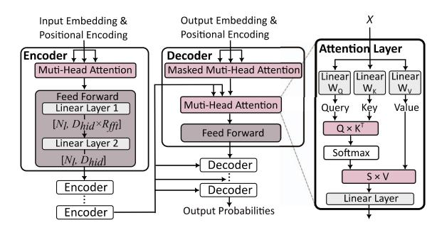

Fig. 1. End-to-end Transformer

comprehensive architecture and dataflow utilizing in-situ computing, which we refer to as ASADI.

 We conduct experiments on sufficient models and datasets, and the results indicate that ASADI exhibits superior performance and energy efficiency.

## II. BACKGROUND AND MOTIVATION

## A. Transformer and Sparse Attention

Figure 1 illustrates the operational process of an end-to-end Transformer, which consists of multiple layers of Encoders and Decoders. Each Encoder and Decoder is comprised of multi-head attention and feed-forward layers. The multi-head attention follows a three-phase implementation. First, the input sequence with n tokens is embedded into a matrix  $X \in \mathbb{R}^{n \times d}$  (n refers to sequence length, and d refers to model dimension). Next, matrix X undergoes the general matrix multiplication (GEMM) operation ( $\mathbf{O}(nd^2)$ ) with three weight matrices,  $W_O$ ,  $W_K$ , and  $W_V$ , to obtain the matrices Q (query), K (key), and V(value). In the second phase, matrix Q undergoes the GEMM operation ( $\mathbf{O}(dn^2)$ ) with matrix  $K^{\mathsf{T}}$  to yield the attention score matrix  $\tilde{S} \in \mathbb{R}^{n \times n}$ . Subsequently, a softmax function is applied to the attention score matrix  $\tilde{S}$  to obtain the matrix S. In the final phase, matrix S undergoes a GEMM operation ( $O(dn^2)$ ) with matrix V to obtain the output matrix.

Both the second and third phases have quadratic complexity  $\mathbf{O}(dn^2)$  that grows with the sequence length, making it challenging for multi-head attention scaling to long sequences. The quadratic complexity comes from the full connection between input tokens. Researchers [3], [22], [26] identity many connections in self-attention as weak connections, which can be eliminated to increase the execution efficiency with a slight loss of accuracy, namely sparse attention. According to the sparsity pattern Yes/No related to the input sequence, researchers [22] divide sparse attention into two main categories, i.e., static sparsity (No) and dynamic sparsity (Yes).

Static sparsity involves pre-determining the sparse mask matrix before receiving the input sequence, and several static sparsity mechanisms use the same block-based pruning method [3], [5], [44]. Figure 2 (a) demonstrates sparse mask matrix of sliding window sparse-attention in Longformer [3]. In contrast, *Dynamic sparsity* employs a quantization phase to determine the sparse mask matrix [22], [26], and Figure 2 (b) displays the sparse mask matrix used in Sanger [22]. Both

Fig. 2. (a) Sparse mask matrix ( $\omega = 3$  and n = 7) of Longformer [3], (b) Sparse mask matrix of Sanger [22], (c) Examples of SDDMM and SpMM.

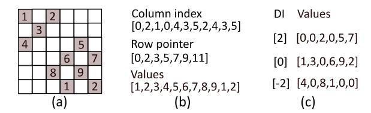

Fig. 3. (a) An example of sparse mask matrix, (b) CSR format, (c) DIA format

static and dynamic sparsity mechanisms can convert the *dense-dense matrix multiplication* (DDMM) operation  $S = Q \cdot K^T$  to a *sampled dense-dense matrix multiplication* (SDDMM) operation, as the sparsity of the sparse mask matrix is similar to the score matrix S in Figure 2 (c). The DDMM operation  $Z = S \cdot V$  can then be converted to a *sparse-dense matrix multiplication* (SpMM) operation. Figure 2 (c) illustrates the SpMM operation, which is a GEMM operation between a sparse matrix S and a dense matrix V.

# B. Sparse Compression Methods

The most common compression methods currently used are *compress sparse row* (CSR), *compress sparse column* (CSC), and *coordinate format* (COO). Figure 3 (b) illustrates the CSR format of the sparse mask matrix as shown in Figure 3 (a). The column index list stores the column coordinates of each non-zero value, the value list stores all non-zero values using row-wise storage, and the row pointer list stores the index of the value list of the first non-zero element in each row. Figure 3 (c) presents the DIA format of Figure 3 (a), where the value lists store the elements in the diagonals and the *diagonal index* (DI) stores the diagonal index of each diagonal, for example, the center-most diagonal index is '0'.

#### C. In-situ Computing

Several hardware architectures are capable of performing in-situ computing, including ReRAM, *Phase Change Memory* (PCM) [38], *Spin-Transfer Torque RAM* (STT-RAM) [34], and Modified DRAM [2]. This paper focuses solely on ReRAM. ReRAM has the ability to perform two types of in-situ calculations: analog in-situ computing [4] and digital in-situ computing [12]. Figure 4 (a) illustrates the storage of each bit of the weight matrix in a separate ReRAM array. By activating the *driver* (DRV) using the corresponding bits of the input vector, the *vector-matrix multiplication* (VMM) operation can be directly obtained in the *sample and hold* (SH) unit and the *analog-digital converter* (ADC). Finally, the result of the multi-bit VMM operation is obtained by combining all the

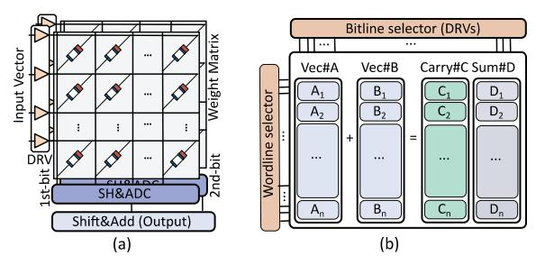

Fig. 4. (a) Analog in-situ computing of ReRAM arrays, (b) Digital in-situ computing of ReRAM arrays

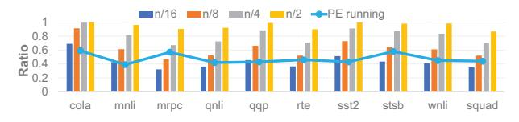

Fig. 5. The distribution of non-zero elements in Sanger [22] with various  $\omega$  (four bars), and the ratio of on-chip PE runtime to overall PIM chip runtime (broken lines).

bits using a shift adder. Figure 4 (b) shows that vec#A and vec#B are stored in the same ReRAM array, and the bit-wise activation of the bit lines can directly obtain the results of A + B in different areas of the same array.

## D. Motivation

Observation#1: Diagonal locality is prevalent in both static and dynamic sparse attention. As shown in Figure 2 (a), static sparsity naturally follows a diagonal distribution. To demonstrate the diagonal locality in dynamic sparsity, we reproduced the configurations of Sanger [22] as reported in their paper. First, we count the total number of non-zero elements in the sparse attention score matrix S, referred to as NNZ. Then, we count the number of non-zero elements in the central  $\omega$  diagonals of the S matrix ( $\omega = \frac{n}{16}, \frac{n}{8}, \frac{n}{4}$ , and  $\frac{n}{2}$ ), referred to as  $NNZ_{\omega}$  (*n* refers to the sequence length,  $n \le 512$ ). Finally, we use Figure 5 to present the results of  $\frac{NNZ_{\omega}}{NNZ}$ . When  $\omega = \frac{n}{8}$ , over 50% of the non-zero values are distributed in the central  $\omega$  diagonals area. The data density of the  $\omega$  diagonals area is  $7 \times$  greater than that of other areas. The reason for diagonal locality is that a word or pixel is more closely associated with its neighboring words or pixels at the application level. SparseBERT [33] reveals that various of sparse attention have good diagonal locality.

Observation#2: Current PIM-based sparse attention accelerators have high on-chip communication overhead. To validate this, we run the sparse attention of Sanger on the HBM-based PIM architecture provided by Ramulator-PIM [14]. In Figure 5, the broken lines indicate the ratio of on-chip PE runtime to the overall PIM chip runtime. Our experimental results demonstrate that on-chip PEs remain idle for over 40% of PIM chip runtime. The reason for this is that each on-chip PE of the PIM architecture can only efficiently access its local memory, while cross-bank and cross-rank memory access rely on the memory controller and system bus, which is significantly slower than local access. As a result, cross-

Fig. 6. (a) Sparse S matrix ( $\omega = 5$  and n = 6) without bubbles, (b) Bubble-free DIA compression, (c) Decompressed DIA format

bank and cross-rank transfers increase system-bus contention and cause PE idleness.

**Our goal:** Observation#1 motivates us to design a new matrix multiplication computation paradigm to efficiently support the DIA format, thus serving as our software design motivation. Additionally, Observation#2 motivates us to design ASADI, aiming to support the diagonal locality while minimizing on-chip transfers using in-situ computing.

## III. COMPRESSION FORMAT

We refer to diagonals with all non-zero elements as bubble-free diagonals, whereas diagonals contain zero values are referred to as bubble-containing diagonals. In this regard, we introduce two DIA-based compression method for sparse matrices consisting of bubble-free and bubble-containing diagonals, respectively.

#### A. Classic Bubble-free DIA

Figure 6 (a) illustrates the sparse mask matrix of Longformer, which exclusively consists of bubble-free diagonals. Figure 6 (b) depicts the classic DIA format of the sparse mask matrix, where we store each diagonal along one column and values with the same column coordinates in the same row. Figure 6 (c) showcases the decompressed DIA format of the sparse mask matrix, where we store the values with the same row coordinates in the same row. Compared with Figure 6 (a), Figure 6 (c) has fewer bubbles because the decompressed format in Figure 6 (c) lost some information, which will not affect the correctness of ASADI performing DIA-based SpMM and SDDMM (more details in Section IV).

**Advantages.** The row-based storage format can reach the row locality  $(\frac{\omega}{2}+1,\omega)$  with diagonal window size  $\omega$ . The DIA-based format can achieve the diagonal locality with  $(n-\frac{\omega}{2},n)$ . More non-zero in the same memory column means better locality. If we assume that  $\omega=\frac{n}{8}$ , DIA format can get more than  $7.5\times$  locality than row-based storage with the DIA lower bound  $(\frac{15n}{16})$  divided by row-wise upper bound  $(\frac{n}{8})$ .

## B. Bubble-containing DIA

Figure 7 (a) displays the sparse mask matrix of Sanger, which contains many bubble-containing diagonals. As shown in these grey cells, some non-zero values are distributed away from the central  $\omega=3$  diagonals with poor diagonal locality. To enhance the diagonal locality of dynamic sparse attention, we propose bubble-containing DIA format as follows.

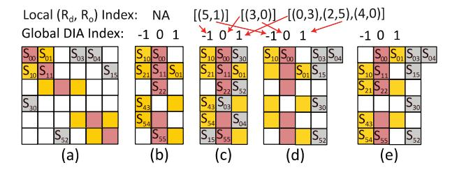

Fig. 7. (a) Sparse *S* matrix with bubbles, (b) Bubble-free DIA compression, (c) Bubble-containing DIA compression, (d) Decompress non-central diagonals, (e) Decompress central diagonals

Fig. 8. Details to calculate  $NZ_{\omega}$  and  $NNZ_{\sigma}$ 

We first choose  $\omega=3$  central diagonals and use the bubble-free process compressing them to the DIA format shown in Figure 7 (b). Next, we move the elements (grey cells in Figure 7 (a)) not belonging to the  $\omega$  diagonals to the nearest diagonal, maintaining their original column coordinates. Since this operation changes the row coordinates of the grey cells, we use an additional row index list ( $R_d$ ,  $R_o$ ) to record the original row coordinates of the grey cells.  $R_d$  represents the row coordinates of grey cells in the DIA format, while  $R_o$  represents the row coordinates of grey cells in the original sparse mask matrix. After the two phases in Figure 7 (b) and (c), diverse sparse matrices with good diagonal locality can be compressed into their DIA format. Figure 7 (c) shows the DIA format of Figure 7 (a). If there are not enough bubbles to store the grey cells, we will store them in a new diagonal.

The decompression of the DIA format in Figure 7 (c) is presented in Figure 7 (d) and (e). Figure 7 (d) will decompress the grey cells by first locating their position in the  $R_d$  list and then moving all grey cells to new columns while maintaining their row index from the  $R_o$  list. Figure 7 (e) decompresses the  $\omega$  diagonals in accordance with Figure 6 (c).

# C. Selection of $\omega$

We refer to the central  $\omega$  diagonal region as  $\omega$  region while referring the rest as other region. Figure 8 presents the definition of *NAE* (number of all elements), *NZ* (number of zeros), and *NNZ* (number of non-zeros). Our compression method will move non-zero values in other region to the bubbles of  $\omega$  region. Therefore, it is necessary to ensure that  $NZ_{\omega}$  (*NZ* of  $\omega$  region) is slightly bigger than  $NNZ_{o}$  (*NNZ* of other region). For quantitative analysis, we assume that the sparsity of the  $n \times n$  attention matrix is 10% (common scenario in Sanger [22]). From Figure 5, we get  $\frac{NNZ_{\omega}}{NNZ} = 40\%, 50\%, 70\%$ 

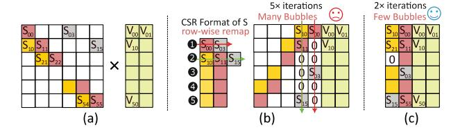

Fig. 9. (a) Matrix multiplication between sparse S matrix and dense V matrix, (b) In-situ computing with CSR format of matrix S, (c) In-situ computing with DIA format of matrix S

when  $\omega = \frac{n}{16}, \frac{n}{8}, \frac{n}{4}$ , respectively. Figure 8 presents how we calculate  $NZ_{\omega}$  and  $NNZ_{o}$  when  $\omega = \frac{n}{16}, \frac{n}{8}, \frac{n}{4}$ . If  $NZ_{\omega}$  is much bigger than  $NNZ_{o}$ , it means we have too many bubbles in the  $\omega$  region. If  $NNZ_{o}$  is much bigger than  $NZ_{\omega}$ , it means we do not have enough bubbles for all grey cells. Therefore, we choose  $\frac{n}{8}$  as the default configuration of  $\omega$ .

## IV. DIA-BASED IN-SITU COMPUTING

Figure 1 depicts the attention mechanism, comprising of four operations: linear layer,  $Q \times K^{\mathsf{T}}$ , softmax, and  $S \times V$ . In this section, we will explain how we implement in-situ computing to process these four operations. For exposition purposes, we assume a sequence length of n=6 and a model dimension of d=2 for the Q, K, and V matrices. Additionally, we assume a diagonal window size of  $\omega=2$  for both the sparse S matrix and the sparse mask matrix M. We utilize the diagonal index (DI) to mark the diagonals of the DIA format, where DI0 represents the center-most diagonal.

## A. In-situ $S \times V$

**High-level motivations.** Figure 9 (a) illustrates the sparse S matrix and dense V matrix. For brevity, we select two diagonals  $\mathrm{DI}_{-1}$  and  $\mathrm{DI}_0$  from Figure 7 (c). Figure 9 (b) presents the in-situ computation paradigm of the CSR format, where we assume that the CSR format of matrix S and the dense matrix V are stored in the same ReRAM array. The fundamental concept of matrix multiplication involves coordinates alignment, aligning the column coordinates of the left matrix with the row coordinates of the right matrix. However, the CSR storage format breaks the column coordinates of the left S matrix, preventing its direct use for in-situ matrix multiplication. Consequently, a row-wise remapping phase is necessary to align the coordinates of the left and right matrices.

In the  $\bigcirc$  iteration (red arrow), the first row of the CSR format will be remapped for coordinates alignment. Subsequently, the column marked by the red arrow will be insitu computed with matrix V to generate the first row of the output matrix (two valid computing with non-zeros while four invalid computing with zeros). In the  $\bigcirc$  iteration (green arrow), the second row of the CSR format will be remapped and computed with matrix V (three valid and three invalid). After five iterations, output matrix Z is generated. Figure 9 (c) presents the mapping of the DIA storage format of matrix S and the dense matrix V. As the DIA format does not break the column coordinates of the left matrix, it enables direct use for matrix multiplication without remapping. In our example,

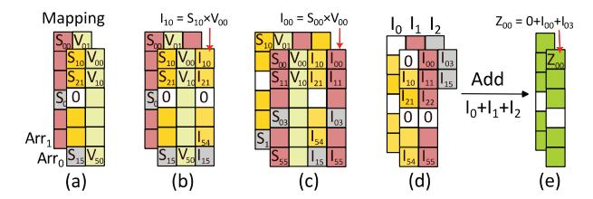

Fig. 10. (a) Mapping matrices S and V to two ReRAM arrays, (b) Intermediate results of the first iteration of vector-vector multiplication, (c) Intermediate results of the second iteration of vector-vector multiplication, (d) Decompressed intermediate results, (e) Output Z matrix

two DIA iterations (five valid computing and one invalid computing) are sufficient to complete the calculation.

**Quantitative analysis.** In the above example, each diagonal has an average of five elements, while each row has an average of two elements. This means that the number of DIA's valid computing is  $2.5\times$  greater than the CSR format. Thus, the number of CSR iterations is exactly  $2.5\times$  that of DIA iterations. given that the diagonal locality of Longformer is  $7.5\times$  greater than the row locality (as observed in Section III), the DIA-based computation paradigm can save  $7.5\times$  iterations than the CSR computation paradigm, due to the poor row locality and the presence of numerous bubbles in the ReRAM arrays at each CSR iteration.

# **Algorithm 1** In-situ $S \times V$

**Require:** DIA format of  $S \in \mathbb{R}^{n \times \omega}$ , Matrix  $V \in \mathbb{R}^{n \times d}$ . **Ensure:** Output matrix  $Z \in \mathbb{R}^{n \times d}$ .

- 1: Mapping matrix V to  $d \times \text{ReRAM}$  arrays from  $\text{Arr}_0$  to  $\text{Arr}_{d-1} \in \mathbb{R}^n$ . Mapping DIA format of S from  $\text{Arr}_0$  to  $\text{Arr}_{d-1}$ , each array has  $\frac{\omega}{d}$  vectors  $\in \mathbb{R}^n$  (Figure 10 (a)).
- 2: **while**  $i < d \ (i = 0)$  **do**
- 3: For all arrays, performing vec-vec multi.  $I = S \times V$ .
- 4: Transfer  $S_0$  to  $Arr_i$ ,  $S_1$  to  $Arr_{i+1}$  and so on, i++.
- 5: end while (Figure 10 (b) and (c))
- 6: For all arrays, decompress matrices I (Fig. 10 (d)).
- 7: For all arrays, vec-vec accum.  $Z = \sum I$  (Figure 10 (e)).

**Details of computation paradigm.** In Figure 10 (a), each dimension of the V matrix is stored in a separate ReRAM array, totaling d = 2 arrays. The DIA format of the S matrix is evenly distributed on d = 2 ReRAM arrays, with each array storing  $\frac{\omega}{d}$  diagonals (line 1 of Alg. 1). Specifically, Arr0 stores  $DI_{-1}$  and  $V_{d0}$ , while Arr1 stores  $DI_0$  and  $V_{d1}$ . In Figure 10 (b), the in-situ vector-vector multiplication is performed on each array (line 3 of Alg. 1). In Figure 10 (c), we transfer the DIA vectors to different arrays, i.e.,  $DI_{-1} \rightarrow Arr_1$  and  $DI_0 \rightarrow Arr_0$ (line 4 of Alg. 1). The in-situ vector-vector multiplication is again performed on each array, and the results are stored in the fourth columns of Figure 10 (c). The decompression of the intermediate result matrices in each array follows the process shown in Figure 7 (d) and (e), while the decompression results are illustrated in Figure 10 (d) (line 6 of Alg. 1). Figure 10 (e) performs the in-situ vector-vector addition in each array to obtain all dimensions of the output Z matrix (line 7 of

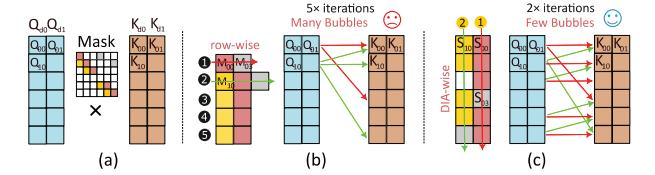

Fig. 11. (a) SDDMM between dense Q, K matrices, (b) In-situ computing with CSR format of matrix M, (c) In-situ computing with DIA format of matrix M

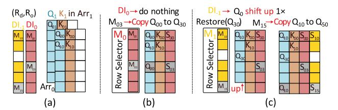

Fig. 12. (a) Matrices Q and K in two ReRAM arrays, (b) Vector-vector multiplication of  $\mathrm{DI}_0$ , (c) Vector-vector multiplication of  $\mathrm{DI}_{-1}$ 

Alg. 1). To conserve memory space, we opt to decompress each diagonal sequentially. Specifically, we decompress two diagonals, sum them, and then proceed to decompress and add the remaining diagonals one by one.

# B. In-situ $O \times K^{\mathsf{T}}$

**High-level motivations.** Figure 11 (a) illustrates the SD-DMM between dense matrices Q and K. Figure 11 (b) presents the SDDMM computation paradigm with the CSR format of matrix M. The  $\bigcirc$  iteration involves the first row of matrix M, controlling the 0-th row of matrix Q to calculate with the 0-th and 3-rd rows of matrix K (red arrows in Figure 11 (b)). Similarly, the  $\bigcirc$  iteration depicts the calculation between matrices Q and K (green arrows). Since the  $\bigcirc$  and  $\bigcirc$  iterations share the 0-th row of matrix K, they must be executed serially. The CSR format takes five iteration with only two valid computing in each iteration.

Figure 11 (c) demonstrates the SDDMM computation paradigm using the DIA format of matrix M. In the ① iteration, DI0 controls the vector multiplication between matrices Q and K (red arrows in Figure 11 (c)). In the ② iteration, DI-1 controls the calculation marked by the green arrows. The SDDMM results can be obtained with only two DIA iterations with five valid computing each iteration.

**Quantitative analysis.** In the above example, the diagonal locality is  $2.5\times$  greater than the row locality. Consequently, each round of DIA-wise iteration has  $2.5\times$  valid computing than the row-wise iteration, leading to less number of iterations. Since all iterations are executed sequentially, the DIA-wise computation paradigm saves  $2.5\times$  latency compared to the CSR-wise computation paradigm. For real-world sparse attention, like Longformer, the DIA-wise computation paradigm can achieve a time saving of  $7.5\times$ .

**Details of computation paradigm.** Figure 12 (a) displays the mapping of matrices Q and K. Specifically, we store two dimensions of matrices Q and K on two ReRAM arrays. For instance, Arr0 stores  $Q_0$  and  $K_0$ , Arr1 stores  $Q_1$  and  $K_1$  (line

Fig. 13. (a) Two slices of  $Q_0 \times K_0$  and  $Q_1 \times K_1$ , (b) We refer the slices of  $DI_0$  as  $Slices_{S0}$  and  $DI_{-1}$  to  $Slices_{S1}$ , (c) All  $Slices_{S0}$  and  $Slices_{S1}$  are transferred to the same ReRAM array, (d) Results of DIA-based S matrix

1 of Alg. 2). We will use  $Q_0$  and  $K_0$  in Arr0 as an example, while the second dimension processes the same.

# **Algorithm 2** In-situ $Q \times K^{\mathsf{T}}$

**Require:** DIA format of  $M \in \mathbb{R}^{n \times \omega}$ , Matrix  $Q, K \in \mathbb{R}^{n \times d}$ . **Ensure:** Output matrix  $S \in \mathbb{R}^{n \times \omega}$ .

- 1: Mapping matrix Q and K to  $d \times \text{ReRAM}$  arrays from  $\text{Arr}_0$  (stored  $Q_0$  and  $K_0$ ) to  $\text{Arr}_{d-1}$  (stored  $Q_{d-1}$  and  $K_{d-1}$ )  $\in \mathbb{R}^n$ . Matrix M is stored on-chip (Figure 12 (a)).
- 2: **while**  $i < \omega$  (i = 0) **do**
- 3: Transfer  $M_i$  to the Row Selector of all arrays.
- 4: For all arrays, shift up/down Q using  $M_i$ 's DIA index.
- 5: For all arrays, copy  $Q_{Ro}$  to  $Q_{Rd}$  using  $M_i$ 's  $(R_d, R_o)$ .
- 6: For all arrays, vec-vec multi.  $Slices_{Si} = Q \times K$ .
- 7: Restore  $Q_{Rd}$  for next iteration, i + +.
- 8: end while (Figure 12 (b), (c) and Figure 13 (a))
- 9: Transfer all *SlicesSi* to Arri. (Figure 13 (b) and (c)).
- 10: For Arri, vec-vec accum.  $S_i = \sum Slices_{Si}$  (Figure 13 (d)).

As Figure 12 (b) shows, the DI0 vector of matrix M ( $M_0$ ), along with the ( $R_d$ ,  $R_o$ ) list of this vector, will be transmitted to the row selector (line 3 of Alg. 2). Then, the memory controller shifts the  $Q_0$  up/down according to DI (diagonal index) of  $M_0$  (line 4 of Alg. 2). If DI = DI0, nothing is done; if DI = DIj,  $Q_0$  is shifted down  $j \times$ ; if DI = DI-j,  $Q_0$  is shifted up  $j \times$ . Next, the memory controller executes a memory copy operation based on the ( $R_d$ ,  $R_o$ ) list of grey cells in  $M_0$  (line 5 of Alg. 2). Specifically, the memory controller copies  $Q_{00}$  ( $Q_{Ro}$ ) to  $Q_{30}$  ( $Q_{Rd}$ ). Afterward, each array performs the in-situ vector-vector multiplication to derive one slice  $Slices_{S0}$  of the S vector (line 6 of Alg. 2).

Figure 12 (c) presents the calculation of  $DI_{-1}$  of the mask matrix M ( $M_1$ ). The memory controller will restore  $Q_{30}$  of  $Q_0$  (line 7 of Alg. 2), which are modified in the previous iteration. First,  $M_1$  with  $DI_{-1}$  is sent to the row selector (line 3).  $DI = DI_{-1}$ , so  $Q_0$  will shift up  $1 \times$  (line 4). Then, the memory controller will perform a memory copy according to the ( $R_d$ ,  $R_o$ ) list of grey cells in  $M_{-1}$  (line 5). Specifically,  $Q_{10}$  will be copied to  $Q_{50}$ . Finally, ReRAM arrays will perform vector-vector multiplication  $Slices_{S1} = Q \times K$  to get one slice of the S vector (line 6).

Figure 13 (a) depicts the results of the two dimensions of  $Slices_{Si} = Q \times K$ , which are stored in  $Arr_0$  and  $Arr_1$ , each holding  $Slices_{S0}$  and  $Slices_{S1}$  of the DIA-based S matrix. We then transmit all  $Slices_{S0}$  to  $Arr_0$  and all  $Slices_{S1}$  to  $Arr_1$ , as

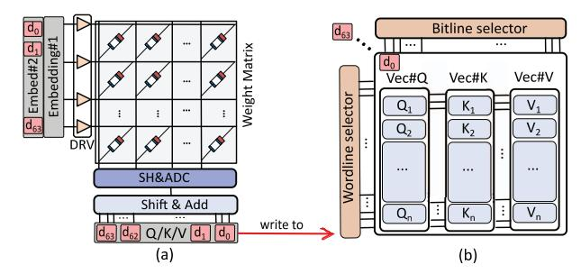

Fig. 14. (a) Using analog in-situ computing for the linear layer, (b) Different dimensions of matrices Q, K, and V are stored in different ReRAM arrays

shown in Figure 13 (b) and (c) (line 9 of Alg. 2). Finally, we perform in-situ vector-vector addition  $S_i = Slices_{Si} + Slices_{Si}$  on all ReRAM arrays (line 10 of Alg. 2), obtaining the DIA format of matrix S illustrated in Figure 13 (d).

# C. In-situ Linear Layer

Previous studies [4], [12] demonstrate that analog in-situ computing exhibits greater parallelism compared to digital insitu computing. However, analog in-situ computing inherently possesses coarse-grained matrix-level parallelism, making it particularly suitable for bubble-free calculations. The DDMM calculations performed in the linear layer represent a typical example of bubble-free computations that are well-suited for analog in-situ computing. Due to the relatively lower computational overhead of the linear layer compared to the attention layer, the impact of analog-to-digital conversion overhead on ASADI is minimized.

Figure 14 (a) depicts the computation of the first bit of linear layers using weight matrices  $W_O$ ,  $W_K$ , and  $W_V$ , pre-stored in ReRAM arrays. Assuming 64 dimensions of input embeddings, the input register receives the first bit of each dimension and activates the corresponding DRV. Then, the ReRAM array performs a VMM operation between Embedding#1 and the weight matrices. The sample and hold (SH) unit holds the output vector, which is then converted into numbers by ADC. The Shift and Add (S&A) unit combines all bits to obtain the 32-bit results, with each column holding one of the 64 dimensions, as illustrated in Figure 4 (a). Figure 14 (b) shows that the obtained results are written to ReRAM arrays. Each ReRAM array stores the same dimension of matrices Q, K, and V, with 64 dimensions being stored in 64 different arrays. This storage method is identical to that in Figure 12 (c). Therefore, the in-situ  $Q \times K^{\mathsf{T}}$  operation in Figure 14 (b) can be directly performed without data remapping.

#### D. In-situ Softmax

Equation (1) involves four fundamental operations in the softmax function: maximum, subtraction, exponential, and summation. Prior research has addressed the use of ReRAM arrays for subtraction and summation operations [12]. Therefore, this paper focuses on performing high-parallel in-situ maximum and  $e^x$  operations using ReRAM arrays.

$$softmax(s_i) = \frac{e^{s_i - s_{max}}}{\sum_{c=1}^{n} e^{s_c - s_{max}}}$$
(1)

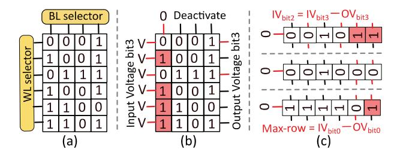

Fig. 15. (a) Int4 unsigned vector for maximal operation, (b) Pruning '0' rows of bit3, (c) Pruning of the left bits

In-situ maximum operation. ReSQM [20] proposes the original idea of this method, and we provide a visual description of their approach. To process the int4 unsigned vector as shown in Figure 15 (a), the *word-lines* (WL) and *bit-lines* (BL) selectors first activate all the WL and BL of the highest bit (bit3). The control signals of the WL selector are referred to as the *input voltage of bit3* (IV*bit*3). The WL selectors charge all DRV of the WL, setting all WLs to high voltage. The high voltage of the WLs leaks from the ReRAM cells that store '1' (low resistance) to the BL. The memory controller detects the *output voltage of bit3* (OV*bit*3), which records all 0's of bit3 because the voltage leaks from all '1's of bit3 as shown in the red cells of Figure 15 (b). The OV*bit*3 values are not the maximum and are filtered out.

To generate the input signals for the second highest bit (bit2), we perform a subtraction IV*bit*2 = IV*bit*3 − OV*bit*3. If the result of the subtraction is zero, the input signal remains unchanged. We perform these operations sequentially from the highest bit to the lowest bit (bit0), and then we perform a subtraction Max index = IV*bit*0 − OV*bit*0 to obtain the row index of the maximum. We can read out the Max index row to obtain the maximum value of the vector. For a vector of n× 32-bit floating-point numbers, it requires only 32 cycles to find the maximum.

In-situ *ex*. Figure 16 (a) displays two vectors, i.e., 20 and *x*, both stored in the same ReRAM array. To begin, we load the highest bit of vector *x* to the word-line selector and activate the word-line DRVs with '1'. As shown by the red word lines in Figure 16 (b), we left-shift all activated rows of vector 20 2× (4× for bit2, 8× for bit3, and so on). After loading all bits of vector *x* to the word-line selector and performing the above operations, we can obtain 2*x* in the same ReRAM array, as illustrated in Figure 16 (c). For a vector *x* of n× 32-bit fixed-point numbers, we can calculate 2*x* in just 32 cycles. Since *ex* = 2*x* log2 *e*, we can perform in-situ vector-vector multiplication *y* = *x* log2 *e* to get vector *y*, followed by 2*y* to obtain *ex*.

# V. ASADI

# *A. ASADI Architecture*

Figure 17 (a) presents the architecture of ASADI, comprising of multiple *Decoder processing elements* (De-PE) and *Encoder processing elements* (En-PE). The En-PE and De-PE have the same components, allowing a De-PE to operate as

Fig. 16. (a) Vector 20 and vector *x*, (b) Shift operation of bit1, (c) Shift operation of bit0

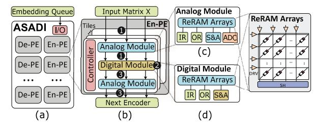

Fig. 17. (a) Overall ASADI architecture, (b) Details of one En-PE, (c) Details of the analog module, (d) Details of the digital module

an En-PE when it receives the weight matrices of an Encoder. ASADI possesses a single *input and output* (I/O) interface to receive input sequences. The number of En-PE and De-PE is equivalent to the number of Encoders and Decoders in the Transformer models. This structure is well-suited for scaling up to larger models requiring more Encoders and Decoders, as we can configure multiple ASADI chips, with a small number of off-chip transfers between them.

Figure 17 (b) illustrates the En-PE's details, which are composed of several Tiles equal to the number of attention heads. Each Tile consists of two analog modules, one digital module, and one microcontroller. The first analog module performs the linear layers before multi-head attention to generate matrices *Q*, *K*, and *V*. The digital module utilizes matrices *Q*, *K*, and *V* to execute the multi-head attention operation and generate matrix *Z*. The second analog module conducts the feed-forward layer after the multi-head attention. The microcontroller performs three functions: controlling the data transfers between the analog and digital modules, managing the compression and decompression of the sparse mask matrix, as depicted in § III, and sending four types of control signals to the analog and digital modules, i.e., *S*×*V* signals, *Q*×*K*T signals, linear layer signals, and softmax signals. The ReRAM array performs the corresponding in-situ operations based on the type of control signals.

Figure 17 (c) and (d) present the details of the analog and digital modules, respectively. The analog module consists of read-only ReRAM arrays that store the weight matrices of the linear layers. In contrast, the digital module comprises write-enable ReRAM arrays that store the matrices *Q*, *K*, *V*, and *S* generated during runtime. The analog module's *input register* (IR) caches the input embeddings from the previous layer, while the *output register* (OR) caches the output of the *vector-matrix multiplication* (VMM) operations. The digital module's IR caches the control signals of the bit-line and word-line selectors, while the OR caches the output voltage when performing in-situ computing (similar to the row buffer in DRAM). The S&A unit and ADC in Figure 17 (c) and (d) function similarly to Figure 4 (a).

## B. ASADI Dataflow

Cross-Encoder Dataflow: The input sequences are processed by ASADI in batches, which allows sequences of any length to be included in the same batch if there is enough memory. We use only one En/De-PE for one Encoder/Decoder layer. To introduce a dataflow between Encoders/En-PEs, two batches and two Encoders/En-PEs are used as an example. The first Encoder/En-PE processes the first batch and generates the output. While the first Encoder/En-PE processes the second batch, the output of the first batch is sent to the second Encoder/En-PE.

Intra-Encoder Dataflow: The dataflow within one Encoder consists of three phases, as illustrated in Figure 17 (b). In phase **1**, the embeddings within the same batch are sequentially transferred to the analog module for VMM operation, which generates the matrices Q, K, and V. Once created, the Q, K, and V matrices of one embedding are written to the digital module. Therefore, once the analog module has processed the embeddings, the generated matrices are stored in the digital module. In phase 2, the digital module performs the in-situ  $Q \times K^{\mathsf{T}}$ ,  $S \times V$ , and softmax operations to generate the output matrix Z. All the intermediate matrices and the output matrix Z are stored in the same digital module due to the in-situ computing nature. In phase 3, the matrix Z is sequentially read and sent to the second analog module to perform the feed-forward layer. The output of the feed-forward layer is then sent to the next Encoder.

# C. ASADI Complexity

**Time complexity:** We analyze the time complexity of one En-PE of ASADI for processing a batch of *n* embeddings, each with dimension d. In the  $\bigcirc$  phase of Figure 17 (b), the analog module generates matrices Q, K, and V for one embedding in one cycle. The latency of writing these matrices to the digital module is also one cycle, allowing the digital module to write matrices of embedding $_{i-1}$  while the analog module processes embeddingi. As a result, the analog module will take O(n)cycles to process all embeddings and write the output to the digital module. In the **2** phase, the digital module processes the multi-head attention in constant cycle c with high parallel in-situ computing. Each element of matrices Q, K, V, and S are stored and processed in parallel by one ReRAM row. Finally, the  $\mathbf{3}$  phase takes n cycles, similar to the  $\mathbf{1}$  phase. These phases operate sequentially due to data dependencies, and there is no possibility of forming a pipeline. Thus, the overall time complexity of one En-PE is  $\mathbf{O}(n) + c + \mathbf{O}(n)$ .

**Memory complexity:** Suppose the DIA format of S matrix has a diagonal window size  $\omega$ . The analog module requires  $d \times d$  ReRAM capacity to store the weight matrix  $W_Q$ . The metrices  $W_Q$ ,  $W_K$ , and  $W_V$  require  $d \times d \times 3$  ReRAM capacity, which is  $\mathbf{O}(d^2)$  memory complexity. The digital module needs

TABLE I ASADI CONFIGURATIONS

| Component                 | Area (mm 2 ) | Power (mW) | Params.      | Spec.     |
|---------------------------|-------------------------|------------|--------------|-----------|
| Analog module properties  |                         |            |              |           |
| ReRAM                     |                         |            | Bit per Cell | 1         |
| Arrays                    | 0.0013                  | 2.45       | Size         | 64×64     |
| Allays                    |                         |            | Total        | 96        |
| IR                        | 0.0002                  | 0.057      | Size         | 64B       |
| OR                        | 0.0002                  | 0.057      | Size         | 64B       |
| ADC                       | 0.0047                  | 8          | resolution   | 6-bit     |
|                           |                         |            | Total        | 16        |
| DRV                       | 0.0005                  | 6          | resolution   | 1-bit     |
|                           |                         |            | Total        | 64×96     |
| S&A                       | 0.001                   | 0.8        | Total        | 16        |
| AM total                  | 0.0079                  | 18.43      | Size         | 49KB      |
| Digital module properties |                         |            |              |           |
| ReRAM                     | 1.76                    | 3143.6     | Bit per Cell | 1         |
| Arrays                    |                         |            | Size         | 1024×1024 |
| Allays                    |                         |            | Total        | 512       |
| IR                        | 0.0608                  | 20.89      | Size         | 64KB      |
| OR                        | 0.0322                  | 11.47      | Size         | 32KB      |
| DRV                       | 0.0423                  | 506.4      | resolution   | 1-bit     |
|                           |                         |            | Total        | 1024×512  |
| S&A                       | 0.032                   | 25.62      | Total        | 512       |
| DM total                  | 1.927                   | 3708       | Size         | 67.2MB    |
| En-PE properties          |                         |            |              |           |
| AM                        | 0.19                    | 442.32     | Total        | 24        |
|                           |                         |            | Size         | 1176KB    |
| DM                        | 23.12                   | 44.5K      | Total        | 12        |
|                           |                         |            | Size         | 806.6MB   |
| Controller                | 0.0048                  | 7.8        | Total        | 12        |
| En-PE total               | 23.31                   | 44.9K      | Size         | 807.8MB   |
| ASADI properties          |                         |            |              |           |
| En/De-PE                  | 279.8                   | 538.9K     | Total        | 12        |
|                           |                         |            | Size         | 9.7GB     |

memory capacity of  $\mathbf{O}(nd)$  to store matrices Q, K, and V. The digital module requires  $\mathbf{O}(n\omega)$  memory capacity to store matrix S and softmax matrix  $\tilde{S}$ , and  $\mathbf{O}(nk)$  memory capacity to store intermediate results during in-situ computing. Here, k is a constant number. The total memory capacity required for storing all original and intermediate matrices is  $\mathbf{O}(d^2) + \mathbf{O}(nd) + \mathbf{O}(n\omega) + \mathbf{O}(nk)$ . Since both d and k are constants, and  $\omega = \frac{n}{8}$ , the memory complexity of ASADI is  $\mathbf{O}(n) + \mathbf{O}(n\omega) + \mathbf{O}(n)$ . When n exceeds the memory capacity of ASADI, we set  $\omega$  to a constant. In this case, the memory complexity becomes  $\mathbf{O}(n)$ . To support longer sequences, we use this method with some loss of accuracy, and in this work, n is set to a maximum of 8192.

## VI. METHODOLOGY

**Benchmarks.** We evaluate the performance of ASADI using BERT-Base (BERT), BART, GPT-2-Small (GPT2) models for NLP (natural-language processing) tasks, and ViL-Medium-Wide (ViL) model for CV (computer vision) tasks. To achieve dynamic sparsity, we adopt the quantize-and-pruning method of Sanger [22] for all models. For NLP models, we select nine datasets from the *General Language Understanding Evaluation* (GLUE) [36], including cola, mnli, mrpc, qnli,

qqp, rte, sst-2, stsb, and wnli. The *maximal sequence length* (MSL) of all GLUE datasets is less than 384. Additionally, we evaluate the models on MSL 512 *Stanford Question Answering Dataset* (SQuAD v1.1) [27], MSL 1K WikiText-2 [24], and MSL 2K IMDB [23] datasets. For ViL model, we use MSL 1K ImageNet-1K [28] dataset. To measure the efficiency of processing long sequences, we synthesize MSL 4K Syn-4K and MSL 8K Syn-8K by repeating the same sentence of IMDB multiple times to generate longer sentences. Note that Syn-4K and Syn-8K are not used for accuracy evaluation, but only for latency and energy consumption. The data precision used in this paper is Float32, and we limit the maximum length of sequences to 8192. However, ASADI can theoretically process sequences of any length if the memory capacity is sufficient.

Baseline PIM platform. Previous research has demonstrated the significant performance and energy efficiency advantages of PIM-based Transformer accelerators over traditional von Neumann architectures, such as CPU, GPU, FPGA, and ASIC-based architectures, as revealed by numerous studies [18], [41], [43], [47]. TransPIM [47], ReTransformer [41], CPSAA [18], and SPRINT [43] have already explained the reasons why PIM architectures outperform traditional architectures. Therefore, to emphasize the benefits of in-situ computing, we establish a PIM-based baseline and do not compare ASADI with non-PIM traditional architectures. We also note that the differences between PIM and full-flow in-situ computing architectures has not been well-studied in the literature. The PIM baseline employs Samsung's novel function-in-memory DRAM (FIMDRAM) [16], which incorporates programmable computing units in the I/O circuits of the memory banks. We choose the standard configurations of FIMDRAM to support large-scale SpMM with high bandwidth and parallelism. We store the sparse S matrix in CSR format for baseline, which comprises 10GB HBM2 memory and 500 MHz on-chip logic units per bank. We use Ramulator-PIM [14] to obtain the baseline's latency and energy consumption.

**ASADI configurations.** Unlike previous PIM accelerators, ASADI is a full-flow in-situ Transformer accelerator that stores all original and intermediate data in the ReRAM arrays. The full-flow refers to the fact that we calculate all basic operations of Transformer in-situ. As a result, the memory capacity of ASADI is directly related to the input sequence length. We configure the ASADI accelerator to process a maximal sequence length (MSL) of 8192 and diagonal window size  $\omega = \frac{MSL}{8}$  for all datasets, with 12 En-PE and De-PE as shown in Table I. Each Encoder has 12 heads, and each En-PE has 12 Tiles, with each embedding having 64 dimensions for a single head. Both the analog and digital modules use one ReRAM cell to present only 1-bit to ensure accuracy and noise immunity. Thus, the analog module has  $32 \times 3$  $64 \times 64$  ReRAM arrays for Float32  $W_Q$ ,  $W_K$ , and  $W_V$  matrices, while the digital module needs  $64 \times \frac{8192}{1024}$   $1024 \times 1024$  ReRAM arrays for all intermediate matrices. We use 1000GB/s On-Chip Interconnect (OCI) [13] for inner-Encoder transfer and PCIe-6.0 [32] with 128GB/s for cross-Encoder transfer. The details of the ReRAM arrays are described below.

We use 1GHz 1-bit one transistor and one memristor (1T1M) ReRAM arrays for both analog and digital modules. The array-level area and power configurations of the 1T1M ReRAM array are obtained from [12]. ReRAM arrays are read/written column-parallelly, and the SET/RESET voltage for 1-bit ReRAM cell is 1.62/3.63V [11]. To serve as four 6-bit ADCs, we use one 8-bit ADC since the maximum value of 1-bit VMM operation of 64×64 ReRAM array is less than 64 (26). We configure 16 ADC for 96 ReRAM arrays with six arrays sharing one ADC for area saving, using the 8-bit 1.2GS/s single-channel asynchronous SAR ADC from [15]. The area and power of the S&A unit and all on-chip SRAM buffers (IR and OR) are obtained from [31]. The DRV is obtained from 1-bit digital-analog converter (DAC) from [29]. We modify ZSim [30] to simulate the behaviors of ReRAM arrays. We further design an in-house cycle-accurate simulator to obtain the latency and energy consumption of ASADI, following the mathematical proof from [42].

Sisters of ASADI. We design two sister systems to evaluate the software and hardware efficiency of ASADI. To evaluate the hardware efficiency of ASADI, we configure DIA-PIM by using our DIA-wise computation paradigm for our baseline PIM platform. To evaluate the software efficiency of ASADI, we configure CSR-ASADI by using the CSR computation paradigm in Figure 9 (b) and Figure 11 (b) for ReRAM arrays.

Comparison with modern accelerators. We compare ASADI with one GPU platform and two modern sparse attention accelerators that utilize in-memory computing: NVIDIA RTX A6000 with 46GB memory, 300W TDP, CUDA v11.6, and PyTorch v2.0.0 [25], SPRINT [43] and CPSAA [18]. SPRINT prunes weak connections using ReRAM arrays (64KB) while using their ASIC accelerator with 10GB DRAM to process the multi-head attention. CPSAA stores part of the intermediate matrices (K and V) in ReRAM arrays (27.5MB) while storing other intermediate matrices (Q and S) in 10GB DRAM buffer. In contrast, ASADI has only ReRAM arrays of 9.7GB. We configure SPRINT and CPSAA with their algorithms, data flow, and hardware. All comparison platforms have two parts to area, i.e., (i) on-chip logic area and (ii) DRAM area. ASADI has only one area because computation and storage are both in memory (iii). It is unfair to ASADI if we keep (i) and (iii) the same. It's unfair to the comparison platforms if we keep (ii) the same as (iii) because ReRAM has higher memory density. Therefore, we keep the memory capacity the same, i.e., 10GB for all platforms.

**Pre-processing.** We conduct the following pre-processing phases. First, all models are fine-tuned from pre-trained checkpoints with the corresponding training datasets to get the weight matrices. Second, all weight matrices are pre-stored in the ReRAM memory. Finally, we perform the quantize-and-pruning sparse attention to get the sparse mask matrix of all datasets, and the sparse mask matrices are compressed to CSR and DIA format. For GLUE and SQuAD datasets, we set the learning rate and batch size the same as Sanger [22]. We set the learning rate 2e-5 and batch size of one for all other datasets. These pre-processing phases are implemented

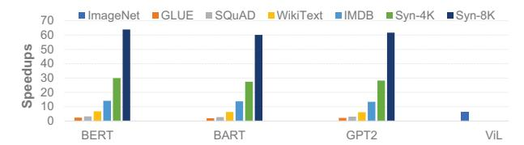

Fig. 18. Performace comparison between ASADI and PIM baseline

on our GPU server. Our code is modified from the GitHub project of Sanger [22]. All models and datasets are obtained from Hugging Face's models library [37] and datasets library.

# VII. EVALUATION

## *A. Performance and Energy Efficiency*

Figure 18 displays the speedups achieved by ASADI in comparison to the PIM baseline. ASADI yields a 6.4× speedup when processing the ViL model on the ImageNet dataset. The ViL model has only one bar because it is a CV model that only runs ImageNet dataset. When processing the BERT model, ASADI demonstrates speedups from 2.3× to 63.7× on GLUE, SQuAD, WikeText, IMDB, Syn-4K, and Syn-8k datasets. For the BART model, ASADI has 1.9× to 60.1× speedups on all datasets. For the GPT2 model, ASADI shows speedups from 2.1× to 61.7× on all datasets. In all benchmarks, ASADI surpasses the PIM baseline's performance because ASADI uses full-flow in-situ computation for sparse attention, which significantly reduces on-chip random access. The PIM baseline uses near-memory computation, where the on-chip logic units need to random access many cross-bank data. ASADI outperforms the PIM baseline by only 2.1× on the GLUE dataset, primarily because the GLUE dataset has small sequence lengths, allowing the PIM baseline to distribute input sequences evenly to each bank, achieving high computing parallelism with minimal cross-bank transfers.

In the case of longer sequences, the performance gap between ASADI and the PIM baseline widens. This gap arises due to two factors: the decrease in performance of the PIM baseline and the increase in performance of ASADI. The PIM's performance decline results from the fixed number of banks, or PEs, which do not increase with sequence length. Longer sequences cause local PEs to access more cross-bank data, further constraining PE parallelism. Conversely, ASADI functions as an accelerator with full-flow in-situ computing, utilizing minimal memory for processing short sequences. As explained in Section V-C, each row of ASADI operates in parallel for in-situ calculations. Longer sequences increase the amount of ReRAM rows, namely PEs, that hold data in ASADI, thereby enhancing overall parallelism.

Figure 19 illustrates the energy savings achieved by ASADI over the PIM baseline. Processing the ImageNet dataset on the ViL model, ASADI achieved 1.8× energy savings. For the BERT, BART, and GPT2 models, ASADI produced energy savings of 1.5× to 5.2× when processing GLUE, SQuAD, WikiText, IMDB, Syn-4K, and Syn-8k datasets. Across all datasets, ASADI demonstrated higher energy efficiency than

Fig. 19. Energy efficiency comparison between ASADI and PIM baseline

Fig. 20. Speedups of ASADI and its sister systems compared with PIM baseline

the PIM baseline. The energy savings of ASADI, compared to the PIM baseline, are mainly due to the reduced data transfers between on-chip memory and PEs. With increasing sequence length, ASADI is capable of reducing more on-chip transfers, which results in more energy savings.

# *B. Comparison of Sister Platforms*

ASADI is a hardware-software co-designed sparse attention accelerator, where the hardware design and software design complement each other and are indispensable. This section conducts experiments to compare ASADI with two sister systems, i.e., DIA-PIM and CSR-ASADI to evaluate the contributions of hardware and software optimizations in isolation. The average performance of each model on each dataset is shown in Figure 20, with all performance metrics normalized to the speedups of the PIM baseline.

ASADI vs. DIA-PIM. Figure 20 demonstrates that DIA-PIM offers an average 1.3× speedup when compared to the PIM-baseline. This speedup can be attributed to the DIA format's superior data locality when performing *S*×*V* operation. However, it is worth noting that the DIA format involves both compression and decompression phases. While DIA-PIM benefits from the compression phase, it does not gain any advantage from the decompression phase, as it requires the same number of cross-bank transfers as the CSR format. The crossbank transfer of DIA-PIM increases with sequence length, similar to the PIM-baseline, resulting in similar performance when processing various datasets.

ASADI vs. CSR-ASADI. Figure 20 presents the speedups of CSR-ASADI compared to the PIM baseline. However, CSR-ASADI underperforms compared to the PIM baseline when processing GLUE and SQuAD datasets due to limited in-situ parallelism with short sequence length and poor row locality of sparse attention. As shown in Figure 9 (b) and Figure 11 (b), the CSR-based SDDMM and SpMM computation paradigms involve many bubbles when performing insitu computing and severely impact the overall parallelism. In contrast, ASADI utilizes the DIA computation paradigm utilizing the inherent diagonal locality to reduce the number

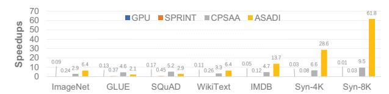

Fig. 21. Speedups of ASADI and modern sparse attention accelerators (Normalized to PIM baseline)

of bubbles significantly, resulting in better speedups than CSR-ASADI. Moreover, as the in-situ computing parallelism increases with sequence length, CSR-ASADI shows improved speedups when processing longer sequence datasets.

We can draw four conclusions from the above comparisons. First, in-situ computing is more effective in processing long sequences than PIM architecture. Secondly, the current PIM architecture cannot fully utilize the diagonal locality of the DIA format without fine-grained software-hardware co-design. Thirdly, compared to CSR-based computation paradigm, our proposed DIA-based computation paradigm effectively reduces the bubbles and enhances the parallelism of in-situ computing. Finally, our DIA-based in-situ architecture can expose the superiority of the proposed DIA computation paradigm for sparse attention.

# C. Comparison with Modern Accelerators

ASADI vs. GPU. Figure 21 illustrates the comparative performance of GPU and ASADI across various datasets, revealing ASADI's superiority. As a memory-processor separated architecture, GPU takes many latency to load/store massive intermediate results from/to the off-chip DRAM, widely recognized as the bottleneck of GPUs [12], [47]. These off-chip data transfers significantly impede GPU performance, especially when handling lengthy sequences. Furthermore, the utilization of the CSR format in GPUs introduces considerable random access for skipping bubbles. Lastly, GPU's latency experiences quadratic growth with increasing sequence length. Conversely, ASADI's exceptional performance can be attributed to three point-to-point pivotal factors. First, ASADI operates as a PIMbased accelerator, negating the need for extensive off-chip DRAM access. Second, ASADI supports the DIA format, which exhibits superior data locality, substantially mitigating random access demands. Finally, ASADI leverages in-situ computing hardware, featuring linear complexity growth with increasing sequence length.

ASADI vs. SPRINT. Figure 21 demonstrates that SPRINT [43] performs worse than the PIM baseline in various datasets. SPRINT, as an ASIC-based sparse attention accelerator, follows the same data access approach as other von Neumann architectures. Although SPRINT reduces unnecessary calculations through an in-memory pruning phase, the remaining calculations generate numerous intermediate matrices that are transferred from the off-chip DRAM to the on-chip PEs. These off-chip transfers considerably hinder SPRINT's performance when processing long sequences. In contrast, ASADI's superior performance can be attributed to three key factors. Firstly, ASADI is a PIM-based accelerator

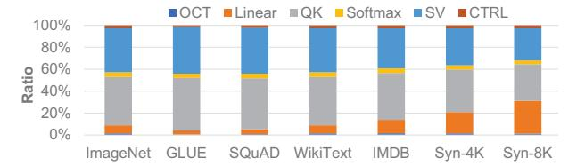

Fig. 22. ASADI latency breakdown

that eliminates all off-chip DRAM access. Secondly, ASADI is a full-flow in-situ computing accelerator, which further minimizes on-chip communications. Finally, ASADI is capable of perfectly supporting the DIA format, which has significantly better locality than the CSR format.

ASADI vs. CPSAA. CPSAA's in-memory computing feature can reduce massive off-chip transfer and ReRAM write overhead. CPSAA uses the CSR format and eliminates bubbles using more than 10× of redundant data, reducing time complexity but increasing memory complexity. The performance comparison between ASADI and CPSA [18] is shown in Figure 21. CPSAA outperforms ASADI in GLUE and SQuAD datasets, as it can store all the intermediate Q and S matrices in ReRAM arrays with fewer on-chip communication overhead when the sequence is short. Furthermore, CPSAA adopts analog in-situ computing, which has higher parallelism than ASADI's digital in-situ module. However, CPSAA utilizes redundant memory to reduce the bubbles of the CSR format, which grows quadratically with the length of the sequence. Thus, CPSAA requires many on-chip buffers to store the intermediate Q, S matrices when processing long sequences, and these cross-array transfers limit the overall performance. In contrast, ASADI has two advantages over CPSAA. First, ASADI is an in-situ accelerator with few cross-array transfers, while CPSAA is an in-memory accelerator with massive onchip scheduling overhead. Second, ASADI utilizes diagonal locality to reduce bubbles, while CPSAA utilizes massive redundant memory to reduce bubbles in the CSR format.

# D. Latency and Energy Breakdown of ASADI

This section provides a breakdown of the latency and energy consumption of ASADI into six parts: *on-chip transfer* (OCT), *linear layer* (Linear), multiplication between Q and  $K^{\mathsf{T}}$  (QK), Softmax, multiplications between S and V (SV), and the *controller* (CTRL). The area and memory breakdown are presented in Table I.

Latency breakdown. Figure 22 depicts that the OCT and CTRL make up a small fraction of the latency, which is less than 4%, supporting the goal of ASADI to reduce on-chip communication and peripheral circuits. The in-situ Softmax operation takes up approximately 5% of the latency, while the QK and SV operations take up more than 80%. As analyzed in Section V-C, the time complexity of multi-head attention is constant because all tokens are processed in parallel. However, performing the multi-head attention requires more than 105 bit-wise operations. The ratio of linear layers increases as the sequence length grows, as the time complexity of the

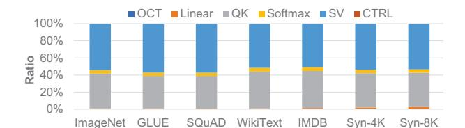

Fig. 23. ASADI energy breakdown

Fig. 24. The impact of diagonal locality

linear layer is O(n) as described in Section V-C. However, this phenomenon does not imply that the linear layer is a bottleneck for ASADI. This is because the memory capacity of the linear layer is fixed while the memory capacity of the attention layer grows with the sequence length.

Breakdown of energy consumption. The breakdown of ASADI's energy consumption is illustrated in Figure 23. The digital module, consisting of Softmax, QK, and SV, accounts for more than 98% of the total energy consumption. The energy is mainly consumed by the voltage drivers during calculations and read/write. This is because the digital module requires a large memory space and operates in a space-for-time mode. While the parallel operation of all ReRAM rows reduces latency, it increases the energy consumed per second, namely power. This is evident in Table I, where the digital module's power is significantly higher than other components. The linear layer accounts for approximately 1%, while the CTRL accounts for less than 1% of the energy consumption due to their smaller area.

#### E. Other Analysis

**Impact of diagonal locality.** As discussed in Section II-D, diagonal locality is the fundamental principle behind the design of ASADI. To study its impact, we artificially construct a sparse mask matrix with six different diagonal localities, ranging from 60% to 10%. Here, the term 60% has the same meaning as the  $\frac{NNZ_{\omega}}{NNZ}$  value discussed in Section II-D. We evaluate the performance of ASADI on the BERT model with the GLUE and SQuAD datasets, using speedups to the baseline platform as the metric. The experimental results, depicted in Figure 24, indicate a clear performance degradation as diagonal locality decreases. We identify two reasons for this phenomenon. First, a lower diagonal locality leads to more bubbles in the DIA format and reduces parallelism in the ReRAM arrays. Secondly, a lower diagonal locality increases the complexity of the decompression operation, which results in more on-chip transfers. Although the compression phase is done during pre-processing, the ASADI calculation involves a decompression phase, as shown in Figure 10 (g).

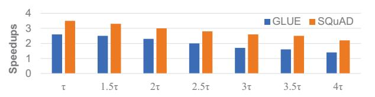

Fig. 25. The impact of sparsity

**Impact of sparsity.** In this section, we present experiments that investigate the impact of sparsity on the performance of ASADI. We evaluate six pruning threshold configurations ranging from  $1.5\tau$  to  $4\tau$  and measure ASADI's performance on the GLUE and SQuAD datasets using speedups relative to the baseline platform. Figure 25 illustrates the experimental results, which demonstrate a clear performance degradation as sparsity ( $\tau$ ) increases. This is due to the increased bubbles in the DIA format caused by the higher sparsity. More bubbles will increase the ratio of invalid computations, which in turn decreases ASADI's performance. To mitigate this, we suggest reducing  $\omega$  to either  $\frac{n}{16}$  or  $\frac{n}{32}$  when processing sparse attention with high sparsity (< 1%). By concentrating non-zero values on a few diagonal lines in the center, bubbles are reduced, and the ratio of ASADI's valid computations are improved.

Scalability analysis. Supporting long sequences with sparse attention accelerators is critical. We do not conduct specific scalability experiments since our datasets already contain sequences of various lengths. Figure 18 shows that ASADI achieves linearly increased speedups compared to the baseline when processing longer sequences. Because ASADI's latency grows linearly while baseline's latency grows quadratically with sequence length. The *overall latency (OL)* is related to the *latency of one iteration (LOI)* and the *number of iterations (NI)*, i.e.,  $OL = LOI \times NI$ . Taking length-1K and length-8K sequences as an example, ASADI takes the same LOI for length-1K and length-8K sequences. The NI of length-8K is  $8 \times$  of length-1K because the  $\omega$  of length-8K is  $8 \times$  of length-1K. For the PIM baseline, both the NI and LOI increase as sequence length increase, indicating quadratic increasing.

# VIII. CONCLUSION

The objective of this study is to accelerate the execution of the widely used Transformer-based neural network models. We conduct several experiments to demonstrate that sparse attention retains good diagonal locality. Additionally, we investigated the communication overhead of current PIM-based sparse attention accelerators. To improve the performance of sparse attention while reducing transmission overhead, we propose a DIA-based computation paradigm. The new computation paradigm is aimed to leverage diagonal locality. Moreover, we created a novel DIA-based in-situ computing accelerator, supporting our computation paradigm, which reduces on-chip transmission. Finally, our experimental results show that our proposed method, ASADI, achieves state-of-the-art performance and energy efficiency.

## IX. ACKNOWLEDGEMENT

We would like to thank the anonymous reviewers. This research is partially supported by the National Research Foundation, Singapore under its Competitive Research Program Award NRF-CRP23-2019-0003.

# REFERENCES

- [1] H. Akinaga and H. Shima, "Resistive random access memory (ReRAM) based on metal oxides," *Proceedings of the IEEE*, vol. 98, no. 12, pp. 2237–2251, 2010.
- [2] M. F. Ali, A. Jaiswal, and K. Roy, "In-memory low-cost bit-serial addition using commodity DRAM technology," *IEEE Transactions on Circuits and Systems I: Regular Papers*, vol. 67, no. 1, pp. 155–165, 2020.
- [3] I. Beltagy, M. E. Peters, and A. Cohan, "Longformer: The longdocument transformer," *CoRR*, vol. abs/2004.05150, 2020. [Online]. Available: https://arxiv.org/abs/2004.05150
- [4] P. Chi, S. Li, C. Xu, T. Zhang, J. Zhao, Y. Liu, Y. Wang, and Y. Xie, "PRIME: A novel processing-in-memory architecture for neural network computation in ReRAM-based main memory," in *Proceedings of the 43rd International Symposium on Computer Architecture*, ser. ISCA '16. IEEE Press, 2016, p. 27–39. [Online]. Available: https://doi.org/10.1109/ISCA.2016.13
- [5] R. Child, S. Gray, A. Radford, and I. Sutskever, "Generating long sequences with sparse transformers," *arXiv preprint arXiv:1904.10509*, 2019.
- [6] B. Cui, Y. Li, M. Chen, and Z. Zhang, "Fine-tune BERT with sparse self-attention mechanism," in *Proceedings of the 2019 Conference on Empirical Methods in Natural Language Processing and the 9th International Joint Conference on Natural Language Processing (EMNLP-IJCNLP)*. Hong Kong, China: Association for Computational Linguistics, Nov. 2019, pp. 3548–3553. [Online]. Available: https://aclanthology.org/D19-1361
- [7] J. Devlin, M. Chang, K. Lee, and K. Toutanova, "BERT: pre-training of deep bidirectional transformers for language understanding," *CoRR*, vol. abs/1810.04805, 2018. [Online]. Available: http://arxiv.org/abs/ 1810.04805
- [8] H. Fan, T. Chau, S. I. Venieris, R. Lee, A. Kouris, W. Luk, N. D. Lane, and M. S. Abdelfattah, "Adaptable butterfly accelerator for attentionbased NNs via hardware and algorithm co-design," in *Proceedings of 2022 55th IEEE/ACM International Symposium on Microarchitecture (MICRO)*, 2022, pp. 599–615.
- [9] Y. Fang, B. Liao, X. Wang, J. Fang, J. Qi, R. Wu, J. Niu, and W. Liu, "You only look at one sequence: Rethinking transformer in vision through object detection," *CoRR*, vol. abs/2106.00666, 2021. [Online]. Available: https://arxiv.org/abs/2106.00666
- [10] T. J. Ham, S. J. Jung, S. Kim, Y. H. Oh, Y. Park, Y. Song, J.-H. Park, S. Lee, K. Park, J. W. Lee, and D.-K. Jeong, "A3: Accelerating attention mechanisms in neural networks with approximation," in *Proceedings of 2020 IEEE International Symposium on High Performance Computer Architecture (HPCA)*, 2020, pp. 328–341.
- [11] J.-M. Hung, C.-X. Xue, H.-Y. Kao, Y.-H. Huang, F.-C. Chang, S.-P. Huang, T.-W. Liu, C.-J. Jhang, C.-I. Su, W.-S. Khwa *et al.*, "A fourmegabit compute-in-memory macro with eight-bit precision based on cmos and resistive random-access memory for ai edge devices," *Nature Electronics*, vol. 4, no. 12, pp. 921–930, 2021.
- [12] M. Imani, S. Gupta, Y. Kim, and T. Rosing, "Floatpim: In-memory acceleration of deep neural network training with high precision," in *Proceedings of the 46th International Symposium on Computer Architecture*, ser. ISCA '19. New York, NY, USA: Association for Computing Machinery, 2019, p. 802–815. [Online]. Available: https://doi.org/10.1145/3307650.3322237
- [13] N. P. Jouppi, D. Hyun Yoon, M. Ashcraft, M. Gottscho, T. B. Jablin, G. Kurian, J. Laudon, S. Li, P. Ma, X. Ma, T. Norrie, N. Patil, S. Prasad, C. Young, Z. Zhou, and D. Patterson, "Ten lessons from three generations shaped google's tpuv4i: Industrial product," in *Proceedings of 2021 ACM/IEEE 48th Annual International Symposium on Computer Architecture (ISCA)*. IEEE, 2021, pp. 1–14.
- [14] Y. Kim, W. Yang, and O. Mutlu, "Ramulator: A fast and extensible DRAM simulator," *IEEE Computer Architecture Letters*, vol. 15, no. 1, pp. 45–49, 2016.

- [15] L. Kull, T. Toifl, M. Schmatz, P. A. Francese, C. Menolfi, M. Braendli, M. Kossel, T. Morf, T. M. Andersen, and Y. Leblebici, "A 3.1 mw 8b 1.2 GS/s single-channel asynchronous SAR ADC with alternate comparators for enhanced speed in 32 nm digital SOI CMOS," *IEEE Journal of Solid-State Circuits*, vol. 48, no. 12, pp. 3049–3058, 2013.
- [16] Y.-C. Kwon, S. H. Lee, J. Lee, S.-H. Kwon, J. M. Ryu, J.-P. Son, O. Seongil, H.-S. Yu, H. Lee, S. Y. Kim, Y. Cho, J. G. Kim, J. Choi, H.- S. Shin, J. Kim, B. Phuah, H. Kim, M. J. Song, A. Choi, D. Kim, S. Kim, E.-B. Kim, D. Wang, S. Kang, Y. Ro, S. Seo, J. Song, J. Youn, K. Sohn, and N. S. Kim, "25.4 a 20nm 6GB function-in-memory DRAM, based on HBM2 with a 1.2TFLOPS programmable computing unit using banklevel parallelism, for machine learning applications," in *2021 IEEE International Solid- State Circuits Conference (ISSCC)*, vol. 64, 2021, pp. 350–352.
- [17] B. Li, S. Pandey, H. Fang, Y. Lyv, J. Li, J. Chen, M. Xie, L. Wan, H. Liu, and C. Ding, "FTRANS: Energy-efficient acceleration of transformers using FPGA," in *Proceedings of the ACM/IEEE International Symposium on Low Power Electronics and Design*, ser. ISLPED '20. New York, NY, USA: Association for Computing Machinery, 2020, p. 175–180. [Online]. Available: https://doi.org/10.1145/3370748.3406567
- [18] H. Li, H. Jin, L. Zheng, Y. Huang, X. Liao, D. Chen, Z. Duan, C. Liu, J. Xu, and C. Gui, "CPSAA: Accelerating sparse attention using crossbar-based processing-in-memory architecture," *arXiv preprint arXiv:2210.06696*, 2022. [Online]. Available: https://arxiv.org/abs/2210. 06696
- [19] H. Li, H. Jin, L. Zheng, Y. Huang, X. Liao, Z. Duan, D. Chen, and C. Gui, "ReSMA: Accelerating Approximate String Matching Using ReRAM-Based Content Addressable Memory," in *Proceedings of the 59th ACM/IEEE Design Automation Conference*, ser. DAC '22. New York, NY, USA: Association for Computing Machinery, 2022, p. 991–996. [Online]. Available: https://doi.org/10.1145/3489517.3530559
- [20] H. Li, H. Jin, L. Zheng, and X. Liao, "ReSQM: Accelerating database operations using ReRAM-based content addressable memory," *IEEE Transactions on Computer-Aided Design of Integrated Circuits and Systems*, vol. 39, no. 11, pp. 4030–4041, 2020.
- [21] Y. Liu, M. Ott, N. Goyal, J. Du, M. Joshi, D. Chen, O. Levy, M. Lewis, L. Zettlemoyer, and V. Stoyanov, "RoBERTa: A robustly optimized BERT pretraining approach," *CoRR*, vol. abs/1907.11692, 2019. [Online]. Available: http://arxiv.org/abs/1907.11692
- [22] L. Lu, Y. Jin, H. Bi, Z. Luo, P. Li, T. Wang, and Y. Liang, "Sanger: A co-design framework for enabling sparse attention using reconfigurable architecture," in *Proceedings of 54th Annual IEEE/ACM International Symposium on Microarchitecture*, ser. MICRO '21. New York, NY, USA: Association for Computing Machinery, 2021, p. 977–991. [Online]. Available: https://doi.org/10.1145/3466752.3480125
- [23] A. L. Maas, R. E. Daly, P. T. Pham, D. Huang, A. Y. Ng, and C. Potts, "Learning word vectors for sentiment analysis," in *Proceedings of the 49th Annual Meeting of the Association for Computational Linguistics: Human Language Technologies*. Portland, Oregon, USA: Association for Computational Linguistics, June 2011, pp. 142–150. [Online]. Available: http://www.aclweb.org/anthology/P11-1015
- [24] S. Merity, C. Xiong, J. Bradbury, and R. Socher, "Pointer sentinel mixture models," *arXiv preprint arXiv:1609.07843*, 2016.
- [25] A. Paszke, S. Gross, F. Massa, A. Lerer, J. Bradbury, G. Chanan, T. Killeen, Z. Lin, N. Gimelshein, L. Antiga, A. Desmaison, A. Kopf, E. Yang, Z. DeVito, M. Raison, A. Tejani, S. Chilamkurthy, B. Steiner, L. Fang, J. Bai, and S. Chintala, "Pytorch: An imperative style, high-performance deep learning library," in *Advances in Neural Information Processing Systems*, H. Wallach, H. Larochelle, A. Beygelzimer, F. d'Alche-Buc, ´ E. Fox, and R. Garnett, Eds., vol. 32. Curran Associates, Inc., 2019. [Online]. Available: https://proceedings.neurips.cc/paper files/ paper/2019/file/bdbca288fee7f92f2bfa9f7012727740-Paper.pdf
- [26] Z. Qu, L. Liu, F. Tu, Z. Chen, Y. Ding, and Y. Xie, "DOTA: Detect and omit weak attentions for scalable transformer acceleration," in *Proceedings of the 27th ACM International Conference on Architectural Support for Programming Languages and Operating Systems*, ser. ASPLOS 2022. New York, NY, USA: Association for Computing Machinery, 2022, p. 14–26. [Online]. Available: https://doi.org/10.1145/3503222.3507738
- [27] P. Rajpurkar, R. Jia, and P. Liang, "Know what you don't know: Unanswerable questions for squad," *arXiv preprint arXiv:1806.03822*, 2018.

- [28] O. Russakovsky, J. Deng, H. Su, J. Krause, S. Satheesh, S. Ma, Z. Huang, A. Karpathy, A. Khosla, M. Bernstein, A. C. Berg, and L. Fei-Fei, "ImageNet Large Scale Visual Recognition Challenge," *International Journal of Computer Vision (IJCV)*, vol. 115, no. 3, pp. 211–252, 2015.
- [29] M. Saberi, R. Lotfi, K. Mafinezhad, and W. A. Serdijn, "Analysis of power consumption and linearity in capacitive digital-to-analog converters used in successive approximation ADCs," *IEEE Transactions on Circuits and Systems I: Regular Papers*, vol. 58, no. 8, pp. 1736–1748, 2011.
- [30] D. Sanchez and C. Kozyrakis, "ZSim: Fast and accurate microarchitectural simulation of thousand-core systems," in *Proceedings of the 40th Annual International Symposium on Computer Architecture*, ser. ISCA '13. New York, NY, USA: Association for Computing Machinery, 2013, p. 475–486. [Online]. Available: https://doi.org/10.1145/2485922.2485963
- [31] A. Shafiee, A. Nag, N. Muralimanohar, R. Balasubramonian, J. P. Strachan, M. Hu, R. S. Williams, and V. Srikumar, "ISAAC: A convolutional neural network accelerator with in-situ analog arithmetic in crossbars," in *Proceedings of the 43rd International Symposium on Computer Architecture*, ser. ISCA '16. IEEE Press, 2016, p. 14–26. [Online]. Available: https://doi.org/10.1109/ISCA.2016.12
- [32] D. D. Sharma, "PCI Express® 6.0 Specification at 64.0 GT/s with PAM-4 signaling: a low latency, high bandwidth, high reliability and costeffective interconnect," in *2020 IEEE Symposium on High-Performance Interconnects (HOTI)*, 2020, pp. 1–8.
- [33] H. Shi, J. Gao, X. Ren, H. Xu, X. Liang, Z. Li, and J. T.-Y. Kwok, "SparseBERT: Rethinking the importance analysis in self-attention," in *Proceedings of the 38th International Conference on Machine Learning*, ser. Proceedings of Machine Learning Research, M. Meila and T. Zhang, Eds., vol. 139. PMLR, 18–24 Jul 2021, pp. 9547–9557. [Online]. Available: https://proceedings.mlr.press/v139/shi21a.html
- [34] C. W. Smullen, V. Mohan, A. Nigam, S. Gurumurthi, and M. R. Stan, "Relaxing non-volatility for fast and energy-efficient STT-RAM caches," in *Proceedings of 2011 IEEE 17th International Symposium on High Performance Computer Architecture*, 2011, pp. 50–61.
- [35] B. van Aken, B. Winter, A. Loser, and F. A. Gers, "How Does ¨ BERT Answer Questions? A Layer-Wise Analysis of Transformer Representations," in *Proceedings of the 28th ACM International Conference on Information and Knowledge Management*, ser. CIKM '19. New York, NY, USA: Association for Computing Machinery, 2019, p. 1823–1832. [Online]. Available: https://doi.org/10.1145/ 3357384.3358028
- [36] A. Wang, A. Singh, J. Michael, F. Hill, O. Levy, and S. R. Bowman, "GLUE: A multi-task benchmark and analysis platform for natural language understanding," *arXiv preprint arXiv:1804.07461*, 2018.
- [37] T. Wolf, L. Debut, V. Sanh, J. Chaumond, C. Delangue, A. Moi, P. Cistac, T. Rault, R. Louf, M. Funtowicz, J. Davison, S. Shleifer, P. von Platen, C. Ma, Y. Jernite, J. Plu, C. Xu, T. Le Scao, S. Gugger, M. Drame, Q. Lhoest, and A. Rush, "Transformers: Stateof-the-art natural language processing," in *Proceedings of the 2020 Conference on Empirical Methods in Natural Language Processing: System Demonstrations*. Online: Association for Computational Linguistics, Oct. 2020, pp. 38–45. [Online]. Available: https: //aclanthology.org/2020.emnlp-demos.6
- [38] H.-S. P. Wong, S. Raoux, S. Kim, J. Liang, J. P. Reifenberg, B. Rajendran, M. Asheghi, and K. E. Goodson, "Phase Change Memory," *Proceedings of the IEEE*, vol. 98, no. 12, pp. 2201–2227, 2010.
- [39] B. Wu, C. Xu, X. Dai, A. Wan, P. Zhang, Z. Yan, M. Tomizuka, J. Gonzalez, K. Keutzer, and P. Vajda, "Visual transformers: Tokenbased image representation and processing for computer vision," *arXiv preprint arXiv:2006.03677*, 2020.
- [40] E. Xie, W. Wang, Z. Yu, A. Anandkumar, J. M. Alvarez, and P. Luo, "SegFormer: Simple and Efficient Design for Semantic Segmentation with Transformers," *CoRR*, vol. abs/2105.15203, 2021. [Online]. Available: https://arxiv.org/abs/2105.15203
- [41] X. Yang, B. Yan, H. Li, and Y. Chen, "ReTransformer: ReRAMbased processing-in-memory architecture for transformer acceleration," in *Proceedings of the 39th International Conference on Computer-Aided Design (ICCAD)*, 2020, pp. 1–9.
- [42] L. Yavits, A. Morad, and R. Ginosar, "Computer architecture with associative processor replacing last-level cache and SIMD accelerator," *IEEE Transactions on Computers*, vol. 64, no. 2, pp. 368–381, 2015.

- [43] A. Yazdanbakhsh, A. Moradifirouzabadi, Z. Li, and M. Kang, "Sparse attention acceleration with synergistic in-memory pruning and on-chip recomputation," in *Proceedings of 2022 55th IEEE/ACM International Symposium on Microarchitecture (MICRO)*, 2022, pp. 744–762.
- [44] M. Zaheer, G. Guruganesh, K. A. Dubey, J. Ainslie, C. Alberti, S. Ontanon, P. Pham, A. Ravula, Q. Wang, L. Yang, and A. Ahmed, "Big Bird: Transformers for longer sequences," in *Advances in Neural Information Processing Systems (NeurIPS)*, vol. 33, 2020, pp. 17 283–17 297.
- [45] X. Zhang, Y. Wu, P. Zhou, X. Tang, and J. Hu, "Algorithm-hardware codesign of attention mechanism on FPGA devices," *ACM Trans. Embed. Comput. Syst.*, vol. 20, no. 5s, pp. 1–24, 2021.
- [46] G. Zhao, J. Lin, Z. Zhang, X. Ren, Q. Su, and X. Sun, "Explicit Sparse Transformer: Concentrated Attention Through Explicit Selection," *arXiv e-prints*, p. arXiv:1912.11637, Dec. 2019.
- [47] M. Zhou, W. Xu, J. Kang, and T. Rosing, "TransPIM: A Memorybased Acceleration via Software-Hardware Co-Design for Transformer," in *Proceedings of 2022 IEEE International Symposium on High-Performance Computer Architecture (HPCA)*, 2022, pp. 1071–1085.