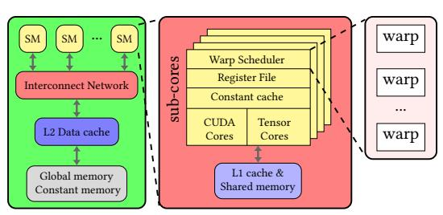
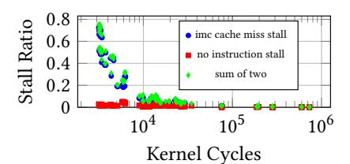
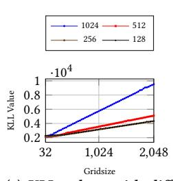
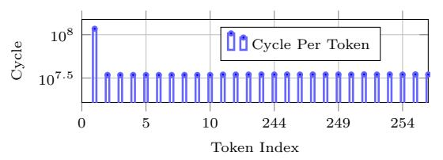
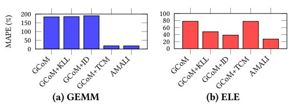
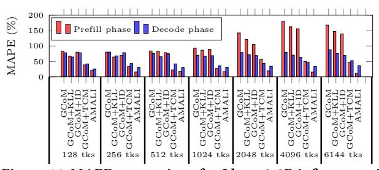
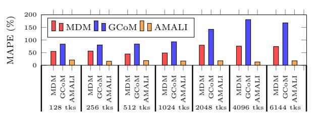
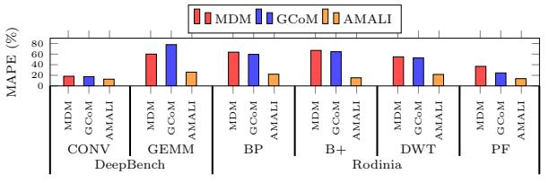
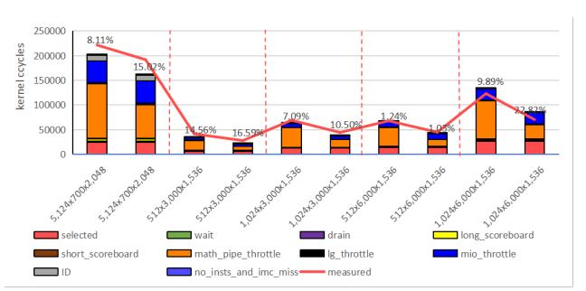

# AMALI: An Analytical Model for Accurately Modeling LLM Inference on Modern GPUs

[Shiheng Cao](https://orcid.org/0009-0002-9705-7216) University of Science and Technology of China Hefei, China caosh2022@mail.ustc.edu.cn

[Junmin Wu](https://orcid.org/0009-0001-3136-6721) University of Science and Technology of China Hefei, China Suzhou Institute for Advanced Research, University of Science and Technology of China Suzhou, China jmwu@ustc.edu.cn

[Junshi Chen](https://orcid.org/0000-0002-6487-3658) University of Science and Technology of China Hefei, China cjuns@ustc.edu.cn

# [Hong An](https://orcid.org/0000-0002-3900-3722)

University of Science and Technology of China Hefei, China han@ustc.edu.cn

# [Zhibin Yu](https://orcid.org/0000-0001-8067-9612)

Shenzhen Institutes of Advanced Technology(SIAT), Chinese Academy of Science(CAS) Shenzhen, China zb.yu@siat.ac.cn

# Abstract

Large language model (LLM) inference applications are surging in recent years, which largely relies on modern GPUs. On the other hand, GPU analytical model is a commonly used tool for architects to precisely identify bottlenecks quickly with deep insights. However, existing GPU analytical models fall short of accurately modeling LLM inference applications on modern GPUs, because of unsuitable tensor core modeling, ignoring constant cache as well as instruction cache modeling and abstracting away important details for LLM inference applications.

To address this problem, we propose a novel analytical model dubbed AMALI to accurately model LLM inference on modern GPUs with three innovations. First, we develop an instruction modifier and throughput based tensor core model by accurately capturing the math pipe throttle stalls to enhance the architecture modeling for modern GPUs. Second, we propose analytical models for constant cache and instruction cache by developing micro-benchmarks to measure CUDA kernel launching latencies. This significantly improves AMALI's accuracy compared to real GPU hardware. Finally, we design a multi-warp model by leveraging warp instruction number distribution to reflect LLM inference application characteristics.

We validate AMALI on an A100 GPU by using typical LLM inference applications. The results show that AMALI reduces the MAPE (mean absolute percentage error) from 127.56% to 23.59%

Permission to make digital or hard copies of all or part of this work for personal or classroom use is granted without fee provided that copies are not made or distributed for profit or commercial advantage and that copies bear this notice and the full citation on the first page. Copyrights for components of this work owned by others than the author(s) must be honored. Abstracting with credit is permitted. To copy otherwise, or republish, to post on servers or to redistribute to lists, requires prior specific permission and/or a fee. Request permissions from permissions@acm.org.

ISCA '25, Tokyo, Japan

© 2025 Copyright held by the owner/author(s). Publication rights licensed to ACM. ACM ISBN 979-8-4007-1261-6/25/06

<https://doi.org/10.1145/3695053.3731064>

compared to the state-of-the-art GCoM model. We further showcase that AMALI can be used to explore architecture design space by designing the tensor core capability of H100. The results show that AMALI accurately predicts the end-to-end performance improvements with the enhanced tensor core capability.

# CCS Concepts

• Computing methodologies → Graphics processors.

# Keywords

graphics processing units, performance modeling, interval analysis

### ACM Reference Format:

Shiheng Cao, Junmin Wu, Junshi Chen, Hong An, and Zhibin Yu. 2025. AMALI: An Analytical Model for Accurately Modeling LLM Inference on Modern GPUs. In Proceedings of the 52nd Annual International Symposium on Computer Architecture (ISCA '25), June 21–25, 2025, Tokyo, Japan. ACM, New York, NY, USA, [14](#page-13-0) pages.<https://doi.org/10.1145/3695053.3731064>

# 1 Introduction

Due to the unprecedented performance of large language models (LLMs), LLM inference has rapidly swarmed into a large number of applications such as OpenAI ChatGPT [\[40\]](#page-12-0) and Github Copilot [\[16\]](#page-12-1). Moreover, it is projected that LLM inference applications would keep surging in the near future [\[7\]](#page-12-2). These applications largely rely on modern GPUs with special support such as tensor cores for LLMs to achieve high performance (e.g., higher tokens/s, shorter TTFT - time to first token, and TBT - time between tokens).

With the rapid evolving of LLM inference applications, it is of utter importance to have tools quickly identifying the performance bottleneck of LLM inference on modern GPUs with deep insights. Such tools shed light on GPU micro-architecture enhancement and performance optimization of LLM inference applications. In fact, in AI (Artificial Intelligence) era, the speed for performance evaluation is more important than accuracy in the early design stage of GPU

architecture, because it evolves rapidly in the last decade, driven by the fast evolving machine learning (ML) workloads [52].

Performance evaluation tools for GPU architecture can be roughly classified into two categories: cycle-accurate simulators [9, 13, 17, 18, 28, 30, 43, 50, 52, 57] and analytical models [8, 21-25, 29, 47, 55, 56, 60], both are indispensable. Cycle-accurate GPU simulators are accurate but extremely slow. Moreover, these simulators can not provide easily understood insights because of their complexity. In contrast, GPU analytical models are orders of magnitude faster than cycle-accurate simulators but with lower accuracy. Furthermore, analytical models can provide easily understood as well as deep insights. For instance, besides predicting the total cycles taken by a GPU kernel, an analytical model can build a cycles-per-instruction (CPI) stack to help computer architects find the bottleneck of the kernel on various GPU architectures easily by showing the percentages of various stall events in its execution [24, 56]. As aforementioned, GPU architects need fast performance evaluation tools more in the AI era. We therefore focus on studying GPU analytical models and hope existing ones can successfully work for LLM inference.

However, we find existing GPU analytical models [21–25, 29, 55, 56] fall short of modeling LLM inference performance on modern GPUs with enough accuracy, because of two reasons. First, these models inappropriately or even do not model the micro-architecture enhancements including tensor cores, immediate constant cache, and instruction caches of modern GPUs. Second, these models do not consider the characteristics of LLM inference which is significantly different from traditional ML workloads and other GPU applications. As a result, as applying the state-of-the-art (SOTA) analytical model, GCoM, on LLM inference, the error is significantly high (e.g., 127.6%) compared to real GPU hardware (, see Section 6), which is unacceptable.

To address these issues, we propose AMALI, an analytical model, to model LLM inference on modern GPUs with enough accuracy. We carefully analyze modern GPU architectures, as well as LLM inference characteristics and come up with three innovations. First, by analyzing how tensor cores work with specific instructions such as HMMA, we propose an instruction modifier and throughput based tensor core model by precisely capturing the math pipe throttle stalls, facilitating accurately modeling the performance of the heavily used GEMM (general matrix multiplication) operations in LLM inference.

Second, we model the immediate constant cache and instruction cache by designing micro-benchmarks to measure kernel launching latency. This launching latency is exactly the stalls caused by the immediate constant cache misses and instruction cache misses. As such, this innovation significantly improves the accuracy of our analytical model compared to real GPU hardware.

Finally, we find that the warp distribution used by the SOTA GPU analytical model, GCoM [29], does not reflect the characteristics of LLM inference applications. We therefore propose to leverage warp instruction distribution to build a multi-warp model to model the LLM inference application on GPUs.

In particular, the main contribution of this paper is as follows.

 We develop a tensor core model to accurately capture the math pipe throttle stalls caused by tensor cores across various data types and tensor sizes.

Figure 1: An overview of Ampere GPU micro-architecture.

- We model the stalls caused by immediate constant cache misses and instruction cache misses, by developing microbenchmarks to measure kernel launch latency.
- We model the instruction distribution of warps of LLM inference to enhance the kernel cycle prediction.
- By putting it all together, we build a model named AMALI to predict the kernel cycles of a LLM inference.
- We validate AMALI against NVIDIA A100 GPU by using several typical LLM inference applications. The experimental results show that AMALI achieves a MAPE of 23.59%, indicating a significant improvement over GCoM's MAPE of 127.56% in total cycle prediction of a kernel.
- We showcase that AMALI can be used to explore GPU architecture design space by designing the tensor core capability of H100. The results show that AMALI accurately predicts the end-to-end performance improvements (e.g., kernel cycles) with the enhanced tensor core capability.

The rest of the paper is organized as follows. Section 2 describes the background of this paper. Section 3 depicts the baseline GPU analytical model and our motivation. Section 4 elaborates our AMALI analytical model. Section 5 presents the experimental setup. Section 6 provides the experimental results and analysis. Section 7 introduces the related work and Section 8 concludes the paper.

#### 2 Background

#### 2.1 GPU Architectures

Without loosing generality, we employ NVIDIA GPUs (Graphics Processing Unit) to introduce GPU architecture. Figure 1 shows the Ampere GPU architecture [1, 11, 39]. As can be seen, a GPU consists of a number of streaming multi-processors (SM) connected by an on-chip interconnection network. To buffer data between SMs and memory, a L2 data cache is designed between the global as well as constant memory, and the interconnection network.

Each SM consists of a L1 cache/shared memory and several subcores. The L1 cache/shared memory is shared among the sub-cores. Note that the L1 cache and shared memory in a SM share the same hardware which a part of it can be configured as L1 cache and the other part as shared memory. Each sub-core contains a warp scheduler, register files, a constant cache, a set of CUDA cores, and a set of tensor cores. The warp scheduler selects a warp, which contains a number (e.g., 32) of threads executing in a lock-step manner, to execute when the warp is ready. In each cycle, the warp scheduler issues an instruction from the selected warp. If the operand of the instruction is not ready, the warp scheduler suspends the warp and selects another warp to execute by employing a certain

scheduling policy such as loosely round robbin(LRR) [31, 38] or greedy then oldest [45].

Tensor cores are customized compute units that can perform one matrix-multiply-and-accumulate on  $4 \times 4$  matrices per clock cycle. This significantly accelerates GEMM computation like  $C = A \times B + C$ . A and B are  $m \times k$  and  $k \times n$  matrices, respectively; C is the accumulator matrix. Tensor cores are therefore crucial components for LLM inference and other AI workloads.

To program tensor cores, typical instructions are:

$$HMMA.16816.F32, R0, R108, R140, R0$$
 (1)

The instruction name 'HMMA' represents half-matrix multiply add, which indicates the input is half-precision. These instructions contain modifiers which locate after the dot symbols and influence instruction behavior. The first modifier, such as 16816 or 1688, denotes the tensor size of these instructions. For example, 16816 represents the input tensors A and B are  $16 \times 8$  and  $8 \times 16$  matrices, respectively. 1688 represents  $16 \times 8$  (A) and  $8 \times 8$  (B) input matrices. The second modifier such as F32 shown in expressions (1) and (2) denotes the data type of the accumulator tensor.

Each tensor core instruction shown in expressions (1) and (2) contains four registers. R0 is the register used to store the accumulator/result matrix (C); the register R108 or R180 stores the input matrix A and R140 or R196 stores B. Note that these registers are shared by all the threads in a warp. In contrast, for CUDA cores, each thread in a warp can only access its own register, rather than the ones of other threads. In other words, the threads in a warp running on tensor cores access registers in a per-warp scheme while those on CUDA cores access registers in a per-thread scheme. The behavior of each thread with the per-warp scheme is non-deterministic whereas that of each thread with the per-thread scheme is deterministic.

Moreover, NVIDIA GPUs have a small constant memory (e.g., 64KB) to hold constant variables like *warp id*, *block id*, and other data structures such as arrays. Constant memory is a part of global memory, and has a constant cache as shown in Fig.1. In a constant cache miss, it takes the memory read time (e.g., hundreds of cycles) to get data from the constant memory. In a constant cache hit, the data can be attained as fast as a register file access [38]. Note that not only the *ld* instructions can explicitly access constant memory but also other instructions can *implicitly* access it. For example, the instruction *IMAD.MOV.U32 R1, RZ, RZ, c[0x0][0x28]* accesses the constant memory since the memory address is with a special symbol 'c', indicating the address is in constant memory [37].

#### 2.2 CUDA Programming model

Compute Unified Device Architecture (CUDA) [15] is a programming model designed for NVIDIA GPUs and it allows programmers to write GPU functions using C style functions, called kernels. CUDA designs an execution model named SIMT (single instruction multiple threads) to execute kernels with a three-level hierarchy. The lowest level is thread which executes GPU instructions (e.g., SASS instructions). 32 threads are organized as a warp which executes in a lock-step manner. The upper level is thread block which contains a number of threads or warps. The highest level is called grid which consists of a number of thread blocks. This three-level

hierarchy is convenient to manage a large number of threads or to program cubic graphics with three dimensions (e.g., x, y and z).

### 2.3 Large Language Model

Transformer [14, 34, 51] based large language models (LLM) have been used in a wide range of applications such as OpenAI Chat-GPT [40] and Copilot [16]. The Transformer block consists of two critical components: multi-head attention and the feed-forward neural network. The core computations of both parts are the General Matrix Multiplication (GEMM) operations, which are executed on GPUs using Tensor Cores for optimized computational efficiency.

In the multi-head attention mechanism, the input data is projected into multiple scaled dot-product attentions in parallel. This involves computing query, key (K), and value (V) matrices for each attention head through linear transformations (which are essentially matrix multiplications). The feed-forward block follows the attention mechanism and consists of two linear layers with a non-linearity (such as ReLU) between them. These operations are highly suited for execution on Tensor Cores.

LLM inference typically consists of two stages: prefill and decode. The prefill stage receives requests (also called prompts) consisting of tokens and processes them in parallel. The decode stage outputs responses in an auto-regressive manner. To accelerate the token generation, the computation of K and V matrices is cached and called KV cache. Longer prompts require larger KV cache.

A popular software framework for LLM inference includes Pytorch [41, 46], CUDA [15] and other layers such as vLLM [54]. Typically, model implementation is written in Pytorch and the GEMM implementation is written in CUDA. Pytorch provides facilities to call CUDA APIs conveniently. A LLM inference may call thousands of CUDA kernels from Pytorch codes.

#### 2.4 Stall classification

Identifying stalls is extremely important to analyze the performance bottleneck of an application on a given GPU. GSI [2] classifies the stalls into seven categories and the SOTA GPU analytical model GCoM [29] employs this classification: 1) **idle stalls** caused by not enough threads/instructions to execute, 2) **control stalls** (Ctrl) caused by kernel code divergence (icache misses), 3) **synchronization stalls** (Sync) incurred by thread barriers, 4) **memory data stalls** (MemData) due to pending memory loads, 5) **memory structural stalls** (MemStruct) due to unavailable load/store ports, 6) **compute data stalls** (ComData) caused by the operands of an instruction not been produced by other instructions yet; 7) **compute structural stalls** (ComStruct) due to the unavailable required compute resources. This classification employs a view on general processors, which does not accurately reflect NVIDIA GPU-specific features such as constant memory.

In contrast, NVIDIA's profiling tool Nsight Compute (NCU) [36] provides a GPU-specific stall classification based on warp status, as shown in Table 1. **math pipe throttle** occurs when a warp is waiting for an available execution pipeline to execute; **no instructions** can happen due to instruction cache misses; **imc miss** indicates stalls caused by immediate constant cache misses; just to name a few. The "not modeled" stalls shown in Table 1 were not modeled by previous GPU analytical models [21–25, 29, 55, 56]. In

fact, building models based on these GPU specific stalls makes an analytical model more accurate than using the stall classification from a general processor view.

#### **Baseline Model and Motivation**

#### **Baseline Model**

To model the GPU performance, prior studies [24, 29, 55, 56] build GPU analytical models with enhanced interval analysis. In fact, interval analysis is a powerful tool successfully used for CPU performance modeling [27]. It splits the execution of a thread into several intervals with time boundary when stalls occur. But this is not enough to accurately model GPU performance. The GPU analytical model MDM [56] therefore enhances the interval analysis by considering the memory stalls caused by the memory resource contention during the memory access from L1 cache to device memory. GCoM [29] further considers the computing resources contention, detailed architecture of modern GPUs (e.g., four sub-cores in a SM and sectored L1 D Cache), and the imbalance of workload based on MDM, improving the model accuracy and in turn becoming the SOTA GPU analytical model.

Since our GPU analytical model is based on GCoM, we first briefly introduce GCoM and take it as our baseline. GCoM generally employs a hierarchical modeling approach (from SM to sub-core and then to sub-core components such as L1 D Cache) to model the cycles consumed by a CUDA kernel, so called kernel cycles. Since a CUDA kernel is typically launched with specified thread block and grid dimensions, it therefore runs on a number of SMs in parallel. GCoM models the kernel cycles of such a CUDA kernel as the arithmetic mean of the cycles consumed by the CUDA kernel on all the active SMs at the highest level, as equation (3) shows.

$$C^{kernel} = (\sum_{i=0}^{numSMs-1} C_i)/numSMs$$
 (3)

with Ckernel the kernel cycles of a CUDA kernel, numSMs the number of active SMs running the kernel, and  $C_i$  the cycles consumed by the CUDA kernel running on the  $i^{th}$  SM.

To model  $C_i$ , GCoM firstly models the cycles consumed by the kernel on each sub-core ( $subC_i$ ), at the next level of the hierarchy shown in Figure 1, as a sum of the active and idle cycles. The idle cycles are incurred by the the load imbalance among the sub-cores and therefore GCoM models it as the difference between the active cycles of the current sub-core and those of the longest running sub-core in the same SM. The active cycles, on the other hand, may be influenced by data dependencies, as well as long latency memory accesses. GCoM thus models the active cycles of a sub-core as equation (4) shows.

$$subC_{j}^{active} = subC_{j}^{base} + SubCS_{j}^{ComData} + subCS_{j}^{MemData} \quad (4)$$

with  $subC_i^{active}$  the active cycles consumed by the kernel on the  $j^{th}$  sub-core,  $subC_{j}^{base}$  the cycles used to execute the warp instructions of the kernel on the  $j^{th}$  sub-core without any hazard,  $SubCS_i^{ComData}$  the stalled cycles caused by data (e.g., operand) hazards, and  $subCS_j^{MemData}$  the stalled cycles incurred by long-latency memory accesses. As such, GCoM calculates  $C_i$  with equation (5),

$$C_{i} = \left(\sum_{j=0}^{numSubcs-1} subC_{j}\right)/numSubcs + S_{i}$$
 (5)

with numSubcs the number of sub-cores in the  $i^{th}$  SM and  $S_i$  the stalled cycles of the  $i^{th}$  SM.

The modeling of  $S_i$  in GCoM goes to the lowest level of the hierarchy shown in Figure 1, considering the L1 D Cache misses caused memory stalls; on the other hand, it also considers the compute resource contention incurred stalls, as well as memory resource contention caused stalls. Equation (6) shows the  $S_i$  model.

$$S_i = S_i^{comStruct} + S_i^{memStruct} + S_i^{MSHR} + S_i^{NoC} + S_i^{DRAM}$$
 (6)

with  $S_i^{comStruct}$  the compute resource contention caused stalls,  $S_i^{memStruct}$  the memory resource contention incurred stalls,  $S_i^{MSHR}$ MSHR (miss status/handler registers) contention caused stalls,  $S_i^{NoC}$ the network on chip contention caused stalls, and  $S_i^{DRAM}$  the LLC misses caused the memory access latencies. Note that the last three items in equation (6) are modeled by MDM [56] whereas GCoM models the left two items.

We now introduce how GCoM models  $S_i^{comStruct}$  and  $S_i^{memStruct}$ . Since resource contention directly influences the cycles used to issue warp instructions, GCoM firstly models the issue cycles. To this end, it firstly determines the active sub-cores when there are a number of concurrently-executing warps, as equation (7) shows.

$$numActSCs(x) = min(x, numSubcs)$$
 (7)

with x the number of concurrently-executing warps and numSubcs the number of sub-cores in a SM. Subsequently, GCoM models the maximum issue cycles in the  $k^{th}$  interval, the issue cycles as compute resources are sufficient in the  $k^{th}$  interval, the issue cycles to the  $m^{th}$  functional unit (FU) in the  $k^{th}$  interval, and the issue cycles to the L1 D Cache in the  $k^{th}$  interval as equations (8), (9), (10), and (11) show, respectively.

$$C_k^{\text{IssueMax}}(x) = \max_{m \in \text{FU}} \left\{ C_k^{\text{IssueBase}}(x), C_{k,m}^{\text{Issue}}(x), C_{k,\text{L1}}^{\text{Issue}}(x) \right\}$$
(8)

$$C_k^{\text{IssueBase}}(x) = \frac{I_k \cdot x}{\text{numActSCs}(x) \cdot \text{IssueRate}}$$
(9)

$$C_{k}^{\text{IssueBase}}(x) = \frac{I_{k} \cdot x}{\text{numActSCs}(x) \cdot \text{IssueRate}}$$
(9)
$$C_{k,m}^{\text{Issue}}(x) = \frac{I_{m} \cdot II_{m} \cdot x}{\text{numActSCs}(x) \cdot \text{IssueRate}}$$
(Im \le Ik) (10)

$$C_{k,\text{L1}}^{\text{Issue}}(x) = \left[\frac{b_k}{B_k^{\text{L1}}}\right] \times x \tag{11}$$

with x the number of concurrently-executing warps in the  $k^{th}$  interval, numActSCs the number of active sub-cores in a SM, IssueRate the warp instruction issue rate,  $I_k$  the number of warp instructions in the  $k^{th}$  interval of the representative warp,  $I_m$  the number of warp instructions dispatched to the  $m^{th}$  FU,  $II_m$  the initiation interval of the  $m^{th}$  FU,  $b_k$  the amount of L1 D Cache accesses incurred by the representative warp, and  $B_k^{L1}$  the effective L1 D Cache bandwidth in the  $k^{th}$  interval.

Finally, GCoM models the stalls caused by compute resource contention by equation (12)

$$S^{ComStruct}(x) = \sum_{k \in intervals} \left( C_{k,m}^{Issue}(x) - C_{k}^{IssueBase}(x) \right)$$
 (12)

Table 1: The stall event classification in Nsight compute; For simplicity, we omit several types of stalls:Synchronization and control-related stalls that prior work considers negligible, including warpgroup\_arrive, barrier, membar, branch\_resolving, sleeping and misc. Additional stalls with minimal impact: not\_selected, drain and dispatch\_stall

| Stall type         | Description                                                                                                       | Classification in prior work     |
|--------------------|-------------------------------------------------------------------------------------------------------------------|----------------------------------|
| selected           | Warp was selected by the micro scheduler and issued an instruction.                                               | Base in single warp model        |
| wait               | Warp was stalled waiting on a fixed latency execution dependency.                                                 | ComData                          |
| long_scoreboard    | Warp was stalled waiting for a scoreboard dependency on a L1TEX (local global surface texture) operation.         | MemData for global memory access |
| short_scoreboard   | Warp was stalled waiting for a scoreboard dependency on a MIO (memory input/output) operation (not to L1TEX).     | MemData for share memory access  |
| math_pipe_throttle | Warp was stalled waiting for the execution pipe to be available.                                                  | ComStruct                        |
| tex_throttle       | Warp was stalled waiting for the L1 instruction queue for texture operations to be not full.                      | MemStruct                        |
| lg_throttle        | Warp was stalled waiting for the L1 instruction queue for local and global (LG) memory operations to be not full. | MemStruct                        |
| mio_throttle       | Warp was stalled waiting for the MIO (memory input/output) instruction queue to be not full.                      | MDM                              |
| no_instructions    | Warp was stalled waiting to be selected to fetch an instruction or waiting on an instruction cache miss.          | not modeled                      |
| imc_miss           | Warp was stalled waiting for an immediate constant cache (IMC) miss.                                              | not modeled                      |

When  $C_{k,\mathrm{L1}}^{\mathrm{Issue}}$  becomes  $C_k^{\mathrm{IssueMax}}(x)$ , GCoM employs equation (13) to model the memory contention caused stalls.

$$S^{MemStruct}(x) = \sum_{k \in intervals} \left( C_{k,\text{L1}}^{\text{Issue}}(x) - C_k^{\text{IssueBase}}(x) \right) \quad (13)$$

#### 3.2 Prior Work Limitations

After briefly introducing the GPU analytical model GCoM, we now analyze its limitations.

Limitation #1: Initiation interval modeling inappropriately models tensor cores. As shown in equation (10), GCoM needs to use initiation interval ( $II_m$ ) of the  $m^{th}$  FU to calculate the issue cycles to the  $m^{th}$  FU in the  $k^{th}$  interval ( $C_{k,m}^{Issue}(x)$ ). The initiation interval denotes elapsed cycles between issuing two operations of the same type of FU [20]. The initiation intervals of different types of FU may be different. Prior GPU analytical models [8, 29, 48, 60] including GCoM [29] use it to model the computing resource contention, as equation (14) shows.

$$initiation\_interval = \frac{warp\_size}{functional\_unit\_lanes}$$
 (14)

with warp\_size the number of threads in a warp which is typically 32 and functional\_unit\_lanes the number of FUs of a sub-core.

As such, initiation interval actually models the throughput of a FU [20], because it can be calculated as the reciprocal of the elapsed cycles between two continuous computing results from the FU. When <code>functional\_unit\_lanes</code> is less than <code>warp\_size</code>, computing resource contention occurs and the warp scheduler takes the same number of cycles as the initiation interval to issue a warp instruction. This approach works well for modeling CUDA cores, where

thread contention occurs as threads in a warp compete for access to computing resource, namely CUDA cores.

However, this works poorly for tensor cores. When threads run on CUDA cores, each warp thread only accesses its own registers to execute instructions. In contrast, when threads run on tensor cores, all threads in warp share the same register file as described in Section 2. This allows the threads to work together to perform operations like matrix multiplications(e.g. HMMA instruction) in a unified way, rather than individually. As such, this makes the initiation interval of tensor cores can be significantly less than the number calculated as (14).

We conduct experiment to confirm this analysis by comparing the math pipe throttle stalls defined in NCU against the computing resource contention modeled by GCoM using initiation interval when we run Llama2-7B inference on RTX 3090. Figure 2a shows the results. As can be seen, GCoM significantly overestimates the math pipe throttle stalls caused by resource contention of the GEMM kernel in Llama2-7B inference compared to the those occurred on the real hardware. This overestimation arises because the initial interval estimation for the tensor cores is too large relative to the real situation.

Limitation #2: Ignoring instruction modifiers does not lead to accurate modeling for tensor cores. Existing GPU analytical models [8, 29, 48, 60] including GCoM [29] do not consider the instruction modifiers such as data type (e.g., F32). This might be acceptable for CUDA core instructions but unacceptable for tensor core instructions because tensor size modifiers influence the performance of tensor core instructions significantly. To confirm this, we firstly develop micro-benchmarks to measure the performance of

Figure 2: CPI stack constructed by GCoM and AMALI compared to hardware(HW) with a NVIDIA RTX3090

Figure 3: Total cycles of the HMMA instruction with modifiers 16816 and 1688

tensor core instructions. Subsequently, we utilize cuAssembler [12] to modify the SASS trace of our micro-benchmark by altering only the instruction modifier of HMMA, tensor size, from 16816 to 1688 while keep other factors such as the modifier *F*32 and instruction count unchanged. Figure 3 shows that the number of FMAs (floating multiply-add) per HMMA instruction with modifier 16816 doubles that of the instruction with modifier 1688. The same applies to the total cycles taken by HMMA with modifiers 16816 and 1688.

This indicates that the cycles per instruction (CPI), which can be treated as throughput, of an HMMA with 16816 is double that of an HMMA with 1688. The reason is as follows. An HMMA with 16816 performs  $16 \times 8 \times 16 = 2048$  FMAs while that with 1688 performs  $16 \times 8 \times 8 = 1024$  FMAs. The FMAs per cycle is a design parameter of a GPU tensor core. For example, each tensor core of A100 GPU is designed to perform  $8 \times 4 \times 8 = 256$  FMAs [39] in a single cycle. Therefore, an A100 tensor core needs 8 and 4 cycles to execute an HMMA with 16816 and the one with 1688, respectively. That is, the CPI of HMMA with 16816 is 8, which is double that with 1688 (CPI=4). In summary, both our experiments and theoretical analysis show that modifiers significantly influence the throughput of tensor core instructions and in turn we must take modifiers into account as we model the throughput of tensor cores, see Section 4.7.

Limitation #3: Constant cache modeling does not consider implicit constant memory accesses and instruction cache modeling is ignored. We find the *imc\_miss* (immediate constant cache misses) defined by NCU may be caused by not only explicit but also implicit constant memory accesses. Existing GPU analytical models [8, 29, 48, 60] including GCoM [29] model constant memory access by leveraging explicit load and store instructions (e.g., *LDC* and *STC*). However, constant memory is also heavily accessed by

Figure 4: Imc cache miss stall and no instruction stall refer to kernel cycles in Llama2 inference

Figure 5: Distribution of instruction number. In this study, we use the notation {name}\_{length}\_{id} to denote a kernel, where name is the abbreviation of the kernel's name, length represents the prompt's length in terms of token count and id identifies the specific kernel index.

implicit instructions. Expression (15) shows an example. As can be seen, the constant memory address c[0x0][0x28] is encoded as an operand of the instruction by using the symbol "c". Ignoring these instructions makes the modeling of immediate constant cache inaccurate.

$$IMAD.MOV.U32R1, RZ, RZ, c[0x0][0x28]$$
 (15)

On the other hand, prior models do not model instruction cache miss either, making them inaccurate for modeling the *no\_instruction* stalls defined in NCU. As shown in Fig.2b, GCoM fails to account for stalls caused by constant cache misses and instruction cache misses. As a result, it significantly underestimates the cycles of the VELE kernel during Llama2-7B inference.

Moreover, Figure 4 shows the sum of stalled cycles caused by immediate constant cache misses and instruction cache misses can be a high ratio (e.g. 70%) in the CPI stack, indicating they can not be ignored in GPU analytical models.

Limitation #4: Existing GPU analytical models do not consider the warp characteristics of LLM inference. GPU analytical models [8, 29, 48, 60] including GCoM [29] employ K-means to select a representative warp to represent all the warps in a CUDA kernel. Prior studies claim that this approach is accurate enough [24, 29, 56]. This might be true for kernels from Rodinia [10] and Parboil [49] benchmark suites. However, we find that the warp execution flows in a CUDA kernel of LLM inference applications are significantly different, as Figure 5 shows.

A couple of interesting observations can be made here. For one, different CUDA kernels in a LLM inference have significantly different number of warps, from tens to thousands. This is because LLMs consists of more operators than DNNs. Taking GEMM as an example, GEMMs in one LLM application are significantly more heterogeneous than those in a traditional DNN such as RNN [42]. For example, the GEMMs in the attention layer of LLMs are generally memory-bound while those in FFN layers are compute-bound. In contrast, the GEMMs in one DNN are generally compute-bound as shown in [42]. Moreover, the dimension of the GEMMs in LLM might be dramatically different. For instance, the  $bs \times seq\ lth$  (bs - batch size, seq1th - sequence length) corresponds to the M of a GEMM  $M \times k \times N$  in an LLM inference. In the prefill stage, suppose the  $seq_lth$  is 32,768 and bs is 4, then M is 131,072. In the decode stage, the seq\_lth is always 1 because of the auto-regressive manner and the bs can still be 4, then M is only 4. That is, the M of the GEMM  $M \times k \times N$  of the prefill stage is 32,768 times of the M of the decode stage!.

Second, the number of instructions in some warps is dramatically different from that of other warps in the same CUDA kernel. Taking the kernel <code>ELE\_4096\_160</code> as an example, each of 3,000 warps only contain several hundreds of instructions, as the left bar in Figure 5a shows. In contrast, the right highest bar in Figure 5a shows that each of 2,800 warps in the same kernel contains more than 6,000 instructions. Finally, the warp instruction number difference of some kernels such as <code>GEMM\_bf16\_4096\_172</code> is extremely large, from less than 100,000 to more than 600,000.

In summary, such significant difference in warp instruction number in the same CUDA kernel in LLM inference makes using one representative warp to represent all the warps of a CUDA kernel infeasible. However, for interval analysis, using one representative warp is *required*. We address this extreme challenge in Section 4.9.

### 4 The AMALI Model

To address the above limitations in the case of running LLM inference on modern GPUs, we propose a novel GPU analytical model dubbed AMALI. It predicts the total cycles consumed by a CUDA kernel of a LLM inference application.

#### 4.1 Overview

Figure 6 shows an overview of AMALI. As can be seen, it consists of six components: SASS Tracer, SASS Parser, Cache Simulator, Interval Analyzer, Interval Parser, and KLL comp (kernel launching latency). The SASS Tracer collects instruction traces and related information of CUDA kernels. The Cache Simulator simulates the cache behavior based on the memory access traces obtained by the SASS Tracer. The SASS Parser extracts required information from SASS traces. The Interval Analyzer partitions the execution of a warp into intervals. The Interval Parser leverages the produced intervals to build models to predict cycles consumed by a kernel. KLL comp computes launching latency of a CUDA kernel.

To use AMALI, we need to know the architecture parameters of a GPU. To this end, we develop micro-benchmarks and we follow the pointer chase method, as described in [4, 33], to measure the latency and throughput of FUs and the memory system.

Figure 6: An overview of AMALI. SASS - CUDA assembly instruction. AMAT - Average Memory Access Time. KLL - Kernel Launch Latency.  $S_I$  - Results of interval analyzer. ID - Instruction Divergence.

#### 4.2 SASS Tracer

It is developed based on the GPU instrumentation tool NVBit [53] to collect SASS instruction traces and the related information of CUDA kernels. In detail, it collects instruction names, instruction modifiers, the registers an instruction uses, memory accessing addresses, grid size, thread block size, consumed shared memory size, consumed register file size, warp IDs, and SM IDs. Previous works [3, 19, 29, 60] have demonstrated that modeling with the SASS offers greater accuracy than PTX, so our SASS Tracer focuses on collecting information of SASS instructions.

#### 4.3 SASS Parser

Our SASS Parser extracts required information such as grid size and thread block size from the traces produced by the SASS Tracer. Since a representative warp is required for interval modeling, we leverage the SASS Tracer to constructs a single-warp representation based on the FUs used by each warp, encoding each warp as a vector. To this end, the SASS Parser applies k-means clustering, following an approach similar to GCoM [29] and GPUMech [24] and capture the *selected stall* events defined in NCU. Note that each warp is scheduled to a sub-core by using the scheme  $sub-core\_id = warp\_id\%4$ , as described in [26].

#### 4.4 Cache Simulator

The Cache Simulator simulates the cache behavior by using the memory access addresses obtained by the SASS Tracer in conjunction with the specified GPU architecture configuration parameters. The goal of the cache simulation is to determine the Average Memory Access Times (AMATs). The AMATs and FUs latency are then used in interval analysis, as detailed in [27], to segment the execution of a warp into discrete intervals.

# 4.5 Interval Analyzer

Our Interval Analyzer leverages the AMATs produced by the Cache Simulator and the warp profile obtained by the SASS Parser to partition the execution of a warp into discrete intervals. We now discuss how to match the stall events of data dependency in the interval analysis. First of all, AMALI estimates the total cycle of an kernel by using equation (16).

$$C = S_I + S_{IP} + KLL + ID \tag{16}$$

(a) KLL values with different gridsize, each color corresponding to a blocksize

(b) Slopes with different block-

Figure 7: KLL values with different gridsize and slopes with different blocksize

where C is the estimated cycles of a kernel.  $S_I$  and  $S_{IP}$  represent the stalls captured by the Interval Analyzer and Interval Parser, respectively. KLL means the kernel launching latency and ID denotes the idle cycles caused by instruction divergence. At the beginning, AMALI models the *selected stalled* cycles as the number of instructions issued by the representative warp, as equation (17) shows:

$$S_{Selected} = I_{warp}/IssueRate$$
 (17)

where  $I_{warp}$  is the number of instructions in the representative warp and  $S_{Selected}$  is the stalled cycles of the stall type 'selected' as Table 1 shows.

We adopt the traditional interval analysis method [24, 27] in our Interval Analyzer to model data dependencies caused by the global or shared memory access and computing instructions. For every instruction, we mark the end cycle of it. For a global memory instruction, the end cycle of it is the current cycle plus AMAT. For share memory instruction, the end cycle is the current cycle plus share memory access cycles depending on load/store [1].

For instructions executed on CUDA cores, AMALI models their performance based on fixed latency from architectural parameters. In contrast, the latency of tensor core instructions is characterized by throughput based on modifiers including data type and tensor size (, seeing the details in Section 4.7). When the data that an instruction uses are not immediately available, a stall interval is inserted until the instruction can be issued. The result of interval analysis is computed by using equation (18).

$$S_{I} = S_{Selected} + S_{wait} + S_{short\_scoreboard} + S_{long\_scoreboard}$$
 (18)

with  $S_I$  the predicted cycles of the interval,  $S_{wait}$  the stalled cycles due to data dependency of computing instructions,  $S_{short\_scoreboard}$  the stalled cycles caused by shared memory, and  $S_{long\_scoreboard}$  stalled cycles incurred by global memory.

For a stalled interval, AMALI captures the stall reasons, which are categorized into computing, shared memory access, or other memory access stalls. The Interval Analyzer then analyzes these information of the representative warp to get the three stalled cycles:  $S_{wait}$ ,  $S_{short\_scoreboard}$  and  $S_{long\_scoreboard}$ . The sum of them can be calculated by equations (19) and (20).

$$S_i = \sum_{k \in \text{intervals}} S_k \cdot P(i, flag[k])$$
 (19)

Figure 8: Cycle per token in Llama2-7B inference

$$P(x,y) = \begin{cases} 1 & \text{if } x = y \\ 0 & \text{otherwise} \end{cases}$$
 (20)

where i and flag[k] denote interval stall reasons, which can be include wait, long\_scoreboard, or short\_scoreboard. flag[k] denotes the stall reason of the  $k^{th}$  interval and  $S_k$  means the length in cycles of the  $k^{th}$  stall interval. Note that x = y indicates the stall reasons are the same.

#### 4.6 Interval Parser

Our Interval Parser captures math\_pipe\_throttle, lg\_throttle, tex\_throttle and mio\_throttle. We employ equation (21) to compute the sum of these stalled cycles:

$$S_{IP} = S_{math\_pipe} + S_{lg} + S_{mio}$$
 (21)

where  $S_{IP}$  is the resulted cycles by the Interval Parser.  $S_{math\_pipe}$ ,  $S_{lg}$ , and  $S_{mio}$  represent the math pipe throttle, lg throttle, and mio throttle caused stall cycles, respectively.

To calculate the first two of the three "throttle" caused stall cycles, we use the core modeling approach of GCoM [29], as equations (22) and (23) show.

$$S_{math\ pipe} = S^{ComStruct}$$
 (22)

$$S_{lq} = S^{MemStruct}$$
 (23)

where the  $S^{ComStuct}$  and  $S^{Memstruct}$  are the stalled cycles caused by the computing and memory structure hazards, respectively. The  $S_{math\_pipe}$  denotes the stalled cycles caused by the computing resource hazard while  $S_{lg}$  represents the stalled cycles incurred by the L1 D Cache access contention.

For the last "throttle" cased stalled cycles (mio\_throttle), AMALI uses the MDM to model the memory side contentions which are  $S_{MSHR}$ ,  $S_{NoC}$  and  $S_{DRAM}$ , as equation (24) shows.

$$S_{mio} = S^{MSHR} + S^{NoC} + S^{DRAM}$$
 (24)

where  $S_{mio}$  denotes the stalled cycles caused by memory contention.  $S^{MSHR}$ ,  $S^{NoC}$  and  $S^{DRAM}$  are the MSHRs, NoC and DRAM contentions incurred stalled cycles, respectively.

### 4.7 Tensor Core Modeling

Unlike previous studies [24, 29, 56] model CUDA core performance without considering instruction modifiers, AMALI takes the instruction modifiers into account for modeling the tensor core performance. In fact, AMALI uses the throughput obtained from microbenchmarks along with modifiers to model tensor core, as equation (25) shows.

$$II_{TC} = \frac{\text{FMA\_count}}{\text{TP}_{\text{dt}}}$$
 (25)

where  $II_{TC}$  means initiation interval for tensor cores based on the current HMMA instruction.  $FMA\_count$  means the FMA flops of

the instruction, which is influenced by the modifier. means the peak throughput in FMA operations per cycle (FMAs/cycle) based on the datatype . In fact, FMAs/cycle is a design parameter for tensor cores. is used to replace the in equation [\(10\)](#page-3-8) to predict the issue cycles on the tensor cores in an interval. The is actually the latency of a tensor core instruction, which can be denoted by equation [\(26\)](#page-8-3).

$$L_{\rm TC} = II_{\rm TC} \tag{26}$$

where is the latency of a single tensor core instruction which is used in interval analysis.

# 4.8 Modeling Constant/Instruction Cache

We use kernel launching latency (KLL) to model the stalled cycles caused by constant cache misses and instruction cache misses. The KLL is expressed by equation [\(27\)](#page-8-4):

$$KLL = s \cdot GS + k \tag{27}$$

where is the kernel launching latency, is a parameter that depends on thread block size, is a fixed number specific to the architecture and GS is the grid size of the kernel, which can be obtained from the SASS Tracer. The parameters and are determined by micro-benchmarks.

Figure [7](#page-7-10) shows the results of micro-benchmarks on the A100 GPU platform. For the Ampere architecture, with a fixed thread block size, the kernel launching latency exhibits a linear relationship with the grid size. However, the slope of this line is non-linear with respect to the thread block size. To model this slope, we employ a second-order function of thread block size as equation [\(28\)](#page-8-5) shows:

$$s = \alpha \cdot (BS)^2 + \beta \cdot (BS) + \gamma \tag{28}$$

Here, represents the slope of the line and is the thread block size of a kernel, obtained from the SASS Tracer. The coefficients , , are constants and can be determined by benchmarks.

# 4.9 Modeling Warp Instruction Distribution

GCoM improves the model accuracy by considering the workload imbalance caused by the warp number distribution in the entire GPU. But we find that in LLM inference, the workload imbalance does not appear in warp number distribution. Instead, it appears in warp instruction number distribution. For accurately modeling kernel cycles in LLM inference, modeling instruction divergence () is important. We employ equation [\(29\)](#page-8-6) to model .

$$ID = (\text{maxsub-coreInstr} - I_{SC\_Repr.warp}) / IssueRate$$
 (29)

where the − is the maximum number of warp instructions on a sub-core in the kernel. \_ . is the number of warp instructions of the sub-core which executes the representative warp. is the instruction issuing rate in instructions per cycle. As such, the unit of is cycles. By adding it to other stalled cycles shown in equation [\(16\)](#page-6-2), we can improve the accuracy of modeling kernel cycles in LLM inference.

# 5 Experiment Setup

# 5.1 Hardware and System Software

To evaluate AMALI, we compare the total kernel cycle prediction against GCoM. We ran the experiments on a server equipped with

Table 2: GPU configuration for NVIDIA A100

| Parameter           | Value                                          |
|---------------------|------------------------------------------------|
| ClockFrequency      | 1410 MHz                                       |
| SM                  | #108, 4 sub-cores per SM                       |
| Warp Scheduler      | single-issue, not model policy                 |
|                     | INT: #64,4 cycles/warp inst.                   |
|                     | FP32: #64,4 cycles/warp inst.                  |
|                     | FP64: #32,4 cycles/warp inst.                  |
| Functional units/SM | SFU: #16,23 cycles/warp inst.                  |
|                     | Tensor Core: #4                                |
|                     | 256 bf16 FMAs/clk for fp32 accumulate          |
|                     | 256 fp16 FMAs/clk for fp16 or fp32 acc         |
|                     | 37 cycles, sectored, streaming, write-through, |
| L1 cache            | 128 B/line, 32 B/sector, unlimited MSHRs,      |
|                     | 64 ways, 4 banks                               |
| Share memory        | 23 cycles for ld, 19 cycles for st             |
|                     | 224 cycles, Sectored, streaming, write-back,   |
| L2 cache            | 80 channels, 40 MB, 16 ways, 32 B/line         |
| DRAM                | 290 cycles, 40 channels, 1940 GB/s, 1512 MHz   |
| NoC                 | 1200 MHz                                       |

two AMD EPYC 7543 CPUs, a NVIDIA A100 GPU with 80GB VRAM and 2TB of DDR4 DRAM. The software environment is an Ubuntu 22.04.5 LTS system with CUDA version 11.7. The Architectural Parameters of A100 is shown in Table [2.](#page-8-7) To demonstrate AMALI can be used to explore the GPU design space, we use H100 as a validation GPU to validate the tensor core capability design proposed by AMALI. The tensor core capability of H100 is 8 × 8 × 8 (512) FMAs per cycle, which is double that of A100.

# 5.2 Representative Applications

We employ Llama3-8B [\[14\]](#page-12-21) with prompt length of 2048, 4096 and 6144 tokens. While Llama3-8B supports context windows up to 8192 tokens, we are limited to 6144 tokens in our experiments because the memory capability required by more than 6144 tokens exceeds the device memory capability of the A100 GPU. Moreover, we use Llama3-8B inference with a 256-token prompt but with different batch sizes. In addition, we employ Llama3-15B with different prompt lengths to evaluate AMALI. Finally, we choose CONV and GEMM from DeepBench [\[35\]](#page-12-35), and BP, B+, DWT, PF from Rodina [\[10\]](#page-12-29) to evaluate how AMALI performs on traditional GPU benchmarks.

# 6 Results and Analysis

# 6.1 Determining the Token Count for Testing

Due to the large size of the per-token tracing file, we can not evaluate AMALI on a single GPU machine with too many tokens. But how many tokens we need to test in our experiment? We determine it by observing the time between tokens with different number of input and output tokens. Figure [8](#page-7-11) shows that subsequent tokens executed with the same count of cycles after the first generated token. This result allows us to test only the first two tokens. The first token inference is the prefill phase and the second is the decode phase. Following previous work [\[29\]](#page-12-12), we utilized the NCU to measure the \_\_\_. metric over 10 times, averaging

Figure 9: The kernel cycle predicted by GCoM and AMALI and the ground truth captured on hardware(HW). GCoM+KLL - GCoM is extended with Kernel Launch Latency modeling. GCoM+ID - GCoM with warp Instruction Distribution modeling. GCoM+TCM - GCoM with Tensor Core Modeling.

the results to obtain a reliable ground truth of elapsed cycles for a kernel execution.

### 6.2 Determining the coefficients $\alpha$ , $\beta$ , and $\gamma$

We develop micro-benchmarks to determine the coefficients  $\alpha$ ,  $\beta$ , and  $\gamma$  used in equation (28). On A100,  $\alpha$ ,  $\beta$ , and  $\gamma$  are 0.0036, 0.0366 and 1.1891, respectively. On different GPUs, they might be different.

### 6.3 AMALI Accuracy

We first use the mean absolute percentage error (MAPE) to evaluate the accuracy of AMALI on the highly frequently executed, as well as relatively long kernels in Llama-8B inference on A100. We also evaluate how our individual extension beyond GCoM improves the accuracy: tensor core modeling (TCM), kernel launch latency modeling (KLL), and warp instruction distribution (ID). Figure 9 shows the results. A couple of interesting findings can be made here. For one, AMALI achieves significantly higher accuracy compared to GCoM thanks to the correct modeling on tensor cores, kernel launch latency, and warp instruction distribution.

Second, for GEMM kernels, the throughput based tensor core modeling (TCM) of AMALI is the main contributor for its high accuracy. In contrast, GCoM uses the modeling approach for CUDA cores to model the tensor cores, which is unreasonable and results in high overestimate of these kernel cycles. Last but not least, for element-wise operations (ELE\_...) which use CUDA cores, GCoM significantly underestimates the cycles taken by them. In contrast, AMALI accurately predict their cycles thanks to the modeling of kernel launch latency (KLL) and warp instruction distribution (ID). Figure 10 shows that, for GEMM kernels, TCM demonstrates the most significant improvement, whereas for ELE kernels, the KLL optimization is most effective. Overall, AMALI achieves a MAPE of 17.84% in predicting GEMM kernels and 27.29% for ELE kernels, whereas GCoM records MAPE of 183.95% and 77.81%, respectively. In summary, the average MAPE of GCoM for these kernels is 127.6% while that for AMALI is only 23.5%.

Next, we evaluate the end to end performance prediction accuracy of AMALI using Llama3-8B with different prompt lengths from 128 tokens to 6144 tokens. Figure 11 shows the results. As can

Figure 10: MAPE comparison for GEMM and ELE

Figure 11: MAPE comparison for Llama3-8B inference with different prompt lengths (tokens)

be seen, AMALI achieves significantly lower MAPEs than GCoM for all the experimented prompt lengths, and KLL, ID, as well as TCM all reduce the MAPEs of GCoM but with different levels. In the prefill phase, AMALI achieves a MAPE of 15.56%, while GCoM shows significantly higher error of 163.68%. Similarly, in the decode phase, AMALI maintains better performance with a MAPE of 34.90%, while error of GCoM remains as high as 82.29%. Moreover, GCoM shows significantly higher MAPEs for the prefill phase than those for the decode phase with the same long prompt (e.g., > 1024 tokens). This is because the prefill with long prompts involves significantly larger GEMMs than those for decode, GEMMs execute on tensor cores, but GCoM does not model tensor cores accurately. In contrast, for both prefill and decode, AMALI achieves significantly low MAPEs for all the prompt lengths thanks to the accurate tensor core modeling.

Moreover, we evaluate how AMALI performs with different batch sizes using Llama3-8B inference with a 256-token prompt.

- different batch sizes
- (a) Llama3-8B inference across (b) Llama3-15B inference with different prompt lengths

Figure 12: MAPE comparison for Llama3-15B inference with different prompt lengths (tokens) and Llama3-8B inference across different batch sizes with a 256-token prompt

As Figure 12a shows, AMALI is still the best among the experimented analytical models. This indicates that AMALI works well for different batch sizes of LLM inferences.

In addition, we evaluate AMALI with larger LLMs which can perform a sort of extreme stress testing for a Hardware. To this end, we build a model named Llama-15B based on Llama2-13B with data type of BF16. The memory capacity requirement for the weights of this model and the KV cache for 4096 tokens approaches 80GB of our A100 GPU. Figure 12b shows the results. As can be seen, AMALI still achieves the lowest MAPEs among all the experimented analytical models. This indicates that AMALI can predict the performance of different LLM inference models accurately.

Next, we compare the performance prediction accuracy predicted by MDM, GCoM and AMALI using Llama3-8B inference with different prompt lengths. Figure 13 shows the results. As can be seen, AMALI, MDM, and GCoM achieve the lowest, second lowest, and highest MAPEs, respectively. AMALI achieves the lowest MAPEs as expected because it accurately models the tensor core throughput, warp instruction distribution, and kernel launch latency. However, it is counter-intuitive that GCoM shows higher MAPEs than MDM because GCoM extends MDM with compute-core modeling. Nevertheless, this is true and the reason is as follows. GCoM accurately models CUDA cores and uses the same approach to model tensor cores while the performance of tensor cores is dramatically different from that of CUDA cores. On the other hand, MDM does not model CUDA cores, neither tensor cores, which does not have the computing errors. This results in even higher errors of GCoM than MDM's errors when GCoM predicts the performance of LLM inference which heavily uses tensor cores.

Finally, we compare the accuracy of MDM, GCoM, and AMALI by using non-LLM applications: CONV and GEMM from Deep-Bench [35], and BP, B+ tree, DWT, and PF from Rodinia [10]. Figure 14 shows the results. As can be seen, for convolution and other non-GEMM kernels, GCoM and MDM both show high accuracy but AMALI achieves higher accuracy thanks to the constant and icache cache modeling and warp instruction distribution modeling. For GEMM and the like kernels, AMALI shows significantly higher accuracy than MDM and GCoM because AMALI accurately models the tensor cores.

### 6.4 Design Space Exploration

AMALI's FMAs/cycle (throughput) based tensor core modeling enables accurate performance predictions across different tensor core throughput settings. In fact, FMAs/cycle can be a design parameters for NVIDIA GPU tensor cores, and newer generation of

Figure 13: MAPE comparison for Llama 3-8B inference with different prompt lengths (tokens) for MDM, GCoM, AMALI

Figure 14: MAPE comparison for CONV and GEMM in Deep-Bench and backprop, B+tree, Discrete wavelet transform and Path finder in Rodinia

tensor cores may have higher FMAs/cycle. Figure 15 compares the kernel cycle predictions between AMALI and GCoM with 128, 256, and 512 FMAs/cycle. As can be seen, AMALI predicts less cycles consumed by all the GEMM kernels when the tensor cores have higher FMAs/cycle (e.g., 512). In contrast, GCoM predicts the same cycles with variant tensor core capabilities, which is wrong. This is because GCoM uses the modeling approach for CUDA cores to model tensor cores, which can not reflect the impact of tensor cores with different FMAs/cycle on the overall kernel performance.

We further employ AMALI to explore the tensor core throughput design by using it to predict the performance of five GEMM kernels from DeepBench [35] and compare the predictions against the measured performance on A100 and H100. The FMAs/cycle of tensor cores for A100 and H100 are 256 and 512, respectively. We take them as the tensor core throughput design values in AMALI to predict the cycles consumed by the five kernels running on A100 and H100. Higher tensor core throughput is expected to produce lower math\_pipe\_throttle and in turn less kernel cycles.

Figure 16 shows that the math\_pipe\_throttle of a kernel on H100 is only half of that of the same kernel on A100, and in turn higher performance on H100. (The left and right adjacent bars in one block partitioned by the red dash lines denotes the consumed cycles of the same kernel running on A100 and H100, respectively). This is because the tensor core throughput of H100 is double that of A100. This indicates that AMALI can accurately evaluate impact of a design parameter on a special stall events. Moreover, compared to the measured kernels cycles, the prediction error of AMALI can be as low as 1.03% and the maximum error does not exceed 23%. The average errors are only 8.2% and 13.2% on A100 and H100, respectively. These results indicate AMALI is accurate enough for GPU design space exploration in early stages.

#### 6.5 Discussions

We propose instruction divergence to reduce the influence of warp instruction imbalance in a kernel. It is unreasonable to model cycles

Figure 15: Kernel cylces predicted by AMALI and GCoM with varying FMAs per clk per tensor core:128, 256, 512

by selecting the largest warp of a kernel as the representative warp. Interval analysis assumes all warps as the same warp, so using the largest warp as representative will occur enormously over estimation. So we only model the issued instruction number difference between the warps, which shows high accuracy. But there is still a room to further improve the accuracy by studying better strategy to model the warp instruction number divergence.

# 7 Related work

# 7.1 Analytical model

The GPU analytical model mirrors many analytical technical aspects in the CPU analytical model, and interval analysis [\[27\]](#page-12-26) is one of the power tools from CPU analysis studies. Huang et al. proposed GPUMech [\[24\]](#page-12-13), which is the first analytical model for GPU based on interval analysis. MDM [\[55,](#page-13-6) [56\]](#page-13-7) considered memory divergence in kernels. Lee et al. [\[29\]](#page-12-12) added modern gpu architecture details including sector cache, sub-cores in SM, computing resource contention to the analytical model and considered the workload imbalance. But they modeled latency based on the number of FUs, rather than throughput, and ignored instruction divergence of warps.

Besides the interval analysis-based GPU analytical models, there are other ways to model GPUs. Hong et al. [\[21\]](#page-12-10) built a model based on the degree of memory warp parallelism and computation warp parallelism, and they further extended the MWP-CWP model by proposing an integrated power and performance (IPP) prediction model [\[23\]](#page-12-36) for GPUs. Jain et al. [\[25\]](#page-12-11) analyzed GPU simulation accuracy with GPGPU-Sim, showing high accuracy for computeintensive tasks but significant errors for memory-bound workloads. Lym et al. [\[32\]](#page-12-37) found memory access patterns in deep learning algorithms like convolution and employed a specific analytical model, but they focused on memory traffic, and cannot capture the stalls caused by contention in the computing source. SeyyedAghaei et al. [\[47\]](#page-13-5) used the behavior of the application running on the small device to estimate the performance on the large-scale platform. AIO [\[44\]](#page-13-17) is a performance model for various accelerators. However, none of them modeled the tensor cores of GPUs.

# 7.2 GPU Simulator

GPU simulator is the de-facto standard for exploring the bottleneck of kernels. Bakhoda et al. [\[9\]](#page-12-3) built a detailed GPU simulator named GPGPU-sim and they further extended its capabilities by developing Accel-Sim [\[28\]](#page-12-7), which introduces support for SASS. Leng et al. [\[30\]](#page-12-8)

Figure 16: Kernel cycles with break-downs predicted by AMALI of five kernels on A100 and H100, and the measured cycles. X axis represents the five GEMM ( × × ) kernels. Each block partitioned by the red dash lines contains two bars, and the left and right ones denote the cycles consumed by the same kernel running on A100 and H100, respectively.

integrated GPUWattch with GPGPU-sim to model power performance. Ubal et al. [\[17,](#page-12-5) [50\]](#page-13-3) proposed Multi2Sim, an open-source, modular and fully configurable toolset for ISA-level simulation of x86 CPUs and an AMD Evergreen GPUs. gem5-gpu [\[43\]](#page-13-2) is an open-source simulator built upon gem5 and GPGPUSim, focused on modeling tightly integrated CPU-GPU systems, capable of enabling concurrent execution of CPUs and GPUs. Emerald [\[18\]](#page-12-6) is a simulator that integrates with GPGPU-Sim, gem5, and Android to model graphics and GPGPU applications in mobile SoCs. ATTILA [\[13\]](#page-12-4) is a cycle-level execution-driven GPU simulator that uses a boxand-signal-based model. Wang et al. [\[57\]](#page-13-4) proposed a source code analysis approach to generate execution trace by pruning, loop bound analysis and branch extraction. PPT-GPU [\[3,](#page-12-32) [5\]](#page-12-38) employed a memory model to obtain AMAT but, different from the analytical model, implemented a cycle-approximate simulator to estimate performance. Zhang et al. [\[59\]](#page-13-18) introduced LLMCompass, a fast and accurate hardware evaluation framework for LLM inference, but it still faces the challenge of long simulation time.

# 7.3 Machine learning based model

In terms of a machine learning-based model, there are some works [\[19,](#page-12-33) [58\]](#page-13-19) that tried to use the machine learning-based method to predict the total cycle of GPU kernels. Ardalani et al. [\[6\]](#page-12-39) proposed Cross-Architecture Performance Prediction (XAPP), a machine learningbased technique that uses single-threaded CPU implementations to predict GPU performance. But they face the problem of limited training data and cannot provide deep GPU architectural insights.

# 8 Conclusion

We have successfully constructed a GPU analytical model named AMALI to accurately predict the performance of a CUDA kernel in the context of LLM inference applications on modern GPUs. AMALI meticulously models the tensor cores and constant/instruction cache of modern GPUs when they execute LLM inference applications. Moreover, AMALI builds a multi-warp model to reflect LLM inference's unique characteristics. These techniques make AMALI a convincible as well as convenient tool to fast explore the GPU architecture design space for LLM inferences with deep insights.

# References

- [1] Hamdy Abdelkhalik, Yehia Arafa, Nandakishore Santhi, and Abdel-Hameed A. Badawy. 2022. Demystifying the Nvidia Ampere Architecture through Microbenchmarking and Instruction-level Analysis. In 2022 IEEE High Performance Extreme Computing Conference (HPEC). IEEE, New York, NY, USA, 1–8. [doi:10.1109/HPEC55821.2022.9926299](https://doi.org/10.1109/HPEC55821.2022.9926299)
- [2] Johnathan Alsop, Matthew D. Sinclair, Rakesh Komuravelli, and Sarita V. Adve. 2016. GSI: A GPU Stall Inspector to characterize the sources of memory stalls for tightly coupled GPUs. In 2016 IEEE International Symposium on Performance Analysis of Systems and Software (ISPASS). IEEE, Uppsala, Sweden, 172–182. [doi:10.](https://doi.org/10.1109/ISPASS.2016.7482092) [1109/ISPASS.2016.7482092](https://doi.org/10.1109/ISPASS.2016.7482092)
- [3] Yehia Arafa, Abdel-Hameed Badawy, Ammar ElWazir, Atanu Barai, Ali Eker, Gopinath Chennupati, Nandakishore Santhi, and Stephan Eidenbenz. 2021. Hybrid, Scalable, Trace-Driven Performance Modeling of GPGPUs. In SC21: International Conference for High Performance Computing, Networking, Storage and Analysis. IEEE, New York, NY, USA, 1–15. [doi:10.1145/3458817.3476221](https://doi.org/10.1145/3458817.3476221)
- [4] Yehia Arafa, Abdel-Hameed A. Badawy, Gopinath Chennupati, Nandakishore Santhi, and Stephan Eidenbenz. 2019. Low Overhead Instruction Latency Characterization for NVIDIA GPGPUs. In 2019 IEEE High Performance Extreme Computing Conference (HPEC). IEEE, New York, NY, USA, 1–8. [doi:10.1109/HPEC.2019.](https://doi.org/10.1109/HPEC.2019.8916466) [8916466](https://doi.org/10.1109/HPEC.2019.8916466)
- [5] Yehia Arafa, Abdel-Hameed A. Badawy, Gopinath Chennupati, Nandakishore Santhi, and Stephan Eidenbenz. 2019. PPT-GPU: Scalable GPU Performance Modeling. IEEE Computer Architecture Letters 18, 1 (2019), 55–58. [doi:10.1109/](https://doi.org/10.1109/LCA.2019.2904497) [LCA.2019.2904497](https://doi.org/10.1109/LCA.2019.2904497)
- [6] Newsha Ardalani, Clint Lestourgeon, Karthikeyan Sankaralingam, and Xiaojin Zhu. 2015. Cross-architecture performance prediction (XAPP) using CPU code to predict GPU performance. In 2015 48th Annual IEEE/ACM International Symposium on Microarchitecture (MICRO). IEEE, New York, NY, USA, 725–737. [doi:10.1145/2830772.2830780](https://doi.org/10.1145/2830772.2830780)
- [7] Arun Chandrasekaran. 2024. Spotlight on 2024 Gartner Hype Cycle™ for Emerging Technologies. [https://www.gartner.com/en/articles/hype-cycle-for](https://www.gartner.com/en/articles/hype-cycle-for-emerging-technologies)[emerging-technologies.](https://www.gartner.com/en/articles/hype-cycle-for-emerging-technologies) [Accessed: 2025-02-09].
- [8] Sara S. Baghsorkhi, Matthieu Delahaye, Sanjay J. Patel, William D. Gropp, and Wen-mei W. Hwu. 2010. An adaptive performance modeling tool for GPU architectures. In Proceedings of the 15th ACM SIGPLAN Symposium on Principles and Practice of Parallel Programming (Bangalore, India) (PPoPP '10). Association for Computing Machinery, New York, NY, USA, 105–114. [doi:10.1145/1693453.](https://doi.org/10.1145/1693453.1693470) [1693470](https://doi.org/10.1145/1693453.1693470)
- [9] Ali Bakhoda, George L. Yuan, Wilson W. L. Fung, Henry Wong, and Tor M. Aamodt. 2009. Analyzing CUDA workloads using a detailed GPU simulator. In 2009 IEEE International Symposium on Performance Analysis of Systems and Software. IEEE, New York, NY, USA, 163–174. [doi:10.1109/ISPASS.2009.4919648](https://doi.org/10.1109/ISPASS.2009.4919648)
- [10] Shuai Che, Michael Boyer, Jiayuan Meng, David Tarjan, Jeremy W. Sheaffer, Sang-Ha Lee, and Kevin Skadron. 2009. Rodinia: A benchmark suite for heterogeneous computing. In 2009 IEEE International Symposium on Workload Characterization (IISWC). IEEE, New York, NY, USA, 44–54. [doi:10.1109/IISWC.2009.5306797](https://doi.org/10.1109/IISWC.2009.5306797)
- [11] Jack Choquette, Wishwesh Gandhi, Olivier Giroux, Nick Stam, and Ronny Krashinsky. 2021. NVIDIA A100 Tensor Core GPU: Performance and Innovation. IEEE Micro 41, 2 (2021), 29–35. [doi:10.1109/MM.2021.3061394](https://doi.org/10.1109/MM.2021.3061394)
- [12] CloudCores. 2024. CuAssembler: A CUDA PTX Assembly Tool. [https://github.](https://github.com/cloudcores/CuAssembler) [com/cloudcores/CuAssembler.](https://github.com/cloudcores/CuAssembler) [Accessed: 2024-11-10].
- [13] V.M. del Barrio, C. Gonzalez, J. Roca, A. Fernandez, and Espasa E. 2006. ATTILA: a cycle-level execution-driven simulator for modern GPU architectures. In 2006 IEEE International Symposium on Performance Analysis of Systems and Software. IEEE, New York, NY, USA, 231–241. [doi:10.1109/ISPASS.2006.1620807](https://doi.org/10.1109/ISPASS.2006.1620807)
- [14] A. Dubey, A. Jauhri, A. Pandey, et al. 2024. The Llama 3 Herd of Models. Technical Report. Meta Platforms, Inc. arXiv[:2407.21783 https://arxiv.org/abs/2407.21783](https://arxiv.org/abs/2407.21783) [Accessed: 2024-11-10].
- [15] Michael Garland, Scott Le Grand, John Nickolls, Joshua Anderson, Jim Hardwick, Scott Morton, Everett Phillips, Yao Zhang, and Vasily Volkov. 2008. Parallel Computing Experiences with CUDA. IEEE Micro 28, 4 (2008), 13–27. [doi:10.1109/](https://doi.org/10.1109/MM.2008.57) [MM.2008.57](https://doi.org/10.1109/MM.2008.57)
- [16] GitHub. 2021. GitHub Copilot. [https://github.com/features/copilot/.](https://github.com/features/copilot/) Accessed: 2024-11-16.
- [17] Xun Gong, Rafael Ubal, and David Kaeli. 2017. Multi2Sim Kepler: A detailed architectural GPU simulator. In 2017 IEEE International Symposium on Performance Analysis of Systems and Software (ISPASS). IEEE, New York, NY, USA, 269–278. [doi:10.1109/ISPASS.2017.7975298](https://doi.org/10.1109/ISPASS.2017.7975298)
- [18] Ayub A. Gubran and Tor M. Aamodt. 2019. Emerald: Graphics Modeling for SoC Systems. In 2019 ACM/IEEE 46th Annual International Symposium on Computer Architecture (ISCA). IEEE, New York, NY, USA, 169–182.
- [19] João Guerreiro, Aleksandar Ilic, Nuno Roma, and Pedro Tomás. 2019. GPU Static Modeling Using PTX and Deep Structured Learning. IEEE Access 7 (2019), 159150–159161. [doi:10.1109/ACCESS.2019.2951218](https://doi.org/10.1109/ACCESS.2019.2951218)
- [20] John L. Hennessy and David A. Patterson. 2011. Computer Architecture: A Quantitative Approach (5th ed.). Morgan Kaufmann Publishers Inc., San Mateo, CA, USA.

- [21] Sunpyo Hong and Hyesoon Kim. 2009. An analytical model for a GPU architecture with memory-level and thread-level parallelism awareness. In Proceedings of the 36th Annual International Symposium on Computer Architecture (Austin, TX, USA) (ISCA '09). Association for Computing Machinery, New York, NY, USA, 152–163. [doi:10.1145/1555754.1555775](https://doi.org/10.1145/1555754.1555775)
- [22] Sunpyo Hong and Hyesoon Kim. 2009. An analytical model for a GPU architecture with memory-level and thread-level parallelism awareness. SIGARCH Comput. Archit. News 37, 3 (June 2009), 152–163. [doi:10.1145/1555815.1555775](https://doi.org/10.1145/1555815.1555775)
- [23] Sunpyo Hong and Hyesoon Kim. 2010. An integrated GPU power and performance model. In Proceedings of the 37th Annual International Symposium on Computer Architecture (Saint-Malo, France) (ISCA '10). Association for Computing Machinery, New York, NY, USA, 280–289. [doi:10.1145/1815961.1815998](https://doi.org/10.1145/1815961.1815998)
- [24] Jen-Cheng Huang, Joo Hwan Lee, Hyesoon Kim, and Hsien-Hsin S. Lee. 2014. GPUMech: GPU Performance Modeling Technique Based on Interval Analysis. In 2014 47th Annual IEEE/ACM International Symposium on Microarchitecture. IEEE, Cambridge, UK, 268–279. [doi:10.1109/MICRO.2014.59](https://doi.org/10.1109/MICRO.2014.59)
- [25] Akshay Jain, Mahmoud Khairy, and Timothy G. Rogers. 2018. A Quantitative Evaluation of Contemporary GPU Simulation Methodology. Proc. ACM Meas. Anal. Comput. Syst. 2, 2, Article 35 (June 2018), 28 pages. [doi:10.1145/3224430](https://doi.org/10.1145/3224430)
- [26] Zhe Jia, Marco Maggioni, Benjamin Staiger, and Daniele Paolo Scarpazza. 2018. Dissecting the NVIDIA Volta GPU Architecture via Microbenchmarking. ArXiv abs/1804.06826 (2018).<https://api.semanticscholar.org/CorpusID:4930164>
- [27] T.S. Karkhanis and J.E. Smith. 2004. A first-order superscalar processor model. In Proceedings. 31st Annual International Symposium on Computer Architecture, 2004. IEEE, New York, NY, USA, 338–349. [doi:10.1109/ISCA.2004.1310786](https://doi.org/10.1109/ISCA.2004.1310786)
- [28] Mahmoud Khairy, Zhesheng Shen, Tor M. Aamodt, and Timothy G. Rogers. 2020. Accel-Sim: An Extensible Simulation Framework for Validated GPU Modeling. In 2020 ACM/IEEE 47th Annual International Symposium on Computer Architecture (ISCA). IEEE, New York, NY, USA, 473–486. [doi:10.1109/ISCA45697.2020.00047](https://doi.org/10.1109/ISCA45697.2020.00047)
- [29] Jounghoo Lee, Yeonan Ha, Suhyun Lee, Jinyoung Woo, Jinho Lee, Hanhwi Jang, and Youngsok Kim. 2022. GCoM: a detailed GPU core model for accurate analytical modeling of modern GPUs. In Proceedings of the 49th Annual International Symposium on Computer Architecture (New York, New York) (ISCA '22). Association for Computing Machinery, New York, NY, USA, 424–436. [doi:10.1145/3470496.3527384](https://doi.org/10.1145/3470496.3527384)
- [30] Jingwen Leng, Tayler Hetherington, Ahmed ElTantawy, Syed Gilani, Nam Sung Kim, Tor M. Aamodt, and Vijay Janapa Reddi. 2013. GPUWattch: enabling energy optimizations in GPGPUs. In Proceedings of the 40th Annual International Symposium on Computer Architecture (Tel-Aviv, Israel) (ISCA '13). Association for Computing Machinery, New York, NY, USA, 487–498. [doi:10.1145/2485922.](https://doi.org/10.1145/2485922.2485964) [2485964](https://doi.org/10.1145/2485922.2485964)
- [31] Yuxi Liu, Zhibin Yu, Lieven Eeckhout, Vijay Janapa Reddi, Yingwei Luo, Xiaolin Wang, Zhenlin Wang, and Chengzhong Xu. 2016. Barrier-Aware Warp Scheduling for Throughput Processors. In Proceedings of the 2016 International Conference on Supercomputing (Istanbul, Turkey) (ICS '16). Association for Computing Machinery, New York, NY, USA, Article 42, 12 pages. [doi:10.1145/2925426.2926267](https://doi.org/10.1145/2925426.2926267)
- [32] Sangkug Lym, Donghyuk Lee, Mike O'Connor, Niladrish Chatterjee, and Mattan Erez. 2019. DeLTA: GPU Performance Model for Deep Learning Applications with In-Depth Memory System Traffic Analysis. In 2019 IEEE International Symposium on Performance Analysis of Systems and Software (ISPASS). IEEE, Madison, WI, USA, 293–303. [doi:10.1109/ISPASS.2019.00041](https://doi.org/10.1109/ISPASS.2019.00041)
- [33] Xinxin Mei and Xiaowen Chu. 2017. Dissecting GPU Memory Hierarchy Through Microbenchmarking. IEEE Transactions on Parallel and Distributed Systems 28, 1 (2017), 72–86. [doi:10.1109/TPDS.2016.2549523](https://doi.org/10.1109/TPDS.2016.2549523)
- [34] Meta-Llama. 2023. Llama. GitHub Repository. [https://github.com/Meta-Llama/](https://github.com/Meta-Llama/Llama) [Llama](https://github.com/Meta-Llama/Llama) [Accessed: 2023-11-10].
- [35] Sharan Narang and Greg Diamos. 2016. Baidu DeepBench. [https://svail.github.](https://svail.github.io/DeepBench) [io/DeepBench.](https://svail.github.io/DeepBench) [Accessed: 2024-11-10].
- [36] NVIDIA Corporation 2020. Nsight Compute CLI. NVIDIA Corporation. [https:](https://developer.nvidia.com/nsight-compute-cli) [//developer.nvidia.com/nsight-compute-cli](https://developer.nvidia.com/nsight-compute-cli) Updated in 2021.
- [37] NVIDIA Corporation. 2024. CUDA Binary Utilities Documentation. [https://docs.](https://docs.nvidia.com/cuda/cuda-binary-utilities/index.html) [nvidia.com/cuda/cuda-binary-utilities/index.html.](https://docs.nvidia.com/cuda/cuda-binary-utilities/index.html) Accessed: 2024-11-19.
- [38] NVIDIA Corporation. 2024. CUDA C++ Best Practices Guide. [https://docs.nvidia.](https://docs.nvidia.com/cuda/cuda-c-best-practices-guide/index.html) [com/cuda/cuda-c-best-practices-guide/index.html.](https://docs.nvidia.com/cuda/cuda-c-best-practices-guide/index.html) [Accessed: 2024-11-10].
- [39] NVIDIA Corporation. 2025. NVIDIA Ampere Architecture Whitepaper. [https://images.nvidia.com/aem-dam/en-zz/Solutions/data-center/nvidia](https://images.nvidia.com/aem-dam/en-zz/Solutions/data-center/nvidia-ampere-architecture-whitepaper.pdf)[ampere-architecture-whitepaper.pdf.](https://images.nvidia.com/aem-dam/en-zz/Solutions/data-center/nvidia-ampere-architecture-whitepaper.pdf) Accessed: February 15, 2025.
- [40] OpenAI. 2022. ChatGPT. [https://openai.com/index/chatgpt/.](https://openai.com/index/chatgpt/) Accessed: 2024-11- 16.
- [41] Adam Paszke, Sam Gross, Francisco Massa, Adam Lerer, James Bradbury, Gregory Chanan, Trevor Killeen, Zeming Lin, Natalia Gimelshein, Luca Antiga, Alban Desmaison, Andreas Köpf, Edward Z. Yang, Zachary DeVito, Martin Raison, Alykhan Tejani, Sasank Chilamkurthy, Benoit Steiner, Lu Fang, Junjie Bai, and Soumith Chintala. 2019. PyTorch: An Imperative Style, High-Performance Deep Learning Library. In Advances in Neural Information Processing Systems 32: Annual Conference on Neural Information Processing Systems 2019, NeurIPS 2019, December 8-14, 2019, Vancouver, BC, Canada. Curran Associates, Inc., Vancouver, BC, Canada, 8024–8035.

- [42] S. Pati, S. Aga, N. Jayasena, and M. D. Sinclair. 2022. Demystifying BERT: System Design Implications. In 2022 IEEE International Symposium on Workload Characterization (IISWC). IEEE, Austin, TX, USA, 296–309. [doi:10.1109/IISWC55918.](https://doi.org/10.1109/IISWC55918.2022.00033) [2022.00033](https://doi.org/10.1109/IISWC55918.2022.00033)
- [43] Jason Power, Joel Hestness, Marc S. Orr, Mark D. Hill, and David A. Wood. 2015. gem5-gpu: A Heterogeneous CPU-GPU Simulator. IEEE Computer Architecture Letters 14, 1 (2015), 34–36. [doi:10.1109/LCA.2014.2299539](https://doi.org/10.1109/LCA.2014.2299539)
- [44] Joseph Rogers, Taha Soliman, and Magnus Jahre. 2024. AIO: An Abstraction for Performance Analysis Across Diverse Accelerator Architectures. In 2024 ACM/IEEE 51st Annual International Symposium on Computer Architecture (ISCA). IEEE, Buenos Aires, Argentina, 487–500. [doi:10.1109/ISCA59077.2024.00043](https://doi.org/10.1109/ISCA59077.2024.00043)
- [45] Timothy G. Rogers, Mike O'Connor, and Tor M. Aamodt. 2012. Cache-Conscious Wavefront Scheduling. In 2012 45th Annual IEEE/ACM International Symposium on Microarchitecture. IEEE, New York, NY, USA, 72–83. [doi:10.1109/MICRO.2012.16](https://doi.org/10.1109/MICRO.2012.16)
- [46] Run:AI. 2024. PyTorch GPU: A Guide to Multi GPU Training. [https://www.run.](https://www.run.ai/guides/gpu-deep-learning/pytorch-gpu) [ai/guides/gpu-deep-learning/pytorch-gpu.](https://www.run.ai/guides/gpu-deep-learning/pytorch-gpu) Accessed: 2024-11-19.
- [47] Hossein SeyyedAghaei, Mahmood Naderan-Tahan, and Lieven Eeckhout. 2024. GPU Scale-Model Simulation. In 2024 IEEE International Symposium on High-Performance Computer Architecture (HPCA). IEEE, Edinburgh, United Kingdom, 1125–1140. [doi:10.1109/HPCA57654.2024.00088](https://doi.org/10.1109/HPCA57654.2024.00088)
- [48] Jaewoong Sim, Aniruddha Dasgupta, Hyesoon Kim, and Richard Vuduc. 2012. A performance analysis framework for identifying potential benefits in GPGPU applications. In Proceedings of the 17th ACM SIGPLAN Symposium on Principles and Practice of Parallel Programming (New Orleans, Louisiana, USA) (PPoPP '12). Association for Computing Machinery, New York, NY, USA, 11–22. [doi:10.1145/](https://doi.org/10.1145/2145816.2145819) [2145816.2145819](https://doi.org/10.1145/2145816.2145819)
- [49] John A. Stratton, Christopher Rodrigues, I-Jui Sung, Nady Obeid, Li-Wen Chang, Nasser Anssari, Geng Daniel Liu, and Wen mei W. Hwu. 2012. IMPACT Technical Report, IMPACT-12-01. Technical Report IMPACT-12-01. University of Illinois at Urbana-Champaign, Urbana, IL, USA. [https://api.semanticscholar.org/CorpusID:](https://api.semanticscholar.org/CorpusID:497928) [497928](https://api.semanticscholar.org/CorpusID:497928)
- [50] Rafael Ubal, Byunghyun Jang, Perhaad Mistry, Dana Schaa, and David Kaeli. 2012. Multi2Sim: a simulation framework for CPU-GPU computing. In Proceedings of the 21st International Conference on Parallel Architectures and Compilation Techniques (Minneapolis, Minnesota, USA) (PACT '12). Association for Computing Machinery, New York, NY, USA, 335–344. [doi:10.1145/2370816.2370865](https://doi.org/10.1145/2370816.2370865)
- [51] Ashish Vaswani, Noam Shazeer, Niki Parmar, Jakob Uszkoreit, Llion Jones, Aidan N. Gomez, Łukasz Kaiser, and Illia Polosukhin. 2017. Attention is all you need. In Proceedings of the 31st International Conference on Neural Information

- Processing Systems (Long Beach, California, USA) (NIPS'17). Curran Associates Inc., Red Hook, NY, USA, 6000–6010.
- [52] Oreste Villa, Daniel Lustig, Zi Yan, Evgeny Bolotin, Yaosheng Fu, Niladrish Chatterjee, Nan Jiang, and David Nellans. 2021. Need for Speed: Experiences Building a Trustworthy System-Level GPU Simulator. In 2021 IEEE International Symposium on High-Performance Computer Architecture (HPCA). IEEE, New York, NY, USA, 868–880. [doi:10.1109/HPCA51647.2021.00077](https://doi.org/10.1109/HPCA51647.2021.00077)
- [53] Oreste Villa, Mark Stephenson, David Nellans, and Stephen W. Keckler. 2019. NVBit: A Dynamic Binary Instrumentation Framework for NVIDIA GPUs. In Proceedings of the 52nd Annual IEEE/ACM International Symposium on Microarchitecture (Columbus, OH, USA) (MICRO '52). Association for Computing Machinery, New York, NY, USA, 372–383. [doi:10.1145/3352460.3358307](https://doi.org/10.1145/3352460.3358307)
- [54] vLLM Team. 2024. Easy, fast, and cheap LLM serving for everyone. [https:](https://docs.vllm.ai/en/latest/) [//docs.vllm.ai/en/latest/.](https://docs.vllm.ai/en/latest/) [Accessed: 2025-02-09].
- [55] Lu Wang, Magnus Jahre, Almutaz Adileh, Zhiying Wang, and Lieven Eeckhout. 2019. Modeling Emerging Memory-Divergent GPU Applications. IEEE Computer Architecture Letters 18, 2 (2019), 95–98. [doi:10.1109/LCA.2019.2923618](https://doi.org/10.1109/LCA.2019.2923618)
- [56] Lu Wang, Magnus Jahre, Almutaz Adileho, and Lieven Eeckhout. 2020. MDM: The GPU Memory Divergence Model. In 2020 53rd Annual IEEE/ACM International Symposium on Microarchitecture (MICRO). IEEE, New York, NY, USA, 1009–1021. [doi:10.1109/MICRO50266.2020.00085](https://doi.org/10.1109/MICRO50266.2020.00085)
- [57] Xiebing Wang, Kai Huang, Alois Knoll, and Xuehai Qian. 2019. A Hybrid Framework for Fast and Accurate GPU Performance Estimation through Source-Level Analysis and Trace-Based Simulation. In 2019 IEEE International Symposium on High Performance Computer Architecture (HPCA). IEEE, New York, NY, USA, 506–518. [doi:10.1109/HPCA.2019.00062](https://doi.org/10.1109/HPCA.2019.00062)
- [58] Gene Wu, Joseph L. Greathouse, Alexander Lyashevsky, Nuwan Jayasena, and Derek Chiou. 2015. GPGPU performance and power estimation using machine learning. In 2015 IEEE 21st International Symposium on High Performance Computer Architecture (HPCA). IEEE, New York, NY, USA, 564–576. [doi:10.1109/HPCA.2015.7056063](https://doi.org/10.1109/HPCA.2015.7056063)
- [59] Hengrui Zhang, August Ning, Rohan Baskar Prabhakar, and David Wentzlaff. 2024. LLMCompass: Enabling Efficient Hardware Design for Large Language Model Inference. In 2024 ACM/IEEE 51st Annual International Symposium on Computer Architecture (ISCA). IEEE, New York, NY, USA, 1080–1096. [doi:10.1109/](https://doi.org/10.1109/ISCA59077.2024.00082) [ISCA59077.2024.00082](https://doi.org/10.1109/ISCA59077.2024.00082)
- [60] Yao Zhang and John D. Owens. 2011. A quantitative performance analysis model for GPU architectures. In 2011 IEEE 17th International Symposium on High Performance Computer Architecture. IEEE, San Antonio, TX, USA, 382–393. [doi:10.1109/HPCA.2011.5749745](https://doi.org/10.1109/HPCA.2011.5749745)