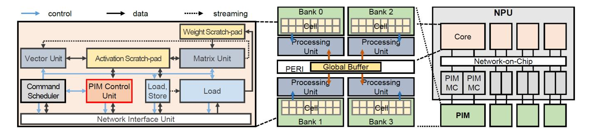
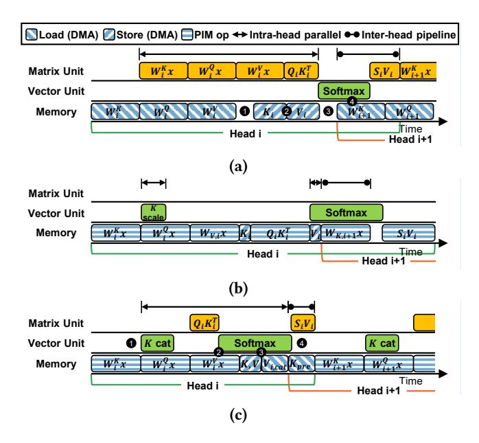
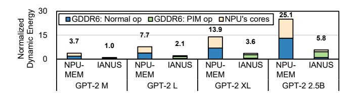
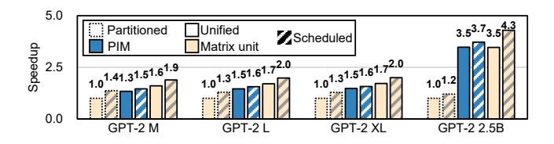
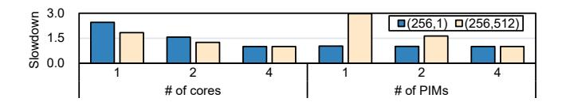
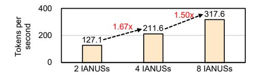

# IANUS: Integrated Accelerator based on NPU-PIM Unified Memory System

| Minseok Seo<br>Seoul National<br>University<br>South Korea | Xuan Truong<br>Nguyen<br>Seoul National<br>University<br>South Korea | Seok Joong<br>Hwang<br>SAPEON Inc.<br>South Korea | Yongkee<br>Kwon<br>SK hynix<br>South Korea                  | Guhyun Kim<br>SK hynix<br>South Korea          | Chanwook<br>Park<br>SK hynix<br>South Korea   |
|------------------------------------------------------------|----------------------------------------------------------------------|---------------------------------------------------|-------------------------------------------------------------|------------------------------------------------|-----------------------------------------------|
| Ilkon Kim<br>SK hynix<br>South Korea                       | Jaehan Park<br>SK hynix<br>South Korea                               | Jeongbin Kim<br>SK hynix<br>South Korea           | Woojae Shin<br>SK hynix<br>South Korea                      | Jongsoon Won<br>SK hynix<br>South Korea        | Haerang Choi<br>SK hynix<br>South Korea       |
| Kyuyoung<br>Kim<br>SK hynix<br>South Korea                 | Daehan Kwon<br>SK hynix<br>South Korea                               | Chunseok<br>Jeong<br>SK hynix<br>South Korea      | Sangheon Lee<br>SAPEON Inc.<br>South Korea                  | Yongseok<br>Choi<br>SAPEON Inc.<br>South Korea | Wooseok<br>Byun<br>SAPEON Inc.<br>South Korea |
|                                                            |                                                                      | Seungcheol<br>Baek<br>SAPEON Inc.<br>South Korea  | Hyuk-Jae Lee<br>Seoul National<br>University<br>South Korea | John Kim<br>KAIST<br>South Korea               |                                               |

# Abstract

Accelerating end-to-end inference of transformer-based large language models (LLMs) is a critical component of AI services in datacenters. However, the diverse compute characteristics of LLMs' end-to-end inference present challenges as previously proposed accelerators only address certain operations or stages (e.g., self-attention, generation stage, etc.). To address the unique challenges of accelerating end-toend inference, we propose IANUS – Integrated Accelerator based on NPU-PIM Unified Memory System. IANUS is a domain-specific system architecture that combines a Neural Processing Unit (NPU) with a Processing-in-Memory (PIM) to leverage both theNPU's high computation throughput and the PIM's high effective memory bandwidth. In particular, IANUS employs a unified main memory system where the PIM memory is used both for PIM operations and for NPU's main memory. The unified main memory system ensures that memory capacity is efficiently utilized and the movement of shared data between NPU and PIM is minimized. However, it introduces new challenges since normal memory accesses and PIM computations cannot be performed simultaneously.


[This work is licensed under a Creative Commons Attribution International](https://creativecommons.org/licenses/by/4.0/)  4.0 License.

ASPLOS '24, April 27-May 1, 2024, La Jolla, CA, USA © 2024 Copyright held by the owner/author(s). ACM ISBN 979-8-4007-0386-7/24/04. <https://doi.org/10.1145/3620666.3651324>

Thus, we propose novel PIM Access Scheduling that manages not only the scheduling of normal memory accesses and PIM computations but also workload mapping across the PIM and the NPU. Our detailed simulation evaluations show that IANUS improves the performance of GPT-2 by 6.2× and 3.2×, on average, compared to the NVIDIA A100 GPU and the state-of-the-art accelerator. As a proof-of-concept, we develop a prototype of IANUS with a commercial PIM, NPU, and an FPGA-based PIM controller to demonstrate the feasibility of IANUS.

CCS Concepts: • Computer systems organization → Heterogeneous (hybrid) systems; • Computing methodologies → Planning and scheduling.

Keywords: Accelerators, Heterogeneous Architectures, Neural Processing Unit, Processing-in-memory, Large Language Model, Workload Mapping, Scheduling

## ACM Reference Format:

Minseok Seo, Xuan Truong Nguyen, Seok Joong Hwang, Yongkee Kwon, Guhyun Kim, Chanwook Park, Ilkon Kim, Jaehan Park, Jeongbin Kim, Woojae Shin, Jongsoon Won, Haerang Choi, Kyuyoung Kim, Daehan Kwon, Chunseok Jeong, Sangheon Lee, Yongseok Choi, Wooseok Byun, Seungcheol Baek, Hyuk-Jae Lee, and John Kim. 2024. IANUS: Integrated Accelerator based on NPU-PIM Unified Memory System. In 29th ACM International Conference on Architectural Support for Programming Languages and Operating Systems, Volume 3 (ASPLOS '24), April 27-May 1, 2024, La Jolla, CA, USA. ACM, New York, NY, USA, 16 pages. [https://doi.org/10.1145/](https://doi.org/10.1145/3620666.3651324) [3620666.3651324](https://doi.org/10.1145/3620666.3651324)

# 1 Introduction

Transformer [44], BERT [9], and GPT [40] have been widely used for natural language processing (NLP) services at datacenters. Although GPUs are commonly used to accelerate the inference of deep learning models, GPUs are less effective in handling transformer models because of multi-head attention and inference stages that are memory-bound [19]. To address the limitations of GPU for transformer models, many recent works [13, 14, 35, 45] have proposed to accelerate multi-head attention through dedicated accelerators and algorithmic changes; however, these prior work do not fully address the challenges of end-to-end inference acceleration. Recently, DFX [19] proposed an FPGA-based appliance that is designed for memory-bound transformer inference stages; however, it is sub-optimal for the compute-bound stages in end-to-end inference.

One of the main challenges in accelerating end-to-end inference of transformer-based large language models (LLMs) is their diverse characteristics, which exhibit a broad range of computational intensities. For example, GPT includes complex vector operations, multi-head attention, and fullyconnected (FC) layers that present both compute-bound matrix-matrix multiplication as well as memory-bound matrixvector multiplication. Consequently, to accelerate end-to-end inference of LLMs, hardware must be capable of efficiently handling all these diverse operations.

Neural processing units (NPUs) [6, 22, 24] have been widely proposed to accelerate deep neural networks (DNNs). However, NPUs are often limited by memory-bound operations even when high-bandwidth memory is utilized. In comparison, processing-in-memory (PIM) [8, 30, 31] minimizes data movement by enabling computation near memory and provides higher effective memory bandwidth. Recent PIM chips [30, 31] are effective "domain-specific" memory as they accelerate memory-bound operations by guaranteeing full internal memory bandwidth utilization for processing units in memory on domain-specific kernels. However, computebound operations such as matrix-matrix computations or complex vector operations are not efficient on PIM because of the limitations of DRAM technology that is highly areaconstrained.

To address the challenges of end-to-end LLM inference, we propose an NPU-PIM architecture that provides the benefit of both a domain-specific accelerator (i.e., NPU) as well as a domain-specific memory (i.e., PIM), effectively supporting a broad range of arithmetic intensities in LLMs. In particular, we propose IANUS – Integrated Accelerator based on NPU-PIM Unified Memory System. 1 To the best of our knowledge, this is one of the first works that integrate

a commercial NPU with a commercial PIM memory to enable a domain-specific system architecture. Previously proposed PIM-based systems view PIM as an "accelerator" [8, 25, 27, 32] and employ a partitioned memory system that uses the dedicated memory for the xPU (e.g., GPU, CPU) and the PIM accelerator memory. This leads to inefficient memory capacity usage as shared data between xPU and PIM tend to be duplicated in both memories for optimal performance. This is especially problematic for LLM where parameters of FC layers represent a large portion of data that need to be shared between the NPU and the PIM.

In light of these challenges, we propose a unified memory system where PIM memory also serves as the main memory for the NPU. This approach removes the need for any data duplication and movement of shared data. However, the unified memory system in an NPU-PIM system introduces new challenges as PIM computations and normal memory accesses cannot be performed concurrently. In this work, we propose a novel PIM Access Scheduling (PAS) that includes not only scheduling of PIM computations and normal memory accesses but also mapping of the workload on the NPU-PIM architecture with a unified memory system. The challenges of PIM computation in a unified memory system include memory resource conflict with normal memory accesses as well as data dependencies from computations performed on the NPU. Thus, PAS takes into account both resource conflicts and data dependencies between the NPU and PIM to fully exploit the parallelism across the different resources. We also demonstrate the proof-of-concept of IANUS by prototyping the system with an FPGA. In summary, the key contributions of this work include the following.

- 1. Architecture: We propose IANUS, a novel heterogeneous architecture that combines a dedicated hardware accelerator (NPU) with a specialized memory (PIM), to accelerate operations with diverse characteristics in the end-to-end LLM inference.
- 2. Unified Memory System & PIM Access Scheduling: Identifying about 90% of model parameters shared between the NPU and PIM in the LLM, we propose a unified memory system where the memory for the NPU and the PIM memory is shared to efficiently utilize the memory capacity. We also propose PIM Access Scheduling (PAS) that manages the challenges of the unified memory system with effective workload mapping and scheduling. Through a detailed simulation of IANUS, IANUS with PAS achieves 6.2× and 3.2× speedup in GPT-2 compared to the A100 GPU and the state-ofthe-art prior work (DFX [19]), respectively.
- 3. System integration and FPGA prototyping: To demonstrate the feasibility of IANUS, we build an integrated system including a commercial NPU, commercial PIM chips, and an FPGA-based PIM controller.

<sup>1</sup> IANUS is a Roman god with two faces that represented the middle ground between both concrete and abstract dualities. The IANUS architecture in this work shares similarities as it represents a "middle ground" architecture between NPU and PIM architectures.


**Figure 1.** (a) Structure of GPT with vector operations marked with <sup>(V)</sup> and (b) multi-head attention mechanism shown in detail.

## 2 Background

#### 2.1 Transformer-based LLMs

NLP usually consists of two stages: input token summarization stage (*summarization*) and output token generation stage (*generation*). While the *summarization* stage processes all input tokens collectively, the *generation* stage deals with one generated token per stage. In text generation tasks, the *summarization* stage initially handles all inputs, followed by the *generation* stage processing each produced token.

Transformer-based LLMs, such as BERT and GPT, use multiple encoder or decoder blocks, followed by a task-specific head (Figure 1a). Each block consists of multi-head attention module, feed-forward network (FFN) module, layer normalization [3], and residual addition [15]. During the summarization stage, FC layers typically operate as matrix-matrix multiplication with multiple input tokens, while in the generation stage, they perform matrix-vector multiplication with a single token. The multi-head attention mechanism is depicted in Figure 1b. Input tokens (x) are multiplied with weight matrices to generate query (Q), key (K), and value (V) (1). In the generation stage, new K and V are concatenated with previous ones. For self-attention, Q, K, and V are splitted into multiple heads to compute attention scores (2), probabilities (3), and outputs (4) within each head. Finally, the outputs of each head are merged and processed by the following FC layer (6).

#### 2.2 Platforms for DNN Inference

**Domain-specific Accelerators**: DNN accelerators [2, 5, 17, 24, 28, 34, 37] mainly focus on accelerating convolution computation. Therefore, these accelerators often face bandwidth bottlenecks during the LLM's *generation* stage, primarily involving matrix-vector multiplication. To tackle this problem, DFX [19], an FPGA-based appliance, maximizes bandwidth


**Figure 2.** *Generation* stage of GPT-2 XL (a) Latency and FLOPs breakdown of decoders. (b) Latency breakdown of self-attention. Results are obtained using an A100 GPU.

utilization by designing peak FLOPS to match the memory bandwidth. However, while providing significant benefits on the *generation* stage, the benefits of DFX on the *summarization* stage are small because of limited FLOPS.

**Processing-in-Memory**: PIM refers to the technology of implementing processing units inside memory to accelerate specific workloads or save energy consumption. Recently, PIM based on commercial DRAMs have been announced (Accelerator-in-Memory (AiM) [27, 31], HBM-PIM [30, 32], and UPMEM-PIM [8]). They are suitable for memory-intensive workloads by utilizing all- or half-bank parallelism. As a result, they are considered promising solutions for *generation* stages of LLMs because LLMs include matrix-vector multiplication in *generation* stage.

#### 3 Motivations

In this section, we show the diverse computation requirements of LLMs and present challenges in designing the accelerator system for their end-to-end inference. This motivates the need for a heterogeneous architecture that combines a domain-specific *accelerator* with high compute capability and a domain-specific *memory* with high memory bandwidth. We also demonstrate the motivation of a unified main memory organization in an NPU-PIM system for LLMs.

## 3.1 Diverse Computational Requirements of LLMs

The generation and the summarization stages exhibit different computational characteristics as the generation stage of LLMs is often memory-bound with matrix-vector operations while summarization stage is compute-bound with matrix-matrix operations. While compute-bound components are well-matched to compute accelerators (e.g., NPU, GPU), memory-bound operations are not. For example, when generating two tokens with 512 input tokens, the generation

stage requires 512× fewer FLOPs compared to the summarization stage. However, the execution time of the generation stage is 88.5% of the summarization stage on A100 GPU. As shown in Figure 2a, FCs and FFNs in the generation stage that consist of matrix-vector multiplications account for 45.4% of the total latency and are well-matched to be accelerated by PIM. In comparison, the summarization stage shows an even greater reliance on FCs and FFNs, which mainly employ matrix-matrix multiplications, thereby necessitating a compute accelerator (e.g., NPU) for effective acceleration. Thus, in this work, we propose a heterogeneous accelerator that integrates both an NPU with a PIM to address the diverse computation requirements in LLMs.

In addition, LLMs also include vector operations such as layer normalization and non-computing operations such as matrix transposition. As shown in Figure 2a, layer normalization and residual addition represent 13.2% of the total latency while representing less than 0.06% of the total FLOPs, raising a need for a dedicated vector processing unit. Additionally, a significant portion of self-attention latency in the decoder is attributed to non-computing operations within the self-attention, as in Figures 2a and 2b. Among operations in self-attention that accounts for 41.4% of the total decoder latency, non-computing operations occupy 66.1% of the total self-attention latency. This substantial impact of non-computing operations highlights the necessity for a domain-specific accelerator with flexible data manipulation.

#### 3.2 Partitioned vs. Unified Memory Systems in LLMs

Systems using commercial PIM [8, 25, 27, 32] with CPU or GPU typically employ a partitioned main memory system where some main memory is dedicated for PIM accelerator's memory while the remaining memory is used by the host (i.e., CPU or GPU). This approach can maximize parallelism as both PIM and the host can access their own memory. However, partitioned memory can be problematic if there is significant sharing of data between the host and the PIM accelerator as the same data need to be duplicated across both memories to maximize the parallelism. Without duplicating data, substantial data transfers between two memories are necessary, potentially deteriorating performance.

In LLMs, the parameters of FC layers need to be shared between the NPU and the PIM since they are utilized both in the matrix-matrix and matrix-vector computation. Since the FC parameters constitute a large fraction of data required for inference (e.g., 91% in GPT-2), using a partitioned memory in the NPU-PIM system for LLMs results in inefficient usage of the memory. As a result, we employ a unified memory organization where the PIM is used as the main memory for both the PIM accelerator and the NPU – resulting in approximately 2× reduction in memory footprint compared to partitioned memory system.

However, a unified memory presents new challenges, compared to the partitioned memory system, as the PIM memory

is responsible for both "normal" memory accesses from the NPU as well as the PIM computation and these two steps cannot be executed in parallel. As naïve scheduling for memory operations that just views PIM computations as normal memory accesses does not consider the data dependency between PIM computations and other computations and thus cannot exploit available parallelism across the NPU and the PIM. In this work, we propose PIM Access Scheduling that manages not only the scheduling of memory commands but also workload mapping across the NPU and the PIM accelerator.

# 4 IANUS Architecture

To accelerate the end-to-end inference of transformer-based LLMs, we introduce IANUS (Integrated Accelerator based on NPU-PIM Unified Memory System) that integrates NPU and PIM (Figure 3). However, maximizing the utilization of both NPU and PIM is a challenge, as PIM must function as either a PIM or the main memory for the NPU. To this end, we need to carefully design a command scheduler, PIM control unit, PIM memory controller, and network-on-chip (NoC).

#### 4.1 NPU Architecture

Command Scheduler: The command scheduler is responsible for checking dependencies between each command and the status of each unit and sending commands to each unit. When a command has no dependency and the corresponding unit is in an IDLE state, the scheduler pushes the command into the "issue" queue of the unit, and the unit executes it. On the other hand, the command is pushed into the "pending" queue. Upon completion of execution, the scheduler resolves the dependencies between the command and the others.

Computation Units: NPU comprises two computing units: the matrix unit (MU) and the vector unit (VU). The MU is built on a systolic array [26] of 128×64 processing elements to effectively accelerate matrix-matrix multiplication, such as FC layers. To enable efficient pre- or post-processing, the MU also supports operations such as scaling and bias addition. The VU features 16 very long instruction word (VLIW) processors [11]. As it is designed to manage vector operations and general purpose operations that the MU cannot efficiently perform, the VU supports element-wise addition, layer normalization [3], masking, and non-linear activation functions such as softmax [4] and GELU [18].

Scratch-pad Memories: The activation scratch-pad memory (AM) and the weight scratch-pad memory (WM) supply data to the computing units. The WM provides weights, scales, and biases to the matrix unit. The AM serves as a data storage or provider for both computing units, typically addressing input or activation data. The AM adopts a transposed structure and data format relative to the WM to fully exploit the benefits of the matrix unit's systolic array, as illustrated in Figure 3. To enhance the throughput of computation units, direct-memory-access (DMA) units (light blue



Figure 3. (Left) Architecture of a core in NPU. (Middle) PIM architecture. (Right) Overall architecture of IANUS.

boxes in Figure 3) employ an entry-wise scheme to load or store data in scratch-pad memories, where the entry refers to the data granularity offered to computing units.

PIM control unit and PIM memory controller: Orchestrating multiple PIM chips is not trivial as it requires a significant amount of PIM commands. This requirement may lead to substantial scheduling overhead for the command scheduler. Furthermore, the efficiency of PIM computation diminishes if a standard memory command is inserted in the middle of multiple PIM commands for a single operation, such as a matrix-vector multiplication. Considering that, we propose a macro PIM command for scheduling. One macro command encapsulates multiple micro PIM commands necessitated for an operation.

To facilitate PIM operations with macro command, we develop a PIM control unit (PCU) and PIM memory controller (PIM MC), as in Figure 3. When one macro PIM command becomes a ready state, the command scheduler forwards it to the PCU. Then, the scheduler forces unissued DMA commands related to the off-chip memory to be in the wait state to ensure uninterrupted PIM execution. Lastly, PCU decodes the macro PIM command into multiple micro PIM commands and forwards these to the PIM MC via the NoC.

The PIM MC supports both PIM commands and normal memory commands. Like conventional memory controllers, PIM MC also tracks the state of each bank and generates appropriate commands following strictly defined timing constraints as well as newly introduced states and timing constraints of PIM operations. When all micro PIM commands in one macro PIM command end, the completion signal forwards to the command scheduler to enable DMA commands associated with the off-chip memory.

**Network-on-chip:** Our NoC works as the interconnect between NPU and PIMs and supports all-to-all connections between every core in NPU and PIMs. As a result, when PIMs work as the main memory, any core can access any PIM channel. Additionally, NoC also transfers PIM commands from the PIM control unit to the PIM memory controller. To maximize the performance of PIM operation, NoC enables the broadcasting of PIM commands to every PIM memory


**Figure 4.** Data allocation and tiling scheme for a matrix-vector multiplication in PIM.

controller and simultaneous PIM operation across all PIM channels.

#### 4.2 PIM Architecture

We design PIM architecture based on the commercial PIM called AiM [27, 31], since AiM i) exploits true all-bank parallelism, ii) is designed to accelerate end-to-end matrix-vector multiplication and activation functions in DRAM, and iii) is based on commodity DRAM (GDDR6), making it costeffective and practical. Similar to the AiM architecture, processing units (PUs) are implemented at each bank and a global buffer is implemented at the peripheral circuit in our PIM architecture. The global buffer is shared with every PU and stores an input vector, often reused multiple times when processing matrix-vector products. On the other hand, large data with low reusability such as weight matrix, often read just once during matrix-vector product, are stored at each bank. Each PU, associated with each bank, includes a set of multipliers, an adder tree, an accumulator for Multiply-Accumulate (MAC) operation, and a special function unit for activation function. With all the structures above, our PIM exploits true all-bank parallelism efficiently, enabled by all-bank simultaneous activation and computation.

## 5 Transformer-aware Design

IANUS employs NPU-PIM architecture to support operations with diverse computational requirements. We describe how our design accelerates these operations.

| Conventional address mapping | Row            | Bank     | Col_M       | Channel  | Col_L     | Offset         |
|------------------------------|----------------|----------|-------------|----------|-----------|----------------|
| IANUS's address mapping      | Row            | Channel  | Ban         | k C      | olumn     | Offset         |
| addioco mapping              | - Tile index - | Row inde | x in a tile | <u> </u> | olumn ind | lex in a tile— |

**Figure 5.** Comparison of conventional DRAM address mapping (top) [21] and IANUS's DRAM address mapping (bottom) with the mapping of tile shown in Figure 4. 'Col\_M/L' denote the most and least significant column bits.

#### 5.1 Data Allocation of FC Layers for PIM Operation

We employ PIM architecture to accelerate matrix-vector multiplication, the operation of FC layers in *generation* stages. We consider data allocation and tiling that maximize the performance of PIM. Figure 4 shows an example of our approach for the weight matrix of an FC layer. As depicted, the weight matrix is divided into tiles and each tile consists of 16 (number of banks per channel) × 8 (number of channels for IANUS) rows and up to 1024 columns (number of elements in one DRAM row). Each row in the tile is allocated to the same DRAM row address of each bank and each channel, since PIM can perform simultaneous all-channel and all-bank parallel operations. While the effective tiling scheme depends on the workload, this figure illustrates row-major tiling, sliding tiles on the same rows at first.

#### 5.2 Address mapping

The DRAM address mapping of IANUS, compared with conventional address mapping, is shown in Figure 5. IANUS employs an address mapping of (MSB) Row-Channel-Bank-Column (LSB). The key difference in IANUS address mapping, compared to conventional mapping, lies in maximizing PIM computation performance through PIM-aware tile (shown in Figure 4) placement. By using the row address bit as the MSB corresponding to the index of a tile, data within a single tile share the same row address, while each tile is assigned to a different row address. This ensures that row conflicts do not occur during operations related to a single tile. Additionally, using the column address bit as the LSB ensures that operations on all elements of a single row within a tile are handled by one PE for the completion of related MAC in one bank. Placing channel and bank address bits between the row and column address bits allows each row within a tile to be distributed across different channels and banks. This enables the PIM to concurrently compute all rows within a tile by leveraging channel and bank parallelism, thereby maximizing the throughput of PIM computations.

However, our address mapping has a limitation in that it is different from typical address mappings for diverse server-class workload mixes. These conventional mappings place adjacent data across different channels to sustain streaming bandwidth across multiple channels [21]. To achieve this, typical mappings tend to position the channel address bit at a lower bit, as shown in Figure 5. Nevertheless, in IANUS,

our address mapping results in minor performance overhead compared to typical mappings. This is because each core in NPU is mainly responsible for two unique PIM channels, enabling IANUS to utilize multiple channels in parallel for normal memory access.

#### 5.3 Data Manipulation in Self-Attention

**Key Transposition:** The transpose operation requires data transfer between on-chip and off-chip memory without dedicated hardware, potentially delaying PIM operations due to the off-chip memory use. We address this issue by executing transposition within the on-chip. Considering an entry-wise data transfer and transposed data formats between two scratch-pads, moving data from the activation scratch-pad (AM) to the weight scratch-pad (WM) via DMAs performs the partial transpose operation. It doesn't entirely transpose data due to the different entry sizes of the two scratch-pads. Specifically, the entry size of the AM is twice that of the WM. Therefore, we first incorporate a streaming buffer and path between DMAs of two scratch-pads for on-chip data movement. We then implement weight interleaving within the matrix unit, enabling access to the WM entry with a specific stride. As this approach solely manages the WM entry, it doesn't incur any latency overhead.

**Splitting** / **Merging Attention Heads**: Splitting and merging attention heads occupy a large portion of the latency of self-attention at a GPU due to the data transactions for data reordering. Our compiler avoids such data movement by carefully defining and generating activation scratch-pad addresses of input and output data in the command. For instance, when generating commands for the FC operation that produces Q, the compiler generates as many commands as the number of heads. The compiler then assigns a distinct output address for each command, guiding the matrix unit to store Q in the scratch-pad in a split manner. Hence, no data reordering overhead is required. Similarly, the compiler ensures consecutive output addresses of each head's SV command for merging attention heads.

#### 5.4 Vector Operations in Vector Unit

**Layer Normalization:** We employ a two-phase approach considering the limited vector unit's (VU) own memory. Initially, VU calculates the mean and variance of the tokens. Subsequently, it proceeds to normalize the values.

**Masked Softmax:** We combine masking and softmax [4] within a single kernel. Each mask is stored as a 1-bit bitmap, reducing data movement and memory usage. In softmax, we subtract the max value for stability instead of the large value.

**GELU:** For the GELU activation [18], VU uses a lookup table (LUT) approximation, widely employed due to its accuracy and performance [19, 50]. GELU activation is also supported in PIM by reserving some DRAM rows inside PIM as LUT for the activation function and linearly interpolating data from the LUT with additional circuitry.


**Figure 6.** Workload mapping and execution flow, featuring intra-layer parallelism and attention head parallelism. For simplicity, only one attention head is shown. The mapping of operations in self-attention is detailed in Section 6.2.

```
Algorithm 1 Mapping algorithm of FC layers.
```

```
Input/Output: CMDs (ordered commands)Params: n (number of input tokens), T (tile size of MU)Define: VU, MU, PIM, DMA (analytical model of units)
```

```
1: for i, cmd in CMDs do
         if cmd.type == MU_{FC} then
2:
3:
             prev\_cmd \leftarrow CMDs[i-1]
             // Check prefetching
 4:
             if prev\_cmd.type == VU then
 5:
                  t_{prefetch} \leftarrow VU(n, prev\_cmd.dim)
 6:
             w_{cfg} \leftarrow cmd.weight\_cfg
7:
             // Consider column-tiling and pipelining for MU
8:
 9:
             w_{load} \leftarrow DMA_{weight}(w_{cfg}.row, T)
             mu_{tile} \leftarrow MU_{FC}(n, w_{cfq}.row, T)
10:
             mu_{unpipe} \leftarrow mu_{tile} + w_{load}
11:
             mu_{pipe} \leftarrow w_{cfg}.col/T \times \max(w_{load}, mu_{tile})
12:
             mu_{total} \leftarrow mu_{unpipe} + mu_{pipe} - t_{prefetch}
13:
14.
             // Calculate PIM time
             pim_{time} \leftarrow n \times PIM(w_{cfq}.row, w_{cfq}.col)
15:
             if pim_{time} < mu_{total} then
16:
                  Replace CMDs[i].type with PIM
17:
```

# 6 PIM Access Scheduling

The integrated NPU-PIM architecture with a unified main memory presents challenges as the main memory is used by both the NPU and the PIM compute logic. In this section, we propose *PIM Access Scheduling* (PAS) that enables efficient sharing of the physical memory between NPU and PIM. In particular, PAS includes workload mapping between the NPU and PIM, and scheduling normal DRAM and PIM operations.

#### 6.1 Workload Mapping

We present the execution flow and workload mapping in Figure 6. To maximize parallelism across all computing units, we exploit attention head parallelism for multiple attention heads, which can be parallelized. The weights of the FC for Q, K, and V are distributed into separate memory modules with a head-wise partitioning. This ensures that each core

concurrently loads the weights or the results of the assigned head computed in the PIM unit. For other FC operations, we leverage intra-layer parallelism to minimize weight data movement, which is considerably larger than input or activation data in LLMs. To reduce synchronization overhead between each core in NPU, we divide the weights of FC column-wise. Synchronization occur at four distinct points: one point after multi-head attention, two points after residual addition, and the other point after GELU.

As in Figure 6, layer normalization and residual addition are mapped to the vector unit (VU) for efficient processing. Meanwhile, FCs can be performed on either the matrix unit (MU) or PIM. The *summarization* stage often takes a large input token size, making it advisable to execute FC on an MU with high computing power. However, when the input token size is small, the weight loading time becomes the bottleneck, necessitating an appropriate choice between PIM and MU.

To determine the suitable unit for FC, we first develop a simple analytical model that estimates the execution time of command execution units based on the number of input tokens at compile time. We then propose Algorithm 1, which utilizes this analytical model. Algorithm 1 first takes ordered commands, initially generated with mapping FC to MU. When estimating the time of FC on MU, we consider a pipelined scheme for both weight loading and computation, as well as column-tiling with the tile size of MU (lines 9-13). We also account for weight prefetching time if an operation of VU precedes the FC operation (lines 5-6). Lastly, we compare the estimated time of FC on MU with that of PIM and assign the FC to the command execution unit requiring less time (lines 15-17). If the first FC of FFN is mapped to the PIM, the GELU will also be allocated to the PIM since our PIM is designed to support GELU right after FC.

## 6.2 Mapping-aware Scheduling for Multi-head Attention

As in Figure 1b, multi-head attention comprises a series of operations characterized by varying computational requirements, which lead to considerable latency without careful scheduling. To mitigate this issue, we investigate mapping-aware scheduling taking into account unified constraint. We consider both the *summarization* and *generation* stages.

**Summarization stage**: As in Figure 7a, during this stage, FC layers for Q, K, and V typically operate as matrix-matrix multiplications with multiple input tokens (x) and thus are computed in the matrix unit, while weight matrices  $(W^{Q,K,V})$  are loaded from PIM via DMA. To efficiently process self-attention with FC layers, we utilize both intra-attention head parallelism and inter-attention head pipelining. We prioritize key generation to execute key transposition in parallel with value generation. As DMAs are utilized for on-chip transposition, they are not used for PIM access during transposition (1). Given that the matrix unit supports scaling, as in Section 4.1, the key scaling operation is omitted. We also ensure that



**Figure 7.** Mapping-aware scheduling of IANUS for (a) *sum-marization* stage where FCs are mapped to the matrix unit and for *generation* stage where FCs are mapped to the PIM:  $QK^T$  and SV mapping to (b) PIM or (c) matrix unit. Figures (b) and (c) are drwan on the same time scale to show the latency difference.

key and value are stored during computations (2). To hasten the start of the SV operation, values are moved to the weight scratch-pad via on-chip data transfer during the softmax (3). Moreover, we utilize inter-attention head pipelining by prefetching the weight of the next head (4).

Generation stage: FC layers mainly perform matrix-vector multiplications with one input token (x), making them well-suited for PIM computation. Similarly, since  $QK^T$  and SV operations involve matrix-vector multiplications and require loading previously generated keys and values, their executions seem more suitable in PIM. As in Figure 7b, mapping  $QK^T$  and SV to PIM can omit such loading operations. However, the opportunity for performance gain through scheduling is restricted because PIM executes most operations in the attention head. Moreover, computing  $QK^T$  and SV in PIM is inefficient in exploiting the parallelism of PIM. For instance, with a head dimension of 64, the computational efficiency of  $QK^T$  is a mere 6.25%. This results from only 64 BF16 elements out of the 1024 elements available in one DRAM row being utilized for computation.

As a result, we explore scheduling for mapping  $QK^T$  and SV to the matrix unit. To exploit inter-attention head parallelism, as shown in Figure 7c, we execute key concatenation in the vector unit instead of storing the key ( $\P$ ), enabling its simultaneous execution with query generation in PIM. Loading the previously generated keys ( $K_{pre}$ ) of ith head is omitted in Figure 7c, as its small size compared to the FC weight

**Table 1.** Simulation parameters for IANUS.

| NPU    | Composition          | 4 cores, 8 PIM memory controllers                                     |  |  |  |  |
|--------|----------------------|-----------------------------------------------------------------------|--|--|--|--|
|        | Host interface       | PCIe 5.0 ×16                                                          |  |  |  |  |
|        | Frequency            | 700 MHz                                                               |  |  |  |  |
|        | Matrix unit          | 128x64 processing elements (PEs), 4 MACs per PE, 46 TFLOPS            |  |  |  |  |
|        | Vector unit          | Sixteen 4-wide VLIW processors                                        |  |  |  |  |
| Core   | Scheduler            | 4 command slots per issue queue of units,                             |  |  |  |  |
|        |                      | 256 command slots in pending queue                                    |  |  |  |  |
|        | Scratch-pad          | Activation 12 MB, Weight 4 MB                                         |  |  |  |  |
|        | Memory               | GDDR6 16 Gb/s; ×16 organization; 8 channels; 256 GB/s;                |  |  |  |  |
|        | configuration        | 2 channels per chip, 16 banks per channel, row (page) size 2 KB       |  |  |  |  |
| PIM    | Timing parameters    | $t_{CK} = 0.5ns$ , $t_{CCD_S} = t_{CCD_L} = 1ns$ , $t_{RAS} = 21ns$ , |  |  |  |  |
| I IIVI |                      | $t_{WR} = 36ns, t_{RP} = 30ns, t_{RCDRD} = 36ns, t_{RCDWR} = 24ns$    |  |  |  |  |
|        | Processing unit (PU) | 1 GHz; 1 PU per bank; 32 GFLOPS per PU                                |  |  |  |  |
|        | Global buffer        | One 2 KB global buffer per channel                                    |  |  |  |  |

Table 2. Specifications of A100 GPU, DFX, and IANUS.

|          |             | A100 [38]         | DFX [19]    | IANUS                         |
|----------|-------------|-------------------|-------------|-------------------------------|
| Compute  | Frequency   | 1155 MHz          | 200 MHz     | 700 MHz                       |
| Compute  | Throughput  | 255 TFLOPS        | 1.64 TFLOPS | 184 TFLOPS                    |
| On-chip  | Capacity    | RF, L1, L2: 84 MB | ~40 MB      | Activation Scratch-pad: 48 MB |
| Memory   | Сарасну     | Kr, L1, L2. 04 MD | ~40 MD      | Weight Scratch-pad: 16 MB     |
|          | Type        | HBM2e             | HBM2        | GDDR6                         |
| Off-chip | Capacity    | 80 GB             | 32 GB       | 8 GB                          |
| Memory   | Bandwidth   | 2039 GB/s         | 1840 GB/s   | 256 GB/s                      |
|          | Internal BW | N/A               | N/A         | 4096 GB/s                     |

allows for prefetching. We then transpose concatenated keys within on-chip while performing query generation in PIM. Furthermore, we execute  $QK^T$  and softmax respectively in parallel with value generation by mapping  $QK^T$  to matrix unit (2). After value generation, storing generated keys and values and loading concatenated values ( $V_{cat}$ ) are performed during softmax (3). We also employ inter-attention head pipelining by prefetching  $K_{pre}$  of the next head during SV (4). If the prefetching ends before the completion of SV, the key generation of the next head is performed in conjunction with SV. Consequently, our scheduling enhances performance by maximizing both intra-parallelism and interpipelining of attention head.

# 7 Evaluations

## 7.1 Methodology

To evaluate the performance of IANUS, we developed a cycle-accurate in-house simulator to model IANUS. The simulator integrates an NPU simulator based on a commercial NPU [1, 20, 41] as well as a PIM simulator modeled after the real PIM chip, AiM [27, 31]. Both the NPU and the PIM simulator are validated against their respective real hardware counterparts within a 5% error margin. An overview of the key simulation parameters is summarized in Table 1. In addition, we modeled the new components added to enable IANUS, including the PIM control unit (PCU), and modified the memory controller to support both PIM commands and normal memory commands. To avoid latency overhead from the PCU, we designed its operations to be pipelined with PIM computations. Our simulator also provides statistics on energy consumption. It measures the dynamic energy consumed by cores in NPU, PIM operations, and standard


Figure 8. Inference latency of various GPT-2 models on A100 GPU and IANUS.

**Table 3.** Network configuration details.

|      | Name      | Embedding dimension | Head<br>dimension | # Heads | # Blocks | # Params | Workload               |  |
|------|-----------|---------------------|-------------------|---------|----------|----------|------------------------|--|
|      | В         | 768                 | 64                | 12      | 12       | 110M     | Question-<br>answering |  |
| BERT | L<br>1.3B | 1024                | 64                | 16      | 24       | 340M     |                        |  |
|      |           | 2048                | 64                | 32      | 24       | 1.3B     | U                      |  |
|      | 3.9B      | 2560                | 64                | 40      | 48       | 3.9B     | (QA)                   |  |
| GPT  | M         | 1024                | 64                | 16      | 24       | 345M     | Language               |  |
|      | L         | 1280                | 64                | 20      | 36       | 762M     | modeling               |  |
|      | XL        | 1536                | 64                | 24      | 48       | 1.5B     | (LM)                   |  |
|      | 2.5B      | 1920                | 96                | 20      | 54       | 2.5B     | (LIVI)                 |  |

DRAM operations. Based on prior analysis [27], we assume that the power consumption of PIM computing operations is  $3\times$  of that for DRAM read operations.

We compare the performance of IANUS against a GPU, state-of-the-art prior work (DFX [19]), as well as the NPU without PIM memory. For the GPU, we utilize an NVIDIA A100-SXM-80GB GPU [38] with Pytorch 2.0 and CUDA Toolkit 11.8. GPU-optimized source codes from Huggingface [47] and Megatron-LM [43] are used. The latency of the models is measured using the torch.cuda.Event API. DFX [19] is a multi-FPGA appliance specifically designed to accelerate the generation stage of GPT models. We assume a DFX with 4 FPGAs that can support GPT-2 XL model. We also compare IANUS with a baseline commercial NPU [1, 20, 41] (the same NPU used in IANUS) without PIM, but with standard GDDR6 memory (NPU-MEM). It shares identical specifications with IANUS in Table 2 except for the internal memory bandwidth and features a peak throughput of 184 TFLOPS. IANUS is identical to NPU-MEM, except that standard GDDR6 memory is replaced with PIM based on AiM [27, 31]. Each PIM chip achieves a peak throughput of 1 TFLOPS with 32 processing units utilizing 1024 GB/s internal memory bandwidth at peak. The specifications of each architecture are summarized in Table 2.

We evaluate two notable transformer-based LLMs, BERT [9] and GPT [40] with the BF16 [46] data type, which maintains the accuracy of the full-precision model. The configurations and tasks of each model are presented in Table 3. We exploit a GPT-2 XL model with its attention heads reduced

from 25 to 24, whose accuracy was validated in [19], to optimize parallelism. We assess the end-to-end performance of models with input sizes of 128, 256, and 512 tokens. For the GPT-2, we use output sizes of 1, 8, 64, and 512 tokens. These sizes represent the typical user request ranges for NLP services in datacenters [39]. Due to the time overhead associated with gathering inputs from multiple users, current datacenters prefer running the model with non-batched input [12, 19]; therefore, we evaluate our work using a batch size of 1.

#### 7.2 Performance Results

End-to-end Inference Latency: To guarantee a fair comparison, we measure the average latency over more than 30 iterations, ensuring each is conducted under identical load conditions for different architectures. Moreover, only the stabilized latencies are considered for the following evaluations. Figure 8 presents the end-to-end latency of GPT-2 models on the GPU and IANUS and the speedup that IANUS achieves. The result shows that IANUS achieves a 4.3× speedup compared to the GPU for the 2.5B model on average. For the workload with significantly more output tokens than input tokens, i.e., (128,512), IANUS demonstrates 12.0×, 8.1×, and 6.6× lower latency than the GPU for the GPT-2 M, L, and XL models, respectively. These substantial speedups originate from the guaranteeing high utilization of PIM's internal bandwidth of 4096 GB/s for matrix-vector multiplication in generation stage. Moreover, on average, IANUS takes about 5.7 ms per token for generation stages of the GPT-2 2.5B model with configuration (128,64), while the GPU takes about 29.9 ms.

As in Figure 9, we conduct a comparison of the GPT-2 XL's latency among IANUS, NPU-MEM, and DFX with four FP-GAs [19] that achieve state-of-the-art performance in GPT-2. Input and output token sizes for the comparison are derived from [19]. IANUS achieves a 49.3× speedup compared to DFX for the (128,1) configuration. IANUS and NPU-MEM present similar performance for this configuration, as the PIM in IANUS operates as a standard GDDR6 except for the


**Figure 9.** Inference latency of GPT-2 XL on DFX [19], NPU-MEM, and IANUS.


**Figure 10.** Latency breakdown of GPT-2 L and XL's *generation* stages for IANUS and NPU-MEM.



**Figure 11.** Dynamic energy of IANUS and NPU-MEM, normalized to IANUS with GPT-2 M.

LM head. Considering the *generation* stage, DFX achieves 6.9 ms to generate one token for the (64,256) configuration. Meanwhile, IANUS generates a token in 3.8 ms for the same configuration, achieving a speedup of 1.8× compared to DFX. Without the benefits of PIM, NPU-MEM takes 15.5 ms. To this end, IANUS achieves an average speedup of 3.2× compared to DFX, while NPU-MEM attains 0.8× speedup.

Latency Breakdown: To investigate the impact of using PIM, we measure the latency of operations in the decoder for NPU-MEM and IANUS in the generation stages of GPT-2 L and XL. As residual additions are executed with FCs and FFN using a pipelining scheme, we collectively measure their latency. As in Figure 10, IANUS reduces the execution time of two FCs from 890 ms to 215 ms for the GPT-2 XL model, achieving a speedup of 4.1× compared to NPU-MEM. Since the FFN has a four times larger weight size compared to the two FCs, it achieves a higher speedup of 5.1 times. IANUS also achieves a speedup of 4.3 times for self-attention without offloading any operation in self-attention. This speedup originates from prefetching previously generated keys and values instead of the weight for generating Q, K, and V by offloading FC for Q, K, and V generation to PIM. To this end, IANUS achieves speedups of 4.0× and 3.6× for GPT-2 XL and L models, respectively, compared to NPU-MEM.


**Figure 12.** Performance evaluation of the FC mapping algorithm across different GPT-2 models as the number of input tokens are varied from 4, 8, to 16.

**Energy efficiency:** Figure 11 presents dynamic energy consumption of IANUS and NPU-MEM for GPT-2 models where input and output token sizes are set to 256 and 512, respectively. The energy values are normalized to the dynamic energy consumed by IANUS with GPT-2 M. By offloading FC layers of the generation stage to PIM, IANUS achieves a 10.5-13.4× reduction in energy consumption for normal memory operations across all models. The energy consumption for computation of cores in NPU is also decreased by a factor of 6.3-10.2×. The reduction in energy consumption for cores' computation and normal memory operations tends to increase as the model size expands. Meanwhile, IANUS is responsible for the energy consumption from PIM operations. As a result, IANUS attains a 3.7×, 3.6×, 3.9×, and 4.4× improvement in energy-efficiency compared to NPU-MEM for GPT-2 M, L, XL, and 2.5B, respectively. Despite its larger model size, GPT-2 L exhibits a smaller energy efficiency improvement compared to GPT-2 M due to its embedding dimension size of 1280, which results in twice the number of row activations than GPT-2 M's size of 1024 for PIM computation. It is important to note that energy efficiency in a real system can be better than our estimation as we do not consider static energy consumption tied to speedup and energy consumption by PHY and off-chip data movement, significantly related to normal memory access.

FC Mapping Algorithm: To evaluate the correctness of Algorithm 1, we estimate the performance of GPT models when FC mapped to PIM and matrix unit on various input token sizes and compared it to the result of Algorithm 1. As illustrated in Figure 12, Algorithm 1 is effective in the case with small input sizes and chooses the appropriate computation unit on various model sizes and input token sizes. Specifically, Algorithm 1 achieves about 94% accuracy on average across GPT models for all input sizes from four to sixteen. When executing FC layers in PIM, execution time is proportional to the input token size as PIM sequentially repeats matrix-vector multiplication as much as the input token size. On the other hand, the matrix unit shows similar performance across 4, 8, and 16 input tokens thanks to the capability of processing 128 tokens in parallel. Therefore, the matrix unit achieves better performance for large input token sizes. Another factor for workload mapping is the embedding size of the model. As the global buffer and row size of PIM is 2KB (= 1024 BF16), models with multiples of 1024



**Figure 13.** Performance comparisons between unified and partitioned memory systems and the impact of mapping-aware scheduling. Dashes in the bar border indicate the system type. Colors represent mapped units of  $QK^T$  and SV. The pattern indicates the application of scheduling.

can fully utilize the benefits of PIM. As a result, PIM shows higher performance than the matrix unit at an input size of 8 for GPT-2 M (embedding size of 1024) and GPT-2 2.5B (1920, nearly  $2\times1024$ ). With Algorithm 1, we achieve an average speedup of  $1.4\times$  and  $1.2\times$  when compared to mapping FC to PIM and the matrix unit, respectively.

Unified vs. Partitioned Memory System: We evaluate two systems, one with a partitioned memory and the other with a unified memory (IANUS). Both systems have the same total memory capacity. The partitioned system employs an 8 GB capacity, split evenly with 4 GB to standard DRAMs for the NPU and another 4 GB to PIMs for their processing units. The unified system utilizes 8 GB exclusively for PIMs.

We assess GPT-2 models with a (256,512) configuration in each system. In the partitioned system, all FC parameters, shared between PIMs and NPU, are duplicated in two memory types to avoid performance overhead caused by data movement between standard DRAMs and PIMs. However, only for the 2.5B model, all FC parameters cannot be stored in PIMs or DRAMs due to capacity limitations, resulting in partial duplication of parameters. To optimize performance, the matrix unit handles the FC operations of unduplicated parameters. For a fair comparison, we implement scheduling for the partitioned system that maximizes the benefits from parallel executions of NPU and PIM. We also map the  $QK^T$ and SV to the matrix unit to fully exploit gain from scheduling. As in Figure 13, the concurrent execution of NPU's DRAM accesses and PIM computations results in an average 1.3× speedup through scheduling in the partitioned system.

For GPT-2 M-XL models, IANUS—a unified memory system— (the rightmost bar for each model) outperforms the scheduled partitioned memory system by 1.4-1.6× speedup, as in Figure 13. These speedups result from the doubled PIM throughput of IANUS, enabled by utilizing twice as many PIMs. It should be noted that each memory of the partitioned system stores all parameters for these models. For the GPT-2 2.5B model, IANUS shows a larger performance improvement due to the performance overhead in the partitioned system, stemming from the data movement of unduplicated parameters. Similar to performance trends in other models, IANUS achieves a 1.5× speedup in GPT-2 2.5B compared to the partitioned


**Figure 14.** Throughput and compute utilization of the BERT models on A100 GPU and IANUS.

system with sufficient memory capacity that stores all FC parameters in each memory type.

Mapping-aware Scheduling: Figure 13 demonstrates the performance enhancement through mapping of  $QK^T$ and SV operations and corresponding scheduling in multihead attention. As in the figure, scheduling for the mapping of  $OK^T$  and SV to PIM results in an average performance boost of 7% across all models compared to naïve scheduling. When  $QK^T$  and SV operations are mapped to the matrix unit, a reduction in computation time for these operations leads to superior performance than the case of scheduling with PIM mapping for all models except GPT-2 2.5B. For the GPT-2 2.5B model, which has a larger head dimension size of 96 than other models, the loading time for the previously generated keys and values increases. This loading time is not required when  $QK^T$  and SV are mapped to PIM, thus reducing the benefits gained through matrix unit mapping. However, through effective scheduling, we attain a performance improvement of 24% for GPT-2 2.5B. Consequently, mapping-aware scheduling yields an average performance improvement of 34%.

Throughput and Compute Utilization: Figure 14 presents the throughput and utilization of the IANUS and the GPU for BERT models. In IANUS, only the matrix unit and vector unit of the NPU are utilized for computation, excluding PIM. By managing complex data manipulation in self-attention through on-chip data movement, IANUS attains  $3.1\times$  and  $2.0\times$  higher average throughput for BERT-B and L, respectively, despite having  $1.4\times$  lower peak FLOPS than the GPU.

As the FLOPs increase with model size, IANUS's throughput becomes less than the GPU due to its limited peak FLOPS. However, IANUS achieves 5.2×, 3.3×, 1.3×, and 1.0× higher average utilization for BERT-B, L, 1.3B, and 3.9B compared to the GPU. This enhanced utilization is attributed to the efficient execution of vector operations with the vector unit in addition to the benefits gained from self-attention.

**Sensitivity Study of Design Parameters:** We conduct sensitivity studies on the number of cores in NPU and PIM chips. To show the sensitivities of NPU and PIM computation capabilities, we keep memory bandwidth the same as the baseline while varying the number of cores and PIM chips.



**Figure 15.** Sensitivity studies for *summarization*-only (256,1) and *generation*-dominant cases (256,512). Results are normalized to 4 cores and 4 PIMs.


**Figure 16.** System prototype of IANUS (PCU: PIM Control Unit).

We present two *summarization*-only (256,1) and *generation*-dominant (256,512) cases for comprehensive analysis with GPT-2 L to isolate the impacts from reduced on-chip memory or PIM capacity. As shown in Figure 15, the fewer cores result in slowdowns for both cases due to the decreased intra-layer and attention-head parallelism, and *summarization*-only case suffers more as NPU executes all but one computation (LM head). On the other hand, PIM's computation capability affects the *generation*-dominant case as many portions as FC operations executed in PIMs account for.

# 7.3 IANUS System Prototyping

We develop a system prototype of IANUS to validate feasibility as shown in Figure 16. Our prototype is based on commodity Xilinx FPGA board (VCU118) [48] to evaluate real PIM chips, GDDR6-AiM [27, 31], through FMC connector [29]. As shown, the PIM control unit (PCU) and PIM memory controllers (PIM MCs) are implemented on FPGA whereas we leverage our both functionally and cycle-accurate NPU simulator as the NPU of IANUS is too big to fit in a single FPGA. When PIM macro commands are ready to be executed in the NPU, they are dispatched to PCU through the PCIe interface by the PIM runtime library and device driver. Next, these macro commands are converted into corresponding micro commands and are transferred to PIM through PCU and PIM MCs. DMA commands from the NPU simulator are also transferred to PIM with a similar scheme. To validate the functionality of a system prototype for IANUS, we evaluate the accuracy of our system using pretrained models of GPT-2 [40] on the WikiText-2 dataset. Our system prototype achieves perplexity scores of 30.92 and 22.60, 19.39, and 17.48 for GPT-2 Base (117M), M, L, and XL, respectively, achieving similar perplexity scores as the full-precision models.

**Table 4.** Network configurations of larger LLMs.

|  |     | # Params | Embedding dimension | Head<br>dimension | # Heads | # Blocks | Workload |
|--|-----|----------|---------------------|-------------------|---------|----------|----------|
|  |     | 6.7B     | 4096                | 128               | 32      | 32       | Language |
|  | GPT | 13B      | 5120                | 128               | 40      | 40       | modeling |
|  |     | 30B      | 7168                | 128               | 56      | 48       | (LM)     |


**Figure 17.** Inference performance scalability for larger LLMs with multiple IANUS devices. The results are compared to a single A100 GPU.

#### 8 Discussion

#### 8.1 Scalability Analysis

Given the limited memory capacity of IANUS compared to modern GPUs, the memory capacity of IANUS needs to be scaled to run larger LLMs. The memory (PIM) capacity of IANUS can be expanded in two ways: 1) increase the amount of PIM per NPU, or 2) scale the number of IANUS devices. The first approach can be achieved by adding more PIM controllers or employing a clamshell configuration of GDDR6 devices [36]. However, this approach requires modifications to the IANUS architecture. In this work, we leverage the second approach to analyze the scalability of IANUS.

The larger LLMs used in our scalability analysis are summarized in Table 4. For each model, the number of IANUS devices is selected to provide sufficient memory capacity to support the model – i.e., two, four, and eight IANUS devices are used to support the GPT 6.7B, 13B, and 30B models, respectively. The multiple IANUS devices are assumed to be interconnected through PCIe 5.0  $\times$ 16 host interface. To maximize parallelism across IANUS devices, both intra-layer parallelism and attention head parallelism are exploited among devices.

As shown in Figure 17, multiple IANUS devices provide average speedups of  $2.4\times$ ,  $3.4\times$ , and  $5.3\times$  across respective models, compared to a single A100 GPU, which has sufficient memory capacity for the larger LLMs. Multiple IANUS devices not only provide additional memory capacity but also increase effective memory bandwidth with extra PIM capability. For larger LLMs, the key system component that impacts overall performance is the memory bandwidth. This is because the proportion of FC layers in LLMs, which are bottlenecked by memory bandwidth, increases as the size of the



**Figure 18.** Strong scaling of IANUS on the GPT 6.7B model.

LLMs grows. Leveraging the PIM's internal memory bandwidth, the effective memory bandwidth of IANUS reaches approximately 2.4 TB/s, 9-10× higher than external memory bandwidth of GDDR6 memories. Thus, with two IANUS devices, the total effective bandwidth is 4.8 TB/s, which is approximately 2.4× higher than the A100 memory bandwidth (2039 GB/s). This difference in memory bandwidth nearly matches the observed performance benefits of two IANUS devices over the A100 GPU. However, scaling the number of IANUS devices comes at the cost of communication overhead between IANUS devices compared to a single GPU. As a result, the performance benefits with four and eight IANUS devices do not match the theoretical memory bandwidth difference; however, there is still significant speedup compared to a single A100 GPU.

Strong scaling of IANUS is shown in Figure 18, using the 6.7B model with a 256:64 token configuration. As described earlier, the additional IANUS devices provide higher effective memory bandwidth and result in performance gain –  $2.5\times$  performance improvement when the number of IANUS is increased by 4×. While the performance of IANUS improves with extra devices, linear speedup is not obtained because of the communication overhead between multiple devices. A multi-IANUS device system presents new opportunities for optimizing communication across the devices but we leave such exploration as part of future work.

### 8.2 Cost Analysis

Providing a fair cost comparison between two different system architectures (e.g., HBM memory with interposer vs GDDR6-based PIM memory) is a challenge since many factors impact cost. However, prior work has shown how thermal design power (TDP) can approximate total cost of ownership (TCO) in datacenters [23]. Therefore, we use TDP for the cost comparison. The TDP of A100 GPU is estimated at 400 W [38] while the TDP of IANUS is conservatively assumed to be 120 W, based on estimates from the NPU [1, 20, 41] and PIM [27, 31] components. Using the performance/TDP metric for the cost-efficiency evaluation, configurations of two, four, and eight IANUS devices yield improvements in costefficiency of 3.9×, 2.7×, and 2.1× over the single A100 GPU for the 6.7B, 13B, and 30B models, respectively. For each comparison, the performances of IANUS devices and the GPU for the performance/TDP metric are measured with a 256:64 input-to-output token ratio. While the cost-efficiency benefits of IANUS devices are evident, they diminish as the

number of IANUS devices increases. The cost efficiency of IANUS can potentially be enhanced by leveraging PIM chips with higher memory capacity and/or more PIM chips connected to a single NPU.

#### 9 Related Works

**Domain-specific accelerators:** Various hardware accelerators have been proposed to accelerate transformer models. TurboTransformer [10] executes BERT variants effectively by operation fusion and pipelining. Unfortunately, this approach suffers from severe under-utilization in text generation workloads. Several accelerators [13, 14, 35, 45, 49] focus on multi-head-attention mechanisms only, requiring additional hardware to handle other operations such as layer normalization. Meanwhile, IANUS utilizes integrated both NPU and PIM to accelerate end-to-end inference of LLMs.

PIM accelerator: Utilizing large in-memory bandwidth, PIM architectures reduce massive data movement between DRAMs and a host [16, 25, 30–33]. McDRAM [42] presents near-memory structures and a horizontal arrangement of data within memory banks. TransPIM [51] introduces the first memory-based accelerator for end-to-end inference of transformers. However, it only achieves an average throughput of 734 GOPS due to area and power constraints. Chopim [7] employs a unified memory system between the near-data accelerator and the host. Unlike Chopim, which focuses on homogeneous kernels, IANUS targets heterogeneous kernels that require scheduling to optimize performance.

#### 10 Conclusion

We propose IANUS, an integrated accelerator based on NPU-PIM unified memory system, that fully exploits the benefits of NPU and PIM to accelerate end-to-end inference in transformer-based LLMs. To overcome the challenges posed by a unified memory system with PIM, we propose *PIM Access Scheduling* that maps workload across both the NPU and PIM while scheduling both PIM and normal memory commands. IANUS results in 6.2× and 3.2× speedup in comparison to GPU and DFX-based solutions for the GPT-2 model, highlighting the potential of such hybrid architectures. To demonstrate the feasibility of IANUS, we constructed an FPGA prototype system based on a commercial NPU and real PIM chips.

# 11 Acknowledgments

We thank the shepherd and all reviewers for their valuable comments. This work was supported in part by the IITP grant funded by the MSIT (No.RS 2023-00228255, PIM-NPU Based Processing System Software Developments for Hyperscale Artificial Neural Network Processing) and in part by the IITP grant funded by the MSIT (No. 2021-0-00106, AI accelerator-optimized neural network automatic generation technology and open service platform development).

# References

- [1] Minwook Ahn, Seok Joong Hwang, Wonsub Kim, Seungrok Jung, Yeonbok Lee, Mookyoung Chung, Woohyung Lim, and Youngjoon Kim. Aix: A high performance and energy efficient inference accelerator on fpga for a dnn-based commercial speech recognition. In 2019 Design, Automation & Test in Europe Conference & Exhibition (DATE), pages 1495–1500. IEEE, 2019.
- [2] Jorge Albericio, Patrick Judd, Tayler Hetherington, Tor Aamodt, Natalie Enright Jerger, and Andreas Moshovos. Cnvlutin: Ineffectualneuron-free deep neural network computing. ACM SIGARCH Computer Architecture News, 44(3):1–13, 2016.
- [3] Jimmy Lei Ba, Jamie Ryan Kiros, and Geoffrey E Hinton. Layer normalization. arXiv preprint arXiv:1607.06450, 2016.
- [4] John Bridle. Training stochastic model recognition algorithms as networks can lead to maximum mutual information estimation of parameters. Advances in neural information processing systems, 2, 1989.
- [5] Tianshi Chen, Zidong Du, Ninghui Sun, Jia Wang, Chengyong Wu, Yunji Chen, and Olivier Temam. Diannao: A small-footprint highthroughput accelerator for ubiquitous machine-learning. ACM SIGARCH Computer Architecture News, 42(1):269–284, 2014.
- [6] Yu-Hsin Chen, Tushar Krishna, Joel S Emer, and Vivienne Sze. Eyeriss: An energy-efficient reconfigurable accelerator for deep convolutional neural networks. IEEE journal of solid-state circuits, 52(1):127–138, 2016.
- [7] Benjamin Y. Cho, Yongkee Kwon, Sangkug Lym, and Mattan Erez. Near data acceleration with concurrent host access. In 2020 ACM/IEEE 47th Annual International Symposium on Computer Architecture (ISCA), pages 818–831, 2020.
- [8] Fabrice Devaux. The true processing in memory accelerator. In 2019 IEEE Hot Chips 31 Symposium (HCS), pages 1–24. IEEE Computer Society, 2019.
- [9] Jacob Devlin, Ming-Wei Chang, Kenton Lee, and Kristina Toutanova. Bert: Pre-training of deep bidirectional transformers for language understanding. arXiv preprint arXiv:1810.04805, 2018.
- [10] Jiarui Fang, Yang Yu, Chengduo Zhao, and Jie Zhou. Turbotransformers: an efficient gpu serving system for transformer models. In Proceedings of the 26th ACM SIGPLAN Symposium on Principles and Practice of Parallel Programming, pages 389–402, 2021.
- [11] Joseph A Fisher. Very long instruction word architectures and the eli-512. In Proceedings of the 10th annual international symposium on Computer architecture, pages 140–150, 1983.
- [12] Jeremy Fowers, Kalin Ovtcharov, Michael Papamichael, Todd Massengill, Ming Liu, Daniel Lo, Shlomi Alkalay, Michael Haselman, Logan Adams, Mahdi Ghandi, Stephen Heil, Prerak Patel, Adam Sapek, Gabriel Weisz, Lisa Woods, Sitaram Lanka, Steven K. Reinhardt, Adrian M. Caulfield, Eric S. Chung, and Doug Burger. A configurable cloud-scale dnn processor for real-time ai. In 2018 ACM/IEEE 45th Annual International Symposium on Computer Architecture (ISCA), pages 1–14, 2018.
- [13] Tae Jun Ham, Sung Jun Jung, Seonghak Kim, Young H. Oh, Yeonhong Park, Yoonho Song, Jung-Hun Park, Sanghee Lee, Kyoung Park, Jae W. Lee, and Deog-Kyoon Jeong. 3 : Accelerating attention mechanisms in neural networks with approximation. In 2020 IEEE International Symposium on High Performance Computer Architecture (HPCA), pages 328–341, 2020.
- [14] Tae Jun Ham, Yejin Lee, Seong Hoon Seo, Soosung Kim, Hyunji Choi, Sung Jun Jung, and Jae W Lee. Elsa: Hardware-software co-design for efficient, lightweight self-attention mechanism in neural networks. In 2021 ACM/IEEE 48th Annual International Symposium on Computer Architecture (ISCA), pages 692–705. IEEE, 2021.
- [15] Kaiming He, Xiangyu Zhang, Shaoqing Ren, and Jian Sun. Deep residual learning for image recognition. In Proceedings of the IEEE conference on computer vision and pattern recognition, pages 770–778, 2016.

- [16] Mingxuan He, Choungki Song, Ilkon Kim, Chunseok Jeong, Seho Kim, Il Park, Mithuna Thottethodi, and TN Vijaykumar. Newton: A dram-maker's accelerator-in-memory (aim) architecture for machine learning. In 2020 53rd Annual IEEE/ACM International Symposium on Microarchitecture (MICRO), pages 372–385. IEEE, 2020.
- [17] Kartik Hegde, Jiyong Yu, Rohit Agrawal, Mengjia Yan, Michael Pellauer, and Christopher Fletcher. Ucnn: Exploiting computational reuse in deep neural networks via weight repetition. In 2018 ACM/IEEE 45th Annual International Symposium on Computer Architecture (ISCA), pages 674–687. IEEE, 2018.
- [18] Dan Hendrycks and Kevin Gimpel. Gaussian error linear units (gelus). arXiv preprint arXiv:1606.08415, 2016.
- [19] Seongmin Hong, Seungjae Moon, Junsoo Kim, Sungjae Lee, Minsub Kim, Dongsoo Lee, and Joo-Young Kim. Dfx: A low-latency multi-fpga appliance for accelerating transformer-based text generation. In 2022 55th IEEE/ACM International Symposium on Microarchitecture (MICRO), pages 616–630. IEEE, 2022.
- [20] Seok Joong Hwang, Jeongho Han, Minwook Ahn, Seungrok Jung, Wonsub Kim, Yongshik Moon, Sangjun Yang, Moo-Kyoung Chung, Jaehyeok Jang, Youngjae Jin, Yongsang Park, Namseob Lee, Daewoo Kim, Euiseok Kim, Choong Hwan Choi, and Heeyul Lee. Aix v2: Flexible high performance ai inference accelerator for datacenters. In 2019 IEEE Hot Chips 31 Symposium (HCS), 2019.
- [21] Bruce Jacob, David Wang, and Spencer Ng. Memory systems: cache, DRAM, disk. Morgan Kaufmann, 2010.
- [22] Norm Jouppi, George Kurian, Sheng Li, Peter Ma, Rahul Nagarajan, Lifeng Nai, Nishant Patil, Suvinay Subramanian, Andy Swing, Brian Towles, Clifford Young, Xiang Zhou, Zongwei Zhou, and David A Patterson. Tpu v4: An optically reconfigurable supercomputer for machine learning with hardware support for embeddings. In Proceedings of the 50th Annual International Symposium on Computer Architecture, ISCA '23, New York, NY, USA, 2023. Association for Computing Machinery.
- [23] Norman P. Jouppi, Doe Hyun Yoon, Matthew Ashcraft, Mark Gottscho, Thomas B. Jablin, George Kurian, James Laudon, Sheng Li, Peter Ma, Xiaoyu Ma, Thomas Norrie, Nishant Patil, Sushma Prasad, Cliff Young, Zongwei Zhou, and David Patterson. Ten lessons from three generations shaped google's tpuv4i : Industrial product. In 2021 ACM/IEEE 48th Annual International Symposium on Computer Architecture (ISCA), pages 1–14, 2021.
- [24] Norman P. Jouppi, Cliff Young, Nishant Patil, David Patterson, Gaurav Agrawal, Raminder Bajwa, Sarah Bates, Suresh Bhatia, Nan Boden, Al Borchers, Rick Boyle, Pierre-luc Cantin, Clifford Chao, Chris Clark, Jeremy Coriell, Mike Daley, Matt Dau, Jeffrey Dean, Ben Gelb, Tara Vazir Ghaemmaghami, Rajendra Gottipati, William Gulland, Robert Hagmann, C. Richard Ho, Doug Hogberg, John Hu, Robert Hundt, Dan Hurt, Julian Ibarz, Aaron Jaffey, Alek Jaworski, Alexander Kaplan, Harshit Khaitan, Daniel Killebrew, Andy Koch, Naveen Kumar, Steve Lacy, James Laudon, James Law, Diemthu Le, Chris Leary, Zhuyuan Liu, Kyle Lucke, Alan Lundin, Gordon MacKean, Adriana Maggiore, Maire Mahony, Kieran Miller, Rahul Nagarajan, Ravi Narayanaswami, Ray Ni, Kathy Nix, Thomas Norrie, Mark Omernick, Narayana Penukonda, Andy Phelps, Jonathan Ross, Matt Ross, Amir Salek, Emad Samadiani, Chris Severn, Gregory Sizikov, Matthew Snelham, Jed Souter, Dan Steinberg, Andy Swing, Mercedes Tan, Gregory Thorson, Bo Tian, Horia Toma, Erick Tuttle, Vijay Vasudevan, Richard Walter, Walter Wang, Eric Wilcox, and Doe Hyun Yoon. In-datacenter performance analysis of a tensor processing unit. In Proceedings of the 44th Annual International Symposium on Computer Architecture, ISCA '17, page 1–12, New York, NY, USA, 2017. Association for Computing Machinery.
- [25] Jin Hyun Kim, Shin-Haeng Kang, Sukhan Lee, Hyeonsu Kim, Yuhwan Ro, Seungwon Lee, David Wang, Jihyun Choi, Jinin So, YeonGon Cho, JoonHo Song, Jeonghyeon Cho, Kyomin Sohn, and Nam Sung Kim.

- Aquabolt-xl hbm2-pim, lpddr5-pim with in-memory processing, and axdimm with acceleration buffer. IEEE Micro, 42(3):20–30, 2022.
- [26] Hsiang Tsung Kung and Charles E Leiserson. Systolic arrays (for vlsi). In Sparse Matrix Proceedings 1978, volume 1, pages 256–282. Society for industrial and applied mathematics Philadelphia, PA, USA, 1979.
- [27] Daehan Kwon, Seongju Lee, Kyuyoung Kim, Sanghoon Oh, Joonhong Park, Gi-Moon Hong, Dongyoon Ka, Kyudong Hwang, Jeongje Park, Kyeongpil Kang, Jungyeon Kim, Junyeol Jeon, Nahsung Kim, Yongkee Kwon, Vladimir Kornijcuk, Woojae Shin, Jongsoon Won, Minkyu Lee, Hyunha Joo, Haerang Choi, Guhyun Kim, Byeongju An, Jaewook Lee, Donguc Ko, Younggun Jun, Ilwoong Kim, Choungki Song, Ilkon Kim, Chanwook Park, Seho Kim, Chunseok Jeong, Euicheol Lim, Dongkyun Kim, Jieun Jang, Il Park, Junhyun Chun, and Joohwan Cho. A 1ynm 1.25 v 8gb 16gb/s/pin gddr6-based accelerator-in-memory supporting 1tflops mac operation and various activation functions for deep learning application. IEEE Journal of Solid-State Circuits, 58(1):291–302, 2022.
- [28] Hyoukjun Kwon, Ananda Samajdar, and Tushar Krishna. Maeri: Enabling flexible dataflow mapping over dnn accelerators via reconfigurable interconnects. ACM SIGPLAN Notices, 53(2):461–475, 2018.
- [29] Yongkee Kwon, Kornijcuk Vladimir, Nahsung Kim, Woojae Shin, Jongsoon Won, Minkyu Lee, Hyunha Joo, Haerang Choi, Guhyun Kim, Byeongju An, Jeongbin Kim, Jaewook Lee, Ilkon Kim, Jaehan Park, Chanwook Park, Yosub Song, Byeongsu Yang, Hyungdeok Lee, Seho Kim, Daehan Kwon, Seongju Lee, Kyuyoung Kim, Sanghoon Oh, Joonhong Park, Gimoon Hong, Dongyoon Ka, Kyudong Hwang, Jeongje Park, Kyeongpil Kang, Jungyeon Kim, Junyeol Jeon, Myeongjun Lee, Minyoung Shin, Minhwan Shin, Jaekyung Cha, Changson Jung, Kijoon Chang, Chunseok Jeong, Euicheol Lim, Il Park, Junhyun Chun, and Sk Hynix. System architecture and software stack for gddr6-aim. In 2022 IEEE Hot Chips 34 Symposium (HCS), pages 1–25. IEEE, 2022.
- [30] Young-Cheon Kwon, Suk Han Lee, Jaehoon Lee, Sang-Hyuk Kwon, Je Min Ryu, Jong-Pil Son, O Seongil, Hak-Soo Yu, Haesuk Lee, Soo Young Kim, Youngmin Cho, Jin Guk Kim, Jongyoon Choi, Hyun-Sung Shin, Jin Kim, BengSeng Phuah, HyoungMin Kim, Myeong Jun Song, Ahn Choi, Daeho Kim, SooYoung Kim, Eun-Bong Kim, David Wang, Shinhaeng Kang, Yuhwan Ro, Seungwoo Seo, JoonHo Song, Jaeyoun Youn, Kyomin Sohn, and Nam Sung Kim. 25.4 a 20nm 6gb function-in-memory dram, based on hbm2 with a 1.2 tflops programmable computing unit using bank-level parallelism, for machine learning applications. In 2021 IEEE International Solid-State Circuits Conference (ISSCC), volume 64, pages 350–352. IEEE, 2021.
- [31] Seongju Lee, Kyuyoung Kim, Sanghoon Oh, Joonhong Park, Gimoon Hong, Dongyoon Ka, Kyudong Hwang, Jeongje Park, Kyeongpil Kang, Jungyeon Kim, Junyeol Jeon, Nahsung Kim, Yongkee Kwon, Kornijcuk Vladimir, Woojae Shin, Jongsoon Won, Minkyu Lee, Hyunha Joo, Haerang Choi, Jaewook Lee, Donguc Ko, Younggun Jun, Keewon Cho, Ilwoong Kim, Choungki Song, Chunseok Jeong, Daehan Kwon, Jieun Jang, Il Park, Junhyun Chun, and Joohwan Cho. A 1ynm 1.25 v 8gb, 16gb/s/pin gddr6-based accelerator-in-memory supporting 1tflops mac operation and various activation functions for deep-learning applications. In 2022 IEEE International Solid-State Circuits Conference (ISSCC), volume 65, pages 1–3. IEEE, 2022.
- [32] Sukhan Lee, Shin-haeng Kang, Jaehoon Lee, Hyeonsu Kim, Eojin Lee, Seungwoo Seo, Hosang Yoon, Seungwon Lee, Kyounghwan Lim, Hyunsung Shin, Jinhyun Kim, O Seongil, Anand Iyer, David Wang, Kyomin Sohn, and Nam Sung Kim. Hardware architecture and software stack for pim based on commercial dram technology : Industrial product. In 2021 ACM/IEEE 48th Annual International Symposium on Computer Architecture (ISCA), pages 43–56, 2021.
- [33] Shuangchen Li, Dimin Niu, Krishna T Malladi, Hongzhong Zheng, Bob Brennan, and Yuan Xie. Drisa: A dram-based reconfigurable in-situ accelerator. In Proceedings of the 50th Annual IEEE/ACM International Symposium on Microarchitecture, pages 288–301, 2017.

- [34] Daofu Liu, Tianshi Chen, Shaoli Liu, Jinhong Zhou, Shengyuan Zhou, Olivier Teman, Xiaobing Feng, Xuehai Zhou, and Yunji Chen. Pudiannao: A polyvalent machine learning accelerator. ACM SIGARCH Computer Architecture News, 43(1):369–381, 2015.
- [35] Liqiang Lu, Yicheng Jin, Hangrui Bi, Zizhang Luo, Peng Li, Tao Wang, and Yun Liang. Sanger: A co-design framework for enabling sparse attention using reconfigurable architecture. In MICRO-54: 54th Annual IEEE/ACM International Symposium on Microarchitecture, pages 977– 991, 2021.
- [36] Micron. Gddr6 datasheet. [Online]. Available: [https://media](https://media-www.micron.com/-/media/client/global/documents/products/data-sheet/dram/gddr/gddr6/gddr6_sgram_8gb_brief.pdf)[www.micron.com/-/media/client/global/documents/products/data](https://media-www.micron.com/-/media/client/global/documents/products/data-sheet/dram/gddr/gddr6/gddr6_sgram_8gb_brief.pdf)[sheet/dram/gddr/gddr6/gddr6\\_sgram\\_8gb\\_brief.pdf](https://media-www.micron.com/-/media/client/global/documents/products/data-sheet/dram/gddr/gddr6/gddr6_sgram_8gb_brief.pdf).
- [37] Thomas Norrie, Nishant Patil, Doe Hyun Yoon, George Kurian, Sheng Li, James Laudon, Cliff Young, Norman Jouppi, and David Patterson. The design process for google's training chips: Tpuv2 and tpuv3. IEEE Micro, 41(2):56–63, 2021.
- [38] NVIDIA. Nvidia a100 tensor core gpu. [Online]. Available: [https:](https://www.nvidia.com/en-us/data-center/a100/) [//www.nvidia.com/en-us/data-center/a100/](https://www.nvidia.com/en-us/data-center/a100/).
- [39] OpenAI. Input:output token ratio. [Online]. Available: [https://beta.](https://beta.openai.com/docs/usage-guidelines/use-case-guidelines) [openai.com/docs/usage-guidelines/use-case-guidelines](https://beta.openai.com/docs/usage-guidelines/use-case-guidelines).
- [40] Alec Radford, Jeffrey Wu, Rewon Child, David Luan, Dario Amodei, and Ilya Sutskever. Language models are unsupervised multitask learners. OpenAI blog, 1(8):9, 2019.
- [41] SAPEON. Product of SAPEON X330. [Online]. Available: [https:](https://www.sapeon.com/products/sapeon-x330) [//www.sapeon.com/products/sapeon-x330](https://www.sapeon.com/products/sapeon-x330).
- [42] Hyunsung Shin, Dongyoung Kim, Eunhyeok Park, Sungho Park, Yongsik Park, and Sungjoo Yoo. Mcdram: Low latency and energyefficient matrix computations in dram. IEEE Transactions on Computer-Aided Design of Integrated Circuits and Systems, 37(11):2613–2622, 2018.
- [43] Mohammad Shoeybi, Mostofa Patwary, Raul Puri, Patrick LeGresley, Jared Casper, and Bryan Catanzaro. Megatron-lm: Training multibillion parameter language models using model parallelism. arXiv preprint arXiv:1909.08053, 2019.
- [44] Ashish Vaswani, Noam Shazeer, Niki Parmar, Jakob Uszkoreit, Llion Jones, Aidan N Gomez, Łukasz Kaiser, and Illia Polosukhin. Attention is all you need. Advances in neural information processing systems, 30, 2017.
- [45] Hanrui Wang, Zhekai Zhang, and Song Han. Spatten: Efficient sparse attention architecture with cascade token and head pruning. In 2021 IEEE International Symposium on High-Performance Computer Architecture (HPCA), pages 97–110. IEEE, 2021.
- [46] Shibo Wang and Pankaj Kanwar. Bfloat16: The secret to high performance on cloud tpus. Google Cloud Blog, 4, 2019.
- [47] Thomas Wolf, Lysandre Debut, Victor Sanh, Julien Chaumond, Clement Delangue, Anthony Moi, Pierric Cistac, Tim Rault, Rémi Louf, Morgan Funtowicz, Joe Davison, Sam Shleifer, Patrick von Platen, Clara Ma, Yacine Jernite, Julien Plu, Canwen Xu, Teven Le Scao, Sylvain Gugger, Mariama Drame, Quentin Lhoest, and Alexander M. Rush. Huggingface's transformers: State-of-the-art natural language processing. arXiv preprint arXiv:1910.03771, 2019.
- [48] Xilinx. Xilinx VCU118 Evaluation Kit. [Online]. Available: [https:](https://www.xilinx.com/products/boards-and-kits/vcu118.html) [//www.xilinx.com/products/boards-and-kits/vcu118.html](https://www.xilinx.com/products/boards-and-kits/vcu118.html).
- [49] Amir Yazdanbakhsh, Ashkan Moradifirouzabadi, Zheng Li, and Mingu Kang. Sparse attention acceleration with synergistic in-memory pruning and on-chip recomputation. In 55th IEEE/ACM International Symposium on Microarchitecture, MICRO 2022, Chicago, IL, USA, October 1-5, 2022, pages 744–762. IEEE, 2022.
- [50] Joonsang Yu, Junki Park, Seongmin Park, Minsoo Kim, Sihwa Lee, Dong Hyun Lee, and Jungwook Choi. Nn-lut: neural approximation of non-linear operations for efficient transformer inference. In Proceedings of the 59th ACM/IEEE Design Automation Conference, pages 577–582, 2022.

[51] Minxuan Zhou, Weihong Xu, Jaeyoung Kang, and Tajana Rosing. Transpim: A memory-based acceleration via software-hardware codesign for transformer. In 2022 IEEE International Symposium on

High-Performance Computer Architecture (HPCA), pages 1071–1085. IEEE, 2022.