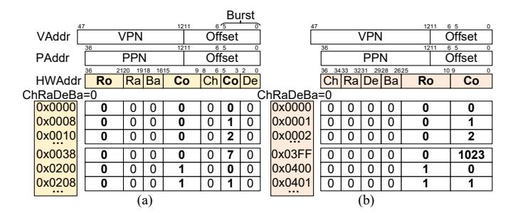
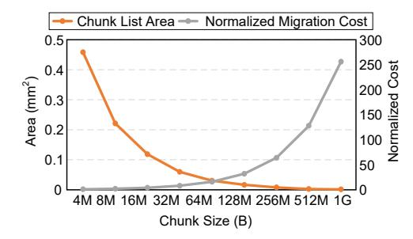
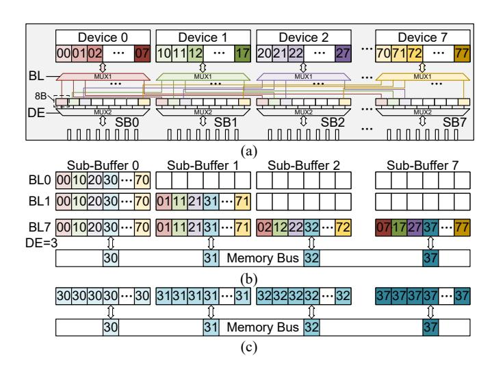
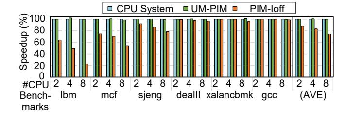
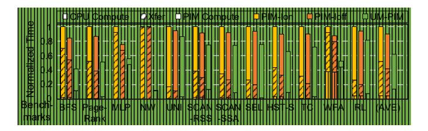
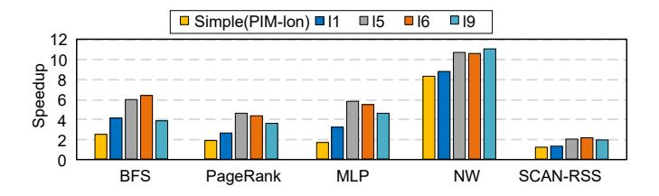
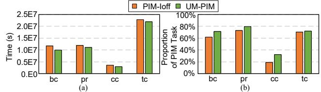

# UM-PIM: DRAM-based PIM with Uniform & Shared Memory Space

Yilong Zhao

*Shanghai Jiao Tong University Shanghai Qi Zhi Institute* sjtuzyl@sjtu.edu.cn

# Mingyu Gao

*Tsinghua University Shanghai Qi Zhi Institute* gaomy@tsinghua.edu.cn

# Fangxin Liu∗

*Shanghai Jiao Tong University Shanghai Qi Zhi Institute* liufangxin@sjtu.edu.cn

# Yiwei Hu

*Shanghai Jiao Tong University* arikara666@sjtu.edu.cn

Zongwu Wang

*Shanghai Jiao Tong University Shanghai Qi Zhi Institute* wangzongwu@sjtu.edu.cn Han Lin *Huawei Technologies Co. Ltd.* linhan11@huawei.com

Ji Li

*Huawei Technologies Co. Ltd.* liji16@huawei.com

He Xian *Shanghai Qi Zhi Institute* 51265900021@stu.ecnu.edu.cn

Hanlin Dong *Shanghai Qi Zhi Institute*

51265900020@stu.ecnu.edu.cn

Tao Yang

*Shanghai Jiao Tong University* yt594584152@sjtu.edu.cn

Naifeng Jing

sjtuj@sjtu.edu.cn

Xiaoyao Liang

*Shanghai Jiao Tong University Shanghai Jiao Tong University* liang-xy@cs.sjtu.edu.cn

Li Jiang∗

*Shanghai Jiao Tong University Shanghai Qi Zhi Institute Huawei Technologies Co. Ltd.* jiangli@cs.sjtu.edu.cn

*Abstract*—DRAM-based Processing in Memory (PIM) addresses the "memory wall" problem by incorporating computing units (PIM units) into main memory devices for faster and wider local data access. However, critical challenges prevent PIM units from being compatible with existing CPU hosts. Memory interleaving and virtual memory limit the size of contiguous data visible to PIM units that constrains the granularity of PIM tasks. Fine-grained PIM tasks result in significant CPU-PIM offloading overhead, offsetting the speed-up of PIM. Existing PIM systems adopt drastic measures to ensure PIM task offloading efficiency, including isolating PIM memory space and turning off global memory interleaving. These interventions, however, decrease the CPU's memory bandwidth and introduce extra data transfer, leading to an additional "system memory wall". This new "wall" must be eliminated before fully embracing the PIM technology.

In this work, we propose UM-PIM, a PIM system with interleaved CPU pages and non-interleaved PIM pages coexisting in a Uniform and Shared Memory space. UM-PIM enables zero-copy during PIM task offloading and maintains the CPU's memory bandwidth while ensuring PIM offloading efficiency. Firstly, we propose a dual-track memory management mechanism consisting of independent page allocation and address translation for the two kinds of pages, respectively. Second, we design UM-PIM interface hardware on the DIMM (with PIMs) side to provide a dynamic address mapping for accelerating the data re-layout. Finally, we provide APIs to reduce PIM-to-PIM communication overhead by optimizing the CPU's access to PIM pages in different communication modes. We compare UM-PIM with a CPU system and the current PIM systems. Results show

This work was partially supported by the National Natural Science Foundation of China (Grant No. 62072262, 61834006). Fangxin Liu and Li Jiang are the corresponding author.

negligible performance degradation for CPU workloads (<0.1%) on UM-PIM, contrasting with the 25.8% degradation on the current PIM system with memory interleaving switched off. For PIM workloads partitioned to CPU and PIM units, UM-PIM can reduce the CPU time by 4.93×, resulting in an end-to-end 1.96× speedup on average.

*Index Terms*—Processing in Memory (PIM), DRAM, Address Mapping, Data Re-layout.

## I. INTRODUCTION

DRAM-based Process-in-Memory (PIM) is an emerging technology to break the "memory wall" between processing units and DRAM memory, by integrating additional computational components (PIM units) into DRAM main memory. The PIM units are parallelly distributed in various memory hierarchies including cell arrays [13], [26], [60], memory banks [14], [43] or ranks [45]. These PIM units can directly access data stored within their own memory device, bypassing the global memory bus. This allows them to achieve significantly higher bandwidth compared to CPUs connected via the PCIe bus, and CPUs can offload memory-intensive operations to PIM units. The PIM units are usually customized to accelerate specific memory-bounded applications, including graph computing [6], [12], [65], [70], artificial intelligence [1], [5], [19], [39]– [42], [44], [48]–[50], encryption [22], and recommendation systems [37], [38]. As more and more operations are proved to be memory-bounded, general-purpose PIM systems emerge [14], [45], [57]. These systems allow memory-bound program segments of a general program offloaded to PIM units as

Fig. 1. (a) PIM and (b) CPU pages' ideal data layout. (c) Isolated memory space design in existing PIM systems. (d) Proposed uniform & shared memory space for DRAM-based PIM. (e) Element-wise and general-purpose operations with/without memory interleaving.

*PIM tasks* while keeping compute-bound segments remain executed by CPUs. Therefore, the compatibility of these general-purpose PIM systems with host CPUs becomes critical to ensure seamless cooperation and communication between CPUs and PIM units.

Modern memory management of computer systems limits the size of contiguous data blocks visible to PIM units for the following two reasons: (i) **Virtual Memory.** The operating system transparently maps virtual memory pages to physical pages according to memory-allocating algorithms. There is no guarantee that adjacent virtual pages reside on the same memory device, resulting in fragmenting contiguous data across multiple locations. (ii) **Memory Interleaving:** To maximize CPU bandwidth, a contiguous data page is partitioned into smaller segments and interleaved across memory devices, as shown in Fig. 1 (b). Under this data layout, the PIM unit in one memory device cannot access a contiguous portion of data. For example, bank-level PIM units cannot access even adjacent bytes within a data structure.

When offloading PIM tasks, the CPU needs to take a series of actions, including context switching [67] and locking memory regions [63]. For certain general-purpose PIM systems, this offloading overhead is even more than  $50\mu s$  [14]. The existence of offloading overhead results in PIM units having to process more data at each offload to amortize the cost. This requires PIM units to be visible to a longer contiguous data block (like in Fig. 1 (a)), which contradicts modern memory management strategies. To ensure the PIM units work efficiently, current PIM systems take the following extreme measures.

TABLE I EXISTING MEASURES FOR PIM OFFLOADING EFFICIENCY.

| Architecture    | Operation | Compa- tibility | Shared Memory Space | Interl- eaving | Re-layout Overhead |
|-----------------|-----------|--------------------|---------------------------|-------------------|-----------------------|
| TensorDIMM [44] | Tensor    | ✓                  | ×                         | ✓                 | -                     |
| Chopim [9]      | Vector    | ×                  | $\checkmark$              | $\checkmark$      | -                     |
| RecNMP [37]     | SLS       | ×                  | $\checkmark$              | $\checkmark$      | -                     |
| PiDRAM [57]     | Clone     | ×                  | $\checkmark$              | $\checkmark$      | -                     |
| MetaNMP [6]     | Graph     | $\checkmark$       | ×                         | $\checkmark$      | H                     |
| PIM-HBM [41]    | GEMM      | $\checkmark$       | ×                         | $\checkmark$      | H                     |
| AxDIMM [45]     | General   | ✓                  | ×                         | ×                 | -                     |
| UPMEM [14]      | General   | ✓                  | ×                         | ×                 | M                     |
| UM-PIM          | General   | ✓                  | ✓                         | ✓                 | L                     |

- Isolated memory space. A dedicated memory space (PIM space) is isolated from main memory for PIM units, as shown in Fig. 1(c) [14], [15], [38]. The CPU accesses the PIM space using a specific physical address, allowing data to be manually located in a specific memory module However, data is transferred between the two memory spaces through the memory bus (Steps 3 and 5) when the CPU offloads PIM tasks. This implies that an extra "memory wall" is introduced between the two isolated memory spaces.
- Software data re-layout. Data is re-layouted by CPU to ensure that a contiguous block of data is written to the same memory module [14], [15], [38], [41]. This further increases the offloading overhead. The overhead of this data transfer is over 90% on tasks with frequent, finegrained data re-layout, e.g. BFS and NW, based on an exhaustive evaluation of a real PIM system [24].
- Globally turning off memory interleaving. Some of the PIM systems turn off the memory interleaving globally to reduce the data re-layout overhead of rank and channel level [14], [45]. However, this approach reduces the CPU's memory bandwidth, aggravating the "memory wall" between the CPU and DRAM memory.

Existing PIM systems adopt different strategies for the three measures based on the feature of PIM tasks. TABLE I summarizes their measures for PIM offloading efficiency. Chopim [9], RecNMP [37], and PiDRAM [57] maintain a shared memory space by modifying the Operating System (OS) or memory controller, resulting in incompatibility with existing host CPUs. Moreover, these three PIM systems are dedicated to element-wise operations. As illustrated in Fig.1 (e), PIM units can directly process elements that are distributed across their devices in such operations. Consequently, a contiguous block of data is not essential for their functioning. Turning on memory interleaving does not damage PIM task offloading granularity. Therefore, they choose to turn on the global memory interleaving without requiring additional adjustments. In contrast, PIM units designed for other operations require a longer contiguous data block [6], [41]. These systems opt to utilize software for data re-layout or switch off memory interleaving. General-purpose PIM systems [14], [45] prioritize compatibility with the host CPU while maintaining coarse offloading granularity. These systems tend to take all the three measures

To truly break the "walls", we propose a new memory management strategy to achieve a uniform & shared memory space in a general-purpose heterogeneous CPU-PIM system, as depicted in Fig. 1(d). The CPU pages and PIM pages, with different address mapping (Fig. 1(a, b)), co-exist in the memory space, and CPUs can access both kinds of pages efficiently. This memory management strategy fulfills the requirements of PIM units for contiguous data layout while avoiding the consequences of the above extreme measures:

- By maintaining a uniform & shared memory space, zerocopy is enabled when CPUs access PIM pages. As shown in Fig. 1(d), steps for data transferring, 3 and 5, are eliminated.
- CPUs can access PIM pages efficiently and transparently without explicit address translation and data re-layout.
- CPU bandwidth remains not damaged because CPU pages can still use state-of-the-art address interleaving techniques.

To ensure compatibility with existing hardware and OS, it is necessary for the proposed approach to address the following challenges.

- A uniform memory address space requires the PIM unit to share the virtual address space managed by the CPU.
   Maintaining adjacent virtual pages locally in PIM local memory without modifying the OS is necessary.
- It is necessary to design an efficient dynamic address mapping that supports CPU and PIM pages with different data layouts.
- The non-interleaved data layout in PIM pages incurs bank conflicts when host CPUs access the PIM pages and degrades the CPU's bandwidth. Efforts should also be made to enhance CPU bandwidth when accessing PIM pages.
- Modifications should primarily focus on the DRAM side to maintain compatibility with existing CPUs and motherboards.

In this work, we propose UM-PIM, a general-purpose PIM system with uniform & shared memory space and dual-track address mapping for the two kinds of memory pages. The existing memory allocation and address mapping rules for CPU pages are kept unchanged to ensure compatibility. For PIM pages, we propose a chunk-based memory management, so as to enable PIM's virtual-to-physical address translation at a relatively low overhead. We insert a UM-PIM interface that consists of hardware modules for efficient address mapping for CPU accessing the two kinds of pages. To improve the bandwidth for accessing PIM pages, we integrate a dedicated hardware module in the DIMM buffer for data re-layout and provide communication API for efficient data transferring. All the hardware modifications are limited to the DRAM side.

The main contributions of this paper are:

Fig. 2. Data address arrangement inside one memory bank (ChRaBaDe=0) and memory mapping rule for (a) CPU systems with global memory interleaving switched on (b) PIM systems with memory interleaving off.

- We delve into the cause of the excessive offload cost of existing PIM systems — the additional memory walls brought by the isolated memory space design.
- We propose UM-PIM, a general-purpose PIM system with uniform & shared memory space, which incorporates a dual-track memory management mechanism along with dedicated hardware support.
- We provide high-level APIs, similar to NCCL communication APIs [55], which optimize the inter-PIM-unit communication efficiency leveraging UM-PIM.

#### II. BACKGROUND

#### A. Address Mapping and Memory Interleaving

In modern computer systems, the virtual address (VAddr) is mapped to the DRAM hardware location in two steps. First, the virtual address is translated to the physical address (PAddr) by the Memory Management Unit (MMU). The Virtual Page Number (VPN) is translated to the Physical Page Number (PPN) by the page table, and the page offset is kept unchanged. The page table is managed by the OS and updated in real time when the program allocates memory. After that, the memory controller translates the PAddr to the Hardware Address (HWAddr) to locate the DRAM cells. The mapping rule of this step is determined by the register states of memory controllers and cannot be changed after booting.

Memory interleaving is a technology to improve memory bandwidth. By mapping adjacent data into different DRAM devices, these data can be accessed in parallel. For example, in DDR4, the DRAM hierarchy levels, in descending order of switching overhead, are row, rank, bank, column, and channel [32]. One simplest interleaving scheme is to map lower bits in the address to memory hierarchy levels with lower switching overhead, as shown in Fig. 2(a). For the device level, devices (also known as chips) are grouped together to provide data bus width expansion [33]. Individual devices are not separately addressable and all the devices of a rank share a common bank address signal line [33]. Therefore, all the devices of a rank can only be accessed simultaneously, and device-level interleaving cannot be controlled through CPU-side address mapping.

Sophisticated address interleaving strategies are used in practice to adapt different accessing patterns of programs [10],

[28], [58], [64], [68]. They utilize the XNOR result of certain address segments to choose the DRAM banks. Nevertheless, they all depend on the high-order bits of PAddr to select rows due to significant row-switching overhead. Additionally, they scatter contiguous data blocks across different banks and devices as opposed to PIM's preference.

In contrast with CPUs, general-purpose PIM units require that they are visible to a contiguous block of data in their own memory. Therefore, the ideal address mapping of PIM units is as shown in Fig. 2 (b). The lower memory hierarchy addresses are mapped to lower-order address bits so that the PAddr inside a DRAM device is contiguous. This requirement contradicts the CPUs' requirement for memory interleaving. Current general-purpose PIM systems adopt a software-only approach to simulate the address mapping for PIM units. They allocate or reserve a large block of contiguous physical address as PIM memory space and lay out the data in PIM memory space with CPU software [14], [41], [63]. IMPICA [30] proposes to use huge pages to reduce the address translation overhead in PIM memory space. However, due to the byte-level memory interleaving in DRAM, these software-only methods introduce significant data re-layout and address mapping overhead.

#### B. Data Transfer Overhead in DRAM-based PIM

As we mention in section I, the CPU needs to transfer and re-layout data before and after CPU offloading PIM tasks. To reduce the data re-layout overhead, some works choose to turn off the memory interleave of DRAM's highlevel hierarchies (e.g. channel and rank) through BIOS [14], [18], [45]. However, the memory interleaving of lower-level hierarchies (e.g. device) cannot be turned off with BIOS. We measure the transfer time with UPMEM SDK [63], whose PIM units are at DDR4's bank level. In UPMEM, the channel and rank level interleaving is switched off, and the software stack is only responsible for bank and lower levels data layout and address translation. Fig. 3(c) depicts the breakdown of the data transfer time. Besides the memory copy, address translation and data re-layout account for nearly 70% of the total transfer time. They provide multi-thread API to accelerate the above data transfer. However, this introduces a fixed preparation time for each transfer and leads to a non-negligible impact when the length of a single transfer is short. As shown in Fig. 3(b), the transfer time is almost fixed when the length of a single transfer is less than 4 kB. Fig. 3(a) depicts the total transfer size and the number of transfers of different applications. When the total amount of transferred data is similar, the applications with more and shorter transfers, e.g. NW, BFS, and UNI, have a more significant transfer time. Therefore, for general-purpose PIM systems, it is necessary to eliminate data transfer between the PIM and CPU memory spaces and accelerate address mapping and data re-layout.

B. Li et. al. [46] compare the address translation overhead of hardware and software methods, finding that the hardware approach reduced overhead by  $4.5\times$ . Therefore, a hardware solution is necessary to reduce the dynamical address mapping overhead in the PIM system.

Fig. 3. (a) Transfer time of benchmarks. (b) Transfer time across different sizes of a single transfer (contiguous data). (c) Time breakdown of Data transfer (length = 256KB). Measured with UPMEM SDK [63].

#### C. Previous Dynamic Memory Mapping Schemes

Dynamic memory address mapping is widely researched in CPU systems. DReAM [20] and PAE [51] add hardware on the DRAM memory side to dynamically recognize the optimal address mapping and transparently change the address mapping method. The host CPU does not know the physical address of DRAM devices and the physical addresses of devices always change. Their approach cannot be applied to the PIM system. The transparency makes the host CPU hardly guarantee that the operands of the same PIM unit are mapped to the same DRAM device, and thus the PIM unit can not work. Multiple physical mappings [29] introduce address alias of the memory space with multiple address mapping rules by configuring the memory controllers. J. Zhang et. al. [71] provide a software-defined dynamical address mapping by integrating additional hardware on the CPU side. However, due to the limitation of memory controller hardware, only the interleaving of hierarchies above the bank level can be controlled by these two technologies. Moreover, the method in [71] completely modifies the memory management model and is not well-compatible with existing CPU host hardware and OS. Therefore, it is imperative to enable control over the interleaving of all DRAM hierarchy levels by modifying only the DRAM-side hardware.

#### III. DUAL-TRACK MEMORY MANAGEMENT

In this work, we propose UM-PIM, a uniform memory management for PIM-DRAM. The key insight is to enable both CPUs and PIM units to share a uniform virtual and physical address space. For CPU pages, we keep the current management and address mapping rules to guarantee CPU bandwidth. The memory address interleaving is switched on by configuring BIOS and the MMU is also enabled to handle

Fig. 4. Chunk-based management for PIM pages. (a) Address mapping. (b) Data layout.

virtual address translations. For PIM pages, we propose a chunk-based memory management strategy, enabling the PIM units to implement virtual-physical address translation at an acceptable cost while ensuring the localization requirement of PIM units. We present our approach for PIM systems with PIM units at the DRAM bank level. Note that for other PIM systems with PIM units located at higher DRAM hierarchy levels, the same aim can be achieved by streamlining our method, as fewer hierarchy levels participate in the address translation. We provide the discussion in section VII.

#### A. Chunk-based Memory Management for PIM Pages.

On the software side of UM-PIM system, the key idea to prevent OS from randomly mapping PIM pages is to enforce a uniform distribution of PIM pages across all PIM local memory devices. We thereby present a chunk-based address management for PIM's pages.

A chunk is a large block in virtual address space, which is mapped to a contiguous block of physical address space. In Linux, the chunk can be allocated through the transparent huge page (THP). As mentioned in section II-A, most interleaving strategies map the Row address to the highest-order bits of the physical address. Under this observation, if the chunk size  $(S_C)$  is large enough  $(S_C \geq Main memory capacity / Row$ number), with the global memory interleave switched on, all the PIM pages of a chunk are evenly distributed to all the memory banks. For example, the memory system configuration shown in Fig. 2 comprises 8 channels, 4 ranks per channel, 8 banks, and 8 devices per rank. If the chunk size is set to 256 MB, then each bank will contribute  $S_B = S_C/(8 \times 4 \times 4 \times 4 \times 4 \times 4 \times 4 \times 4 \times 4 \times 4 \times$  $8 \times 8$ )=128 KB data, i.e., the PIM page size. This means that whenever a PIM chunk is allocated, each PIM unit gets a 128KB PIM page in its PIM local memory.

#### B. CPU Addressing PIM Pages.

A preferred data layout inside PIM chunks is shown in Fig. 4 (b), where adjacent addresses are in the same PIM unit's pages in priority inside each chunk. This address arrangement, as depicted in Fig. 4 (a), is achieved by our proposed hardware-based address mapping modules (detailed in section IV-A).

When the host CPU addresses any data byte in a certain PIM unit's local memory, the software needs to know the virtual address. Use Fig. 4 as an example. Two chunks of size  $S_C$ =256 MB are allocated. Bits 27-0 of VAddr indicate the chunk offset and are kept unchanged when mapped to PAddr. We name bits 47-28 of VAddr as Chunk Virtual Number (CVN), used to determine whether the CPU is accessing a PIM chuck. The two chunks CVN=0x7f3 and 0x7fE are mapped to PAddr with bits 36-28 equal to 0x2 and 0xB. We name these bits of PAddr as Chunk Physical Number (CPN), used for the hardware to judge whether CPU is accessing a PIM page. Bits 27-17 in chunk offset of PAddr and VAddr are mapped sequentially to channel, rank, bank, and device. These bits represent the location of the PIM unit (PIM unit ID), used for software to determine which PIM unit's local memory CPU is accessing. Meanwhile, bits 16-0 are mapped to the Row and Column inside the 128 kB PIM pages, referred to as the offset within the PIM page (PIM offset).

In practice, the 128 kB PIM page size might not be enough for PIM tasks, so multiple chunks are allocated. The CPU host program records the CVNs of the chunks in an array CVNs.

Suppose the CPU host program needs to locate the  $k^{\rm th}$  bytes (e.g., k=0x20002) within the concatenated data of all the PIM pages in PIM unit i=0, CPU can first derive which Chunk the address belongs to (N), and the PIM offset (off) by:

$$N = k/S_B = 1, of f = k \bmod S_B = 2 \tag{1}$$

and then computes the virtual address of this byte by:

$$VAddr = CVNs[N] << 28 + i \times S_B + off$$
 (2)  
= 0x7fE0000002 (3)

This VAddr is further translated to PAddr 0xB0000002 by CPU-side page table and mapped to the HWAddr by address mapping modules.

# C. PIM Units Addressing PIM Pages

It is also essential for a PIM task running on PIM units to access the PIM pages in their local memory (the remaining CPU pages are not accessible). The PIM task program, however, is unaware of the hardware address of PIM pages allocated by OS at run time.

Therefore, we introduce a virtual address space for the PIM unit and share the CPN information with the CPU. In our example, two chunks are allocated. Therefore, the PAddr and VAddr space available to the PIM unit is  $2 \cdot S_B$ =256 kB. Fig. 4 (a) depicts the correspondence between PIM's VAddr and HWAddr. Compared with the CPU's address mapping, a PIM unit does not need to contain its own PIM unit ID. Bits 47-17 of VAddr indicate the PIM-side Chunk Number (PCN).

Suppose program of PIM unit i=0 accesses the same byte (the  $k^{\rm th}$  byte,  $k=0\mathrm{x}20002$ ) as our example in section III-B, it generates k as VAddr.

$$VAddr = k \tag{4}$$

Fig. 5. Page migration cost and chunk list area under different chunk sizes.

Then the PCN is N=1. PCN is translated to CPN by address translation circuit, i.e. PIM Chunk List (PCL), which is presented in section IV-B. CPN of the PIM side is the same as that of the CPU side (= 0 xB). With the same address mapping rule, they point to the same HWAddr. Bits 16-0 of both VAddr and PAddr represent the PIM offset (off=2), which equals that of the CPU side. Finally, PCN and PIM offset are combined into PAddr 0 x 160002, and mapped to the same HWAddr as CPU side.

#### D. Discussion on Chunk Size.

The chunk size is a critical system hyper-parameter. Generally, allocating a huge page larger than 4MB may require page migration to accommodate it. The larger the chunk size is, there will be more conflict pages that need to be migrated. On the other hand, if the chunk size is set too small, more chunks must be allocated to provide enough space for PIM units' use. This in turn requires a larger PCL to store the CPNs, leading to increased overhead. In Fig. 5, we display the migration overhead and PCL area under different chunk sizes. As multiple allocations and releases of PIM chunks can be avoided in programming, these migration overheads are typically one-time occurrences. Therefore, the choice of chunk size can be biased towards reducing the PCL area. We select 256 MB as the chunk size, striking a balance between migration and PCL overhead. Allowing for existing CPU systems not supporting arbitrary-sized huge pages, the chunk size can be chosen from the huge page sizes that are supported by the system in practice.

# IV. HARDWARE SUPPORT

In this section, we present UM-PIM's hardware support for UM-PIM. For CPU-side address mapping and data re-layout, we configure the memory controller on the CPU side through BIOS and insert hardware modules, i.e. UM-PIM interface, between the DRAM interface and the memory bus. In UM-PIM interface, Rank Chunk List (RCL), Address Translation Module (ATM), and Command Generator (CG) are responsible for address mapping and are integrated into the Registered Clock Driver (RCD) chip. While Re-layout Cache (RC) is for data re-layout and is located in the DIMM buffer chip [38]. For PIM address translation, we introduce a hardware module, PCL inside memory banks and near the PIM unit.

Fig. 6. UM-PIM architecture.

Fig. 7. Address mapping path for PIM and CPU pages.

# A. CPU-side Address Mapping

As mentioned in section III, CPU and PIM pages have different data layouts and require dynamic address mapping. For CPU pages, the address mapping path is kept unchanged as the BIOS setting. The address mapping for a PIM page involves two steps: above-bank and below-bank address mapping. Above-bank address mapping is implemented by configuring the CPU's BIOS. For below-bank address mapping, hardware modules are introduced on the DRAM side. This is because the device hierarchy is not visible to the CPU and cannot be configured in BIOS.

1) Above-Bank Address Mapping: For address mapping of hierarchies above bank (channel, rank, and bank in DDR), we adopt the Multiple Address Mappings technique [29]. With this technology, an address alias with a different address mapping is added by configuring the memory controllers through BIOS. For example, in the Xeon processor, adding an alias can be implemented by appending a new Target Address Decoder (TAD) region, TAD1, into PCI configuration space, directing the TAD1 to the DRAM memory, and setting TAD1 into the new address mapping, as shown in Fig. 7 (a).

The address mapping paths for PIM and CPU pages are depicted in Figure 7. In our example, memory system setting with a total memory size of 256GB, the interleaved PAddr space ranges in [0, 256G), while the non-interleaved address

alias ranges in [256G, 512G). Bit 37 of PAddr determines which TAD region an address belongs to. If bit 37 is 0, the address belongs to the CPU page, using TAD0 for address mapping. Otherwise, the address belongs to the PIM page and TAD1 is used. In this step, only address bits that are related to rank, channel, and bank are translated to the true HWAddr. The remaining bits are transferred to the DRAM side UM-PIM interface for below-bank address mapping. This means that the HWAddr generated by memory control at this step is an intermediate result. Due to the DRAM protocol, the remaining bits are still divided into row and column addresses (CO and RO in Fig. 7 (a)) and sent to DRAM in two cycles.

2) Below-Bank Address Mapping: Address mapping of row, device, and column, as illustrated in Fig. 7, is carried out by two hardware modules, RCL and ATM in UM-PIM Interface. The two hardware modules are integrated into the RCD chip in DDR, as shown in Fig. 6. The RCL is responsible for determining the page kind, while the ATM maps the remaining bits of the intermediate HWAddr into row, column, and device addresses.

**RCL**. Each row of RCL stores the CPN of one chunk. When the UM-PIM interface receives a row address, the highest 9 bits are sent to RCL. If these bits are present in RCL, the address belongs to one PIM page, and the HIT signal is generated as 1. Otherwise, the address belongs to CPU pages and the HIT signal is 0.

ATM. As depicted in Fig. 7, if the RCL determines that the address belongs to CPU pages, the ATM keeps the row and column address from the memory controller unchanged. Otherwise, the ATM maps bits 9-7 of the column address (CO) as the device address (De), and other bits are left shifted by 3 as the real column address  $(CO_D)$ . The row and column address are sent to the DRAM interface for data access and the device and bank address is sent to RC for data selection. We present the procedure in section IV-C. After mapping the address, the Command Generator (CG) generates the real command to the DRAM interface for data access.

Timing of Address Mapping. Although the UM-PIM interface is in the critical path between the memory controller and the DRAM interface, all the DRAM timings are not impacted. Fig. 9 (a) depicts a Read (RD) request including its prerequisite requests, Precharge (PRE) and Activate (ACT). After UM-PIM interface receives a PRE request, the ATM circuit starts to convert the address and then sends the real PRE request to the DRAM interface. The memory bus, UM-PIM interface, and DRAM interface compose a pipeline. As a result, the DRAM timing tRP and tRCD are kept unchanged. For an entire RD request, the memory controller needs to wait for the DRAM interface to return the data. Therefore, the reading latency is increased by tUI, which is the UM-PIM interface address mapping latency. This does not affect the functionality of the memory controller because it receives the returned data based on the preamble signal.

Fig. 8. (a) RC-to-Device connection. (b) Data re-layout with RC. (c) RC's broadcast mode.

#### B. PIM-side Address Translation

**PCL.** PCL contains the CPNs allocated by the CPU, and the index of a CPN indicates its corresponding PCN (N). When the PIM unit generates a VAddr, PCL inquires the  $N^{\rm th}$  row and outputs the corresponding CPN. The CPN is further combined with PIM offset to obtain the PAddr.

# C. Data Re-layout

In CPU systems, cache line size is designed to be an integer multiple of DRAM burst size. Suppose both the cache line size and DRAM burst size are 64 bytes and the bitwidth of DRAM is 64-bit. Within each burst, the DRAM interface accesses 8 bytes from each device to fully utilize the devicelevel parallelism. For example, as illustrated in Fig. 8, a burst consists of data 00, 10, ..., 70, thereby distributing each cache line across all devices within a rank. However, in PIM chunks, a consecutive 64-byte range is mapped to the same device. For instance, a PIM chunk's cache line comprises data 01, 02, ..., 07. Accessing a complete cache line requires 8 bursts, with each device providing 64 bytes of data. The remaining 7×64 bytes, however, remain unused, resulting in a wastage of memory bus bandwidth and requiring CPU intervention to filter out these unused cache lines. Therefore, we propose to add an RC module to filter the contiguous 64 bytes on the DRAM side, preserving memory bus bandwidth and mitigating the need for CPU involvement.

RC. The RC circuits are placed between the memory bus and the data signal line of the DRAM interface and is integrated into the DIMM buffer [38]. With a burst length of 8 and a bit width of 64, each RC contains eight subbuffers (SB), each consisting of 8 cells that store 8B data, as depicted in Fig. 8 (a). Fig. 8 (b) shows an example of reading a cache line from the third DRAM device (DE=3), and Fig. 9 (b) depicts the timing. The ATM circuit converts the column address *CO* from the memory controller into the real column address *CO*\_D. Note that the lower 3 bits of

Fig. 9. Timing of UM-PIM interface.

 $CO\_D$  are zero, as mentioned in section IV-A2. After that, the CG generates 8 burst access (BL) commands from column  $CO\_D$  to  $CO\_D+7$ . At the end of each burst, the MUX1 of every SB is selected by the BL number. That means the 64 bytes of  $i^{\rm th}$  burst are write to the  $i^{\rm th}$  SB ( $i=0,\ldots,7$ ). After the 8 BLs, the SBs are filled up. Then DE signal is used to select MUX2 and the  $3^{\rm rd}$  cells of each SB are pushed to the memory bus and transferred to the CPU side.

The RC enables fast data re-layout and filtering on the DRAM side without the participation of the CPU. However, it does not prevent DRAM from reading out redundant bytes and storing them in RC. We adopt a delayed update scheme to improve the possibility of making use of the redundant bytes already fetched in the RC. Fig. 9 (c) shows the timing when data is already fetched into RC. When accessing data from PIM chunks, CG first checks whether the data is already fetched in RC by comparing the row, bank, and column addresses. If the data is already fetched, then CG can directly initiate the burst transfer by reading from RC which saves tCL time. In section V we further describe how to best utilize RCs in software.

Since PIM units from different DRAM devices do not have shared memory, the broadcast operation is widely used when CPUs divide PIM tasks. We provide a broadcast mode in RC to reduce the amount of data transferred from the CPU. The broadcast mode is shown in Fig. 8 (b). In broadcast mode, the 64 bytes are written to every cell of the sub-buffers. After that, the 64 bytes are immediately written back to DRAM devices. Broadcast mode can save the memory bandwidth because only one burst is transferred and the same data block is avoided to be transferred multiple times.

TABLE II DRAM-PIM INSTRUCTION EXTENSION.

| Command   Parameter |           | description                         |  |  |  |
|---------------------|-----------|-------------------------------------|--|--|--|
| ACN                 | Chunk No. | Append chunk number to RCL & PCL    |  |  |  |
| CCL                 | -         | Clear RCL & PCL                     |  |  |  |
| CRC                 | -         | Write data in RC back to DRAM banks |  |  |  |
| BCM true/false      |           | Set/Unset RC broadcast mode         |  |  |  |

| Scatter (a)  PIM 0  PIM 1  PIM 2  PIM 3  PIM 3  PIM 0  PIM 0  PIM 1  PIM 0  PIM 1  For 1 in range(len/64): for p in range(#pim): memcpy(src[p,1], dest[p,1], 64)  For 1 in range(len/64): for p in range(#pim):                                                                                                                                                                                                                                                                                                                                                                                                                                                                                                                                                                                                                                                                                                                                                                                                                                                                                                                                                                                                                                                                                                                                                                                                                                                                                                                                                                                                                                                                                                                                                                                                                                                                                                                                                                                                                                                                                                               |         |
|-------------------------------------------------------------------------------------------------------------------------------------------------------------------------------------------------------------------------------------------------------------------------------------------------------------------------------------------------------------------------------------------------------------------------------------------------------------------------------------------------------------------------------------------------------------------------------------------------------------------------------------------------------------------------------------------------------------------------------------------------------------------------------------------------------------------------------------------------------------------------------------------------------------------------------------------------------------------------------------------------------------------------------------------------------------------------------------------------------------------------------------------------------------------------------------------------------------------------------------------------------------------------------------------------------------------------------------------------------------------------------------------------------------------------------------------------------------------------------------------------------------------------------------------------------------------------------------------------------------------------------------------------------------------------------------------------------------------------------------------------------------------------------------------------------------------------------------------------------------------------------------------------------------------------------------------------------------------------------------------------------------------------------------------------------------------------------------------------------------------------------|---------|
| for p in range(#pim): memcpy(src[p,1], dest[p,1], 64)  PIM 3  PIM 0  PIM 1  For l in range(len/64): for p in range(#pim): memcpy(src[p,1], dest[p,1], 64)                                                                                                                                                                                                                                                                                                                                                                                                                                                                                                                                                                                                                                                                                                                                                                                                                                                                                                                                                                                                                                                                                                                                                                                                                                                                                                                                                                                                                                                                                                                                                                                                                                                                                                                                                                                                                                                                                                                                                                     |         |
| PIM 0 PIM 1 PIM 0 PIM 1 PIM 0 PIM 1 PIM 0 PIM 1 PIM 1 PIM 1 PIM 1 PIM 1 PIM 1 PIM 1 PIM 1 PIM 1 PIM 1 PIM 1 PIM 1 PIM 1 PIM 1 PIM 1 PIM 1 PIM 1 PIM 1 PIM 1 PIM 1 PIM 1 PIM 1 PIM 1 PIM 1 PIM 1 PIM 1 PIM 1 PIM 1 PIM 1 PIM 1 PIM 1 PIM 1 PIM 1 PIM 1 PIM 1 PIM 1 PIM 1 PIM 1 PIM 1 PIM 1 PIM 1 PIM 1 PIM 1 PIM 1 PIM 1 PIM 1 PIM 1 PIM 1 PIM 1 PIM 1 PIM 1 PIM 1 PIM 1 PIM 1 PIM 1 PIM 1 PIM 1 PIM 1 PIM 1 PIM 1 PIM 1 PIM 1 PIM 1 PIM 1 PIM 1 PIM 1 PIM 1 PIM 1 PIM 1 PIM 1 PIM 1 PIM 1 PIM 1 PIM 1 PIM 1 PIM 1 PIM 1 PIM 1 PIM 1 PIM 1 PIM 1 PIM 1 PIM 1 PIM 1 PIM 1 PIM 1 PIM 1 PIM 1 PIM 1 PIM 1 PIM 1 PIM 1 PIM 1 PIM 1 PIM 1 PIM 1 PIM 1 PIM 1 PIM 1 PIM 1 PIM 1 PIM 1 PIM 1 PIM 1 PIM 1 PIM 1 PIM 1 PIM 1 PIM 1 PIM 1 PIM 1 PIM 1 PIM 1 PIM 1 PIM 1 PIM 1 PIM 1 PIM 1 PIM 1 PIM 1 PIM 1 PIM 1 PIM 1 PIM 1 PIM 1 PIM 1 PIM 1 PIM 1 PIM 1 PIM 1 PIM 1 PIM 1 PIM 1 PIM 1 PIM 1 PIM 1 PIM 1 PIM 1 PIM 1 PIM 1 PIM 1 PIM 1 PIM 1 PIM 1 PIM 1 PIM 1 PIM 1 PIM 1 PIM 1 PIM 1 PIM 1 PIM 1 PIM 1 PIM 1 PIM 1 PIM 1 PIM 1 PIM 1 PIM 1 PIM 1 PIM 1 PIM 1 PIM 1 PIM 1 PIM 1 PIM 1 PIM 1 PIM 1 PIM 1 PIM 1 PIM 1 PIM 1 PIM 1 PIM 1 PIM 1 PIM 1 PIM 1 PIM 1 PIM 1 PIM 1 PIM 1 PIM 1 PIM 1 PIM 1 PIM 1 PIM 1 PIM 1 PIM 1 PIM 1 PIM 1 PIM 1 PIM 1 PIM 1 PIM 1 PIM 1 PIM 1 PIM 1 PIM 1 PIM 1 PIM 1 PIM 1 PIM 1 PIM 1 PIM 1 PIM 1 PIM 1 PIM 1 PIM 1 PIM 1 PIM 1 PIM 1 PIM 1 PIM 1 PIM 1 PIM 1 PIM 1 PIM 1 PIM 1 PIM 1 PIM 1 PIM 1 PIM 1 PIM 1 PIM 1 PIM 1 PIM 1 PIM 1 PIM 1 PIM 1 PIM 1 PIM 1 PIM 1 PIM 1 PIM 1 PIM 1 PIM 1 PIM 1 PIM 1 PIM 1 PIM 1 PIM 1 PIM 1 PIM 1 PIM 1 PIM 1 PIM 1 PIM 1 PIM 1 PIM 1 PIM 1 PIM 1 PIM 1 PIM 1 PIM 1 PIM 1 PIM 1 PIM 1 PIM 1 PIM 1 PIM 1 PIM 1 PIM 1 PIM 1 PIM 1 PIM 1 PIM 1 PIM 1 PIM 1 PIM 1 PIM 1 PIM 1 PIM 1 PIM 1 PIM 1 PIM 1 PIM 1 PIM 1 PIM 1 PIM 1 PIM 1 PIM 1 PIM 1 PIM 1 PIM 1 PIM 1 PIM 1 PIM 1 PIM 1 PIM 1 PIM 1 PIM 1 PIM 1 PIM 1 PIM 1 PIM 1 PIM 1 PIM 1 PIM 1 PIM 1 PIM 1 PIM 1 PIM 1 PIM 1 PIM 1 PIM 1 PIM 1 PIM 1 PIM 1 PIM 1 PIM 1 PIM 1 PIM 1 PIM 1 PIM 1 PIM 1 PIM 1 PIM 1 PIM 1 PIM 1 PIM 1 PIM 1 PIM 1 PIM 1 PIM 1 PIM 1 PIM 1 PIM 1 PIM 1 PIM 1 PIM 1 PIM 1 PIM 1 PIM 1 PIM 1 |         |
| PIM 0 PIM 0 PIM 1 For 1 in range(len/64):                                                                                                                                                                                                                                                                                                                                                                                                                                                                                                                                                                                                                                                                                                                                                                                                                                                                                                                                                                                                                                                                                                                                                                                                                                                                                                                                                                                                                                                                                                                                                                                                                                                                                                                                                                                                                                                                                                                                                                                                                                                                                     |         |
| Broadcast For 1 in range(len/64):                                                                                                                                                                                                                                                                                                                                                                                                                                                                                                                                                                                                                                                                                                                                                                                                                                                                                                                                                                                                                                                                                                                                                                                                                                                                                                                                                                                                                                                                                                                                                                                                                                                                                                                                                                                                                                                                                                                                                                                                                                                                                             |         |
| Broadcast                                                                                                                                                                                                                                                                                                                                                                                                                                                                                                                                                                                                                                                                                                                                                                                                                                                                                                                                                                                                                                                                                                                                                                                                                                                                                                                                                                                                                                                                                                                                                                                                                                                                                                                                                                                                                                                                                                                                                                                                                                                                                                                     |         |
|                                                                                                                                                                                                                                                                                                                                                                                                                                                                                                                                                                                                                                                                                                                                                                                                                                                                                                                                                                                                                                                                                                                                                                                                                                                                                                                                                                                                                                                                                                                                                                                                                                                                                                                                                                                                                                                                                                                                                                                                                                                                                                                               |         |
| (b) PIM 2                                                                                                                                                                                                                                                                                                                                                                                                                                                                                                                                                                                                                                                                                                                                                                                                                                                                                                                                                                                                                                                                                                                                                                                                                                                                                                                                                                                                                                                                                                                                                                                                                                                                                                                                                                                                                                                                                                                                                                                                                                                                                                                     |         |
| PIM 3 PIM 3                                                                                                                                                                                                                                                                                                                                                                                                                                                                                                                                                                                                                                                                                                                                                                                                                                                                                                                                                                                                                                                                                                                                                                                                                                                                                                                                                                                                                                                                                                                                                                                                                                                                                                                                                                                                                                                                                                                                                                                                                                                                                                                   |         |
| PIM 0                                                                                                                                                                                                                                                                                                                                                                                                                                                                                                                                                                                                                                                                                                                                                                                                                                                                                                                                                                                                                                                                                                                                                                                                                                                                                                                                                                                                                                                                                                                                                                                                                                                                                                                                                                                                                                                                                                                                                                                                                                                                                                                         |         |
| Gather PIM 1 for 1 in range(len/64):                                                                                                                                                                                                                                                                                                                                                                                                                                                                                                                                                                                                                                                                                                                                                                                                                                                                                                                                                                                                                                                                                                                                                                                                                                                                                                                                                                                                                                                                                                                                                                                                                                                                                                                                                                                                                                                                                                                                                                                                                                                                                          |         |
| for p in range(#pim):  (c) PIM 2 memcpy(dest[p,1], src[p,1], 64)                                                                                                                                                                                                                                                                                                                                                                                                                                                                                                                                                                                                                                                                                                                                                                                                                                                                                                                                                                                                                                                                                                                                                                                                                                                                                                                                                                                                                                                                                                                                                                                                                                                                                                                                                                                                                                                                                                                                                                                                                                                              |         |
| PIM 3 4                                                                                                                                                                                                                                                                                                                                                                                                                                                                                                                                                                                                                                                                                                                                                                                                                                                                                                                                                                                                                                                                                                                                                                                                                                                                                                                                                                                                                                                                                                                                                                                                                                                                                                                                                                                                                                                                                                                                                                                                                                                                                                                       |         |
| PIM 0 for l in range(len/64): for br in range(#bank):                                                                                                                                                                                                                                                                                                                                                                                                                                                                                                                                                                                                                                                                                                                                                                                                                                                                                                                                                                                                                                                                                                                                                                                                                                                                                                                                                                                                                                                                                                                                                                                                                                                                                                                                                                                                                                                                                                                                                                                                                                                                      |         |
| All-Gather PIM 1 for dr in range(8):                                                                                                                                                                                                                                                                                                                                                                                                                                                                                                                                                                                                                                                                                                                                                                                                                                                                                                                                                                                                                                                                                                                                                                                                                                                                                                                                                                                                                                                                                                                                                                                                                                                                                                                                                                                                                                                                                                                                                                                                                                                                                          |         |
| (d) PIM 2 for bw in range(#bank):                                                                                                                                                                                                                                                                                                                                                                                                                                                                                                                                                                                                                                                                                                                                                                                                                                                                                                                                                                                                                                                                                                                                                                                                                                                                                                                                                                                                                                                                                                                                                                                                                                                                                                                                                                                                                                                                                                                                                                                                                                                                                             |         |
| PIM 3 for dw in range(8): memcpy(dest[bw, dw, (br*8+dr                                                                                                                                                                                                                                                                                                                                                                                                                                                                                                                                                                                                                                                                                                                                                                                                                                                                                                                                                                                                                                                                                                                                                                                                                                                                                                                                                                                                                                                                                                                                                                                                                                                                                                                                                                                                                                                                                                                                                                                                                                                                     | \*c±11  |
| □⊕ src[br, dr, 1], 64)                                                                                                                                                                                                                                                                                                                                                                                                                                                                                                                                                                                                                                                                                                                                                                                                                                                                                                                                                                                                                                                                                                                                                                                                                                                                                                                                                                                                                                                                                                                                                                                                                                                                                                                                                                                                                                                                                                                                                                                                                                                                                                        | , 3.1], |
| PIM 0 for i in range(I):                                                                                                                                                                                                                                                                                                                                                                                                                                                                                                                                                                                                                                                                                                                                                                                                                                                                                                                                                                                                                                                                                                                                                                                                                                                                                                                                                                                                                                                                                                                                                                                                                                                                                                                                                                                                                                                                                                                                                                                                                                                                                                      |         |
| General PIM 1 for j in range(J):                                                                                                                                                                                                                                                                                                                                                                                                                                                                                                                                                                                                                                                                                                                                                                                                                                                                                                                                                                                                                                                                                                                                                                                                                                                                                                                                                                                                                                                                                                                                                                                                                                                                                                                                                                                                                                                                                                                                                                                                                                                                                              |         |
| Traversal PIM 2 dest[i,j,]=f(src1[i,j,],                                                                                                                                                                                                                                                                                                                                                                                                                                                                                                                                                                                                                                                                                                                                                                                                                                                                                                                                                                                                                                                                                                                                                                                                                                                                                                                                                                                                                                                                                                                                                                                                                                                                                                                                                                                                                                                                                                                                                                                                                                                                                      |         |
| (e) Src2[i,j,],)                                                                                                                                                                                                                                                                                                                                                                                                                                                                                                                                                                                                                                                                                                                                                                                                                                                                                                                                                                                                                                                                                                                                                                                                                                                                                                                                                                                                                                                                                                                                                                                                                                                                                                                                                                                                                                                                                                                                                                                                                                                                                                              |         |

Fig. 10. Inter-PIM-unit communication and CPU traversal on the results of the PIM computation.

#### D. Instruction Support

In this subsection, we present the instructions to support CPU management on DRAM-side address mapping and data arrangement. They are summarized in TABLE II. Note that these instructions are not extended in the CPU core, but use MMIO [14] to configure and interact with the UM-PIM interface. The ACN and CCL instructions are responsible for managing the RCL and PCL, respectively. ACN appends a 9-bit CPN item to PCL and RCL when a new PIM chunk is allocated. On the other hand, CCL clears the chunk lists when the program is terminated. The CRC and BCM instructions are used to manage the RC. CRC flushes data in RC to DRAM banks, to avoid desynchronization problems caused by the delayed update strategy. Instruction BCM sets RC into broadcast mode.

# V. SOFTWARE SUPPORT FOR UM-PIM

In this section, we provide API support for memory management and some specific memory access modes. We present the impact of data traversal order on the CPU side performance. After that, we summarize a principle that can optimize the efficiency of RC data utilization. We also provide APIs for

some specific data transferring between PIM units, i.e. scatter, broadcast, and gather.

#### A. Memory Allocation

For CPU pages, we keep the *malloc()* function in glibc unchanged. For PIM pages, we define a *malloc\_pim(len)* API. This API allocates a block of memory with length *len* for all PIM units. When malloc\_pim API is called, it first decides how many chunks should be allocated according to *len*. After that, the chunks are allocated through system call *mmap()* and mark the chunks as THP through *madvise()*. Since the modern system generally supports demand paging, the CPU needs to access at least one byte from the chunk to make sure that a physical huge page is allocated in DRAM. PIM units cannot handle page fault, therefore, syscall *mlock()* is called to prevent PIM chunks from being swapped out. Finally, it inquires /*proc/pid/pagemap* in Linux to get the PAddr of the chunk and extract CPN from it. The CPN is appended to RCL by sending ACN instruction to UM-PIM interface.

#### B. Speed Distinction of Different Nested Loop Order

After PIM units process all their local data, the computation switches to CPUs for the next computations. This switch mainly occurs in the following situations. First, due to the streamlined design of the PIM units, some complex functions (e.g. transcendental functions [31] [14]) cannot be efficiently calculated on the PIM units. These operations have to be transited to CPUs for calculation. Second, data result interaction between PIM units is required in parallel computing models, e.g. fork-join, after every time period. In either case, the results of the PIM units are traversed by CPUs. The order of traversal on PIM units' results has a considerable impact on the RC hit rate, and results in the distinction on DRAM bandwidth. For example, if we continuously traverse the results in the PIM unit on a single device with configuration in Fig. 2, 8× redundant data are read from DRAM. Although we use RC to filter data to prevent the memory bus from transferring redundant data, this does not change the fact that the bandwidth of a single DRAM traversal operation itself is still only 1/8. We still need a more reasonable traversal order to better utilize the data that has been fetched in RC.

We use a simple example, all-gather, to illustrate the effect of traversal order on access performance. All-Gather reads a block of data from every PIM unit, joins them, and broadcasts to every PIM unit. The loop is shown in Fig. 10 (d). The loop traverses each data block based on the bank, device address, and offset of each data block written. There are 5 nested loops. Where l represents the offset inside the data block,  $b_r$  and  $b_w$  represent the bank address (including channel and rank) of the read and write.  $d_r$  and  $d_w$  represent the read and write device addresses. In each loop, there is a read access and write access. The read operation access from the  $b_r$  bank,  $d_r$  device, and the device address offset is  $l + addr_r$ . Where  $addr_r$  represents the start offset of the reading block. The write operation access from the  $b_w$  bank,  $d_w$  device, and the device offset is  $addr_w + addr_r$ .

Fig. 11. Time, RC hit rate, and read bandwidth (normalized to CPU Page) of all-gather on 8 PIM ranks with different order of nested loop. The data block size is 1024. Left: the order disobeys at least one rule. Middle: the order obeys all the rules. Right: An all-gather operation on CPU pages.

 $(b_r \times 8 + d_r) \times s + l$ . Where  $addr_w$  represents the start offset of the reading block, and s is the block size.

To better utilize the data loaded into RC, we need to keep the traversal on the device address ( $d_r$  and  $d_w$ ) to be the innermost loop. The loop order should satisfy the following conditions. First, for read access, the loop  $b_r$  and l should be outside the loop of  $d_r$ . Second, for write access, the loop l,  $b_r$ , and  $d_r$  should be outside the loop  $d_w$ . Fig. 11 depicts the total time of the all-gather procedure under different orders of nested loop. The simulation setup is described in section VI-A. We can see that the nested loop orders that obey the rule are faster than the others achieve better RC hit rates and result in a higher DRAM read bandwidth. As a result, their overall time is relatively low, and are close to the all-gather operation on CPU pages (only about  $1.6 \times$  slower than CPU pages). General traversal can also use this strategy to improve the access bandwidth on PIM pages (Fig. 10 (e)).

#### C. High-level APIs for Inter-PIM Units Data Transfer

We provide several high-level APIs for some widely-used inter-PIM-unit communication operations whose performances are incredibly affected by RC hit rate. Due to the significant cost of communication between PIM units, existing PIM systems often adopt a fork-join computing mode [14], [41], [45]. Therefore, we adopt communication modes from NCCL [55]. We present the order of nested loop for these modes to better utilize RC hit.

**Scatter.** Scatter reads a contiguous block of data from one DRAM bank, divides it into multiple sub-blocks, and scatters the sub-blocks to every DRAM bank. Therefore, we can place the writings of bursts into the same location of every device into adjacent iterations. Fig. 10(a) presents a scatter of 4 PIM units. The outermost loop l is on the offset of each data block. In each loop, a burst length of data is read from each block, and written to the destination PIM bank. Every rank's RC can buffer the written data of banks from 8 devices and write to the banks together. The RC's locality is fully utilized.

**Broadcast.** Broadcast reads a block of data from one DRAM bank and writes it to all the DRAM banks. Fig. 10(b) depicts a broadcast from PIM 0. Before the broadcast oper-

TABLE III SYSTEM CONFIGURATION

Host CPU Processor 8-Core O3CPU @3.2GHz L1I/L1D 32kB / 32kB, Assoc: 8 L2 / L3 1MB Assoc: 16 / 22MB, Assoc: 22 Cache Line 64 B DRAM DIMM DRAM DDR4-2400, 8×8, 8GB/Rank Ba / De / Ro / Co 8 / 8 / 131072 / 1024 Timing Param. [54] tBURST=3.32ns tRCD=tCL=tRP=14.16ns tRAS=32ns tRRD=3.32ns tXAW=13.328ns tRFC=350ns tWR=15ns tWTR=5ns tXS=340ns tRTP=7.5ns tRTW=tCS=1.666ns tREFI=7.8us PIM Units PIM Unit UPMEM DPU [14] @500MHz, 16 Tasklets Num 64 Per Rank, at Bank level System Configuration CPU System 8 DRAM Channels ×4 Ranks Addr Map: Ro-Ra-Ba-Co-Ch PIM System 1 {4 DRAM Channels, 4 PIM Channels} ×4 Ranks (PIM-Ion) Addr Map: Ro-Ra-Ba-Co-Ch PIM System 2 {4 DRAM Channels, 4 PIM Channels} ×4 Ranks (PIM-Ioff) Addr Map: Ch-Ra-Ro-Ba-Co UM-PIM {4 DRAM Channels, 4 PIM Channels} ×4 Ranks

ation, all the RCs are set to broadcast mode. The outermost loop l is also on the data block offset. For each l, 64-byte data are read from PIM 0's block and write these data to every PIM bank. The broadcast mode of RC can fully utilize the write bursts by writing to all the devices in parallel.

Gather. Gather is a reverse operation of scatter, by reading a block of data from every DRAM bank, gathering them, and writing to one DRAM bank. Like in scatter, the outermost loop l is also on the offset of each data block. In Fig. 10(c), PIM 0 gathers the data from every bank. Similar to Scatter, the RC's locality can be fully utilized as data with the same offset l are read in adjacent iterations.

# VI. EVALUATION

# *A. Experiment Setup*

Baselines. We compare UM-PIM with CPU system and two PIM system baselines. The system configurations are summarized in TABLE III. The DRAM configuration is from commercial DRAM PIM – UPMEM [14]. The bank number is fewer than a standard DDR4 because of additional PIM units. We adopt identical hardware configurations for all three architectures, except half of the DRAM channel sockets are plugged in with PIM DRAMs in UM-PIM and PIM systems. CPU system's global memory interleaving is switched on. (PIM-Ion) switch on the global memory interleaving and use software to translate address and re-layout data with CPU software [6]. (PIM-Ioff) switch off the global memory interleaving of rank and channel level, and use software to do the address translation and data re-layout of the rest of DRAM hierarchies, like that in [14]. Both the two PIM systems reserve

TABLE IV CPU AND PIM BENCHMARKS.

CPU Workloads [27] (MPKI is from [69])

| Benchmark                            | MPKI Benchmark                  |  | MPKI Benchmark              |              |                        | MPKI         |
|--------------------------------------|------------------------------------|--|--------------------------------|--------------|------------------------|--------------|
| lbm dealII                        | 0.55 mcf 0.09 xalancbmk   |  | 0.92 0.13                   | sjeng GCC |                        | 0.13 0.03 |
| PIM Workloads                        |                                    |  |                                |              |                        |              |
| Benchmark                            | Parameter                          |  | Benchmark                      |              | Parameter              |              |
| BFS [24]                             | #node: 196608 sparsity: 5e-5    |  | SCAN-RSS [24] SCAN-SSA [24] |              | len: 8M len: 8M     |              |
| PR [4]                               | Kronecker gen. #node: 8k Deg:12 |  | SEL [24] HST-S [24]         |              | len: 32M len: 1.5M  |              |
| MLP [24] neuron: 16k layers: 3 |                                    |  | NW [24]                        |              | bins: 256 size: 64k |              |
|                                      |                                    |  |                                |              |                        |              |

a physical address space for PIM units. UM-PIM provides two address mappings for the two memory pages, by configuring the memory controllers, as presented in section IV-A1.

UNI [24] len: 256M WFA [16] len: 20k×110 TC [4] #node: 8k Deg:12 RL [23] iter: 100

Simulation. The performance of the three systems is evaluated with the GEM5 simulator [52] under X86 ISA and integrating Ramulator2 [53] for DRAM modelling. We modify the address mapping in Ramulator2 and add the latency of the added circuit model (RCL, ATM, RC) to the corresponding hierarchy. The chunk-based non-interleaved address mapping alias of UM-PIM, and reserved PIM memory space for PIM systems, are abstracted as a NUMA node in the /dev directory of the GEM5 simulator. The driver for CPU accessing the reserved memory space is ported from UPMEM Driver [63]. PIM units' performance is measured with the real-world UPMEM DPUs [14] and the PIM task latency is inserted into the PIM-task launch point of the CPU host program to get the overall computing time. The logic circuit used in RCL, ATM, and RC is derived through Synopsys Design Compiler with TSMC 90nm technology library at the frequency of 2.4GHz, and the buffer array used in RC is simulated with CACTI 7.0 [3]. The DRAM interface is estimated with CACTI-IO [34]. The software data transfer functions of current PIM systems we use in the CPU host program, including address translation and data re-layout, are from UPMEM Software Development Kit (SDK) [63].

Benchmarks. The benchmarks for evaluating the three architectures are divided into two categories. 1) *CPU workloads.* CPU workloads only run on the CPU side for evaluating the impact of different memory interleaving strategies in the three architectures. We select 6 benchmarks from SPEC CPU 2006 [27]. 2) *PIM workloads.* In PIM workloads, the CPU offloads memory-intensive program segments to PIM units, and other segments are executed by the host CPU. We select 12 benchmarks from PRIM [24], GAP [4], AiM [16] and PIM-ML [23]. All the benchmarks and parameters are summarized in TABLE IV.

Fig. 12. Performance degradation of CPU workloads on UM-PIM and PIM system compared to CPU system.

Fig. 13. Computing time of PIM workloads on PIM systems and UM-PIM.

#### B. CPU Workloads

Fig. 12 shows the result of CPU workloads, on the CPU system, PIM-Ioff, and UM-PIM. Compared to the CPU system, PIM-Ioff has a performance degradation of 88.2%, 83.8%, and 74.2% for 2, 4, and 8 CPU cores over the benchmarks. For *lbm* on 8 CPUs, the performance of the PIM system is only 22% of that of the CPU system. While for UM-PIM, the performance degradation is less than 0.1% for the benchmarks. This is because the address interleaving of CPU pages can guarantee CPU bandwidth. The hardware module for determining page type, RCL, has an ignorable impact on overall performance. The Cache Miss per 1000 Instructions (MPKI) of the benchmarks are summarized in TABLE IV. For *lbm* and *mcf*, which have a higher MPKI, PIM-Ioff's non-interleaved address mapping has a significant, over 40% degradation on the performance for 8 CPUs. When the number of CPUs increases from 2 to 8, the performance degradation of lbm on the PIM system decreases from 64.3% to 22.4%. This also indicates that UM-PIM guarantees the possibility of using PIM units to accelerate computation in multi-core systems.

#### C. PIM Workloads

Fig. 13 depicts the computing time and breakdown of PIM workloads on UM-PIM and PIM systems. All the values are normalized to PIM-Ion in each benchmark. We use 1 CPU thread, and PIM units from all the 16 ranks are enabled. We suppose that the data are loaded to PIM memory space or PIM pages initially by DMA, and this initialization time is not contained in Fig. 13. We divide the overall computing time into three parts: CPU computing, data transfer (Xfer), and PIM unit computing. Data transfer time includes the data movement between CPU and PIM memory spaces before and after offloading PIM tasks. UM-PIM do not contain data transfer time as the CPU can directly access PIM pages, and

Fig. 14. Computing time of PIM workloads with different PIM unit numbers.

1 PIM Rank contains 64 PIM units.

its CPU computing time includes accessing PIM pages. UM-PIM can reduce the CPU computing and data transfer time by 4.93× on average compared to PIM-Ioff. This results in 1.96× speedup of the whole workload on average. This reduction is mainly due to the reduced memory copy and efficient address mapping and data re-layout. Moreover, 9 of the 12 benchmarks can utilize the efficient inter-PIM unit communication APIs. The other 3 benchmarks (BFS, PageRank, and NW) cannot utilize the APIs as their data arrangement is sparse and is not moved as whole blocks. This significantly reduces the latency of these two steps. PIM-Ioff reduces 29.6% data transfer time on average compared to PIM-Ion because of the simpler address translation and data re-layout function processed by software. This also explains why some designs turn off the global interleaving to ensure the efficiency of PIM tasks. For benchmarks with a large number of fine-grained transmissions (NW, BFS, and SEL in Fig. 3 (a)), UM-PIM can obtain a higher speedup on CPU compute time (8.52x, 4.60x and 10.65x). This is because the fixed overhead of every data transfer is eliminated.

Fig. 14 shows the computing time of *BFS* and *PageRank* with a different number of PIM units. When more PIM units are used, the amount of data transfer between PIM units increases significantly. This results in an increase in computation time despite using more PIM units. While for UM-PIM, the lower data transferring overhead makes this impact less obvious. The two benchmarks can better benefit from the increased parallelism of the PIM unit.

### D. Data Transfer

Fig. 15 plots four data transfers of the three architectures, including three inter-PIM-unit data transferring APIs (scatter, gather, broadcast). Xfer indicates data transfers between PIM and CPU memory spaces in PIM systems. For UM-PIM, this means data transfer between CPU and PIM pages. Results show that UM-PIM can achieve 3.61×/2.69× and 8.28×/6.54× improvement compared to PIM-Ion/Ioff counterpart for CPU-PIM and PIM-CPU data transferring. UM-PIM can achieve 9.84×/12.6×/7.90× speedup for scatter/broadcast/gather compared to PIM-Ioff. For PIM systems, inter-PIM-unit data transfer requires two data transfers, including one PIM-CPU and one CPU-PIM. In contrast, UM-PIM only needs to do one memory copy from the source PIM unit to the destination PIM unit. Moreover, UM-PIM also benefits from more efficient data access and the broadcast mode of RC.

Fig. 15. Time of Data transfer and inter-PIM-unit data transfer APIs.

Fig. 16. Speedup of UM-PIM compared to PIM-Ion with different interleave methods.

#### E. Influence of Memory Interleaving Methods

We compare the benefits of UM-PIM compared to PIM-Ion when the CPU adopts more complex interleaving, as illustrated in Fig. 16. We select 5 address mapping configurations from [64]. Each configuration is designated as Ii, representing the No. i address mapping listed in Table II from [64]. The baseline **Simple** is the address mapping of PIM-Ion summarized in TABLE III. Compared to **Simple**, the complex address interleaving systems require more software overhead for address translation and data re-layout. However, with UM-PIM, the address mapping process for PIM pages stands independent of that for CPU pages. Consequently, the overhead associated with PIM page address mapping remains unaffected by changes in CPU page address mapping.

## F. Area

PCL occupies a mere  $0.031 \ mm^2$ , which is a negligible amount for  $1 \ cm^2$  DRAM chip area [14]. RCL, ATM, and GC contribute  $0.72 \ mm^2$  additional area to the RCD chip. RC occupies  $0.21 \ mm^2$ , which is significantly smaller than the DRAM data buffer with an area of  $100 \ mm^2$ .

## VII. DISCUSSION

Benefits for Offloading Decision Algorithms in PIM Compilers. Recent works utilize compilers to decide whether a program segment is good to be offloaded to PIM units. They mainly consider the offloading overhead [15], [67] and the

Fig. 17. (a) Overall computing time and (b) proportion of offloaded program segment of two architectures with different offloading overhead.

Fig. 18. BFS computing on UMPIM with different (a) DRAM device numbers and (b) CPU core numbers.

memory intensity [7], [25], [67]. For UM-PIM, benefits from the low offloading overhead, we can offload more programs to PIM units to make PIM units function better. We test the GAP Benchmark Suite [4] with the offload model in [15] and optimization algorithm in [67]. Fig. 17 compares the proportion of PIM to the overall computing time between UM-PIM and PIM-Ioff. With a lower offload overhead, UM-PIM can offload 7.8% more program segments on average to PIM units across the benchmarks. This results in a 1.13× speedup. This indicates that UM-PIM can let the PIM systems better utilize the benefit of PIM units.

Adapt to System Configurations. UM-PIM can adapt to systems with different DRAM device numbers, bank numbers, and host CPU numbers. For different DRAM device numbers, only RC's design hyper-parameter needs to be modified. For example, on an x4 DRAM (4 devices per rank), RC has 4 SBs and each SB contains 4 16-byte cells. Compared to x8, RC in x4 has a shorter re-layout period. It takes only 4 BLs to fill RC. As RC is located on DRAM rank, manufacturers can customize RC according to device number. Fig. 18 (a) depicts the BFS's computing time under different device numbers. Fewer device number leads to a better speedup of CPU computing. For DRAM with a different bank number, the address mapping recorded in the memory controller's TAD1 needs to be modified according to the number. Moreover, the API also needs to be modified according to the bank and device number, because the nested loop order of communication API is decided by hardware configuration. The hardware configuration can be obtained from the OS and does not need users to manually set it up. For multi-thread CPU programs, as CPU threads share the same virtual memory space, UM-PIM's memory management and address mapping remain unchanged. Fig. 18 (b) depicts the BFS's computing time with different CPU core numbers. The trend of CPU compute time is the same as a normal multi-threaded program.

For HBM and LPDDR, their hierarchy does not have a device level. Therefore, there is no need for ATM and RC circuits that carry out device-level data re-layout and address mapping. The data transfer overhead in HBM is not as severe as that in DIMM-based DRAM because of the lack of a device level. According to our experiment, software latency on address translation in HBM is only 9% of the summation of address translation and data re-layout latency on DDR4. Therefore, the overall overhead of data transfer is only 37% of that on DDR4. On PIM workloads, our approach is expected to achieve 1.8× speedup on CPU compute time. The communication API is still effective because traversal order still has an impact on performance. Thus, our solution demonstrates excellent scalability on HBM and LPDDR, further enhancing its applicability and potential.

## VIII. RELATED WORK

PIM. Processing-in-memory integrates computing units into memory hierarchies, including cache [17], [59], [66], DRAM memory (DDR [11], [37], [39], [44], HBM [41], [43]), and SSD [40]. In addition to utilizing memory devices already widely used in computers, some work has been done to design accelerators based on emerging storage technologies with computational potential [8], [61].

PIM units are often distributed in memory modules to increase the overall bandwidth. Since there is no direct line connection between memory modules, the data exchange between PIM units is costly. Some works are devoted to improving the efficiency of data transfer between PIM units [11], [18], [62], [72], [73]. However, due to the large number of PIM cores inside the DIMM, the overhead of implementing efficient point-to-point communication inside the DIMM is still extremely high. Another route is to design a rational task division mechanism to reduce the number of communications [36], [47]. SynCron [21] improves the synchronization mechanism to reduce communication.

Chopim [9] proposes element-wise tensor operations with DIMM DRAM with PIM units on the device level. They turn on memory interleaving, and each PIM unit is visible to one or several segments of one memory page. They set up address mapping of the system so that the same offset in a memory page is mapped to the same bank. During computing, they align the beginning address of two tensors to memory pages so that the elements on the same position are mapped to the same PIM units' device. Although neighboring elements are not on the same device, this does not affect the calculation. All PIM units can do element-wise operations on the two tensors within one offloading. Therefore, memory interleaving can coexist with element-wise operation PIMs. For other operations, for example, GEMM [41], PIM units have to be visible to a contiguous block of data. They utilize software for re-layout resulting in a large overhead. Therefore, efficient dynamic address mapping and data re-layout are urgently needed on existing general-purpose commercial PIMs.

Unified Memory. Unified Memory brings together the memory spaces for both the CPU and GPU instead of isolating [56]. The data transfer overhead is hidden by hardware instead of making software wait for the transfer [2], [35].

## IX. CONCLUSION

In this work, we propose UM-PIM, a PIM architecture with uniform memory space for both CPU and PIM units. PIM and CPU memory pages, which have different address layouts, co-exist in the memory space. UM-PIM benefits from the interleaved CPU memory space and the saved data transfer between CPU and PIM units. We present dual-track memory management and a dynamic address mapping method to support the two kinds of memory pages. We also propose a hardware-software co-design method to accelerate CPU access to PIM pages. Results show that compared to CPU system, UM-PIM exhibits a negligible performance degradation compared to current PIM systems. For PIM-specific tasks, UM-PIM can reduce CPU time by 4.93×, translating to a 1.96× overall speedup.

## ACKNOWLEDGMENT

We sincerely thank our shepherd and the anonymous reviewers for their comments and suggestions to improve the paper. We also thank Huan Zhou for improving the figures.

## REFERENCES

- [1] S. Aga, N. Jayasena, and M. Ignatowski, "Co-ml: A case for collaborative ml acceleration using near-data processing," in *Proceedings of the International Symposium on Memory Systems*, ser. MEMSYS '19. New York, NY, USA: Association for Computing Machinery, 2019, p. 506–517. [Online]. Available: https://doi.org/10.1145/3357526.3357532
- [2] A. A. Awan, C.-H. Chu, H. Subramoni, X. Lu, and D. K. Panda, "Ocdnn: Exploiting advanced unified memory capabilities in cuda 9 and volta gpus for out-of-core dnn training," in *2018 IEEE 25th International Conference on High Performance Computing (HiPC)*, Dec 2018, pp. 143–152.
- [3] R. Balasubramonian, A. B. Kahng, N. Muralimanohar, A. Shafiee, and V. Srinivas, "Cacti 7: New tools for interconnect exploration in innovative off-chip memories," *ACM Trans. Archit. Code Optim.*, vol. 14, no. 2, jun 2017. [Online]. Available: https://doi.org/10.1145/3085572
- [4] S. Beamer, K. Asanovic, and D. A. Patterson, "The GAP benchmark suite," *CoRR*, vol. abs/1508.03619, 2015. [Online]. Available: http: //arxiv.org/abs/1508.03619
- [5] A. Boroumand, S. Ghose, M. Patel, H. Hassan, B. Lucia, R. Ausavarungnirun, K. Hsieh, N. Hajinazar, K. T. Malladi, H. Zheng, and O. Mutlu, "Conda: Efficient cache coherence support for near-data accelerators," in *2019 ACM/IEEE 46th Annual International Symposium on Computer Architecture (ISCA)*, June 2019, pp. 629–642.
- [6] D. Chen, H. He, H. Jin, L. Zheng, Y. Huang, X. Shen, and X. Liao, "Metanmp: Leveraging cartesian-like product to accelerate hgnns with near-memory processing," in *Proceedings of the 50th Annual International Symposium on Computer Architecture*, ser. ISCA '23. New York, NY, USA: Association for Computing Machinery, 2023. [Online]. Available: https://doi.org/10.1145/3579371.3589091
- [7] D. Chen, H. Jin, L. Zheng, Y. Huang, P. Yao, C. Gui, Q. Wang, H. Liu, H. He, X. Liao, and R. Zheng, "A general offloading approach for neardram processing-in-memory architectures," in *2022 IEEE International Parallel and Distributed Processing Symposium (IPDPS)*, May 2022, pp. 246–257.
- [8] P. Chi, S. Li, C. Xu, T. Zhang, J. Zhao, Y. Liu, Y. Wang, and Y. Xie, "Prime: A novel processing-in-memory architecture for neural network computation in reram-based main memory," in *2016 ACM/IEEE 43rd Annual International Symposium on Computer Architecture (ISCA)*, June 2016, pp. 27–39.

- [9] B. Y. Cho, Y. Kwon, S. Lym, and M. Erez, "Near data acceleration with concurrent host access," in *2020 ACM/IEEE 47th Annual International Symposium on Computer Architecture (ISCA)*, May 2020, pp. 818–831.
- [10] J. Choi, D. Jung, and J. H. Ahn, "A study in identifying memory address interleaving of x86 servers," in *ITC-CSCC: International Technical Conference on Circuits Systems, Computers and Communications*, 2015, pp. 559–560.
- [11] J. Cong, Z. Fang, M. Gill, F. Javadi, and G. Reinman, "Aim: Accelerating computational genomics through scalable and noninvasive accelerator-interposed memory," in *Proceedings of the International Symposium on Memory Systems*, ser. MEMSYS '17. New York, NY, USA: Association for Computing Machinery, 2017, p. 3–14. [Online]. Available: https://doi.org/10.1145/3132402.3132406
- [12] G. Dai, Z. Zhu, T. Fu, C. Wei, B. Wang, X. Li, Y. Xie, H. Yang, and Y. Wang, "Dimmining: Pruning-efficient and parallel graph mining on near-memory-computing," in *Proceedings of the 49th Annual International Symposium on Computer Architecture*, ser. ISCA '22. New York, NY, USA: Association for Computing Machinery, 2022, p. 130–145. [Online]. Available: https://doi.org/10.1145/3470496.3527388
- [13] Q. Deng, L. Jiang, Y. Zhang, M. Zhang, and J. Yang, "Dracc: A dram based accelerator for accurate cnn inference," in *Proceedings of the 55th Annual Design Automation Conference*, ser. DAC '18. New York, NY, USA: Association for Computing Machinery, 2018. [Online]. Available: https://doi.org/10.1145/3195970.3196029
- [14] F. Devaux, "The true processing in memory accelerator," in *2019 IEEE Hot Chips 31 Symposium (HCS)*, 2019, pp. 1–24.
- [15] A. Devic, S. B. Rai, A. Sivasubramaniam, A. Akel, S. Eilert, and J. Eno, "To pim or not for emerging general purpose processing in ddr memory systems," in *Proceedings of the 49th Annual International Symposium on Computer Architecture*, ser. ISCA '22. New York, NY, USA: Association for Computing Machinery, 2022, p. 231–244. [Online]. Available: https://doi.org/10.1145/3470496.3527431
- [16] S. Diab, A. Nassereldine, M. Alser, J. Gomez Luna, O. Mutlu, ´ and I. El Hajj, "A framework for high-throughput sequence alignment using real processing-in-memory systems," *Bioinformatics*, vol. 39, no. 5, p. btad155, 03 2023. [Online]. Available: https: //doi.org/10.1093/bioinformatics/btad155
- [17] C. Eckert, X. Wang, J. Wang, A. Subramaniyan, D. Sylvester, D. Blaauw, R. Das, and R. Iyer, "Neural cache: Bit-serial in-cache acceleration of deep neural networks," *IEEE Micro*, vol. 39, no. 3, pp. 11–19, May 2019.
- [18] M. Gao, G. Ayers, and C. Kozyrakis, "Practical near-data processing for in-memory analytics frameworks," in *2015 International Conference on Parallel Architecture and Compilation (PACT)*, Oct 2015, pp. 113–124.
- [19] M. Gao, J. Pu, X. Yang, M. Horowitz, and C. Kozyrakis, "Tetris: Scalable and efficient neural network acceleration with 3d memory," in *Proceedings of the Twenty-Second International Conference on Architectural Support for Programming Languages and Operating Systems*, ser. ASPLOS '17. New York, NY, USA: Association for Computing Machinery, 2017, p. 751–764. [Online]. Available: https://doi.org/10.1145/3037697.3037702
- [20] M. Ghasempour, A. Jaleel, J. D. Garside, and M. Lujan, ´ "Dream: Dynamic re-arrangement of address mapping to improve the performance of drams," in *Proceedings of the Second International Symposium on Memory Systems*, ser. MEMSYS '16. New York, NY, USA: Association for Computing Machinery, 2016, p. 362–373. [Online]. Available: https://doi.org/10.1145/2989081.2989102
- [21] C. Giannoula, N. Vijaykumar, N. Papadopoulou, V. Karakostas, I. Fernandez, J. Gomez-Luna, L. Orosa, N. Koziris, G. Goumas, and ´ O. Mutlu, "Syncron: Efficient synchronization support for near-dataprocessing architectures," in *2021 IEEE International Symposium on High-Performance Computer Architecture (HPCA)*, Feb 2021, pp. 263– 276.
- [22] H. Gupta, M. Kabra, J. Gomez-Luna, K. Kanellopoulos, and O. Mutlu, ´ "Evaluating homomorphic operations on a real-world processing-inmemory system," in *2023 IEEE International Symposium on Workload Characterization (IISWC)*, Oct 2023, pp. 211–215.
- [23] J. Gomez-Luna, Y. Guo, S. Brocard, J. Legriel, R. Cimadomo, G. F. ´ Oliveira, G. Singh, and O. Mutlu, "Evaluating machine learningworkloads on memory-centric computing systems," in *2023 IEEE International Symposium on Performance Analysis of Systems and Software (ISPASS)*, April 2023, pp. 35–49.
- [24] J. Gomez-Luna, I. E. Hajj, I. Fernandez, C. Giannoula, G. F. Oliveira, ´ and O. Mutlu, "Benchmarking a new paradigm: Experimental analysis

- and characterization of a real processing-in-memory system," *IEEE Access*, vol. 10, pp. 52 565–52 608, 2022.
- [25] R. Hadidi, L. Nai, H. Kim, and H. Kim, "Cairo: A compiler-assisted technique for enabling instruction-level offloading of processing-inmemory," *ACM Trans. Archit. Code Optim.*, vol. 14, no. 4, dec 2017. [Online]. Available: https://doi.org/10.1145/3155287
- [26] N. Hajinazar, G. F. Oliveira, S. Gregorio, J. a. D. Ferreira, N. M. Ghiasi, M. Patel, M. Alser, S. Ghose, J. Gomez-Luna, and O. Mutlu, "Simdram: ´ A framework for bit-serial simd processing using dram," in *Proceedings of the 26th ACM International Conference on Architectural Support for Programming Languages and Operating Systems*, ser. ASPLOS '21. New York, NY, USA: Association for Computing Machinery, 2021, p. 329–345. [Online]. Available: https://doi.org/10.1145/3445814.3446749
- [27] J. L. Henning, "Spec cpu2006 benchmark descriptions," *SIGARCH Comput. Archit. News*, vol. 34, no. 4, p. 1–17, sep 2006. [Online]. Available: https://doi.org/10.1145/1186736.1186737
- [28] M. Hillenbrand, "Physical address decoding in intel xeon v3/v4 cpus: A supplemental datasheet," *Karlsruhe Institute of Technology, Tech. Rep.*, 2017.
- [29] M. Hillenbrand, M. Gottschlag, J. Kehne, and F. Bellosa, "Multiple physical mappings: Dynamic dram channel sharing and partitioning," in *Proceedings of the 8th Asia-Pacific Workshop on Systems*, ser. APSys '17. New York, NY, USA: Association for Computing Machinery, 2017. [Online]. Available: https://doi.org/10.1145/3124680.3124742
- [30] K. Hsieh, S. Khan, N. Vijaykumar, K. K. Chang, A. Boroumand, S. Ghose, and O. Mutlu, "Accelerating pointer chasing in 3d-stacked memory: Challenges, mechanisms, evaluation," in *2016 IEEE 34th International Conference on Computer Design (ICCD)*, Oct 2016, pp. 25–32.
- [31] M. Item, G. F. Oliveira, J. Gomez-Luna, M. Sadrosadati, Y. Guo, ´ and O. Mutlu, "Transpimlib: Efficient transcendental functions for processing-in-memory systems," in *2023 IEEE International Symposium on Performance Analysis of Systems and Software (ISPASS)*, April 2023, pp. 235–247.
- [32] B. Jacob, D. Wang, and S. Ng, "Dram memory controller," in *Memory Systems: Cache, DRAM, Disk*. Elsevier Science, 2010, ch. 13. [Online]. Available: https://books.google.co.jp/books?id=SrP3aWed-esC
- [33] B. Jacob, D. Wang, and S. Ng, "Dram memory system organization," in *Memory Systems: Cache, DRAM, Disk*. Elsevier Science, 2010, ch. 10. [Online]. Available: https://books.google.co.jp/books?id=SrP3aWed-esC
- [34] N. P. Jouppi, A. B. Kahng, N. Muralimanohar, and V. Srinivas, "Cactiio: Cacti with off-chip power-area-timing models," in *2012 IEEE/ACM International Conference on Computer-Aided Design (ICCAD)*, Nov 2012, pp. 294–301.
- [35] J. Jung, D. Park, Y. Do, J. Park, and J. Lee, "Overlapping host-to-device copy and computation using hidden unified memory," in *Proceedings of the 25th ACM SIGPLAN Symposium on Principles and Practice of Parallel Programming*, ser. PPoPP '20. New York, NY, USA: Association for Computing Machinery, 2020, p. 321–335. [Online]. Available: https://doi.org/10.1145/3332466.3374531
- [36] H. Kang, Y. Zhao, G. E. Blelloch, L. Dhulipala, Y. Gu, C. McGuffey, and P. B. Gibbons, "Pim-tree: A skew-resistant index for processing-inmemory," *Proc. VLDB Endow.*, vol. 16, no. 4, p. 946–958, dec 2022. [Online]. Available: https://doi.org/10.14778/3574245.3574275
- [37] L. Ke, U. Gupta, B. Y. Cho, D. Brooks, V. Chandra, U. Diril, A. Firoozshahian, K. Hazelwood, B. Jia, H.-H. S. Lee, M. Li, B. Maher, D. Mudigere, M. Naumov, M. Schatz, M. Smelyanskiy, X. Wang, B. Reagen, C.-J. Wu, M. Hempstead, and X. Zhang, "Recnmp: Accelerating personalized recommendation with near-memory processing," in *2020 ACM/IEEE 47th Annual International Symposium on Computer Architecture (ISCA)*, May 2020, pp. 790–803.
- [38] L. Ke, X. Zhang, J. So, J.-G. Lee, S.-H. Kang, S. Lee, S. Han, Y. Cho, J. H. Kim, Y. Kwon, K. Kim, J. Jung, I. Yun, S. J. Park, H. Park, J. Song, J. Cho, K. Sohn, N. S. Kim, and H.-H. S. Lee, "Near-memory processing in action: Accelerating personalized recommendation with axdimm," *IEEE Micro*, vol. 42, no. 1, pp. 116–127, Jan 2022.
- [39] H. Kim, H. Park, T. Kim, K. Cho, E. Lee, S. Ryu, H.-J. Lee, K. Choi, and J. Lee, "Gradpim: A practical processing-in-dram architecture for gradient descent," in *2021 IEEE International Symposium on High-Performance Computer Architecture (HPCA)*, 2021, pp. 249–262.
- [40] J. Kim, M. Kang, Y. Han, Y.-G. Kim, and L.-S. Kim, "Optimstore: In-storage optimization of large scale dnns with on-die processing," in *2023 IEEE International Symposium on High-Performance Computer Architecture (HPCA)*, Feb 2023, pp. 611–623.

- [41] S. Kim, S. Kim, K. Cho, T. Shin, H. Park, D. Lho, S. Park, K. Son, G. Park, and J. Kim, "Processing-in-memory in high bandwidth memory (pim-hbm) architecture with energy-efficient and low latency channels for high bandwidth system," in *2019 IEEE 28th Conference on Electrical Performance of Electronic Packaging and Systems (EPEPS)*, Oct 2019, pp. 1–3.
- [42] Y. Kwon, K. Vladimir, N. Kim, W. Shin, J. Won, M. Lee, H. Joo, H. Choi, G. Kim, B. An, J. Kim, J. Lee, I. Kim, J. Park, C. Park, Y. Song, B. Yang, H. Lee, S. Kim, D. Kwon, S. Lee, K. Kim, S. Oh, J. Park, G. Hong, D. Ka, K. Hwang, J. Park, K. Kang, J. Kim, J. Jeon, M. Lee, M. Shin, M. Shin, J. Cha, C. Jung, K. Chang, C. Jeong, E. Lim, I. Park, J. Chun, and S. Hynix, "System architecture and software stack for gddr6-aim," in *2022 IEEE Hot Chips 34 Symposium (HCS)*, Aug 2022, pp. 1–25.
- [43] Y.-C. Kwon, S. H. Lee, J. Lee, S.-H. Kwon, J. M. Ryu, J.-P. Son, O. Seongil, H.-S. Yu, H. Lee, S. Y. Kim, Y. Cho, J. G. Kim, J. Choi, H.-S. Shin, J. Kim, B. Phuah, H. Kim, M. J. Song, A. Choi, D. Kim, S. Kim, E.-B. Kim, D. Wang, S. Kang, Y. Ro, S. Seo, J. Song, J. Youn, K. Sohn, and N. S. Kim, "25.4 a 20nm 6gb function-in-memory dram, based on hbm2 with a 1.2tflops programmable computing unit using bank-level parallelism, for machine learning applications," in *2021 IEEE International Solid- State Circuits Conference (ISSCC)*, vol. 64, 2021, pp. 350–352.
- [44] Y. Kwon, Y. Lee, and M. Rhu, "Tensordimm: A practical near-memory processing architecture for embeddings and tensor operations in deep learning," in *Proceedings of the 52nd Annual IEEE/ACM International Symposium on Microarchitecture*, ser. MICRO '52. New York, NY, USA: Association for Computing Machinery, 2019, p. 740–753. [Online]. Available: https://doi.org/10.1145/3352460.3358284
- [45] D. Lee, J. So, M. AHN, J.-G. Lee, J. Kim, J. Cho, R. Oliver, V. C. Thummala, R. s. JV, S. S. Upadhya, M. I. Khan, and J. H. Kim, "Improving in-memory database operations with acceleration dimm (axdimm)," in *Proceedings of the 18th International Workshop on Data Management on New Hardware*, ser. DaMoN '22. New York, NY, USA: Association for Computing Machinery, 2022. [Online]. Available: https://doi.org/10.1145/3533737.3535093
- [46] B. Li, J. Yin, A. Holey, Y. Zhang, J. Yang, and X. Tang, "Trans-fw: Short circuiting page table walk in multi-gpu systems via remote forwarding," in *2023 IEEE International Symposium on High-Performance Computer Architecture (HPCA)*, Feb 2023, pp. 456–470.
- [47] C. Lim, S. Lee, J. Choi, J. Lee, S. Park, H. Kim, J. Lee, and Y. Kim, "Design and analysis of a processing-in-dimm join algorithm: A case study with upmem dimms," *Proc. ACM Manag. Data*, vol. 1, no. 2, jun 2023. [Online]. Available: https://doi.org/10.1145/3589258
- [48] F. Liu, N. Yang, H. Li, Z. Wang, Z. Song, S. Pei, and L. Jiang, "Spark: Scalable and precision-aware acceleration of neural networks via efficient encoding," in *2024 IEEE International Symposium on High-Performance Computer Architecture (HPCA)*. IEEE, 2024, pp. 1029– 1042.
- [49] F. Liu, W. Zhao, Z. Wang, Y. Chen, X. Liang, and L. Jiang, "Era-bs: Boosting the efficiency of reram-based pim accelerator with fine-grained bit-level sparsity," *IEEE Transactions on Computers*, 2023.
- [50] F. Liu, W. Zhao, Z. Wang, Y. Zhao, T. Yang, Y. Chen, and L. Jiang, "Ivq: In-memory acceleration of dnn inference exploiting varied quantization," *IEEE Transactions on Computer-Aided Design of Integrated Circuits and Systems*, vol. 41, no. 12, pp. 5313–5326, 2022.
- [51] Y. Liu, X. Zhao, M. Jahre, Z. Wang, X. Wang, Y. Luo, and L. Eeckhout, "Get out of the valley: Power-efficient address mapping for gpus," in *2018 ACM/IEEE 45th Annual International Symposium on Computer Architecture (ISCA)*, 2018, pp. 166–179.
- [52] J. Lowe-Power, A. M. Ahmad, A. Akram, M. Alian, R. Amslinger, M. Andreozzi, A. Armejach, N. Asmussen, S. Bharadwaj, G. Black, G. Bloom, B. R. Bruce, D. R. Carvalho, J. Castrillon, L. Chen, ´ N. Derumigny, S. Diestelhorst, W. Elsasser, M. Fariborz, A. F. Farahani, P. Fotouhi, R. Gambord, J. Gandhi, D. Gope, T. Grass, B. Hanindhito, A. Hansson, S. Haria, A. Harris, T. Hayes, A. Herrera, M. Horsnell, S. A. R. Jafri, R. Jagtap, H. Jang, R. Jeyapaul, T. M. Jones, M. Jung, S. Kannoth, H. Khaleghzadeh, Y. Kodama, T. Krishna, T. Marinelli, C. Menard, A. Mondelli, T. Muck, O. Naji, ¨ K. Nathella, H. Nguyen, N. Nikoleris, L. E. Olson, M. S. Orr, B. Pham, P. Prieto, T. Reddy, A. Roelke, M. Samani, A. Sandberg, J. Setoain, B. Shingarov, M. D. Sinclair, T. Ta, R. Thakur, G. Travaglini, M. Upton, N. Vaish, I. Vougioukas, Z. Wang, N. Wehn, C. Weis, D. A. Wood, H. Yoon, and E. F. Zulian, "The gem5 simulator: ´

- Version 20.0+," *CoRR*, vol. abs/2007.03152, 2020. [Online]. Available: https://arxiv.org/abs/2007.03152
- [53] H. Luo, Y. C. Tugrul, F. N. Bostancı, A. Olgun, A. G. Ya ˘ glıkc¸ı, , and ˘ O. Mutlu, "Ramulator 2.0: A Modern, Modular, and Extensible DRAM Simulator," 2023.
- [54] I. Micron Technology, "Ddr4 sdram," https://www.micron.com/-/ media/client/global/documents/products/data-sheet/dram/ddr4/8gb ddr4 sdram.pdf, 2021.
- [55] Nvidia, "Nvidia collective communication library (nccl) documentation," https://docs.nvidia.com/deeplearning/nccl/user-guide/docs/usage/ p2p.html, 2020.
- [56] NVIDIA, "Nvidia," https://docs.nvidia.com/cuda/cuda-c-programmingguide/index.html#unified-memory-programming, 10 2023.
- [57] A. Olgun, J. G. Luna, K. Kanellopoulos, B. Salami, H. Hassan, O. Ergin, and O. Mutlu, "Pidram: A holistic end-to-end fpga-based framework for processing-in-dram," *ACM Trans. Archit. Code Optim.*, vol. 20, no. 1, nov 2022. [Online]. Available: https://doi.org/10.1145/3563697
- [58] P. Pessl, D. Gruss, C. Maurice, M. Schwarz, and S. Mangard, "Drama: Exploiting dram addressing for cross-cpu attacks," in *Proceedings of the 25th USENIX Conference on Security Symposium*, ser. SEC'16. USA: USENIX Association, 2016, p. 565–581.
- [59] A. K. Ramanathan, G. S. Kalsi, S. Srinivasa, T. M. Chandran, K. R. Pillai, O. J. Omer, V. Narayanan, and S. Subramoney, "Look-up table based energy efficient processing in cache support for neural network acceleration," in *2020 53rd Annual IEEE/ACM International Symposium on Microarchitecture (MICRO)*, Oct 2020, pp. 88–101.
- [60] V. Seshadri, D. Lee, T. Mullins, H. Hassan, A. Boroumand, J. Kim, M. A. Kozuch, O. Mutlu, P. B. Gibbons, and T. C. Mowry, "Ambit: In-memory accelerator for bulk bitwise operations using commodity dram technology," in *Proceedings of the 50th Annual IEEE/ACM International Symposium on Microarchitecture*, ser. MICRO-50 '17. New York, NY, USA: Association for Computing Machinery, 2017, p. 273–287. [Online]. Available: https://doi.org/10.1145/3123939.3124544
- [61] A. Shafiee, A. Nag, N. Muralimanohar, R. Balasubramonian, J. P. Strachan, M. Hu, R. S. Williams, and V. Srikumar, "Isaac: A convolutional neural network accelerator with in-situ analog arithmetic in crossbars," in *Proceedings of the 43rd International Symposium on Computer Architecture*, ser. ISCA '16. IEEE Press, 2016, p. 14–26. [Online]. Available: https://doi.org/10.1109/ISCA.2016.12
- [62] W. Sun, Z. Li, S. Yin, S. Wei, and L. Liu, "Abc-dimm: Alleviating the bottleneck of communication in dimm-based near-memory processing with inter-dimm broadcast," in *2021 ACM/IEEE 48th Annual International Symposium on Computer Architecture (ISCA)*, June 2021, pp. 237–250.
- [63] UPMEM, "The upmem dpu toolchain upmem dpu sdk 2023.2.0 documentation," https://sdk.upmem.com/2023.2.0/, 2023.
- [64] M. Wang, Z. Zhang, Y. Cheng, and S. Nepal, "Dramdig: A knowledgeassisted tool to uncover dram address mapping," in *2020 57th ACM/IEEE Design Automation Conference (DAC)*, July 2020, pp. 1–6.
- [65] X. Wang, J. Yang, Y. Zhao, X. Jia, R. Yin, X. Chen, G. Qu, and W. Zhao, "Triangle counting accelerations: From algorithm to in-memory computing architecture," *IEEE Transactions on Computers*, vol. 71, no. 10, pp. 2462–2472, Oct 2022.
- [66] Z. Wang, J. Weng, S. Liu, and T. Nowatzki, "Near-stream computing: General and transparent near-cache acceleration," in *2022 IEEE International Symposium on High-Performance Computer Architecture (HPCA)*, April 2022, pp. 331–345.
- [67] Y. Wei, M. Zhou, S. Liu, K. Seemakhupt, T. Rosing, and S. Khan, "Pimprof: An automated program profiler for processing-in-memory offloading decisions," in *2022 Design, Automation & Test in Europe Conference & Exhibition (DATE)*, March 2022, pp. 855–860.
- [68] Y. Xiao, X. Zhang, Y. Zhang, and R. Teodorescu, "One bit flips, one cloud flops: Cross-vm row hammer attacks and privilege escalation," in *Proceedings of the 25th USENIX Conference on Security Symposium*, ser. SEC'16. USA: USENIX Association, 2016, p. 19–35.
- [69] F. Zeng, L. Qiao, M. Liu, and Z. Tang, "Memory performance characterization of spec cpu2006 benchmarks using tsim," *Physics Procedia*, vol. 33, pp. 1029–1035, 2012, 2012 International Conference on Medical Physics and Biomedical Engineering (ICMPBE2012). [Online]. Available: https://www.sciencedirect.com/science/article/pii/ S1875389212014824
- [70] F. Zhang, S. Angizi, and D. Fan, "Max-pim: Fast and efficient max/min searching in dram," in *2021 58th ACM/IEEE Design Automation Conference (DAC)*, Dec 2021, pp. 211–216.

- [71] J. Zhang, M. Swift, and J. J. Li, "Software-defined address mapping: A case on 3d memory," in *Proceedings of the 27th ACM International Conference on Architectural Support for Programming Languages and Operating Systems*, ser. ASPLOS '22. New York, NY, USA: Association for Computing Machinery, 2022, p. 70–83. [Online]. Available: https://doi.org/10.1145/3503222.3507774
- [72] M. Zhang, Y. Zhuo, C. Wang, M. Gao, Y. Wu, K. Chen, C. Kozyrakis, and X. Qian, "Graphp: Reducing communication for pim-based graph processing with efficient data partition," in *2018 IEEE International Symposium on High Performance Computer Architecture (HPCA)*, Feb 2018, pp. 544–557.
- [73] Z. Zhou, C. Li, F. Yang, and G. Sun, "Dimm-link: Enabling efficient inter-dimm communication for near-memory processing," in *2023 IEEE International Symposium on High-Performance Computer Architecture (HPCA)*, Feb 2023, pp. 302–316.