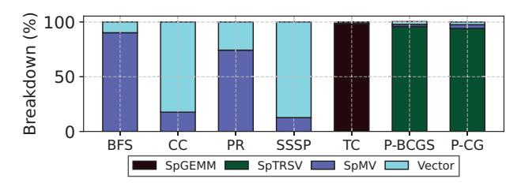
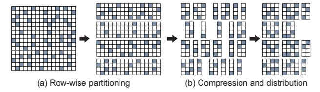
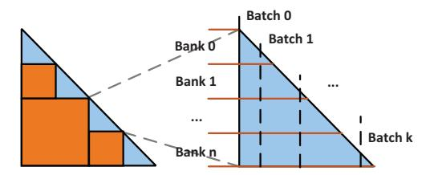
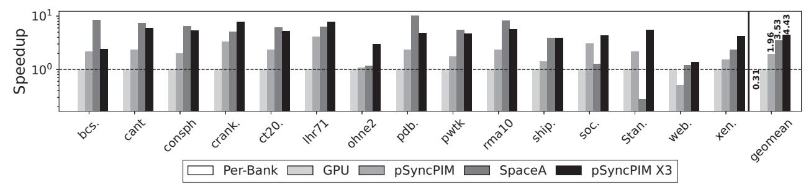
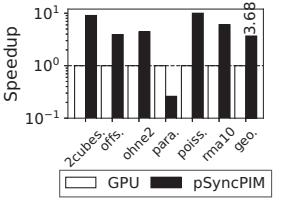
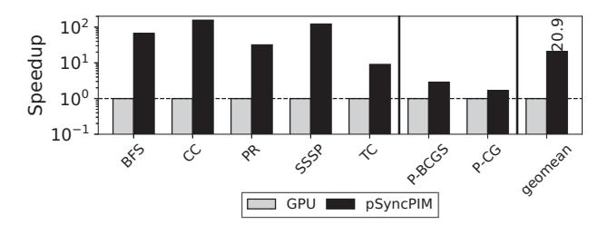
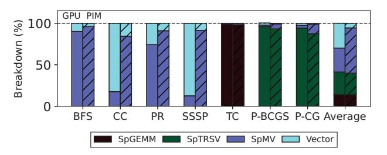
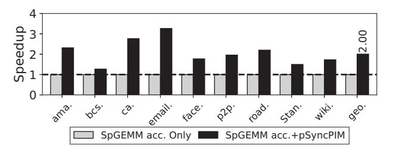
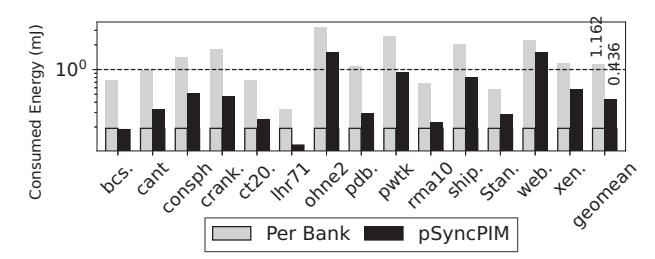

# pSyncPIM: Partially Synchronous Execution of Sparse Matrix Operations for All-Bank PIM Architectures

Daehyeon Baek<sup>†\*</sup>, Soojin Hwang<sup>‡</sup>, Jaehyuk Huh<sup>‡</sup>

<sup>†</sup>Technology Research, Samsung SDS, Seoul, Korea

<sup>‡</sup>School of Computing, KAIST, Daejeon, Korea
dh04.baek@samsung.com, sjhwang@casys.kaist.ac.kr, jhhuh@kaist.ac.kr

Abstract—Recent commercial incarnations of processing-inmemory (PIM) maintain the standard DRAM interface and employ the all-bank mode execution to maximize bank-level memory bandwidth. Such a synchronized all-bank PIM control can effectively manage conventional dense matrix-vector operations on evenly distributed matrices across banks with lock-step execution. Sparse matrix processing is another critical computation that can significantly benefit from the PIM architecture, but the current all-bank PIM control cannot support diverging executions due to the random sparsity. To accelerate such sparse matrix applications, this paper proposes a partially synchronous execution on sparse matrix-vector multiplication (SpMV) and sparse triangular matrix-vector solve (SpTRSV), filling the gap between the practical constraint of PIM and the irregular nature of sparse computation. It allows the execution of the processing unit of each bank to diverge in a limited way to manage the irregular execution path of sparse matrix computation. It proposes compaction and distribution policies for the input matrix and vector. In addition to SpMV, this paper identifies SpTRSV is another key kernel, and proposes SpTRSV acceleration on PIM technology. The experimental evaluation shows that the new sparse PIM architecture outperforms NVIDIA Geforce RTX 3080 GPU by 4.43× speedup for SpMV and  $3.53\times$  speedup for SpTRSV with a similar amount of DRAM

*Index Terms*—processing-in-memory, sparse matrix, memory bandwidth, predicated execution.

#### I. INTRODUCTION

Despite rapidly increasing GPU computation capability to the PFLOPS scale, the improvement in memory bandwidth has been lagging behind [3]. This disparity between memory bandwidth and computation capability poses a significant challenge for high-performance computing problems and graph applications that use memory-intensive kernels, such as matrix-vector multiplication and triangular matrix-vector solve. To address this memory bandwidth problem, processing-in-memory (PIM) has emerged as an alternative solution, using the internal bank-level bandwidth of DRAM by attaching processing elements directly to each bank.

Following many research investigations on the potential of PIM technology, DRAM manufacturers recently released PIM products to address such demands on memory bandwidth [23], [24]. Samsung Electronics has announced HBM2-based HBM-PIM [24], and SK Hynix has released GDDR6-AiM PIM [23]

\*This work was done at KAIST while Daehyeon Baek was a PhD student.

based on GDDR6. The commercial incarnations of PIM maintain the standard JEDEC interfaces to control DRAM while adding compute units. With the standard interface, the current HBM or GDDR-based GPU or accelerators can readily use these new PIM technologies. However, the commercial PIM architectures support only dense BLAS (Basic Linear Algebra Subprograms) operations, with its synchronous allbank controls of many banks in DRAM.

Sparse matrix operations are critical computations that can significantly benefit from the internal bandwidth of PIM, and several PIM-based designs have been proposed in academia to support such operations. They assume a standalone PIM without considering the external interface. Thus, each processing unit attached to its memory bank works independently by the internal memory controllers in the logic layer. SpaceA is a sparse matrix-vector multiplication accelerator (SpMV) based on HMC (Hybrid Memory Cube), in which each processing unit performs SpMV computation independently [47]. Gearbox deploys processing units for each subarray in the bank, enabling higher internal bandwidth [25].

However, there is a significant gap between the commercial implementations and the prior studies. First, unlike per-bank controls from the processing units for the earlier studies [25], [47], the commercial PIM designs [23], [24] use host chip DRAM controllers to execute all banks synchronously by a single command to follow the standard interface while exploiting bank-level memory bandwidth. Second, commercial designs limit the computing element attached to a bank to access only its bank, unlike remote bank accesses allowed in academic studies through on-chip networks on the logic layer. For dense BLAS operations, all-bank controls without remote bank accesses do not cause severe problems as each bank has equally distributed input matrix workloads and executes the same sequence of instructions.

However, the restriction imposed by the commercial designs significantly affects the irregular computation of sparse matrix operations. Sparse matrix-vector operations require diverging executions in each bank due to random sparsity patterns, while the current all-bank PIM cannot manage such divergence in the execution path. The load balancing across banks becomes critical as remote bank accesses are impossible. In addition, the prior sparse matrix-vector accelerators are

missing a crucial operation, such as sparse triangular matrix-vector solve (SpTRSV), commonly used in many applications. The earlier studies proposed several ways to optimize the SpTRSV kernel on GPU with various techniques to reduce data dependency between matrix rows [1], [28], [40], [49]. However, these approaches cannot overcome the fundamental limitations of SpTRSV execution, in which SpTRSV itself has a low arithmetic intensity. Therefore, their approaches are bound to the memory bandwidth, incurring low GPU usages.

To support sparse operations effectively with PIM, this paper proposes a partially synchronous control of banks for all-bank PIM architectures called pSyncPIM to fill the gap between the commercial all-bank PIM and irregular sparse matrix operations. The new partially synchronous control allows the processing units to diverge their execution path in a limited way to maintain the all-bank execution constraint. Reads and writes on rows of all banks are synchronized with the allbank control. However, each processing unit can operate on a different portion of the opened row of its bank. In addition, each processing unit can skip or exit the row computation early if it does not have any element to compute. The partially synchronous execution allows the all-bank PIM to support diverging execution with sparse data. However, the processing units need careful data distribution and compaction if too many divergences occur. Therefore, we propose data compaction and distribution policies to optimize the matrix and vector distribution across banks to maximize the processing unit utilization for random sparsity patterns.

In addition, our design accelerates SpTRSV by effectively utilizing internal memory bandwidth with the all-bank PIM design, which overcomes the memory bandwidth limit of GPU-based work approaches. While the cuSPARSE [30] library uses only the row-reordering technique to batch independent rows in the matrix to process, *pSyncPIM* uses a recursive block algorithm [1] to match the hardware limitation of memory row size, boosting the kernel performance.

We modified DRAMsim3 [27] to support all-bank PIM architectures and added our partially synchronous execution support. The experimental evaluation shows that the new sparse PIM architecture can outperform NVIDIA Geforce RTX 3080 by 443% for SpMV kernels and 353% for SpTRSV kernels with a similar amount of HBM memory bandwidth.

This study is the first one to support irregular execution for sparse matrices with all-bank PIM architectures. The contributions of the paper are as follows:

- We propose a PIM architecture in which each bank is controlled by the same commands in an all-bank synchronized manner. However, the actual execution path of each bank can diverge to process irregular sparse matrix operations.
- With *pSyncPIM*, we propose a sparse matrix workload distribution algorithm to minimize the overhead of SpMV due to the unevenness of the sparse matrix data.
- We propose a PIM acceleration scheme for SpTRSV by adopting a recursive block algorithm [1].

| Name                         | Operation                   |  |  |  |
|------------------------------|-----------------------------|--|--|--|
| Level 1 BLAS                 |                             |  |  |  |
| Swap                         | $x_d \leftrightarrow y_d$   |  |  |  |
| Scale                        | $x_d \leftarrow ax_d$       |  |  |  |
| Сору                         | $y_d \leftarrow x_d$        |  |  |  |
| AXPY                         | $y_d \leftarrow ax_d + y_d$ |  |  |  |
| Dot Product                  | $s \leftarrow x_d^T y_d$    |  |  |  |
| Euclidian Norm               | $s \leftarrow \ x_d\ _2$    |  |  |  |
| Level 1 Sparse B             | LAS                         |  |  |  |
| Gather                       | $x_s \leftarrow y_d$        |  |  |  |
| Scatter                      | $y_d \leftarrow x_s$        |  |  |  |
| Level 2 Sparse BLAS and      | d its variants              |  |  |  |
| SpMV                         | $C \leftarrow Ab$           |  |  |  |
| SpTRSV                       | $x \leftarrow L^{-1}b$      |  |  |  |
| Sp1K3 v                      | $x \leftarrow U^{-1}b$      |  |  |  |
| Level 3 Sparse BLAS variants |                             |  |  |  |
| SpGEMM                       | $C \leftarrow AB$           |  |  |  |

TABLE I: Important operations on graph applications and linear system solvers. x,  $x_d$ ,  $y_d$ , and b are dense vectors. a and s are scalars.  $x_s$  is a sparse vector. A, B, and C are sparse matrices. L is a lower triangular matrix. U is an upper triangular matrix.


Fig. 1: Execution model of HBM-PIM.

#### II. BACKGROUND

#### A. Major Sparse Matrix Kernels in Real-World Applications

The two significant problem spaces of real-world applications that use sparse matrices are graph applications and linear system problems. These applications comprise a small number of matrix and vector operations, as Table I summarizes.

From these operations, graph applications use operations with SpGEMM (Sparse General Matrix Multiplication), SpMV (Sparse Matrix-Vector Multiplication), and BLAS (Basic Linear Algebra Subproblems) level 1 vector operation kernels. On the other hand, many linear system-solving applications use iterative methods over direct Gaussian elimination-based methods to generate approximate solutions to the linear system problem from the sparse matrix for high performance. Many linear system applications, including Conjugate Gradient [19] and its variant [43], use SpMV kernels and element-wise dense vector operations, including scale, copy, AXPY, dot product, and Euclidean norms in iterations. In addition, these iterative methods use approximate sparse lower/upper triangular matrices L and U where  $A \approx LU$ . These methods compute  $\mathbf{x}' = \mathbf{U}^{-1}\mathbf{L}^{-1}\mathbf{x}$  to reduce the number of iterations and faster convergence, where SpTRSV is critical.

## *B. Industrial PIM Products*

Recently, Samsung Electronics has released HBM-PIM chips based on HBM2 technology [24]. The HBM-PIM can utilize the internal bandwidth of 1TB/s, four times the external bandwidth of 256GB/s. In addition, with only 5.4% additional power consumption, HBM-PIM achieves 3.5 to 11.2 times performance improvements over a normal HBM in neural network applications such as DS2, GNMT, and AlexNet. SK Hynix has also released a GDDR6-AiM PIM chip based on GDDR6 technology [23]. Unlike HBM-PIM, GDDR6- AiM can accelerate activation functions not supported by Samsung HBM-PIM by adding several more commands from the existing JEDEC standard. In addition to all bank operations for the paired memory bank, each processing unit in GDDR6- AiM can exchange data with other units through the global buffer added to the AiM controller on the host chip. However, the host coordinates these data exchanges, and each processing unit cannot access remote banks independently. As a result, GDDR6-AiM achieves 1TFLOPS throughput with bfloat16 precision, a 16.64× performance improvement over Intel Xeon Gold 6230 in GPT-3.

These industrial products use synchronized all-bank execution schemes for their operations. In this scheme, the host chip accesses all banks in the channel simultaneously with one memory transaction by sharing the memory command, row, and column numbers across all banks. For example, HBM-PIM uses a mode-switching technique to interoperate between normal HBM and all-bank PIM execution, as shown in Figure 1. At first, HBM-PIM operates in single-bank mode (SB), which is the same as a normal HBM, to manage memory requests from the host. For PIM execution, the DRAM controller enters a sequence of memory commands to switch the HBM-PIM to all-bank mode (AB). In this mode, the host chip can program PIM kernels into processing units in parallel. After inserting the PIM kernel instructions, the host sends another memory command sequence to switch HBM-PIM from AB mode to all-bank PIM mode (AB-PIM). In this mode, every memory transaction in a memory channel executes the programmed PIM kernels in parallel. After the kernel execution finishes, the host sends memory command sequences to HBM-PIM to switch AB-PIM mode to SB mode.

These approaches reduce the burden of changing the DRAM controller design as the host chip manufacturers can apply the PIM technologies without changing or with minor changes in the existing JEDEC standard. However, these approaches target memory-intensive neural network applications, which support only dense matrix and vector operations. While this approach is practical for these applications, the synchronous execution model cannot fit in irregular sparse matrix workloads due to a diverging control for each bank.

## *C. PIM-based Sparse Matrix Kernel Accelerators*

Unlike the industrial approach, several studies suggest standalone PIM accelerators [25], [47], in which each processing unit operates freely without synchronizing and receiving memory commands from host chips. In this manner, each processing unit can read and write in different timing and memory rows in each bank. This scheme has a substantial advantage for accelerating sparse tensor kernels because of the uneven distribution of sparse tensors and the computations each unit has to process.

SpaceA [47] is a SpMV PIM accelerator, where each processing unit paired with a memory bank can send outstanding memory requests to non-local memory banks, integrating Content Addressable Memory (CAM) at the bank level to exploit data reuse of input vectors. From the software perspective, it suggests a sparse matrix partition and mapping scheme to distribute a sparse matrix to each bank to balance workloads. SpaceA achieves 13.54× speedup and 87.49% energy reduction on average over NVIDIA TITAN Xp from these techniques.

Gearbox [25] is another standalone PIM study that exploits subarray-level parallelism inside each memory bank. It reduces remote accumulation between banks, which is required in parallel SpMV execution by introducing a dispatching mechanism. In addition, it suggests a partitioning mechanism to replace and reduce remote reads. With these techniques, a single Gearbox package achieves up to a 15.73× performance boost over an NVIDIA P100 GPU with 3 HBM2 memory.

## *D. Limitations of the Previous Work*

These standalone 3D stacked DRAM-based studies propose designs where each processing unit performs its read/write memory accesses to each memory bank without memory command synchronization. While asynchronous PIM execution is an optimized method for executing the sparse tensor kernels, this method requires significant changes in the interface between the host and DRAM chips. In the current DRAM interface, the host CPU or GPU has memory controllers that send requests to memory banks. However, the standalone PIM studies assume the memory controllers integrated into the logic die of each PIM, and it is only possible to build the standalone PIM with a complete change of the interface between the host and DRAM [24]. As CPU and GPU manufacturers may not be eager to change the memory interface to delegate their computation capability to DRAM in the current fragmented industrial environments, the chance of completely changing the DRAM interface just for PIM would be very low. The prior work [47] assumes the HMC (Hybrid Memory Cube) organization, which DRAM manufacturer no longer pursues for the same hurdle.

In summary, our research aims not to change the JEDEC interface standard to facilitate deployment on various host chips with standard HBM2 DRAM controllers, but to apply the sparse matrix operations to the synchronized execution model.

## *E. SpGEMM Accelerators*

The acceleration of sparse general matrix-matrix multiplication (SpGEMM) has been studied with a separate accelerator, as GEMM can exploit the possible locality in matrix-matrix multiplication. Outer product-based approaches use performance benefits from one-time memory reads and sequential

| Application                                        | Abbreviation | Type          |
|----------------------------------------------------|--------------|---------------|
| Breadth-First Search                               | BFS          | Graphs        |
| Connected Components                               | CC           | Graphs        |
| PageRank                                           | PR           | Graphs        |
| Single-Source Shortest Path                        | SSSP         | Graphs        |
| Triangle Count                                     | TC           | Graphs        |
| Preconditioned Biconjugated<br>Gradient Stabilized | P-BCGS       | Linear System |
| Preconditioned Conjugate<br>Gradient               | P-CG         | Linear System |

TABLE II: Specification of sparse tensor benchmarks.



Fig. 2: Breakdown of the execution time of sparse matrix applications.

memory access patterns for SpGEMM calculation [32], [51]. On the other hand, other SpGEMM accelerators [4], [38] propose row-wise inner products for the memory usage efficiency over outer-product accelerators.

However, unlike SpGEMM, SpMV and SpTRSV require only one multiplication and addition per input non-zero element in the sparse matrix, and element-wise operations also have a fixed number of operations per element. Therefore, this paper focuses on the streaming memory-intensive kernels: SpMV, SpTRSV, and element-wise (sparse) vector operations on processing-in-memory acceleration. The host processor handles *matrix and vector allocations, tuple extractions, transposes, preprocessing steps, and SpGEMM executions* in graph applications and linear systems.

# III. MOTIVATION

## *A. Application Decomposition*

Many hardware accelerator studies have proposed various ways to improve generalized matrix-matrix multiplication (GEMM) and generalized matrix-vector multiplication (GEMV), as well as the sparse versions of those kernels (i.e., SpGEMM and SpMV). In this paper, instead of arbitrarily choosing the operations to accelerate, we first analyze realworld applications to identify the criticality of different operations (i.e., kernels) in Table I.

Table II introduces seven selected real-world sparse applications, five graphs, and two linear system problems. Figure 2 shows the execution time breakdown for these real-world benchmarks with sparse matrices in Table IX, running on NVIDIA Geforce RTX 3080 GPU. The figure breaks down the execution time into the execution time of four kernels: SpGEMM, SpTRSV, SpMV, and Level 1 BLAS operations denoted as Vector. We measure the execution time of each kernel with CUDA Runtime 11.8 [31] via NVIDIA Nsight


Fig. 3: Number of memory commands required for SpMV kernel execution with PIM, normalized to the all-bank mode.

Compute 2023.2.2. Note that our measurement excludes the pre-processing and post-processing time.

Figure 2 shows that all four kinds of kernels could be a significant bottleneck in GPU execution, including operations on simple sparse and dense vectors. For Breadth-First Search (BFS) and PageRank (PR) cases, SpMV occupies over 70% of the total execution time on average. However, for Connected Components (CC) and Single Source Shortest Path (SSSP), vector operations are the primary bottleneck. These vector operations include element-wise arithmetic operations and iterative accumulation to a scalar. For Triangle Count (TC), SpGEMM occupies over 98% of the total execution time. Lastly, in linear system solving algorithms, P-BCGS (Preconditioned Biconjugate Gradient Stabilized) and P-CG (Preconditioned Conjugate Gradient), SpTRSV is an essential operation. Therefore, it is necessary to support various sparse tensor kernels in hardware for the acceleration of the entire applications.

## *B. Challenges in Implementing Sparse Tensor Kernels on All-Bank PIM Architecture*

As an alternative control mechanism compared to the allbank (AB) mode, it is possible to make the host-PIM interface compatible with the JEDEC standard, by controlling only one bank in a channel at a time for PIM execution. For the rest of the paper, we call this execution method the perbank (PB) mode. Unlike the AB mode execution, the host memory controller must send DRAM commands to control each bank individually in per-bank execution. The DRAM commands include conventional DRAM control commands and PIM execution control ones.

To compare the computation efficiency between per-bank and all-bank modes, we count the number of memory commands of each mode by running several SpMV kernels with the simulator of Section VII-A. In the PB mode, the host controls only one bank at a time even for PIM kernel execution. Figure 3 shows the number of memory commands required to execute each SpMV kernel in each PIM mode, normalized to the all-bank mode. With the per-bank mode execution, the number of memory commands increases by 2.74× on average compared to the all-bank mode. As DRAM chips can handle only two memory commands per clock per channel, overflowing memory commands could result in a performance

## Algorithm 1 SpTRSV algorithm.

```
1: M: n \times n lower triangular matrix in COO format

2: b: input vector

3: x: output vector

4: for i=0 to n-1 do

5: s=0

6: for all e=(i,c_e,v_e)\in M where c_e < i do

7: s+=v_e \times \boldsymbol{x}[\boldsymbol{c}_e]

8: end for

9: l:=(i,i,v_l)\in M

10: \boldsymbol{x}[i]=(b[i]-s)/v_l

11: end for
```

bottleneck. Therefore, this study aims to support sparse tensor kernels for the synchronized all-bank mode execution.

The conventional synchronized all-bank execution scheme assumes all banks in a channel have the same workloads to process. However, this condition is not satisfied in sparse tensor kernels. As the nonzero elements are distributed unevenly in sparse tensors for real-world applications, each bank's data would not provide equivalent computation in sparse kernels. In addition, to avoid wasting memory capacity, sparse tensors are usually compressed in specialized sparse formats that only store the nonzero elements with their metadata (i.e., encoded data for the position of nonzero elements). This compression requires indirect memory accesses and dynamic execution paths for sparse kernels, which becomes necessary to allow each bank to access different memory rows and columns. Still, the current all-bank scheme does not allow this mechanism, requiring all banks to access the same memory row and column. Therefore, the host processor cannot know each bank's exact state for sparse tensor kernel PIM execution, including the number of elements remaining and the status of registers.

## C. Additional Challenges on SpTRSV

SpTRSV is a crucial kernel of several iterative methods on linear system solvers, used as a preconditioning technique to reduce the number of iterations to convergence significantly [29], [35]. Algorithm 1 describes the general algorithm of SpTRSV. While various applications use linear system-solving algorithms, including electromagnetics [41], [42], computational fluid dynamics [5], [16], [46], and circuit simulations [14], the SpTRSV kernel has not been studied for hardware acceleration due to its limited parallelism. As shown in Algorithm 1, lines 7 and 10, it is required to execute previous rows to compute the next row. Due to the dependency between rows, parallelizing all rows in the triangle matrix for SpTRSV computation is challenging. In addition, line 10 contains a division operation for row computation. Since the division operation requires tens of cycles [9] and additional divisor logic, supporting division operation in PIM is challenging. Therefore, overcoming the data dependency and removing the division operation from the computation step for SpTRSV acceleration is necessary.

| Kernels | Description                                                                                                   | Vector Operations    |
|---------|---------------------------------------------------------------------------------------------------------------|----------------------|
| DSWAP   | $x_d \leftrightarrow y_d$                                                                                     | DMOV                 |
| DSCAL   | $x_d \leftarrow \alpha x_d$                                                                                   | DMOV, SDV            |
| DCOPY   | $y_d \leftarrow x_d$                                                                                          | DMOV                 |
| DAXPY   | $y_d \leftarrow \alpha x_d + y_d$                                                                             | DMOV, SDV, DVDV      |
| SpAXPY  | $y_d \leftarrow \alpha x_{sp} + y_d$                                                                          | SpMOV, SSpV, SpVDV   |
| DDOT    | $s \leftarrow x_d^T y_d$                                                                                      | DMOV, DVDV, Reduce   |
| SpDOT   | $s \leftarrow x_d^T y_d \\ s \leftarrow x_{sp}^T y_d$                                                         | SpMOV, SpVDV, Reduce |
| DNRM2   | $s \leftarrow   x_d  _2$                                                                                      | DMOV, DVDV, Reduce   |
| GATHER  | $x_{sp} \leftarrow y_d$                                                                                       | GthSct, SpMOV        |
| SCATTER | $y_d \leftarrow x_{sp}$                                                                                       | GthSct, SpMOV        |
| DGEMV   | $y_d \leftarrow A_d x_d$                                                                                      | DMOV, SDV, DVDV      |
| SpMV    | $y_d \leftarrow A_{sp}x_d$                                                                                    | IndMOV, SSpV, SpVDV  |
| DTRSV   | $x_{d} \leftarrow L_{d}^{-1} x_{d}, U_{d}^{-1} x_{d}$ $x_{d} \leftarrow L_{sp}^{-1} x_{d}, U_{sp}^{-1} x_{d}$ | DMOV, SDV, DVDV      |
| SpTRSV  | $x_d \leftarrow L_{sp}^{-1} x_d, U_{sp}^{-1} x_d$                                                             | IndMOV, SSpV, SpVDV  |

TABLE III: Supported BLAS and Sparse-BLAS Level 1 and 2 kernels. The third column indicates vector operation instructions in Table V and  $\,$  VI. We omit some instructions due to the table space limit.

## IV. CONDITIONAL EXECUTION WITH ALL-BANK PIM

#### A. Design Goals

This study aims to design *pSyncPIM*, a PIM architecture that accelerates widely used dense and sparse tensor kernels while maintaining the DRAM interface with the host accelerator that handles general compute-intensive or complex kernels. In addition, this study proposes low-cost hardware mappings of two fundamental Sparse BLAS Level 2 kernels, SpMV and SpTRSV, which are the most complex kernels it aims to map. In addition, *pSyncPIM* does not deviate significantly from the existing JEDEC standard, thereby maintaining its primary function as a memory. To this end, our design achieves the following design goals:

- A flexible instruction set architecture (ISA) that can support various kernels used in multiple applications.
- A PIM architecture in which each processing unit supports predicated execution of the same PIM commands in a lock-step manner to deal with unevenly distributed sparse matrix and sparse vector workloads. In addition, each unit terminates on its own whenever the host chip sends a PIM command.
- An optimization technique that distributes the sparse matrix evenly across multiple banks to reduce remote accumulation across banks in the SpMV kernel.
- The first proposal of *SpTRSV PIM acceleration* with a memory mapping scheme on a sparse triangular matrix on each memory bank.

**Application Scope:** This study focuses on high-performance computing applications with highly sparse tensors (i.e., less than 1% density) [17]. Supported BLAS and Sparse BLAS Level 1 and 2 functions are listed in TABLE III. In TABLE III,  $s, \alpha$  are scalar values,  $x_d, y_d$  are dense vectors,  $x_{sp}$  is a sparse vector,  $A_d$  is a dense matrix,  $A_{sp}$  is a sparse matrix,  $L_d, U_d$  are dense lower/upper triangular matrices, and  $L_{sp}, U_{sp}$  are sparse lower/upper triangular matrices. Since this study aims to accelerate memory-intensive kernels to exploit PIM's high


Fig. 4: Architecture of a *pSyncPIM* processing unit for each bank. RF is a register file, and Q is a queue.

internal bandwidth, it excludes compute-intensive BLAS and Sparse BLAS functions from the PIM kernel implementation.

## B. Overview

Figure 4 shows the architecture of the processing unit of pSyncPIM. To utilize the total internal memory bandwidth, we attach a processing unit to a memory bank, which differs from the 2:1 ratio of bank and processing unit in Samsung HBM-PIM [24]. In addition, our approach assumes all memory commands are issued in the right order in the all-bank mode, which requires disabling out-of-order command issues from DRAM controllers. Each processing unit consists of a 128B control register that stores 32 PIM instructions, a 16B scalar register, 3× 32B dense vector registers, and 3× 192B sparse vector queues. A sparse vector queue includes 3× 64B subqueues to store the row index, column index, and values of matrix/vector elements. When reading data from a bank to a sparse vector queue or writing data from a sparse vector queue to the bank, the data is pushed or popped from one of the three sub-queues with 32B consecutive arrays except Gather/Scatter instructions. The Gather/Scatter instructions use all three sub-queues for push and pop. However, multiple successive elements with (row, col, value) pairs are popped from/pushed into the sparse vector queue for SIMD vector operation.

For computation, the processing unit has a 256-bit vector ALU (VALU) to support multiple precisions from 8-bit to 64-bit. An index calculator is inserted before VALU to avoid unnecessary operations between the zero-value of the sparse vector. For the union computation case, if only one side of the vector has non-zero, the processing unit skips the binary operation. Then, it copies the non-zero element of the existing one. If the index of non-zero elements matches, then VALUs compute the binary operation. For intersection, the index comparator uses the skip mechanism from the prior work [17] in the intersection computation case and computes only indexmatching elements.

| Bina                                | ry O | perati | on  | Form | at (B Fo | rmat) |    |       |      |     |    |      | _ |       |   |
|-------------------------------------|------|--------|-----|------|----------|-------|----|-------|------|-----|----|------|---|-------|---|
| OpC                                 | ode  | Dst    |     | Src0 | Src1     | Value |    | Binar | y S  | le  | dx | Idnt | U | nused |   |
| 31                                  | 28   | 27 2   | 5 2 | 4 22 | 21 19    | 18    | 15 | 14    | 11 1 | 0 9 | 8  | 7 6  | 5 |       | 0 |
| Control Operation Format (C Format) |      |        |     |      |          |       |    |       |      |     |    |      |   |       |   |
| OpCode Unused Imm0 Order Imm1       |      |        |     |      |          |       |    |       |      |     |    |      |   |       |   |
| 31                                  | 28   | 27     | 24  | 23   |          | 16    | 15 |       | 10   | 9   |    |      |   |       | 0 |

Fig. 5: Two general formats of instruction set architecture.

| Field      | Description                                             |
|------------|---------------------------------------------------------|
| OpCode     | Determines the instruction to execute.                  |
| Dst        | Destination register or queue.                          |
| Src0, Src1 | Source register or queue.                               |
| Value      | Value data format.                                      |
| Binary     | Binary operation between two elements.                  |
| S          | Intersection or union operation between vectors.        |
| Idx        | Sparse vector queue's row, column, or value sub-queues. |
| Idnt       | Identity element used in gather/scatter operations.     |
| Imm0       | Jump target.                                            |
| Order      | Loop order, used for distinguishing multiple loops.     |
| Imm1       | Counter for the number of jumps.                        |
| Unused     | Unused.                                                 |

TABLE IV: Description of fields in the instruction format.

#### C. Matrix Format

pSyncPIM uses the Coordinate List (COO) format for implementation, which is the best choice for the current target (i.e., HPC) workloads compared to other existing formats. For example, the bitmap format widely used for sparse neural networks [13], [33], [44] is inefficient for highly sparse matrices with a density under 1% [20]. Compressed row/column (CSR/CSC) formats, on the other hand, incur additional memory indirection with their metadata access, which requires extra work to maintain not to make any remote bank access.

However, *pSyncPIM* can support other sparse matrix formats with minor modifications and additions in its architecture, as the difference is only on the index matching mechanism. For example, to support CSR/CSC and their variants, only four 32-bit index registers and a 32-bit integer adder for their metadata must be added to *pSyncPIM*. Supporting multiple sparse matrix formats in a single PIM design is also feasible with minor hardware overheads. We expect that supporting two formats, one for high-sparsity applications and the other for low-sparsity applications (i.e., COO/CSR/CSC and bitmap), would be reasonable, considering the benefits and complexity.

## D. pSyncPIM Instructions

**Instruction Set Architecture:** Figure 5 shows the two general formats of the instruction set architecture: binary operation format (B format) and control operation format (C format), 4 bytes long each. *pSyncPIM* supports 15 instructions: five data movement instructions, six binary operations, and four control instructions. Control instructions use C format, and data movement and binary operation instructions use B format. Control instructions include NOP, JUMP, EXIT, and newly added CEXIT (Conditional Exit). Table IV further describes each field of the instruction format.

**Conditional Exit:** When running sparse tensor kernels that accompany uneven distributions of computations, all processing units in PIM cannot process their computation workloads at the

## Algorithm 2 Workflow of SpMV in pSyncPIM.

- 1: Read row, column, values SpVQ0←Bank
- 2: **loop**
- 3: IndMOV scalar SRF←Bank with SpVQ0 col idx
- 4: SSpV SpVQ1←SRF⊗SpVQ0 (Vector multiply)
- 5: SpVDV DRF0←SpVQ0⊕Bank (Vector accumulate)
- 6: Write vector DRF0→Bank
- 7: Read row, column, values SpVQ0←Bank
- 8: Conditional exit when SpVQ1 is empty
- 9: **end loop**

same time. Therefore, in this study, we introduce a new CEXIT (Conditional Exit) command in addition to the existing EXIT command. Through this, each processing unit runs an infinite loop in the PIM kernel, and its execution terminates when the sparse vector queues indicated by the CEXIT command are empty, as shown in Algorithm 2. In this way, the units will end the infinite loop in different timestamps, which depend on the workload size of each unit. Even after the execution terminates, each processing unit will still activate, access, and precharge the memory rows by host memory commands. However, the processing units do not change the actual data. Since processing units can terminate independently, the host chip must identify whether all banks in a memory channel complete kernel execution.

Other Instructions: pSyncPIM supports data movement instructions between the memory bank, dense vector registers, the scalar register, and sparse vector queues with several new data movement schemes. Table V summarizes the memory movement instructions. pSyncPIM defines several fundamental scalar, dense, and sparse vector instructions for computation, as shown in Table VI. Note that s is scalar,  $v_d$  is a dense vector, and  $v_{sp}$  is a sparse vector. After closely analyzing subroutines composed of frameworks commonly used in HPC areas - BLAS, Sparse BLAS Level 1, 2, and GraphBLAS - we found that using the instructions in Table VI is sufficient for implementing most memory-intensive sparse tensor kernels.

## E. Predicated Execution

While executing the infinite loop for sparse tensor computation, there is no guarantee that the sparse vector queues in a processing unit have the same amount of non-zero elements for each bank. For example, when the host sends a load instruction to a sparse vector queue, some units have 32B room to load, while others do not. In this case, units capable of pushing 32B data to the queue execute the load instruction. When the sparse vector becomes input or output, each processing unit executes predicated instructions in a lock-step manner, depending on its state. Therefore, multiple units run the same memory command simultaneously, but their actual behavior depends on their status, ensuring the correctness of the sparse tensor kernels.

## F. Support for Nested-Loop Capability

As we expand the computing capability from dense to sparse tensor kernels, nested loops inside PIM become necessary.

| Name   | Operation                                              |
|--------|--------------------------------------------------------|
| DMOV   | Move dense vector from/to bank/DRF.                    |
| IndMOV | Read the scalar from the memory bank that SpVQ points. |
| SpMOV  | Move scalar vector from/to bank/SpVQ.                  |
| SpFW   | Force write sparse vectors to the bank.                |
| GthSct | Transform between dense and sparse vectors.            |

TABLE V: Data movement instructions.

| Name   | Description                    | Operation                                  |
|--------|--------------------------------|--------------------------------------------|
| SDV    | scalar - dense vector op.      | $s \odot v_d \rightarrow v_d$              |
| SSpV   | scalar - sparse vector op.     | $s \odot v_{sp} \rightarrow v_{sp}$        |
| Reduce | iterated binary op.            | $\bigcirc v_d \to s$                       |
| DVDV   | element-wise dense vector op.  | $v_d \odot v_d \rightarrow v_d$            |
| SpVDV  | dense-sparse vector op.        | $v_{sp} \odot v_d \rightarrow v_d, v_{sp}$ |
| SpVSpV | element-wise sparse vector op. | $v_{sp} \odot v_{sp} \rightarrow v_{sp}$   |

TABLE VI: Vector operation instructions.  $\odot$  is an arbitrary binary operation.

Therefore, we add 5 bits of ORDER field inside the JUMP instruction to differentiate multiple JUMP operations from each other to separate loop counts. Each processing unit has multiple loop counters to track the number of each iteration of the JUMP instruction. As it is possible to put at most 32 instructions, 32 loop counters are sufficient for monitoring each JUMP instruction.

#### V. ACCELERATING SPMV KERNEL

pSyncPIM handles remote accumulation using conventional host chip DRAM accesses. In our architecture, the sparse matrix is cut into several submatrices in rows and columns and distributed to each bank. Suppose the input or output vector memory space spans multiple rows in a memory bank. In that case, the host chip must send multiple memory commands to access all memory rows for random accessing vectors. From that, the success rate of fetching the input and writing the output decreases as the number of rows in memory banks reserved for the input and output vector increases. Therefore, the dimension of submatrices should not overflow the size of one memory row in the division process. With the restriction of remote bank accesses, pSyncPIM divides the sparse matrix into very small submatrices with a size of 1 KB on matrix row and column dimensions.

Since the size of one memory row of the underlying HBM2 chip is 1KB, the maximum length of each input and output vector of each submatrix cannot exceed 1KB. From this basis, choosing the proper value format becomes critical to pack as many elements as possible within the memory row. By decreasing the size of values, the dimension of each submatrix mapped in a memory bank increases. With larger submatrices in rows and columns, the number of partitions decreases, with a reduction of the external traffic. Considering the gap between external and internal bandwidth (256GB/s and 2TB/s) in our architecture, reducing external traffic is critical for performance.

Matrix Compression: When submatrices are distributed naively into each memory bank, the required external memory traffic increases for replicating input vectors and accumulating



Fig. 6: Matrix compression for bank-parallel SpMV execution.

partial results. Copying inputs and adding partial outputs uses slower external I/O than internal I/O, which is the major bottleneck of SpMV computation. Therefore, to reduce these external memory I/O, we introduced a matrix compression technique to reduce the external I/O traffic. Figure 6 presents the matrix compression technique. The sparse matrix is cut row-wise first, and all-zero columns are removed for each partial matrix. Then, each row-wise partial matrix is distributed to memory banks in the reduced state. After finishing the computation for each memory bank, the host chip accumulates only non-zero outputs to reduce the external memory reads.

Conditional Exit Detection: Due to the nature of the sparse matrix, the number of non-zeros for each bank differs. While some banks consume more memory rows than others, the empty spaces of the index arrays are filled with -1. When a -1 value is in the index queue, the processing unit sets flags for the CEXIT command. With this technique, it becomes possible to allocate the same number of memory rows for the sparse matrix for each bank while maintaining the partially synchronized execution model.

## VI. ACCELERATING SPTRSV KERNEL

## A. Adopting SpTRSV Block Algorithm

In *pSyncPIM*, we adapt the state-of-art algorithm for Sp-TRSV [1] to PIM acceleration. The algorithm divides the sparse triangular matrix  $\bf L$  into two sub-sparse triangular matrices,  $\bf L_0$  and  $\bf L_1$ , and a sparse square matrix  $\bf M$  as shown in Equation 1.  $\bf O$  denotes the null matrix.

$$\mathbf{L} = \begin{pmatrix} \mathbf{L_0} & \mathbf{O} \\ \mathbf{M} & \mathbf{L_1} \end{pmatrix} \tag{1}$$

With this splitting mechanism, the divide-and-conquer mechanism can be applied to the linear system  $\mathbf{L}\mathbf{x} = \mathbf{b}$ , as shown in Equation 2.

$$Lx = \begin{pmatrix} L_0 & O \\ M & L_1 \end{pmatrix} \begin{pmatrix} x_0 \\ x_1 \end{pmatrix} = \begin{pmatrix} b_0 \\ b_1 \end{pmatrix} = b \tag{2}$$

Also, Equation 2 is decomposed into two matrix-vector solving equations of Equation 3.

$$L_0 x_0 = b_0, M x_0 + L_1 x_1 = b_1$$
 (3)

Since  $L_0$  and  $L_1$  are also sparse triangular matrices, it is possible to divide these sub-matrices recursively. Thus, the block algorithm executes SpTRSV in three steps:

- 1) Solve upper half part  $L_0x_0 = b_0$  (Recursive SpTRSV)
- 2) Perform  $\mathbf{b_1}' = \mathbf{b_1} \mathbf{M}\mathbf{x_0}$  (SpMV)



Fig. 7: Logical description of unit sparse triangular matrix memory mapping.

# 3) Solve lower half part $L_1x_1 = b_1'$ (Recursive SpTRSV)

This technique makes it possible to solve sparse triangular matrices of arbitrary sizes by implementing a limited-size SpTRSV kernel and a combination of SpMV kernels for most square submatrices inside the triangular matrix.

#### B. Memory Mapping of Sparse Triangular Matrix for SpTRSV

As explained before, we divide the triangular matrices recursively until the size of the generated subtriangular matrices fits in a memory row size to utilize the block algorithm of SpTRSV. When the size of a memory row is 256KB, the maximum number of rows and columns with the double-precision floating-point is 32,768. While square submatrices use SpMV mapping in memory, triangular matrices need a different mapping strategy. For memory mapping of unitriangular matrices, we excluded the diagonals with ones for efficiency. More formally, the memory stores L\*=L-I and U\*=U-I triangular matrices in memory, where I represents the identity matrix. While the physical memory representation omits diagonal elements, our SpTRSV kernel implementation assumes all elements in the diagonal are 1.

Triangular matrices  $L^*$  and  $U^*$  are stored in the column-first COO format in the memory (i.e., non-zero values are sorted in column-major). These triangular matrices are cut into rows evenly for distributing workloads and mapped into each memory bank, as shown in Figure 7. In addition, the triangular matrices are cut into several batches column-wise for each memory row for each bank in the preprocessing step. All non-zeros in each batch across all banks are in the same memory row. Since the distribution of non-zero elements is typically uneven, each batch generally has different numbers of column vectors.

## C. Execution Algorithm of SpTRSV Kernel

While the SpMV kernel can compute most parts of the sparse triangular matrix, a unique SpTRSV subroutine implementation must be provided for triangular submatrices at the diagonal. We apply a scalar multiplication-based algorithm instead of the conventional dot product-based SpTRSV algorithm (Algorithm 1) to avoid random and remote bank accesses on the distributed input vector. Algorithm 3 describes the proposed algorithm.

Within a column-wise batch of Figure 7, our acceleration scheme divides the batch into several levels where all columns are independent. For each column, pSyncPIM performs the following execution loop:

Algorithm 3 Scalar multiplication-based SpTRSV for a lower unitriangular matrix.

```
1: L: n \times n lower triangular matrix in COO format

2: b: input vector

3: x: output vector

4: for i=0 to n-1 do

5: scale=b[i]

6: for all e=(r_e,i,v_e)\in L where r_e>i do

7: x[r_e]=x[r_e]-scale\times v_e

8: end for

9: end for
```

| Field                       | Value                        |
|-----------------------------|------------------------------|
| Protocol                    | HBM2                         |
| # of bankgroups             | 4                            |
| # of banks per group        | 4                            |
| # of memory rows            | 16384                        |
| # of memory columns         | 64                           |
| # of stacks                 | 8                            |
| # of pseudo-channels        | 16                           |
| Address Mapping             | rorabgbachco (rank is 0 bit) |
| Clock Frequency             | 1GHz                         |
| Timing parameters           | HBM2 default timing          |
| External/Internal Bandwidth | 256GB/s, 2TB/s               |
| Capacity                    | 4GB                          |

TABLE VII: Memory configuration of pSyncPIM.

- 1) Read the input vector elements corresponding to the columns of the level in SB mode.
- Switch to AB mode and broadcast the input elements for each bank.
- 3) Host programs the SpTRSV kernel into pSyncPIM.
- 4) Switch to AB-PIM mode.
- 5) Perform kernel execution for all banks. The kernel executes the lines 6-8 of the Algorithm 3.
- When kernel execution terminates, switch to SB mode for the next level and repeat this process for all batches.

## D. Host-side Preprocessing

Decoupling Division Operations from SpTRSV: The conventional implementations for SpTRSV include division operations on its critical path, where these implementations do not assume all elements in diagonal are not normalized to 1. As executing the division is costly, this study uses incomplete LDU decomposition (ILDU), where the decomposition normalizes the diagonal elements of the sparse unitriangular upper matrix U and generates a diagonal matrix D. The ILDU process stores the diagonal matrix D as  $D^{-1}$  in memory for optimal computation.

**Row Reordering:** For a faster execution of SpTRSV, reducing the number of levels and maximizing the number of rows in a level to process is necessary for *pSyncPIM*. Since it is hard to implement such reordering of rows in PIM architecture, for optimal execution, the host processor should reorder rows to execute multiple independent rows in parallel at the preprocessing step.

| Field                  | Value                                  |
|------------------------|----------------------------------------|
| Datapath Width         | 32B                                    |
| # of ALUs              | INT8: 32, INT16/FP16: 16,              |
|                        | INT32/FP32: 8, INT64/FP64: 4           |
| Clock Frequency        | 250 MHz                                |
| Throughput             | INT8/16/32/64: 25.6/12.8/6.4/3.2 GIOPS |
|                        | FP16/32/64: 12.8/6.4/3.2 GFLOPS        |
| Instruction Registers  | 4B × 32                                |
| Scalar register        | 16B                                    |
| Dense vector registers | 32B × 3                                |
| Sparse vector queues   | 192B × 3                               |

TABLE VIII: Specification of a processing unit per bank.

| Matrix                 | Dimen.    | Density               | Applications |
|------------------------|-----------|-----------------------|--------------|
| 2cubes_sphere [42]     | 101,492   | $1.60 \times 10^{-5}$ | SpTRSV, PCG  |
| amazon0312 [26]        | 400,727   | $1.99 \times 10^{-5}$ | Graphs       |
| bcsstk32 [8]           | 44,609    | $1.01 \times 10^{-3}$ | SpMV         |
| ca-CondMat [26]        | 23,133    | $3.49 \times 10^{-4}$ | Graphs       |
| cant [45]              | 62,451    | $1.03 \times 10^{-3}$ | SpMV         |
| consph [45]            | 83,334    | $8.66 \times 10^{-4}$ | SpMV         |
| crankseg_2 [11]        | 63,838    | $3.47 \times 10^{-3}$ | SpMV         |
| ct20stif [12]          | 52,329    | $9.50 \times 10^{-4}$ | SpMV         |
| email-Enron [26]       | 36,692    | $2.73 \times 10^{-4}$ | Graphs       |
| facebook [26]          | 4,039     | $5.41 \times 10^{-3}$ | Graphs       |
| lhr71 [53]             | 70,304    | $3.02 \times 10^{-4}$ | SpMV         |
| offshore [41]          | 259,789   | $6.29 \times 10^{-5}$ | SpTRSV, PCG  |
| ohne2 [37]             | 181,343   | $2.09 \times 10^{-4}$ | SpMV         |
| p2p-Gnutella31 [26]    | 62,586    | $3.62 \times 10^{-5}$ | Graphs       |
| parabolic_fem [46]     | 525,825   | $1.33 \times 10^{-5}$ | SpTRSV, PCG  |
| pdb1HYS [45]           | 36,417    | $3.28 \times 10^{-3}$ | SpMV         |
| poisson3Da [16]        | 13,514    | $1.93 \times 10^{-3}$ | SpTRSV       |
| pwtk [12]              | 217,918   | $2.43 \times 10^{-4}$ | SpMV         |
| rma10 [5]              | 46,835    | $1.06 \times 10^{-3}$ | SpMV, SpTRSV |
| roadNet-CA [26]        | 1,971,281 | $1.42 \times 10^{-6}$ | Graphs       |
| shipsec1 [6]           | 140,874   | $1.80 \times 10^{-4}$ | SpMV         |
| soc-sign-epinions [26] | 131,828   | $4.84 \times 10^{-5}$ | SpMV         |
| Stanford [22]          | 281,903   | $2.90 \times 10^{-5}$ | SpMV, Graphs |
| webbase-1M [45]        | 1,000,005 | $3.11 \times 10^{-6}$ | SpMV         |
| wiki-Vote [26]         | 8,297     | $1.51 \times 10^{-3}$ | Graphs       |
| xenon2 [34]            | 157,464   | $1.56 \times 10^{-4}$ | SpMV         |

TABLE IX: Specification of sparse matrices for evaluation, collected from SuiteSparse and SNAP datasets [7], [26].

## VII. EVALUATION

#### A. Methodology

We modify the DRAMsim3 [27] simulator with HBM2 configuration to evaluate *pSyncPIM*. Table VII describes the DRAM configuration parameters and Table VIII explains the specifications for the processing unit configuration. *pSyncPIM* includes 256 processing units per memory cube. We implement all the kernels evaluated in *pSyncPIM* in hand-coded PIM assembly. In addition to the PIM architecture, we attach a SpGEMM accelerator core that supports nonsquare SpGEMM [4] for assessing interoperability with *pSyncPIM* when evaluating one real-world benchmark (TC) that includes SpGEMM kernels.

We evaluate *pSyncPIM* with various benchmarks using 26 sparse matrices. Table IX summarizes the information about all sparse matrices used for evaluation. Using these matrices, we assess the performance of the SpMV kernel, the SpTRSV kernel, and the end-to-end performance of seven graph and linear system solve applications introduced in Table II. The



Fig. 8: Speedup of pSyncPIM with SpMV kernels, normalized to the GPU performance. The Y-axis is in log-scale.

last column of Table IX maps each matrix to kernels and real-world benchmarks: *Graphs* indicate graph applications, and *SpTRSV* means the matrix is used on the SpTRSV kernel and P-BiCGStab benchmark. The matrices marked as *PCG* are positive definite matrices used in the P-CG application.

We compare *pSyncPIM* with NVIDIA Geforce RTX 3080 GPU using CUDA, cuSPARSE, and GraphBLAST libraries [30], [31], [48]. Note that our experiments do not use NVIDIA tensor cores, as tensor cores support only structural 2:1 sparsity. GPU performance was measured using wall clock time. To match the wall clock time measurements in GPU, the kernel execution time of *pSyncPIM* includes mode switching and PIM kernel programming overheads. However, the initial sparse matrix mapping times are excluded in both cases.

## B. SpMV Kernels

In addition to GPU, we also compare pSyncPIM with a perbank execution model to evaluate our partially synchronized execution model, and with a standalone asynchronous PIM architecture for SpMV - SpaceA [47], to evaluate the execution efficiency of our all-bank architecture. To match the external memory bandwidth with Geforce RTX 3080 GPU (i.e., 760GB/s), we assess the  $3 \times pSyncPIM$  configuration, with a total of 768GB/s external memory bandwidth.

Figure 8 shows the SpMV performance in Geforce RTX 3080 GPU, SpaceA, and pSyncPIM, its per-bank execution, where one memory command can control only one bank in a channel, and a  $3\times$  scenario. On average, pSyncPIM shows a  $1.96\times$  performance boost over GPU, and  $6.26\times$  performance boost over the per-bank execution model. While Figure 3 shows  $2.74\times$  of the number of memory commands on perbank over all-bank, the additional performance gap between per-bank model and pSyncPIM comes from the bank-level parallelism of all-bank PIM execution.

However, pSyncPIM offers only  $0.56\times$  performance of SpaceA. This is due to the inevitable inefficiency of the synchronized lock-step execution model versus standalone desynchronized executing PIM architecture. Although pSyncPIM does not outperform SpaceA in the majority of workloads, it still has its advantage in two points: pSyncPIM does not require any modification of DRAM communication methods between the host and the memory and covers various sparse tensor kernels including SpTRSV by PIM programming features as well as various precisions, which SpaceA does not support.




(a) Lower triangular matrix

(b) Upper triangular matrix

Fig. 9: Speedup of *pSyncPIM* with SpTRSV kernels, normalized to the GPU performance. The Y-axis is in the log scale.

For example, the notable performance gain of *pSyncPIM* with soc-sign-epinions and Stanford comes from the support of multiple precisions in *pSyncPIM*. While SpaceA covers all benchmark matrices into FP64, *pSyncPIM* can run with the original INT8 data format. Smaller data format reduces the sparse matrix's memory size and each submatrix's replication and remote accumulation factor in each processing unit. Note that bcsstk32 shows significant differences in workloads between banks which incurs no benefit from the reduction of data size: The SpMV kernel with bcsstk32 uses only 101 banks out of 256 banks of *pSyncPIM*, which distills the benefits of parallel execution. This underutilization comes from the distribution algorithm, which focuses on reducing replication and remote accumulations rather than ensuring the evenness of workloads for each processing unit.

In  $3\times$  configuration, *pSyncPIM* shows  $2.26\times$  performance boost over  $1\times$  configuration and  $4.43\times$  performance boost over RTX 3080. Note that due to the uneven distribution of each submatrix in a processing unit, the SpMV performance does not scale linearly.

#### C. SpTRSV Kernels

We evaluate the SpTRSV kernel on six double-precision floating point matrices that describe linear system problems. Figure 9 shows the performance boost of *pSyncPIM* over the cuSPARSE implementation on GPU. Note that Figure 9a shows the SpTRSV performance with lower triangular matrices, and Figure 9b shows the result with upper triangular matrices. In general, *pSyncPIM* outperforms the GPU for most cases except parabolic\_fem. Since parabolic\_fem shows hyper-sparsity on near-diagonal unitriangular submatrices, it becomes overhead for executing SpTRSV in *pSyncPIM*. Moreover, parabolic\_fem shows little data dependency


Fig. 10: Throughput of the per-bank PIM and *pSyncPIM* with dense BLAS kernels. The Y-axis is in log-scale.



Fig. 11: Speedup of *pSyncPIM* with real-world applications, normalized to the GPU performance. The Y-axis is in logscale.

between rows, where the GPU can execute more rows that exceed the memory row size boundary of *pSyncPIM* in parallel. However, even including the parabolic\_fem case, *pSyncPIM* still offers a 3.53× performance boost over cuS-PARSE in geometric mean.

## *D. Dense Matrix and Vector Kernels*

We evaluate five dense BLAS kernels for dense matrix/vector operation performance (throughput) in Figure 10. We use INT8 and FP64 precisions to represent the two ends of extreme cases in data types. In both cases, the kernel with a higher arithmetic intensity (INT8) performs better in both *pSyncPIM* and per-bank PIM. Despite the arithmetic intensity of kernels, *pSyncPIM* shows a notable performance boost over per-bank PIM in general – 9.6× speedup on average. This demonstrates that the performance efficiency of all-bank execution is also present in sparse and dense operations.

## *E. Real World Benchmarks with Accelerator-PIM Integration*

Figure 11 shows the performance comparison between GPU and *pSyncPIM* on five graph applications and two linear system solving algorithms. Note that we run graph applications with GraphBLAST library and CUDA library for the evaluation with GPU, respectively. We measure the performance of GPU with graph applications using GPU\_Timer, a wrapper structure provided by GraphBLAST library. We attach the SpGEMM accelerator [4] to pSyncPIM, in order to run SpGEMM kernels included in TC workload. For graph applications, *pSyncPIM* outperforms GPU by 51.6× in geometric mean. For linear system solving algorithms, *pSyncPIM* has 2.2× performance boost over GPU in geometric mean.



Fig. 12: Breakdown of kernel execution time in real-world applications for GPU and *pSyncPIM* (denoted as PIM). Average is an arithmetic mean.



Fig. 13: Speedup of *pSyncPIM* conjugated with SpGEMM accelerator [4] with TC application, normalized to the performance of accelerator-only configuration.

For further investigation, we compare the portion of execution times of kernels between GPU and *pSyncPIM*, as shown in Figure 12. The significant performance advances of CC and SSSP come from large overheads from GraphBLAST vector operation implementation of GPU, which decreases on *pSyncPIM*. *pSyncPIM* outperforms GPU in SpMV-major applications: 66.3× boost on BFS and 31.8× of PR. This performance boost comes from GraphBLAST code's overheads to support various algebraic structures. While GraphBLAST uses C++ templates and functors to execute various binary operations and data types in the GPU kernel, these additional overheads are understandable [48].

*pSyncPIM* also shows a 1.68× to 2.88× performance boost over GPU for SpTRSV-major linear system solve applications. While the kernel inevitably has limited parallelism due to row dependency, utilizing massive internal memory bandwidth is effective on the SpTRSV kernel.

To investigate the role of *pSyncPIM* within a SpGEMMmajor benchmark (i.e., TC), we compare the performance of TC workload between the SpGEMM accelerator-only scenario and accelerator collaborating with *pSyncPIM*. Figure 13 shows the performance comparison between the accelerator-only and accelerator-*pSyncPIM* systems. For the accelerator-only scenario, the SpGEMM accelerator [4] treats the SpMV kernel as a variant of the nonsquare SpGEMM kernel, which is inefficient. However, with *pSyncPIM*, the accelerator can offload SpMV kernels to the PIM, resulting in 2.0× performance boost. In summary, when the host accelerator is unsuitable for the SpMV kernel, the *pSyncPIM* cooperation offers a significant performance boost over a host-chip-only case.



Fig. 14: Energy consumption of per-bank PIM and pSyncPIM.

#### F. Power & Area Analysis

We estimate the power consumption from the data of Samsung HBM-PIM [24] based on the silicon product, including the power consumption of all-bank mode memory accesses. For ALU power consumption, we use [10] with the reports of HBM-PIM [24]. In addition, we assume that the buffer die's 1024-bit data I/O is turned off on PIM execution mode. We run a modified DRAMsim3 power model simulation with these data on several SpMV benchmarks. Figure 14 shows the energy consumption result between per-bank PIM and pSyncPIM. From this result, pSyncPIM shows an average of 2.67× energy efficiency over per-bank PIM for SpMV due to its shorter execution time. In addition, it has at most 5.0W of power consumption with the SpMV benchmarks, which is low enough for the power limit of HBM2.

For area, based on the HBM-PIM data [24], we analyze the processing unit's area size as 0.967  $mm^2$ . With 32 units per die, the processing unit occupies 30.94  $mm^2$ , and the rest, including the memory banks and the TSV, have 38.05  $mm^2$ . In summary, the total area of pSyncPIM becomes 68.99  $mm^2$ . Table X lists area comparisons with the prior work.

#### VIII. DISCUSSION

**Compilation:** We evaluated the benchmarks on *pSyncPIM* with hand-written PIM kernel assembly codes. To reduce the number of stalls from data dependency and ALU execution latency, we reorder and insert pre-loading inputs into the PIM assembly. We expect that additional compilation techniques could further optimize the codes.

**Supporting Neural Networks:** Our main target in this work is the HPC computation where sparse matrices usually have less than 1% non-zero elements. However, sparse neural networks typically show a density of 10% to 50%. In this case, it is better to represent the sparse metadata with a bitmap, considering the footprint [20]. Section IV-C discussed the minor hardware overhead supporting the bitmap format. Since *pSyncPIM* ISA is a superset of commercial PIMs [23], [24], it is possible to support neural network applications that include sparse and dense layers with our ISA. These neural network applications can use *pSyncPIM* directly by using the BLAS kernels, including the operations on Table III or by using ML-specific wrappers (e.g., cuDNN, MIOpen) invoking the BLAS kernels.

|               | Samsung HBM-PIM | SpaceA      | pSyncPIM    |
|---------------|-----------------|-------------|-------------|
| Baseline Tech | HBM             | HMC         | HBM         |
| Total Area    | $84.4mm^2$      | $48mm^2$    | $68.99mm^2$ |
| # of Stacks   | 4 PIM + 4 HBM   | 8 PIM       | 8 PIM       |
| PE Area       | $22.8mm^{2}$    | $2.333mm^2$ | $30.94mm^2$ |
| Capacity      | 6GB             | 8GB         | 4GB         |

TABLE X: Area comparison of prior work and pSyncPIM.

#### IX. RELATED WORKS

PIM Architectures: AESPA proposed computation of all data in a bank row through a single command, to support the asynchronous execution in all-bank PIM architecture for dense GEMV [21]. NeuPIMs proposed overlapped bank accesses for PIM execution and external near-memory accelerators for large language models, by adding a row buffer in all-bank PIM architecture [18]. Other studies investigated the acceleration of graph processing with PIM. Tesseract is an early work that applies a programmable PIM accelerator based on HMC for large-scale graph processing [2]. GraphP and GraphQ improve PIM-based graph processing with communication and data movement enhances [50], [52].

**SpMV Accelerators:** EIE and MASR proposed the acceleration of SpMV in sparse neural network inference [13], [15]. SIGMA accelerates SpMV in sparse neural network training, considering SpMV as a kind of nonsquare SpGEMM [33]. Sadi et al. proposed an accelerator for graph SpMV workloads based on algorithm-hardware co-optimization [36]. Tensaurus accelerates general sparse-dense tensor multiplications including SpMV, by focusing on a sparse data format [39]. Cerberus investigated the design space of SpMV acceleration with respect to different algorithms and data representations, proposing a multi-mode accelerator to process a wide range of SpMV workloads efficiently [20].

#### X. CONCLUSION

This study proposes *pSyncPIM*, which provides partially synchronous execution in each bank for all-bank PIM architectures. For the irregular execution needed for SpMV and SpTRSV operations, pSyncPIM overcomes the current all-bank control constraint, supporting the standard DRAM interfaces by predicated execution and conditional termination of each processing unit. In addition, it identifies another key kernel, SpTRSV, and proposes an acceleration algorithm with PIM. Using an optimized data compaction and distribution, the new sparse PIM architecture can outperform NVIDIA Geforce RTX 3080 by 4.43× for SpMV and 3.53× for SpTRSV with a similar amount of DRAM bandwidth.

#### ACKNOWLEDGEMENT

This work was supported by the Institute of Information & communications Technology Planning & Evaluation (IITP) (IITP2017-0-00466 SW StarLab and RS-2024-00396013), funded by the Ministry of Science and ICT (MSIT), Korea.

#### REFERENCES

 N. Ahmad, B. Yilmaz, and D. Unat, "A Split Execution Model for SpTRSV," *IEEE Transactions on Parallel and Distributed Systems*, vol. 32, no. 11, pp. 2809–2822, 2021.

- [2] J. Ahn, S. Hong, S. Yoo, O. Mutlu, and K. Choi, "A Scalable Processingin-Memory Accelerator for Parallel Graph Processing," in *Proceedings of the 42nd International Symposium on Computer Architecture (ISCA)*, 2015, pp. 105–117.
- [3] M. Andersch, G. Palmer, R. Krashinsky, N. Stam, V. Mehta, G. Brito, and S. Ramaswamy, "NVIDIA Hopper Architecture In-Depth," https: //developer.nvidia.com/blog/nvidia-hopper-architecture-in-depth/.
- [4] D. Baek, S. Hwang, T. Heo, D. Kim, and J. Huh, "InnerSP: A Memory Efficient Sparse Matrix Multiplication Accelerator with Locality-Aware Inner Product Processing," in *2021 30th International Conference on Parallel Architectures and Compilation Techniques (PACT)*, 2021, pp. 116–128.
- [5] S. Bova, "Model of Charleston Harbor."
- [6] C. Damhaug, "Positive definite matrices."
- [7] T. A. Davis and Y. Hu, "The University of Florida Sparse Matrix Collection," *ACM Transactions on Mathematical Software (TOMS)*, vol. 38, no. 1, pp. 1–25, 2011.
- [8] I. Duff, R. Grimes, and J. Lewis., "The original Harwell-Boeing collection." pp. 1–14, 1989.
- [9] A. Fog, "Lists of instruction latencies, throughputs and micro-operation breakdowns for Intel, AMD, and VIA CPUs," https://www.agner.org/ optimize/instruction tables.pdf, 2022.
- [10] S. Galal and M. Horowitz, "Energy-Efficient Floating-Point Unit Design," *IEEE Transactions on Computers*, vol. 60, no. 7, pp. 913–922, 2011.
- [11] N. Gould, Y. Hu, and J. Scott, "Positive definite matrices," ftp://ftp. numerical.rl.ac.uk/pub/matrices/symmetric/.
- [12] R. Grimes, "Structural engineering matrices."
- [13] U. Gupta, B. Reagen, L. Pentecost, M. Donato, T. Tambe, A. M. Rush, G.-Y. Wei, and D. Brooks, "MASR: A Modular Accelerator for Sparse RNNs," in *2019 28th International Conference on Parallel Architectures and Compilation Techniques (PACT)*, 2019, pp. 1–14.
- [14] S. Hamm, "Semiconductor simulation matrices from."
- [15] S. Han, X. Liu, H. Mao, J. Pu, A. Pedram, M. A. Horowitz, and W. J. Dally, "EIE: Efficient Inference Engine on Compressed Deep Neural Network," in *Proceedings of the 43rd International Symposium on Computer Architecture (ISCA)*, 2016, pp. 243–254.
- [16] O. Hededal and S. Krenk, "FEMLAB: a MATLAB toolbox for the finite element method," https://vbn.aau.dk/en/publications/femlab-amatlab-toolbox-for-the-finite-element-method-version-10, 1995.
- [17] K. Hegde, H. Asghari-Moghaddam, M. Pellauer, N. Crago, A. Jaleel, E. Solomonik, J. Emer, and C. W. Fletcher, "ExTensor: An Accelerator for Sparse Tensor Algebra," in *Proceedings of the 52nd Annual IEEE/ACM International Symposium on Microarchitecture (MICRO'52)*, 2019, p. 319–333.
- [18] G. Heo, S. Lee, J. Cho, H. Choi, S. Lee, H. Ham, G. Kim, D. Mahajan, and J. Park, "NeuPIMs: A NPU-PIM Heterogeneous Acceleration for Batched Inference of Large Language Model," in *Proceedings of the 29th ACM International Conference on Architectural Support for Programming Languages and Operating Systems (ASPLOS'24)*, 2024.
- [19] M. R. Hestenes and E. Stiefel, "Methods of conjugate gradients for solving linear systems," *Journal of research of the National Bureau of Standards*, vol. 49, pp. 409–435, 1952. [Online]. Available: https://api.semanticscholar.org/CorpusID:2207234
- [20] S. Hwang, D. Baek, J. Park, and J. Huh, "Cerberus: Triple Mode Acceleration of Sparse Matrix and Vector Multiplication," *ACM Transactions on Architecture and Code Optimization*, 2024, just Accepted.
- [21] H. Kal, C. Yoo, and W. Ro, "Aespa: Asynchronous execution scheme to exploit bank-level parallelism of processing-in-memory," in *56th IEEE/ACM International Symposium on Microarchitecture (MICRO)*, 2023.
- [22] S. Kamvar, "Stanford Web Matrix," http://www.stanford.edu/ ∼sdkamvar/research.html.
- [23] Y. Kwon, K. Vladimir, N. Kim, W. Shin, J. Won, M. Lee, H. Joo, H. Choi, G. Kim, B. An, J. Kim, J. Lee, I. Kim, J. Park, C. Park, Y. Song, B. Yang, H. Lee, S. Kim, D. Kwon, S. Lee, K. Kim, S. Oh, J. Park, G. Hong, D. Ka, K. Hwang, J. Park, K. Kang, J. Kim, J. Jeon, M. Lee, M. Shin, M. Shin, J. Cha, C. Jung, K. Chang, C. Jeong, E. Lim, I. Park, J. Chun, and S. Hynix, "System Architecture and Software Stack for GDDR6-AiM," in *2022 IEEE Hot Chips 34 Symposium (HCS)*, 2022, pp. 1–25.
- [24] S. Lee, S.-h. Kang, J. Lee, H. Kim, E. Lee, S. Seo, H. Yoon, S. Lee, K. Lim, H. Shin, J. Kim, O. Seongil, A. Iyer, D. Wang, K. Sohn, and N. S. Kim, "Hardware Architecture and Software Stack for PIM

- Based on Commercial DRAM Technology : Industrial Product," in *2021 ACM/IEEE 48th Annual International Symposium on Computer Architecture (ISCA)*, 2021, pp. 43–56.
- [25] M. Lenjani, A. Ahmed, M. Stan, and K. Skadron, "Gearbox: A Case for Supporting Accumulation Dispatching and Hybrid Partitioning in PIM-Based Accelerators," in *Proceedings of the 49th Annual International Symposium on Computer Architecture (ISCA'22)*, 2022, p. 218–230.
- [26] J. Leskovec and A. Krevl, "SNAP Datasets: Stanford large network dataset collection," http://snap.stanford.edu/data, Jun. 2014.
- [27] S. Li, Z. Yang, D. Reddy, A. Srivastava, and B. Jacob, "DRAMsim3: A Cycle-Accurate, Thermal-Capable DRAM Simulator," *IEEE Computer Architecture Letters*, vol. 19, no. 2, pp. 106–109, 2020.
- [28] Z. Lu, Y. Niu, and W. Liu, "Efficient block algorithms for parallel sparse triangular solve," in *Proceedings of the 49th International Conference on Parallel Processing*, ser. ICPP '20. New York, NY, USA: Association for Computing Machinery, 2020.
- [29] MATLAB, "Solve system of linear equations preconditioned conjugate gradients method," https://www.mathworks.com/help/matlab/ref/ pcg.html.
- [30] M. Naumov, L. S. Chien, P. Vandermersch, and U. Kapasi, "CUSPARSE Library," https://developer.nvidia.com/cusparse, 2022.
- [31] NVIDIA, "CUDA," https://developer.nvidia.com/cuda-zone.
- [32] S. Pal, J. Beaumont, D.-H. Park, A. Amarnath, S. Feng, C. Chakrabarti, H.-S. Kim, D. Blaauw, T. Mudge, and R. Dreslinski, "OuterSPACE: An Outer Product Based Sparse Matrix Multiplication Accelerator," in *2018 IEEE International Symposium on High Performance Computer Architecture (HPCA)*, 2018, pp. 724–736.
- [33] E. Qin, A. Samajdar, H. Kwon, V. Nadella, S. Srinivasan, D. Das, B. Kaul, and T. Krishna, "SIGMA: A Sparse and Irregular GEMM Accelerator with Flexible Interconnects for DNN Training," in *2020 IEEE International Symposium on High Performance Computer Architecture (HPCA)*, 2020, pp. 58–70.
- [34] D. Ronis, "Crystalline compounds (zeolites,sodalites)," Mar. 2001.
- [35] Y. Saad, *Iterative Methods for Sparse Linear Systems*, 2nd ed. Society for Industrial and Applied Mathematics, 2003. [Online]. Available: https://epubs.siam.org/doi/abs/10.1137/1.9780898718003
- [36] F. Sadi, J. Sweeney, T. M. Low, J. C. Hoe, L. Pileggi, and F. Franchetti, "Efficient SpMV Operation for Large and Highly Sparse Matrices using Scalable Multi-way Merge Parallelization," in *Proceedings of the 52nd International Symposium on Microarchitecture (MICRO)*, 2019, pp. 347– 358.
- [37] O. Schenk, "Semiconductor device simulation matrices," http://www. computational.unibas.ch/computer science/scicomp/matrices.
- [38] N. Srivastava, H. Jin, J. Liu, D. Albonesi, and Z. Zhang, "MatRaptor: A Sparse-Sparse Matrix Multiplication Accelerator Based on Row-Wise Product," in *2020 53rd Annual IEEE/ACM International Symposium on Microarchitecture (MICRO)*, 2020, pp. 766–780.
- [39] N. Srivastava, H. Jin, S. Smith, H. Rong, D. Albonesi, and Z. Zhang, "Tensaurus: A Versatile Accelerator for Mixed sparse-Dense Tensor Computations," in *Proceedings of the 26th International Symposium on High Performance Computer Architecture (HPCA)*, 2020, pp. 689–702.
- [40] J. Su, F. Zhang, W. Liu, B. He, R. Wu, X. Du, and R. Wang, "Capellinisptrsv: A thread-level synchronization-free sparse triangular solve on gpus," in *Proceedings of the 49th International Conference on Parallel Processing*, ser. ICPP '20. New York, NY, USA: Association for Computing Machinery, 2020.
- [41] E. Um, "3D FEM, transient electric field diffusion."
- [42] E. Um, "Fem, electromagnetics, 2 cubes in a sphere."
- [43] H. A. van der Vorst, "Bi-CGSTAB: A Fast and Smoothly Converging Variant of Bi-CG for the Solution of Nonsymmetric Linear Systems," *SIAM Journal on Scientific and Statistical Computing*, vol. 13, no. 2, pp. 631–644, 1992.
- [44] Y. Wang, C. Zhang, Z. Xie, C. Guo, Y. Liu, and J. Leng, "Dual-side Sparse Tensor Core," in *2021 ACM/IEEE 48th Annual International Symposium on Computer Architecture (ISCA)*, 2021, pp. 1083–1095.
- [45] S. Williams, L. Oliker, R. Vuduc, J. Shalf, K. Yelick, and J. Demmel, "Optimization of Sparse Matrix-vector Multiplication on Emerging Multicore Platforms," in *SC '07: Proceedings of the 2007 ACM/IEEE Conference on Supercomputing*, 2007, pp. 1–12.
- [46] P. Wissgott, "Parabolic FEM problem."
- [47] X. Xie, Z. Liang, P. Gu, A. Basak, L. Deng, L. Liang, X. Hu, and Y. Xie, "SpaceA: Sparse Matrix Vector Multiplication on Processing-in-Memory Accelerator," in *2021 IEEE International Symposium on High-Performance Computer Architecture (HPCA)*, 2021, pp. 570–583.

- [48] C. Yang, A. Buluc¸, and J. D. Owens, "Graphblast: A high-performance linear algebra-based graph framework on the gpu," *ACM Trans. Math. Softw.*, vol. 48, no. 1, feb 2022.
- [49] F. Zhang, J. Su, W. Liu, B. He, R. Wu, X. Du, and R. Wang, "Yuenyeungsptrsv: A thread-level and warp-level fusion synchronization-free sparse triangular solve," *IEEE Transactions on Parallel and Distributed Systems*, vol. 32, no. 9, pp. 2321–2337, 2021.
- [50] M. Zhang, Y. Zhuo, C. Wang, M. Gao, Y. Wu, K. Chen, C. Kozyrakis, and X. Qian, "GraphP: Reducing Communication for PIM-based Graph Processing with Efficient Data Partition," in *Proceedings of the 24th International Symposium on High Performance Computer Architecture (HPCA)*, 2018, pp. 544–557.
- [51] Z. Zhang, H. Wang, S. Han, and W. J. Dally, "SpArch: Efficient Architecture for Sparse Matrix Multiplication," in *2020 IEEE International Symposium on High Performance Computer Architecture (HPCA)*, 2020, pp. 261–274.
- [52] Y. Zhuo, W. Chao, M. Zhang, W. Rui, D. Niu, Y. Wang, and X. Qian, "GraphQ: Scalable PIM-Based Graph Processing," in *52nd IEEE/ACM International Symposium on Microarchitecture (MICRO)*, 2019, pp. 712– 725.
- [53] S. Zitney, J. Mallya, T. Davis, and M. Stad therr, "Multifrontal vs frontal techniques for chemical process simulation on supercomputers," *Computers & Chemical Engineering*, vol. 20, no. 6, pp. 641–646, 1996, fifth International Symposium on Process Systems Engineering.