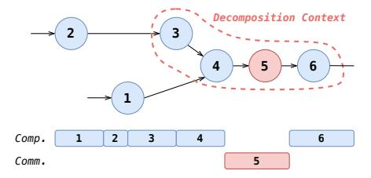
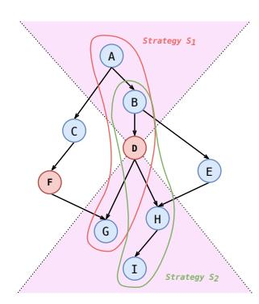
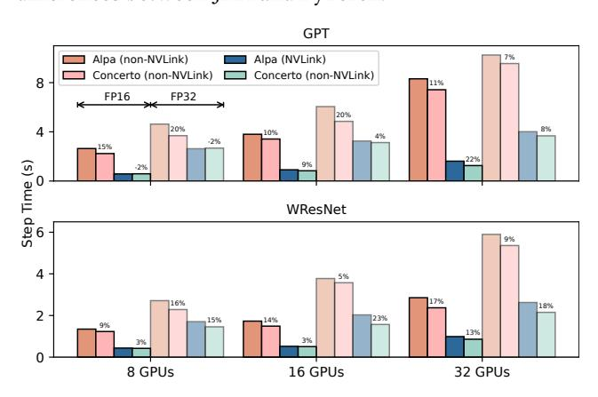
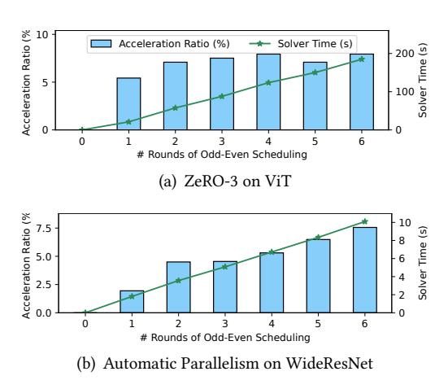

# Concerto: Automatic Communication Optimization and Scheduling for Large-Scale Deep Learning

# [Shenggan Cheng](https://orcid.org/0000-0002-7966-2941)<sup>∗</sup>

National University of Singapore Singapore, Singapore shenggan@comp.nus.edu.sg

# [Hao Wu](https://orcid.org/0009-0003-6318-4505)

George Mason University Fairfax, USA hwu27@gmu.edu

# [Ziming Liu](https://orcid.org/0009-0009-3355-6770)

National University of Singapore Singapore, Singapore liuziming@comp.nus.edu.sg

# [Shengjie Lin](https://orcid.org/0009-0004-6794-9293)<sup>∗</sup>

Georgia Institute of Technology Atlanta, USA slin468@gatech.edu

# [Siyu Wang](https://orcid.org/0009-0002-4064-6984)

Alibaba Group Beijing, China siyu.wsy@alibaba-inc.com

# [Xuanlei Zhao](https://orcid.org/0009-0000-4877-3115)

National University of Singapore Singapore, Singapore xuanlei@comp.nus.edu.sg

# [Lansong Diao](https://orcid.org/0009-0000-6193-6126)

Alibaba Group Beijing, China lansong.dls@alibaba-inc.com

# [Chang Si](https://orcid.org/0009-0000-4612-7371)

Alibaba Group Beijing, China sichang.sc@alibaba-inc.com

# [Jiangsu Du](https://orcid.org/0000-0003-4707-9492)

Sun Yat-sen University Guangzhou, China dujiangsu@mail.sysu.edu.cn

# [Wei Lin](https://orcid.org/0000-0002-3003-0150)†

Alibaba Group Hangzhou, China weilin.lw@alibaba-inc.com

# Abstract

With the exponential growth of deep learning (DL), there arises an escalating need for scalability. Despite significant advancements in communication hardware capabilities, the time consumed by communication remains a bottleneck during training. The existing various optimizations are coupled within parallel systems to implement specific computationcommunication overlap. These approaches pose challenges in terms of performance, programmability, and generality. In this paper, we introduce Concerto, a compiler framework designed to address these challenges by automatically optimizing and scheduling communication. We formulate the scheduling problem as a resource-constrained project scheduling problem and use off-the-shelf solver to get the near-optimal scheduling. And use auto-decomposition to create overlap opportunity for critical (synchronous) communication. Our evaluation shows Concerto can match or outperform state-of-the-art parallel frameworks, including Megatron-LM, JAX/XLA, DeepSpeed, and Alpa, all of which include extensive hand-crafted optimization. Unlike previous works, Concerto decouples the parallel approach and

<sup>∗</sup>Shenggan and Shengjie contributed equally. † Corresponding Author.


[This work is licensed under a Creative Commons](https://creativecommons.org/licenses/by/4.0/) [Attribution International 4.0 License.](https://creativecommons.org/licenses/by/4.0/)

ASPLOS '25, March 30–April 3, 2025, Rotterdam, Netherlands © 2025 Copyright held by the owner/author(s). ACM ISBN 979-8-4007-0698-1/25/03 <https://doi.org/10.1145/3669940.3707223>

# [Yang You](https://orcid.org/0000-0003-2816-4384)†

National University of Singapore Singapore, Singapore youy@comp.nus.edu.sg

communication optimization, then can generalize to a wide variety of parallelisms without manual optimization.

CCS Concepts: • Computing methodologies → Parallel computing methodologies; • Computer systems organization → Neural networks.

Keywords: Distributed Deep Learning, Collective Communication, GPUs, Fine-grained Overlap

#### ACM Reference Format:

Shenggan Cheng, Shengjie Lin, Lansong Diao, Hao Wu, Siyu Wang, Chang Si, Ziming Liu, Xuanlei Zhao, Jiangsu Du, Wei Lin, and Yang You. 2025. Concerto: Automatic Communication Optimization and Scheduling for Large-Scale Deep Learning. In Proceedings of the 30th ACM International Conference on Architectural Support for Programming Languages and Operating Systems, Volume 1 (ASPLOS '25), March 30–April 3, 2025, Rotterdam, Netherlands. ACM, New York, NY, USA, [16](#page-15-0) pages. <https://doi.org/10.1145/3669940.3707223>

# 1 Introduction

With the rapid development of deep learning (DL), there is a growing demand for scale. To pursue model accuracy in various tasks, including computer vision (CV) [\[11,](#page-14-0) [14,](#page-14-1) [29\]](#page-15-1) and natural language processing (NLP) [\[5,](#page-14-2) [12,](#page-14-3) [43\]](#page-15-2), increasingly massive models are being proposed. However, training these advanced models requires numerous GPU resources. In particular, training large language models involves the supercomputer composed of thousands or even tens of thousands of GPUs [\[31,](#page-15-3) [41\]](#page-15-4). Nevertheless, such massive training scales correspond to significant time, economic, and environmental costs. To promote the development of DL technology

and ensure environmental sustainability [\[3\]](#page-14-4), enhancing hardware utilization efficiency and reducing training time have become crucial topics.

In large-scale DL training, we need to jointly use different parallelism approaches which will introduce communications. These communications can become bottlenecks in training and impede the efficiency of scaling. Optimizing these communications becomes a fundamental need. Despite significant advancements in communication hardware capabilities, such as NVLink and InfiniBand, the time spent on communication during training remains a bottleneck. The proportion of time dedicated to communication may account for 20% to 40% of the total training duration on modern clusters [\[47\]](#page-15-5).

To mitigate communication overhead, various optimization solutions have been proposed. For asynchronous communications, system researchers and developers are required to implement specific scheduling in specific scenarios so that they can effectively overlap with computation and efficiently utilize network bandwidth. For example, PyTorch Distributed Data Parallel (DDP) [\[27\]](#page-14-5) organizes parameter gradients into buckets and kicks off asynchronous all-reduce per bucket. For tensor parallelism which introduce synchronous all-reduce. Megatron-LM [\[31\]](#page-15-3) v2.7 introduce asynchronous all-reduce in backward of linear layer which significantly reduces the cost of tensor parallelism communication in the back-propagation. For critical (synchronous) communications, some work [\[47\]](#page-15-5) has proposed that the contextual computation can be decomposed to achieve overlap.

However, these manual optimizations introduce the following challenges:

Challenge 1: Performance - These manual optimizations, which do not fully exploit the opportunity of overlapping communication computations, leaving room for improvement. Moreover, some communication optimizations contain empirical parameters, such as the need to set bucket size in PyTorch DDP, and the default values of these parameters may be inappropriate in varied scenarios.

Challenge 2: Programmability - Performing communication optimization manually requires the developer to manage asynchronous communication, including control synchronization, and communication fusion, which are nontrivial and increase the complexity of the system. Furthermore, these optimizations are implemented in PyTorch's eager mode by re-implementing models or optimizers that hard to be integrated into the PyTorch compiler stack.

Challenge 3: Generality - Currently these communication optimization efforts are intertwined in the implementation of parallel approaches. It is exceedingly difficult to apply existing communication optimizations to more complex or new parallel approaches. For instance, in auto-parallelism, where the parallelism and the communication pattern are uncertain, predefined scheduling and optimization approaches cannot be utilized. Additionally, the current optimizations

for critical communication (decomposition) are specific to Transformer [\[45\]](#page-15-6) and cannot be generalized to arbitrary models. As of now, there is no system that can generally optimize communication for arbitrary parallelism approaches.

To address these challenges, we propose Concerto, a compiler framework for automatic optimization and scheduling of communication. We abstract communication optimization as a resource constrained project scheduling problem (RCPSP). Through off-the-shelf solver, Concerto can generate optimized topological sorting. Furthermore, Concerto introduces auto-decomposition to create optimization space for critical communication.

In summary, we make the following contributions:

- We propose Concerto, a compiler framework for automatic optimization and scheduling of communication, tailored for various models across different parallelization approaches.
- We formulate the scheduling problem as a resource constrained project scheduling problem and use offthe-shelf solver to get the near-optimal scheduling. And use auto-decomposition to create overlap opportunity for critical (synchronous) communication.
- We implement Concerto with PyTorch 2.0 [\[2\]](#page-13-0) compiler stack and provide users with the one-line API for parallelism and communication optimization.
- We evaluate Concerto with the state-of-the-art distributed training frameworks such as Megatron-LM [\[31\]](#page-15-3), Jax/XLA [\[17\]](#page-14-6), DeepSpeed [\[38\]](#page-15-7) and Alpa [\[52\]](#page-15-8). For PTD parallelism, Concerto can match the highly optimized system Megatron-LM and Jax/XLA. Concerto accelerates Evoformer by up to 19.7% with dynamic axial parallelism. For ZeRO-powered data parallelism, compared with DeepSpeed, Concerto achieves maximum performance improvement of 42.9% and an average improvement of 19.1%. For automatic parallelism, Concerto achieves 22.7% maximum and averaging 11.1% compared with Alpa.

# 2 Background and Motivation

# 2.1 Parallelism in distributed training.

Parallelization is important for large-scale DL training and commonly used parallelism include data parallelism and model parallelism.

2.1.1 Data Parallelism. In data parallelism, each device stores a copy of the parameters and trains them using different mini-batches. Subsequently, the gradients from all devices are synchronized through all-reduce, after which each device updates its local parameters. To efficiently utilize the communication channel, a commonly used technique is the bucket technique in general data-parallel implementations. This technique splits the parameters into multiple buckets, allowing gradient reduction in each bucket to potentially

overlap with backward computation. The default bucket size for PyTorch is typically set to 25 MB [27]. As model parameters grow, the ZeRO Redundancy Optimizer (ZeRO) [37] has been introduced to alleviate GPU memory consumption related to model parameters, gradients, and optimizer states by sharding them. Similar to DDP, implementations of ZeRO incorporate default settings akin to buckets or wrappers to enable efficient computation and communication overlap.

2.1.2 Model Parallelism. As model sizes increase, model parallelism has emerged as a crucial technique, mainly including tensor model parallelism and pipeline model parallelism. Tensor model parallelism employs parallel matrix multiplication algorithms to distribute model parameters across different devices. Once local matrix multiplication is completed on each device, global results may need synchronization through all-reduce. Megatron-LM v2.7 [31] introduces asynchronous all-reduce in the backward pass of tensor parallelism linear layers, as depicted in Figure 1. For the synchronize all-reduce in the forward pass, some approaches [47] decompose the antecedent matrix multiplication, thus overlapping it with all-reduce operations.

Pipeline model parallelism involves partitioning the model across different devices based on layers. Intermediate activations must be transmitted to neighboring devices using Peer-to-Peer (P2P) communication. These P2P communication overhead are relatively small and, in this work, we do not focus on the communication overhead from pipeline model parallelism.

<span id="page-2-0"></span>

**Figure 1.** Communication for different parallel approaches. a training step typically involves Forward computation, Backward computation, and the optimizer step (*Optim*). (*AR*: Allreduce, *AG*: all-gather, *RS*: reduce-scatter).

# **2.1.3** Other Parallelism and Automatic Parallelism. In certain instances, novel parallelism techniques may be proposed for specific models. One such example is Dynamic Axial Parallelism (DAP), introduced in FastFold [7] for the

AlphaFold model. FastFold employs asynchronous communication with *Duality Async Operations* to mitigate the communication overhead associated with DAP. For more intricate scenarios, there are ongoing efforts in automatic parallelism [44, 52] aimed at generating parallel strategies for diverse models. These approaches typically utilize algorithms such as integer linear programming to determine the parallel strategy with the minimal communication cost. However, due to the inherent uncertainty in both parallelism and communication, existing communication optimization implementations face challenges in accommodating automatic parallelism.

#### 2.2 Motivating Examples

In both Data Parallelism and ZeRO, buckets are utilized to optimize communication efficiency. In Figure 2, we illustrate the correlation between training performance and bucket size for GPT 2.5 Billion and VGG19 [40] on 16 A800 GPUs. The DDP implementation of PyTorch defaults to a bucket size of 25 MB. In GPT, better overlap percentage (percentage of total communication time spent on overlapping communications) and training performance is achieved with a bucket size of 400 MB. For VGG, improved overlap percentage and training performance are observed with a bucket size ranging from 70 to 200 MB. This observation indicates that the default bucket size fails to deliver optimal performance. ZeRO similarly employs buckets to enhance all-gather and reduce-scatter, processes that are more intricate for performance tuning and thus offer opportunities for optimization.

<span id="page-2-1"></span>

**Figure 2.** Relationship between training performance and communication bucket size in data parallelism.

In complex scenarios, such as illustrated in Figure 3, where the graph involves two communications,  $C_1$  and  $C_2$ . For modern deep learning frameworks like PyTorch, scheduling typically follows the order of definition. Consequently, the execution order proceeds as  $O_1 \rightarrow C_1 \rightarrow O_2 \rightarrow O_3$ . However,

it's evident that  $C_1$  and  $O_3$  are independent and can be overlapped. Thus, we can achieve computation-communication overlap by rearranging the order of operators, such as scheduling them as  $O_1 \rightarrow C_1 \rightarrow O_3 \rightarrow O_2$ . Regarding  $C_2$ , there's no scheduling opportunity because the execution order is  $O_4 \rightarrow C_2 \rightarrow O_5$ . However, we can still overlap computation and communication by decomposing  $O_4$  and  $O_5$ . For instance,  $O_4$  could compute a portion of the tensor first, then  $C_2$  could communicate this portion while  $O_4$  computes another part, and so forth, allowing part of the tensor to be processed using  $O_5$ . Some works [47] has been done with some related attempts, but all of them are limited to fixed patterns, such as decomposing matmul and all-reduce for overlap.

<span id="page-3-0"></span>

**Figure 3.** A simple example of computational graph where  $O_1$  to  $O_5$  are computational operators.  $C_1$  and  $C_2$  are communication operators.

Hence, to minimize communication costs, we observe: 1) For asynchronous communication operators, maximizing parallel processing through operator order scheduling for overlap, coupled with techniques like bucket-like communication fusion, is essential. 2) For critical (synchronous) communication operators, decomposing their contextual computation creates optimization opportunities for overlap.

#### 3 Concerto Overview

This section presents the design of Concerto. Concerto decouples parallel approach and communication optimization to achieve better performance, programmability and generality. Serving as a versatile communication-optimization compiler framework, Concerto abstracts communication optimization as a resource-constrained project scheduling problem (RCPSP) [36]. Leveraging off-the-shelf solvers [35], Concerto generates optimized topological sorting. Additionally, Concerto introduces auto-decomposition to expand the optimization space for critical communication. Through these two compilation passes, Concerto can be applied broadly to optimize communication across various parallel methods. Concerto Workflow Overview. The workflow of Concerto is illustrated in the Figure 4. Initially, Concerto traces the PyTorch functions provided by the user (e.g., train\_step) into an fx Graph (the graph's data structure in PyTorch). Then, depending on the parallel\_method specified by the user, we can transform the traced fx graph into ConcertoIR. ConcertoIR is a hybrid graph with computation and

communication operators that incorporates additional operator information. The next steps involve two core compilation passes in Concerto: auto-decomposition and scheduling. Auto-decomposition identifies critical communications within the graph and decomposes their context automatically. Scheduling generates the topological order of this graph for runtime execution and applies optimizations such as communication fusion.

<span id="page-3-1"></span>

Figure 4. System Overview of Concerto.

### 4 Concerto Scheduling

Concerto minimizes execution time of a computational graph through proper execution ordering. The ordering is restricted by the graph's topological structure and resources available. Thus, the problem can be seen as a classic resource constrained project scheduling problem (RCPSP) [36] that can be solved using existing solvers.

#### 4.1 Encoding graph execution

Following the customary manner, we denote the computational graph as G = (V, E), where  $V = \{v_1, \ldots, v_n\}$  are nodes which represent operators and  $E = \{e_1, \ldots, e_m\}$  represent multi-dimensional tensors which can be the input or output of operators. Following the definition of RCPSP, we refer to the execution of one node as a task. We view the graph execution as the execution of tasks, where each task has its own resource requirements and dependencies. Different tasks can be executed concurrently as long as their resource usage together does not exceed the resource limit.

Considering N types of resources, we define the resource set as  $R = \{R_1, \ldots, R_N\}$ , where  $R_i$  denotes the amount of available resource i. The resource usage of task i is denoted as  $U_i = \{u_{i1}, \ldots, u_{iN}\}$ , with  $u_{ir} \in \{0, \ldots, R_i\}$  for all  $i \in \{1, \ldots, n\}$  and  $r \in \{1, \ldots, N\}$ . In modern deep learning frameworks, it's common for one computation and one communication to be performed simultaneously in most cases. Therefore, we consider that each task only requires one unit of computation resource or one unit of communication. The total amount of each resource is one unit. That is,  $R = \{computation, communication\}$ ,  $R_i = 1$  and  $u_{ir} \in \{0, 1\}$ . For simplicity, in the remainder of this section, comp represents

tasks requiring computation resource and *comm* represents tasks requiring communication resource.

The execution time of task  $v_i$ , obtained through profiling, is denoted as  $T_i$ , while the set of tasks depended on by  $v_i$  to execute is denoted as  $dep_i$ . The duration set  $T = \{T_1, \ldots, T_n\}$  is normalized and rounded to integers, as only the relative time consumption is useful.

#### 4.2 ILP formulation

We model the execution duration of task i as an interval variable in discrete time:  $I_i = [S_i, E_i]$ . Both  $S_i$  and  $E_i$  are integers representing moments in a discrete timeline. Note that task i starts at the beginning of  $S_i$  and ends at the beginning of  $E_i$ . Once task i begins execution, it will continue running until completed. Therefore:

$$\forall i \in \{1, \dots, n\} \ E_i = S_i + T_i \tag{1}$$

Then to preserve the dependencies, for task i, it should not start before all its dependent tasks are finished:

$$\forall i \in \{1, \dots, n\}, \forall j \in dep_i E_j \le S_i \tag{2}$$

Finally, for each time step, the resource usage should be under limit. Here, *M* stands for the makespan of all tasks:

$$\forall t \in \{1, \dots, M\}, \forall r \in \{1, \dots, N\} \sum_{i: S_i \le t \le E_i} u_{ir} \le R_r \quad (3)$$

We want to minimize the duration of the whole process:

$$\arg\min_{I} E_n \quad subject \ to(1), (2), (3) \tag{4}$$

#### 4.3 Decoding

Given a feasible solution to the ILP above, we generate a topological order of the group according to the execution time of each task  $(S_1, \ldots, S_n)$ . We first order the tasks by their start time. Then, for each *comp* we bring *comms* launched during its execution time ahead of it. This adjustment is made because *comms* requires a few GPU Streaming Multiprocessors (SMs) to launch, and during the execution of *comp*, all SMs might be occupied, delaying the launch of *comms* scheduled during this period. Consequently, these *comms* might miss their overlap with *comp*. From another perspective, this reordering helps maintain the assumption that *comms* and *comps* utilize separate resources for execution.

#### 4.4 Optimization

**4.4.1 Fusion.** To improve communication efficiency and avoid kernel launch overhead, we group all *interchangeable* and *fusible comms*. Here two *comms* being interchangeable means that they can be exchanged in execution order without breaking dependencies and being fusible means that two *comms* do the same type of communication with same parameters. We group these *comms* using Algorithm 1.

#### **Algorithm 1:** Communication Fusion

```
input :fx_graph
{\bf output:} new\_fx\_graph
sched \leftarrow \texttt{TopoOrder}(\textit{fx\_graph}), \textit{selected} \leftarrow []
idx \leftarrow 0, retrive task \leftarrow None
while idx < len(sched) do
     task \leftarrow sched[idx]
     if task a fusible comm then
           if selected is empty then
                selected.append(task)
           else if task fusible with selected then
                if task interchangeable with selected then
                 selected.append(task)
                else
                      FuseNodes (selected, fx graph)
                      selected \leftarrow []
                      sched \leftarrow TopoOrder(fx\_graph)
                      if retrive_task is None then
                          retrive\_task \leftarrow task
                      idx \leftarrow sched.index(retrive task)
                      retrive task ← None
                     continue
           else if retrive_task is None then
               retrive\_task \leftarrow task
     end
     idy += 1
     if idx == len(sched) and selected not empty then
           FuseNodes(selected, fx_graph)
           selected ← []
           sched \leftarrow TopoOrder(fx\_graph)
           if retrive_task not None then
                idx \leftarrow sched.index(retrive\_task)
                retrive\_task \leftarrow None
           end
     end
end
```

<span id="page-4-0"></span>Note that solver will maximize overlap between *comps* and *comms*, thus minimizing the total execution time. Therefore, *comps* and *comms* tend to be scheduled in an interleaving pattern. However, in many cases *comps* between two adjacent *comms* are auxiliary tasks that take little time (or no GPU time at all, for tasks like *getitem* and *view*) to execute. We can move these auxiliary tasks forward to make more space for communication fusion while having no impact on the efficiency of execution.

**4.4.2 Odd-even Method.** RCPSP is known NP-hard [4]. Therefore, to make the ILP tractable for large neural networks with tens of thousands of nodes, we come up with a method that restrain solving time complexity to be polynomial while keeping the solution quality close to the optimum.

Inspired by odd-even sort algorithm, we divide the computational graph into equally-sized block where each block is a consecutive sequence of nodes in the current feasible execution order. Default execution order is obtained from program definition. Thus, the original program definition might have an impact on the final result quality. Then we feed solver with one block at a time. After all blocks are reordered by

<span id="page-5-0"></span>

**Figure 5.** Illustration of odd-even scheduling. Distances between adjacent vertical lines are half of the block size, where solid ones represent the block division points at this round and dashed ones represent points in the next round.

the solver to their local optimums, we offset the blocks by half of the block size and repeat the reordering process. For example, in figure 5, in the odd round (top), tasks are reordered within the block while ignoring the dependencies from outside (i.e. edges with at least one end being outside of the block). Then in the even round (bottom), the block is offset by half and the reordering is repeated. By doing so, we facilitate communication of information between blocks, and this information is transmitted to blocks far away as we continue with rounds in an odd-even manner.

Assuming the time for solver to find the optimal solution for blocks of size b is constantly  $t_b$ , the solving time for one round is  $\frac{n}{b}t_b$ . Therefore, time complexity for k rounds is  $O(kt_b\frac{n}{b})$ . We can control the number of rounds to balance between time consumption and solution quality.

Because that the odd-even method is based on local reordering, the optimality of result is lost. However, after several iteration, the performance will gradually improve and approach the optimal. And since there should be multiple rounds of iterations for odd-even and gradually approaching the optimal scheduling, the initial topological order has little effect on the final performance.

#### 5 Auto-Decomposition

Having already attained overlap between communication and computation in evident scenarios, Concerto goes a step further to optimize *critical communication* and unlock additional overlap opportunities by auto-decomposition. The example depicted in Figure 6 illustrates how decomposition aids in identifying overlapping opportunities. Auto-decomposition serves as a compilation pass that automatically identifies critical communication and defines the decomposition context for it.

#### 5.1 Find the set of critical communication.

The critical communication operators represent those communication operators that cannot be entirely overlapped through scheduling. We iterate through all communication operators and categorize other nodes into predecessor nodes (P), successor nodes (S) and independent nodes (I). For example, in Figure 7, consider the communication operator (P), whose predecessor nodes include (P), successor nodes

<span id="page-5-1"></span>

(a) Original Graph and Execution Timeline


<span id="page-5-3"></span>(b) Decomposed Graph and Execution Timeline

**Figure 6.** An example of auto-decomposition. *Comp.* represents computation stream and *Comm.* presents communication stream.

include G, H, I, and independent nodes include C, E, F. The computational nodes in I can offer overlap for D. By conservatively estimating the overlap opportunities provided, D is deemed the critical communication operator if the sum of the times of all computing nodes in independent nodes  $(I_{comp})$  minus the time of the communicating nodes in independent nodes  $(I_{comp})$  exceeds the time of D, formulated as  $\sum_{n \in I_{comp}} Time_n - \sum_{n \in I_{comm}} Time_n < Time_D$ . All critical communications in the graph form a set C.

<span id="page-5-2"></span>

**Figure 7.** Illustration of the critical communication and the decomposition strategies. D is a critical communication operator if  $Time_C + Time_E - Time_F < Time_D$ . The red and green circles represent two possible decomposition strategies.

<span id="page-6-0"></span>**Table 1.** SPMDSpec of some common operators. SSpec for ShardSpec, CSpec for CombineSpec.

| Operators | Input                                  | SPMDSpec                                                                                                                                                                                                     |
|-----------|----------------------------------------|--------------------------------------------------------------------------------------------------------------------------------------------------------------------------------------------------------------|
| MatMul    | $X_1: [D_1, D_2]$<br>$X_2: [D_2, D_3]$ | $\begin{aligned} & \text{SSpec: } [S_1, S_2], [S_2, S_3] \\ & \text{CSpec: } [S_1: \text{gather}(\text{dim=0}) \\ & S_2: \text{reduce}(\text{op=SUM}) \\ & S_3: \text{gather}(\text{dim=1}) ] \end{aligned}$ |
| ReLU      | $X_1:[D_1,D_2]$                        | $\begin{array}{c} \text{SSpec:} \left[S_1, S_2\right] \\ \text{CSpec:} \left[S_1 \text{: gather(dim=0)} \right. \\ \left. S_2 \text{: gather(dim=1)} \right] \end{array}$                                    |
| LayerNorm | $X_1:[D_1,D_2]$                        | $\begin{array}{c} SSpec: \; [S_1, N] \\ CSpec: \; [\; S_1 \text{: } gather(dim=0) \; ] \end{array}$                                                                                                          |

# 5.2 The decomposition strategies for each critical communication.

For tensors necessitating communication, we explore along each of their axes, both preceding and succeeding. Leveraging the Single Program Multiple Data information (SPMDSpec) of each operator (provided by EasyDist [1]), we can ascertain how the output will be partitioned given the partitioning of the input. SPMDSpec consists of a ShardSpec and a CombineSpec that detail how to shard the input and combine the local results into global results, respectively. For a particular operator, let us assume that it has i inputs, denoted by  $X_1, X_2, ..., X_i$ , where each input  $X_i$  has a tensor shape of  $[D_{i_1}, D_{i_2}, ..., D_{i_n}]$  (i.e., tensor  $X_i$  has  $i_n$  dimensions). The ShardSpec takes a list of  $i_n$  values,  $[C_{i_1}, C_{i_2}, ..., C_{i_n}]$ , for each input  $X_i$ , where each value corresponds to a dimension of the tensor  $X_i$  and takes on the values NoShardDim (N)or  $ShardDim(j)(S_i)$ . The value NoShardDim signifies that the dimension is not shardable, while  $S_i$  corresponds to dimensions that can be sharded simultaneously. For each  $S_i$ , there is a corresponding CombineFunc that can re-combine the local results into global results. The CombineSpec is a dictionary whose key is  $S_i$ , and its value is its corresponding CombineFunc. Common CombineFunc include gather, reduce, and so on.

Table 1 illustrates some examples of the SPMDSpec for common operators. In the case of the matrix multiplication (MatMul) operator, there are two inputs with ShardSpec  $[S_1, S_2]$  and  $[S_2, S_3]$ , indicating three sharding strategies:  $S_1$ ,  $S_2$ , and  $S_3$ . The CombineSpec shows that, under  $S_1$ , we need to gather on the first dimension of the output; under  $S_2$ , we need to reduce(SUM) on the output; and under  $S_3$ , we need to gather on the second dimension of the output.

We employ the Breadth-First Search (BFS) algorithm for decomposition context exploration, with termination conditions being either the inability to find further nodes to add to the decomposition context or the total runtime of nodes in the decomposition context exceeding the communication time. The pseudo-code for the decomposition context exploration in the successor direction along the axis of a

critical communication node is presented in Algorithm 2. S represents the corresponding decomposition context, where the keys are the nodes within the context, and the values are the axes of decomposition. The function SPMDPropagate derives the decomposition axis needed for the current node to join the decomposition context based on the predecessor's decomposition axis. In the parallel method of GPT discussed in [24], an all-gather operation is required on the sequence dimension before the Feed-Forward step. The sequence of operations is: LayerNorm  $\rightarrow$  all-gather  $\rightarrow$  $MatMul_1 \rightarrow GeLU \rightarrow MatMul_2$ . If the decomposition is performed along the batch or sequence dimensions, the context includes LayerNorm, MatMul<sub>1</sub>, GeLU, MatMul<sub>2</sub>. However, if the decomposition is along the hidden dimension, Layer-Norm cannot be split along this dimension, and MatMul<sub>1</sub> requires SUM after decomposition. Therefore, SPMDPropagate returns None, and the context includes only MatMul<sub>1</sub>.

Unlike previous work which generally can only overlap with the predecessor or successor MatMul, Concerto emphasizes the Decomposition Context, which can include any operator besides MatMul, forming a larger scope that encompasses multiple MatMul operations, thereby providing greater opportunities for overlap. By exploring along different axes of the critical communication node in both the successor and predecessor directions, we can obtain the strategy candidate set  $S_i$  for each critical communication  $C_i$  in C.

# **Algorithm 2:** BFS Algorithm for Decomposition Context Exploration in the Successor Direction

```
Input: N_{comm}, Axis_{N_{comm}}

S \leftarrow \{N_{comm}: Axis_{N_{comm}}\}

Q \leftarrow EmptyQueue

t_d \leftarrow 0

Q.enqueue(all computation children of N_{comm})

while Q is not empty and t_d \ge t_{N_{comm}} do

N = Q.dequeue()

Axis_N = SPMDPropagate(N, S[N.predecessor])
\nif Axis_N is found then

S[N] = Axis_N

t_d + t_N

Q.enqueue(all computation children of N);
\nend
\nend

return S
```

#### <span id="page-6-2"></span>5.3 Cost of Each Strategy

The cost of a decomposition strategy is determined by the non-overlapped portion of communication. Let's define the parameters *decomposition degree*: N represents the number of decomposition partitions;  $\alpha$  denotes the slowdown ratio of the computation stream when overlapping;  $T_C$  is the time taken for critical communication;  $T_{pre}$  ( $T_{post}$ ) is the sum of the time taken for the predecessor (successor) node in the decomposition context. There are three scenarios where the

communication portion cannot be overlapped with computation. For example, in Figure 6(b), both the preceding and succeeding computations can only offer (N-1)/N overlapping opportunities for communication; thus, nodes  $3_0$ ,  $4_0$ , and  $6_1$  cannot overlap with communication. Therefore, case one corresponds to the total time provided by the preceding and succeeding computations being less than  $T_C$ . Additionally, when either the preceding or succeeding computation time is too short, providing fewer overlapping opportunities than  $T_C/N$ , for example, when the times for nodes  $3_0$  and  $4_0$  are less than  $5_0$ , the succeeding computation cannot overlap the remaining first communication. These three scenarios correspond to the three costs in the following formulas, with the final cost being the maximum among these three costs:

$$cost_1 = T_C - \alpha * (N-1) * (T_{pre} + T_{post})/N$$

$$cost_2 = T_C/N - \alpha * (N-1) * T_{pre}/N$$

$$cost_3 = T_C/N - \alpha * (N-1) * T_{post}/N$$

$$cost = max\{cost_1, cost_2, cost_3, 0\}$$
(5)

We empirically set  $\alpha$  to 1.2. Micro-benchmark tests revealed the performance degradation ratios for three categories of operators: 1) *General Matrix Multiply*, 2) *Batch Reduction*, and 3) *Element-wise Operators*. The benchmarks with MatMul, LayerNorm, and Elementwise-Add, when overlapping with communication operations, showed degradation ratios of 18.2%, 21.9%, and 23.8%, respectively. Based on these results, we used 20% as an empirical estimate, leading to the choice of  $\alpha = 1.2$ .

#### <span id="page-7-1"></span>5.4 Overhead Cost

Decomposition effectively enhances the opportunity for overlap. However, it also introduces certain overheads. Decomposed operators typically exhibit lower degrees of parallelism, resulting in reduced resource utilization. Additionally, decomposition may lead to increased High Bandwidth Memory traffic. Furthermore, it introduces kernel launch overhead and recovery overhead, such as the incorporation of tensor concatenation as a combination function.

Figure 8 illustrates a example to observe the quantifiable impact of decomposition overhead. In the GPT Feed-Forward module, we can see that as the decomposition degree, N (the number of decomposition partitions), increases, the Achieved TFLOP/s decreases. Additionally, the HBM Traffic, estimated from the input and output tensors of each operator, shows a significant increase.

To model the overhead cost, we profile the runtime difference between the decomposition operators and the original operators across various decomposition strategies. The *decomposition overhead cost* is calculated as the total runtime of the decomposition operators subtracted from the execution time of the original operators. We add this overhead to the cost of each decomposition strategy to ensure that we select

<span id="page-7-0"></span>

**Figure 8.** Achieved TFLOP/s and HBM Traffic for different decomposition degrees of Feed-Forward. Benchmarked on an NVIDIA A800 with an input shape of (4, 1024, 4096).

the strategy with the smallest overhead. In cases where decomposition results in significant performance degradation, the non-decomposition strategy will be chosen.

#### 5.5 Solve the optimal strategy

If there is no intersection between nodes involved in critical communication and all other critical communication decomposition strategies, we simply adopt the strategy with the lowest cost for each. However, if there is an intersection, we need to consider the additional cost of their mutual influence. Assuming two critical communications each choosing strategies  $S_{C_i,m}$  and  $S_{C_i,n}$  respectively, with their node intersection denoted as U. We calculate the additional cost  $(M_{ijmn})$  in two scenarios: 1) When the decomposition axes in the intersection of the two strategies are different, nodes can only overlap for one critical communication. Thus, the cost is  $\sum_{i \in U} T_i * (N-1)/N$ . 2) When the decomposition axes in the intersection of the two strategies are the same, nodes can only provide overlap equal to their own runtime. Therefore, the cost is  $\sum_{i \in U} T_i * (2 * (N-1)/N - 1)$ . If we have  $k_i$  strategies for  $C_i$  and  $k_j$  for  $C_j$ , the cost matrix between node  $C_i$  and node  $C_j$  can be calculated as  $M_{ij} \in \mathbb{R}^{k_i \times k_j}$ .

We utilize ILP (Integer Linear Programming) to determine the optimal decomposition strategy for each critical communication. For each node  $C_i$ , we define a one-hot decision vector  $s_i \in \{0,1\}^{k_i}$  to represent the strategy it employs. Here,  $s_{ix} = 1$  indicates that we select the x-th strategy for  $C_i$ . The cost vector for node  $C_i$ , denoted as  $cost_i$ , can be calculated as illustrated in Sections 5.3 and 5.4. All nodes that have intersections in the decomposition strategies will form an edge, which we denote as E. The objective of the problem is formulated as  $min_s \sum_{C_i \in C} s_i^T cost_i + \sum_{C_i, C_j \in E} s_i^T M_{ij} s_j$ , where the first term is to minimize the cost for each critical communication node, while the second term is to minimize mutual influence of different nodes.

#### 6 Implementations

Concerto is built on top of the PyTorch 2.0 [2] compiler stack. This section will outline some key implementation details.

#### 6.1 ConcertoIR and Profiling Module

ConcertoIR extends ATen IR by enriching it with additional operator-level information while maintaining torch.fx [\[39\]](#page-15-14) as the underlying data structure. Each operator in ConcertoIR is annotated with SPMD information (SPMDSpec) using EasyDist [\[1\]](#page-13-1) which is utilized by the auto-decomposition module to explore decomposition strategies. To reduce the overhead of the profiling module, the profiling results are persisted using the operator name and input as unique identifiers to skip profiling for identical operators and inputs.

#### 6.2 Runtime

After the Concerto compiler completes auto-decomposition and scheduling, we obtain an optimized topological sequence. The runtime is lightweight; it simply traverses this topological sequence, dispatching all computational operators to the default CUDA Stream and all communication operators to an another CUDA Stream dedicated for communication. And we design a special end-of-communication marker operator ensures that by the time the default CUDA Stream needs to use the buffer produced by a communication operator, the communication has already been completed.

#### 6.3 Extensibility

Concerto leverages torch.\_custom\_ops, allowing the registration of custom kernels as ATen operators to utilize highperformance implementations of operators like Megatron-LM or flash attention [\[10\]](#page-14-10).

Users can extend Concerto to support other type of parallelism, simply express their desired parallel method as a transformation of the fx Graph and then register it using concerto.register\_parallel\_method. Communication optimizations can then be directly applied to the transformed computational graph, encompassing both communication and computation operators, thus supporting userdefined parallel methods.

# 7 Evaluation

In this section, we present an evaluation of Concerto's performance on large-scale training tasks employing PTD (pipelinetensor-data) parallelism, ZeRO-powered data parallelism, DAP (dynamic axial parallelism) [\[7\]](#page-14-7), and automatic parallelism for billion-scale deep learning models such as GPT [\[5\]](#page-14-2), ViT [\[14\]](#page-14-1), Evoformer [\[22\]](#page-14-11), and WideResNet [\[49\]](#page-15-15).

All experiments were conducted on a public cloud platform with a configuration comprising 4 nodes equipped with a total of 32 GPUs. Each node is furnished with 8 NVIDIA A800-80GB GPUs connected via NVLink (400 GB/s bandwidth), 800 GB of memory, and 64 vCPUs. Inter-node communication is facilitated by 800 Gbps cross-node bandwidth. The software environment includes CUDA 12.0, PyTorch v2.1.2, and NCCL v2.18.6.

We conduct comparative analyses of Concerto against leading distributed systems designed for training large-scale models on GPUs. Specifically, for PDT Parallelism, we compare Concerto with Megatron-LM v3.0 and Jax 0.4.30 (for Google Decomposition [\[47\]](#page-15-5)). For ZeRO, we evaluate against DeepSpeed v0.12.4 [\[38\]](#page-15-7). For DAP, we evaluate against the implementation from FastFold [\[7\]](#page-14-7). Lastly, for auto-parallelism, we benchmark Concerto against Alpa v0.2.3 [\[52\]](#page-15-8). To cover a more diverse hardware environment of computing and communication, we performed performance tests in both float16 and float32 precision, with NVLink enabled or disabled.

We use step time and acceleration ratio as our performance metrics. Step time refers to the duration required for a single step during the training process, while acceleration ratio represents the speedup compared to the baseline. Since all optimizations do not affect computational semantics, the training curve keep consistency and the ratio indicates the overall end-to-end training acceleration.

Table 2. Specification for benchmark models.

| Model            | Hidden Size | #heads       | #layers |
|------------------|-------------|--------------|---------|
| GPT-0.9B         | 2048        | 16           | 18      |
| GPT-3.6B         | 4096        | 32           | 18      |
| GPT-5.7B         | 5120        | 32           | 18      |
| GPT-14.5B        | 8192        | 32           | 18      |
| GPT-32.6B        | 12288       | 48           | 18      |
| Model            | Hidden Size | #heads       | #layers |
| ViT-0.8B         | 2048        | 8            | 16      |
| ViT-3.2B         | 4096        | 16           | 16      |
| ViT-5.0B         | 5120        | 20           | 16      |
| Model            | Hidden Size | d_node       | d_pair  |
| Evoformer-0.04B  | 128         | 1024         | 512     |
| Evoformer-0.10B  | 192         | 1536         | 768     |
| Evoformer-0.19B  | 256         | 2048         | 1024    |
| Model            | Channel     | Width Factor | #layers |
| WideResNet-1.2B  | 320         | 2            | 50      |
| WideResNet-4.7B  | 640         | 2            | 50      |
| WideResNet-10.5B | 960         | 2            | 50      |

#### 7.1 End-to-End Performance

In this section, we conduct end-to-end performance comparison under four parallel settings: PTD Parallelism, ZeRO Parallelism, DAP, and Automatic Parallelism. PTD Parallelism is one of the highest-performing parallel methods and includes extensive manual communication optimizations. By comparing Concerto with the state-of-the-art PTD Parallelism systems, we aim to demonstrate that Concerto fully encompasses these manual communication optimization spaces. Furthermore, in commodity communication (non-NVLink), Concerto is more adaptable compared to manual communication optimizations. Next, in ZeRO Parallelism, we will showcase Concerto's scheduling and fusion capabilities by comparing it to DeepSpeed. For more complex models and


**Figure 9.** End-to-end performance improvement compared with Megatron-LM for GPT. The bars represent Megatron-LM's step time and the short lines within each bar indicate Concerto's step time. The acceleration ratio is displayed above each bar.

parallelization methods, such as Evoformer with DAP, Concerto can achieve better performance than manual optimization. Finally, the automatic parallelism comparison aims to prove that Concerto can effectively perform communication optimization across any model and parallel method.

#### 7.1.1 PTD Parallelism compared with Megatron-LM.

Megatron-LM employs PTD Parallelism and is regarded as one of the top-performing solutions for training large models. It undergoes extensive manual parallelization and communication optimization on NVIDIA platforms. In our comparison of PTD Parallelism, we utilize Megatron-LM v3.0 [31] as the baseline system and evaluate it with the GPT model. With different test cases and varying sizes of model parallelism (MP), we employed multiple sizes of GPT models. Specifically, we used 0.9B when MP = 1, 3.6B when MP = 4, 14.5B when MP = 8, and 32.6B when  $MP \geq 16$ .

Comparing Concerto's performance to Megatron-LM's, Concerto achieves a maximum acceleration of 19.0% and an average of 3.5%. Notably, in scenarios involving tensor parallelism, Concerto demonstrates significant superiority. The primary communication cost in tensor parallelism occurs during the all-reduce in both the forward and backward passes. Leveraging auto-decomposition, Concerto enables the all-reduce in the forward pass to overlap with computations within the decomposition context. Additionally, in the backward pass, Concerto's scheduling identifies more computations that can overlap with the all-reduce.

We find that the effectiveness of optimization is greatly influenced by the communication-computation ratio. Due to the significant differences in computational capabilities between FP32 and FP16, and the substantial differences in communication capabilities between NVLink and non-NVLink, the overlap of computation and communication is less effective when there are large disparities between them. This is because the part that can be accelerated constitutes a smaller proportion of the total time. However, when computational and communication capabilities are well-matched, such as with NVLink FP16 and non-NVLink FP32, we observe more significant optimization results.

With the optimal plan for GPT end-to-end training, the best configuration for GPT-32.6B training on 32 GPUs is (4, 8, 1). This means that in an end-to-end experimental setup,

data parallelism is implemented inter-node, while tensor parallelism is implemented intra-node. Concerto achieves a 3% performance improvement over Megatron-LM. However, in the context of NVLink, Megatron-LM has undergone extensive manual optimization, resulting in minimal communication overhead. Therefore, the end-to-end optimization effect is not very significant. Under these conditions, Concerto's main optimization comes from auto-decomposition, which reduces the exposure time of forward all-reduce operations. As described in the motivation, Concerto aims to achieve performance optimization through automatic communication optimization in more general models and parallel settings. In the PTD parallel scenario, we have achieved optimization effects comparable to extensive manual optimizations.

7.1.2 PTD Parallelism compared with Jax/XLA. Google Composition [47] is implemented in the XLA compiler and can be used in JAX by setting specific environment variables. The xla\_gpu\_enable\_latency\_hiding\_scheduler enables latency hiding schedulers to overlap communication. The xla\_gpu\_multi\_streamed\_windowed\_einsum enables optimizations from Google Decomposition. Figure 11 presents the performance comparison. With NVLink disabled, Concerto demonstrates a significant performance advantage, upto 34%. Notably, Jax/XLA's performance is even lower than that of Megatron-LM because the inefficient scheduling strategy. This highlights Concerto's solver's superior adaptability and advantage over heuristic algorithms and fixed decomposition strategies. With NVLink enabled, Concerto still maintains a notable improvement over Jax/XLA, upto 13.4%. For detailed analysis of the impact of scheduling and decomposition, please refer to Section 7.2.

Regarding performance differences between PyTorch and Jax/XLA at the framework level, we observed the total time for computation and communication (without overlap) under the (2, 4, 1) parallel strategy. PyTorch's computation time was slightly higher than Jax/XLA's: 290.3 vs 280.0 ms in FP16, and 1384.5 vs 1358.4 ms in FP32. However, PyTorch's communication time was slightly lower: 73.1 vs 75.6 ms with NVLink, and 1099.6 vs 1199.6 ms without NVLink. The main reasons are that Jax/XLA achieved better operator fusion for some memory-bound operators, while its bucket and communication balance is suboptimal.

<span id="page-10-1"></span>

**Figure 10.** End-to-end performance improvement compared with DeepSpeed for GPT and ViT. The bars represent DeepSpeed's step time and the short lines within each bar indicate Concerto's step time. The acceleration ratio is displayed above each bar.

<span id="page-10-0"></span>

**Figure 11.** End-to-end performance improvement from Concerto compared with Jax/XLA for GPT.

**7.1.3 ZeRO-powered data parallelism.** ZeRO exists several variations, with ZeRO-2 and ZeRO-3 being the most prevalent in practical applications. For our performance evaluation, we selected GPT [5] and ViT [14] as benchmark models. We used different model size depending on the number of GPUs. With 2 GPUs and 4 GPUs, we used GPT-0.9B / ViT-0.8B. For 8 GPUs and 16 GPUs, we used GPT-3.6B / ViT-3.2B. For 32 GPUs, we used GPT-5.7B / ViT-5.0B.

Figure 10 illustrates the performance enhancements of two models under ZeRO-2 and ZeRO-3 compared to Deep-Speed. For ZeRO-2, Concerto demonstrates a maximum performance improvement of 42.9% and an average improvement of 19.1% compared to DeepSpeed. Regarding ZeRO-3, Concerto exhibits a maximum performance improvement of 33.2% and an average improvement of 15.1% compared to DeepSpeed. In scenarios with NVLink, where communication time constitutes a smaller proportion of the overall runtime, the benefits of scheduling are minimal. However, in situations with slower communication, Concerto's advantages become evident. Compared to the fixed communication optimization strategies in DeepSpeed, Concerto's primary performance improvement comes from better communication scheduling and the application of communication fusion. Additionally, Concerto determines communication strategies at compile time, eliminating additional overhead at runtime. Furthermore, we observe that ZeRO-2 achieves slightly higher acceleration ratios. This is primarily due to Concerto enable overlap between all-gather operations and

the forward computation of the next step. Further details are provided in Section 7.3.

**7.1.4 Dynamic Axial Parallelism.** DAP is proposed in FastFold [7], specifically for the backbone network Evoformer in AlphaFold2 [22]. Although Evoformer has a relatively small number of parameters, it requires substantial activation memory due to the two sequence axes data. DAP involves switching and combining sequence axes, introducing all-to-all and all-gather. Despite FastFold's have handcrafted optimization to achieve asynchronous communication, the communication cost remains significant. We benchmark Concerto's optimization performance with parameter sizes of 0.04B, 0.10B, and 0.19B on 8, 16, and 32 GPUs, as shown in Figure 12. S means using only scheduling in Concerto, while S+AD indicates using scheduling with auto-decomposition. The individual contributions of scheduling and auto-decomposition can be observed. Endto-end, Concerto achieves an average acceleration of 12.5% and 15.6%, and a maximum acceleration of 19.7% and 17.7%, compared to manually optimized DAP.

<span id="page-10-2"></span>

**Figure 12.** End-to-end performance of baseline and Concerto for DAP. S means only use scheduling, S+AD means use scheduling with auto-decomposition. Acceleration ratio is labeled above the bars.

**7.1.5 Automatic Parallelism.** Unlike the three types of parallelism above, automatic parallelism tends to introduce more complex and irregular communication patterns. Specific communication optimizations are more difficult to apply in this scenario. We use Alpa v0.2.3 [52], an auto-parallel

compiler based on JAX [16] and XLA [17], as our baseline. For model selection, we refer to Alpa and choose GPT [5] and WideResNet [49], with WideResNet being more heterogeneous in terms of model structure. With 8 GPUs, we employed GPT-3.6B and WideResNet-1.2B. For 16 GPUs, we used GPT-14.5B and WideResNet-4.7B. For 32 GPUs, we utilized GPT-32.6B and WideResNet-10.5B.

Since communication optimization primarily targets intraoperator parallelism, we focus solely on intra-operator parallelism. In Figure 13, it is evident that Concerto demonstrates significant performance improvements, reaching up to a maximum of 22.7% and averaging 11.1%. This is particularly notable in scenarios without NVLink or across multiple nodes. It can be observed that GPT experiences some performance degradation when NVLink is enabled on 8 GPUs, primarily due to the inherent computational performance differences between JAX and PyTorch.

<span id="page-11-1"></span>

**Figure 13.** End-to-end performance improvement compared with Alpa for GPT and WideResNet. Acceleration ratio is labeled above the bars.

#### <span id="page-11-0"></span>7.2 Ablation Study

For ablation study, we focus on the effectiveness of autodecomposition and the fused communication.

The performance improvement from Scheduling and Auto-decomposition. We can observe the optimization effect of scheduling and auto-decomposition separately through an example of Tensor Parallelism. Table 3 illustrates the performance comparison of running GPT with Concerto(S) (only use scheduling) and Concerto(S+AD) (use scheduling with auto-decomposition) on 16 GPUs. Regarding the improvement from scheduling, we can see that under the NVLink FP16 and no-NVLink FP32 experimental setups, the optimization effect of Concerto is significantly more pronounced. In comparing JAX/XLA on S and S+GD, we have made the following observations: 1) it is hard to achieve genuine optimization with XLA when GD is enabled. 2) with NVLink enabled, Concerto's scheduling optimization is superior to XLA. 3) with NVLink disabled, XLA's performance

significantly deteriorates, indicating that its heuristic algorithm cannot adapt to different hardware environments.

The effectiveness of optimization depends on the ratio of communication. In scenarios with NVLink FP16 and no-NVLink FP32, where there is a balanced ratio, the benefits become more pronounced. For the improvement from auto-decomposition, under FP16 precision, the overhead introduced by decomposition becomes more apparent. However, under FP32, the optimization effect of auto-decomposition becomes more significant. In scenarios without NVLink, where communication is more of a bottleneck, the effectiveness of Concerto becomes even more evident.

<span id="page-11-2"></span>**Table 3.** Comparison of step time (s) for GPT models. (S) means only use scheduling, (S+AD) means use scheduling with auto-decomposition in Concerto, (S+GD) means enable scheduling and Google Decomposition in JAX/XLA.

| GPT on 16 GPUs |              | NVLink |       | no-NVLink |       |
|----------------|--------------|--------|-------|-----------|-------|
|                | ro (P, T, D) | FP16   | FP32  | FP16      | FP32  |
| Megatron-LM    | (1, 16, 1)   | 0.974  | 3.276 | 3.793     | 6.093 |
|                | (1, 8, 2)    | 0.907  | 4.455 | 2.996     | 6.566 |
| Jax/XLA        | (1, 16, 1)   | 0.956  | 3.258 | 4.389     | 6.823 |
|                | (1, 8, 2)    | 0.896  | 4.400 | 3.502     | 6.689 |
| Jax/XLA (S)    | (1, 16, 1)   | 0.942  | 3.192 | 4.219     | 6.773 |
|                | (1, 8, 2)    | 0.872  | 4.396 | 3.394     | 6.634 |
| Jax/XLA        | (1, 16, 1)   | 0.943  | 3.193 | 4.135     | 6.530 |
| (S+GD)         | (1, 8, 2)    | 0.871  | 4.385 | 3.392     | 6.606 |
| Concerto       | (1, 16, 1)   | 0.86   | 3.252 | 3.723     | 5.544 |
| (S)            | (1, 8, 2)    | 0.883  | 4.446 | 2.897     | 6.295 |
| Concerto       | (1, 16, 1)   | 0.817  | 3.127 | 3.584     | 5.178 |
| (S+AD)         | (1, 8, 2)    | 0.866  | 4.366 | 2.788     | 5.616 |

The Effectiveness of Fused Communication. In scheduling, communication fusion is a crucial optimization technique to ensure efficiency. In ZeRO scenarios, numerous communications need to be fused. We observe the effectiveness of communication fusion in Concerto Scheduling within this scenario. Table 4 shows the improvement from communication fusion. It can be observed that as the scale increases, the improvement brought by communication fusion becomes more significant.

<span id="page-11-3"></span>**Table 4.** Step time (s) improvement from communication fusion for GPT models with Concerto ZeRO-3 Parallelism.

| GPUs | FP16                      | FP32                      |  |
|------|---------------------------|---------------------------|--|
| 8    | $0.517 \to 0.505$         | $2.732 \rightarrow 2.723$ |  |
| 16   | $0.531 \rightarrow 0.504$ | $2.742 \rightarrow 2.722$ |  |
| 32   | $0.614 \rightarrow 0.468$ | $2.801 \rightarrow 2.771$ |  |
|      |                           |                           |  |

#### <span id="page-12-0"></span>7.3 In-Depth Analysis

Case study. Through an examination of Concerto's scheduling results, we identify several specific enhancements compared to the baseline. These scheduling optimizations are challenging to discover manually and difficult to implement, but Concerto's scheduling can automatically uncover such optimization opportunities.

1. In tensor parallelism, Megatron-LM re-implement the forward and backward of Linear layers, enabling overlap between the all-reduce during backward computation and the calculation of parameter gradients (matrix multiplication). However, we observed that sometimes the computation time of this matrix multiplication is lower than the communication time. In such cases, Megatron-LM cannot achieve optimal performance. However, in Concerto, we observe that the scheduling algorithm schedules other operations in the backward pass to overlap with the all-reduce (in general, there is significant scheduling flexibility for computing parameter gradients during the backward pass). This provides noticeable scheduling opportunities, especially in scenarios without NVLink. Additionally, Megatron-LM cannot make any optimizations for the all-reduce in the forward pass. However, in Concerto, thanks to auto-decomposition, computation and communication can also overlap.

2. In ZeRO parallelism, In DeepSpeed's ZeRO-2 implementation, because the optimizer state is sharded but the weights are not, there is a synchronized all-gather at the end of the optimizer. This all-gather is not overlapped. This obviously becomes a serious problem, especially without NVLink and cross-machine. In Concerto, we introduce an asynchronous return mechanism, i.e., we allow the computational graph to directly return unsynchronized communication tensors and complete the synchronization the next time the computational graph uses these tensors. By introducing such a mechanism, we can overlap this all-gather communication with the next forward computation.

Compilation Time. The compilation process consists of three phases: profiling, auto-decomposition, and scheduling. Profiling typically takes only a few tens of seconds for benchmark models with caching mechanism. The autodecomposition phase usually completes within one second, largely because the number of communication operators is relatively small, and there are few overlapping of decomposition contexts, allowing for rapid solution computation. Figure 14 illustrates the acceleration ratios and solution times under different odd-even scheduling rounds for two cases. At 0 rounds, equivalent to no scheduling, the runtime is the baseline. As the number of rounds increases, the acceleration ratio gradually becomes higher, and the solution time almost linearly increases. In the first case, ViT is parallelized with ZeRO-3 across 8 GPUs, involving a substantial amount of communication operators requiring scheduling. Each round

takes around 30 seconds. It achieves nearly optimal acceleration ratio around 4 rounds. For WideResNet with automatic parallelization across 8 GPUs, each scheduling round takes about 2 seconds. It reaches close to optimal acceleration ratio around 6 rounds. In practical scenarios, the compilation can typically be completed within several minutes, which is negligible compared to the days-long training duration.

<span id="page-12-1"></span>

**Figure 14.** The acceleration ratio and solver time with increased rounds of odd-even scheduling.

#### 8 Related Work

Parallelism for Large-Scale Deep Learning. Parallelism serves two primary purposes: 1) scaling computation to leverage more computational resources; 2) partitioning parameters of large models to facilitate training models with significantly greater capacity than the HBM of a single GPU. Presently, main parallelism approaches include data parallelism [27], tensor model parallelism [23, 31], pipeline model parallelism [20, 26, 28], and DeepSpeed ZeRO [37]. During training, different parallelisms introduce varying communication costs. Some work, such as Alpa [52] and Unity [44], employs automation algorithms to determine optimal parallelism combinations. Concerto optimizes any parallelism approach, including auto-parallelism, reducing communication overhead through improved overlap with computation. Communication Optimization. Communication optimization is a widely used technique in high performance computing [9, 18, 33]. Existing work on DL workload can be divided into two categories: scheduling optimization and primitive optimizing. Many works aim to minimize communication overhead for specific parallel approaches, such as TicTac[19] and ByteScheduler[34] for data parallelism (parameter server and all-reduce). Recently, Google[47] has introduced decomposition as a method to effectively overlap communication introduced by tensor parallelism. CoCoNet[21] enables fine-grained overlap and fusion of computation and communication. CocoNet proposes a scheduling space for

fine-grained communication optimization and focuses on implementing overlap under decomposition but lacks an automated algorithm to explore this search space. T3 [\[32\]](#page-15-19) is a hardware-software co-design approach that reduces the mutual interference between computation and communication, achieving fine-grained communication and computation with lower overhead. Concerto, through scheduling and auto-decomposition, identifies more opportunities for overlapping computation and communication. Concerto can complement T3 to achieve better performance. In contrast, Concerto emphasizes exploring decomposition and scheduling spaces through automated algorithms. Others, like Blink [\[46\]](#page-15-20) and MSCCLang [\[8\]](#page-14-20), focus on optimizing the performance of the communication primitives in sophisticated network and topology. These primitive optimizing and Concerto are orthogonal and can be combined in future works. Compilers for Machine Learning. Most ML Compilers, such as TVM [\[6,](#page-14-21) [15\]](#page-14-22), primarily focus on optimizing inference performance. A smaller subset, including XLA [\[17\]](#page-14-6) and AStitch [\[53\]](#page-15-21), also support training. These efforts concentrate on kernel fusion and generating high-performance code. Many compiler projects, particularly those based on XLA, are oriented towards parallel training, such as GSPMD [\[48\]](#page-15-22), GShard [\[25\]](#page-14-23), and Alpa [\[52\]](#page-15-8). Some projects schedule the order of operators or employ chunking strategies to reduce peak GPU memory usage, as seen in MODeL [\[42\]](#page-15-23) and AutoChunk [\[50\]](#page-15-24). There are several works on inter-operator scheduling, such as IOS [\[13\]](#page-14-24), Rammer [\[30\]](#page-15-25), and AutoGraph [\[51\]](#page-15-26), which improve GPU computational resource utilization by scheduling the order of operators to enable inter-operator parallelism. The purpose of Concerto's scheduling is to overlap communication, and its main difference from these works is that due to the lack of metrics for communication operators, such as inter-GPU bandwidths, previous approaches treated communication operators as atomic black boxes, leading to missed optimization opportunities. However, with Concerto's auto-decomposition, it can create overlap opportunities and partition these atomic communication operators, thereby expanding the scheduling space.

# 9 Discussion

While Concerto represents a significant advancement in the realm of automatic communication optimization and scheduling, several limitations highlight areas for further improvement: 1) Joint Optimization of Scheduling and Decomposition: Concerto treats scheduling and decomposition as two critical aspects independently, which can prevent the system from achieving truly optimal solutions. Future research should focus on developing algorithms and methods that can simultaneously consider both scheduling and decomposition to enhance the system's overall effectiveness. 2) Performance Model for Decomposition: Currently, we

need to profile each possible sub-operator to solve decomposition. In the future, using performance model to predict the performance of sub-operator. 3) Overlapping Different Communication Operations: Extending the solver to overlap different communication operations, such as intranode and inter-node communication, could be beneficial. For example, instead of considering just two types of resources (computation and communication), we could include three types: computation, intra-node communication, and internode communication. 4) Adaptability to Different Batch Sizes: Currently, the system needs to solve problems from scratch for different batch sizes. Future work should focus on developing adaptive algorithms that can adjust to changes in batch size without requiring complete re-compilation.

These limitations point to promising areas for future research, with the potential to significantly enhance the capabilities and applicability of Concerto.

# 10 Conclusion

This paper introduces Concerto, a compiler framework designed for automatic optimization and scheduling of communication. Concerto achieves this by scheduling and autodecomposition, enabling the acceleration of various parallel methods, including PDT Parallelism, ZeRO Parallelism, and Automatic Parallelism. Our evaluation shows Concerto can match or outperform state-of-the-art parallel frameworks with hand-crafted communication optimization.

# Acknowledgments

We would like to thank the anonymous reviewers and our shepherd, Dr. Jilong Xue, for their valuable feedback. This work was supported in part by Alibaba Group through Alibaba Innovative Research (AIR) Program. Yang You's research group is being sponsored by NUS startup grant (Presidential Young Professorship), Singapore MOE Tier-1 grant, ARCTIC grant, Alibaba grant.

# References

- <span id="page-13-1"></span>[1] Alibaba. 2024. EasyDist: Automated Parallelization System and Infrastructure for Multiple Ecosystems. <https://github.com/alibaba/easydist>
- <span id="page-13-0"></span>[2] Jason Ansel, Edward Yang, Horace He, Natalia Gimelshein, Animesh Jain, Michael Voznesensky, Bin Bao, Peter Bell, David Berard, Evgeni Burovski, Geeta Chauhan, Anjali Chourdia, Will Constable, Alban Desmaison, Zachary DeVito, Elias Ellison, Will Feng, Jiong Gong, Michael Gschwind, Brian Hirsh, Sherlock Huang, Kshiteej Kalambarkar, Laurent Kirsch, Michael Lazos, Mario Lezcano, Yanbo Liang, Jason Liang, Yinghai Lu, CK Luk, Bert Maher, Yunjie Pan, Christian Puhrsch, Matthias Reso, Mark Saroufim, Marcos Yukio Siraichi, Helen Suk, Michael Suo, Phil Tillet, Eikan Wang, Xiaodong Wang, William Wen, Shunting Zhang, Xu Zhao, Keren Zhou, Richard Zou, Ajit Mathews, Gregory Chanan, Peng Wu, and Soumith Chintala. 2024. PyTorch 2: Faster Machine Learning Through Dynamic Python Bytecode Transformation and Graph Compilation. In Proceedings of the 29th ACM International Conference on Architectural Support for Programming Languages and Operating Systems, Volume 2.

- <span id="page-14-4"></span>[3] Nesrine Bannour, Sahar Ghannay, Aurélie Névéol, and Anne-Laure Ligozat. 2021. Evaluating the carbon footprint of NLP methods: a survey and analysis of existing tools. In Proceedings of the Second Workshop on Simple and Efficient Natural Language Processing. 11–21.
- <span id="page-14-8"></span>[4] Jacek Blazewicz, Jan Karel Lenstra, and AHG Rinnooy Kan. 1983. Scheduling subject to resource constraints: classification and complexity. Discrete applied mathematics 5, 1 (1983), 11–24.
- <span id="page-14-2"></span>[5] Tom Brown, Benjamin Mann, Nick Ryder, Melanie Subbiah, Jared D Kaplan, Prafulla Dhariwal, Arvind Neelakantan, Pranav Shyam, Girish Sastry, Amanda Askell, Sandhini Agarwal, Ariel Herbert-Voss, Gretchen Krueger, Tom Henighan, Rewon Child, Aditya Ramesh, Daniel Ziegler, Jeffrey Wu, Clemens Winter, Chris Hesse, Mark Chen, Eric Sigler, Mateusz Litwin, Scott Gray, Benjamin Chess, Jack Clark, Christopher Berner, Sam McCandlish, Alec Radford, Ilya Sutskever, and Dario Amodei. 2020. Language Models are Few-Shot Learners. 33 (2020), 1877–1901.
- <span id="page-14-21"></span>[6] Tianqi Chen, Thierry Moreau, Ziheng Jiang, Lianmin Zheng, Eddie Yan, Meghan Cowan, Haichen Shen, Leyuan Wang, Yuwei Hu, Luis Ceze, Carlos Guestrin, and Arvind Krishnamurthy. 2018. TVM: an automated end-to-end optimizing compiler for deep learning. In Proceedings of the 13th USENIX Conference on Operating Systems Design and Implementation (Carlsbad, CA, USA) (OSDI'18). USENIX Association, USA, 579–594.
- <span id="page-14-7"></span>[7] Shenggan Cheng, Xuanlei Zhao, Guangyang Lu, Jiarui Fang, Tian Zheng, Ruidong Wu, Xiwen Zhang, Jian Peng, and Yang. You. 2024. FastFold: Optimizing AlphaFold Training and Inference on GPU Clusters.. In Proceedings of the 29th ACM SIGPLAN Symposium on Principles and Practice of Parallel Programming. 417–430.
- <span id="page-14-20"></span>[8] Meghan Cowan, Saeed Maleki, Madanlal Musuvathi, Olli Saarikivi, and Yifan Xiong. 2023. MSCCLang: Microsoft Collective Communication Language. In Proceedings of the 28th ACM International Conference on Architectural Support for Programming Languages and Operating Systems, Volume 2. 502–514.
- <span id="page-14-16"></span>[9] Anthony Danalis, Ki-Yong Kim, Lori Pollock, and Martin Swany. 2005. Transformations to parallel codes for communication-computation overlap. In SC'05: Proceedings of the 2005 ACM/IEEE conference on Supercomputing. IEEE, 58–58.
- <span id="page-14-10"></span>[10] Tri Dao, Dan Fu, Stefano Ermon, Atri Rudra, and Christopher Ré. 2022. Flashattention: Fast and memory-efficient exact attention with io-awareness. Advances in Neural Information Processing Systems 35 (2022), 16344–16359.
- <span id="page-14-0"></span>[11] Mostafa Dehghani, Josip Djolonga, Basil Mustafa, Piotr Padlewski, Jonathan Heek, Justin Gilmer, Andreas Peter Steiner, Mathilde Caron, Robert Geirhos, Ibrahim Alabdulmohsin, Rodolphe Jenatton, Lucas Beyer, Michael Tschannen, Anurag Arnab, Xiao Wang, Carlos Riquelme Ruiz, Matthias Minderer, Joan Puigcerver, Utku Evci, Manoj Kumar, Sjoerd Van Steenkiste, Gamaleldin Fathy Elsayed, Aravindh Mahendran, Fisher Yu, Avital Oliver, Fantine Huot, Jasmijn Bastings, Mark Collier, Alexey A. Gritsenko, Vighnesh Birodkar, Cristina Nader Vasconcelos, Yi Tay, Thomas Mensink, Alexander Kolesnikov, Filip Pavetic, Dustin Tran, Thomas Kipf, Mario Lucic, Xiaohua Zhai, Daniel Keysers, Jeremiah J. Harmsen, and Neil Houlsby. 2023. Scaling Vision Transformers to 22 Billion Parameters. In Proceedings of the 40th International Conference on Machine Learning (Proceedings of Machine Learning Research, Vol. 202), Andreas Krause, Emma Brunskill, Kyunghyun Cho, Barbara Engelhardt, Sivan Sabato, and Jonathan Scarlett (Eds.). PMLR, 7480–7512.
- <span id="page-14-3"></span>[12] Jacob Devlin, Ming-Wei Chang, Kenton Lee, and Kristina Toutanova. 2018. Bert: Pre-training of deep bidirectional transformers for language understanding. arXiv preprint arXiv:1810.04805 (2018).
- <span id="page-14-24"></span>[13] Yaoyao Ding, Ligeng Zhu, Zhihao Jia, Gennady Pekhimenko, and Song Han. 2021. IOS: Inter-Operator Scheduler for CNN Acceleration. In Proceedings of Machine Learning and Systems, A. Smola, A. Dimakis, and I. Stoica (Eds.), Vol. 3. 167–180.

- <span id="page-14-1"></span>[14] Alexey Dosovitskiy, Lucas Beyer, Alexander Kolesnikov, Dirk Weissenborn, Xiaohua Zhai, Thomas Unterthiner, Mostafa Dehghani, Matthias Minderer, Georg Heigold, Sylvain Gelly, Jakob Uszkoreit, and Neil Houlsby. 2020. An image is worth 16x16 words: Transformers for image recognition at scale. arXiv preprint arXiv:2010.11929 (2020).
- <span id="page-14-22"></span>[15] Siyuan Feng, Bohan Hou, Hongyi Jin, Wuwei Lin, Junru Shao, Ruihang Lai, Zihao Ye, Lianmin Zheng, Cody Hao Yu, Yong Yu, and Tianqi Chen. 2023. TensorIR: An Abstraction for Automatic Tensorized Program Optimization. In Proceedings of the 28th ACM International Conference on Architectural Support for Programming Languages and Operating Systems, Volume 2 (Vancouver, BC, Canada) (ASPLOS 2023). Association for Computing Machinery, New York, NY, USA, 804–817. [https://doi.](https://doi.org/10.1145/3575693.3576933) [org/10.1145/3575693.3576933](https://doi.org/10.1145/3575693.3576933)
- <span id="page-14-12"></span>[16] Roy Frostig, Matthew James Johnson, and Chris Leary. 2018. Compiling machine learning programs via high-level tracing. Systems for Machine Learning 4, 9 (2018).
- <span id="page-14-6"></span>[17] Google. 2024. XLA: Optimizing compiler for machine learning. [https:](https://www.tensorflow.org/xla) [//www.tensorflow.org/xla](https://www.tensorflow.org/xla)
- <span id="page-14-17"></span>[18] Jichi Guo, Qing Yi, Jiayuan Meng, Junchao Zhang, and Pavan Balaji. 2016. Compiler-assisted overlapping of communication and computation in MPI applications. In 2016 IEEE International Conference on Cluster Computing (CLUSTER). IEEE, 60–69.
- <span id="page-14-18"></span>[19] Sayed Hadi Hashemi, Sangeetha Abdu Jyothi, and Roy Campbell. 2019. Tictac: Accelerating distributed deep learning with communication scheduling. Proceedings of Machine Learning and Systems 1 (2019), 418–430.
- <span id="page-14-14"></span>[20] Yanping Huang, Youlong Cheng, Ankur Bapna, Orhan Firat, Dehao Chen, Mia Chen, HyoukJoong Lee, Jiquan Ngiam, Quoc V Le, Yonghui Wu, et al. 2019. Gpipe: Efficient training of giant neural networks using pipeline parallelism. Advances in neural information processing systems 32 (2019).
- <span id="page-14-19"></span>[21] Abhinav Jangda, Jun Huang, Guodong Liu, Amir Hossein Nodehi Sabet, Saeed Maleki, Youshan Miao, Madanlal Musuvathi, Todd Mytkowicz, and Olli Saarikivi. 2022. Breaking the computation and communication abstraction barrier in distributed machine learning workloads. In Proceedings of the 27th ACM International Conference on Architectural Support for Programming Languages and Operating Systems. 402–416.
- <span id="page-14-11"></span>[22] John Jumper, Richard Evans, Alexander Pritzel, Tim Green, Michael Figurnov, Olaf Ronneberger, Kathryn Tunyasuvunakool, Russ Bates, Augustin Žídek, Anna Potapenko, et al. 2021. Highly accurate protein structure prediction with AlphaFold. nature 596, 7873 (2021), 583–589.
- <span id="page-14-13"></span>[23] Can Karakus, Rahul Huilgol, Fei Wu, Anirudh Subramanian, Cade Daniel, Derya Cavdar, Teng Xu, Haohan Chen, Arash Rahnama, and Luis Quintela. 2021. Amazon sagemaker model parallelism: A general and flexible framework for large model training. arXiv preprint arXiv:2111.05972 (2021).
- <span id="page-14-9"></span>[24] Vijay Anand Korthikanti, Jared Casper, Sangkug Lym, Lawrence McAfee, Michael Andersch, Mohammad Shoeybi, and Bryan Catanzaro. 2023. Reducing activation recomputation in large transformer models. Proceedings of Machine Learning and Systems 5 (2023), 341–353.
- <span id="page-14-23"></span>[25] Dmitry Lepikhin, HyoukJoong Lee, Yuanzhong Xu, Dehao Chen, Orhan Firat, Yanping Huang, Maxim Krikun, Noam Shazeer, and Zhifeng Chen. 2020. Gshard: Scaling giant models with conditional computation and automatic sharding. arXiv preprint arXiv:2006.16668 (2020).
- <span id="page-14-15"></span>[26] Shigang Li and Torsten Hoefler. 2021. Chimera: efficiently training large-scale neural networks with bidirectional pipelines. In Proceedings of the International Conference for High Performance Computing, Networking, Storage and Analysis. 1–14. [https://doi.org/10.1145/3458817.](https://doi.org/10.1145/3458817.3476145) [3476145](https://doi.org/10.1145/3458817.3476145)
- <span id="page-14-5"></span>[27] Shen Li, Yanli Zhao, Rohan Varma, Omkar Salpekar, Pieter Noordhuis, Teng Li, Adam Paszke, Jeff Smith, Brian Vaughan, Pritam Damania, and Soumith Chintala. 2020. PyTorch distributed: experiences on accelerating data parallel training. Proc. VLDB Endow. 13, 12 (aug

- <span id="page-15-0"></span>2020), 3005–3018. <https://doi.org/10.14778/3415478.3415530>
- <span id="page-15-16"></span>[28] Ziming Liu, Shenggan Cheng, Haotian Zhou, and Yang You. 2023. Hanayo: Harnessing Wave-like Pipeline Parallelism for Enhanced Large Model Training Efficiency. In Proceedings of the International Conference for High Performance Computing, Networking, Storage and Analysis. 1–13.
- <span id="page-15-1"></span>[29] Ze Liu, Yutong Lin, Yue Cao, Han Hu, Yixuan Wei, Zheng Zhang, Stephen Lin, and Baining Guo. 2021. Swin transformer: Hierarchical vision transformer using shifted windows. In Proceedings of the IEEE/CVF international conference on computer vision. 10012–10022.
- <span id="page-15-25"></span>[30] Lingxiao Ma, Zhiqiang Xie, Zhi Yang, Jilong Xue, Youshan Miao, Wei Cui, Wenxiang Hu, Fan Yang, Lintao Zhang, and Lidong Zhou. 2020. Rammer: Enabling Holistic Deep Learning Compiler Optimizations with rTasks. In 14th USENIX Symposium on Operating Systems Design and Implementation (OSDI 20). USENIX Association, 881–897.
- <span id="page-15-3"></span>[31] Deepak Narayanan, Mohammad Shoeybi, Jared Casper, Patrick LeGresley, Mostofa Patwary, Vijay Korthikanti, Dmitri Vainbrand, Prethvi Kashinkunti, Julie Bernauer, Bryan Catanzaro, Amar Phanishayee, and Matei Zaharia. 2021. Efficient large-scale language model training on GPU clusters using megatron-LM. In Proceedings of the International Conference for High Performance Computing, Networking, Storage and Analysis (, St. Louis, Missouri,) (SC '21). Association for Computing Machinery, New York, NY, USA, Article 58, 15 pages. <https://doi.org/10.1145/3458817.3476209>
- <span id="page-15-19"></span>[32] Suchita Pati, Shaizeen Aga, Mahzabeen Islam, Nuwan Jayasena, and Matthew D. Sinclair. 2024. T3: Transparent Tracking & Triggering for Fine-grained Overlap of Compute & Collectives. In Proceedings of the 29th ACM International Conference on Architectural Support for Programming Languages and Operating Systems, Volume 2 (ASPLOS '24). Association for Computing Machinery, New York, NY, USA, 1146–1164. <https://doi.org/10.1145/3620665.3640410>
- <span id="page-15-17"></span>[33] Simone Pellegrini, Torsten Hoefler, and Thomas Fahringer. 2012. Exact dependence analysis for increased communication overlap. In European MPI Users' Group Meeting. Springer, 89–99.
- <span id="page-15-18"></span>[34] Yanghua Peng, Yibo Zhu, Yangrui Chen, Yixin Bao, Bairen Yi, Chang Lan, Chuan Wu, and Chuanxiong Guo. 2019. A generic communication scheduler for distributed DNN training acceleration. In Proceedings of the 27th ACM Symposium on Operating Systems Principles. 16–29.
- <span id="page-15-13"></span>[35] Laurent Perron and Vincent Furnon. [n. d.]. OR-Tools. Google. [https:](https://developers.google.com/optimization/) [//developers.google.com/optimization/](https://developers.google.com/optimization/)
- <span id="page-15-12"></span>[36] A Alan B Pritsker, Lawrence J Waiters, and Philip M Wolfe. 1969. Multiproject scheduling with limited resources: A zero-one programming approach. Management science 16, 1 (1969), 93–108.
- <span id="page-15-9"></span>[37] Samyam Rajbhandari, Jeff Rasley, Olatunji Ruwase, and Yuxiong He. 2020. Zero: Memory optimizations toward training trillion parameter models. In SC20: International Conference for High Performance Computing, Networking, Storage and Analysis. IEEE, 1–16.
- <span id="page-15-7"></span>[38] Jeff Rasley, Samyam Rajbhandari, Olatunji Ruwase, and Yuxiong He. 2020. Deepspeed: System optimizations enable training deep learning models with over 100 billion parameters. In Proceedings of the 26th ACM SIGKDD International Conference on Knowledge Discovery & Data Mining. 3505–3506.
- <span id="page-15-14"></span>[39] James Reed, Zachary DeVito, Horace He, Ansley Ussery, and Jason Ansel. 2022. Torch. fx: Practical program capture and transformation for deep learning in python. Proceedings of Machine Learning and Systems 4 (2022), 638–651.
- <span id="page-15-11"></span>[40] Karen Simonyan and Andrew Zisserman. 2014. Very deep convolutional networks for large-scale image recognition. arXiv preprint arXiv:1409.1556 (2014).
- <span id="page-15-4"></span>[41] Shaden Smith, Mostofa Patwary, Brandon Norick, Patrick LeGresley, Samyam Rajbhandari, Jared Casper, Zhun Liu, Shrimai Prabhumoye, George Zerveas, Vijay Korthikanti, Elton Zhang, Rewon Child, Reza Yazdani Aminabadi, Julie Bernauer, Xia Song, Mohammad Shoeybi, Yuxiong He, Michael Houston, Saurabh Tiwary, and Bryan

- Catanzaro. 2022. Using deepspeed and megatron to train megatronturing nlg 530b, a large-scale generative language model. arXiv preprint arXiv:2201.11990 (2022).
- <span id="page-15-23"></span>[42] Benoit Steiner, Mostafa Elhoushi, Jacob Kahn, and James Hegarty. 2023. MODeL: memory optimizations for deep learning. In International Conference on Machine Learning. PMLR, 32618–32632.
- <span id="page-15-2"></span>[43] Hugo Touvron, Thibaut Lavril, Gautier Izacard, Xavier Martinet, Marie-Anne Lachaux, Timothée Lacroix, Baptiste Rozière, Naman Goyal, Eric Hambro, Faisal Azhar, Aurelien Rodriguez, Armand Joulin, Edouard Grave, and Guillaume Lample. 2023. Llama: Open and efficient foundation language models. arXiv preprint arXiv:2302.13971 (2023).
- <span id="page-15-10"></span>[44] Colin Unger, Zhihao Jia, Wei Wu, Sina Lin, Mandeep Baines, Carlos Efrain Quintero Narvaez, Vinay Ramakrishnaiah, Nirmal Prajapati, Pat McCormick, Jamaludin Mohd-Yusof, Xi Luo, Dheevatsa Mudigere, Jongsoo Park, Misha Smelyanskiy, and Alex Aiken. 2022. Unity: Accelerating DNN Training Through Joint Optimization of Algebraic Transformations and Parallelization. In 16th USENIX Symposium on Operating Systems Design and Implementation (OSDI 22). USENIX Association, Carlsbad, CA, 267–284.
- <span id="page-15-6"></span>[45] Ashish Vaswani, Noam Shazeer, Niki Parmar, Jakob Uszkoreit, Llion Jones, Aidan N Gomez, Łukasz Kaiser, and Illia Polosukhin. 2017. Attention is all you need. Advances in neural information processing systems 30 (2017).
- <span id="page-15-20"></span>[46] Guanhua Wang, Shivaram Venkataraman, Amar Phanishayee, Nikhil Devanur, Jorgen Thelin, and Ion Stoica. 2020. Blink: Fast and generic collectives for distributed ml. Proceedings of Machine Learning and Systems 2 (2020), 172–186.
- <span id="page-15-5"></span>[47] Shibo Wang, Jinliang Wei, Amit Sabne, Andy Davis, Berkin Ilbeyi, Blake Hechtman, Dehao Chen, Karthik Srinivasa Murthy, Marcello Maggioni, Qiao Zhang, Sameer Kumar, Tongfei Guo, Yuanzhong Xu, and Zongwei Zhou. 2022. Overlap communication with dependent computation via decomposition in large deep learning models. In Proceedings of the 28th ACM International Conference on Architectural Support for Programming Languages and Operating Systems, Volume 1. 93–106. <https://doi.org/10.1145/3567955.3567959>
- <span id="page-15-22"></span>[48] Yuanzhong Xu, HyoukJoong Lee, Dehao Chen, Blake Hechtman, Yanping Huang, Rahul Joshi, Maxim Krikun, Dmitry Lepikhin, Andy Ly, Marcello Maggioni, Ruoming Pang, Noam Shazeer, Shibo Wang, Tao Wang, Yonghui Wu, and Zhifeng Chen. 2021. GSPMD: general and scalable parallelization for ML computation graphs. arXiv preprint arXiv:2105.04663 (2021).
- <span id="page-15-15"></span>[49] Sergey Zagoruyko and Nikos Komodakis. 2016. Wide residual networks. arXiv preprint arXiv:1605.07146 (2016).
- <span id="page-15-24"></span>[50] Xuanlei Zhao, Shenggan Cheng, Guangyang Lu, Jiarui Fang, Haotian Zhou, Bin Jia, Ziming Liu, and Yang You. 2024. AutoChunk: Automated Activation Chunk for Memory-Efficient Long Sequence Inference. International Conference on Learning Representations (2024).
- <span id="page-15-26"></span>[51] Yuxuan Zhao, Qi Sun, Zhuolun He, Yang Bai, and Bei Yu. 2023. Auto-Graph: optimizing DNN computation graph for parallel GPU kernel execution. In Proceedings of the Thirty-Seventh AAAI Conference on Artificial Intelligence (AAAI'23). AAAI Press, Article 1274, 9 pages.
- <span id="page-15-8"></span>[52] Lianmin Zheng, Zhuohan Li, Hao Zhang, Yonghao Zhuang, Zhifeng Chen, Yanping Huang, Yida Wang, Yuanzhong Xu, Danyang Zhuo, Eric P Xing, Joseph E. Gonzalez, and Ion Stoica. 2022. Alpa: Automating inter-and {Intra-Operator} parallelism for distributed deep learning. In 16th USENIX Symposium on Operating Systems Design and Implementation (OSDI 22). 559–578.
- <span id="page-15-21"></span>[53] Zhen Zheng, Xuanda Yang, Pengzhan Zhao, Guoping Long, Kai Zhu, Feiwen Zhu, Wenyi Zhao, Xiaoyong Liu, Jun Yang, Jidong Zhai, et al. 2022. AStitch: enabling a new multi-dimensional optimization space for memory-intensive ML training and inference on modern SIMT architectures. In Proceedings of the 27th ACM International Conference on Architectural Support for Programming Languages and Operating Systems. 359–373.