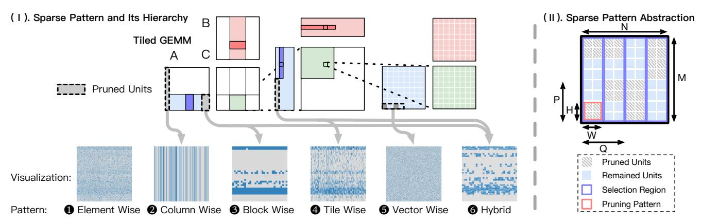
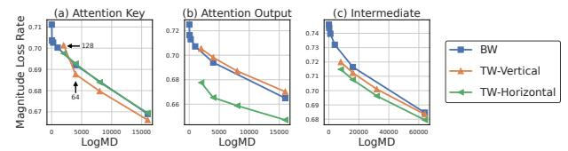
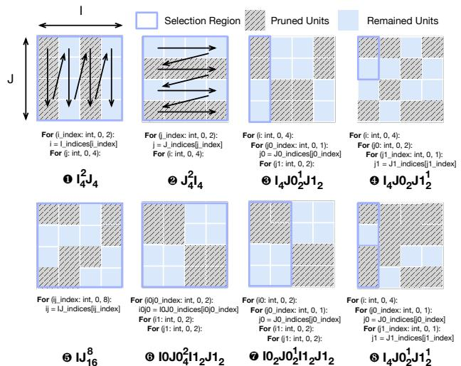
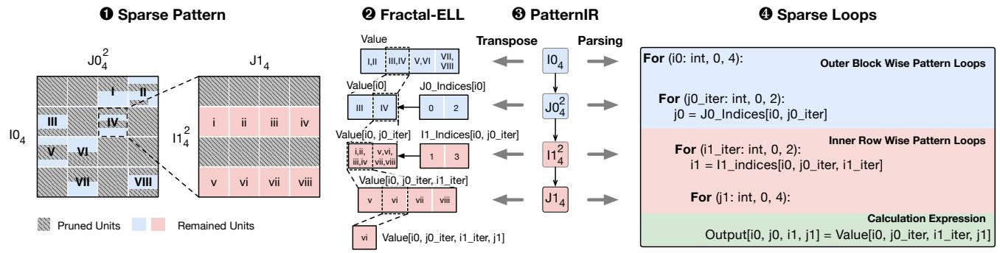
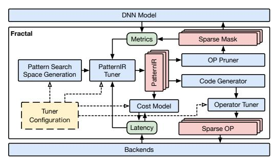
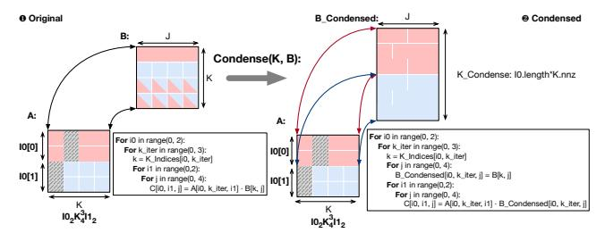
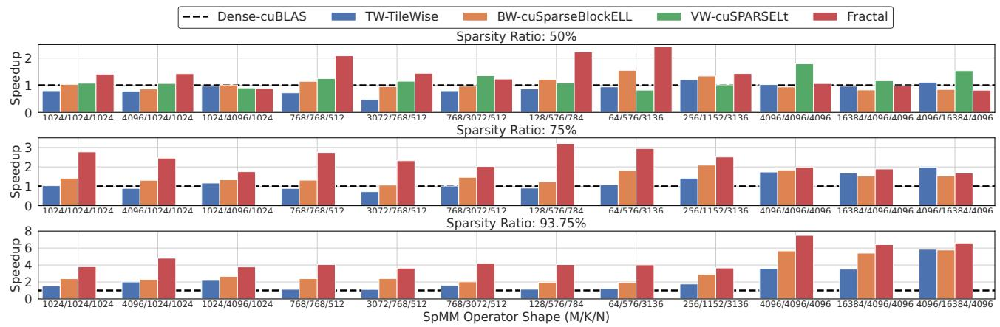
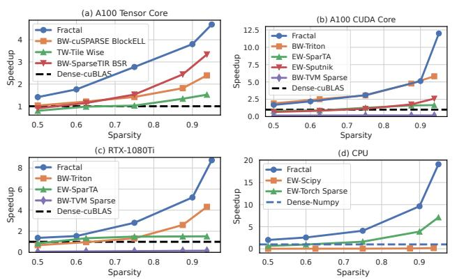
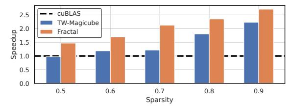
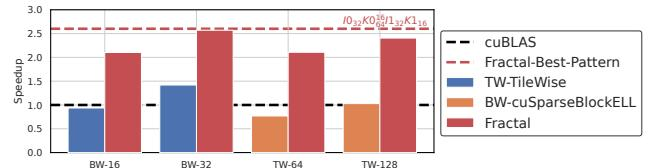

# Fractal: Joint Multi-Level Sparse Pattern Tuning of Accuracy and Performance for DNN Pruning

Yue Guan bonboru@sjtu.edu.cn Shanghai Jiao Tong University Shanghai Qi Zhi Institute

Jingwen Leng<sup>∗</sup> leng-jw@cs.sjtu.edu.cn Shanghai Jiao Tong University Shanghai Qi Zhi Institute

Changming Yu fichmi@sjtu.edu.cn Shanghai Jiao Tong University Shanghai Qi Zhi Institute

Chao Li lichao@cs.sjtu.edu.cn Shanghai Jiao Tong University Shanghai Qi Zhi Institute

Yangjie Zhou yj\_zhou@sjtu.edu.cn Shanghai Jiao Tong University Shanghai Qi Zhi Institute

Minyi Guo guo-my@cs.sjtu.edu.cn Shanghai Jiao Tong University Shanghai Qi Zhi Institute

# Abstract

Model pruning, which eliminates redundant parameters and reduces computational complexity, emerges as a viable strategy for efficient deep neural network (DNN) deployment. Owing to the irregular memory access and computation patterns in the sparse DNN models after pruning, existing arts have suggested various structured sparse patterns to enhance sparse DNN performance. In this work, we propose a unique perspective of understanding existing sparse pattern design as computation-skipping after tiling the tensor computation into multi-level hierarchies. This unified perspective opens up a new design space of multi-level sparse tiling to maximize the sparsity benefits of DNNs, as opposed to the single-level choice in current practices. We present Fractal, an auto-tuning system for sparse patterns that identifies the optimal multi-level sparse tiling pattern. We introduce PatternIR, a novel high-level intermediate representation (IR), to express a diverse range of multi-level sparse patterns. By leveraging insights from prior dense operator optimizations, we translate PatternIR into low-level compiler IRs, facilitating further operator optimization and code generation. Our evaluations demonstrate that Fractal yields substantial speedups of up to on average 3.16× on CUDA Core, 2.52× on TensorCore of GPUs compared to the state-of-art dense baseline under 75% sparsity while upholding minimal accuracy degradation compared to prior sparse operator libraries.

# CCS Concepts: • Software and its engineering → Domain specific languages.

∗ Jingwen Leng is the corresponding author.


[This work is licensed under a Creative Commons Attribution-](https://creativecommons.org/licenses/by-nc-nd/4.0/)NonCommercial-NoDerivs International 4.0 License. ASPLOS '24, April27-May1,2024, LaJolla,CA,USA © 2024 Copyright held by the owner/author(s). ACM ISBN 979-8-4007-0386-7/24/04 <https://doi.org/10.1145/3620666.3651351>

Keywords: Structural Pruning, Sparse Tensor Compiler, Sparse computation acceleration, Deep Learning

#### ACM Reference Format:

Yue Guan, Changming Yu, Yangjie Zhou, Jingwen Leng, Chao Li, and Minyi Guo. 2024. Fractal: Joint Multi-Level Sparse Pattern Tuning of Accuracy and Performance for DNN Pruning. In 29th ACM International Conferenceon Architectural Support for Programming Languages and OperatingSystems, Volume 3 (ASPLOS '24), April 27- May 1, 2024, La Jolla, CA, USA. ACM, New York, NY, USA, 15 pages. <https://doi.org/10.1145/3620666.3651351>

# 1 Introduction

With the rapid development of deep neural network (DNN) models and their success across diverse tasks, their efficient inference deployment becomes a paramount task. Meanwhile, the sizes of the DNN models increase swiftly [30, 36], precipitating an urgent surge in demand for varied computational resources. Consequently, optimizing these models regarding execution time, energy utilization, and serving throughput emerges as a pivotal challenge for both the machine learning and computer system domains.

In this context, model compression, encompassing quantization, pruning, and distillation, among other methods, emerges as a promising approach to reducing the computational complexity of DNNs. These techniques often necessitate collaborative optimization with operator development and novel architectural support to attain substantial enhancements. Among these model compression methods, pruning [31] stands out as a crucial technique, offering significant compression potential but requiring substantial systemlevel support. Pruning involves eliminating redundant model parameters, thereby reducing storage memory footprint and computational complexity. However, in practical scenarios, the current computing systems often achieve limited speedup with the pruned DNN models, if not even no speedup. This acceleration gap arises from the irregular nature of pruned sparse models, posing challenges to hardware memory hierarchy and parallel computing due to the sporadic nature of sparse element access. Additionally, decoding sparse element locations during computation causes extra overhead.


**Figure 1.** Prior sparse operator libraries with different patterns and the proposed pattern auto-tuning system Fractal.

Therefore, prior studies [19, 23, 29, 64] aims to bridge this gap by imposing spatial constraints on post-pruning non-zero elements to enhance memory locality. These non-zero elements are grouped to form local structures, denoted as a **sparse pattern**, and collectively pruned. This concept significantly advances sparse DNN efficiency, spawning numerous innovative sparse pattern designs [19, 23, 64]. However, these empirical sparse pattern designs often accompany handcrafted sparse operator libraries, as in the left of Fig. 1.

On the other hand, dense tensor computation often adopts a multi-level tiling strategy [1] to exploit the locality and parallelism in modern hardware like GPU. Inspired by this observation, we find that there is an opportunity to perform multi-level sparse tiling, as opposed to single-level sparse tiling, to maximize the benefits of sparsity in DNNs. However, this has three following challenges. First, we find that different operators have diverse preferences for sparse patterns so we need to tune the pattern accordingly. Second, the multi-level sparse tiling complicates the corresponding code implementation, making the previous approach of hand-crafted kernels infeasible. Finally, the multi-level sparse tiling impacts both the performance and accuracy, requiring a joint and efficient tuning strategy.

To overcome these challenges, we propose an automated approach to identify the optimal multi-level sparse pattern considering model accuracy and execution efficiency. We first introduce a novel loop-based intermediate representation PatternIR capable of representing diverse structured sparse patterns, thus forming a comprehensive search space. Leveraging this representation, we develop Fractal, a system dedicated to tuning sparse patterns for generating high-performance sparse DNN operators while adhering to accuracy importance score constraints. Furthermore, we employ the PatternIR to generate efficient operators through low-level tensor compilers [4, 37, 60], enabling the reuse of dense operator optimizations to sparse tensors.

To assess our approach, we demonstrate that Fractal yields operators achieving a 3.16× speedup on CUDA Core GPU, 2.52× speedup on Tensor Core GPU compared to the dense baseline under 75% sparsity. Notably, Fractal demonstrates

| Sparse  | Model        | Operator              | OP           | Supported  | Operator   |
|---------|--------------|-----------------------|--------------|------------|------------|
| Pattern | Acc.         | Library               | Perf.        | Backends   | Generation |
|         |              | SparTA[72]            | <b>//</b>    | All        | Template   |
| EW      | <b>V V V</b> | Sputnik[17]           | <b>√</b>     | All        | Auto       |
|         |              | cuSPARSE[48]          | ✓            | All        | Vendor     |
|         | /            | Triton-BW[60]         | <b>//</b>    | CUDA Core  | Template   |
| BW      | *            | cuSPARSE-BlockELL[48] | <b>///</b>   | All        | Vendor     |
|         |              | MagicCube[40]         | <b>V V V</b> | A100       | Manual     |
| TW      | <b>V</b>     | TileWise[23]          | <b>V V V</b> | V100, A100 | Manual     |
|         |              | Oclet Tiling[5]       | <b>///</b>   | V100       | Manual     |
| VW      | <b>V V V</b> | cuSPARSELt [49]       | <b>V</b>     | Sparse TC  | Vendor     |
| Hybrid  | <b>///</b>   | Fractal               | <b>///</b>   | All        | Auto       |

**Table 1.** Sparse operator libraries and pruning patterns.

superior trade-offs between accuracy and speedup compared to previous sparse pattern operators.

In summary, this study contributes as follows.

- We propose the loop-based PatternIR and transformation primitives to represent a broad spectrum of sparse patterns.
- We propose the first sparse pattern tuning system Fractal to search the optimal pattern for DNN considering the model accuracy and execution performance.
- We conduct thorough evaluation of Fractal with comprehensive settings to show its effectiveness and generality.

## 2 Background and Motivation

Initially, we offer a concise introduction to the pruning algorithm and the abstraction of structured sparse patterns as background information. Subsequently, we delve into the complexities inherent in designing sparse patterns, particularly those exhibiting multi-level sparsity.

## 2.1 Sparse Pattern Background

Pruning, a model compression technique, selectively removes unnecessary parameters from a DNN model, consequently improving inference speed and reducing memory usage [31]. The eliminated parameters are zeroed, enabling the sparse DNN model to leverage the efficiency of sparse linear algebra [61]. The pruning process incorporates three essential aspects: **importance score**, **pruning paradigm**, **and sparse pattern** [6, 22, 31]. The importance score assesses weight significance during pruning, which will be discussed in Sec. 4.2. The pruning paradigm dictates the accuracy restoration strategy (e.g., retraining) for the pruned model. This study focuses on the sparse pattern design, pivotal in balancing the efficiency and accuracy of sparse DNN models, while the former two aspects remain orthogonal.

Trivially, parameters in a DNN model are ranked based on their importance scores and pruned independently, commonly known as unstructured or element-wise (EW) pruning, as illustrated in Fig. 2 ①. Due to their irregular memory accesses and unbalanced computations, unstructured sparse operators necessitate a high sparsity ratio exceeding 99% to achieve speedups on hardware backends like GPUs [17, 48]. However, in practice, these models are typically pruned to sparsity ratios ranging from 50% to 90%



**Figure 2.** (I). Pruning hierarchy of tiled GEMM and corresponding sparse patterns. We visualize the pattern under 75% sparsity with the query weight of BERT-large 1st layer. (II). Sparse pattern abstraction and design factors.

to maintain acceptable model accuracy [6, 28, 31]. Consequently, unstructured pruning encounters challenges in attaining substantial speedup values that are meaningful.

**Sparse Patterns.** Previous research has introduced structural constraints, termed **sparse patterns**, aimed at organizing the placement of non-zero elements within sparse tensors. These structured patterns serve to enhance hardware parallelism and reduce random access during sparse data handling. However, imposing spatial patterns on unpruned elements introduces an additional layer of regularization that may potentially affect the DNN model's expressiveness and accuracy. Consequently, numerous studies have explored various pruning patterns to optimize them for hardware efficiency and model error reduction. As depicted in Fig. 2, these patterns are inspired by the tiling structure of dense operators and apply pruning at specific levels, such as **9** Block Wise (BW) [19] and **9** Tile Wise (TW) [23, 26].

In summarizing previous research on sparse patterns, we have developed an **abstract model** depicting the design factors for structured sparse patterns in Fig. 2 II. This model incorporates a pruning pattern with dimensions H and W, alongside a selection region measured as P by Q. The pruning pattern, highlighted by a pink frame in the figure, specifies the dimensions of elements to be pruned collectively. Conversely, the blue frame indicates the selection region, which defines the area where adjacent pruning units are collectively ranked. As a result, each selection region maintains a uniform sparse ratio, since elements within these regions are pruned on a local basis. For example, the Fig. 2 **6** vectorwise (VW) pattern [73] incorporates a fine-grained selection region for 2:4 vector shape pruning, which is supported by a dedicated hardware unit Sparse Tensor Core [44].

**Pattern Mask Diversity.** Evaluating the accuracy impact of a sparse pattern is difficult and time-consuming. Previous studies have highlighted a robust correlation between sparse model accuracy and sparse pattern expressiveness, quantified through a metric termed mask diversity (MD) [33]. This

metric computes the count of all potential pruning masks for a given sparse pattern and target tensor shape. For example, the MD of 50% unstructured pruning of a 2×2 tensor is  $C_4^2=6$ . Given the typically vast value of MD, log(MD) is employed as an evaluative metric for the accuracy-related implications of a sparse patterns, depicting the spatial constraints imposed by the structured patterns.

#### 2.2 Need for Sparse Pattern Tuning System

In this subsection, we present our perspective of understanding sparse patterns as certain form of sparse computation tiling, unveiling unexplored opportunities in multi-level sparse tiling. Furthermore, we outline the challenges inherent in multi-level sparse tiling, underscoring the necessity for a systematic and principled pattern tuning system.

Connection of sparse pattern and computation tiling. Dense computations such as general matrix multiplication (GEMM) employs multiple levels of tiling, depicted at the top of Fig. 2 I, to enhance parallelism and data locality. We observe that existing sparse patterns from to can be perceived as instances of omitting computation within a specific tiling hierarchy. For example, the BW pattern [19] skips the computation at a coarse granularity, while the TW pattern [23] skips the computation at a finer granularity.

Multi-level sparse tiling opportunity. The existing sparse pattern libraries, enumerated in Tbl. 1 solely exploit skipping opportunities at a fixed level, while contemporary parallel hardware such as GPUs necessitates multiple levels of tiling to maximize its efficiency [2, 38, 63]. While current patterns only achieve sub-optimal performance, we propose to exploit the multi-level sparse tiling opportunity to fully unleash the potential of sparsity in DNNs. This approach promises advantages in both performance, through the implementation of performance-oriented tiling hierarchies, and accuracy via greater diversity in sparse patterns. For example, it is possible to leverage two levels of sparse tiling, forming the hybrid pattern of Fig. 2 **6**. However, the multi-level sparse tiling



**Figure 3.** Pruning magnitude loss on different weight tensors under 75% sparsity.

has the following challenges, which we propose to build a principled and systematic pattern tuning system to address.

Diverse operator-level accuracy preference. Previous works [19, 28, 47] adopt a single sparsity pattern for the entire model, which is sub-optimal considering the diverse operator-level accuracy preferences. In Fig. 3, we show the magnitude loss pruned with different patterns for several weight tensors of the first layer from a BERT-large model. Notably, even with comparable mask diversities, each tensor exhibits a unique optimal pruning pattern. For example, horizontal TW causes much less magnitude losses compared to BW and vertical TW for (b) attention output tensor, while the opposite for (a) attention key. This variance stems from the intrinsic spatial structures within weight tensors, such as the attention heads [11, 62, 64]. Additionally, as illustrated in Fig. 3 (a), the vertical TW pattern outperforms others with granularities below 64, aligning with the 64 hidden size in the pruned tensor. When the granularity is extended to 128, the vertical TW pattern becomes even worse than the others as this means we are forcing adjacent heads to be pruned together. This emphasizes the necessity for automatic pattern tuning to strike a balance between accuracy and performance at the operator level.

Automatic high-performance code generation. Existing sparse patterns in Tbl. 1 design underlying kernels empirically to achieve high performance. This necessitates substantial engineering dedication and optimization tailored to each hardware and operator, rendering such libraries non-scalable. While some libraries incorporate template-based or autooperator generation, these functionalities remain confined to specific sparse patterns and do not encompass the entirety of sparse design for the target backend. In contrast, dense DNN models benefit from automatic high-performance code generation facilitated by compilers like TVM [4], which formulates a proper tiling transformation space for performance tuning. However, formulating the multi-level sparse tiling space remains an open and challenging problem.

Enormous performance and accuracy tuning space. Given the above aspects, the design of sparse patterns needs to be determined carefully to achieve optimal acceleration while retaining model accuracy. To illustrate, we summarize the overall latency performance and model accuracy of the sparse operator libraries in Tbl. 1 as OP Perf. and Model Acc. respectively. This leads to a very large design search


Figure 4. Loop perforation and structured sparse pattern.

space by combining these factors. To illustrate, constraining pattern sizes to multiples of 2 on a tensor sized  $1024 \times 1024$  yields approximately  $3 \cdot 10^{11}$  potential patterns. Not only do these factors have a large number of design space, but they are also coupled with the latency and accuracy tradeoff, further complicating the quest for the optimal solution. Consequently, an efficient and swift methodology is essential to navigate this colossal sparse pattern space for joint performance and accuracy tuning.

**Summary.** Given the challenges associated with designing sparse patterns, meeting the demands of execution efficiency and model accuracy through empirical explorations becomes complicated. Consequently, an effective auto-tuning technique becomes paramount to attain the optimal pruning patterns and generate the corresponding sparse operators.

# 3 Loop-based Pattern Representation

To tackle the challenge of pattern design and its auto-tuning, we introduce a novel loop-based intermediate representation (IR), PatternIR. This representation comprehensively expresses a broad spectrum of sparse patterns, enabling the establishment of an extensive search space for the optimal pattern selection. Moreover, PatternIR **prioritizes loops as the first-class citizen**, leveraging the nested loops characteristic of tensor program compilers. This enables the conversion of sparse operators into low-level representations, facilitating the utilization of existing optimization techniques. This section presents the formal definition of PatternIR and its associated transformation primitives.

#### 3.1 Definition of PatternIR

**Loop Perforation.** The inspiration for our loop-based pattern representation stems from the loop perforation technique in approximate computing [32, 41, 57]. Loop perforation enhances computational efficiency by selectively skipping iterations while compromising on accuracy. Drawing from this concept, we perforate dense loops with sparse indices, enabling conditional computation as depicted in Fig. 4. Since tiling loops are arranged hierarchically, perforating an outer loop results in the omission of all nested inner loops, as illustrated by the entire column in Fig. 4. This approach yields a structured access pattern for the tensor  $\boldsymbol{A}$  in the figure, which is equivalent to the structured sparse pattern.

**Formulation.** Following the above intuition, we define sparse patterns as perforated tiling loops. A sparse loop,



**Figure 5.** PatternIR: **①** column major. **②** row major. **③**, **②** split. **⑤** join. **⑤** global BW. **②** balanced BW. **⑤** hybrid pattern.

denoted as  $I_{length}^{nnz}$ , represents a loop characterized by its iteration length and the count of non-zero (nnz) elements after perforation. If the iteration length equals to the nnz, indicating a dense loop, the nnz value superscript is omitted. As depicted in Fig. 4, sparse loops necessitate an index vector to record the original dense positions of sparse elements. The index value ranges from 0 to the iteration length, with the vector's length equals to nnz. Structured patterns are then represented by combining these sparse loops, such as  $I_{i\_length}^{i\_nnz}J_{j\_length}$ . When a sparse loop J depends on another sparse loop I, it suggests that J's values and those of subsequent loops are stored contiguously with better spatial locality than I.

Expressiveness of Patterns. Utilizing PatternIR, a broad spectrum of structured patterns can be represented by organizing sparse loops and identifying their nnz values. In Fig. 5, we demonstrate various fundamental forms to compose complex sparse patterns. We showcase the corresponding PatternIR and perforated loop structure of each pattern. • and show the patterns with reversed layouts and PatternIR dependencies. 3 and 4 show the patterns with diverse selection regions and pruning pattern granularities by perforating different loops. • shows the unstructured EW pattern with joined loops. • and • compare the global BW and columnbalanced BW patterns derived by changing the selection regions. Employing similar concepts, existing sparse patterns discussed in Fig. 2 **1** are represented with the proposed PatternIR, such as BW pattern with  $10K0_{1024}^{256}I1_{32}K1_{32}$  and VW with  $I_{1024}K0_{256}K1_4^2$ . This guarantees the rich search space of

| Primitive                   | Example         | PatternIR                                      | Storage Transpose             | Loop Transformation               |  |
|-----------------------------|-----------------|------------------------------------------------|-------------------------------|-----------------------------------|--|
| Initialization              | Init(OP)        | $I_4J_4$                                       | value[i, j]                   | For i in (0, I.length):           |  |
|                             |                 |                                                | 2.33                          | For j in (0, J.length):           |  |
|                             | Split(I, 2, 2)  | 10 <sub>2</sub> 11 <sub>2</sub> J <sub>4</sub> |                               | For io in (0, I0.length):         |  |
| Split(loop, size_a, size_b) |                 |                                                | value[i0, i1, j]              | For i1 in (0, I1.length):         |  |
|                             |                 |                                                |                               | For j in (0, J.length):           |  |
| Reorder(loop a, loop b)     | Reorder(I, J)   | $J_4I_4$                                       | value[j, j]                   | For j in (0, J.length):           |  |
| rcorder(100p_a, 100p_b)     |                 |                                                | varue[j, 1]                   | For i in (0, I.length):           |  |
| Join(loop_a, loop_b)        | Join(I, J)      | IJ <sub>16</sub>                               | value[ij]                     | For ij in (0, I.length*J.length): |  |
|                             | Perforate(J, 2) | $I_4J_4^2$                                     | value[i, J indice[i, j iter]] | For i in (0, I.length):           |  |
| Perforate(loop, nnz)        |                 |                                                | J indice[i, j iter]           | For j_iter in (0, J.nnz):         |  |
|                             |                 |                                                | J_marce[i, j_ner]             | j = J_indices[i, j_iter]          |  |
|                             | Condense(J, A)  | $I_4J_4^2$                                     |                               | For i in (0, I.length):           |  |
| Condense(loop, buffer)      |                 |                                                | A'[i, j iter]                 | For j_iter in (0, J.nnz):         |  |
| Condense(100p, buller)      |                 |                                                | A [i, j_iter]                 | j = J_indices[i, j_iter]          |  |
|                             |                 |                                                |                               | $A'[i, j\_iter] = A[i, j]$        |  |

**Table 2.** Illustration of transformation primitives defined on PatternIR, and corresponding examples for showing their effects.

Fractal to contain the current solutions. Through the perforation of multiple sparse loops, PatternIR even facilitates the exploration of novel hybrid patterns like Fig. 5 **6**.

**Sparse Pattern Abstraction.** We now demonstrate how to express an arbitrary sparse pattern according to the abstraction discussed in Sec. 2.1 with PatternIR. Assuming a PatternIR comprising n and m sparse loops related toj I and J dimensions respectively, the size of the original dense tensor is the multiplication of all the loop lengths,  $N = \prod_{i=0}^{n} \text{li.length}$ . The pattern size perforated on a particular loop It is determined by the lengths of all successive loops, defined as  $W = \prod_{i=t+1}^{n} \text{li.length}$ . Correspondingly, the selection region size Q equals  $Q = \prod_{i=t}^{n} \text{li.length}$ . Although only the sizes of dimension I are demonstrated, the sizes M,H and P of dimension J are derived following the same method.

#### 3.2 Transformation Primitives

The transformation of PatternIR to express diverse patterns involves defining transformation primitives on PatternIR as Tbl. 2. The PatternIR derives from a dense loop tiling structure, and consequently, we introduce the tiling primitives: split, reorder, and join, similar to those in tensor compilers [4, 37, 60]. Particularly, these primitives, when applied to sparse loops in PatternIR, implicitly restructure both the underlying sparse storage and loop. Additionally, the perforate primitive is introduced to induce sparsity, while the condense primitive is reserved for optimizing sparse operators, to be discussed later. To illustrate the impact of each primitive, we employ a basic PatternIR I<sub>4</sub>J<sub>4</sub> as an example.

- **Split** primitive divides the loop into two sub-loops with given lengths to create fine-grained tiling structure as shown in Fig. 5 **3** and **3**. The memory accessing are transformed to two iteration variables without changing the storage.
- Reorder primitive exchange the dependency of two adjacent loops. This will explicitly transpose the storage of the two axes and their computation loop order as shown in Tbl. 2. For example in Fig. 5 and •, the sparse tensor is transposed from column-major storage to row-major storage, while the pattern is changed from column-wise to row-wise.
- **Join** primitive merges two loops to a greater iteration loop, as the inverse operation of split. It flattens the storage of the two axes and merges the loop indexing. Join primitive also



Figure 6. Hybrid sparse pattern, PatternIR and corresponding storage format Fractal-ELL and sparse loops.



Figure 7. System architecture.

combines the regions in the pattern as shown in Fig. 5 **9**. When joined together, the loops' PatternIR are concatenated together without subscripts.

• **Perforate** primitive is the essential transformation that introduces sparsity into the PatternIR. It annotate the loop with nnz and create sparse index array. The storage of the value tensor is also reduced to the its sparse counterpart.

## 4 Fractal: Sparse Pattern Auto-Tuner

Based on the aforementioned PatternIR representation, we build the Fractal system to conduct auto-tuning of the sparse patterns. Leveraging sparsity across various dense tiling hierarchies facilitates the reuse of dense operator optimizations and bridges the sparse operator with its dense counterpart. To the best of our knowledge, our research marks the first attempt to propose a comprehensive representation of sparse patterns and employ it for automatic pattern exploration.

**System Overview.** Fig. 7 shows the architecture of the Fractal system. At its core, the PatternIR acts as the primary interface interacting with the operator pruner, code generator, and pattern tuner module. The operator pruner determines the pruning mask and evaluates the pruning metrics, which serves as a tuning threshold to make the process accuracy-aware. The code generator compiles the sparse operator utilizing the PatternIR and tunes it with the low-level operator tuner to measure its latency. These performance metrics drive the pattern tuner to explore the pattern search space, aiming to converge toward an optimal solution that guarantees both model accuracy and operator performance.

## 4.1 Sparse Operator Code Generation

We begin with the generation of efficient sparse operators given the a PatternIR. Parsing the structured sparse operator involves its conversion into low-level tensor program compiler IRs [13, 68]. Subsequently, we leverage code generation techniques and operator tuning to enhance performance.

**Sparse Format: Fractal-ELL.** We propose a novel sparse format Fractal-ELL to store the sparse tensors, as described with Fig. 6. This format is motivated by combining the ELL sparse format [3], which stores the indices of nnz elements of each row. The blue section of Fig. 6 demonstrates the ELL format with a (4,4) sparse matrix with axes I0, J0 under 50% sparsity. The index vector J0\_indices preserves the indices of nnz elements of each row.

Fractal-ELL extends it with multi-level sparse loops. The blue and pink sections of Fig. 6 highlight the Fractal-ELL format featuring 4 levels, where  $\bullet$  and  $\bullet$  are the corresponding pattern and PatternIR. The size of the value matrix is determined by the total count of non-zero elements, which is the product of the non-zero elements across all loops. For the sparse loops, indices vectors are attached following the ELL format. Consequently, the vector's size is dictated by the cumulative non-zero elements across all preceding loops. For example, the index vector I1\_indices's size of the third loop I1 is  $4 \times 2 \times 2 = 16$ . As the pattern of the I1 loop is a  $1 \times 4$  vector, this index vector keeps the relative position of each vector in the inner  $4 \times 4$  block as illustrated in Fig. 6  $\bullet$ .

PatternIR Lowering. As PatternIR is a thin abstraction layer to represent structural sparse patterns with dense loops, it can be transformed to loop-based tensor program compilers' IRs, such as TVM [4], TACO [37], among others. In this study, our implementation of the Fractal system utilizes SparseTIR [68] as the backend sparse tensor compiler, leveraging its open-source code base and the vibrant TVM community. Parsing the sparse operator through PatternIR, we convert it into SparseTIR's tensor program expression, capitalizing on the reuse of its code generation tools. This process is depicted in Fig. 8.

Initially, for an input dense operator, we sample a sparse pattern employing the transformation primitives introduced


**Figure 8.** Code generation pipeline of Fractal. The green blocks represents pattern tuning and operator tuning schedules.

in Sec. 3.2. The sampling of the sparse pattern occurs through two fundamental steps: ② tiling and ③ perforation schedules. While the application order of primitives remains flexible, we adopt this two-step approach to streamline the pattern generation process and cache redundant computations without compromising generality. The primitives in the first step are translated to the corresponding loop transformation primitives defined on SparseTIR. The perforation primitive of the second step is implemented by rewriting the operator's expression as shown in Fig. 4. Revision G. Missing discussion of the algorithm language that PatternIR transforms. With this design, the validation of transformation correctness, such as loop nest and buffer boundary, is checked and guaranteed by the low-level primitives. Further elaboration on this methodology is provided in Sec. 24.

In this example, we exhibit a GEMM operator with three perforated loops. Subsequently, the dense operator and the derived PatternIR are translated to a sparse operator as shown by Fig. 8 **4**. The sparse operator consists of the sparse axis, sparse storage buffers, and sparse iterations. These sparse axes correspond to the nodes within the PatternIR object, requiring explicit specification of the dependent axis. Index vectors are assigned to the perforated sparse loops. By declaring these sparse axes, the sparse storage is transposed into the Fractal-ELL format. Simultaneously, the loops are transformed into the sparse form, as shown in Fig. 6 3. The subsequent step involves translating the sparse operator to the low-level tensor compiler TVM's intermediate representation (IR), demonstrated in 6. Consequently, the sparse GEMM operator adopts a tiled-loop format with sparse indexing, rendering it amenable to further operator tuning.

**Operator Tuning.** To get efficient sparse operator implementation, we adopt the tensor program auto-tuning tool MetaSchedule [54] to optimize the operator's efficiency. This tool constructs a probabilistic search space for operators



Figure 9. Illustration of condense primitive.

and employs learning-driven methods to determine an optimized schedule. Capitalizing on the loop-based sparse pattern derived from the PatternIR, the resultant sparse operator becomes hardware-friendly and aligns seamlessly with the low-level operator tuner. Fig. 6 **6** depicted an example of an optimized sparse operator schedule.

Condense Primitive. Alongside the operator tuning transformations, we introduce a novel transformation primitive Condense, aimed at regularizing the random access of sparse tensors. The concept of the Condense transformation involves aggregating noncontinuous sparse values within a sparse pattern to construct a dense storage. To illustrate this, consider the Condense transformation applied to a sparse GEMM operator as depicted in Fig. 9. When condensing the sparse loop K of tensor A, the discrete elements of A along loop K induce random access within tensor B, as demonstrated in **1**. This results in inefficient local memory access due to thread conflicts. A solution to mitigate this issue involves pre-gathering corresponding values in B based on the indices of A, organizing them into an aligned storage structure. Furthermore, data movement of Condense could be integrated into the caching process of local memory without incurring extra overhead. However, condensing tensor B necessitates additional storage, as each outer loop holds distinct indices. Consequently, this primitive tuned through the operator tuning process to optimize its utilization.

Backend Specific Configurations. Alongside the sparsityoriented Condense transformation primitive, various backend-specific configurations play a crucial role in optimizing performance during operator tuning. These settings are provided as the tuner configuration, orchestrating the search process within Fractal. We spotlight a distinctive GPU backend rule as an example in the subsequent discussion.

During the execution of sparse kernels with dynamic index values on SIMD hardware like GPGPU, parallel threads executing the same instruction can potentially access identical memory locations. This situation can lead to conflicts, resulting in inaccurate computation outcomes when multiple threads simultaneously write to the same memory location. To ensure correctness, computations are transformed into atomic operations, but this introduces significant inefficiency and computational overhead. To mitigate inter-thread reduction, two rules are incorporated into the backend's tuner configuration. (1) spatial axes successive to reduction axes are prevented from perforation. (2) the joining of spatial and reduction axes is disallowed. These rules serve to prevent parallel threads from contributing to identical output memory locations, averting computation result reductions across threads. Typically, existing sparse operator libraries implicitly apply these rules as common constraints, following empirical designs by developers. Thus, introducing these rules does not foreclose any potential patterns within Fractal.

## 4.2 Pruning with PatternIR

We illustrate how PatternIR facilitates accuracy metric calculation during pattern tuning.

Importance Scores. To comprehensively evaluate the pattern's regularization effect on model accuracy, we introduce pruning importance scores as a tuning objective within the pattern tuning process. These scores predict the accuracy impact associated with each element of each operator. For instance, the magnitude score aggregates directly pruned values, commonly used in most pruning algorithms. The L1 norm adopts the gradient of the pruned value to assess its influence on the final loss objective. Besides, there are also advanced importance scores like ERK [45], LAMP [39], Wanda [59], tailored for specific pruning scenarios.

During pattern tuning, we use an importance score threshold to filter patterns surpassing it to prevent substantial model performance degradation. Because the redundancy of DNN weight parameters enjoys an operator-wise variance. Determining the optimal operator sparsity given a global accuracy objective is non-trivial [39, 45]. In this work, we use the importance score pruned with the unstructured pattern as the threshold for all operators. The motivation is that an unstructured pattern provides the theoretical lower bound of accuracy loss. As these importance scores are compatible with the proposed method, we select the most popular

magnitude metric for our experiments. Moreover, we offer a customizable interface to specify the importance score employed during tuning.

**Multi-level Pruning.** Given that previous patterns have solely accounted for a single level of sparse pattern, the ranking of regions becomes trivial. In contrast, for the proposed multi-level hybrid patterns, a greedy solution is introduced to iteratively prune each level of the pattern. The pruning sequence for multi-level patterns proceeds from coarse-grain to fine-grain, ensuring that the pruning of inner loops remains unaffected by the outer loops.

#### 4.3 Sparse Pattern Auto-Tuner

The sparse pattern tuner coordinates the previous code generation and pruning procedures as sub-routines, assessing accuracy and performance metrics for each PatternIR. Its objective is to identify the most efficient sparse pattern within specific pruning importance score constraints. A given threshold filters candidates composed of different patterns and sparsity levels to guarantee accuracy. The Fractal tuner generates a PatternIR search space, followed by the ranking of candidate PatternIRs for subsequent tuning iterations. These chosen candidate patterns undergo parsing into sparse operators and subsequent optimization via the operator compiler, enabling an evaluation of their real latency outcomes. To expedite the tuning process, we integrate a machine learning-based cost model for latency prediction. The tuner's pseudo-code is presented in Alg. 1.

#### **Algorithm 1:** Pattern Tuning Pseudo Code of Fractal.

```
Data: Dense Operator: OP, Tuner Config: Config
   Result: Sparse Pattern: Sch
 1 Schs \leftarrow GenTilingSpace(OP); // Generate tiling space
_2 CachedScores \leftarrow Config.pruner(sparsePatterns); // Compute
\textbf{3} \quad Schs \leftarrow \textbf{GenPerforationSpace}(Schs); \textit{//} \quad \texttt{Genrate perforation space}
4 Scores \leftarrow Config.pruner(Schs, CachedScores); // Compute scores
5 Schs \leftarrow FilterByScore(Schs, Scores, Config.max\_score); // Filter
       with threshold
6 Latencies' ← CostModel(Schs);// Predict patterns' latencies
7 Latencies', Schs \leftarrow Sort(Latencies', Schs);
8 BestLatency, Sch \leftarrow Inf., None;
9 for j in Config.search_num do
         // Compile and evaluate top candidates
10
         SparseOP \leftarrow CodeGen(Schs[j]);
11
         SparseOP \leftarrow OperatorTuner(SparseOP);
         Latency \leftarrow Exec(SparseOP);
12
         if Latency > Config.latency limit then
13
14
         Continue;// Early stop
15
         end
         \textbf{for } k \textbf{ in } Config.tune\_iteration \textbf{ do}
16
17
             SparseOP \leftarrow OperatorTuner(SparseOP);
18
         end
         Latency \leftarrow \mathbf{Exec}(SparseOP);
19
         if Latency < BestLatency then
              // Update best result
21
              Sch \leftarrow Schs[i];
              Config. latency\_threshold.updateThreshold(Latency);
23
24 end
```



Figure 10. Operator performance results on A100 Tensor Core.

**Search Space Generation.** The search space generation begins by initializing the vanilla PatternIR from the input dense operator expression. As discussed previously, generating a sparse pattern involves two stages: loop tiling (Line 1) and perforation for sparsity (Line 3). Firstly, we generate diverse combinations of loop sizes derived from the dense PatternIR. For each tiling setting, we transform the initialized PatternIR accordingly with the primitives. To constrain the search space size, we employ rule-based tuner configurations. As a practical example, we enforce a maximum depth of each axis of 3 and a minimum length of each loop of 4.

Subsequently, we explore all feasible perforation configurations on the tiled PatternIR. For example, a sparse loop with a length of 8 undergoes perforation ranging from nnz 1 to 8. Throughout this phase, we assess the pruning importance score, pre-emptively discarding patterns that don't meet the qualifications. Additionally, we opt to cache the results of the importance score computation, given that the evaluation of importance scores for distinct patterns often involves scoring identical regions.

**Cost Model.** Before parsing the sparse operator for real backend latency assessment, we leverage an ML-based cost model to forecast the performance of the sparse patterns. We use the cost model to predict the latencies of candidate patterns and select the top-ranking ones for actual code generation and performance tuning. Each sparse pattern generates a feature vector by concatenating the attributes of its sparse loops, encapsulated within a 4-element tuple comprising loop length, non-zero count, axis type, and tiling hierarchy order. For example,  $10_{32}$ K $0_{64}^{16}$ 1 $1_{32}$ K $1_{16}$  is converted to a feature vector as [(32, 32, 0, 0), (64, 16, 1, 1), (32, 32, 0, 2), (16, 16, 1, 3)]. To utilize the sequential dependency characteristic inherent in sparse loops, we employ a bidirectional LSTM[18] as our prediction model. We profile several thousand generated sparse operators accommodating various input shapes as training calibration. It should be noted that the cost model is

specified for each backend and requires extra profiling and training when extended to new hardware. The cost model is proposed to accelerate the pattern tuning process, and the Fractal system is feasible when applied to new backend without a cost model. The tuning overhead varies significantly across different configurations. In practice, we have identified a set of empirical settings that enable the search to converge in under 2 hours. Specifically, the operator tuning process of MetaSchedule for each PatternIR candidate takes a maximum of 20 minutes. This operator tuning process is early stopped on non-prospective candidates with heuristic latency thresholds.

## 5 Evaluation

#### 5.1 Experimental Setup

**Testbed.** The evaluation of Fractal encompasses servers featuring GPU cards of NVIDIA A100 (80G) and NVIDIA RTX-1080Ti and Intel(R) Xeon(R) E5-2620 v3 @ 2.40GHz CPU. Our experiments rely on essential dependencies: CUDA-11.7, TVM-0.12.0, and SparseTIR.

Benchmark and Datasets. To evaluate the efficiency of tuned patterns, we select representative operators from the BERT-base, BERT-large [62], VGG[58] and ResNet [27] model following previous works [23, 72]. The convolution operators from the two CNN models are transposed to matrix multiplication operation with img2col algorithm [34]. We benchmark the operator 1000 times and report the average value with 100 times warmup runs. To evaluate the model speedup, we aggregate the latency of all the operators for all baselines following prior works [23, 40]. For model accuracy evaluation of different patterns, we use movement pruning [53] on the MRPC semantic classification dataset[12] with BERT-base and BERT-large models. For most of the experiments, we



Figure 11. Benchmark results on diverse backends.

adopt an operator with FP16 data format, which is the most common setting for lossless DNN inference.

**Baselines.** We compare Fractal with dense operator baseline cuBLAS[50] and sparse operator libraries summarized with Tbl. 1. As many sparse baselines support only specific backends, we conduct comprehensive comparisons under varied circumstances by adjusting settings related to backends, data formats, operator shapes, and sparsity ratios.

#### 5.2 Sparse DNN Operators Results

We first benchmark the sparse operator performance generated by Fractal against SOTA sparse operator libraries. The comparison includes Block-ELL kernels from the cuS-PARSE [48] library and the Tile Wise [23] pattern optimized specifically for Tensor Core [7]. Here, we only show the operators that can utilize the Tensor Core[44] processing unit due to its supreme efficiency. In the following backend benchmark results, we show the results with the Tensor Core disabled as a new CUDA core backend. Additionally, comparisons involve the cuSPARSELt [49] library utilizing Sparse Tensor Core hardware with the VW pattern, limited to a 50% sparsity ratio. We benchmark 12 representative sparse operators sampled from Transformer, ResNet, and VGG model architectures, normalizing the latency results with the cuBLAS dense operator library. For the sparse pattern libraries, we select and report the result of the best pattern size under each setting. Furthermore, for a fair and realistic operator-level comparison, we constrain the pattern size of each hierarchy within Fractal to be smaller than 64. In cases where the evaluated sparsity is unsupported in sparse libraries, we opt for the closest higher sparsity available.

**Operator Benchmark.** Fractal exhibits substantial speedups, achieving 1.62, 2.52, and 4.00 average speedup factors at sparsity ratios of 50%, 75%, and 93.75% respectively, consistently outperforming other sparse libraries across nearly all evaluated scenarios. Unlike prior libraries optimized for specific settings, which may lead to inadequacies


Figure 12. Singular operator accuracy-aware tuning.

in some cases, Fractal consistently delivers efficient operators by allowing the tuning of optimal patterns and corresponding sparse programs for all scenarios. In instances where sparse operators exhibit 50% sparsity and have their K dimensions larger than 4096, the dense cuBLAS baseline demonstrates remarkable efficiency and the sparsity level is relatively low, causing all sparse approaches to fail at achieving speedups compared to the dense baseline. However, only the VW pattern with hardware support manages to achieve speedup compared to the dense baseline.

**Backend Benchmark.** To demonstrate the versatility of Fractal across various execution backends (Fig. 11), we assess its performance with the 1024/1024/1024 GEMM operator. Notably, Fractal consistently exhibits significant speedups across all evaluated backends. While other sparse operator baselines are limited to specific backends, Triton's BW kernel demonstrates noteworthy results on the A100 CUDA core, offering performance comparable to Fractal. Conversely, on the RTX-1080Ti, Fractal outperforms Triton-BW, showcasing its adaptability to diverse backends.

# 5.3 Accuracy-aware Operator Tuning

We evaluate the effectiveness of accuracy-aware operator tuning with operator-level magnitude loss and model-level accuracy. Additionally, we offer case studies examining the joint tuning search space and the pattern distribution.

**Operator Magnitude.** The preceding evaluations primarily focused on operator execution efficiency, considering a loose restriction on pattern sizes, requiring tile sizes larger than 4. To comprehensively address the accuracy regularization effect inherent in sparse patterns, we further examine the trade-off between pruning accuracy and operator efficiency. We compare the magnitude loss of sparse patterns and operators tuned by specifying several sparsity levels with Fig. 12. To compare, we present patterns tuned by Fractal with a magnitude value as the accuracy threshold. Notably, integrating accuracy importance scores directly into the operator tuning process enhances the Pareto frontier, achieving an improved trade-off between accuracy and speedup. Compared to previous sparse operators, which solely accommodate pre-defined sparse patterns, Fractal presents adaptability for diverse target tensors and sparsity variations.


Figure 13. Layerwise PatternIR, sparsity and speedup breakdown of BERT-base model tuned with Fractal.

**Model Accuracy.** The previous results demonstrated Fractal's effectiveness with uniform sparsity levels across all operators and patterns. However, enhancing model accuracy entails distributing sparsity throughout the model, capitalizing on distinct redundancies within each layer's parameters. Consequently, we undertake a joint tuning approach for operator sparsity and pattern within a DNN model, employing magnitude as the pruning importance score. Globally, we utilize the unstructured pruned magnitude score across the DNN model as the pruning threshold during pattern tuning. We first prune the model with the global unstructured pattern to determine the importance score threshold for each operator and then tune the patterns as introduced in Sec. 4.3. Without any loss of generality, we adopt the movement pruning method, while ensuring compatibility with various pruning paradigms. The results of BERT-base and BERT-large models are shown with Fig. 14. It is shown that with Fractal, the pruned model achieves better efficiency and accuracy Pareto frontier compared with previous sparse libraries by a margin.

Joint Search Space. To illustrate the tuning process, we visualize the search space denoting MD and speedup for a GEMM operator with dimensions M/K/N=1024/1024/1024, showcasing 75% sparsity in Fig. 15. Intuitively, the latency speedup exhibits an inverse relationship with log(MD), portraying the pattern design trade-off between accuracy, and performance. Specifically, our annotations highlight patterns with the best speedup and MD using Tensor Core. Prior research approaches typically explore the search space empirically. However, leveraging Fractal, we efficiently converge to the most optimal pattern for each operator by adhering to real importance score thresholds, measuring the impact on model accuracy. Under an importance score limit of 88% magnitude,


Figure 14. DNN model speedup and accuracy trade-off.


**Figure 15.** Pattern search space analysis with 75% sparsity.

available patterns are distinctly marked in green. Consequently, the tuner converges toward the green-patterned, best-speedup scenario as highlighted with the red arrow.

Pattern Distribution Analysis. As a case study, we present the visualizations of the searched patterns for each layer within the BERT-base model. We demonstrate the distribution of sparsity across operators, adhering to an 80% global unstructured sparsity scheme. Due to our utilization of the magnitude score as the tuning importance metric, the structured sparse patterns tend to exhibit smaller sparsity ratios compared to unstructured pruning. This operator-specific distribution underscores the necessity of fine-tuning patterns at the operator level. The label in Fig. 13 shows the tuned PatternIR of each operator. The observation highlights that most operators manifest a hybrid pattern, substantiating the efficacy of the proposed hybrid pattern and PatternIR representation. Impressively, the final operator in the DNN displays a complex pattern incorporating four sparse levels. These diverse pattern preferences across operators align with the rationale outlined in Sec. 2.2.

## 5.4 Sensitivity Analysis Experiments

We conducted several sensitivity analyses to evaluate the generality and extensibility of the proposed Fractal system. **Data Format Compatibility.** Quantization, akin to pruning, is a widely employed method for compressing DNN models by converting tensors into formats with reduced bit storage [46]. The idea is to compress DNN models by converting tensors into formats with reduced bit width. Generally, applying quantization to DNN models is orthogonal to



Figure 16. Low-precision benchmark with INT8 data format.


Figure 17. LLM oriented operator results.

pruning [42]. Leveraging the well-designed parsing process, Fractal seamlessly adapts to low-precision data formats like INT8. Among the existing sparse operator solutions, only vendor solution cuSPARSE and MagicCude [40] offer support for low-bit representations alongside structured sparse patterns. Yet, Fractal's auto-tuning method facilitates the generation of optimized sparse operators off-the-shelf. The outcomes, depicted in Fig. 16, exhibit that Fractal achieves an average speedup of 2.06x, consistently outperforming the baselines, across all sparsity levels. Compared to FP16 results, sparse patterns at INT8 have a lower speedup gain. This is due to reduced memory access demand of the quantized DNN operators, limiting the gain of sparse operators.

LLM Operator Benchmark. Large language model (LLM) [70] achieves prominent effect on various tasks recently With its large parameter and model size, the structured pruning and fine-tuning of LLM is non-trivial and expensive. Recent research [15, 59] reported zero-shot pruning results with unstructured and VW pattern with about 50% sparsity, while the pruning with coarser-grained patterns remains an ongoing research topic. Flash-LLM [66] is a recent work aiming at efficient unstructured-patterned sparse LLM GEMM kernels. Flash-LLM optimizes the skinny GEMMs, which have a small N dimension, of the LLM generation phase with a load-as-sparse and compute-as-dense technique. As a reference comparison, we benchmark Fractal on the skinny shapes that Flash-LLM is targeting with Fig. 17, even though Fractal results have a much larger pattern. The result shows that Fractal manages to achieve promising speedup on these special shapes, while the structured pruning of LLM remains to be explored.

**Code Generation Benchmark.** We conducted further benchmarking of Fractal to highlight its efficacy in bridging dense optimizations with structured sparsity patterns. Employing pre-existing patterns from prior sparse operator



Figure 18. Code generation performance benchmark.


Figure 19. Batch size sensitivity analysis.

libraries, we investigated the impact of code generation with SparseTIR and operator tuning. The comparison, conducted under 75% sparsity with a shape of 1024/1024/1024 on the A100 Tensor Core, is depicted in Fig. 18. Notably, Fractal demonstrates substantial speedup improvements compared to previous methodologies. Besides, sparse operator libraries, often optimized through empirical approaches, may falter to achieve peak acceleration gains. For instance, the BW-16 pattern of cuSPARSE-BlockELL performs considerably worse than the BW-32 one in this setting. The BW-32 pattern achieves a close performance compared to the most efficient pattern searched by Fractal with a larger pattern.

Batch Size Sensitivity. We conducted sensitivity analyses concerning input batch sizes, as shown in Fig. 19. The curve lines on the left y axis show the absolute latencies. The curve lines plotted on the left y-axis indicate absolute latencies, revealing that across all batch sizes and sparsity ratios, Fractal consistently outperforms other baselines. The bar plots depicted on the right axis represent speedup values normalized to dense cuBLAS outcomes. Notably, all sparse operators exhibit marginally improved acceleration as batch sizes increase. Larger activation tensor batch sizes enhance computational intensity and cache efficiency within each sparse tensor block. Specifically, the Tile Wise library exhibits notably poor optimization, particularly with small batch sizes, attributed to its costly dynamic sparse format decoding overhead. Nevertheless, Fractal achieves considerable acceleration even with such smaller batch sizes, demonstrating the efficacy of its auto-tuning design.

#### 6 Related Work

#### 6.1 Tensor Compilers

ML Tensor Compilers. The field of Tensor Program Compilers has garnered notable recognition in both academic and industrial domains for its prowess in optimizing general tensor programs. Specifically, at the intra-operator level, Halide [51] stands out with its domain-specific language designed for image processing pipelines. Meanwhile, the TVM family [4, 13, 71] of frameworks follow its computational and

scheduling decoupling principles, offering enhanced optimization capabilities to general tensor program compilation. Additionally, optimization tools like XLA [52], TASO [35], Rammer [43], and PET [65] operate at the inter-operator level, strategically recombining tensor operators for optimization. However, it is essential to note that these efforts predominantly concentrate on scenarios involving dense operator computations, often lacking the expressive power required for handling sparse loops, thus limiting their support for computational scenarios involving sparse data.

Sparse Tensor Compiler. Apart from the sparse pattern libraries discussed in Sec. 2.1, general sparse tensor compilers concentrate on accelerating sparse computation through compilation optimization techniques. Without introducing the sparse pattern constraint, these compilers support unstructured sparsity yet achieve much less acceleration. TACO [37] is specifically designed to generate efficient code tailored for computing on static sparse tensors. SparseTIR [68] adopts a composable abstraction for sparse tensors and transforms the sparse operator to loop-based TensorIR [13]. While SparseTIR is general for many sparse tensor and operator expressions, it requires carefully designed schedules to achieve efficient kernels. Furthermore, SparTA [72] employs heuristic rules to implement sparse pattern propagation between operators.

#### 6.2 Other Structural Sparsity in DNN

In this work, we mainly focus on sparse structural pruning patterns that originate from the hardware perspective. We discuss other structural sparsity works in the following.

DNN Oriented Structural Pruning. To alleviate the accuracy degradation caused by pruning, previous pruning algorithms propose to remove the redundant parameters according to the intrinsic structures of DNN models. This idea motivates coarse-grained structured pruning of the whole filter or channel of convolutional neural network (CNN) or head of the attention mechanism in Transformer architecture. [67] proposed to remove the value of convolution parameters with filter granularity with the insight of filters having distinguished importance. Similarly, [29] proposed to conduct pruning on input or output channels, assuming some feature channels are less informative. By incorporating pruning with these native DNN structures, the constraint caused by structured pruning is reduced due to the fundamental correlation of the elements.

Factorization Patterns. Inspired by the Discrete Fourier Transform, the novel Butterfly[9] sparse pattern is proposed based on the matrix factorization concept. The butterfly pattern incorporates a recursive structure, each level of which can be factorized to a sequence of butterfly factor matrices. Additionally, a butterfly factor matrix is decomposed into predefined butterfly factors, and then into diagonal matrices. As such, the original matrix multiplication is transformed into

a series of matrix operations with the well-defined sparse butterfly pattern for acceleration. To further improve its computation efficiency, a similar tiling concept is adopted to enlarge the unit granularity of the butterfly pattern, resulting in a block-wise pixelated butterfly pattern.[8]

Other Structured Sparsity in DNN. Quantization is another popular model compression technique that reduces the numerical bit length. Prior research finds that some values, known as outliers, have much larger values and require more bits to store [16, 24]. As such, the outliers are often handled by a stand-alone sparse operator. Observing that the outliers incorporate a row-wise distribution pattern, SpQR implements a sparse matrix algorithm to perform a row-wise outlier load [10]. GOBO [69] and Olive [25] further explore specialized architectural support for outlier processing.

Loop Perforation in ML. While the proposed PatternIR employs the loop perforation concept as its core abstraction, this technique also motivates many other ML optimization methods. Approxtuner [56] and ApproxHPVM [55] propose to approximate the program of DNN applications with optimizations including loop perforation. PerforatedCNN [14] skips the computation of certain spatial positions of the convolution operator. Similarly, token skimming methods[20, 21] skip tokens of the input sequence loop of Transformer-based NLP models.

# 7 Conclusion

In this research, we propose a novel representation termed PatternIR to encapsulate various structured sparse patterns and optimize the efficiency of their sparse operators. The loop-based design of PatternIR acts as a bridge between structured sparsity and dense operator optimization techniques. PatternIR encompasses all existing empirical patterns and allows for the incorporation of novel hybrid patterns. Leveraging this representation, we devised the Fractal pattern tuning system, enabling the discovery of optimal patterns for each operator while considering their accuracy impact. Our evaluation demonstrates that Fractal achieves substantial speedup compared to previous sparse libraries, accommodating a wide array of operator and hardware settings.

# Acknowledgement

This work was supported by the National Key R&D Program of China under Grant 2021ZD0110104, the National Natural Science Foundation of China (NSFC) grant (U21B2017, and 62222210, and 62072297). The authors would like to thank the anonymous reviewers for their constructive feedback for improving the work. We also thank our shepherd for the ongoing support and guidance during the revision process. We also thank Zihan Liu and Cong Guo for valuable discussions on Fractal's evaluation. Any opinions, findings, and conclusions in this paper are those of the authors only and do not necessarily reflect the views of our sponsors.

# References

- [1] CUTLASS. <https://github.com/NVIDIA/cutlass>, January.
- [2] Ahmad Abdelfattah, Azzam Haidar, Stanimire Tomov, and Jack Dongarra. Performance, design, and autotuning of batched gemm for gpus. In High Performance Computing: 31st International Conference, ISC High Performance 2016, Frankfurt, Germany, June 19-23, 2016, Proceedings, pages 21–38. Springer, 2016.
- [3] Nathan Bell and Michael Garland. Efficient sparse matrix-vector multiplication on cuda. Technical report, Nvidia Technical Report NVR-2008-004, Nvidia Corporation, 2008.
- [4] Tianqi Chen, Thierry Moreau, Ziheng Jiang, Lianmin Zheng, Eddie Yan, Haichen Shen, Meghan Cowan, Leyuan Wang, Yuwei Hu, Luis Ceze, Carlos Guestrin, and Arvind Krishnamurthy. TVM: An automated End-to-End optimizing compiler for deep learning. In 13th USENIX Symposium on Operating Systems Design and Implementation (OSDI 18), pages 578–594, Carlsbad, CA, October 2018. USENIX Association.
- [5] Zhaodong Chen, Zheng Qu, Liu Liu, Yufei Ding, and Yuan Xie. Efficient tensor core-based gpu kernels for structured sparsity under reduced precision. In Proceedings of the International Conference for High Performance Computing, Networking, Storage and Analysis, 2021.
- [6] Hongrong Cheng, Miao Zhang, and Javen Qinfeng Shi. A survey on deep neural network pruning-taxonomy, comparison, analysis, and recommendations. arXiv preprint arXiv:2308.06767, 2023.
- [7] Jack Choquette, Wishwesh Gandhi, Olivier Giroux, Nick Stam, and Ronny Krashinsky. Nvidia a100 tensor core gpu: Performance and innovation. IEEE Micro, 41(2):29–35, 2021.
- [8] Tri Dao, Beidi Chen, Kaizhao Liang, Jiaming Yang, Zhao Song, Atri Rudra, and Christopher Re. Pixelated butterfly: Simple and efficient sparse training for neural network models. arXiv preprint arXiv:2112.00029, 2021.
- [9] Tri Dao, Albert Gu, Matthew Eichhorn, Atri Rudra, and Christopher Ré. Learning fast algorithms for linear transforms using butterfly factorizations. In International conference on machine learning, pages 1517–1527. PMLR, 2019.
- [10] Tim Dettmers, Ruslan Svirschevski, Vage Egiazarian, Denis Kuznedelev, Elias Frantar, Saleh Ashkboos, Alexander Borzunov, Torsten Hoefler, and Dan Alistarh. Spqr: A sparse-quantized representation for near-lossless llm weight compression. arXiv preprint arXiv:2306.03078, 2023.
- [11] Jacob Devlin, Ming-Wei Chang, Kenton Lee, and Kristina Toutanova. Bert: Pre-training of deep bidirectional transformers for language understanding. arXiv preprint arXiv:1810.04805, 2018.
- [12] Bill Dolan and Chris Brockett. Automatically constructing a corpus of sentential paraphrases. In Third International Workshop on Paraphrasing (IWP2005), 2005.
- [13] Siyuan Feng, Bohan Hou, Hongyi Jin, Wuwei Lin, Junru Shao, Ruihang Lai, Zihao Ye, Lianmin Zheng, Cody Hao Yu, Yong Yu, et al. Tensorir: An abstraction for automatic tensorized program optimization. In Proceedings of the 28th ACM International Conference on Architectural Support for Programming Languages and Operating Systems, 2023.
- [14] Mikhail Figurnov, Aizhan Ibraimova, Dmitry P Vetrov, and Pushmeet Kohli. Perforatedcnns: Acceleration through elimination of redundant convolutions. Advances in neural information processing systems, 2016.
- [15] Elias Frantar and Dan Alistarh. Sparsegpt: Massive language models can be accurately pruned in one-shot. In International Conference on Machine Learning, pages 10323–10337. PMLR, 2023.
- [16] Elias Frantar, Saleh Ashkboos, Torsten Hoefler, and Dan Alistarh. Gptq: Accurate post-training quantization for generative pre-trained transformers. arXiv preprint arXiv:2210.17323, 2022.
- [17] Trevor Gale, Matei Zaharia, Cliff Young, and Erich Elsen. Sparse GPU kernels for deep learning. In Proceedings of the International Conference for High Performance Computing, Networking, Storage and Analysis.
- [18] Alex Graves, Navdeep Jaitly, and Abdel-rahman Mohamed. Hybrid speech recognition with deep bidirectional lstm. In 2013 IEEE workshop

- on automatic speech recognition and understanding. IEEE, 2013.
- [19] Scott Gray, Alec Radford, and Diederik P Kingma. Gpu kernels for block-sparse weights.
- [20] Yue Guan, Zhengyi Li, Jingwen Leng, Zhouhan Lin, and Minyi Guo. Transkimmer: Transformer learns to layer-wise skim. In Proceedings of the 60th Annual Meeting of the Association for Computational Linguistics (Volume 1: Long Papers), pages 7275–7286, 2022.
- [21] Yue Guan, Zhengyi Li, Zhouhan Lin, Yuhao Zhu, Jingwen Leng, and Minyi Guo. Block-skim: Efficient question answering for transformer. In Proceedings of the AAAI Conference on Artificial Intelligence, volume 36, pages 10710–10719, 2022.
- [22] Yue Guan, Yuxian Qiu, Jingwen Leng, Fan Yang, Shuo Yu, Yunxin Liu, Yu Feng, Yuhao Zhu, Lidong Zhou, Yun Liang, et al. Amanda: Unified instrumentation framework for deep neural networks. 2023.
- [23] Cong Guo, Bo Yang Hsueh, Jingwen Leng, Yuxian Qiu, Yue Guan, Zehuan Wang, Xiaoying Jia, Xipeng Li, Minyi Guo, and Yuhao Zhu. Accelerating sparse dnn models without hardware-support via tilewise sparsity. In SC20: International Conference for High Performance Computing, Networking, Storage and Analysis, pages 1–15. IEEE, 2020.
- [24] Cong Guo, Yuxian Qiu, Jingwen Leng, Xiaotian Gao, Chen Zhang, Yunxin Liu, Fan Yang, Yuhao Zhu, and Minyi Guo. Squant: On-thefly data-free quantization via diagonal hessian approximation. arXiv preprint arXiv:2202.07471, 2022.
- [25] Cong Guo, Jiaming Tang, Weiming Hu, Jingwen Leng, Chen Zhang, Fan Yang, Yunxin Liu, Minyi Guo, and Yuhao Zhu. Olive: Accelerating large language models via hardware-friendly outlier-victim pair quantization. In Proceedings of the 50th Annual International Symposium on Computer Architecture, pages 1–15, 2023.
- [26] Cong Guo, Fengchen Xue, Jingwen Leng, Yuxian Qiu, Yue Guan, Weihao Cui, Quan Chen, and Minyi Guo. Accelerating sparse dnns based on tiled gemm. IEEE Transactions on Computers, (01):1–14, 2024.
- [27] Kaiming He, Xiangyu Zhang, Shaoqing Ren, and Jian Sun. Deep residual learning for image recognition. In Proceedings of the IEEE conference on computer vision and pattern recognition, 2016.
- [28] Yang He and Lingao Xiao. Structured pruning for deep convolutional neural networks: A survey. arXiv preprint arXiv:2303.00566, 2023.
- [29] Yihui He, Xiangyu Zhang, and Jian Sun. Channel pruning for accelerating very deep neural networks. In Proceedings of the IEEE international conference on computer vision, pages 1389–1397, 2017.
- [30] Joel Hestness, Sharan Narang, Newsha Ardalani, Gregory Diamos, Heewoo Jun, Hassan Kianinejad, Md Mostofa Ali Patwary, Yang Yang, and Yanqi Zhou. Deep learning scaling is predictable, empirically. arXiv preprint arXiv:1712.00409, 2017.
- [31] Torsten Hoefler, Dan Alistarh, Tal Ben-Nun, Nikoli Dryden, and Alexandra Peste. Sparsity in deep learning: Pruning and growth for efficient inference and training in neural networks. The Journal of Machine Learning Research, 22(1):10882–11005, 2021.
- [32] Henry Hoffmann, Sasa Misailovic, Stelios Sidiroglou, Anant Agarwal, and Martin Rinard. Using code perforation to improve performance, reduce energy consumption, and respond to failures. 2009.
- [33] Itay Hubara, Brian Chmiel, Moshe Island, Ron Banner, Joseph Naor, and Daniel Soudry. Accelerated sparse neural training: A provable and efficient method to find n: m transposable masks. Advances in neural information processing systems, 34:21099–21111, 2021.
- [34] Yangqing Jia. Learning semantic image representations at a large scale.
- [35] Zhihao Jia, Oded Padon, James Thomas, Todd Warszawski, Matei Zaharia, and Alex Aiken. Taso: optimizing deep learning computation with automatic generation of graph substitutions. In Proceedings of the 27th ACM Symposium on Operating Systems Principles, 2019.
- [36] Jared Kaplan, Sam McCandlish, Tom Henighan, Tom B Brown, Benjamin Chess, Rewon Child, Scott Gray, Alec Radford, Jeffrey Wu, and Dario Amodei. Scaling laws for neural language models. arXiv preprint arXiv:2001.08361, 2020.

- [37] Fredrik Kjolstad, Shoaib Kamil, Stephen Chou, David Lugato, and Saman Amarasinghe. The tensor algebra compiler. Proceedings of the ACM on Programming Languages, 1(OOPSLA):1–29, 2017.
- [38] Jakub Kurzak, Stanimire Tomov, and Jack Dongarra. Autotuning gemm kernels for the fermi gpu. IEEE Transactions on Parallel and Distributed Systems, 23(11):2045–2057, 2012.
- [39] Jaeho Lee, Sejun Park, Sangwoo Mo, Sungsoo Ahn, and Jinwoo Shin. Layer-adaptive sparsity for the magnitude-based pruning. arXiv preprint arXiv:2010.07611, 2020.
- [40] Shigang Li, Kazuki Osawa, and Torsten Hoefler. Efficient quantized sparse matrix operations on tensor cores. In SC22: International Conference for High Performance Computing, Networking, Storage and Analysis, pages 1–15. IEEE, 2022.
- [41] Shikai Li, Sunghyun Park, and Scott Mahlke. Sculptor: Flexible approximation with selective dynamic loop perforation. In Proceedings of the 2018 International Conference on Supercomputing, pages 341–351, 2018.
- [42] Tailin Liang, John Glossner, Lei Wang, Shaobo Shi, and Xiaotong Zhang. Pruning and quantization for deep neural network acceleration: A survey. Neurocomputing, 461:370–403, 2021.
- [43] Lingxiao Ma, Zhiqiang Xie, Zhi Yang, Jilong Xue, Youshan Miao, Wei Cui, Wenxiang Hu, Fan Yang, Lintao Zhang, and Lidong Zhou. Rammer: Enabling holistic deep learning compiler optimizations with {rTasks}. In 14th USENIX Symposium on Operating Systems Design and Implementation (OSDI 20), pages 881–897, 2020.
- [44] Asit Mishra, Jorge Albericio Latorre, Jeff Pool, Darko Stosic, Dusan Stosic, Ganesh Venkatesh, Chong Yu, and Paulius Micikevicius. Accelerating sparse deep neural networks. arXiv preprint arXiv:2104.08378.
- [45] Decebal Constantin Mocanu, Elena Mocanu, Peter Stone, Phuong H Nguyen, Madeleine Gibescu, and Antonio Liotta. Scalable training of artificial neural networks with adaptive sparse connectivity inspired by network science. Nature communications, 9(1):2383, 2018.
- [46] Markus Nagel, Marios Fournarakis, Rana Ali Amjad, Yelysei Bondarenko, Mart Van Baalen, and Tijmen Blankevoort. A white paper on neural network quantization. arXiv preprint arXiv:2106.08295, 2021.
- [47] Sharan Narang, Eric Undersander, and Gregory Diamos. Block-sparse recurrent neural networks. arXiv preprint arXiv:1711.02782, 2017.
- [48] Maxim Naumov, L Chien, Philippe Vandermersch, and Ujval Kapasi. Cusparse library. In GPU Technology Conference, 2010.
- [49] NVIDIA. cusparselt: A high-performance cuda library for sparse matrix-matrix multiplication, 2021.
- [50] NVIDIA. cublas, 2023.
- [51] Jonathan Ragan-Kelley, Connelly Barnes, Andrew Adams, Sylvain Paris, Frédo Durand, and Saman Amarasinghe. Halide: a language and compiler for optimizing parallelism, locality, and recomputation in image processing pipelines. Acm Sigplan Notices, 48(6):519–530, 2013.
- [52] Amit Sabne. Xla : Compiling machine learning for peak performance.
- [53] Victor Sanh, Thomas Wolf, and Alexander Rush. Movement pruning: Adaptive sparsity by fine-tuning. Advances in Neural Information Processing Systems, 33:20378–20389, 2020.
- [54] Junru Shao, Xiyou Zhou, Siyuan Feng, Bohan Hou, Ruihang Lai, Hongyi Jin, Wuwei Lin, Masahiro Masuda, Cody Hao Yu, and Tianqi Chen. Tensor program optimization with probabilistic programs. Advances in Neural Information Processing Systems, 35:35783–35796, 2022.
- [55] Hashim Sharif, Prakalp Srivastava, Muhammad Huzaifa, Maria Kotsifakou, Keyur Joshi, Yasmin Sarita, Nathan Zhao, Vikram S. Adve, Sasa Misailovic, and Sarita Adve. Approxhpvm: a portable compiler ir for accuracy-aware optimizations. Proc. ACM Program. Lang., 3(OOPSLA).
- [56] Hashim Sharif, Yifan Zhao, Maria Kotsifakou, Akash Kothari, Ben Schreiber, Elizabeth Wang, Yasmin Sarita, Nathan Zhao, Keyur Joshi, Vikram S Adve, et al. Approxtuner: a compiler and runtime system for adaptive approximations. In Proceedings of the 26th ACM SIGPLAN Symposium on Principles and Practice of Parallel Programming, 2021.
- [57] Stelios Sidiroglou-Douskos, Sasa Misailovic, Henry Hoffmann, and Martin Rinard. Managing performance vs. accuracy trade-offs with

- loop perforation. In Proceedings of the 19th ACM SIGSOFT symposium and the 13th European conference on Foundations of software engineering, pages 124–134, 2011.
- [58] Karen Simonyan and Andrew Zisserman. Very deep convolutional networks for large-scale image recognition. arXiv preprint arXiv:1409.1556, 2014.
- [59] Mingjie Sun, Zhuang Liu, Anna Bair, and J Zico Kolter. A simple and effective pruning approach for large language models. arXiv preprint arXiv:2306.11695, 2023.
- [60] Philippe Tillet, Hsiang-Tsung Kung, and David Cox. Triton: an intermediate language and compiler for tiled neural network computations. In Proceedings of the 3rd ACM SIGPLAN International Workshop on Machine Learning and Programming Languages, pages 10–19, 2019.
- [61] Yuhsiang M Tsai, Terry Cojean, and Hartwig Anzt. Sparse linear algebra on amd and nvidia gpus–the race is on. In International Conference on High Performance Computing, pages 309–327. Springer, 2020.
- [62] Ashish Vaswani, Noam Shazeer, Niki Parmar, Jakob Uszkoreit, Llion Jones, Aidan N Gomez, Łukasz Kaiser, and Illia Polosukhin. Attention is all you need. Advances in neural information processing systems.
- [63] Vasily Volkov and James W Demmel. Benchmarking gpus to tune dense linear algebra. In SC'08: Proceedings of the 2008 ACM/IEEE conference on Supercomputing, pages 1–11. IEEE, 2008.
- [64] Hanrui Wang, Zhekai Zhang, and Song Han. Spatten: Efficient sparse attention architecture with cascade token and head pruning. In 2021 IEEE International Symposium on High-Performance Computer Architecture (HPCA), pages 97–110. IEEE, 2021.
- [65] Haojie Wang, Jidong Zhai, Mingyu Gao, Zixuan Ma, Shizhi Tang, Liyan Zheng, Yuanzhi Li, Kaiyuan Rong, Yuanyong Chen, and Zhihao Jia. {PET}: Optimizing tensor programs with partially equivalent transformations and automated corrections. In 15th USENIX Symposium on Operating Systems Design and Implementation (OSDI 21), 2021.
- [66] Haojun Xia, Zhen Zheng, Yuchao Li, Donglin Zhuang, Zhongzhu Zhou, Xiafei Qiu, Yong Li, Wei Lin, and Shuaiwen Leon Song. Flash-llm: Enabling cost-effective and highly-efficient large generative model inference with unstructured sparsity. arXiv preprint arXiv:2309.10285.
- [67] Mengzhou Xia, Zexuan Zhong, and Danqi Chen. Structured pruning learns compact and accurate models. arXiv preprint arXiv:2204.00408.
- [68] Zihao Ye, Ruihang Lai, Junru Shao, Tianqi Chen, and Luis Ceze. Sparsetir: Composable abstractions for sparse compilation in deep learning. In Proceedings of the 28th ACM International Conference on Architectural Support for Programming Languages and Operating Systems, 2023.
- [69] Ali Hadi Zadeh, Isak Edo, Omar Mohamed Awad, and Andreas Moshovos. Gobo: Quantizing attention-based nlp models for low latency and energy efficient inference. In 2020 53rd Annual IEEE/ACM International Symposium on Microarchitecture (MICRO). IEEE, 2020.
- [70] Wayne Xin Zhao, Kun Zhou, Junyi Li, Tianyi Tang, Xiaolei Wang, Yupeng Hou, Yingqian Min, Beichen Zhang, Junjie Zhang, Zican Dong, et al. A survey of large language models. arXiv preprint arXiv:2303.18223, 2023.
- [71] Lianmin Zheng, Chengfan Jia, Minmin Sun, Zhao Wu, Cody Hao Yu, Ameer Haj-Ali, Yida Wang, Jun Yang, Danyang Zhuo, Koushik Sen, et al. Ansor: Generating {High-Performance} tensor programs for deep learning. In 14th USENIX symposium on operating systems design and implementation (OSDI 20), pages 863–879, 2020.
- [72] Ningxin Zheng, Bin Lin, Quanlu Zhang, Lingxiao Ma, Yuqing Yang, Fan Yang, Yang Wang, Mao Yang, and Lidong Zhou. SparTA: Deep-Learning model sparsity via Tensor-with-Sparsity-Attribute. In USENIX Symposium on Operating Systems Design and Implementation (OSDI), 2022.
- [73] Maohua Zhu, Tao Zhang, Zhenyu Gu, and Yuan Xie. Sparse tensor core: Algorithm and hardware co-design for vector-wise sparse neural networks on modern gpus. In Proceedings of the 52nd Annual IEEE/ACM International Symposium on Microarchitecture, pages 359–371, 2019.